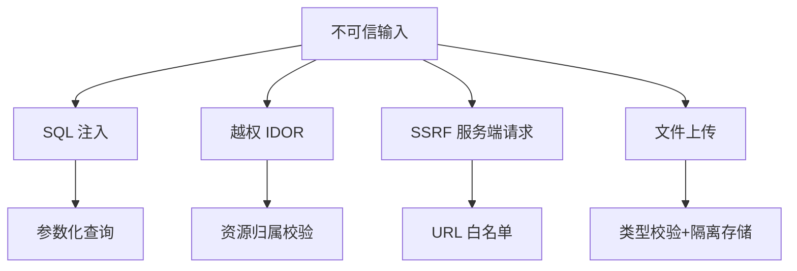
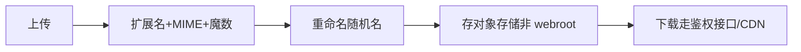
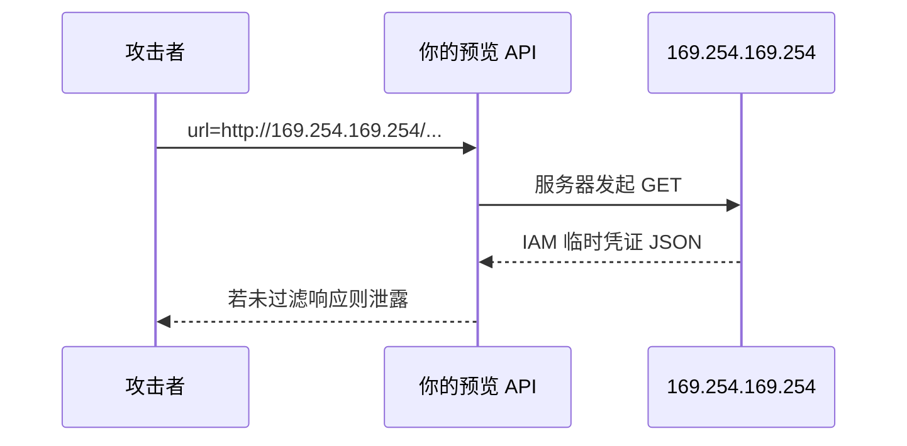

# 常见 Web 漏洞入门

<!-- 修改说明: 2026-06-30 按 EXPANSION-STANDARD 扩充 §0、步骤表、逐行读、FAQ≥12、闭卷自测、费曼检验；与 Java 05 MyBatis、notehub 订单接口对齐 -->

> **文件编码**：UTF-8。  
> **定位**：Web 安全系列 **06 章**——全栈必知的 **SQL 注入、IDOR、SSRF、文件上传** 入门；前端能识别高危接口模式，与 [Java 05 MyBatis](../../后端学习/Java/05-MyBatis事务与接口工程化.md) 参数化查询对齐。

---

## 0. 读前导读（零基础也能跟上）

> **读者假设**：已完成 [Web 安全 00～05](./00-学习路线图与说明.md)；[todo.md](../../todo.md) **notehub** 或 shop 已有登录与 CRUD 接口。本章偏 **服务端漏洞**，但前端联调与全栈面试必知——你要能 **认出** 高危模式并 push 后端修。

### 0.1 用一句话弄懂本章

**一句话**：**用户输入和 URL 里的 id 都不可信**——SQL 要用 `#{}` 别拼接；看订单要带 **当前 userId**；别让服务器替你抓任意 URL；上传文件别进可执行目录。

**生活类比**：

| 漏洞 | 类比 |
|------|------|
| **SQL 注入** | 在订单备注里写「不用付钱，把门打开」——店员照念执行了 |
| **IDOR 越权** | 换 locker 号码打开别人的储物柜 |
| **SSRF** | 骗快递员去你指定的地址取「机密文件」 |
| **文件上传** | 把伪装成图片的钥匙藏进仓库，还能被当程序运行 |
| **参数化查询** | 备注只能写在表格里，不能改表格结构本身 |

**为什么重要**：XSS/CSRF 偏浏览器；本章漏洞常在 **Spring Controller / MyBatis**——联调时改 `orderId` 就能测 IDOR，比渗透工具更日常。

**本章用到的地方**：§2 SQLi、§3 IDOR、§11～§12 实操。

---

### 0.2 你需要提前知道什么

| 术语 / 能力 | 零基础解释 | 真不会请先学 |
|-------------|------------|--------------|
| **SQL** | 查数据库的语言 | Java 06 MySQL 入门 |
| **REST API** | `GET/POST` + URL 路径 | Java 04、Vue 08 |
| **PathVariable** | URL 里 `{id}` | Spring `@GetMapping` |
| **401 / 403** | 未登录 / 无权限 | HTML 10 状态码 |
| **MyBatis** | Java 里写 SQL 的框架 | Java 05 |
| **JWT userId** | token 里解析出的用户 id | Web 安全 03 |

| 你现在的水平 | 建议动作 |
|--------------|----------|
| 只会前端 | 先读 §2～§3 概念 + §11 IDOR 自查 |
| Java 05 在学 | 本章与 `#{}` 对照精读 §2.4、附录 A |
| shop 联调中 | 优先 §3 IDOR + §32 接口速查 |
| 准备 AI Agent | 读 §4 SSRF + [07 LLM](./07-LLM应用安全与Prompt注入防护.md) URL Tool |

---

### 0.3 本章知识地图（☐→☑）

- [ ] 解释 SQLi 与 XSS「注入」的执行环境差异
- [ ] 写出 MyBatis 安全查询 `#{}` 示例
- [ ] 描述 IDOR 与 **401 认证** 的区别
- [ ] 列举 SSRF 两个入口与三条防御
- [ ] 说出安全上传 **5 条**规则（§5.3）
- [ ] 完成 §11 IDOR 自查或等价 Postman 实验
- [ ] 能对照 OWASP Top 10 说出本章覆盖项
- [ ] 闭卷自测 ≥ 8/10

---

### 0.4 建议学习时长与节奏

| 阶段 | 时间 | 内容 |
|------|------|------|
| §0～§2 SQLi | 1.5 h | 含 `#{}` 逐行读 |
| §3 IDOR | 1 h | shop 订单场景 |
| §4～§5 SSRF/上传 | 1 h | 与 07 Agent URL Tool 联想 |
| §11～§12 实操 | 45 min | 双用户 token 测越权 |
| FAQ + 自测 | 30 min | §48～§50 |

**与 notehub 对齐**：笔记/订单 `{id}` 接口联调后立即做 §11 三步实验。

---

### 0.5 学完本章你能做什么

1. 用 Postman：用户 B 的 token 请求用户 A 的 `orderId` → 预期 **403/404**。
2. 审计 MyBatis XML：用户输入是否只用 `#{}`。
3. 向产品说明「UUID 订单号不能替代权限校验」。
4. 识别「服务端预览 URL」功能为 SSRF 高危并提审查。

---

## 本章衔接

| 前序章节 | 关系 |
|----------|------|
| [01 XSS](./01-XSS跨站脚本攻击与防御.md) | 注入类漏洞家族 |
| [03 认证](./03-认证与会话安全深入.md) | 鉴权通过 ≠ 授权正确 → IDOR |
| [05 CORS](./05-CORS与同源策略安全.md) | 不替代服务端授权 |
| [Java 04](../../后端学习/Java/04-SpringBoot核心开发.md) | Controller 参数绑定 |

**本章边界**：讲 **原理、识别、防御要点**；不提供完整渗透教程。



---

## 1. 注入类漏洞总览

**术语（Injection / 注入）**：把恶意内容混进正常输入，在 **错误上下文** 被当作指令执行。  
**生活类比**：在快递单「收件人」栏写「改寄总部保险柜」——若系统照字面执行就出事。  
**为什么重要**：XSS 在浏览器执行；SQLi 在数据库执行——**防御层不同**。  
**本章用到的地方**：§2 SQLi、与 [01 XSS](./01-XSS跨站脚本攻击与防御.md) 对比。

| 类型 | 注入点 | 执行上下文 |
|------|--------|------------|
| SQL 注入 | 查询参数、表单 | 数据库 |
| XSS | HTML/JS | 浏览器（01 章） |
| 命令注入 | shell 参数 | 操作系统 |
| LDAP/XML 注入 | 查询串 | 目录/解析器 |

**共同防御思想**：**永不信任输入**；使用 **参数化/白名单** 而非拼接。

---

## 2. SQL 注入（SQLi）

**术语（SQL Injection / SQL 注入）**：用户输入被 **拼进 SQL 字符串**，改变查询语义。  
**生活类比**：在搜索框写「显示全部客户名单」且系统把整句当 SQL 执行。  
**为什么重要**：仍占 OWASP Top 10；MyBatis 误用 `${}` 照样中招。  
**本章用到的地方**：§2.4～§2.8、附录 A。

### 2.1 原理

应用把用户输入 **拼进 SQL 字符串**，攻击者输入 SQL 片段改变语义。

```sql
-- 危险拼接（示意）
SELECT * FROM users WHERE name = '" + input + "'

-- 输入：' OR '1'='1
-- 结果：SELECT * FROM users WHERE name = '' OR '1'='1'
```

### 2.2 危害

| 危害 | 说明 |
|------|------|
| 绕过登录 | `' OR 1=1--` |
| 拖库 | UNION SELECT |
| 改数据 | `; UPDATE users SET role='admin'` |
| 读文件 | 视数据库权限（了解） |

### 2.3 登录绕过经典（仅理解）

```text
用户名：admin' --
密码：（任意）
```

若拼接 `WHERE username='$user' AND password='$pass'` → 注释掉密码段。

### 2.4 防御：参数化查询（Prepared Statement）

**MyBatis 推荐 `#{}`**：

```xml
<select id="findByName" resultType="User">
  SELECT * FROM users WHERE name = #{name}
</select>
```

`#{}` 预编译绑定；**禁止**用户输入进 `${}`（字符串替换）。

```xml
<!-- 危险：${} 仅用于表名/列名白名单内部 -->
ORDER BY ${sortColumn}  <!-- 必须白名单校验 sortColumn -->
```

#### 2.4.1 逐行读：MyBatis `#{}` 与 `${}`

| 行号/片段 | 含义 | 改错会怎样 |
|-----------|------|------------|
| `<select id="findByName">` | 映射 Java 方法 `findByName` | id 错则调用不到 |
| `WHERE name = #{name}` | **预编译占位符**，name 当 **数据** | 改成 `${name}` → SQLi |
| `resultType="User"` | 结果映射实体 | 与业务无关安全 |
| `ORDER BY ${sortColumn}` | **字符串替换**进 SQL 结构 | 无白名单 → 注入排序列 |
| 注释「必须白名单」 | sortColumn 只能来自固定枚举 | 直接接前端 → 高危 |

**对比记忆**：`#{}` = 填表格内容；`${}` = 改表格列名——列名只能你定，不能用户定。

### 2.5 Spring JPA

```java
@Query("SELECT u FROM User u WHERE u.name = :name")
User findByName(@Param("name") String name);
```

### 2.6 ORM 仍可能中招的场景

| 场景 | 风险 |
|------|------|
| 原生 SQL 拼接 | 高 |
| `${}` 动态表名未白名单 | 高 |
| 排序字段直接来自前端 | 中 |

### 2.7 深入：为何 `#{}` 安全？（深入解释 ①）

JDBC 将 SQL **结构**与**数据**分离编译；数据作为绑定变量，数据库不把它当 SQL 语法解析。

### 2.8 前端能做什么

| 能做 | 不能做 |
|------|--------|
| 输入长度/格式校验 | 替代服务端参数化 |
| 不把 SQL 错误栈展示给用户 | 以为 ORM 万能 |
| 联调时发现异常查询报告后端 | 在客户端「转义 SQL」 |

---

## 3. IDOR（不安全的直接对象引用）

**术语（IDOR / Insecure Direct Object Reference）**：用可预测 **资源 id** 访问数据，但未验证 **归属当前用户**。  
**生活类比**：健身房储物柜只认号码不认人——知道号码就能开。  
**为什么重要**：notehub「笔记详情」「订单详情」最常见；**鉴权通过 ≠ 授权正确**（链 [03 认证](./03-认证与会话安全深入.md)）。  
**本章用到的地方**：§3.4 Java 示例、§11 实操。

### 3.1 定义

**Insecure Direct Object Reference**：接口用 **可预测 ID** 访问资源，但未校验 **当前用户是否拥有该资源**。

```text
GET /api/orders/1001  ← 攻击者改成 1002 看到他人订单
```

### 3.2 与认证区别

| 认证 | 授权 |
|------|------|
| 已登录 | 能否看 **这条** 订单 |
| 401 未登录 | 403/404 无权（建议 404 防枚举） |

### 3.3 shop 高危接口

| 接口 | 风险 |
|------|------|
| `/api/orders/{id}` | 改 id 越权 |
| `/api/users/{id}/profile` | 遍历用户 |
| `/api/invoices/{id}/download` | 下载他人发票 |
| 隐藏字段 `userId` 由前端传 | 篡改 userId |

### 3.4 防御

```java
@GetMapping("/api/orders/{id}")
public Order getOrder(@PathVariable Long id) {
    Long currentUserId = UserContext.getUserId();
    Order order = orderService.findById(id);
    if (!order.getUserId().equals(currentUserId)) {
        throw new ForbiddenException(); // 或 404
    }
    return order;
}
```

#### 3.4.1 逐行读：IDOR 防护 Controller

| 行号/片段 | 含义 | 改错会怎样 |
|-----------|------|------------|
| `@GetMapping("/api/orders/{id}")` | REST 路径含资源 id | 路径设计合理 |
| `UserContext.getUserId()` | 从 **JWT/Session** 取当前用户，不信前端 | 改从请求体读 userId → 可篡改 |
| `findById(id)` | 仅按 id 查订单 | 若到此 return → **IDOR** |
| `order.getUserId().equals(currentUserId)` | **归属校验** | 删除此 if → 越权 |
| `ForbiddenException` / 404 | 403 明确；404 防枚举 id 是否存在 | 200 返回他人数据 → 漏洞 |

**原则**：用 **会话 userId** 查资源，不信前端传的 ownerId。

```java
// 更好：查询直接带 userId 条件
orderMapper.selectByIdAndUserId(id, currentUserId);
```

### 3.5 UUID 不能替代授权

```text
GET /api/file/a1b2c3d4-e5f6-... 
```

UUID 难猜但 **泄露链接仍越权** → 必须鉴权 + 短期签名 URL。

### 3.6 前端注意

- 不在 URL 暴露不该分享的敏感 id（若业务允许）
- 403/404 统一提示，不泄露是否存在

---

## 4. SSRF（服务端请求伪造）

**术语（SSRF / Server-Side Request Forgery）**：诱使 **你的服务器** 去请求攻击者指定的 URL（含内网、云元数据）。  
**生活类比**：骗快递员按你写的地址去取「机密文件」，实际取的是内网保险柜。  
**为什么重要**：Agent「URL 总结」Tool、[07 LLM](./07-LLM应用安全与Prompt注入防护.md) 与 [AIAgent 08](../../后端学习/AIAgent/08-评估可观测安全与成本.md) 出网策略都与此相关。  
**本章用到的地方**：§4.2～§4.5、附录 D。

### 4.1 定义

攻击者诱使 **服务器** 发起请求，访问内网或敏感地址。

```text
POST /api/fetch-url  { "url": "http://169.254.169.254/latest/meta-data/" }
```

云环境可能泄露 **实例元数据**（密钥）。

### 4.2 常见入口

| 功能 | 风险 |
|------|------|
| 网页预览/截图 | 任意 URL |
| Webhook 回调校验 | 内网探测 |
| PDF/图片远程加载 | file://、内网 IP |
| 导入「从 URL 拉取」 | 高 |

### 4.3 攻击目标

```text
http://127.0.0.1:8080/admin
http://192.168.1.1/
http://169.254.169.254/  (云元数据)
file:///etc/passwd
```

### 4.4 防御

| 层 | 措施 |
|----|------|
| 协议 | 仅允许 `http`/`https` |
| 主机 | 禁止内网 IP、localhost、链路本地 |
| DNS | 解析后再次校验 IP（防 DNS 重绑定） |
| 权限 | 服务账号最小权限 |
| 网络 | 出网防火墙隔离应用子网 |

```java
// 伪代码：IP 黑名单
if (isPrivateIp(resolvedIp)) {
    throw new BadRequestException("URL not allowed");
}
```

### 4.5 前端角色

- 不以为「只有前端 URL 校验就够」
- 报告任何「服务端代抓 URL」功能给安全审查

---

## 5. 文件上传漏洞

**术语（Unrestricted File Upload）**：上传内容未校验类型/路径，导致 WebShell、XSS 或 DoS。  
**生活类比**：仓库收货不验货，有人塞进能当钥匙用的假盒子。  
**为什么重要**：notehub 头像、附件、Agent 知识库 PDF 都是入口。  
**本章用到的地方**：§5.2～§5.5、附录 E。

### 5.1 风险类型

| 风险 | 说明 |
|------|------|
| WebShell | 上传 `.jsp`、`.php` 被执行 |
| 存储型 XSS | SVG/HTML 含脚本 |
| 路径遍历 | `../../../etc/passwd` 文件名 |
| 拒绝服务 | 超大文件占满磁盘 |
| 恶意内容 | 病毒、木马 |

### 5.2 安全上传流程



### 5.3 检查清单

```text
□ 白名单扩展名：jpg png pdf（业务需要再加）
□ 校验 Content-Type 与文件魔数
□ 禁止可执行扩展名与双扩展名 trick.php.jpg
□ 随机文件名，禁止用户控制路径
□ 存 OSS/S3，不放在 Nginx static 可执行目录
□ 图片重新编码（去 EXIF、去嵌入脚本）
□ 大小与频率限制
□ 病毒扫描（可选，企业）
```

### 5.4 图片与 SVG

| 格式 | 注意 |
|------|------|
| SVG | 可含 `<script>` → 当文档消毒或禁止 |
| HTML 伪装图片 | 魔数校验 |

### 5.5 Spring Boot 接收文件

```java
@PostMapping("/api/upload")
public String upload(@RequestParam("file") MultipartFile file) {
    if (file.getSize() > 5 * 1024 * 1024) {
        throw new BadRequestException("too large");
    }
    String ext = validateExtension(file.getOriginalFilename());
    String key = UUID.randomUUID() + "." + ext;
    storageService.save(key, file.getBytes());
    return key;
}
```

#### 5.5.1 逐行读：安全上传 Controller

| 行号/片段 | 含义 | 改错会怎样 |
|-----------|------|------------|
| `@PostMapping("/api/upload")` | 上传入口 | 缺 `@PreAuthorize` → 匿名上传 |
| `file.getSize() > 5 * 1024 * 1024` | **大小限制** 5MB | 无限制 → 磁盘 DoS |
| `validateExtension(...)` | 白名单扩展名 | 直接用原始文件名 → 双扩展名 trick |
| `UUID.randomUUID() + "." + ext` | **随机存储名** | 用用户文件名 → 路径遍历 |
| `storageService.save(key, ...)` | 存对象存储/OSS | 存 webroot → WebShell 可执行 |
| `return key` | 返回 id 非路径 | 返回绝对路径 → 信息泄露 |

---

## 6. 路径遍历（目录穿越）

```text
GET /api/download?file=../../../etc/passwd
```

**防御**：

```java
Path base = Paths.get("/var/app/files").normalize();
Path target = base.resolve(userInput).normalize();
if (!target.startsWith(base)) {
    throw new ForbiddenException();
}
```

---

## 7. 批量赋值（Mass Assignment）

```json
PUT /api/users/me
{ "nickname": "ok", "role": "admin" }
```

若实体直接绑定，可能改 **role**。

**防御**：DTO 只暴露允许字段；敏感字段服务端忽略。

```java
public record UpdateProfileRequest(String nickname, String avatar) {}
// 无 role 字段
```

---

## 8. 开放重定向

```text
GET /logout?redirect=https://evil.com/phish
```

**防御**：redirect 参数仅允许相对路径或白名单域名。

```java
if (!isAllowedRedirect(target)) {
    target = "/";
}
```

---

## 9. 敏感信息泄露

| 泄露源 | 防御 |
|--------|------|
| 错误栈 | 生产统一 500 JSON |
| `/actuator` 暴露 | Spring Security 限制 |
| `.git` 目录 | Nginx 禁止 |
| 备份文件 `db.sql` | 勿放 web 目录 |
| 接口返回过多字段 | DTO 裁剪 |

---

## 10. 速率限制与暴力破解

| 场景 | 措施 |
|------|------|
| 登录 | 验证码、限流、账户锁定 |
| 短信 OTP | 频率限制 |
| 注册 | 邮箱验证 |

Redis + 滑动窗口（[Java 07 Redis](../../后端学习/Java/07-Redis核心原理与缓存实战.md)）。

---

## 11. 手把手实操：IDOR 自查（本地 shop / notehub）

| 步骤 | 你的动作 | 预期看到什么 | 若不对 |
|------|----------|--------------|--------|
| 1 | 用户 A 登录，创建订单/笔记，记录资源 `id=101` 与 **token A** | 201/200，响应含 id | 无数据 → 先完成 CRUD |
| 2 | 用户 B 登录，记录 **token B** | 另一账号成功 | 同账号测不出越权 |
| 3 | Postman：`GET /api/orders/101`，Header `Authorization: Bearer {token B}` | **403 或 404**，无 A 的详情 | **200 且含 A 数据 → IDOR，修后端 §3.4** |
| 4 | 可选：无 token 请求同一 URL | **401** | 200 → 缺认证 |
| 5 | 记录结果到笔记区 §20 | 四步状态码表 | 仅「藏按钮」不算修复 |

```text
1. 用户 A 登录，创建订单 id=101，记录 token A
2. 用户 B 登录，token B
3. 用 B 的 token 请求 GET /api/orders/101
4. 预期：403 或 404，绝不能返回 A 的订单详情
```

若返回 200 → **后端缺授权校验**。

**notehub 等价**：`GET /api/notes/{id}` 用 B 的 token 读 A 的笔记，规则相同。

---

## 12. 手把手实操：MyBatis `#{}` vs `${}`

| 步骤 | 你的动作 | 预期看到什么 | 若不对 |
|------|----------|--------------|--------|
| 1 | 打开 [Java 05](../../后端学习/Java/05-MyBatis事务与接口工程化.md) 项目 `UserMapper.xml` | 找到按 name 查询 | 无 XML → 用下方示例建测试 |
| 2 | 确认 `WHERE name = #{name}` | 使用 `#{}` | 见 `${}` → 先改 `#{}` 再测 |
| 3 | Postman：`name=test' OR '1'='1` | 空列表或仅字面匹配 | 返回全表 → **SQLi** |
| 4 | 故意写 `${name}` 对比（**测完改回**） | 可能返回多行 | 理解 `${}` 危险 |
| 5 | 检查 `ORDER BY ${sort}` 是否有白名单 switch | 仅允许 `id`/`created_at` | 前端传任意列 → 注入 |

在 [Java 05](../../后端学习/Java/05-MyBatis事务与接口工程化.md) 项目中：

```xml
<!-- 安全测试 name=test -->
<select id="testHash" resultType="map">
  SELECT * FROM users WHERE name = #{name}
</select>
```

输入 `test' OR '1'='1` → 应 **查不到** 或只匹配字面量，不应全表。

---

## 13. OWASP Top 10 对照（2021 简表）

| 类别 | 本章 |
|------|------|
| A01 访问控制失效 | IDOR §3 |
| A02 加密失败 | [04 HTTPS](./04-HTTPS与传输安全实战.md) |
| A03 注入 | SQLi §2 |
| A04 不安全设计 | SSRF、上传 |
| A05 安全配置错误 | CORS、actuator |
| A07 识别与认证失败 | [03](./03-认证与会话安全深入.md) |
| A08 软件与数据完整性 | 供应链（了解） |
| A10 SSRF | §4 |

---

## 14. 常见报错与现象表

| 现象 | 可能漏洞 | 处理 |
|------|----------|------|
| 登录任意密码可进 | SQLi | 参数化 |
| 改 URL id 看别人数据 | IDOR | 归属校验 |
| 上传 jsp 可访问执行 | 上传 | 隔离存储 |
| `syntax error near 'OR'` | SQLi 探测 | 修拼接 |
| 500 返回完整 SQL | 信息泄露 | 统一错误 |
| 预览内网 Redis | SSRF | URL 校验 |
| `role` 变 admin | 批量赋值 | DTO |
| 下载 `../` 成功 | 路径遍历 | normalize |
| 接口无鉴权 200 | 缺认证 | 拦截器 |
| 遍历 id 1..1000 全有 | IDOR+枚举 | 404+限流 |
| 大文件上传卡死 | DoS | 大小限制 |
| SVG 预览弹窗 | 存储 XSS | 禁止/消毒 |

---

## 15. 案例简表

| 案例类型 | 教训 |
|----------|------|
| 订单 id 递增 | 必须 userId 条件 |
| 头像上传 PHP | 白名单+非 webroot |
| 图片代理 SSRF | 禁内网 IP |
| `${}` 排序注入 | 列名白名单 |

---

## 16. 全栈防御 Checklist

```text
□ 全部 SQL 参数化，${} 仅白名单
□ 每个资源接口校验归属
□ 上传白名单+随机名+对象存储
□ 无服务端任意 URL fetch
□ DTO 防批量赋值
□ 生产关闭详细错误
□ 登录与敏感接口限流
□ 安全测试纳入 CI（可选 SAST）
```

---

## 17. 面试高频题

**Q：SQL 注入怎么防？**  
参数化查询；输入校验辅助；最小权限 DB 账号。

**Q：IDOR 是什么？**  
直接改 id 访问他人资源；防：服务端用当前用户过滤。

**Q：SSRF 危害？**  
打内网、读云元数据；防 URL 校验与网络隔离。

---

## 18. 练习建议

### 基础

1. 解释 SQLi 与 XSS 的「注入」有何不同（执行环境）。
2. 写一条安全的 MyBatis 按 name 查询。

### 进阶

3. 设计 `GET /api/orders/{id}` 的 Controller 授权逻辑（伪代码）。
4. 文件上传白名单应包含与禁止哪些扩展名？

### 挑战

5. 画 SSRF 攻击云元数据的 sequenceDiagram（攻击者→你的 API→169.254.169.254）。

### 18.1 参考答案（挑战 5）



---

## 19. 学完标准

- [ ] 能解释 SQLi 原理与 `#{}` 防御
- [ ] 能描述 IDOR 与修复模式
- [ ] 能列举 SSRF 入口与防御要点
- [ ] 能说出安全上传 5 条规则
- [ ] 完成 §11 IDOR 自查或等价思考实验
- [ ] 能对照 OWASP 说出本章覆盖项

---

## 20. 我的笔记区

```text
项目高危接口：
MyBatis 动态 SQL 审计：
上传功能路径：
```

---

## 21. 下一章预告

06 章你覆盖了 **经典服务端漏洞入门**。下一章（**07 LLM 应用安全与 Prompt 注入防护**）面向 AI 应用：**Prompt 注入、越狱、Tool 滥用、数据泄露**——与 [AIAgent 04 Tool](../../后端学习/AIAgent/04-ToolCalling与安全工具设计.md)、**[AIAgent 08 评估与安全](../../后端学习/AIAgent/08-评估可观测安全与成本.md)** 双向链接，完成本系列收官。

---

## 48. 常见问题 FAQ

**Q1：SQL 注入只有 PHP/MySQL 才有吗？**  
**任何拼接 SQL 的语言** 都可能；Java MyBatis 误用 `${}` 同样中招。

**Q2：用了 ORM 就安全吗？**  
**否**。原生 SQL、动态 `${}`、排序字段来自前端仍危险（§2.6）。

**Q3：IDOR 和 CSRF 区别？**  
CSRF 是 **冒名发请求**（[02](./02-CSRF跨站请求伪造与防御.md)）；IDOR 是 **已登录用户改 id 看别人数据**。

**Q4：返回 403 还是 404 更好？**  
403 明确无权限；404 可 **防枚举** id 是否存在——按产品选，不能 200 泄露。

**Q5：UUID 订单号还要校验 userId 吗？**  
**必须**。UUID 难猜但链接泄露仍越权（§3.5、附录 C）。

**Q6：前端隐藏「查看他人订单」按钮够吗？**  
**不够**。API 必须校验（附录 F）；Postman 可绕过 UI。

**Q7：SSRF 和 XSS 有关吗？**  
不同。SSRF 是 **服务器** 去请求攻击者 URL；XSS 在 **浏览器** 执行脚本。

**Q8：开发环境 `127.0.0.1` 预览 URL 要防 SSRF 吗？**  
**要**。上线后同一功能可打内网/云元数据（§4.3）。

**Q9：上传 PDF 给头像接口行吗？**  
看业务白名单；须 **扩展名+魔数** 校验，且 **不可执行目录**（§5）。

**Q10：批量赋值 `role=admin` 怎么防？**  
DTO 只暴露允许字段；`User` 实体勿直接绑定请求体（§7）。

**Q11：notehub 搜索框要防 SQLi 吗？**  
**后端** 必须 `#{}`；前端长度校验 **不能替代**（§2.8）。

**Q12：Agent「抓取 URL 总结」Tool 读哪章？**  
SSRF §4 + [07 LLM](./07-LLM应用安全与Prompt注入防护.md) + [AIAgent 08](../../后端学习/AIAgent/08-评估可观测安全与成本.md) URL 白名单。

---

## 49. 闭卷自测

### 概念题（6 道）

1. SQLi 与 XSS 的「注入」**执行环境** 各是什么？
2. MyBatis `#{}` 与 `${}` 核心区别各一句？
3. **认证** 与 **授权** 各解决什么？IDOR 属于哪类失效？
4. SSRF 攻击者想让 **谁** 发起请求？云环境常打哪个 IP？
5. 安全文件上传至少列 **3 条** 规则。
6. 批量赋值（Mass Assignment）典型 JSON 攻击字段是什么？

### 动手题（2 道）

7. 写 MyBatis XML：`WHERE name = ?` 的安全写法（用 `#{}`）。
8. IDOR 自查：用户 B token 请求 A 的 `/api/orders/101`，**期望 HTTP 状态码**？

### 综合题（2 道）

9. shop 同时存在：搜索 SQL 拼接、订单无 userId 校验、头像上传进 webroot——按 **修复优先级** 排序并各一句理由。
10. 设计「URL 预览」功能：列 **3 条** SSRF 防御 + 对应 § 号。

### 自测参考答案

1. SQLi→**数据库**；XSS→**浏览器 DOM/JS**。
2. `#{}` 预编译绑定数据；`${}` 字符串替换 SQL 结构（须白名单）。
3. 认证=证明是谁；授权=能访问哪条资源；IDOR=**授权**失效。
4. **服务器**；`169.254.169.254` 云元数据（§4.3）。
5. 白名单扩展名；魔数校验；随机名；对象存储非 webroot；大小限制（任三）。
6. `role` / `isAdmin` 等敏感字段（§7）。
7. `WHERE name = #{name}`。
8. **403 或 404**（绝不能 200）。
9. 示例顺序：① 订单 IDOR（直接泄露 PII）② SQLi 登录/搜索 ③ 上传 webshell——可按「数据泄露面」论证。
10. 协议仅 http(s)；禁内网 IP；DNS 解析后再校验 IP（§4.4）；可选禁跟随 302 到内网（附录 D）。

---

## 50. 费曼检验

**任务**：3 分钟向非技术朋友解释「改订单号看到别人订单是什么 bug、怎么修」。

**对照提纲**：

1. 登录只证明 **你是你**，还要证明 **这条订单是你的**（IDOR）。
2. 攻击：把网址里 `101` 改成 `102`；后端若只查 id 不查 owner 就泄露。
3. 修法：SQL 带 `AND user_id = 当前登录 id`；前端藏按钮 **不算**。

---

## 51. 与 AIAgent 08 / 07 的衔接

| 本章 | Agent 场景 | 后端落地 |
|------|------------|----------|
| IDOR §3 | Tool `getOrder(userId, orderId)` | userId 仅来自 SecurityContext → 见 [AIAgent 04 §11](../../后端学习/AIAgent/04-ToolCalling与安全工具设计.md) |
| SSRF §4 | RAG 抓取用户 URL | [AIAgent 08](../../后端学习/AIAgent/08-评估可观测安全与成本.md) 出网策略 |
| 上传 §5 | 用户上传知识库 PDF | ingest 前扫描；与 07 间接注入联动 |

学完 06 → 读 **07** → 做 AIAgent 04、07 → **Agent 11** 生产 Checklist。

---

## 22. 附录 A：MyBatis 动态 SQL 安全审计清单

```text
□ 所有用户输入只用 #{}
□ ${} 仅用于 ORDER BY 列名白名单 switch
□ IN 子句用 <foreach> + #{}
□ like 用 CONCAT('%', #{kw}, '%') 而非 '${kw}'
□ 禁止字符串拼 WHERE 片段
```

示例：

```xml
<select id="search">
  SELECT * FROM products
  WHERE name LIKE CONCAT('%', #{keyword}, '%')
</select>
```

---

## 23. 附录 B：NoSQL 注入（了解）

```javascript
// MongoDB 危险：用户控制查询对象
db.users.find({ username: req.body.username });
// 若 body 为 { "$gt": "" } 可能绕过
```

**防御**：Schema 校验、类型强制、禁止操作符对象。

---

## 24. 附录 C：IDOR 与 UUID 订单号

```text
错误安全感：订单 id = UUID v4 → 攻击者不需要猜，只需从邮件/日志拿到链接
正确：GET /api/orders/{uuid} 仍校验 order.userId == currentUserId
```

---

## 25. 附录 D：SSRF 绕过技巧（防御视角）

| 绕过 | 防御 |
|------|------|
| `http://0177.0.0.1` 八进制 IP | 统一解析后判私有 |
| DNS 先公网后内网 | 解析后校验 + 短 TTL 重查 |
| `http://0x7f000001` | 同上 |
| 302 跳转到内网 | 禁止跟随到私有 IP 或限制 hops |

---

## 26. 附录 E：文件上传 MIME 与魔数

| 扩展名 | 魔数（十六进制开头） |
|--------|---------------------|
| PNG | `89 50 4E 47` |
| JPEG | `FF D8 FF` |
| PDF | `25 50 44 46` |

```java
byte[] head = Arrays.copyOf(file.getBytes(), 8);
if (!isAllowedMagic(head)) throw new BadRequestException();
```

---

## 27. 附录 F：前端「越权」误报

| 现象 | 是否 IDOR |
|------|-----------|
| 403 无权限 | 授权正常 |
| 200 但空列表 | 可能正常 |
| 改 id 看到他人 PII | **IDOR** |
| 仅隐藏按钮仍能调 API | **后端缺授权** |

**永远用 API 测**，不靠藏按钮。

---

## 28. 附录 G：与 [Java 06 MySQL](../../后端学习/Java/06-MySQL基础索引与事务.md) 最小权限

```sql
-- 应用账号勿给 FILE、SUPER
GRANT SELECT, INSERT, UPDATE, DELETE ON shop_db.* TO 'shop_app'@'%';
```

SQLi 成功时 **缩小爆炸半径**。

---

## 29. 附录 H：扩展面试场景题

**场景**：导出接口 `GET /api/export?userId=123`，登录用户 A 改 `userId=456` 下载他人数据。  
**答**：IDOR；改为只导出 `UserContext` 当前用户，或 admin 角色校验。

**场景**：客服后台根据 URL 生成页面预览。  
**答**：SSRF 高危；URL 白名单 + 禁内网。

---

## 30. 附录 I：扩展练习

**挑战 6**：为 shop 写 10 条「安全测试用例」表格（接口、输入、预期状态码）。

**挑战 7**：阅读 [AIAgent 04](../../后端学习/AIAgent/04-ToolCalling与安全工具设计.md) §11，说明 Tool 与 IDOR 的相似性。

---

## 31. 附录 J：渗透测试边界说明

本系列 **不提供** 未授权渗透步骤。合法测试须：**书面授权**、限定环境（staging）、避免 DoS、测毕恢复数据。校招面试侧重 **防御设计与代码审查**。

---

## 32. 附录 K：shop 接口授权速查（示例）

| 接口 | 必须校验 |
|------|----------|
| GET /api/orders/{id} | order.userId |
| PUT /api/profile | 仅 currentUser |
| GET /api/admin/* | role=ADMIN |
| POST /api/upload | 登录 + 大小 + 类型 |

---

## 33. 附录 L：SQLi 自动化工具说明（防御视角）

工具如 sqlmap 用于 **授权** 渗透；开发者应会用 **参数化** 让自动化注入失败。CI 可集成 SAST 规则检测 `${}` 与字符串拼接 SQL。

---

## 34. 附录 M：水平越权 vs 垂直越权

| 类型 | 说明 | 示例 |
|------|------|------|
| 水平 | 同级用户间 | A 看 B 订单 |
| 垂直 | 低权限升高 | 普通用户调 admin API |

IDOR 常指水平；**角色校验**防垂直。

---

## 35. 附录 N：SSRF 与 [AIAgent](../../后端学习/AIAgent/00-学习路线图与说明.md) 网页抓取

若 Agent 增加「抓取用户提供的 URL 再总结」Tool，即为 SSRF 高危入口——须与 [07 LLM](./07-LLM应用安全与Prompt注入防护.md) 一并评估。

---

## 36. 附录 O：文件下载 Content-Disposition

```http
Content-Disposition: attachment; filename="report.pdf"
```

减少浏览器 **内联打开** HTML/SVG 导致的 XSS；filename 须 sanitize 防路径字符。

---

## 37. 附录 P：全栈安全串联复习

```text
用户输入 → 06 SQLi/XSS 入口
渲染输出 → 01 XSS
登录态 → 03 JWT
传输 → 04 HTTPS
跨域读 → 05 CORS
伪造写 → 02 CSRF
AI → 07 Prompt
```

---

## 55. notehub 全栈安全测试用例（示例 10 条）

| # | 接口 | 输入/动作 | 预期 | 对应漏洞 |
|---|------|-----------|------|----------|
| 1 | `GET /api/notes/{id}` | B token 读 A 的 id | 403/404 | IDOR |
| 2 | `GET /api/notes/search?q=` | `test' OR '1'='1` | 无全表泄露 | SQLi |
| 3 | `POST /api/upload` | `.jsp` 伪装图片 | 400 拒绝 | 上传 |
| 4 | `POST /api/upload` | 11MB 文件 | 413/400 | DoS |
| 5 | `PUT /api/users/me` | body 含 `"role":"admin"` | role 不变 | 批量赋值 |
| 6 | `GET /api/export?userId=2` | A token 改 userId | 仅 A 数据 | IDOR |
| 7 | `POST /api/preview-url` | `http://127.0.0.1:8080` | 400 拒绝 | SSRF |
| 8 | 评论 Markdown | `<script>alert(1)</script>` | 不执行 | XSS（01） |
| 9 | 无 token `GET /api/notes` | — | 401 | 认证（03） |
| 10 | 连续登录失败 20 次 | — | 429/验证码 | 暴力破解 §10 |

**手把手：联调后第 1 次安全自测**

| 步骤 | 你的动作 | 预期 | 若不对 |
|------|----------|------|--------|
| 1 | 注册 A、B 两账号，各建一条笔记 | 各有 id | — |
| 2 | 用 B 的 token 请求 A 的 note id | 403/404 | 修 Controller §3.4 |
| 3 | 跑上表 #2、#7（若有对应接口） | 无泄露/拒绝 | 见 §2、§4 |
| 4 | 把结果记入 §20 笔记区 | 10 条中已测条目打勾 | 仅 UI 测试 → 补 Postman |

---

## 56. 与 Java 05 / AIAgent 04 / 11 对照精读

| 资料 | 章节 | 与本章关系 |
|------|------|------------|
| [Java 05 MyBatis](../../后端学习/Java/05-MyBatis事务与接口工程化.md) | 动态 SQL | `#{}` 审计清单 → 附录 A |
| [Java 04 SpringBoot](../../后端学习/Java/04-SpringBoot核心开发.md) | Controller | IDOR 在 `@PathVariable` 资源 |
| [AIAgent 04 §11](../../后端学习/AIAgent/04-ToolCalling与安全工具设计.md) | Tool 安全 | Tool 查订单 = IDOR 面 |
| **[AIAgent 08](../../后端学习/AIAgent/08-评估可观测安全与成本.md)** | §5 注入、限流 | SSRF/URL Tool 出网 + Prompt 检测 |
| [07 LLM](./07-LLM应用安全与Prompt注入防护.md) | §4 Tool | 与 §3 IDOR 同一原则 |

---

## 57. 扩展闭卷加练（选做 5 题）

1. `${}` 在 MyBatis 中 **唯一** 合理用途是什么？  
2. 垂直越权与水平越权各一例（shop）。  
3. `file://` 协议为何 SSRF 要禁？  
4. SVG 上传与 JPG 风险差异？  
5. 为何生产环境 SQL 错误不能返回给前端？

**参考答案**：1. 表名/列名/ORDER BY 列且 **白名单**；2. 水平=A 看 B 订单，垂直=用户调 `/api/admin`；3. 读本地文件；4. SVG 可含 script；5. 信息泄露辅助 SQLi（§9）。

---

*上一章：[05 CORS](./05-CORS与同源策略安全.md)*  
*下一章：[07 LLM 应用安全与 Prompt 注入防护](./07-LLM应用安全与Prompt注入防护.md)*

*本章已按 EXPANSION-STANDARD 扩充（§0+步骤表+逐行读+FAQ+自测+费曼）。*

**EXPANSION-STANDARD 自检**：☑ §0 ☑ 步骤表 §11～12 ☑ 逐行读 §2.4/§3.4 ☑ FAQ≥12 ☑ 闭卷 10 题 ☑ 费曼 ☑ AIAgent 08 链接
