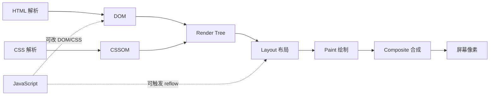
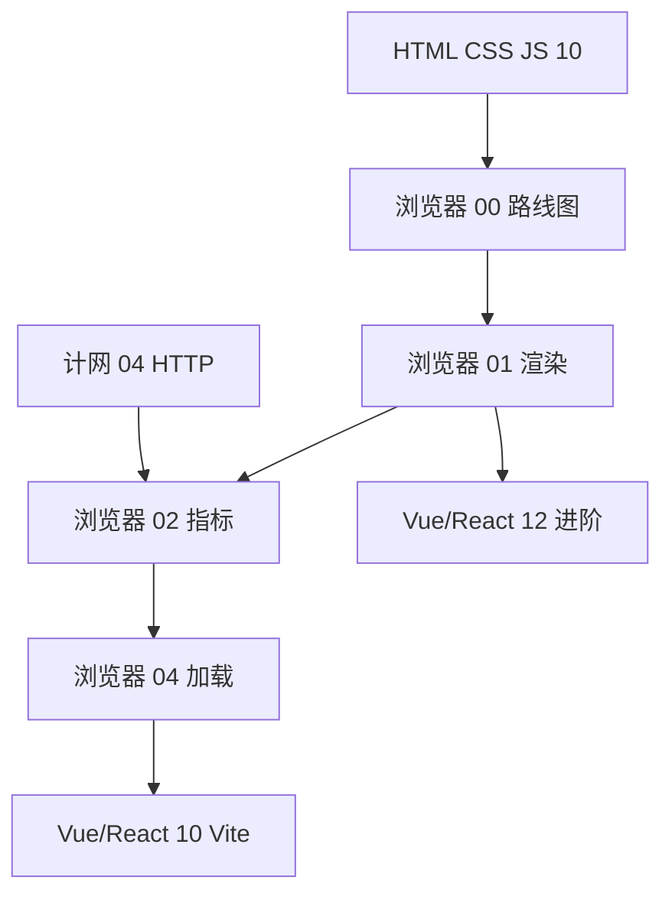

# 浏览器与性能学习路线图与说明

<!-- 修改说明: 2026-06-30 按 EXPANSION-STANDARD 扩充 §0（+200 行导读）、DevTools 步骤表、FAQ 12 题、闭卷自测、费曼检验；全系列 7/7 收官 -->

> **文件编码**：本文件夹内所有 `.md` 均为 **UTF-8**。终端与编辑器建议 UTF-8；PowerShell / VS Code / Cursor 右下角确认编码。

---

## 0. 读前导读（零基础也能跟上）

> **读者假设**：已学过 [HTML CSS JS 10](../HTML%20CSS%20JS/10-浏览器HTTP网络与Web基础.md) 或正在并行；能 F12 打开 DevTools；即将或正在学 [Vue 10](../Vue/10-Vite构建与项目部署.md)
### 0.1 用一句话弄懂本系列

**一句话**：浏览器与性能 = 搞清「页面从 HTML 到屏幕像素**怎么画**、**多快算好**、**怎么查瓶颈**」——为 Vite 构建、shop 首屏优化和面试「前端性能」打底。

**生活类比——开餐厅上菜**：

| 性能概念 | 生活类比 | 系列章节 |
|----------|----------|----------|
| **DOM/CSSOM** | 厨房按菜单备料、按配方调味 | 01 |
| **Reflow/Repaint** | 换桌布要重新摆桌（贵）vs 只换花瓶（便宜） | 01、05 |
| **LCP** | 客人多久看到「主菜」上桌 | 02 |
| **CLS** | 菜还没放好桌子就晃了 | 02 |
| **INP** | 按服务铃多久有人应 | 02、05 |
| **code split** | 先上冷盘，热菜做好再端 | 04 |
| **debounce** | 客人连按铃只算最后一次 | 05 |

**为什么重要**：后端 API 200ms 但首屏 5 秒——多半是 JS 阻塞、大图未优化或 layout 过多；不懂浏览器流水线会误改 `setTimeout` 越改越乱。

### 0.2 你需要提前知道什么（零基础解释列）

| 术语 / 能力 | 零基础解释 | 真不会请先学 |
|-------------|------------|--------------|
| **DOM** | 浏览器把 HTML 变成的可改树结构 | HTML CSS JS 01～03 |
| **F12 / DevTools** | 浏览器开发者工具，看网络与性能 | HTML 10 §17 |
| **HTTP / 缓存** | 资源怎么下载、第二次能不能省流量 | 计网 04、06 |
| **Vue/React 组件** | 页面拆成可复用块（可选） | Vue 00～02 |
| **npm run build** | 把源码打成上线用的 JS/CSS 文件 | Vue 10 预习 |

| 你现在的水平 | 建议动作 |
|--------------|----------|
| 连 DOM 都没操作过 | ⏸ 先 HTML 01～09 |
| 学完 HTML 10 | ✅ 00 通读 + 01 渲染 |
| **Vue/React 10 构建前** | ✅ **01～04 必完成** |
| 面试前 | ✅ 06 总表 + 计网 07 联合复习 |

### 0.3 本章知识地图（00 路线图学完后 ☐→☑）

- [ ] 能说出本系列 01～06 各章一句话主题
- [ ] 能说明与 HTML 10、计网、Vue 10 的分工
- [ ] 能对照 shop-vue 在 01～05 各章的优化落点
- [ ] 独立跑通 Lighthouse Performance 并读出 LCP
- [ ] 完成 §13 DevTools 七步实操
- [ ] 闭卷自测 ≥ 8/10

### 0.4 建议学习时长与节奏

| 阶段 | 时间 | 内容 |
|------|------|------|
| 00 路线图 | 1 h | 本文 + §13 Lighthouse |
| 01 渲染 | 2.5 h | CRP、reflow、Performance 对比 |
| 02 指标 | 2 h | CWV、Lighthouse 读报告 |
| 03 DevTools | 2.5 h | 火焰图、Network、联合排查 |
| 04 加载 | 2.5 h | lazy、split、preload |
| 05 运行时 | 2 h | debounce、虚拟列表、Memory |
| 06 面试 | 1.5 h | 40+ 题 + 7 天计划 |

**最佳窗口**：HTML 10 后开 01；**Vue/React 10 前必须完成 01～04**。

### 0.5 学完 00 你能做什么

1. 向队友解释「为什么 API 快但首屏慢」——可能是 LCP 资源或 JS 阻塞，不是 Axios。
2. 打开 Lighthouse，读出 LCP、CLS 数值并找到 LCP 元素。
3. 列出 01～06 学习顺序及每章产出物（见 §5.1）。
4. 在 shop-vue 场景下指出至少 3 个性能优化落点。

### 0.6 全系列 01～06 章速览

| 章 | 一句话主题 | 学完应能产出 | 与 shop 关系 |
|----|------------|--------------|--------------|
| **01 渲染** | HTML/CSS 怎么变成像素 | 手绘 CRP 四步 | reflow vs transform |
| **02 指标** | 多快算好（LCP/INP/CLS） | Lighthouse 解读 | Banner LCP 定位 |
| **03 DevTools** | 怎么查瓶颈 | 30s Performance 报告 | Long Task 定位 |
| **04 加载** | 资源何时到 | split + preload 验证 | 首包 chunk 对比 |
| **05 运行时** | 到了之后为何还卡 | debounce + Memory 快照 | 搜索/长列表 |
| **06 面试** | 40+ 题 + 自评 | 2 分钟讲首屏优化 | 考前速览 |

### 0.7 shop-vue 性能里程碑（与 Vue 10 对齐）

| Vue 进度 | 浏览器必读 | 当天验证 |
|----------|------------|----------|
| 08 联调后 | 02～03 指标 + DevTools | Lighthouse 跑 `/` |
| **10 构建前** | **01～04 全文** | build 后 chunk 变小 |
| 11～12 进阶 | 05 运行时 | 长列表不卡 |
| 面试前 | 06 + 计网 07 | 首屏排查五步法 |

### 0.8 浏览器 vs HTML 10 vs 计网 — 三角对照

```text
HTML 10：渲染流程轮廓、FCP/LCP 表、Network 初识
计网 01～06：TTFB、DNS、CDN、HTTP 缓存
浏览器 01～06：CRP 深度、CWV 度量、DevTools、加载与运行时

排查战场 = 三者交界：Network 看 TTFB → Performance 看 Long Task → 04 章改加载
```

### 0.9 零基础常见误解（路线图级）

| 误解 | 正确理解 |
|------|----------|
| 「和 HTML 10 重复不用学」 | 10 章点到为止；本系列系统展开 reflow、DevTools |
| 「Performance 100 分 = 上线达标」 | Lab 分数 ≠ Field CWV；02 章详解 |
| 「防抖节流万能」 | 主线程 Long Task 可能来自解析/layout | 03 章 |
| 「虚拟 DOM 一定更快」 | 大量更新仍触发真实 layout | 01、05 章 |
| 「prefetch 和 preload 一样」 | 优先级与时机不同 | 04 章 |
| 「Lighthouse 本地 dev 分数 = 生产」 | dev 有 HMR；用 preview/build 测 | 03 章 |

### 0.10 与 Vue / React / 计网系列衔接

| 系列 | 衔接点 |
|------|--------|
| [Vue 10](../Vue/10-Vite构建与项目部署.md) | 04 章 code split、preload |
| [Vue 02](../Vue/02-模板语法与响应式原理.md) | 01 章响应式 → patch → reflow |
| [计网 06](../计算机网络/06-缓存Cookie与会话机制.md) | 04 章 CDN + 缓存策略 |
| [计网 07](../计算机网络/07-面试专题与知识点总表.md) | 06 章「输入 URL」联合答 |
| [HTML CSS JS 10](../HTML%20CSS%20JS/10-浏览器HTTP网络与Web基础.md) | 01 章渲染正式版 |

---

## 本章与上一章的关系

你已经在 [HTML CSS JS 10](../HTML%20CSS%20JS/10-浏览器HTTP网络与Web基础.md) 里**见过浏览器渲染的轮廓**：从输入 URL 到 DOM/CSSOM、布局绘制、FCP/LCP 等名词；在 [计算机网络 07](../计算机网络/07-面试专题与知识点总表.md) 面试题「输入 URL 到页面展示」里也提到了**渲染树**这一步。但这两处都是**点到为止**——不会展开 reflow/repaint 触发条件、Core Web Vitals 怎么量、Performance 面板怎么读火焰图、SPA 内存泄漏怎么查。

**本系列（`前端学习/浏览器与性能/`）要做的事**：把「页面能跑」变成「页面跑得快、量得准、查得清」——为 [Vue 10](../Vue/10-Vite构建与项目部署.md) / [React 10](../React/10-Vite构建与项目部署.md) 构建优化、[Vue 12](../Vue/12-Vue进阶特性.md) / [React 12](../React/12-React进阶特性.md) 进阶特性、以及面试「前端性能优化」打底。

**前置要求（自检）**：

| 能力 | 对应章节 | 自检方式 |
|------|----------|----------|
| 知道 DOM 是什么、会用 `querySelector` | HTML CSS JS 01～03 | 能改页面文字与样式 |
| 理解 CSS 盒模型、定位 | HTML CSS JS 04 | 能画 margin/border/padding |
| 写过事件监听、异步请求 | HTML CSS JS 07～09 | 能 `fetch` 并更新 DOM |
| 知道 Network 面板、HTTP 缓存 | HTML CSS JS 10、计网 06 | F12 能看 Timing、304 |
| 有 Vue/React 项目概念（可选） | [Vue 00](../Vue/00-学习路线图与说明.md) | 知道组件、路由、打包 |

**什么时候学浏览器与性能？**

| 时机 | 建议 | 理由 |
|------|------|------|
| 学完 HTML CSS JS **10** + 计网 **01～04** 后 | ✅ 强烈推荐 | 已有 HTTP/渲染大图景，本系列补「浏览器怎么画页面」 |
| **Vue/React 08 联调后、10 构建前** | ✅ 最佳窗口 | 08 打通接口后，10 章 Vite 打包需要懂 code split、preload |
| 与 [TypeScript 01](../TypeScript/01-TypeScript入门与环境配置.md) **并行** | ✅ 可以 | 性能偏运行时与 DevTools，与 TS 语法不冲突 |
| 完全零基础、连 DOM 都没操作过 | ⏸ 稍等 | 先完成 HTML CSS JS 01～09 |

---

## 1. 这套资料适合谁

- 已学过 HTML CSS JS **01～10**、计网 **01～04**，想**系统掌握浏览器渲染与性能优化** 的前端学习者
- 正在学 [Vue](../Vue/00-学习路线图与说明.md) / [React](../React/00-学习路线图与说明.md)，即将进入 **10 章 Vite 构建与部署** 的同学
- 联调过 shop-vue，发现「列表卡顿、首屏慢、内存涨」想定位原因的人
- 目标：能独立用 **Performance + Lighthouse** 出报告，能在简历写「理解关键渲染路径、Core Web Vitals」而不心虚

**不适合**：

- 已多年性能工程师 / Chromium 贡献者（可直接看 05～06 查漏补缺）
- 只想背「防抖节流八股」、不愿打开 DevTools 的人（真实项目会反复坑你）

---

## 2. 为什么前端必须学浏览器与性能

### 2.1 只有「会写页面」不够

```text
shop-vue 上线前评审（真实高频）：

  产品：「首屏 5 秒才出商品图，用户都走了。」
  后端：「接口 200ms，不慢啊。」
  新手：「是不是 Axios 超时设太短？」
  懂性能的人：Lighthouse LCP 4.2s → 大图未 lazy、无 preload；
              Network 瀑布里 JS bundle 800KB → 10 章做 code split。
```

没有渲染与指标概念，你会把**网络慢**、**JS 阻塞**、**布局抖动**混为一谈，优化从改一个 `setTimeout` 变成全项目乱改。

### 2.2 浏览器与性能帮你解决什么

| 痛点 | 本系列的能力 |
|------|--------------|
| 首屏白屏久 | 关键渲染路径、FCP/LCP、资源优先级 |
| 滚动列表卡 | reflow、虚拟列表、合成层 |
| 点击延迟 | INP、长任务、主线程阻塞 |
| 页面元素「跳一下」 | CLS、字体/图片占位 |
| SPA 越用越卡 | 内存泄漏、事件未卸载、DevTools Memory |
| 面试「怎么优化首屏」 | 01～04 组合拳 + 06 章口述框架 |

### 2.3 为什么前端尤其需要（而不只是运维的事）

- **渲染在浏览器主线程**：CSS/JS/DOM 交织，后端再快也救不了 3MB 的同步脚本。
- **Core Web Vitals 影响 SEO 与转化**：Google 用 LCP/INP/CLS 作体验信号；产品会直接问前端。
- **DevTools 是主武器**：Performance、Coverage、Memory 是前端专属；不懂读火焰图等于盲修。
- **框架抽象了 DOM**：Vue/React 的 diff、虚拟 DOM 仍要落到真实 layout/paint；见 [Vue 02](../Vue/02-模板语法与响应式原理.md)、[React 05](../React/05-Hooks核心与自定义Hooks.md)。

### 2.4 深入：为什么建议在 Vue/React 10 之前学完 01～04？

[Vue 10](../Vue/10-Vite构建与项目部署.md) 主线是 Vite 配置、分包、部署。若此时还不懂：

1. **关键渲染路径**：会把「所有 JS 打成一个包」当成唯一方案。
2. **preload / prefetch**：看不懂 `index.html` 里 `<link rel="modulepreload">` 在干什么。
3. **LCP 元素**：优化打包却不知道 LCP 是 hero 图还是标题。

**小案例**：某同学 10 章配了 CDN，LCP 仍 > 4s——学完本系列 02、04 后发现 hero 图在 CSS 背景里且无 `fetchpriority="high"`；改 `` + preload 后 LCP 降到 1.8s。

---

## 3. 浏览器在做什么：本系列怎么讲

不必先读 Chromium 源码，但要建立**从 HTML 到像素**的流水线：

| 阶段 | 关键词 | 本系列章节 |
|------|--------|------------|
| 解析 | HTML → DOM；CSS → CSSOM | 01 |
| 合并 | Render Tree（不含 `display:none`） | 01 |
| 布局 | Layout / Reflow（几何） | 01、05 |
| 绘制 | Paint（像素） | 01 |
| 合成 | Composite（GPU 层） | 01、05 |
| 度量 | FCP、LCP、INP、CLS、TTFB | 02 |
| 分析 | Performance、Network、Lighthouse | 03 |
| 加载 | lazy、split、preload、CDN | 04 |
| 运行时 | 防抖、虚拟列表、内存 | 05 |



**关键句**：**Reflow（布局）** 通常比 **Repaint（绘制）** 贵；**Composite（合成）** 往往最便宜——05 章会讲如何用 `transform` 做动画。

---

## 4. 与 HTML CSS JS 10、计网系列的关系

| 维度 | HTML CSS JS 10 | 计网 01～07 | 本系列 |
|------|----------------|-------------|--------|
| 定位 | Web 与 HTTP 入门 | 网络协议与联调 | 浏览器渲染与性能 |
| DOM/CSSOM | 简化流程图 | 面试题一步带过 | 01 章主线 |
| FCP/LCP | 表格速查 | 07 章提及 | 02 章详解 + 实操 |
| Network Timing | DNS/TTFB 初识 | 01～04 深入 | 02、03 与渲染衔接 |
| 缓存 | 强/协商缓存 | 06 章深入 | 04 章资源加载 |
| CORS | 有 | 06 章 | 不重复，见计网 |

**学习路径建议**：HTML 10 + 计网 01～04 当「网络与加载」基础，本系列当「浏览器怎么画、怎么快」。若你 10 章已跟做过 Network，01 章会从**渲染流水线**正式向下挖。

---

## 5. 学习顺序（按编号 00～06）

```text
00 学习路线图（你现在在这里）
 ↓
01 浏览器渲染原理与关键路径（DOM/CSSOM、reflow/repaint、CRP）
 ↓
02 性能指标与 Core Web Vitals（LCP、INP、CLS、FCP、TTFB）
 ↓
03 Chrome DevTools 性能分析（Performance、Network、Lighthouse）
 ↓
04 前端资源加载优化（lazy、code split、preload/prefetch、CDN）
 ↓
05 运行时性能与内存（debounce、虚拟列表、SPA 内存泄漏）
 ↓
06 面试专题与知识点总表（常考题、自评表、7 天复习）
```

### 5.1 阶段目标总览

| 阶段 | 文档 | 核心目标 | 产出物 |
|------|------|----------|--------|
| 渲染 | 01 | 能画 CRP、说清 reflow 触发 | 手绘 DOM→Composite 图 |
| 指标 | 02 | 读懂 LCP/INP/CLS | Lighthouse 截图 + 解读 |
| 工具 | 03 | 会录 Performance、读 Main 线程 | 一次 30s 录制分析报告 |
| 加载 | 04 | 会配 lazy、split、preload | shop 首包体积对比表 |
| 运行时 | 05 | 防抖 + 虚拟列表 + Memory 快照 | 修复一个泄漏 demo |
| 面试 | 06 | 总表 + 模拟问答 | 2 分钟讲「首屏优化」 |

### 5.2 与其他系列并行节奏

| 你的进度 | 同步学浏览器与性能 | 说明 |
|----------|-------------------|------|
| HTML CSS JS 10 | 浏览器 00～01 | 10 章渲染流程的正式版 |
| 计网 04～06 | 浏览器 02～03 | HTTP 与指标、DevTools 衔接 |
| Vue/React 08 联调后 | 浏览器 04 | 接口通了再优化加载 |
| **Vue/React 10 前** | **浏览器 01～04 必完成** | Vite 分包与 preload 前置 |
| Vue/React 11～12 | 浏览器 05 | 大列表、进阶优化 |
| 面试前 | 浏览器 06 复习 | 与计网 07、Vue 13 并列 |



---

## 6. 主线练手场景：shop-vue 性能优化预览

与 [Vue 10](../Vue/10-Vite构建与项目部署.md) 对齐，本系列在 **shop-vue** 场景下的落点：

### 6.1 典型性能问题地图

```text
shop-vue 用户路径：
  打开 /          → 首屏：LCP = 商品 Banner 图（02、04 章）
  滚动 /products  → 长列表卡顿（05 章虚拟列表）
  搜索框输入      → 频繁请求（05 章 debounce，联 Vue 03）
  切路由          → 旧页监听器未卸（05 章内存）
  npm run build   → chunk 过大（04 章 code split）
```

### 6.2 各章在 shop 中的对应

| 浏览器章节 | shop-vue 中的体现 |
|------------|-------------------|
| 01 渲染 | 改 `width` 触发 reflow；`transform` 动画只 composite |
| 02 指标 | Lighthouse 跑 `/`，看 LCP 是 hero 还是商品图 |
| 03 DevTools | Performance 录「首屏加载」找 Long Task |
| 04 加载 | 路由 lazy、`import()` 拆 admin 模块 |
| 05 运行时 | 商品列表 1000 条 → 虚拟滚动 |
| 06 面试 | 「你们项目怎么优化首屏？」 |

---

## 7. 必备工具与环境

| 工具 | 用途 | 哪章用 |
|------|------|--------|
| Chrome / Edge（最新稳定版） | Performance、Lighthouse、Memory | 全系列 |
| Vue DevTools / React DevTools | 组件重渲染排查 | 05 |
| shop-vue 或自建 demo（可选） | 真实优化 | 04、05 |
| PageSpeed Insights（在线） | 生产 URL 测 CWV | 02、03 |
| PowerShell | `npm run build`、`npx vite preview` | 04 |

**验证环境**（跟 §13 一起做）：

1. 打开任意网站 → F12 → **Lighthouse** → 跑一次 Performance  
2. 确认能看到 **LCP、CLS、TBT** 等指标  
3. **Performance** 面板点 Record，刷新，Stop 后有火焰图  

---

## 8. 每份文档怎么学（四步法）

1. **通读**：本章解决什么问题？和 HTML 10 / 计网差在哪？
2. **跟做**：DevTools 步骤**真实点一遍**，对照预期截图描述
3. **练习**：做文档末尾分级练习，对照参考答案
4. **串讲**：用自己的话讲给空气听——能讲「关键渲染路径」才算会

规范细节见 [修改规范](../../修改规范.md) §4。

---

## 9. 文档索引速查

| 编号 | 文件名 | 一句话 | 状态 |
|------|--------|--------|------|
| 00 | 学习路线图与说明 | 顺序、对照、shop 预览 | ✅ 已扩充 |
| 01 | 浏览器渲染原理与关键路径 | DOM/CSSOM、reflow/repaint | ✅ 已扩充 |
| 02 | 性能指标与 Core Web Vitals | LCP、INP、CLS、FCP、TTFB | ✅ 已扩充 |
| 03 | Chrome DevTools 性能分析 | Performance、Network、Lighthouse | ✅ 已扩充 |
| 04 | 前端资源加载优化 | lazy、split、preload、CDN | ✅ 已扩充 |
| 05 | 运行时性能与内存 | debounce、虚拟列表、泄漏 | ✅ 已扩充 |
| 06 | 面试专题与知识点总表 | 常考题、自评 | ✅ 已扩充 |

---

## 10. 前端性能能力矩阵

按阶段自检——Vue 10 前建议达到 **L2**：

| 等级 | 能力 | 对应章节 | 自检方式 |
|------|------|----------|----------|
| L0 | 知道 F12、Network | HTML 10 | 能看请求瀑布 |
| L1 | 能说 DOM/CSSOM、渲染树 | 浏览器 01 | 手绘 CRP 四步 |
| L2 | 会读 LCP/CLS、Lighthouse | 浏览器 02～03 | 解读一份报告 |
| L3 | 会做 split、lazy、preload | 浏览器 04 | build 后 chunk 变小 |
| L4 | 会查泄漏、虚拟列表 | 浏览器 05 | Memory 快照对比 |
| L5 | 面试流畅 + 生产优化 | 浏览器 06 | 10 分钟首屏方案 |

**与框架章节的对照**：

| 框架章节 | 依赖的浏览器与性能知识 |
|----------|------------------------|
| [Vue 02](../Vue/02-模板语法与响应式原理.md) 响应式 | 理解更新 → patch → 可能 reflow |
| [Vue 06](../Vue/06-Vue-Router路由管理.md) 路由 | 04 章路由 lazy |
| [Vue 10](../Vue/10-Vite构建与项目部署.md) Vite | 04 章 code split、preload |
| [React 06](../React/06-React-Router路由管理.md) | 同 Vue 06 |
| [React 10](../React/10-Vite构建与项目部署.md) | 同 Vue 10 |
| [HTML CSS JS 04](../HTML%20CSS%20JS/04-CSS盒模型浮动定位与显示模式.md) | 01 章 layout 基础 |

---

## 11. 常见 FAQ

**Q1：和 HTML CSS JS 10 重复吗？**  
10 章有渲染简化流程与 FCP/LCP 表；本系列**系统展开** reflow、指标度量、DevTools、优化手段。10 章不必重背，01 章起补深度。

**Q2：要先学完计网吗？**  
建议至少 **01～04 + 06 缓存**，TTFB、CDN、缓存与 02、04 章强相关；不必等 07 面试章。

**Q3：需要学 Webpack 吗？**  
本系列以 **Vite** 为例（与 Vue/React 10 一致）；原理（split、preload）通用。

**Q4：和 Vue 12 / React 12 什么关系？**  
12 章讲框架进阶（Suspense、并发等）；本系列 05 章讲**浏览器侧**运行时，互补不重复。

**Q5：Performance 面板看不懂怎么办？**  
03 章从零跟做；先只会找 **LCP 标记、Long Task 红三角** 也算 L2 入门。

**Q6：完全零基础能学吗？**  
若连 DOM、`querySelector` 都不会，先 HTML 01～09；若会改页面文字与样式，可从 00 开始。

**Q7：Mac 能用 Safari 学吗？**  
主线示例用 **Chrome/Edge**；Safari 面板布局不同，Lighthouse 以 Chrome 为准。

**Q8：没有 shop-vue 项目怎么办？**  
任意网站 + 本章 §13 demo 即可；04、05 章可用自建 HTML 验证。

**Q9：学完后简历怎么写？**  
可写「理解关键渲染路径、Core Web Vitals；会用 Performance/Lighthouse 定位首屏瓶颈」——需有 demo 或项目截图支撑。

**Q10：和 TypeScript 冲突吗？**  
不冲突；性能偏运行时与 DevTools，可与 [TypeScript 01](../TypeScript/01-TypeScript入门与环境配置.md) 并行。

**Q11：移动端和桌面都要测吗？**  
CWV 考核常以 **Mobile + 弱网** 更严；Lighthouse 默认 Mobile 模拟，02 章详解。

**Q12：学完 06 之后学什么？**  
优先 [Vue 10](../Vue/10-Vite构建与项目部署.md) 构建部署；面试前并联 [计网 07](../计算机网络/07-面试专题与知识点总表.md)、[Vue 13](../Vue/13-高频场景题与面试专题.md)。

---

## 12. 与修改规范的对照

本系列遵循 [修改规范](../../修改规范.md) §4 的**七类必补内容**：

| 类型 | 00 章 | 01～06 章 |
|------|-------|-----------|
| 手把手实操 | §13 Lighthouse 初体验 | 每章 ≥1 完整 DevTools 流程 |
| 常见报错表 | §15 | 每章 ≥8 行 |
| 深入解释「为什么」 | §2.4 为何在 10 前学 | 核心概念 ≥2 处 |
| 命令预期输出 | §7 | 涉及 CLI 必有 |
| 练习 + 参考答案 | §14 | 分级 + 答案 |
| 章节衔接 | 开篇 + §16 预告 | 开篇 + 章末预告 |
| Mermaid 图 | §3、§5.2 | 每章 ≥1 张 |

---

## 13. 手把手实操：5 分钟 Lighthouse 初体验

**目标**：对任意页面跑出 Performance 分数，并找到 **LCP** 数值。

| 步骤 | 你的动作 | 预期看到什么 | 若不对 |
|------|----------|--------------|--------|
| 1 | Chrome 打开 `https://web.dev/` 或本地 shop-vue `http://localhost:5173` | 页面正常显示 | 检查 URL、dev server 是否启动 |
| 2 | `F12` → 切到 **Lighthouse** 标签 | 出现 Mode、Categories、Analyze 按钮 | 更新 Chrome；Edge 同理 |
| 3 | Mode 选 **Navigation**；Categories 只勾 **Performance**；Device 选 **Mobile** | 配置就绪 | Navigation 测冷加载 |
| 4 | 点 **Analyze page load**，等待 30～60 秒 | 进度条走完 | 关扩展、用隐身窗口重试 |
| 5 | 报告顶部看 **Performance 分数**（0～100） | 有数值与颜色条 | 本地 dev 分数可能偏低，04 章用 preview |
| 6 | 在 Metrics 区找 **Largest Contentful Paint (LCP)** | 以秒为单位，良好一般 < 2.5s | 展开 Diagnostics 找 LCP element |
| 7 | 展开 **Diagnostics** → **Largest contentful paint element** | 显示 DOM 选择器或 img URL | 03 章 Performance insights 备选 |

**延伸**：同一 URL 用 [PageSpeed Insights](https://pagespeed.web.dev/) 再测一次，对比 lab 与 field 数据（02 章详解）。

**术语（LCP / Largest Contentful Paint）**：视口内最大可见内容元素完成渲染的时间。  
**生活类比**：客人进餐厅后，多久看到「主菜」摆上桌。  
**为什么重要**：Google CWV 核心指标之一，直接影响 SEO 与转化。  
**本章用到的地方**：§13 步骤 6～7；02 章详解。

---

## 14. 练习建议

### 14.1 基础

1. 用一句话说明 **DOM** 与 **CSSOM** 分别由什么解析而来。  
2. 列出本系列 01～06 各章标题（不看索引）。  
3. 在 Lighthouse 里截图保存一次 Performance 报告。

### 14.2 进阶

1. 对照 [HTML CSS JS 10 §30](../HTML%20CSS%20JS/10-浏览器HTTP网络与Web基础.md)，写出「输入 URL」流程中**属于浏览器渲染**的步骤（非网络）。  
2. 画一张 Mermaid：从 HTML 到屏幕像素的 5 个阶段。  
3. 说明为何建议在 Vue 10 前学完 01～04。

### 14.3 挑战

1. 打开 shop-vue 首页，记录 LCP 元素标签名与资源 URL（DevTools → Lighthouse 或 Performance insights）。  
2. 写一份 200 字「shop 首屏慢」排查清单（网络 / 渲染 / JS 各至少 1 条）。

### 14.4 参考答案（基础）

1. **DOM** 由 HTML 解析；**CSSOM** 由 CSS 解析（含外链样式表与 `<style>`）。  
2. 01 渲染原理；02 指标；03 DevTools；04 资源加载；05 运行时与内存；06 面试总表。  
3. （无标准图，能打开报告即可。）

---

## 15. 常见报错与误解

| 现象 / 误解 | 原因 | 正确理解 / 处理 |
|-------------|------|-----------------|
| 「Lighthouse 分数每天不一样」 | 本机 CPU、扩展、缓存、网络波动 | 关扩展、隐身模式、多次取中位数；生产用 PSI field 数据 |
| 「优化了 API 首屏还是慢」 | LCP 常是**资源渲染**非 TTFB | 02 章区分 TTFB 与 LCP；04 章查大图/字体 |
| 「防抖节流能解决所有卡」 | 主线程 Long Task 可能来自解析/布局 | 03 章 Performance 定位；05 章对症 |
| 「虚拟 DOM 一定比原生快」 | 大量更新仍触发真实 DOM 与 layout | 01、05 章；Vue/React 是减少不必要更新 |
| 「will-change 随便加」 | 过多合成层占 GPU 内存 | 01 章合成层节制使用 |
| 「prefetch 和 preload 一样」 | 优先级与时机不同 | 04 章专讲 |
| 「CLS 只有图片会导致」 | 动态插入广告、字体 swap、无尺寸 iframe 也会 | 02 章 CLS 常见来源 |
| 「Performance 录不到东西」 | 未勾选 Screenshots、录太短 | 03 章完整录制流程 |

---

## 16. 下一章预告

下一章 **[01 浏览器渲染原理与关键路径](./01-浏览器渲染原理与关键路径.md)** 将系统讲解：

- HTML/CSS 如何变成 **DOM** 与 **CSSOM**  
- **Render Tree** 与 **Critical Rendering Path（CRP）**  
- **Reflow / Repaint / Composite** 的区别与触发条件  
- **layout thrashing** 与 DevTools **Rendering** 面板实操  

建议准备：一个简单 HTML 页面（含 CSS + 按钮改 DOM），Chrome 已安装。

---

## 17. 学完标准（00 章）

- [ ] 能说出本系列 6 章主题与推荐学习顺序  
- [ ] 说清与 HTML 10、计网、Vue 10 的分工  
- [ ] 独立跑通一次 Lighthouse Performance 并读出 LCP  
- [ ] 完成 §14 基础练习  
- [ ] 知道 shop-vue 在 01～05 各章的优化落点  

全部打勾 → 进入 **01 浏览器渲染原理与关键路径**。

---

## 18. 闭卷自测

1. 本系列 01～06 各章一句话主题是什么？（不看 §9 索引）
2. DOM 与 CSSOM 分别由什么解析而来？
3. 为什么建议在 Vue/React **10 构建前**学完浏览器 01～04？
4. Core Web Vitals 三个核心指标及良好阈值？
5. reflow 与 repaint 哪个通常更贵？为什么动画推荐 `transform`？
6. Lab 与 Field 指标为何可能差很多？
7. shop-vue 首屏 LCP 常为哪个元素？对应哪两章优化？
8. **动手**：按 §13 七步表跑 Lighthouse，记录 LCP 与 CLS 数值。
9. **动手**：F12 → Network → 刷新任意页，指出 document 请求的 **Waiting (TTFB)** 在哪看。
10. **综合**：后端说「接口 200ms 很快」，产品说「首屏 5 秒」，写 3 条排查方向（须含至少 1 个指标名 + 1 个 DevTools 面板名）。

### 18.1 自测参考答案

1. 01 渲染/CRP；02 CWV 指标；03 DevTools；04 资源加载；05 运行时/内存；06 面试总表。  
2. DOM 由 HTML；CSSOM 由 CSS（外链 + `<style>`）。  
3. 10 章 Vite 分包、preload、LCP 优化需懂 CRP 与加载策略，否则只会「打一个包」。  
4. LCP ≤2.5s；INP ≤200ms；CLS ≤0.1。  
5. reflow（layout）更贵；`transform` 常只走 composite，不触发布局。  
6. Lab 是固定环境单次；Field 是真实用户设备/网络/缓存聚合。  
7. 常为 Banner/hero 图；02 定位 + 04 preload/压缩/lazy 例外。  
8. （记录自己的数值即可；web.dev 通常 LCP 较好。）  
9. 点 document 行 → **Timing** 标签 → **Waiting for server response**。  
10. 例：Lighthouse 看 LCP element 是否大图未优化；Performance 看 Long Task；Network 看 JS bundle 体积——API 快不等于 LCP 快。

---

## 19. 费曼检验

请合上书，用 **3 分钟** 向没学过前端的朋友解释「为什么前端要学浏览器与性能，而不是只学 Vue」。对照下面提纲：

1. **画页面**：浏览器要把 HTML/CSS/JS 变成屏幕像素，中间有 DOM、布局、绘制——写代码最终都落在这里。  
2. **量快慢**：LCP/INP/CLS 告诉产品「够不够快、会不会跳」；API 200ms 救不了 3MB 同步脚本。  
3. **查问题**：F12 的 Lighthouse、Performance、Network 是前端专属武器——不懂读报告等于盲修。
