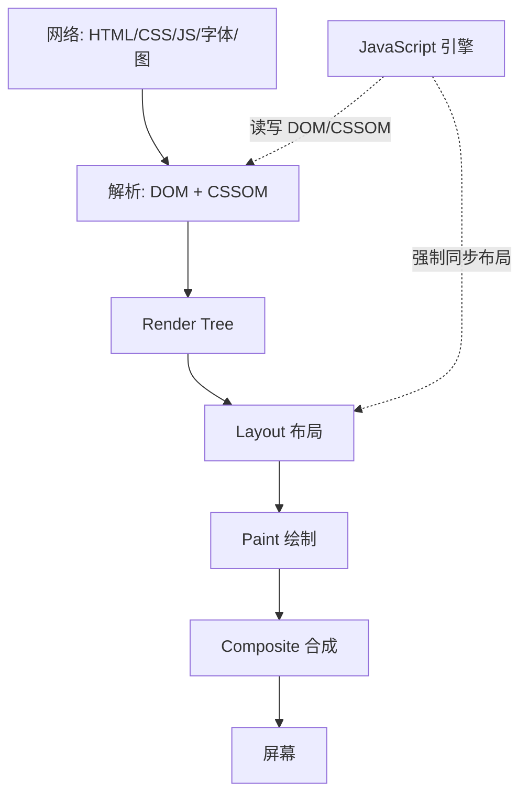
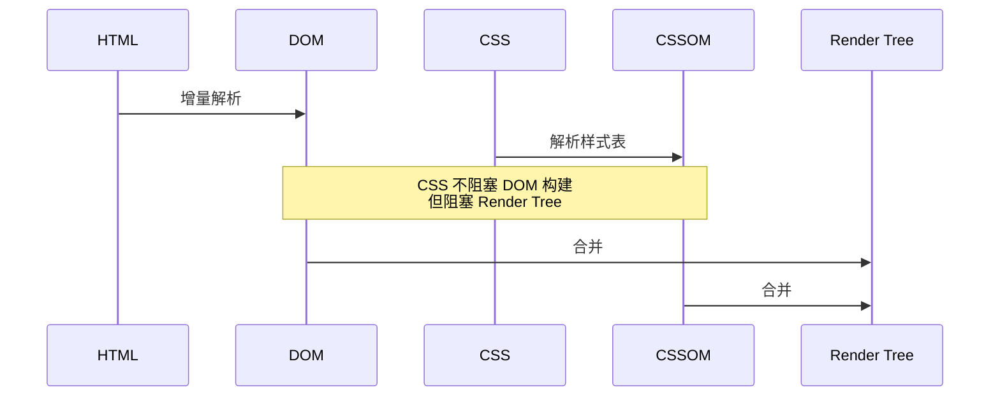
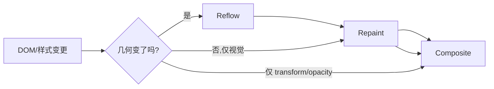
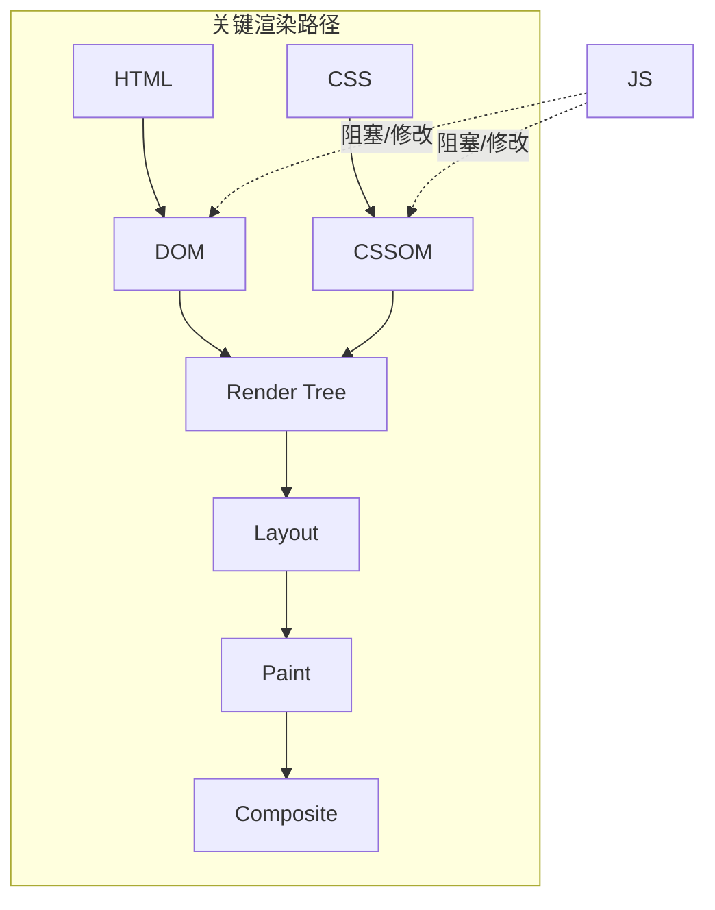

# 浏览器渲染原理与关键路径

<!-- 修改说明: 2026-06-30 按 EXPANSION-STANDARD 扩充 §0、DevTools 步骤表、FAQ 12 题、闭卷自测、费曼检验 -->

> **文件编码**：UTF-8。浏览器示例以 **Chrome / Edge（Chromium）** 为准；示例 HTML 可在本地用 Live Server 或 `npx serve` 打开。

---

## 0. 读前导读（零基础也能跟上）

### 0.1 用一句话弄懂本章

**一句话**：浏览器把 HTML/CSS 变成屏幕像素，要经过 **DOM → CSSOM → 渲染树 → 布局 → 绘制 → 合成**；改样式/ DOM 的方式决定「贵不贵」。

**生活类比**：装修房子——改承重墙（reflow）比换墙纸（repaint）麻烦得多；只挪画框位置（composite）最省事。

### 0.2 你需要提前知道什么

| 能力 | 对应章节 | 真不会请先学 |
|------|----------|--------------|
| HTML 标签、DOM 概念 | HTML CSS JS 01～03 | ✅ 本章依赖 |
| CSS 盒模型 | HTML CSS JS 04 | ✅ 布局基础 |
| JS 改 DOM | HTML CSS JS 07～08 | ✅ |
| 渲染流程轮廓 | HTML 10、浏览器 00 | 建议先读 00 |

### 0.3 本章知识地图（学完后应能勾选全部 ☐→☑）

- [ ] 手绘 DOM → CSSOM → Render Tree → Layout → Paint → Composite
- [ ] 说清 reflow 与 repaint 触发差异
- [ ] 解释 layout thrashing 与 batch 读写
- [ ] 完成 §12 Performance 对比 margin / transform
- [ ] 闭卷自测 ≥ 8/10

### 0.4 建议学习时长与节奏

| 阶段 | 时间 | 内容 |
|------|------|------|
| 通读 §1～7 | 1 h | CRP、三阶段对比 |
| §8 layout thrashing | 30 min | 坏代码 vs 好代码 |
| §12 DevTools 实操 | 45 min | reflow-demo + Performance |
| 练习 + 闭卷 | 30 min | §16 + §20 |

### 0.5 学完本章你能做什么

1. 看 Performance 里紫色 **Layout**、绿色 **Paint** 条知道在干什么。
2. 向同事解释「为什么动画要用 `transform` 不用 `left`」。
3. 识别循环读写 `offsetWidth` 导致的 layout thrashing。
4. 面试口述「从 DOM 到像素」后半段（配合计网 07）。

---

## 本章与上一章的关系

[00 学习路线图](./00-学习路线图与说明.md) 已说明：你在 [HTML CSS JS 10](../HTML%20CSS%20JS/10-浏览器HTTP网络与Web基础.md) 见过「DOM → CSSOM → 渲染树 → 布局 → 绘制」的简化流程；[计网 07](../计算机网络/07-面试专题与知识点总表.md) 面试题「输入 URL」第 7 步也提到构建渲染树。

**本章（01）** 把这一步**讲透**：各树如何构建、**关键渲染路径（CRP）** 如何阻塞、**reflow / repaint / composite** 各耗在哪、前端写法如何少触发布局。学完后你看 Performance 里紫色的 **Layout**、绿色的 **Paint** 条就不会陌生。

**下一章（02 性能指标与 Core Web Vitals）** 会在「画出来」之上回答「**多快算好**」——LCP 量的是哪一帧、CLS 量的是哪类位移。

**前置自检**：

| 能力 | 对应章节 | 本章是否依赖 |
|------|----------|--------------|
| HTML 标签与 DOM 概念 | HTML CSS JS 01～03 | ✅ |
| CSS 选择器、盒模型 | HTML CSS JS 04 | ✅ |
| JS 改 DOM / class | HTML CSS JS 07～08 | ✅ |
| `<script>` 阻塞印象 | HTML CSS JS 10 | 建议有 |
| HTTP 下载 CSS/JS | 计网 04 | 建议有 |

---

## 1. 浏览器渲染在整体流程中的位置

### 1.1 从网络到像素

一次页面展示，简化可拆为两阶段：

1. **获取与解析资源**（偏网络 + 解析）：HTML、CSS、JS、图片……见 [计网 04](../计算机网络/04-HTTP协议深入.md)、[04 章资源加载](./04-前端资源加载优化.md)。  
2. **渲染流水线**（本章主线）：把 DOM + 样式 → 屏幕像素。



### 1.2 为什么前端必须懂渲染而不仅是「会写 CSS」

- **同一段 JS** 读 `offsetWidth` 再写 `style.width` 可能触发 **layout thrashing**（01 §8）。  
- **Vue / React** 的 patch 最终仍要操作真实 DOM；见 [Vue 02](../Vue/02-模板语法与响应式原理.md) 响应式更新。  
- **动画** 用 `left` 会每帧 reflow；用 `transform` 往往只 composite（01 §7）。  
- **面试**「从输入 URL 到页面展示」后半段就是本章内容。

### 1.3 渲染引擎与 JS 引擎（了解）

Chromium 中常见分工：

| 组件 | 职责 |
|------|------|
| Blink（渲染引擎） | HTML/CSS 解析、布局、绘制、合成 |
| V8（JS 引擎） | 执行 JavaScript |
| 合成线程 / GPU | 图层合成、部分动画 |

**关键**：默认情况下，**DOM 操作与多数样式计算在主线程**——JS 长时间占用会直接卡渲染（05 章 Long Task）。

---

## 2. DOM：文档对象模型

### 2.1 DOM 是什么

**术语（DOM / Document Object Model）**：浏览器把 HTML 解析成的树形对象结构，JS 通过 API 读写页面。  
**生活类比**：HTML 是图纸字符串；DOM 是按图纸搭好的可改模型。  
**为什么重要**：所有前端框架最终都操作 DOM；不懂树结构看不懂 reflow 范围。  
**本章用到的地方**：§2～4、§11。

**DOM（Document Object Model）** = 浏览器把 HTML 文档解析成的**树形对象结构**，每个节点对应标签、文本、注释等。JS 通过 DOM API（`document`、`element`）读写页面。

HTML 示例：

```html
<!DOCTYPE html>
<html lang="zh-CN">
<head>
  <meta charset="UTF-8" />
  <title>渲染 Demo</title>
</head>
<body>
  <div id="app">
    <p class="title">商品列表</p>
    <ul id="list"></ul>
  </div>
</body>
</html>
```

对应 DOM 树（概念）：

```text
Document
 └── html
      ├── head
      │    ├── meta
      │    └── title → "渲染 Demo"
      └── body
           └── div#app
                ├── p.title
                └── ul#list
```

### 2.2 HTML 解析过程（简化）

1. 字节 → 字符（编码）  
2. 词法 / 语法分析 → 节点  
3. **树构建**：开标签入栈、闭标签出栈  
4. 遇 `<script>` 可能 **阻塞解析**（无 `defer`/`async` 时）——见 [HTML CSS JS 10](../HTML%20CSS%20JS/10-浏览器HTTP网络与Web基础.md)  

**DOM 构建是增量的**：不必等整份 HTML 下载完才开始——这就是为什么 `<link>` 放 head、大 JS 放底部或 defer 能影响首屏（04 章）。

### 2.3 DOM 与 HTML 源码的区别

| 维度 | HTML 源码 | DOM |
|------|-----------|-----|
| 内容 | 文件里的字符串 | 内存中的对象树 |
| JS 修改 | 不改文件 | 即时反映到树 |
| 错误标签 | 浏览器容错解析 | 可能自动补全结构 |

**实操**：Elements 面板改 `<p>` 文字，Sources 里 HTML 文件不会变——改的是 DOM。

---

## 3. CSSOM：CSS 对象模型

### 3.1 CSSOM 是什么

**CSSOM（CSS Object Model）** = 浏览器解析 CSS 规则后形成的**样式树**，用于计算每个元素**最终应用哪些声明**（含层叠、继承、!important）。

来源包括：

- 外链 `<link rel="stylesheet">`  
- `<style>` 内联  
- `@import`（不推荐阻塞链）  
- 行内 `style` 属性（参与计算，一般不单独成「文件级」CSSOM 文件）

### 3.2 CSS 为何会阻塞渲染

浏览器要算 Render Tree，必须知道**每个可见节点的 computed style**。若 CSS 未就绪，渲染树不完整 → **白屏或 FOUC（无样式内容闪烁）**。



**深入：为什么 CSS 放 head、JS 慎放 head？**  
CSS 阻塞 **首次渲染**；同步 JS 阻塞 **HTML 解析** 且可能读 DOM/CSSOM。两者叠加会拉长 CRP（01 §6）。

### 3.3 与 [HTML CSS JS 04](../HTML%20CSS%20JS/04-CSS盒模型浮动定位与显示模式.md) 的衔接

布局阶段使用的 **width/height/margin/display/position** 都来自 CSSOM 计算后的 **computed values**。不懂盒模型，看不懂 reflow 为何发生。

---

## 4. Render Tree（渲染树）

### 4.1 如何由 DOM + CSSOM 得到

1. 从 DOM 根遍历每个节点  
2. 用 CSSOM 判断 **`display: none`** 等 → **不进入**渲染树  
3. 文本节点、可见元素（含 `visibility: hidden` 占位）等进入  
4. 每个节点带 **computed style**（颜色、字体、盒模型等）

**注意**：

- `display: none`：**不在**渲染树（不占布局）  
- `visibility: hidden`：**在**渲染树（占布局，不可见）  
- `opacity: 0`：仍在，通常占布局  

### 4.2 与 DOM 树不是一一对应

| 情况 | DOM | Render Tree |
|------|-----|-------------|
| `<head>` 内 meta | 有 | 一般无（不可见） |
| `display:none` 的 div | 有 | 无 |
| 伪元素 `::before` | DOM 无独立节点 | 可有对应渲染对象 |

### 4.3 面试一句话

**Render Tree** = 只含**需要绘制**的节点 + 其计算后样式；是布局与绘制的输入。

---

## 5. 布局（Layout）与 Reflow（重排）

### 5.1 Layout 做什么

**Layout（布局）** = 计算渲染树中每个节点的**几何信息**：位置（x, y）、尺寸（width, height）、行盒等。  
业界常把一次布局计算叫 **Reflow（重排）**——本文 **Layout = Reflow** 同义使用。

### 5.2 哪些操作会触发 Reflow

**典型触发**（不完全列表）：

- 增删 DOM 节点、改变文本  
- 改 **几何相关** 样式：`width/height/margin/padding/border`、`display`、`position`、`font-size`、`offset*` 读取后写样式……  
- 窗口 resize、字体加载完成（FOUT/FOIT）  
- 滚动（有时触发子树 layout）  

**不一定触发 reflow 的**（多数情况只 repaint 或 composite）：

- 改 `color`、`background-color`（无几何变化）  
- 改 `transform`（常走合成层）  
- 改 `opacity`（常 GPU 合成）

### 5.3 Reflow 的成本

- 可能触发**整页或子树**重新计算——元素越多越贵。  
- **强制同步布局（Forced Synchronous Layout）**：JS 在读布局属性时，浏览器必须先把待处理的 DOM 变更算完 layout 再返回值——连续读写会 **layout thrashing**（§8）。

### 5.4 与 Repaint、Composite 对比

| 阶段 | 英文 | 做什么 | 相对成本 |
|------|------|--------|----------|
| 布局 | Layout / Reflow | 算几何 | 高 |
| 绘制 | Paint / Repaint | 填像素（文字、颜色、阴影等） | 中 |
| 合成 | Composite | 图层合并上屏 | 低（理想动画路径） |



---

## 6. 绘制（Paint）与合成（Composite）

### 6.1 Paint

**Paint** = 把布局算好的盒子**画成位图**（文字 glyph、背景、边框等）。  
改颜色通常 **repaint** 但不 **reflow**。

DevTools Performance 里常见 **Recalculate Style** → **Layout** → **Update Layer Tree** → **Paint** → **Composite Layers** 链条。

### 6.2 Composite 与图层

现代浏览器会把部分节点提升到 **合成层（Compositing Layer）**，由 GPU 参与。  
常见提升原因：`transform`、`opacity` 动画、`will-change`、`video/canvas`、3D transform 等。

**好处**：动画只改合成层 transform，不触发布局。  
**代价**：每层占内存；层过多反而慢——勿滥用 `will-change: transform` 涂满全页。

### 6.3 实操：看图层（DevTools）

**手把手**：

1. 打开含动画的页面（或 §12 demo）  
2. `F12` → **More tools** → **Rendering**  
3. 勾选 **Layer borders**  
4. 观察橙色/蓝色边框：有独立层的区域会标出  

**预期**：对 `transform: translateX` 动画的元素，往往有独立层；只改 `margin-left` 的同类动画可能没有。

---

## 7. 关键渲染路径（Critical Rendering Path, CRP）

### 7.1 定义

**CRP** = 浏览器把 **HTML、CSS、JS** 转成像素所经过的**最短必要路径**。优化首屏 = 缩短 CRP 上各阶段耗时、减少阻塞资源。

### 7.2 典型 CRP 步骤

1. 解析 HTML → DOM  
2. 解析 CSS → CSSOM  
3. DOM + CSSOM → Render Tree  
4. Layout  
5. Paint  
6. Composite  

**JavaScript 插入点**：脚本可改 DOM/CSSOM；`<script>` 阻塞解析；`defer`/`async` 改变时机（04 章）。

### 7.3 阻塞关系小结

| 资源 | 阻塞 DOM 构建 | 阻塞 CSSOM | 阻塞首次渲染 |
|------|---------------|------------|--------------|
| CSS | 否 | — | **是** |
| JS（无 defer/async） | **是** | 可能（若改样式） | 是 |
| JS defer | 否（DOM 就绪前不执行） | — | 执行前仍要 CSS |
| 图片 | 否 | 否 | 否（但占 LCP，02 章） |

### 7.4 优化 CRP 的常见手段（预览）

| 手段 | 章节 |
|------|------|
| 关键 CSS 内联、非关键异步 | 04 |
| JS defer / 底部 / code split | 04 |
| 减少首屏 DOM 深度 | 01、05 |
| 字体 `font-display: swap` + 预留尺寸 | 02、04 |
| 服务端/SSG 首 HTML | Vue 10 |

详细指标与工具见 02、03、04 章。



---

## 8. Layout Thrashing（布局抖动）

### 8.1 什么是 layout thrashing

在同一帧或短循环内，交替 **写** 样式（invalidation）与 **读** 布局属性（`offsetWidth`、`getBoundingClientRect`、`scrollTop` 等），迫使浏览器**反复强制 sync layout**。

### 8.2 反面示例

```javascript
// 坏：N 次 reflow
const items = document.querySelectorAll('.item');
for (const el of items) {
  el.style.width = el.offsetWidth + 10 + 'px';
}
```

每次读 `offsetWidth` 前，浏览器必须把上一次的 width 写入算完 layout。

### 8.3 改进：读写分离（batch）

```javascript
// 好：先读后写
const items = document.querySelectorAll('.item');
const widths = Array.from(items, el => el.offsetWidth);
items.forEach((el, i) => {
  el.style.width = widths[i] + 10 + 'px';
});
```

**框架侧**：Vue/React 批量更新（microtask / scheduler）也在减少无意义中间 layout；见 [React 12](../React/12-React进阶特性.md) 并发特性。

### 8.4 深入：为什么 getComputedStyle 也可能贵？

它可能触发 style recalc；若随后改几何属性仍可能 layout。Performance 里看 **Layout** 次数是否异常增多。

---

## 9. display、visibility、opacity 与渲染

| 属性 | Render Tree | 布局占位 | 可点 | 子元素 |
|------|-------------|----------|------|--------|
| `display: none` | 否 | 否 | 否 | 不参与 |
| `visibility: hidden` | 是 | 是 | 否 | 可单独 visible |
| `opacity: 0` | 是 | 是 | 默认可点 | 参与 |

**shop 场景**：弹窗用 `v-show`（Vue）切 `display` vs `v-if` 卸 DOM——频繁切换大量节点时 `v-if` 可能减少长期 layout 成本，但切换本身有 mount 成本；见 [Vue 04](../Vue/04-组件基础与组件通信.md)。

---

## 10. 脚本、样式与解析器（扩展）

### 10.1 `<script>` 位置实验

```html
<link rel="stylesheet" href="slow.css" />
<script src="app.js"></script> <!-- 阻塞解析 -->
<p id="target">可见性测试</p>
```

若 `app.js` 在 `<p>` 之前且无 defer，**解析器暂停**，`<p>` 晚进 DOM。

### 10.2 `defer` 与 `async`

| 属性 | 下载 | 执行时机 | 顺序 |
|------|------|----------|------|
| 无 | 阻塞解析 | 立即 | — |
| async | 并行 | 下完即执行 | 不保证 |
| defer | 并行 | DOMContentLoaded 前 | 保序 |

Vue/React 打包产物通常 `<script type="module">` 默认 defer 行为。

---

## 11. 与 Vue / React 渲染的关系

### 11.1 虚拟 DOM 不跳过真实渲染

- Vue/React 先算 **virtual DOM diff**，再**批量**改真实 DOM。  
- 一次 setState 触发的多次 DOM 写可能被合并，但**最终**仍可能 layout/paint。  
- 大列表无虚拟滚动 → 大量 DOM 节点 → layout 贵（05 章）。

### 11.2 常见框架写法与 reflow

| 写法 | 影响 |
|------|------|
| 列表缺 `:key` / 不稳定 key | 多余 DOM 重建、layout |
| 内联 style 改 width 每帧 | reflow |
| CSS `transition: transform` | 倾向 composite |
| 频繁 `v-show` 大 subtree | display 切换引 layout |

### 11.3 与 [Vue 02](../Vue/02-模板语法与响应式原理.md) 对照

响应式 `ref` 变更 → 组件 re-render → patch DOM → 浏览器 CRP 后续阶段。懂 CRP 才理解「为什么要把计算放 computed、少在 template 里调 heavy 函数」。

---

## 12. 手把手实操：观察 Reflow 与 Paint

### 12.1 准备 demo 页面

创建 `reflow-demo.html`：

```html
<!DOCTYPE html>
<html lang="zh-CN">
<head>
  <meta charset="UTF-8" />
  <meta name="viewport" content="width=device-width, initial-scale=1" />
  <title>Reflow Demo</title>
  <style>
    #box {
      width: 100px;
      height: 100px;
      background: #4f46e5;
      transition: none;
    }
    #box.move-margin {
      margin-left: 200px;
    }
    #box.move-transform {
      transform: translateX(200px);
    }
  </style>
</head>
<body>
  <button id="btn-margin">改 margin（易 reflow）</button>
  <button id="btn-transform">改 transform（倾向 composite）</button>
  <div id="box"></div>
  <script>
    const box = document.getElementById('box');
    document.getElementById('btn-margin').onclick = () => {
      box.classList.toggle('move-margin');
    };
    document.getElementById('btn-transform').onclick = () => {
      box.classList.toggle('move-transform');
    };
  </script>
</body>
</html>
```

### 12.2 Performance 录制

| 步骤 | 你的动作 | 预期看到什么 | 若不对 |
|------|----------|--------------|--------|
| 1 | 打开 reflow-demo.html → F12 → **Performance** | 面板就绪 | 用 Live Server 或 `npx serve` 打开 |
| 2 | 勾选 **Screenshots** | 录制时有胶片条 | 齿轮里检查 Capture settings |
| 3 | 点 **Record** → 连点「改 margin」3 次 → **Stop** | Main 有 Layout/Paint 色块 | 未录到则 Record 后立刻操作 |
| 4 | Main 线程找 **Layout**（紫）、**Paint**（绿） | margin 切换有明显 Layout | 放大时间轴 |
| 5 | 再 Record → 连点「改 transform」3 次 → Stop | Layout 少或无，Composite 为主 | 与 margin 对比 |
| 6 | **Rendering** → 勾 **Paint flashing** → 再点两按钮 | 绿闪 = 重绘区域 | More tools → Rendering |

**预期总结**：

- margin 切换：常见明显 **Layout** 事件  
- transform：可能主要是 **Composite Layers**，Layout 少或无  
- Paint flashing：margin 改动绿闪区域往往更大

---

## 13. 常见报错与误解

| 现象 / 误解 | 原因 | 处理 |
|-------------|------|------|
| 「改了 color 页面很卡」 | 通常不是 reflow；可能是大面积 repaint 或 JS 逻辑 | Performance 看 Main；查 Long Task |
| 「DOM 和 Render Tree 节点数一样」 | head、display:none 等不在渲染树 | §4 对照 |
| 「async 脚本一定不阻塞渲染」 | 执行瞬间仍占主线程，且可能改 DOM | 04 章拆包 + 05 章 |
| 「visibility:hidden 不占位」 | 与 display:none 混淆 | §9 表 |
| 「虚拟 DOM 不做 layout」 | 最终 DOM 变就要走浏览器 pipeline | §11 |
| 「will-change 越多越好」 | 层爆炸、内存涨 | 仅动画前短设 |
| 「FOUC 是 JS 问题」 | 常是 CSS 晚到 | 关键 CSS、link 放 head |
| 「getBoundingClientRect 免费」 | 可能 forced sync layout | 读写分离 §8 |
| 「iframe 不影响父页 layout」 | iframe 尺寸变会触发布局 | 固定宽高防 CLS（02 章） |
| 「SSR 没有 CRP」 | 服务端只产 HTML；**浏览器仍完整 CRP** | hydration 阶段同构 |

---

## 14. 深入：为什么首屏要关心 CRP 而不是只关心 API？

**案例**：shop-vue 商品 API 150ms 返回，但用户 3s 才看到列表。

可能原因链：

1. JS bundle 2MB → 下载 + 解析 Long Task（03 章）  
2. Vue mount 前 CSS 阻塞（CRP）  
3. 列表 500 节点一次性 mount → 大 layout（05 章虚拟列表）  

**结论**：网络快 ≠ 视觉快；CRP 连接 **资源加载（04）** 与 **指标（02）**。

---

## 15. 与计网、HTML 10 的交叉索引

| 主题 | 计网 / HTML | 本章 |
|------|-------------|------|
| 输入 URL 后半段 | 计网 07 Q2 | §1～7 详述 |
| CSS 阻塞 | HTML 10 §25 | §3、§7 |
| script defer | HTML 10 | §10 |
| TTFB vs 首屏 | 计网 04 Timing | CRP 在 TTFB 之后 |
| 图片与 LCP | HTML 10 指标表 | 02 章 LCP 元素 |

---

## 16. 练习建议

### 16.1 基础

1. 画出 DOM 与 Render Tree 对 `display:none` 子 div 的差异。  
2. 列举 3 个触发 reflow 的 CSS 属性。  
3. 说明 Layout、Paint、Composite 成本高低（一般情况）。

### 16.2 进阶

1. 用 §12 demo 录 Performance，用文字描述 margin vs transform 差异。  
2. 解释什么是 layout thrashing，并改写出 §8 坏代码的好版本。  
3. 说明 CSS 为何阻塞首次渲染但不阻塞 DOM 构建。

### 16.3 挑战

1. 在 shop-vue 商品列表页，Elements 里数首屏可见 DOM 节点大约多少；提出 1 条减 layout 建议。  
2. 结合 [Vue 02](../Vue/02-模板语法与响应式原理.md)，说明一次 `ref` 变更到屏幕更新的链路。

### 16.4 参考答案（基础）

1. DOM 有该 div；Render Tree **不含**（不参与布局绘制）。  
2. 例如：`width`、`height`、`margin`、`display`、`font-size`、`position`（任举三）。  
3. Reflow 最高；Repaint 次之；Composite 最低（仅合成时）。

---

## 18.1 扩展：reflow-demo 关键代码逐行读

§12 demo 超过 10 行，对照下表理解「为何 margin 贵、transform 省」：

| 行号/片段 | 含义 | 改错会怎样 |
|-----------|------|------------|
| `#box { width/height }` | 固定盒尺寸，layout 有基准 | 不设尺寸 CLS 风险（02 章） |
| `.move-margin { margin-left: 200px }` | 改几何 → reflow | 改成 `left` 同理 reflow |
| `.move-transform { translateX }` | 倾向 composite | 若同时改 width 仍 reflow |
| `classList.toggle(...)` | 切换 class 触发样式重算 | 每帧 inline style 更贵 |
| 两个 button | 对比实验 | 生产用 CSS transition + transform |

---

## 18.2 扩展：与 HTML 10 渲染流程对照

| HTML 10 提法 | 本章正式名 | 加深点 |
|--------------|------------|--------|
| 构建 DOM | DOM 树 | 增量解析、script 阻塞 §10 |
| 构建 CSSOM | CSSOM | 阻塞首次渲染 §3.2 |
| 渲染树 | Render Tree | display:none 不在树 §4 |
| 布局/绘制 | Layout/Paint | 触发条件 §5.2、§5.4 |
| （较少提） | Composite | transform 动画 §6 |

---

## 18.3 扩展：shop-vue 渲染路径 walkthrough

```text
用户打开 https://shop.example.com/

1. Network: document HTML（TTFB 见 02 章）
2. 解析 HTML → DOM；并行下载 app.css → CSSOM
3. <script type="module" src="/assets/index-xxx.js"> defer 行为
4. Vue createApp → mount #app → patch 商品列表 DOM
5. Banner img 完成绘制 → LCP 标记（02 章）
6. 用户滚动列表 → 若无虚拟列表，大量 Layout（05 章）

优化抓手：04 preload Banner；05 虚拟列表；03 Performance 验证 Long Task
```

---

## 18.4 扩展：常见触发 reflow 的 JS API 速查

| API / 操作 | 是否易触发 layout | 备注 |
|------------|-------------------|------|
| `el.style.width = '100px'` | 是 | 写几何 |
| `el.offsetWidth` | 读布局，可能 forced sync | 读后写更糟 |
| `getBoundingClientRect()` | 同上 | batch 读取 |
| `el.classList.add('hidden')` | display 变可能 reflow | 见 §9 |
| `el.style.transform = '...'` | 倾向 composite | 动画首选 |
| `document.body.appendChild(el)` | 是 | 增删 DOM |
| `window.getComputedStyle(el)` | 可能 style recalc | 少在热路径调用 |

---

## 19. FAQ

**Q1：`display:none` 的元素在 DOM 里吗？在渲染树里吗？**  
在 DOM 里；**不在** Render Tree（不参与布局绘制）。见 §4、§9。

**Q2：改 `color` 会 reflow 吗？**  
多数情况只 **repaint**，不改几何；除非影响布局间接链。

**Q3：CSS 阻塞 DOM 构建吗？**  
**不阻塞** DOM；但**阻塞**首次渲染（Render Tree 需要 CSSOM）。见 §3.2。

**Q4：同步 `<script>` 放 head 有什么问题？**  
阻塞 HTML 解析，推迟 DOM 后续节点；CRP 变长。用 `defer`/`module`。见 §10。

**Q5：什么是 forced synchronous layout？**  
JS 读 `offsetWidth` 等时，浏览器必须先算完 pending 的样式变更再返回值。见 §8。

**Q6：Vue 的 `v-if` 和 `v-show` 与 reflow 关系？**  
`v-if` 卸 DOM；`v-show` 切 `display`——频繁切换大 subtree 各有成本。见 §9。

**Q7：SSR 还有 CRP 吗？**  
服务端只产 HTML；**浏览器仍完整走 CRP** + hydration。见 §13 报错表。

**Q8：will-change 能随便加吗？**  
否；过多合成层占 GPU 内存。动画前短设或直接用 transform。

**Q9：getBoundingClientRect 为什么可能慢？**  
可能触发 forced sync layout；应读写分离 batch。见 §8。

**Q10：iframe 会影响父页 layout 吗？**  
尺寸变化会；固定宽高可防 CLS（02 章）。

**Q11：FOUC 是什么？**  
Flash of Unstyled Content——CSS 晚到导致无样式闪烁；关键 CSS 放 head。

**Q12：读完本章下一步？**  
[02 性能指标与 Core Web Vitals](./02-性能指标与CoreWebVitals.md)——在「画出来」之上量「多快算好」。

---

## 20. 闭卷自测

1. DOM、CSSOM、Render Tree 三者来源与区别？
2. 列举 3 个触发 reflow 的 CSS 属性或操作。
3. Layout、Paint、Composite 相对成本（一般情况）？
4. 什么是 CRP？CSS 与同步 JS 各阻塞什么？
5. 什么是 layout thrashing？§8 坏代码如何改好？
6. `display:none` vs `visibility:hidden` vs `opacity:0` 在渲染树与占位上的区别？
7. 为什么 Vue/React 虚拟 DOM 不跳过真实 layout？
8. **动手**：完成 §12 步骤表，用文字对比 margin vs transform 的 Performance 差异。
9. **动手**：Rendering 面板开 Layer borders，对 transform 动画元素观察是否有独立层。
10. **综合**：shop 列表 500 节点一次性 mount 可能伤哪些指标？对应 01/02/05 哪章手段？

### 20.1 自测参考答案

1. DOM←HTML；CSSOM←CSS；Render Tree=可见 DOM 节点+computed style，不含 display:none。  
2. 例：width/height/margin、改 display、读 offsetWidth 后写 style。  
3. Reflow 最高；Repaint 中；Composite 最低（仅合成路径）。  
4. CRP=HTML/CSS/JS→像素关键路径；CSS 阻塞首次渲染；同步 JS 阻塞 HTML 解析。  
5. 循环读写布局属性迫使反复 sync layout；先数组存 width 再循环只写。  
6. display:none 不在渲染树不占位；visibility:hidden 在树占位；opacity:0 在树占位可点。  
7. patch 最终改真实 DOM，几何变仍 layout。  
8. （margin 多 Layout；transform 多 Composite。）  
9. （transform 动画元素常见橙色/蓝色层边框。）  
10. LCP/INP 差、滚动卡；05 虚拟列表/分页、01 减 DOM、02 用 Performance 验证。

---

## 21. 费曼检验

请不看资料，用 **3 分钟** 向朋友解释「浏览器怎么把 HTML 变成屏幕上的画面」。对照提纲：

1. **两棵树**：HTML→DOM，CSS→CSSOM，合并成只含可见节点的渲染树。  
2. **三步画**：先 layout 算位置大小（最贵），再 paint 填色（中等），最后 composite 合成上屏（动画用 transform 走这条最省）。  
3. **JS 搅局**：改 DOM/样式会触发上面步骤；循环读宽度再写宽度会「布局抖动」——要批量读写。

---

## 17. 下一章预告

**[02 性能指标与 Core Web Vitals](./02-性能指标与CoreWebVitals.md)** 将讲解：

- **FCP、LCP、CLS、INP（替代 FID）、TTFB** 定义与阈值  
- Lab vs Field、PageSpeed Insights  
- 如何用指标反推 CRP 瓶颈  

建议：保留 §12 的 demo，下一章会对同一页跑 Lighthouse。

---

## 18. 学完标准（01 章）

- [ ] 手绘 DOM → CSSOM → Render Tree → Layout → Paint → Composite  
- [ ] 说清 reflow 与 repaint 触发差异  
- [ ] 完成 Performance 对比 margin / transform 录制  
- [ ] 能解释 layout thrashing 与 batch 读写  
- [ ] 完成 §16 基础 + 进阶练习  

全部打勾 → 进入 **02 性能指标与 Core Web Vitals**。
