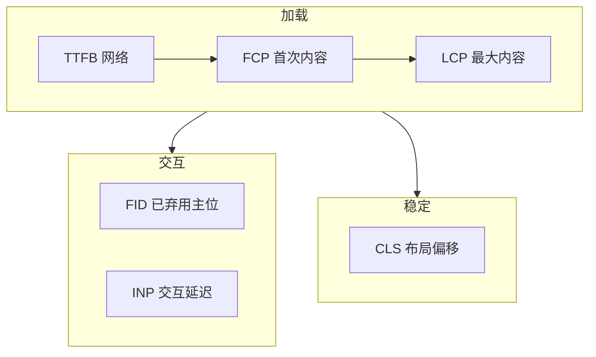
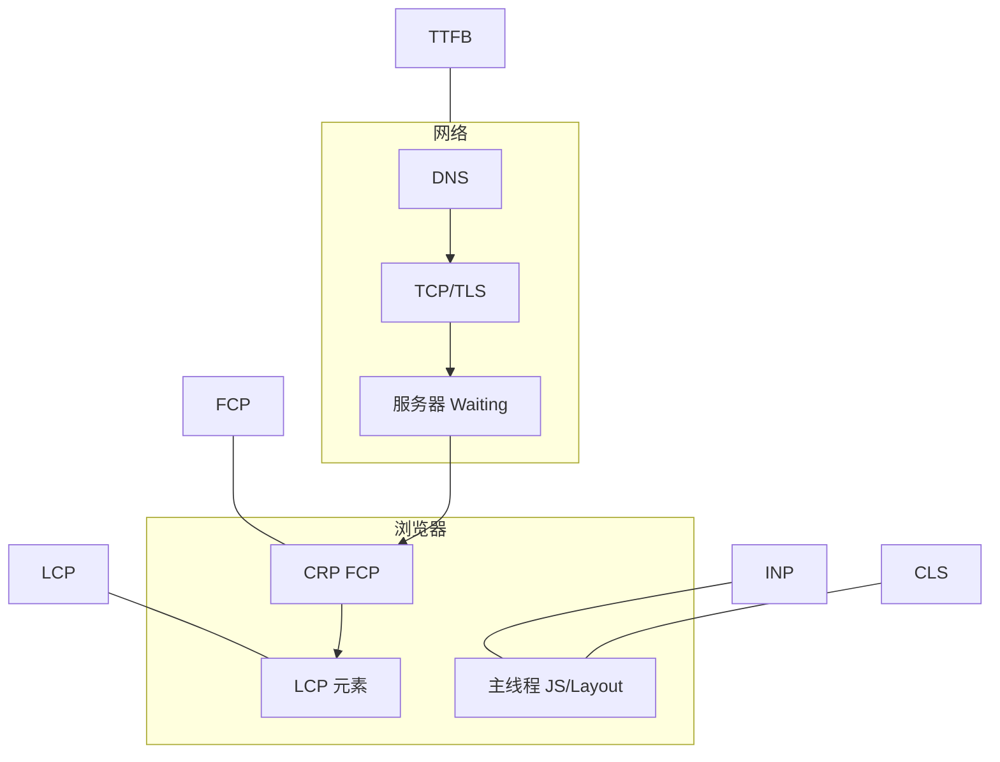

# 性能指标与 Core Web Vitals

<!-- 修改说明: 2026-06-30 按 EXPANSION-STANDARD 扩充 §0、DevTools 步骤表、FAQ 12 题、闭卷自测、费曼检验 -->

> **文件编码**：UTF-8。度量工具以 **Chrome Lighthouse、Performance Insights、PageSpeed Insights** 为准；阈值参考 Google **Core Web Vitals** 公开标准（随版本可能微调，以 [web.dev/vitals](https://web.dev/vitals/) 为准）。

---

## 0. 读前导读（零基础也能跟上）

### 0.1 用一句话弄懂本章

**一句话**：页面「画出来」之后还要量**够不够快、稳不稳、跟不跟手**——LCP、INP、CLS 是 Google 定的三把尺子。

**生活类比**：餐厅不只看「有没有上菜」（FCP），更看「主菜多久到」（LCP）、「桌子会不会晃」（CLS）、「按铃多久有人应」（INP）。

### 0.2 你需要提前知道什么

| 能力 | 章节 | 说明 |
|------|------|------|
| CRP、reflow | 浏览器 01 | ✅ 理解 LCP 为何含渲染 |
| Network Timing | HTML 10、计网 01 | ✅ TTFB |
| Lighthouse 跑过一次 | 浏览器 00 §13 | 建议 |

### 0.3 本章知识地图（☐→☑）

- [ ] 背诵 CWV 三项及良好阈值
- [ ] 说清 TTFB、FCP、LCP、CLS、INP 各测什么
- [ ] Lighthouse 独立找到 LCP element
- [ ] Network 读过 document 的 TTFB
- [ ] 闭卷自测 ≥ 8/10

### 0.4 建议学习时长与节奏

| 阶段 | 时间 | 内容 |
|------|------|------|
| §2～6 指标 | 1.5 h | FCP/LCP/CLS/INP/TTFB |
| §9～10 DevTools | 1 h | Lighthouse + Network |
| 练习 + 闭卷 | 45 min | §15 + §21 |

### 0.5 学完本章你能做什么

1. 读 Lighthouse 报告并指出瓶颈在 TTFB 还是 LCP 资源。
2. 向产品解释「API 200ms 但 LCP 4s」的原因。
3. 用 Performance Experience 轨道找 CLS 来源。
4. 对比 Lab 与 PageSpeed Insights Field 数据。

---

## 本章与上一章的关系

[01 浏览器渲染原理与关键路径](./01-浏览器渲染原理与关键路径.md) 讲了浏览器**如何把页面画出来**（DOM → Composite）。**画出来**不等于**够快**——产品问「首屏几秒？」、SEO 问「CWV 达标吗？」需要**可量化指标**。

**本章（02）** 系统讲解 **FCP、LCP、CLS、INP（与 FID）、TTFB** 及 **Core Web Vitals（CWV）** 三核心：含义、良好阈值、测量方式、与 CRP/网络的对应关系。学完后你能读 Lighthouse 报告并指出「瓶颈在 TTFB 还是 LCP 资源」。

**下一章（03 Chrome DevTools 性能分析）** 会教**怎么录、怎么读**火焰图与 Network 瀑布，把本章数字变成 actionable 线索。

**前置自检**：

| 能力 | 对应章节 | 本章是否依赖 |
|------|----------|--------------|
| CRP、reflow 概念 | 浏览器 01 | ✅ |
| Network Timing（Waiting/TTFB） | HTML 10、计网 01 | ✅ |
| HTTP 缓存 | 计网 06 | 建议有 |
| Lighthouse 跑过一次 | 浏览器 00 §13 | 建议有 |

---

## 1. 为什么需要性能指标

### 1.1 主观感受 vs 客观度量

「感觉卡」难以对齐；**指标**让前端、产品、SEO、后端用同一语言：

| 角色 | 典型问题 | 指标 |
|------|----------|------|
| 产品 | 用户多久看到主内容？ | LCP |
| 运营 | 页面会不会乱跳？ | CLS |
| 交互 | 点击后多久有反应？ | INP |
| 后端 | 服务器慢不慢？ | TTFB |
| 前端 | 何时出现第一像素？ | FCP |

### 1.2 Core Web Vitals 是什么

**Core Web Vitals（CWV）** = Google 选取的一组**以用户为中心**的体验指标，用于搜索排名信号与 Chrome 报告。当前核心 trio（2024 起交互以 INP 为主）：

1. **LCP** — 加载性能  
2. **INP** — 交互响应（逐步替代 **FID**）  
3. **CLS** — 视觉稳定  

另常一起看的：**FCP**（首次绘制）、**TTFB**（首字节，偏网络）。



### 1.3 Lab vs Field

| 类型 | 含义 | 工具 |
|------|------|------|
| **Lab（实验室）** | 固定环境、单次加载 | Lighthouse、本地 Performance |
| **Field（现场）** | 真实用户 RUM 聚合 | CrUX、PageSpeed Insights 的 *真实用户* 段 |

**为什么两者可能差很多？** 用户设备、网络、缓存、地域不同；Lab 是「你的电脑测一次」，Field 是「全球用户中位数」。优化要**两者都看**。

---

## 2. FCP：First Contentful Paint

### 2.1 定义

**FCP** = 浏览器首次绘制**任意文本、图像、非白 canvas 或 SVG** 的时间点（从 navigation start 算起）。

**不是**：白屏结束前的第一个像素（那是 FP，较少单独用）；**不是** LCP 元素。

### 2.2 良好阈值（常见参考）

| 评级 | FCP |
|------|-----|
| 良好 | ≤ 1.8 s |
| 需改进 | 1.8～3.0 s |
| 差 | > 3.0 s |

（Lighthouse /mobile 阈值；以报告为准。）

### 2.3 FCP 受什么影响

- HTML/CSS 阻塞（CRP，01 章）  
- 首屏字体（FOIT 延迟文字）  
- 服务端 HTML 快慢（TTFB）  
- 首屏小图标、骨架屏可**提前** FCP  

### 2.4 与 shop-vue

若 FCP 晚：检查 `index.html` 是否被大 JS 阻塞、是否有首屏 skeleton、CSS 是否过大。Vue mount 前的静态 HTML 内容（若有 SSG）可改善 FCP。

---

## 3. LCP：Largest Contentful Paint

### 3.1 定义

**LCP** = 视口内**最大可见内容元素**（常见为 hero 图、大标题块、背景图、video poster）完成渲染的时间。

**候选元素类型**（简化）：

- ``  
- `<svg>` 内元素  
- `background-image` 的块  
- 含文本节点的块级元素（如 `<h1>`、段落）  
- `<video>` 封面  

LCP 在**页面加载过程中可能更新**（更大元素出现），直到用户交互或 scroll 等停止观测。

### 3.2 良好阈值

| 评级 | LCP |
|------|-----|
| 良好 | ≤ 2.5 s |
| 需改进 | 2.5～4.0 s |
| 差 | > 4.0 s |

### 3.3 LCP 分解（优化抓手）

Chrome 常把 LCP 拆为：

| 子阶段 | 含义 | 优化方向 |
|--------|------|----------|
| TTFB | 等到首字节 | 后端、CDN、缓存（计网 06） |
| Resource load delay | 发现 LCP 资源晚 | preload、优先级 |
| Resource load duration | 下载慢 | 压缩、CDN、格式（WebP/AVIF） |
| Element render delay | 资源有了但未绘制 | CSS/JS 阻塞、字体 |


### 3.4 实操：找到 LCP 元素

**Lighthouse**：

1. 跑 Performance 报告  
2. 展开 **Diagnostics** → **Largest contentful paint element**  
3. 记下选择器与 URL  

**Performance Insights（Chrome 新面板）**：

1. F12 → **Performance insights**  
2. 录一次加载  
3. 看 **LCP breakdown**  

**预期**：shop 首页 LCP 常为 Banner `` 或最大商品卡片图。

### 3.5 常见 LCP 优化（预告 04 章）

- LCP 图 ``  
- `<link rel="preload" as="image" href="...">`  
- 勿 lazy-load LCP 图  
- 响应式 `srcset` + 合适尺寸  
- SSR/SSG 让 LCP 在 HTML 里更早出现  

---

## 4. CLS：Cumulative Layout Shift

### 4.1 定义

**CLS** = 整个页面生命周期内，所有**非预期布局偏移**的累积分数。  
每次偏移分数 ≈ **影响比例 × 移动距离比例**（简化理解）。

**良好**：CLS ≤ **0.1**

### 4.2 典型原因

| 原因 | 例子 |
|------|------|
| 无尺寸图片 | `` 无 width/height，加载后撑开 |
| 无尺寸广告/嵌入 | iframe 迟加载 |
| 动态注入内容 | 顶部突然插 banner |
| Web 字体 swap | 字体切换导致文字 reflow |
| 异步 CSS | 后加载样式改变布局 |

### 4.3 与 [HTML CSS JS 04](../HTML%20CSS%20JS/04-CSS盒模型浮动定位与显示模式.md)

给媒体设**宽高比**或明确尺寸：

```html

```

```css
.aspect-box {
  aspect-ratio: 16 / 9;
  background: #eee;
}
```

### 4.4 字体与 CLS

```css
@font-face {
  font-family: 'ShopFont';
  src: url('/fonts/shop.woff2') format('woff2');
  font-display: swap; /* 或 optional 更稳 CLS */
}
```

`font-display: optional` 可能不换字体但 CLS 更低；产品需权衡。

### 4.5 实操：Experience 面板看 CLS

1. F12 → **Performance** 录制加载  
2. 看 **Experience** 轨道红色 **Layout Shift** 标记  
3. 点击标记看 shifted elements  

---

## 5. FID 与 INP：交互响应

### 5.1 FID（First Input Delay）— 了解即可

**FID** = 用户**首次**交互（点击、按键）到浏览器**开始处理**该事件之间的延迟（主线程被 Long Task 占用）。

- 良好：≤ 100 ms  
- **2024 起 CWV 以 INP 替代 FID 作为核心交互指标**（FID 仅首次，INP 看全局）

### 5.2 INP（Interaction to Next Paint）

**INP** = 页面生命周期内**所有**（或高比例）交互的延迟，取**较差分位**（类似 P98 交互延迟）。

- 良好：≤ **200 ms**  
- 需改进：200～500 ms  
- 差：> 500 ms  

**包含**：输入延迟 + 处理时间 + 下一帧绘制延迟。

### 5.3 什么导致 INP 差

- 主线程 Long Task（大 JS 解析、重 diff、大 layout）  
- 未 debounce 的重 handler  
- 第三方脚本（统计、广告）  

**优化方向**：05 章 debounce、代码拆分、Web Worker（进阶）、减少同步 layout。

### 5.4 与 FID 对比

| | FID | INP |
|---|-----|-----|
| 范围 | 仅首次输入 | 多次交互聚合 |
| CWV 地位 | 已退居次要 | 当前核心 |
| 优化 | 减首屏 Long Task | 全页交互 + 路由切换 |

---

## 6. TTFB：Time to First Byte

### 6.1 定义

**TTFB** = 从请求发起到收到**响应第一个字节**的时间。  
主要反映 **DNS + TCP + TLS + 服务器处理 + 网络 RTT**（见 [计网 01](../计算机网络/01-网络分层与通信基础.md) Network Timing）。

### 6.2 良好参考（常见）

| 评级 | TTFB（近似） |
|------|--------------|
| 良好 | < 800 ms |
| 需改进 | 800 ms～1.8 s |
| 差 | > 1.8 s |

（移动端 Lab 常更严；以 Lighthouse 为准。）

### 6.3 TTFB 高 ≠ LCP 一定高

- TTFB 200ms，但 LCP 图 5MB → LCP 仍差  
- TTFB 1.5s，但 HTML 内联小 LCP → LCP 可能尚可  

**排查**：Network 选中文档请求 → **Timing** → Waiting (TTFB)。

### 6.4 与后端联调

shop-vue 调 [Java 04](../../后端学习/Java/04-SpringBoot核心开发.md) API：文档 HTML 的 TTFB 看 **nginx/静态**；`/api/products` 的 TTFB 看 Spring Boot，**不要**与 LCP 混淆——API 快不直接等于 LCP 快。

---

## 7. 其他常用指标（扩展）

### 7.1 TBT / Total Blocking Time

**TBT** = FCP 与 TTI 之间，主线程阻塞超过 50ms 的部分累计。  
Lighthouse Performance 分数 heavily 权重；与 INP 相关。

### 7.2 TTI / Speed Index

- **TTI**：页面可稳定交互（Long Task 少、网络 quiet）  
- **Speed Index**：视觉填充速度  

面试较少单独背，知道与 Long Task 相关即可。

### 7.3 DOM Content Loaded vs Load

| 事件 | 含义 |
|------|------|
| `DOMContentLoaded` | HTML 解析完，defer 脚本将执行 |
| `load` | 所有资源（含图片）加载完 |

与 FCP/LCP **无严格一一对应**，但 DCL 常早于 LCP。

---

## 8. 指标与渲染/网络对照总表

| 指标 | 主要阶段 | 相关章节 |
|------|----------|----------|
| TTFB | 网络 + 服务端 | 计网 01～04 |
| FCP | CRP 首次绘制 | 浏览器 01 |
| LCP | 最大内容资源 + 渲染 | 01、04 |
| CLS | layout shift | 01、04 |
| INP | 主线程 + 事件 | 01、05 |
| FID | 首次输入延迟 | 05 |



---

## 9. 手把手实操：完整 Lighthouse 指标读报告

### 9.1 本地 shop 或 demo

| 步骤 | 你的动作 | 预期看到什么 | 若不对 |
|------|----------|--------------|--------|
| 1 | `npm run dev` 启动 shop-vue（或静态 demo） | 页面可访问 | 检查端口 5173 |
| 2 | **隐身窗口**、禁用无关扩展 | 干净环境 | 扩展会干扰分数 |
| 3 | F12 → Lighthouse → Mobile + Performance → Analyze | 30～60 秒出报告 | 关 cache 可选 |
| 4 | Metrics 区记录 FCP、LCP、CLS、TBT | 各有数值与颜色 | 展开 Diagnostics |
| 5 | Diagnostics → **Largest contentful paint element** | 选择器或 img URL | 03 章 Performance 深入 |
| 6 | Opportunities 任读 2 条 | 估算可节省 ms | 对应 §9.3 表 |
| 7 | PageSpeed Insights 测已部署 URL（可选） | field 段或有/无数据 | localhost 不可用 |

### 9.2 逐项记录

| 指标 | 你的数值 | 良好? | 报告中的建议项 |
|------|----------|-------|----------------|
| FCP | | | |
| LCP | | | |
| CLS | | | |
| TBT | | | |
| Speed Index | | | |

### 9.3 展开 Opportunities

常见项与章节：

| Lighthouse 建议 | 对应 |
|-----------------|------|
| Properly size images | 04 lazy、srcset |
| Eliminate render-blocking resources | 04 defer、critical CSS |
| Reduce unused JavaScript | 04 code split |
| Largest Contentful Paint element | §3.4 |
| Avoid large layout shifts | §4 |

### 9.4 PageSpeed Insights 对比 Field

1. 打开 https://pagespeed.web.dev/  
2. 输入**已部署** URL（本地 localhost 不可用）  
3. 看 **Core Web Vitals assessment** 的 field 数据（若有流量）  

**预期**：新站无 field 数据；有流量的生产站可对比 Lab 差异。

---

## 10. 手把手实操：Network 读 TTFB

1. F12 → **Network** → 勾 **Disable cache**  
2. 刷新页面  
3. 点第一个 **document** 请求  
4. **Timing** 页：看 **Waiting for server response**  

**对照**：

- Waiting 长 → 后端/冷启动/无缓存 HTML  
- Content Download 长 → 响应体大  
- 与 [计网 06](../计算机网络/06-缓存Cookie与会话机制.md) 缓存：304 时 TTFB 可能仍有一轮验证  

---

## 11. 常见报错与误解

| 误解 | 正解 |
|------|------|
| 「Performance 100 分 = CWV 达标」 | Lab 分数与 field CWV 阈值不同源 |
| 「LCP 只能是图片」 | 大标题文本块也可能是 LCP |
| 「CLS 只测首屏」 | 全生命周期累积 |
| 「优化 TTFB 就够了」 | LCP/INP/CLS 可能仍差 |
| 「FID 和 INP 一样」 | INP 更全面，CWV 主看 INP |
| 「lazy 所有图片」 | LCP 图不能 lazy |
| 「Web Vitals 只影响 Google」 | 也反映真实体验；其他引擎参考类似 |
| 「desktop 达标即可」 | 移动 CWV 更常考核 |
| 「API 200ms 则 LCP 200ms」 | LCP 含资源与渲染 |
| 「骨架屏改善 LCP」 | 骨架可能改善 FCP/感知，LCP 仍看最大**内容**元素 |

---

## 12. 深入：为什么 Google 推 INP 替代 FID？

**FID 问题**：只量**第一次**点击；SPA 路由切换、表单多次提交体验覆盖不足。  
**INP**：聚合多次交互，更贴近「整页是否跟手」。  
**前端启示**：不仅优化首屏 bundle，**路由 chunk、列表滚动、搜索 debounce** 都要管（05 章）。

---

## 13. shop-vue 指标优化清单（示例）

| 问题 | 可能指标 | 动作 |
|------|----------|------|
| Banner 4MB png | LCP 差 | WebP、preload、尺寸 |
| 顶部动态通知栏 | CLS 差 | 预留高度 |
| 首屏 1.2MB vendor.js | FCP/LCP/INP | route split（04） |
| 搜索每键请求 | INP/感知卡 | debounce（05） |
| 后端 HTML 慢 | TTFB | CDN、SSR 缓存 |

---

## 14. 与 Vue / React 部署的关系

[Vue 10](../Vue/10-Vite构建与项目部署.md) build 后应用 **04 章**优化，再用本章指标验收：

```powershell
npm run build
npm run preview
# 对 preview URL 跑 Lighthouse
```

**预期**：preview 比 dev 更接近生产指标（无 HMR 开销）。

---

## 15. 练习建议

### 15.1 基础

1. 写出 CWV 三个核心指标及良好阈值。  
2. FCP 与 LCP 区别？  
3. CLS 常见两个原因？

### 15.2 进阶

1. 对同一 URL 跑 Lighthouse Mobile，记录 LCP element 与 TTFB。  
2. 画 Mermaid：TTFB → FCP → LCP 关系。  
3. 说明 Lab 与 Field 差异及为何都要看。

### 15.3 挑战

1. 故意做一页「无尺寸图片 + 顶部 delayed banner」，测 CLS，再修复对比。  
2. 写 150 字：shop 若 LCP 3.5s、TTFB 200ms，优先查什么？

### 15.4 参考答案（基础）

1. LCP ≤2.5s；INP ≤200ms；CLS ≤0.1。  
2. FCP 是首次任意内容绘制；LCP 是最大内容元素绘制完成。  
3. 例如：无宽高图片；动态插入内容；web font swap。

---

## 19.1 扩展：shop 指标诊断 mini 案例

```text
现象：Lighthouse Mobile LCP 3.8s，TTFB 180ms，CLS 0.05

A — Diagnostics → LCP element: img.hero (2.1MB png)
B — Network → hero Priority Low（误 lazy）；main.js 890KB
C — 改：去 lazy + preload WebP + 路由 lazy admin
D — preview 复测 → LCP 1.7s
```

串起 02 指标 + 03 面板 + 04 改法，面试可口述。

---

## 19.2 扩展：TTFB 与 LCP 对照（联调）

| 观测 | TTFB 高 | TTFB 低但 LCP 高 |
|------|---------|------------------|
| Network | Waiting 长 | LCP 资源 Download/Start 晚 |
| 原因 | 后端/CDN | 大图、JS 阻塞、lazy 错 |
| 动作 | 计网/cache | preload、split、压缩 |

---

## 19.3 扩展：指标阈值速记卡（面试用）

```text
CWV 三核心：
  LCP  ≤ 2.5s   （最大内容）
  INP  ≤ 200ms  （交互，替代 FID 主位）
  CLS  ≤ 0.1    （布局稳定）

常伴：
  FCP  ≤ 1.8s   （首次内容）
  TTFB < 800ms  （Lab 参考，首字节）

记忆：加载 LCP → 交互 INP → 稳定 CLS
```

---

## 19.4 扩展：Network Timing 与指标映射

| Timing 段 | 主要影响指标 | 章节 |
|-----------|--------------|------|
| DNS Lookup | TTFB 一部分 | 计网 03 |
| Initial connection / SSL | TTFB | 计网 05 |
| Waiting (TTFB) | TTFB、LCP 起点 | §10 |
| Content Download | FCP/LCP（若 HTML 含内容） | §10 |
| 子资源 Download | LCP（图/字体） | §3.3 |
| Main 线程阻塞 | FCP/LCP/INP | 03 章 |

---

## 20. FAQ

**Q1：Performance 100 分等于 CWV 达标吗？**  
否；Lab 分数与 Field CWV 阈值不同源。两者都要看。

**Q2：LCP 只能是图片吗？**  
否；大标题文本块也可能是 LCP 候选。

**Q3：CLS 只测首屏吗？**  
否；**全生命周期**累积，路由切换后的 shift 也算。

**Q4：优化 TTFB 就够了吗？**  
不够；LCP 还含资源下载与渲染，INP/CLS 可能仍差。

**Q5：FID 和 INP 现在面试怎么答？**  
CWV 主看 **INP**（≤200ms）；FID 仅首次输入，了解即可。

**Q6：骨架屏改善 LCP 吗？**  
可能改善 FCP/感知；LCP 仍看**最大内容**元素，未必是骨架。

**Q7：lazy 所有图片可以吗？**  
**LCP 图禁止 lazy**；列表下图才适合 lazy。

**Q8：desktop 达标移动就达标吗？**  
不一定；移动 CPU/网络更严，常单独考核。

**Q9：API 200ms 则 LCP 200ms？**  
否；LCP 含静态资源与 JS 执行，API 只影响数据渲染时刻。

**Q10：TBT 和 INP 什么关系？**  
都反映主线程阻塞；TBT 偏 Lab 聚合，INP 偏真实交互。

**Q11：Web Vitals 只影响 Google 吗？**  
也反映真实体验；其他引擎参考类似指标。

**Q12：读完本章下一步？**  
[03 Chrome DevTools 性能分析](./03-ChromeDevTools性能分析.md)——把数字变成火焰图证据。

---

## 21. 闭卷自测

1. CWV 三个核心指标及良好阈值？
2. FCP 与 LCP 区别？
3. CLS 两个常见原因及修复？
4. INP 与 FID 区别？为何 INP 更重要？
5. TTFB 高如何查？与 LCP 什么关系？
6. Lab 与 Field 各用什么工具？
7. LCP 分解四阶段（TTFB、delay、duration、render delay）各优化什么？
8. **动手**：Lighthouse Mobile 记录 LCP element 与 TTFB 写入 §9.2 表。
9. **动手**：Network Disable cache 刷新，读 document 的 Waiting (TTFB)。
10. **综合**：shop LCP 3.5s、TTFB 200ms，优先查什么？（至少 3 条，含指标/面板名）

### 21.1 自测参考答案

1. LCP ≤2.5s；INP ≤200ms；CLS ≤0.1。  
2. FCP=首次任意内容绘制；LCP=最大内容元素完成。  
3. 无尺寸图→设 width/height；动态 banner→预留高度。  
4. FID 仅首次；INP 聚合多次交互；SPA 全程跟手 INP 更准。  
5. Network document Waiting；TTFB 高拖累 LCP 但 LCP 还看大图/JS。  
6. Lab：Lighthouse/本地 Performance；Field：CrUX/PSI 真实用户段。  
7. TTFB→后端/CDN；delay→preload；duration→压缩/CDN；render→减 blocking JS。  
8～9. （记录自己的观测。）  
10. LCP element 是否大图/lazy 错；preload；Performance Long Task；非 TTFB 优先。

---

## 22. 费曼检验

请用 **3 分钟** 向产品经理解释「我们首页 Lighthouse LCP 3 秒是什么意思、怎么改」。对照提纲：

1. **LCP**：用户看到最大那块内容（常是 Banner）要 3 秒——不是接口 3 秒。  
2. **拆分**：可能图太大、发现晚（preload）、或被 JS 堵住（split/defer）。  
3. **目标**：≤2.5s 良好；用 Lighthouse 找 element，Network 看资源，Performance 看阻塞。

---

## 16. 下一章预告

**[03 Chrome DevTools 性能分析](./03-ChromeDevTools性能分析.md)**：

- **Performance** 火焰图、Main 线程、Long Task  
- **Network** 瀑布与优先级  
- **Lighthouse** 与 **Performance insights** 联合排查  

建议：保留本章 Lighthouse 截图，03 章对照同一页面深入录制。

---

## 17. 学完标准（02 章）

- [ ] 背诵 CWV 三项及常见良好阈值  
- [ ] 说清 TTFB、FCP、LCP、CLS、INP 各测什么  
- [ ] 独立从 Lighthouse 找到 LCP 元素  
- [ ] Network 读过 document 的 TTFB  
- [ ] 完成 §15 基础 + 进阶练习  

全部打勾 → 进入 **03 Chrome DevTools 性能分析**。
