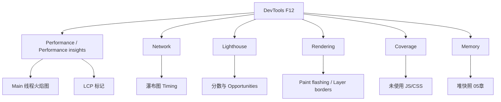
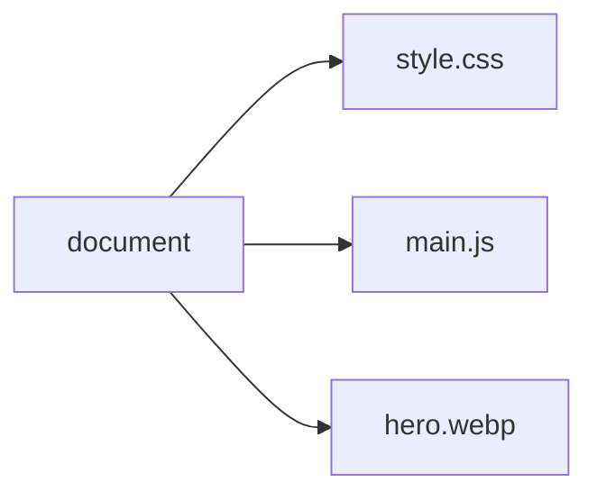
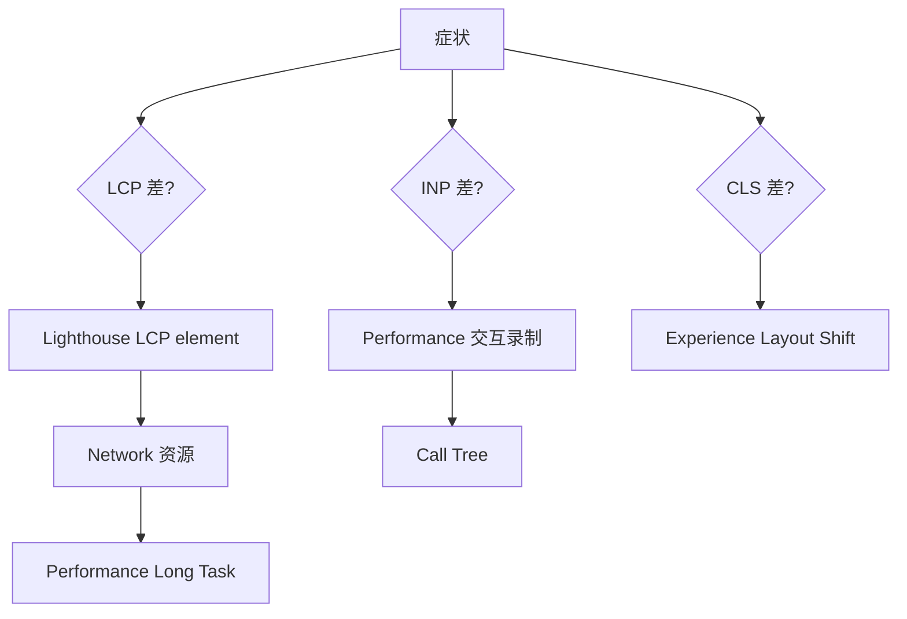

# Chrome DevTools 性能分析

<!-- 修改说明: 2026-06-30 按 EXPANSION-STANDARD 扩充 §0、DevTools 步骤表、FAQ 12 题、闭卷自测、费曼检验 -->

> **文件编码**：UTF-8。以 **Chrome 120+** 的 **Performance**、**Performance insights**、**Network**、**Lighthouse** 面板为准；Edge（Chromium）布局基本一致。

---

## 0. 读前导读（零基础也能跟上）

### 0.1 用一句话弄懂本章

**一句话**：02 章告诉你「LCP 3 秒算差」——本章教你 **F12 录一段、看火焰图、对齐 Network**，找出是谁拖慢的。

**生活类比**：指标是体温计读数；DevTools 是 CT 片——要对着片找病灶。

### 0.2 你需要提前知道什么

| 能力 | 章节 |
|------|------|
| CRP、reflow | 浏览器 01 ✅ |
| LCP/INP/TTFB | 浏览器 02 ✅ |
| Lighthouse 初体验 | 浏览器 00 §13 ✅ |

### 0.3 本章知识地图（☐→☑）

- [ ] 独立录制首屏 Performance 并找 Long Task
- [ ] Network 读 document 与 LCP 资源的 Timing、Priority
- [ ] 跑通 Lighthouse 并读懂 Opportunities 一项
- [ ] 能描述 §7 三条联合排查流之一
- [ ] 闭卷自测 ≥ 8/10

### 0.4 建议学习时长与节奏

| 阶段 | 时间 | 内容 |
|------|------|------|
| §2～3 Performance | 1.5 h | 录制 + Main 线程 |
| §5～6 Network/Lighthouse | 1 h | 瀑布 + 报告 |
| §10～12 三个实操 | 1 h | Long Task / LCP / CLI |
| 闭卷 | 30 min | §23 |

### 0.5 学完本章你能做什么

1. 对「首屏慢」给出 Lighthouse → Network → Performance 证据链。
2. 在 Call Tree 里找到导致 Long Task 的函数/ chunk。
3. 用 Coverage 发现 70% unused JS 并带到 04 章 split。
4. 解释为何 preview 比 dev 更适合测 Lighthouse。

---

## 本章与上一章的关系

[02 性能指标与 Core Web Vitals](./02-性能指标与CoreWebVitals.md) 讲了 **LCP、INP、CLS** 等指标「是什么、多少算好」。[00 章](./00-学习路线图与说明.md) §13 你已跑过 Lighthouse 初体验。

**本章（03）** 聚焦 **怎么查**：Performance 火焰图如何读、Network 瀑布如何对齐 TTFB/LCP、Lighthouse 与 Performance insights 如何联合定位 **Long Task、Layout、第三脚本**。学完后面对「页面卡」不会只会刷新，而是能录一段 30s 分析给出证据链。

**下一章（04 前端资源加载优化）** 在定位瓶颈后讲 **preload、code split、CDN** 等改法。

**前置自检**：

| 能力 | 对应章节 | 本章是否依赖 |
|------|----------|--------------|
| CRP、reflow | 浏览器 01 | ✅ |
| FCP/LCP/TTFB/INP | 浏览器 02 | ✅ |
| Network 看 Headers | HTML 10、计网 04 | ✅ |
| 会 F12 打开 DevTools | 00 §13 | ✅ |

---

## 1. DevTools 性能相关面板地图



| 面板 | 主要用途 | 本章 |
|------|----------|------|
| Performance | 录制运行时：JS、Layout、Paint | ✅ 主线 |
| Performance insights | 简化 LCP/INP 分解 | ✅ |
| Network | 资源时序、TTFB、优先级 | ✅ |
| Lighthouse | 综合审计与建议 | ✅ |
| Rendering | 可视化 reflow/paint/层 | 与 01 章衔接 |
| Coverage | 构建前删 dead code | 04 章延伸 |
| Memory | 泄漏 | 05 章 |

---

## 2. Performance 面板基础

### 2.1 何时用 Performance

- 页面**滚动卡、点击迟、路由切换顿**  
- 首屏加载要拆 **Long Task**  
- 对比优化前后 Main 线程  

**不必用**：纯网络慢且无 JS（先看 Network）。

### 2.2 录制前准备

1. **隐身模式**或干净 Profile，减少扩展干扰  
2. **Disable cache**（Network 里）若测冷启动  
3. CPU **不要**长期 4x 降速（除非模拟低端机——Throttling 见 §2.4）  
4. 关无关标签页  

### 2.3 录制步骤（标准流程）

**手把手：录首屏加载**

| 步骤 | 你的动作 | 预期看到什么 | 若不对 |
|------|----------|--------------|--------|
| 1 | 打开 shop-vue `/` 或目标页 | 页面就绪 | |
| 2 | F12 → **Performance**；勾 Screenshots、Memory（可选） | 配置就绪 | |
| 3 | 点 **Record** 或 `Ctrl+E` | 录制中 | |
| 4 | **立即** `Ctrl+R` 刷新 | 重载开始 | 未刷新则录不到加载 |
| 5 | 等 LCP 内容出现 + 2～3 秒 → **Stop** | Screenshots 胶片条 | 录太短则信息不足 |
| 6 | Main 轨道查看黄/紫/绿条；Summary 看 Long tasks | 有 Scripting/Layout/Paint | 滚轮缩放时间轴 |
| 7 | 若有 LCP 竖线/标记，对齐 Network 中 LCP 资源时间 | 时间大致吻合 | 用 Performance insights 备选 |

### 2.4 CPU / Network 节流

Performance 左上角 **齿轮** 或 **Capture settings**：

| 设置 | 用途 |
|------|------|
| CPU: 4x slowdown | 模拟中端移动 CPU |
| Network: Fast 3G | 模拟弱网 + 加载 |

与 Lighthouse Mobile 模拟类似；**对比优化时固定同一设置**。

---

## 3. 读懂 Main 线程火焰图

### 3.1 轨道结构（自上而下常见）

| 轨道 | 内容 |
|------|------|
| Frames | 帧率，绿线理想 60fps |
| Main | JS、Parse HTML、Layout、Paint |
| Raster | 栅格化 |
| GPU | 合成 |
| Network | 请求（部分版本） |

**重点看 Main**。

### 3.2 常见任务颜色（概念）

| 活动 | 含义 |
|------|------|
| Scripting（黄） | JS 执行 |
| Rendering（紫） | Recalculate Style、Layout |
| Painting（绿） | Paint |
| System（灰） | 浏览器内部 |

点击色块 → **Bottom-Up** / **Call Tree** 看**哪条函数**耗时。

### 3.3 Long Task

**Long Task** = 主线程占用 **> 50ms** 的任务（无响应输入，伤 INP/FID）。

火焰图带 **红色角标** 或 Summary 里 **Long tasks** 统计。

**排查**：

1. 点最长黄块  
2. Call Tree 展开 → 找 `app.js`、`vue`、`chunk` 或某 handler  
3. 对应 **04 code split** 或 **05 debounce**  

### 3.4 Layout / Recalculate Style 过多

若 Main 里密集 **Layout** 紫色条：

- 回顾 [01 章 layout thrashing](./01-浏览器渲染原理与关键路径.md)  
- 检查动画是否用 `left` 而非 `transform`  
- 列表是否一次 mount 过多 DOM  

---

## 4. Performance insights（Chrome 新体验）

部分 Chrome 版本在 **Performance insights** 独立标签（与 Legacy Performance 并存）。

### 4.1 典型能力

- **LCP breakdown** 可视化  
- **INP** 相关交互延迟提示  
- 对开发者更「问答式」  

### 4.2 实操

1. F12 → **Performance insights**  
2. **Measure page load**  
3. 读 **Largest Contentful Paint** 各阶段占比  
4. 点 **Related node** 跳到 Elements  

**与 Lighthouse 关系**：insights 偏单次深度；Lighthouse 偏审计清单。两者互补。

---

## 5. Network 面板深度使用

### 5.1 瀑布图阅读顺序

对**首屏**建议按 **Start Time** 排序看：

1. **document**（HTML）  
2. **blocking CSS**  
3. **sync/defer JS**  
4. **LCP 图片/字体**  
5. 其他  



### 5.2 Timing 字段对照（document 请求）

| 字段 | 对应 |
|------|------|
| Queueing | 浏览器排队 |
| DNS Lookup | [计网 03 DNS](../计算机网络/03-IP地址与DNS解析.md) |
| Initial connection | TCP（+ TLS） |
| SSL | HTTPS 握手 |
| **Waiting (TTFB)** | 服务端首字节 |
| Content Download | 下载 HTML  body |

### 5.3 Priority（优先级）

列显示 **Priority**：Highest / High / Medium / Low。

- LCP 图应 **High**；误设 lazy 会变 Low  
- preload 可提升关键资源优先级（04 章）  

**实操**：

1. Network 右键表头 → 勾 **Priority**  
2. 刷新，找 LCP 图片优先级  

### 5.4 Initiator 链

点某 JS → **Initiator** 看谁 `import` 或 `<script>` 拉起——查**意外大包**从哪来。

### 5.5 过滤技巧

| 过滤 | 作用 |
|------|------|
| `domain:cdn.example.com` | 只看 CDN |
| `is:running` | 进行中 |
| `mime-type:application/javascript` | 只看 JS |
| `larger-than:100k` | 大资源 |

---

## 6. Lighthouse 面板进阶

### 6.1 模式

| Mode | 用途 |
|------|------|
| Navigation | 冷加载整页（最常用） |
| Timespan | 一段时间交互 |
| Snapshot | 当前状态 |

测 **CWV** 用 **Navigation + Performance**。

### 6.2 Categories 选择

- 只查性能：勾 **Performance**  
- 同时要 SEO/无障碍：按需加  

### 6.3 报告结构

1. **Metrics**：FCP、LCP、TBT、CLS、SI  
2. **Opportunities**：可节省时间的改法（估算 ms）  
3. **Diagnostics**：更多细节（LCP 元素、主线程工作 breakdown）  
4. **Passed audits**  

### 6.4 导出与 CI

- **Save report** HTML  
- CLI：`npx lighthouse https://example.com --view`（04、10 章 CI 延伸）  

---

## 7. 联合排查工作流

### 7.1 首屏慢（LCP 差）

```text
Step 1: Lighthouse → LCP 数值 + LCP element
Step 2: Network → 该资源 Timing + Priority + 是否 lazy
Step 3: Performance → LCP 前 Main 是否有 Long Task 阻塞渲染
Step 4: 04 章：preload / 压缩 / split
```

### 7.2 交互卡（INP 差）

```text
Step 1: Performance → Record 点击/输入操作（Timespan 或手动录）
Step 2: 找点击时刻后 Long Task
Step 3: Call Tree → 组件/handler
Step 4: 05 章 debounce / 减 DOM / memo
```

### 7.3 布局跳（CLS 差）

```text
Step 1: Performance → Experience → Layout Shift
Step 2: 点 shift 看 Elements
Step 3: 补 width/height、aspect-ratio、预留 slot
```



---

## 8. Rendering 与 Coverage 辅助面板

### 8.1 Rendering（F12 → More tools → Rendering）

| 选项 | 用途 |
|------|------|
| Paint flashing | 重绘区域绿闪 |
| Layout Shift Regions | 实时标 shift |
| Layer borders | 合成层边界 |
| Frame Rendering Stats | FPS |

配合 [01 章 §12](./01-浏览器渲染原理与关键路径.md) demo。

### 8.2 Coverage

1. `Ctrl+Shift+P` → type **Coverage** → **Start instrumenting coverage**  
2. 刷新并操作主要路径  
3. 看 JS/CSS **未使用字节比例**  

**预期**：vendor 若 70% 未使用 → 04 章 tree-shaking、按需 import。

---

## 9. Vue / React DevTools 与 Performance 配合

### 9.1 何时开框架 DevTools

- 怀疑**多余 re-render**（非纯浏览器 layout）  
- [Vue 05](../Vue/05-组合式API与script-setup.md) 组件更新频率  

**流程**：

1. Vue DevTools → **Performance** 或 **Component render** 追踪  
2. 与 Chrome Performance **同一操作**各录一次  
3. 对齐时间点：是 Vue patch 多还是浏览器 Layout 多  

### 9.2 React Profiler

React DevTools → **Profiler** → Record → 看 **Commit** 耗时。  
Commit 高但 Main Layout 低 → 优化 React；两者都高 → DOM 过大或 layout thrashing。

---

## 10. 手把手实操一：定位 Long Task

### 10.1 制造 Long Task demo

`long-task-demo.html`：

```html
<!DOCTYPE html>
<html lang="zh-CN">
<head>
  <meta charset="UTF-8" />
  <title>Long Task Demo</title>
</head>
<body>
  <button id="btn">点击触发 200ms 同步计算</button>
  <script>
    document.getElementById('btn').onclick = () => {
      const start = performance.now();
      while (performance.now() - start < 200) {}
    };
  </script>
</body>
</html>
```

### 10.2 录制

1. Performance → Record  
2. 点按钮 2 次  
3. Stop  

**预期**：

- Main 上两段 ~200ms 黄块  
- Summary：**Long tasks** ≥ 2  
- 点击到下一帧绘制延迟变大（伤 INP）  

### 10.3 修复思路（05 章）

用 `requestIdleCallback` / 分片 / Worker 处理重计算——demo 仅用于**认图**。

---

## 11. 手把手实操二：Network + Performance 对齐 LCP

### 11.1 页面要求

含一张大图 ``（或 shop Banner）。

### 11.2 Network

1. Disable cache → 刷新  
2. 找到 hero 请求，记 **Start Time**、**Duration**、**Priority**  

### 11.3 Performance

1. 录加载  
2. 找 **LCP** 标记时间 T_lcp  
3. 对比 T_lcp 是否 ≈ hero **下载完成 + 绘制**  

**若 hero Start Time 很晚**：HTML 发现晚 → preload；或 JS 阻塞解析。  
**若 Download 很长**：04 章压缩与 CDN。

---

## 12. 手把手实操三：Lighthouse CLI

```powershell
npx lighthouse http://localhost:4173 --only-categories=performance --output=html --output-path=./lh-report.html --view
```

（先 `npm run build && npm run preview` 得到 4173。）

**预期**：自动打开 HTML 报告；Metrics 与面板一致量级。

---

## 13. 常见报错与误解

| 现象 | 原因 | 处理 |
|------|------|------|
| Performance 空白 | 未刷新或未 Stop | 录时 Ctrl+R |
| 火焰图看不懂 | 缩放过大 | 滚轮缩放；选 Summary |
| Network 与 Performance 时间对不齐 | 录制起点不同 | 从刷新瞬间开录 |
| Lighthouse 每次差 20 分 | 扩展、热机、后台 | 隐身、关扩展、多次中位 |
| 无 LCP 线 | 旧版或 SPA 特殊 | 用 insights / Lighthouse |
| Throttling 开太大 | 极端慢网 | 与目标用户环境匹配 |
| 只看 Network 忽略 Main | JS 阻塞 | 联合 Performance |
| Coverage 100% 未使用 | 未操作到路由 | 覆盖主要 user flow |
| Vue dev 模式 HMR 干扰 | dev 非生产 | preview/build 测 |
| 「Redux DevTools 导致 Long Task」 | 扩展注入 | 隐身复测 |

---

## 14. 深入：为什么 preview 比 dev 更适合 Lighthouse？

Vite **dev**：

- 未打包、ESM 大量请求  
- HMR 客户端额外 JS  
- 不代表现网  

**preview** 服务 **build** 产物，接近 [Vue 10](../Vue/10-Vite构建与项目部署.md) 上线形态。02、04 章指标应在 preview 或 staging 验收。

---

## 15. 与计网 DevTools 的衔接

| 计网所学 | DevTools 位置 |
|----------|---------------|
| DNS | Network → Timing → DNS Lookup |
| TCP/TLS | Initial connection / SSL |
| TTFB | Waiting for server response |
| 缓存 304 | Status 304、Size disk cache |
| HTTP/2 多路复用 | Protocol 列 h2 |

见 [计网 04](../计算机网络/04-HTTP协议深入.md)、[06 缓存](../计算机网络/06-缓存Cookie与会话机制.md)。

---

## 16. 练习建议

### 16.1 基础

1. 列出 Performance 录制 6 步（§2.3）。  
2. Network 里 TTFB 对应 Timing 哪一项？  
3. Long Task 阈值大约多少 ms？

### 16.2 进阶

1. 对 shop 或 demo 录首屏，用文字描述 Main 上占比最高的两类活动。  
2. 用 Network 找最大 JS 文件及 Initiator。  
3. 跑 Lighthouse CLI 生成一份 html 报告。

### 16.3 挑战

1. 写「LCP 3s」排查清单 5 步（引用本章面板名）。  
2. 对比 dev 与 preview 同一页 Lighthouse 分数差异并解释。

### 16.4 参考答案（基础）

1. 见 §2.3 五步 + Stop。  
2. **Waiting for server response**。  
3. **> 50ms**（主线程）。

---

## 21.1 扩展：DevTools 快捷键

| 操作 | 快捷 | 场景 |
|------|------|------|
| DevTools | F12 | 全系列 |
| 命令面板 | `Ctrl+Shift+P` | Coverage、Rendering |
| Performance 录制 | `Ctrl+E` | §2.3 |
| 硬刷新 | `Ctrl+Shift+R` | Network 冷启动 |

---

## 21.2 扩展：Call Tree 阅读三步

1. Summary 看 Scripting/Rendering 占比。  
2. Bottom-Up 按 Self Time 找最长函数。  
3. 展开到 chunk/组件名 → 04 split 或 05 debounce。

---

## 21.3 扩展：首屏慢排查 checklist（可打印）

```text
□ Lighthouse Navigation Mobile Performance
□ 记录 LCP / CLS / TBT
□ Diagnostics → LCP element 选择器 + URL
□ Network Disable cache 刷新
□ document Waiting (TTFB)
□ LCP 资源 Priority / lazy / 体积
□ Performance Record+刷新 → Long Task 数量
□ Main 上 Layout 是否密集
□ Coverage 未使用 JS 比例
□ 是否在 preview/build 环境测（非 dev）
□ 对策映射 04 preload/split 或 05 debounce/虚拟列表
```

---

## 21.4 扩展：Rendering 面板选项速查

| 选项 | 作用 | 关联章 |
|------|------|--------|
| Paint flashing | 重绘区域绿闪 | 01 §12 |
| Layout Shift Regions | 实时标 CLS | 02 §4.5 |
| Layer borders | 合成层边界 | 01 §6.3 |
| Frame Rendering Stats | FPS 统计 | 05 滚动 |
| Scrolling performance issues | 滚动问题提示 | 05 |

打开：`F12` → `Ctrl+Shift+P` → 输入 `Rendering` → **Show Rendering**。

---

## 22. FAQ

**Q1：Performance 录出来空白？**  
录时未刷新或未 Stop；应 Record 后立即 Ctrl+R。

**Q2：火焰图看不懂怎么办？**  
先看 Summary；点最长黄块 → Call Tree 展开。

**Q3：Network 与 Performance 时间对不齐？**  
录制起点不同；从刷新瞬间开录。

**Q4：Lighthouse 每次差 20 分？**  
扩展、热机、后台任务；隐身、关扩展、多次取中位。

**Q5：没有 LCP 竖线？**  
版本差异；用 Performance insights 或 Lighthouse。

**Q6：只查 Network 够吗？**  
不够；JS 阻塞要看 Main 线程 Long Task。

**Q7：Coverage 100% unused？**  
未操作到所有路由；覆盖主要 user flow。

**Q8：dev 模式 Lighthouse 低分正常吗？**  
正常；HMR 干扰；用 preview/build 测。

**Q9：Vue DevTools 和 Chrome Performance 怎么配合？**  
同一操作各录一次，对齐是 Vue patch 多还是 Layout 多。

**Q10：Throttling 开多大合适？**  
与目标用户环境匹配；对比优化时固定同一设置。

**Q11：Long Task 阈值？**  
主线程 **>50ms**。

**Q12：读完本章下一步？**  
[04 前端资源加载优化](./04-前端资源加载优化.md)——定位后改 preload/split。

---

## 23. 闭卷自测

1. Performance 录制首屏 7 步（§2.3 表）？
2. Network 里 TTFB 对应 Timing 哪一项？
3. Long Task 阈值？火焰图里常见颜色含义（Scripting/Layout/Paint）？
4. 首屏 LCP 差联合排查 4 步（§7.1）？
5. preload 与 prefetch 在 Network Priority 上差异？
6. Coverage 面板用来干什么？
7. 为何 preview 比 dev 更适合 Lighthouse？
8. **动手**：long-task-demo 录 Performance，确认 Long tasks ≥2。
9. **动手**：Network 勾 Priority，找最大 JS 的 Initiator。
10. **综合**：写「LCP 3s」五步排查清单（须含 Lighthouse、Network、Performance 面板名）。

### 23.1 自测参考答案

1. 见 §2.3 七步表。  
2. Waiting for server response。  
3. >50ms；黄=JS、紫=Layout、绿=Paint。  
4. Lighthouse LCP element → Network 资源 → Performance Long Task → 04 优化。  
5. preload 高；prefetch 低。  
6. 看 JS/CSS 未使用字节比例，指导 split。  
7. dev 有 HMR/未打包；preview 接近生产。  
8～9. （完成即得分。）  
10. 同 §7.1 + §7 流程图。

---

## 24. 费曼检验

请用 **3 分钟** 解释「页面卡了，我怎么用 DevTools 查」。对照提纲：

1. **先分症状**：首屏慢→LCP 链；点击迟→INP/Long Task；页面跳→CLS/Experience。  
2. **三面板**：Lighthouse 要数字；Network 看资源和 TTFB；Performance 看 Main 谁占 50ms+。  
3. **出结论**：带着 LCP element URL 和 Call Tree 函数名去改——04/05 章落地。

---

## 17. 下一章预告

**[04 前端资源加载优化](./04-前端资源加载优化.md)**：

- **lazy load** 图片与路由  
- **code split**（Vite dynamic import）  
- **preload / prefetch / preconnect**  
- **CDN** 与缓存策略  

建议：本章 Coverage 若发现大 unused JS，带到 04 章做 split。

---

## 18. 学完标准（03 章）

- [ ] 独立录制首屏 Performance 并找到 Long Task  
- [ ] Network 读过 document 与 LCP 资源的 Timing、Priority  
- [ ] 跑通 Lighthouse 并读懂 Opportunities 一项  
- [ ] 能描述 §7 三条联合排查流之一  
- [ ] 完成 §16 基础 + 进阶练习  

全部打勾 → 进入 **04 前端资源加载优化**。
