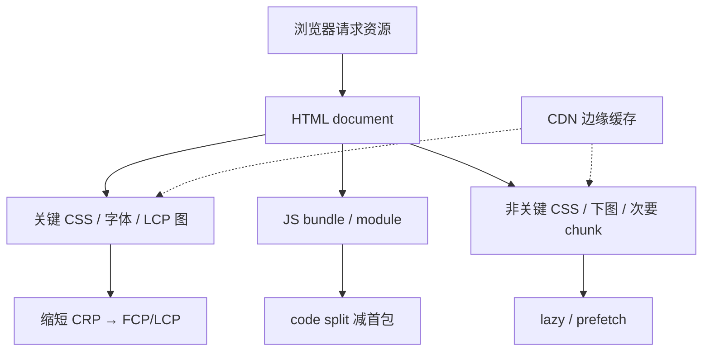
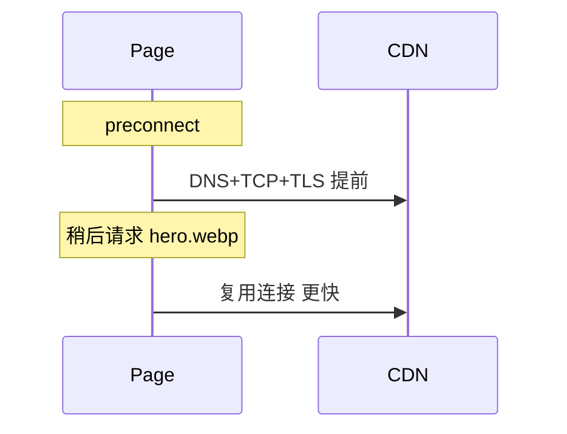

# 前端资源加载优化

<!-- 修改说明: 2026-06-30 按 EXPANSION-STANDARD 扩充 §0、DevTools 步骤表、FAQ 12 题、闭卷自测、费曼检验 -->

> **文件编码**：UTF-8。构建示例以 **Vite 5+** 为准，与 [Vue 10](../Vue/10-Vite构建与项目部署.md)、[React 10](../React/10-Vite构建与项目部署.md) 对齐；HTTP 缓存见 [计网 06](../计算机网络/06-缓存Cookie与会话机制.md)。

---

## 0. 读前导读（零基础也能跟上）

### 0.1 用一句话弄懂本章

**一句话**：03 章定位了「LCP 图发现晚、chunk 太大」——本章改 **何时加载什么**：lazy、split、preload、CDN。

**生活类比**：搬家——常用家具先搬（preload）， сезон衣服以后搬（lazy），大衣柜拆件进门（code split）。

### 0.2 你需要提前知道什么

| 能力 | 章节 |
|------|------|
| CRP、阻塞 | 浏览器 01 ✅ |
| LCP、Priority | 浏览器 02～03 ✅ |
| HTTP 缓存 | 计网 06 建议 |
| Vue Router | Vue 06 建议 |

### 0.3 本章知识地图（☐→☑）

- [ ] preload/prefetch/preconnect 差异
- [ ] Vue/React 路由 lazy + Network 验证
- [ ] LCP 图 preload 且禁止 lazy
- [ ] CDN + 指纹缓存策略
- [ ] 闭卷自测 ≥ 8/10

### 0.4 建议学习时长与节奏

| 阶段 | 时间 | 内容 |
|------|------|------|
| §2～3 图片与 link | 1 h | lazy、preload |
| §4 code split | 1 h | Vite build |
| §12～13 实操 | 45 min | split + preload |
| 闭卷 | 30 min | §24 |

### 0.5 学完本章你能做什么

1. 配路由 lazy 并在 Network 证明 admin chunk 延迟加载。
2. 给 LCP 图加 preload 并对比 Lighthouse Resource load delay。
3. 写出 hash 静态资源与 index.html 的 Cache-Control 策略。
4. 向面试官讲清 preload 与 prefetch 区别。

---

## 本章与上一章的关系

[03 Chrome DevTools 性能分析](./03-ChromeDevTools性能分析.md) 教你用 Lighthouse、Network、Performance **定位**瓶颈：render-blocking JS、LCP 图发现晚、chunk 过大等。

**本章（04）** 讲 **怎么改加载策略**：图片/路由 **lazy load**、**code split**、**preload / prefetch / preconnect**、**CDN** 与缓存头配合。目标是把 [02 章](./02-性能指标与CoreWebVitals.md) 的 LCP、FCP 和 Network 瀑布拉短。

**下一章（05 运行时性能与内存）** 在「资源到了之后」讲主线程：debounce、虚拟列表、SPA 泄漏。

**前置自检**：

| 能力 | 对应章节 | 本章是否依赖 |
|------|----------|--------------|
| CRP、阻塞 CSS/JS | 浏览器 01 | ✅ |
| LCP、TTFB、Priority | 浏览器 02～03 | ✅ |
| HTTP 缓存、CDN 概念 | 计网 03、06 | ✅ |
| Vue Router / dynamic import 见过 | Vue 06 | 建议有 |

---

## 1. 资源加载在性能中的位置



**原则**：

1. **关键路径资源少而早**  
2. **非关键资源晚而按需**  
3. **能缓存则强缓存 + 指纹文件名**  

---

## 2. 图片 lazy load

### 2.1 原生 lazy loading

```html

```

- **`loading="lazy"`**：接近视口再加载  
- **LCP 图禁止 lazy**（02 章）—— Banner 用 `fetchpriority="high"` 或不 lazy  

### 2.2 与 CLS

lazy 图仍须 **width/height** 或 **aspect-ratio**，否则占位 collapse → CLS。

### 2.3 响应式图片

```html

```

**DevTools**：Network 看是否下载过大宽度文件。

### 2.4 背景图

CSS `background-image` 难被浏览器标为 LCP 候选且无法 native lazy——**hero 优先 ``**。

### 2.5 Vue 中的 lazy

```vue
<script setup>
// 路由级 lazy 见 §4；图片直接用 loading="lazy"
</script>
<template>
  
</template>
```

列表页见 [Vue 08](../Vue/08-Axios网络请求与前后端联调.md) 商品列表。

---

## 3. `<link rel="preload">` / `prefetch` / `preconnect`

### 3.1 对比总表

| 指令 | 时机 | 优先级 | 典型用途 |
|------|------|--------|----------|
| **preload** | 当前导航**马上**需要 | 高 | LCP 图、关键字体、首屏 CSS |
| **prefetch** | **下一**导航可能用 | 低 | 下一路由 chunk |
| **preconnect** | 提前 DNS+TCP+TLS | — | 第三方源、CDN 域 |
| **dns-prefetch** | 仅 DNS | 更低 | 多域预解析 |

### 3.2 preload 示例

```html
<link rel="preload" href="/fonts/shop.woff2" as="font" type="font/woff2" crossorigin />
<link rel="preload" href="/images/hero.webp" as="image" />
```

**注意**：

- `as` 必填，否则优先级错误  
- 字体需 **crossorigin**  
- 勿 preload 过多——抢带宽  

### 3.3 prefetch 示例

```html
<link rel="prefetch" href="/assets/AdminView-abc123.js" as="script" />
```

Vite 构建可能对动态 import 的路由 chunk 自动 prefetch（取决于插件与用法）。

### 3.4 preconnect

```html
<link rel="preconnect" href="https://cdn.example.com" crossorigin />
```

用于 LCP 图在 CDN 域时减连接延迟（配合 [计网 03 CDN](../计算机网络/03-IP地址与DNS解析.md)）。



### 3.5 modulepreload（ESM）

```html
<link rel="modulepreload" href="/assets/index-xxx.js" />
```

Vite 生产 HTML 常注入对 entry 与关键 chunk 的 modulepreload。

---

## 4. Code Splitting（代码分割）

### 4.1 为什么 split

单 bundle 2MB → 下载 + 解析 Long Task → FCP/LCP/INP 全差（03 章）。

**目标**：首屏只加载 **当前路由必需** JS。

### 4.2 路由级 lazy（Vue Router）

```javascript
// router/index.js
const routes = [
  {
    path: '/',
    component: () => import('../views/HomeView.vue'),
  },
  {
    path: '/admin',
    component: () => import('../views/AdminView.vue'),
  },
];
```

见 [Vue 06 Vue Router](../Vue/06-Vue-Router路由管理.md)。

### 4.3 路由级 lazy（React Router）

```javascript
import { lazy, Suspense } from 'react';
const AdminPage = lazy(() => import('./pages/AdminPage'));

// JSX
<Suspense fallback={<div>加载中...</div>}>
  <AdminPage />
</Suspense>
```

见 [React 06](../React/06-React-Router路由管理.md)。

### 4.4 组件级 dynamic import

```javascript
// 重组件按需
const RichEditor = defineAsyncComponent(() => import('./RichEditor.vue'));
```

仅当用户点开「编辑」才下载 editor chunk。

### 4.5 Vite 构建分析

```powershell
npm run build
```

看 `dist/assets/` 各 chunk 大小；或用：

```powershell
npm i -D rollup-plugin-visualizer
```

在 `vite.config.js` 中配置 visualizer（[Vue 10](../Vue/10-Vite构建与项目部署.md) 延伸）。

**预期**：`index-xxx.js` 主包明显小于未 split 前；`AdminView-xxx.js` 仅访问 `/admin` 才出现在 Network。

### 4.6 manualChunks（vendor 拆分）

```javascript
// vite.config.js
export default defineConfig({
  build: {
    rollupOptions: {
      output: {
        manualChunks: {
          vue: ['vue', 'vue-router', 'pinia'],
          element: ['element-plus'],
        },
      },
    },
  },
});
```

**权衡**：chunk 过多 → HTTP 请求数上升；HTTP/2 多路复用缓解（计网 04 HTTP/2）。

---

## 5. script 加载策略回顾

| 方式 | 行为 |
|------|------|
| 普通 `<script src>` | 阻塞 HTML 解析 |
| `defer` | 并行下载，DOM 就绪后顺序执行 |
| `async` | 下完即执行，无序 |
| `type="module"` | 默认 defer 行为 |

**Vite 开发/生产** entry 为 module；勿再包一层阻塞 script。

---

## 6. CSS 加载优化

### 6.1 关键 CSS

首屏样式尽量小：

- 内联 **critical CSS**（Above-the-fold）到 `<style>`（进阶）  
- 非关键 CSS `media="print" onload="this.media='all'"` 异步（慎用，维护成本）  
- 更常见：**减 CSS 体积**、Tailwind purge、按路由拆 CSS（框架构建处理）  

### 6.2 阻塞

外链 CSS 仍阻塞首次渲染（01 章）。减少无用全局 CSS；Element Plus 等按需引入（[Vue 09](../Vue/09-Element-Plus与UI工程化.md)）。

---

## 7. CDN 内容分发

### 7.1 CDN 做什么

把静态资源（JS/CSS/图/字体）放到**边缘节点**，用户就近下载，降 **RTT** 与源站压力。见 [计网 03](../计算机网络/03-IP地址与DNS解析.md)。

### 7.2 前端配置（Vite）

```javascript
// vite.config.js
export default defineConfig({
  base: 'https://cdn.example.com/shop/',
  build: {
    assetsDir: 'assets',
  },
});
```

**注意**：HTML 往往仍从源站；仅静态资源 CDN。跨域字体需 CORS 头。

### 7.3 缓存策略配合

| 资源 | Cache-Control 常见 |
|------|-------------------|
| `index.html` | `no-cache` 或短 max-age（要更新） |
| `app.[hash].js` | `max-age=31536000, immutable` |
| 图片带 hash | 长缓存 |

指纹文件名 + 长缓存 = 安全强缓存（计网 06）。

### 7.4 第三方 CDN 库（谨慎）

```html
<script src="https://cdn.jsdelivr.net/npm/vue@3"></script>
```

**缺点**：版本不可控、额外连接、SRI 维护。现代项目更倾向 **npm + Vite 打包**。

---

## 8. 字体加载

```css
@font-face {
  font-family: 'Shop';
  src: url('/fonts/shop.woff2') format('woff2');
  font-display: swap;
}
```

```html
<link rel="preload" href="/fonts/shop.woff2" as="font" type="font/woff2" crossorigin />
```

- **woff2** 优先  
- **subset** 减体积  
- **font-display** 平衡 CLS 与 FOIT（02 章）  

---

## 9. HTTP 缓存与加载

### 9.1 强缓存 vs 协商

| | 强缓存 | 协商缓存 |
|---|--------|----------|
| 状态码 | 200 (from disk cache) | 304 |
| 头 | Cache-Control / Expires | ETag / Last-Modified |

首屏 **document** 常协商；**hash 静态资源**强缓存。

### 9.2 DevTools 验证

Network → Size 列 **memory cache** / **disk cache**；第二次刷新 JS 不应重新下载 body。

---

## 10. Service Worker 与 PWA（了解）

Service Worker 可拦截请求、离线缓存——进阶话题。与计网 06、HTML 10 提及的离线能力衔接。shop 初版可不实现；面试可说「Workbox 缓存静态资源」。

---

## 11. shop-vue 加载优化实战清单

| 步骤 | 动作 | 验证 |
|------|------|------|
| 1 | 首页 LCP 图 preload + fetchpriority | Lighthouse LCP ↓ |
| 2 | 商品列表图 loading=lazy + 尺寸 | Network 懒加载 |
| 3 | `/admin` 路由 lazy import | 首包不含 admin chunk |
| 4 | `build` + visualizer 查大包 | manualChunks |
| 5 | 静态资源上 CDN + 长缓存 | Response Headers |
| 6 | preview 跑 Lighthouse | 对比 dev |

---

## 12. 手把手实操：Vite 路由 split 验证

### 12.1 添加 lazy 路由

在 shop-vue router 中为 `/about` 或 `/admin` 使用 `() => import(...)`。

### 12.2 build

```powershell
cd shop-vue
npm run build
npm run preview
```

### 12.3 Network 验证步骤表

| 步骤 | 你的动作 | 预期看到什么 | 若不对 |
|------|----------|--------------|--------|
| 1 | 打开 `http://localhost:4173/` | preview 首页 | 先 build 再 preview |
| 2 | Network → **Disable cache** → 刷新 | document + 首屏 JS | 非 dev 模式 |
| 3 | 记录首屏 JS 文件名（无 AdminView-*.js） | 仅 home 相关 chunk | 检查 router lazy 写法 |
| 4 | 导航到 lazy 路由（如 `/admin`） | **新 chunk** 出现 | 404 则路径错 |
| 5 | 对比 build 输出 `dist/assets/` | 多文件 hash 命名 | visualizer 可选 |

---

## 13. 手把手实操：preload LCP 图

在 `index.html`（或 SSR 模板）：

```html
<link rel="preload" as="image" href="/hero.webp" />
```

对 preview URL 跑 Lighthouse，对比 **Resource load delay** 是否缩短。

### 13.1 preload 验证步骤表

| 步骤 | 你的动作 | 预期看到什么 | 若不对 |
|------|----------|--------------|--------|
| 1 | `index.html` 加 `<link rel="preload" as="image" href="/hero.webp">` | 保存成功 | URL 与 LCP 元素一致 |
| 2 | `npm run build && npm run preview` | 4173 可访问 | 非 dev 测 |
| 3 | Lighthouse Mobile 跑两次（改前/改后） | Resource load delay 缩短 | 仍慢则查 as/URL |
| 4 | Network 看 hero Priority | High | lazy 会变 Low |

---

## 14. 常见报错与误解

| 现象 | 原因 | 处理 |
|------|------|------|
| preload 后仍慢 | preload 错了 URL 或 as | 与 LCP 元素 URL 一致 |
| lazy LCP 图 | LCP 延迟 | 去掉 LCP lazy |
| split 后请求过多 | chunk 太碎 | 合并小 chunk |
| CDN 404 | base 路径错 | 检查 `base` 与上传目录 |
| 字体 preload 无效 | 缺 crossorigin | 加 crossorigin |
| prefetch 占带宽 | 预取过多路由 | 只 prefetch 高概率页 |
| hash 文件仍 304 | 配置错误 | immutable + 长 max-age |
| dynamic import 失败 | 路径错 | Network 404 |
| Element 全量引入 | 包大 | 按需 import |
| HTTP/1.1 队头阻塞 | 多域无 HTTP/2 | 同域 HTTP/2（计网 04） |

---

## 15. 深入：为什么 code split 不必然更快？

若 **每个小 chunk 都阻塞渲染** 或 **瀑布串行**，总时间可能更长。最佳实践：

- 首屏 **一个** 小 main + vendor  
- 路由 chunk **并行** prefetch 下一页  
- 避免循环依赖导致 chunk 合并失败  

---

## 16. 与 React / Vue 10 部署衔接

[Vue 10](../Vue/10-Vite构建与项目部署.md) 的 `build`、`preview`、环境变量 `VITE_*` 与本章优化在 **preview/staging** 验收。生产 Nginx 配 gzip/brotli、静态长缓存（[Linux 13](../../后端学习/Linux/08-NginxTLS与反向代理.md)）。

---

## 17. 练习建议

### 17.1 基础

1. preload 与 prefetch 区别？  
2. 为何 LCP 图不能 lazy？  
3. Vue 路由 lazy 写法一行？

### 17.2 进阶

1. 完成 §12，截图 Network 首屏 JS 列表。  
2. 给 `index.html` 加一条 preconnect 到 CDN 并说明场景。  
3. 读计网 06，写出 hash 文件名应用的 Cache-Control。

### 17.3 挑战

1. 用 visualizer 找 shop 最大依赖，提一条 split 或按需方案。  
2. 写 200 字「从 3MB 首包到 800KB」优化步骤。

### 17.4 参考答案（基础）

1. preload 当前页急需、高优先级；prefetch 下一页可能用、低优先级。  
2. lazy 推迟 LCP 资源下载，直接恶化 LCP 指标。  
3. `component: () => import('../views/X.vue')`。

---

## 22.1 扩展：Vite build 产物逐行读（概念）

| 字段/文件 | 含义 | 改错会怎样 |
|-----------|------|------------|
| `dist/index.html` | 入口，引用 hash JS | 无 hash 则缓存策略难做 |
| `assets/index-*.js` | 主包 | 过大则 Long Task |
| `assets/AdminView-*.js` | lazy 路由 chunk | 首屏不应加载 |
| `[hash]` | 内容变则变 | 可 immutable 长缓存 |
| `modulepreload` 注入 | Vite 预加载 ESM | 手动 preload LCP 图仍要加 |

---

## 22.2 扩展：资源优先级与浏览器调度（了解）

```text
浏览器大致优先级（简化）：
  Highest — document、preload 的关键 CSS/字体/LCP 图
  High    — 首屏 script（module/defer）、LCP 候选
  Medium  — 普通 script、css
  Low     — lazy 图、prefetch

面试句：「LCP 图误 lazy 会从 High 降到 Low，直接恶化 LCP。」
```

---

## 22.3 扩展：shop 加载优化前后 Network 对比表（模板）

| 资源 | 优化前 | 优化后 | 验证 |
|------|--------|--------|------|
| main.js 首屏 | 2.1MB 单包 | 420KB + lazy admin | §12.3 |
| hero.webp | 2MB png，lazy | 120KB WebP，preload | §13.1 |
| vendor chunk | 合在主包 | manualChunks 独立 | visualizer |
| 二次访问 JS | 200 full | disk cache | 计网 06 |

---

## 23. FAQ

**Q1：preload 后 LCP 仍慢？**  
检查 URL/as 是否与 LCP 元素一致；勿 preload 过多抢带宽。

**Q2：LCP 图能 lazy 吗？**  
**不能**；lazy 推迟 LCP 资源。

**Q3：split 后请求过多？**  
chunk 太碎；HTTP/2 多路复用缓解，可 manualChunks 合并 vendor。

**Q4：CDN 404？**  
检查 Vite `base` 与上传目录一致。

**Q5：字体 preload 无效？**  
缺 **crossorigin**。

**Q6：prefetch 占带宽？**  
只 prefetch 高概率下一页。

**Q7：hash 文件仍 304？**  
应 immutable 长缓存；304 说明配置不当。

**Q8：dynamic import 404？**  
路径或 base 错误；Network 看请求 URL。

**Q9：Element Plus 全量引入？**  
包大；按需 import（Vue 09）。

**Q10：code split 一定更快？**  
若 chunk 串行阻塞仍慢；首屏要小 main + 并行 prefetch。

**Q11：CSS background hero 做 LCP？**  
难标 LCP；改 `` + preload。

**Q12：读完本章下一步？**  
[05 运行时性能与内存](./05-运行时性能与内存.md)——资源到了主线程仍可能卡。

---

## 24. 闭卷自测

1. preload 与 prefetch 区别（时机、优先级）？
2. 为何 LCP 图不能 lazy？
3. Vue 路由 lazy 一行写法？
4. preconnect 典型场景？
5. hash 文件名 + Cache-Control 策略（html vs js）？
6. `loading="lazy"` 与 CLS 关系？
7. manualChunks 解决什么问题？
8. **动手**：§12 步骤表验证 lazy 路由 chunk 延迟加载。
9. **动手**：index.html 加 LCP preload，Lighthouse 对比 Resource load delay。
10. **综合**：首包 3MB→800KB 写 4 步（须含 split、preload、lazy 至少各 1 概念）。

### 24.1 自测参考答案

1. preload 当前页急需、高优先级；prefetch 下一页可能、低优先级。  
2. lazy 推迟 LCP 下载，直接恶化 LCP。  
3. `component: () => import('../views/X.vue')`。  
4. LCP 图在 CDN 域，提前 DNS+TCP+TLS。  
5. html no-cache；`app.[hash].js` max-age 长 + immutable。  
6. lazy 图仍须 width/height 或 aspect-ratio 防 CLS。  
7. 把 vue/element 等 vendor 拆出，减主包。  
8～9. （完成即得分。）  
10. 路由 lazy 减首包；preload LCP；列表图 lazy；visualizer 按需引入 UI 库。

---

## 25. 费曼检验

请用 **3 分钟** 解释「怎么让 shop 首页 JS 少下、Banner 早显示」。对照提纲：

1. **少下**：路由 lazy，admin 不进首包；vendor manualChunks。  
2. **早显示**：LCP 图 preload + fetchpriority，勿 lazy。  
3. **验收**：build + preview + Lighthouse + Network 看 chunk 与 Priority。

---

## 18. 下一章预告

**[05 运行时性能与内存](./05-运行时性能与内存.md)**：

- **debounce / throttle**  
- **虚拟列表**  
- **SPA 内存泄漏** 与 Memory 面板  

建议：split 后的列表页若仍卡，05 章虚拟滚动。

---

## 19. 学完标准（04 章）

- [ ] 说清 preload/prefetch/preconnect 差异  
- [ ] 会配 Vue/React 路由 lazy 并 Network 验证  
- [ ] 知 LCP 图 preload 与禁止 lazy  
- [ ] 理解 CDN + 指纹缓存基本策略  
- [ ] 完成 §17 基础 + §12 实操  

全部打勾 → 进入 **05 运行时性能与内存**。

---

## 20. 扩展：Vite 构建产物与浏览器缓存

### 20.1 文件名 hash

Vite 默认 `[name]-[hash].js`，内容变则 hash 变 → 可安全 `immutable` 长缓存；`index.html` 无 hash，引用新 hash 文件。

### 20.2 分析命令

```powershell
npm run build 2>&1 | Select-String "kB"
```

关注 **index** 与 **vendor** 是否 > 500KB（gzip 前），超过则 split 或按需引入。

### 20.3 与 Nginx 配置示例（概念）

```nginx
location /assets/ {
  add_header Cache-Control "public, max-age=31536000, immutable";
}
location / {
  add_header Cache-Control "no-cache";
}
```

部署细节见 [Linux 13 Nginx](../../后端学习/Linux/08-NginxTLS与反向代理.md)。

### 20.4 import maps 与动态 import（了解）

原生 **import maps** 可映射 bare specifier；Vite 开发态已处理，生产以打包 chunk 为主。动态 `import()` 是 SPA code split 的标准 API，Webpack/Vite/Rollup 均支持静态分析分包边界。
