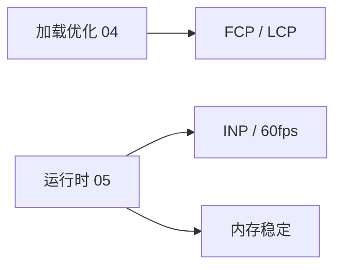
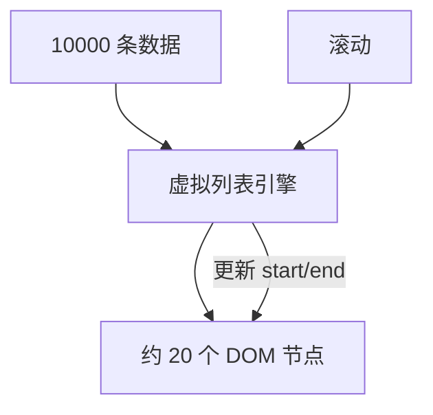

# 运行时性能与内存

<!-- 修改说明: 2026-06-30 按 EXPANSION-STANDARD 扩充 §0、DevTools 步骤表、FAQ 12 题、闭卷自测、费曼检验 -->

> **文件编码**：UTF-8。示例含原生 JS 与 **Vue 3 / React 18** 对照；内存分析以 Chrome **Memory** 面板为准。

---

## 0. 读前导读（零基础也能跟上）

### 0.1 用一句话弄懂本章

**一句话**：04 章让资源**到了**——本章解决到了之后还**卡、还涨内存**：debounce、虚拟列表、泄漏排查。

**生活类比**：货到了（加载），但厨房只有一人（主线程）——订单太多要排队（debounce），桌子太多要收（虚拟列表），垃圾不扔会堆（内存泄漏）。

### 0.2 你需要提前知道什么

| 能力 | 章节 |
|------|------|
| reflow、Long Task | 浏览器 01、03 ✅ |
| INP | 浏览器 02 ✅ |
| 事件监听 | HTML CSS JS 07 ✅ |
| Vue watch / React useEffect | Vue 03 / React 05 建议 |

### 0.3 本章知识地图（☐→☑）

- [ ] 手写 debounce/throttle 并说清区别
- [ ] 解释虚拟列表原理
- [ ] SPA 泄漏 5 项 + 清理代码
- [ ] Memory snapshot Comparison
- [ ] 闭卷自测 ≥ 8/10

### 0.4 建议学习时长与节奏

| 阶段 | 时间 | 内容 |
|------|------|------|
| §2 debounce/throttle | 1 h | 手写 + Vue/React |
| §4 虚拟列表 | 45 min | 原理 + 库 |
| §6～7 泄漏与 Memory | 1 h | 实操 §11 |
| 闭卷 | 30 min | §22 |

### 0.5 学完本章你能做什么

1. 给 shop 搜索框加 300ms debounce 并用 Performance 对比。
2. 设计 1000 条商品列表方案（分页 + 虚拟滚动）。
3. 用 Memory Comparison 找 Detached HTMLElement。
4. 在 onUnmounted/useEffect cleanup 里卸监听与 timer。

---

## 本章与上一章的关系

[04 前端资源加载优化](./04-前端资源加载优化.md) 解决「**资源何时到**」；资源到了之后，**主线程**仍可能因频繁 layout、未节流的事件、超大 DOM、泄漏的闭包而卡——伤 [02 章](./02-性能指标与CoreWebVitals.md) **INP**，长时间使用还可能导致 tab 崩溃。

**本章（05）** 讲 **运行时**：**debounce / throttle**、**虚拟列表**、**SPA 常见内存泄漏** 与 **Memory** 排查。与 [01 章 reflow](./01-浏览器渲染原理与关键路径.md)、[03 章 Long Task](./03-ChromeDevTools性能分析.md) 直接衔接。

**下一章（06 面试专题与知识点总表）** 会把渲染、指标、加载、运行时串成面试问答。

**前置自检**：

| 能力 | 对应章节 | 本章是否依赖 |
|------|----------|--------------|
| reflow、Long Task | 浏览器 01、03 | ✅ |
| INP、debounce 名词 | 浏览器 02 | ✅ |
| 事件监听 | HTML CSS JS 07 | ✅ |
| Vue 列表 / watch | Vue 02～03 | 建议有 |
| React useEffect | React 05 | 建议有 |

---

## 1. 运行时性能 vs 加载性能

| 维度 | 加载（04 章） | 运行时（本章） |
|------|---------------|----------------|
| 主要问题 | 首包大、LCP 慢 | 滚动卡、输入迟、越用越慢 |
| 工具 | Network、Lighthouse | Performance、Memory |
| 手段 | split、preload | debounce、虚拟列表、卸监听 |
| 指标 | LCP、FCP | INP、FPS、内存曲线 |



---

## 2. Debounce 与 Throttle

### 2.1 为什么需要

搜索框 **input**、**resize**、**scroll** 触发频率极高。每次触发若调 API 或 heavy DOM → Long Task → INP 差。

### 2.2 Debounce（防抖）

**连续触发时，只执行最后一次（或第一次）**，中间忽略。

**场景**：搜索联想、表单校验（停输后再请求）。

```javascript
function debounce(fn, delay = 300) {
  let timer = null;
  return function (...args) {
    clearTimeout(timer);
    timer = setTimeout(() => fn.apply(this, args), delay);
  };
}

// 使用
const onInput = debounce((e) => {
  fetch(`/api/search?q=${e.target.value}`);
}, 300);
searchEl.addEventListener('input', onInput);
```

### 2.3 Throttle（节流）

**固定时间窗口内最多执行一次**。

**场景**：scroll 懒加载检测、resize 重算图表、按钮防连点。

```javascript
function throttle(fn, interval = 200) {
  let last = 0;
  return function (...args) {
    const now = Date.now();
    if (now - last >= interval) {
      last = now;
      fn.apply(this, args);
    }
  };
}

window.addEventListener('scroll', throttle(() => {
  // 检查是否接近底部
}, 200));
```

### 2.4 对比

| | Debounce | Throttle |
|---|----------|----------|
| 触发密集时 | 等停顿再执行 | 按间隔执行 |
| 类比 | 电梯等人齐走 | 地铁固定班次 |
| 搜索 | ✅ 常用 | 较少 |
| 滚动 | 较少 | ✅ 常用 |

### 2.5 Vue 3 用法

```vue
<script setup>
import { ref, watch } from 'vue';
import { useDebounceFn } from '@vueuse/core'; // 或自写

const keyword = ref('');
const search = useDebounceFn(async () => {
  // axios 搜索
}, 300);

watch(keyword, () => search());
</script>
<template>
  <input v-model="keyword" placeholder="搜索商品" />
</template>
```

联 [Vue 03 侦听器](../Vue/03-计算属性侦听器与表单绑定.md)。**勿**在 `@input` 里直接无 debounce 调 API。

### 2.6 React 用法

```javascript
import { useMemo, useState } from 'react';
import { debounce } from 'lodash-es'; // 或自写

function SearchBox() {
  const [q, setQ] = useState('');
  const debouncedSearch = useMemo(
    () => debounce((value) => fetch(`/api/search?q=${value}`), 300),
    []
  );
  return (
    <input
      value={q}
      onChange={(e) => {
        setQ(e.target.value);
        debouncedSearch(e.target.value);
      }}
    />
  );
}
```

**注意**：组件卸载时 `debouncedSearch.cancel()`，防泄漏（§6）。

---

## 3. requestAnimationFrame（rAF）

动画或滚动联动应用 **rAF** 而非 `setInterval`，与浏览器刷新率对齐（~60fps）。

```javascript
function animate() {
  // 更新 transform
  requestAnimationFrame(animate);
}
requestAnimationFrame(animate);
```

配合 **transform** 做动画（01 章 composite），避免每帧改 `top/left`。

---

## 4. 虚拟列表（Virtual List）

### 4.1 问题

10000 条商品 **真实 DOM 全挂载** → 巨大 layout/paint、滚动 INP 崩溃。

### 4.2 思路

只渲染**视口内 + 缓冲**的若干项；滚动时**复用** DOM 节点、更新 offset 与数据。

```text
总高度 = itemHeight × totalCount（撑开滚动条）
可见区 = 固定高度 viewport
渲染项 = indices [start, end)
```



### 4.3 原生简化示例（概念）

```javascript
const itemHeight = 48;
const total = 10000;
const viewport = 400;
const visibleCount = Math.ceil(viewport / itemHeight) + 2;

function renderList(scrollTop) {
  const start = Math.floor(scrollTop / itemHeight);
  const end = Math.min(start + visibleCount, total);
  // 只创建 end - start 个节点，translateY(start * itemHeight)
}
```

### 4.4 Vue 生态

- **Element Plus** `el-table-v2`（虚拟化表格）  
- **vue-virtual-scroller**  
- [Vue 09 Element Plus](../Vue/09-Element-Plus与UI工程化.md) 大数据表格场景  

### 4.5 React 生态

- **@tanstack/react-virtual**  
- **react-window** / **react-virtuoso**  

### 4.6 注意点

| 点 | 说明 |
|----|------|
| 等高项 | 实现简单；不等高需测量 |
| key | 稳定 key 防状态错乱 |
| 动态高度 | 缓存已测高度 |
| 与分页 | 虚拟滚动 ≠ 分页；可结合后端分页减数据量 |

### 4.7 shop 场景

商品列表 500+ 条：优先 **分页 API** + 虚拟滚动；见 [Vue 08](../Vue/08-Axios网络请求与前后端联调.md) 列表接口。

---

## 5. 减少不必要的组件更新

### 5.1 Vue

- `computed` 缓存重计算（[Vue 03](../Vue/03-计算属性侦听器与表单绑定.md)）  
- `v-memo`（大列表项）  
- `shallowRef` 大对象  
- 避免在 template 调 heavy 函数  

### 5.2 React

- `React.memo`  
- `useMemo` / `useCallback`（勿滥用）  
- 状态下沉，减小 subtree  

### 5.3 与 DevTools 配合

Vue/React Profiler + Chrome Performance（03 章）判断是 **框架 commit 多** 还是 **浏览器 layout 多**。

---

## 6. SPA 内存泄漏常见场景

### 6.1 什么是内存泄漏（前端语境）

**应释放的对象仍被引用**，GC 无法回收 → 内存持续涨 →  tab 变慢或崩溃。

### 6.2 常见原因

| 场景 | 说明 |
|------|------|
| 未清除 **定时器** | `setInterval` 组件卸载仍跑 |
| 未卸 **事件监听** | `window.addEventListener` 无 remove |
| 未取消 **订阅** | EventBus、RxJS、WebSocket |
| **闭包** 持有大对象 | 回调引用 whole list |
| **Detached DOM** | JS 变量仍引用已从 document 移除的节点 |
| 第三方库 | 地图、编辑器未 destroy |
| 全局变量累积 | 路由切换往 `window.cache` push |

### 6.3 Vue 3 清理示例

```vue
<script setup>
import { onMounted, onUnmounted } from 'vue';

let timer;
onMounted(() => {
  timer = setInterval(() => {}, 1000);
  window.addEventListener('resize', onResize);
});
onUnmounted(() => {
  clearInterval(timer);
  window.removeEventListener('resize', onResize);
});

function onResize() {}
</script>
```

`watch` 返回的 stop handle 也应在 `onUnmounted` 调用。

### 6.4 React 清理示例

```javascript
useEffect(() => {
  const handler = () => {};
  window.addEventListener('resize', handler);
  const id = setInterval(() => {}, 1000);
  return () => {
    window.removeEventListener('resize', handler);
    clearInterval(id);
  };
}, []);
```

见 [React 05 useEffect](../React/05-Hooks核心与自定义Hooks.md)。

### 6.5 路由切换

Vue Router / React Router 切换页面时，旧组件应 **unmount** 并清理；若用 **keep-alive**（Vue）缓存组件，注意缓存数量与内存。

---

## 7. Memory 面板排查

### 7.1 Heap snapshot

1. F12 → **Memory**  
2. **Heap snapshot** → Take snapshot  
3. 执行可疑操作（反复进出路由 10 次）  
4. 再 Take snapshot  
5. 选 **Comparison**，看 **# Delta** 增长的对象  

### 7.2 关注

- **Detached HTMLElement**  
- **Closure** 链  
- **Array** / 大 string 持续增长  

### 7.3 Allocation instrumentation on timeline

录制一段时间，看分配热点（进阶）。

### 7.4 Performance 里的 Memory 勾选项

录制 Performance 时勾 **Memory**，看 JS heap 曲线是否**只升不降**。

---

## 8. Web Worker（了解）

重 CPU 任务（大 JSON 解析、加解密）可放 **Worker**，避免阻塞主线程 50ms+ Long Task。与 INP 优化相关；shop 初版可选。

```javascript
// main.js
const worker = new Worker('/worker.js');
worker.postMessage(largeData);
worker.onmessage = (e) => console.log(e.data);
```

---

## 9. 事件委托

列表 1000 项若每项 `addEventListener('click')` → 1000 监听器。改 **父级委托**：

```javascript
listEl.addEventListener('click', (e) => {
  const item = e.target.closest('[data-id]');
  if (item) handleClick(item.dataset.id);
});
```

减内存与注册成本；与虚拟列表互补。

---

## 10. 手把手实操：debounce 对比 INP

### 10.1 无 debounce 页

input 每次按键 `fetch` 或 `console.time` 重循环 50ms。

### 10.2 Performance

Record 快速输入 → 多个 Long Task。

### 10.3 加 debounce 300ms

再录 → 输入过程 Task 减少，仅在停顿后一次。

### 10.1 debounce 对比步骤表

| 步骤 | 你的动作 | 预期看到什么 | 若不对 |
|------|----------|--------------|--------|
| 1 | 无 debounce：input 每次按键触发 50ms 循环 | Performance 多个 Long Task | §10.1 demo |
| 2 | Record + 快速输入 5 秒 → Stop | Main 密集黄块 | |
| 3 | 加 debounce 300ms 同样操作 | 停顿后单次 Task | 检查 clearTimeout |
| 4 | 对比 Summary Long tasks 数量 | debounce 版更少 | 03 章 INP 关联 |

---

## 11. 手把手实操：Memory 查 Detached DOM

### 11.1 demo

```javascript
let leaked = [];
function leak() {
  const div = document.createElement('div');
  document.body.appendChild(div);
  document.body.removeChild(div);
  leaked.push(div); // 故意泄漏
}
```

### 11.2 步骤

| 步骤 | 你的动作 | 预期看到什么 | 若不对 |
|------|----------|--------------|--------|
| 1 | 控制台多次执行 `leak()`（§11.1 demo） | 无报错 | 先粘贴 demo 代码 |
| 2 | F12 → **Memory** → Heap snapshot → Take snapshot | 快照 1 | |
| 3 | 再多次 `leak()` → 第二次 Take snapshot | 快照 2 | |
| 4 | 选 Comparison，看 **# Delta** | Detached HTMLElement 增长 | 搜 Detached |
| 5 | 展开 retained path | 见 `leaked` 数组引用 | 修复：不 push 或清空数组 |
| 6 | Performance 勾 Memory 录操作 | heap 曲线只升不降则可疑 | 05 章泄漏信号 |

---

## 12. 常见报错与误解

| 现象 | 原因 | 处理 |
|------|------|------|
| debounce 后第一次不触发 | 仅 trailing | 加 leading 选项 |
| throttle 末尾丢事件 | 窗口边界 | 用 trailing throttle 变体 |
| 虚拟列表白屏 | start 计算错 | 查 scrollTop、itemHeight |
| 虚拟列表跳动 | 动态高度未缓存 | 测量回调 |
| 卸载后 setState 警告 | 异步回调未取消 | AbortController / flag |
| Memory 快照看不懂 | 对象太多 | Comparison + Detached 过滤 |
| memo 无效 | props 每次新对象 | 稳定引用 |
| rAF 堆叠 | 未 cancel | cancelAnimationFrame |
| keep-alive 内存高 | 缓存过多页 | limit / exclude |
| Worker 不能操 DOM | 设计如此 | postMessage 回主线程 |

---

## 13. 深入：为什么虚拟列表不能替代分页？

虚拟列表减 **DOM**；若 10000 条仍一次从 API 拉回，**JSON 解析与内存**仍大。最佳：**后端分页** + 前端虚拟滚动展示当前页或 infinite scroll 追加。

---

## 14. 与 Vue 12 / React 12 进阶

[Vue 12](../Vue/12-Vue进阶特性.md)、[React 12](../React/12-React进阶特性.md) 的 Suspense、并发渲染进一步减少阻塞感知；底层仍须控制 DOM 规模与泄漏。

---

## 15. 练习建议

### 15.1 基础

1. debounce 与 throttle 各举一个场景。  
2. 虚拟列表解决什么问题？  
3. SPA 泄漏三种常见原因？

### 15.2 进阶

1. 手写 debounce（§2.2）并在 input 上测试。  
2. Vue 或 React 组件卸载时清理 timer 与 listener。  
3. Memory 对比两次 snapshot 的 Detached 数量。

### 15.3 挑战

1. shop 搜索框加 300ms debounce，Performance 对比。  
2. 设计商品长列表方案：分页 + 虚拟滚动 + debounce 搜索各一句。

### 15.4 参考答案（基础）

1. debounce：搜索停输后请求；throttle：scroll 检测触底。  
2. 只渲染视口 DOM，减 layout/paint，长列表流畅。  
3. 例：未 clearInterval；未 removeEventListener；闭包持有 detached DOM。

---

## 20.1 扩展：debounce 实现逐行读

| 行号/片段 | 含义 | 改错会怎样 |
|-----------|------|------------|
| `let timer = null` | 保存定时器 id | 用 var 可能泄漏到全局 |
| `clearTimeout(timer)` | 取消上次计划 | 不清则多次触发 |
| `setTimeout(..., delay)` | delay 后执行 | delay=0 仍可能过于频繁 |
| `fn.apply(this, args)` | 保留 this 与参数 | 箭头函数则 this 不同 |
| 返回新函数 | 供 addEventListener | 同一引用才能 remove |

---

## 20.2 扩展：虚拟列表 shop 方案模板

```text
数据层：GET /api/products?page=1&size=50（Java 04 分页）
展示层：vue-virtual-scroller 或 el-table-v2，itemHeight=48
交互层：搜索 keyword + debounce 300ms（§2）
图片层：loading=lazy + width/height（04 章）
验收：Performance 录 scroll，Layout 次数可控；Memory 稳定
```

---

## 20.3 扩展：keep-alive 与内存 trade-off

| 策略 | 优点 | 风险 |
|------|------|------|
| 无 keep-alive | 卸载即清理 | 返回页重建成本 |
| keep-alive 少量页 | 返回快 | 缓存 DOM/状态占内存 |
| keep-alive max=3 | 折中 | 需 exclude 大页 |

Vue Router：`meta: { keepAlive: true }` + `<keep-alive :max="3">`；仍须在 deactivated 暂停定时器。

---

## 21. FAQ

**Q1：debounce 后第一次不触发？**  
默认 trailing；需 leading 时改实现选项。

**Q2：throttle 末尾丢事件？**  
用带 trailing 的 throttle 变体。

**Q3：虚拟列表白屏？**  
start 计算错；查 scrollTop、itemHeight。

**Q4：虚拟列表跳动？**  
动态高度未缓存；需测量回调。

**Q5：卸载后 setState 警告？**  
异步回调未取消；AbortController 或 mounted flag。

**Q6：Memory 快照看不懂？**  
用 Comparison + 搜 Detached。

**Q7：React.memo 无效？**  
props 每次新对象；稳定引用。

**Q8：rAF 堆叠？**  
未 cancelAnimationFrame。

**Q9：keep-alive 内存高？**  
缓存页过多；limit/exclude。

**Q10：Worker 能操作 DOM 吗？**  
不能；postMessage 回主线程。

**Q11：虚拟列表能替代分页吗？**  
不能；万条 API 一次拉回仍占内存；应分页 + 虚拟。

**Q12：读完本章下一步？**  
[06 面试专题与知识点总表](./06-面试专题与知识点总表.md)——全系列收官。

---

## 22. 闭卷自测

1. debounce 与 throttle 各举一场景？
2. 虚拟列表解决什么问题？核心思路？
3. SPA 泄漏三种常见原因？
4. Memory 排查 Detached DOM 步骤（§11 表）？
5. 为何动画用 rAF + transform？
6. 事件委托好处？
7. Vue onUnmounted 应清理什么？
8. **动手**：手写 debounce 绑 input，Performance 对比无 debounce。
9. **动手**：Memory Comparison 完成 §11 六步表。
10. **综合**：shop 搜索卡 + 列表 1000 条，写方案（debounce/虚拟/分页各一句）。

### 22.1 自测参考答案

1. debounce：搜索停输后请求；throttle：scroll 触底检测。  
2. 万级 DOM layout 崩溃；只渲染视口项 + 滚动更新 index。  
3. 未 clear timer；未 remove 全局监听；闭包持 detached DOM。  
4. 见 §11.2 六步表。  
5. rAF 对齐刷新率；transform 少 reflow。  
6. 父级一个 listener，减注册与内存。  
7. timer、window 监听、watch stop、Observer unobserve。  
8～9. （完成即得分。）  
10. 搜索 300ms debounce；列表虚拟滚动；API 分页减数据量。

---

## 23. 费曼检验

请用 **3 分钟** 解释「SPA 越用越卡可能什么原因、怎么查」。对照提纲：

1. **运行时**：搜索没 debounce、长列表全 DOM、scroll 里 heavy 逻辑 → Performance Long Task。  
2. **泄漏**：定时器/监听/闭包持 DOM → Memory Detached 对比。  
3. **改法**：debounce、虚拟列表、onUnmounted cleanup。

---

## 16. 下一章预告

**[06 面试专题与知识点总表](./06-面试专题与知识点总表.md)**：

- 35+ 性能面试问答  
- 自评总表、7 天复习  
- 与计网 07、Vue 13 交叉索引  

---

## 17. 学完标准（05 章）

- [ ] 手写 debounce/throttle 并说清区别  
- [ ] 解释虚拟列表原理与适用场景  
- [ ] 列出 SPA 泄漏 5 项并写清理代码  
- [ ] 会用 Memory snapshot Comparison  
- [ ] 完成 §15 基础 + 进阶练习  

全部打勾 → 进入 **06 面试专题与知识点总表**。

---

## 18. 扩展：Intersection Observer 与 lazy load

### 18.1 原生 API

`loading="lazy"` 底层可理解为接近视口再加载；自定义 lazy 可用 **Intersection Observer**：

```javascript
const io = new IntersectionObserver((entries) => {
  entries.forEach((entry) => {
    if (entry.isIntersecting) {
      const img = entry.target;
      img.src = img.dataset.src;
      io.unobserve(img);
    }
  });
});
document.querySelectorAll('img[data-src]').forEach((img) => io.observe(img));
```

### 18.2 与 throttle scroll 对比

| 方式 | 优点 |
|------|------|
| Intersection Observer | 异步、不阻塞 scroll、精度好 |
| scroll + throttle | 兼容极老浏览器（现已少用） |

### 18.3 Vue 指令封装（思路）

`v-lazy="url"` 在 `mounted` 注册 Observer，`unmounted` **必须** `unobserve`，否则泄漏（§6）。

### 18.4 与 04 章衔接

列表下图 lazy 优先原生 `loading="lazy"`；复杂占位或背景 lazy 再用 Observer。
