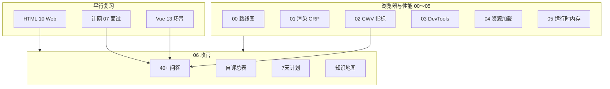
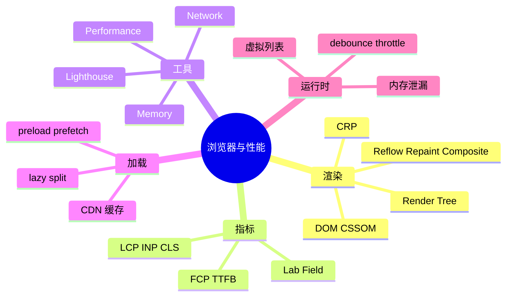

# 面试专题与知识点总表

<!-- 修改说明: 2026-06-30 按 EXPANSION-STANDARD 扩充 §0 导读、DevTools 模拟面试步骤、FAQ 12 题、闭卷自测、费曼检验；全系列 7/7 收官 -->

> **文件编码**：UTF-8。  
> **定位**：浏览器与性能系列 **收官篇（06）**——40+ 高频口述题 + 自评总表 + 7 天复习计划 + 全系列交叉索引。  
> **配合**：[计网 07 面试总表](../计算机网络/07-面试专题与知识点总表.md)、[Vue 13 场景题](../Vue/13-高频场景题与面试专题.md)、[HTML CSS JS 10](../HTML%20CSS%20JS/10-浏览器HTTP网络与Web基础.md)。

---

## 0. 读前导读（零基础也能跟上）

### 0.1 用一句话弄懂本章

**一句话**：00～05 是知识；本章是**考场**——40+ 题 + 自评表 + 7 天计划，把 CRP/CWV/DevTools 串成 2 分钟口述。

**生活类比**：前五章是科目练习；本章是模拟考 + 评分表。

### 0.2 你需要提前知道什么

| 能力 | 章节 |
|------|------|
| 01～05 至少通读一遍 | 浏览器 00～05 ✅ |
| 计网 07 Q2 输入 URL | 建议 |
| 能开 Lighthouse | 浏览器 00 §13 ✅ |

### 0.3 本章知识地图（☐→☑）

- [ ] 自评总表 ≥80% 能口述
- [ ] 首屏排查五步法不看稿
- [ ] 模拟面试任抽 5 题 15 分钟
- [ ] 与计网 07「输入 URL」合并答 3 分钟
- [ ] 闭卷自测 ≥ 8/10

### 0.4 建议学习时长与节奏

| 阶段 | 时间 | 内容 |
|------|------|------|
| §1～40 问答 | 3 h | 每题 2 分钟口述 |
| §41 自评表 | 30 min | 打勾弱项 |
| §42 7 天计划 | 按表执行 | D1～D7 |
| 闭卷 + 模拟 | 1 h | §48 |

### 0.5 学完本章 / 全系列你能做什么

1. 面试 2 分钟讲「首屏优化」含指标 + DevTools + 改法。
2. 与计网联合答「输入 URL 到页面展示」完整 3 分钟。
3. 用 STAR 讲一个 Lighthouse 优化案例（可基于 demo）。
4. 进入 [Vue 10](../Vue/10-Vite构建与项目部署.md) 构建部署。

### 0.6 通用回答框架（复习用）

| 步骤 | 内容 |
|------|------|
| 1 | 一句话定义 |
| 2 | 原理或机制（可画简图） |
| 3 | 使用场景 |
| 4 | shop / 项目里怎么遇到 |
| 5 | 与对立概念对比、常见坑 |

---

## 本章衔接

00～05 章从 **CRP → CWV 指标 → DevTools → 资源加载 → 运行时与内存** 搭完知识体系；[HTML 10](../HTML%20CSS%20JS/10-浏览器HTTP网络与Web基础.md) 是渲染与指标的初识；[计网 07](../计算机网络/07-面试专题与知识点总表.md) 的「输入 URL」后半段在本系列 01 章展开。

面试不会按章节编号考，而是：

- 「从输入 URL 到页面展示，渲染阶段发生了什么？」
- 「reflow 和 repaint 区别？如何减少 reflow？」
- 「LCP、CLS、INP 是什么？怎么优化？」
- 「首屏慢怎么排查？」
- 「防抖节流区别？虚拟列表原理？」
- 「SPA 内存泄漏怎么查？」

本章提供 **40+ 问答框架**、与 [Vue 14](../Vue/14-补充知识点总表.md) 同风格的 **自评总表**，以及 **7 天冲刺计划**。



**使用方式**：

1. 每题先 **自己口述 2 分钟**，再对照参考答案  
2. 每题尽量结合 **shop-vue** 或 **DevTools 观察**  
3. 回答结构：**定义 → 原理 → 场景 → 项目实践 → 对比/边界**

---

## 1. 从输入 URL 到页面展示，渲染阶段发生了什么？

**框架（与计网 07 Q2 衔接，侧重渲染）**

1. HTML 解析 → **DOM**；CSS 解析 → **CSSOM**（[01 章](./01-浏览器渲染原理与关键路径.md)）  
2. DOM + CSSOM → **Render Tree**（不含 `display:none`）  
3. **Layout** 算几何 → **Paint** 绘制 → **Composite** 合成上屏  
4. JS 执行可修改 DOM/CSSOM，触发后续 layout/paint  
5. 并行加载子资源（CSS/JS/图），各走缓存策略（[计网 06](../计算机网络/06-缓存Cookie与会话机制.md)、[04 章](./04-前端资源加载优化.md)）

**项目**  
shop 首屏：HTML → `main.js` → Vue mount → 商品列表 DOM → LCP 常为 Banner 图。

**加分**  
提 **CRP 阻塞**、**defer/module**、**HTTP/2** 多路复用。

---

## 2. DOM、CSSOM、Render Tree 分别是什么？

| 概念 | 来源 | 作用 |
|------|------|------|
| DOM | HTML 解析 | 文档结构树，JS 可操作 |
| CSSOM | CSS 解析 | 样式规则树，参与层叠计算 |
| Render Tree | DOM ∩ 可见 + 样式 | 布局绘制的输入 |

**对比**  
DOM 含 `head`、`display:none`；Render Tree 不含不可见展示节点。

详见 [01 章 §2～4](./01-浏览器渲染原理与关键路径.md)。

---

## 3. 什么是关键渲染路径（CRP）？如何优化？

**定义**  
浏览器把 HTML/CSS/JS 转成像素经过的**关键路径**；优化首屏 = 缩短 CRP、减少阻塞。

**优化手段（列举 4 条）**

1. 减少阻塞 CSS/JS 体积；JS `defer` / `type="module"`  
2. 关键 CSS 内联或减小首屏 CSS  
3. LCP 资源 **preload**、勿 lazy LCP 图  
4. **code split** 减首包 JS（[04 章](./04-前端资源加载优化.md)）

**项目**  
shop：`vite build` 后路由 lazy，Banner preload。

---

## 4. reflow、repaint、composite 区别？如何减少 reflow？

| 阶段 | 别名 | 触发 | 成本 |
|------|------|------|------|
| Reflow | Layout | 几何变化 | 高 |
| Repaint | Paint | 视觉非几何 | 中 |
| Composite | — | transform/opacity 等 | 低 |

**减少 reflow**  
批量读写 DOM；用 `transform` 做动画；虚拟列表减节点；避免逐条读 `offsetWidth` 再写 style（layout thrashing）。

详见 [01 章 §5～8](./01-浏览器渲染原理与关键路径.md)。

---

## 5. 什么是 layout thrashing？举例说明

**定义**  
循环内交替**读**布局属性（`offsetWidth`）与**写**样式，迫使浏览器反复强制同步 layout。

**坏例**  
`el.style.width = el.offsetWidth + 10 + 'px'` 在 for 循环中。

**好例**  
先数组存 width，再循环只写。

---

## 6. display:none、visibility:hidden、opacity:0 区别？

| | Render Tree | 占位 | 子元素 |
|---|-------------|------|--------|
| display:none | 否 | 否 | 不参与 |
| visibility:hidden | 是 | 是 | 可单独 visible |
| opacity:0 | 是 | 是 | 参与 |

Vue：`v-if` vs `v-show` 与 DOM/占位 trade-off（[Vue 04](../Vue/04-组件基础与组件通信.md)）。

---

## 7. Core Web Vitals 是哪三个？良好阈值？

| 指标 | 含义 | 良好（常见） |
|------|------|--------------|
| **LCP** | 最大内容绘制 | ≤ 2.5 s |
| **INP** | 交互到下一帧（替代 FID 主位） | ≤ 200 ms |
| **CLS** | 累积布局偏移 | ≤ 0.1 |

另常问：**FCP** ≤ 1.8s、**TTFB** 实验室常 < 800ms。

详见 [02 章](./02-性能指标与CoreWebVitals.md)。

---

## 8. LCP 是什么？如何优化？

**定义**  
视口内**最大可见内容元素**完成渲染的时间（常为 hero 图、大标题块）。

**优化**  
preload LCP 图；`fetchpriority="high"`；压缩格式 WebP/AVIF；SSR/SSG；减 JS 阻塞；**不要** lazy LCP 图；合适 CDN。

**排查**  
Lighthouse → LCP element；Performance → LCP breakdown。

---

## 9. CLS 是什么？常见原因与修复？

**定义**  
全页**非预期布局偏移**累积分数。

**原因**  
无尺寸图片/广告；动态插入顶部内容；web font swap；异步 CSS。

**修复**  
img 设 width/height 或 aspect-ratio；预留广告位；`font-display` 策略。

---

## 10. INP 与 FID 区别？为什么 INP 更重要？

**FID**  
仅**首次**输入到开始处理的延迟。

**INP**  
全页多次交互的**较差延迟**聚合，更反映 SPA 全程跟手性。

**优化**  
减 Long Task；debounce；code split；虚拟列表；Worker（重计算）。

---

## 11. TTFB 高怎么排查？和 LCP 什么关系？

**TTFB**  
首字节等待，偏 **DNS/TCP/TLS/服务端**（[计网 01 Timing](../计算机网络/01-网络分层与通信基础.md)）。

**排查**  
Network → document → Waiting for server response。

**关系**  
TTFB 高会拖累 LCP，但 LCP 还含资源下载与渲染；TTFB 低而 LCP 高 → 查大图/JS 阻塞。

---

## 12. Lab 与 Field 指标为何不一致？

**Lab**  
Lighthouse 固定环境单次加载。

**Field**  
真实用户 CrUX 聚合，设备网络各异。

**实践**  
开发用 Lab 迭代；上线用 PageSpeed Insights 看 field（有流量时）。

---

## 13. 首屏慢怎么系统化排查？（超高频）

**五步**

1. **Lighthouse** → LCP/FCP/CLS 数值与 LCP element  
2. **Network** → document TTFB；LCP 资源 Priority、是否 lazy、体积  
3. **Performance** → LCP 前 Long Task、Layout 密集区  
4. **加载** → render-blocking、chunk 大小（[04 章](./04-前端资源加载优化.md)）  
5. **preview/build** 测，非 dev HMR  


---

## 14. Performance 面板 Long Task 是什么？

**定义**  
主线程任务 **> 50ms**，阻塞输入，伤 INP。

**排查**  
录 Performance → Main 黄块红角 → Call Tree 找函数。

**解决**  
split、debounce、减 DOM、Worker、优化 diff。

[03 章](./03-ChromeDevTools性能分析.md)。

---

## 15. Network 瀑布图看什么？

**顺序**  
document → blocking CSS → JS → LCP 图/字体。

**Timing**  
DNS、Initial connection、**Waiting (TTFB)**、Download。

**列**  
Priority、Initiator、Size、Protocol（h2）。

---

## 16. preload、prefetch、preconnect 区别？

| 指令 | 时机 | 优先级 |
|------|------|--------|
| preload | 当前页马上需要 | 高 |
| prefetch | 下一页可能用 | 低 |
| preconnect | 提前连接域 | — |

**坑**  
preload 错 URL；LCP 图应用 preload 非 prefetch。

[04 章 §3](./04-前端资源加载优化.md)。

---

## 17. 什么是 code splitting？Vue/React 怎么做？

**定义**  
把 bundle 拆成多 chunk，首屏只加载必要 JS。

**Vue**  
`() => import('./View.vue')` 路由 lazy（[Vue 06](../Vue/06-Vue-Router路由管理.md)）。

**React**  
`lazy(() => import('./Page'))` + `Suspense`。

**验证**  
build + Network 首屏无 admin chunk。

---

## 18. 图片 lazy load 要注意什么？

**用法**  
`` 接近视口再加载。

**注意**  
**LCP 图禁止 lazy**；须设尺寸防 CLS；列表图适用 lazy。

---

## 19. CDN 如何帮助性能？

**作用**  
边缘节点就近分发静态资源，降 RTT 与源站压力（[计网 03](../计算机网络/03-IP地址与DNS解析.md)）。

**配合**  
文件名 hash + `Cache-Control: immutable` 长缓存（计网 06）。

---

## 20. 防抖和节流的区别与场景？

| | Debounce | Throttle |
|---|----------|----------|
| 行为 | 连续触发合并为一次 | 间隔内最多一次 |
| 场景 | 搜索输入 | scroll、resize |

**项目**  
shop 搜索 300ms debounce（[05 章](./05-运行时性能与内存.md)）。

---

## 21. 虚拟列表原理？解决什么问题？

**问题**  
万级 DOM 导致 layout/paint 崩溃。

**原理**  
只渲染视口内若干项 + 缓冲；滚动更新 index 与 transform，复用节点。

**库**  
vue-virtual-scroller、@tanstack/react-virtual、el-table-v2。

**注意**  
不等高需测高；常与后端分页结合。

---

## 22. SPA 常见内存泄漏场景？如何查？

**场景**  
未 clear 定时器；未 remove 全局监听；闭包持有 detached DOM；WebSocket 未关；keep-alive 过多。

**排查**  
Memory → Heap snapshot → Comparison → Detached HTMLElement。

**修复**  
`onUnmounted` / `useEffect` cleanup（[05 章](./05-运行时性能与内存.md)）。

---

## 23. 为什么动画推荐 transform 而不是 left/top？

**left/top**  
常触发 **layout + paint**。

**transform/opacity**  
常仅 **composite**，GPU 友好（[01 章 §6](./01-浏览器渲染原理与关键路径.md)）。

---

## 24. CSS 为什么会阻塞渲染？

Render Tree 需要 **computed style**；CSS 未就绪则首次渲染阻塞。CSS **不阻塞** DOM 构建，但**阻塞**首次渲染。

JS 同步脚本还阻塞 HTML 解析。

---

## 25. defer、async、module 脚本区别？

| | 阻塞解析 | 执行时机 |
|---|----------|----------|
| 默认 script | 是 | 立即 |
| defer | 否 | DOM 就绪后顺序 |
| async | 否 | 下完即执行 |
| type=module | 否 | 类似 defer |

Vite 生产 entry 为 module。

---

## 26. 虚拟 DOM 一定更快吗？

**否**  
虚拟 DOM 目标是 **减少不必要 DOM 操作** 与声明式开发；大量更新仍触发真实 layout。极简单静态页原生 DOM 可能更轻。

---

## 27. will-change 能随便加吗？

**否**  
过多合成层占 **GPU 内存**；应仅在动画前短设或直接用 transform。

---

## 28. 强缓存与协商缓存对前端加载的影响？

**强缓存**  
200 from cache，无请求体；适合 hash 静态资源。

**协商**  
304，省 body 仍有往返；适合 html 或需验证资源。

[计网 06](../计算机网络/06-缓存Cookie与会话机制.md)。

---

## 29. HTTP/2 对前端加载有什么好处？

**多路复用**  
同连接并行多请求，缓解 HTTP/1.1 队头阻塞；对多 chunk、多图页面友好（[计网 04](../计算机网络/04-HTTP协议深入.md)）。

---

## 30. 如何优化 shop-vue 商品列表滚动卡顿？

**答法模板**

1. Performance 录 scroll，看 Layout 还是 Scripting  
2. 若 DOM 多 → 虚拟列表或分页  
3. 若 scroll handler 重 → throttle  
4. 图片 lazy + 固定尺寸  
5. 组件 `v-memo` / `memo` 减无效更新  

---

## 31. 说一个你做过的性能优化案例（STAR）

**示例骨架**

- **S**：shop 首页 LCP 3.8s，Lighthouse 45  
- **T**：LCP < 2.5s  
- **A**：Lighthouse 定位 Banner；preload + WebP；路由 lazy；preview 复测  
- **R**：LCP 1.9s，Performance 分 78  

无项目经验可用 **本章 demo + DevTools 截图** 练口述。

---

## 32. 服务端渲染 SSR 对性能的意义？

**首屏 HTML 含内容** → FCP/LCP 可能提前（不等 JS 下载执行）；**hydration** 仍有 JS 成本。与 [Vue 12](../Vue/12-Vue进阶特性.md) SSR 衔接。

---

## 33. Tree-shaking 是什么？

构建时删除未引用 export，减 JS 体积。依赖 ES module 静态分析；Vite/Rollup 默认支持。配合 **按需 import** UI 库。

---

## 34. 首屏接口快但页面仍慢，为什么？

API 200ms 只影响**数据展示时刻**；LCP 可能是**静态 hero**；或 **JS 未执行完** Vue 未 mount；或 **接口数据到了但列表 500 节点 reflow**。

---

## 35. Web Worker 适用场景？

主线程 **>50ms** 的纯计算：大 JSON 解析、加解密、图像处理；通过 postMessage 通信，不能直接操作 DOM。

---

## 36. 事件委托有什么好处？

父级一个 listener 处理子项 click → 减注册数与内存；适合大列表（与虚拟列表互补）。

---

## 37. requestAnimationFrame 与 setInterval 动画？

**rAF** 与显示器刷新对齐，页面不可见时暂停；**setInterval** 可能掉帧。动画优先 rAF + transform。

---

## 38. 如何理解 Coverage 面板？

统计 JS/CSS **未使用字节**比例，指导 split 与删 dead code（[03 章 §8](./03-ChromeDevTools性能分析.md)）。

---

## 39. 移动端性能测试要注意什么？

Lighthouse **Mobile** + CPU 4x slowdown；弱网 Fast 3G；field 数据以移动用户为主；touch 交互看 INP。

---

## 40. 浏览器与计网系列如何一起答「输入 URL」？

**计网侧**  
DNS → TCP/TLS → HTTP → 缓存。

**浏览器侧**  
解析 → CRP → 指标 LCP/CLS → JS 框架 mount。

**一句收尾**  
「网络负责数据传输，浏览器负责解析渲染与运行时；排查要 Network + Performance 一起看。」

---

## 40.1 扩展：高频追问速答（30 秒版）

| 追问 | 30 秒要点 |
|------|-----------|
| 如何减少 reflow？ | batch 读写、transform 动画、虚拟列表减 DOM |
| LCP 怎么优化？ | preload、勿 lazy、WebP、减 blocking JS |
| 首屏慢从哪查？ | Lighthouse→Network→Performance 五步法 §13 |
| 防抖节流？ | debounce 搜索；throttle scroll |
| 内存泄漏？ | Memory Comparison Detached；onUnmounted cleanup |

---

## 40.2 扩展：与后端/Java 联调性能话术

```text
「document TTFB 高」→ 查 Nginx/SSR/缓存，不是前端 bundle。
「/api/products 200ms 但列表晚出」→ JS 未执行完或 DOM 过多 reflow。
「静态资源 404」→ Vite base/CDN 路径，不是 CORS。
「HTTPS 慢」→ 计网 05 TLS；浏览器系列不重复，见计网章。
```

---

## 41. 自评总表

| 知识点 | 01 | 02 | 03 | 04 | 05 | 能口述 |
|--------|----|----|----|----|-----|--------|
| DOM/CSSOM/Render Tree | ● | | | | | ☐ |
| CRP 与阻塞 | ● | | | ● | | ☐ |
| reflow/repaint/composite | ● | | ● | | ● | ☐ |
| layout thrashing | ● | | ● | | | ☐ |
| FCP/LCP/CLS/INP/TTFB | | ● | ● | | | ☐ |
| Lab vs Field | | ● | ● | | | ☐ |
| Performance 录制 | | | ● | | ● | ☐ |
| Network Timing/Priority | | ● | ● | ● | | ☐ |
| Lighthouse 读报告 | | ● | ● | | | ☐ |
| preload/prefetch/preconnect | | | | ● | | ☐ |
| lazy load 与 LCP 例外 | | ● | | ● | | ☐ |
| code split 路由 lazy | | | | ● | | ☐ |
| CDN + 缓存策略 | | | | ● | | ☐ |
| debounce/throttle | | | | | ● | ☐ |
| 虚拟列表 | | | | | ● | ☐ |
| SPA 内存泄漏 | | | | | ● | ☐ |
| Memory snapshot | | | ● | | ● | ☐ |
| transform 动画 | ● | | | | ● | ☐ |
| 首屏排查五步法 | | ● | ● | ● | | ☐ |
| shop 优化案例 | | | | ● | ● | ☐ |

**说明**：● 表示主章节；「能口述」自测打勾。

---

## 42. 7 天复习计划

| 天 | 内容 | 产出 |
|----|------|------|
| D1 | 01 章 + Q1～6 | 手绘 CRP 图 |
| D2 | 02 章 + Q7～12 | Lighthouse 报告一份 |
| D3 | 03 章 + Q13～15 | Performance 录首屏 |
| D4 | 04 章 + Q16～19 | Network 验证 lazy/split |
| D5 | 05 章 + Q20～22 | debounce demo + Memory 快照 |
| D6 | 06 章 Q23～40 过一遍 | 每题 2 分钟口述 |
| D7 | 模拟面试 + 计网 07 Q2 串联 | 录音自评 |

---

## 43. 知识地图（全系列）



---

## 44. 与平行系列索引

| 主题 | 浏览器与性能 | 其他 |
|------|--------------|------|
| 输入 URL | 01、06 Q1 | 计网 07 Q2 |
| HTTP 缓存 | 04 §9 | 计网 06 |
| DNS/CDN | 04 §7 | 计网 03 |
| fetch/Axios | — | HTML 09、Vue 08 |
| Vite 构建 | 04、03 preview | Vue 10 |
| 盒模型/layout | 01 | HTML 04 |
| 响应式更新 | 05 | Vue 02 |
| Hooks 清理 | 05 | React 05 |

---

## 45. 练习建议

### 45.1 模拟面试（任抽 5 题）

从 §1～40 随机抽 5 题，限时 15 分钟口述，录音回放。

### 45.2 综合题

「shop 首页 LCP 4s、CLS 0.25、搜索卡顿」——写排查与优化方案（300 字），必须提到至少 3 个面板/指标名。

### 45.3 参考答案（综合题要点）

- LCP 4s：Lighthouse 找 element；preload/WebP；减 blocking JS；非 lazy  
- CLS 0.25：图片/字体/动态 banner 尺寸；Experience 面板  
- 搜索卡：debounce；Performance Long Task；必要时 Worker  

---

## 46. 学完标准（06 章 / 全系列）

- [ ] 自评总表 ≥ 80% 能口述  
- [ ] 独立完成 §45 模拟面试  
- [ ] 首屏排查五步法不看稿  
- [ ] 与计网 07「输入 URL」题能合并答 3 分钟  
- [ ] shop 或 demo 有一份 Lighthouse 优化前后对比（可选）  

**恭喜完成浏览器与性能系列**——建议下一步：[Vue 10](../Vue/10-Vite构建与项目部署.md) 构建部署，或 [Vue 13](../Vue/13-高频场景题与面试专题.md) 综合面试。

---

## 47.1 手把手实操：模拟面试 + DevTools 佐证

| 步骤 | 你的动作 | 预期看到什么 | 若不对 |
|------|----------|--------------|--------|
| 1 | 从 §1～40 随机抽 5 题，限时 15 分钟口述 | 每题约 2～3 分钟 | 录音回放 |
| 2 | 任选「首屏慢」一题，开 shop 或 demo | 能说出 Lighthouse/Network/Performance | 对照 §13 |
| 3 | 跑 Lighthouse 截 LCP element | 与口述一致 | 02 章 |
| 4 | Performance 录 10s，指出一类 Main 活动 | Scripting 或 Layout | 03 章 |
| 5 | 自评总表 §41 弱项打勾 | 明确复习章节 | 7 天计划 D1～D7 |

---

## 47.2 FAQ（面试备考）

**Q1：没项目经验怎么答性能题？**  
用本章 demo + DevTools 截图练 STAR；诚实说学习项目 shop-vue。

**Q2：要背 40 题全文吗？**  
背框架 + 自评表弱项；Q13 首屏五步法必背。

**Q3：计网和浏览器怎么分工答 URL 题？**  
计网 DNS/TCP/HTTP；浏览器 CRP/CWV；见 §40。

**Q4：Vue 13 和本章重复吗？**  
Vue 13 偏框架；本章偏浏览器与指标，互补。

**Q5：7 天计划能压缩吗？**  
最少 D1+D2+D3+D6 四天核心。

**Q6：面试官问 Webpack 怎么办？**  
原理同 Vite：split、preload、tree-shaking；诚实说本路线用 Vite。

**Q7：will-change 能当优化答案吗？**  
仅作补充；优先 transform、减 DOM、split。

**Q8：移动端性能怎么说？**  
Lighthouse Mobile、CPU 4x、INP、弱网。

**Q9：如何证明做过优化？**  
Lighthouse 前后对比、Network chunk 对比、Performance Long Task 减少。

**Q10：全系列学完标准？**  
见 §46；自评表 80%+ 口述。

**Q11：下一步学什么？**  
Vue 10 构建；或计网 07 + Vue 13 并联复习。

**Q12：闭卷自测和 §45 练习区别？**  
闭卷偏回忆；§45 偏限时口述与综合写作。

---

## 48. 闭卷自测

1. CWV 三项及阈值？
2. reflow/repaint/composite 区别与减 reflow 两法？
3. 首屏排查五步法（面板名）？
4. preload vs prefetch？
5. debounce vs throttle 场景？
6. 虚拟列表原理一句话？
7. SPA 泄漏怎么查（工具 + 关键词）？
8. **动手**：§47.1 步骤表完成 5 题口述录音。
9. **动手**：Lighthouse 找 LCP element 并口述对应优化 2 条。
10. **综合**：300 字答「shop LCP 4s、CLS 0.25、搜索卡」（须 ≥3 面板/指标名）。

### 48.1 自测参考答案

1. LCP ≤2.5s；INP ≤200ms；CLS ≤0.1。  
2. layout/视觉/合成；batch 读写、transform 动画。  
3. Lighthouse → Network → Performance → 04 加载 → preview 测。  
4. preload 当前急需高优先级；prefetch 下一页低优先级。  
5. debounce 搜索；throttle scroll。  
6. 只渲染视口内若干项，滚动更新索引。  
7. Memory Heap snapshot Comparison → Detached HTMLElement。  
8～9. （完成即得分。）  
10. 见 §45.3 要点。

---

## 49. 费曼检验

请用 **3 分钟** 做全系列串讲：「从输入 URL 到 shop 首屏优化」。对照提纲：

1. **网络**（计网）：DNS/TTFB/缓存——Network 看 Waiting。  
2. **渲染**（01）：CRP、reflow——Performance 看 Layout。  
3. **指标+改法**（02～05）：LCP/INP/CLS；preload/split/debounce/虚拟列表——Lighthouse 验收。

---

## 47. 下一章预告

本系列 **06 为收官篇**，无 07。后续可学：

- [Vue 10](../Vue/10-Vite构建与项目部署.md) — 把 04 章优化落到 build  
- [Vue 12](../Vue/12-Vue进阶特性.md) — Suspense、SSR 与性能  
- [计网 07](../计算机网络/07-面试专题与知识点总表.md) — 与本文 §40 联合复习  
