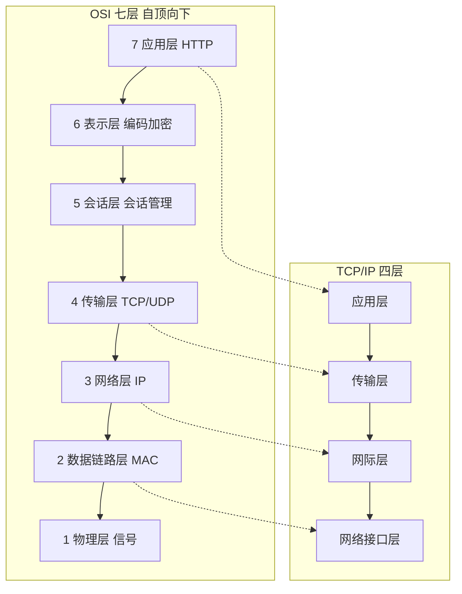
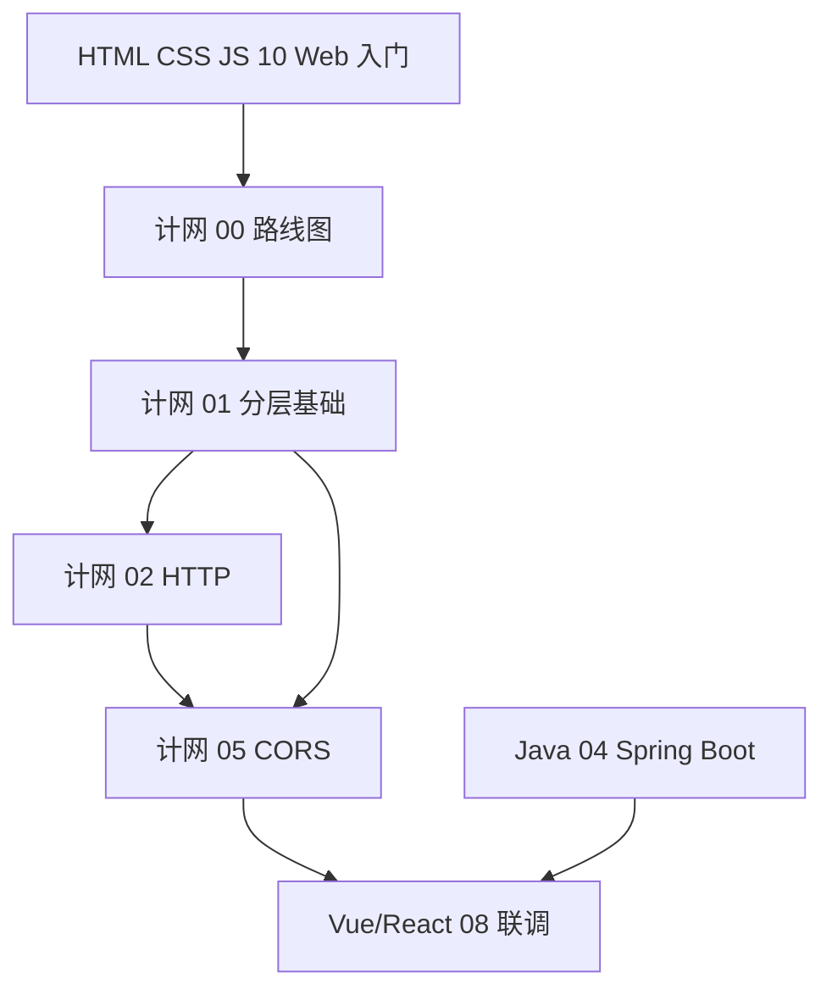

# 计算机网络学习路线图与说明

<!-- 修改说明: 2026-06-30 按 EXPANSION-STANDARD 扩充 §0（+200 行导读）、闭卷自测、费曼检验；全系列 8/8 收官 -->

> **文件编码**：本文件夹内所有 `.md` 均为 **UTF-8**。终端与编辑器建议 UTF-8；PowerShell / VS Code / Cursor 右下角确认编码。

---

## 0. 读前导读（零基础也能跟上）

> **读者假设**：已学过 [HTML CSS JS 10](../HTML%20CSS%20JS/10-浏览器HTTP网络与Web基础.md) 或正在并行。能写简单 `fetch`/Axios；即将 [Vue 08](../Vue/08-Axios网络请求与前后端联调.md) 前后端联调。

### 0.1 用一句话弄懂本系列

**一句话**：计网 = 搞清「浏览器发请求到服务器拿数据」**中间经过了哪些层**——DNS 找地址、TCP 建连接、HTTP 传内容、HTTPS 加密，以及 **CORS 为什么拦你**。

**生活类比——寄快递**：

| 计网概念 | 生活类比 | 系列章节 |
|----------|----------|----------|
| **DNS** | 查通讯录把名字变门牌号 | 03 |
| **TCP** | 打电话先确认「喂听得见吗」再说话 | 02 |
| **HTTP** | 快递单上写「要什么东西」 | 04 |
| **HTTPS** | 带封条的保密件 | 05 |
| **CORS** | 小区规定：外人来只能在前台问 | 06 |
| **缓存** | 常用地址贴冰箱上少查地图 | 06 |

**为什么重要**：Vue/React 08 联调时 `5173` 调 `8080` 报 CORS、接口 `(failed)`、HTTPS 证书错误——不懂分层会误改 Axios 越改越乱。

### 0.2 你需要提前知道什么（零基础解释列）

| 术语 / 能力 | 零基础解释 | 真不会请先学 |
|-------------|------------|--------------|
| **URL** | 网址；`https://` 是协议，`?` 后是参数 | HTML 10 §3 |
| **HTTP** | 浏览器和服务器说话的「格式」 | HTML 10 §6 |
| **端口** | 同一台电脑多个服务的「房间号」，8080/5173 不同 | 01 章 |
| **fetch / Axios** | 前端发 HTTP 请求的工具 | HTML 09 / Vue 08 |
| **Network 面板** | F12 里看每次请求耗时和头信息 | HTML 10 §17 |
| **同源** | 协议+域名+端口 三者都相同才叫同源 | 06 章 |

| 你现在的水平 | 建议动作 |
|--------------|----------|
| 完全零基础、URL 未拆过 | ⏸ 先 HTML 01～09 + 10 章 |
| 学完 HTML 10 | ✅ 00 通读 + 01 分层 |
| Vue 08 联调前 | ✅ **01～06 必完成**，尤其 06 CORS |
| 只做后端 Java | 04 HTTP + 05 HTTPS 仍建议读 |
| **C++ 主线 mini-http** | ✅ **02 TCP + 04 HTTP** 在 [C++ 10](../../后端学习/C++/10-网络编程与简易HTTP服务.md) 前完成；06 CORS 可跳过 |

### 0.3 本章知识地图（00 路线图学完后 ☐→☑）

- [ ] 能区分 HTML 10 与本系列分工（用 HTTP vs 懂分层）
- [ ] 能按顺序说出 01～07 各章一句话
- [ ] 能对照 OSI 七层与 TCP/IP 四层（§3）
- [ ] 能描述 shop-vue 5173 → java-demo 8080 拓扑（§6）
- [ ] 完成 §14：`ping 127.0.0.1` + Network 看 Timing
- [ ] 闭卷自测 ≥ 8/10

### 0.4 建议学习时长与节奏

| 阶段 | 时间 | 内容 |
|------|------|------|
| 00 路线图 | 1 h | 本文 + §6 联调预览 |
| 01 分层 | 2 h | OSI/TCP/IP、封装 |
| 02～03 | 各 2 h | TCP、DNS |
| 04～05 | 各 2.5 h | HTTP、HTTPS |
| 06 联调 | 3 h | 缓存、CORS、JWT |
| 07 面试 | 1.5 h | 总表 + 模拟问答 |

**最佳窗口**：HTML 10 后立刻开 01；**Vue/React 08 前必须完成 06**。

### 0.5 学完 00 你能做什么

1. 向队友解释「5173 和 8080 为什么不同源」。
2. 打开 DevTools Network，指出 DNS Lookup、Initial connection、Waiting 各段。
3. 列出本系列 01～07 学习顺序并说明为什么。
4. 执行 `ping 127.0.0.1` 并读懂「丢失 = 0%」含义。

### 0.6 全系列 01～07 章速览

| 章 | 一句话主题 | 学完应能产出 | 与 shop 联调关系 |
|----|------------|--------------|------------------|
| **01 分层** | 数据怎么一层层打包 | 手绘四层 + 封装图 | Network Timing 各段 |
| **02 TCP/UDP** | 可靠传输与端口 | 解释三次握手 | 8080 连接拒绝 |
| **03 DNS** | 域名变 IP | `nslookup` 查 A 记录 | 生产域名解析 |
| **04 HTTP** | 报文、方法、状态码 | `curl -I` 看响应头 | REST 联调 |
| **05 HTTPS** | TLS 加密与证书 | 识别证书错误 | 上线 443 |
| **06 缓存/CORS** | 缓存策略 + 跨域 | 配 Vite proxy 或 Spring CORS | **08 联调前置** |
| **07 面试总表** | 常考题自评 | 2 分钟讲输入 URL | 考前速览 |

### 0.7 shop-vue 联调里程碑（与 Vue 08 对齐）

| Vue 进度 | 计网必读 | 当天验证 |
|----------|----------|----------|
| 07 路由完成 | 01～04 复习 | curl 后端接口有 JSON |
| **08 开联调** | **06 CORS 全文** | 浏览器无 CORS 红字 |
| 10 部署 | 05 HTTPS + 03 DNS | 域名能解析、443 正常 |

### 0.8 计网 vs HTML 10 vs 后端 Java — 三角对照

```text
HTML 10：会用 HTTP、看 Network、知道 401/404
计网 01～06：懂为什么、能排查 CORS/DNS/TCP
Java 04：写 Controller、配 CORS、返回 JSON

联调战场 = 三者交界：浏览器安全 + HTTP 协议 + 后端接口
```

### 0.9 零基础常见误解（路线图级）

| 误解 | 正确理解 |
|------|----------|
| 「计网是后端课」 | CORS、Cookie、Mixed Content 在浏览器侧 |
| 「ping 通 = 网站正常」 | ping 测 IP 层；HTTP/443 可能仍失败 |
| 「localhost 和 127.0.0.1 任意组合都同源」 | 还要看**端口**；5173≠8080 |
| 「CORS 是 Axios bug」 | 浏览器拦截；换 fetch 一样 |
| 「HTTPS = HTTP 加 s」 | 还有 TLS 握手、证书链（05 章） |

### 0.10 与 Web 安全 / 后端系列衔接

| 系列 | 衔接点 |
|------|--------|
| [Web安全 05 CORS](../Web安全/05-CORS与同源策略安全.md) | 06 章网络原理 + 05 章安全视角 |
| [Java 04 CORS](../../后端学习/Java/04-SpringBoot核心开发.md) | 后端 `CorsConfig` 白名单 |
| [Vue 08 Axios](../Vue/08-Axios网络请求与前后端联调.md) | 联调主战场 |

### 0.11 第一天 PowerShell 命令清单（跟 01 章）

| 命令 | 零基础解释 | 预期 |
|------|------------|------|
| `ping -n 4 127.0.0.1` | 测本机网络栈是否通 | 0% 丢失 |
| `ping -n 2 www.baidu.com` | 测 DNS + 外网 | 显示 `[IP]` |
| `curl -I https://www.example.com` | 只看 HTTP 响应头 | 状态行 200/301 |
| `nslookup www.baidu.com` | 查域名对应 IP | Address 一行 |
| `tracert -d -h 8 www.baidu.com` | 看经过几跳路由器 | 多行 IP 列表 |

### 0.12 DevTools Network 五列必看

| 列/面板 | 看什么 | 对应章节 |
|---------|--------|----------|
| **Name** | 请求 URL 路径 | 04 HTTP |
| **Status** | 200/404/401/502 | 04、HTML 10 |
| **Type** | document / xhr / fetch | 04 |
| **Headers** | Request/Response 头 | 04、06 CORS |
| **Timing** | DNS/TCP/Waiting | 01～03 |

### 0.13 计网全系列学完标准（00 级预览）

- [ ] 01：能画 TCP/IP 四层并标 HTTP/TCP/IP 位置
- [ ] 02：能口述三次握手、四次挥手目的
- [ ] 03：能 `nslookup` 并解释 A 记录
- [ ] 04：能 `curl -v` 读懂请求行与 Host 头
- [ ] 05：能说明 HTTPS 在 HTTP 之下、TCP 之上
- [ ] 06：能配置 Vite proxy 或读懂 Spring CORS
- [ ] 07：2 分钟版「输入 URL」+ 本表自评 ⬜/🔶/✅

### 0.14 与 todo.md / 暑假项目对齐

| 周次 | 项目任务 | 计网必完成 | 验证 |
|------|----------|------------|------|
| 第 1～2 周 | HTML/JS 复习 | 00～01 | ping + 分层图 |
| 第 3 周 | Vue 08 联调 | **06 CORS** | 无 CORS 红字 |
| 第 4 周 | 功能开发 | 04 HTTP 复习 | curl 接口 |
| 第 5 周 | Nginx 部署 | 05 HTTPS + 03 DNS | 443 可访问 |

---

## 本章与上一章的关系

你已经在 [HTML CSS JS 10](../HTML%20CSS%20JS/10-浏览器HTTP网络与Web基础.md) 里**见过网络的名字**：URL 拆解、HTTP 请求/响应、状态码、Network 面板、跨域、Cookie/Token、从输入 URL 到页面渲染的 10 步流程。那一章的目标是「知道前端为什么要懂浏览器和网络」，**不会**展开 OSI 分层、TCP 握手、数据封装、MAC 地址等底层细节。

**本系列（`前端学习/计算机网络/`）要做的事**：把计网从「听说过 HTTP」变成「能排查联调问题、能画分层图、能在面试里讲清楚一次请求经过了哪些层」——为 [Vue 08](../Vue/08-Axios网络请求与前后端联调.md) / [React 08](../React/08-Axios网络请求与前后端联调.md) 前后端联调、以及 [Java 04](../../后端学习/Java/04-SpringBoot核心开发.md) 接口开发打底。

**前置要求（自检）**：

| 能力 | 对应章节 | 自检方式 |
|------|----------|----------|
| 会拆解 URL（协议/域名/路径/参数） | HTML CSS JS 10 §3 | 能说出 `https://api.example.com/users?id=1` 各段含义 |
| 知道 GET/POST 与常见状态码 | HTML CSS JS 10 §6～7 | 能解释 200 / 404 / 401 / 500 |
| 会用 Network 面板看接口 | HTML CSS JS 10 §17、§24 | F12 能找 XHR 请求的 Headers |
| 写过 `fetch` 或见过 Axios | HTML CSS JS 09 | 能发起一次 JSON 接口请求 |
| 有 shop 项目概念（可选） | [Vue 00](../Vue/00-学习路线图与说明.md) | 知道 shop-vue 前后端分离 |

**什么时候学计网？**

| 时机 | 建议 | 理由 |
|------|------|------|
| 学完 HTML CSS JS **10** 后 | ✅ 强烈推荐 | 10 章已建立 HTTP 大图景，本系列补「为什么能通信」 |
| **Vue/React 08 联调前** | ✅ 最佳窗口 | 08 章 Axios 调 `localhost:8080`，懂分层/CORS/端口少踩坑 |
| 与 [Git 01](../Git/01-Git入门与安装配置.md) **并行** | ✅ 可以 | 计网偏概念，不冲突；联调 commit 仍靠 Git |
| 完全零基础、连 URL 都没拆过 | ⏸ 稍等 | 先完成 HTML CSS JS 01～09，至少会 `fetch` 一次 |

---

## 1. 这套资料适合谁

- 已学过 HTML CSS JS **10 章**（Web 与 HTTP 入门），想**系统掌握计算机网络** 的零基础同学
- 正在学 [Vue](../Vue/00-学习路线图与说明.md) / [React](../React/00-学习路线图与说明.md)，即将进入 **08 章前后端联调** 的学习者
- 计划与 [Java 后端](../../后端学习/Java/00-学习路线图与说明.md) 联调，需要理解「浏览器为什么报 CORS、为什么 8080 连不上」的同学
- 目标：能独立用 **Network + ping** 排查接口问题，能在简历写「理解 TCP/IP、HTTP、DNS」而不心虚

**不适合**：

- 已多年网络工程师 / 运维老手（可直接看 06～07 查漏补缺）
- 只想背面试八股、不愿动手看 DevTools 的人（联调会反复坑你）

---

## 2. 为什么前端必须学计算机网络

### 2.1 只有「会写 Axios」不够

```text
shop-vue 联调现场（真实高频）：

  控制台：Access to fetch at 'http://localhost:8080/api/users'
          from origin 'http://localhost:5173' has been blocked by CORS policy

  新手反应：「Axios 写错了？换 fetch 试试？」
  懂计网的人：5173 和 8080 端口不同 → 不同源 → 浏览器拦截；
              后端 [Java 04] 加 CORS 或 Vite proxy 解决。
```

没有分层概念，你会把**传输层超时**、**应用层 404**、**浏览器同源策略**混为一谈，排查从 2 分钟变成 2 小时。

### 2.2 计网帮你解决什么

| 痛点 | 计网的能力 |
|------|------------|
| 接口 `(failed)` 红色 | 区分 DNS 失败 / 连接拒绝 / CORS |
| 联调跨域 | 理解源 = 协议+域名+端口，知道 CORS 在 HTTP 头层解决 |
| 页面首屏慢 | Network Timing 里 DNS、TCP、TTFB 各阶段含义 |
| HTTPS 证书报错 | 知道 TLS 在哪一层、和 HTTP 的关系 |
| 面试「输入 URL 发生什么」 | 能按分层讲封装/解封装，而不只背 10 步 |

### 2.3 为什么前端尤其需要计网（而不只是后端的事）

- **浏览器是安全边界**：同源策略、Cookie 策略、Mixed Content 都是「客户端网络栈 + 安全模型」，后端日志里看不到 CORS 拦截。
- **DevTools Network 是主武器**：前端 80% 网络问题靠 Headers、Timing、Preview 定位；不懂分层看不懂 Timing。
- **前后端分离**：前端 `5173`、后端 `8080`、生产 `443`——**端口与协议**是日常配置，不是运维专属。
- **全栈联调**：与 [Java 04](../../后端学习/Java/04-SpringBoot核心开发.md) 对齐时，要知道 Controller 处理的是**应用层 HTTP**，底下还有 TCP 连接。

### 2.4 深入：为什么建议在 Vue/React 08 之前学完 01～05？

[Vue 08](../Vue/08-Axios网络请求与前后端联调.md) 主线是 Axios 实例、拦截器、JWT、`Result<T>` 解析。若此时还不懂：

1. **端口与源**：会把「后端没启动」和「CORS 没配」都当成 Axios bug。
2. **HTTP 与 TCP**：看到 `ECONNREFUSED` 不知道先 `curl localhost:8080`。
3. **DNS**：部署后「本地能访问、线上域名不行」无法查解析。

**小案例**：某同学 08 章卡 3 天——后端正常、`curl` 有数据，浏览器报 CORS。学完本系列 05 章后 10 分钟在 `CorsConfig` 加 `allowedOrigins("http://localhost:5173")` 解决；若不懂「源」概念，可能误改 Axios `baseURL` 越改越乱。

---

## 3. OSI 与 TCP/IP：本系列怎么讲

面试和教材常出现两套模型，**不必死记七层名字**，但要建立对照：

| OSI 七层（理论模型） | TCP/IP 四层（互联网实际） | 前端主要关心 |
|---------------------|---------------------------|--------------|
| 7 应用层 Application | 应用层（HTTP/DNS/TLS） | ✅ 最频繁 |
| 6 表示层 Presentation | ↑ 合并在应用层 | JSON、HTTPS 加密 |
| 5 会话层 Session | ↑ 合并在应用层 | Cookie/Session |
| 4 传输层 Transport | 传输层（TCP/UDP） | 端口、可靠传输 |
| 3 网络层 Network | 网际层（IP） | IP 地址、路由 |
| 2 数据链路层 Data Link | 网络接口层 | MAC、交换机（了解） |
| 1 物理层 Physical | ↑ 合并在网络接口层 | 网线/Wi-Fi（了解） |

**关键句**：日常说「HTTP 协议」指**应用层**；说「三次握手」指**传输层 TCP**；说「ping 通不通」多半测**网络层 IP**。01 章会用**一次 GET 请求**把封装过程串起来。



---

## 4. 与 HTML CSS JS 10 的关系

| 维度 | HTML CSS JS 10 | 本计网系列 |
|------|----------------|------------|
| 定位 | Web 入门：HTTP、状态码、Network、跨域印象 | 系统深入：分层、TCP/IP、封装、DNS、CORS 原理 |
| OSI / TCP/IP | 不展开 | 01 章主线 |
| 三次握手 / 四次挥手 | 只提名字 | 02 章详解 |
| HTTPS / TLS | 简化流程图 | 05 章深入 |
| CORS | 知道后端要配头 | 06 章原理 + Vite proxy |
| 性能指标 FCP/LCP | ✅ 有 | 07 章与浏览器系列衔接 |
| XSS/CSRF | ✅ 有安全节 | 06 章网络视角补充 |

**学习路径建议**：10 章当「预告片」，本系列当「正片」。若你 10 章已跟做过 Network 实操，01 章会从**网络是什么**正式向下挖，不重复讲状态码大全。

---

## 5. 学习顺序（按编号 00～07）

```text
00 学习路线图（你现在在这里）
 ↓
01 网络分层与通信基础（OSI/TCP/IP、封装、MAC/IP/端口、C/S 模型）
 ↓
02 TCP 与 UDP（三次握手、四次挥手、端口、可靠传输）
 ↓
03 IP 地址与 DNS 解析（IPv4、NAT、DNS 链、CDN）
 ↓
04 HTTP 协议深入（报文、方法、状态码、HTTP/2/3、REST）
 ↓
05 HTTPS 与 TLS 加密（证书、握手、混合内容、HSTS）
 ↓
06 缓存、Cookie 与会话机制（强/协商缓存、JWT、CORS、联调）
 ↓
07 面试专题与知识点总表（常考题、自评表、7 天复习）
```

### 5.1 阶段目标总览

| 阶段 | 文档 | 核心目标 | 产出物 |
|------|------|----------|--------|
| 基础 | 01 | 能画四层模型、说清封装 | 手绘分层 + 封装示意图 |
| 传输 | 02 | 三次握手、端口含义 | 解释 5173 vs 8080 |
| 网络 | 03 | DNS 解析流程、本地排查 | `nslookup` 查一条 A 记录 |
| 应用层 | 04 | 读懂 Request/Response 报文 | 用 curl 抓一条完整 HTTP |
| 安全传输 | 05 | HTTPS、TLS 握手 | 识别证书错误类型 |
| 联调 | 06 | 缓存 + CORS + Vite 代理 | shop-vue 联调通 `/api` |
| 面试 | 07 | 总表 + 模拟问答 | 能讲「输入 URL」2 分钟版 |

### 5.2 与其他系列并行节奏

| 你的进度 | 同步学计网 | 说明 |
|----------|------------|------|
| HTML CSS JS 10 | 计网 00～01 | 10 章刚建立 HTTP 概念，立刻补分层 |
| Vue/React 05～07 | 计网 02～04 | 穿插 TCP/DNS/HTTP |
| **Vue/React 08 前** | **计网 06 必完成** | CORS 与 proxy 是联调前置 |
| Vue/React 08 联调 | 计网 04～06 复习 | 与 [Java 04](../../后端学习/Java/04-SpringBoot核心开发.md) 对齐 |
| Java 04+ | 计网 02、05 | 后端 Controller 与 CORS 同一战场 |
| 面试前 | 计网 07 复习 | 输入 URL、GET/POST、HTTPS |



---

## 6. 主线练手场景：shop-vue 联调预览

与 [Vue 08](../Vue/08-Axios网络请求与前后端联调.md) 对齐，本系列各章在 **shop-vue + java-demo** 场景下的落点：

### 6.1 环境拓扑（先建立印象）

```text
浏览器 http://localhost:5173          Spring Boot http://localhost:8080
        │                                        │
        │  Axios GET /api/users                  │
        │  ───────────────────────────────────→  │  Controller
        │  ←───────────────────────────────────  │  Result JSON
        │
        不同端口 → 不同源 → 需要 CORS 或 dev proxy（05 章）
```

### 6.2 各章在联调中的对应

| 计网章节 | shop-vue 联调中的体现 |
|----------|----------------------|
| 01 分层 | Network Timing：DNS → Initial connection → Waiting |
| 02 HTTP | 看 Request Headers：`Accept`、`Authorization: Bearer` |
| 03 DNS | 生产环境 `api.shop.com` 解析到服务器 IP |
| 04 TCP | `8080` 连接失败 = TCP 层拒绝（后端未 listen） |
| 05 CORS | 控制台 CORS 报错 → `CorsConfig` 或 `vite.config.js` proxy |
| 06 HTTPS | 上线后全站 HTTPS，禁止 Mixed Content |

### 6.3 为什么前后端不同端口？

- **开发效率**：Vite 热更新 `5173`，Spring Boot 默认 `8080`，各跑各的进程。
- **生产不同**：Nginx 反代统一 `443`，用户只见一个域名——05、06 章会讲。
- **不是 bug**：是前后端分离常态；计网帮你理解「源」而不是强行改成一个端口。

---

## 7. 必备工具与环境

| 工具 | 用途 | 哪章用 |
|------|------|--------|
| Chrome / Edge DevTools | Network、Timing、Headers | 00～全系列 |
| PowerShell | `ping`、`curl`、`nslookup` | 01、03、05 |
| curl（Win10+ 自带） | 绕过浏览器测 HTTP | 02、05 |
| shop-vue + java-demo（可选） | 真实联调 | 05 起 |

**验证环境**（跟 §13 一起做）：

```powershell
ping -n 2 127.0.0.1
curl -I https://www.example.com
```

预期：`ping` 有回复；`curl -I` 返回 `HTTP/1.1 200` 或 `301` 等状态行。

---

## 8. 每份文档怎么学（四步法）

1. **通读**：本章解决什么问题？和 HTML 10 章差在哪？
2. **跟做**：DevTools / 终端命令**真实敲一遍**，对照预期输出
3. **练习**：做文档末尾分级练习，对照参考答案
4. **串讲**：用自己的话讲给空气听——面试能讲才算会

规范细节见 [修改规范](../../修改规范.md) §4。

---

## 9. 文档索引速查

| 编号 | 文件名 | 一句话 | 状态 |
|------|--------|--------|------|
| 00 | 学习路线图与说明 | 顺序、对照、联调预览 | ✅ |
| 01 | 网络分层与通信基础 | OSI/TCP/IP、封装、地址 | ✅ |
| 02 | TCP 与 UDP | 握手、端口、可靠传输 | ✅ |
| 03 | IP 地址与 DNS 解析 | 解析流程、CDN | ✅ |
| 04 | HTTP 协议深入 | 报文、方法、HTTP/2/3 | ✅ |
| 05 | HTTPS 与 TLS 加密 | 证书、握手 | ✅ |
| 06 | 缓存 Cookie 与会话机制 | 缓存、CORS、JWT | ✅ |
| 07 | 面试专题与知识点总表 | 常考题、自评 | ✅ |

---

## 10. 前端开发者计网能力矩阵

按阶段自检——不必一次全会，但联调前建议达到 **L2**：

| 等级 | 能力 | 对应章节 | 自检方式 |
|------|------|----------|----------|
| L0 | 知道 HTTP 200/404 | HTML 10 | 能读 Network Status |
| L1 | 能拆 URL、看 Headers | HTML 10 + 计网 01 | 说清 Host、Path、端口 |
| L2 | 懂分层、CORS、端口 | 计网 01～06 | 独立解决 shop-vue 联调 CORS |
| L3 | 懂 TCP/DNS/HTTPS | 计网 02～05 | 解释输入 URL 全流程 |
| L4 | 面试流畅 + 生产排查 | 计网 07 | 10 分钟内定位线上接口超时 |

**与框架章节的对照**：

| 框架章节 | 依赖的计网知识 |
|----------|----------------|
| [Vue 08](../Vue/08-Axios网络请求与前后端联调.md) Axios 联调 | 端口、HTTP JSON、CORS（05） |
| [Vue 10](../Vue/10-Vite构建与项目部署.md) 部署 | DNS、HTTPS、反向代理（03、06） |
| [React 08](../React/08-Axios网络请求与前后端联调.md) | 同 Vue 08 |
| [Java 04](../../后端学习/Java/04-SpringBoot核心开发.md) Controller | HTTP 方法、状态码、CORS 配置 |

---

## 11. 常见 FAQ

**Q：计网和 HTML 10 重复吗？**  
10 章偏**浏览器 + HTTP 使用**；本系列偏**通信原理 + 联调排查**。10 章状态码表不必重背，01 章起补分层。

**Q：需要买《计算机网络》教材吗？**  
本系列覆盖前端所需 80%。想深造可看谢希仁或自顶向下方法；面试以 07 章总表为主。

**Q：要先学 Java 再学计网吗？**  
不必。计网在 08 联调前完成即可；与 Java 01～03 并行没问题。

**Q：traceroute 必须会吗？**  
了解即可。01 章 `ping` 必做；`tracert`（Windows）03 章 DNS 排查时可选。

**Q：和 TypeScript / Git 有关系吗？**  
无直接依赖；但 [Git 04](../Git/04-远程仓库与PullRequest协作.md) 联调 PR 时，commit message 写「fix: CORS for 5173」需要懂你在修什么。

---

## 12. 与修改规范的对照

本系列遵循 [修改规范](../../修改规范.md) §4 的**七类必补内容**：

| 类型 | 00 章 | 01～07 章 |
|------|-------|-----------|
| 手把手实操 | §13 Network + ping | 每章 ≥1 完整流程 |
| 常见报错表 | §15 | 每章 ≥8 行 |
| 深入解释「为什么」 | §2.4 为何在 08 前学 | 核心概念 ≥2 处 |
| 命令预期输出 | §7、§13 | 涉及 CLI 必有 |
| 练习 + 参考答案 | §14 | 分级 + 答案 |
| 章节衔接 | 开篇 + §18 预告 | 开篇 + 末章预告 |
| Mermaid 图 | §3、§5.2 | 每章 ≥1 张 |

扩展路线 **第 3 项（计算机网络）** 在本文件夹落地；[修改规范](../../修改规范.md) §1.4 状态将随系列完善更新。

---

## 13. 第一天 Checklist（跟 01 章一起做）

```text
□ 读完 HTML CSS JS 10，或至少看过 Network 面板
□ Chrome F12 → Network 能打开，勾选 Preserve log
□ PowerShell 执行 ping 127.0.0.1 有回复
□ 能说出 OSI 七层与 TCP/IP 四层的大致对应（见 §3）
□ 打开 01 章，准备画一张「HTTP 请求向下封装」示意图
□ （可选）java-demo 能 curl http://localhost:8080/api/users
```

---

## 14. 5 分钟跟做：Network + ping（手把手）

### 14.1 ping 本机环回地址

```powershell
ping -n 4 127.0.0.1
```

**预期输出（节选）**：

```text
正在 Ping 127.0.0.1 具有 32 字节的数据:
来自 127.0.0.1 的回复: 字节=32 时间<1ms TTL=128
...
127.0.0.1 的 Ping 统计信息:
    数据包: 已发送 = 4，已接收 = 4，丢失 = 0 (0% 丢失)
```

说明：能 ping 通说明本机**网络层 IP 栈**正常（01 章详讲 IP）。

### 14.2 ping 公网域名（测 DNS + 路由）

```powershell
ping -n 2 www.baidu.com
```

**预期**：显示 `正在 Ping www.baidu.com [xxx.xxx.xxx.xxx]`——方括号内是 **DNS 解析出的 IP**（03 章详讲）。

若超时：检查本机联网/Wi-Fi，不是前端代码问题。

### 14.3 Chrome Network 快速查看

1. 打开任意 HTTPS 网站（如 `https://www.example.com`）
2. `F12` → **Network** → 勾选 **Preserve log**
3. `Ctrl+R` 刷新
4. 点击第一条 **document** 类型请求
5. 查看 **Headers** → `Request URL`、`:status: 200`
6. 查看 **Timing** → 注意 **DNS Lookup**、**Initial connection**、**Waiting for server response**

**你要记住的**：Timing 各段对应不同层——DNS（03 章）、TCP 连接（04 章）、Waiting  largely 服务器处理 + 网络 RTT（02 章）。

### 14.4 可选：tracert 看路径跳数

```powershell
tracert -d -h 8 www.baidu.com
```

**预期**：列出 1～若干跳，每跳一个 IP。`-d` 不解析主机名更快。了解即可——证明数据包经过多级路由器（网络层）。

---

## 15. 分级练习

**基础**：用自己的话写 3 句话，说明本系列与 HTML CSS JS 10 的分工。

**进阶**：画出 TCP/IP 四层，标出 HTTP、TCP、IP 各在哪一层。

**挑战**：假设 shop-vue 在 `5173`、后端在 `8080`，列出至少 3 个可能出错的环节及属于哪一层（提示：CORS、连接拒绝、DNS）。

### 15.1 参考答案

**基础**：

1. HTML 10 章教我用 HTTP 和 Network 面板排查页面与接口。
2. 计网系列教数据怎么分层传输、为什么有端口和跨域。
3. 10 章是 Web 入门，计网系列是系统深入，联调前建议学完 01～05。

**进阶**：应用层 HTTP → 传输层 TCP → 网际层 IP → 网络接口层（以太网/Wi-Fi）。见 §3 图。

**挑战** 示例：

| 现象 | 可能环节 | 层次 |
|------|----------|------|
| CORS 报错 | 浏览器同源策略，缺 `Access-Control-Allow-Origin` | 应用层 HTTP 头 + 浏览器安全 |
| `ECONNREFUSED` | 8080 无进程监听 | 传输层 TCP 连接失败 |
| 域名无法访问 | DNS 解析失败 | 应用层 DNS / 网络层可达性 |
| `(failed) net::ERR_NAME_NOT_RESOLVED` | DNS | 03 章 |
| 200 但 JSON 解析失败 | 响应体非 JSON | 应用层 HTTP body |

---

## 16. 常见报错与误解（路线图级）

| 报错/误解 | 可能原因 | 正确理解 / 解决方案 |
|-----------|----------|---------------------|
| 「计网是后端的事，前端不用学」 | 忽视浏览器安全边界 | 跨域、Cookie、HTTPS 混合内容都在浏览器侧 |
| 「HTTP 和 TCP 是一回事」 | 层次混淆 | HTTP 在应用层，依赖 TCP 传输（04 章） |
| 「ping 通网站就一定 HTTP 正常」 | 层次混淆 | ping 测 ICMP/IP，网站还可能 443 防火墙拒绝 |
| 「CORS 是 Axios 的 bug」 | 未学 05 章 | 浏览器拦截响应，换 fetch 一样报错 |
| 「localhost 和 127.0.0.1 永远同源」 | 端口忽略 | 同源看协议+主机+**端口**；5173≠8080 |
| 「学完 HTML 10 不用学计网」 | 仅满足写页面 | 08 联调、面试分层题会卡住 |
| 「OSI 七层都要背端口表」 | 过度记忆 | 前端重点：应用层 HTTP/DNS、传输层 TCP/端口 |
| 「HTTPS 就是 HTTP 加个 s」 | 过于简化 | TLS 握手在 TCP 之上、HTTP 之前（02、06 章） |
| 「DNS 就是浏览器缓存」 | 机制不清 | 多级解析：浏览器→OS→递归 DNS（03 章） |
| 「封装/decapsulation 考试才用」 | 脱离实践 | Network Timing 就是分层工作的体现（01 章） |

---

## 17. 学完标准

- [ ] 能区分 HTML CSS JS 10 与本系列的分工
- [ ] 能说出 01～07 各章主题
- [ ] 知道何时学（HTML 10 后、Vue/React 08 前完成 01～05）
- [ ] 能对照 OSI 与 TCP/IP 四层（§3）
- [ ] 能描述 shop-vue 5173 → java-demo 8080 联调拓扑（§6）
- [ ] 完成 §14：`ping 127.0.0.1` 成功，Network 看过 Timing
- [ ] 读过 [HTML CSS JS 10](../HTML%20CSS%20JS/10-浏览器HTTP网络与Web基础.md) 与本 00 的差异（§4）

---

## 18. 我的笔记区

```text
学习开始日期：
当前进度（编号）：
联调项目：shop-vue / shop-react + java-demo
薄弱点：
下周计划：
```

---

## 19. 下一章预告

00 章帮你建立了地图：为什么前端要学计网、与 HTML 10 的分工、01～07 学什么、OSI 与 TCP/IP 怎么对照、shop-vue 联调场景长什么样。

下一章（**01 网络分层与通信基础**）你会正式认识「网络是什么」、**OSI 七层每一层干什么**、**TCP/IP 四层**如何对应、一次 HTTP GET 如何**自上而下封装、自下而上解封装**；还会搞清 **MAC 地址、IP 地址、端口** 各管什么、**客户端/服务器模型** 如何工作，并用「**输入 URL 到拿到 HTML**」串起全链路——为 02 章 HTTP 报文和 04 章 TCP 握手打地基。

---

*下一章：[01 网络分层与通信基础](./01-网络分层与通信基础.md)*

---

## 20. 闭卷自测

1. **概念** HTML 10 与本计网系列分工各一句话？
2. **概念** OSI 应用层 / 传输层 / 网络层各对应 TCP/IP 哪层？
3. **概念** 同源三要素是什么？5173 和 8080 同源吗？
4. **概念** 三次握手在哪一层？解决什么问题？
5. **概念** DNS 解析大致经过哪些环节？
6. **概念** CORS 是服务器错还是浏览器策略？
7. **动手** 写出 `ping -n 2 127.0.0.1` 预期看到什么？
8. **动手** Network Timing 里 Waiting 长说明什么？
9. **综合** shop-vue 联调 CORS 报错，至少 2 种解决方案？
10. **综合** 「输入 URL 到页面显示」至少经过哪 4 层（按 TCP/IP）？

### 20.1 自测参考答案

1. HTML 10 教用 HTTP 和 Network；计网教分层原理和联调排查。
2. 应用层 HTTP；传输层 TCP；网络层 IP。
3. 协议+域名+端口；不同源（端口不同）。
4. 传输层 TCP；建立可靠连接。
5. 浏览器缓存→OS→递归 DNS→返回 IP。
6. 浏览器同源策略拦截跨域读响应。
7. 4 包发送 4 包接收，0% 丢失。
8. 服务器处理 + 网络 RTT 为主。
9. Spring 配 `allowedOrigins(5173)` 或 Vite `server.proxy`。
10. DNS(应用)→TCP 连接(传输)→HTTP 请求(应用)→IP 路由(网际)等。

---

## 21. 费曼检验

请在不看资料的情况下，用 3 分钟向朋友解释「前端为什么要学计网」。

**对照提纲**：

1. **快递比喻**：HTTP 是面单上写要什么；TCP 是先确认电话通再说话；DNS 是查通讯录；HTTPS 是加封条。
2. **联调比喻**：前端 5173、后端 8080 像两个不同门牌——浏览器规定不能随意跨门牌读回复，所以要 CORS 或 proxy（06 章）。
3. **DevTools 比喻**：Network 的 Timing 就是各层干活的时间表——不懂分层看不懂哪段慢。

---

*本章已按 EXPANSION-STANDARD 扩充（§0 +200 行 §0.6～§0.10、闭卷 §20、费曼 §21）。*

**EXPANSION-STANDARD 自检**：☑ §0 扩展 ☑ shop 联调里程碑 ☑ 闭卷 10 题 ☑ 费曼 ☑ 全系列 8/8 索引

