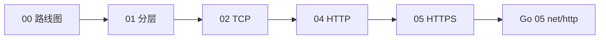

# 计算机网络学习路线图与说明

> **文件编码**：UTF-8。本文件夹内所有 `.md` 均为 UTF-8。  
> **修改说明**：2026-07-12 v3.0 **全系列 8 章**按 **0 基础** 完整重写；实操以 **PowerShell + curl** 为主，各章补充 **浏览器 / Java / Python** 多栈对照，Go 为主线但不独占。

---

## 0. 读前导读（零基础也能跟上）

### 0.1 用一句话弄懂本系列

**一句话**：计网 = 搞清「你的 Go 程序发 HTTP 请求、收 JSON 响应」**中间经过了什么**——分层、TCP 连接、HTTP 报文、HTTPS 加密、DNS 查地址。

**生活类比——寄快递**：

| 计网概念 | 生活类比 | 本章 |
|----------|----------|------|
| **分层** | 写单子 → 装箱 → 选路线 → 本地配送 | 01 |
| **TCP** | 打电话先确认「喂听得见吗」再说话 | 02 |
| **HTTP** | 快递单上写「要什么、怎么要」 | 04 |
| **HTTPS** | 带封条的保密件 | 05 |
| **DNS** | 查通讯录把名字变门牌号 | 03（选修） |

### 0.2 你需要提前知道什么

| 能力 | 要求 | 不会怎么办 |
|------|------|------------|
| 会用电脑、复制粘贴命令 | ✅ 必须 | — |
| 学过 Go 01～04 | ✅ 建议（你已完成 Tour + 00～04） | 至少会 `go run`、懂 `error` |
| HTML / Vue / 浏览器 | ❌ **不要求** | 本系列不依赖 |
| `curl` 命令 | ❌ 不要求 | 00～04 每章手把手教 |

**真·零基础也能学**：只要你愿意在 PowerShell 里敲 `ping`、`curl`，并对着输出读说明。

### 0.2.1 系列常见缩写速查（首次出现可先扫一眼）

后面各章会反复出现这些词；**第一次看到不懂，先回来查这张表**。

| 缩写 / 名词 | 英文全称（如有） | 一句话 |
|-------------|------------------|--------|
| **API** | Application Programming Interface | 程序之间调用的接口，如 `GET /api/users` 返回 JSON |
| **JWT** | JSON Web Token | 登录后服务端签发的令牌字符串，放 `Authorization: Bearer` 头里 |
| **CORS** | Cross-Origin Resource Sharing | 浏览器规则：网页 JS 能否读取「别的域名」接口的响应；**curl 不受限** |
| **CDN** | Content Delivery Network | 内容分发网络，把静态文件缓存到离用户近的节点 |
| **Handler** | — | 收到 HTTP 请求后执行业务逻辑的函数（Go 里 `func(w, r)`） |
| **Nginx** | — | 常用 Web 服务器/反向代理，生产常由它在 443 接 HTTPS 再转给 Go |
| **Redis** | — | 内存键值数据库，常用来缓存、存 Session、做限流计数 |
| **MySQL** | — | 关系型数据库，持久保存业务数据（用户、订单等） |
| **REST** | Representational State Transfer | 用 URL 表资源、HTTP 方法表操作的 API 设计风格 |
| **CRUD** | Create Read Update Delete | 增删改查四种基本数据操作 |
| **TTFB** | Time To First Byte | 发出请求到收到响应**第一个字节**的等待时间 |
| **RTT** | Round-Trip Time | 一个请求往返的时延（发出去再收回来） |
| **DevTools** | Developer Tools | 浏览器按 F12 打开的开发者工具，Network 可看请求耗时 |
| **幂等** | Idempotent | 同一操作执行 1 次和 N 次，资源最终状态相同 |
| **反代** | Reverse Proxy | 反向代理：对外接请求，再转发给内网真实服务（如 Go 8080） |
| **预检** | Preflight | 浏览器跨域时先发 OPTIONS 请求「问保安能不能过」 |
| **Bearer** | — | HTTP 认证方案名，意为「持票人凭此 token 通行」 |
| **QPS** | Queries Per Second | 每秒处理的请求数，衡量接口吞吐量 |

> **Tour**：指 Go 官方入门教程 [A Tour of Go](https://go.dev/tour/)，浏览器里跟着做的小练习。

---

- [ ] 说出 **速成路径** 01 → 02 → 04 → 05 各章干什么
- [ ] 知道学完后能继续 [Go 05 net/http](../../后端学习/Go/05-Go标准库与HTTP基础.md)
- [ ] 能执行 `ping 127.0.0.1` 和 `curl -I https://www.example.com`
- [ ] 区分「应用层 HTTP」和「传输层 TCP」不是一回事

### 0.4 建议学习时长（Go 后端完整路线）

| 天 | 章节 | 时长 | 目标 |
|----|------|------|------|
| 第 1 天 | **01** 分层基础 | 3～4 h | 能画 TCP/IP 四层，懂 IP/端口 |
| 第 2 天 | **02** TCP/UDP | 3～4 h | 能口述三次握手；懂 `:8080` |
| 第 3 天 | **03** DNS（选修可后补） | 2～3 h | 会 `nslookup`，区分 DNS/TCP 失败 |
| 第 4 天 | **04** HTTP | 4～5 h | 能 `curl -v` 读懂请求/响应 |
| 第 5 天 | **05** HTTPS | 2～3 h | 知道 TLS 在 HTTP 下面 |
| 第 6 天 | **06** 缓存/JWT/CORS | 3～4 h | 懂 JWT 放 Header；面试能讲 CORS（见 §0.2.1） |
| 考前 | **07** 面试总表 | 1～2 h | 八股过一遍 + 自评 |

**最快开 Go 05**：01 → 02 → 04（3 天），HTTPS/DNS/06 边做项目边补。  
**完整学完**：约 **6～7 天** 后再系统刷 07。

### 0.5 学完本系列（速成部分）你能做什么

1. 用 `curl localhost:8080/health` 测自己的 Go API，看得懂状态码和响应头。
2. 后端启动失败时，区分 **端口占用（TCP）** vs **路由写错（HTTP 404）**。
3. 面试能 2 分钟讲「浏览器/客户端输入 URL 后发生了什么」（后端视角）。
4. 继续学 [Go 05](../../后端学习/Go/05-Go标准库与HTTP基础.md) 时不被 GET/POST、Header、状态码卡住。

---

## 1. 这套资料适合谁（2026 版）

| 适合 | 不适合 |
|------|--------|
| **Go 后端暑假主线**（你） | 已做网工/运维多年 |
| 计网 **0 基础**，只想快点懂 HTTP/TCP | 要啃完整谢希仁教材 |
| 用 **curl** 练手为主 | 只学某一门语言、拒绝通用协议视角 |

与旧版区别：

| 旧版假设 | 新版假设 |
|----------|----------|
| 先学 HTML 10、Vue 08 联调 | **无前端前置** |
| DevTools Network 为主 | **curl + PowerShell** 为主，DevTools 选修 |
| 06 章 CORS 是必修 | **06 章 CORS 完整**（含浏览器 fetch 对照） |
| 01～07 全精读 | **01/02/04/05 必修**，03/06/07 选修 |

---

## 2. 为什么 Go 后端必须学一点计网

你写完 [Go 04 并发](../../后端学习/Go/04-Go并发编程goroutine与channel.md) 后，[Go 05](../../后端学习/Go/05-Go标准库与HTTP基础.md) 要用 `net/http` 搭 API。不懂计网时常见困惑：

| 现象 | 不懂计网时 | 懂计网后 |
|------|------------|----------|
| `curl` 报 `Connection refused` | 以为 Go 代码写错 | 先查 **8080 有没有进程监听**（TCP） |
| 返回 `404 Not Found` | 以为服务器挂了 | 路径/方法错了（**HTTP 应用层**） |
| `curl http` 想测 HTTPS 接口 | 协议搞混 | 该用 `https://`（**TLS 层**） |
| 面试问三次握手 | 完全没概念 | 02 章能答 |

**竞赛算法不替代计网**：笔试可能考算法，但后端面试 **MySQL/Redis/计网** 照样问。

---

## 3. 学习顺序（完整路线）

```text
00 路线图（你现在在这里）
 ↓
01 网络分层与通信基础     ← 第 1 天
 ↓
02 TCP 与 UDP             ← 第 2 天
 ↓
03 IP 地址与 DNS 解析      ← 第 3 天（可后补，但建议学）
 ↓
04 HTTP 协议深入           ← 第 4 天 ⭐ Go 05 最重要前置
 ↓
05 HTTPS 与 TLS 加密       ← 第 5 天
 ↓
06 缓存 Cookie 与会话      ← 第 6 天（JWT/CORS，配合 Go 09）
 ↓
07 面试专题总表            ← 考前复习
 ↓
Go 05 net/http 实战
```

**想最快写代码？** 可压缩为 **01 → 02 → 04**（3 天）后开 Go 05，03/05/06 边做短链项目边补。



---

## 4. TCP/IP 四层（先建立印象）

不必背 OSI 七层名字。后端日常记 **TCP/IP 四层** 即可：

| TCP/IP 层 | 干什么 | 你写的 Go 程序碰到的 |
|-----------|--------|----------------------|
| **应用层** | HTTP、DNS、TLS | `net/http`、URL、JSON |
| **传输层** | TCP、UDP、**端口** | `:8080`、连接建立 |
| **网际层** | IP 地址、路由 | `127.0.0.1`、ping |
| **网络接口层** | 网卡、Wi-Fi、以太网 | 了解即可 |

**关键句**：

- 说 **HTTP 状态码 404** → 应用层  
- 说 **三次握手、端口** → 传输层  
- 说 **ping、IP** → 网际层  

01 章会画「封装套娃」图。

---

## 5. 与 Go 学习路线对照

| Go 章节 | 需要哪块计网 |
|---------|--------------|
| [05 net/http](../../后端学习/Go/05-Go标准库与HTTP基础.md) | **04 HTTP** + 02 TCP（端口） |
| [06 Gin](../../后端学习/Go/06-Gin框架核心与中间件.md) | 04 HTTP 方法、状态码、Header |
| [09 JWT](../../后端学习/Go/09-JWT认证与用户体系.md) | 06 选修：Cookie vs Token |
| 短链项目 302 跳转 | 04：`301/302` 区别 |
| 面试八股 | 02 TCP + 04 HTTP + 05 HTTPS + [07 总表](./07-面试专题与知识点总表.md) |

对照 [go-backend-learning-plan.md](../../go-backend-learning-plan.md)：原计划 W2～W3 学计网，你可用 **速成 4 天** 插入在 Go 04 与 Go 05 之间。

---

## 6. 必备工具（仅 curl 路线）

| 工具 | 用途 | 安装 |
|------|------|------|
| **PowerShell** | 跑 `ping`、`curl` | Windows 自带 |
| **curl** | 发 HTTP 请求、看响应头 | Win10+ 自带 |

**第一天验证**（必须做）：

```powershell
ping -n 2 127.0.0.1
curl -I https://www.example.com
```

**预期**：

- `ping`：丢失 = 0%  
- `curl -I`：第一行类似 `HTTP/1.1 200 OK` 或 `HTTP/2 200`

若 `curl` 提示不是内部命令：Windows 设置 → 应用 → 可选功能 → 添加 **curl**（一般已有）。

---

## 7. 各章索引（2026 速成版）

| 编号 | 文件 | 必修？ | 一句话 |
|------|------|--------|--------|
| 00 | 学习路线图与说明 | ✅ | 你现在看的 |
| 01 | [网络分层与通信基础](./01-网络分层与通信基础.md) | ✅ 第 1 天 | 四层模型、IP、端口、封装 |
| 02 | [TCP 与 UDP](./02-TCP与UDP.md) | ✅ 第 2 天 | 三次握手、四次挥手、端口 |
| 03 | [IP 地址与 DNS 解析](./03-IP地址与DNS解析.md) | 建议第 3 天 | 域名变 IP、排障三层 |
| 04 | [HTTP 协议深入](./04-HTTP协议深入.md) | ✅ 第 4 天 | 方法、状态码、Header、报文 |
| 05 | [HTTPS 与 TLS 加密](./05-HTTPS与TLS加密.md) | ✅ 第 5 天 | 证书、TLS 握手、curl -v |
| 06 | [缓存 Cookie 与会话机制](./06-缓存Cookie与会话机制.md) | ✅ 第 6 天 | JWT、CORS、缓存头 |
| 07 | [面试专题与知识点总表](./07-面试专题与知识点总表.md) | 考前 | Go 后端八股速查 |

---

## 8. 每章怎么学（四步法）

1. **通读** §0 读前导读 + 知识地图  
2. **跟做** 终端里每条 `curl`/`ping` **亲手敲**  
3. **自测** 章末闭卷题，对照答案  
4. **串讲** 合上书 3 分钟讲给朋友听（**费曼学习法**：用大白话讲给外行，讲不清说明还没真懂）  

---

## 9. 第一天 Checklist

```text
□ 读完本 00 章
□ PowerShell 执行 ping 127.0.0.1 成功
□ curl -I https://www.example.com 看到 HTTP 状态行
□ 打开 01 章，准备画 TCP/IP 四层图
□ （可选）Go 04 已学完，准备 4 天后进 Go 05
```

---

## 10. 常见 FAQ

**Q：没学 HTML 10 能学吗？**  
能。本系列已从零写，不引用前端课程作前置。

**Q：要不要买《图解 HTTP》？**  
可选。速成以本仓库 04/05 章 + curl 练习为主；书当补充阅读。

**Q：CORS 不学行不行？**  
纯后端用 curl/Postman 测 API **不触发 CORS**（CORS 是浏览器策略）。但前后端联调、面试必考，见 [06 章](./06-缓存Cookie与会话机制.md)。

**Q：和 Java 06/07 计网重复吗？**  
不重复。Java 06/07 是 MySQL/Redis；计网是 HTTP/TCP，Go/Java 岗面试都要。

**Q：学完就能写 Gin 了吗？**  
还差一步：先 [Go 05 net/http](../../后端学习/Go/05-Go标准库与HTTP基础.md)，再 [Go 06 Gin](../../后端学习/Go/06-Gin框架核心与中间件.md)。计网是 Go 05 的前置。

**Q：我只学 Java/Spring，这套计网有用吗？**  
有用。TCP/HTTP/TLS/DNS/CORS 与语言无关；各章已补浏览器、Spring、Flask 对照，Go 示例可当作「另一种后端写法」阅读。

**Q：curl 和 Postman 有什么区别？**  
都能发 HTTP 请求。curl 适合脚本和终端排障；Postman 适合保存接口集合、团队协作。两者都不受 CORS 限制。

**Q：为什么要学浏览器 DevTools？**  
你主线是后端，但面试常问「页面慢在哪」——Network Timing 能对应 DNS/TCP/TLS/TTFB（见 [01 章 §7.7](./01-网络分层与通信基础.md)）。

**Q：速成和完整路线怎么选？**  
赶 Go 05：01→02→04→05（约 3 天）。有时间：01→02→03→04→05→06→07（约 6～7 天）。

**Q：计网学完还要学什么才能实习？**  
计网 + Go 05～11 短链 + Redis/MySQL 八股 + 算法维持；详见 [go-backend-learning-plan.md](../../go-backend-learning-plan.md)。

---

## 11. 练习建议

**基础**：用一句话说明 HTTP 和 TCP 分别在哪一层。

**进阶**：画出 TCP/IP 四层，标出 `curl`、`net/http`、`:8080` 各在哪层。

**挑战**：`curl` 访问 `http://localhost:8080` 失败时，列出 3 种可能原因及所属层次。

### 参考答案

**基础**：HTTP 在应用层；TCP 在传输层。

**进阶**：应用层 HTTP/curl → 传输层 TCP:8080 → 网际层 IP → 网络接口层。

**挑战**：① 没启动 Go 服务（TCP 连接拒绝）② 防火墙拦端口（传输/网络）③ 地址写错（应用层 URL）。

---

## 12. 学完标准

- [ ] 能说出速成路径 01→02→04→05  
- [ ] `ping`、`curl -I` 跑通  
- [ ] 能区分 HTTP 与 TCP 层次  
- [ ] 准备好开始 Go 05  

---

## 13. 下一章预告

下一章 **[01 网络分层与通信基础](./01-网络分层与通信基础.md)**：从「两台电脑怎么说话」讲起，建立 **TCP/IP 四层**、**IP 与端口**、**封装** 直觉——全程用生活类比 + `ping`/`curl`，不要求任何前端知识。

---

## 14. 闭卷自测

1. 本系列速成必修哪几章？  
2. HTTP 在哪一层？TCP 在哪一层？  
3. 学计网主要用什么工具？  
4. Go 05 的前置计网章节主要是哪章？  
5. CORS 主要影响浏览器还是 curl？  

<details>
<summary>参考答案</summary>

1. 01、02、04、05。  
2. 应用层；传输层。  
3. PowerShell + curl。  
4. 主要是 04 HTTP，02 补端口与连接。  
5. 主要影响浏览器；curl 不受 CORS 限制。

</details>

---

*文档版本：v3.0 · 2026-07-12 · 全系列 Go 后端 0 基础完整重写*
