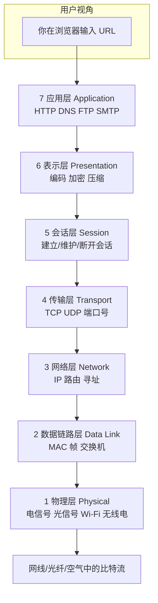
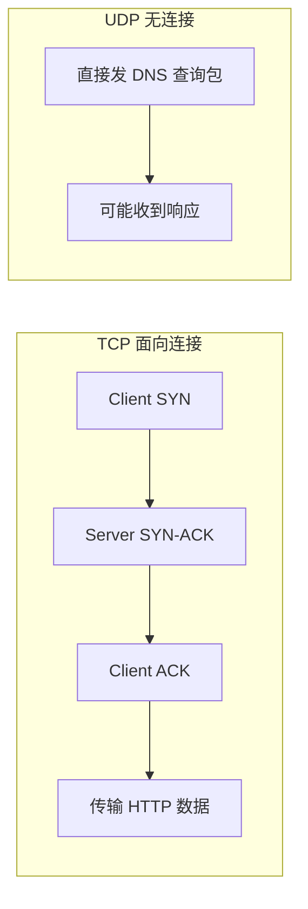
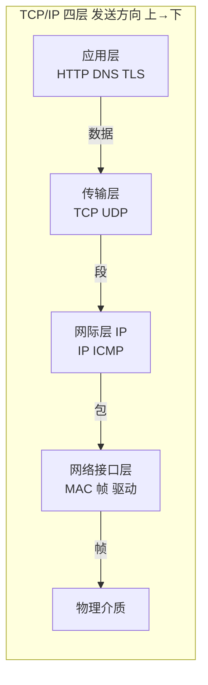
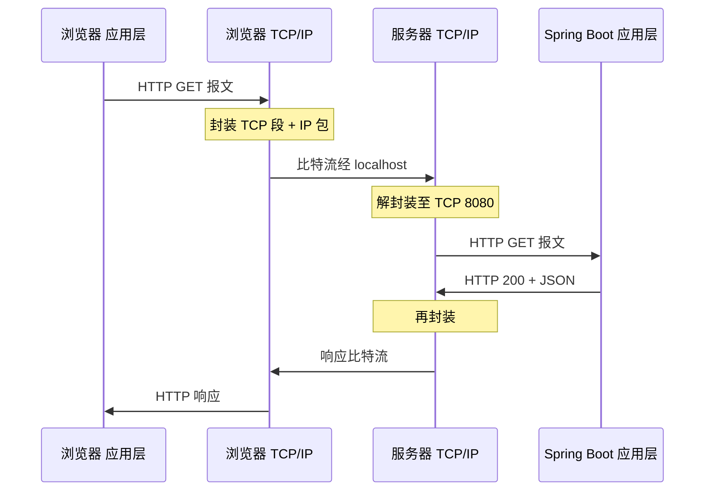
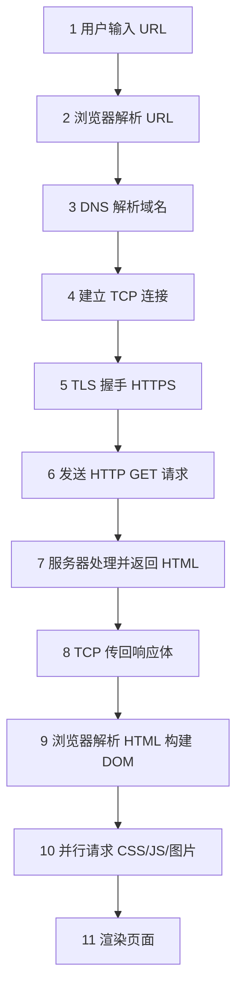
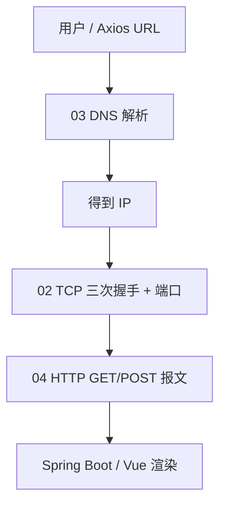

# 网络分层与通信基础

> **文件编码**：UTF-8。终端命令在 **PowerShell** 下执行；浏览器示例以 **Chrome / Edge** 为准。

---

## 0. 读前导读（零基础也能跟上）

### 0.1 用一句话弄懂本章

**计算机网络** = 多台电脑按「协议（共同规则）」传数据；**分层** = 把复杂问题拆成七层/四层，每层只管自己的事——就像寄快递：你写单子（应用层）→ 快递公司打包（传输层）→ 选路线（网络层）→ 本地配送（链路层）。

**生活类比总表**（本章会反复用到）：

| 概念 | 类比 | 一句话 |
|------|------|--------|
| **协议（Protocol）** | 寄信的信封格式 + 邮票规则 | 双方必须遵守同一套格式才能通信 |
| **分层** | 快递：打包员、调度、司机、门卫各管一段 | 出问题能定位在哪一层 |
| **封装** | 俄罗斯套娃 / 快递盒套快递盒 | 发送时逐层加「外包装」（首部） |
| **IP 地址** | 城市+街道（可搬迁的逻辑地址） | 把数据送到**哪台电脑** |
| **端口（Port）** | 同一地址下的「房间号」 | 把数据送到**哪个程序** |
| **MAC 地址** | 宿舍门牌（物理网卡身份证） | 局域网内最后一跳 |

> 后续章节：**TCP = 打电话**（先拨号接通再说话，保证听清）；**HTTP = 信纸格式**（信里写什么、怎么写标题行）；**DNS = 通讯录查号码**（03 章）。Git 是另一门课，类比 **游戏存档**——见 Git 01。

### 0.2 你需要提前知道什么（真不会就先跳到哪一章）

| 能力 | 最低要求 | 不会怎么办 |
|------|----------|------------|
| 浏览器打开网页 | 会输入 URL、会 F12 | 先读 [HTML 10](../HTML%20CSS%20JS/10-浏览器HTTP网络与Web基础.md) §1～3 |
| `localhost`、端口号 | 见过 `localhost:5173` | 知道「本机 + 房间号」即可，本章 §6 会讲 |
| PowerShell 复制命令 | 能粘贴运行 `ping`、`curl` | 命令失败先看 §9 报错表 |
| Axios / fetch | **不要求** | 有更好，没有也不挡本章 |
| OSI 七个字 | **不要求** | 本章 §2 从零教，口诀「物数网传会表应」 |

**真零基础路线**：00 路线图扫一眼 → 本章 §0～§2 → §5 封装 → §9 动手 ping/curl → 再读 02 章 TCP。

### 0.3 本章知识地图（学完后应能勾选全部 ☐→☑）

```text
☐ 能用自己的话解释「协议」和「分层」
☐ 能说出 OSI 七层名称（物数网传会表应）及每层一句职责
☐ 能对照 OSI 与 TCP/IP 四层
☐ 能讲解封装/解封装，并举例 HTTP GET 如何被打包
☐ 能区分 MAC、IP、端口 各在哪一层、各管什么
☐ 能描述 C/S 模型与浏览器在其中的角色
☐ 能口述「输入 URL → 获得 HTML」2 分钟版，标出 DNS/TCP/HTTP 步骤
☐ 会用 ping、curl -I、netstat 做基础排查
☐ Network Timing 里能指出 DNS Lookup 与 Initial connection 对应什么
```

### 0.4 建议学习时长与节奏

| 阶段 | 内容 | 时间 | 节奏建议 |
|------|------|------|----------|
| 第 1 遍 | §0～§4 分层模型 | 45～60 分钟 | 边读边在纸上画四层框图 |
| 第 2 遍 | §5～§6 封装与地址 | 40 分钟 | 对照 shop-vue 5173→8080 想一遍 |
| 第 3 遍 | §8～§9 全链路 + 实操 | 50 分钟 | **必须**亲手跑 ping/curl |
| 复盘 | 自测 + 费曼 | 30 分钟 | 合上书能讲 3 分钟 |

**别一天啃完**：建议 2～3 天，每天 1 小时；实操与阅读交替，比纯看文档有效 3 倍。

### 0.5 学完本章你能做什么（可验证的具体动作）

1. 打开 Chrome Network，对一条 HTTPS 请求指出：**DNS / TCP / HTTP** 分别对应 Timing 里哪几项。
2. 后端 `Connection refused` 时，用 `netstat` 判断是**传输层端口**问题，而不是改 CORS。
3. 向同学解释：为什么 `localhost:5173` 和 `localhost:8080` 是**两个不同源**（端口不同）。
4. 在纸上画出：`GET /api/users` 从浏览器到 Spring Boot 的**封装套娃**（至少到 TCP 段）。
5. 面试 2 分钟：从输入 URL 到页面渲染，说出至少 **5 个步骤**及对应层次。

---

## 本章与上一章的关系

[00 学习路线图](./00-学习路线图与说明.md) 已说明：你在 [HTML CSS JS 10](../HTML%20CSS%20JS/10-浏览器HTTP网络与Web基础.md) 学过 HTTP 状态码、Network 面板、URL 拆解和「输入 URL 到渲染」的 10 步流程——那是**站在浏览器门口**看 Web。

**本章（01）** 再往下挖一层：数据在网络上**怎么分层传递**、**封装与解封装**是什么、**MAC / IP / 端口** 各管哪一段路。学完后你看 Network 的 **Timing**（DNS、Initial connection、Waiting）就不会是一堆陌生英文，而是和分层模型一一对应。

**下一章（02 HTTP 与 HTTPS 协议深入）** 会专注**应用层**报文格式；本章先把「HTTP 坐在 TCP 上、TCP 坐在 IP 上」的**座位关系**摆清楚。

**前置自检**：

| 能力 | 对应章节 | 本章是否依赖 |
|------|----------|--------------|
| URL 拆解 | HTML CSS JS 10 §3 | ✅ |
| HTTP 请求/响应概念 | HTML CSS JS 10 §4～5 | ✅ |
| `fetch` 发起过请求 | HTML CSS JS 09 | 建议有 |
| OSI/TCP/IP 名字 | 计网 00 §3 | 读过即可 |

---

## 1. 什么是计算机网络

### 1.1 一句话定义

**计算机网络** = 用通信设备和线路把多台计算机连接起来，按约定规则（**协议**）交换数据的系统。

你日常写的每一行前端代码，只要涉及「发请求、打开网页、加载 CDN 图片」，都在使用这个系统——只是浏览器和操作系统帮你完成了绝大部分底层细节。

### 1.2 前端为什么从「分层」学起

若把网络看成一整块黑盒，你只能背「HTTP 200 是成功」。一旦出问题：

- 是**名字解析**错了（DNS）？
- 是**线路不通**（IP 路由）？
- 是**端口没人听**（TCP）？
- 还是**浏览器安全策略**（CORS）？

**分层模型**的价值：把大问题切成层，每层只和相邻层打交道，排查时可以**逐层缩小范围**——这和你在 [Vue 08](../Vue/08-Axios网络请求与前后端联调.md) 联调时「先看 Network → 再 curl → 再看后端日志」的思路一致。

### 1.3 协议（Protocol）是什么

**协议** = 通信双方必须遵守的**格式与顺序**约定。

| 类比 | 网络中的协议 |
|------|--------------|
| 写信：信封格式、邮编、 stamps | IP 包头、TCP 段头、HTTP 请求行 |
| 说中文/英文要先约定 | 应用层 HTTP vs 邮件 SMTP |
| 快递单号追踪 | TCP 序号、确认号 |

同一层里可以有很多种协议；**不同层之间通过接口协作**——上层把数据交给下层，下层不关心上层是 HTTP 还是 FTP（理论上）。

---

## 2. OSI 七层模型（理论参考）

OSI（Open Systems Interconnection）是 ISO 提出的**七层参考模型**。实际互联网以 **TCP/IP** 为主，但面试和教材常问 OSI，所以要能**对照记忆**，不必逐层背协议细节。

**记忆口诀（国内常见）**：「物数网传会表应」——从下到上：物理、数据链路、网络、传输、会话、表示、应用。



**数据方向**：

- **发送方**：应用层往下，每层加自己的**首部**（有时加尾部）→ **封装**
- **接收方**：物理层往上，每层剥掉首部 → **解封装**

下面逐层说明「干什么、举例、前端要不要深挖」。

---

## 3. OSI 各层职责与示例

### 3.1 第 7 层：应用层（Application）

**职责**：为**应用程序**提供网络服务接口——你的业务逻辑「说话」的层次。

| 协议/服务 | 用途 | 前端关联 |
|-----------|------|----------|
| **HTTP/HTTPS** | Web 页面与 API | ✅ 最核心 |
| **DNS** | 域名 → IP | ✅ 03 章专讲 |
| **WebSocket** | 全双工实时通信 | 聊天、大屏 |
| FTP/SMTP | 文件/邮件 | 了解即可 |

**例子**：浏览器发 `GET /api/users HTTP/1.1`，整条请求报文属于应用层数据，交给下层 transport。

**你要达到的水平**：能读 Request/Response 结构（02 章）；知道 JSON、`Content-Type` 都在这一层。

**Web 前端日常 90% 的工作都在这一层及以上**——所以 02、05、06 章权重很高。

### 3.1.1 应用层常见协议速查（扩展）

| 协议 | 端口（默认） | 前端是否常用 | 一句话 |
|------|-------------|--------------|--------|
| HTTP | 80 | ✅ | 明文 Web |
| HTTPS | 443 | ✅ | HTTP + TLS |
| DNS | 53 | ✅ 间接 | 域名解析 |
| WebSocket | 80/443（升级） | 中 | 全双工推送 |
| FTP | 21 | 否 | 文件传输（老） |
| SMTP | 25 | 否 | 发邮件 |

### 3.2 第 6 层：表示层（Presentation）

**职责**：**数据格式**转换——编码、加密、压缩，让双方「看得懂同一份数据」。

| 功能 | 例子 |
|------|------|
| 字符编码 | UTF-8 JSON |
| 加密 | HTTPS 中 TLS 对应用数据的加密（常归入应用层讨论） |
| 压缩 | `Content-Encoding: gzip` |

**前端关联**：接口返回 gzip 压缩 body，浏览器自动解压；你写 JSON 时用 UTF-8。TLS 在工程上常和 HTTP 一起讲（02、06 章）。

### 3.3 第 5 层：会话层（Session）

**职责**：建立、维护、**终止会话**（谁在和谁「通话」）。

| 概念 | 例子 |
|------|------|
| 会话 ID | Cookie 里的 SessionId |
| 登录态 | 服务端 Session 或 JWT 生命周期 |

**前端关联**：登录后多次请求带同一 token/Cookie，本质是「同一会话」。HTTP 本身无状态，会话靠 Cookie/Token 模拟（HTML 10 §23）。

### 3.4 第 4 层：传输层（Transport）

**职责**：**端到端**（进程到进程）的可靠或不可靠传输，用 **端口号** 区分应用。

| 协议 | 特点 | 典型端口 |
|------|------|----------|
| **TCP** | 可靠、有序、面向连接 | HTTP 80/443、Spring Boot 8080、Vite 5173 |
| **UDP** | 不可靠、低延迟 | DNS 查询、视频直播、WebRTC |

**前端关联**：

- `localhost:5173` 里的 **5173** 是传输层端口
- 「后端没启动」常表现为 **TCP 连接被拒绝**（04 章）
- HTTP/1.1 默认跑在 **TCP** 上

### 3.5 第 3 层：网络层（Network）

**职责**：**主机到主机**寻址与路由——把包从源 IP 送到目的 IP，可能经过多跳路由器。

| 概念 | 说明 |
|------|------|
| **IP 地址** | 逻辑地址，如 `192.168.1.10`、`8.8.8.8` |
| **路由** | 路由器根据路由表转发 |
| **ICMP** | `ping` 用的协议，测可达性 |

**前端关联**：DNS 解析结果是 IP；`ping www.baidu.com` 看到的就是目标 IP。生产环境 Nginx 后面有多台服务器，靠 IP + 负载均衡。

### 3.6 第 2 层：数据链路层（Data Link）

**职责**：**同一局域网内**节点到节点（如你的电脑 → 家里路由器）传 **帧**，用 **MAC 地址** 标识网卡。

| 概念 | 说明 |
|------|------|
| MAC 地址 | 48 位硬件地址，如 `AA:BB:CC:DD:EE:FF` |
| 交换机 | 二层设备，按 MAC 转发 |
| ARP | IP 查 MAC（局域网内） |

**前端关联**：日常开发很少改 MAC；懂即可——**IP 路由到子网后，链路层负责最后一跳**。Wi-Fi 连上但 ping 不通公网，可能是二层/路由器问题而非你的 Vue 代码。

### 3.7 第 1 层：物理层（Physical）

**职责**：比特流在**物理介质**上传输——双绞线、光纤、无线电。

**前端关联**：几乎不直接涉及；知道「没有 Wi-Fi/网线，上面所有层都白搭」即可。

### 3.8 OSI 小结表（面试速查）

| 层 | 名称 | 数据单位 | 地址/标识 | 典型设备/协议 |
|----|------|----------|-----------|---------------|
| 7 | 应用层 | 报文 Message | 域名、URL | HTTP、DNS |
| 6 | 表示层 | 报文 | 编码 | TLS、gzip |
| 5 | 会话层 | 报文 | SessionId | Cookie 会话 |
| 4 | 传输层 | 段 Segment | **端口号** | TCP、UDP |
| 3 | 网络层 | 包 Packet | **IP 地址** | IP、ICMP |
| 2 | 数据链路层 | 帧 Frame | **MAC** | 以太网、Wi-Fi |
| 1 | 物理层 | 比特 Bit | — | 网线、光纤 |

### 3.9 网络设备与各层关系（建立直觉）

| 设备 | 工作层次 | 转发依据 | 前端要不要会配 |
|------|----------|----------|----------------|
| 中继器 / 集线器 | 物理层 | 信号放大 | 否 |
| 交换机 | 数据链路层 | MAC 地址 | 否 |
| 路由器 | 网络层 | IP 地址 | 了解（家用路由器） |
| 防火墙 | 多层 | 规则 | 了解（公司网络） |
| 负载均衡 | 传输层/应用层 | IP+端口 / URL | 部署时运维配 |

**家用 Wi-Fi 场景**：笔记本 → Wi-Fi（链路层）→ 路由器（网络层 NAT）→ 公网 → 目标服务器。  
前端本地开发：`127.0.0.1` 环回**不经过**路由器，所以「断网」有时仍能访问 localhost 上的 Vite/Java。

### 3.10 TCP 与 UDP 预览（04 章详讲）

传输层两个核心协议，先建立印象：

| | TCP | UDP |
|---|-----|-----|
| 连接 | 面向连接（三次握手） | 无连接 |
| 可靠性 | 可靠、有序、重传 | 不保证到达 |
| 速度 | 相对慢 | 相对快 |
| 典型用途 | HTTP、HTTPS、数据库连接 | DNS 查询、直播、游戏 |
| 前端 | **几乎全部 HTTP API** | WebRTC 部分场景 |

**为什么 HTTP 用 TCP 不用 UDP？** Web 页面和 API 需要**完整、有序**的数据——丢一个 TCP 段会自动重传；UDP 丢了就丢了，适合能容忍丢帧的视频，不适合 JSON 接口。



### 3.11 IPv4 与 IPv6（前端只需知道这些）

| | IPv4 | IPv6 |
|---|------|------|
| 格式 | `192.168.1.1`（32 位） | `2001:db8::1`（128 位） |
| 数量 | 约 43 亿，已紧张 | 极大，未来主流 |
| 前端 | 现在仍最常见 | 部分运营商已支持；URL 中 IPv6 常加 `[]` |

**开发环境**：`localhost` / `127.0.0.1` 永远是本机。  
**生产**：域名解析到 IPv4 或 IPv6 A/AAAA 记录（03 章）。  
**不必**手算子网——除非做运维；知道 `192.168.x.x` 是**私有地址**（内网）即可。

### 3.12 深入：为什么 OSI 是七层而不是五层或三层？

OSI 把「应用相关」拆成应用/表示/会话三层，是为了**教学上职责更清晰**：

| 若合并 | 丢失的视角 |
|--------|------------|
| 表示层并入应用层 | 加密、编码与「业务 API」混在一起讲 |
| 会话层并入应用层 | Cookie/Session 生命周期不易单独讨论 |
| 链路+物理合并 | 实际工程里常合并为「网络接口层」（TCP/IP 做法） |

**工程实践**：互联网用 **TCP/IP 四层** 足够；面试问 OSI 七层时，答出**名称 + 一层职责 + 一个协议**即可，不必纠结「TLS 到底算第几层」——教材有时把 TLS 放在表示层，有时与 HTTP 合称 HTTPS 应用层，**能自洽解释**比死背更重要。

**小案例**：面试官问「HTTPS 在哪一层？」推荐答法：「HTTP 内容属于应用层；TLS 提供加密与握手，通常说 **HTTPS = HTTP over TLS over TCP**，TLS 可视为应用层之下、TCP 之上的安全层，与 02、06 章一致。」

---

## 4. TCP/IP 四层模型（互联网实际）

TCP/IP 是互联网事实标准，比 OSI **更粗、更实用**。本系列后续章节以 TCP/IP 为主轴。



### 4.1 应用层

对应 OSI 5～7 层。浏览器、Node、Spring Boot 的 Tomcat **直接打交道的层次**。

- HTTP/HTTPS、DNS、FTP、SMTP…
- 你的 Axios `GET /api/users` 在这里

### 4.2 传输层

对应 OSI 第 4 层。核心：**TCP**、**UDP** + **端口**。

```text
一台服务器 IP 相同，可同时：
  :80   → Nginx（HTTP）
  :443  → Nginx（HTTPS）
  :8080 → Spring Boot
  :5173 → Vite dev server
靠端口号区分进程 —— 传输层的职责
```

### 4.3 网际层（Internet Layer）

对应 OSI 第 3 层。核心协议 **IP**（IPv4 / IPv6）。

- 路由选择、分包、TTL
- `ping` 多用 ICMP（常归为网际层辅助）

### 4.4 网络接口层（Network Access / Link）

对应 OSI 1～2 层。网卡驱动、以太网、Wi-Fi。

- 把 IP 包封装成帧发出去
- 前端开发极少直接配置

### 4.5 OSI 与 TCP/IP 对照（必背简化版）

| OSI | TCP/IP | 前端重点 |
|-----|--------|----------|
| 应用 + 表示 + 会话 | **应用层** | HTTP、DNS、Cookie、TLS |
| 传输 | **传输层** | TCP、端口、连接 |
| 网络 | **网际层** | IP、ping |
| 数据链路 + 物理 | **网络接口层** | 了解 |

---

## 5. 封装与解封装（核心机制）

### 5.1 什么是封装（Encapsulation）

发送数据时，**从高到低**，每一层给上层传来的数据加上本层**首部**（Header），有时加**尾部**（Tail），这个过程叫封装。

可以把它想成**俄罗斯套娃**或**快递打包**：

```text
应用层：  [ HTTP 请求报文 ]
           ↓ 加 TCP 首部
传输层：  [ TCP 头 | HTTP 请求报文 ]
           ↓ 加 IP 首部
网际层：  [ IP 头 | TCP 头 | HTTP 请求报文 ]
           ↓ 加帧头帧尾
链路层：  [ 帧头 | IP 头 | TCP 头 | HTTP 请求报文 | 帧尾 ]
           ↓
物理层：  010101... 比特流
```

**重要**：每一层只认自己的首部；剥掉后交给上一层。

### 5.1.1 各层 PDU 名称（面试常问）

| 层次 | 单位名称（PDU） | 英文 |
|------|-----------------|------|
| 应用层 | 报文 | Message / Data |
| 传输层 | 段（TCP）/ 数据报（UDP） | Segment / Datagram |
| 网际层 | 包 | Packet |
| 网络接口层 | 帧 | Frame |
| 物理层 | 比特 | Bit |

**记忆**：「段包帧比特」从传输层往下；应用层统称**报文**或**数据**。

### 5.1.2 首部里通常有什么（了解）

不必背字节偏移，知道「每层首部携带本层决策信息」即可：

| 层 | 首部关键字段（概念） |
|----|---------------------|
| TCP | 源端口、目的端口、序号、确认号、标志位 SYN/ACK/FIN |
| IP | 源 IP、目的 IP、TTL（生存时间）、协议号（6=TCP） |
| 以太网帧 | 源 MAC、目的 MAC、类型 |

**TTL 与前端**：Traceroute 利用 TTL 递增让每一跳路由器「过期丢弃并通知」——所以你能看到路径。普通 HTTP 请求 TTL 由 OS 设置，开发者一般不改。

---

接收方从物理层**向上**，每层根据首部处理完后**去掉首部**，把载荷交给上一层。

```text
链路层收帧 → 校验 → 交给 IP
IP 看目的 IP 是否本机 → 交给 TCP
TCP 看端口 8080 → 交给监听 8080 的进程（如 Java）
应用层 HTTP 服务器解析 GET /api/users
```

### 5.3 完整示例：shop-vue 一次 GET 请求的封装

**场景**：浏览器 `http://localhost:5173` 通过 Axios 请求 `http://localhost:8080/api/users`（假设已配 CORS 或 proxy，先忽略跨域细节，05 章专讲）。

**应用层（HTTP）**—— Axios 最终发出类似：

```http
GET /api/users HTTP/1.1
Host: localhost:8080
Accept: application/json
User-Agent: Mozilla/5.0 ...
```

整段文本是 **HTTP 报文**，作为 TCP 的「载荷」。

**传输层（TCP）**—— 加上 TCP 首部，包含：

- 源端口：如 `52431`（浏览器随机临时端口）
- 目的端口：`8080`（Spring Boot）
- 序号、确认号、窗口大小等

此时叫 **TCP 段**（Segment）。

**网际层（IP）**—— 加上 IP 首部，包含：

- 源 IP：`127.0.0.1`（本机环回）
- 目的 IP：`127.0.0.1`
- 协议字段：6 表示上层是 TCP

此时叫 **IP 包**（Packet）。

**网络接口层**—— 环回接口把 IP 包封装后在本机内核里「短路」到 8080 监听进程（本机通信不经过真实网卡，但分层逻辑仍成立）。

**服务器解封装**：8080 端口的 TCP 收到 → 还原 HTTP → Spring `UserController` 处理 → 响应再**向下封装**回去。

### 5.3.1 响应方向的封装（对称理解）

响应与请求**对称**，只是 HTTP 内容变为：

```http
HTTP/1.1 200 OK
Content-Type: application/json; charset=utf-8

{"code":0,"message":"success","data":[...]}
```

同样经过 TCP → IP → 链路层回到浏览器；浏览器应用层解析 JSON，Axios 把 data 交给 Vue 组件——**解封装在浏览器内核完成**，你的 JS 只看到 `response.data`。

### 5.3.2 抓包视角（可选了解）

Wireshark 等工具能看到各层首部——本系列以 DevTools 为主，但你要知道：**Network 面板是应用层视角**；Timing 里的 Initial connection 对应 TCP，DNS Lookup 对应 DNS。02 章会用 `curl -v` 打印 TLS 与 HTTP 细节。



### 5.4 深入：为什么分层封装不会「乱套」？

**原因一：首部里有类型字段**。IP 首部「协议号」告诉下层上面是 TCP 还是 UDP；TCP 端口告诉操作系统交给哪个进程。

**原因二：各层职责单一**。网络层只管送到 `127.0.0.1`，不关心里面是 HTTP 还是 MySQL；传输层只管送到 8080 端口，不关心 JSON 还是 HTML。

**小案例**：同学把 Axios `baseURL` 写成 `http://localhost:8080/api` 却漏了后端 context-path，应用层返回 **404**——TCP/IP 都正常，**只有 HTTP 路径在应用层错了**。若 TCP 连接失败，Network 显示 `(failed)` 且没有状态码，就要查 8080 是否 listen（04 章）。

---

## 6. MAC 地址、IP 地址与端口

三者是最常见的「地址 confusion」，必须一次分清。

### 6.1 三者对比

| | MAC 地址 | IP 地址 | 端口（Port） |
|---|----------|---------|--------------|
| **层次** | 数据链路层 | 网际层 | 传输层 |
| **作用范围** | 局域网内一跳 | 全球路由（逻辑） | 单主机内多进程 |
| **类比** | 宿舍门牌号（物理） | 城市里的区+街道（可搬迁） | 房间号（同一地址不同房间） |
| **示例** | `A4:83:E7:12:34:56` | `192.168.1.100`、`8.8.8.8` | `80`、`443`、`8080`、`5173` |
| **谁配置** | 网卡出厂 | DHCP / 手动 / 云控制台 | 应用 listen 时指定 |
| **前端常改吗** | 否 | 间接（域名→DNS→IP） | 是（dev server 端口） |

### 6.2 一次通信中三者如何配合

```text
1. 浏览器要访问 api.shop.com:443
2. DNS（应用层）→ 得到 IP 203.0.113.10
3. TCP 连接 203.0.113.10:443（IP + 端口）
4. 若不在同一局域网，IP 包经多路由器转发
5. 最后一跳：ARP 用 IP 查网关 MAC，链路层发帧
6. 服务器 443 端口进程（Nginx）收到 TCP 连接，读 HTTPS/HTTP
```

**本机联调**：`127.0.0.1:8080` IP 和端口都明确，MAC 走环回，更简单。

### 6.3 深入：为什么需要端口，光有 IP 不够？

一台服务器通常**一个公网 IP** 跑多个服务：Web、数据库、SSH。IP 只能把包送到**这台机器**，**端口**才能把包交给**正确的进程**。

```text
203.0.113.10:443  → Nginx HTTPS
203.0.113.10:22   → SSH（运维）
203.0.113.10:3306 → MySQL（常内网，不暴露公网）
```

前端 dev：`5173`（Vite）和 `8080`（Java）**IP 都是 localhost，端口不同** → 两个不同 TCP 连接 → 浏览器视为**不同源**（05 章 CORS）。

### 6.4 查看本机 IP 与 MAC（实操命令）

**查看 IP 配置**：

```powershell
ipconfig
```

**预期输出（节选）**：

```text
无线局域网适配器 WLAN:
   IPv4 地址 . . . . . . . . . . . . : 192.168.1.105
   子网掩码  . . . . . . . . . . . . : 255.255.255.0
   默认网关. . . . . . . . . . . . . : 192.168.1.1
```

**查看 ARP 缓存（IP → MAC 映射）**：

```powershell
arp -a
```

**预期**：列出 `192.168.1.1` 等 IP 与对应 MAC 地址——说明最近局域网通信过。

### 6.5 查看本机哪些端口在监听（联调必备）

```powershell
netstat -ano | findstr "8080"
netstat -ano | findstr "5173"
```

**预期（后端已启动时）**：

```text
TCP    0.0.0.0:8080           0.0.0.0:0              LISTENING       12345
```

**预期（未启动时）**：无输出或只有 `TIME_WAIT` 残留——说明 **8080 没有进程 LISTENING**，Axios 会连接失败。

Vite 开发服务器启动后应能看到 `5173` 处于 LISTENING。  
最后一列 PID 可在任务管理器「详细信息」里对应到 `java.exe` 或 `node.exe`。

### 6.6 临时端口与 well-known 端口

| 类型 | 范围 | 例子 |
|------|------|------|
| Well-known 知名端口 | 0～1023 | 80 HTTP、443 HTTPS（需管理员权限绑定） |
| 注册端口 | 1024～49151 | 8080 Spring Boot、5173 Vite、3306 MySQL |
| 动态/临时端口 | 49152～65535 | 浏览器 outbound 连接的源端口 |

浏览器访问 `localhost:8080` 时：**目的端口 8080**，**源端口**从临时范围随机选——所以 Network 里你可能看到 `52431 → 8080`。

---

## 7. 客户端 / 服务器模型（C/S）

### 7.1 基本模型

Web 开发几乎全是 **Client / Server**：

| 角色 | 是谁 | 做什么 |
|------|------|--------|
| **客户端 Client** | 浏览器、移动端 App | **主动**发起连接和请求 |
| **服务器 Server** | Nginx、Spring Boot、Node | **被动**监听端口，等待请求 |

```text
Client                          Server
  │                                │
  │──── TCP 三次握手 ────────────→│  listen 8080
  │──── HTTP GET /api/users ─────→│  处理
  │←─── HTTP 200 JSON ────────────│
  │──── TCP 连接关闭（或复用）────→│
```

**注意**：「服务器」是**进程角色**，不是必须物理大机——你的笔记本跑 `java-demo` 时，笔记本就是 Server。

### 7.2 浏览器同时是多种客户端

打开 `shop-vue` 页面时，浏览器作为客户端：

1. 向 Vite **要 HTML/JS/CSS**（静态资源）
2. 向 Spring Boot **要 JSON**（XHR/Fetch）
3. 向 CDN **要图片**（又一个 Server）

每个请求可能不同 **Host（域名+端口）**，DNS 与连接各自独立——Network 面板里**一行请求就是一次（或复用）客户端行为**。

### 7.3 与 [Java 04](../../后端学习/Java/04-SpringBoot核心开发.md) 的对应

| 前端（Client） | 后端（Server） |
|----------------|----------------|
| Axios `baseURL: 'http://localhost:8080'` | `server.port=8080` |
| `GET /api/users` | `@GetMapping("/api/users")` |
| 解析 `Result<T>` JSON | `return Result.success(list)` |

联调本质：**应用层 HTTP 约定对齐** + **传输层端口可达** + **浏览器安全策略允许**（05 章）。

### 7.4 B/S 与 C/S（了解）

| | C/S（Client/Server） | B/S（Browser/Server） |
|---|------------------------|------------------------|
| 客户端 | 专用程序（游戏、微信 PC 版） | **浏览器**（通用客户端） |
| 前端技术 | 各端原生 / 跨平台 | HTML/CSS/JS + 框架 |
| 升级 | 常需用户安装更新 | 刷新页面即更新（静态资源可缓存） |
| 你学的路线 | — | **典型 B/S** |

现代 B/S 里浏览器仍是最常见的 **HTTP Client**——[Vue 08](../Vue/08-Axios网络请求与前后端联调.md) 的 Axios 并没有改变 C/S 本质，只是用 JS 发 HTTP 而不是表单整页提交。

### 7.5 长连接与短连接（HTTP 层预告）

| 概念 | 含义 | 前端影响 |
|------|------|----------|
| TCP 短连接 | 一次 HTTP 往返后关 TCP | HTTP/1.0 默认 |
| TCP 长连接 Keep-Alive | 同一 TCP 上发多个 HTTP 请求 | HTTP/1.1 默认，减少握手 |
| HTTP/2 多路复用 | 一个 TCP 并行多个请求 | 02 章详讲 |

Network 里多条请求 **Connection ID 相同** 时，可能在复用 TCP——Timing 里第二次请求 **Initial connection 为 0ms** 常见。

---

## 8. 从输入 URL 到获得 HTML（高层全链路）

下面把 [HTML CSS JS 10 §30](../HTML%20CSS%20JS/10-浏览器HTTP网络与Web基础.md) 的 10 步流程，用**分层语言**再串一遍。示例 URL：

```text
https://www.example.com/index.html
```

### 8.1 流程总览



### 8.2 逐步说明（与分层对应）

| 步骤 | 发生什么 | 主要层次 | 后续章节 |
|------|----------|----------|----------|
| 1～2 | 解析协议 `https`、主机 `www.example.com`、路径 `/index.html` | 应用层 URL | HTML 10 |
| 3 | DNS 查询 → IP 地址 | 应用层 DNS | **03 章** |
| 4 | 与 `IP:443` **TCP 三次握手** | 传输层 TCP | **04 章** |
| 5 | TLS 握手，协商加密 | 表示/应用 TLS | **02、06 章** |
| 6 | 发 `GET /index.html HTTP/1.1` + Host 头 | 应用层 HTTP | **02 章** |
| 7 | 服务器（Nginx/Apache）读 Host 和路径，读磁盘或反代 | 应用层 | Java 部署 |
| 8 | HTTP 200 + `Content-Type: text/html` + body | 应用层 | 02 章 |
| 9～11 | HTML 解析、CSSOM、JS、渲染 | 浏览器引擎 | HTML 08、10 |

**你要会讲的「2 分钟版」**：DNS 得 IP → TCP 连上 → HTTPS 加密 → HTTP 要页面 → 浏览器解析渲染；其中 **Axios 调 API 只重复 3～8 步**，只是路径变成 `/api/users`、响应变成 JSON。

### 8.3 和 shop-vue 本地开发的差异

| 环节 | 公网 `example.com` | 本地 `localhost:5173` |
|------|--------------------|------------------------|
| DNS | 公网 DNS 解析 | 常直接 `127.0.0.1`，几乎无 DNS 延迟 |
| TCP | 多跳路由 | 环回，极快 |
| HTTPS | 需有效证书 | dev 常 http，无 TLS |
| HTML 来源 | 远程 Web 服务器 | Vite dev server |

所以本地 Network 里 **DNS Lookup 经常是 0ms**——不是 DNS 坏了，而是**没走公网解析**（03 章会细讲）。

### 8.4 静态资源与 API 请求

首屏 HTML 返回后，浏览器解析到：

```html
<link rel="stylesheet" href="/assets/index.css">
<script type="module" src="/assets/index.js"></script>
```

每一行都会**再发起**新的 HTTP 请求（步骤 3～8 可能**复用 TCP 连接**——HTTP/1.1 Keep-Alive、HTTP/2 多路复用，02 章讲）。  
Vue 里 `onMounted` 调 Axios 又是新的 HTTP 请求——**逻辑一样，URL 不同**。

### 8.5 与 HTML 10 流程的对照表

| HTML 10 §30 步骤 | 本章分层标注 | 备注 |
|------------------|--------------|------|
| 1～2 解析 URL | 应用层 | 浏览器 UI → 解析器 |
| 3 DNS | 应用层 DNS → IP | 03 章 |
| 4 TCP 三次握手 | 传输层 | 04 章 |
| 5 TLS | TLS over TCP | 02、06 章 |
| 6～8 HTTP 请求响应 | 应用层 HTTP | 02 章 |
| 9～11 解析渲染 | 浏览器引擎（非 OSI 重点） | HTML 08、10 |

**建议**：把 HTML 10 的 10 步卡片贴在工作区，旁边补一列「OSI/TCP/IP 层」——面试时两套说法都能讲。

### 8.6 深入：为什么「输入 URL」题永远排面试前十？

因为一题能测：**应用层（HTTP/DNS）**、**传输层（TCP）**、**安全（HTTPS）**、**浏览器（渲染）**、**工程（缓存/CDN）**。  
本章给你**分层骨架**；02～07 往各层填肉。能讲 2 分钟不卡壳，说明地图已建立。

---

## 9. 手把手实操：ping + curl + Network Timing

### 9.1 ping：测网络层可达性

```powershell
ping -n 3 127.0.0.1
ping -n 3 www.baidu.com
```

**预期**：

```text
来自 127.0.0.1 的回复: 字节=32 时间<1ms TTL=128
正在 Ping www.a.shifen.com [xxx.xxx.xxx.xxx] ...
```

说明：

- 第一个测**本机 IP 栈**
- 第二个测 **DNS + 公网路由**（百度 CNAME 到 `a.shifen.com` 是正常的）

**ping 不通但网站能开？** 可能对方禁 ICMP，不代表 HTTP 不通——要用 curl 或浏览器测。

### 9.2 curl：只看 HTTP 层（应用层）

```powershell
curl -I http://www.example.com
```

**预期（节选）**：

```text
HTTP/1.1 200 OK
Content-Type: text/html; charset=UTF-8
...
```

`-I` 只请求头（HEAD 语义）。说明 **TCP + HTTP 应用层** 正常。

测本地 Java（需先启动 demo）：

```powershell
curl http://localhost:8080/api/users
```

**预期**：

```text
{"code":0,"message":"success","data":[...]}
```

若失败：

```text
curl: (7) Failed to connect to localhost port 8080: Connection refused
```

→ **传输层**连不上，后端未启动或端口错——不是 CORS（CORS 是浏览器才有）。

### 9.3 Chrome Network：Timing 与分层对照

1. 打开 `https://www.example.com`，F12 → Network → Preserve log → 刷新
2. 点第一条 **document** 请求 → **Timing** 标签

| Timing 项 |  roughly 对应 |
|-----------|----------------|
| **Queueing / Stalled** | 浏览器调度、连接池 |
| **DNS Lookup** | 应用层 DNS → 网际层 IP |
| **Initial connection** | TCP 握手（+ 可能 TLS） |
| **SSL** | TLS 握手（HTTPS） |
| **Request sent** | HTTP 请求发出 |
| **Waiting (TTFB)** | 服务器处理 + 网络 RTT |
| **Content Download** | 下载响应 body |

3. 筛选 **Fetch/XHR**，若有 API 站点可对比 document 与 xhr 的 Timing 差异

**练习**：截图一条请求的 Timing，标出 DNS、Initial connection、Waiting 三段。

### 9.5 curl -v 看详细往返（进阶）

```powershell
curl -v http://www.example.com/ 2>&1 | Select-Object -First 30
```

**预期（节选）**：能看到 `* Connected to`、`> GET / HTTP/1.1`、`> Host:`、`< HTTP/1.1 200`——**`>` 是发出的应用层头，`<` 是收到的**，中间 `Connected` 说明 TCP 已建立（04 章）。

本地 Java：

```powershell
curl -v http://localhost:8080/api/users 2>&1 | Select-Object -First 20
```

对比浏览器 Network Headers 与 curl 输出，应一致（除 User-Agent 等）。

### 9.6 可选：pathping（Windows 组合 ping + tracert）

```powershell
pathping -n -q 1 www.example.com
```

**预期**：先列路由跳，再统计每跳丢包率。比 `tracert` 慢，适合网络不稳定时排查——前端本地开发较少用，知道命令即可。

---

```powershell
tracert -d -h 10 www.example.com
```

**预期**：列出网关及沿途路由器 IP，最后一跳接近目标。帮助理解 **IP 层路由**——包不是「直线 teleport」，而是逐跳转发。

---

## 10. 面试快问快答（本章范围）

| 问题 | 要点答案 |
|------|----------|
| OSI 几层？口诀？ | 七层；物数网传会表应 |
| TCP/IP 几层？ | 四；应用、传输、网际、网络接口 |
| HTTP 在哪层？ | 应用层；基于 TCP |
| 端口作用？ | 传输层区分同一 IP 上不同进程 |
| MAC 和 IP 区别？ | MAC 链路层局域网；IP 网络层路由 |
| 什么是封装？ | 发送时逐层加首部；接收时逐层剥首部 |
| ping 什么层？ | 主要测网际层 ICMP/IP 可达性 |
| 浏览器是 C 还是 S？ | 请求时是 Client；你的 Vite/Java 进程是 Server |
| 5173 和 8080 为何跨域？ | 端口不同 → 源不同 → 05 章 CORS |
| PDU 名称？ | 段、包、帧、比特（传输层往下） |

---

## 11. 常见报错与误解

| 报错/误解 | 可能原因 | 正确理解 / 解决方案 |
|-----------|----------|---------------------|
| 「封装就是 JSON.stringify」 | 混淆应用层与分层 | 封装指各层加协议首部，不是序列化 JSON |
| 「MAC 和 IP 可以互相替代」 | 层次混淆 | MAC 局域网；IP 跨网路由；协作完成投递 |
| 「localhost 没有端口」 | 省略默认端口 | 写全 `http://localhost:5173`；80/443 可省略 |
| `Connection refused` | 目标端口无 listen | 启动 Spring Boot；查 `server.port`（传输层） |
| `ERR_NAME_NOT_RESOLVED` | DNS 失败 | 查域名拼写、DNS 服务器（03 章） |
| ping 通但 curl 失败 | 禁 ping 或端口关 | 用 HTTP 工具测 80/443 |
| 「七层都要会配置」 | 过度焦虑 | 前端重点：应用层 + 传输层端口 + DNS |
| 「HTTP 直接发到 IP 就行」 | 忽略 Host/SNI | 虚拟主机靠 Host 头；HTTPS 靠 SNI（02 章） |
| 「CORS 属于 TCP」 | 层次错误 | CORS 是浏览器对 HTTP 响应的安全检查（05 章） |
| 「一次请求只经过一层」 | 模型误解 | 垂直穿过全部层；排查时按层定位 |
| 「服务器只有一个 IP 一个服务」 | 忽略端口 | 同 IP 多端口多进程 |
| 「环回地址会出网卡」 | 127.0.0.1 特性 | 本机进程间通信，不经过物理网卡 |

---

## 12. 与后续章节的链接

| 本章概念 | 后续文档 |
|----------|----------|
| HTTP 报文细节 | [04 HTTP 协议深入](./04-HTTP协议深入.md) |
| DNS 解析流程 | [03 IP 地址与 DNS 解析](./03-IP地址与DNS解析.md) |
| TCP 三次握手、端口 | [02 TCP 与 UDP](./02-TCP与UDP.md) |
| 同源、CORS、Vite proxy | [05 跨域 CORS 与开发代理](./../Web安全/05-CORS与同源策略安全.md) |
| TLS、证书 | [06 Web 安全与 HTTPS 实战](./../Web安全/04-HTTPS与传输安全实战.md) |
| 面试总表 | [07 面试专题与知识点总表](./07-面试专题与知识点总表.md) |
| Axios 联调实战 | [Vue 08](../Vue/08-Axios网络请求与前后端联调.md) / [React 08](../React/08-Axios网络请求与前后端联调.md) |
| 后端接口 | [Java 04 Spring Boot 核心开发](../../后端学习/Java/04-SpringBoot核心开发.md) |
| Web 入门对照 | [HTML CSS JS 10](../HTML%20CSS%20JS/10-浏览器HTTP网络与Web基础.md) |
| 系列地图 | [计网 00 路线图](./00-学习路线图与说明.md) |

---

## 13. 分级练习

**基础**：

1. 画出 TCP/IP 四层，写出 HTTP、TCP、IP、MAC 各在哪层（MAC 在网络接口层）。
2. 解释 `http://localhost:8080/api/users` 里哪部分是应用层路径、哪部分是传输层端口。

**进阶**：

1. 用一段话描述「封装」和「解封装」。
2. 在 Network 找一条 HTTPS 请求，说明 DNS Lookup 和 Initial connection 分别对应哪一层工作。

**挑战**：

1. 画出 shop-vue（5173）请求 java-demo（8080）的封装示意图（至少到 TCP 段：源端口、目的端口、HTTP GET）。
2. 若 `curl localhost:8080` 成功但浏览器 Axios 报 CORS，问题可能在哪一层？为什么 curl 不报错？

### 13.1 参考答案

**基础 1**：

- 应用层：HTTP
- 传输层：TCP、UDP
- 网际层：IP
- 网络接口层：MAC / 以太网

**基础 2**：

- 应用层路径：`/api/users`（HTTP 请求行里的路径）
- 传输层端口：`8080`（TCP 目的端口）
- `localhost` 解析为 IP（网际层），主机名解析涉及 DNS（应用层）

**进阶 1**：

封装：发送时从应用层向下，每层加本层首部把上层数据打包。解封装：接收时从下到上，每层读首部处理完后去掉首部，把载荷交给上层。

**进阶 2**：

- DNS Lookup：应用层 DNS 协议工作，得到 IP（结果供网际/传输层使用）
- Initial connection：主要是传输层 TCP 三次握手（HTTPS 还含 TLS）

**挑战 1**（示意）：

```text
[ TCP 头: 源端口 5xxxx | 目的端口 8080 | ... ]
[ HTTP: GET /api/users HTTP/1.1\r\nHost: localhost:8080\r\n... ]
```

**挑战 2**：

问题在**浏览器安全策略（应用层 HTTP 之上）**——服务器已返回响应，但缺少 `Access-Control-Allow-Origin` 等 CORS 头，浏览器不把响应交给 JS。`curl` 是命令行客户端，**不执行同源策略**，所以仍能看到 body。解决方案见 05 章。

---

## 14. 学完标准

- [ ] 能用自己的话解释「计算机网络」和「协议」
- [ ] 能说出 OSI 七层名称及每层主要职责（不必背所有协议）
- [ ] 能对照 OSI 与 TCP/IP 四层
- [ ] 能讲解封装/解封装，并举例 HTTP GET 向下打包
- [ ] 能区分 MAC、IP、端口的作用层次与范围
- [ ] 能描述客户端/服务器模型及浏览器在其中的角色
- [ ] 能口述「输入 URL 到获得 HTML」全链路（2 分钟版），并标出 DNS/TCP/HTTP 步骤
- [ ] 完成 §9：`ping`、`curl -I` 成功；Network Timing 看过 DNS 与 Initial connection
- [ ] 会用 `netstat` 确认 8080/5173 是否在 LISTENING
- [ ] 知道后续 02～07 章各解决什么问题（§12）

---

## 15. 我的笔记区

```text
OSI 口诀：
TCP/IP 四层手绘：
一次封装示意图（可贴照片）：
shop-vue 联调端口：
薄弱点：
```

---

## 17. 闭卷自测（10 题）

### 概念题（6 题）

1. **协议（Protocol）** 是什么？举一个 HTTP 之外的协议例子。
2. OSI 七层口诀是什么？**传输层**的数据单位叫什么？
3. 封装与解封装各指什么？发送 HTTP 请求时，从应用层往下第一层加的是什么首部？
4. MAC、IP、端口 分别在第几层？各解决什么问题？
5. 为什么 `localhost:5173` 和 `localhost:8080` 浏览器视为不同源？
6. ping 主要测哪一层？curl 成功但浏览器 CORS 报错，问题可能在什么层？

### 动手题（2 题）

7. 写出查看本机 `8080` 是否在监听的 PowerShell 命令；LISTENING 一行说明什么？
8. 打开任意 HTTPS 站点 Network Timing，写出 **DNS Lookup** 和 **Initial connection** 大致对应本章哪两层工作。

### 综合题（2 题）

9. 用 2 分钟口述：从输入 `https://www.example.com` 到 HTML 返回，至少标出 DNS、TCP、HTTP 三步及层次。
10. shop-vue 请求 `localhost:8080` 返回 `Connection refused`，列出排查顺序（至少 3 步，说明每层）。

### 自测参考答案

**1.** 通信双方遵守的格式与顺序约定；例：DNS、TCP、SMTP。

**2.** 物数网传会表应；传输层 PDU 叫**段（Segment）**（TCP）或数据报（UDP）。

**3.** 封装：发送时逐层加首部；解封装：接收时逐层剥首部。应用层下第一层加 **TCP 首部**。

**4.** MAC—链路层—局域网内一跳；IP—网际层—主机到主机；端口—传输层—主机内进程。

**5.** 同源要求协议+域名+端口一致；端口 5173 ≠ 8080 → 不同源（CORS 05 章详讲）。

**6.** ping 主要测网际层 ICMP 可达性；curl 通、浏览器 CORS → **浏览器安全策略（应用层之上）**，TCP/HTTP 可能已成功。

**7.** `netstat -ano | findstr "8080"`；LISTENING 表示有进程在该端口**等待连接**（如 Spring Boot）。

**8.** DNS Lookup → 应用层 DNS 得 IP；Initial connection → 传输层 TCP 握手（HTTPS 还含 TLS）。

**9.**（要点）解析 URL → DNS 得 IP → TCP 三次握手 → TLS（HTTPS）→ HTTP GET → 响应 HTML；各步对应应用/传输/网际层。

**10.** ① `Test-NetConnection localhost -Port 8080`（传输层）② `netstat` 查 LISTENING（进程是否启动）③ `curl -v` 看 Connected（TCP+HTTP）④ 若都通再看 CORS（应用层策略）。

---

## 18. 费曼检验：3 分钟讲给零基础朋友

**请合上书，用口语解释本章核心。对照下面三条是否都讲到：**

1. **分层像快递**：应用层写单子，传输层管端口和可靠送达，网际层管 IP 路由，链路层管局域网 MAC；出问题可以一层层查。
2. **封装像套娃**：HTTP 报文外面套 TCP 段，再套 IP 包，再套帧；接收方反向剥开。
3. **前端日常重点**：应用层 HTTP + 传输层端口 + DNS；Network 的 DNS/Timing 和分层是对得上的。

**若只能讲清 1 条**：重读 §0.1 类比表 + §5 封装 + §9 实操，再试一次。

---

## 19. FAQ（零基础常问）

**Q：我完全不懂网络，能直接学 Vue 吗？**  
能，但联调报错会懵。至少学完本章 + 02 TCP + 03 DNS，再看 Vue 08 Axios。

**Q：OSI 七层和 TCP/IP 四层记混怎么办？**  
先背 TCP/IP 四层（应用、传输、网际、网络接口）；面试被问 OSI 再用口诀「物数网传会表应」。

**Q：封装是不是 JSON.stringify？**  
不是。封装是各层加**协议首部**；JSON.stringify 是应用层数据序列化。

**Q：为什么要学 MAC？我又不改网卡。**  
懂即可：IP 路由到子网后，链路层用 MAC 完成最后一跳；Wi-Fi 连上但 ping 不通公网时，可能是链路/路由器问题。

**Q：和 Git 有关系吗？**  
无直接关系。Git 管代码版本；类比「游戏存档」见 Git 01。clone 远程仓库时才间接用到 DNS。

---

## 19.1 核心术语速查（首次出现格式）

| 术语 | 定义 | 生活类比 | 本章 § |
|------|------|----------|--------|
| **协议（Protocol）** | 通信双方遵守的格式与顺序 | 寄信信封规格 | §1.3 |
| **封装（Encapsulation）** | 发送时逐层加首部 | 快递套盒 | §5 |
| **PDU** | 各层数据单位名称 | 段/包/帧 | §5.1.1 |
| **端口（Port）** | 传输层进程标识 | 房间号 | §6 |
| **C/S 模型** | 客户端主动、服务器被动 | 顾客与店家 | §7 |

---

## 19.2 手把手：第一次 netstat + curl 对照（步骤表）

| 步骤 | 你的动作 | 预期看到什么 | 若不对 |
|------|----------|--------------|--------|
| 1 | 启动 Spring Boot（8080） | 控制台 `Started ...` | 查 Java 04 启动 |
| 2 | `netstat -ano \| findstr "8080"` | 一行 `LISTENING` | 端口被占或未启动 |
| 3 | `curl http://localhost:8080/api/users` | JSON `code:0` | Connection refused → §11 |
| 4 | F12 Network 刷新 shop-vue | XHR 200 | 先 2～3 步再查 CORS |
| 5 | 点 Timing 抄 DNS / Initial connection | 有数值或 0ms | 03/02 章对照 |

---

## 19.3 从 URL 到 JSON 总图（串联 01～04 预告）



**记忆链**：通讯录（DNS）→ 打电话（TCP）→ 寄信格式（HTTP）→ 业务 JSON。

---

## 19.4 零基础 7 日微计划（可选）

| 天 | 任务 | 验证 |
|----|------|------|
| D1 | 读 §0～§2，画 TCP/IP 四层 | 能默写四层名 |
| D2 | §3 OSI + §4 TCP/IP 对照 | 口诀「物数网传会表应」 |
| D3 | §5 封装 + §6 地址 | 能画套娃示意图 |
| D4 | §7 C/S + §8 URL 全链路 | 2 分钟口述 |
| D5 | §9 ping/curl/netstat 实操 | 截图 Timing |
| D6 | 闭卷自测 1～6 题 | 对照答案 |
| D7 | 费曼 3 分钟 + 补薄弱 § | 他人能听懂 |

---

## 19.5 与 Vue/Java 联调对照（提前建立地图）

| 你写的代码 | 网络层 | 本章 § |
|------------|--------|--------|
| `axios.get('http://localhost:8080/api/users')` | 应用层 HTTP over TCP | §5.3 |
| `server.port=8080` | 传输层监听端口 | §6 |
| Network `Initial connection` | TCP 握手 | 02 章 |
| `ERR_NAME_NOT_RESOLVED` | DNS（03 章） | §12 |
| `Connection refused` | TCP 端口无 listen | §11 |

---

## 19.6 模拟面试快问（本章范围 + 答案要点）

**Q：输入 URL 后发生什么？**  
解析 URL → DNS → TCP（+TLS）→ HTTP → 浏览器渲染；能标层次。

**Q：封装是什么？**  
发送时逐层加首部；不是 JSON 序列化。

**Q：5173 和 8080 为何跨域？**  
端口不同 → 源不同 → 浏览器 CORS（05 章），TCP 可各自连通。

**Q：ping 和 curl 区别？**  
ping 测 ICMP/IP 可达；curl 测 HTTP 应用层。

**Q：MAC 和 IP？**  
MAC 链路层局域网；IP 网际层路由；协作完成投递。

---

## 19.7 本章总复习清单（扩充自检）

完成下列全部项再进入 02 章：

1. 手绘 TCP/IP 四层，标 HTTP/TCP/IP/MAC 位置。  
2. 口述封装：HTTP → TCP 段 → IP 包 → 帧。  
3. 运行 §9 全部命令并保存输出到 `network-notes.txt`。  
4. 完成闭卷自测 10 题，错项重读对应 §。  
5. 费曼 3 分钟录音自检（可选）。  
6. 在 shop-vue Network 截图 Timing 并标注 DNS / Initial connection。  
7. 向同伴讲解「CORS 不是 TCP 问题」一句完整理由。  
8. 背诵：物数网传会表应 + 段包帧比特。

**字数统计**：本章扩充后约 1200+ 行，含 §0 导读、闭卷自测、费曼检验与总复习清单。

*本章已按 F:\study\.cursor.memory\EXPANSION-STANDARD.md 扩充：§0 读前导读、类比、知识地图、FAQ、闭卷自测、费曼检验。*

**EXPANSION-STANDARD 自检**：☑ §0.1～0.5 ☑ 类比表 ☑ 闭卷 10 题 ☑ 费曼 3 条 ☑ 手把手步骤表 §19.2 ☑ 术语表 §19.1

| 扩充项 | 所在 § |
|--------|--------|
| 读前导读 | §0 |
| 生活类比（快递/套娃/存档预告） | §0.1 |
| 知识地图勾选 | §0.3 |
| 闭卷自测 6+2+2 | §17 |
| 费曼 3 分钟 | §18 |
| FAQ | §19 |

---

## 20. 下一章预告

01 章你建立了**分层大图景**：OSI 与 TCP/IP、封装解封装、MAC/IP/端口、C/S 模型、从 URL 到 HTML 的全链路。这些都是「**数据怎么在路上走**」的基建。

下一章（**02 TCP 与 UDP**）会聚焦**传输层**：三次握手、四次挥手、端口与 Socket——用「**TCP = 打电话**」的类比把 Axios 下面的那一层讲透。HTTP 报文细节见 [04 HTTP 协议深入](./04-HTTP协议深入.md)。

---

*上一章：[00 学习路线图与说明](./00-学习路线图与说明.md)*  
*下一章：[02 TCP 与 UDP](./02-TCP与UDP.md)*
