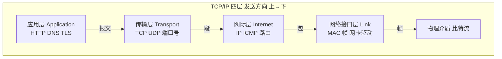
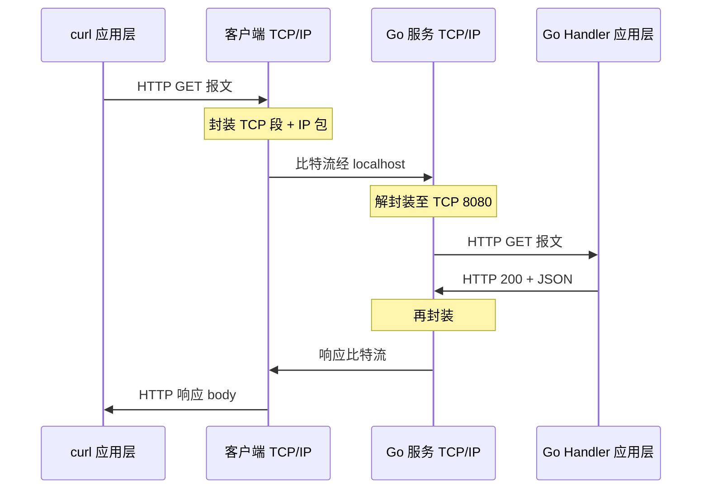
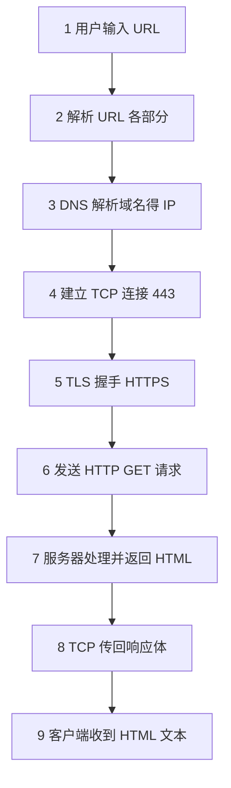

# 网络分层与通信基础

> **文件编码**：UTF-8。终端命令在 **PowerShell** 下执行；实操工具只用 **ping、curl、netstat**（不用浏览器 DevTools）。  
> **定位**：Go 后端速成 **第 1 天**——建立「数据怎么从 A 电脑到 B 电脑」的全景图。  
> **前置**：[00 学习路线图与说明](./00-学习路线图与说明.md)  
> **下一章**：[02 TCP 与 UDP](./02-TCP与UDP.md)  
> **Go 落地**：[Go 05 标准库与 HTTP 基础](../../后端学习/Go/05-Go标准库与HTTP基础.md)

---

## 0. 读前导读（零基础也能跟上）

### 0.1 用一句话弄懂本章

**计算机网络（Computer Network）** = 多台电脑按共同规则（**协议 Protocol**）传数据；**分层（Layering）** = 把复杂问题拆成几层，每层只管自己的事——就像寄快递：你写单子（应用层）→ 快递公司打包（传输层）→ 选路线（网络层）→ 本地配送（链路层）。

**生活类比总表**（本章会反复用到）：

| 概念 | 类比 | 一句话 |
|------|------|--------|
| **协议（Protocol）** | 寄信的信封格式 + 邮票规则 | 双方必须遵守同一套格式才能通信 |
| **分层（Layering）** | 快递：打包员、调度、司机、门卫各管一段 | 出问题能定位在哪一层 |
| **封装（Encapsulation）** | 俄罗斯套娃 / 快递盒套快递盒 | 发送时逐层加「外包装」（首部） |
| **IP 地址（IP Address）** | 城市 + 街道（可搬迁的逻辑地址） | 把数据送到**哪台电脑** |
| **端口（Port）** | 同一地址下的「房间号」 | 把数据送到**哪个程序** |
| **MAC 地址（MAC Address）** | 宿舍门牌（物理网卡身份证） | 局域网内最后一跳 |

> 后续章节预告：**TCP = 打电话**（先拨号接通再说话）；**HTTP = 信纸格式**（02/04 章）；**DNS = 通讯录查号码**（03 章选修）。

### 0.2 你需要提前知道什么（真不会就先跳到哪一章）

| 能力 | 最低要求 | 不会怎么办 |
|------|----------|------------|
| 会用电脑、复制粘贴 | ✅ 必须 | — |
| 学过 Go 01～04 | 建议（会 `go run`、懂 `error`） | 至少能跑 `hello world` |
| HTML / Vue / 浏览器 | ❌ **不要求** | 本章完全不依赖 |
| PowerShell 运行命令 | 能粘贴运行 `ping`、`curl` | 失败先看 §10 报错表 |
| OSI 七层 | ❌ **不要求背** | 本章只讲 TCP/IP 四层 |

**真零基础路线**：00 路线图扫一眼 → 本章 §0～§4 → §5 封装 → §8 动手 ping/curl → 再读 02 章 TCP。

### 0.3 本章知识地图（学完后应能勾选全部 ☐→☑）

```text
☐ 能用自己的话解释「协议」和「分层」
☐ 能说出 TCP/IP 四层名称及每层一句职责
☐ 能讲解封装/解封装，并举例 HTTP GET 如何被打包
☐ 能区分 MAC、IP、端口 各在哪一层、各管什么
☐ 能描述 C/S 模型与 Go 服务端在其中的角色
☐ 能口述「输入 URL → 获得 HTML」2 分钟版（后端视角）
☐ 会用 ping、curl -I、netstat 做基础排查
☐ 知道 Go 程序 listen :8080 对应传输层端口
```

### 0.4 建议学习时长与节奏（速成第 1 天）

| 阶段 | 内容 | 时间 | 节奏建议 |
|------|------|------|----------|
| 第 1 遍 | §0～§3 网络与分层 | 60 分钟 | 边读边在纸上画四层框图 |
| 第 2 遍 | §4～§5 封装与地址 | 45 分钟 | 对照 `localhost:8080` 想一遍 |
| 第 3 遍 | §7～§8 全链路 + 实操 | 60 分钟 | **必须**亲手跑 ping/curl |
| 复盘 | 自测 + 费曼 | 30 分钟 | 合上书能讲 3 分钟 |

**别一天啃完也可以**：建议 2～3 小时集中学 + 1 小时实操，比纯看文档有效 3 倍。

### 0.5 学完本章你能做什么（可验证的具体动作）

1. 用 `curl -v` 对一条 HTTP 请求指出：**DNS / TCP / HTTP** 分别出现在输出的哪一段。
2. Go 服务 `Connection refused` 时，用 `netstat` 判断是**传输层端口**问题，而不是改 HTTP 路径。
3. 向同学解释：为什么 `localhost:8080` 和 `localhost:9090` 是**两个不同的服务入口**（端口不同）。
4. 在纸上画出：`GET /api/users` 从 curl 客户端到 Go `http.ListenAndServe` 的**封装套娃**（至少到 TCP 段）。
5. 面试 2 分钟：从输入 URL 到拿到 HTML，说出至少 **5 个步骤**及对应层次。

---

## 本章与上一章的关系

[00 学习路线图](./00-学习路线图与说明.md) 已说明：本系列面向 **Go 后端速成**，4 天走 01 → 02 → 04 → 05，不依赖 HTML/Vue。

**本章（01）** 建立地基：数据在网络上**怎么分层传递**、**封装与解封装**是什么、**MAC / IP / 端口** 各管哪一段路。学完后你看 `curl -v` 输出里的 `Connected to`、`> GET`、`> Host:` 就不会是一堆陌生英文，而是和分层模型一一对应。

**下一章（02 TCP 与 UDP）** 会聚焦**传输层**：三次握手、四次挥手、端口与 Socket——用「**TCP = 打电话**」的类比把 HTTP 下面的那一层讲透。

**与 Go 05 的衔接**：本章讲「座位关系」（HTTP 坐在 TCP 上、TCP 坐在 IP 上）；[Go 05 net/http](../../后端学习/Go/05-Go标准库与HTTP基础.md) 讲「怎么写代码坐上去」。

---

## 1. 什么是计算机网络

### 1.1 一句话定义

**计算机网络（Computer Network）** = 用通信设备和线路把多台计算机连接起来，按约定规则（**协议 Protocol**）交换数据的系统。

你写的每一行 Go 后端代码，只要涉及「监听端口、发 HTTP 响应、调外部 API」，都在使用这个系统——只是操作系统和标准库帮你完成了绝大部分底层细节。

### 1.2 Go 后端为什么从「分层」学起

若把网络看成一整块黑盒，你只能背「HTTP 200 是成功」。一旦出问题：

- 是**名字解析**错了（DNS）？
- 是**线路不通**（IP 路由）？
- 是**端口没人听**（TCP）？
- 还是**HTTP 路径写错**（应用层）？

**分层模型**的价值：把大问题切成层，每层只和相邻层打交道，排查时可以**逐层缩小范围**——这和你在 Go 联调时「先看 `curl -v` → 再 `netstat` → 再看程序日志」的思路一致。

### 1.3 协议（Protocol）是什么

**协议（Protocol）** = 通信双方必须遵守的**格式与顺序**约定。

| 类比 | 网络中的协议 |
|------|--------------|
| 写信：信封格式、邮编、邮票 | IP 包头、TCP 段头、HTTP 请求行 |
| 说中文/英文要先约定 | 应用层 HTTP vs 邮件 SMTP |
| 快递单号追踪 | TCP 序号、确认号 |

同一层里可以有很多种协议；**不同层之间通过接口协作**——上层把数据交给下层，下层不关心上层是 HTTP 还是 FTP（理论上）。

**生活类比**：协议就像**交通规则**——红灯停、绿灯行，全国司机都认同一套灯，路才不会乱。

---

## 2. TCP/IP 四层模型（互联网实际标准）

互联网实际用的是 **TCP/IP 四层模型**，比教科书里的 OSI 七层**更粗、更实用**。本系列以 TCP/IP 为主轴；OSI 七层知道「物数网传会表应」口诀即可，**不必逐层背协议细节**。



### 2.1 应用层（Application Layer）

**职责**：为**应用程序**提供网络服务接口——你的 Go 业务逻辑「说话」的层次。

| 协议/服务 | 用途 | Go 后端关联 |
|-----------|------|-------------|
| **HTTP/HTTPS** | Web API、页面 | ✅ `net/http` 最核心 |
| **DNS** | 域名 → IP | ✅ 03 章专讲 |
| FTP/SMTP | 文件/邮件 | 了解即可 |

**例子**：客户端发 `GET /api/users HTTP/1.1`，整条请求报文属于应用层数据，交给下层传输。

**生活类比**：应用层 = **快递单上写的内容**——「收件人要什么、备注什么」，不关心车怎么开。

### 2.2 传输层（Transport Layer）

**职责**：**端到端**（进程到进程）的可靠或不可靠传输，用 **端口号（Port）** 区分应用。

| 协议 | 特点 | 典型端口 |
|------|------|----------|
| **TCP** | 可靠、有序、面向连接 | HTTP 80/443、Go 开发常用 8080 |
| **UDP** | 不可靠、低延迟 | DNS 查询、视频直播 |

**Go 后端关联**：

- `http.ListenAndServe(":8080", nil)` 里的 **8080** 是传输层端口
- 「程序没启动」常表现为 **TCP 连接被拒绝（Connection refused）**
- HTTP 默认跑在 **TCP** 上

**生活类比**：传输层 = **打电话**——先确认对方在线（TCP 握手），再说话；**端口号 = 分机号**，同一公司总机（IP）下不同部门各管各的。

### 2.3 网际层（Internet Layer）

**职责**：**主机到主机**寻址与路由——把包从源 IP 送到目的 IP，可能经过多跳路由器。

| 概念 | 说明 |
|------|------|
| **IP 地址** | 逻辑地址，如 `192.168.1.10`、`8.8.8.8` |
| **路由** | 路由器根据路由表转发 |
| **ICMP** | `ping` 用的协议，测可达性 |

**Go 后端关联**：DNS 解析结果是 IP；`ping www.baidu.com` 看到的就是目标 IP。云服务器部署时，负载均衡靠 IP + 端口分发。

**生活类比**：网际层 = **导航选路线**——从 A 城市到 B 城市走哪条路，不管车里装的是什么货。

### 2.4 网络接口层（Network Access / Link Layer）

**职责**：**同一局域网内**节点到节点传 **帧（Frame）**，用 **MAC 地址** 标识网卡；对应 OSI 的物理层 + 数据链路层。

| 概念 | 说明 |
|------|------|
| MAC 地址 | 48 位硬件地址，如 `AA:BB:CC:DD:EE:FF` |
| 交换机 | 二层设备，按 MAC 转发 |
| ARP | **ARP（Address Resolution Protocol，地址解析协议）**：局域网内用 IP 查对应网卡 MAC 地址 |

**Go 后端关联**：日常开发很少改 MAC；懂即可——**IP 路由到子网后，链路层负责最后一跳**。

**生活类比**：链路层 = **小区门卫**——包裹到了这个小区，门卫按门牌（MAC）送到具体单元。

### 2.5 四层小结表（必记）

| TCP/IP 层 | 数据单位（**PDU**，Protocol Data Unit，协议数据单元） | 地址/标识 | 典型协议/设备 |
|-----------|-----------------|-----------|---------------|
| 应用层 | 报文 Message | URL、域名 | HTTP、DNS |
| 传输层 | 段 Segment | **端口号** | TCP、UDP |
| 网际层 | 包 Packet | **IP 地址** | IP、ICMP |
| 网络接口层 | 帧 Frame | **MAC** | 以太网、Wi-Fi |

**记忆口诀**：「**应传网接**」——从上到下：应用、传输、网际、网络接口。

### 2.6 OSI 七层（了解即可，不必死记）

教材和面试偶尔问 OSI，知道与 TCP/IP 的对应关系即可：

| OSI 七层（口诀：物数网传会表应） | TCP/IP 四层 |
|----------------------------------|-------------|
| 应用 + 表示 + 会话 | **应用层** |
| 传输 | **传输层** |
| 网络 | **网际层** |
| 数据链路 + 物理 | **网络接口层** |

**工程实践**：写 Go 后端、用 `curl` 排查，**TCP/IP 四层足够**。

---

## 3. 封装与解封装（核心机制）

### 3.1 什么是封装（Encapsulation）

发送数据时，**从高到低**，每一层给上层传来的数据加上本层**首部（Header）**，有时加**尾部（Tail）**，这个过程叫**封装（Encapsulation）**。

可以把它想成**俄罗斯套娃**或**快递打包**：

```text
应用层：  [ HTTP 请求报文 ]
           ↓ 加 TCP 首部
传输层：  [ TCP 头 | HTTP 请求报文 ]
           ↓ 加 IP 首部
网际层：  [ IP 头 | TCP 头 | HTTP 请求报文 ]
           ↓ 加帧头帧尾
链路层：  [ 帧头 | IP 头 | TCP 头 | HTTP 请求报文 | 帧尾 ]
           ↓
物理层：  010101... 比特流
```

**重要**：每一层只认自己的首部；剥掉后交给上一层。接收方从物理层**向上**，每层去掉首部 → **解封装（Decapsulation）**。

```text
链路层收帧 → 校验 → 交给 IP
IP 看目的 IP 是否本机 → 交给 TCP
TCP 看端口 8080 → 交给监听 8080 的 Go 进程
应用层 HTTP 服务器解析 GET /api/users
```

### 3.2 完整示例：curl 请求 Go 服务的封装

**场景**：PowerShell 执行 `curl http://localhost:8080/api/users`，Go 程序已 `ListenAndServe(":8080", mux)`（**mux** = multiplexer 多路复用器，按 URL 路径把请求分给不同 **Handler**，即「请求处理函数」）。

**应用层（HTTP）**—— curl 发出类似：

```http
GET /api/users HTTP/1.1
Host: localhost:8080
Accept: */*
User-Agent: curl/8.x
```

整段文本是 **HTTP 报文**，作为 TCP 的「载荷」。

**传输层（TCP）**—— 加上 TCP 首部，包含：

- 源端口：如 `52431`（客户端随机临时端口）
- 目的端口：`8080`（Go 服务）
- 序号、确认号、窗口大小等

此时叫 **TCP 段（Segment）**。

**网际层（IP）**—— 加上 IP 首部，包含：

- 源 IP：`127.0.0.1`（本机环回）
- 目的 IP：`127.0.0.1`
- 协议字段：6 表示上层是 TCP

此时叫 **IP 包（Packet）**。

**网络接口层**—— 环回接口把 IP 包在本机内核里「短路」到 8080 监听进程（本机通信不经过真实网卡，但分层逻辑仍成立）。

**服务器解封装**：8080 端口的 TCP 收到 → 还原 HTTP → Go `HandlerFunc` 处理 → 响应再**向下封装**回去。



### 3.3 为什么分层封装不会「乱套」？

**原因一：首部里有类型字段**。IP 首部「协议号」告诉下层上面是 TCP 还是 UDP；TCP 端口告诉操作系统交给哪个进程。

**原因二：各层职责单一**。网络层只管送到 `127.0.0.1`，不关心里面是 HTTP 还是 MySQL；传输层只管送到 8080 端口，不关心 JSON 还是 HTML。

**小案例**：你把路由写成 `/api/user` 却漏了 `/api/users`，应用层返回 **404**——TCP/IP 都正常，**只有 HTTP 路径在应用层错了**。若 TCP 连接失败，`curl` 显示 `Connection refused` 且没有 HTTP 状态码，就要查 8080 是否在 listen（02 章 + §8）。

---

## 4. MAC 地址、IP 地址与端口

三者是最常见的「地址 confusion」，必须一次分清。

### 4.1 三者对比

| | MAC 地址 | IP 地址 | 端口（Port） |
|---|----------|---------|--------------|
| **层次** | 网络接口层 | 网际层 | 传输层 |
| **作用范围** | 局域网内一跳 | 全球路由（逻辑） | 单主机内多进程 |
| **类比** | 宿舍门牌号（物理） | 城市里的区+街道（可搬迁） | 房间号（同一地址不同房间） |
| **示例** | `A4:83:E7:12:34:56` | `192.168.1.100`、`8.8.8.8` | `80`、`443`、`8080` |
| **谁配置** | 网卡出厂 | DHCP / 手动 / 云控制台 | 程序 listen 时指定 |
| **Go 常改吗** | 否 | 间接（域名→DNS→IP） | 是（`:8080`） |

### 4.2 一次通信中三者如何配合

```text
1. curl 要访问 api.example.com:443
2. DNS（应用层）→ 得到 IP 203.0.113.10
3. TCP 连接 203.0.113.10:443（IP + 端口）
4. 若不在同一局域网，IP 包经多路由器转发
5. 最后一跳：ARP 用 IP 查网关 MAC，链路层发帧
6. 服务器 443 端口进程（如 Nginx / Go）收到 TCP 连接，读 HTTPS/HTTP
```

**本机联调**：`127.0.0.1:8080` IP 和端口都明确，MAC 走环回，更简单。

### 4.3 为什么需要端口，光有 IP 不够？

一台服务器通常**一个公网 IP** 跑多个服务：Web、数据库、SSH。IP 只能把包送到**这台机器**，**端口**才能把包交给**正确的进程**。

```text
203.0.113.10:443  → HTTPS Web
203.0.113.10:22   → SSH（运维）
203.0.113.10:3306 → MySQL（常内网，不暴露公网）
203.0.113.10:8080 → Go 开发服务
```

Go 开发：`8080` 和 `9090` **IP 都是 localhost，端口不同** → 两个不同 TCP 连接 → 两个独立服务。

### 4.4 临时端口与 well-known 端口

| 类型 | 范围 | 例子 |
|------|------|------|
| Well-known 知名端口 | 0～1023 | 80 HTTP、443 HTTPS（需管理员权限绑定） |
| 注册端口 | 1024～49151 | 8080 Go 开发、3306 MySQL |
| 动态/临时端口 | 49152～65535 | curl 出站连接的源端口 |

curl 访问 `localhost:8080` 时：**目的端口 8080**，**源端口**从临时范围随机选——`netstat` 里你可能看到 `52431 → 8080`。

---

## 5. 客户端 / 服务器模型（C/S）

### 5.1 基本模型

Web 开发几乎全是 **Client / Server（客户端/服务器）**：

| 角色 | 是谁 | 做什么 |
|------|------|--------|
| **客户端 Client** | curl、Postman、其他服务的 `http.Client` | **主动**发起连接和请求 |
| **服务器 Server** | 你的 Go `http.ListenAndServe` | **被动**监听端口，等待请求 |

```text
Client                          Server
  │                                │
  │──── TCP 三次握手 ────────────→│  listen 8080
  │──── HTTP GET /api/users ─────→│  Handler 处理
  │←─── HTTP 200 JSON ────────────│
  │──── TCP 连接关闭（或复用）────→│
```

**注意**：「服务器」是**进程角色**，不是必须物理大机——你的笔记本跑 Go 程序时，笔记本就是 Server。

**生活类比**：Client = **顾客点餐**；Server = **餐厅接单做菜**——顾客主动来，餐厅等着接。

### 5.2 与 Go 05 的对应

| 客户端（curl / http.Client） | 服务端（Go） |
|------------------------------|--------------|
| `curl http://localhost:8080/api/users` | `http.HandleFunc("/api/users", handler)` |
| `GET /api/users` | 路由匹配到对应 Handler |
| 解析 JSON body | `json.NewEncoder(w).Encode(data)` |

联调本质：**应用层 HTTP 约定对齐** + **传输层端口可达**。详见 [Go 05 标准库与 HTTP 基础](../../后端学习/Go/05-Go标准库与HTTP基础.md)。

### 5.3 B/S 与 C/S（了解）

| | C/S（Client/Server） | B/S（Browser/Server） |
|---|------------------------|------------------------|
| 客户端 | 专用程序（游戏、微信 PC 版） | **浏览器**（通用客户端） |
| 你学的路线 | Go API + curl/Postman 测试 | 浏览器只是众多 Client 之一 |

对 Go 后端来说，**浏览器和 curl 都是 HTTP Client**——区别只是浏览器还会解析 HTML/CSS，curl 只打印文本。

---

## 6. 从输入 URL 到获得 HTML（后端视角）

下面用**分层语言**串一遍。示例 URL：

```text
https://www.example.com/index.html
```

### 6.1 流程总览



### 6.2 逐步说明（与分层对应）

| 步骤 | 发生什么 | 主要层次 | 后续章节 |
|------|----------|----------|----------|
| 1～2 | 解析协议 `https`、主机 `www.example.com`、路径 `/index.html` | 应用层 URL | 04 章 HTTP |
| 3 | DNS 查询 → IP 地址 | 应用层 DNS | **03 章** |
| 4 | 与 `IP:443` **TCP 三次握手** | 传输层 TCP | **02 章** |
| 5 | TLS 握手，协商加密 | TLS over TCP | **05 章 HTTPS** |
| 6 | 发 `GET /index.html HTTP/1.1` + Host 头 | 应用层 HTTP | **04 章** |
| 7 | 服务器（Nginx/Go）读 Host 和路径，读磁盘或执行 Handler | 应用层 | Go 05 |
| 8 | HTTP 200 + `Content-Type: text/html` + body | 应用层 | 04 章 |

**Go 后端视角的「2 分钟版」**：DNS 得 IP → TCP 连上 → HTTPS 加密 → HTTP 要页面 → 服务器返回 HTML；**调 API 只重复 3～8 步**，只是路径变成 `/api/users`、响应变成 JSON。

### 6.3 本地开发 `localhost:8080` 的差异

| 环节 | 公网 `example.com` | 本地 `localhost:8080` |
|------|--------------------|-------------------------|
| DNS | 公网 DNS 解析 | 常直接 `127.0.0.1`，几乎无 DNS 延迟 |
| TCP | 多跳路由 | 环回，极快 |
| HTTPS | 需有效证书 | dev 常 http，无 TLS |
| HTML/API 来源 | 远程 Web 服务器 | 本机 Go 进程 |

所以本地 `curl -v` 里 **DNS 阶段经常是 0ms**——不是 DNS 坏了，而是**没走公网解析**。

### 6.4 从 URL 到 JSON 总图（串联 01～04 预告）

```text
URL → DNS 得 IP → TCP 三次握手 + 端口 → HTTP GET/POST → Go Handler 返回 JSON
```

**记忆链**：通讯录（DNS）→ 打电话（TCP）→ 信纸格式（HTTP）→ 业务 JSON。

---

## 7. 手把手实操：ping + curl + netstat

### 7.1 手把手步骤表（第一次联调）

| 步骤 | 你的动作 | 预期看到什么 | 若不对 |
|------|----------|--------------|--------|
| 1 | 启动 Go HTTP 服务（监听 8080） | 控制台 `Listening on :8080` 或类似 | 查 Go 05 §2 |
| 2 | `netstat -ano \| findstr "8080"` | 一行 `LISTENING` | 见 §10 报错表 |
| 3 | `curl http://localhost:8080/health` | JSON 或 `ok` 文本 | Connection refused → §10 |
| 4 | `curl -I http://www.example.com` | `HTTP/1.1 200 OK` | 查网络连接 |
| 5 | `curl -v http://localhost:8080/health 2>&1 \| Select-Object -First 25` | 看到 `Connected to`、`> GET`、`< HTTP/1.1` | 02 章对照 TCP |

### 7.2 ping：测网际层可达性

```powershell
ping -n 3 127.0.0.1
ping -n 3 www.baidu.com
```

**预期**：

```text
来自 127.0.0.1 的回复: 字节=32 时间<1ms TTL=128
正在 Ping www.a.shifen.com [xxx.xxx.xxx.xxx] ...
```

说明：

- 第一个测**本机 IP 栈**是否正常
- 第二个测 **DNS + 公网路由**（百度 CNAME 到 `a.shifen.com` 是正常的）

**ping 不通但 curl 能开？** 可能对方禁 ICMP，不代表 HTTP 不通——要用 curl 测。

### 7.3 curl：看应用层 HTTP

```powershell
curl -I http://www.example.com
```

**预期（节选）**：

```text
HTTP/1.1 200 OK
Content-Type: text/html; charset=UTF-8
...
```

`-I` 只请求头（HEAD 语义）。说明 **TCP + HTTP 应用层** 正常。

测本地 Go 服务（需先启动）：

```powershell
curl http://localhost:8080/health
```

**预期**：

```text
{"status":"ok"}
```

若失败：

```text
curl: (7) Failed to connect to localhost port 8080: Connection refused
```

→ **传输层**连不上，Go 程序未启动或端口错——不是 HTTP 路径问题。

### 7.4 curl -v：看 TCP + HTTP 细节

```powershell
curl -v http://www.example.com/ 2>&1 | Select-Object -First 30
```

**预期（节选）**：

```text
* Connected to www.example.com (93.184.216.34) port 80
> GET / HTTP/1.1
> Host: www.example.com
< HTTP/1.1 200 OK
```

- `Connected to` → **TCP 已建立**（传输层）
- `> GET` → **发出的 HTTP 请求头**（应用层）
- `< HTTP/1.1 200` → **收到的 HTTP 响应头**（应用层）

本地 Go：

```powershell
curl -v http://localhost:8080/health 2>&1 | Select-Object -First 20
```

### 7.5 netstat：查端口是否在监听

```powershell
netstat -ano | findstr "8080"
```

**预期（Go 服务已启动时）**：

```text
TCP    0.0.0.0:8080           0.0.0.0:0              LISTENING       12345
```

**预期（未启动时）**：无输出或只有 `TIME_WAIT` 残留——说明 **8080 没有进程 LISTENING**，curl 会连接失败。

最后一列 PID 可在任务管理器「详细信息」里对应到 `go.exe` 或你的程序名。

### 7.6 查看本机 IP（可选）

```powershell
ipconfig
```

**预期（节选）**：

```text
无线局域网适配器 WLAN:
   IPv4 地址 . . . . . . . . . . . . : 192.168.1.105
   默认网关. . . . . . . . . . . . . : 192.168.1.1
```

`192.168.x.x` 是**私有地址**（内网），公网访问需要路由器 NAT。

### 7.7 浏览器 DevTools：同一请求的 Timing（选修）

你主线用 **curl**，但联调前端或面试讲「慢在哪」时，浏览器 Network 面板很有用：

1. 打开任意 HTTPS 页面 → `F12` → **Network**
2. 刷新页面，点一条请求 → **Timing** 标签

| Timing 阶段 | 对应层次 | 和 curl 的关系 |
|-------------|----------|----------------|
| DNS Lookup | 应用层 DNS（03 章） | curl `-v` 里很少单独显示，但 `Connected to (IP)` 前已完成 |
| Initial connection | TCP 三次握手（02 章） | 对应 curl 的 `Connected to ... port` |
| SSL | TLS 握手（05 章） | HTTPS 时 curl 输出 `TLSv1.3` 行 |
| Waiting (TTFB) | 服务器处理 + 首字节返回 | **TTFB（Time To First Byte，首字节时间）**：从发出请求到收到第一个字节的等待；对应 curl 里 `< HTTP/1.1 200` 出现之前 |
| Content Download | 响应体下载 | 对应 body 打印 |

**要点**：浏览器、curl、Java `HttpClient`、Python `requests` 走的都是 **DNS → TCP →（HTTPS 则 TLS）→ HTTP** 同一条路；差别只在「谁解析响应」——浏览器渲染页面，curl 打印文本，后端框架反序列化 JSON。

---

## 8. 核心术语速查（首次出现格式）

| 术语 | 定义 | 生活类比 | 本章 § |
|------|------|----------|--------|
| **协议（Protocol）** | 通信双方遵守的格式与顺序 | 寄信信封规格 | §1.3 |
| **分层（Layering）** | 把网络功能拆成多层 | 快递各环节分工 | §2 |
| **封装（Encapsulation）** | 发送时逐层加首部 | 快递套盒 | §3 |
| **PDU** | 各层数据单位名称 | 段/包/帧 | §2.5 |
| **端口（Port）** | 传输层进程标识 | 房间号 | §4 |
| **C/S 模型** | 客户端主动、服务器被动 | 顾客与店家 | §5 |

---

## 9. 练习建议

**基础**：

1. 画出 TCP/IP 四层，写出 HTTP、TCP、IP、MAC 各在哪层。
2. 解释 `http://localhost:8080/api/users` 里哪部分是应用层路径、哪部分是传输层端口。

**进阶**：

1. 用一段话描述「封装」和「解封装」。
2. 运行 `curl -v`，指出输出里哪一行对应 TCP 连接、哪几行对应 HTTP。

**挑战**：

1. 画出 curl 请求 Go `:8080` 的封装示意图（至少到 TCP 段：源端口、目的端口、HTTP GET）。
2. `curl` 成功返回 404，说明哪一层出了问题？为什么不是 TCP 问题？

**挑战参考答案**：

- 404 = **应用层 HTTP** 路径或路由不匹配；TCP 已连通（否则 curl 报 Connection refused，不会有 404 状态码）。

---

## 10. 常见报错与误解（≥8 条）

| 报错/误解 | 可能原因 | 正确理解 / 解决方案 |
|-----------|----------|---------------------|
| 「封装就是 JSON.Marshal」 | 混淆应用层与分层 | 封装指各层加协议首部，不是 JSON 序列化 |
| 「MAC 和 IP 可以互相替代」 | 层次混淆 | MAC 局域网；IP 跨网路由；协作完成投递 |
| 「localhost 没有端口」 | 省略默认端口 | 写全 `http://localhost:8080`；80/443 可省略 |
| `Connection refused` | 目标端口无 listen | 启动 Go 服务；查 listen 的端口（传输层） |
| `Could not resolve host` | DNS 失败 | 查域名拼写、DNS 服务器（03 章） |
| ping 通但 curl 失败 | 禁 ping 或端口关 | 用 curl 测 80/443/8080 |
| 「四层都要会配置」 | 过度焦虑 | Go 后端重点：应用层 HTTP + 传输层端口 + DNS |
| 「HTTP 直接发到 IP 就行」 | 忽略 Host 头 | **虚拟主机**：一台机器托管多个网站，靠 `Host` 头区分；**HTTPS** 还用 **SNI（Server Name Indication，服务器名称指示）** 在 TLS 握手时告诉服务器要访问哪个域名（见 04/05 章） |
| 「一次请求只经过一层」 | 模型误解 | 垂直穿过全部层；排查时按层定位 |
| 「服务器只有一个 IP 一个服务」 | 忽略端口 | 同 IP 多端口多进程（8080、9090…） |
| 「127.0.0.1 会出网卡」 | 环回特性 | 本机进程间通信，不经过物理网卡 |
| `404 Not Found` | HTTP 路径/路由错 | TCP 正常；查 Go 路由注册（应用层） |

---

## 11. FAQ（≥10 条）

**Q1：我完全不懂网络，能直接学 Go 吗？**  
能写语法，但写 Web 服务会懵。至少学完本章 + 02 TCP + 04 HTTP，再读 [Go 05 net/http](../../后端学习/Go/05-Go标准库与HTTP基础.md)。

**Q2：OSI 七层和 TCP/IP 四层记混怎么办？**  
先背 TCP/IP 四层（应用、传输、网际、网络接口）；面试被问 OSI 再用口诀「物数网传会表应」。

**Q3：封装是不是 json.Marshal？**  
不是。封装是各层加**协议首部**；`json.Marshal` 是应用层数据序列化。

**Q4：为什么要学 MAC？我又不改网卡。**  
懂即可：IP 路由到子网后，链路层用 MAC 完成最后一跳；Wi-Fi 连上但 ping 不通公网时，可能是链路/路由器问题。

**Q5：8080 和 9090 有什么区别？**  
同一 IP（如 localhost）下，**端口不同 = 不同进程/服务**。8080 可能是你的 API，9090 可能是另一个 Go 服务或 Prometheus。

**Q6：curl 和浏览器有什么区别？**  
都是 HTTP Client（应用层）。浏览器还会解析 HTML/CSS/JS；curl 只打印原始 HTTP 文本，**更适合后端调试**。

**Q7：ping 和 curl 有什么区别？**  
ping 测 **ICMP/IP 可达性**（网际层）；curl 测 **HTTP 应用层**（建立在 TCP 之上）。两者测的不是同一层。

**Q8：Connection refused 和 404 怎么区分？**  
refused = **TCP 层**没人 listen（程序没启动）；404 = TCP 已通，**HTTP 层**找不到路径。

**Q9：localhost 和 127.0.0.1 一样吗？**  
效果一样，都指向本机环回地址。`localhost` 是主机名，通常解析为 `127.0.0.1`。

**Q10：Go 的 `:8080` 是什么意思？**  
监听本机所有网卡的 8080 端口（`0.0.0.0:8080`）。等价于「在这个房间号等客人」。

**Q11：需要学 Wireshark 抓包吗？**  
速成阶段**不需要**。`curl -v` + `netstat` 足够排查 90% 联调问题。

**Q12：本章和 Go 05 怎么配合？**  
本章讲「HTTP 坐在 TCP 上、TCP 坐在 IP 上」的座位关系；Go 05 讲 `net/http` 怎么写 Handler、怎么 listen 端口。

---

## 12. 闭卷自测（10 题）

### 概念题（6 题）

1. **协议（Protocol）** 是什么？举一个 HTTP 之外的协议例子。
2. TCP/IP 四层名称是什么？**传输层**的数据单位叫什么？
3. 封装与解封装各指什么？发送 HTTP 请求时，从应用层往下第一层加的是什么首部？
4. MAC、IP、端口 分别在第几层？各解决什么问题？
5. 为什么 `localhost:8080` 和 `localhost:9090` 是两个不同服务？
6. ping 主要测哪一层？curl 显示 404 说明哪一层可能有问题？

### 动手题（2 题）

7. 写出查看本机 `8080` 是否在监听的 PowerShell 命令；LISTENING 一行说明什么？
8. 运行 `curl -v http://localhost:8080/health`，指出哪一行说明 TCP 已连接、哪一行是 HTTP 响应状态。

### 综合题（2 题）

9. 用 2 分钟口述：从输入 `https://www.example.com` 到 HTML 返回，至少标出 DNS、TCP、HTTP 三步及层次。
10. curl 请求 `localhost:8080` 返回 `Connection refused`，列出排查顺序（至少 3 步，说明每层）。

### 自测参考答案

**1.** 通信双方遵守的格式与顺序约定；例：DNS、TCP、SMTP。

**2.** 应用、传输、网际、网络接口；传输层 PDU 叫**段（Segment）**（TCP）或数据报（UDP）。

**3.** 封装：发送时逐层加首部；解封装：接收时逐层剥首部。应用层下第一层加 **TCP 首部**。

**4.** MAC—网络接口层—局域网内一跳；IP—网际层—主机到主机；端口—传输层—主机内进程。

**5.** 端口不同 → 不同进程监听 → 不同服务；TCP 连接目标不同。

**6.** ping 主要测网际层 ICMP 可达性；404 → **应用层 HTTP** 路由/路径问题（TCP 已通）。

**7.** `netstat -ano | findstr "8080"`；LISTENING 表示有进程在该端口**等待连接**（如 Go 服务）。

**8.** `* Connected to localhost` → TCP 已连接；`< HTTP/1.1 200 OK`（或 404 等）→ HTTP 响应状态。

**9.**（要点）解析 URL → DNS 得 IP → TCP 三次握手 → TLS（HTTPS）→ HTTP GET → 响应 HTML；各步对应应用/传输/网际层。

**10.** ① `netstat -ano | findstr "8080"` 查 LISTENING（传输层）② 确认 Go 程序已启动 ③ `curl -v` 看是否 Connected ④ 若 Connected 但 404，查路由（应用层）。

---

## 13. 费曼检验：3 分钟讲给零基础朋友

**请合上书，用口语解释本章核心。对照下面三条是否都讲到：**

1. **分层像快递**：应用层写单子，传输层管端口和可靠送达，网际层管 IP 路由，链路层管局域网 MAC；出问题可以一层层查。
2. **封装像套娃**：HTTP 报文外面套 TCP 段，再套 IP 包，再套帧；接收方反向剥开。
3. **Go 后端日常重点**：应用层 HTTP + 传输层端口 + DNS；`curl -v` 的 Connected / GET / HTTP/1.1 和分层是对得上的。

**若只能讲清 1 条**：重读 §0.1 类比表 + §3 封装 + §7 实操，再试一次。

---

## 14. 学完标准

- [ ] 能用自己的话解释「计算机网络」和「协议」
- [ ] 能说出 TCP/IP 四层名称及每层主要职责
- [ ] 能讲解封装/解封装，并举例 HTTP GET 向下打包
- [ ] 能区分 MAC、IP、端口的作用层次与范围
- [ ] 能描述客户端/服务器模型及 Go 服务端在其中的角色
- [ ] 能口述「输入 URL 到获得 HTML」全链路（2 分钟版，后端视角）
- [ ] 完成 §7：`ping`、`curl -I`、`curl -v` 成功；能读 Connected 与 GET 行
- [ ] 会用 `netstat` 确认 8080 是否在 LISTENING
- [ ] 知道下一章 02 TCP 解决什么问题；Go 05 如何落地 HTTP

---

## 15. 章节衔接与后续文档

| 本章概念 | 后续文档 |
|----------|----------|
| TCP 三次握手、端口 | [02 TCP 与 UDP](./02-TCP与UDP.md) |
| DNS 解析流程 | [03 IP 地址与 DNS 解析](./03-IP地址与DNS解析.md)（选修） |
| HTTP 报文细节 | [04 HTTP 协议深入](./04-HTTP协议深入.md) |
| TLS、HTTPS | [05 HTTPS 与 TLS 加密](./05-HTTPS与TLS加密.md) |
| Go net/http 实战 | [Go 05 标准库与 HTTP 基础](../../后端学习/Go/05-Go标准库与HTTP基础.md) |
| 系列地图 | [00 学习路线图与说明](./00-学习路线图与说明.md) |

---

## 16. 下一章预告

01 章你建立了**分层大图景**：TCP/IP 四层、封装解封装、MAC/IP/端口、C/S 模型、从 URL 到 HTML 的全链路（后端视角）。这些都是「**数据怎么在路上走**」的基建。

下一章（**[02 TCP 与 UDP](./02-TCP与UDP.md)**）会聚焦**传输层**：三次握手、四次挥手、端口与 Socket——用「**TCP = 打电话**」的类比把 HTTP 下面的那一层讲透。HTTP 报文细节见 [04 HTTP 协议深入](./04-HTTP协议深入.md)；代码实战见 [Go 05 net/http](../../后端学习/Go/05-Go标准库与HTTP基础.md)。

---

*上一章：[00 学习路线图与说明](./00-学习路线图与说明.md)*  
*下一章：[02 TCP 与 UDP](./02-TCP与UDP.md)*
