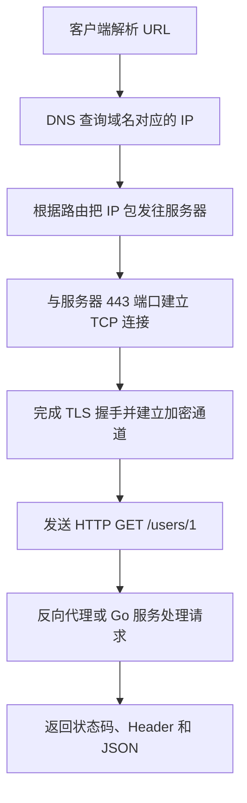

# 网络分层与通信基础

> 本章目标：真正理解“一个请求为什么要分层”，并分清域名、IP、MAC、端口和 URL。
>
> 前置：[00 · 学习路线图](./00-学习路线图与说明.md)　下一章：[02 · TCP 与 UDP](./02-TCP与UDP.md)

---

## 1. 先记住三个结论

1. **网络分层是分工，不是把数据真的切进四个抽屉。** 每一层只解决自己负责的问题。
2. **IP 找主机，端口找进程。** 访问服务器必须同时知道 `IP:端口`。
3. **发送时逐层加头，接收时逐层拆头。** 这叫封装与解封装。

如果后面的细节一时看不懂，先守住这三个结论。

---

## 2. 从最熟悉的请求开始

假设你的 Go 服务监听在 `8080`：

```powershell
curl.exe http://localhost:8080/health
```

这条命令包含四类信息：

```text
http://localhost:8080/health
│      │         │    └── 路径：请求哪个资源
│      │         └─────── 端口：请求主机上的哪个程序
│      └───────────────── 主机名：要访问哪台主机
└──────────────────────── 协议：使用 HTTP 规则通信
```

`curl` 不能把这一整串文本直接扔到网线上。它需要操作系统帮忙完成：

1. 把 `localhost` 变成 IP 地址；
2. 找到目标 `IP:8080`；
3. 建立 TCP 连接；
4. 按 HTTP 格式发送 `/health` 请求；
5. 接收服务器响应。

不同步骤由不同层负责，这就是分层存在的意义。

---

## 3. 什么是协议

协议就是通信双方共同遵守的规则，包括：

- 消息怎样开始和结束；
- 每个字段表示什么；
- 收到消息后怎样回应；
- 出错后怎样处理。

例如 HTTP 请求：

```http
GET /health HTTP/1.1
Host: localhost:8080
Accept: */*

```

第一行规定了方法、路径和 HTTP 版本；`Host` 规定目标主机；最后的空行表示请求头结束。

如果客户端随便写成：

```text
喂，把健康状态给我
```

HTTP 服务器无法按协议解析，就不知道这是什么请求。

协议不是某个编程语言的函数。Go、Java、Python 都可以实现 HTTP，因为它们遵守同一套通信规则。

---

## 4. TCP/IP 四层到底怎么分工

### 4.1 应用层：消息表达什么

应用层面向具体业务，解决“程序之间说什么、怎么说”。

常见协议：

- HTTP：浏览器、客户端与 Web 服务交换请求和响应；
- DNS：查询域名对应的 IP；
- SMTP：发送电子邮件；
- SSH：远程登录服务器。

在 Go Web 开发里，你最常直接操作这一层：

```go
func healthHandler(w http.ResponseWriter, r *http.Request) {
	w.WriteHeader(http.StatusOK)
	w.Write([]byte(`{"status":"ok"}`))
}
```

Handler 看到的是 HTTP 方法、路径、Header 和 Body，不需要自己拼 TCP 包。

### 4.2 传输层：找到程序并完成端到端传输

一台电脑可以同时运行浏览器、微信、数据库和 Go 服务。只有 IP 还不够，因为 IP 只能定位电脑。

传输层使用**端口**区分程序：

```text
127.0.0.1:8080  → 本机 8080 端口上的 Go 服务
127.0.0.1:3306  → 本机 3306 端口上的 MySQL
127.0.0.1:6379  → 本机 6379 端口上的 Redis
```

传输层主要有：

- TCP：先建立连接，提供可靠、有序的字节流；
- UDP：直接发送数据报，不保证可靠和顺序。

下一章会详细解释。

### 4.3 网际层：跨网络找到目标主机

网际层主要解决：

> 数据从源主机出发，经过哪些路由器，最终到达目标 IP？

核心协议是 IP。路由器主要根据目标 IP 选择下一跳。

需要注意：IP 尽力而为地转发数据，但本身不保证包一定到达、只到一次或按顺序到达。可靠性通常由上层 TCP 补上。

### 4.4 网络接口层：经过当前这一段链路

这一层负责数据在一段具体网络上传输，例如：

- 电脑通过 Wi-Fi 把数据发给路由器；
- 服务器通过以太网把数据发给机房交换机。

这里常见 MAC 地址、以太网帧、Wi-Fi 等概念。

MAC 地址主要用于**当前局域网这一跳**。数据经过路由器后，链路层头通常会重新封装，因此端到端访问网站时不能只靠 MAC 地址。

### 4.5 四层总表

| 层 | 核心问题 | 标识或数据 | Go 后端常见关注点 |
|---|---|---|---|
| 应用层 | 消息是什么意思 | URL、方法、状态码、JSON | Handler、路由、Header |
| 传输层 | 送到哪个程序，是否可靠 | 端口、TCP 连接 | 监听端口、超时、连接池 |
| 网际层 | 送到哪台主机 | IP、路由 | 监听地址、容器网络 |
| 网络接口层 | 当前这一跳怎么传 | MAC、帧 | 通常由系统和网络设备处理 |

---

## 5. 一次请求怎样逐层封装

假设应用层准备发送 HTTP 数据：

```text
GET /health HTTP/1.1 ...
```

发送方会大致经历：

```text
[HTTP 数据]
    ↓ TCP 加上传输层信息
[TCP 头 | HTTP 数据]
    ↓ IP 加上源 IP、目标 IP
[IP 头 | TCP 头 | HTTP 数据]
    ↓ 链路层加上当前一跳的信息
[帧头 | IP 头 | TCP 头 | HTTP 数据 | 校验]
```

到达接收方后反向处理：

```text
网卡收到帧
  → 链路层拆帧头
  → IP 层发现目标是本机
  → TCP 根据目标端口交给监听进程
  → HTTP 服务器解析方法、路径和 Header
  → Go Handler 执行业务
```

“头”可以理解为每一层写给对等层的说明书。例如 IP 头里有目标 IP，TCP 头里有目标端口。

### 为什么要层层套起来

因为每层需要的信息不同：

- 路由器关心目标 IP，不关心 JSON 里叫 `name` 还是 `title`；
- 操作系统的 TCP 模块关心端口和序号，不关心 URL 是 `/health` 还是 `/users`；
- Go Handler 关心 URL 和 JSON，通常不关心 Wi-Fi 使用哪个频道。

这种分工让每层可以独立演进。

---

## 6. IP、MAC、端口和域名不要再混

### 6.1 IP 地址：找到主机

例如：

```text
192.168.1.20
127.0.0.1
```

IP 是网络层的逻辑地址，用来跨网络寻址。设备换一个网络后，IP 可能变化。

### 6.2 MAC 地址：完成局域网当前一跳

MAC 通常与网络接口相关，形式类似：

```text
3C-52-82-AB-CD-EF
```

它不是网站在互联网中的永久收货地址。跨路由传输时，每一段链路使用的源/目标 MAC 会变化。

### 6.3 端口：找到主机上的进程

端口范围是 `0～65535`。服务端常监听固定端口，客户端通常临时分配一个源端口。

例如你访问 `localhost:8080` 时，连接可能是：

```text
客户端 127.0.0.1:53142  →  服务端 127.0.0.1:8080
```

`53142` 是客户端临时端口，`8080` 是服务端监听端口。

### 6.4 域名：方便人记忆的名字

人更容易记 `api.example.com`，机器最终仍需要 IP。DNS 负责完成域名到 IP 的查询。

### 6.5 URL：一次应用层访问的完整说明

```text
https://api.example.com:443/users?id=1
│       │                │    │
协议    主机名            端口  路径与查询参数
```

端口省略时使用协议默认值：HTTP 通常是 80，HTTPS 通常是 443。

---

## 7. localhost、127.0.0.1 和 0.0.0.0

这三个概念在本地开发中特别容易混。

### localhost

`localhost` 是主机名，通常被解析为回环地址：

- IPv4：`127.0.0.1`
- IPv6：`::1`

### 127.0.0.1

这是 IPv4 回环地址。请求不会离开本机，适合本机进程之间通信。

### 0.0.0.0

服务端监听 `0.0.0.0:8080` 表示接受本机所有 IPv4 网络接口上到达 8080 的连接。

它通常是**监听含义**，不是让客户端访问的正常目标地址。客户端应使用：

- 本机访问：`localhost:8080`；
- 局域网其他设备访问：这台电脑的局域网 IP，例如 `192.168.1.20:8080`。

Go 的：

```go
http.ListenAndServe(":8080", nil)
```

通常等价于在所有可用接口的 8080 端口监听。是否能被其他设备访问，还受防火墙和网络配置影响。

---

## 8. 一次公网请求的完整故事

访问：

```text
https://api.example.com/users/1
```

可以先用下面这条主线理解：



注意这些步骤不是八个互不相关的知识点，而是同一次请求的不同阶段。

---

## 9. 动手观察网络分层

### 9.1 看本机地址

```powershell
ipconfig
```

重点先找：

- IPv4 Address：本机在当前局域网中的 IP；
- Default Gateway：默认网关，通常是路由器；
- DNS Servers：系统使用的 DNS 服务器。

不需要第一次就看懂全部网卡。虚拟机、Docker、VPN 可能创建额外网卡。

### 9.2 看端口是否监听

```powershell
Get-NetTCPConnection -LocalPort 8080 -ErrorAction SilentlyContinue
```

如果 Go 服务正在运行，通常能看到 `Listen`。

也可以用：

```powershell
netstat -ano | Select-String ":8080"
```

最后一列是 PID，可进一步查询进程：

```powershell
Get-Process -Id <PID>
```

### 9.3 测试 TCP 端口

```powershell
Test-NetConnection localhost -Port 8080
```

重点看：

```text
TcpTestSucceeded : True
```

这只能证明 TCP 端口可连接，不代表 HTTP 路径一定存在。

### 9.4 查看 HTTP 请求与响应

```powershell
curl.exe -v http://localhost:8080/health
```

你应尝试找到：

1. `Connected to`：TCP 已建立；
2. `> GET /health`：应用层请求；
3. `< HTTP/1.1 200 OK`：应用层响应；
4. JSON：响应 body。

---

## 10. 用分层思维排错

### 情况一：域名解析失败

```text
curl: (6) Could not resolve host
```

优先检查 DNS、域名拼写、网络和代理设置。

### 情况二：端口拒绝连接

```text
curl: (7) Failed to connect ... Connection refused
```

通常说明已经找到目标主机，但对应端口没有程序监听，或者被明确拒绝。

检查：

```powershell
Test-NetConnection localhost -Port 8080
Get-NetTCPConnection -LocalPort 8080 -ErrorAction SilentlyContinue
```

### 情况三：HTTP 404

```text
HTTP/1.1 404 Not Found
```

这说明请求已经到达 HTTP 服务。应检查路径、方法和服务端路由，而不是继续查 DNS。

### 情况四：HTTP 500

```text
HTTP/1.1 500 Internal Server Error
```

网络和 HTTP 通信通常都已成功，问题在服务器业务、依赖或异常处理。应看服务端日志和 request ID。

---

## 11. OSI 七层怎样对应

面试可能会问 OSI 七层。第一次只需理解大致对应：

| OSI 七层 | TCP/IP 四层中的位置 |
|---|---|
| 应用层、表示层、会话层 | 应用层 |
| 传输层 | 传输层 |
| 网络层 | 网际层 |
| 数据链路层、物理层 | 网络接口层 |

OSI 是理论参考模型；TCP/IP 四层更贴近互联网协议族。不要为了背七个名字丢掉真实请求主线。

---

## 12. 常见误解

### “ping 通了，接口就一定能访问”

不对。`ping` 主要测试 ICMP 和 IP 可达性，不能证明目标 TCP 端口开放，也不能证明 HTTP 路由存在。

### “IP 地址对应一个网站”

不一定。一个 IP 可以承载多个域名；一个域名也可以解析到多个 IP。

### “端口属于某个应用，8080 永远是 Go”

不对。端口只是数字。哪个进程先成功绑定 8080，8080 当前就属于哪个监听进程。

### “MAC 地址能让公网服务器直接找到我的电脑”

不对。MAC 主要在局域网链路内使用，公网路由依赖 IP。

### “HTTP 404 是网络断了”

恰好相反：得到 HTTP 404 通常说明网络和 HTTP 服务器都已经工作，只是资源或路由没找到。

---

## 13. 本章自测

先口头回答，再看提示。

1. 为什么只知道服务器 IP 还不能访问具体 Go 服务？
2. HTTP、TCP、IP 分别解决什么问题？
3. 数据发送时为什么要逐层加头？
4. `localhost:8080` 中两部分分别代表什么？
5. `0.0.0.0:8080` 常用于客户端访问还是服务端监听？
6. 得到 HTTP 500，说明 DNS 和 TCP 大概率怎样？

参考要点：

1. 一台主机有多个进程，还需要端口定位进程。
2. HTTP 组织应用消息；TCP 提供进程间可靠传输；IP 负责跨网络寻址。
3. 每层都要携带自己完成工作所需的信息。
4. `localhost` 是主机名，8080 是端口。
5. 服务端监听。
6. 大概率已经成功，错误发生在服务端处理阶段。

---

## 14. 学完标准

- [ ] 能画出 TCP/IP 四层并各举一个例子；
- [ ] 能区分域名、IP、MAC、端口、URL；
- [ ] 能解释封装与解封装；
- [ ] 能用 `curl.exe -v` 找到请求行和状态行；
- [ ] 能区分 DNS 错误、TCP 端口错误和 HTTP 错误；
- [ ] 能用两分钟讲完一次 `localhost:8080/health` 请求。

下一章：[02 · TCP 与 UDP](./02-TCP与UDP.md)
