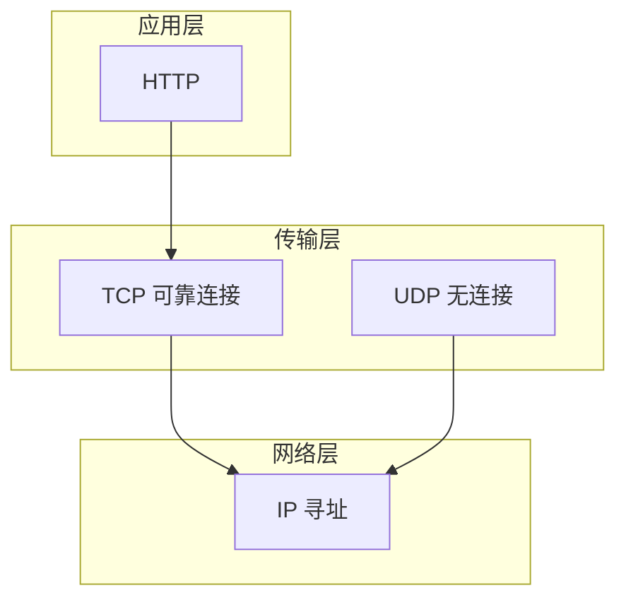
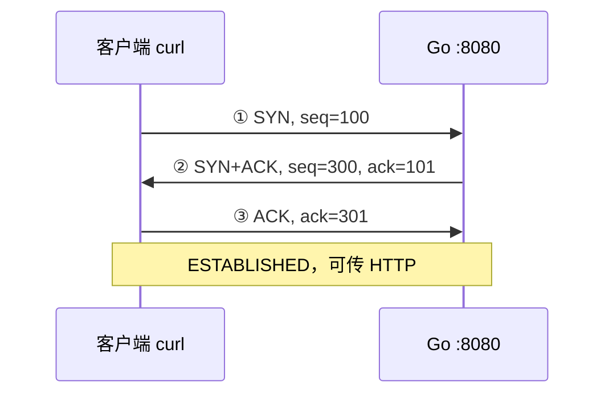
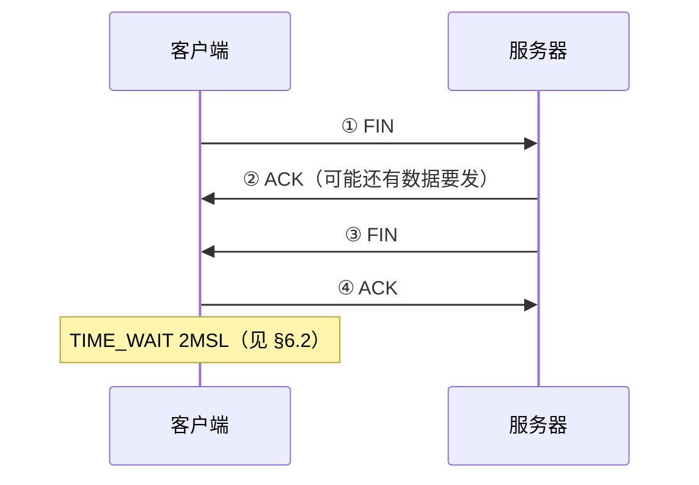
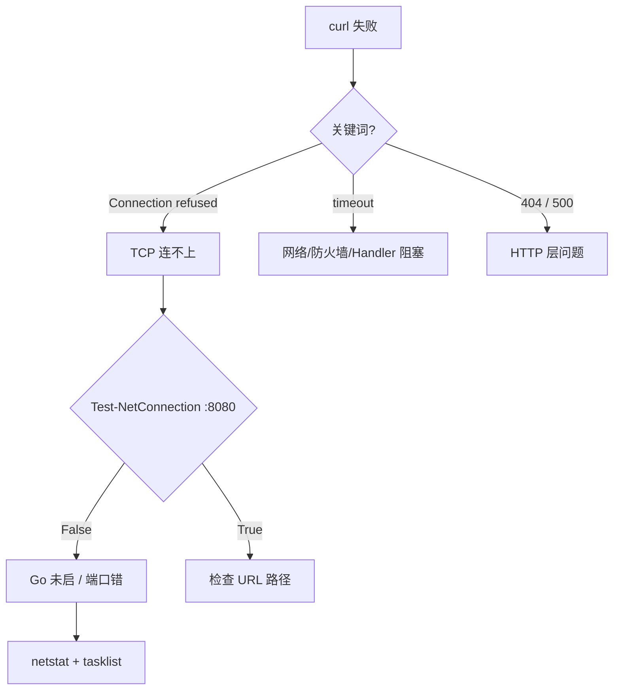

# TCP 与 UDP：传输层协议

> **文件编码**：UTF-8。终端命令在 **PowerShell** 下执行。  
> **定位**：Go 后端速成 **第 2 天**——搞懂 TCP/UDP、端口、三次握手/四次挥手，并能用 `curl` + `netstat` 排查 `:8080` 连不上。  
> **前置**：[01 网络分层与通信基础](./01-网络分层与通信基础.md)  
> **下一章**：[04 HTTP 协议深入](./04-HTTP协议深入.md)  
> **Go 落地**：[Go 05 标准库与 HTTP 基础](../../后端学习/Go/05-Go标准库与HTTP基础.md)

---

## 0. 读前导读（零基础也能跟上）

### 0.1 用一句话弄懂本章

**传输层**把数据从本机**某个程序**送到远端**某个程序**——IP 只送到「哪台电脑」，传输层还要找「哪个程序」（**端口号**）。

**核心类比：TCP = 打电话**

| 打电话 | TCP |
|--------|-----|
| 先拨号，等对方「喂」 | **三次握手**（SYN → SYN+ACK → ACK） |
| 确认对方在线才说话 | **面向连接**，没接通不发业务数据 |
| 听不清会「你刚才说啥？」 | **确认号 + 重传**，保证可靠 |
| 说完「挂了」双方挂断 | **四次挥手** + TIME_WAIT |
| 一方突然断线 | **RST** 重置连接 |

**UDP 类比：大喇叭广播**——喊出去就不管对方听没听见，适合 DNS 快问、视频直播能忍丢帧。

**HTTP 与 TCP**：HTTP 是**信纸格式**（应用层）；TCP 是**打电话线路**（传输层）。`curl http://localhost:8080/health` 之前，必须先「拨通」`8080`。

**本章还会出现的词**

| 词 | 是什么 |
|----|--------|
| **Socket** | 操作系统提供的网络编程接口；`ListenAndServe` 底层就是在某个端口上 listen |
| **bind（绑定）** | 进程向系统声明「我要占用这个端口」；报错 `address already in use` 就是端口已被别人 bind |
| **Handler** | 收到 HTTP 请求后执行业务逻辑的函数（Go 里 `func(w, r)`） |
| **REST API** | 用 URL+HTTP 方法设计的接口风格，Go 后端几乎都用 TCP 传 JSON |

### 0.2 你需要提前知道什么

| 前置 | 对应章节 | 必须？ |
|------|----------|--------|
| TCP/IP 四层 | [01 章](./01-网络分层与通信基础.md) §2～§4 | ✅ |
| IP 与端口 | 01 章 §6 | ✅ |
| 会 `go run`、见过 `:8080` | Go 01～04 | 建议 |
| `curl` | 本章手把手教 | ❌ |

### 0.3 本章知识地图（学完后应能勾选全部 ☐→☑）

```text
☐ 对比 TCP 与 UDP ≥ 6 个维度
☐ 画图讲解三次握手（SYN / SYN+ACK / ACK）
☐ 讲解四次挥手与 TIME_WAIT
☐ 说明「为什么三次握手不是两次」
☐ 说明「为什么挥手是四次不是三次」
☐ 理解 IP + 端口 + 四元组 + Socket
☐ 说出 TCP 可靠交付 3 机制（序列号、确认重传、滑动窗口）
☐ 用 netstat、Test-NetConnection、curl -v 排查 Go :8080
☐ 区分 TCP 连不上 vs HTTP 404/500
☐ 串讲 curl → TCP → HTTP → Go Handler 全路径
```

### 0.4 建议学习时长与节奏

| 阶段 | 内容 | 时间 |
|------|------|------|
| 对比直觉 | §1～§3 | 30 min |
| 握手挥手 | §4～§6 | 60 min |
| 联调排查 | §7 手把手 | 45 min |
| 自测复盘 | 闭卷 + 费曼 | 30 min |

**动手优先**：读完三次握手立刻 `curl -v localhost:8080`，看 `Connected` 是否在 `GET` 之前。

### 0.5 学完本章你能做什么

1. `curl` 失败时先用 `Test-NetConnection -Port 8080` 判断 TCP 还是 HTTP 问题。
2. 用 `netstat` 区分 LISTENING 与 ESTABLISHED。
3. 面试 30 秒答完三次握手、四次挥手、为什么三次。
4. 顺畅进入 [Go 05 net/http](../../后端学习/Go/05-Go标准库与HTTP基础.md)。

---

## 1. 本章在分层中的位置

[01 章](./01-网络分层与通信基础.md) 建立了分层大图景。Go 程序访问 `http://localhost:8080/api/users`，要靠**传输层**把字节可靠送到对方进程。



**下一章 [04 HTTP](./04-HTTP协议深入.md)** 讲应用层报文；本章摆清「HTTP 坐在 TCP 上」的座位关系。

---

## 2. 传输层做什么？

- **网络层（IP）**：送到**某台主机**（IP 地址 = 小区门牌）
- **传输层（TCP/UDP）**：送到主机上的**具体程序**（端口号 = 房间号）

**Go 视角**：`http.ListenAndServe(":8080", mux)` 在 8080 进入 **LISTEN**，等客户端三次握手。

---

## 3. TCP 与 UDP 全面对比

| 维度 | TCP | UDP |
|------|-----|-----|
| 连接 | **面向连接**（先握手） | **无连接**（直接发） |
| 可靠性 | **可靠**：确认、重传、有序 | **不保证** |
| 速度 | 较慢（握手、确认开销） | 较快 |
| 头部 | 20～60 字节 | 8 字节 |
| 流量/拥塞控制 | 有（滑动窗口等） | 无 |
| 传输单位 | 字节流 | 数据报（有边界） |
| 典型应用 | HTTP、WebSocket、MySQL | DNS、直播、QUIC |
| Go 后端 | **几乎所有 REST API** | DNS 53 等 |

> **上表名词脚注**：**REST** = 用 URL+HTTP 方法设计的 API 风格；**WebSocket** = 浏览器与服务器的长连接实时通信；**QUIC** = 基于 UDP 的新一代传输协议（HTTP/3 用它）；**MySQL** = 关系型数据库，默认端口 3306。

**口诀**：要完整、按序、不丢 → TCP；要快、能忍丢包 → UDP。

---

## 4. TCP 可靠 + 面向连接

### 4.1 面向连接

三次握手后双方在内存维护**连接状态**（序列号、窗口、缓冲区），内核才知道哪些字节属于同一条通道。

### 4.2 可靠交付三机制（面试必背）

| 机制 | 作用 |
|------|------|
| 序列号（Seq） | 字节编号，接收方按序组装 |
| 确认号（Ack）+ 超时重传 | 告知收到位置；未确认则重发 |
| 滑动窗口 | 控制发送速率，避免淹没接收方 |

Go 发 `POST /api/login` 时，丢包由 TCP 重传，HTTP 层通常无感知，只表现为响应变慢。

---

## 5. 三次握手

| 标志 | 含义 |
|------|------|
| SYN | 请求建连，带初始序列号 |
| ACK | 确认号有效 |
| FIN | 请求关闭 |
| RST | 强行重置 |



| 次序 | 方向 | 包 | 状态 |
|------|------|-----|------|
| 1 | C→S | SYN, seq=100 | 客户端 SYN_SENT |
| 2 | S→C | SYN+ACK, seq=300, ack=101 | 服务器 SYN_RECEIVED |
| 3 | C→S | ACK, ack=301 | 双方 ESTABLISHED |

### 5.1 为什么三次，不是两次或四次？

| 次数 | 结论 | 原因 |
|------|------|------|
| 2 次 | ❌ 不够 | 服务器无法确认客户端收到 SYN+ACK；迟到旧 SYN 可能误建连 |
| **3 次** | ✅ 最小可靠 | 客户端 ACK 证明双方收发正常且就绪 |
| 4 次 | 多余 | 第 3 次 ACK 已闭环 |

**面试 30 秒**：三次确认双方收发能力，防过期 SYN 误建连。

---

## 6. 四次挥手与 TIME_WAIT

TCP **全双工**，双方各关自己的发送方向 → 需四次挥手。



| 步骤 | 包 | 含义 |
|------|-----|------|
| 1 | C→S FIN | 客户端没数据发了 |
| 2 | S→C ACK | 知道了，但我可能还要发 |
| 3 | S→C FIN | 服务器也没数据了 |
| 4 | C→S ACK | 彻底关闭 |

### 6.1 为什么挥手是四次不是三次？

握手时 SYN+ACK 可合并。挥手时服务器收到 FIN 后**可能还有数据**（如 HTTP body），ACK 与 FIN **不能合并**——先 ACK「知道了」，发完再 FIN「我也完了」。

### 6.2 TIME_WAIT 简要

主动关闭方发完最后 ACK 后进入 **TIME_WAIT**（约 1～4 分钟），要等 **2MSL** 再释放端口：

- **MSL（Maximum Segment Lifetime，报文最大生存时间）**：TCP 认为一个包在网络里最多能存活的时间（常按 1～2 分钟估算）
- **2MSL**：多等两倍 MSL，① 确保最后 ACK 能到达；② 让旧连接的迟到包消亡，不影响同四元组的新连接

频繁 `curl` 短连接可能看到大量 `TIME_WAIT`，开发环境**一般正常**。

---

## 7. 端口、Socket 与四元组

| 端口范围 | 用途 | 示例 |
|----------|------|------|
| 0～1023 | 熟知端口 | 80、443、22 |
| 1024～49151 | 注册端口 | 8080、3306 |
| 49152～65535 | 临时端口 | 客户端 outbound |

**Go 典型**：API `localhost:8080`，MySQL `3306`，Redis `6379`。

**四元组**唯一标识一条 TCP 连接：`(源IP, 源端口, 目的IP, 目的端口)`  
例：`curl localhost:8080` → `(127.0.0.1, 52134, 127.0.0.1, 8080)`

**Socket** = 操作系统提供的网络 API。`net.Listen("tcp", ":8080")` 底层调用 `socket/bind/listen`；Handler 不直接操作 Socket，但 Go 运行时为每个连接维护它。

---

## 8. 手把手：排查 Go :8080 连不上

### 8.1 最小 Go 服务

```go
package main

import (
    "fmt"
    "net/http"
)

func main() {
    http.HandleFunc("/health", func(w http.ResponseWriter, r *http.Request) {
        w.Header().Set("Content-Type", "application/json")
        fmt.Fprint(w, `{"status":"ok"}`)
    })
    fmt.Println("Listening on :8080")
    http.ListenAndServe(":8080", nil)
}
```

```powershell
go run main.go
curl http://localhost:8080/health
```

### 8.2 15 分钟观测清单

| 步骤 | 命令 | 预期 |
|------|------|------|
| 1 | 关服务 → `curl localhost:8080/health` | Connection refused |
| 2 | 启服务 → `Test-NetConnection -ComputerName localhost -Port 8080` | TcpTestSucceeded : True |
| 3 | `curl -v http://localhost:8080/health` | Connected 在 GET 之前 |
| 4 | `netstat -ano \| findstr 8080` | LISTENING + ESTABLISHED |
| 5 | `curl localhost:8081`（错端口） | Connection refused |

### 8.3 netstat 解读

```powershell
netstat -ano | findstr :8080
```

```text
  TCP    0.0.0.0:8080           0.0.0.0:0              LISTENING       12345
  TCP    127.0.0.1:8080         127.0.0.1:52134        ESTABLISHED     12345
  TCP    127.0.0.1:52134        127.0.0.1:8080         ESTABLISHED     67890
```

- 第一行：Go 进程 `12345` 在 **监听** `0.0.0.0:8080`
- 后两行：一次连接两端，状态 **ESTABLISHED**

### 8.4 查占用 8080 的进程

```powershell
netstat -ano | findstr :8080 | findstr LISTENING
tasklist /FI "PID eq 12345"
```

若非你的 Go 程序 → `bind: address already in use` 或连错服务。关掉占用进程或改 `ListenAndServe(":8081", nil)`。

### 8.5 curl -v 成功片段

```text
*   Trying 127.0.0.1:8080...
* Connected to localhost (127.0.0.1) port 8080
> GET /health HTTP/1.1
> Host: localhost:8080
< HTTP/1.1 200 OK
{"status":"ok"}
```

`Connected` 在 `GET` 之前 → **先 TCP 握手，再 HTTP**。

### 8.6 联调决策树



**顺序**：端口能连（TCP）→ HTTP 状态码 → 业务逻辑。

### 8.7 多栈对照：端口占用排查

Go 只是监听 8080 的一种方式；**「端口被占」是 OS 级问题**，任何语言都一样：

| 语言/框架 | 监听写法 | 占用 8080 时现象 |
|-----------|----------|------------------|
| **Go** | `http.ListenAndServe(":8080", nil)` | `listen tcp :8080: bind: address already in use` |
| **Java** | `new ServerSocket(8080)` | `BindException: Address already in use` |
| **Python** | `socket.bind(("0.0.0.0", 8080))` | `OSError: [Errno 98] Address already in use` |
| **Node** | `app.listen(8080)` | `EADDRINUSE` |

排查命令仍是 **`netstat -ano | findstr 8080`** → 找 PID → 结束进程或换端口。Postman、浏览器、curl 作为客户端连不上时，先确认服务端 LISTENING。

---

## 9. Go 请求全链路

1. `localhost` → `127.0.0.1`（DNS，见 [03 章](./03-IP地址与DNS解析.md) 选修）
2. **TCP 三次握手**：临时端口 ↔ 8080
3. **HTTP 请求**在已建连接上发送
4. Go `net/http` 读 Socket → 解析 HTTP → 调 **Handler（请求处理函数，你写的业务逻辑）**
5. JSON 经 TCP 返回；连接 keep-alive 或四次挥手

---

## 10. TCP 连接状态速查

| 状态 | 含义 |
|------|------|
| LISTEN | 服务器等待连接 |
| SYN_SENT / SYN_RECEIVED | 握手中 |
| ESTABLISHED | 可传数据 |
| FIN_WAIT / CLOSE_WAIT | 关闭中 |
| TIME_WAIT | 主动方等 2MSL |
| CLOSED | 无连接 |

---

## 11. UDP 在后端周边

| 场景 | 说明 |
|------|------|
| DNS | 常 UDP 53 |
| HTTP/3 | QUIC 基于 UDP |
| 直播/游戏 | 低延迟容忍丢包 |

REST API 几乎 100% TCP——JSON 丢一字节就解析失败。

---

## 12. 常见误区与错误对照表

| 误区 / 报错 | 真相 | 正确做法 |
|-------------|------|----------|
| HTTP 和 TCP 是一回事 | HTTP 跑在 TCP 之上 | 先 ESTABLISHED 再 HTTP |
| curl 404 是 TCP 问题 | 404 是 HTTP 路由问题 | 查 Handler 注册 |
| API 该用 UDP 因为快 | JSON 不能丢 | REST 用 TCP |
| 三次握手应两次 | 两次无法确认双方就绪 | 见 §5.1 |
| 挥手三次就行 | 全双工，FIN/ACK 不能合并 | 四次挥手 |
| TIME_WAIT 是泄漏 | 主动关闭方正常状态 | 开发环境一般忽略 |
| localhost 不走 TCP | 回环仍走完整协议栈 | 同真实 IP |
| 一端口只能一连 | LISTEN 可接无数 ESTABLISHED | 四元组不同即可 |
| bind: address already in use | TCP 端口冲突 | netstat 查 PID |
| Socket = 端口号 | Socket 是 OS 网络 API | 用四元组理解 |
| HTTPS 不需 TCP | TLS 在 TCP 之上 | 见 [05 章](./05-HTTPS与TLS加密.md) |
| curl 超时但端口通 | Handler 阻塞或 Timeout 太短 | 查 Go 日志 |

---

## 13. 面试速记卡

| 问题 | 30 秒答法 |
|------|-----------|
| TCP vs UDP | TCP 可靠有握手；UDP 无连接不保证，快 |
| 三次握手 | SYN → SYN+ACK → ACK |
| 为什么三次 | 确认双方收发；防过期 SYN |
| 四次挥手 | 全双工，FIN/ACK 分开 |
| TIME_WAIT | 主动方等 2MSL，防旧包 |
| Socket | 四元组标识连接的 OS API |
| Go 监听 | Listen → LISTEN → 握手 → ServeHTTP |

---

## 14. 分级练习

### 基础

1. 画三次握手与四次挥手时序图。
2. 启动 Go 服务，`netstat -ano | findstr 8080`，标 LISTENING 与 ESTABLISHED。

### 进阶

3. 对比 Go 服务开/关时 `curl` 输出差异。
4. 故意占用 8080，观察 Go 启动报错。

### 挑战

5. `curl -v` 中 `Connected` 与 `GET` 的先后关系说明什么？
6. HTTP/3 为何用 QUIC（UDP）？

### 参考答案

- 握手：SYN → SYN+ACK → ACK；`netstat` LISTENING 是监听，ESTABLISHED 成对出现。
- 关服务：`curl: (7) ... Connection refused`；占端口：`bind: address already in use`。
- `Connected` 在 `GET` 前 → 先 TCP 后 HTTP。QUIC 在 UDP 上实现可靠+多路复用，减延迟。

---

## 15. FAQ

**Q：SYN 洪水是什么？**  
伪造大量 SYN 耗尽半连接队列。了解即可，防御靠 SYN Cookie、防火墙。

**Q：keep-alive 减少握手吗？**  
会。同一 TCP 连接发多个 HTTP 请求。Go 默认 HTTP/1.1 keep-alive。

**Q：与 Go 05 怎么配合？**  
本章 = TCP 连接；Go 05 = `net/http` 在连接上处理请求。

**Q：与 04 HTTP 章分工？**  
02 = 传输层；04 = 应用层 GET/POST、状态码、Header。

**Q：UDP 53 和 TCP 53？**  
DNS 查询常用 UDP；响应过大用 TCP。见 03 章选修。

**Q：127.0.0.1 也要三次握手？**  
是，回环走完整协议栈，不经物理网卡。

**Q：curl 通但 http.Client 超时？**  
TCP 已建立，查 Client `Timeout` 或 Handler 阻塞。

**Q：RST 是什么？**  
强行重置连接，如向未监听端口发数据、服务端崩溃 → `connection reset by peer`。

**Q：Graceful Shutdown 与挥手？**  
`server.Shutdown(ctx)` 让 Handler 处理完再关；底层仍四次挥手。

**Q：生产还用 8080 吗？**  
开发常用；生产多由 Nginx 反代 80/443 到内部端口。

**Q：滑动窗口和 Go channel 一样吗？**  
概念类似（控流速），但窗口是 TCP 内核机制。

**Q：netstat 很多 TIME_WAIT 正常吗？**  
开发环境频繁短连接常见，一般非 bug。

---

## 16. 闭卷自测（10 题）

### 概念题

1. 用「打电话」类比 TCP 面向连接。
2. TCP vs UDP：可靠性、速度、用途各一点。
3. 三次握手每步标志位与含义？
4. 为什么三次不是两次？说一个历史 SYN 直觉。
5. 挥手为何四次？TIME_WAIT 谁进入、等什么？
6. 四元组是什么？`curl localhost:8080` 举例。

### 动手题

7. `Test-NetConnection` 测 8080 命令？False 对应 curl 什么？
8. `curl -v` 中 `Connected` 在 `GET` 前还是后？说明什么？

### 综合题

9. `Connection refused` vs `404`：各什么层？第一步查什么？
10. `bind: address already in use` 如何用 netstat + tasklist 定位？

### 参考答案

1. 先拨号等接听；三次握手后才传 HTTP。  
2. TCP 可靠慢，HTTP/API；UDP 不保证快，DNS/直播。  
3. ① SYN ② SYN+ACK ③ ACK → ESTABLISHED。  
4. 两次无法确认客户端收到 SYN+ACK；迟到旧 SYN 误建连。  
5. 全双工 ACK/FIN 不能合并；主动方 TIME_WAIT 等 2MSL。  
6. 源IP、源端口、目的IP、目的端口；`(127.0.0.1,52431,127.0.0.1,8080)`。  
7. `Test-NetConnection -ComputerName localhost -Port 8080`；False → Connection refused。  
8. 之前；先 TCP 后 HTTP。  
9. refused → 传输层，查 netstat/Go 是否启动；404 → HTTP 层，查路由。  
10. `netstat -ano | findstr :8080 | findstr LISTENING` 得 PID → `tasklist /FI "PID eq <pid>"`。

---

## 17. 费曼检验：3 分钟讲给零基础朋友

1. **TCP 像打电话**：接通（三次握手）→ 听清（确认重传）→ 挂断（四次挥手）。
2. **UDP 像广播**：快但不保证听到。
3. **HTTP 在 TCP 上**：JSON 要完整所以用 TCP；`curl` 失败先分「没打通」还是「打通了地址不对」。
4. **端口是房间号**：8080 是 Go 住的房间；`netstat` 看谁在等。

---

## 18. 学完标准

1. 不看书画出三次握手、四次挥手，标 SYN/ACK/FIN
2. 口述 TCP 可靠 3 机制
3. 30 秒讲清为什么三次握手、为什么四次挥手
4. 独立完成 netstat + curl -v + Test-NetConnection 排查
5. 区分 Connection refused（TCP）与 404/500（HTTP）
6. 练习基础+进阶各一题；闭卷自测 ≥ 8/10
7. 能继续学 [Go 05](../../后端学习/Go/05-Go标准库与HTTP基础.md)

---

## 19. 下一章预告

本章懂了**数据如何送到正确进程**（TCP + 端口）。

- **完整路线**：建议先学 **[03 IP 地址与 DNS 解析](./03-IP地址与DNS解析.md)**（域名怎么变 IP、hosts、nslookup），再进 04。  
- **速成路线**：若赶 Go 05，可跳过 03，直接学 **[04 HTTP 协议深入](./04-HTTP协议深入.md)**：请求行、Header、GET/POST、状态码。

### 速记口诀

```text
传层 TCP 可靠连，三次握手 SYN ACK；
四次挥手关双工，TIME_WAIT 等旧散；
端口定位进程门，四元组把连接拴；
API 必走 TCP 路，curl netstat 先排查。
```

---

*上一章：[01 网络分层与通信基础](./01-网络分层与通信基础.md) · 下一章：[04 HTTP 协议深入](./04-HTTP协议深入.md) · Go 落地：[Go 05 标准库与 HTTP 基础](../../后端学习/Go/05-Go标准库与HTTP基础.md)*
