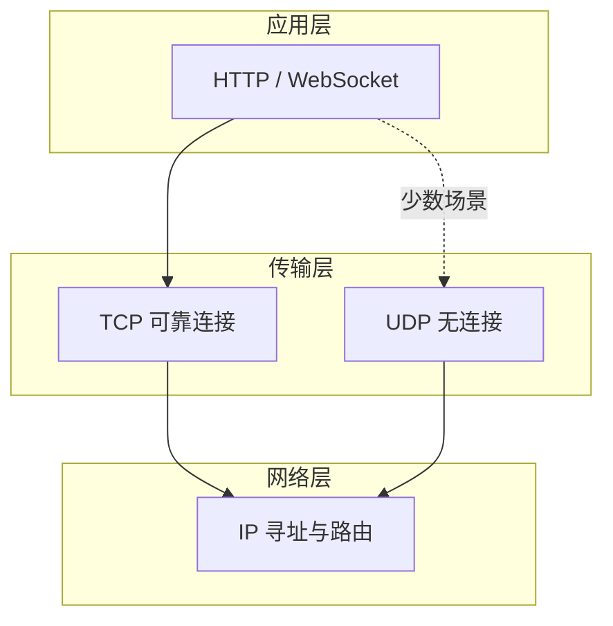
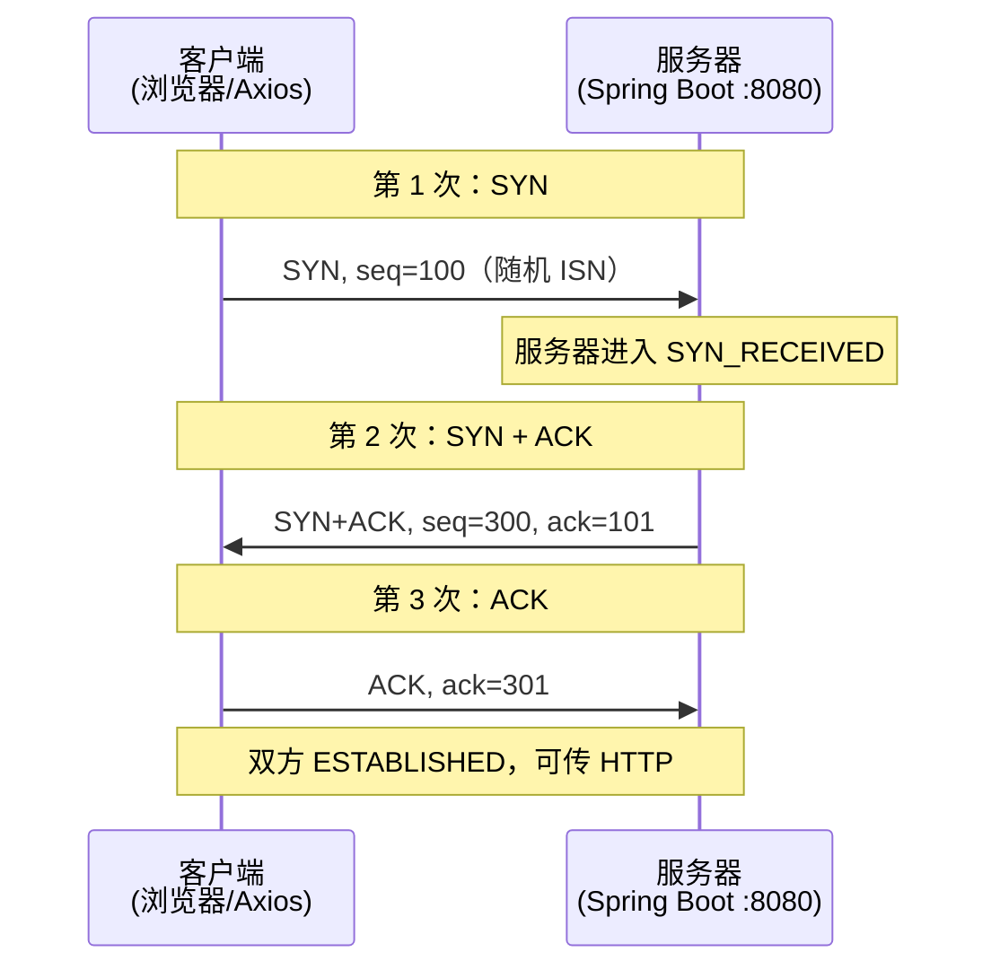
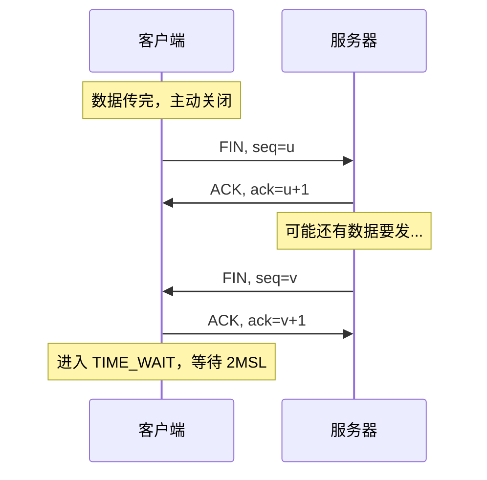
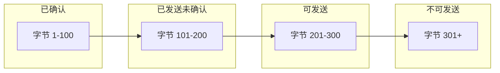
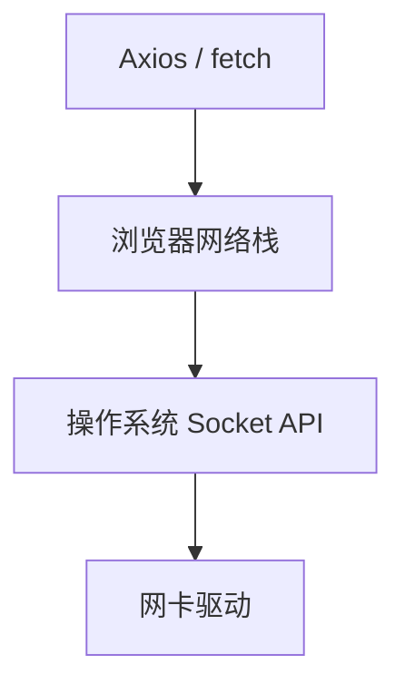
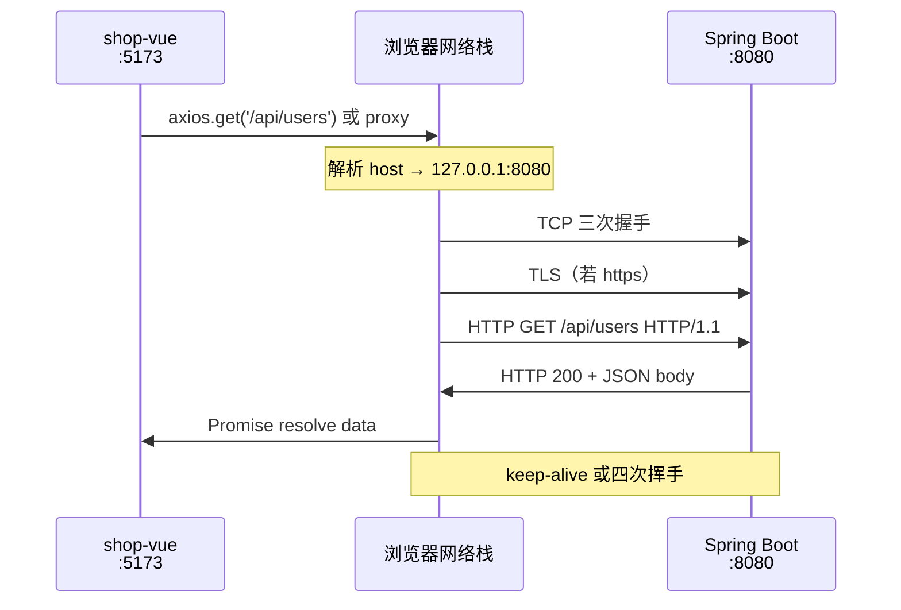
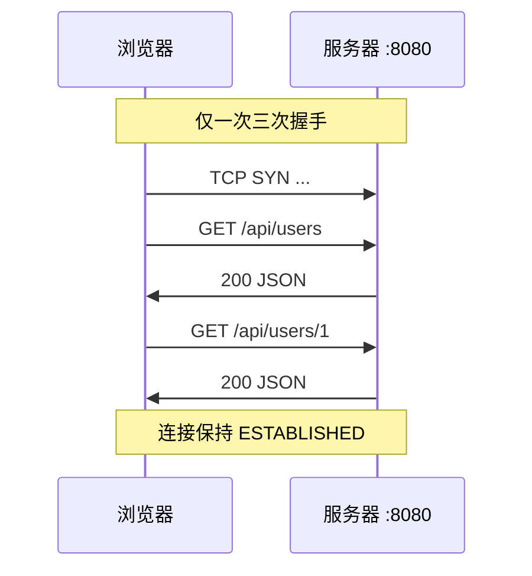
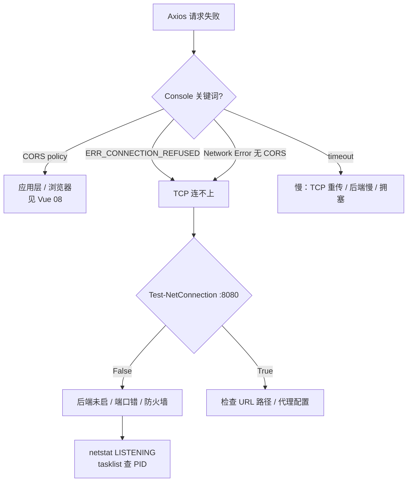

# TCP 与 UDP：传输层协议

> **文件编码**：UTF-8。本章假设你已完成 [01 网络分层与通信基础](./01-网络分层与通信基础.md)，对 OSI/TCP-IP 分层、HTTP 位于应用层有基本印象；并建议已读过 [HTML 10 浏览器 HTTP 网络与 Web 基础](../HTML%20CSS%20JS/10-浏览器HTTP网络与Web基础.md) 中「输入 URL 到页面渲染」的流程。

---

## 0. 读前导读（零基础也能跟上）

### 0.1 用一句话弄懂本章

**传输层**负责把数据从本机**某个程序**送到远端**某个程序**——网络层（IP）只送到「哪栋楼」，传输层还要找「几号房间」（**端口号**）。

**核心类比：TCP = 打电话**

| 打电话 | TCP |
|--------|-----|
| 先拨号，等对方「喂」 | **三次握手**（SYN → SYN+ACK → ACK） |
| 确认对方在线才说话 | **面向连接**，没接通不发业务数据 |
| 听不清会「你刚才说啥？」 | **确认号 + 重传**，保证可靠 |
| 说完「挂了」双方挂断 | **四次挥手** + TIME_WAIT |
| 一方突然断线 | **RST** 重置，类似 `ERR_CONNECTION_RESET` |

**UDP 类比：大喇叭广播**——喊出去就不管对方听没听见，适合 DNS 快问、视频直播能忍丢帧。

**HTTP 与 TCP 的关系**：HTTP 是**信纸格式**（应用层）；TCP 是**打电话线路**（传输层）。Axios 发 JSON 之前，浏览器必须先「拨通」`8080` 这个「电话」。

### 0.2 你需要提前知道什么

| 前置 | 对应章节 | 本章是否必须 |
|------|----------|--------------|
| OSI/TCP/IP 分层 | [01 章](./01-网络分层与通信基础.md) §2～§4 | ✅ 必须先读 |
| IP 与端口概念 | 01 章 §6 | ✅ |
| `localhost:8080` 联调 | [Vue 08](../Vue/08-Axios网络请求与前后端联调.md) | 建议有，便于实操 |
| 三次握手名词 | HTML 10 §30 | 见过即可，本章从零讲 |

**不会分层？** 先读完 01 章 §4（TCP/IP 四层），再回来。

### 0.3 本章知识地图（学完后应能勾选全部 ☐→☑）

```text
☐ 能对比 TCP 与 UDP 至少 6 个维度（连接、可靠、速度、用途…）
☐ 能画图讲解三次握手（SYN / SYN+ACK / ACK）及状态变化
☐ 能讲解四次挥手与 TIME_WAIT 的用途
☐ 能说明「为什么是三次握手而不是两次」
☐ 知道滑动窗口、拥塞控制解决什么问题（前端视角）
☐ 理解 IP + 端口 + 四元组 + Socket
☐ 能用 netstat、Test-NetConnection、curl -v 排查 shop 联调
☐ 能区分 TCP 连不上 vs CORS 拦截（症状 + 工具）
☐ 能串讲 shop-vue → 8080 的 TCP+HTTP 全路径
```

### 0.4 建议学习时长与节奏

| 阶段 | 内容 | 时间 |
|------|------|------|
| 对比建立直觉 | §0～§3 TCP vs UDP | 30 分钟 |
| 握手挥手 | §5～§9 含 netstat 实操 | 60 分钟 |
| 联调排查 | §13、§24、§37 走查 | 45 分钟 |
| 自测复盘 | 章末闭卷 + 费曼 | 30 分钟 |

**动手优先**：每读完「三次握手」立刻 `curl -v localhost:8080`，看 `Connected` 是否在 `GET` 之前。

### 0.5 学完本章你能做什么（可验证的具体动作）

1. `Axios Network Error` 时，先用 `Test-NetConnection -Port 8080`，再决定是否查 CORS。
2. 用 `netstat` 指出 LISTENING 与 ESTABLISHED 两行分别代表什么进程角色。
3. 向非技术朋友解释：**「HTTP 和 TCP 不是一回事，API 默认走 TCP 因为 JSON 不能丢字节。」**
4. 看 Network Timing：**Initial connection 为 0ms** 时，说出可能原因（keep-alive 复用）。
5. 面试 30 秒答完：三次握手、四次挥手、为什么是三次。

---

## 本章与上一章的关系

[01 章](./01-网络分层与通信基础.md) 你建立了**分层大图景**：应用层（HTTP）、传输层（TCP/UDP）、网络层（IP）、链路层。浏览器说「我要 `https://api.example.com/users`」，最终要靠**传输层**把字节可靠或快速地送到对方进程。

若你正在做 [Vue 08 Axios 网络请求与前后端联调](../Vue/08-Axios网络请求与前后端联调.md) 里的 **shop-vue** 项目，本章会解释：`axios.get('http://localhost:8080/api/users')` 在 HTTP 之下，**实际走的是 TCP**（端口 8080），而不是「魔法网线」。

本章掌握：

1. TCP 与 UDP 的定位、对比与选型
2. TCP **可靠、面向连接** 的含义
3. **三次握手**（SYN / SYN+ACK / ACK）逐步拆解
4. **四次挥手** 与 TIME_WAIT
5. 为什么是三次握手而不是两次或四次
6. **滑动窗口**与**拥塞控制**（前端需要知道的深度）
7. **端口号**与 **Socket（套接字）** 概念
8. shop 项目 API 请求的 TCP 全链路
9. Windows 下手把手观察连接状态

---

## 1. 为什么前端也要懂 TCP / UDP？

很多初学者认为：「我会 Axios，会看 Network 面板，传输层是后端的事。」

但以下场景**绕不开传输层**：

| 场景 | 和 TCP/UDP 的关系 |
|------|-------------------|
| 接口偶发超时 | TCP 重传、拥塞、连接未建立 |
| `ERR_CONNECTION_REFUSED` | 目标端口无进程监听（TCP 握手失败） |
| WebSocket 断线重连 | 长连接基于 TCP |
| 视频直播卡顿 | 可能走 UDP（低延迟容忍丢包） |
| `net::ERR_CONNECTION_RESET` | 对端 RST 包强行断开 TCP |
| HTTPS 慢 | TLS 握手在 **TCP 建立之后** |
| 开发环境 `localhost:8080` | IP + **端口号** 唯一定位进程 |

[HTML 10 §30](../HTML%20CSS%20JS/10-浏览器HTTP网络与Web基础.md) 写了「DNS → TCP 握手 → TLS → HTTP」。本章专讲其中 **TCP 握手与数据传输** 这一段。



---

## 2. 传输层做什么？

**一句话**：把数据从**本机某进程**送到**远端某进程**。

- **网络层（IP）**：负责把包送到**某台主机**（靠 IP 地址）。
- **传输层（TCP/UDP）**：负责把包送到主机上的**具体程序**（靠**端口号**）。

类比快递：

- IP 地址 = 小区门牌（哪栋楼）
- 端口号 = 房间号（哪户人家）
- TCP/UDP = 两种不同的派送规则（是否要签收、是否保证顺序）

---

## 3. TCP 与 UDP 全面对比

| 维度 | TCP | UDP |
|------|-----|-----|
| 中文名 | 传输控制协议 | 用户数据报协议 |
| 连接 | **面向连接**（先握手再传数据） | **无连接**（直接发） |
| 可靠性 | **可靠**：确认、重传、有序 | **不保证**可靠、有序 |
| 速度 | 相对慢（头部开销、握手、确认） | 相对快、开销小 |
| 头部大小 | 20～60 字节 | 8 字节 |
| 流量控制 | 有（滑动窗口） | 无 |
| 拥塞控制 | 有 | 无 |
| 传输单位 | 字节流（无消息边界） | 数据报（有边界，可能丢、乱序） |
| 典型应用 | HTTP/HTTPS、WebSocket、MySQL、SSH | DNS 查询、视频直播、在线游戏、QUIC 底层 |
| 前端常见 | **几乎所有 REST API** | DNS（常走 UDP 53）、WebRTC 部分通道 |

**记忆口诀**：要**完整、按序、不丢** → TCP；要**快、能忍丢包** → UDP。

---

## 4. TCP：可靠 + 面向连接

### 4.1 「面向连接」是什么意思？

不是指「两根网线焊在一起」，而是通信前双方用**三次握手**在内存里维护一份**连接状态**（序列号、窗口大小、缓冲区等）。连接建立后，内核才知道「这些字节属于同一条逻辑通道」。

### 4.2 「可靠」靠什么？

| 机制 | 作用 |
|------|------|
| 序列号（Seq） | 给每个字节编号，接收方按序组装 |
| 确认号（Ack） | 告诉对方「我已收到到哪里」 |
| 超时重传 | 没收到确认就重发 |
| 校验和 | 检测数据损坏 |
| 滑动窗口 | 控制发送速率，避免淹没接收方 |
| 拥塞控制 | 网络堵了主动减速 |

UDP 没有上述保证：发出去就不管了（「尽力交付」）。

### 4.3 前端视角的「可靠」

浏览器发 `POST /api/login`，底层 TCP 保证：**同一条连接上的 HTTP 报文按序到达**（在连接正常的前提下）。若中间路由器丢包，TCP 会重传，应用层（HTTP）通常**无感知**——只会表现为**响应变慢**，极端时 Axios `timeout`。

---

## 5. 三次握手：逐步拆解（含 SYN / ACK 标志位）

TCP 头部有几个重要**标志位（Flags）**：

| 标志 | 含义 |
|------|------|
| SYN | Synchronize，请求建立连接，携带初始序列号 |
| ACK | Acknowledgment，确认号有效 |
| FIN | Finish，请求关闭连接 |
| RST | Reset，强行重置连接 |

**三次握手**（客户端主动连接服务器，例如浏览器连 `localhost:8080`）：



### 5.1 第 1 次握手：客户端 → 服务器

- 包内容：`SYN=1`，`seq = 客户端随机初始序列号`（例如 100）
- 含义：「我想建立连接，我的起始编号是 100。」
- 客户端状态：`SYN_SENT`

### 5.2 第 2 次握手：服务器 → 客户端

- 包内容：`SYN=1, ACK=1`，`seq = 服务器随机 ISN`（例如 300），`ack = 100 + 1 = 101`
- 含义：「我同意连接，我的起始编号是 300；我确认收到了你的 SYN（期待你下一个字节从 101 开始）。」
- 服务器状态：`SYN_RECEIVED` → 准备 `ESTABLISHED`

### 5.3 第 3 次握手：客户端 → 服务器

- 包内容：`ACK=1`，`ack = 300 + 1 = 301`（通常不带 SYN）
- 含义：「我确认收到你的 SYN+ACK，连接建立完成。」
- 双方状态：`ESTABLISHED`

**此后** HTTP 请求（如 `GET /api/users`）作为 TCP **字节流**写入这条连接。

### 5.4 手把手：用 netstat 看握手后的连接（Windows）

先启动 shop 后端（[Vue 08 §2.1](../Vue/08-Axios网络请求与前后端联调.md)）：

```powershell
# 终端 1：确保 Spring Boot 在 8080 监听
curl http://localhost:8080/api/users
```

```powershell
# 终端 2：查看 8080 相关 TCP 连接
netstat -ano | findstr :8080
```

**预期输出（示例）**：

```text
  TCP    0.0.0.0:8080           0.0.0.0:0              LISTENING       12345
  TCP    127.0.0.1:8080         127.0.0.1:52134        ESTABLISHED     12345
  TCP    127.0.0.1:52134        127.0.0.1:8080         ESTABLISHED     67890
```

解读：

- 第一行：进程 `12345`（Java）在 **监听** `0.0.0.0:8080`（所有网卡的 8080 端口）
- 后两行：一次连接的**两端**：服务器端 `8080` ↔ 客户端临时端口 `52134`，状态 **ESTABLISHED**

再用浏览器或 shop-vue 发请求，可看到短暂出现后可能变为 `TIME_WAIT`（见 §9）。

---

## 6. 为什么是三次握手，而不是两次或四次？

### 6.1 为什么需要「三次」？（核心：确认双方收发能力）

| 次数 | 能否确认 | 说明 |
|------|----------|------|
| 1 次 | ❌ | 服务器不知道客户端是否收到了自己的响应 |
| 2 次 | ⚠️ 不够 | 服务器发了 SYN+ACK 后，**无法确认客户端收到了**；旧连接请求的迟到 SYN 可能导致服务器错误建立连接 |
| **3 次** | ✅ | 客户端对 SYN+ACK 的 ACK 证明：**客户端收发正常，且双方都知道对方已就绪** |
| 4 次 | 多余 | 第 3 次 ACK 已足够，第 4 次不增加新信息 |

**历史重复 SYN 场景（直觉理解）**：

客户端发了一个 SYN，网络卡住；客户端**重发 SYN** 并成功建连、传完数据、关闭。很久以后**第一个 SYN 才到达**服务器。若只有两次握手，服务器会误以为新连接，分配资源——**浪费且可能被 SYN 洪水攻击利用**。三次握手中，服务器发 SYN+ACK 后需等客户端「正确」的 ACK，迟到的旧 SYN 通常对不上序列号，连接不会误建。

### 6.2 深入：为什么不是两次就够？（面试常问）

两次握手时，服务器发出 SYN+ACK 就认为连接建立了，但：

1. **客户端可能根本没收到** SYN+ACK（服务器不知道）
2. 服务器无法区分「有效的新连接」与「过期的重复 SYN」

第三次 ACK 是客户端对服务器 ISN 的确认，形成**双向都确认过对方初始序列号**的闭环。

### 6.3 为什么不是四次？

逻辑上「客户端确认」和「服务器确认」已在 2、3 两步完成，第四次没有新的确认需求。TCP 设计追求在**可靠**与**延迟**间平衡，三次是理论上的最小可靠握手次数。

---

## 7. 四次挥手：TCP 连接如何关闭

TCP 是全双工：双方都可独立关闭自己的发送方向。因此需要**四次挥手**（双方各发 FIN + 对方 ACK）。



| 步骤 | 方向 | 包 | 含义 |
|------|------|-----|------|
| 1 | C → S | FIN | 客户端：我没数据发了 |
| 2 | S → C | ACK | 服务器：知道了（可能还在发剩余数据） |
| 3 | S → C | FIN | 服务器：我也没数据发了 |
| 4 | C → S | ACK | 客户端：知道了，连接彻底关闭 |

**为什么是四次而不是三次？** 因为服务器收到 FIN 后可能还有数据要发，ACK 和 FIN **不能合并**（与握手时 SYN+ACK 可合并不同）。

---

## 8. 滑动窗口（简要）

TCP 不能「发一个等一个」——太慢。滑动窗口允许：**在未收到确认的情况下，连续发送窗口大小内的多个段**。



- **接收窗口（rwnd）**：接收方缓冲区还能收多少，通过 ACK 告知发送方
- **发送窗口**：在途未确认数据的上限

**前端需要知道的**：窗口满或网络差时，TCP 会**暂停发送** → 表现为接口 TTFB 变长；这与 HTTP 无关，是传输层背压。

---

## 9. 拥塞控制（简要）

当**整个网络**拥堵（路由器队列满、丢包）时，仅靠接收方窗口不够，TCP 还有**拥塞窗口（cwnd）**：

| 阶段/算法 | 行为（简化） |
|-----------|--------------|
| 慢启动 |  cwnd 指数增长，试探网络容量 |
| 拥塞避免 | 线性增长 |
| 快重传 / 快恢复 | 收到 3 个重复 ACK，认为丢包，快速重传 |

**丢包时**：cwnd 大幅减小 → 所有经过该路径的 TCP 连接都变慢。

**前端启示**：大促时接口变慢，不一定是后端 CPU 满，也可能是**网络拥塞**或**连接数过多**；可结合 CDN、HTTP/2 多路复用、减少连接数优化。

---

## 10. 端口号：进程的门牌号

| 范围 | 用途 | 示例 |
|------|------|------|
| 0～1023 | 熟知端口（Well-known） | 80 HTTP、443 HTTPS、22 SSH |
| 1024～49151 | 注册端口 | 8080 常用开发、3306 MySQL |
| 49152～65535 | 动态/临时端口 | 客户端 outbound 连接常用 |

**shop 项目典型端口**：

| 服务 | 地址 | 协议 |
|------|------|------|
| shop-vue 开发服务器 | `localhost:5173` | HTTP over TCP |
| Spring Boot API | `localhost:8080` | HTTP over TCP |
| MySQL（若本地） | `localhost:3306` | TCP |

浏览器访问 `http://localhost:5173` 时：

- 源：`127.0.0.1:随机端口`（如 52134）
- 目的：`127.0.0.1:5173`

Axios 请求 `http://localhost:8080/api/users` 时，目的端口是 **8080**。

```powershell
netstat -ano | findstr LISTENING | findstr "5173 8080"
```

---

## 11. Socket（套接字）是什么？

**Socket** 是操作系统提供的**编程接口（API）**，不是指「插头上的物理插座」。

逻辑上，一个 TCP 连接由**四元组**唯一标识：

```text
（源 IP，源端口，目的 IP，目的端口）
```

例如：`(127.0.0.1, 52134, 127.0.0.1, 8080)`

在 Java / Node / 浏览器内核里，程序通过 `socket()`、`connect()`、`send()`、`recv()` 等系统调用使用 TCP。Axios 不直接操作 Socket，但 **浏览器网络栈底层**会为每个 HTTP 连接（或 HTTP/2 流）维护 Socket。



**与 [Vue 08](../Vue/08-Axios网络请求与前后端联调.md) 的关系**：`baseURL: 'http://localhost:8080'` 最终解析为对 `127.0.0.1:8080` 的 TCP 连接；若连不上，错误常在 TCP 层表现为 `ECONNREFUSED`，Axios 包装为 `Network Error`。

---

## 12. TIME_WAIT 状态

主动**关闭连接的一方**（常常是客户端）在发出最后一个 ACK 后，会进入 **TIME_WAIT**，持续 **2MSL**（Maximum Segment Lifetime，通常 1～4 分钟，视 OS 而定）。

**为什么存在 TIME_WAIT？**

1. **确保最后的 ACK 能到达**：若 ACK 丢失，对方会重发 FIN，本方仍能正确响应
2. **让旧连接的迟到包在网络中消亡**，避免影响**同四元组的新连接**

**前端开发中的现象**：

- 频繁刷新页面、短连接 API，用 `netstat` 可能看到大量 `TIME_WAIT` 到 `:8080`
- 一般**不是 bug**；若端口耗尽（极少见），可_tune 系统或改用 HTTP keep-alive / 连接池

```powershell
netstat -ano | findstr TIME_WAIT | findstr 8080
```

---

## 13. shop 项目 API 请求走 TCP 的全链路

以 `shop-vue` 调用 `GET http://localhost:8080/api/users` 为例（[Vue 08](../Vue/08-Axios网络请求与前后端联调.md)）：



**逐步说明**：

1. **DNS**（本章不展开，见 [03 章](./03-IP地址与DNS解析.md)）：`localhost` → `127.0.0.1`
2. **TCP 三次握手**：浏览器临时端口 ↔ `8080`
3. **HTTP 请求**：在已建立的 TCP 连接上发送明文 HTTP（开发环境常为 HTTP；生产 HTTPS 先 TLS 再 HTTP）
4. **Tomcat / Spring** 从 Socket 读字节，解析 HTTP，交给 Controller
5. **响应返回**：JSON 经 TCP 传回；Axios 解析 `response.data`

**若使用 Vite 代理**（[Vue 08 §2.3](../Vue/08-Axios网络请求与前后端联调.md)）：

- 浏览器只连 `localhost:5173`（TCP）
- **Vite 开发服务器**再作为客户端连 `localhost:8080`（第二条 TCP）
- 浏览器侧**无跨域**，但后端仍收到来自 Node 的 TCP 连接

**排查命令**：

```powershell
# 后端是否在听 8080？
netstat -ano | findstr :8080 | findstr LISTENING

# 用 curl 绕过浏览器，直接测 TCP+HTTP
curl -v http://localhost:8080/api/users
```

`curl -v` **预期片段**：

```text
*   Trying 127.0.0.1:8080...
* Connected to localhost (127.0.0.1) port 8080
> GET /api/users HTTP/1.1
> Host: localhost:8080
...
< HTTP/1.1 200
< Content-Type: application/json
{"code":0,"message":"success","data":[...]}
```

`Trying ... Connected` 即 TCP 握手成功；若 `Connection refused`，说明 **8080 无 LISTENING**（后端未启动或端口错）。

---

## 14. UDP 在前端周边的角色

虽然 REST API 几乎全是 TCP，UDP 仍会出现：

| 场景 | 说明 |
|------|------|
| DNS 查询 | 传统上常用 UDP 53（也有 TCP DNS） |
| WebRTC | 媒体流常用 UDP（低延迟） |
| HTTP/3 | 基于 QUIC（UDP 之上） |
| 游戏 / 直播 | 实时性优先 |

**DNS 与 TCP 对比记忆**：查一次域名像「问一句就走」→ 适合 UDP；传整个 JSON 订单要完整 → TCP。

---

## 15. 手把手：用 PowerShell 测试端口是否开放

```powershell
Test-NetConnection -ComputerName localhost -Port 8080
```

**后端已启动时预期**：

```text
ComputerName     : localhost
RemoteAddress    : ::1 或 127.0.0.1
RemotePort       : 8080
InterfaceAlias   : Loopback Pseudo-Interface 1
SourceAddress    : ...
TcpTestSucceeded : True
```

**后端未启动时**：

```text
TcpTestSucceeded : False
```

这与 Axios `Network Error` / `ERR_CONNECTION_REFUSED` 根因一致。

---

## 16. TCP 连接状态一览（查表用）

| 状态 | 含义 |
|------|------|
| LISTEN | 服务器等待连接 |
| SYN_SENT | 客户端已发 SYN |
| SYN_RECEIVED | 服务器已收 SYN，已回 SYN+ACK |
| ESTABLISHED | 连接建立，可传数据 |
| FIN_WAIT_1 / FIN_WAIT_2 | 主动关闭中 |
| CLOSE_WAIT | 被动方收到 FIN，应用还未 close |
| LAST_ACK | 被动方发完 FIN，等最后 ACK |
| TIME_WAIT | 主动方已 ACK 对方 FIN，等待 2MSL |
| CLOSED | 无连接 |

---

## 17. 常见误区与错误对照表

| 误区 / 报错现象 | 真相 | 正确做法 |
|-----------------|------|----------|
| 「HTTP 和 TCP 是一回事」 | HTTP 是应用层协议，跑在 TCP **之上** | 先 ESTABLISHED，再发 HTTP 报文 |
| 「Axios 失败一定是 CORS」 | `ERR_CONNECTION_REFUSED` 是 **TCP 连不上** | 先 `curl`/ `Test-NetConnection` 测端口；CORS 见 [Vue 08](../Vue/08-Axios网络请求与前后端联调.md) |
| 「UDP 比 TCP 快所以 API 该用 UDP」 | API 要完整 JSON，UDP 丢包无重传 | REST 用 TCP；实时音视频才考虑 UDP |
| 「三次握手浪费，应该两次」 | 两次无法可靠确认双方就绪 | 理解 §6，面试能讲历史 SYN |
| 「挥手三次就行」 | 全双工，双方关闭发送方向需分开 FIN | 记住四次挥手 |
| 「TIME_WAIT 是内存泄漏」 | 主动关闭方的正常等待 | 高并发场景 tune 参数，非业务 bug |
| 「localhost 不走 TCP」 | 回环地址仍走完整 TCP/IP 栈 | `127.0.0.1:端口` 与真实 IP 一样是 Socket |
| 「一个端口只能一个连接」 | 一个**监听**端口可接受**无数** ESTABLISHED（四元组不同） | 区分 LISTEN 与 ESTABLISHED |
| 「WebSocket 不是 TCP」 | WebSocket 握手是 HTTP Upgrade，之后**仍是 TCP** | 长连接 = 长生命周期的 TCP |
| 「滑动窗口 = 浏览器窗口」 | 完全无关，是 TCP 流控 | 读 §8 |
| 「拥塞控制只影响下载大文件」 | 任何 TCP 连接都受 cwnd 影响 | 小 API 也可能因丢包变慢 |
| 「Socket 等于端口号」 | Socket = IP+端口+协议 的编程抽象 | 用四元组理解连接 |
| `netstat` 看不到 Node 5173 | 命令或权限不对 | `netstat -ano \| findstr 5173` |
| HTTPS 不需要 TCP | TLS 运行在 TCP 之上 | 先 TCP 握手，再 TLS ClientHello |

---

## 18. 深入：为什么 API 默认用 TCP 而不是 UDP？

1. **数据完整性**：订单、登录、支付 JSON 丢一个字节就解析失败；TCP 保证有序可靠交付。
2. **连接状态**：HTTP/1.1 keep-alive、HTTP/2 多路复用依赖**已建立的 TCP 连接**。
3. **防火墙友好**：许多网络允许 80/443 TCP，UDP 常被限（除 DNS 等）。
4. **生态**：Tomcat、Nginx、Axios 全链路默认 TCP，无需应用层再实现重传。

UDP 适合「丢一帧画面无所谓」的流媒体，不适合「丢一个字段整个订单错了」的电商 API。

---

## 19. 深入：为什么你能用 `localhost:8080` 访问本机服务？

操作系统把目的 IP 为 `127.0.0.1` 的包通过**回环接口**转给本机进程，**不经过物理网卡**，但 TCP/IP 协议栈路径与访问外网 IP **一致**（同样有三次握手、端口、Socket）。

因此 [03 章](./03-IP地址与DNS解析.md) 的 IP 知识与本章端口结合，才能完整理解联调地址。跨域是浏览器对**不同源**的限制，不取消 TCP 握手（见 [HTML 10 §20](../HTML%20CSS%20JS/10-浏览器HTTP网络与Web基础.md)）。

---

## 20. TCP 报文头（前端了解即可）

不必背每一个字段，但面试和读抓包时会见到：

| 字段 | 作用 |
|------|------|
| 源端口 / 目的端口 | 各 16 位，定位进程 |
| 序列号 Seq | 本报文数据的第一个字节编号 |
| 确认号 Ack | 期望对方下一个字节编号 |
| 数据偏移 | 头部长度 |
| 标志位 SYN/ACK/FIN/RST/PSH/URG | 控制连接状态 |
| 窗口大小 | 接收方还能收多少（滑动窗口） |
| 校验和 | 差错检测 |
| 选项 | 如 MSS（最大段大小）、窗口扩大因子 |

**MSS 提示**：握手时双方会协商 MSS，避免 IP 层分片。过大的 JSON 响应在应用层仍是完整 HTTP body，TCP 会拆成多个段发送——Axios 收到的永远是**重组后的完整 JSON**。

---

## 21. HTTP keep-alive 与 TCP 连接复用

[HTML 10](../HTML%20CSS%20JS/10-浏览器HTTP网络与Web基础.md) 提到持久连接；在传输层体现为：**一条 TCP 连接上传多个 HTTP 请求**。



**shop-vue 场景**：列表页连续请求多个接口时，若 `Connection: keep-alive`，可避免每个请求都三次握手，**Initial connection** 时间摊薄。

**HTTP/2**：单条 TCP 连接上**多路复用**多个请求流，进一步减少连接数。Vite 开发服务器与生产 Nginx 行为可能不同，但底层仍是 TCP。

---

## 22. 手把手：根据 PID 查是哪个程序占了 8080

`netstat -ano` 最后一列是 **PID**（进程 ID）：

```powershell
netstat -ano | findstr :8080 | findstr LISTENING
# 假设最后一列是 12345

tasklist /FI "PID eq 12345"
```

**预期**：

```text
映像名称                       PID 会话名              会话#       内存使用
java.exe                     12345 Console                    1    250,000 K
```

若不是 `java.exe`，说明 **8080 被别的程序占用**，Spring Boot 可能启在了别的端口或启动失败——这解释了「我明明启动了却 `Connection refused`」的另一类原因。

**释放端口**：关掉占用进程，或在 `application.properties` 改 `server.port=8081`（同时改 Axios `baseURL`）。

---

## 23. 手把手：Chrome Network 对照 TCP 阶段

1. 打开 shop-vue，F12 → **Network**，勾选 **Disable cache**
2. 刷新页面，点任意 **XHR** 到 `/api/...`
3. 看 **Timing** 选项卡：

| Timing 项 | 对应本章 |
|-----------|----------|
| Initial connection | 三次握手（+ 可能 TLS） |
| SSL | 仅 `https://` |
| Waiting (TTFB) | 服务器处理，含 DB 查询 |
| Content Download | TCP 传 body |

4. 再发**第二个**同 host 请求，对比 Initial connection 是否接近 **0 ms**（keep-alive 复用）

与 [HTML 10 §35](../HTML%20CSS%20JS/10-浏览器HTTP网络与Web基础.md) 对照做笔记。

---

## 24. 联调排查决策树（TCP 视角）



**顺序建议**（与 [03 章 DNS](./03-IP地址与DNS解析.md) 串联）：先域名能解析 → 再端口能连 → 再 HTTP 状态码 → 最后 CORS。

---

## 25. RST 包：连接被强行重置

除 FIN 正常关闭外，TCP 还有 **RST（Reset）**：

| 场景 | 现象 |
|------|------|
| 向未监听端口发数据 | 可能收到 RST |
| 防火墙拒绝 | RST 或超时 |
| 服务端崩溃 | 客户端 `ERR_CONNECTION_RESET` |

```powershell
# 故意连一个未开放端口
curl -v http://localhost:59999/
```

**预期**：`Connection refused`（SYN 阶段被拒）或超时，取决于系统。

**与 CORS 区分**：RST/REFUSED 时 Network 里往往**没有 HTTP 状态码**；CORS 时常见 **200 但浏览器拦截响应**（见 [Vue 08 报错表](../Vue/08-Axios网络请求与前后端联调.md)）。

---

## 26. 半连接队列与全连接队列（了解）

服务器 `listen` 时内核维护：

- **半连接队列**：收到 SYN，等待客户端 ACK（SYN_RECEIVED）
- **全连接队列**：已完成三次握手，等待 `accept()` 取走

SYN 洪水攻击打满半连接队列会导致正常用户握手失败。前端无需调参，但**压测**时若大量短连接，可能触达服务器 `backlog` 上限——表现为间歇性 `Connection refused` 或超时。

---

## 27. 端口冲突与多服务共存

| 端口 | 常见占用 | shop 建议 |
|------|----------|-----------|
| 5173 | Vite 默认 | 前端 dev |
| 8080 | Spring Boot 常用 | 后端 API |
| 3306 | MySQL | 本地数据库 |
| 80 / 443 | IIS、Nginx | 生产 |

```powershell
netstat -ano | findstr LISTENING | findstr "5173 8080 3306"
```

**一手体验端口冲突**：先起一个占 8080 的程序，再启 Spring Boot，看启动日志是否报 `Port 8080 was already in use`。

---

## 28. 面试速记卡（TCP/UDP）

| 问题 | 30 秒答法 |
|------|-----------|
| TCP 和 UDP 区别？ | TCP 可靠面向连接有握手；UDP 无连接不保证可靠，快 |
| 三次握手？ | SYN → SYN+ACK → ACK，确认双方收发能力 |
| 为什么三次？ | 防历史 SYN、确认客户端收到 SYN+ACK |
| 四次挥手？ | 全双工，双方各关一个方向，FIN+ACK 分开 |
| TIME_WAIT？ | 主动关闭方等 2MSL，防旧包干扰新连接 |
| 滑动窗口？ | 不必一发一确认，提高吞吐，流量控制 |
| 拥塞控制？ | 网络堵了减速，慢启动、快重传等 |
| Socket？ | IP+端口+协议 的 API，四元组标识连接 |
| HTTP 用什么？ | TCP，80/443 |

---

## 29. 与 [01 章分层模型](./01-网络分层与通信基础.md) 的对照

| 层 | 本章内容 | 数据单元 |
|----|----------|----------|
| 应用层 | HTTP、DNS（UDP） | 报文 |
| **传输层** | **TCP、UDP、端口** | **段（Segment）** |
| 网络层 | IP（03 章） | 包（Packet） |
| 链路层 | 以太网、WiFi | 帧（Frame） |

封装方向：HTTP 报文 → TCP 段 → IP 包 → 帧。解封在接收端反向进行。Axios 只接触 HTTP；**Initial connection** 是传输层第一次在 Timing 里露面。

---

## 30. 本章知识点清单

- [ ] 能默写 TCP vs UDP 对比表核心 5 行
- [ ] 能画图讲解三次握手（SYN / SYN+ACK / ACK）
- [ ] 能讲解四次挥手与 TIME_WAIT 用途
- [ ] 能说明为何是三次而非两次握手
- [ ] 知道滑动窗口、拥塞控制解决什么问题
- [ ] 理解 IP + 端口 + Socket 四元组
- [ ] 能用 `netstat`、`Test-NetConnection`、`curl -v` 排查 shop 联调
- [ ] 能串讲 shop-vue → 8080 的 TCP+HTTP 路径

---

## 31. 分级练习

### 基础

1. 画出三次握手与四次挥手的时序图（纸笔或 Mermaid）。
2. 启动 shop 后端，执行 `netstat -ano | findstr 8080`，标出 LISTENING 与 ESTABLISHED 行。

### 进阶

3. 对比 `curl http://localhost:8080/api/users` 在后端**开启**与**关闭**时的输出差异。
4. 说明 Vite 代理时，浏览器与后端之间各有几条 TCP 连接。

### 挑战

5. 阅读 `curl -v` 输出，指出 TCP 连接建立与第一条 HTTP 请求行的先后关系。
6. 查资料：HTTP/3 为什么改用 QUIC（UDP）？与本章 TCP 优缺点的关系是什么？

### 31.1 参考答案（基础）

**握手顺序**：C→S SYN；S→C SYN+ACK；C→S ACK。标志位：第 1 包 SYN=1；第 2 包 SYN=1 且 ACK=1；第 3 包 ACK=1。

**netstat**：`0.0.0.0:8080 LISTENING` 是 Java 进程监听；`127.0.0.1:xxxxx` 与 `127.0.0.1:8080 ESTABLISHED` 成对出现。

### 31.2 参考答案（进阶）

**后端关闭**：

```text
curl: (7) Failed to connect to localhost port 8080 after ...: Connection refused
```

**Vite 代理**：浏览器 ↔ Vite（`:5173`）一条 TCP；Vite ↔ Spring Boot（`:8080`）一条 TCP；共**两条**（浏览器不直接连 8080）。

### 31.3 参考答案（挑战）

`curl -v` 中 `Connected to ...` 出现在 `> GET /api/users` **之前**，证明先 TCP 握手再 HTTP。

**HTTP/3 / QUIC**：在 UDP 上实现可靠传输与多路复用，减少 TCP+TLS 握手延迟、避免队头阻塞；适合弱网与高并发 Web，但 API 后端生态仍在演进中。

---

## 32. FAQ

**Q：SYN 洪水攻击是什么？**  
攻击者伪造大量 SYN，服务器维护半连接耗尽资源。防御：SYN Cookie、防火墙限速——了解即可。

**Q：keep-alive 会减少握手吗？**  
会。同一 TCP 连接上发多个 HTTP 请求，避免每次请求都三次握手。

**Q：和 [HTML 10](../HTML%20CSS%20JS/10-浏览器HTTP网络与Web基础.md) 怎么配合？**  
HTML 10 讲 HTTP、CORS、Network 面板；本章讲其下的 TCP。Timing 里的 **Initial connection**  largely 是 TCP（+ TLS）。

**Q：和 [Vue 08](../Vue/08-Axios网络请求与前后端联调.md) 报错表怎么对应？**  
`CORS policy blocked` → 应用层/浏览器策略，TCP 已建立；`Network Error` / `ERR_CONNECTION_REFUSED` → 优先查 TCP/端口。

**Q：UDP 53 和 TCP 53 区别？**  
DNS 查询传统用 UDP 53；响应过大或 zone 传输用 TCP 53。前端只需知道「查域名」多在 UDP，见 [03 章](./03-IP地址与DNS解析.md)。

**Q：半开连接（SYN_RECEIVED 堆积）会影响我的开发机吗？**  
正常不会；恶意扫描或错误压测可能占满 backlog。本机开发若遇大量 `SYN_RECEIVED`，查安全软件或异常脚本。

**Q：为什么 `curl` 能通但 Axios 不行？**  
`curl` 不受浏览器同源策略限制。若 curl 通、Axios CORS 报错 → 不是 TCP 问题；若都拒绝 → TCP/端口。

**Q：WebRTC 和本章关系？**  
媒体通道常用 UDP；信令仍可能走 HTTPS/TCP。做实时音视频时再深入。

---

## 33. 实验笔记本（建议照抄填写）

在 `f:\study\projects\git-practice` 或 shop 仓库旁建 `network-notes.txt`，完成一次联调后填写：

```text
日期：
后端端口：8080 / 实际 LISTENING：是/否
netstat PID：
Test-NetConnection：True/False
curl 首行状态码：
浏览器 Initial connection 耗时：___ ms
第二次同 host 请求 Initial connection：___ ms（是否 keep-alive）
遇到的问题：
对应误区表编号：
```

养成习惯后，排查时间可从「瞎改 CORS」缩短到 **1 分钟内定位层级**。

---

## 34. 与 HTML / Vue 章节交叉索引

| 主题 | 计算机网络 02 | 其他章节 |
|------|---------------|----------|
| 三次握手 | §5、§21 | [HTML 10 §30](../HTML%20CSS%20JS/10-浏览器HTTP网络与Web基础.md) 流程第 3 步 |
| Initial connection | §23 | [HTML 10 §35 Timing](../HTML%20CSS%20JS/10-浏览器HTTP网络与Web基础.md) |
| Connection refused | §13、§24 | [Vue 08 报错表](../Vue/08-Axios网络请求与前后端联调.md) |
| CORS vs TCP | §17、§24 | [HTML 10 §20](../HTML%20CSS%20JS/10-浏览器HTTP网络与Web基础.md)、[Vue 08 §2.3](../Vue/08-Axios网络请求与前后端联调.md) |
| DNS 先于 TCP | 预告 03 章 | [HTML 10 §16](../HTML%20CSS%20JS/10-浏览器HTTP网络与Web基础.md)、[03 章](./03-IP地址与DNS解析.md) |
| Vite 代理两条 TCP | §13、§31.2 | [Vue 08](../Vue/08-Axios网络请求与前后端联调.md) |
| 端口 5173 / 8080 | §10、§27 | [Vue 01](../Vue/01-Vue入门与环境搭建.md)、Spring Boot demo |

---

## 35. 本章常见报错速查（补充表）

| 报错 / 现象 | 层级 | 第一步 |
|-------------|------|--------|
| `ECONNREFUSED`（Node） | TCP | 端口与进程 |
| `ETIMEDOUT` | TCP/网络 | 防火墙、IP 是否可达 |
| `ERR_CONNECTION_RESET` | TCP RST | 服务端崩溃或中间设备 |
| `ERR_EMPTY_RESPONSE` | HTTP/TCP | 连接建立后服务端立即断 |
| Status `(failed)` 无状态码 | 常是 TCP 或 CORS | 看 Console 区分 |
| `502 Bad Gateway` | 代理层 | Nginx 连不上上游 TCP |
| 仅 Safari / 仅 Chrome 失败 | 少见 TCP | 扩展、DoH、代理设置 |

---

## 36. 学完标准

1. **不看文档**画出三次握手、四次挥手，并标 SYN/ACK/FIN
2. 能口述 **TCP 可靠** 的 3 个机制（序列号、确认重传、窗口）
3. 能解释 **为什么是三次握手**（30 秒内讲清）
4. 在 shop 环境中独立完成：`netstat` 查 8080、`curl -v` 成功、`Test-NetConnection` 对比开关后端
5. 能区分 **TCP 连不上** 与 **CORS 拦截** 的症状与工具
6. 完成分级练习**基础 + 进阶**各至少一题

**量化自检**：

- [ ] TCP vs UDP 表能写出 ≥ 6 行
- [ ] 能说出 shop 四元组示例（源/目的 IP 与端口）
- [ ] 误区对照表至少遇到过 2 项并能自查

---

---

## 37. 综合实战：15 分钟 shop TCP 走查

按顺序执行，**不要跳步**（需 [Vue 08](../Vue/08-Axios网络请求与前后端联调.md) 环境）：

### 步骤 1：确认分层

```powershell
nslookup localhost
Test-NetConnection -ComputerName 127.0.0.1 -Port 8080
```

### 步骤 2：TCP 层

```powershell
netstat -ano | findstr :8080
curl -v http://127.0.0.1:8080/api/users 2>&1 | Select-String "Connected|HTTP"
```

记下 `Connected` 是否在 `GET` 之前。

### 步骤 3：HTTP 层

确认响应体 `code` 为 0（与 Vue 08 `Result` 约定一致）。

### 步骤 4：浏览器层

打开 shop-vue → Network → 同一接口 → Timing 截图或抄写五项耗时。

### 步骤 5：对比代理模式

| 模式 | baseURL / proxy | 浏览器连谁 | TCP 条数 |
|------|-----------------|------------|----------|
| 直连跨域 | `http://localhost:8080` | 8080 | 1（可能 CORS） |
| Vite proxy | `/api` + vite.config proxy | 5173 | 2 |

**预期结论**：两种模式 TCP 都能成功时，仅直连模式 Console 可能出现 CORS；这与传输层无关。

### 步骤 6：制造失败

停止 Spring Boot，再 `curl` 一次，保存 `Connection refused` 原文，与成功输出对比写进实验笔记本（§33）。

---

## 39. 闭卷自测（10 题）

### 概念题（6 题）

1. 用「**打电话**」类比说明 TCP **面向连接**是什么意思。
2. TCP 与 UDP 对比：可靠性、速度、典型用途各写一点。
3. 三次握手每一步的标志位和含义（SYN / SYN+ACK / ACK）？
4. 为什么是三次握手而不是两次？说一个「历史 SYN」相关的直觉。
5. 四次挥手比三次握手多一次的原因？TIME_WAIT 谁进入、等什么？
6. 四元组是什么？shop-vue 访问 `127.0.0.1:8080` 举例源/目的 IP 与端口。

### 动手题（2 题）

7. 写出 `Test-NetConnection` 测 8080 的命令；`TcpTestSucceeded : False` 对应 Axios 什么现象？
8. `curl -v` 输出里 `Connected to` 出现在 `> GET` 之前还是之后？说明什么？

### 综合题（2 题）

9. Axios `Network Error` 无 CORS 字样 vs Console `CORS policy`：分别先查哪一层？用什么工具？
10. Vite proxy 模式下，浏览器到后端有几条 TCP？画或描述路径。

### 自测参考答案

**1.** 像打电话要先拨号等对方接听；TCP 三次握手建立连接后才传 HTTP 数据。

**2.** TCP 可靠有序有重传，较慢，用于 HTTP/API；UDP 不保证到达，快，用于 DNS/直播/WebRTC。

**3.** ① C→S SYN ② S→C SYN+ACK ③ C→S ACK；双方 ESTABLISHED。

**4.** 两次无法确认客户端收到 SYN+ACK；迟到旧 SYN 可能导致服务器误建连。

**5.** 全双工，双方关闭发送方向需分开 FIN；主动关闭方 TIME_WAIT 等 2MSL 防旧包干扰。

**6.** 源 IP、源端口、目的 IP、目的端口；例 `(127.0.0.1, 52431, 127.0.0.1, 8080)`。

**7.** `Test-NetConnection -ComputerName localhost -Port 8080`；False → `ERR_CONNECTION_REFUSED` / Network Error。

**8.** 之前；说明**先 TCP 握手，再发 HTTP**。

**9.** Network Error → 传输层，`Test-NetConnection`/`curl`；CORS → 浏览器策略，TCP 可能已通，配 Allow-Origin 或 proxy。

**10.** 两条：浏览器↔Vite:5173；Vite(Node)↔Spring:8080。

---

## 40. 费曼检验：3 分钟讲给零基础朋友

**对照是否讲到：**

1. **TCP 像打电话**：先接通（三次握手），说话听清（确认重传），挂电话要双方都说完（四次挥手）。
2. **UDP 像广播**：喊一声不一定有人听到，但快，适合能忍丢包的场景。
3. **HTTP 跑在 TCP 上**：API 要完整 JSON 所以用 TCP；Axios 失败要先分清「电话没打通」还是「浏览器不让用响应（CORS）」。

---

## 40.1 SYN 标志位与状态对照表（查表用）

| 步骤 | 方向 | 主要标志 | 客户端状态 | 服务器状态 |
|------|------|----------|------------|------------|
| 1 | C→S | SYN | SYN_SENT | LISTEN→SYN_RCVD |
| 2 | S→C | SYN+ACK | SYN_SENT | SYN_RCVD |
| 3 | C→S | ACK | ESTABLISHED | ESTABLISHED |
| 关 1 | C→S | FIN | FIN_WAIT_1 | CLOSE_WAIT |
| 关 2 | S→C | ACK | FIN_WAIT_2 | CLOSE_WAIT |
| 关 3 | S→C | FIN | TIME_WAIT | LAST_ACK |
| 关 4 | C→S | ACK | TIME_WAIT→CLOSED | CLOSED |

---

## 40.2 手把手：15 分钟 TCP 观测清单

| 步骤 | 命令 | 预期 | 对应本节 |
|------|------|------|----------|
| 1 | 关后端 → `curl localhost:8080` | Connection refused | §13 |
| 2 | 启后端 → `Test-NetConnection -Port 8080` | True | §15 |
| 3 | `curl -v ... 2>&1 \| Select-String Connected` | Connected 在 GET 前 | §13 |
| 4 | `netstat -ano \| findstr 8080` | LISTENING + ESTABLISHED 成对 | §5.4 |
| 5 | Network Timing Initial connection | 首请求有 ms，复用近 0 | §23 |

---

## 40.3 UDP 与 TCP 选型决策（前端向）

```text
要完整 JSON / 订单 / 登录？     → TCP（HTTP）
要最低延迟、丢一点无所谓？       → UDP（直播/WebRTC/QUIC）
查域名一次快问？                 → 通常 UDP 53（见 03 章）
Axios REST API？                 → 几乎 100% TCP，勿改用 UDP
```

---

## 40.4 TIME_WAIT 与开发机（FAQ 补充）

**Q：netstat 很多 TIME_WAIT 正常吗？**  
开发环境频繁短连接常见，一般不是 bug。高并发压测才需 tune 系统参数。

**Q：WebSocket 还要 TCP 吗？**  
握手是 HTTP Upgrade，之后仍是 TCP 长连接（§17 误区表）。

**Q：HTTP/3 我要配吗？**  
前端通常不用；CDN/Nginx 协商。知道 QUIC 在 UDP 上即可（§31.3 挑战题）。

**Q：滑动窗口和浏览器窗口一样吗？**  
完全不同；TCP 流控机制（§8），与 UI 无关。

---

## 40.5 与 HTML 10 / Vue 08 交叉作业

1. 重看 [HTML 10 §30](../HTML%20CSS%20JS/10-浏览器HTTP网络与Web基础.md) 流程，在每步旁标注 OSI/TCP-IP 层。
2. 在 [Vue 08](../Vue/08-Axios网络请求与前后端联调.md) 联调时填 §33 实验笔记本。
3. 故意停后端，保存 `Connection refused` 与 CORS 报错截图各一张，写 50 字区分。

---

## 40.6 本章总复习清单

1. 默画三次握手、四次挥手时序图。  
2. `netstat` + `curl -v` + `Test-NetConnection` 各成功一次。  
3. 完成 §37 综合实战 15 分钟走查。  
4. 闭卷自测 10 题 ≥8 正确。  
5. 能 30 秒讲清「为何 API 用 TCP」。  
6. 填 §33 实验笔记本一份。  
7. 区分 ECONNREFUSED / CORS / timeout 三种 Console 表现。  
8. 口述 Vite proxy 两条 TCP 路径。

---

## 40.7 附录：TCP 一句话口语总结

- **TCP** = 打电话：先接通，说清楚，再挂断。  
- **UDP** = 大喇叭：快，不保证听见。  
- **端口** = 房间号，8080 是 Spring Boot 的房间。  
- **Socket** = 操作系统给的「打电话 API」。  
- **Axios 失败** 先看电话通没通（curl），再看浏览器让不让用（CORS）。  
- **Initial connection** = Timing 里的握手时间。  
- **keep-alive** = 一个电话聊多句 HTTP，不用每次重拨。  
- **HTTP/3** = 新线路（QUIC/UDP），知道即可，API 仍多为 TCP。

---

## 40.8 扩展 FAQ（联调向）

**Q：Spring Boot 改 port 后 Axios 连不上？**  
改 `server.port` 同时改 `baseURL` 或 Vite proxy；`netstat` 确认新端口 LISTENING。

**Q：MySQL 3306 和 API 8080 有什么关系？**  
同 IP 不同端口 = 不同 TCP 连接、不同进程；数据库不走 HTTP（除非 REST 封装）。

**Q：WebRTC 为什么用 UDP？**  
实时音视频能忍丢帧，要低延迟；信令仍常用 HTTPS/TCP。

**Q：502 Bad Gateway 是 TCP 问题吗？**  
常是 Nginx 连不上上游 Java（上游 TCP 失败），不是浏览器 CORS。

**Q：长连接断开怎么排查？**  
看 TCP RST、服务器 timeout、Nginx `proxy_read_timeout`；WebSocket 另论。

**Q：本地 http 没有 SSL 正常吗？**  
开发环境正常；生产 HTTPS 见 05 章，TLS 在 TCP 握手之后。

*本章已按 EXPANSION-STANDARD 扩充（§0+TCP=打电话类比+自测+费曼+总复习）。*

**EXPANSION-STANDARD 自检**：☑ §0 导读 ☑ 打电话/广播类比 ☑ SYN 状态表 §40.1 ☑ 15 分钟观测 §40.2 ☑ 闭卷 10 题 ☑ 费曼 ☑ 扩展 FAQ §40.8

| 扩充项 | 所在 § |
|--------|--------|
| TCP=打电话完整类比表 | §0.1 |
| 四元组 / Socket | §11 |
| 联调决策树 | §24 |
| shop 15 分钟走查 | §37 |
| 闭卷自测 | §39 |
| 费曼检验 | §40 |

---

## 41. 下一章预告

02 章你理解了**数据如何送到正确的进程**（TCP/UDP + 端口）。但「`api.shop.com` 怎么变成 IP？」「为什么家里电脑没有公网 IP 也能上网？」「DNS 解析失败时 Axios 报什么错？」——这些属于 **网络层 IP 与域名系统**。

下一章（[03 IP 地址与 DNS 解析](./03-IP地址与DNS解析.md)）将讲：IPv4 格式、子网掩码、公网/私网 IP、NAT、`127.0.0.1`、DNS 递归解析链、A/AAAA/CNAME 记录、hosts 文件实操、CDN 与 `ping` / `tracert` / `nslookup`。

在那之前，请在 shop 联调时习惯多看一眼 Network 面板的 **Timing → Initial connection**，那就是本章学的 TCP 握手在时间线上的体现。

**本章作业（可选）**：把 [01 章](./01-网络分层与通信基础.md) 分层图与 [03 章](./03-IP地址与DNS解析.md) DNS 链拼成一张「从 URL 到 JSON」总图，贴进学习笔记。

### 速记口诀

```text
传层 TCP 可靠连，三次握手 SYN ACK；
四次挥手关双工，TIME_WAIT 等旧散；
端口定位进程门，四元组把连接拴；
API 必走 TCP 路，UDP 实时音视频。
```

---

*上一章：[01 网络分层与通信基础](./01-网络分层与通信基础.md) · 下一章：[03 IP 地址与 DNS 解析](./03-IP地址与DNS解析.md)*
