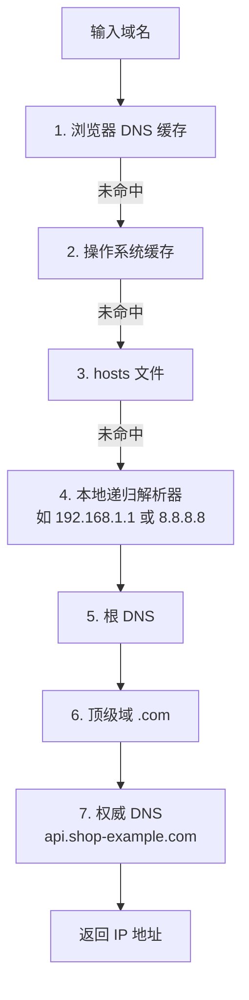
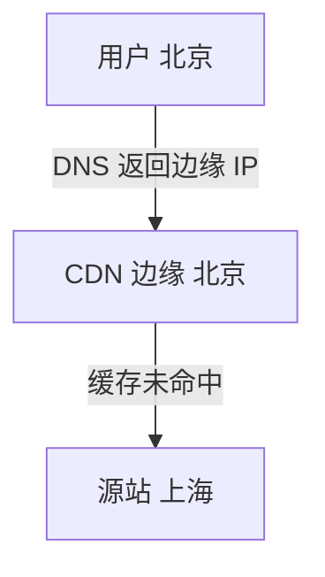
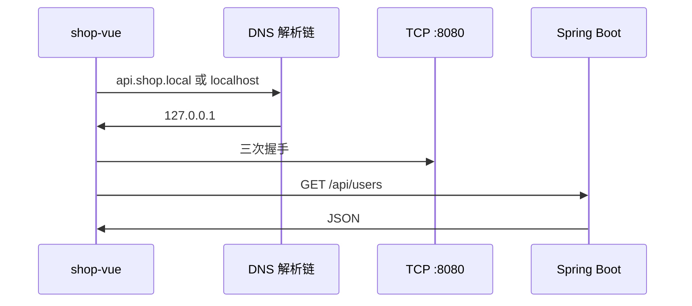
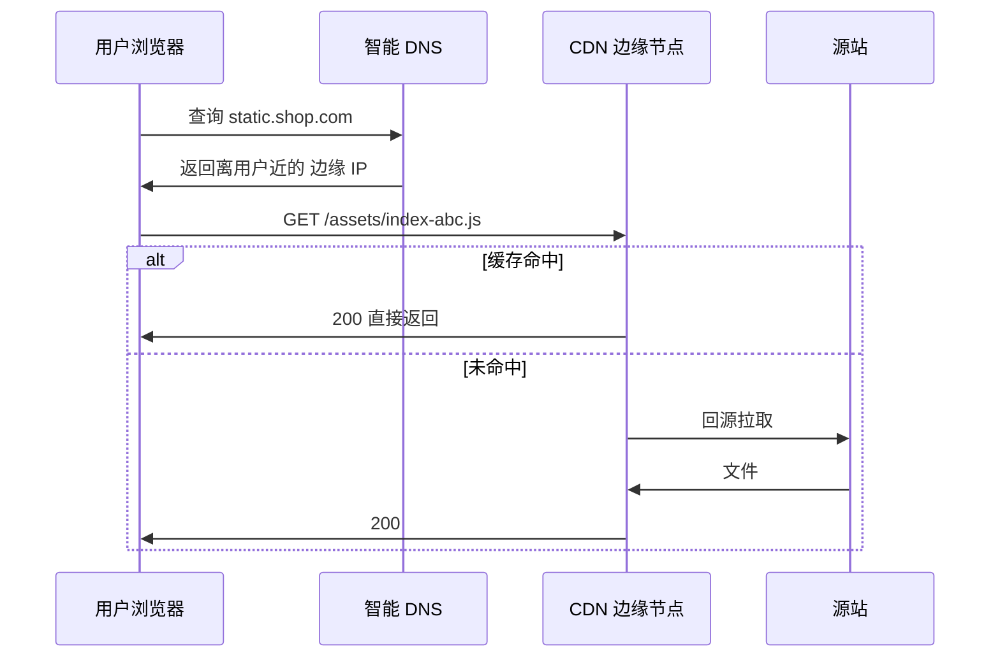
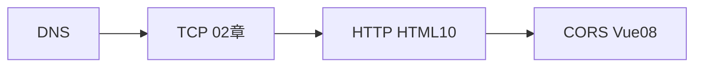

# IP 地址与 DNS 解析

> **文件编码**：UTF-8。本章假设你已完成 [01 网络分层与通信基础](./01-网络分层与通信基础.md) 与 [02 TCP 与 UDP](./02-TCP与UDP.md)，理解 IP 负责「主机到主机」、TCP 负责「进程到进程」。建议配合 [HTML 10 浏览器 HTTP 网络与 Web 基础](../HTML%20CSS%20JS/10-浏览器HTTP网络与Web基础.md) 与 [Vue 08 Axios 网络请求与前后端联调](../Vue/08-Axios网络请求与前后端联调.md) 联调实践。

---

## 本章与上一章的关系

[02 章](./02-TCP与UDP.md) 你学了：三次握手、端口号、Socket、`localhost:8080` 上的 TCP 连接。建立 TCP 之前，浏览器必须先知道**目的主机的 IP 地址**——这一步靠 **DNS（域名系统）** 和本章的 **IP 寻址** 知识。

[HTML 10 §30](../HTML%20CSS%20JS/10-浏览器HTTP网络与Web基础.md) 流程第 2 步是「DNS 解析：域名 → IP」；本章把这一步**拆开讲透**，并补上公网/私网、NAT、hosts、CDN 等前端天天碰到的概念。

若你在 [Vue 08](../Vue/08-Axios网络请求与前后端联调.md) 里把 `baseURL` 写成 `http://api.example.com`，本章会帮你判断：是 **DNS 失败**、**IP 不可达** 还是 **CORS**（TCP 可能已成功）。

本章掌握：

1. **IPv4** 地址格式与 dotted decimal
2. **子网掩码**（判断同网段）
3. **公网 IP** vs **私网 IP**
4. **NAT** 与家用路由器
5. **localhost / 127.0.0.1**
6. **DNS** 是什么、为什么需要
7. **DNS 解析链**：浏览器缓存 → OS → 递归 → 根 → TLD → 权威
8. 记录类型 **A / AAAA / CNAME**
9. **hosts 文件**手把手修改
10. **CDN** 概念
11. Windows 下 **ping / tracert / nslookup** 与预期输出

---

## 1. 为什么前端必须懂 IP 与 DNS？

| 你遇到的现象 | 可能根因 |
|--------------|----------|
| `net::ERR_NAME_NOT_RESOLVED` | **DNS** 解析失败 |
| `ping api.xxx.com` 不通但浏览器能开 | ICMP 被禁，不等于 HTTP 不通 |
| 线上能访问、本地 `localhost` 不行 | 混淆 **回环** 与 **公网域名** |
| 改了 hosts 仍不生效 | 浏览器 **DNS 缓存** 或 HTTPS **证书域名** 不匹配 |
| 接口慢 | DNS 慢、CDN 未命中、绕地球路由 |
| [Vue 08](../Vue/08-Axios网络请求与前后端联调.md) CORS 报错 | 常是**源（协议+域名+端口）**问题，但先要确认域名能解析 |


---

## 2. IPv4 地址格式

### 2.1 点分十进制（Dotted Decimal）

IPv4 地址由 **32 位** 组成，常写成 **4 段十进制**，每段 0～255，用点分隔：

```text
192.168.1.100
│   │   │  └── 主机部分（在子网内）
│   │   └───── 子网
│   └───────── 子网
└───────────── 网络
```

**示例**：

| 地址 | 说明 |
|------|------|
| `8.8.8.8` | Google 公共 DNS 之一 |
| `114.114.114.114` | 国内常用公共 DNS |
| `192.168.0.1` | 常见家用路由器**私网**地址 |
| `127.0.0.1` | 本机回环（见 §6） |

### 2.2 特殊地址（前端常碰）

| 地址/范围 | 含义 |
|-----------|------|
| `0.0.0.0` | 「所有接口」；服务器 `LISTEN` 时常用 |
| `127.0.0.0/8` | 回环网段，整段指向本机 |
| `255.255.255.255` | 有限广播（了解） |
| `224.0.0.0/4` | 组播（了解） |

### 2.3 IPv6 简提

IPv6 用 **128 位**，写成 8 组十六进制，如 `2001:4860:4860::8888`。浏览器访问双栈站点时，DNS 可能返回 **A 记录（IPv4）** 和 **AAAA 记录（IPv6）**。本章实操以 **IPv4 + Windows** 为主。

---

## 3. 子网掩码（简要）

子网掩码与 IP **按位与**，得到**网络号**，其余是**主机号**。

常见掩码：

| 掩码 | CIDR | 可用主机数（约） |
|------|------|------------------|
| `255.255.255.0` | /24 | 254 |
| `255.255.0.0` | /16 | 65534 |
| `255.0.0.0` | /8 | 很多 |

**例子**：`192.168.1.100` 掩码 `255.255.255.0`

- 网络号：`192.168.1.0`
- 同网段：`192.168.1.1`～`192.168.1.254`

**前端用途**：判断你的电脑与 `192.168.1.x` 路由器是否同网段；公司内网 API `10.0.5.20` 能否直连。公网部署一般交给运维，但**懂 /24** 有助于读云控制台 VPC 文档。

```powershell
ipconfig
```

**预期片段**：

```text
无线局域网适配器 WLAN:
   IPv4 地址 . . . . . . . . . . . . : 192.168.1.105
   子网掩码  . . . . . . . . . . . . : 255.255.255.0
   默认网关. . . . . . . . . . . . . : 192.168.1.1
```

---

## 4. 公网 IP 与私网 IP

### 4.1 公网 IP（Public）

全球路由表中唯一，互联网上可直接访问（若防火墙允许）。

### 4.2 私网 IP（Private，RFC 1918）

仅在局域网内有效，**不能**在公网路由：

| 范围 | CIDR |
|------|------|
| `10.0.0.0` ～ `10.255.255.255` | 10.0.0.0/8 |
| `172.16.0.0` ～ `172.31.255.255` | 172.16.0.0/12 |
| `192.168.0.0` ～ `192.168.255.255` | 192.168.0.0/16 |

你家电脑 `192.168.1.105`、路由器 `192.168.1.1` 都是私网地址；对外的网站服务器则是公网 IP（或通过 CDN 边缘的公网 IP）。

### 4.3 为什么需要私网 IP？

IPv4 地址不够用；整个家庭/公司共用一个**公网 IP** 出门，内网用私网 IP 区分设备——靠 **NAT**（下一节）。

**误区**：「我在浏览器访问 `192.168.x.x` 就是公网」——错，那是**内网**地址，外网用户无法直接访问你家路由器里的 NAS，除非做端口映射或内网穿透。

---

## 5. NAT（网络地址转换）

NAT 多在家用**路由器**或公司**网关**上：把内网私网 IP + 端口 映射成 公网 IP + 端口，让多台设备共享一个公网 IP 上网。


**出站**：你访问 `https://www.baidu.com`，路由器把源地址从 `192.168.1.105:52134` 改成 `203.0.113.50:随机端口`，记住映射表，回程再改回来。

**入站**：外网主动连你家的 `192.168.1.105` **默认不行**（没有公网入口），除非：

- 路由器**端口转发**（把公网 8080 转到内网某机器）
- 云服务器有**公网 IP + 安全组**

**与前端联调**：

- `localhost:8080`：**不经过 NAT**（本机回环）
- 手机连电脑 API「同一 WiFi 下用 `192.168.1.105:8080`」：走局域网，**不 NAT 出公网**
- 部署到云：**公网 IP / 域名 + DNS** 指向服务器

---

## 6. localhost 与 127.0.0.1

| 名称 | 含义 |
|------|------|
| `127.0.0.1` | IPv4 回环地址，包不出本机网卡 |
| `localhost` | 主机名，通常解析为 `::1`（IPv6）或 `127.0.0.1`（IPv4） |
| `0.0.0.0`（服务器 bind） | 监听本机**所有网卡**上的端口 |

[02 章](./02-TCP与UDP.md) shop 联调：`http://localhost:8080` → DNS/hosts 解析到 `127.0.0.1` → TCP 连本机 8080 进程。

```powershell
ping localhost
```

**预期**：

```text
正在 Ping DESKTOP-XXX [::1] 具有 32 字节的数据:
来自 ::1 的回复: 时间<1ms
```

或 IPv4：

```text
正在 Ping 127.0.0.1 具有 32 字节的数据:
来自 127.0.0.1 的回复: 字节=32 时间<1ms TTL=128
```

**注意**：`ping localhost` 成功只说明**本机协议栈正常**，不代表 8080 上的 Spring Boot 已启动——还要 [02 章](./02-TCP与UDP.md) 的 `Test-NetConnection -Port 8080`。

---

## 7. DNS 是什么？为什么需要？

### 7.1 是什么

**DNS（Domain Name System，域名系统）**：把人类可读的**域名**（如 `www.baidu.com`）翻译成 **IP 地址**的分布式数据库与查询协议。

### 7.2 为什么不用 IP 直接访问？

| 用域名 | 用 IP |
|--------|-------|
| 好记、可品牌 | `14.215.177.39` 难记 |
| 服务器换 IP，改 DNS 即可 | 换 IP 要通知所有用户 |
| 负载均衡、CDN 可多 A 记录 | 单 IP 难扩展 |
| HTTPS 证书常绑定域名 | IP 证书少见 |

浏览器地址栏、Axios `baseURL`、`` 都要先 **DNS 解析**（或命中缓存）。

---

## 8. DNS 解析完整链路

以 Chrome 访问 `https://api.shop-example.com/users` 为例（虚构域名）：



### 8.1 浏览器 DNS 缓存

Chrome 会缓存近期解析结果（有 TTL）。开发时「刚改 DNS 不生效」可先 **硬刷新** 或 `chrome://net-internals/#dns` → Clear host cache（了解即可）。

### 8.2 操作系统缓存

Windows **DNS Client** 服务缓存。可用：

```powershell
ipconfig /displaydns | more
```

查看当前缓存条目（输出较长）。

### 8.3 hosts 文件

见 §11，**优先级高于**递归 DNS（对指定域名）。

### 8.4 递归解析器（Recursive Resolver）

通常是你路由器或运营商指定的 DNS，如 `192.168.1.1`、`114.114.114.114`、`8.8.8.8`。它替你**迭代查询**根 → TLD → 权威，直到拿到答案，再缓存。

### 8.5 根 DNS

全球 13 组根服务器逻辑实例（`.`），返回「`.com` 去问谁」。

### 8.6 顶级域 DNS（TLD）

管理 `.com`、`.cn`、`.org` 等，返回「`shop-example.com` 的权威服务器是谁」。

### 8.7 权威 DNS（Authoritative）

域名注册商或云 DNS（阿里云、Cloudflare）托管，存有 **A / AAAA / CNAME** 等记录，返回最终 IP 或别名。

**与 [HTML 10 §35 Timing](../HTML%20CSS%20JS/10-浏览器HTTP网络与Web基础.md)**：Network 面板 **DNS Lookup** 耗时即上述链路的缓存命中或查询时间。

---

## 9. DNS 记录类型：A / AAAA / CNAME

| 类型 | 含义 | 示例 |
|------|------|------|
| **A** | 域名 → **IPv4** | `api.example.com` → `93.184.216.34` |
| **AAAA** | 域名 → **IPv6** | `api.example.com` → `2606:2800:220:1:248:1893:25c8:1946` |
| **CNAME** | 域名 → **另一个域名**（别名） | `www.example.com` → `example.com` |
| NS | 指定权威 DNS 服务器 | 委托子域 |
| MX | 邮件服务器 | 前端较少直接配 |
| TXT | 文本（验证、SPF） | 域名所有权验证 |

### 9.1 CNAME 注意点

- CNAME 记录本身**不能**与同一名字的 A 记录共存（通常）
- 解析 `www` CNAME 到 `cdn.vendor.com` 时，最终还要再解析 CDN 的 A 记录
- **根域名** `@` 很多厂商不允许 CNAME（DNS 规范限制），用 **ALIAS/ANAME** 或 A 记录

### 9.2 前端场景

| 配置 | 记录 |
|------|------|
| 生产 API `api.shop.com` | A 或 CNAME 到云 LB |
| 静态资源 CDN | CNAME 到 `xxx.cdn.com` |
| 双栈 | 同时配 A + AAAA |

---

## 10. CDN 概念

**CDN（Content Delivery Network，内容分发网络）**：把静态资源（JS/CSS/图片/视频）缓存到**离用户近的边缘节点**，用户解析域名时 DNS 返回**就近节点 IP**，减少延迟、减轻源站压力。



**与 DNS 关系**：

- `static.shop.com` CNAME 到 CDN 厂商域名
- CDN 的 **智能 DNS** 按地理位置返回不同 A 记录

**前端实践**：

- [Vue 10 Vite 构建与部署](../Vue/10-Vite构建与项目部署.md) 打包后的 `assets/` 常放 CDN
- 开发环境 `localhost:5173` **不走 CDN**
- 缓存更新靠 **文件名 hash**（`index-a1b2c3.js`），不靠「清 CDN」 alone

---

## 11. 手把手：修改 Windows hosts 文件

hosts 用于**本地强制**域名 → IP 映射，绕过公网 DNS。常用于：本地伪域名联调、屏蔽站点、测试前预览。

### 11.1 文件位置

```text
C:\Windows\System32\drivers\etc\hosts
```

### 11.2 编辑步骤（需管理员）

1. 以管理员身份打开 **记事本** 或 Cursor
2. 打开上述 `hosts` 文件（无扩展名）
3. 在末尾添加一行（示例：把虚构 API 指到本机）：

```text
127.0.0.1   api.shop.local
```

4. 保存
5. 刷新 DNS 缓存：

```powershell
ipconfig /flushdns
```

### 11.3 与 shop 联调结合

在 `shop-vue` 中可临时设：

```javascript
// .env.development（示例）
VITE_API_BASE_URL=http://api.shop.local:8080
```

确保 hosts 指向 `127.0.0.1`，后端仍监听 `8080`。

### 11.4 验证

```powershell
ping api.shop.local
```

**预期**：

```text
正在 Ping api.shop.local [127.0.0.1] 具有 32 字节的数据:
来自 127.0.0.1 的回复: ...
```

```powershell
nslookup api.shop.local
```

**预期**：

```text
服务器:  ...
Address:  ...

名称:    api.shop.local
Address:  127.0.0.1
```

### 11.5 恢复

删除 hosts 中对应行 → `ipconfig /flushdns`。

**注意**：HTTPS 若证书域名是 `api.shop.com`，你用 `api.shop.local` 会**证书不匹配**——开发 HTTP 或配本地 mkcert。

---

## 12. Windows 命令实操：ping

```powershell
ping www.baidu.com
```

**预期（成功）**：

```text
正在 Ping www.baidu.com [14.215.177.39] 具有 32 字节的数据:
来自 14.215.177.39 的回复: 字节=32 时间=15ms TTL=52
来自 14.215.177.39 的回复: 字节=32 时间=14ms TTL=52
...

14.215.177.39 的 Ping 统计信息:
    数据包: 已发送 = 4，已接收 = 4，丢失 = 0 (0% 丢失)，
往返行程的估计时间(以毫秒为单位):
    最短 = 14ms，最长 = 18ms，平均 = 15ms
```

**解读**：

- 第一行证明 **DNS 已解析** 出 IP
- `时间=15ms` 是 ICMP 往返延迟（≠ HTTP 接口耗时）
- `丢失 = 0` 网络基本可达

**限制**：许多公网服务器**禁 ping**，`请求超时` 不代表网站打不开——再用浏览器或 `curl` 验证 HTTP。

```powershell
ping -n 2 127.0.0.1
ping -n 2 192.168.1.1
```

分别测本机与网关。

---

## 13. Windows 命令实操：tracert（路由跟踪）

Windows 上对应 Linux `traceroute` 的命令是 **`tracert`**。

```powershell
tracert www.baidu.com
```

**预期（示意，跳数因网络而异）**：

```text
通过最多 30 个跃点跟踪到 www.baidu.com [14.215.177.39] 的路由:

  1     1 ms     1 ms     1 ms  192.168.1.1
  2     5 ms     4 ms     6 ms  10.x.x.x
  3    *        *        *     请求超时。
  4    12 ms    11 ms    13 ms  ...
  ...
  N    14 ms    15 ms    14 ms  14.215.177.39

跟踪完成。
```

**解读**：

- 每一行是一跳路由器；`*` 表示该跳不响应 ICMP（常见，不代表断）
- 用于判断**卡在第几跳**、是否绕远路
- 前端排「国外 API 慢」时可看是否国际出口延迟高

---

## 14. Windows 命令实操：nslookup

```powershell
nslookup www.baidu.com
```

**预期**：

```text
服务器:  UnKnown
Address:  192.168.1.1

非权威应答:
名称:    www.baidu.com
Addresses:  14.215.177.39
          2400:da00:200::1
```

**指定公共 DNS 查询**（绕过路由器缓存）：

```powershell
nslookup www.baidu.com 8.8.8.8
```

**查 CNAME 链**：

```powershell
nslookup -type=CNAME www.github.com 8.8.8.8
```

**查 MX（了解）**：

```powershell
nslookup -type=MX gmail.com
```

**与 Axios 报错**：

- `nslookup` 失败 → 浏览器极可能 `ERR_NAME_NOT_RESOLVED`
- `nslookup` 成功但接口失败 → 转 [02 章 TCP](./02-TCP与UDP.md) 或 [Vue 08 CORS 表](../Vue/08-Axios网络请求与前后端联调.md)

---

## 15. 从域名到 shop API 的完整路径（串讲）



对照 [HTML 10 §30](../HTML%20CSS%20JS/10-浏览器HTTP网络与Web基础.md) 与 [02 章 shop 全链路](./02-TCP与UDP.md)，DNS 是**第一步**。

---

## 16. 浏览器 Network 面板中的 DNS

打开 [HTML 10 §35](../HTML%20CSS%20JS/10-浏览器HTTP网络与Web基础.md) 所述 Network → 选任一请求 → **Timing**：

| 阶段 | 含义 |
|------|------|
| Queueing | 排队 |
| **DNS Lookup** | 本章解析链（或缓存命中，时间极短） |
| Initial connection | TCP（+ TLS） |
| SSL | 仅 HTTPS |
| Waiting (TTFB) | 服务器处理 |
| Content Download | 下载 body |

**DNS 0 ms** 多为缓存命中，不代表没做 DNS。

---

## 17. 常见误区与错误对照表

| 误区 / 报错 | 真相 | 正确做法 |
|-------------|------|----------|
| `ERR_NAME_NOT_RESOLVED` = 后端挂了 | 是 **DNS 层**失败，TCP 未开始 | `nslookup` 域名；查 hosts、网络 DNS 设置 |
| ping 不通 = 网站挂了 | 很多服务器**禁 ICMP** | 用 `curl -I https://域名` 测 HTTP |
| 改了 hosts 立即全局生效 | 浏览器可能有自己的缓存 | `ipconfig /flushdns` + 清浏览器 DNS 缓存 |
| `localhost` 与 `127.0.0.1` 永远等价 | 可能 IPv6 先解析到 `::1` | 联调问题时两个都试；[02 章](./02-TCP与UDP.md) 看端口 |
| 私网 IP 能在公网直接访问 | NAT 默认阻挡入站 | 部署用公网 IP/域名；内网用手机局域网 IP |
| CNAME 指向 IP 字符串 | CNAME 只能指向**域名** | 用 A 记录写 IP |
| DNS 只返回一个 IP | 可多 A 记录负载均衡 | `nslookup` 可能看到多个 Address |
| CDN 会加速动态 API | CDN 擅长大文件/静态；动态 API 要甄别 | 静态资源上 CDN；API 走源站或专用加速 |
| `8.8.8.8` 是网站 IP | 那是 **Google DNS 服务器** | 区分「被查询的域名」与「查询用的 DNS」 |
| 子网掩码随便写 | 决定同网段通信 | 看 `ipconfig` 默认即可 |
| `ipconfig /flushdns` 清浏览器缓存 | 主要清 **OS** 缓存 | 浏览器用 net-internals 或重启 |
| traceroute 超时 = 断网 | 中间路由器常不回应 | 看最终能否到达目标 IP |
| [Vue 08](../Vue/08-Axios网络请求与前后端联调.md) CORS 是 DNS 问题 | CORS 是浏览器安全策略，DNS 成功后仍可能 CORS | Console 读 `blocked by CORS policy`；配代理或 CorsConfig |
| HTTPS 证书错误是 DNS 错 | 可能是 DNS 指到**错误服务器** IP | 核对 A 记录与证书 SAN 域名 |

---

## 18. 深入：为什么 DNS 用分层递归而不是一台大服务器？

1. **扩展性**：全球数十亿域名，单机无法承载。
2. **缓存**：递归解析器、OS、浏览器层层缓存，减轻权威压力。
3. **权责清晰**：注册局管 TLD，域名主管权威记录，互不影响。
4. **容错**：根、TLD 多实例 Anycast，局部故障不拖垮全网。

类比：问「北京市朝阳区某小区门牌」——你不会直接问联合国，而是逐级问省 → 市 → 区 → 物业（**递归**由「快递员」代你问）。

---

## 19. 深入：为什么开发常用 localhost 而不是 127.0.0.1？

| localhost | 127.0.0.1 |
|-----------|-----------|
|  hostname，可走 hosts 改指向 | 字面 IP，不受 hosts 中 `localhost` 行以外影响 |
| 可能解析到 IPv6 `::1` | 纯 IPv4 |
| 与文档、口语一致 | 抓包、防火墙规则时更明确 |

[Vue 08](../Vue/08-Axios网络请求与前后端联调.md) 示例多用 `localhost:8080`，与 `127.0.0.1:8080` 在**本机联调**通常等价；若仅绑定 IPv4 的服务器监听 `127.0.0.1`，用 `localhost` 解析到 `::1` 可能踩坑——此时统一写 `127.0.0.1`。

---

## 20. 与跨域（CORS）和 DNS 的区分

[HTML 10 §20](../HTML%20CSS%20JS/10-浏览器HTTP网络与Web基础.md)：**同源**要求协议、域名、端口一致。

| 错误关键词 | 层级 | 工具 |
|------------|------|------|
| `ERR_NAME_NOT_RESOLVED` | DNS | `nslookup` |
| `ERR_CONNECTION_REFUSED` | TCP | `Test-NetConnection`、[02 章](./02-TCP与UDP.md) |
| `CORS policy` / `No Access-Control-Allow-Origin` | 应用层/浏览器 | [Vue 08 §16](../Vue/08-Axios网络请求与前后端联调.md)、Vite proxy |
| `NET::ERR_CERT_*` | TLS/证书 | 域名与证书是否匹配 |

**记忆**：DNS 解决「找不找得到门」；TCP 解决「敲不敲得开门」；CORS 解决「浏览器让不让你进」。

---

## 21. 云控制台中的 DNS 实操预览（了解）

上线 shop 时典型步骤：

1. 购买域名 `shop-example.com`
2. 在阿里云/腾讯云 DNS 添加记录：
   - `@` 或 `www` → A → 服务器公网 IP（或 CNAME 到 CDN）
   - `api` → A → API 服务器 IP
3. 等待 TTL 传播（几分钟到 48 小时）
4. `nslookup api.shop-example.com` 验证

与本地 hosts **对比**：hosts 只影响**本机**；公网 DNS 影响**所有用户**。

---

## 22. DNS TTL 与缓存行为

每条 DNS 记录有 **TTL（Time To Live，生存时间）**，单位秒，表示递归解析器可把答案缓存多久。

| TTL | 含义 |
|-----|------|
| 300 | 5 分钟内重复查询用缓存 |
| 3600 | 1 小时 |
| 86400 | 1 天 |

**运维改 IP 后**，旧 TTL 未过期时，部分用户仍访问旧 IP——前端表现为「我这边好了同事还不行」。

```powershell
nslookup -type=A www.baidu.com
# 部分环境会显示 TTL；也可用在线 DNS 工具查看权威 TTL
```

**开发启示**：上线切流量前提前**调低 TTL**；本地 hosts 无 TTL，改完 `flushdns` 即生效（浏览器缓存另说）。

---

## 23. 手把手：`ipconfig /all` 读懂 DNS 服务器

```powershell
ipconfig /all
```

**预期片段**：

```text
   主机名  . . . . . . . . . . . . . : DESKTOP-XXXX
   DNS 服务器  . . . . . . . . . . . : 192.168.1.1
                                       114.114.114.114
   IPv4 地址 . . . . . . . . . . . . : 192.168.1.105(首选)
   子网掩码  . . . . . . . . . . . . : 255.255.255.0
   默认网关. . . . . . . . . . . . . : 192.168.1.1
```

**解读**：

- **DNS 服务器**第一行通常是路由器（`192.168.1.1`），路由器再转发到运营商或你手动配的 `114.114.114.114`
- `nslookup` 显示的 `服务器: 192.168.1.1` 即此递归解析器
- 若 DNS 填错，**所有域名**都可能 `ERR_NAME_NOT_RESOLVED`

**修改 DNS（了解）**：设置 → 网络和 Internet → WLAN → 编辑 DNS（开发排查可临时改为 `8.8.8.8` 测试）。

---

## 24. 子网计算手把手（一个例子）

**题目**：IP `192.168.10.50`，掩码 `255.255.255.0`，网关 `192.168.10.1`，API 在 `192.168.10.200`，电脑能直连吗？

**步骤**：

1. 掩码 /24 → 前 24 位是网络号 → 网络 `192.168.10.0`
2. `50` 与 `200` 都在 `192.168.10.1`～`254` → **同网段**
3. 无需经路由器转发，二层/三层直连可达（防火墙另论）

**反例**：电脑 `192.168.1.105`，API `192.168.10.200`，掩码均为 `/24` → **不同网段**，必须经过网关，网关无路由则 ping 不通。

公司内网前端连测试环境 API 时，常因**不在同一 VLAN** 踩坑——问运维要正确 VPN 或 hosts 内网 IP。

---

## 25. CDN 与 DNS 手拉手（扩展）



**前端配置**（[Vue 10](../Vue/10-Vite构建与项目部署.md) 部署时）：

```javascript
// vite.config.js 生产 base 示例
export default defineConfig({
  base: process.env.NODE_ENV === 'production'
    ? 'https://static.shop-example.com/'
    : '/',
})
```

开发 `base: '/'` 走 Vite；生产静态资源域名走 CDN，**HTML 仍可能在主域**，因此会有**跨域加载 JS**（CDN 需配 CORS 或同资源域名策略）。

---

## 26. DNS 记录实战对照表（shop 虚构）

| 主机记录 | 类型 | 值 | 用途 |
|----------|------|-----|------|
| `@` | A | `203.0.113.10` | 主站 |
| `www` | CNAME | `shop-example.com` | www 别名 |
| `api` | A | `203.0.113.20` | REST API |
| `static` | CNAME | `xxx.cdn.provider.com` | 静态资源 CDN |
| `@` | AAAA | `2001:db8::1` | IPv6 双栈（可选） |

```powershell
nslookup api.shop-example.com
nslookup static.shop-example.com
```

第二条若返回 CNAME，可能继续显示 CDN 厂商域名再解析到 A 记录。

---

## 27. 手把手：模拟 DNS 失败与恢复

### 27.1 故意写错 hosts

在 `hosts` 添加：

```text
0.0.0.0   www.baidu.com
```

`ipconfig /flushdns` 后浏览器访问 `https://www.baidu.com` 应失败（指向无效 IP）。

**Axios 若请求该域**：timeout 或 connection error，**不是 CORS**。

### 27.2 恢复

删除该行 → `flushdns` → 再 `nslookup www.baidu.com` 确认恢复公网 IP。

---

## 28. `ping` 参数与 `tracert` 进阶

```powershell
ping -n 10 -l 1000 www.baidu.com
```

| 参数 | 含义 |
|------|------|
| `-n 10` | 发 10 个包 |
| `-l 1000` | 每包 1000 字节 |
| `-t` | 持续 ping（Ctrl+C 停） |
| `-6` | 强制 IPv6 |

```powershell
tracert -d www.baidu.com
```

`-d` 不解析中间跳主机名，只显示 IP，略快。

**丢包率解读**：`丢失 25%` 说明网络不稳定，接口可能偶发超时——与 [02 章 TCP 重传](./02-TCP与UDP.md) 联动。

---

## 29. `nslookup` 交互模式

```powershell
nslookup
> server 8.8.8.8
> set type=A
> www.baidu.com
> set type=CNAME
> www.github.com
> exit
```

适合连续查多条记录，不必每次敲一行命令。

---

## 30. 双栈：IPv4 与 IPv6 优先级

Windows 可能优先用 **IPv6** 访问 `localhost`（`::1`）。若后端只监听 `127.0.0.1:8080` 而未监听 `::1`，可能出现：

- `http://127.0.0.1:8080` ✅
- `http://localhost:8080` ❌ 或偶发失败

**解决**：统一 URL；或让 Spring Boot 监听 `0.0.0.0`；或禁用错误 IPv6 解析（一般不推荐）。

```powershell
ping -4 localhost
ping -6 localhost
```

---

## 31. 完整排障剧本（shop 联调）

| 步骤 | 命令 / 操作 | 预期 |
|------|-------------|------|
| 1 | `nslookup localhost` | 127.0.0.1 或 ::1 |
| 2 | `Test-NetConnection localhost -Port 8080` | TcpTestSucceeded : True |
| 3 | `curl http://localhost:8080/api/users` | JSON code:0 |
| 4 | 浏览器 Network 看请求 URL | 与 Vite proxy 一致 |
| 5 | 若失败看 Console | CORS 字样 → [Vue 08](../Vue/08-Axios网络请求与前后端联调.md) |



---

## 32. DoH / DoT（了解）

**DNS over HTTPS（DoH）**：DNS 查询走 HTTPS，防劫持、隐私更好。Chrome 设置里可开「使用安全 DNS」。

对开发者：**系统 `nslookup` 结果**与**浏览器 DoH 结果**偶尔不一致——排查时应用**同一环境**（浏览器用 DevTools，CLI 用系统解析器）。

---

## 33. 本章知识点清单

- [ ] 能写出 IPv4 四段格式与三类私网范围
- [ ] 能读 `ipconfig` 中的 IP、掩码、网关
- [ ] 能解释 NAT 与私网 IP 的关系
- [ ] 能画出 DNS 解析链 7 步
- [ ] 能区分 A / AAAA / CNAME
- [ ] 会改 hosts 并 `flushdns`
- [ ] 会用 `ping` / `tracert` / `nslookup` 并读输出
- [ ] 能区分 DNS 失败、TCP 失败、CORS 失败

---

## 34. 分级练习

### 基础

1. 运行 `ipconfig`，记录本机 IPv4、子网掩码、默认网关。
2. `ping localhost` 与 `ping 127.0.0.1` 对比结果。
3. `nslookup www.baidu.com` 记录返回的 IP。

### 进阶

4. 在 hosts 添加 `127.0.0.1 test.shop.local`，`ping` 与 `nslookup` 验证后删除并 `flushdns`。
5. 对同一域名分别用默认 DNS 与 `nslookup www.baidu.com 8.8.8.8`，对比结果是否一致。

### 挑战

6. 打开 Chrome Network，找一条请求的 DNS Lookup 耗时；说明 0 ms 是否一定没查 DNS。
7. 画一张图：手机通过家里 WiFi 访问公网 API，经过 NAT 的路径（私网 IP → 路由器 → 公网）。

### 34.1 参考答案（基础）

**ipconfig 示例**：`192.168.1.105 / 255.255.255.0 / 网关 192.168.1.1`。

**ping**：两者均应 `<1ms` 回复；`localhost` 可能显示 `[::1]`。

**nslookup**：应看到至少一条 IPv4 如 `14.215.177.39`（以实际为准）。

### 34.2 参考答案（进阶）

**hosts**：`ping test.shop.local` 应显示 `127.0.0.1`；删除行后 `flushdns`，再 ping 应解析失败或不再指向 127.0.0.1。

**8.8.8.8**：多数情况 IP 相同；若运营商有** DNS 劫持/分流**，可能不同——这正是指定 `8.8.8.8` 对比的意义。

### 34.3 参考答案（挑战）

**DNS 0 ms**：通常是**浏览器或 OS 缓存命中**，仍属 DNS 阶段，只是未发网络查询。

**NAT 路径**：手机 `192.168.1.x` → 路由器 NAT 为公网 IP → 互联网 → API 服务器公网 IP；DNS 在发 TCP 前把 `api.xxx.com` 解析为服务器 IP。

---

## 35. FAQ

**Q：`114.114.114.114` 和 `8.8.8.8` 是什么？**  
公共**递归 DNS** 地址，不是你的网站 IP。

**Q：开发必须用 hosts 吗？**  
不必须；`localhost` + Vite proxy 更简单。hosts 适合模拟多域名、测 Cookie domain。

**Q：和 [Git 04 远程仓库](../Git/04-远程仓库与PullRequest协作.md) 有关系吗？**  
`git clone github.com` 也要 DNS 解析；`Failed to resolve address` 是 DNS 问题。

**Q：前端要配 A 记录吗？**  
开发很少；部署、绑自定义域名、排查线上解析时要会与运维沟通。

---

## 36. 学完标准

1. **不看文档**说出 DNS 解析链至少 5 环（浏览器 → OS → hosts → 递归 → …）
2. 能独立修改 hosts 并完成 `ping` / `nslookup` 验证与恢复
3. 能区分 **A** 与 **CNAME**，并说明 API 域名通常用哪种
4. 读到 `ERR_NAME_NOT_RESOLVED` 时，第一反应是 `nslookup`，不是改 CORS
5. 能结合 [HTML 10 Timing](../HTML%20CSS%20JS/10-浏览器HTTP网络与Web基础.md) 指出 DNS Lookup 阶段
6. 完成分级练习**基础 + 进阶**各至少一题

**量化自检**：

- [ ] 默写三段私网 IP 范围
- [ ] 误区表至少 3 条能用自己的话解释
- [ ] 能口述 NAT 出站过程（30 秒）

---

## 37. 下一章预告

03 章你掌握了 **IP 寻址** 与 **DNS 把域名变成 IP**。真实互联网还有：HTTP 报文长什么样、状态码与头、缓存、HTTPS 证书、Cookie 与 Session——这些在 [HTML 10](../HTML%20CSS%20JS/10-浏览器HTTP网络与Web基础.md) 已有入门，计算机网络系列后续可扩写 **04 HTTP 深入**、**05 HTTPS 与 TLS**、**06 浏览器安全与性能**。

建议下一步：带着本章命令重走一遍 [Vue 08](../Vue/08-Axios网络请求与前后端联调.md) 联调清单——先 `nslookup` / `ping`，再 `Test-NetConnection`，最后看 Network 与 CORS。

---

*上一章：[02 TCP 与 UDP](./02-TCP与UDP.md) · 系列起点：[01 网络分层与通信基础](./01-网络分层与通信基础.md) · 关联：[HTML 10 浏览器 HTTP](../HTML%20CSS%20JS/10-浏览器HTTP网络与Web基础.md) · [Vue 08 Axios 联调](../Vue/08-Axios网络请求与前后端联调.md)*
