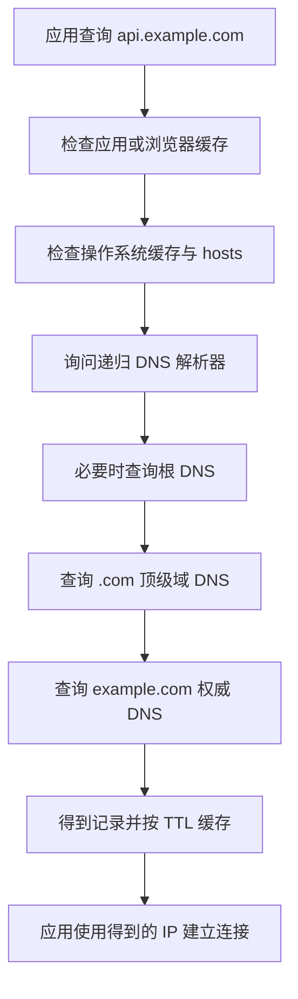

# IP 地址与 DNS 解析

> 本章目标：理解主机怎样被找到，域名怎样变成 IP，并能区分 DNS、路由和端口问题。
>
> 前置：[02 · TCP 与 UDP](./02-TCP与UDP.md)　下一章：[04 · HTTP 协议](./04-HTTP协议深入.md)

---

## 1. 先记住三个结论

1. **IP 地址用于网络中的主机寻址，DNS 把人类使用的域名解析成 IP。**
2. **请求顺序通常是 DNS → TCP → TLS → HTTP。** 前一步失败，后一步不会发生。
3. **127.0.0.1 只代表本机；私网 IP 只在私有网络内使用；公网访问通常还会经过 NAT、防火墙或负载均衡。**

---

## 2. IP 地址解决什么问题

假设你的数据要从宿舍电脑到一台云服务器。中间会经过多个网络和路由器。路由器需要根据目标地址决定下一跳，这个逻辑地址就是 IP 地址。

IPv4 地址有 32 位，常写成四段十进制：

```text
192.168.1.20
```

每段范围是 `0～255`，因为每段由 8 个二进制位表示。

### IP 地址不是设备永久身份证

设备换网络后，IP 往往变化：

- 在宿舍 Wi-Fi 可能是 `192.168.1.20`；
- 连接手机热点可能变成 `192.168.43.12`；
- 云服务器重建或未绑定弹性 IP 时，公网 IP 也可能变化。

MAC 更接近网络接口的链路层标识，但公网跨路由寻址依赖 IP，不依赖终端 MAC 一路传到底。

---

## 3. 网络号和主机号

IP 地址需要表达两件事：

- 属于哪个网络；
- 是这个网络中的哪台主机。

CIDR 写法：

```text
192.168.1.20/24
```

`/24` 表示前 24 位是网络部分，剩余 8 位是主机部分。

因此这个网段通常可写为：

```text
192.168.1.0/24
```

常见范围：

```text
网络地址：    192.168.1.0
常见主机：    192.168.1.1 ～ 192.168.1.254
广播地址：    192.168.1.255
```

第一次学习只需会看 `/24`，不必立刻做大量二进制子网题。

### 为什么需要子网

子网可以：

- 划分地址范围；
- 控制广播范围；
- 隔离不同环境或业务；
- 让路由表按网段聚合，而不是记录每台主机。

云环境中常见：

```text
VPC:          10.0.0.0/16
应用子网:      10.0.1.0/24
数据库子网:    10.0.2.0/24
```

---

## 4. 常见特殊地址

### 4.1 回环地址

```text
127.0.0.1
```

表示本机。数据不需要经过物理网卡到外部网络。

`localhost` 是主机名，通常解析到 `127.0.0.1` 或 IPv6 的 `::1`。

### 4.2 私网地址

IPv4 常见私网范围：

```text
10.0.0.0/8
172.16.0.0/12
192.168.0.0/16
```

私网地址不能作为全球互联网中的唯一地址直接路由。不同家庭都可以有一台 `192.168.1.10`，互不冲突。

### 4.3 公网地址

公网 IP 在互联网路由中使用。云服务器对外提供服务时，通常通过公网 IP、负载均衡或 CDN 暴露。

“服务器有公网 IP”也不等于端口一定能访问，还要看：

- 安全组；
- 操作系统防火墙；
- 服务监听地址；
- 端口映射；
- 上游负载均衡配置。

### 4.4 0.0.0.0

服务端监听 `0.0.0.0:8080` 表示监听所有 IPv4 网络接口。

客户端通常不要把 `0.0.0.0` 当成目标地址，应使用本机地址、局域网地址或实际域名。

### 4.5 IPv6

IPv6 地址有 128 位，例如：

```text
2001:db8::1
::1
```

`::1` 是 IPv6 回环地址。某些本地问题来自：`localhost` 优先解析到 `::1`，但程序只监听 IPv4，或反过来。

遇到问题时可以分别测试：

```powershell
curl.exe -4 -v http://localhost:8080/health
curl.exe -6 -v http://localhost:8080/health
```

---

## 5. 同网段和不同网段怎样通信

主机发送数据前，会根据本机 IP 和子网掩码判断目标是否在同一网段。

### 同一网段

例如：

```text
本机：192.168.1.20/24
目标：192.168.1.30/24
```

本机可以在局域网中找到目标的链路层地址，再直接发送给目标。

### 不同网段

例如：

```text
本机：192.168.1.20/24
目标：8.8.8.8
```

本机不会直接在局域网寻找 `8.8.8.8`，而是把数据交给默认网关，通常是家用路由器。路由器再根据路由表继续转发。

```text
电脑 → 默认网关 → 运营商网络 → 多个路由器 → 目标网络
```

路由器每次只需要决定“下一跳发给谁”，不需要提前知道整条路径的每一个设备。

---

## 6. NAT 为什么常见

家中多台设备通常使用私网 IP：

```text
电脑：  192.168.1.20
手机：  192.168.1.21
平板：  192.168.1.22
```

路由器对外可能只有一个公网 IP。NAT 会转换地址和端口，让多台内网设备共享公网出口。

例如：

```text
192.168.1.20:53142
      ↓ NAT 转换
203.0.113.8:62001
```

路由器保存映射，公网响应回来时再转回内网主机。

### 为什么外网不能随便访问你本机的 8080

你从内网主动访问公网时，NAT 会建立映射；但外部主动请求通常不知道该转给哪台内网设备，而且防火墙会阻止。

要对外暴露服务，可能需要：

- 路由器端口转发；
- 公网 IP；
- 云服务器；
- 内网穿透工具；
- 防火墙规则。

本地练习不建议直接把开发端口暴露到公网。

---

## 7. DNS 为什么存在

IP 地址可能变化，也不方便记忆。DNS 提供从域名到记录的分布式查询系统。

```text
api.example.com → 203.0.113.10
```

应用拿到 IP 后，才能继续建立 TCP 连接。

DNS 不负责：

- 检查 8080 是否监听；
- 建立 TCP 连接；
- 返回 HTTP 200；
- 判断用户是否有权限。

它主要负责“名字对应什么记录”。

---

## 8. DNS 查询完整过程

访问 `api.example.com` 时，简化流程如下：



### 8.1 本地缓存

浏览器、操作系统和某些应用可能缓存 DNS 结果，减少重复查询。

### 8.2 hosts 文件

Windows hosts 文件通常位于：

```text
C:\Windows\System32\drivers\etc\hosts
```

可以手动添加：

```text
127.0.0.1 api.local.test
```

之后：

```powershell
curl.exe -v http://api.local.test:8080/health
```

就可以把自定义域名指向本机。修改需要管理员权限，练习后记得删除。

### 8.3 递归解析器

你的电脑通常把查询交给运营商、路由器或公共 DNS。它替客户端完成后续查询，并缓存结果。

### 8.4 根、顶级域和权威 DNS

- 根 DNS 告诉解析器去哪里找 `.com`；
- `.com` 顶级域 DNS 告诉它去哪里找 `example.com`；
- `example.com` 权威 DNS 给出 `api.example.com` 的最终记录。

不是每次查询都完整走一遍，因为各层都有缓存。

---

## 9. 常见 DNS 记录

### A 记录

域名指向 IPv4：

```text
api.example.com → 203.0.113.10
```

### AAAA 记录

域名指向 IPv6。

### CNAME 记录

一个域名作为另一个域名的别名：

```text
www.example.com → example.cdn-provider.com
```

解析器还需要继续查询目标域名的 A 或 AAAA 记录。

### MX 记录

指定邮件服务器，与 Web API 访问不是一回事。

### TXT 记录

保存文本信息，常用于域名验证、邮件安全策略等。

### TTL

TTL 表示记录可以缓存多长时间。TTL 较长能减少 DNS 查询，但切换 IP 后旧结果可能持续更久；TTL 较短更新更快，但查询压力更大。

DNS TTL 到期也不代表世界上所有缓存会在同一毫秒刷新，实际系统可能还有各自的缓存策略。

---

## 10. 一个域名为什么可以对应多个 IP

DNS 可以返回多个地址，用于：

- 简单负载分散；
- 多机房部署；
- 就近访问；
- 故障切换；
- CDN 边缘节点选择。

反过来，一个 IP 也可以承载多个域名。HTTP 的 `Host` Header 和 TLS 的 SNI 能帮助服务器区分客户端想访问哪个域名。

所以：

```text
域名 ≠ 永久唯一 IP
IP   ≠ 只能对应一个网站
```

---

## 11. CDN 在哪里发挥作用

CDN 会在不同地区部署边缘节点。用户访问静态资源时，DNS 或调度系统把用户引导到较近节点。

```text
北京用户 → 北京附近 CDN 节点
广州用户 → 广州附近 CDN 节点
```

边缘节点有缓存时直接返回；没有时回源到源站。

CDN 常用于图片、CSS、JavaScript、视频下载等。动态 API 是否经过 CDN，要看具体设计，不能默认所有请求都被缓存。

---

## 12. Windows 上怎样观察

### 12.1 查看本机网络配置

```powershell
ipconfig /all
```

重点看当前正在使用的网卡：

- IPv4 Address；
- Subnet Mask；
- Default Gateway；
- DNS Servers。

### 12.2 查询 DNS

```powershell
nslookup www.baidu.com
```

你通常会看到：

- 当前使用的 DNS 服务器；
- 查询得到的 IPv4 或 IPv6 地址。

指定公共 DNS 查询：

```powershell
nslookup www.baidu.com 8.8.8.8
```

### 12.3 查看 PowerShell DNS 结果

```powershell
Resolve-DnsName www.baidu.com
```

这个命令会更结构化地显示记录类型和 TTL。

### 12.4 查看路由经过的节点

```powershell
tracert www.baidu.com
```

某些节点不回复探测包会显示 `*`，不一定表示真实业务流量完全中断。

### 12.5 清理本机 DNS 缓存

```powershell
ipconfig /flushdns
```

只影响本机部分缓存，不能清除递归解析器、浏览器或全球其他 DNS 缓存。

---

## 13. DNS、TCP、TLS、HTTP 错误怎样区分

### DNS 失败

```text
Could not resolve host
```

检查：

```powershell
nslookup api.example.com
Resolve-DnsName api.example.com
```

### TCP 失败

```text
Connection refused
Connection timed out
```

检查：

```powershell
Test-NetConnection api.example.com -Port 443
```

### TLS 失败

可能看到证书过期、域名不匹配、未知 CA、协议版本不兼容等错误。

这说明 DNS 和 TCP 往往已经进行到一定程度，失败发生在安全握手阶段。

### HTTP 失败

```text
HTTP/1.1 404 Not Found
HTTP/1.1 401 Unauthorized
HTTP/1.1 500 Internal Server Error
```

说明服务器已经返回 HTTP 响应，应按状态码排查路由、认证或业务。

### 一条实用排错顺序

```text
域名是否拼对
  → nslookup 是否有结果
  → Test-NetConnection 端口是否成功
  → curl.exe -v TLS/HTTP 到哪一步
  → 看状态码和响应体
  → 看服务端日志
```

---

## 14. 本地服务为什么别人访问不了

假设你能访问：

```text
http://localhost:8080/health
```

同学的电脑却不能。逐项检查：

1. 你给对方的是局域网 IP，不是 `localhost`；
2. Go 服务监听 `0.0.0.0:8080`，不是只监听 `127.0.0.1:8080`；
3. Windows 防火墙允许入站 8080；
4. 两台设备在同一可互通局域网；
5. 校园网或访客 Wi-Fi 没有启用客户端隔离；
6. 端口确实处于 LISTEN；
7. 对方访问的是 `http`，不是误写成 `https`。

`localhost` 永远指“发起请求的那台机器自己”。对方电脑访问 `localhost`，访问的是对方电脑，不是你的电脑。

---

## 15. 常见误解

### “DNS 查到 IP，就表示网站正常”

不对。DNS 只完成名称解析，后续 TCP、TLS、HTTP 和业务仍可能失败。

### “私网 IP 不安全，公网 IP 才安全”

地址类型不直接等于安全性。安全还依赖网络边界、防火墙、认证、加密和服务配置。

### “改了 DNS 记录会瞬间全球生效”

不一定。旧记录可能仍被浏览器、系统、递归解析器等缓存到 TTL 到期。

### “ping 不通就一定访问不了 HTTP”

不一定。服务器可能禁用 ICMP，但 TCP 443 正常开放。应直接测试实际端口。

### “localhost 是固定的某一台服务器”

不对。它始终表示当前这台机器自己。

---

## 16. 本章自测

1. `192.168.1.20/24` 中 `/24` 表示什么？
2. 为什么很多家庭可以重复使用 `192.168.1.10`？
3. NAT 解决了什么常见问题？
4. DNS 查询成功后，访问 API 还要经过哪些主要阶段？
5. A、AAAA、CNAME 分别表示什么？
6. 为什么一个域名可以对应多个 IP？
7. 你的朋友不能用 `localhost:8080` 访问你的电脑，原因是什么？

参考要点：

1. 前 24 位是网络部分。
2. 它是私网地址，只要求在各自私有网络内不冲突。
3. 让多台内网设备共享公网出口，并完成地址端口映射。
4. TCP，HTTPS 时还有 TLS，之后才是 HTTP 和业务。
5. IPv4、IPv6、域名别名。
6. 负载分散、多地域、CDN、故障切换等。
7. `localhost` 指朋友自己的电脑，应使用你的局域网 IP，并正确监听和放行防火墙。

---

## 17. 学完标准

- [ ] 能解释 IP、网段、默认网关的作用；
- [ ] 认识回环、私网、公网和 `0.0.0.0`；
- [ ] 能讲清 DNS 从本地缓存到权威服务器的简化过程；
- [ ] 知道 A、AAAA、CNAME 和 TTL；
- [ ] 会使用 `ipconfig`、`nslookup`、`Resolve-DnsName`；
- [ ] 能按 DNS → TCP → TLS → HTTP 顺序排错；
- [ ] 能解释为什么别人不能用 localhost 访问你的服务。

下一章：[04 · HTTP 协议深入](./04-HTTP协议深入.md)
