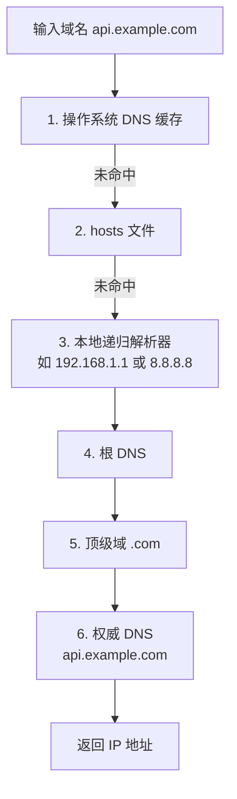
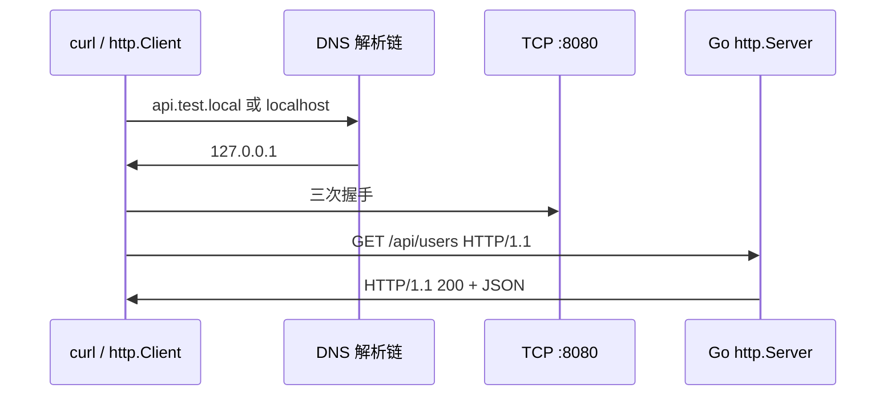
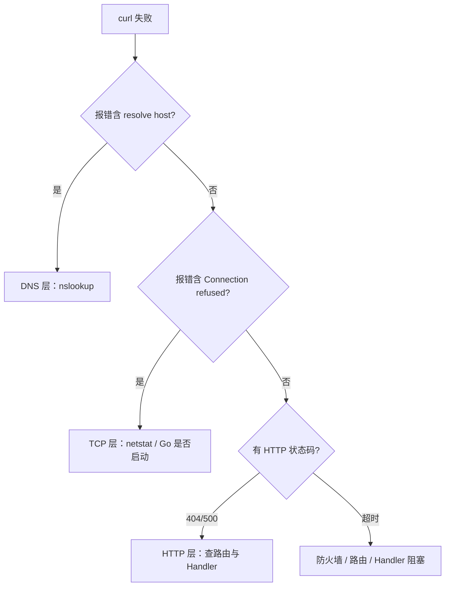
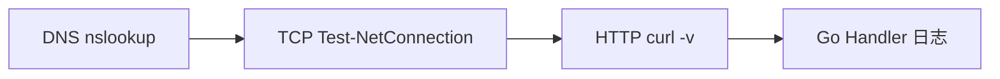

# IP 地址与 DNS 解析

> **文件编码**：UTF-8。终端命令在 **PowerShell** 下执行。  
> **定位**：Go 后端速成 **选修章**——搞懂 IP 寻址、私网/NAT、DNS 解析链，能用 `ping`、`nslookup`、`curl` 区分「名字找不到」和「端口连不上」。  
> **前置**：[01 网络分层与通信基础](./01-网络分层与通信基础.md)、[02 TCP 与 UDP](./02-TCP与UDP.md)  
> **关联**：[04 HTTP 协议深入](./04-HTTP协议深入.md)  
> **Go 落地**：[Go 05 标准库与 HTTP 基础](../../后端学习/Go/05-Go标准库与HTTP基础.md)

---

## 0. 读前导读（零基础也能跟上）

### 0.1 用一句话弄懂本章

**IP 地址（IP Address）** = 互联网上的「门牌号」（送到**哪台电脑**）；**DNS（Domain Name System，域名系统）** = 「通讯录 / 114 查号台」（把 `api.example.com` 翻译成 IP）。

**生活类比总表**（本章会反复用到）：

| 概念 | 类比 | 一句话 |
|------|------|--------|
| **IPv4 点分十进制** | `192.168.1.105` 像「省-市-区-门牌」四段写法 | 32 位地址，写成 4 段 0～255 |
| **私网 IP** | 小区内部楼栋号，外人从公网进不来 | 仅局域网有效，不能公网路由 |
| **公网 IP** | 小区在大街上的唯一门牌 | 全球路由，互联网上可直达 |
| **NAT** | 门卫把多家住户共用一个对外门牌发快递 | 内网多设备共享一个公网 IP 上网 |
| **localhost / 127.0.0.1** | 对着镜子自言自语，包不出本机 | 本机进程间通信，不经物理网卡 |
| **DNS 解析链** | 先翻手机通讯录 → 再问物业 → 最后问电信查号台 | 域名逐级查到 IP |
| **hosts 文件** | 自己手写的小抄，优先级高于公网查号 | 本机强制域名 → IP 映射 |
| **A 记录** | 通讯录里直接写门牌号 | 域名 → IPv4 |
| **CNAME 记录** | 通讯录写「找他哥的电话」 | 域名 → 另一个域名（别名） |

**还会遇到的词**：**TTL（Time To Live）** = DNS 记录可被缓存的秒数；**VPC（Virtual Private Cloud）** = 云厂商给你的虚拟内网，读控制台时常见 `/24` 子网。

**与 TCP 的关系**（[02 章](./02-TCP与UDP.md)）：DNS 先查到 IP，TCP 再「打电话」连 `IP:端口`。顺序永远是 **DNS → TCP → HTTP**。

### 0.2 你需要提前知道什么

| 前置 | 对应章节 | 必须？ |
|------|----------|--------|
| TCP/IP 四层、IP 与端口 | [01 章](./01-网络分层与通信基础.md) §2～§6 | ✅ |
| 三次握手、Connection refused | [02 章](./02-TCP与UDP.md) | ✅ |
| 会 `go run`、见过 `:8080` | Go 00～04 | 建议 |
| HTML / Vue / 浏览器 | — | ❌ **不要求** |
| `ping`、`nslookup` 没跑过 | — | 本章 §11～§14 手把手教 |

**真零基础路线**：先跑 `ipconfig` 看清本机 IP → 再 `nslookup www.baidu.com` 建立「名字变数字」的直觉 → 最后对照 `curl -v` 看 DNS 在哪一步。

### 0.3 本章知识地图（学完后应能勾选全部 ☐→☑）

```text
☐ 能写出 IPv4 格式与三类私网 IP 范围（10/8、172.16/12、192.168/16）
☐ 能读 ipconfig 中的 IP、掩码、网关、DNS 服务器
☐ 能解释 NAT：多台设备如何共用一个公网 IP 上网
☐ 能画出 DNS 解析链（OS 缓存 → hosts → 递归 → 根 → TLD → 权威）
☐ 能区分 A / AAAA / CNAME 记录
☐ 会改 hosts 并 ipconfig /flushdns
☐ 会用 ping、tracert、nslookup 并读懂输出
☐ 看到 Could not resolve host 第一反应是 nslookup，不是改 HTTP 路由
☐ 能用 curl 区分 DNS 失败、TCP 失败、HTTP 404
```

### 0.4 建议学习时长与节奏

| 阶段 | 内容 | 时间 |
|------|------|------|
| IP 与 NAT | §2～§6 | 45 分钟 |
| DNS 原理 | §7～§9 | 50 分钟 |
| 实操命令 | §11～§14 | 60 分钟 |
| 排障 + 复盘 | §16、§23、自测 | 45 分钟 |

**建议**：先 `ipconfig` 看清本机 IP，再 `nslookup www.baidu.com`，建立「名字→数字」的直观感受。本章是**选修**，1～2 小时精读 + 30 分钟动手即可。

### 0.5 学完本章你能做什么（可验证的具体动作）

1. 修改 hosts 把假域名指到 `127.0.0.1`，用 `ping` 验证，再恢复。
2. 解释「ping 不通百度但 curl 能开」——**禁 ping ≠ HTTP 不通**。
3. Go 联调排障顺序：**nslookup → Test-NetConnection → curl -v → 再看 HTTP 状态码**。
4. 向运维描述：「请给 `api.example.com` 加一条 **A 记录** 指到服务器公网 IP。」
5. 读 `curl -v` 输出，判断失败发生在 DNS、TCP 还是 HTTP 层。

---

## 本章衔接

[02 章](./02-TCP与UDP.md) 你学了：三次握手、端口号、Socket、`localhost:8080` 上的 TCP 连接。建立 TCP 之前，客户端必须先知道**目的主机的 IP 地址**——这一步靠 **DNS** 和本章的 **IP 寻址** 知识。

[01 章 §6](./01-网络分层与通信基础.md) 全链路第 3 步是「DNS 解析域名得 IP」；本章把这一步**拆开讲透**，并补上公网/私网、NAT、hosts 等 Go 后端天天碰到的概念。

若你在 Go 里用 `http.Get("http://api.example.com/users")`，本章会帮你判断：是 **DNS 失败**、**IP 不可达** 还是 **HTTP 404**（TCP 可能已成功）。


| 章节 | 本章提供什么 | 后续怎么用 |
|------|--------------|------------|
| [01 分层](./01-网络分层与通信基础.md) | IP 在网际层 | 理解「门牌号」 |
| [02 TCP](./02-TCP与UDP.md) | DNS 之后连端口 | `Test-NetConnection` |
| **本章** | IP + DNS | `nslookup`、`hosts` |
| [04 HTTP](./04-HTTP协议深入.md) | DNS 成功后发请求 | `curl -v`、状态码 |
| [Go 05](../../后端学习/Go/05-Go标准库与HTTP基础.md) | `http.Client` 底层走同样链路 | 联调排障 |

---

## 1. 为什么 Go 后端必须懂 IP 与 DNS？

| 你遇到的现象 | 可能根因 | 第一层 |
|--------------|----------|--------|
| `curl: (6) Could not resolve host` | **DNS** 解析失败 | 网际层之前（名字） |
| `ping api.xxx.com` 不通但 `curl` 能开 | ICMP 被禁，不等于 HTTP 不通 | 网际层 ICMP |
| 线上能访问、本地 `localhost` 不行 | 混淆 **回环** 与 **公网域名** | 本机环回 |
| 改了 hosts 仍不生效 | OS **DNS 缓存** 未刷新 | DNS 缓存 |
| `curl` 超时很久 | DNS 慢、路由绕远、Handler 阻塞 | 多因，先分层 |
| Go `http.Get` 返回 404 | **HTTP 路由**写错，TCP 已通 | 应用层 |

**Go 后端视角**：你不会在浏览器里看 Network 面板，但 `curl -v` 和 PowerShell 命令能告诉你**卡在哪一层**——这是本章的核心价值。

---

## 2. IPv4 地址格式

### 2.1 点分十进制（Dotted Decimal）

IPv4 地址由 **32 位** 组成，常写成 **4 段十进制**，每段 0～255，用点分隔：

```text
192.168.1.100
│   │   │  └── 主机部分（在子网内）
│   │   └───── 子网
│   └───────── 子网
└───────────── 网络
```

**示例**：

| 地址 | 说明 |
|------|------|
| `8.8.8.8` | Google 公共 DNS 之一 |
| `114.114.114.114` | 国内常用公共 DNS |
| `192.168.0.1` | 常见家用路由器**私网**地址 |
| `127.0.0.1` | 本机回环（见 §6） |

### 2.2 特殊地址（后端常碰）

| 地址/范围 | 含义 |
|-----------|------|
| `0.0.0.0` | 「所有接口」；Go `ListenAndServe(":8080", ...)` 等价于监听 `0.0.0.0:8080` |
| `127.0.0.0/8` | 回环网段，整段指向本机 |
| `255.255.255.255` | 有限广播（了解） |

### 2.3 IPv6 简提

IPv6 用 **128 位**，写成 8 组十六进制，如 `2001:4860:4860::8888`。双栈站点 DNS 可能返回 **A 记录（IPv4）** 和 **AAAA 记录（IPv6）**。本章实操以 **IPv4 + Windows** 为主；`localhost` 可能解析到 IPv6 的 `::1`（§6 详讲）。

---

## 3. 子网掩码（简要）

子网掩码与 IP **按位与**，得到**网络号**，其余是**主机号**。

常见掩码：

| 掩码 | CIDR（无类别域间路由，用 `/24` 表示「前 24 位是网络号」） | 可用主机数（约） |
|------|------|------------------|
| `255.255.255.0` | /24 | 254 |
| `255.255.0.0` | /16 | 65534 |
| `255.0.0.0` | /8 | 很多 |

**例子**：`192.168.1.100` 掩码 `255.255.255.0`

- 网络号：`192.168.1.0`
- 同网段：`192.168.1.1`～`192.168.1.254`

**Go 后端用途**：判断你的电脑与 `192.168.1.x` 路由器是否同网段；公司内网 API `10.0.5.20` 能否直连。公网部署一般交给运维，但**懂 /24** 有助于读云控制台 VPC 文档。

```powershell
ipconfig
```

**预期片段**：

```text
无线局域网适配器 WLAN:
   IPv4 地址 . . . . . . . . . . . . : 192.168.1.105
   子网掩码  . . . . . . . . . . . . : 255.255.255.0
   默认网关. . . . . . . . . . . . . : 192.168.1.1
```

---

## 4. 公网 IP 与私网 IP

### 4.1 公网 IP（Public）

全球路由表中唯一，互联网上可直接访问（若防火墙允许）。

### 4.2 私网 IP（Private，RFC 1918）

仅在局域网内有效，**不能**在公网路由：

| 范围 | CIDR | 举例 |
|------|------|------|
| `10.0.0.0` ～ `10.255.255.255` | 10.0.0.0/8 | `10.0.5.20`（公司内网 API） |
| `172.16.0.0` ～ `172.31.255.255` | 172.16.0.0/12 | `172.16.0.1`（Docker 默认网桥） |
| `192.168.0.0` ～ `192.168.255.255` | 192.168.0.0/16 | `192.168.1.105`（你家 Wi-Fi） |

你家电脑 `192.168.1.105`、路由器 `192.168.1.1` 都是私网地址；对外的网站服务器则是公网 IP（或通过 CDN 边缘的公网 IP）。

### 4.3 为什么需要私网 IP？

IPv4 地址不够用；整个家庭/公司共用一个**公网 IP** 出门，内网用私网 IP 区分设备——靠 **NAT**（下一节）。

**误区**：「我在浏览器访问 `192.168.x.x` 就是公网」——错，那是**内网**地址，外网用户无法直接访问你家路由器里的 NAS，除非做端口映射或内网穿透。

**Go 开发场景**：

| 场景 | 地址 | 说明 |
|------|------|------|
| 本机调试 | `127.0.0.1:8080` | 环回，不经过 NAT |
| 同事同 Wi-Fi 访问你的 API | `192.168.1.105:8080` | 局域网直连，Go 需 `ListenAndServe(":8080", ...)` 监听 `0.0.0.0` |
| 公网用户访问 | 公网 IP 或域名 | 需部署到云 + DNS A 记录 |

---

## 5. NAT（网络地址转换）

**NAT（Network Address Translation，网络地址转换）** 多在家用**路由器**或公司**网关**上：把内网私网 IP + 端口 映射成 公网 IP + 端口，让多台设备共享一个公网 IP 上网。


**出站**：你访问 `https://www.baidu.com`，路由器把源地址从 `192.168.1.105:52134` 改成 `203.0.113.50:随机端口`，记住映射表，回程再改回来。

**入站**：外网主动连你家的 `192.168.1.105` **默认不行**（没有公网入口），除非：

- 路由器**端口转发**（把公网 8080 转到内网某机器）
- 云服务器有**公网 IP + 安全组**

**与 Go 联调**：

| 访问方式 | 是否经过 NAT | 说明 |
|----------|--------------|------|
| `curl http://localhost:8080` | ❌ | 本机回环 |
| 手机连 `192.168.1.105:8080`（同 Wi-Fi） | ❌（局域网内） | 需防火墙放行 8080 |
| 公网用户访问你的 API | ✅ | 需云服务器 + 域名 DNS |

---

## 6. localhost 与 127.0.0.1

| 名称 | 含义 |
|------|------|
| `127.0.0.1` | IPv4 回环地址，包不出本机网卡 |
| `localhost` | 主机名，通常解析为 `::1`（IPv6）或 `127.0.0.1`（IPv4） |
| `0.0.0.0`（服务器 bind） | 监听本机**所有网卡**上的端口 |

[02 章](./02-TCP与UDP.md) 联调：`http://localhost:8080` → DNS/hosts 解析到 `127.0.0.1` → TCP 连本机 8080 进程。

```powershell
ping localhost
```

**预期（可能 IPv6 优先）**：

```text
正在 Ping DESKTOP-XXX [::1] 具有 32 字节的数据:
来自 ::1 的回复: 时间<1ms
```

或 IPv4：

```text
正在 Ping 127.0.0.1 具有 32 字节的数据:
来自 127.0.0.1 的回复: 字节=32 时间<1ms TTL=128
```

**注意**：`ping localhost` 成功只说明**本机协议栈正常**，不代表 8080 上的 Go 服务已启动——还要 [02 章](./02-TCP与UDP.md) 的 `Test-NetConnection -Port 8080`。

### 6.1 双栈陷阱（IPv4 vs IPv6）

Windows 可能优先用 **IPv6** 访问 `localhost`（`::1`）。若 Go 服务只监听 `127.0.0.1:8080` 而未监听 `::1`：

- `curl http://127.0.0.1:8080` ✅
- `curl http://localhost:8080` ❌ 或偶发失败

**解决**：联调时统一写 `127.0.0.1`；或让 Go `ListenAndServe(":8080", ...)` 监听所有接口。

```powershell
ping -4 localhost
ping -6 localhost
```

---

## 7. DNS 是什么？为什么需要？

### 7.1 是什么

**DNS（Domain Name System，域名系统）**：把人类可读的**域名**（如 `www.baidu.com`）翻译成 **IP 地址**的分布式数据库与查询协议。DNS 本身跑在应用层，常用 **UDP 53** 端口（响应过大时走 TCP 53，见 [02 章 FAQ](./02-TCP与UDP.md)）。

### 7.2 为什么不用 IP 直接访问？

| 用域名 | 用 IP |
|--------|-------|
| 好记、可品牌 | `14.215.177.39` 难记 |
| 服务器换 IP，改 DNS 即可 | 换 IP 要通知所有调用方 |
| 负载均衡、CDN 可多 A 记录 | 单 IP 难扩展 |
| HTTPS 证书常绑定域名 | IP 证书少见 |

Go 代码里 `http.Get("http://api.example.com/users")`、配置文件里的 `DB_HOST=mysql.internal.company.com`，都要先 **DNS 解析**（或命中缓存）。

---

## 8. DNS 解析完整链路

以 `curl https://api.example.com/users` 为例：



### 8.1 操作系统 DNS 缓存

Windows **DNS Client** 服务缓存近期解析结果（有 TTL）。开发时「刚改 DNS 不生效」可先：

```powershell
ipconfig /flushdns
```

查看当前缓存（输出较长）：

```powershell
ipconfig /displaydns | more
```

### 8.2 hosts 文件

见 §11，**优先级高于**递归 DNS（对指定域名）。本机开发常用。

### 8.3 递归解析器（Recursive Resolver）

通常是你路由器或运营商指定的 DNS，如 `192.168.1.1`、`114.114.114.114`、`8.8.8.8`。它替你**迭代查询**根 → TLD → 权威，直到拿到答案，再缓存。

### 8.4 根 DNS → TLD → 权威 DNS

| 层级 | 职责 | 类比 |
|------|------|------|
| **根 DNS** | 全球 13 组逻辑实例（`.`），返回「`.com` 去问谁」 | 国家电话总台 |
| **TLD DNS** | 管理 `.com`、`.cn` 等，返回权威服务器地址 | 省级查号台 |
| **权威 DNS** | 域名注册商/云 DNS 托管，存有 A/AAAA/CNAME 记录 | 该公司前台 |

**本地 `localhost`**：通常不走公网 DNS 链，由 OS 或 hosts 直接返回 `127.0.0.1`——所以 `curl -v localhost` 里 DNS 阶段经常是 0ms。

---

## 9. DNS 记录类型：A / AAAA / CNAME

| 类型 | 含义 | 示例 |
|------|------|------|
| **A** | 域名 → **IPv4** | `api.example.com` → `93.184.216.34` |
| **AAAA** | 域名 → **IPv6** | `api.example.com` → `2606:2800:220:1:248:1893:25c8:1946` |
| **CNAME** | 域名 → **另一个域名**（别名） | `www.example.com` → `example.com` |
| NS | 指定权威 DNS 服务器（Name Server，「这域名去问谁」） | 委托子域 |
| MX | 邮件服务器（Mail eXchange） | Go 后端较少直接配 |
| TXT | 文本记录（如域名所有权验证、反垃圾邮件 SPF） | 云厂商域名验证时常用 |

### 9.1 CNAME 注意点

- CNAME 记录**不能**直接写 IP 字符串，只能指向**域名**
- 解析 `www` CNAME 到 `cdn.vendor.com` 时，最终还要再解析 CDN 的 A 记录
- **根域名** `@` 很多厂商不允许 CNAME（DNS 规范限制），用 **ALIAS/ANAME** 或 A 记录

### 9.2 Go 后端场景

| 配置需求 | 记录类型 | 值示例 |
|----------|----------|--------|
| API 指云服务器 | **A** | `203.0.113.20` |
| www 指主域 | **CNAME** | `example.com` |
| 静态资源 CDN | **CNAME** | `xxx.cdn.provider.com` |
| 双栈 | **A + AAAA** | 同时配 IPv4 和 IPv6 |

```powershell
nslookup api.example.com
nslookup -type=CNAME www.github.com 8.8.8.8
```

---

## 10. CDN 概念（了解）

**CDN（Content Delivery Network，内容分发网络）**：静态资源缓存到边缘节点，DNS 返回就近 IP。`static.example.com` 常 CNAME 到 CDN 域名。Go 后端：**动态 API 不走 CDN 缓存**，API 域名直接 A 记录到源站即可。

---

## 11. 手把手：修改 Windows hosts 文件

hosts 用于**本地强制**域名 → IP 映射，绕过公网 DNS。常用于：本地伪域名联调、测试前预览、临时屏蔽站点。

### 11.1 文件位置

```text
C:\Windows\System32\drivers\etc\hosts
```

### 11.2 编辑步骤（需管理员）

| 步骤 | 你的动作 | 预期 | 若不对 |
|------|----------|------|--------|
| 1 | 右键「以管理员身份运行」记事本或 Cursor | 能编辑系统文件 | 权限不足 |
| 2 | 打开 `C:\Windows\System32\drivers\etc\hosts` | 文件内容可见 | 路径错；无扩展名 |
| 3 | 末尾加 `127.0.0.1   api.test.local` | 保存成功 | 只读 → 管理员身份 |
| 4 | `ipconfig /flushdns` | 无报错 | — |
| 5 | `ping api.test.local` | 回复来自 127.0.0.1 | 仍旧旧 IP → 再 flushdns |

### 11.3 与 Go 联调结合

hosts 添加：

```text
127.0.0.1   api.test.local
```

Go 服务监听 `8080` 后：

```powershell
curl http://api.test.local:8080/health
```

等价于访问 `http://127.0.0.1:8080/health`，但 Host 头是 `api.test.local`——可测试虚拟主机路由（见 [04 章 Host 头](./04-HTTP协议深入.md)）。

### 11.4 验证

```powershell
ping api.test.local
nslookup api.test.local
```

**预期**：

```text
正在 Ping api.test.local [127.0.0.1] 具有 32 字节的数据:
来自 127.0.0.1 的回复: ...

名称:    api.test.local
Address:  127.0.0.1
```

### 11.5 恢复

删除 hosts 中对应行 → `ipconfig /flushdns`。

**注意**：HTTPS 若证书域名是 `api.example.com`，你用 `api.test.local` 会**证书不匹配**——开发 HTTP 或配本地证书（见 [05 HTTPS 章](./05-HTTPS与TLS加密.md)）。

---

## 12. Windows 命令实操：ping

```powershell
ping www.baidu.com
```

**预期（成功）**：

```text
正在 Ping www.a.shifen.com [14.215.177.39] 具有 32 字节的数据:
来自 14.215.177.39 的回复: 字节=32 时间=15ms TTL=52
...

14.215.177.39 的 Ping 统计信息:
    数据包: 已发送 = 4，已接收 = 4，丢失 = 0 (0% 丢失)，
```

**解读**：

- 第一行证明 **DNS 已解析** 出 IP（百度 CNAME 到 `a.shifen.com` 是正常的）
- `时间=15ms` 是 ICMP 往返延迟（≠ HTTP 接口耗时）
- `丢失 = 0` 网络基本可达

**限制**：许多公网服务器**禁 ping**，`请求超时` 不代表网站打不开——再用 `curl` 验证 HTTP。

```powershell
ping -n 2 127.0.0.1
ping -n 2 192.168.1.1
```

分别测本机与网关。

---

## 13. Windows 命令实操：tracert（路由跟踪）

```powershell
tracert www.baidu.com
tracert -d www.baidu.com   # -d 不解析中间跳主机名
```

**解读**：每一行是一跳路由器；`*` 表示该跳不响应 ICMP（常见，不代表断）。用于判断卡在第几跳、是否绕远路。

---

## 14. Windows 命令实操：nslookup

```powershell
nslookup www.baidu.com
```

**预期**：

```text
服务器:  UnKnown
Address:  192.168.1.1

非权威应答:
名称:    www.a.shifen.com
Addresses:  14.215.177.39
          2400:da00:200::1
```

**指定公共 DNS 查询**（绕过路由器缓存）：

```powershell
nslookup www.baidu.com 8.8.8.8
```

**查 CNAME 链**：

```powershell
nslookup -type=CNAME www.github.com 8.8.8.8
```

**查 A 记录**：

```powershell
nslookup -type=A www.baidu.com
```

**与 curl 报错对照**：

- `nslookup` 失败 → `curl` 极可能 `Could not resolve host`
- `nslookup` 成功但接口失败 → 转 [02 章 TCP](./02-TCP与UDP.md) 或 [04 章 HTTP](./04-HTTP协议深入.md)

### 14.1 nslookup 交互模式

```powershell
nslookup
> server 8.8.8.8
> set type=A
> www.baidu.com
> set type=CNAME
> www.github.com
> exit
```

适合连续查多条记录。

---

## 15. 从域名到 Go API 的完整路径（串讲）



对照 [01 章全链路](./01-网络分层与通信基础.md) 与 [02 章 TCP](./02-TCP与UDP.md)，DNS 是**第一步**（`localhost` 除外，几乎无延迟）。

**Go 代码视角**：

```go
resp, err := http.Get("http://api.example.com/users")
```

OS 在发起 TCP 连接前，自动完成 DNS 解析。`err` 可能是：

- DNS 失败：`lookup api.example.com: no such host`
- TCP 失败：`connection refused`
- HTTP 成功但业务错：需读 `resp.StatusCode`（如 404）

### 15.1 多客户端对照：浏览器地址栏 vs curl vs Java

| 客户端 | DNS 何时发生 | 典型报错 |
|--------|--------------|----------|
| **浏览器** 输入 `https://api.example.com` | 地址栏回车前，由 OS + 浏览器 DNS 缓存解析 | `DNS_PROBE_FINISHED_NXDOMAIN` |
| **curl** `curl https://api.example.com` | 连接前由 OS 解析 | `Could not resolve host` |
| **Java** `InetAddress.getByName("api.example.com")` | 显式或 `HttpClient` 连接前 | `UnknownHostException` |
| **Python** `requests.get("https://...")` | `urllib3` 连接前 | `NameResolutionError` |
| **Go** `http.Get("https://...")` | `net.Dial` 前 | `lookup ...: no such host` |

**面试一句话**：DNS 是**操作系统网络栈**完成的，语言库只是调用方；所以「浏览器能开、curl 不行」很少是 DNS 差异，更常见是 **URL 写错、代理、或 HTTPS 证书**。

---

## 16. DNS 失败 vs TCP 失败 vs HTTP 404（curl 区分）

这是 Go 后端**最重要**的排障技能。三层失败症状完全不同：

| 层级 | curl 典型报错 | 含义 | 第一步 |
|------|---------------|------|--------|
| **DNS** | `curl: (6) Could not resolve host 'xxx'` | 名字变不成 IP，TCP 未开始 | `nslookup xxx` |
| **TCP** | `curl: (7) Failed to connect ... Connection refused` | IP 已知，端口无人 listen | `Test-NetConnection -Port 8080` |
| **TCP** | `curl: (28) Operation timed out` | IP 可达但端口被防火墙挡或路由不通 | 查安全组/防火墙 |
| **HTTP** | `HTTP/1.1 404 Not Found` | TCP 已通，**路径/路由**不存在 | 查 Go Handler 注册 |
| **HTTP** | `HTTP/1.1 500 Internal Server Error` | TCP 已通，服务端代码 panic | 查 Go 日志 |



### 16.1 三个实战对比

**DNS 失败**：

```powershell
curl -v http://this-domain-does-not-exist-xyz.com/
```

**预期**：

```text
* Could not resolve host: this-domain-does-not-exist-xyz.com
curl: (6) Could not resolve host
```

**TCP 失败**（Go 服务未启动）：

```powershell
curl -v http://localhost:8080/health
```

**预期**：

```text
* connect to ::1 port 8080 failed: Connection refused
curl: (7) Failed to connect to localhost port 8080
```

**HTTP 404**（Go 服务已启动，路径错）：

```powershell
curl -v http://localhost:8080/wrong-path
```

**预期**：

```text
* Connected to localhost (::1) port 8080
> GET /wrong-path HTTP/1.1
< HTTP/1.1 404 Not Found
```

关键：`Connected to` 出现 → **TCP 已成功**；404 是应用层问题。

### 16.2 完整排障剧本

| 步骤 | 命令 / 操作 | 预期 | 失败说明 |
|------|-------------|------|----------|
| 1 | `nslookup api.example.com` | 返回 IP | DNS 层问题 |
| 2 | `Test-NetConnection api.example.com -Port 443` | `TcpTestSucceeded : True` | TCP/防火墙问题 |
| 3 | `curl -v https://api.example.com/health` | `Connected` + `HTTP/1.1 200` | 看状态码 |
| 4 | 若 404 | 查 Go 路由 `mux.HandleFunc` | HTTP 层 |
| 5 | 若 500 | 查 Go 程序日志 | 业务/代码问题 |



---

## 17. DNS TTL 与 ipconfig /all

每条 DNS 记录有 **TTL（Time To Live，生存时间）**，单位秒，表示递归解析器可把答案缓存多久。

| TTL | 含义 |
|-----|------|
| 300 | 5 分钟内重复查询用缓存 |
| 3600 | 1 小时 |
| 86400 | 1 天 |

**运维改 IP 后**，旧 TTL 未过期时，部分用户仍访问旧 IP——表现为「我这边好了同事还不行」。

**开发启示**：上线切流量前提前**调低 TTL**；本地 hosts 无 TTL，改完 `flushdns` 即生效。

```powershell
ipconfig /all
```

关注 **DNS 服务器**（通常 `192.168.1.1` 路由器 → 运营商 DNS）、**IPv4 地址**、**默认网关**。DNS 填错则**所有域名**都可能 `Could not resolve host`。

---

## 18. 子网计算手把手（一个例子）

**题目**：IP `192.168.10.50`，掩码 `255.255.255.0`，网关 `192.168.10.1`，API 在 `192.168.10.200`，电脑能直连吗？

**步骤**：

1. 掩码 /24 → 前 24 位是网络号 → 网络 `192.168.10.0`
2. `50` 与 `200` 都在 `192.168.10.1`～`254` → **同网段**
3. 无需经路由器转发，直连可达（防火墙另论）

**反例**：电脑 `192.168.1.105`，API `192.168.10.200`，掩码均为 `/24` → **不同网段**，必须经过网关，网关无路由则 ping 不通。

公司内网 Go 连测试环境 API 时，常因**不在同一 VLAN** 踩坑——问运维要正确 VPN 或内网 IP。

---

## 19. 常见报错与排查表（≥8 条）

| 报错/误区 | 可能原因 | 正确理解 / 解决方案 |
|-----------|----------|---------------------|
| `Could not resolve host` | **DNS** 解析失败 | `nslookup` 域名；查 hosts、DNS 服务器设置 |
| `no such host`（Go error） | 同上，Go 封装 DNS 错误 | `nslookup`；检查域名拼写 |
| ping 不通 = 网站挂了 | 很多服务器**禁 ICMP** | 用 `curl -I https://域名` 测 HTTP |
| 改了 hosts 不生效 | OS DNS 缓存未刷新 | `ipconfig /flushdns` |
| `localhost` 与 `127.0.0.1` 永远等价 | 可能 IPv6 先解析到 `::1` | 联调统一写 `127.0.0.1`；见 §6.1 |
| 私网 IP 能在公网直接访问 | NAT 默认阻挡入站 | 部署用公网 IP/域名；内网用局域网 IP |
| CNAME 指向 IP 字符串 | CNAME 只能指向**域名** | 用 **A 记录**写 IP |
| `8.8.8.8` 是网站 IP | 那是 **Google DNS 服务器** | 区分「被查询的域名」与「查询用的 DNS」 |
| `ipconfig /flushdns` 清一切缓存 | 主要清 **OS** 缓存 | Go 程序重启；必要时换 DNS 服务器对比 |
| tracert 超时 = 断网 | 中间路由器常不回应 ICMP | 看最终能否到达目标 IP |
| HTTPS 证书错误是 DNS 错 | 可能是 DNS 指到**错误服务器** IP | 核对 A 记录与证书 SAN 域名 |
| curl 404 是 DNS 问题 | 404 说明 TCP 已通，**HTTP 路由**错 | 查 Go `HandleFunc` 路径注册 |
| `git clone` Failed to resolve | DNS 问题 | `nslookup github.com` |

---

## 20. 分级练习

### 基础

1. 运行 `ipconfig`，记录本机 IPv4、子网掩码、默认网关。
2. `ping localhost` 与 `ping 127.0.0.1` 对比结果。
3. `nslookup www.baidu.com` 记录返回的 IP。

### 进阶

4. 在 hosts 添加 `127.0.0.1 test.local`，`ping` 与 `nslookup` 验证后删除并 `flushdns`。
5. 对同一域名分别用默认 DNS 与 `nslookup www.baidu.com 8.8.8.8`，对比结果是否一致。
6. Go 服务启动后，`curl -v http://localhost:8080/health` 指出 `Connected` 行。

### 挑战

7. 故意在 hosts 写 `0.0.0.0 www.baidu.com`，观察 `curl` 与 `nslookup` 差异，再恢复。
8. 画一张图：手机通过家里 WiFi 访问公网 API，经过 NAT 的路径（私网 IP → 路由器 → 公网）。

### 参考答案

**基础**：`ipconfig` 示例 `192.168.1.105 / 255.255.255.0 / 网关 192.168.1.1`；ping 两者均应 `<1ms`；nslookup 应看到至少一条 IPv4。

**进阶**：hosts 验证后删除 + flushdns；8.8.8.8 对比可能因运营商 DNS 劫持而不同。

**挑战**：hosts 指向 `0.0.0.0` 后 curl 可能 connection failed（无效目标）；NAT 路径：手机 `192.168.1.x` → 路由器 NAT 为公网 IP → 互联网 → API 服务器。

---

## 21. FAQ（≥10 条）

**Q1：`114.114.114.114` 和 `8.8.8.8` 是什么？**  
公共**递归 DNS** 地址，不是你的网站 IP。`nslookup 域名 8.8.8.8` 表示「让 Google DNS 帮你查」。

**Q2：开发必须用 hosts 吗？**  
不必须；`localhost:8080` 最简单。hosts 适合模拟多域名、测 Host 头路由、临时指向测试机。

**Q3：和 `git clone` 有关系吗？**  
`git clone github.com` 也要 DNS 解析；`Failed to resolve address` 是 DNS 问题，用 `nslookup github.com` 排查。

**Q4：Go 后端要亲自配 A 记录吗？**  
开发很少；部署、绑自定义域名、排查线上解析时要会与运维沟通（记录：域名、记录类型 A/CNAME、目标 IP、TTL、生效时间）。

**Q5：ping 和 curl 有什么区别？**  
ping 测 **ICMP/IP 可达性**（网际层）；curl 测 **HTTP 应用层**（建立在 TCP 之上）。ping 不通不代表 curl 不通。

**Q6：nslookup 成功但 curl 失败？**  
DNS 层正常；查 **TCP 端口**（`Test-NetConnection`）或 **HTTP 路径/状态码**（`curl -v`）。

**Q7：同事能访问我 `192.168.1.105:8080` 吗？**  
同一 WiFi 下通常可以；需 Go 监听 `0.0.0.0:8080`、防火墙放行 8080。

**Q8：公网用户能访问我的 192.168.x.x 吗？**  
不能，私网地址；需公网 IP + 安全组或部署到云。

**Q9：TTL 改低有什么好处？**  
切 IP 时旧缓存更快过期；平时 TTL 太长会导致部分用户仍访问旧服务器。

**Q10：IPv6 括号 `[::1]` 是什么？**  
URL 里 IPv6 字面量要加方括号，如 `http://[::1]:8080`；与 IPv4 的 `127.0.0.1` 并列存在。

**Q11：DoH（DNS over HTTPS）影响排查吗？**  
浏览器可能走 DoH，与系统 `nslookup` 结果偶尔不一致。Go/curl 用**系统 DNS**；排查时以 `nslookup` 为准。

**Q12：CDN 能加速我的 POST /api/login 吗？**  
动态 API 通常**不走**静态 CDN 缓存；静态 `assets/*.js` 才适合 CDN。

**Q13：与 Go 05 怎么配合？**  
本章 = 名字变 IP；Go 05 = `net/http` 在 TCP 连接上处理 HTTP。`http.Client` 底层自动 DNS，出错看 error 字符串分层。

**Q14：选修章可以跳过吗？**  
可以速成 01→02→04→05，但 DNS 失败是联调高频问题；建议至少学完 §0、§7～§9、§14、§16。

---

## 22. 闭卷自测（10 题）

### 概念题（6 题）

1. IPv4 点分十进制格式？三类**私网 IP** 范围各举一例。
2. 公网 IP 与私网 IP 区别？为什么家里多台设备能共用一个公网 IP 上网？
3. **NAT** 出站时路由器改什么？入站默认为什么难连内网电脑？
4. `localhost` 与 `127.0.0.1` 关系？ping 通是否说明 8080 Go 服务已启动？
5. DNS 解析链至少写 5 环（从 OS 缓存到权威 DNS）。
6. A、AAAA、CNAME 记录分别是什么？CNAME 能直接指向 IP 字符串吗？

### 动手题（2 题）

7. 写出修改 hosts 把 `api.test.local` 指到本机并刷新缓存的两条命令。
8. `nslookup` 成功但 `Test-NetConnection` 443 失败，说明什么层可能有问题？

### 综合题（2 题）

9. `curl` 报 `Could not resolve host`，你的排查步骤（至少 3 步）？
10. 用 curl 输出区分 DNS 失败、TCP refused、HTTP 404 各长什么样？

### 自测参考答案

**1.** 四段 0～255；`10.0.0.0/8`（如 10.0.5.20）、`172.16.0.0/12`（如 172.16.0.1）、`192.168.0.0/16`（如 192.168.1.105）。

**2.** 公网全球路由；私网仅局域网；**NAT** 把内网源地址映射成公网 IP 出站。

**3.** 改源 IP+端口为公网侧；入站无端口映射则外网无法主动连私网 IP。

**4.** localhost 通常解析为 127.0.0.1 或 ::1；ping 通只说明本机协议栈，**不说明 8080 有 Go 服务**。

**5.** OS 缓存 → hosts → 递归解析器 → 根 → TLD → 权威。

**6.** A→IPv4，AAAA→IPv6，CNAME→别名域名；**不能**，CNAME 只能指向域名。

**7.** 编辑 hosts 加 `127.0.0.1 api.test.local`；`ipconfig /flushdns`。

**8.** DNS 层正常；**TCP/端口**或防火墙/服务未监听。

**9.** ① `nslookup` 域名 ② 查 hosts / DNS 设置 ③ 拼写 ④ 换 `8.8.8.8` 对比 ⑤ 再 Test-NetConnection / curl。

**10.** DNS：无 `Connected`，报 `Could not resolve host`；TCP refused：可能有 resolve 但 `Connection refused`；404：有 `Connected` + `< HTTP/1.1 404`。

---

## 23. 费曼检验：3 分钟讲给零基础朋友

**请合上书，用口语解释。对照下面四条是否都讲到：**

1. **IP 是门牌**，DNS 是**通讯录**把名字变成门牌号；没有 DNS 就 `Could not resolve host`。
2. **私网 + NAT**：家里电脑是内网地址，出门共用一个公网 IP；`localhost` 是「只跟本机说话」。
3. **A 记录直接写 IP**；**CNAME 是别名**还要再查一次。
4. **排障顺序**：先名字能不能解析（nslookup）→ 再端口能不能连（02 章 TCP）→ 最后 HTTP 状态码对不对（04 章）。

**若只能讲清 1 条**：重读 §0.1 类比表 + §16 curl 对比，再试一次。

---

## 24. 学完标准

- [ ] 能默写三段私网 IP 范围（10/8、172.16/12、192.168/16）
- [ ] 能读 `ipconfig` 中的 IP、掩码、网关、DNS 服务器
- [ ] 能解释 NAT 出站过程（30 秒口述）
- [ ] 能画出 DNS 解析链至少 5 环
- [ ] 能区分 A / AAAA / CNAME，并说明 API 域名通常用 A 记录
- [ ] 独立完成 hosts 实验（§11）并恢复
- [ ] 会用 `ping` / `tracert` / `nslookup` 并读输出
- [ ] 能用 `curl -v` 区分 DNS 失败、TCP refused、HTTP 404
- [ ] 误区表至少 3 条能用自己的话解释
- [ ] 闭卷自测 ≥ 8/10
- [ ] 完成分级练习**基础 + 进阶**各至少一题
- [ ] 能继续学 [04 HTTP](./04-HTTP协议深入.md) 或 [Go 05](../../后端学习/Go/05-Go标准库与HTTP基础.md)

**量化自检**：

```text
☐ 30 秒口述 NAT 出站
☐ 30 秒口述 DNS 解析链
☐ 一次完整排障：nslookup → Test-NetConnection → curl -v
```

---

## 25. 下一章预告

03 章（选修）你掌握了 **IP 寻址** 与 **DNS 把域名变成 IP**。若你走速成路径，下一章重点是 **[04 HTTP 协议深入](./04-HTTP协议深入.md)**：HTTP 报文像「**寄信格式**」、状态码、REST、curl 实操——把 TCP 接通后「电话里说什么」讲透，并在 [Go 05](../../后端学习/Go/05-Go标准库与HTTP基础.md) 用 `net/http` 写服务。

**建议**：带着本章命令重走一遍联调清单——先 `nslookup`，再 `Test-NetConnection`，最后 `curl -v` 看 HTTP 状态码。

### 速记口诀

```text
IP 是门牌四段写，私网三段记心间；
NAT 共用一个公网出，localhost 本机环；
DNS 通讯录查号码，hosts 小抄优先权；
A 记录直指 IPv4，CNAME 别名再查遍；
排障先 nslookup，再测 TCP 后看 HTTP 码。
```

---

*上一章：[02 TCP 与 UDP](./02-TCP与UDP.md) · 下一章：[04 HTTP 协议深入](./04-HTTP协议深入.md) · Go 落地：[Go 05 标准库与 HTTP 基础](../../后端学习/Go/05-Go标准库与HTTP基础.md) · 系列起点：[01 网络分层与通信基础](./01-网络分层与通信基础.md)*
