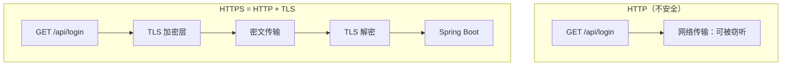
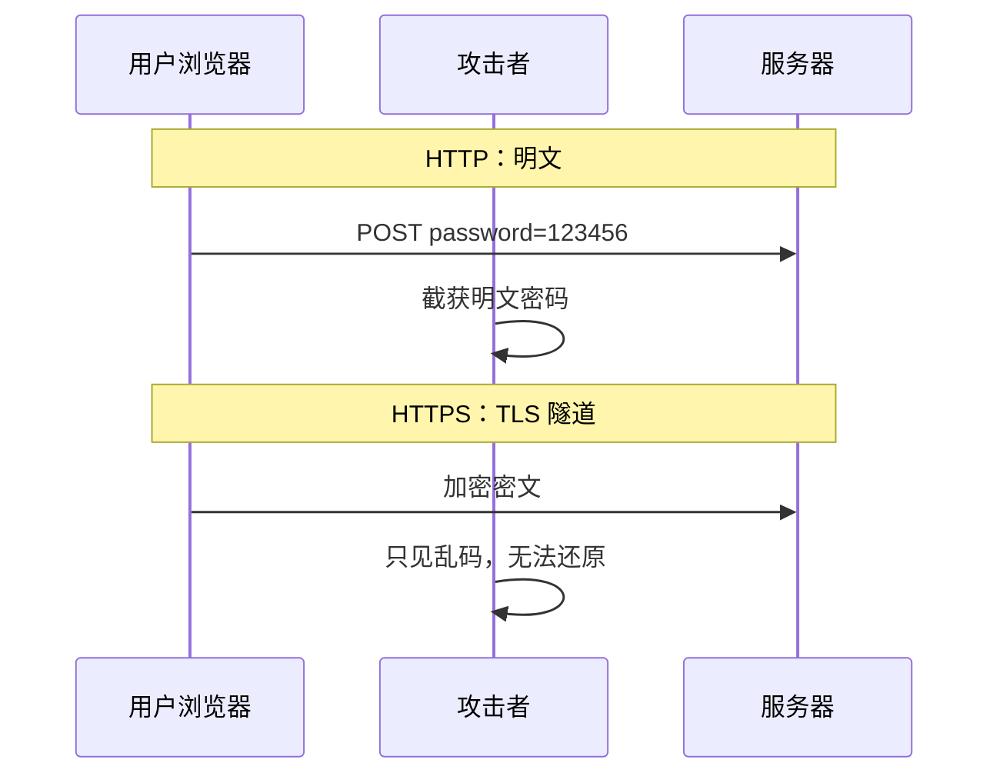
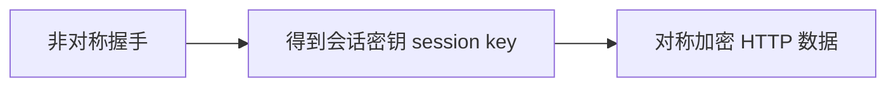
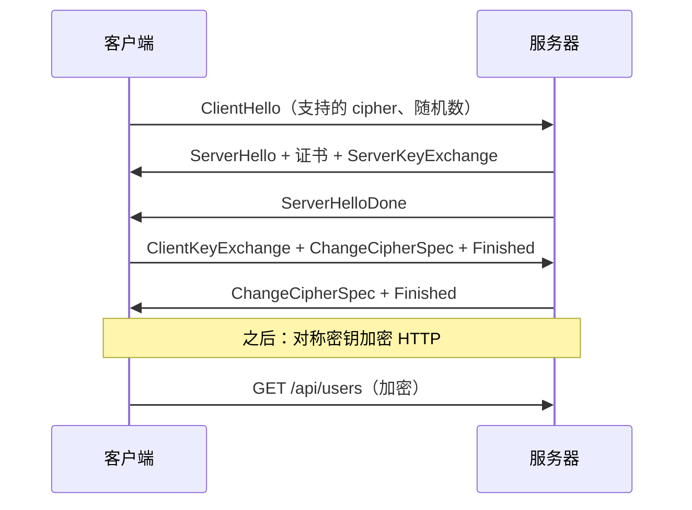
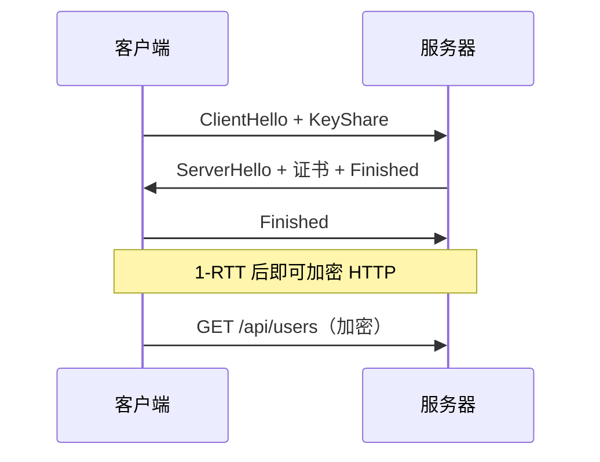
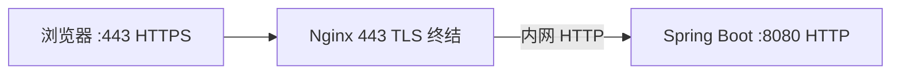
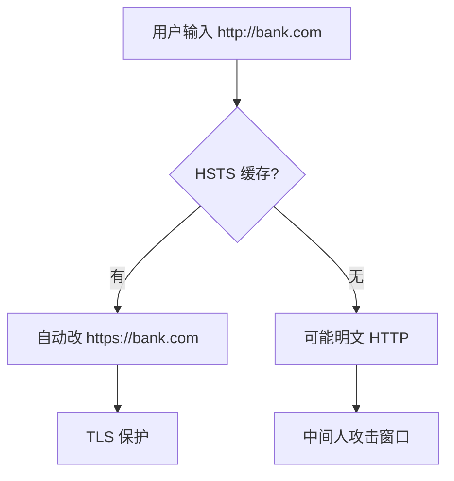
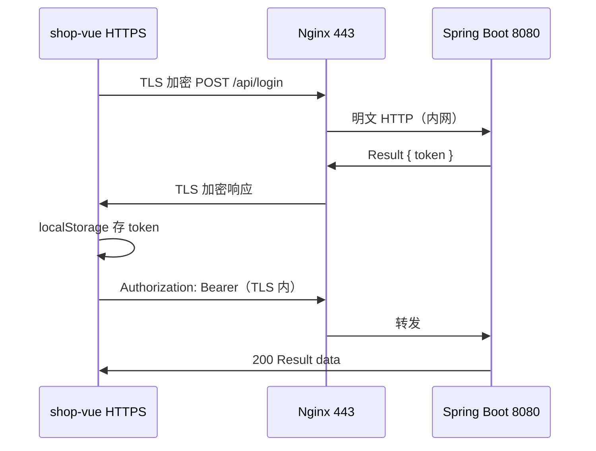
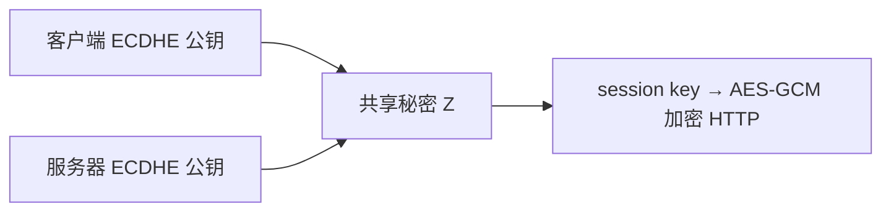
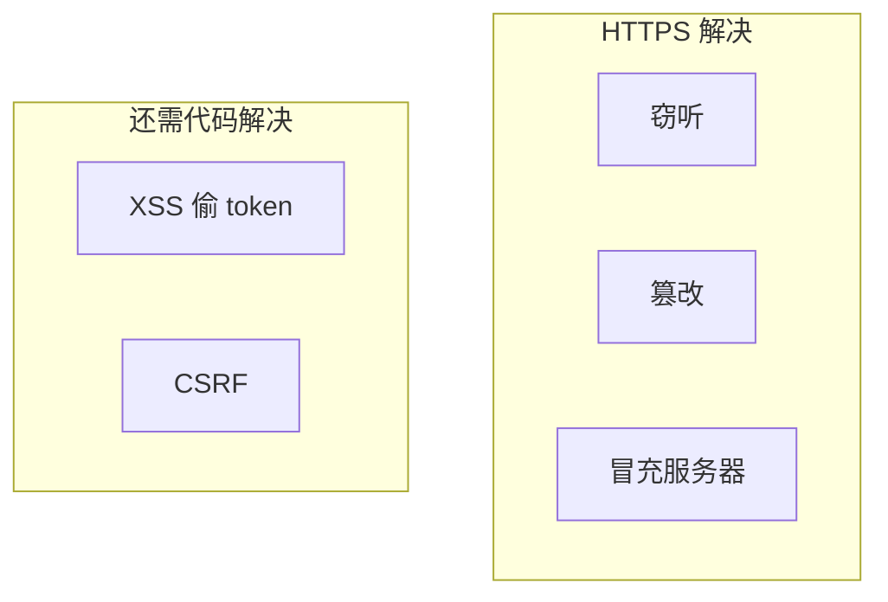

# HTTPS 与 TLS 加密

> 面向前端 / 全栈面试：在 [04-HTTP协议深入](./04-HTTP协议深入.md) 掌握报文与方法的基础上，本章讲清 **为什么必须 HTTPS**、**TLS 如何握手**、**证书链如何建立信任**，以及生产环境 **443 端口、重定向、混合内容、HSTS** 等前端必知配置；并与 shop-vue 登录 token、[Java 04](../../后端学习/Java/04-SpringBoot核心开发.md) 后端、[Vue 08](../Vue/08-Axios网络请求与前后端联调.md) / [React 08](../React/08-Axios网络请求与前后端联调.md) 联调安全实践对齐。

---

## 本章衔接

### 与上一章的关系

| 04 章你已学会 | 05 章继续深入 |
|---------------|---------------|
| HTTP 明文报文、Header、状态码 | 同样报文，但经 **TLS 加密** 后 outsiders 不可读 |
| `Authorization: Bearer token` | token 在 HTTPS 下防**中间人窃听** |
| curl `http://localhost:8080` | 生产 `https://api.example.com:443` |
| HTTP/2 多路复用 | 现代浏览器 **HTTPS 才开 HTTP/2**（localhost 除外） |

[HTML 10](../HTML%20CSS%20JS/10-浏览器HTTP网络与Web基础.md) 仅提到「HTTPS 更安全」；本章把**加密原理 + 证书 + 浏览器安全策略**讲透。



**实战链路**：shop-vue（5173）→ Vite dev 可 HTTP；上线 Nginx 443 终结 TLS → 反代 Java 8080。token 全程应在 TLS 隧道内传输。

---

## 1. 为什么需要 HTTPS？

### 1.1 HTTP 的三类风险

| 风险 | 攻击者能做什么 | 没有 HTTPS 的例子 |
|------|----------------|-------------------|
| **窃听（Eavesdropping）** | 看到密码、JWT、个人信息 | 公共 Wi-Fi 抓包读到 `password` |
| **篡改（Tampering）** | 改响应 JSON、注入脚本 | 把 `{price:99}` 改成 `{price:1}` |
| **冒充（Spoofing）** | 伪装成 api.example.com | 钓鱼站点骗你输入账号密码 |

### 1.2 HTTPS 提供的保障

| 保障 | 机制 | 用户可见表现 |
|------|------|--------------|
| **机密性** | 对称加密传输 | 地址栏小锁 |
| **完整性** | MAC / AEAD 校验 | 被改包解密失败 |
| **身份认证** | 证书 + CA 链 | 证书有效则域名可信 |

### 1.3 为什么前端必须关心 HTTPS？（深入解释 ①）

**不只是后端配证书的事**：

1. **浏览器安全策略**：Secure Context 下才能用某些 API（Service Worker、Geolocation 等）
2. **混合内容拦截**：HTTPS 页面里的 HTTP 脚本会被 block
3. **Cookie 安全**：`Secure` 标记只在 HTTPS 发送；`SameSite` 与跨站攻击相关
4. **token 泄露**：HTTP 下 `Authorization` 头明文，任何链路节点都能读

shop-vue 登录流程：

```text
用户输入密码 → POST /api/login → 响应 { token } → localStorage
```

若走 HTTP，**同一局域网**的攻击者用 Wireshark 类工具即可拿到 token，随后伪造 `Authorization: Bearer xxx` 调用接口。



---

## 2. 加密基础：对称 vs 非对称

### 2.1 对称加密（Symmetric）

**同一把密钥**加密和解密。

| 优点 | 缺点 |
|------|------|
| 速度快，适合大量数据 | 密钥如何安全传给对方？ |

常见算法：**AES-128-GCM**、**AES-256-GCM**、ChaCha20-Poly1305（TLS 1.3 常用）。

```text
明文 + 密钥 K → 密文
密文 + 密钥 K → 明文
```

### 2.2 非对称加密（Asymmetric）

**公钥**加密 / 验签，**私钥**解密 / 签名。密钥成对出现。

| 角色 | 持有 | 用途 |
|------|------|------|
| 服务器 | 私钥 | 解密、证明身份 |
| 客户端 | 公钥（来自证书） | 加密、验证签名 |

常见算法：**RSA**、**ECDHE**（临时椭圆曲线密钥交换，前向安全）。

```text
密文 = Encrypt(明文, 公钥)
明文 = Decrypt(密文, 私钥)   // 只有私钥持有者能解
```

### 2.3 为什么 TLS 要混用两种？（深入解释 ②）

| 阶段 | 用什么 | 原因 |
|------|--------|------|
| **握手** | 非对称（ECDHE/RSA） | 在**不安全信道**上协商出只有双方知道的秘密 |
| **传输 HTTP** | 对称（AES-GCM） | 数据量大，对称加密 **CPU 开销低** |

**面试标准答法**：非对称解决「密钥怎么安全商量」；对称负责「 bulk 数据加密」；TLS 握手结束后用协商好的**会话密钥**加密 HTTP 报文。



### 2.4 数字签名 vs 加密

- **加密**：保密内容
- **签名**：用私钥签名，公钥验证 → 证明「确实是持有私钥的服务器发的」且内容未被改

证书里的签名由 **CA 私钥**签发，浏览器用 **CA 公钥**验证。

---

## 3. CA 与证书链

### 3.1 为什么需要 CA（Certificate Authority）？

若允许自签证书，任何人都能造 `api.bank.com` 的证书——浏览器无法区分真假。

**CA** 是受操作系统 / 浏览器信任的第三方，验证域名归属后签发证书。

### 3.2 证书链结构

```text
根证书（Root CA）           ← 预装在 Windows / macOS / 浏览器
    └── 中间证书（Intermediate CA）
            └── 叶子证书（Leaf）  ← 你的 api.example.com
```

浏览器验证路径：

1. 用**中间 CA 公钥**验证叶子证书签名
2. 用**根 CA 公钥**验证中间证书
3. 根在**信任库**里 → 整条链可信


### 3.3 证书里有什么？

| 字段 | 示例 | 作用 |
|------|------|------|
| **Subject** | `CN=api.example.com` | 证书绑定的域名 |
| **Issuer** | `Let's Encrypt R3` | 签发 CA |
| **Validity** | 2026-01-01 ~ 2026-04-01 | 有效期 |
| **Subject Public Key** | EC P-256 | 服务器公钥 |
| **SAN** | `api.example.com`, `www.example.com` | 多域名 |
| **Signature** | ... | CA 对以上内容的签名 |

### 3.4 自签名 vs 正式证书

| 类型 | 场景 | 浏览器表现 |
|------|------|------------|
| **自签名** | localhost 开发、内网 | ⚠️ 不受信任，需手动例外 |
| **Let's Encrypt 等** | 生产免费 DV 证书 | ✅ 小锁 |
| **OV/EV** | 企业 | 更严格验证 |

本地开发可用 **mkcert** 生成本地信任的证书，避免每次点「继续访问不安全网站」。

---

## 4. TLS 握手：1.2 vs 1.3 简化版

TLS 在 TCP 连接建立后、HTTP 发送前完成。

### 4.1 TLS 1.2 握手（2-RTT 简化）



**步骤口述**：

1. ClientHello：客户端能力 + 随机数
2. ServerHello + **证书**：选定算法，发证书链
3. 客户端**验证证书**，生成 pre-master secret
4. 双方算出**会话密钥**
5. Finished 消息后进入加密通信

**RTT**：通常 **2 个往返** 才开始发 HTTP（不含 TCP 三次握手）。

### 4.2 TLS 1.3 握手（1-RTT，更快）



**改进**：

| 对比项 | TLS 1.2 | TLS 1.3 |
|--------|---------|---------|
| 握手 RTT | ~2 | **~1** |
| 0-RTT 恢复 | 有限 | 支持（有重放风险，慎用） |
| 废弃算法 | RSA 密钥交换、弱 cipher | 仅 **AEAD**、Forward Secrecy |
| 加密范围 | 握手后半段才加密 | 更多握手消息加密 |

### 4.3 前向安全（Forward Secrecy）

使用 **ECDHE** 临时密钥：即使日后服务器私钥泄露，**过去**抓到的密文也无法解密。

**面试点**：TLS 1.3 强制前向安全；老 TLS 1.2 若配置不当用 RSA 密钥交换则不具备。

### 4.4 HTTPS 与 TCP 三次握手的关系

完整冷启动（简化）：

```text
1. TCP SYN / SYN-ACK / ACK          ← 1 RTT
2. TLS 1.3 握手                      ← 1 RTT
3. HTTP 请求/响应                    ← 1 RTT
```

**HTTP/3 + QUIC** 把传输层握手与 TLS 进一步合并（见 04 章 HTTP/3），首屏延迟更低。

---

## 5. HTTPS 端口 443 与 URL

### 5.1 默认端口

| 协议 | 默认端口 | URL 示例 |
|------|----------|----------|
| HTTP | **80** | `http://example.com`（等价 :80） |
| HTTPS | **443** | `https://example.com`（等价 :443） |

省略端口时浏览器用默认值。Spring Boot 内嵌 Tomcat 默认 **8080 HTTP**；生产由 **Nginx/Caddy** 在 443 终结 TLS，反代到 8080。



### 5.2 开发 vs 生产

| 环境 | 常见做法 |
|------|----------|
| 本地 shop-vue | `http://localhost:5173` + Vite proxy |
| 本地 Java | `http://localhost:8080` |
| 生产 | `https://www.shop.com` → Nginx 443 → 8080 |

**注意**：内网反代段可以是 HTTP，但**浏览器到 Nginx** 必须是 HTTPS，用户才安全。

---

## 6. HTTP 到 HTTPS 重定向

### 6.1 为什么要重定向？

- 用户习惯输入 `http://shop.com`
- SEO 与 Cookie 域统一
- 避免明文泄露

### 6.2 常见实现

**Nginx**：

```nginx
server {
    listen 80;
    server_name shop.com www.shop.com;
    return 301 https://$host$request_uri;
}

server {
    listen 443 ssl http2;
    server_name shop.com;
    ssl_certificate     /etc/ssl/fullchain.pem;
    ssl_certificate_key /etc/ssl/privkey.pem;
    location / {
        proxy_pass http://127.0.0.1:8080;
    }
}
```

**Spring Boot**（可选，生产更常放 Nginx）：

```java
@Configuration
public class HttpsRedirectConfig {
    @Bean
    public ServletWebServerFactory servletContainer() {
        TomcatServletWebServerFactory tomcat = new TomcatServletWebServerFactory() {
            @Override
            protected void postProcessContext(Context context) {
                SecurityConstraint constraint = new SecurityConstraint();
                constraint.setUserConstraint("CONFIDENTIAL");
                SecurityCollection collection = new SecurityCollection();
                collection.addPattern("/*");
                constraint.addCollection(collection);
                context.addConstraint(constraint);
            }
        };
        tomcat.addAdditionalTomcatConnectors(httpConnector());
        return tomcat;
    }
    // HTTP 8080 → 302 到 HTTPS 8443（示例，端口按实际）
}
```

### 6.3 301 vs 302 重定向到 HTTPS

| 状态码 | 使用 |
|--------|------|
| **301** | 永久迁移，搜索引擎更新索引 |
| **302** | 临时（一般不用于全站 HTTPS） |

前端 Axios `baseURL` 应直接写 **`https://`**，避免先 HTTP 再 301 多一次往返。

---

## 7. 混合内容（Mixed Content）

### 7.1 定义

**HTTPS 页面**加载了 **HTTP 资源**（脚本、样式、图片、iframe、XHR）。

### 7.2 浏览器策略

| 类型 | 示例 | 现代浏览器 |
|------|------|------------|
| **Active Mixed** | `<script src="http://...">`、XHR `http://api` | **blocked** |
| **Passive Mixed** | `` | 可能允许但 ⚠️ 警告 |

Console 典型报错：

```text
Mixed Content: The page at 'https://shop.com/' was loaded over HTTPS,
but requested an insecure XMLHttpRequest endpoint 'http://api.shop.com/users'.
This request has been blocked; the content must be served over HTTPS.
```

### 7.3 shop-vue 如何避免

| 配置 | 正确 | 错误 |
|------|------|------|
| Axios baseURL | `https://api.shop.com` 或相对 `/api` | `http://api.shop.com` |
| Vite 生产环境变量 | `VITE_API_BASE=https://...` | 硬编码 http |
| 静态资源 CDN | `https://cdn.shop.com` | `http://...` |

开发环境 Vite proxy 用相对路径 `/api` → 浏览器只和 **5173 HTTPS/HTTP** 同源，由 dev server 转发，**不会触发混合内容**。

---

## 8. HSTS（HTTP Strict Transport Security）

### 8.1 是什么？

响应头告诉浏览器：**在 max-age 内，强制用 HTTPS 访问该域**，即使用户输入 `http://`。

```http
Strict-Transport-Security: max-age=31536000; includeSubDomains; preload
```

### 8.2 防什么攻击？

**SSL Stripping**：中间人把用户的 HTTPS 链接降级成 HTTP。HSTS 后浏览器**直接发 HTTPS**，不给首次明文机会（首次访问除外，故还有 **HSTS Preload List**）。



### 8.3 前端注意

- 本地 `localhost` 一般不加 HSTS
- `includeSubDomains` 会影响所有子域
- 提交 **preload** 后很难撤销，需慎重

---

## 9. Cookie / Token 安全属性（衔接 shop-vue）

### 9.1 Set-Cookie 安全 flags

| 属性 | 作用 |
|------|------|
| **Secure** | 仅 HTTPS 发送 |
| **HttpOnly** | JS 无法 `document.cookie` 读取，防 XSS 偷 Cookie |
| **SameSite=Strict/Lax** | 降低 CSRF 风险 |

Java 04 若用 Cookie 存 Session：

```java
ResponseCookie.from("SESSION", sessionId)
    .httpOnly(true)
    .secure(true)      // 生产 true
    .sameSite("Lax")
    .build();
```

### 9.2 JWT 在 localStorage（shop-vue 08 常见）

| 存法 | XSS 风险 | CSRF | HTTPS 必要性 |
|------|----------|------|--------------|
| localStorage + Authorization | token 可被 XSS 脚本读 | 较低 | **必须 HTTPS 防传输窃听** |
| HttpOnly Cookie | JS 读不到 | 需 SameSite / CSRF Token | 必须 Secure |

**结论**：无论哪种，**生产传输层必须 HTTPS**；localStorage 还要防 XSS（ CSP、转义用户输入）。

### 9.3 Axios 与 HTTPS

```javascript
// shop-vue .env.production
// VITE_API_BASE=https://api.shop.com

const api = axios.create({
  baseURL: import.meta.env.VITE_API_BASE,
  timeout: 10000,
})
```

拦截器里的 token 在 TLS 隧道内传输：

```http
Authorization: Bearer eyJ...
```

攻击者在链路上只能看到 **TLS 密文**。

---

## 10. 手把手：Chrome DevTools Security 面板

### 10.1 打开方式

1. `F12` → **Security** 标签（Chrome；Edge 类似）
2. 访问 `https://www.baidu.com` 或任意 HTTPS 站

### 10.2 面板信息解读

| 区域 | 含义 |
|------|------|
| **Overview** | 本页是否 secure、证书状态 |
| **Main origin** | 主文档 TLS 版本、cipher |
| **Certificate** | 查看证书链、有效期、SAN |
| **Mixed content** | 若有，列出 blocked / allowed 资源 |

### 10.3 查看证书详情

Security → **View certificate**：

- **Issued to**：域名
- **Issued by**：CA
- **Validity period**
- **Public key**

### 10.4 Network 面板配合

选中 HTTPS 请求 → **Headers**：

```text
:scheme: https
:authority: api.example.com
```

**Security** 列（需在 Network 表头启用）显示 TLS 版本、密钥交换组。

### 10.5 本地 Spring Boot 开 HTTPS（可选实验）

`application.yml` 片段（需先生成 keystore）：

```yaml
server:
  port: 8443
  ssl:
    enabled: true
    key-store: classpath:keystore.p12
    key-store-password: changeit
    key-store-type: PKCS12
```

访问 `https://localhost:8443/api/users` → Security 面板会显示自签名警告。

---

## 11. 手把手：curl 验证 HTTPS

### 11.1 访问公网 HTTPS

```bash
curl -v https://httpbin.org/get
```

**预期（节选）**：

```text
* TLSv1.3 (OUT), TLS handshake, Client hello
* TLSv1.3 (IN), TLS handshake, Server hello
* SSL connection using TLSv1.3 / TLS_AES_256_GCM_SHA384
> GET /get HTTP/2
> Host: httpbin.org
<
< HTTP/2 200
```

### 11.2 查看证书信息

```bash
curl -vI https://www.baidu.com 2>&1 | findstr /i "subject issuer SSL"
```

（Linux/macOS 用 `grep -i`）

### 11.3 跳过证书验证（仅调试自签名）

```bash
curl -k https://localhost:8443/api/users
```

**`-k` / `--insecure`**：不验证证书链——**切勿在生产脚本中习惯使用**。

### 11.4 指定 TLS 版本（排查用）

```bash
curl --tlsv1.2 -v https://example.com
curl --tls-max 1.3 -v https://example.com
```

---

## 12. 与 Java 04 / Vue 08 的全链路安全



| 环节 | 安全要点 |
|------|----------|
| 浏览器 ↔ Nginx | TLS 1.2+、有效证书、HSTS |
| Nginx ↔ Java | 内网隔离；可选 mTLS |
| 登录接口 | HTTPS + 密码后端哈希（BCrypt） |
| token 传输 | 仅 HTTPS；短过期 + 刷新 |
| CORS | 不用 `*` 配 credentials；明确 Origin |

详见 [Java 04 §JWT 登录](../../后端学习/Java/04-SpringBoot核心开发.md)、[Vue 08 §拦截器](../Vue/08-Axios网络请求与前后端联调.md)。

---

## 13. 常见报错与排查表

| 现象 | 原因 | 排查 | 解决 |
|------|------|------|------|
| `NET::ERR_CERT_AUTHORITY_INVALID` | 自签名 / 过期 / 链不完整 | Security 面板看证书 | 换正规 CA；补中间证书 |
| `NET::ERR_CERT_DATE_INVALID` | 证书过期 | 看 Validity | 续签 Let's Encrypt |
| `NET::ERR_CERT_COMMON_NAME_INVALID` | 域名与 CN/SAN 不匹配 | 证书 Subject | 重签含正确域名 |
| Mixed Content blocked | HTTPS 页请求 HTTP 资源 | Console 红色 Mixed | 全改 https 或相对路径 |
| `SSL_ERROR_SYSCALL` | 链路中断、防火墙 | curl -v | 查 Nginx、端口 443 |
| 只有 HTTP 能访问 | 443 未监听 / 云安全组 | `telnet host 443` | 开防火墙规则 |
| 301 循环 | HTTP/HTTPS 互相重定向 | curl -I 跟踪 | 修正 Nginx 配置 |
| HSTS 导致本地 http 失败 | 曾访问过带 HSTS 的域 | Chrome hsts 设置 | 开发用其他域名 |
| axios `ERR_NETWORK` | CORS + HTTPS 证书失败 | Network 是否发出 | 修证书或 dev proxy |
| 小锁带 ⚠️ | 被动混合内容 | Security 详情 | 改 img/script 为 https |
| TLS 版本过低 | 服务器只开 TLS 1.0 | ssllabs 检测 | 禁用 1.0/1.1，开 1.2/1.3 |
| token 泄露 suspicion | 曾用 HTTP 上线 | 访问日志 | 强制 HTTPS + 轮换密钥 |

---

## 14. 面试高频问答

### Q1：HTTPS 就是加密吗？

不完全是。= **HTTP + TLS**（加密 + 完整性 + **身份验证**）。

### Q2：对称和非对称分别用在哪？

非对称用于握手协商；对称用于 HTTP 数据传输。

### Q3：TLS 1.3 比 1.2 快在哪？

**1-RTT** 握手；更少的明文握手消息；现代 AEAD 算法。

### Q4：什么是中间人攻击？HTTPS 如何防？

攻击者插在客户端和服务器之间。HTTPS 验证**证书链**且域名匹配，浏览器拒绝假证书。

### Q5：JWT 放 Header 还是 Cookie？

各有优劣；都要 HTTPS。Header + localStorage 防 CSRF 弱但怕 XSS；HttpOnly Cookie 相反。

### Q6：生产 Spring Boot 怎么配 HTTPS？

通常 **Nginx 443 终结 TLS**，反代 8080；证书用 Let's Encrypt 或云厂商证书。

---

## 15. 练习建议

### 基础题

1. 说出 HTTP 明文传输的三类风险，HTTPS 分别如何应对。
2. 对称加密和非对称加密的区别？TLS 为何混用？
3. 画证书链：根 CA → 中间 CA → 叶子证书，浏览器如何验证？
4. HTTPS 默认端口？Spring Boot 默认端口？生产如何配合 Nginx？
5. 什么是混合内容？Active 和 Passive 区别？

### 进阶题

6. 对比 TLS 1.2 与 1.3 握手 RTT，说明 1.3 安全改进。
7. 解释 HSTS 防 SSL Stripping 的原理；`preload` 是什么？
8. shop-vue 若 `baseURL` 误配 `http://` 而上线的页面是 HTTPS，会发生什么？
9. 说明 `Secure`、`HttpOnly`、`SameSite` 三个 Cookie 属性。
10. 用 DevTools Security 查看任意 HTTPS 站证书链，记录 Issuer 和有效期。

### 挑战题

11. 用 mkcert 或 openssl 为 localhost 生成证书，Spring Boot 开 8443，curl 与浏览器访问对比。
12. 写 Nginx 配置：`80 → 301 https`，`443 http2` 反代 `8080`，并加 HSTS 头。

---

## 16. 练习参考答案（节选）

### 基础题 1 答案

窃听 → 对称加密；篡改 → MAC/AEAD；冒充 → CA 证书链验证服务器身份。

### 基础题 2 答案

对称：同一密钥，快；非对称：公钥/私钥，慢但可解决密钥交换。TLS 握手用非对称协商 session key，传输用对称 AES-GCM。

### 基础题 5 答案

HTTPS 页面加载 HTTP 资源。**Active**：脚本、XHR、CSS（部分）→ 阻塞。**Passive**：图片、音视频 → 可能警告。

### 进阶题 8 答案

浏览器 **block** 主动混合内容；Axios 请求 API 失败，Console 报 Mixed Content，登录 token 拿不到。

### 进阶题 9 答案

- **Secure**：仅 HTTPS 发送 Cookie
- **HttpOnly**：JS 不可读，减 XSS 偷 Cookie
- **SameSite**：限制跨站携带，Lax/Strict 减 CSRF

---

## 17. 学完标准

完成本章后，你应能：

- [ ] **解释** 为什么生产环境必须 HTTPS，并与 shop-vue token 传输关联
- [ ] **区分** 对称/非对称加密及在 TLS 中的分工
- [ ] **描述** CA 证书链验证流程，看懂 DevTools 证书详情
- [ ] **对比** TLS 1.2（~2 RTT）与 TLS 1.3（~1 RTT）握手
- [ ] **说明** 443 端口、Nginx TLS 终结、内网 HTTP 反代架构
- [ ] **配置理解** HTTP→HTTPS 301 重定向与 HSTS 作用
- [ ] **识别** 混合内容报错并知道如何把 API/CDN 改为 HTTPS
- [ ] **使用** DevTools Security + Network 查看 TLS 版本与证书
- [ ] **使用** curl -v 观察 TLS 握手与 HTTP/2
- [ ] **口述** Cookie Secure/HttpOnly 与 JWT localStorage 的安全权衡（面试版）

---

## 下一章预告

建议后续章节（计算机网络系列）：

| 章节 | 主题 |
|------|------|
| 06 | **DNS 深入与 CDN** — 解析流程、缓存、前端静态资源加速 |
| 07 | **Web 安全基础** — XSS、CSRF、CORS 深入、CSP |
| 08 | **TCP/IP 与抓包入门** — 三次握手、Wireshark 对照 TLS |

也可回到 [Vue 08](../Vue/08-Axios网络请求与前后端联调.md) 完善生产环境 `VITE_API_BASE` 与 [Java 09-LinuxDockerNginx部署基础](../../后端学习/Java/09-LinuxDockerNginx部署基础.md) 部署 HTTPS。

---

## 附录：HTTPS 排查清单（上线前）

```text
□ 证书有效且域名 SAN 匹配
□ 证书链完整（含中间证书）
□ 80 → 301 → 443
□ HSTS（可选 preload）
□ 全站资源与 API 无 http:// 混合内容
□ TLS 1.2+，禁用 1.0/1.1
□ Cookie Secure + HttpOnly（若用 Cookie）
□ token 接口仅 HTTPS
□ 云安全组开放 443
```

**交叉链接汇总**：

| 主题 | 文档 |
|------|------|
| HTTP 报文、方法、状态码 | [04-HTTP协议深入](./04-HTTP协议深入.md) |
| 浏览器网络入门 | [HTML 10](../HTML%20CSS%20JS/10-浏览器HTTP网络与Web基础.md) |
| Axios、token、联调 | [Vue 08](../Vue/08-Axios网络请求与前后端联调.md) / [React 08](../React/08-Axios网络请求与前后端联调.md) |
| Spring Boot、Result、CORS | [Java 04](../../后端学习/Java/04-SpringBoot核心开发.md) |
| Nginx 部署 | [Java 09](../../后端学习/Java/09-LinuxDockerNginx部署基础.md) |

---

## 18. 密钥交换算法演进（面试加分）

| 机制 | 前向安全 | 说明 |
|------|----------|------|
| **RSA 密钥传输** | ❌ | 老方案，用服务器 RSA 公钥加密 pre-master secret |
| **DHE / ECDHE** | ✅ | 临时 Diffie-Hellman，每次握手新密钥 |
| **TLS 1.3** | ✅ 强制 | 移除 RSA key transport |

**ECDHE** 在握手消息里交换椭圆曲线公钥，双方算出共享秘密，再导出 **session key**。



---

## 19. 证书类型与验证级别

| 类型 | 验证内容 | 适用 | 价格 |
|------|----------|------|------|
| **DV** | 域名控制权 | 个人站、API | 免费（Let's Encrypt） |
| **OV** | 企业信息 | 公司官网 | 付费 |
| **EV** | 严格企业审计 | 金融（地址栏曾显公司名，现已弱化） | 付费 |
| **通配符** | `*.example.com` | 多子域 | 付费 |

前端只需确保证书 **SAN 覆盖你的 API 域名**（如 `api.shop.com`）。

---

## 20. Let's Encrypt 与自动续期（运维协作）

```text
certbot certonly --webroot -w /var/www/html -d shop.com -d www.shop.com
```

| 步骤 | 说明 |
|------|------|
| ACME 验证 | CA 访问 `http://shop.com/.well-known/acme-challenge/xxx` |
| 签发 | 90 天有效 |
| 续期 | cron + certbot renew；Nginx reload |

**前端关联**：证书过期未续 → 用户见 `ERR_CERT_DATE_INVALID`，全站不可用。

---

## 21. OCSP Stapling 与 CRL（了解）

| 机制 | 作用 |
|------|------|
| **CRL** | 证书吊销列表，体积大 |
| **OCSP** | 在线查询单证书是否吊销 |
| **OCSP Stapling** | 服务器把 OCSP 响应钉在 TLS 握手，浏览器少一次查询 |

Nginx 配置 `ssl_stapling on;` 可降延迟。面试知道「防止吊销证书仍被误信」即可。

---

## 22. 公钥固定（Certificate Pinning）

移动端 App 有时内置「只信任某公钥」；**Web 端** 曾用 HPKP（HTTP Public Key Pinning），因误配风险高**已废弃**。

浏览器依赖 **CA 信任库**，不靠前端 JS 固定证书。

---

## 23. Secure Context 与 Web API

下列 API 仅在 **Secure Context**（HTTPS 或 localhost）可用：

| API | 用途 |
|-----|------|
| **Service Worker** | PWA 离线缓存 |
| **Geolocation** | 定位 |
| **Clipboard API** | 剪贴板 |
| **Web Crypto** |  subtle crypto |
| **getUserMedia** | 摄像头麦克风 |

shop-vue 若要 PWA，生产必须 HTTPS。

---

## 24. 内容安全策略 CSP（与 HTTPS 互补）

HTTPS 防传输窃听；**CSP** 防 XSS 注入：

```http
Content-Security-Policy: default-src 'self'; script-src 'self' https://cdn.shop.com
```

| 指令 | 作用 |
|------|------|
| `default-src` | 默认资源来源 |
| `script-src` | 脚本白名单 |
| `upgrade-insecure-requests` | 自动把 HTTP 子资源升 HTTPS |

与混合内容：`upgrade-insecure-requests` 可自动升级 passive 资源。

---

## 25. shop-vue 登录全链路安全复盘

### 25.1 开发环境（可 HTTP）

```text
localhost:5173 → Vite proxy → localhost:8080
```

同源 / 代理，无混合内容；token 在本地仍可能被本机恶意软件读，但无网络窃听风险。

### 25.2 生产环境（必须 HTTPS）

```javascript
// .env.production
VITE_API_BASE=https://api.shop.com
```

```javascript
// userStore 登录
async function login(form) {
  const { data } = await api.post('/api/login', form)
  if (data.code === 0) {
    localStorage.setItem('token', data.data.token)
    api.defaults.headers.common.Authorization = `Bearer ${data.data.token}`
  }
}
```

### 25.3 威胁模型对照

| 威胁 | HTTP 生产 | HTTPS 生产 |
|------|-----------|------------|
| Wi-Fi 嗅探 password | ❌ 明文 | ✅ 加密 |
| 嗅探 JWT | ❌ 明文 | ✅ 加密 |
| 假 api 服务器 | ❌ 无验证 | ✅ 证书校验 |
| XSS 偷 localStorage | ❌ 仍可能 | ❌ 仍可能（靠 CSP/转义） |

**结论**：HTTPS 不防 XSS，但**必做**；XSS 靠输入消毒、CSP、HttpOnly Cookie（若改方案）。



---

## 26. Nginx HTTPS 完整示例（配合 Java 09）

```nginx
upstream spring_boot {
    server 127.0.0.1:8080;
}

server {
    listen 443 ssl http2;
    server_name api.shop.com;

    ssl_certificate     /etc/letsencrypt/live/api.shop.com/fullchain.pem;
    ssl_certificate_key /etc/letsencrypt/live/api.shop.com/privkey.pem;
    ssl_protocols       TLSv1.2 TLSv1.3;
    ssl_ciphers         HIGH:!aNULL:!MD5;
    ssl_prefer_server_ciphers on;

    add_header Strict-Transport-Security "max-age=31536000; includeSubDomains" always;

    location /api/ {
        proxy_pass http://spring_boot;
        proxy_set_header Host $host;
        proxy_set_header X-Real-IP $remote_addr;
        proxy_set_header X-Forwarded-For $proxy_add_x_forwarded_for;
        proxy_set_header X-Forwarded-Proto $scheme;
    }
}

server {
    listen 80;
    server_name api.shop.com;
    return 301 https://$host$request_uri;
}
```

Spring Boot 读真实协议：

```yaml
server:
  forward-headers-strategy: framework
```

---

## 27. DevTools 续：对比 HTTP 与 HTTPS 站点

| 操作 | HTTP 站 | HTTPS 站 |
|------|---------|----------|
| Security 概览 | Not secure | Secure |
| 查看证书 | 无 / 不可用 | View certificate |
| Mixed content | 无此问题 | 可能有警告 |
| Protocol | http/1.1 | h2 常见 |

**实验**：分别打开 `http://neverssl.com` 与 `https://www.baidu.com`，对比 Security 面板截图说明。

---

## 28. openssl 查看证书（终端手把手）

```bash
# 查看服务器证书（Windows 需 OpenSSL 或 Git Bash）
openssl s_client -connect www.baidu.com:443 -servername www.baidu.com </dev/null 2>/dev/null | openssl x509 -noout -subject -issuer -dates
```

**预期输出示例**：

```text
subject=CN = baidu.com
issuer=C = US, O = DigiCert Inc, OU = www.digicert.com, CN = GeoTrust CN RSA CA G1
notBefore=Mar  1 00:00:00 2026 GMT
notAfter=Mar  1 23:59:59 2027 GMT
```

---

## 29. TLS 与 HTTP 版本协商

现代浏览器访问 HTTPS 时：

```text
TCP → TLS 1.3 握手 → ALPN 协商 h2 或 http/1.1 → 加密 HTTP
```

| ALPN 结果 | 含义 |
|-----------|------|
| `h2` | HTTP/2 over TLS |
| `http/1.1` | HTTP/1.1 over TLS |

**04 章**：HTTP/2 多路复用；**05 章**：必须在 TLS 之上（浏览器策略）。

---

## 30. 更多练习与参考答案

### 练习 13

为什么 CA 根证书要预装系统，而不能每次让用户自己选？

**答案**：否则攻击者可诱导用户信任恶意根 CA，签发任意假证书，HTTPS 身份认证失效。

### 练习 14

TLS 握手完成后，更换 Wi-Fi 到 4G，HTTP/3 QUIC 为何不断连？

**答案**：QUIC 用 **Connection ID** 标识连接，不绑定单一 IP；TCP 连接绑四元组，换网易断。

### 练习 15

生产环境 Axios 应用 `withCredentials: true` 且后端 CORS `Allow-Credentials`，为何还必须 HTTPS？

**答案**：带 Cookie 的跨域 credentialed 请求在 Secure Context 更安全；Cookie 设 Secure 时 HTTP 根本不会发送；防窃听与中间人。

---

## 31. 面试模拟：2 分钟 HTTPS 口述稿

> HTTPS 在 HTTP 和 TCP 之间加了 TLS，提供加密、完整性和服务器身份验证。握手时用非对称算法如 ECDHE 协商出 session key，之后用 AES-GCM 对称加密 HTTP 数据。证书由 CA 签发，浏览器验证链到信任根。TLS 1.3 约 1-RTT 比 1.2 快。生产用 443，Nginx 终结 TLS 反代 Spring Boot。要防混合内容、配 HSTS、Cookie 设 Secure。shop-vue 的 JWT 在 Authorization 头里，必须走 HTTPS 防链路嗅探；XSS 还要靠 CSP 和转义。

---

## 32. 本章知识点索引

| § | 关键词 |
|---|--------|
| 1 | 窃听、篡改、冒充 |
| 2 | 对称 AES、非对称 RSA/ECDHE |
| 3 | CA、证书链、SAN |
| 4 | TLS 1.2 vs 1.3、1-RTT |
| 5-6 | 443、301 重定向 |
| 7-8 | 混合内容、HSTS |
| 9 | Cookie Secure、JWT localStorage |
| 10-11 | DevTools Security、curl -v |
| 26 | Nginx ssl、proxy_pass |

---

## 33. HTTP 与 HTTPS 并排对照（复习 04 + 05）

| 维度 | HTTP | HTTPS |
|------|------|-------|
| 默认端口 | 80 | 443 |
| 传输 | 明文 | TLS 密文 |
| 证书 | 不需要 | 需要有效证书链 |
| 浏览器地址栏 | Not secure | 小锁 |
| HTTP/2（浏览器） | localhost 除外一般不行 | 支持 |
| 混合内容 | 无 | HTTPS 页不能随意引 HTTP |
| token 安全 | 链路可嗅探 | 链路加密 |
| curl | `http://` | `https://`，自签名需 `-k` |
| 性能 | 少 TLS 握手 | 多 1～2 RTT（TLS 1.3 已优化） |

---

## 34. 双向 TLS（mTLS）简介

普通 HTTPS 只验证**服务器**身份；**mTLS** 客户端也出示证书，用于：

- 微服务间内部调用
- 企业 API 网关
- 零信任架构

前端 SPA **一般不配**客户端证书；了解即可，面试提到「To B 内网 API 可能用 mTLS」加分。

---

## 35. 从抓包角度理解 HTTPS（概念）

Wireshark 抓 HTTPS 流量：

| 可见 | 不可见（无服务器私钥时） |
|------|--------------------------|
| 目标 IP、端口 443 | HTTP 方法、路径、Header、Body |
| TLS 握手 ClientHello | JWT、密码明文 |
| 密文包长度与时间 | JSON 内容 |

**Wireshark 解密条件**：拥有服务器私钥或浏览器 SSLKEYLOGFILE——生产环境不应泄露私钥。

这解释了为何 **HTTP 时代** Fiddler 可直接改包，**HTTPS** 后必须信任代理证书才能调试。

---

## 36. Fiddler / Charles 调试 HTTPS（开发技巧）

本地调试 HTTPS 接口时：

1. 安装 Fiddler / Charles
2. 安装其**根 CA**到系统信任库
3. 浏览器信任该 CA 后，代理可解密再加密

| 注意 | 说明 |
|------|------|
| 仅开发机 | 勿在生产用户机器装 |
| 与 HSTS | 某些站点 pin 证书，代理会失败 |
| shop-vue | 开发用 HTTP proxy 更简单，不必走 HTTPS 抓包 |

---

## 37. Spring Boot 直接配置 HTTPS（Java 04 延伸）

```yaml
# application-prod.yml
server:
  port: 8443
  ssl:
    enabled: true
    key-store: file:/etc/ssl/keystore.p12
    key-store-password: ${SSL_PASSWORD}
    key-store-type: PKCS12
```

配合 `@Value` 读取 `X-Forwarded-Proto` 生成绝对 URL 时要用 `https`。

**更常见**：8443 仅内网，对外仍 Nginx 443。

---

## 38. React 08 同等适用说明

[React 08](../React/08-Axios网络请求与前后端联调.md) 的 shop-react 项目与本章内容**完全同构**：

- `axios.create({ baseURL: import.meta.env.VITE_API_BASE })`
- 生产 `.env` 写 `https://`
- Zustand 存 token 与 Pinia 相同安全考量

---

## 39. 最终自检清单（05 章）

```text
□ 能白板画 TLS 1.3 简化握手（1-RTT）
□ 能解释证书链验证失败时浏览器为何阻断
□ 能说出 shop-vue token 在 HTTP 下的风险
□ 能在 DevTools Security 找到 TLS 版本与 cipher
□ 能写 Nginx 80→443 + HSTS 三行核心配置
□ 能区分混合内容 Active / Passive
□ 知道 HSTS preload 的含义与风险
□ 知道 HTTPS 不防 XSS，还需 CSP
```
