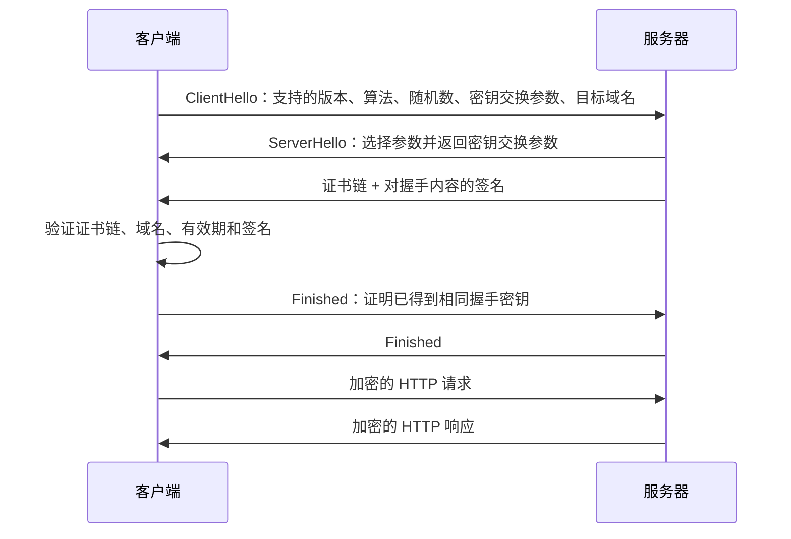

# HTTPS 与 TLS 加密

> 本章目标：理解 HTTPS 保护什么、证书怎样证明服务器身份、TLS 握手为什么同时使用非对称和对称密码。
>
> 前置：[04 · HTTP 协议](./04-HTTP协议深入.md)　下一章：[06 · 缓存、Cookie 与会话](./06-缓存Cookie与会话机制.md)

---

## 1. 先记住三个结论

1. **HTTPS = HTTP 通过 TLS 安全通道传输。HTTP 语义没有消失，只是内容被加密保护。**
2. **证书解决“我连的是不是真服务器”，加密解决“别人能不能看懂和篡改通信”。**
3. **TLS 握手使用非对称密码建立信任和协商密钥，后续大量数据使用高效的对称加密。**

---

## 2. 明文 HTTP 有什么风险

在不可信网络中发送明文 HTTP，请求可能经过路由器、代理、运营商网络或公共 Wi-Fi。

攻击者如果能够观察或修改链路，可能：

### 窃听

看到：

- 密码；
- Cookie；
- JWT；
- 请求和响应 JSON；
- 查询参数。

POST Body 也只是放在报文 body，不是加密。

### 篡改

攻击者可能修改响应页面、下载文件、接口数据或重定向地址。

### 冒充

客户端可能连接到伪造服务器，却误以为它是真正的 `api.example.com`。

TLS 主要提供：

- 机密性：旁观者看不懂内容；
- 完整性：篡改会被发现；
- 身份认证：客户端验证服务器证书和域名。

TLS 不自动解决：

- 服务器自己的业务漏洞；
- SQL 注入、越权、弱密码；
- 客户端设备中毒；
- 用户主动把 token 发给骗子；
- 服务端日志误记密码。

---

## 3. 先分清四个密码学概念

### 3.1 对称加密

加密和解密使用同一份密钥。

```text
明文 + 会话密钥 → 密文
密文 + 同一会话密钥 → 明文
```

优点：速度快，适合加密大量 HTTP 数据。

难点：通信双方一开始怎样安全获得同一密钥？如果直接明文发送密钥，攻击者也能拿到。

现代 TLS 常使用 AES-GCM 或 ChaCha20-Poly1305 这类 AEAD 算法，在加密同时验证完整性。

### 3.2 非对称密码

使用一对相关密钥：公钥和私钥。

- 公钥可以公开；
- 私钥必须由持有者保密。

非对称密码可用于密钥交换、数字签名等，但计算成本高于对称加密，不适合直接加密整个大文件和所有连接数据。

### 3.3 哈希

哈希把任意长度输入计算为固定长度摘要：

```text
输入 → 哈希函数 → 摘要
```

重要特性是输入稍有变化，摘要通常完全不同；并且很难从摘要反推出原文。

哈希不是加密，因为它通常没有“解密还原”过程。

### 3.4 数字签名

签名用于证明：

- 这份数据由私钥持有者签发；
- 数据签发后没有被修改。

简化理解：

```text
签名方：对消息摘要使用私钥生成签名
验证方：使用公钥验证签名
```

数字签名重点是身份与完整性，不等同于把消息内容加密隐藏。

---

## 4. 为什么有公钥还不够

假设攻击者在中间把服务器公钥替换成自己的公钥：

```text
客户端 ←→ 攻击者 ←→ 真服务器
```

如果客户端无法确认公钥属于谁，就可能与攻击者建立“看起来加密”的连接。

因此需要证书把：

```text
域名 + 公钥 + 有效期 + 签发者
```

绑定在一起，并由受信任的证书颁发机构签名。

---

## 5. 证书和 CA 怎样建立信任

服务器证书通常包含：

- 证书适用的域名；
- 服务器公钥；
- 有效期；
- 签发者；
- 使用限制；
- CA 的数字签名。

### 证书链

实际验证通常不是“浏览器直接认识每个网站”，而是一条链：

```text
网站证书
  ← 中间 CA 签发
  ← 根 CA 签发或授权
  ← 根证书预置在操作系统/浏览器信任库
```

浏览器逐级验证签名，最终连接到本地信任的根证书。

### 客户端会检查什么

至少包括：

1. 证书链签名是否有效；
2. 根 CA 是否受信任；
3. 当前时间是否在证书有效期内；
4. 请求域名是否包含在证书 SAN 中；
5. 证书用途是否允许服务端认证；
6. 证书是否被撤销或存在其他策略问题。

### SAN 为什么重要

现代客户端主要通过 Subject Alternative Name 检查域名。例如证书可以包含：

```text
DNS: api.example.com
DNS: www.example.com
```

访问一个未包含的域名会出现域名不匹配错误。

### 自签名证书

自签名证书由自己签发，不在客户端默认信任链中，所以浏览器会警告。

它可以用于本地开发或内部测试，但需要把相应根证书安全加入测试环境信任库。生产公网服务通常使用公开受信任 CA 签发的证书。

---

## 6. TLS 1.3 握手讲人话版本

访问：

```text
https://api.example.com/health
```

在 DNS 和 TCP 之后，HTTP 之前，会进行 TLS 握手。



### ClientHello

客户端告诉服务器：

- 支持哪些 TLS 版本；
- 支持哪些密码套件；
- 随机参数；
- 密钥交换所需参数；
- 想访问哪个域名，通常通过 SNI。

### ServerHello 与证书

服务器选择双方都支持的算法，返回自己的密钥交换参数和证书链，并用证书对应私钥证明身份。

### 客户端验证证书

客户端检查证书链、域名、时间和签名。如果失败，连接终止，不应继续发送敏感 HTTP 数据。

### 产生会话密钥

双方通过密钥交换计算出相同的共享秘密，再派生出本连接使用的对称密钥。

密钥本身不是简单从网络直接明文发送。

### 加密 HTTP

握手完成后，HTTP 请求行、Header、Cookie、JWT 和 Body 都在 TLS 记录中加密传输。

中间网络仍能看到部分连接元数据，例如目标 IP、数据量和时间。TLS 不会把“发生了通信”完全隐藏。

---

## 7. ECDHE 和前向安全

现代 TLS 常使用临时 ECDHE 密钥交换。

核心价值是前向安全：

> 即使服务器长期私钥将来泄露，攻击者也不能仅凭私钥解密过去抓到的所有历史会话。

因为每次会话使用临时密钥交换参数，历史会话密钥不会直接由长期私钥恢复。

当前阶段不需要推导椭圆曲线数学，只需理解：

- 证书私钥主要用于证明服务器身份；
- 临时密钥交换产生本次连接的秘密；
- 后续使用对称密钥加密数据。

---

## 8. TLS 1.2 与 TLS 1.3 的主要区别

概念层面记住：

- TLS 1.3 移除了许多旧算法和不安全组合；
- 正常首次握手需要更少往返；
- 默认采用提供前向安全的密钥交换；
- 握手中更多内容得到加密保护；
- 协议选择更简单，更不容易误配。

生产系统应优先支持现代 TLS，不应为了兼容极老客户端继续开启 SSLv3、TLS 1.0 等过时协议。

---

## 9. SNI 解决什么问题

一台服务器或负载均衡的同一个 IP:443 可能承载多个域名：

```text
api.example.com
admin.example.com
static.example.com
```

TLS 握手早期，服务器还没收到加密后的 HTTP Host Header，但需要先选择正确证书。

客户端通过 SNI 告诉服务器想访问的域名，服务器据此选择证书。

所以：

- DNS 把域名指向 IP；
- SNI 帮 TLS 端选择证书；
- HTTP Host 帮应用层或反向代理选择站点。

---

## 10. HTTPS 生产部署通常长什么样

Go 服务不一定直接管理公网证书。常见架构：

```text
客户端
  ↓ HTTPS :443
Nginx / 云负载均衡 / API Gateway
  ↓ 内网 HTTP 或 HTTPS
Go 服务 :8080
```

入口组件负责：

- TLS 证书；
- HTTPS 握手；
- HTTP 到 HTTPS 重定向；
- 负载均衡；
- 访问日志；
- 部分安全策略。

这叫 TLS 终结。

### 内网是否可以使用 HTTP

要看威胁模型和合规要求。单机同宿主进程、受控私网和零信任网络要求不同。不能简单认为“内网永远安全”。

### 转发原始协议信息

入口代理解密后转发给 Go，Go 看到的连接可能是 HTTP。代理通常通过可信 Header 传递原始信息，例如：

```http
X-Forwarded-Proto: https
X-Forwarded-For: 203.0.113.20
```

应用只能信任来自受控代理的这些 Header。若直接信任任意客户端传入值，可能伪造 IP 或协议。

---

## 11. HTTP 到 HTTPS 重定向

用户访问：

```text
http://example.com
```

服务端可返回：

```http
HTTP/1.1 301 Moved Permanently
Location: https://example.com/
```

浏览器随后访问 HTTPS。

但是首次 HTTP 请求仍可能被攻击者篡改，因此还需要 HSTS 减少降级风险。

---

## 12. HSTS 是什么

HTTPS 响应可以设置：

```http
Strict-Transport-Security: max-age=31536000; includeSubDomains
```

浏览器记住后，在有效期内会把该域名的 HTTP 请求直接升级为 HTTPS，不先发送明文 HTTP。

注意：

- 只有通过可信 HTTPS 收到的 HSTS 才应生效；
- `includeSubDomains` 会影响所有子域；
- 配置长期 max-age 或 preload 前必须确认所有相关域名都支持 HTTPS；
- 配错后恢复可能很麻烦。

---

## 13. Cookie 和 JWT 为什么仍然需要 HTTPS

### Cookie

```http
Set-Cookie: session_id=abc; Secure; HttpOnly; SameSite=Lax
```

- Secure：浏览器只通过 HTTPS 发送；
- HttpOnly：JavaScript 不能直接读取，降低部分 XSS 窃取风险；
- SameSite：限制跨站携带，帮助降低 CSRF 风险。

### JWT

```http
Authorization: Bearer eyJ...
```

JWT 的签名主要防止 token 内容被伪造，不负责隐藏 token。JWT payload 通常可被 Base64URL 解码查看。

如果不用 HTTPS，攻击者可能直接窃取整个 token，然后以持有者身份调用接口。

```text
JWT 签名：防伪造
TLS：防传输途中窃听和篡改
```

两者解决不同问题。

---

## 14. 混合内容

HTTPS 页面如果加载 HTTP 资源：

```text
HTTPS 页面
  └── HTTP 脚本、接口或图片
```

HTTP 资源可能被篡改，破坏整页安全。浏览器会阻止很多主动混合内容，例如 HTTP JavaScript 和 fetch 请求。

解决方法是让所有资源都使用 HTTPS，或通过同一个安全入口代理。

---

## 15. 用 curl 观察 HTTPS

### 查看握手和响应

```powershell
curl.exe -v https://example.com
```

不同 curl 版本输出略有不同，但可以观察：

- 连接到的 IP 和 443 端口；
- TLS 版本；
- 证书主题和签发者；
- HTTP 版本和状态码。

### 只看响应头

```powershell
curl.exe -I https://example.com
```

### 指定 TLS 1.2 或更高

```powershell
curl.exe -v --tlsv1.2 https://example.com
```

具体支持情况取决于 curl 使用的 TLS 后端。

### `-k` 为什么只能临时调试

```powershell
curl.exe -k https://localhost:8443
```

`-k` 会跳过证书验证。虽然连接可能仍加密，但无法可靠确认服务器身份，容易遭受中间人攻击。

只能在明确的本地自签名测试中临时使用，不能作为生产解决方案。

---

## 16. 常见证书错误怎样看

### 证书过期或尚未生效

检查：

- 证书有效期；
- 客户端系统时间；
- 自动续期是否失败；
- 服务是否仍加载旧证书。

### 域名不匹配

访问域名不在证书 SAN 中。不要用“忽略验证”掩盖，应签发包含正确域名的证书。

### 未知 CA

常见于自签名证书、内部 CA 未安装、服务端证书链不完整。

### 证书链不完整

服务端只发送网站证书，却漏发中间证书。有些客户端能通过缓存补齐，有些会失败，因此部署时应提供完整链。

### TLS 版本或算法不兼容

客户端和服务端没有共同支持的版本或密码套件。应升级过旧组件并采用安全兼容配置。

---

## 17. HTTPS 会不会很慢

TLS 确实增加握手和加解密成本，但现代系统通过以下方式降低影响：

- TLS 1.3 减少往返；
- 连接复用；
- 会话恢复；
- 硬件加速；
- HTTP/2 或 HTTP/3；
- 合理的证书和代理部署。

在绝大多数 Web API 中，数据库、业务逻辑和网络延迟往往比对称加密成本更显著。不能为了微小性能猜测关闭 HTTPS。

---

## 18. 常见误解

### “HTTPS 表示网站绝对安全”

不对。它只保护传输和服务器身份验证，网站仍可能有漏洞或诈骗内容。

### “用了 JWT 就不需要 HTTPS”

不对。JWT 可能被直接窃取，签名不等于加密。

### “证书加密了所有数据”

不准确。证书携带公钥并帮助认证身份；实际应用数据通常由握手协商出的对称会话密钥加密。

### “自签名证书没有加密能力”

不对。它可以加密，但客户端默认无法信任其身份，所以会警告。

### “内网一定不用 TLS”

不对。是否加密取决于网络边界、攻击面、合规和部署模型。

---

## 19. 本章自测

1. HTTPS 比 HTTP 多解决了哪三类核心问题？
2. 为什么不能只用对称加密？
3. 为什么不能拿到一个公钥就直接信任？
4. 证书验证至少检查哪些内容？
5. TLS 为什么混用非对称和对称密码？
6. SNI、证书 SAN、HTTP Host 分别在哪一步发挥作用？
7. JWT 签名和 TLS 分别保护什么？
8. 为什么生产环境不能使用 `curl -k` 作为修复方案？

---

## 20. 学完标准

- [ ] 能解释明文 HTTP 的窃听、篡改和冒充风险；
- [ ] 能区分对称加密、非对称密码、哈希和数字签名；
- [ ] 能讲清证书链和域名验证；
- [ ] 能按顺序描述 TLS 1.3 简化握手；
- [ ] 知道 SNI、SAN、HSTS 和 TLS 终结；
- [ ] 能解释 Cookie/JWT 为什么仍依赖 HTTPS；
- [ ] 会用 `curl.exe -v` 初步观察 TLS；
- [ ] 能判断常见证书错误的方向。

下一章：[06 · 缓存、Cookie 与会话机制](./06-缓存Cookie与会话机制.md)
