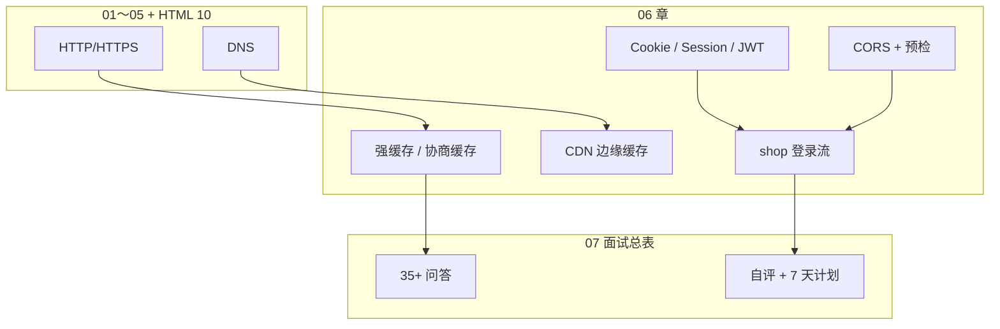
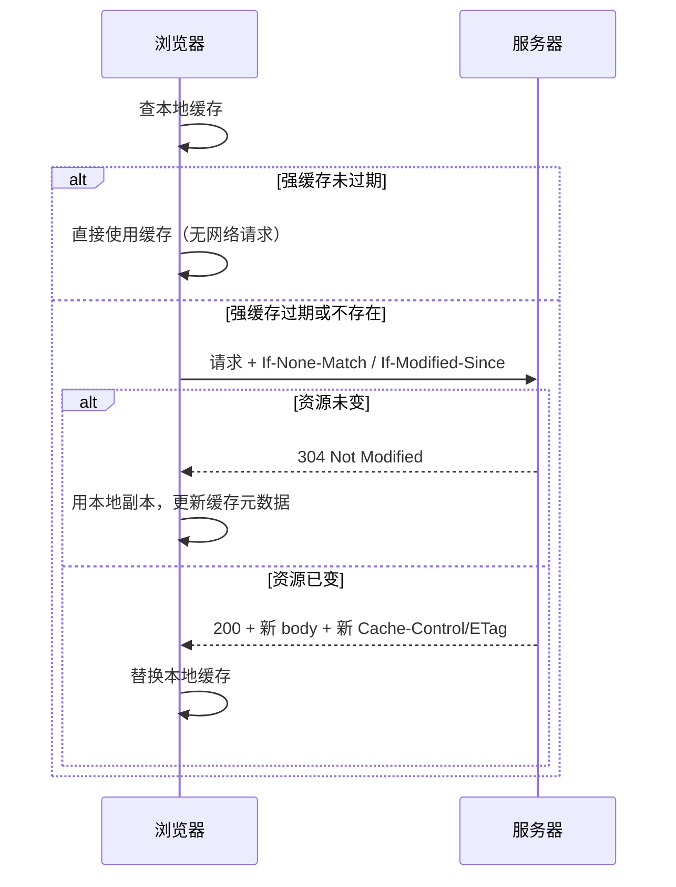
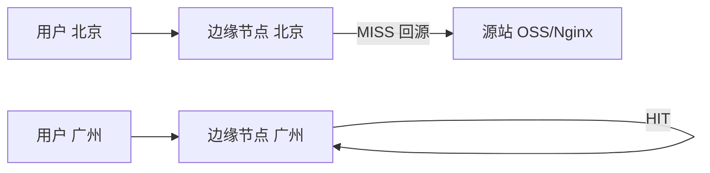
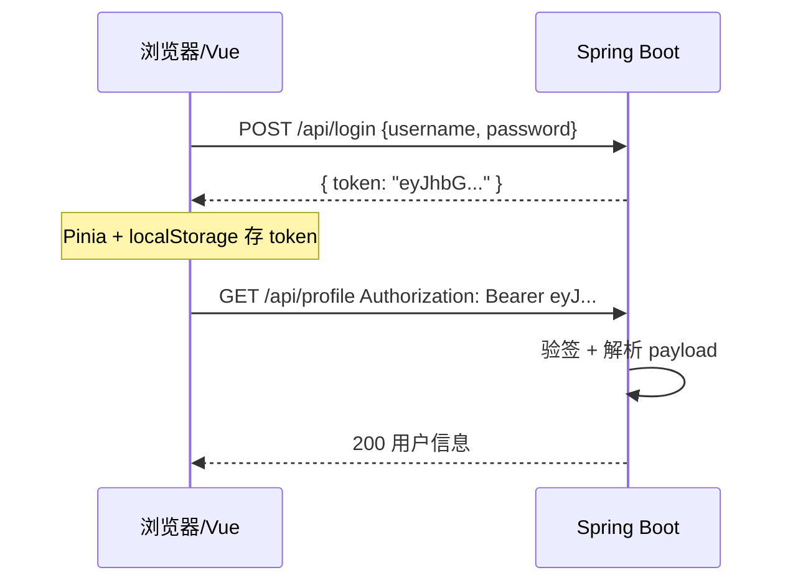
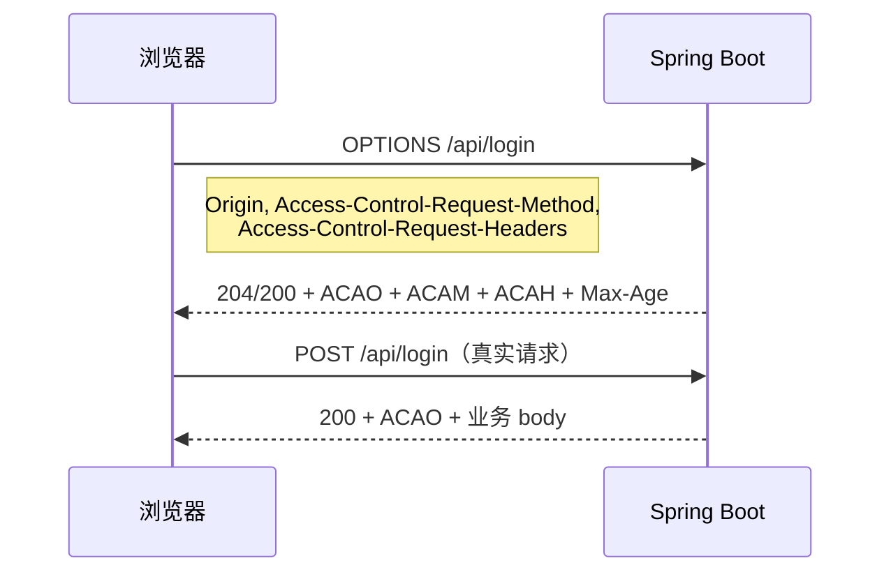
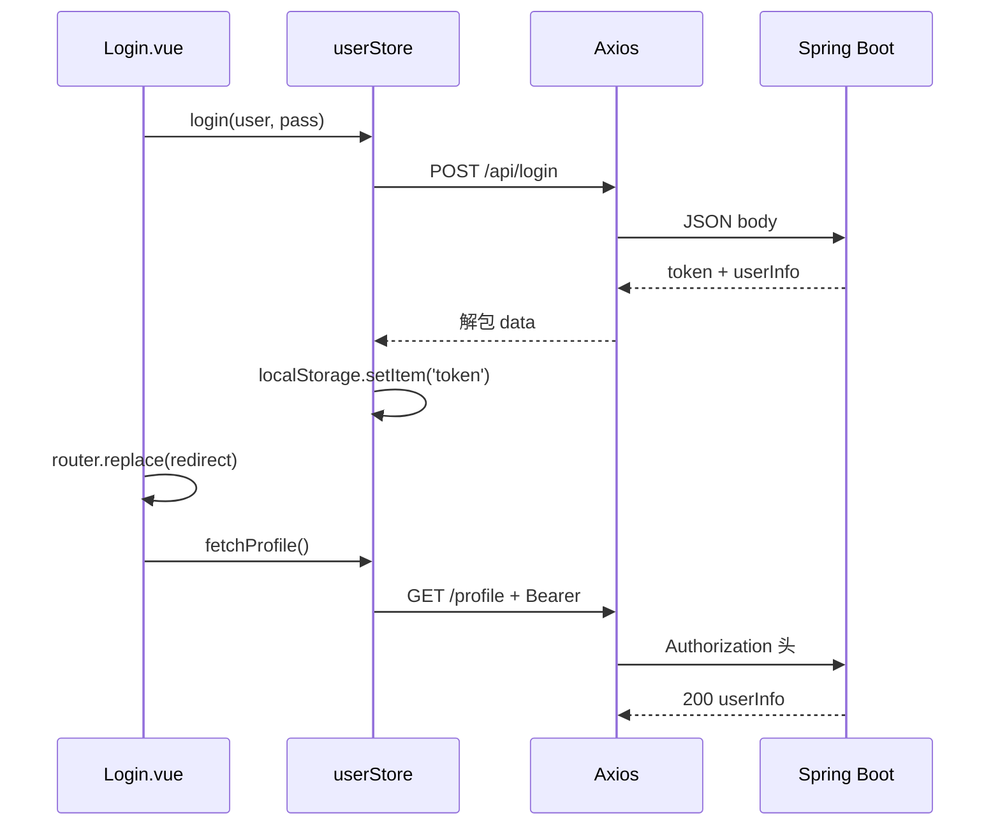

# 缓存、Cookie 与会话机制

> **文件编码**：UTF-8。  
> **定位**：计算机网络系列 **06 章**——把浏览器缓存、CDN、Cookie/Session/Token、CORS 与 shop 登录串成一条可落地的链路。  
> **前置**：[05-DNS与域名解析](./05-DNS与域名解析.md)、[HTML 10 浏览器 HTTP 基础](../HTML%20CSS%20JS/10-浏览器HTTP网络与Web基础.md)、[Vue 08 Axios 联调](../Vue/08-Axios网络请求与前后端联调.md)。

---

## 本章衔接

01～05 章你已建立 **OSI → IP/TCP → HTTP/HTTPS → DNS** 的大图景；[HTML 10](../HTML%20CSS%20JS/10-浏览器HTTP网络与Web基础.md) 里对缓存、Cookie、跨域只有「知道有这回事」的浅印象。本章把这些概念**落到前端日常**：

| 上章产出 | 本章怎么用 |
|----------|------------|
| HTTP 请求/响应、状态码 | 理解 200/304/401 在缓存与登录里的含义 |
| HTTPS 加密通道 | Cookie `Secure`、Token 传输安全 |
| DNS 解析 | CDN 边缘节点、域名与 Cookie 域 |
| Vue 08 拦截器 + proxy | 与 CORS、Token 头配合 |

**学完本章你应该能**：在 DevTools 里判断资源是强缓存还是协商缓存；配置静态资源 hash + Nginx 缓存策略；说清楚 Session/Cookie/JWT 选型；独立完成 shop 登录态全链路排查。



---

## 1. 为什么前端必须懂缓存

### 1.1 缓存解决什么问题

浏览器、CDN、反向代理都会缓存 HTTP 响应，目的是：

- **减少重复下载**：同一张 logo、同一份 `app.xxxx.js` 不必每次从源站拉
- **降低延迟**：本地磁盘或边缘节点比跨城回源快几个数量级
- **减轻源站压力**：大促流量由 CDN 扛

### 1.2 缓存带来的前端痛点

| 现象 | 常见原因 |
|------|----------|
| 发版后用户仍看到旧页面 | `index.html` 被强缓存 |
| 改 CSS 不生效 | 文件名无 hash，浏览器仍用旧文件 |
| Network 显示 `(disk cache)` 但内容不对 | 强缓存未过期 |
| 304 但页面逻辑仍旧 | 协商缓存命中，服务端未更新 ETag |

**前端职责**：构建产物命名（hash）、部署响应头、教用户硬刷新；**不是**只改代码不管缓存。

### 1.2 深入：缓存存在哪一层

```text
用户请求
  → 浏览器内存缓存
  → 浏览器磁盘缓存（HTTP Cache）
  → Service Worker（若有，本章不展开）
  → CDN 边缘节点
  → 源站 / 反向代理（Nginx）
```

每一层都可能有自己的 `Cache-Control` 策略；**最严格的一层**往往决定最终行为。

---

## 2. 强缓存 vs 协商缓存

### 2.1 一句话对比

| 类型 | 是否发请求到服务器 | 关键响应头 | 典型状态码 |
|------|-------------------|------------|------------|
| **强缓存** | **不发**（直接用本地） | `Cache-Control`、`Expires` | 200 `(from disk cache)` / `(memory cache)` |
| **协商缓存** | **发**，带验证字段 | `ETag` / `Last-Modified` | **304 Not Modified**（无 body，用本地副本） |

### 2.2 浏览器决策流程（完整）



### 2.3 优先级

1. 先看 **强缓存**是否命中且未过期  
2. 过期或无强缓存 → 走 **协商缓存**  
3. 协商也 miss → 正常 **200** 拉全量

**记忆口诀**：先「能不能直接用」，再「问服务器变没变」。

---

## 3. 强缓存：`Cache-Control` 与 `Expires`

### 3.1 `Expires`（HTTP/1.0，了解即可）

```http
Expires: Wed, 21 Oct 2026 07:28:00 GMT
```

- 绝对过期时间，依赖**客户端时钟**（用户改系统时间会导致混乱）
- HTTP/1.1 下被 `Cache-Control` **覆盖**；新项目以 `Cache-Control` 为主

### 3.2 `Cache-Control`（核心）

常见指令：

| 指令 | 含义 | 典型场景 |
|------|------|----------|
| `max-age=31536000` | 多少**秒**内强缓存有效 | 带 hash 的 `app.[hash].js` |
| `no-cache` | 可存本地，但**使用前必须**向服务器验证（常走协商） | `index.html` |
| `no-store` | **不存**任何缓存（敏感数据） | 银行卡接口响应 |
| `private` | 仅浏览器可缓存，CDN 不应缓存 | 含用户信息的 HTML |
| `public` | 浏览器和 CDN 都可缓存 | 公共静态资源 |
| `immutable` | 缓存期内**不必**因刷新而重新验证 | 长期 hash 静态资源 |
| `must-revalidate` | 过期后**必须**验证，不能用 stale | 严格一致性 |

**组合示例**（Vite 打包 JS）：

```http
Cache-Control: public, max-age=31536000, immutable
```

**index.html**（SPA 入口）：

```http
Cache-Control: no-cache
```

含义：可以存，但每次打开要先问服务器有没有新版本（通常 304 或 200 新 HTML）。

### 3.3 `no-cache` vs `no-store`（高频面试）

| | no-cache | no-store |
|---|----------|----------|
| 能否存本地 | 能 | **不能** |
| 使用前 | 必须验证 | 每次都完整请求 |
| 场景 | HTML 入口、需及时更新 | 密码、支付、一次性 token |

---

## 4. 协商缓存：`ETag` 与 `Last-Modified`

### 4.1 `Last-Modified` / `If-Modified-Since`

**首次响应**：

```http
Last-Modified: Tue, 15 Apr 2025 10:00:00 GMT
```

**再次请求**：

```http
If-Modified-Since: Tue, 15 Apr 2025 10:00:00 GMT
```

服务端比较文件修改时间：未变 → **304**；变了 → **200** + 新 body。

**缺点**：

- 精度只到**秒**（1 秒内多次改可能漏）
- 文件内容未变但 touch 了 mtime 也会失效

### 4.2 `ETag` / `If-None-Match`（推荐）

**首次响应**：

```http
ETag: "33a64df551425fcc55e4d42a148795d9f25f89d4"
```

**再次请求**：

```http
If-None-Match: "33a64df551425fcc55e4d42a148795d9f25f89d4"
```

- **强 ETag**：字节级一致  
- **弱 ETag**：`W/"..."` 语义等价即可  

**优先级**：同时存在时，现代浏览器优先用 **ETag**。

### 4.3 304 响应长什么样

```http
HTTP/1.1 304 Not Modified
Date: Thu, 18 Jun 2026 08:00:00 GMT
ETag: "abc123"
Cache-Control: no-cache
```

- **无响应体**（省带宽）
- 浏览器用**本地缓存副本**渲染
- DevTools Size 列常显示「xxx B (from disk cache)」或仅标 304

### 4.4 在 DevTools 里怎么认

| Network 列 | 含义 |
|------------|------|
| `(memory cache)` | 强缓存，内存 |
| `(disk cache)` | 强缓存或 304 后用的磁盘副本 |
| Status 304 | 协商缓存命中 |
| Size 很小 + 304 | 只下了响应头 |

**手把手**：打开任意站点 → Network → 勾选 Disable cache → 刷新 → 再看同一 URL 第二次请求的 Size/Status 变化。

---

## 5. 前端工程里的缓存策略（SPA）

### 5.1 经典「入口不缓存、资源长缓存」

| 文件 | 是否带 content hash | 建议 Cache-Control |
|------|---------------------|-------------------|
| `index.html` | 否 | `no-cache` 或 `max-age=0, must-revalidate` |
| `assets/index-[hash].js` | 是 | `public, max-age=31536000, immutable` |
| `assets/index-[hash].css` | 是 | 同上 |
| `favicon.ico` | 否 | 短缓存或带版本 query |

**原理**：HTML 是唯一「入口指针」；JS/CSS 文件名变 = 强制浏览器拉新包。

### 5.2 Nginx 示例

```nginx
location / {
    root /usr/share/nginx/html;
    try_files $uri $uri/ /index.html;
    add_header Cache-Control "no-cache";
}

location /assets/ {
    root /usr/share/nginx/html;
    add_header Cache-Control "public, max-age=31536000, immutable";
}
```

### 5.3 发版后用户仍旧版怎么办

1. 确认 `index.html` **没有**被 CDN/浏览器长期强缓存  
2. 确认构建产物 **filename 含 hash**（Vite 默认 `[name]-[hash].js`）  
3. 运维刷新 CDN **仅** HTML 或全站 purge（按策略）  
4. 用户侧：Ctrl+F5 硬刷新（只能救自己，不能救全量用户）

详见 [Vue 10 构建部署](../Vue/10-Vite构建与项目部署.md) §28 缓存策略表。

---

## 6. CDN 缓存

### 6.1 CDN 是什么

**内容分发网络**：把静态资源复制到离用户近的**边缘节点**；用户访问 `cdn.example.com/logo.png` 时，优先命中边缘，未命中再**回源**到源站。



### 6.2 CDN 与浏览器缓存的关系

- CDN 节点也看 `Cache-Control`、`Expires`  
- `private` 的资源 CDN **不应**缓存用户私有 HTML  
- 带 **Cookie 的个性化响应**通常配置 CDN 不缓存或按 Cookie 分流（进阶）

### 6.3 缓存键（Cache Key）

CDN 决定「是不是同一份缓存」常看：

- URL 路径 + Query（`?v=2` 会变成不同缓存项）  
- 部分 Header（如 `Accept-Encoding`）  
- **一般不看** `Authorization`（API 响应不应被 CDN 误缓存给所有人）

### 6.4 前端要注意

| 做法 | 说明 |
|------|------|
| 静态资源走 CDN 域名 | 与 API 域名分离，减少 Cookie 携带 |
| 图片加 width 参数或 hash | 避免错误缓存旧图 |
| 接口 `Cache-Control: no-store` | 防止敏感 JSON 被边缘缓存 |
| 发版 purge | 运维操作；开发要知道找谁 purge 什么路径 |

### 6.5 API 能否 CDN 缓存？

- **GET 公共只读**且允许短时缓存：可以 `max-age=60` + `Cache-Control: public`（如商品列表，需业务同意）  
- **带 Cookie / Authorization 的**：`private, no-store`  
- **默认**：前后端分离 API **不 CDN 缓存**，只缓存静态资源

---

## 7. Cookie 基础与属性

### 7.1 Cookie 是什么

服务器通过 **`Set-Cookie`** 响应头让浏览器存一小段键值；之后同域请求浏览器自动带 **`Cookie`** 头。

```http
Set-Cookie: sessionId=abc123; Path=/; HttpOnly; Secure; SameSite=Lax
```

```http
Cookie: sessionId=abc123
```

### 7.2 常见属性详解

| 属性 | 作用 | 前端必知 |
|------|------|----------|
| **Name=Value** | 键值 | 不要存明文密码 |
| **Domain** | 哪些子域可带 | `.example.com` 含 `a.example.com` |
| **Path** | 哪些路径可带 | 默认请求路径 |
| **Expires / Max-Age** | 过期时间 | Max-Age 优先级更高 |
| **HttpOnly** | **JS 读不到** `document.cookie` | 防 XSS 偷 Session |
| **Secure** | 仅 **HTTPS** 发送 | 生产必开 |
| **SameSite** | 跨站是否携带 | 防 CSRF 关键 |

### 7.3 `SameSite` 三种值

| 值 | 行为 | 场景 |
|----|------|------|
| **Strict** | 跨站导航**不带** Cookie | 高安全后台 |
| **Lax**（现代浏览器默认） | 顶级 GET 导航可带；跨站 POST/Ajax **不带** | 大多数站点默认 |
| **None** | 跨站都带，须配合 **Secure** | 第三方登录、跨域嵌入 |

**例子**：`bank.com` 页面里 img 指向 `evil.com` —— `SameSite=Lax` 下 evil 收不到银行 Cookie。

### 7.4 JS 操作 Cookie（无 HttpOnly 时）

```javascript
// 设置（简易，生产应用后端 Set-Cookie）
document.cookie = 'theme=dark; path=/; max-age=86400'

// 读取（只能看到非 HttpOnly）
console.log(document.cookie)
```

**限制**：不能设 `HttpOnly`（只能服务器 Set-Cookie）；`Secure` 在 HTTP 页无效。

### 7.5 Cookie 大小与数量

- 单条约 **4KB**  
- 每域约 **20～50** 条（浏览器略有差异）  
- 每次请求**全带上**，Cookie 过大拖慢请求 —— **不要把大 JWT 塞满 Cookie 链**

---

## 8. Session vs Cookie vs Token（JWT）

### 8.1 概念对齐

| 概念 | 本质 | 状态放哪 |
|------|------|----------|
| **Cookie** | 浏览器存储/传输**机制** | 客户端存，自动随请求发 |
| **Session** | 服务端**会话** | 服务端存（Redis/内存）；浏览器常只存 **SessionId** Cookie |
| **Token（JWT）** | 自包含**凭证** | 服务端可**无状态**验签；客户端存 localStorage / Cookie / 内存 |

**易混点**：Session 往往**借助 Cookie** 传 SessionId；Token 也**可以**放 Cookie，但不是必须。

### 8.2 Session + Cookie 流程

```mermaid
sequenceDiagram
    participant C as 浏览器
    participant S as 服务器
    participant R as Redis

    C->>S: POST /login 账号密码
    S->>R: 创建 sessionId → userInfo
    S-->>C: Set-Cookie: sessionId=xxx; HttpOnly
    C->>S: GET /api/profile Cookie: sessionId=xxx
    S->>R: 查 sessionId
    R-->>S: userInfo
    S-->>C: 200 用户信息
```

**优点**：服务端可随时作废 Session；敏感数据在服务端。  
**缺点**：分布式要共享 Session（Redis）；跨域 Cookie 麻烦。

### 8.3 JWT Token 流程（前后端分离常见）



**优点**：无状态、易水平扩展、跨域用 Header 即可。  
**缺点**：签发后难作废（需黑名单/短过期+Refresh）；payload **不要**存密码。

### 8.4 对比总表（面试背这张）

| 维度 | Session + Cookie | JWT（Header） | JWT（HttpOnly Cookie） |
|------|------------------|---------------|------------------------|
| 状态 | 有状态（服务端） | 无状态 | 无状态 |
| 存储 | SessionId Cookie | localStorage / 内存 | HttpOnly Cookie |
| 自动携带 | 是 | **否**，需拦截器 | 是 |
| XSS | HttpOnly 可防读 SessionId | **localStorage 可读，高危** | HttpOnly 较安全 |
| CSRF | 需 SameSite / Token | Header 方式 CSRF 风险低 | 需 CSRF Token |
| 跨域 | Cookie 域限制 | 简单 | 需 CORS + credentials |
| 注销 | 删 Session 即可 | 前端删 token；服务端黑名单 | 清 Cookie + 黑名单 |
| shop-vue | — | **当前主线** | 可选加强 |

### 8.5 Refresh Token（了解）

- **Access Token**：短过期（15min～2h），放内存或 Header  
- **Refresh Token**：长过期，HttpOnly Cookie 或安全存储  
- Access 过期 → 用 Refresh 换新的，用户无感

---

## 9. localStorage / sessionStorage 与 Cookie

### 9.1 不会自动随请求发送

```javascript
localStorage.setItem('token', 'eyJhbG...')
// 之后 axios 请求不会自动带 token！
// 必须在拦截器里：headers.Authorization = `Bearer ${token}`
```

| 存储 | 生命周期 | 容量 | 是否随 HTTP 自动发送 | 能否 HttpOnly |
|------|----------|------|---------------------|---------------|
| Cookie | 可设过期 | ~4KB/条 | **是**（同域规则） | 可以 |
| localStorage | 永久（除非清） | ~5MB | **否** | 不能 |
| sessionStorage | 标签页关闭清 | ~5MB | **否** | 不能 |

### 9.2 shop-vue 为什么用 localStorage 存 token

- 前后端分离、跨域 Header 传 JWT 简单  
- Pinia 持久化插件写 localStorage，刷新不丢登录态  
- **代价**：XSS 能 `localStorage.getItem('token')` —— 必须防 XSS（转义、CSP、依赖漏洞）

### 9.3 选型建议

| 数据 | 推荐 |
|------|------|
| 登录 JWT（SPA + API） | localStorage + Authorization **或** HttpOnly Cookie 方案 |
| 购物车草稿 | localStorage / Pinia persist |
| 会话级表单 | sessionStorage |
| 服务端 SessionId | HttpOnly + Secure + SameSite Cookie |

详见 [HTML 09 本地存储](../HTML%20CSS%20JS/09-JavaScript异步编程网络请求与本地存储.md)。

---

## 10. CORS 回顾与预检 OPTIONS

### 10.1 同源策略再述

协议 + 域名 + 端口**全同**才同源。  
前端 `http://localhost:5173` 调 `http://localhost:8080` → **跨域**。

**重点**：请求常常**已经到达**服务器；浏览器因 CORS 响应头不合规，**不把响应交给 JS**。

### 10.2 简单请求 vs 需预检

**简单请求**（同时满足）：

- 方法：GET、HEAD、POST  
- Header 仅：`Accept`、`Accept-Language`、`Content-Language`、`Content-Type`（限三种）  
- `Content-Type`：`text/plain`、`multipart/form-data`、`application/x-www-form-urlencoded`

**否则** → 浏览器先发 **OPTIONS 预检**。

shop-vue 典型 **非简单请求**：

- `Content-Type: application/json`  
- 自定义头 `Authorization: Bearer ...`  
- 方法 PUT / DELETE

### 10.3 预检 OPTIONS 流程



关键响应头：

| 响应头 | 含义 |
|--------|------|
| `Access-Control-Allow-Origin` | 允许的来源（不能 `*` 与 credentials 同用） |
| `Access-Control-Allow-Methods` | 允许的方法 |
| `Access-Control-Allow-Headers` | 允许的请求头（含 Authorization） |
| `Access-Control-Allow-Credentials` | 是否允许带 Cookie |
| `Access-Control-Max-Age` | 预检结果缓存秒数 |

### 10.4 常见 Console 报错

```text
Access to XMLHttpRequest at 'http://localhost:8080/api/login' from origin
'http://localhost:5173' has been blocked by CORS policy:
Response to preflight request doesn't pass access control check:
No 'Access-Control-Allow-Origin' header is present on the requested resource.
```

**排查顺序**：

1. Network 里有没有 **OPTIONS**，状态码多少  
2. OPTIONS 响应是否含 `Access-Control-Allow-Origin`  
3. 真实 POST 响应是否**也**带 CORS 头（有人只配了 POST 漏 OPTIONS）  
4. 是否 `credentials: true` 却用了 `Allow-Origin: *`

---

## 11. Spring Boot CORS + 前端 Vite 代理

### 11.1 方案对比

| 方案 | 谁解决跨域 | 适用 |
|------|------------|------|
| **Vite dev proxy** | 开发服务器转发，浏览器认为同源 | **本地开发首选** |
| **Spring CORS** | 后端加响应头 | 直连后端、Postman、生产跨域 |
| **Nginx 反代** | 网关统一 `/api` | 生产前后端同域 |

### 11.2 Spring Boot CORS 配置

```java
@Configuration
public class CorsConfig implements WebMvcConfigurer {
    @Override
    public void addCorsMappings(CorsRegistry registry) {
        registry.addMapping("/api/**")
            .allowedOriginPatterns("http://localhost:5173", "https://shop.example.com")
            .allowedMethods("GET", "POST", "PUT", "DELETE", "OPTIONS")
            .allowedHeaders("*")
            .exposedHeaders("Authorization")
            .allowCredentials(true)
            .maxAge(3600);
    }
}
```

**注意**：

- `allowCredentials(true)` 时 `allowedOrigins` 不能写 `*`，要用**具体源**或 `allowedOriginPatterns`  
- 确保 **OPTIONS** 不被鉴权过滤器拦掉（Spring Security 需 `permitAll` OPTIONS）

### 11.3 Vite 代理（shop-vue）

```javascript
// vite.config.js
export default defineConfig({
  server: {
    port: 5173,
    proxy: {
      '/api': {
        target: 'http://localhost:8080',
        changeOrigin: true,
        // rewrite: (path) => path.replace(/^\/api/, '/api'),
      },
    },
  },
})
```

```javascript
// axios 实例 — baseURL 用相对路径
const request = axios.create({
  baseURL: '/api',
  timeout: 10000,
})
```

**原理**：浏览器只请求 `http://localhost:5173/api/login`（同源）；Vite 在 Node 侧转发到 `8080`，**无 CORS**。

### 11.4 生产环境

- 推荐 **Nginx 同域**：`https://shop.com/` 静态 + `https://shop.com/api/` 反代 Java  
- axios `baseURL: '/api'` 不变  
- 若前后端不同域，必须后端 CORS + HTTPS

详见 [Vue 08](../Vue/08-Axios网络请求与前后端联调.md)、[Java 04 Spring Boot](../后端学习/Java/04-SpringBoot核心开发.md) §47。

---

## 12. 手把手：shop 登录全链路

### 12.1 目标

完成：**登录 → 存 token → 带 token 调 profile → 401 跳登录 → 退出清 token**。

### 12.2 后端约定（Spring Boot）

```http
POST /api/login
Content-Type: application/json

{"username":"admin","password":"123456"}
```

```json
{
  "code": 0,
  "message": "success",
  "data": {
    "token": "eyJhbGciOiJIUzI1NiIsInR5cCI6IkpXVCJ9...",
    "userInfo": { "id": 1, "username": "admin" }
  }
}
```

### 12.3 Pinia userStore（核心）

```javascript
// stores/user.js
import { defineStore } from 'pinia'
import { ref, computed } from 'vue'
import { loginApi, fetchProfileApi } from '@/api/auth'
import router from '@/router'

export const useUserStore = defineStore('user', () => {
  const token = ref(localStorage.getItem('token') || '')
  const userInfo = ref(null)

  const isLoggedIn = computed(() => !!token.value)

  async function login(username, password) {
    const res = await loginApi({ username, password })
    token.value = res.data.token
    userInfo.value = res.data.userInfo
    localStorage.setItem('token', token.value)
  }

  async function fetchProfile() {
    if (!token.value) return
    const res = await fetchProfileApi()
    userInfo.value = res.data
  }

  function logout() {
    token.value = ''
    userInfo.value = null
    localStorage.removeItem('token')
    router.push({ name: 'Login' })
  }

  return { token, userInfo, isLoggedIn, login, fetchProfile, logout }
})
```

### 12.4 Axios 拦截器

```javascript
// utils/request.js
import axios from 'axios'
import { useUserStore } from '@/stores/user'
import { ElMessage } from 'element-plus'

const request = axios.create({ baseURL: '/api', timeout: 10000 })

request.interceptors.request.use((config) => {
  const userStore = useUserStore()
  if (userStore.token) {
    config.headers.Authorization = `Bearer ${userStore.token}`
  }
  return config
})

request.interceptors.response.use(
  (response) => {
    const { code, message, data } = response.data
    if (code === 0) return { data, message }
    ElMessage.error(message || '请求失败')
    return Promise.reject(new Error(message))
  },
  (error) => {
    if (error.response?.status === 401) {
      const userStore = useUserStore()
      userStore.logout()
      ElMessage.warning('登录已过期，请重新登录')
    }
    return Promise.reject(error)
  }
)

export default request
```

### 12.5 路由守卫

```javascript
router.beforeEach((to, from, next) => {
  const userStore = useUserStore()
  if (to.meta.requiresAuth && !userStore.isLoggedIn) {
    next({ name: 'Login', query: { redirect: to.fullPath } })
  } else {
    next()
  }
})
```

### 12.6 登录页提交

```vue
<script setup>
import { ref } from 'vue'
import { useRouter, useRoute } from 'vue-router'
import { useUserStore } from '@/stores/user'

const username = ref('')
const password = ref('')
const loading = ref(false)
const userStore = useUserStore()
const router = useRouter()
const route = useRoute()

async function handleLogin() {
  loading.value = true
  try {
    await userStore.login(username.value, password.value)
    const redirect = route.query.redirect || '/'
    router.replace(redirect)
  } finally {
    loading.value = false
  }
}
</script>
```

### 12.7 验收步骤（DevTools）

| 步骤 | Network 预期 | Application 预期 |
|------|--------------|------------------|
| 1. 打开登录页 | — | 无 token |
| 2. 提交登录 | POST `/api/login` 200；**无** Set-Cookie（JWT 方案） | localStorage 出现 `token` |
| 3. 进个人中心 | GET `/api/profile` 带 `Authorization` | — |
| 4. 手动删 token 刷新 | GET profile **401** | 跳登录页 |
| 5. 退出 | — | token 清除 |

### 12.8 端到端时序图



---

## 13. 常见错误与排查表

| # | 现象 | 原因 | 解决 |
|---|------|------|------|
| 1 | 发版后全员旧 JS | `index.html` 被 `max-age` 强缓存 | HTML 改 `no-cache`；资源用 hash |
| 2 | 改代码 Network 仍 `(disk cache)` | 强缓存未过期 | Disable cache 调试；查响应头 |
| 3 | 304 但内容不对 | CDN/浏览器用了 stale 副本 + ETag 未更新 | 清 CDN；确认源站 ETag 随内容变 |
| 4 | Cookie 设置了但请求不带 | Domain/Path/SameSite 不匹配 | DevTools → Application → Cookies 对照 |
| 5 | 跨站 Ajax 不带 Cookie | `SameSite=Lax/Strict` | 改 Lax 或 None+Secure；或改用 Token Header |
| 6 | localStorage 有 token 但 401 | 拦截器未读 store / 未加 Header | 检查 `Authorization: Bearer` |
| 7 | OPTIONS 404 | 后端无 OPTIONS 路由或被 Security 拦截 | `permitAll` OPTIONS；CorsFilter |
| 8 | CORS 报错但 Postman 正常 | 浏览器独有 CORS | 配 ACAO/ACAH；或 dev proxy |
| 9 | `Allow-Origin: *` + credentials | 规范冲突 | 指定具体 Origin |
| 10 | JWT 注销仍能用 | 无状态 token 未过期 | 短过期 + Refresh；黑名单 Redis |
| 11 | 登录成功跳回仍 guest | Pinia 未持久化 / 守卫读旧值 | persist；login 后 await 再跳转 |
| 12 | CDN 缓存了用户 HTML | 误配 `public` 缓存私有页 | HTML `private, no-cache` |

---

## 14. 深入：为什么 304 也算「用了缓存」

协商缓存命中 304 时，**响应体为空**，但浏览器仍算一次 HTTP 往返（RTT 仍在）。强缓存则**零请求**。  
因此：

- 静态 hash 资源 → 强缓存 + immutable，极致性能  
- HTML → no-cache + 304，平衡「及时更新」与「少传 body」

**小实验**：Nginx 对同一 PNG 先设 `max-age=3600`，观察 1 小时内无请求；过期后设 ETag，观察 304。

---

## 15. 安全清单（本章相关）

| 风险 | 防护 |
|------|------|
| XSS 偷 token | 转义输出、CSP、依赖升级；敏感方案用 HttpOnly Cookie |
| CSRF | SameSite Cookie；或 JWT 仅 Header + 无 Cookie |
| 中间人 | HTTPS + Secure Cookie |
| 敏感响应被 CDN 缓存 | `Cache-Control: private, no-store` |
| JWT payload 泄露 | 不存密码；HTTPS 传输 |

---

## 16. 与后端 Java 章节对照

| 前端现象 | Java 文档 |
|----------|-----------|
| CORS 配置 | [04-SpringBoot §47](../../后端学习/Java/04-SpringBoot核心开发.md) |
| JWT 登录接口 | [04 挑战练习 / 10 项目](../../后端学习/Java/10-后端项目实战与面试准备.md) |
| Redis Session | [06-Redis](../../后端学习/Java/06-Redis缓存与分布式锁.md) |
| 网关统一鉴权 | [12 架构](../../后端学习/Java/12-微服务与分布式架构入门.md) |

---

## 17. 练习建议

### 基础题

1. 强缓存和协商缓存各用什么响应头？304 时有没有响应体？
2. `no-cache` 和 `no-store` 区别？
3. Cookie 的 HttpOnly、Secure、SameSite 各防什么？
4. 为什么 localStorage 里的 token 不会自动出现在请求里？

### 进阶题

5. 画 shop 登录时序图（从点击登录到 profile 200）。
6. 说明 Vite proxy 与 Spring CORS 分别在哪一层解决跨域。
7. SPA 为什么 `index.html` 不能长期强缓存而 JS 可以？

### 挑战题

8. 设计：JWT 放 HttpOnly Cookie + CSRF Token 双提交，和当前 Header 方案各有什么取舍？
9. 在 DevTools 里分别制造一次强缓存命中、304、完整 200 下载，截图说明依据。

---

## 18. 练习参考答案

### 基础题 1

强缓存：`Cache-Control`（`max-age` 等）、`Expires`。协商缓存：`ETag`/`If-None-Match`、`Last-Modified`/`If-Modified-Since`。304 **没有响应体**，浏览器用本地副本。

### 基础题 2

`no-cache`：可存，用前必须验证（常 304）。`no-store`：完全不存，每次全量下载。

### 基础题 3

HttpOnly 防 XSS 读 Cookie；Secure 仅 HTTPS 传输；SameSite 限制跨站携带，减轻 CSRF。

### 基础题 4

Cookie 由浏览器按规范自动附加；localStorage 只是 JS API 存储，HTTP 规范不包含它，需应用层在 Header 手动带 token。

### 进阶题 5

见 §12.8 Mermaid 时序图；口述时补：拦截器加 Bearer、401 logout、路由守卫 redirect。

### 进阶题 6

**proxy**：浏览器 → Vite（同源）→ 后端，浏览器不触发跨域。**CORS**：浏览器直连不同源后端，靠响应头获许可。

### 进阶题 7

HTML 是入口，引用哪个 hash JS 由它决定；HTML 被强缓存则永远指向旧 JS。hash JS 文件名变即新 URL，可 immutable 长缓存。

### 挑战题 8（要点）

HttpOnly Cookie：XSS 难偷 token，但跨站表单可能 CSRF，需 SameSite + CSRF Token。Header JWT：CSRF 风险低，XSS 可读 localStorage。生产常：Access 短 + Refresh HttpOnly Cookie。

---

## 19. 本章知识速查卡

| 主题 | 一句话 |
|------|--------|
| 强缓存 | 未过期不请求，`Cache-Control: max-age` |
| 协商缓存 | 过期后带 ETag 问，304 无 body |
| SPA 策略 | HTML no-cache，assets hash + 1y |
| CDN | 边缘缓存静态，API 默认 no-store |
| Session | 状态在服务端，Cookie 常只带 id |
| JWT | 自包含凭证，Header 或 Cookie 传递 |
| localStorage | 不自动发送，靠拦截器 |
| CORS | 浏览器拦 JS 读跨域响应 |
| 预检 | 非简单请求先 OPTIONS |
| 开发跨域 | Vite proxy；生产 Nginx 同域 |

---

## 学完标准

| # | 标准 | 自检 |
|---|------|------|
| 1 | 能口述强缓存 vs 协商缓存流程，画出 304 时序 | ⬜ |
| 2 | 能解释 `Cache-Control` 至少 5 个指令 | ⬜ |
| 3 | 能说明 SPA 入口与 hash 资源缓存策略 | ⬜ |
| 4 | 能对比 Session、Cookie、JWT 适用场景 | ⬜ |
| 5 | 能解释 HttpOnly / Secure / SameSite | ⬜ |
| 6 | 能说明 localStorage token 为何要拦截器 | ⬜ |
| 7 | 能排查 OPTIONS 预检失败 | ⬜ |
| 8 | 能独立验收 shop 登录链路（§12.7 表全过） | ⬜ |
| 9 | DevTools 能区分 memory/disk cache 与 304 | ⬜ |
| 10 | 常见错误表 §13 至少能讲 8 条 | ⬜ |

---

## 下一章预告

**07-面试专题与知识点总表** 是全系列**收官篇**：

- **35+ 口述题**：OSI、TCP 三次握手、HTTP/HTTPS、GET/POST、状态码、缓存、CORS、DNS、WebSocket 等  
- 与 [Vue 14](../Vue/14-补充知识点总表.md) 同风格的 **自评总表**  
- **7 天复习计划** + 知识地图 Mermaid  
- 交叉链接 00～06 全章及 HTML 10、Vue 13、Java 14/15

建议本章 shop 登录跑通后再进 07，面试题可直接用自己的联调经历举例。

---

*UTF-8 | 系列索引：[00 学习路线图](./00-学习路线图与说明.md) · 规范：[修改规范](../../修改规范.md)*
