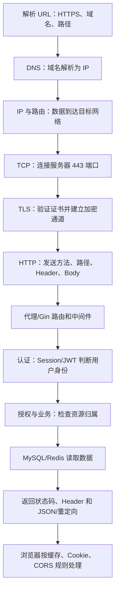

# 计算机网络复习与面试总表

> 本章不再引入大量新概念。目标是把 01～06 串成一条请求链，并形成能排错、能结合 Go 项目回答的能力。
>
> 系列入口：[00 · 学习路线图](./00-学习路线图与说明.md)

---

## 1. 一张图串起整套网络

访问：

```text
https://api.example.com/links/abc123
```

完整主线：



任何“接口不工作”都可以放回这条链定位。

---

## 2. 分层排错总表

| 现象 | 失败阶段 | 优先工具 | 常见方向 |
|---|---|---|---|
| `Could not resolve host` | DNS | `nslookup`、`Resolve-DnsName` | 域名、DNS、代理 |
| `Connection refused` | TCP | `Test-NetConnection`、`netstat` | 服务未监听、端口错误 |
| `Connection timed out` | IP/TCP | `Test-NetConnection`、防火墙日志 | 路由、防火墙、安全组 |
| 证书过期/域名不匹配 | TLS | `curl.exe -v`、浏览器证书面板 | 证书、时间、SAN、链 |
| 301/302 | HTTP 重定向 | `curl.exe -v` | 看 Location，是否预期 |
| 400 | HTTP 请求 | curl 报文、服务端校验日志 | JSON、参数、Content-Type |
| 401 | 认证 | Network、Cookie、Authorization | token/Session 缺失或过期 |
| 403 | 授权 | 用户和资源归属日志 | 权限不足 |
| 404 | 路由/资源 | 路由表、请求路径 | 路径错误或资源不存在 |
| 405 | HTTP 方法 | 请求行、路由配置 | GET/POST 不匹配 |
| 429 | 限流 | 响应头、限流指标 | 请求频率过高 |
| 500 | 服务端 | 日志、request ID、trace | panic、依赖、代码错误 |
| 502 | 网关到上游 | Nginx/网关日志 | Go 服务未启动、上游错误 |
| 504 | 网关等待上游 | trace、超时和依赖指标 | Go 或下游过慢 |
| curl 成功，浏览器失败 | 浏览器策略 | DevTools Network | CORS、Cookie、混合内容 |
| 一直看到旧数据 | 多层缓存 | Network、CDN、Redis、DB | Cache-Control、ETag、缓存失效 |

### 固定排错口令

```text
先看报错发生在哪一层
  → 再用该层工具验证
  → 不跨层乱猜
  → 最后结合服务端日志确认
```

---

## 3. 必会命令清单

### 查看地址和网关

```powershell
ipconfig /all
```

### 查询域名

```powershell
nslookup api.example.com
Resolve-DnsName api.example.com
```

### 测试 TCP 端口

```powershell
Test-NetConnection localhost -Port 8080
```

### 查看本机监听

```powershell
Get-NetTCPConnection -LocalPort 8080 -ErrorAction SilentlyContinue
netstat -ano | Select-String ":8080"
```

### 查看 HTTP/TLS 全过程

```powershell
curl.exe -v https://api.example.com/health
```

### 构造 JSON 请求

```powershell
curl.exe -v http://localhost:8080/api/users `
  -H "Content-Type: application/json" `
  -d '{"name":"Alice"}'
```

### 查看响应头和重定向

```powershell
curl.exe -I https://example.com
curl.exe -v -L http://example.com
```

---

## 4. 高频问题：网络分层

### 4.1 TCP/IP 四层分别做什么

推荐回答：

> 应用层定义程序间消息语义，例如 HTTP 和 DNS；传输层用端口完成进程间通信，TCP 还提供可靠有序字节流；网际层使用 IP 和路由把数据送到目标主机；网络接口层负责当前链路上的帧传输。发送时逐层封装，接收时逐层解封装。

### 4.2 OSI 七层和 TCP/IP 四层有什么关系

> OSI 是理论七层参考模型；TCP/IP 更贴近互联网实现。OSI 的应用、表示、会话层大致合并到 TCP/IP 应用层，数据链路和物理层合并到网络接口层。

### 4.3 IP、MAC 和端口的区别

> IP 用于跨网络定位主机；MAC 主要用于局域网当前一跳；端口用于定位主机上的进程。访问服务通常需要 IP 和端口，域名则先通过 DNS 解析为 IP。

### 4.4 封装是什么

> 应用数据向下传递时，每层添加自己完成工作所需的头，例如 TCP 添加端口和序号，IP 添加源/目标 IP，链路层添加当前一跳信息；接收方反向拆除并交给上层。

---

## 5. 高频问题：TCP 与 UDP

### 5.1 TCP 为什么可靠

> TCP 使用序号、确认、超时和快速重传、校验、排序去重、流量控制与拥塞控制，为应用提供可靠有序字节流。可靠不等于永不失败，长期中断仍会超时。

### 5.2 为什么三次握手

> 双方需要确认彼此的发送与接收能力，并同步初始序号。第三次 ACK 让服务端确认客户端已经收到服务端的 SYN 和初始序号，也减少旧连接请求造成的混乱。

### 5.3 为什么四次挥手

> TCP 是全双工的，两个发送方向分别关闭。收到对方 FIN 后可以先 ACK，但本地可能还有数据要发，发完后再发送自己的 FIN，因此通常四步。

### 5.4 TIME_WAIT 有什么用

> 主动关闭方保留状态，一是确保最后 ACK 丢失时还能回应重发的 FIN，二是让旧连接报文在新连接复用相同四元组前消失。

### 5.5 流量控制和拥塞控制区别

> 流量控制避免发送方压垮接收方，关注接收窗口；拥塞控制避免过多数据压垮网络路径，关注网络承载情况。

### 5.6 TCP 和 UDP 怎样选

> 需要协议直接提供可靠有序字节流时用 TCP；能接受部分丢失、重视低延迟或希望在应用层自定义传输时可能用 UDP。不能只凭“UDP 快”选择，还要考虑可靠、拥塞、加密和业务语义。

---

## 6. 高频问题：IP 与 DNS

### 6.1 localhost、127.0.0.1、0.0.0.0 的区别

> localhost 是主机名，通常解析到 127.0.0.1 或 ::1；127.0.0.1 是 IPv4 回环地址，只访问本机；0.0.0.0 在服务端监听时表示所有 IPv4 接口，不是正常客户端目标地址。

### 6.2 私网 IP 为什么不能直接从公网访问

> 私网地址只在各自私有网络中有意义，可以重复使用，不参与全球公网路由。家庭网络通常通过 NAT 共享公网出口，外部主动访问还需要端口映射和防火墙允许。

### 6.3 DNS 查询过程

> 应用先查本地缓存、系统缓存和 hosts；未命中时询问递归解析器；解析器必要时从根 DNS、顶级域 DNS 找到权威 DNS，得到 A/AAAA/CNAME 等记录并按 TTL 缓存。

### 6.4 DNS 使用 TCP 还是 UDP

> 传统小型查询通常使用 UDP；响应过大、区域传送或需要回退时可以使用 TCP。现代加密 DNS 又可能运行在 HTTPS 或 TLS 上。

### 6.5 DNS 成功说明接口可用吗

> 不能。DNS 只说明得到地址，后续 TCP 端口、TLS、HTTP 和业务仍可能失败。

---

## 7. 高频问题：HTTP

### 7.1 HTTP 请求和响应结构

> 请求由请求行、Header、空行和可选 Body 组成；响应由状态行、Header、空行和可选 Body 组成。请求行包含方法、请求目标和版本，状态行包含版本和状态码。

### 7.2 GET 与 POST 区别

> GET 语义是查询，通常安全且幂等，参数常在 URL；POST 常用于创建或提交处理，通常不幂等，数据常在 Body。POST 不天然安全，HTTP 下 Body 仍是明文，安全依赖 HTTPS。

### 7.3 幂等是什么

> 同一请求执行一次或多次，目标资源最终状态相同。GET、PUT、DELETE 按语义通常幂等，POST 创建通常不幂等。幂等不要求每次响应完全一样。

### 7.4 401 与 403

> 401 表示没有有效身份认证；403 表示身份可能已确定，但没有执行该操作的权限。

### 7.5 502 与 504

> 502 是网关从上游收到无效响应或连接上游失败；504 是网关等待上游响应超时。都要结合网关和 Go 服务日志定位。

### 7.6 HTTP/1.1、HTTP/2、HTTP/3

> HTTP/1.1 支持连接复用但多请求并发能力有限；HTTP/2 在一条连接上多路复用多个流并压缩 Header；HTTP/3 基于 QUIC/UDP，减少传输层队头阻塞并集成 TLS 1.3。

---

## 8. 高频问题：HTTPS 与 TLS

### 8.1 HTTPS 解决什么

> TLS 为 HTTP 提供机密性、完整性和服务器身份认证，防止传输中的窃听、篡改和冒充，但不能修复服务器业务漏洞。

### 8.2 为什么同时用非对称和对称密码

> 非对称密码适合身份认证和安全协商，但成本较高；对称加密速度快，适合大量数据。TLS 握手建立信任并协商会话密钥，之后使用对称加密传 HTTP。

### 8.3 证书链怎样验证

> 客户端检查网站证书是否由中间 CA 和受信根 CA 逐级签发，同时检查签名、有效期、域名 SAN 和用途。链不能连到本地受信根时就会报错。

### 8.4 JWT 有签名为什么仍需 HTTPS

> JWT 签名防止内容被伪造，但通常不隐藏 payload，也不能防止整个 token 被窃取。TLS 保护 token 在传输中不被观察和篡改。

### 8.5 HSTS 有什么用

> 浏览器记住某域名只允许 HTTPS，后续会在发送请求前把 HTTP 升级为 HTTPS，减少首次重定向被降级攻击的风险。

---

## 9. 高频问题：缓存、Cookie、Session、JWT、CORS

### 9.1 强缓存和协商缓存

> 强缓存在 max-age 等新鲜期内直接使用本地响应；协商缓存会带 If-None-Match 或 If-Modified-Since 向服务器验证，未变化返回 304，继续使用本地副本。

### 9.2 no-store 与 no-cache

> no-store 表示不要保存；no-cache 通常允许保存，但每次使用前必须重新验证。

### 9.3 Cookie 与 Session

> Cookie 保存在浏览器，并按域名、路径、安全属性自动发送；Session 状态在服务端，Cookie 常只保存随机 session ID，服务端再到 Redis 等存储查用户状态。

### 9.4 Session 与 JWT

> Session 撤销直接但需要共享服务端状态；JWT 可由多实例本地验证，但撤销、权限变更、刷新和密钥轮换更复杂。不存在绝对更先进的方案。

### 9.5 CORS 是什么

> CORS 是浏览器同源策略的受控放行机制。服务端通过 Allow-Origin、Allow-Methods、Allow-Headers 等响应头声明允许哪些前端源读取响应。非简单请求可能先发 OPTIONS 预检。

### 9.6 为什么 curl 成功但浏览器失败

> curl 不执行浏览器同源策略，浏览器会检查 CORS、混合内容、Cookie SameSite 等规则。因此接口本身可达，浏览器仍可能拒绝把响应交给 JavaScript。

### 9.7 CSRF 与 XSS

> CSRF 利用浏览器自动携带身份 Cookie 发起用户不希望的请求；XSS 是在可信页面执行恶意脚本。SameSite、CSRF Token 主要防 CSRF；输出编码、CSP、HttpOnly 等用于降低 XSS 风险。

---

## 10. 结合 Go 短链项目怎样回答

### 短链跳转为什么常用 302

> 短码对应的目标可能变化，302 表示临时重定向，能避免浏览器或中间缓存把映射永久记住。服务端返回 Location，客户端再访问目标 URL。

### Redis 故障为什么不能返回 404

> Redis 错误和“缓存未命中”语义不同。缓存错误时应受控回源 MySQL；只有数据库确认不存在才返回 404，否则基础设施故障会被伪装成业务不存在。

### 怎样避免缓存旧值

> 先明确 MySQL 是事实来源，采用 Cache Aside；更新数据库后使缓存失效，并处理删除失败、并发回填和旧值覆盖等竞态。需要结合版本、outbox 或其他可靠失效机制，不能只背“先删缓存”。

### 点击统计为什么不为每次请求开 goroutine

> 无界 goroutine 会在突发流量下耗尽内存和调度资源。应使用有界队列、固定 worker、批量落库和明确的满载策略，并通过指标观测积压和丢弃。

### 怎样证明项目性能提升

> 固定机器、版本、数据集和压测脚本，对比 DB-only、热缓存和混合流量，记录 QPS、P95/P99、错误率、CPU、内存、缓存命中率和数据库 QPS；多次运行并保存原始结果，不能写未经测量的数字。

---

## 11. 三种口述长度

### 30 秒：一次 HTTPS API 请求

> 客户端先通过 DNS 把域名解析成 IP，然后与服务器 443 端口建立 TCP 连接，再完成 TLS 握手验证证书并协商会话密钥。之后在加密通道中发送 HTTP 请求，网关或 Go 服务根据方法和路径路由，完成认证、授权和业务处理，最后返回状态码、Header 和 JSON。浏览器还会按缓存、Cookie 和 CORS 规则处理响应。

### 2 分钟：TCP 三次握手

回答结构：

1. TCP 是面向连接的可靠字节流；
2. 第一次客户端发 SYN 和初始序号；
3. 第二次服务端确认并发自己的 SYN；
4. 第三次客户端确认服务端 SYN；
5. 目的在于确认双方收发能力和同步初始序号；
6. 握手成功只代表传输层连接建立，不代表 HTTP 业务一定成功。

### 5 分钟：接口访问失败排查

回答结构：

1. 先确认完整 URL、环境和复现方式；
2. DNS 查询是否正常；
3. 目标 IP 和端口是否可达；
4. TLS 证书和域名是否正确；
5. 用 curl 查看 HTTP 方法、路径、Header、Body 和状态码；
6. 浏览器特有问题检查 CORS、Cookie、混合内容和缓存；
7. 服务端使用 request ID 串日志和 trace；
8. 检查网关、Go 服务、Redis、MySQL 各段指标；
9. 修复后补测试和监控，防止复发。

---

## 12. 分阶段复习法

### 第一遍：只讲主线

不看文档，画出：

```text
DNS → TCP → TLS → HTTP → Go → Redis/MySQL → 响应
```

每步只讲一句话。

### 第二遍：做真实观察

启动 Go API，完成：

```powershell
Test-NetConnection localhost -Port 8080
curl.exe -v http://localhost:8080/health
```

故意制造：

- 服务未启动；
- 错误端口；
- 错误路径；
- 错误方法；
- 非法 JSON。

观察每种错误发生在哪一层。

### 第三遍：结合项目

对短链项目讲清：

- 创建短链 POST 报文；
- 302 跳转；
- JWT 或 Session 鉴权；
- Redis Cache Aside；
- 限流 429；
- 网关 502/504；
- HTTPS 部署。

### 第四遍：面试口述

每次随机抽五题，限制两分钟回答。回答遵循：

```text
先下定义
  → 再讲为什么
  → 再讲过程
  → 最后结合 Go 项目
```

---

## 13. 最终自评表

### 基础链路

- [ ] 能区分域名、IP、MAC、端口和 URL；
- [ ] 能讲 TCP/IP 四层和封装；
- [ ] 能描述 DNS 查询；
- [ ] 能解释三次握手、四次挥手和 TIME_WAIT；
- [ ] 能区分 TCP 与 UDP；
- [ ] 能逐行读 HTTP 请求和响应；
- [ ] 能解释 HTTPS 与证书链。

### Web 与登录

- [ ] 能选择 GET、POST、PUT/PATCH、DELETE；
- [ ] 能区分 200、201、204、302、400、401、403、404、409、429、500、502、504；
- [ ] 能解释 Cookie、Session、JWT；
- [ ] 能区分认证和授权；
- [ ] 能解释强缓存、协商缓存和 304；
- [ ] 能解释同源、CORS 和 OPTIONS；
- [ ] 能区分 CORS、CSRF、XSS。

### 动手排错

- [ ] 会用 `ipconfig`、`nslookup`、`Test-NetConnection`；
- [ ] 会查 8080 监听和占用进程；
- [ ] 会用 `curl.exe -v` 构造和读取请求；
- [ ] 能区分 DNS、TCP、TLS、HTTP 和业务错误；
- [ ] 能排查 curl 成功但浏览器失败；
- [ ] 能用 request ID 和日志继续定位服务端问题。

### 项目表达

- [ ] 能讲清短链 302 跳转；
- [ ] 能解释 Redis 缓存和浏览器缓存的区别；
- [ ] 能说明缓存失败为何不能伪装成 404；
- [ ] 能说明限流为什么返回 429；
- [ ] 能说明真实性能数据怎样采集；
- [ ] 不会用未经验证的数字包装项目。

---

## 14. 如果仍然看不懂怎么办

不要重新从头通读所有章节。按当前现象回到对应位置：

| 你卡住的现象 | 回看章节 |
|---|---|
| 不知道请求经过哪里 | [01 · 网络分层](./01-网络分层与通信基础.md) |
| 8080 连不上 | [02 · TCP 与 UDP](./02-TCP与UDP.md) |
| 域名、localhost、IP 混乱 | [03 · IP 与 DNS](./03-IP地址与DNS解析.md) |
| 看不懂 curl、状态码、Header | [04 · HTTP](./04-HTTP协议深入.md) |
| 看不懂证书和 HTTPS | [05 · HTTPS 与 TLS](./05-HTTPS与TLS加密.md) |
| 登录、Cookie、JWT、CORS 混乱 | [06 · 缓存与会话](./06-缓存Cookie与会话机制.md) |

学习计算机网络最有效的方法不是背更多，而是把一个真实请求反复拆开观察。

回到系列入口：[00 · 计算机网络学习路线图](./00-学习路线图与说明.md)
