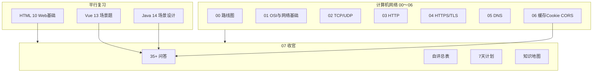
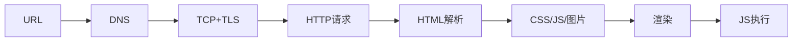
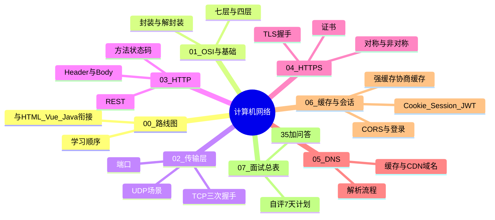
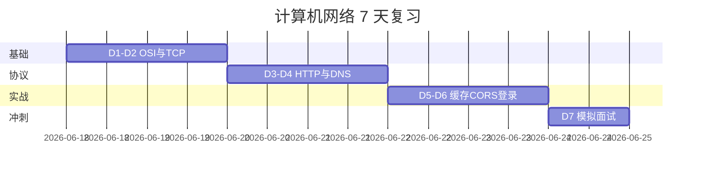

# 面试专题与知识点总表

> **文件编码**：UTF-8。  
> **定位**：计算机网络系列 **收官篇（07）**——35+ 高频口述题 + 自评总表 + 7 天复习计划 + 全系列交叉索引。  
> **配合**：[06 缓存与会话](./06-缓存Cookie与会话机制.md) 实战、[Vue 13 场景题](../Vue/13-高频场景题与面试专题.md) 口述框架、[Java 14/15 面试章](../../后端学习/Java/14-高频场景设计与面试专题.md)。

---

## 0. 读前导读（零基础也能跟上）

### 0.1 用一句话弄懂本章

本章是计网系列 **00～06 的收官索引**：把 OSI、TCP、HTTP/S、DNS、缓存、Cookie、CORS 压成 **40+ 道可口述的面试题** + **自评总表** + **7 天冲刺计划**——不是学新知识，而是**检验你能不能讲清楚、能不能结合 shop 项目举例**。

**类比：本章 = 驾考科目一速查手册 + 模拟考**

| 学习阶段 | 对应文档 | 本章角色 |
|----------|----------|----------|
| 第一次学 | 01～06 各章 | 先别跳本章 |
| 第二遍复习 | **07 本章** | 逐题口述，标 ⬜/🔶/✅ |
| 面试前 7 天 | §44 计划 + §42 自评 | 按天刷题、回炉薄弱章 |

### 0.2 你需要提前知道什么

| 前置 | 说明 |
|------|------|
| 01～06 至少通读一遍 | 本章只有**答案框架**，不是从零教学 |
| shop-vue 联调经历 | 每题尽量带「我们项目里…」 |
| [Vue 13](../Vue/13-高频场景题与面试专题.md) | 前端场景题互补，不重复造轮子 |

**零基础直接刷 07？** 先回到 [01 网络分层](./01-网络分层与通信基础.md) 或 [HTML 10](../HTML%20CSS%20JS/10-浏览器HTTP网络与Web基础.md)。

### 0.3 本章知识地图（学完后应能勾选全部 ☐→☑）

```text
☐ 2 分钟口述「输入 URL 到页面展示」不卡壳
☐ 能画 TCP 三次握手 + 304 协商缓存时序
☐ GET/POST、HTTP/HTTPS、强缓存/协商缓存对比清晰
☐ 跨域原因 + 开发 proxy + 生产 Nginx 各一套
☐ shop 登录链路能 demo + 口述（JWT + 拦截器 + 401）
☐ §42 自评表至少 80% 为 🔶 或 ✅
☐ 完成 §44 七天计划 D7 模拟面试（随机 20 题）
☐ §45 shop 网络验收表 7 项全过
```

### 0.4 建议学习时长与节奏

| 用法 | 时间 |
|------|------|
| **首次**（06 章学完后） | 通读 §1～40 框架，每题 3 分钟 | 3～4 小时 |
| **7 天冲刺** | 按 §44 每日任务 | 7 天 × 1～2h |
| **面试前夜** | §51 一句话速记 + §45 验收 + 薄弱 2 章回炉 | 2 小时 |

### 0.5 学完本章你能做什么（可验证的具体动作）

1. 随机抽 10 题（§1～40），**闭卷口述**录音，回听卡顿点。
2. 在 §42 自评表标完所有行，统计 ⬜ 数量并回对应章节。
3. 白板 5 分钟：URL→DNS→TCP→TLS→HTTP→渲染 + shop Ajax。
4. 向同学模拟「连环追问」：跨域 → 预检 → credentials → HTTPS。
5. 填写 §52 打卡区，制定二轮 3 天补强（若 ⬜>5）。

---

## 本章衔接

00～06 章从 **OSI → TCP/IP → HTTP/HTTPS → DNS → 缓存/Cookie/CORS/登录** 搭完知识体系；[HTML 10](../HTML%20CSS%20JS/10-浏览器HTTP网络与Web基础.md) 是零基础初识。面试不会按章节编号考，而是：

- 「从输入 URL 到页面展示发生了什么？」
- 「TCP 为什么三次握手？」
- 「GET 和 POST 区别？」
- 「304 和 200 缓存怎么讲？」
- 「跨域怎么解决？你们项目怎么登录？」

本章提供 **35+ 问答框架**、与 [Vue 14](../Vue/14-补充知识点总表.md) 同风格的 **自评总表**，以及 **7 天冲刺计划**。



**使用方式**：

1. 每题先 **自己口述 2 分钟**，再对照参考答案  
2. 每题尽量结合 **shop-vue 联调** 或 **DevTools 观察**  
3. 回答结构：**定义 → 原理 → 场景 → 项目实践 → 对比/边界**

---

## 0. 通用回答框架

| 步骤 | 内容 |
|------|------|
| 1 | 一句话定义 |
| 2 | 原理或机制（可画简图） |
| 3 | 使用场景 |
| 4 | shop / 项目里怎么遇到 |
| 5 | 与对立概念对比、常见坑 |

---

## 1. OSI 七层模型是什么？TCP/IP 四层怎么对应？

**框架（30 秒）**  
OSI 是**理论参考模型**，分七层：物理、数据链路、网络、传输、会话、表示、应用。TCP/IP 是**实际互联网协议栈**，分四层：网络接口、网际、传输、应用。

**对应关系**

| OSI | TCP/IP | 协议举例 |
|-----|--------|----------|
| 应用 / 表示 / 会话 | 应用层 | HTTP、DNS、HTTPS |
| 传输 | 传输层 | TCP、UDP |
| 网络 | 网际层 | IP、ICMP |
| 数据链路 / 物理 | 网络接口 | 以太网、Wi-Fi |

**前端关注**  
主要停在 **应用层（HTTP）**；排查慢请求时会用到 **DNS（应用）**、**TCP 连接（传输）**。详见 [01 网络分层与通信基础](./01-网络分层与通信基础.md)。

**对比**  
OSI 教学用；互联网运行以 TCP/IP 为准。

---

## 2. 从输入 URL 到页面展示，发生了什么？（超高频）

**框架（分层口述）**

1. **URL 解析**：协议、域名、路径、query  
2. **DNS 解析**：域名 → IP（见 [05-DNS](./03-IP地址与DNS解析.md)）  
3. **建立 TCP 连接**：三次握手（HTTPS 还有 TLS 握手，见 [04-HTTPS](./05-HTTPS与TLS加密.md)）  
4. **发 HTTP 请求**：GET HTML  
5. **响应处理**：200/304；解析 HTML  
6. **并行加载**：CSS、JS、图片（各自走缓存策略，见 [06 章](./06-缓存Cookie与会话机制.md)）  
7. **构建 DOM/CSSOM → 渲染树 → 布局 → 绘制**  
8. **执行 JS**：可能改 DOM、发 Ajax  



**项目**  
shop 首屏：HTML → `main.js` → Vue 挂载 → Router → Axios 调 `/api/products`。

**加分**  
提到 **CDN** 静态资源、**HTTP/2** 多路复用、**Service Worker**（若了解）。

---

## 3. TCP 三次握手、四次挥手过程？为什么不是两次握手？

**三次握手**

1. 客户端 → `SYN`（seq=x）  
2. 服务端 → `SYN+ACK`（seq=y, ack=x+1）  
3. 客户端 → `ACK`（ack=y+1）→ **连接建立**

**为什么三次**  
防止**历史重复 SYN** 导致服务端误建连接；双方都要确认自己的发送与接收能力。**两次**无法可靠确认客户端的接收能力。

**四次挥手（了解）**  
双方各自关闭发送方向，需 **FIN/ACK** 四次；因为 TCP 全双工。

**前端关联**  
HTTPS 每次新连接（HTTP/1.1 可 keep-alive 复用）都有握手成本；HTTP/2 同连接多请求。详见 [02 TCP 与 UDP](./02-TCP与UDP.md)。

---

## 4. TCP 和 UDP 区别？Web 里谁更常见？

| | TCP | UDP |
|---|-----|-----|
| 连接 | 面向连接 | 无连接 |
| 可靠 | 重传、有序 | 不保证 |
| 速度 | 相对慢 | 快、开销小 |
| 场景 | HTTP、HTTPS、WebSocket | DNS 查询、视频直播、QUIC 底层 |

**Web**  
页面与 API **几乎全是 TCP**（HTTP/S）。UDP 出现在 DNS、部分实时音视频；HTTP/3 基于 QUIC（UDP 上实现可靠）。

---

## 5. HTTP 和 HTTPS 的区别？

| | HTTP | HTTPS |
|---|------|-------|
| 端口 | 80 | 443 |
| 加密 | 明文 | TLS 加密 |
| 证书 | 无 | 需 CA 证书 |
| 防窃听/篡改 | 弱 | 强 |
| SEO/浏览器 | 标记不安全 | 小锁 |

**HTTPS = HTTP + TLS**  
TLS 握手协商密钥，之后应用层数据加密。Cookie 生产环境应设 **Secure**。详见 [04 章](./05-HTTPS与TLS加密.md)。

**项目**  
本地 `http://localhost` 开发可 HTTP；上线 Nginx 配 SSL 证书，全站 HTTPS。

---

## 6. GET 和 POST 区别？（不要只答语义）

**标准层面**

| 维度 | GET | POST |
|------|-----|------|
| 语义 | **获取**资源 | **提交**/创建资源 |
| 参数位置 | query string | body（常见） |
| 缓存 | 可被缓存 | 一般不当缓存键 |
| 书签/历史 | 可 | 通常不 |
| 幂等 | 幂等 | 不一定 |
| 长度 | URL 长度限制 | body 可很大 |

**易错**  
「GET 参数在 URL、POST 在 body」是**常见实践**，不是 HTTP 规范强制；GET 也可以带 body（极少用）。

**项目**  
shop：`GET /api/products?page=1`；`POST /api/login` JSON body；`POST /api/orders` 下单。

**安全**  
GET 参数会进日志、Referer；**敏感数据勿放 GET**。

---

## 7. PUT、PATCH、DELETE 在前端何时用？

REST 风格：

- **PUT**：整体替换资源  
- **PATCH**：部分更新  
- **DELETE**：删除  

shop 示例：`PUT /api/cart/items/1` 改数量；`DELETE /api/cart/items/1` 删除。  
都会触发 **CORS 预检**（非简单方法）。见 [04 HTTP 协议深入](./04-HTTP协议深入.md)。

---

## 8. 常见 HTTP 状态码？前端如何处理？

| 码 | 含义 | 前端处理 |
|----|------|----------|
| 200 | OK | 正常渲染 |
| 201 | Created | 创建成功提示 |
| 204 | No Content | 删除成功无 body |
| 301/302 | 重定向 | 跟 Location（或 axios 自动） |
| 304 | Not Modified | 用缓存（见 06 章） |
| 400 | Bad Request | 表单校验提示 |
| 401 | Unauthorized | **跳登录**、清 token |
| 403 | Forbidden | 无权限页 |
| 404 | Not Found | 404 页 |
| 500 | Server Error | 友好错误页、上报 |

**项目**  
Axios 响应拦截：`code !== 0` 业务错；`status === 401` 调 `logout()`。

---

## 9. 强缓存和协商缓存？304 是什么？

**强缓存**：`Cache-Control: max-age` 未过期 → **不发请求**。  
**协商缓存**：过期后带 `If-None-Match`/`If-Modified-Since` → 未变 **304**（无 body）→ 用本地副本。

**SPA**  
`index.html` → `no-cache`；`app.[hash].js` → 长缓存 + immutable。

完整流程见 [06 章 §2～4](./06-缓存Cookie与会话机制.md)。

---

## 10. ETag 和 Last-Modified 区别？

| | Last-Modified | ETag |
|---|---------------|------|
| 依据 | 文件修改时间 | 内容哈希/版本 |
| 精度 | 秒级 | 更准 |
| 优先级 | 低 | 高 |

---

## 11. Cookie、Session、Token 区别？你们项目用哪种？

**Cookie**：浏览器存储机制，可自动携带。  
**Session**：服务端会话，常通过 **SessionId Cookie** 关联。  
**Token（JWT）**：自包含凭证，常见放 **Header** 或 Cookie。

**shop-vue**  
JWT + `localStorage` + `Authorization: Bearer` + Pinia；无服务端 Session。  
对比表见 [06 章 §8](./06-缓存Cookie与会话机制.md)。

**追问 JWT 缺点**  
难主动作废 → 短过期 + Refresh Token 或黑名单。

---

## 12. HttpOnly、Secure、SameSite 是什么？

- **HttpOnly**：JS 不能 `document.cookie` 读，减 XSS 风险  
- **Secure**：仅 HTTPS 发送  
- **SameSite**：跨站是否带 Cookie，**Lax** 默认，防 CSRF  

---

## 13. localStorage 和 Cookie 存 token 有何不同？

| | Cookie | localStorage |
|---|--------|--------------|
| 自动发送 | 是 | **否**，需拦截器 |
| HttpOnly | 可以 | 不可以 |
| CSRF | 有风险 | Header 方案风险低 |
| XSS | HttpOnly 可防读 | **可读，高危** |

shop 用 localStorage 因前后端分离 + 跨域 Header 简单；生产可升级 HttpOnly Cookie 方案。

---

## 14. 什么是跨域？为什么 Postman 不跨域？

**同源**：协议 + 域名 + 端口相同。  
**跨域**：浏览器 **同源策略** 限制 JS 读取其他源响应。

Postman/curl **不是浏览器**，无同源策略，故「不跨域」。

Console 典型：

```text
blocked by CORS policy: No 'Access-Control-Allow-Origin'
```

---

## 15. 简单请求和预检请求？OPTIONS 干什么？

**简单请求**：GET/HEAD/POST + 有限 Header + 特定 Content-Type。  
**否则**：先发 **OPTIONS** 预检，问服务器是否允许 Method/Header；通过后再发真实请求。

shop 的 `application/json` + `Authorization` **必预检**。  
流程见 [06 章 §10](./06-缓存Cookie与会话机制.md)。

---

## 16. CORS 怎么解决？开发 vs 生产？

| 环境 | 方案 |
|------|------|
| 本地开发 | **Vite proxy** `/api` → 8080 |
| 直连后端 | Spring **CorsConfig** |
| 生产 | **Nginx 同域** 反代 `/api` 或后端 CORS + HTTPS |

`credentials: true` 时 `Allow-Origin` 不能 `*`。

---

## 17. 同源策略都限制什么？

- DOM 跨源读（iframe）  
- **Ajax/fetch 响应**给 JS（CORS 管）  
- localStorage 按源隔离  

**不限制**：``、`<script src>`、`<link href>` 加载（但 JS 读不到跨域图片像素除非 CORS）。

---

## 18. DNS 解析过程？前端为什么要关心？

**简版**：浏览器缓存 → 系统 hosts → 递归查询 根 → TLD → 权威 DNS → 得 IP。

**前端**  
- 首次访问慢可能 DNS 慢  
- `dns-prefetch`、`preconnect` 优化  
- CDN 域名与 API 域名分离  

详见 [05 章](./03-IP地址与DNS解析.md)。

---

## 19. 域名、IP、端口分别是什么？

- **IP**：主机地址（如 `192.168.1.1`）  
- **域名**：IP 的别名，便于记忆  
- **端口**：同一 IP 上区分服务（HTTP 80、HTTPS 443、Spring Boot 8080）

URL：`https://shop.com:443/api/users`

---

## 20. HTTP/1.1 和 HTTP/2 主要区别？（了解）

| HTTP/1.1 | HTTP/2 |
|----------|--------|
| 文本协议 | 二进制分帧 |
| 队头阻塞（同连接） | 多路复用 |
| 常多连接 | 单连接并行 |

前端感知：HTTP/2 减少连接数，静态资源同域合并仍重要。

---

## 21. 什么是长连接（Keep-Alive）？

HTTP/1.1 默认 **持久连接**：同一 TCP 连接上发多个请求，减少握手开销。  
Header：`Connection: keep-alive`。

---

## 22. 什么是 RESTful？和 HTTP 方法关系？

REST 是一种**架构风格**：资源用 URL 表示，用 HTTP 方法表达操作。  
不是标准，是约定；`GET /api/products/1` 读，`POST /api/orders` 创建订单。

---

## 23. Content-Type 常见值？

- `application/json`：前后端分离 API  
- `application/x-www-form-urlencoded`：表单  
- `multipart/form-data`：文件上传  
- `text/html`：页面  

JSON 请求会触发 CORS 预检。

---

## 24. 什么是 CDN？和浏览器缓存关系？

CDN 把资源缓存到**边缘节点**，就近响应。  
也遵守 `Cache-Control`；静态资源 `public, max-age` 长缓存；API 通常不缓存。

见 [06 章 §6](./06-缓存Cookie与会话机制.md)。

---

## 25. 什么是 WebSocket？和 HTTP 区别？

**WebSocket**：全双工、长连接，服务器可**主动推送**。  
握手通过 HTTP Upgrade；之后独立帧协议。

| | HTTP | WebSocket |
|---|------|-----------|
| 方向 | 请求-响应 | 双向 |
| 连接 | 短 / Keep-Alive | 长连接 |
| 场景 | CRUD API | 聊天、实时价、通知 |

前端：`new WebSocket('wss://...')`；shop 订单状态推送可扩展点。

---

## 26. 什么是 SSE（Server-Sent Events）？和 WebSocket 比？

SSE：服务器单向推送到浏览器，基于 HTTP，自动重连。  
只需服务器→客户端时用 SSE 更简单；双向用 WebSocket。

---

## 27. 一次 Ajax 请求在 Network 里看什么？

- **General**：URL、Method、Status  
- **Request Headers**：Authorization、Content-Type  
- **Response Headers**：CORS、Cache-Control、Set-Cookie  
- **Timing**：DNS、TCP、Waiting(TTFB)、Content Download  
- **Preview/Response**：JSON body  

401 先看 Request 是否带 Bearer；CORS 先看 OPTIONS。

---

## 28. 什么是 TTFB？怎么优化？

**Time To First Byte**：发出请求到收到首字节。  
优化：CDN、后端慢 SQL、减少回源、HTTP/2、DNS 预解析。

---

## 29. 什么是对称加密和非对称加密？HTTPS 用哪种？

- **对称**：同一密钥加解密，快  
- **非对称**：公钥加密、私钥解密，慢  

TLS 握手用**非对称**交换对称密钥，之后用**对称**加密 HTTP 数据。

---

## 30. 中间人攻击是什么？HTTPS 如何防？

攻击者截获明文 HTTP。HTTPS 通过证书校验服务器身份 + 加密通道防窃听与篡改。

---

## 31. 什么是同源 Cookie 的 Domain 和 Path？

- **Domain**：`.example.com` 子域共享  
- **Path**：仅匹配路径前缀的请求携带  

设错会导致「登录了但 API 不带 Cookie」。

---

## 32. 什么是 CSRF？如何防护？

**跨站请求伪造**：用户已登录 A 站，访问恶意 B 站，B 诱使浏览器带 Cookie 请求 A。

防护：SameSite Cookie、CSRF Token、Referer 校验；JWT 仅 Header 可降低 Cookie CSRF。

---

## 33. 什么是 XSS？和 token 存储关系？

**跨站脚本**：注入恶意 JS 读 DOM/Cookie/localStorage。

JWT 在 localStorage → XSS 可偷 token → 必须转义输出、CSP、依赖安全。

---

## 34. 登录流程你怎么设计？（结合 shop）

1. `POST /api/login` 校验账号  
2. 返回 JWT + userInfo  
3. Pinia + localStorage 存 token  
4. 拦截器加 `Authorization`  
5. 路由 `meta.requiresAuth` + `beforeEach`  
6. 401 → logout + 跳登录 + redirect 回跳  

时序见 [06 章 §12](./06-缓存Cookie与会话机制.md)。

---

## 35. 退出登录要注意什么？

- 前端清 token、userInfo、购物车可选清  
- 跳登录页  
- 若有 Refresh Token HttpOnly Cookie → 调后端 `/logout` 清 Cookie  
- 若有 WebSocket → 断开连接  

---

## 36. 前端如何处理并发多个相同请求？

防抖搜索、AbortController 取消上一次、或请求层 dedupe。见 [Vue 13](../Vue/13-高频场景题与面试专题.md) 搜索场景。

---

## 37. Nginx 反代和 CORS 关系？

生产 `shop.com` 静态 + `shop.com/api` 反代 Java → **浏览器同源**，无需 CORS。  
Nginx 也可加 CORS 头给跨域 API 网关用。

见 [Vue 10 部署](../Vue/10-Vite构建与项目部署.md)。

---

## 38. 什么是 sticky session？和 JWT 关系？

负载均衡把同一用户固定到同一台机器，便于**本地 Session**。JWT 无状态则**不需要** sticky。

---

## 39. HTTP 是无状态协议什么意思？

服务器默认**不记住**上次请求；登录态靠 Cookie SessionId 或 Token 每次带上。  
「无状态」指协议本身，应用层用 token 实现「有状态体验」。

---

## 40. 为什么 301 和 302 对 SEO 不同？（了解）

301 **永久**重定向，权重迁移；302 **临时**。前端 axios 可能自动跟随。

---

## 知识地图（全系列）



---

## 41. 全系列文档交叉索引

### 41.1 计算机网络 00～07

| 编号 | 文件 | 核心内容 |
|------|------|----------|
| 00 | [学习路线图与说明](./00-学习路线图与说明.md) | 顺序、环境、练习总表 |
| 01 | [网络分层与通信基础](./01-网络分层与通信基础.md) | OSI、TCP/IP、封装 |
| 02 | [TCP 与 UDP](./02-TCP与UDP.md) | 握手挥手、可靠传输 |
| 03 | [IP 地址与 DNS 解析](./03-IP地址与DNS解析.md) | NAT、DNS 链、CDN |
| 04 | [HTTP 协议深入](./04-HTTP协议深入.md) | 方法、状态码、HTTP/2/3 |
| 05 | [HTTPS 与 TLS 加密](./05-HTTPS与TLS加密.md) | 证书、TLS、混合加密 |
| 06 | [缓存 Cookie 与会话机制](./06-缓存Cookie与会话机制.md) | 304、JWT、CORS、shop |
| 07 | 面试专题与知识点总表（本文件） | 问答、自评、7 天 |

### 41.2 HTML CSS JS

| 文件 | 关联主题 |
|------|----------|
| [09 异步与本地存储](../HTML%20CSS%20JS/09-JavaScript异步编程网络请求与本地存储.md) | fetch、localStorage |
| [10 浏览器HTTP与Web基础](../HTML%20CSS%20JS/10-浏览器HTTP网络与Web基础.md) | 零基础 HTTP、跨域初识 |
| [13 前端场景题](../HTML%20CSS%20JS/13-前端高频场景题与面试专题.md) | 防抖、跨域口述 |
| [14 前端补充总表](../HTML%20CSS%20JS/14-前端补充知识点总表.md) | 自评风格参考 |

### 41.3 Vue 系列

| 文件 | 关联主题 |
|------|----------|
| [08 Axios 联调](../Vue/08-Axios网络请求与前后端联调.md) | 拦截器、proxy、401 |
| [10 Vite 部署](../Vue/10-Vite构建与项目部署.md) | Nginx 缓存、反代 |
| [13 场景题与面试](../Vue/13-高频场景题与面试专题.md) | 登录、跨域、五步法 |
| [14 补充知识点总表](../Vue/14-补充知识点总表.md) | 自评表对照 |

### 41.4 Java 后端

| 文件 | 关联主题 |
|------|----------|
| [04 Spring Boot 核心](../../后端学习/Java/04-SpringBoot核心开发.md) | CORS、REST、Result |
| [06 Redis 缓存](../../后端学习/Java/07-Redis核心原理与缓存实战.md) | Session 存 Redis |
| [10 项目实战与面试](../../后端学习/Java/10-后端项目实战与面试准备.md) | JWT 接口、联调 |
| [14 场景设计与面试](../../后端学习/Java/14-高频场景设计与面试专题.md) | 登录设计、缓存一致性 |
| [15 补充知识点总表](../../后端学习/Java/15-补充知识点总表.md) | 全栈复习索引 |

---

## 42. 知识点自评总表（00～07）

复习时在「自评」列标记：**⬜ 知道 / 🔶 会用 / ✅ 会讲**。

### 42.1 网络基础（00～02）

| 知识点 | 文档 | 掌握标准 | 自评 |
|--------|------|----------|------|
| OSI 七层名称 | 01 | 能按序说出 | ⬜ |
| TCP/IP 四层 | 01 | 与 OSI 对应 | ⬜ |
| TCP 三次握手 | 02 | 能画 SYN/ACK | ⬜ |
| 为何不是两次握手 | 02 | 历史 SYN 问题 | ⬜ |
| TCP 四次挥手 | 02 | 知道 FIN 双向 | ⬜ |
| TCP vs UDP | 02 | 可靠 vs 实时 | ⬜ |
| 端口概念 | 02 | 80/443/8080 | ⬜ |

### 42.2 HTTP/HTTPS（03～04）

| 知识点 | 文档 | 掌握标准 | 自评 |
|--------|------|----------|------|
| HTTP 无状态 | 03 | 每次带 token | ⬜ |
| GET/POST 区别 | 03/07 | 语义+幂等+缓存 | ⬜ |
| 常见状态码 | 03/07 | 401/403/404/500 | ⬜ |
| Request/Response 结构 | 03 | 头+body | ⬜ |
| Keep-Alive | 03 | 减少握手 | ⬜ |
| HTTPS = HTTP+TLS | 04 | 443 端口 | ⬜ |
| 证书作用 | 04 | 身份+密钥交换 | ⬜ |
| 对称/非对称加密 | 04 | TLS 混合用 | ⬜ |

### 42.3 DNS（05）

| 知识点 | 文档 | 掌握标准 | 自评 |
|--------|------|----------|------|
| DNS 作用 | 05 | 域名→IP | ⬜ |
| 解析大致流程 | 05 | 递归/迭代 | ⬜ |
| A / CNAME 记录 | 05 | 各说一句 | ⬜ |
| hosts 与浏览器 DNS 缓存 | 05 | 排查 ping 通浏览器不通 | ⬜ |
| CDN 与 DNS | 05/06 | 就近访问 | ⬜ |

### 42.4 缓存与会话（06）

| 知识点 | 文档 | 掌握标准 | 自评 |
|--------|------|----------|------|
| 强缓存 vs 协商缓存 | 06 | 304 无 body | ⬜ |
| Cache-Control 指令 | 06 | max-age/no-cache/no-store | ⬜ |
| ETag vs Last-Modified | 06 | 优先级 | ⬜ |
| SPA 缓存策略 | 06 | HTML vs hash JS | ⬜ |
| Cookie 属性 | 06 | HttpOnly/Secure/SameSite | ⬜ |
| Session vs JWT | 06 | 有状态 vs 无状态 | ⬜ |
| localStorage 不自动发送 | 06 | 拦截器 Bearer | ⬜ |
| CORS 预检 OPTIONS | 06 | JSON+Authorization | ⬜ |
| Vite proxy vs CORS | 06 | 开发/生产方案 | ⬜ |
| shop 登录链路 | 06 | 能 demo | ⬜ |

### 42.5 面试表达（07）

| 知识点 | 文档 | 掌握标准 | 自评 |
|--------|------|----------|------|
| URL 到页面展示 | 07 §2 | 2 分钟口述 | ⬜ |
| 跨域原因与解决 | 07 §14～16 | 结合项目 | ⬜ |
| 登录方案设计 | 07 §34 | STAR+时序 | ⬜ |
| WebSocket 场景 | 07 §25 | 与 HTTP 对比 | ⬜ |
| DevTools Network | 07 §27 | 会看 Timing | ⬜ |
| 安全 XSS/CSRF | 07 §32～33 | 与 Cookie 关联 | ⬜ |

---

## 43. 能力矩阵（1～5 分）

| 维度 | 1 分 | 3 分 | 5 分 |
|------|------|------|------|
| 分层模型 | 说不清层数 | 说 OSI+TCP/IP | 能对应协议 |
| TCP/HTTP | 只知道三次握手 | 状态码+方法 | 能画握手+304 流程 |
| HTTPS/DNS | 只知道 HTTPS 安全 | TLS+解析步骤 | 证书+记录类型 |
| 缓存会话 | 混淆 Cookie/localStorage | 强/协商缓存 | shop 登录讲清 |
| CORS | 只会 proxy | OPTIONS+响应头 | 生产 Nginx 方案 |
| 面试表达 | 背定义 | 15 题流畅 | 40 题+项目结合 |

低于 3 分回对应章节重学。

---

## 44. 7 天复习计划

| 天 | 主题 | 动作 | 产出 |
|----|------|------|------|
| **D1** | 00～01 基础 | 画 OSI/TCP/IP 对照表；自评 §42.1 前 4 项 | 手写分层图 1 张 |
| **D2** | 02 TCP/UDP | 白板三次握手；口述 §3～4 | 能答「为何三次」 |
| **D3** | 03～04 HTTP/S | 默写 10 个状态码；HTTPS 混合加密 | curl 抓包看响应头 |
| **D4** | 05 DNS |  hosts 实验；读 CDN 域名 CNAME | 解析流程口述 1 遍 |
| **D5** | 06 缓存会话 | DevTools 找 304；跑通 shop 登录 | §12.7 验收全过 |
| **D6** | 06 CORS + 部署 | 配 Spring CORS + Vite proxy 对照 | 能讲开发/生产差异 |
| **D7** | 07 面试冲刺 | 随机抽 20 题口述录音；自评总表 | 薄弱 2 章回炉 |



**与 Vue/Java 联调日（可选 D5 下午）**  
对照 [Vue 08](../Vue/08-Axios网络请求与前后端联调.md) 与 [Java 10](../../后端学习/Java/10-后端项目实战与面试准备.md) 做端到端登录演示，面试可当项目亮点。

---

## 45. shop 网络相关验收总表

| 项 | 验收 | 通过 |
|----|------|------|
| 登录 POST 200 | Network 见 JSON token | ⬜ |
| 后续请求带 Bearer | Request Headers 有 Authorization | ⬜ |
| 401 跳登录 | 删 token 后访问需鉴权页 | ⬜ |
| 开发 proxy 无 CORS 报错 | Console 无 CORS 红字 | ⬜ |
| build 后静态 hash | assets 文件名含 hash | ⬜ |
| preview/nginx HTML 不长期缓存 | 响应 Cache-Control 合理 | ⬜ |
| 能口述登录时序 | 2 分钟内讲清 | ⬜ |

---

## 46. 与 Vue 13 / Java 14 面试题对照

| 本文档 | Vue 13 | Java 14 |
|--------|--------|---------|
| §2 URL 到页面 | 性能、首屏 | — |
| §14～16 跨域 | §14 跨域 | 网关/CORS |
| §34 登录 | §12 登录 | 登录系统设计 |
| §9 缓存 | — | 缓存一致性 |
| §25 WebSocket | 实时通知 | 消息推送 |

**复习组合**：网络 07 自评 + Vue 14 自评 + Java 15 总表 + 框架 13 场景题。

---

## 47. 手写/白板题清单

| 题目 | 对应知识 | 文档 |
|------|----------|------|
| 画 TCP 三次握手 | 传输层 | 02 / §3 |
| 画 304 协商缓存时序 | 缓存 | 06 / §9 |
| 画 CORS 预检时序 | 跨域 | 06 §10 / §15 |
| 画 shop 登录时序 | JWT | 06 §12 / §34 |
| 写 Axios 拦截器骨架 | 实战 | Vue 08 |
| 写 CorsConfig 骨架 | 后端 | Java 04 |

---

## 48. 练习建议

### 基础题

1. 不看文档口述 OSI 七层与 TCP/IP 四层对应。  
2. 说出 8 个常见 HTTP 状态码及前端处理。  
3. 强缓存与协商缓存区别？304 有没有 body？

### 进阶题

4. 2 分钟讲「输入 URL 到页面展示」。  
5. 对比 Session+Cookie 与 JWT Header 方案。  
6. 说明为何 shop 用 Vite proxy，生产用 Nginx 同域。

### 挑战题

7. 30 分钟内口述 §1～20 任意 10 题，录音自评。  
8. 根据自评表 §42 标出所有 ⬜，制定二轮 3 天计划。  
9. 与同学互相考「跨域 + 登录 + 缓存」连环追问。

---

## 49. 练习参考答案（节选）

### 基础题 1（30 秒版）

OSI：物数网传会表应。TCP/IP 四层：网际（IP）、传输（TCP/UDP）、应用（HTTP/DNS）、网络接口。HTTP 在应用层。

### 基础题 3

强缓存未过期不请求；协商过期后带验证头，未变则 304 **无响应体**，用本地缓存。

### 进阶题 4（提纲）

DNS → TCP（+TLS）→ HTTP GET HTML → 解析 → 并行资源（缓存策略）→ 渲染 → JS → Ajax。补 CDN、HTTP/2 加分。

### 进阶题 5（要点）

Session：状态在服务端，Cookie 带 id，易注销，分布式要 Redis。JWT Header：无状态，扩展性好，XSS 读 localStorage 风险，注销靠过期或黑名单。

---

## 50. 常见报错与排查（面试调试向）

| # | 现象 | 原因 | 解决 |
|---|------|------|------|
| 1 | CORS policy blocked | 缺 ACAO | Spring CORS 或 proxy |
| 2 | OPTIONS 404 | 未处理预检 | permitAll OPTIONS |
| 3 | 401 但已登录 | 未带 Bearer | 拦截器读 Pinia |
| 4 | 304 但功能旧 | 缓存副本 stale | 清缓存；HTML no-cache |
| 5 | Cookie 未发送 | SameSite/Domain | 改属性或改 Token 方案 |
| 6 | net::ERR_NAME_NOT_RESOLVED | DNS 失败 | 查域名、hosts、网络 |
| 7 | SSL certificate error | 证书无效 | 信任链、域名匹配 |
| 8 | Mixed Content | HTTPS 页请求 HTTP | 全站 HTTPS |
| 9 | 502 Bad Gateway | 反代后端挂 | 查 Java 进程、Nginx |
| 10 | 请求 pending 很久 | TCP/TTFB 慢 | Timing 面板定位 |
| 11 | WebSocket failed | ws/wss 混用 | 与页面协议一致 |
| 12 | token 过期仍路由进 | 守卫只查有无 token | 401 统一 logout |

---

## 51. 一句话速记（各章）

| 章 | 一句话 |
|----|--------|
| 00 | 路线图：HTML10 后、Vue08 前补网络 |
| 01 | OSI 七层，TCP/IP 四层实用 |
| 02 | TCP 三次握手，UDP 快但不保 |
| 03 | HTTP 无状态，方法语义+状态码 |
| 04 | HTTPS = TLS 加密 + 证书 |
| 05 | DNS 域名变 IP，CDN 靠它 |
| 06 | 强协商缓存，JWT+CORS+shop 登录 |
| 07 | 40 题口述，自评+7 天收官 |

---

## 52. 我的复习打卡区

```text
本轮复习开始日期：
自评完成度（§42 共 ___ 项 ✅）：
shop 网络验收（§45 共 ___ 项通过）：
最薄弱 3 项：
  1.
  2.
  3.
计划重学章节：
面试日期：
```

---

## 学完标准（全系列收官）

| # | 标准 | 自检 |
|---|------|------|
| 1 | 2 分钟口述「URL 到页面」不卡壳 | ⬜ |
| 2 | 能画 TCP 三次握手与 304 协商流程 | ⬜ |
| 3 | GET/POST、HTTP/HTTPS 对比清晰 | ⬜ |
| 4 | 强缓存/协商缓存/Cookie/JWT 能讲 | ⬜ |
| 5 | 跨域原因 + 开发/生产方案各一套 | ⬜ |
| 6 | shop 登录链路 demo + 口述 | ⬜ |
| 7 | 自评表 §42 至少 80% 为 🔶 或 ✅ | ⬜ |
| 8 | 完成 7 天计划 D7 模拟面试 | ⬜ |

---

## 下一章预告

**计算机网络 00～07 系列至此完结**。

后续建议：

- 与 [Vue 13/14](../Vue/13-高频场景题与面试专题.md) 做**全栈口述**（跨域、登录、部署一条线）  
- 与 [Java 14/15](../../后端学习/Java/15-补充知识点总表.md) 对照**后端网络与安全**  
- 工作中用 DevTools **Network** 面板持续验证本章理论  
- 可选延伸：[浏览器与性能](../浏览器与性能/)（待建）、Web 安全专题  

---

*UTF-8 | 全系列索引：[00 学习路线图](./00-学习路线图与说明.md) · 规范：[修改规范](../../修改规范.md)*

---

## 53. 常见问题 FAQ（索引篇）

**Q1：面试「从 URL 到页面」要说多细？**  
2 分钟版：DNS → TCP（+TLS）→ HTTP → 解析 HTML → 并行资源 → 渲染 → JS。加分提 CDN、HTTP/2、缓存策略。不必背 OSI 每层 PDU 名。

**Q2：TCP 为什么三次握手？两次不行吗？**  
要确认双方收发能力，并避免历史重复 SYN 导致服务端误建连接。见 §3。

**Q3：GET 和 POST 最大区别？**  
**语义**：GET 安全/幂等/可缓存；POST 提交/非幂等。参数位置是实践不是规范强制。

**Q4：304 算缓存命中吗？**  
算**协商缓存**命中，但有 RTT；强缓存才是零请求。

**Q5：跨域谁实现的限制？**  
**浏览器**同源策略；服务器仍收到请求。Postman 无此限制。

**Q6：JWT 缺点怎么答？**  
难主动作废 → 短过期 + Refresh 或 Redis 黑名单；payload 勿存敏感信息。

**Q7：WebSocket 和 HTTP 选型？**  
双向实时用 WS；CRUD API 用 HTTP。SSE 只需服务器推送时更简单。

**Q8：全系列复习顺序？**  
01 分层 → 02 TCP → 03 IP/DNS → 04 HTTP → 05 HTTPS → 06 缓存会话 → **07 口述**。

---

## 54. 追加面试题（41～45）

### 41. QUIC / HTTP/3 和 TCP 有何不同？（了解加分）

**框架**：HTTP/3 跑在 **QUIC**（UDP 上实现可靠 + 加密），把传输与 TLS 握手合并，**Connection ID** 不绑 IP，换网（Wi-Fi→4G）不断连。TCP 绑四元组，换网易断。

**项目**：shop 首屏优化可提「HTTP/3 减握手 RTT」，不必深入 QUIC 帧格式。

### 42. 什么是队头阻塞？HTTP/2 解决了什么、没解决什么？

HTTP/1.1 同连接上响应须按序 → 慢响应阻塞后续。HTTP/2 **应用层多路复用**缓解同连接并行；但底层仍 **TCP 队头阻塞**（丢包阻塞整连接）。HTTP/3 用 QUIC 缓解。

### 43. DNS 污染 / 解析慢怎么排查？

**口述**：`ping domain` vs 浏览器访问；查 hosts、换 DNS（8.8.8.8）、`nslookup`；DevTools 看 Timing 的 DNS Lookup 阶段。见 [05-DNS](./03-IP地址与DNS解析.md)（若系列有 DNS 专章）。

### 44. 什么是 Preflight 缓存？`Access-Control-Max-Age`？

OPTIONS 预检通过后，浏览器在 Max-Age 秒内**不重复预检**同一 URL+Method+Header 组合。后端可设 `3600` 减 OPTIONS 流量。

### 45. 描述一次你在 shop 项目遇到的「网络问题」怎么排查？（STAR）

**S**：登录 401。**T**：带 token 调 profile。**A**：Network 看 Request 无 Authorization → 查拦截器未读 Pinia；或有 Authorization 仍 401 → token 过期/后端密钥轮换。**R**：修复拦截器 + 401 统一 logout。  
（也可换 CORS、Mixed Content、304 旧 bundle 等真实经历。）

---

## 55. 口述题难度分级表

| 难度 | 题号示例 | 要求 |
|------|----------|------|
| ⭐ 必会 | §2 URL、§3 TCP、§6 GET/POST、§9 缓存、§14 跨域 | 30 秒～1 分钟 |
| ⭐⭐ 常考 | §5 HTTPS、§11 Cookie/JWT、§34 登录、§32 CSRF/XSS | 1～2 分钟 + 项目 |
| ⭐⭐⭐ 加分 | §20 HTTP/2、§25 WebSocket、§41 QUIC、§28 TTFB 优化 | 知道原理边界即可 |

---

## 56. 与后端/Java 联合面试题（5 题）

1. **前后端分离登录**：JWT 签发、过期、Refresh 谁负责？→ 后端签发；前端存 + 拦截器；见 Java 10。  
2. **CORS 配在前端还是后端？** → 后端（或 Nginx）加响应头；前端 proxy 仅开发。  
3. **接口幂等 POST 重复提交？** → 后端 idempotent key / 去重表；前端按钮 disable。  
4. **缓存一致性**：商品库存变，CDN 缓存列表怎么办？→ 短 max-age / 主动 purge / 不用 CDN 缓存 API。  
5. **HTTPS 证书谁申请？** → 运维/Nginx；前端确保 baseURL 与页面同为 https。

---

## 57. 闭卷自测（10 题 · 索引篇）

### 概念题（6 题）

1. OSI 七层与 TCP/IP 四层如何对应？HTTP 在哪层？
2. 三次握手各发什么包？为何不是两次？
3. 强缓存与协商缓存的关键头与状态码？
4. HTTPS 除加密外还提供什么？TLS 握手用哪种加密协商密钥？
5. 同源策略三要素？CORS 解决的是哪一类限制？
6. Session 有状态 vs JWT 无状态的注销差异？

### 动手题（2 题）

7. Network Timing 里 **Waiting (TTFB)** 高说明什么？下一步查什么？
8. 如何用 curl 观察一次 HTTPS 的 TLS 握手行（不必解密 body）？

### 综合题（2 题）

9. 用 3 分钟串讲：用户打开 `https://shop.com` 到 Vue 挂载并发 `/api/products` 的全链路。
10. 自评 §42 中标记 ⬜ 最多的 3 项，写出对应回炉章节与 1 条验收标准。

### 自测参考答案

**1.** 应用/表示/会话→应用层 HTTP；传输 TCP；网际 IP；接口→链路。HTTP 在应用层。

**2.** SYN → SYN+ACK → ACK；两次无法确认客户端接收能力且防旧 SYN。

**3.** 强：Cache-Control max-age；协商：ETag/If-None-Match → 304 无 body。

**4.** 完整性、身份认证；非对称（ECDHE）协商对称 session key。

**5.** 协议+域名+端口；限制 Ajax/fetch 读跨源响应。

**6.** Session 删服务端即可；JWT 需黑名单或等过期。

**7.** 服务端慢；查 SQL、索引、后端日志，非先怪前端。

**8.** `curl -v https://example.com 2>&1 | findstr TLS`（Windows）。

**9.** DNS → TCP 443 → TLS → GET HTML → 解析 → 加载 hash JS（缓存策略）→ Vue mount → Axios GET API（Bearer 若有）。

**10.** （个人化）例：TCP 握手 ⬜ → 回 02 章画 SYN 图；CORS ⬜ → 06 章 OPTIONS 实验。

---

## 58. 费曼检验：3 分钟讲给零基础朋友

**对照是否讲到：**

1. **上网像寄信+打电话**：DNS 查地址，TCP 拨通电话，HTTP 是信的内容格式。
2. **HTTPS 是加锁的信封**；小锁防路上被偷看，不防你电脑中病毒。
3. **浏览器会记缓存**像冰箱；登录靠 token 每次自己带，跨域是保安不让你读别家 API 的回信。

---

## 59. 二轮 3 天补强模板（自评 ⬜>5 时用）

| 天 | 动作 | 产出 |
|----|------|------|
| D1 | 回炉 ⬜ 最多的 2 章，重做 1 次动手实验 | DevTools 截图或 curl 输出 |
| D2 | 重口述 §2、§9、§14、§34 四题录音 | 标卡顿句 |
| D3 | §45 验收 + 随机 15 题快问快答 | §52 打卡区更新 |

---

## 60. 全系列一句话口语总结（复习夜用）

- **01** 分层：HTTP 在应用层，底下有 TCP/IP。  
- **02** TCP 像打电话，三次握手才通话。  
- **03** IP 找主机，DNS 把域名变 IP。  
- **04** HTTP 无状态，方法+状态码+JSON。  
- **05** HTTPS = 加锁 + 验身份证。  
- **06** 缓存省流量；JWT+CORS+登录一条链。  
- **07** 40 题口述，自评+7 天收官。

---

*本章已按 EXPANSION-STANDARD 扩充（§0 导读+FAQ+追加题+闭卷自测+费曼+二轮计划）。*

**EXPANSION-STANDARD 自检**：☑ §0 读前导读 ☑ FAQ §53 ☑ 追加题 §54～56 ☑ 难度分级 §55 ☑ 闭卷 10 题 §57 ☑ 费曼 §58 ☑ 二轮模板 §59

| 扩充项 | 所在 § |
|--------|--------|
| 驾考手册类比 | §0.1 |
| 40+ 问答框架 | §1～40 |
| 自评 + 7 天 | §42、§44 |
| 闭卷自测 | §57 |
| 费曼检验 | §58 |

---

## 61. 模拟面试：连环追问脚本（15 分钟）

**面试官**：从 URL 到页面展示？  
**你**：DNS → TCP → TLS → HTTP GET HTML → 解析 → 并行资源…

**追问 1**：TCP 为什么三次？  
**你**：确认双向能力 + 防历史 SYN…

**追问 2**：那 HTTPS 多出来的步骤？  
**你**：TLS 握手验证书、协商 session key…

**追问 3**：静态 JS 为什么第二次很快？  
**你**：强缓存 max-age 或 304…

**追问 4**：登录 token 放哪？为什么？  
**你**：shop JWT + localStorage + Bearer；前后端分离简单，XSS 风险需 CSP…

**追问 5**：跨域怎么解决？  
**你**：开发 Vite proxy；生产 Nginx 同域…

**自检**：每答一题是否带 **项目例子**；卡壳项回对应 01～06 章。

---

## 62. 白板题时间盒（面试前练）

| 题目 | 时间 | 合格标准 |
|------|------|----------|
| TCP 三次握手 | 2 min | SYN/SYN+ACK/ACK 标 seq/ack |
| 304 协商缓存 | 2 min | If-None-Match → 304 无 body |
| CORS 预检 | 2 min | OPTIONS → 真实 POST |
| shop 登录时序 | 3 min | login→token→profile→401 |
| OSI vs TCP/IP | 1 min | 四层对应 + HTTP 位置 |

---

## 63. 与 Vue 14 / Java 15 联合自评提示

完成计网 §42 后，打开 [Vue 14](../Vue/14-补充知识点总表.md) 与 [Java 15](../../后端学习/Java/15-补充知识点总表.md)，交叉标记：

- 登录 / token / 401 → 三份文档各能讲 1 分钟  
- 部署 / Nginx / HTTPS → 计网 05 + Vue 10 + Java 09  
- 缓存 → 计网 06 + Java 06 Redis（区分 HTTP 缓存 vs 服务端缓存）

**目标**：全栈口述时 **不重复背三遍**，而是「前端 Network 面板 + 后端接口 + Git 协作」一条线。

---

## 64. 自测成绩记录表（可打印）

| 日期 | 闭卷 §57 得分 /10 | 随机 20 题口述 /20 | §42 ⬜ 剩余 | 备注 |
|------|-------------------|---------------------|-------------|------|
| | | | | |
| | | | | |

**及格线建议**：闭卷 ≥8；口述 ≥16；§42 ⬜ ≤5 再约模拟面。

---

## 65. 计网系列与 HTML/Vue 交叉复习一日安排

| 时段 | 文档 | 动作 |
|------|------|------|
| 上午 | 计网 07 §1～20 | 口述 + 自评 |
| 下午 | Vue 08 + 13 | 登录/跨域场景对照 |
| 晚上 | 计网 06 §12 | shop 登录 DevTools 验收 |

**产出**：§52 打卡区填完 + 最薄弱 2 章回炉计划。
