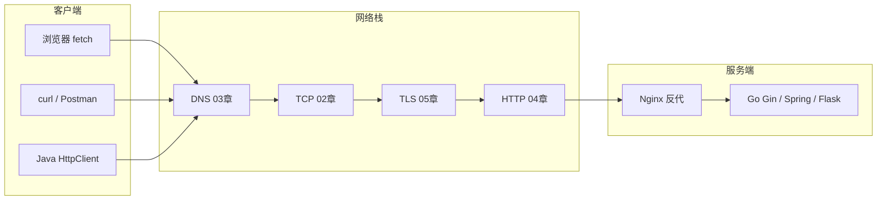

# 面试专题与知识点总表

> **文件编码**：UTF-8。  
> **定位**：计算机网络系列 **收官篇（07）**——面向 **字节/腾讯 Go 后端实习** 的 40+ 高频口述题 + 自评总表 + 7 天复习计划 + 与 Go 路线交叉索引。  
> **读者画像**：Go 暑期学习计划、CCPC/ACM 算法背景、已完成计网 01～06 与 Go 05～11 短链项目。  
> **配合**：[06 缓存与会话](./06-缓存Cookie与会话机制.md) 理论、[Go 09 JWT](../../后端学习/Go/09-JWT认证与用户体系.md)、[Go 11 短链下](../../后端学习/Go/11-短链服务项目实战下.md) 项目素材、[Go 15 面试总表](../../后端学习/Go/15-Go面试专题与知识点总表.md) 语言侧互补。

---

## 0. 读前导读

### 0.1 用一句话弄懂本章

本章是计网系列 **00～06 的收官索引**：把 OSI、TCP、HTTP/S、DNS、缓存、Cookie、CORS 压成 **40+ 道可口述的面试题** + **自评总表** + **7 天冲刺计划**——不是学新知识，而是**检验你能不能讲清楚、能不能结合 shortlink-api 项目举例**。

**类比：本章 = 驾考科目一速查手册 + 模拟考**

| 学习阶段 | 对应文档 | 本章角色 |
|----------|----------|----------|
| 第一次学 | 01～06 各章 | 先别跳本章 |
| 第二遍复习 | **07 本章** | 逐题口述，标 ⬜/🔶/✅ |
| 面试前 7 天 | §7 计划 + §6 自评 | 按天刷题、回炉薄弱章 |

### 0.2 你需要提前知道什么

| 前置 | 说明 |
|------|------|
| 01～06 至少通读一遍 | 本章只有**答案框架**，不是从零教学 |
| [Go 05 net/http](../../后端学习/Go/05-Go标准库与HTTP基础.md) | 会用 `curl`、懂 Handler/Client |
| [Go 06 Gin](../../后端学习/Go/06-Gin框架核心与中间件.md) | 中间件、CORS 配置 |
| [Go 09 JWT](../../后端学习/Go/09-JWT认证与用户体系.md) | 登录鉴权链路 |
| [Go 10～11 短链](../../后端学习/Go/10-短链服务项目实战上.md) | 302、Redis Cache Aside 实战 |

**零基础直接刷 07？** 先回到 [01 网络分层](./01-网络分层与通信基础.md) 或 [Go 05](../../后端学习/Go/05-Go标准库与HTTP基础.md)。

### 0.3 本章知识地图（学完后应能勾选全部 ☐→☑）

```text
☐ 2 分钟口述「输入 URL 到响应返回」（后端视角）不卡壳
☐ 能画 TCP 三次握手 + 304 协商缓存时序
☐ GET/POST、HTTP/HTTPS、强缓存/协商缓存对比清晰
☐ 跨域原因 + Gin CORS + 生产 Nginx 同域各一套
☐ 短链项目链路能 demo + 口述（JWT + 302 + Redis）
☐ §6 自评表至少 80% 为 🔶 或 ✅
☐ 完成 §7 七天计划 D7 模拟面试（随机 20 题）
☐ §8 短链网络验收表 7 项全过
```

### 0.4 建议学习时长与节奏

| 用法 | 时间 |
|------|------|
| **首次**（06 章学完后） | 通读分类题库框架，每题 3 分钟 | 3～4 小时 |
| **7 天冲刺** | 按 §7 每日任务 | 7 天 × 1～2h |
| **面试前夜** | §12 FAQ + §8 验收 + 薄弱 2 章回炉 | 2 小时 |

### 0.5 学完本章你能做什么（可验证的具体动作）

1. 随机抽 10 题，**闭卷口述**录音，回听卡顿点。
2. 在 §6 自评表标完所有行，统计 ⬜ 数量并回对应章节。
3. 白板 5 分钟：URL→DNS→TCP→TLS→HTTP→Go Handler + 短链 302。
4. 向同学模拟「连环追问」：跨域 → 预检 → JWT → HTTPS。
5. 填写 §10 打卡区，制定二轮 3 天补强（若 ⬜>5）。

### 0.6 通用口述框架（每题套用）

| 步骤 | 内容 |
|------|------|
| 1 | 一句话定义 |
| 2 | 原理或机制（可画简图） |
| 3 | 使用场景 |
| 4 | **shortlink-api / Go 项目**里怎么遇到 |
| 5 | 与对立概念对比、常见坑 |

**CCPC 背景加分**：把网络题和「复杂度/缓存命中率/限流 QPS」挂钩——面试官爱听你能量化。

**系列关系**：计网 01～06 提供理论 → Go 05/06/08/09/短链 提供代码落地 → 本章 40+ 题串联口述。

### 0.7 全链路复习图（口述题必备）



**CORS 预检**（06 章）只发生在 **浏览器 JS 跨域读响应** 时；curl/Postman 不经过这道「保安」。

---

## 1. 分类题库 · TCP 与传输层

### T1. OSI 七层模型是什么？TCP/IP 四层怎么对应？

**框架（30 秒）**  
OSI 是**理论参考模型**，分七层：物理、数据链路、网络、传输、会话、表示、应用。TCP/IP 是**实际互联网协议栈**，分四层：网络接口、网际、传输、应用。

**对应关系**

| OSI | TCP/IP | 协议举例 |
|-----|--------|----------|
| 应用 / 表示 / 会话 | 应用层 | HTTP、DNS、HTTPS |
| 传输 | 传输层 | TCP、UDP |
| 网络 | 网际层 | IP、ICMP |
| 数据链路 / 物理 | 网络接口 | 以太网、Wi-Fi |

**后端关注**  
Go `net/http` 工作在 **应用层**；`Listen(":8080")` 的端口属于 **传输层**；排查慢接口时会用到 DNS（应用）、TCP 连接（传输）、TLS（表示层加密）。详见 [01 网络分层与通信基础](./01-网络分层与通信基础.md)。

**对比**  
OSI 教学用；互联网运行以 TCP/IP 为准。

---

### T2. TCP 三次握手、四次挥手过程？为什么不是两次握手？

**三次握手**

1. 客户端 → `SYN`（seq=x）  
2. 服务端 → `SYN+ACK`（seq=y, ack=x+1）  
3. 客户端 → `ACK`（ack=y+1）→ **连接建立**

**为什么三次**  
防止**历史重复 SYN** 导致服务端误建连接；双方都要确认自己的发送与接收能力。**两次**无法可靠确认客户端的接收能力。

**四次挥手（了解）**  
双方各自关闭发送方向，需 **FIN/ACK** 四次；因为 TCP 全双工。

**Go 关联**  
`http.Server` 监听后每个新连接都经历握手；`http.Client` 默认 **Keep-Alive** 复用 TCP 连接减少握手开销。压测短链跳转时，连接复用会显著影响 QPS。详见 [02 TCP 与 UDP](./02-TCP与UDP.md)。

---

### T3. TCP 和 UDP 区别？后端 API 用哪个？

| | TCP | UDP |
|---|-----|-----|
| 连接 | 面向连接 | 无连接 |
| 可靠 | 重传、有序 | 不保证 |
| 速度 | 相对慢 | 快、开销小 |
| 场景 | HTTP、HTTPS、gRPC | DNS 查询、QUIC 底层 |

**后端**  
REST API、Gin 服务 **几乎全是 TCP**（HTTP/1.1/2/3）。UDP 出现在 DNS 解析、部分日志/监控；HTTP/3 基于 QUIC（UDP 上实现可靠）。

---

### T4. 什么是长连接（Keep-Alive）？对 Go 服务有何影响？

HTTP/1.1 默认 **持久连接**：同一 TCP 连接上发多个请求，减少握手开销。  
Header：`Connection: keep-alive`。

**Go 实践**  
- `http.Server` 默认开启 Keep-Alive  
- `http.Client` 用 `Transport.MaxIdleConns` 控制连接池  
- 短链高 QPS 读路径：连接复用 + Redis 缓存 = 降低 TCP 握手占比

---

### T5. 端口是什么？Go 里 `:8080` 代表什么？

**端口**：同一 IP 上区分不同服务进程。HTTP 默认 80、HTTPS 443、开发常用 8080。

**Go**  
`r.Run(":8080")` 监听本机所有网卡的 8080；`127.0.0.1:8080` 仅本机回环。

**排查**  
`netstat -ano | findstr 8080`（Windows）看端口占用——这是 **TCP 层**问题，不是 HTTP 404。

---

## 2. 分类题库 · HTTP 协议

### H1. 从输入 URL 到拿到响应，发生了什么？（超高频 · 后端视角）

**框架（分层口述）**

1. **URL 解析**：协议、域名、路径、query  
2. **DNS 解析**：域名 → IP（见 [03-DNS](./03-IP地址与DNS解析.md)）  
3. **建立 TCP 连接**：三次握手（HTTPS 还有 TLS 握手，见 [05-HTTPS](./05-HTTPS与TLS加密.md)）  
4. **发 HTTP 请求**：Method + Path + Headers + Body  
5. **服务端处理**：Gin 路由 → 中间件链 → Handler → 业务逻辑  
6. **发 HTTP 响应**：状态码 + Headers + Body  
7. **连接处理**：Keep-Alive 复用或关闭

**短链项目**：`GET /abc12X` → `Redirect` Handler → Redis/MySQL 查长链 → `c.Redirect(302, url)`。

**加分**：CDN 边缘缓存、HTTP/2 多路复用、Nginx 反向代理终止 TLS。

---

### H2. HTTP 是无状态协议什么意思？

服务器默认**不记住**上次请求；登录态靠 Cookie SessionId 或 Token 每次带上。  
「无状态」指协议本身，应用层用 JWT 实现「有状态体验」。

**Go**  
每个 `*gin.Context` 请求独立；`AuthMiddleware` 从 Header 解析 JWT 注入 `userID`，模拟会话。

---

### H3. GET 和 POST 区别？（不要只答语义）

**标准层面**

| 维度 | GET | POST |
|------|-----|------|
| 语义 | **获取**资源 | **提交**/创建资源 |
| 参数位置 | query string（常见） | body（常见） |
| 缓存 | 可被缓存 | 一般不当缓存键 |
| 幂等 | 幂等 | 不一定 |
| 长度 | URL 长度限制 | body 可很大 |

**易错**  
「GET 参数在 URL、POST 在 body」是**常见实践**，不是 HTTP 规范强制；GET 也可以带 body（极少用）。

**短链项目**  
- `GET /:code`：跳转读路径，幂等，可缓存（但我们用 302 不长期缓存）  
- `POST /api/v1/links`：创建短链，需 JWT，JSON body  
- `POST /api/v1/auth/login`：登录，body 含账号密码

**安全**  
GET 参数会进 Nginx 日志、Referer；**敏感数据勿放 GET**。

---

### H4. PUT、PATCH、DELETE 何时用？

REST 风格：

- **PUT**：整体替换资源  
- **PATCH**：部分更新  
- **DELETE**：删除  

短链示例：`DELETE /api/v1/links/:id` 删除短链；`PATCH` 更新备注。  
非简单方法会触发 **CORS 预检**（见 [06 章 §10 CORS](./06-缓存Cookie与会话机制.md)）。详见 [04 HTTP 协议深入](./04-HTTP协议深入.md)。

---

### H5. 常见 HTTP 状态码？Go 后端如何处理？

| 码 | 含义 | Go/Gin 处理 |
|----|------|-------------|
| 200 | OK | `c.JSON(200, data)` |
| 201 | Created | 创建短链成功 |
| 204 | No Content | 删除成功无 body |
| 301/302 | 重定向 | `c.Redirect`；短链用 **302** |
| 304 | Not Modified | 协商缓存，无 body |
| 400 | Bad Request | 参数校验失败 |
| 401 | Unauthorized | JWT 缺失/无效 |
| 403 | Forbidden | 无权限操作他人资源 |
| 404 | Not Found | 短码不存在 |
| 429 | Too Many Requests | 限流中间件返回 |
| 500 | Server Error | `Recovery` 中间件捕获 panic |

**短链项目**  
- 未带 Token 创建链接 → 401  
- 短码不存在 → 404  
- IP 超限 → 429  
- 跳转成功 → 302 + `Location`

**统一响应**  
业务层用 `response.Result{Code, Msg, Data}` 包装，与 HTTP 状态码分层：HTTP 200 + 业务 code≠0 是常见做法，面试时说清你们项目约定。

---

### H6. 301 和 302 区别？短链为什么用 302？

| | 301 Moved Permanently | 302 Found |
|---|----------------------|-----------|
| 语义 | 永久搬迁 | 临时跳转 |
| 浏览器行为 | 可能缓存，不再请求原 URL | 通常每次回源 |
| 统计 | 后续跳转可能不经服务端 | 每次经服务端，**PV 可统计** |

**短链项目**  
商业短链选 **302**——每次经服务端记录点击；301 会被浏览器/CDN 缓存导致漏计。见 [Go 11 §1](../../后端学习/Go/11-短链服务项目实战下.md)、[系统设计 08](../../后端学习/系统设计/08-短链服务设计.md)。

```go
c.Redirect(http.StatusFound, originalURL) // 302
```

---

### H7. Request 和 Response 结构？Go 里怎么访问？

**请求**：请求行（Method URI Version）+ Headers + Body  
**响应**：状态行 + Headers + Body

**Go net/http**

```go
// 读请求
method := r.Method
token := r.Header.Get("Authorization")
body, _ := io.ReadAll(r.Body)

// 写响应
w.Header().Set("Content-Type", "application/json")
w.WriteHeader(http.StatusOK)
json.NewEncoder(w).Encode(data)
```

**Gin 封装**  
`c.Request`、`c.GetHeader()`、`c.JSON()`、`c.Redirect()`。

---

### H8. Content-Type 常见值？后端如何设置？

| 值 | 场景 |
|----|------|
| `application/json` | 前后端分离 API（短链项目默认） |
| `application/x-www-form-urlencoded` | 传统表单 |
| `multipart/form-data` | 文件上传 |
| `text/html` | 模板渲染 |

`application/json` + 自定义 Header（如 `Authorization`）会触发浏览器 **CORS 预检**。

---

### H9. 什么是 RESTful？和 HTTP 方法关系？

REST 是一种**架构风格**：资源用 URL 表示，用 HTTP 方法表达操作。  
不是标准，是约定；`GET /api/v1/links` 列表，`POST /api/v1/links` 创建。

**短链 API 设计**

```
POST   /api/v1/auth/register
POST   /api/v1/auth/login
POST   /api/v1/links          # 需 JWT
GET    /api/v1/links          # 我的链接列表
GET    /:code                 # 302 跳转（公开）
DELETE /api/v1/links/:id
```

---

### H10. 什么是 TTFB？短链服务怎么优化？

**Time To First Byte**：发出请求到收到首字节。

**优化路径**（短链读路径）  
1. Redis Cache Aside 命中 → 跳过 MySQL（毫秒→微秒）  
2. 连接池复用 TCP  
3. 异步写点击统计，不阻塞 302  
4. 限流保护，防止打穿

---

### H11. 如何用 curl 调试 HTTP 接口？（动手必会）

```powershell
# 看响应头（跳转）
curl -I http://localhost:8080/abc12X

# 详细握手与头
curl -v http://localhost:8080/health

# 带 JWT 创建短链
curl -X POST http://localhost:8080/api/v1/links `
  -H "Authorization: Bearer <token>" `
  -H "Content-Type: application/json" `
  -d '{"original_url":"https://example.com"}'
```

**面试**  
能口述 curl 输出里 Status、Location、Cache-Control 含义。

---

## 3. 分类题库 · HTTPS 与 TLS

### S1. HTTP 和 HTTPS 的区别？

| | HTTP | HTTPS |
|---|------|-------|
| 端口 | 80 | 443 |
| 加密 | 明文 | TLS 加密 |
| 证书 | 无 | 需 CA 证书 |
| 防窃听/篡改 | 弱 | 强 |

**HTTPS = HTTP + TLS**  
TLS 握手协商密钥，之后应用层数据加密。详见 [05 HTTPS 与 TLS](./05-HTTPS与TLS加密.md)。

**Go 部署**  
开发 `http://localhost:8080`；生产 Nginx 终止 TLS，`proxy_pass` 到 Gin。

---

### S2. TLS 握手大致做什么？

1. Client Hello：支持的加密套件  
2. Server Hello + 证书  
3. 客户端验证证书链  
4. 协商对称密钥（ECDHE）  
5. 后续 HTTP 用对称加密传输

**后端职责**  
配置证书（Let's Encrypt / 云厂商）；确保 JWT Secret、数据库密码不出现在明文 HTTP。

---

### S3. 什么是对称加密和非对称加密？HTTPS 用哪种？

- **对称**：同一密钥加解密，快  
- **非对称**：公钥加密、私钥解密，慢  

TLS 握手用**非对称**交换对称密钥，之后用**对称**加密 HTTP 数据。

---

### S4. 中间人攻击是什么？HTTPS 如何防？

攻击者截获明文 HTTP。HTTPS 通过证书校验服务器身份 + 加密通道防窃听与篡改。

**面试延伸**  
JWT 用 HS256 签名防篡改，但**不加密** payload；敏感信息勿放 JWT 明文。

---

### S5. 生产环境证书谁管？Go 服务怎么接 HTTPS？

**分工**  
- 大厂：运维 / 网关（Nginx、SLB）终止 TLS  
- 小项目：Caddy 自动 HTTPS 或 `r.RunTLS`  

**Cookie/JWT**  
生产 Cookie 设 **Secure**；全站 HTTPS 避免 Mixed Content。

---

## 4. 分类题库 · DNS

### D1. DNS 解析过程？后端为什么要关心？

**简版**：浏览器/客户端缓存 → 系统 hosts → 递归查询 根 → TLD → 权威 DNS → 得 IP。

**后端**  
- 服务调用第三方 API 时，DNS 慢会拖 TTFB  
- 容器环境注意 K8s Service DNS  
- 短链 `baseURL` 配置的域名需正确解析

详见 [03 IP 地址与 DNS](./03-IP地址与DNS解析.md)。

---

### D2. A 记录和 CNAME 区别？

| 记录 | 作用 |
|------|------|
| A | 域名 → IPv4 地址 |
| CNAME | 域名 → 另一个域名（常用于 CDN） |

**场景**  
`short.example.com` A 记录指向服务器；静态资源 `cdn.example.com` CNAME 到 CDN 厂商。

---

### D3. DNS 解析慢怎么排查？

**口述**：`ping domain` vs `curl`；查 hosts、换 DNS（8.8.8.8）、`nslookup`；看是否首次慢、后续快（缓存）。

---

### D4. 域名、IP、端口在 URL 里各是什么？

URL：`https://api.short.com:443/api/v1/links`

- **https**：协议  
- **api.short.com**：域名（经 DNS→IP）  
- **443**：端口（HTTPS 默认可省略）  
- **/api/v1/links**：路径（HTTP 层）

---

## 5. 分类题库 · 缓存与会话

### C1. 强缓存和协商缓存？304 是什么？

**强缓存**：`Cache-Control: max-age` 未过期 → **不发请求**。  
**协商缓存**：过期后带 `If-None-Match`/`If-Modified-Since` → 未变 **304**（无 body）→ 用本地副本。

**后端 API**  
JSON API 通常 `Cache-Control: no-store` 或 `no-cache`；**不要把用户数据强缓存到 CDN**。  
静态资源（若有管理后台）`app.[hash].js` 可长缓存。

完整流程见 [06 章 §2～4](./06-缓存Cookie与会话机制.md)。

---

### C2. ETag 和 Last-Modified 区别？

| | Last-Modified | ETag |
|---|---------------|------|
| 依据 | 文件修改时间 | 内容哈希/版本 |
| 精度 | 秒级 | 更准 |
| 优先级 | 低 | 高 |

**Go**  
`c.Header("ETag", etag)` + 处理 `If-None-Match` 可手写协商缓存；API 场景较少用。

---

### C3. HTTP 缓存 vs Redis 缓存？（高频混淆题）

| 维度 | HTTP 缓存（浏览器/CDN） | Redis 缓存（服务端） |
|------|------------------------|---------------------|
| 位置 | 客户端/边缘 | 服务端内存 |
| 协议 | Cache-Control、304 | go-redis GET/SET |
| 短链项目 | 跳转 302 不用强缓存 | `link:{code}`→`original_url` |
| 一致性 | 协商缓存 | Cache Aside：写 DB 后 DEL |

**口述**  
「短链读路径用 Redis Cache Aside；HTTP 缓存层面我们对 302 跳转不设长期缓存，保证 PV 统计准确。」

---

### C4. 什么是 Cache Aside？短链怎么实现？

**读**：先 Redis `GET link:code`；miss 则 MySQL 查 → 回填 Redis  
**写**：先 MySQL UPDATE → 再 Redis `DEL link:code`

见 [Go 08 §5](../../后端学习/Go/08-Redis与go-redis缓存实战.md)、[Go 11 §2](../../后端学习/Go/11-短链服务项目实战下.md)。

```go
// 读路径伪代码
url, err := rdb.Get(ctx, "link:"+code).Result()
if err == redis.Nil {
    url = repo.FindByCode(code)
    rdb.Set(ctx, "link:"+code, url, ttl)
}
c.Redirect(http.StatusFound, url)
```

---

### C5. 缓存穿透、击穿、雪崩？Go 侧各怎么防？

| 问题 | 含义 | 对策 |
|------|------|------|
| 穿透 | 查不存在的数据，缓存 DB 都不命中 | 布隆过滤器；空值缓存短 TTL |
| 击穿 | 热点 key 过期瞬间打穿 DB | 互斥锁 SETNX；逻辑过期 |
| 雪崩 | 大量 key 同时过期 | TTL 加随机抖动；集群高可用 |

**短链**  
不存在的 `code` 可缓存空值 60s 防穿透。

---

### C6. Cookie、Session、Token（JWT）区别？

**Cookie**：浏览器存储机制，可自动携带。  
**Session**：服务端会话，常通过 **SessionId Cookie** 关联。  
**Token（JWT）**：自包含凭证，常见放 **Header** `Authorization: Bearer`。

**短链项目**  
JWT 无状态；`AuthMiddleware` 验签后取 `userID`；无服务端 Session。见 [Go 09](../../后端学习/Go/09-JWT认证与用户体系.md)、[06 章 §8](./06-缓存Cookie与会话机制.md)。

---

### C7. JWT vs Cookie Session？面试怎么选？

| 维度 | Session + Cookie | JWT（Header） |
|------|------------------|---------------|
| 状态 | 服务端存 Session | 无状态，服务端只验签 |
| 扩展 | 多机要 Redis 共享 Session | 易水平扩展 |
| 注销 | 删 Session 即可 | 需黑名单或短过期 + Refresh |
| CSRF | Cookie 自动带有风险 | Header 方案风险低 |
| XSS | HttpOnly Cookie 较安全 | 若存 localStorage 可读 |

**短链选型**  
前后端分离 API → JWT + Bearer；Refresh Token 可放 HttpOnly Cookie（进阶）。

---

### C8. JWT 结构？Go 如何签发与校验？

**三段**：Header.Payload.Signature（Base64URL）

**Go**

```go
token := jwt.NewWithClaims(jwt.SigningMethodHS256, claims)
signed, _ := token.SignedString([]byte(secret))

// 中间件
claims, err := jwt.Parse(tokenString, keyFunc)
```

**追问**  
- 为什么不放密码？→ payload 可解码，只放 userID  
- 怎么注销？→ Redis 黑名单 + 短过期  
- 秘钥轮换？→ 双秘钥验签过渡期

---

### C9. HttpOnly、Secure、SameSite 是什么？

- **HttpOnly**：JS 不能 `document.cookie` 读，减 XSS 偷 Cookie 风险  
- **Secure**：仅 HTTPS 发送  
- **SameSite**：跨站是否带 Cookie，**Lax** 默认，防 CSRF  

**后端 Set-Cookie**  
`Set-Cookie: refresh_token=xxx; HttpOnly; Secure; SameSite=Lax; Path=/api/v1/auth`

---

### C10. 登录流程你怎么设计？（结合短链）

1. `POST /api/v1/auth/login` 校验 bcrypt 密码  
2. 签发 Access JWT（如 2h）+ 可选 Refresh  
3. 客户端存 Token（内存/Header）  
4. `AuthMiddleware` 解析 `Authorization: Bearer`  
5. 受保护路由 `POST /api/v1/links` 需有效 Token  
6. Token 过期 → 401 → 重新登录或 Refresh。时序见 [06 章 §12](./06-缓存Cookie与会话机制.md)、[Go 09 §6](../../后端学习/Go/09-JWT认证与用户体系.md)。

---

### C11. 什么是 CSRF？JWT 方案怎么防？

**跨站请求伪造**：用户已登录 A 站，恶意 B 站诱使浏览器带 Cookie 请求 A。

**防护**  
SameSite Cookie、CSRF Token、Referer 校验；**JWT 放 Authorization Header** 不自动携带，天然降低 CSRF 风险。

---

### C12. 什么是 XSS？对 Token 存储的影响？

**跨站脚本**：注入恶意 JS 读 DOM/Cookie/localStorage。

**后端**  
输出转义；`Content-Security-Policy` 头；密码永不返回明文。Token 若前端存 localStorage 有 XSS 风险——面试时主动说 trade-off。

---

## 6. 分类题库 · CORS（面试重点）

### O1. 什么是跨域？为什么 curl 不跨域？

**同源**：协议 + 域名 + 端口相同。  
**跨域**：浏览器 **同源策略** 限制 JS 读取其他源响应。

curl/Postman **不是浏览器**，无同源策略，故「不跨域」。

**典型报错**

```text
Access to fetch at 'http://localhost:8080/api' from origin 'http://localhost:5173'
has been blocked by CORS policy
```

---

### O2. 简单请求和预检请求？OPTIONS 干什么？

**简单请求**：GET/HEAD/POST + 有限 Header + 特定 Content-Type（如 `application/x-www-form-urlencoded`）。  
**否则**：先发 **OPTIONS** 预检，问服务器是否允许 Method/Header；通过后再发真实请求。

**短链项目**：`Content-Type: application/json` + `Authorization` → **必预检**（浏览器先发 OPTIONS，通过后再 POST）。

---

### O3. CORS 响应头有哪些？各自含义？

| 头 | 含义 |
|----|------|
| `Access-Control-Allow-Origin` | 允许的来源（不能 `*` 当 credentials=true） |
| `Access-Control-Allow-Methods` | 允许的 HTTP 方法 |
| `Access-Control-Allow-Headers` | 允许的自定义头（Authorization） |
| `Access-Control-Allow-Credentials` | 是否允许带 Cookie |
| `Access-Control-Max-Age` | 预检缓存时间 |

---

### O4. CORS 怎么解决？开发 vs 生产？

| 环境 | 方案 |
|------|------|
| 本地开发 | Gin `cors` 中间件放行 `http://localhost:5173` |
| 前后端分域 | 后端配置 CORS 白名单 |
| 生产推荐 | **Nginx 同域**反代 `/api` → 无需 CORS |
| 微服务 | 网关统一 CORS |

**Go 06 配置**

```go
r.Use(cors.New(cors.Config{
    AllowOrigins:     []string{"http://localhost:5173"},
    AllowMethods:     []string{"GET", "POST", "PUT", "DELETE", "OPTIONS"},
    AllowHeaders:     []string{"Authorization", "Content-Type"},
    AllowCredentials: true,
}))
```

见 [Go 06 §6](../../后端学习/Go/06-Gin框架核心与中间件.md)、[06 章 §10](./06-缓存Cookie与会话机制.md)。

---

### O5. 同源策略都限制什么？

**限制**  
- Ajax/fetch 读跨源响应（CORS 管）  
- DOM 跨源读（iframe）  

**不限制**  
- ``、`<script>` 加载（但 JS 读不到跨域像素）  
- **服务器始终收到请求**——CORS 是浏览器挡响应，不是挡请求

**面试坑**  
「跨域请求发不出去」→ 错，发出去了，浏览器不让 JS 读响应。

---

## 7. 分类题库 · 综合场景与短链项目

### G1. 描述短链读路径完整链路（STAR 素材）

**S**：用户点击 `https://s.co/abc12X`  
**T**：毫秒级 302 到长链并统计点击  
**A**：  
1. Nginx 反代到 Gin  
2. 限流中间件检查 IP  
3. Redis `GET link:abc12X`  
4. miss → MySQL → 回填 Redis  
5. 异步 INCR 点击数  
6. `302 Location: original_url`  
**R**：wrk 压测 QPS xxx；P99 延迟 xx ms

---

### G2. 短链写路径（创建链接）链路？

1. `AuthMiddleware` 验 JWT  
2. 校验 `original_url` 格式  
3. Redis `INCR seq:link` 得序号  
4. Base62 编码得 `short_code`  
5. MySQL INSERT  
6. 返回 `201` + `short_url`

见 [Go 10 §4](../../后端学习/Go/10-短链服务项目实战上.md)。

---

### G3. 为什么跳转用 302 不用 301？和 HTTP 缓存关系？

302：每次经服务端，PV 可统计；301 会被浏览器/CDN 缓存，后续跳转不过服务端。  
我们对 302 响应设 `Cache-Control: no-store` 或短 max-age，避免中间层长期缓存。

---

### G4. 接口幂等：POST 创建短链重复提交怎么办？

**后端**  
- 同一用户同一 `original_url` 查重返回已有短链  
- 或客户端传 `Idempotency-Key` 头，服务端 Redis 去重  
- 数据库唯一索引防重复

**CCPC 类比**  
幂等 = 同一输入多次执行结果不变。

---

### G5. 限流怎么做？为什么放在跳转接口？

**短链**  
`RateLimitByIP`：Redis 滑动窗口或 INCR+EXPIRE，超限返回 429。

**位置**  
跳转接口公开无 JWT，易被刷；创建链接有 JWT 可另设用户级限流。

见 [Go 11 §3](../../后端学习/Go/11-短链服务项目实战下.md)。

---

### G6. 前后端分离：Cookie Session 和 JWT 怎么选？

| 方案 | 优点 | 缺点 | 典型栈 |
|------|------|------|--------|
| **Session + Cookie** | 服务端可随时注销；浏览器自动带 Cookie | 多实例要 Redis；跨域要带 `credentials` | Spring Session、Django session |
| **JWT + Authorization** | 无状态、多实例友好 | 难即时注销；XSS 能偷 Header 里的 token | Go/Gin、Node、Spring + JWT 库 |
| **JWT HttpOnly Cookie** | 兼顾自动携带 + 防 JS 读 | 仍要 CSRF 防护；CORS 配 `credentials` | 部分全栈项目 |

**面试一句话**：前后端分离、Go 多实例 → JWT Bearer；传统单体、要强注销 → Session + Redis。

---

### G7. Nginx 反代和 CORS 关系？

生产同域 `/api` 反代 → 浏览器同源，**无需 CORS**；API 独立子域则必须 CORS 或 BFF。

### G8. 分布式下 Session 和 JWT 怎么选？

微服务水平扩展优先 JWT 或 Redis 共享 Session；强注销需求用 JWT + 黑名单。字节/腾讯实习：**能说清 trade-off** 比背标准答案重要。

---

## 8. 短链项目网络验收总表

| 项 | 验收命令/动作 | 通过 |
|----|---------------|------|
| 登录 POST 200 | `curl -X POST .../auth/login` 见 `access_token` | ⬜ |
| 创建链需 Bearer | 无 Token → 401；有 Token → 201 | ⬜ |
| 跳转 302 | `curl -I /{code}` 见 `302` + `Location` | ⬜ |
| Redis 缓存命中 | 二次跳转日志/断点确认无 MySQL | ⬜ |
| 限流 429 | 快速刷接口触发 | ⬜ |
| CORS 预检 | 浏览器 OPTIONS 204 | ⬜ |
| 2 分钟口述全链路 | 登录→创建→跳转→缓存 | ⬜ |

---

## 9. 知识点自评总表（00～07）

复习时在「自评」列标记：**⬜ 知道 / 🔶 会用 / ✅ 会讲**。

### 9.1 网络基础（00～02）

| 知识点 | 文档 | 掌握标准 | 自评 |
|--------|------|----------|------|
| OSI 七层名称 | 01 | 能按序说出 | ⬜ |
| TCP/IP 四层 | 01 | 与 OSI 对应 | ⬜ |
| TCP 三次握手 | 02 | 能画 SYN/ACK | ⬜ |
| 为何不是两次握手 | 02 | 历史 SYN 问题 | ⬜ |
| TCP 四次挥手 | 02 | 知道 FIN 双向 | ⬜ |
| TCP vs UDP | 02 | 可靠 vs 实时 | ⬜ |
| 端口概念 | 02 | 80/443/8080 | ⬜ |
| Keep-Alive | 02/04 | 连接复用 | ⬜ |

### 9.2 HTTP/HTTPS（03～05）

| 知识点 | 文档 | 掌握标准 | 自评 |
|--------|------|----------|------|
| HTTP 无状态 | 04 | 每次带 token | ⬜ |
| GET/POST 区别 | 04/07 | 语义+幂等+缓存 | ⬜ |
| 常见状态码 | 04/07 | 401/302/404/429/500 | ⬜ |
| 301 vs 302 | 04/07 | 短链选 302 理由 | ⬜ |
| Request/Response 结构 | 04 | 头+body | ⬜ |
| HTTPS = HTTP+TLS | 05 | 443 端口 | ⬜ |
| 证书作用 | 05 | 身份+密钥交换 | ⬜ |
| 对称/非对称加密 | 05 | TLS 混合用 | ⬜ |

### 9.3 DNS（03）

| 知识点 | 文档 | 掌握标准 | 自评 |
|--------|------|----------|------|
| DNS 作用 | 03 | 域名→IP | ⬜ |
| 解析大致流程 | 03 | 递归/迭代 | ⬜ |
| A / CNAME 记录 | 03 | 各说一句 | ⬜ |
| hosts 与 DNS 缓存 | 03 | 本地排查 | ⬜ |

### 9.4 缓存、CORS 与面试表达

| 知识点 | 文档 | 掌握标准 | 自评 |
|--------|------|----------|------|
| 强缓存 vs 协商缓存 | 06 | 304 无 body | ⬜ |
| HTTP 缓存 vs Redis | 06/Go08 | 两层分清 | ⬜ |
| Cache Aside 读写 | Go08 | 能画路径 | ⬜ |
| 穿透/击穿/雪崩 | Go08 | 各一种对策 | ⬜ |
| Session vs JWT | 06/Go09 | 有状态 vs 无状态 | ⬜ |
| JWT 签发与校验 | Go09 | 中间件流程 | ⬜ |
| 跨域与 CORS 预检 | 06/Go06 | OPTIONS 流程 | ⬜ |
| URL 到响应（后端） | 07 H1 | 2 分钟口述 | ⬜ |
| 短链全链路 STAR | 07 G1 | 3 分钟项目题 | ⬜ |
| CSRF/XSS | 06/07 | 与 Cookie/JWT 关联 | ⬜ |

### 9.5 能力矩阵（1～5 分自评）

| 维度 | 1 分 | 3 分 | 5 分 |
|------|------|------|------|
| 分层模型 | 说不清层数 | 说 OSI+TCP/IP | 能对应协议+Go 层 |
| TCP/HTTP | 只知道三次握手 | 状态码+方法 | 能画握手+302 流程 |
| HTTPS/DNS | 只知道 HTTPS 安全 | TLS+解析步骤 | 证书+记录类型 |
| 缓存 | 混淆两层缓存 | 强/协商/Redis | Cache Aside+短链 |
| CORS | 只会配 Allow* | OPTIONS+响应头 | 开发/生产方案 |
| 面试表达 | 背定义 | 15 题流畅 | 40 题+项目结合 |

低于 3 分回对应章节重学。

---

## 10. 7 天复习计划

| 天 | 主题 | 动作 | 产出 |
|----|------|------|------|
| **D1** | 00～01 基础 | 画 OSI/TCP/IP 对照表；自评 §9.1 前 4 项 | 手写分层图 1 张 |
| **D2** | 02 TCP/UDP | 白板三次握手；口述 T1～T4 | 能答「为何三次」 |
| **D3** | 04 HTTP | 默写 10 个状态码；curl 抓包 | H1/H3/H5 口述 1 遍 |
| **D4** | 05 HTTPS + 03 DNS | TLS 混合加密；nslookup 实验 | S1～S3 + D1 口述 |
| **D5** | 06 缓存 + Go 08 | Cache Aside 画图；Redis 实验 | C1～C5 自评 🔶 |
| **D6** | 06 CORS + Go 06/09 | 配 Gin CORS；跑通登录 JWT | O1～O4 + 登录 demo |
| **D7** | 07 面试冲刺 | 随机抽 20 题口述录音；§8 验收 | 薄弱 2 章回炉 |

**D5 下午**：对照 [Go 10～11](../../后端学习/Go/10-短链服务项目实战上.md) 端到端 demo。  
**D7 模拟面 10 题**：URL 到响应、三次握手、HTTPS、GET/POST、302/301、HTTP 缓存 vs Redis、JWT vs Session、CORS 预检、短链读路径、限流层次。

---

## 11. 与 Go 章节对照索引

### 11.1 计网 00～07 全系列

| 编号 | 文件 | 核心内容 |
|------|------|----------|
| 00 | [学习路线图与说明](./00-学习路线图与说明.md) | Go 后端速成路径、curl 练习 |
| 01 | [网络分层与通信基础](./01-网络分层与通信基础.md) | OSI、TCP/IP、封装 |
| 02 | [TCP 与 UDP](./02-TCP与UDP.md) | 握手挥手、可靠传输 |
| 03 | [IP 地址与 DNS 解析](./03-IP地址与DNS解析.md) | NAT、DNS 链 |
| 04 | [HTTP 协议深入](./04-HTTP协议深入.md) | 方法、状态码、HTTP/2/3 |
| 05 | [HTTPS 与 TLS 加密](./05-HTTPS与TLS加密.md) | 证书、TLS、混合加密 |
| 06 | [缓存 Cookie 与会话机制](./06-缓存Cookie与会话机制.md) | 304、JWT、CORS |
| 07 | 面试专题与知识点总表（本文件） | 问答、自评、7 天 |

### 11.2 Go 路线交叉（计网理论落地）

| Go 章 | 文件 | 计网关联主题 |
|-------|------|--------------|
| 05 | [Go 标准库与 HTTP](../../后端学习/Go/05-Go标准库与HTTP基础.md) | GET/POST、Handler、Client、状态码 |
| 06 | [Gin 框架与中间件](../../后端学习/Go/06-Gin框架核心与中间件.md) | 中间件链、CORS、Recovery |
| 08 | [Redis 与 go-redis](../../后端学习/Go/08-Redis与go-redis缓存实战.md) | Cache Aside、穿透击穿雪崩 |
| 09 | [JWT 认证与用户体系](../../后端学习/Go/09-JWT认证与用户体系.md) | 无状态、Bearer、401 |
| 10 | [短链项目（上）](../../后端学习/Go/10-短链服务项目实战上.md) | 创建短链、Base62、JWT 写路径 |
| 11 | [短链项目（下）](../../后端学习/Go/11-短链服务项目实战下.md) | **302**、Redis 读路径、限流 |
| 15 | [Go 面试总表](../../后端学习/Go/15-Go面试专题与知识点总表.md) | 语言/并发/项目互补 |

### 11.3 计网题号 → Go 代码速查

| 面试题 | 计网章 | Go 落地 |
|--------|--------|---------|
| URL 到响应 | 01～05 | Go 05 Handler 生命周期 |
| TCP 握手 | 02 | `Listen` 接受连接 |
| GET/POST | 04 | `r.Method`、路由注册 |
| 302 跳转 | 04 | Go 11 `c.Redirect` |
| HTTPS | 05 | Nginx TLS / `RunTLS` |
| DNS | 03 | 部署域名解析 |
| 强/协商缓存 | 06 | API `no-store`；静态资源策略 |
| Redis 缓存 | 06 概念 | Go 08 `GET/SET/DEL` |
| JWT vs Cookie | 06 | Go 09 `AuthMiddleware` |
| CORS 预检 | 06 | Go 06 `gin-contrib/cors` |
| 限流 429 | — | Go 11 `RateLimitByIP` |

### 11.4 与 Go 15 联合复习提示

完成计网 §9 后，打开 [Go 15](../../后端学习/Go/15-Go面试专题与知识点总表.md) 交叉标记：

- **网络 + 项目** → 短链 STAR 3 分钟  
- **缓存** → 计网 C3 + Go 08 + 系统设计 08  
- **认证** → 计网 C6～C10 + Go 09  
- **部署** → 计网 S5 + Go 13 Nginx/Docker  

**目标**：计网八股用 **shortlink-api** 举例，不空谈概念。

**目标**：计网八股用 **shortlink-api** 举例，不空谈概念。

### 11.5 手写/白板题

| 题目 | 时间 | 参考 |
|------|------|------|
| TCP 三次握手 | 2 min | 02 / T2 |
| Cache Aside 读路径 | 2 min | Go 08 / C4 |
| CORS 预检时序 | 2 min | 06 §10 / O2 |
| JWT 登录时序 | 3 min | Go 09 / C10 |
| 短链 302 链路 | 3 min | Go 11 / G1 |

---

## 12. 附录：闭卷自测、FAQ、模拟面

### 12.1 闭卷自测（10 题）

1. OSI 与 TCP/IP 对应？HTTP 在哪层？  
2. 三次握手各发什么？为何不是两次？  
3. 强缓存 vs 协商缓存关键头？304 有 body 吗？  
4. HTTPS 除加密还提供什么？TLS 如何协商对称密钥？  
5. 同源三要素？CORS 限制什么？  
6. Session vs JWT 注销差异？  
7. 短链 TTFB 高，排查顺序？  
8. `curl -I` 如何验证 302？  
9. 3 分钟串讲 `GET /abc12X` 全链路（含 Redis）。  
10. 自评 ⬜ 最多 3 项 + 回炉计划。

**参考答案**：1 应用层 HTTP；2 SYN→SYN+ACK→ACK；3 max-age / ETag→304 无 body；4 身份认证+ECDHE；5 协议+域名+端口，限制 JS 读跨源响应；6 Session 删服务端/JWT 黑名单；7 Redis→MySQL→网络→同步统计；8 见 `302`+`Location`；9 DNS→TCP→限流→Redis→MySQL→302。

### 12.2 常见报错（后端向）

| 现象 | 解决 |
|------|------|
| CORS blocked | Gin cors 或 Nginx 同域 |
| OPTIONS 404 | 中间件放行 OPTIONS |
| 401 已登录 | 查 Bearer 格式/过期 |
| 302 Location 空 | 空值缓存或 404 |
| bind: address in use | 换端口 |
| Redis 不断打 DB | 查 key 与 TTL |

### 12.3 FAQ 速查

- **URL 到响应（后端）**：DNS→TCP→TLS→Gin 中间件→业务→响应；加分 Redis/302/限流。  
- **GET vs POST**：语义（幂等/缓存）> 参数位置。  
- **HTTP 缓存 vs Redis**：浏览器 Header 控制 vs 服务端 go-redis 显式读写。  
- **跨域**：浏览器挡响应，curl 不受限。  
- **JWT 缺点**：难注销→短过期+黑名单。  
- **字节/腾讯**：计网穿插在项目题，用短链串答。  
- **CCPC 加分**：限流=滑动窗口，缓存=O(1)，短码=进制转换。

### 12.4 口述难度分级

| 难度 | 题号 | 要求 |
|------|------|------|
| ⭐ 必会 | H1、T2、H3、C1、O1 | 30s～1min |
| ⭐⭐ 常考 | S1、C7、C10、G1 | 1～2min+项目 |
| ⭐⭐⭐ 加分 | HTTP/2、QUIC、分布式选型 | 知边界即可 |

### 12.5 模拟面试连环追问（15 min）

URL 到响应 → 为何三次握手 → 为何 302 → Redis vs HTTP 缓存 → JWT Header vs Cookie → CORS 开发/生产方案。每答带 **shortlink-api** 例子。

### 12.6 复习打卡区

```text
开始日期：          自评 §9 ✅ 数：___
短链验收 §8 通过：___/7    面试日期：
最薄弱 3 项：1.     2.     3.
回炉章节（计网+Go）：
```

### 12.7 学完标准

| 标准 | 自检 |
|------|------|
| 2min 口述 URL→响应（后端视角） | ⬜ |
| 画 TCP 握手 + Cache Aside | ⬜ |
| GET/POST、301/302、HTTPS 清晰 | ⬜ |
| HTTP 缓存/Redis/JWT 分清 | ⬜ |
| CORS 开发+生产各一套 | ⬜ |
| 短链全链路 demo+口述 | ⬜ |
| §9 自评 80% 为 🔶/✅ | ⬜ |
| 完成 D7 模拟面 | ⬜ |

**二轮补强（⬜>5）**：D1 回炉 2 章+D2 重录 H1/C4/O2/G1+D3 §8 验收+15 题快问。

---

## 下一章预告

**计算机网络 00～07 系列至此完结**。建议联动 [Go 15](../../后端学习/Go/15-Go面试专题与知识点总表.md)、[系统设计 08 短链](../../后端学习/系统设计/08-短链服务设计.md)；日常用 `curl -v` 验证理论。

---

*UTF-8 | [00 学习路线图](./00-学习路线图与说明.md) · [Go 00 路线图](../../后端学习/Go/00-学习路线图与说明.md)*
