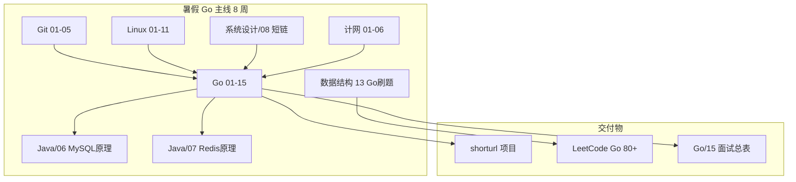

# 后端学习路线总览（2026 · Go 暑假主线 + C++ 长期）

> **2026 暑假默认主线**：**Go 01～15** + 数据结构 13 + Linux + 计网 + Java/06、07（原理）  
> **目标岗（暑假）**：Go 后端实习 · 字节/腾讯/阿里  
> **长期储备**：C++ 01～36 + LLMInfra（大二下起可并行）  
> **总导航**：[Go 00 路线图](Go/00-学习路线图与说明.md) · [暑假 56 天日程](../go-backend-learning-plan.md)

---

## 1. 一张图看懂全仓库（2026 暑假）

---

## 2. 路线选型

| 路线 | 文件夹 | 目标 | 2026 暑假 |
|------|--------|------|-----------|
| **Go 后端** | **Go + 数据结构 + Linux + 计网** | 业务后端/云原生/字节系 | **✅ 主攻** |
| C++ 核心 | C++ + 数据结构 + Linux | 基建/中间件/游戏/量化 | 竞赛轻维护 |
| C++ + LLM Infra | + LLMInfra | CUDA/推理引擎 | 大二下选修 |
| Java Web / AIAgent | Java / AIAgent | CRUD / Agent 应用 | 原理章复用 |
| Python FastAPI | Python | 快速 Web | 备选 |

---

## 3. Go 暑假 8 周（摘要）

| 周 | Go 章节 | 配套 |
|----|---------|------|
| W1 | 01～03 + Git/Linux | Git 01～02、Linux 01～04 |
| W2 | 04～05 | 数据结构 13 开刷、计网 TCP |
| W3 | 06～07 | Java/06 MySQL、计网 HTTP |
| W4 | 08～10 | Java/07 Redis、系统设计/08 |
| W5～W6 | 10～12 | 短链项目完善、OS 八股 |
| W7 | 13 | Linux 12 Docker、Go/15 八股 |
| W8 | 14～15 | 简历、投实习 |

完整 Day-by-Day：[go-backend-learning-plan.md](../go-backend-learning-plan.md)  
章节详解：[Go/00 路线图](Go/00-学习路线图与说明.md)

---

## 4. 模块索引

| 模块 | 路径 | 章节 | Go 路线角色 |
|------|------|------|-------------|
| **Go** | `Go/` | **00～15** | **主武器** |
| 数据结构 | `数据结构/` | 00～13 | 13=Go 手撕；01～10 原理 |
| Linux | `Linux/` | 00～15 | 命令 + 部署 |
| 计网 | `前端学习/计算机网络/` | 00～07 | 面试八股 |
| Git | `前端学习/Git/` | 00～05 | 贯穿项目 |
| MySQL 原理 | `Java/06` | — | 理论 + SQL 练习 |
| Redis 原理 | `Java/07` | — | 理论 + 八股 |
| 系统设计 | `系统设计/` | 08 短链等 | 架构 + 面试 Case |
| **C++** | `C++/` | 00～90 | 长期/竞赛 |
| LLM Infra | `LLMInfra/` | 00～20 | 扩展 |
| Java / AIAgent | 备选 | — | — |

---

## 5. Go 路线 vs Java 路线：复用与跳过

| 模块 | Go 路线怎么做 |
|------|----------------|
| MySQL | 读 **Java/06** 学原理 → **Go/07** 写 GORM |
| Redis | 读 **Java/07** 学原理 → **Go/08** 写 go-redis |
| 部署 | **Go/13** 为主 + **Linux 12～14** 补系统 |
| Spring/MyBatis | **跳过** |
| 算法 | **数据结构 13** + 热题 100（Go 写） |
| 项目 | **Go/10～11** + **系统设计/08** |

---

## 6. 面试能力地图（Go 实习向）

| 面试环节 | 本仓库章节 |
|----------|------------|
| Go 语言八股 | **Go/04、15** |
| Gin / 项目分层 | **Go/06、10～11** |
| MySQL | **Java/06** + **Go/07** |
| Redis | **Java/07** + **Go/08** |
| 计网 / HTTP | **计网 04～06** + **Go/15** |
| OS | **Linux 06、15** + **Go/15** |
| 系统设计短链 | **系统设计/08** + **Go/10～11** |
| 手撕算法 | **数据结构 13** + 热题 100 |
| Docker 部署 | **Go/13** + **Linux/12** |
| 分布式 | **Go/14** + **Java/12** 概念 |

---

## 7. C++ 核心线（长期，非暑假主战场）

| 月 | C++ | 说明 |
|----|-----|------|
| 暑假 | 01～09 暂停或轻量 | 竞赛维持即可 |
| 大二上～下 | 01～23 逐步恢复 | 有实习后业余推进 |
| 大三 | 33～36 面试 + KV 项目 | 若转 infra |

完整表：[C++.md](../C++.md) · [C++ 00](C++/00-学习路线图与说明.md)

---

## 8. 快速入口

- **[Go 00 路线图](Go/00-学习路线图与说明.md)** ← 暑假从这里开始  
- [go-backend-learning-plan.md 56 天日程](../go-backend-learning-plan.md)  
- [Go/15 面试八股总表](Go/15-Go面试专题与知识点总表.md)  
- [Go/10～11 短链项目](Go/10-短链服务项目实战上.md)  
- [系统设计/08 短链设计](系统设计/08-短链服务设计.md)  
- [数据结构/13 Go 刷题](数据结构/13-Go手撕模板与LeetCode刷题.md)  
- [C++ 00 路线图](C++/00-学习路线图与说明.md)（长期）
