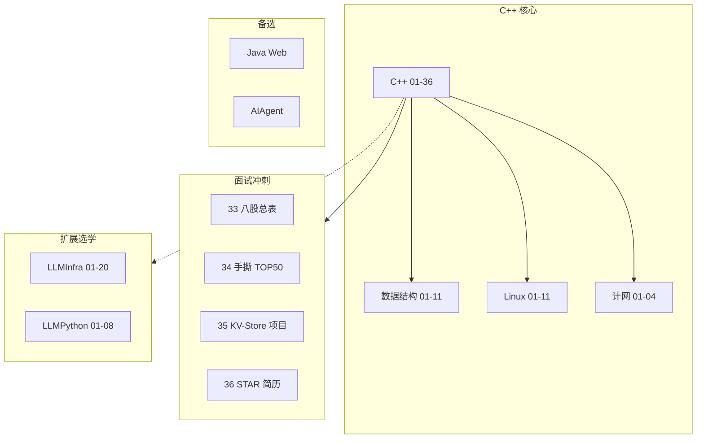

# 后端学习路线总览（2026 · C++ 核心）

> **默认主线**：**C++ 01～36** + 数据结构 + Linux + 计网  
> **目标岗**：C++ 后端 / 基建 / 中间件 / 游戏 / 量化 / 系统软件  
> **扩展**：LLMInfra（CUDA/推理）、LLMPython（PyTorch 选读）  
> **备选**：Java Web、AIAgent、FastAPI

---

## 1. 一张图看懂全仓库

---

## 2. 路线选型

| 路线 | 文件夹 | 目标 | 默认 |
|------|--------|------|------|
| **C++ 核心** | **C++ + 数据结构 + Linux** | 基建/中间件/游戏/量化 | **✅** |
| C++ + LLM Infra | + LLMInfra | CUDA/推理引擎 | 扩展 |
| 仅 Python 算法 | LLMPython | 微调/研究 | 选读 |
| Web 后端 | Java / Python FastAPI | CRUD | 备选 |

---

## 3. C++ 核心 18～24 个月（摘要）

| 月 | C++ | 配套 |
|----|-----|------|
| 1～4 | 01～09 | 数据结构 01～06 |
| 5～7 | 10～14 | Linux、计网 |
| 8～10 | 18～23 | mini-http |
| 11～13 | 24～32 | gtest/Asio/协程 |
| 14～15 | **33～34 面试** | 数据结构 11 精刷 |
| 16～18 | **35 项目 + 36 简历** | — |
| 19～24 | 实习 / （选）LLMInfra | — |

完整表：[todo.md](../todo.md)

---

## 4. 模块索引

| 模块 | 路径 | 章节 |
|------|------|------|
| **C++** | `C++/` | **00～90** |
| 数据结构 | `数据结构/` | 00～12 |
| Linux | `Linux/` | 00～15 |
| LLM Infra | `LLMInfra/` | 00～20（扩展） |
| LLM Python | `LLMPython/` | 00～42（选读） |
| Java / AIAgent | 备选 | — |

---

## 5. 三条线区分

| 线 | 学什么 | 何时 |
|----|--------|------|
| **C++ 核心** | 01～36 + 刷题 + KV 项目 | **全程** |
| LLMInfra | CUDA、KV、vLLM 内核 | C++ 18～23 后 |
| LLMPython | PyTorch、LoRA | 需懂训练时 |

---

## 6. 面试能力地图

| 面试环节 | 本仓库章节 |
|----------|------------|
| C++ 语言八股 | 14、33、55 |
| MySQL / Redis | **51、52** |
| OS / 网络 | **53、54** + 11、10 |
| 系统设计 / MQ | **56、57** |
| 手撕算法 | 13、34 + 数据结构 11 |
| 项目 + 压测 | 35、**58**、36 |
| 全流程模拟 | **58** |
| 分布式共识 | **59** |
| 抓包/线上排查 | **60～61** |
| 容器/K8s/幂等 | **62～63** |
| 时间轮/io_uring | **64～65** |
| 求职冲刺 | **66～68** |

---

## 7. 快速入口

- [C++ 00 路线图](C++/00-学习路线图与说明.md)  
- [todo.md 个人计划](../todo.md)  
- [C++ 33 面试八股](C++/33-C++Infra面试八股总表.md)  
- [C++ 35 KV 项目](C++/35-项目实战高性能KV-Store.md)
