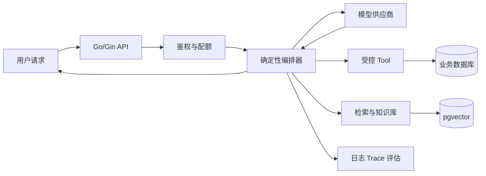

# Go AI Agent 学习路线图与说明

> **目标读者**：具备 Go 基础和 HTTP API 经验，希望构建可验证、可维护的 AI 应用，而不是只跑通一次模型调用。
> **主实现**：Go 1.26、Gin、标准库 `context`/`net/http`、PostgreSQL + pgvector（进阶）。
> **项目基线**：[`Go工程/agentgo`](./Go工程/agentgo/README.md)。

---

## 1. 先判断现在是否该学

满足以下大部分条件再进入完整路线：

- 能用 Go 写一个 JSON HTTP API；
- 理解请求方法、状态码、Header 和超时；
- 会使用 `context.Context` 取消下游请求；
- 知道 goroutine、channel、mutex 的基本用途；
- 会使用 MySQL 或 PostgreSQL 完成基本 CRUD；
- 理解 Redis 是独立外部系统，不是 Go 内存 map；
- 能用 PowerShell `Invoke-RestMethod` 或 `curl.exe` 测接口；
- 愿意为每个“效果更好”的结论提供测试证据。

如果还不会 Gin、数据库和基础鉴权，先回到 [Go 路线](../Go/00-学习路线图与说明.md)。你可以先读本目录 01 建立概念，但不要同时开第二套项目主线。

---

## 2. AI 应用系统到底多了什么

普通后端通常是确定性程序：相同输入和数据库状态应得到相同结果。接入模型后，多出一个具有以下特征的外部依赖：

- 输出有概率性；
- 响应可能持续数十秒；
- 可能生成不符合业务约束的内容；
- 可以请求调用 Tool，但它不拥有真正权限；
- 输入和输出都可能包含敏感数据；
- 费用与 Token、请求次数、模型和缓存有关；
- 模型或 Prompt 升级可能悄悄改变行为。

因此，AI 应用工程的核心不是“Prompt 写得玄学”，而是把模型放进一个可观察、可限制、可评估、可回滚的后端系统。



图中真正掌握权限的是 Go 服务，不是模型。模型只能提出结构化请求；服务端决定是否允许、如何验证、是否执行。

---

## 3. 课程边界

### 3.1 本目录重点讲

- Responses API 与供应商适配；
- 结构化输出和 JSON Schema；
- SSE 流式与取消；
- Tool Calling 的安全执行；
- RAG、引用、向量检索；
- Agent 状态机、预算和恢复；
- 评估、可观测、安全、成本；
- MCP/A2A 的应用层边界；
- 一个可运行 Go 项目。

### 3.2 本目录不作为主线讲

- PyTorch 训练循环；
- CUDA 和推理引擎实现；
- 大规模 SFT/RLHF；
- 完整前端聊天页面；
- 把多 Agent 当成所有问题的默认答案；
- 任何未经测试的“准确率提升 30%”故事。

训练与微调见 [LLMPython](../LLMPython/00-学习路线图与说明.md)，底层推理见 [LLMInfra](../LLMInfra/00-学习路线图与说明.md)。

---

## 4. 学习顺序

```text
00 路线与边界
  ↓
01 大模型与 API 基础
  ↓
02 Go 模型调用与结构化输出
  ↓
03 流式对话、SSE 与会话
  ↓
04 Tool Calling 与安全工具设计
  ↓
05 RAG：分块、检索、引用
  ↓
06 pgvector 与知识库工程
  ↓
07 Agent 状态机与长任务
  ↓
08 评估、可观测、安全、成本
  ↓
11 Go 端到端项目
  ↓
12 面试与知识总表

09 MCP/A2A/本地推理、10 LLM 原理与模型适配按需插入
```

为什么把 Agent 放到 RAG 和 Tool 之后？因为 Agent 不是另一个魔法模型，它只是决定何时调用已有能力。没有可靠 Tool、检索、超时和评估，先学复杂 Agent 只会把错误藏进循环里。

---

## 5. 每章交付物

| 章节 | 必须产出 | 验收证据 |
|------|----------|----------|
| 01 | 能画模型请求/响应边界 | 解释 Token、上下文、输出项 |
| 02 | Go 非流式调用与结构化解析 | Mock/httptest 测试通过 |
| 03 | POST SSE 流式接口 | 客户端断开后下游取消 |
| 04 | 至少两个安全 Tool | 非法参数、越权和超时被拒绝 |
| 05 | 内存 RAG 问答 | 返回片段、分数和来源 |
| 06 | pgvector 设计 | tenant 条件与索引计划清楚 |
| 07 | 有界 Agent 循环 | max steps、deadline、重复调用检测 |
| 08 | 最小评测集与 trace | 能比较两个版本而非凭感觉 |
| 11 | V1 可运行项目 | `go test ./...` 与 API 验收通过 |
| 12 | 项目讲解 | 所有数字能说明测试方法 |

---

## 6. 项目演进：V1、V2、V3

下面三节定义阶段目标，不表示清单已全部完成。当前工程状态以 `Go工程/agentgo/README.md` 和测试为准：V1 可离线运行；V2 已有 Responses/pgvector adapter，但真实账号、数据库和检索质量需单独验证；V3 尚未实现。

### 6.1 V1：离线可运行

目标是把调用链写正确，不依赖付费 API 和外部数据库：

- Mock Provider；
- 内存会话窗口；
- 内存向量存储；
- 哈希 Embedding；
- 只读计算器/知识库 Tool；
- Gin API 和 SSE；
- 单元测试。

V1 的价值是可重复和可调试，不是模型质量。

### 6.2 V2：真实模型与 pgvector

- OpenAI Responses Provider；
- 供应商模型通过环境变量选择；
- PostgreSQL + pgvector；
- 文档元数据与向量一致性；
- tenant filter；
- 离线评测集；
- Docker Compose 本地环境。

### 6.3 V3：生产增强

- Redis 配额和会话索引；
- outbox/任务队列处理 ingest；
- trace、指标、审计；
- Prompt/Tool/RAG 注入防护；
- 降级模型和超时预算；
- 数据保留、删除和脱敏策略；
- 灰度、回归评测和回滚。

不要一开始就做 V3。先证明 V1 正确，再用指标决定 V2/V3 的组件。

---

## 7. 建议学习时间

| 模块 | 建议时间 | 说明 |
|------|----------|------|
| 00～02 | 6～9 小时 | API、Go 客户端、结构化输出 |
| 03～04 | 6～10 小时 | 流式、会话、Tool |
| 05～06 | 10～15 小时 | RAG、向量、知识库 |
| 07～08 | 8～12 小时 | Agent、评估与生产边界 |
| 11 | 10～16 小时 | 项目整合和验收 |
| 09、10、12 | 按需 | 选修与复盘 |

总计约 40～60 小时。这里的时间是学习预算，不是要求连续刷完；实际应穿插在 Go 后端主线之后。

---

## 8. 推荐学习方法

每章使用同一套五步，而不是反复做形式化 FAQ：

1. **先画边界**：哪些输入可信，哪些系统拥有权限。
2. **跑基线**：先运行 Mock/内存版本，确保调用链稳定。
3. **替换一个变量**：一次只换模型、Prompt、检索参数或存储中的一个。
4. **跑同一评测集**：比较任务成功、引用正确、时延和成本。
5. **写失败记录**：记录什么情况下方案不适用。

每次实验至少保留：版本、配置、输入集、输出、指标和结论。没有这些信息的“效果不错”无法复现。

---

## 9. 环境准备

### 9.1 必需

```powershell
go version
git --version
```

预期 Go 为当前工作区使用的 Go 1.26.x。项目依赖通过 `go.mod` 固定。

### 9.2 可选

- Docker Desktop：运行 PostgreSQL + pgvector；
- OpenAI API Key：运行真实 Responses Provider；
- 其他供应商 Key：仅在完成能力核验并实现对应 adapter 后使用；
- Ollama/vLLM：本地推理选修。

### 9.3 环境变量

```powershell
$env:AI_PROVIDER="mock"
$env:AI_MODEL=""
$env:OPENAI_API_KEY=""
$env:OPENAI_BASE_URL="https://api.openai.com"
```

默认 `mock` 不需要 Key。不要把真实 Key 写进 Markdown、源码、Git 历史或 `.env.example`。

---

## 10. 供应商能力不能靠猜

接入一个供应商前逐项验证：

| 能力 | 需要验证什么 |
|------|--------------|
| 文本生成 | 使用 Responses 还是 Chat Completions；请求结构是否相同 |
| 流式 | SSE 事件名、结束事件、错误格式、取消行为 |
| Tool | 是否支持并行调用、strict schema、call id |
| 结构化输出 | 是否真正保证 Schema，而不只是合法 JSON |
| Embedding | 是否提供独立端点、模型维度、批量限制 |
| 会话状态 | 服务端存储、previous response id、保留策略 |
| 推理字段 | 是否返回 reasoning 摘要或加密项；不得依赖私有 CoT |
| 限流 | RPM、TPM、并发、重试头 |
| 数据策略 | 保存期限、训练使用、区域和零保留能力 |

详细记录见 [附录 A](./附录/A-版本与供应商能力矩阵.md)。

---

## 11. 安全基线

从第一章开始遵守：

- API Key 仅从环境变量或密钥系统读取；
- 请求体、RAG 文档、Tool 返回都视为不可信数据；
- user/tenant 身份来自认证上下文，不信请求体中的 userId；
- Tool schema 严格，业务层再次校验；
- 写操作默认不暴露给通用 Agent；
- 高风险操作需要显式确认或人工审批；
- 日志默认不记录完整 Prompt、文档和模型回答；
- 不把对话摘要提升为高权限 system 指令；
- 不记录或返回模型原始思维链；
- 每个下游调用都有 deadline、并发上限和预算。

安全清单见 [附录 C](./附录/C-故障排查与安全检查清单.md)。

---

## 12. 评估先于“智能化升级”

引入以下任一组件前，先定义它解决哪个已测问题：

| 组件 | 合理触发条件 |
|------|--------------|
| Reranker | TopK 有相关片段但排序经常错误 |
| 多 Agent | 单一确定性流程无法表达且评测证明拆分有收益 |
| Milvus/Qdrant | pgvector 在真实数据与过滤条件下达不到目标 |
| 微调 | Prompt/RAG/Tool 仍无法稳定改变目标行为，且有高质量数据 |
| MCP | 需要跨应用复用工具/资源，而非只在单服务调用函数 |
| 本地模型 | 隐私、延迟、成本或离线要求有明确收益 |

“听起来先进”不是触发条件。

---

## 13. 与短链项目的关系

短链仍是 Go 后端主项目。AI Agent 不应抢占 V1/V2：

- 短链 V1：创建、跳转、统计；
- 短链 V2：MySQL、Redis、鉴权、限流；
- AI 选修功能：运营知识库、自然语言查询统计、风险链接解释；
- 不让模型决定短码唯一性、跳转一致性或鉴权结果。

AI 只能调用受控查询 Tool，核心短链逻辑保持确定性。

---

## 14. 常见路线误区

### 14.1 一上来学多 Agent

先把一次模型调用、Tool、RAG 和评估写正确。多 Agent 会增加调用次数、状态和故障点，不会自动提高质量。

### 14.2 把 OpenAI 兼容理解为全部兼容

很多供应商只兼容部分 Chat Completions 请求。Embedding、Responses、Tool、流事件和错误码可能不同，必须逐项测试。

### 14.3 以为 RAG 能消除幻觉

RAG 只是提供上下文。检索可能错，模型可能忽略证据，引用也可能只是装饰，所以必须做检索和答案两层评估。

### 14.4 把 Agent 当权限主体

模型没有用户身份，也不应拥有数据库凭据。Tool 内从服务端认证上下文取身份，并执行权限检查。

### 14.5 为简历先写数字

性能、成本和质量数据必须来自可重复实验。没有测过就描述架构和测试计划，不填“提升 40%”。

---

## 15. 练习建议

### 基础

1. 画出用户、Go API、模型、Tool、数据库之间的信任边界。
2. 列出一个供应商接入时必须验证的八项能力。
3. 说明为什么 Tool 参数符合 JSON Schema 仍可能不合法。

### 进阶

1. 为“查询当前用户短链统计”设计一个只读 Tool，写出身份来源、参数和返回上限。
2. 为 RAG ingest 设计 V1 同步流程和 V2 异步流程，标出失败状态。
3. 写一个最小评测表：问题、期望工具、期望来源、禁止行为、最大时延。

### 参考答案要点

1. 信任边界中，用户输入、文档、模型输出和 Tool 返回都不可信；Go 服务与数据库权限由服务端控制。
2. 至少包括文本、流式、Tool、结构化输出、Embedding、状态、限流和数据策略。
3. JSON Schema 只校验形状；业务规则、权限、存在性、幂等和金额范围仍需普通 Go 代码验证。

---

## 16. 学完标准

- [ ] 能解释普通 LLM 调用、Tool Calling、RAG 和 Agent 的边界。
- [ ] 能在没有 API Key 时运行 V1 工程和全部单测。
- [ ] 能接入一个真实模型，并正确处理超时、取消和错误。
- [ ] 能实现 POST SSE，不在 URL 泄露用户问题。
- [ ] 能写一个经过 Schema、业务与权限三层校验的 Tool。
- [ ] 能实现带 tenant 过滤的检索和真实引用。
- [ ] 能给 Agent 设置步数、时间、Token/费用与并发预算。
- [ ] 能建立最小评测集，并用同一数据比较两个版本。
- [ ] 能说明 pgvector 何时足够、何时才需要独立向量库。
- [ ] 能在面试中区分已实现、已测试、计划实现，不编造指标。

下一章进入 [01 大模型与 API 基础](./01-大模型与API基础.md)。
