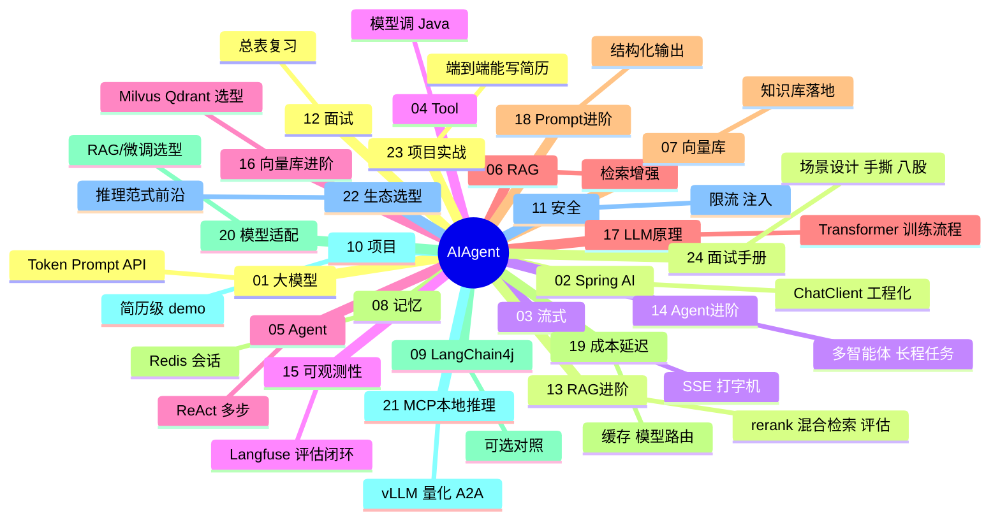
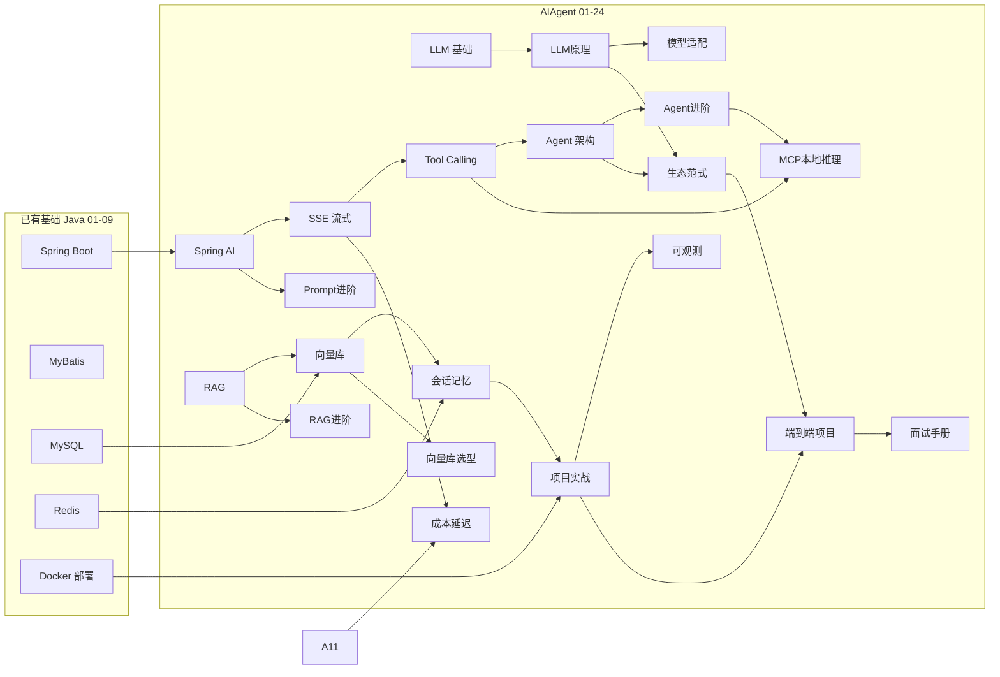

# AI Agent + Java 学习路线图与说明

> **⚠️ 2026 路线定位**  
> **默认主线**：[C++ 01～36](../C++/00-学习路线图与说明.md) + 数据结构 + Linux + 面试 33～36。  
> **本系列** = **Java 应用层** Agent/RAG **备选**；底层见 C++ + [LLMInfra](../LLMInfra/00-学习路线图与说明.md)（扩展）。

> **文件编码**：本文件夹内所有 `.md` 均为 **UTF-8**。Java 源文件建议 UTF-8，IDEA 中 `File → File Encoding → UTF-8`。
>
> **资料定位（2026-06 扩充版）**：每一章都按「零基础导读 → 知识地图 → 手把手 → 逐行解释 → 自测」编写。若某处仍看不懂，优先看该章 **§0 读前导读** 和 **常见困惑 FAQ**。

---

## 0. 读前导读：怎么用这套资料真正学会

### 0.1 用一句话弄懂本文件夹

**AI Agent + Java** = **应用层**：Spring Boot 调大模型 API、RAG、Tool——面向 **AI 产品 / 业务后端** 岗。

**与 LLM Infra 的分工**：

| 层级 | 做什么 | 学哪里 |
|------|--------|--------|
| **底层 Infra** | CUDA、KV Cache、vLLM、量化、NCCL | **[LLMInfra](../LLMInfra/00-学习路线图与说明.md)** |
| **应用 Agent** | SSE 对话、RAG、Function Calling | **本系列 AIAgent** |
| **Web CRUD** | 订单、用户 | [Java](../Java/00-学习路线图与说明.md) |

**走 Infra 不必学完本系列**；走 Agent 产品岗才以本系列为主（仍需 Java 04+）。

### 0.2 你不是一个人在硬啃：推荐学习姿势

| 错误姿势 | 正确姿势 |
|----------|----------|
| 只看不敲 | **每章至少敲完 1 个手把手 demo** |
| 遇错就换 AI 代写 | **先查该章报错表**，搞懂原因再改 |
| 一次跳 5 章 | **按 00→01→02 顺序**，每章自测过关再下一章 |
| 背概念不画图 | **每章画 1 张自己的图**（纸笔即可） |
| 学完说不出 | **费曼检验**：合上书讲给空气听 3 分钟 |

**每日最小有效学习（2 小时版）**：

```text
30 min  读 §0 导读 + 知识地图，知道今天要搞定什么
60 min  跟着手把手敲代码/命令（必须亲自敲）
20 min  做基础档练习
10 min  闭卷自测 3 题 + git commit 今日进度
```

### 0.3 前置能力自检（不会就先去学，别硬撑）

| 能力 | 最低要求 | 不会就去 |
|------|----------|----------|
| 会用电脑装软件 | 能装 JDK、IDEA、Docker Desktop | [Java 00](../Java/00-学习路线图与说明.md) §4 |
| 知道 HTTP 是什么 | 知道「浏览器访问网址=发请求、收响应」 | [计网 04](../../前端学习/计算机网络/04-HTTP协议深入.md) 前半 |
| 会写 Java 类和方法 | 能写 `public class`、调方法 | [Java 01](../Java/01-Java基础语法与面向对象.md) |
| 会 Spring Boot 接口 | 能写 `@GetMapping` 返回 JSON | [Java 04](../Java/04-SpringBoot核心开发.md) |
| 会用 Redis 概念 | 知道 key-value 缓存 | [Java 07](../Java/07-Redis核心原理与缓存实战.md) |

**Agent 路线的硬性门槛**：至少完成 **Java 04**；最好 **04 + 07**。MySQL（05～06）在 Tool 查库、知识库元数据时会用到。

### 0.4 本系列知识全景图（24 章各自干什么）



> **13～16 是「RAG/Agent 工程深挖章」**、**17～22 是「大模型岗/AI开发岗面试底层+前沿章」**、**23～24 是「项目实战与面试冲刺章」**（2026-06 新增）。建议学完对应基础章后再看：06/07 → 13、16；05 → 14；11 → 15；01 → 17、18；02/11 → 19、21；17 → 20、22；**10/12 + 全部进阶 → 23、24**。

### 0.5 学完整个 AIAgent 系列，你应该能独立完成

1. 创建一个 Spring Boot 项目，提供 **Chat API**（流式 + 非流式）
2. 注册 **2 个以上 Tool**（如查天气、查订单）
3. 实现 **RAG 知识库问答**（上传文档 → 向量检索 → 带引用回答）
4. 用 **Redis** 保存多轮对话，不同用户互不干扰
5. **15 分钟**向面试官讲清架构，并 **现场改一个小需求**（如加一个 Tool）
6. 说明 **Prompt 注入** 是什么、你怎么防

### 0.6 常见困惑（开始学之前）

| 困惑 | 简短回答 |
|------|----------|
| Agent 和 ChatGPT 网页有啥区别？ | 网页是产品；Agent 是**你把大模型嵌进自己的业务系统**，能查你的数据库、你的文档 |
| 一定要会 Python 吗？ | **不要**。本路线全程 Java |
| 一定要 GPU 吗？ | **不要**。调云端 API 或本地 Ollama；训练才要 GPU |
| Spring AI 和 LangChain 哪个好？ | 本路线 **Spring AI 主线**；09 章了解 LangChain4j 即可 |
| 资料太多学不完？ | 先 **01→02→03→04→10**，其余按需补 |
| 和大厂差距在哪？ | 大厂还要：监控、评测、灰度、合规；11 章入门，工作中继续补 |

### 0.7 建议学习时长（总计约 2～3 个月，每天 2～3 小时）

见下文 §6；**急不得**。一章没自测过关不要进下一章。

---

## 1. 这套资料适合谁

- 已学完或并行学习 [Java 后端](../Java/00-学习路线图与说明.md) **01～07**（至少到 Spring Boot + Redis）的同学
- 目标：**用 Java / Spring Boot 构建可落地的 AI Agent 应用**（对话、RAG 知识库、Tool 调用），而不只是「会调一次 ChatGPT API」
- 想走 **Agent + Java 后端** 校招/实习路线，简历项目需要 AI 亮点

**不适合**：

- 完全零基础、还没写过 Spring Boot 接口（请先学 [Java 04](../Java/04-SpringBoot核心开发.md)）
- 想做 **大模型训练 / 微调 / 算法研究**（本系列聚焦 **Agent 工程**，不教 PyTorch 训练）
- 只想用 Python LangChain 脚本跑 demo、不写 Java 后端

### 与 Java 路线的关系

| 维度 | Java 路线 | AI Agent 路线（本文件夹） |
|------|-----------|---------------------------|
| 核心能力 | CRUD、MySQL、Redis、MQ、部署 | LLM 调用、RAG、Tool、会话、流式 |
| 框架 | Spring Boot + MyBatis | Spring Boot + **Spring AI**（主）/ LangChain4j（辅） |
| 前置 | 无硬性前端前置 | **Java 04～07 必会** |
| 项目形态 | 商城 / 博客 API | 知识库问答 / 业务助手 Agent |
| 面试 | 八股 + 场景设计 | 传统八股 + **RAG 流程 + Tool 设计** |

**Web 后端选 Java 学透后，再叠 Agent 层**——Agent 不能替代 Spring Boot、MySQL、Redis，而是在此之上扩展。

---

## 2. 技术栈主线（本资料默认路线）

```text
大模型基础概念（Token、Prompt、上下文）
  → Spring AI 接入 ChatModel / ChatClient
  → SSE 流式对话接口
  → Function Calling / Tool 设计
  → Agent 架构（ReAct、Router）
  → RAG：文档分块 → Embedding → 向量检索 → 生成
  → 向量数据库（PGVector / Redis Vector 等）
  → 对话记忆 + Redis 会话持久化
  → LangChain4j 进阶（可选分轨）
  → 完整 Agent 项目 + 生产化安全
  → 面试专题
```

与现有资料的映射：



---

## 3. 学习顺序（按编号）

```text
00 学习路线图（你现在在这里）
 ↓
01 大模型基础与 API 调用入门
 ↓
02 Spring AI 核心开发
 ↓
03 流式对话与 SSE 实战
 ↓
04 Function Calling 与 Tool 设计
 ↓
05 Agent 架构与 ReAct 模式
 ↓
06 RAG 检索增强生成基础
 ↓
07 向量数据库与知识库实战
 ↓
08 对话记忆与会话管理
 ↓
09 LangChain4j 进阶（可选分轨）
 ↓
10 Agent 项目实战与面试准备
 ↓
11 生产化与安全
 ↓
12 面试专题与知识点总表
 ↓
（进阶深挖，按需学，面试加分项）
13 RAG 进阶：检索优化与评估
 ↓
14 Agent 进阶：多智能体与长程任务
 ↓
15 LLM 可观测性与评估体系
 ↓
16 向量库选型与进阶
 ↓
（大模型岗/AI开发岗面试底层+前沿，按需学）
17 LLM 原理与训练流程
 ↓
18 Prompt Engineering 进阶与结构化输出
 ↓
19 成本与延迟优化
 ↓
20 模型适配方法论与微调入门
 ↓
21 MCP/A2A 协议与本地推理部署
 ↓
22 大模型生态选型与前沿推理范式
 ↓
23 Agent + Java 端到端项目实战
 ↓
24 大厂面试实战手册
```

### 阶段目标

| 阶段 | 文档 | 目标 |
|------|------|------|
| 概念 | 01 | 懂 Token、Prompt、多轮 messages，能手 curl 调 API |
| 框架 | 02～03 | Spring AI 跑通对话 + SSE 流式 |
| Agent 核心 | 04～05 | Tool 注册 + ReAct 循环 |
| RAG | 06～07 | 文档入库、检索、问答 |
| 工程 | 08～11 | 会话持久化、限流、安全、部署 |
| 冲刺 | 10、12 | 完整项目 + 面试 |
| 进阶深挖 | 13～16 | RAG/Agent/可观测/向量库面试深挖点 |
| 大模型岗底层+前沿 | 17～22 | LLM原理/Prompt/成本/微调/MCP本地/生态范式 |
| 项目与面试冲刺 | 23～24 | 端到端项目实战 + 场景设计/手撕/八股/简历 |

---

## 3.1 各章衔接索引

| 编号 | 上一章产出 | 本章解决什么 |
|------|------------|--------------|
| 01 | 00 知道学什么 | LLM 是什么、API 长什么样、关键参数 |
| 02 | 01 能 curl 调 API | 用 Spring AI 在 Java 里封装调用 |
| 03 | 02 非流式对话 | Chat 打字机效果，SSE 推送到前端 |
| 04 | 03 纯对话 | 模型能调 Java 方法（查库、查订单） |
| 05 | 04 单次 Tool | 多步推理：想→做→观察→再想 |
| 06 | 05 Agent 能行动 | 让模型「带着资料回答」，减少幻觉 |
| 07 | 06 懂 RAG 流程 | 向量库落地，知识库可检索 |
| 08 | 07 能问答 | 多轮上下文、Redis 会话、用户隔离 |
| 09 | 08 会话完整 | LangChain4j 对照 Spring AI（可选） |
| 10 | 01～09 齐备 | 串成简历级 Agent 项目 |
| 11 | 10 能 demo | 限流、成本、Prompt 注入防护 |
| 12 | 全部 | 复习索引、场景题 |
| 13 | 06/07 RAG 基础 | rerank、混合检索、HyDE、chunk 策略、RAGAS 评估 |
| 14 | 05 Agent 基础 | 多 Agent 协作、长程任务、记忆机制、ReAct 绕圈防护 |
| 15 | 11 生产化 | Langfuse/LangSmith/Phoenix 可观测 + 评估闭环 |
| 16 | 07 向量库 | pgvector/Qdrant/Milvus 选型 + HNSW/IVF/PQ 索引 + 迁移 |
| 17 | 01 大模型基础 | Transformer/Attention/三种架构/Tokenizer/Pretrain-SFT-RLHF/DPO |
| 18 | 02 Spring AI | few-shot/CoT/self-consistency + entity/BeanOutputConverter 结构化输出 |
| 19 | 03/11 | prompt 缓存/模型路由/批处理/TTFT/KV Cache/成本延迟质量三角 |
| 20 | 17 LLM 原理 | Prompt/RAG/Fine-tune 选型决策树 + LoRA/QLoRA/SFT/DPO/RLHF/GRPO |
| 21 | 04/14 | MCP/A2A 协议 + Spring AI MCP(1.1+) + vLLM/量化/Ollama 本地部署 |
| 22 | 05/17 | 开源/闭源模型选型 + 推理模型(o1/R1) + Reflection/Plan-Execute/ToT/GoT/Reflexion |
| 23 | 10/12 + 13～22 | 端到端项目实战：架构/选型/编码/部署/优化/排障/追问应对（能写简历、能扛追问） |
| 24 | 23 + 全库八股 | 场景设计4步框架 + 手撕6题 + 八股速查 + 项目深挖模板 + 简历优化 + 模拟面试 |

---

## 3.2 demo 项目演进路线（02～10 共用 `agent-demo`）

建议始终维护一个叫 **`agent-demo`** 的 Spring Boot 项目，在 [Java demo](../Java/00-学习路线图与说明.md) 基础上叠加 AI 能力：

```text
02 章  agent-demo + Spring AI，POST /api/chat 非流式对话
  ↓
03 章  + GET /api/chat/stream（SSE 流式）
  ↓
04 章  + WeatherTool、OrderQueryTool（Function Calling）
  ↓
05 章  + ReAct Agent Service（多步 Tool 循环）
  ↓
06 章  + 文档上传、TextSplitter 分块
  ↓
07 章  + Embedding + PGVector/Redis Vector，POST /api/kb/ask
  ↓
08 章  + conversationId + Redis 存最近 N 轮
  ↓
10 章  扩展为「企业知识库智能助手」完整项目
  ↓
13 章  + 混合检索(BM25+向量) + RRF + rerank + RAGAS 评测闭环
  ↓
14 章  + 多 Agent 编排 + 长程任务状态持久化 + 防绕圈
  ↓
15 章  + Langfuse 接入(OTel+Micrometer) + 用户反馈 score
  ↓
16 章  + Qdrant/Milvus starter 切换 + 元数据过滤调优
  ↓
17 章  （原理章，无代码；理解 Transformer/训练流程）
  ↓
18 章  + POST /api/extract 结构化提取接口(entity/BeanOutputConverter)
  ↓
19 章  + 模型路由 + prompt 缓存顺序优化 + 成本看板
  ↓
20 章  （方法论章，无代码；微调概念与选型）
  ↓
21 章  + MCP Server/Client(@McpTool, 需1.1+) + vLLM/Ollama base-url 切换
  ↓
22 章  （视野章，无代码；模型选型与推理范式）
  ↓
23 章  把 02～22 的能力落成「企业知识库智能问答 Agent」端到端项目（架构/选型/编码/部署/优化/排障/追问应对）
  ↓
24 章  （方法论章，无代码；场景设计框架/手撕/八股速查/项目深挖模板/简历优化）
```

各章「手把手」入口：02-§2.1、03-§2.1、04-§3.1、06-§4.1、07-§5.1、08-§3.1、10-§6、13-§3/§4/§5、14-§3.4/§4.2、15-§7、16-§5.3、18-§4.2、19-§3.1/§4.2、21-§5.2/§5.3。

---

## 3.3 框架选型：Spring AI vs LangChain4j

| 维度 | Spring AI | LangChain4j |
|------|-----------|-------------|
| 维护方 | Spring 官方 | 社区（Quarkus/Spring 均支持） |
| 与 Spring Boot | **原生集成**，自动配置 | 需手动装配，也支持 Spring |
| 学习曲线 | 会 Spring Boot 即可上手 | Agent 抽象更丰富，概念略多 |
| 本资料主线 | **02～08 默认 Spring AI** | **09 章分轨对照** |
| 面试 | 国内 Spring 岗更熟 | 部分 AI 团队也问 |

**建议**：主线跟 Spring AI；09 章用 1～2 天过 LangChain4j 核心 API，简历写「Spring AI 为主，了解 LangChain4j」。

---

## 3.4 大模型 API 选型（开发阶段）

| 提供商 | 特点 | 配置方式 |
|--------|------|----------|
| **DeepSeek** | 便宜、OpenAI 兼容、国内可用 | Spring AI OpenAI + 改 `base-url` |
| **通义千问** | 阿里云、国内稳定 | Spring AI 通义 starter 或 OpenAI 兼容端点 |
| **OpenAI** | 生态最全、需科学上网 | 官方 OpenAI starter |
| **Ollama** | 本地免费、隐私 | `spring-ai-ollama`，适合离线练手 |

本资料示例以 **DeepSeek（OpenAI 兼容）** 和 **Ollama（本地）** 为主，避免绑定单一厂商。

---

## 4. 必备环境与工具

### 4.1 前置环境（来自 JavaScript Java 04～07）

```bash
java -version    # JDK 17 或 21
mvn -version     # Maven 3.8+
docker ps        # MySQL、Redis 容器（06～08 章需要）
```

### 4.2 Agent 专项新增

| 组件 | 用途 | 建议章节 |
|------|------|----------|
| Spring AI BOM | 统一 AI 依赖版本 | 02 章 |
| DeepSeek / Ollama API Key | 调 LLM | 01～02 章 |
| PGVector（PostgreSQL 扩展）或 Redis Stack | 向量存储 | 07 章 |
| Postman / curl | 测 SSE | 03 章 |
| （可选）LangChain4j | 09 章 | 09 章 |

### 4.3 环境一键验证（02 章前）

**Ollama 本地（推荐练手，免 API 费用）**：

```powershell
# Windows：从 https://ollama.com 安装后
ollama pull qwen2.5:3b
ollama run qwen2.5:3b "你好"
# 预期：模型回复中文问候
```

**DeepSeek API（需注册获取 Key）**：

```bash
curl https://api.deepseek.com/chat/completions \
  -H "Content-Type: application/json" \
  -H "Authorization: Bearer $DEEPSEEK_API_KEY" \
  -d '{"model":"deepseek-chat","messages":[{"role":"user","content":"你好"}]}'
# 预期：JSON 含 choices[0].message.content
```

---

## 5. 推荐学习四步法（每章都做）

1. **通读**：这章解决什么问题？和 Java demo 什么关系？
2. **敲 demo**：`agent-demo` 完整敲一遍，API Key 用环境变量
3. **做小练习**：章节末尾「分级练习」至少完成基础档
4. **复述**：合上书，画 RAG 流程图 / 讲清 Tool 调用链

---

## 5.1 全路线分级练习总表

| 章节 | 基础 | 进阶 | 挑战 | 答案位置 |
|------|------|------|------|----------|
| 01 | curl 调通对话 | 改 temperature 对比输出 | 估算一段中文 Token 数 | 01 篇 §练习 |
| 02 | Spring AI Hello Chat | 多轮 messages | System Prompt 角色设定 | 02 篇 §练习 |
| 03 | SSE 接口 curl 收流 | Vue EventSource 联调 | 断线重连 | 03 篇 §练习 |
| 04 | 1 个 Tool 查天气 | 查 MySQL 订单 | Tool 失败重试 | 04 篇 §练习 |
| 05 | ReAct 3 步内完成 | Router 分意图 | 最大迭代保护 | 05 篇 §练习 |
| 06 | 单文件 Markdown RAG | 多 PDF 入库 | 混合检索 | 06 篇 §练习 |
| 07 | PGVector TopK 检索 | 知识库 CRUD API | 检索结果重排序 | 07 篇 §练习 |
| 08 | Redis 存 10 轮历史 | 按 userId 隔离 | 会话过期策略 | 08 篇 §练习 |
| 10 | 完整 KB 问答 demo | + JWT 鉴权 | 部署到 Linux | 10 篇 §练习 |

---

## 6. 学习时间参考（每天 2～3 小时）

| 文档 | 建议天数 | 说明 |
|------|----------|------|
| 01 | 3～5 天 | 概念为主，多试验 API 参数 |
| 02 | 5～7 天 | 搭 agent-demo 骨架 |
| 03 | 3～5 天 | SSE 需前后端联调 |
| 04 | 5～7 天 | Tool 设计是 Agent 核心 |
| 05 | 4～6 天 | ReAct 逻辑需调试 |
| 06 | 5～7 天 | RAG 概念多 |
| 07 | 5～7 天 | 向量库环境搭建 |
| 08 | 3～5 天 | 与 Java 07 Redis 衔接 |
| 09 | 2～4 天 | 可选 |
| 10 | 10～14 天 | 综合项目 |
| 11～12 | 持续 | 面试前反复看 |

**在 Java 01～09 基础上，Agent 专项约 2～3 个月**。

---

## 7. 练手项目建议

### 方案 A：企业知识库智能问答（推荐）

- 用户上传 PDF/Markdown → 分块 → 向量入库
- 对话时 RAG 检索 + 流式回答
- 引用来源片段（可选加分）
- JWT 登录、按用户隔离知识库
- Redis 会话、MySQL 存文档元数据

### 方案 B：业务助手 Agent

- 接 Java demo 商城：Tool 查订单、查库存、查物流
- ReAct 多步：「我上周买的手机发货了吗？」→ 查用户 → 查订单 → 查物流
- 不做 RAG，专注 Tool + Agent

### 方案 C：A + B 合并（简历最强）

- 知识库问答 + 业务 Tool 并存
- Router Agent：意图识别 → 走 RAG 或走 Tool

项目目录建议：

```text
agent-demo/
├── src/main/java/.../controller/   ChatController, KbController
├── src/main/java/.../service/      ChatService, RagService, AgentService
├── src/main/java/.../tool/         WeatherTool, OrderTool
├── src/main/java/.../config/       AiConfig, RedisConfig
├── src/main/resources/
│   ├── application.yml
│   └── prompts/                    System Prompt 模板
├── kb-docs/                        测试用 Markdown
└── README.md
```

---

## 8. 学完后你应该能做哪些事

- [ ] 用 Spring AI 接入至少一种 LLM（DeepSeek / Ollama）
- [ ] 实现 SSE 流式 Chat 接口，前端能打字机展示
- [ ] 把 Java 方法注册失败 Function Calling，完成业务查询
- [ ] 口述并实现完整 RAG 流程（分块 → Embedding → 检索 → 生成）
- [ ] 用向量库存储与检索文档
- [ ] Redis 管理多轮会话，按用户隔离
- [ ] 说明 Prompt 注入风险与基本防护
- [ ] 部署 Agent 服务到 Linux（衔接 [Java 09](../Java/09-LinuxDockerNginx部署基础.md)）

---

## 9. 常见问题 FAQ

### Q1：要先学完 Java 全部 15 章吗？

**不必**。最低门槛：**Java 04（Spring Boot）+ 07（Redis）**；最好加上 **05～06（MyBatis + MySQL）**，Tool 查库和知识库元数据才顺。

### Q2：不会 Python 能学 Agent 吗？

**能**。Agent 工程在本路线用 **Java**；Python LangChain 教程可用来理解概念，不必转 Python 后端。

### Q3：API 费用会不会很高？

练手用 **Ollama 本地** 或 DeepSeek 低价模型；开发时注意 **限流 + 最大 Token**，11 章讲成本控制。

### Q4：Spring AI 版本变快怎么办？

本资料基于 **Spring Boot 3.2+ / Spring AI 1.0.x**；若 API 有变，以 [Spring AI 官方文档](https://docs.spring.io/spring-ai/reference/) 为准，核心概念（ChatClient、Tool、Embedding）不变。

### Q5：和 [Java 16 SSE](../Java/16-SSE与WebSocket实时通信.md) 什么关系？

03 章专注 **Agent Chat 的 SSE 场景**；16 章系统讲 SSE/WebSocket 原理与更多场景。两章互参，不重复啃一遍即可。

---

## 10. 文档索引速查

| 编号 | 文件名 | 一句话 |
|------|--------|--------|
| 00 | 学习路线图与说明 | 怎么学、顺序、环境 |
| 01 | 大模型基础与 API 调用入门 | Token、Prompt、curl |
| 02 | Spring AI 核心开发 | ChatClient、配置 |
| 03 | 流式对话与 SSE 实战 | 打字机效果 |
| 04 | Function Calling 与 Tool 设计 | 模型调 Java |
| 05 | Agent 架构与 ReAct 模式 | 多步推理 |
| 06 | RAG 检索增强生成基础 | 分块、Embedding |
| 07 | 向量数据库与知识库实战 | PGVector、入库 |
| 08 | 对话记忆与会话管理 | Redis 会话 |
| 09 | LangChain4j 进阶 | 可选分轨 |
| 10 | Agent 项目实战与面试准备 | 完整项目 |
| 11 | 生产化与安全 | 限流、注入防护 |
| 12 | 面试专题与知识点总表 | 复习索引 |

---

## 11. 交叉链接

| 相关模块 | 链接 |
|----------|------|
| Java 后端主线 | [Java 00](../Java/00-学习路线图与说明.md) |
| Redis 会话 | [Java 07](../Java/07-Redis核心原理与缓存实战.md) |
| SSE 原理补充 | [Java 16](../Java/16-SSE与WebSocket实时通信.md) |
| HTTP / SSE 概念 | [计网 04](../../前端学习/计算机网络/04-HTTP协议深入.md)、[计网 07](../../前端学习/计算机网络/07-面试专题与知识点总表.md) |
| 部署 | [Java 09](../Java/09-LinuxDockerNginx部署基础.md)、[Linux 14](../Linux/14-全栈项目Linux部署实战.md) |
| LLM 安全 | [Web安全 07](../../前端学习/Web安全/07-LLM应用安全与Prompt注入防护.md) |
| 系统设计 | [系统设计 00](../系统设计/00-学习路线图与说明.md) |

---

## 12. 我的笔记区

```text
学习开始日期：
当前进度（编号）：
使用的 LLM（Ollama / DeepSeek / 其他）：
agent-demo GitHub 地址：
薄弱点：
简历项目选题（A/B/C）：
下周计划：
```

---

祝你学习顺利。**Agent 能力 = Java 后端基础 + Spring AI + RAG/Tool + 一个能讲清楚的 Agent 项目。**
