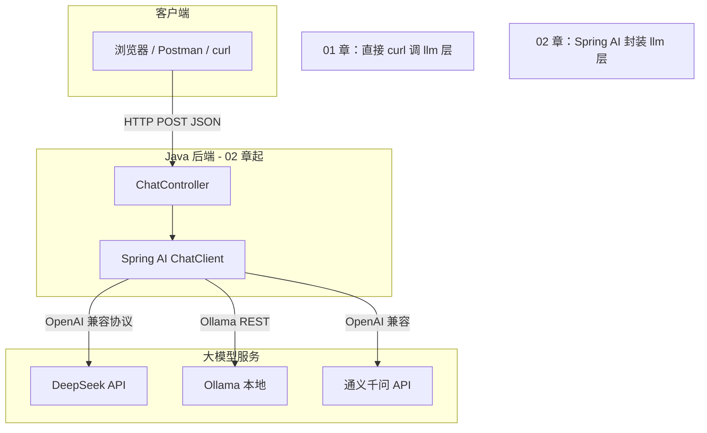
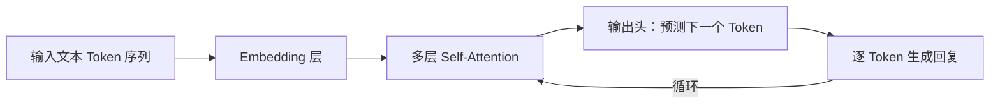

# 大模型基础与 API 调用入门

<!-- 修改说明: AI Agent 路线第 01 章，LLM 概念 + curl 实操；2026-06 扩充零基础导读 -->

---

## 0. 读前导读（零基础也能跟上）

### 0.1 用一句话弄懂本章

**本章教你在不写 Java 的情况下，用命令行直接和「大模型」说话**——搞懂它回你什么、怎么计费、怎么控制风格，后面 Spring AI 只是把同样的请求用 Java 自动发出去。

### 0.2 你需要提前知道什么

| 已有知识 | 本章会用到的地方 | 没有怎么办 |
|----------|------------------|------------|
| 什么是「程序」 | curl 也是程序，在终端里运行 | 当黑窗口里输入命令即可 |
| JSON 长什么样 | API 请求/响应都是 JSON | 见 **§0.4 JSON 10 分钟入门** |
| HTTP 请求/响应 | curl 发 POST 请求 | 见 **§0.5 HTTP 5 分钟入门** |
| 环境变量 | 存 API Key | 见 **§0.6 设置 API Key** |

**不需要**：Java、Spring、机器学习数学。

### 0.3 本章知识地图（学完应全部 ☑）

```text
☐ 能用自己的话解释：LLM、Token、Prompt、上下文窗口
☐ 能区分：训练 vs 推理（Agent 工程师只做推理）
☐ 知道 messages 里 system / user / assistant 各干什么
☐ 会调：temperature、max_tokens，并预测对输出的影响
☐ 能用 curl 调通 DeepSeek 或 Ollama，并读懂响应 JSON
☐ 知道 OpenAI 兼容 API 是什么意思
☐ 会写简单 system prompt（角色 + 输出格式）
☐ 知道幻觉是什么、工程上怎么缓解（预告 RAG/Tool）
☐ 能对照报错表排查 401 / 429 / context 超限
☐ 能向他人解释：01 章 curl 和 02 章 Spring AI 的对应关系
```

### 0.4 JSON 10 分钟入门（真不会先看这里）

**JSON** 是一种用**文本**表示数据的格式，前后端、大模型 API 都用它。

**生活类比**：像填表格——字段名是「姓名」，值是「张三」。

```json
{
  "name": "张三",
  "age": 20,
  "skills": ["Java", "curl"]
}
```

| 符号 | 含义 |
|------|------|
| `{ }` | 对象，里面是多组「键: 值」 |
| `[ ]` | 数组，一组有序列表 |
| `"..."` | 字符串，必须用双引号 |
| 数字 | 不用引号 |

大模型 Chat API 的请求体核心就是：

```json
{
  "model": "deepseek-chat",
  "messages": [
    {"role": "user", "content": "你好"}
  ]
}
```

**逐字段读**：

| 字段 | 含义 |
|------|------|
| `model` | 用哪个「型号」的模型（像选 iPhone 15 还是 14） |
| `messages` | 对话列表，数组里每条是一个角色说的话 |
| `role` | `user`=你说的话；`assistant`=模型之前说的；`system`=给模型的隐藏指令 |
| `content` | 具体文字内容 |

### 0.5 HTTP 5 分钟入门（curl 在干什么）

**HTTP** 是浏览器、App、curl 和服务器之间的「通信规则」。

一次最简单的对话 API 调用：

```text
你（curl）  --POST + JSON 正文-->  大模型服务器
你（curl）  <--JSON 响应----------  大模型服务器
```

| 概念 | 类比 |
|------|------|
| URL | 饭店地址，如 `https://api.deepseek.com/chat/completions` |
| POST | 「提交一份订单」（把 JSON 正文交给服务器） |
| Header | 订单上的备注，如 `Authorization: Bearer sk-xxx`（证明你是谁） |
| Body | 订单详情，即上面的 JSON |
| 响应 Body | 饭店回给你的小票，即模型回复的 JSON |

更系统学习：[计网 04 HTTP 协议深入](../../前端学习/计算机网络/04-HTTP协议深入.md)。

### 0.6 设置 API Key（DeepSeek 示例）

**API Key** 是一串密码，证明「这个请求是你账号发的，要记在你账上」。

**Windows PowerShell（当前窗口有效）**：

```powershell
$env:DEEPSEEK_API_KEY = "sk-你的密钥"
# 验证（应打印 sk- 开头，勿泄露给他人）
echo $env:DEEPSEEK_API_KEY
```

**永久设置（用户环境变量）**：Windows 设置 → 系统 → 关于 → 高级系统设置 → 环境变量 → 新建 `DEEPSEEK_API_KEY`。

**铁律**：Key **永远不要**写进 Git、不要截图发群、不要粘到博客。

**没有 Key 也能学本章**：用 **Ollama 本地**（§12.3），完全免费、无需注册。

### 0.7 建议学习节奏

| 天 | 内容 | 验证 |
|----|------|------|
| 第 1 天 | §0～§3 + §12.3 Ollama 调通 | Ollama 返回中文 |
| 第 2 天 | §4～§8 Token/messages/参数 | 手写 messages JSON |
| 第 3 天 | §9～§12 DeepSeek curl + Prompt | 保存 first-chat.json |
| 第 4 天 | 练习 + 闭卷自测 §23 | 自测 ≥7/10 |

### 0.8 学完本章你能做什么（可验证）

- [ ] 在终端输入一条 curl，**30 秒内**看到模型中文回复
- [ ] 打开 JSON 响应，**指出** `content` 在哪、 `usage` 在哪
- [ ] 把 `temperature` 从 0 改成 1，**描述**输出变「野」了

---

## 本章与上一章的关系

上一章（[00 学习路线图](../AIAgent/00-学习路线图与说明.md)）你已经知道：Agent 路线要叠在 [Java 04 Spring Boot](../Java/04-SpringBoot核心开发.md) 和 [Java 07 Redis](../Java/07-Redis核心原理与缓存实战.md) 之上，技术主线是 **Spring AI + RAG + Tool**。

但 Spring AI 再封装，底层仍然是 **HTTP 调用大模型 API**。如果你不懂 Token 是什么、messages 数组怎么拼、temperature 调高了会怎样，后面写 ChatClient、做多轮对话、做 RAG 时就会「只会抄配置、不会排错」。

这一章就是 **Agent 路线的地基**：先脱离 Java，用 curl 直接调 DeepSeek / Ollama，把 OpenAI 兼容协议摸透；再学 Prompt 工程基础、成本意识、常见模型对比。学完这章，你应该能：

- 独立用 curl 完成一次 Chat Completions 请求并读懂 JSON 响应
- 解释 Token、上下文窗口、temperature 等核心参数
- 设计 system prompt + few-shot + 输出格式约束
- 为下一章 [02 Spring AI 核心开发](./02-SpringAI核心开发.md) 做好概念准备

> **前置建议**：已读过 [Java 01 基础语法](../Java/01-Java基础语法与面向对象.md) 的 JSON 概念；HTTP 请求/响应可对照 [计网 04 HTTP 协议深入](../../前端学习/计算机网络/04-HTTP协议深入.md)。

### LLM 调用在整体架构中的位置



---

## 1. 大语言模型（LLM）是什么

**大语言模型（Large Language Model, LLM）** 是一种基于深度学习的文本生成模型。你给它一段文字（Prompt），它根据训练中学到的语言规律，**逐 Token 预测下一个 Token**，拼成完整回复。

### 1.1 它能做什么

| 能力 | 示例 |
|------|------|
| 对话问答 | 「Spring Boot 怎么启动？」 |
| 文本生成 | 写邮件、写代码注释 |
| 摘要翻译 | 把长文压缩成 3 条要点 |
| 结构化输出 | 按 JSON Schema 返回 |
| 推理与规划 | Agent 多步 Tool 调用（05 章） |

### 1.2 它不能做什么（工程上要心里有数）

- **不会实时联网**（除非接 Search Tool 或 RAG，06 章）
- **训练数据有截止日期**，不知道「今天股价」
- **会幻觉**：自信地编造不存在的 API、论文、法条
- **不是数据库**：不能代替 MySQL 存业务数据（Tool 查库才是正路，04 章）

### 1.3 与「传统 NLP」的区别

传统方案：分词 → 词袋 / TF-IDF → 分类器，每个任务单独训练。

LLM：**一个模型**通过海量文本预训练 + 指令微调，用 Prompt 适配多种任务——这就是 Agent 工程能「一个 Chat 接口走天下」的原因。

---

## 2. Transformer 架构（只需建立直觉）

你不必手推公式，但面试和读文档时会反复遇到 **Transformer**。

### 2.1 核心思想

2017 年 Google 论文 *Attention Is All You Need* 提出 Transformer，核心是 **Self-Attention（自注意力）**：

- 序列中每个 Token 都能「看到」其他 Token 并分配权重
- 「它」和「苹果」距离远，Attention 仍能建立关联
- 并行计算比 RNN 更适合 GPU 大规模训练

### 2.2 与你写 Agent 的关系

| 概念 | 工程含义 |
|------|----------|
| 层数 / 参数量 | 模型越大，推理越慢、越贵，能力通常越强 |
| Context Window | 一次请求最多能塞多少 Token（输入+输出） |
| Embedding | 文本转向量，RAG 检索用（06～07 章） |



---

## 3. 训练（Training）与推理（Inference）

### 3.1 训练阶段

- 在海量文本上 **预训练**（学语言规律）
- **指令微调（SFT）**：用问答对教模型「听指令」
- **RLHF / DPO** 等：对齐人类偏好（更安全、更有用）

**你需要 GPU 集群、数据集、 weeks～months**。本路线 **不做训练**，知道概念即可。

### 3.2 推理阶段

- 模型权重 **固定**，只做前向计算
- 你调 API 就是在买 **推理算力**
- 延迟 = 首 Token 时间（TTFT）+ 每 Token 生成时间

| 维度 | 训练 | 推理（你日常用的） |
|------|--------|-------------------|
| 谁在做 | 厂商 / 研究团队 | 厂商 API 或本地 Ollama |
| 你的角色 | 一般不参与 | **调 API、写 Prompt、做 Agent** |
| 成本 | 极高 | 按 Token 或本地电费 |
| 本资料 | 不教 | **01～12 章全部围绕推理** |

---

## 4. Token：计费与长度的基本单位

### 4.1 什么是 Token

模型不直接读「字」，而是读 **Token**（子词片段）：

- 英文：`hello` 可能是 1 个 Token
- 中文：常见 **1 个汉字 ≈ 1～2 个 Token**（因分词器而异）
- 代码：符号多，Token 数往往高于自然语言

### 4.2 为什么 Token 重要

1. **API 按 Token 计费**（输入 + 输出分开算）
2. **上下文窗口上限** 用 Token 衡量（如 128K）
3. **max_tokens** 限制单次回复最长长度

### 4.3 粗算中文 Token（练手用）

经验公式（DeepSeek / GPT 类分词器）：

```text
1000 个汉字 ≈ 1500～2000 Token（输入侧）
```

精确计数可用各平台 Tokenizer 或 API 返回的 `usage` 字段。

---

## 5. 上下文窗口（Context Window）

**上下文窗口** = 单次请求中，**所有 messages 的 Token 总和 + 模型将要生成的 Token** 不能超过的上限。

示例：某模型窗口 128K：

```text
system prompt     500 Token
历史 10 轮对话    8000 Token
当前 user 消息    200 Token
模型回复上限      4096 Token（max_tokens）
─────────────────────────────
合计需 < 128K
```

超出时 API 可能：

- 直接报错 `context_length_exceeded`
- 或（部分 SDK）自动截断最早的历史

**08 章** 会用 Redis 存会话并做 **滑动窗口截断**，避免爆窗。

---

## 6. 生成参数：temperature、top_p、max_tokens

### 6.1 temperature（温度）

控制随机性，范围通常 `0～2`（各厂商略有差异）：

| 值 | 行为 | 适用场景 |
|----|------|----------|
| 0～0.3 | 稳定、可重复 | 代码生成、JSON 输出、数据抽取 |
| 0.7～1.0 | 平衡 | 通用对话 |
| \> 1.0 | 更随机、更有「创意」 | 头脑风暴（也更容易胡说） |

### 6.2 top_p（核采样）

从概率累计前 `p` 的 Token 里采样（如 `top_p=0.9`）。与 temperature 都影响随机性，**一般只调一个**，推荐优先调 temperature。

### 6.3 max_tokens

限制 **模型回复** 最多生成多少 Token（不含你的输入）。

- 设太小：回复被截断，JSON 可能不完整
- 设太大：浪费费用、增加延迟

### 6.4 其他常见参数

| 参数 | 含义 |
|------|------|
| `stop` | 遇到这些字符串就停止生成 |
| `frequency_penalty` | 惩罚重复 Token |
| `presence_penalty` | 鼓励谈新话题 |
| `stream` | `true` 时流式返回（03 章 SSE） |

---

## 7. messages 数组与角色（system / user / assistant）

OpenAI 兼容 Chat API 用 **messages 数组** 表示多轮对话，每条消息有 `role` 和 `content`。

### 7.1 三种核心角色

| role | 谁写的 | 作用 |
|------|--------|------|
| `system` | 开发者 | 设定人设、规则、输出格式（模型会优先遵守） |
| `user` | 终端用户 | 用户的问题或指令 |
| `assistant` | 模型 | 历史回复；多轮时把上一轮 assistant 内容塞回 messages |

### 7.2 单轮示例

```json
{
  "model": "deepseek-chat",
  "messages": [
    { "role": "system", "content": "你是 Java 后端学习助手，回答简洁。" },
    { "role": "user", "content": "什么是 RESTful？" }
  ]
}
```

### 7.3 多轮示例

```json
{
  "model": "deepseek-chat",
  "messages": [
    { "role": "system", "content": "你是助手。" },
    { "role": "user", "content": "我叫小明" },
    { "role": "assistant", "content": "你好小明，有什么可以帮你？" },
    { "role": "user", "content": "我叫什么？" }
  ]
}
```

模型应回答「小明」——因为它能在 messages 里看到完整历史。

### 7.4 工程注意点

- **不要** 把 system 和用户可控内容混为一谈（防 Prompt 注入，见 [Web 安全 LLM 章节](../../前端学习/Web安全/07-LLM应用安全与Prompt注入防护.md)）
- 生产环境 system prompt 放服务端，**不可由前端完全覆盖**

---

## 8. OpenAI 兼容 API 协议

DeepSeek、通义千问、Moonshot、许多国内厂商都提供 **OpenAI 兼容** 端点：请求/响应 JSON 结构相同，改 `base-url` 和 `api-key` 即可切换。

### 8.1 核心端点

```text
POST {base-url}/chat/completions
Header: Authorization: Bearer {API_KEY}
Header: Content-Type: application/json
```

与 [HTTP POST + JSON Body](../../前端学习/计算机网络/04-HTTP协议深入.md) 完全一致；02 章 Spring AI 的 OpenAI starter 也是打这个端点。

### 8.2 请求体字段

```json
{
  "model": "模型名",
  "messages": [ /* 见上一节 */ ],
  "temperature": 0.7,
  "max_tokens": 1024,
  "stream": false
}
```

### 8.3 响应体结构（非流式）

```json
{
  "id": "chatcmpl-xxx",
  "object": "chat.completion",
  "created": 1710000000,
  "model": "deepseek-chat",
  "choices": [
    {
      "index": 0,
      "message": {
        "role": "assistant",
        "content": "模型回复正文"
      },
      "finish_reason": "stop"
    }
  ],
  "usage": {
    "prompt_tokens": 28,
    "completion_tokens": 56,
    "total_tokens": 84
  }
}
```

**你要取的字段**：`choices[0].message.content`；计费看 `usage`。

### 8.4 finish_reason 含义

| 值 | 含义 |
|----|------|
| `stop` | 正常结束 |
| `length` | 达到 max_tokens 被截断 |
| `content_filter` | 内容被安全策略拦截 |

---

## 9. 常见大模型对比（2025～2026 练手选型）

| 模型 / 服务 | 部署 | 价格感 | 特点 | 本资料用途 |
|-------------|------|--------|------|------------|
| **DeepSeek Chat** | 云端 API | 低 | OpenAI 兼容、中文好 | **01～02 章主力** |
| **通义千问 qwen-plus** | 阿里云 | 中 | 国内稳定、生态全 | 备选云端 |
| **OpenAI GPT-4o** | 官方 API | 高 | 生态最全、Tool 成熟 | 有 Key 可对照 |
| **Ollama + qwen2.5** | 本地 | 免费 | 隐私、离线 | **练手首选** |
| **Claude** | Anthropic | 中高 | 长上下文、写作强 | 概念对照 |

选型建议：

- **学概念 / 写 demo**：Ollama 本地，零 API 费
- **联调 / 简历项目**：DeepSeek 或通义，便宜稳定
- **面试**：能说清「OpenAI 兼容 + base-url 切换」，比背型号更重要

---

## 10. 成本意识（Cost Awareness）

### 10.1 计费公式（云端）

```text
费用 ≈ 输入 Token 单价 × prompt_tokens + 输出 Token 单价 × completion_tokens
```

各厂商官网有价目表；DeepSeek 类模型通常 **输入远便宜于输出**。

### 10.2 开发阶段省钱清单

1. 用 **Ollama 小模型**（3B～7B）做功能调试
2. 限制 **max_tokens**（如 512 够答大部分学习问题）
3. 系统 prompt **别写小说**，重复内容放 system 会每轮计费
4. 多轮对话做 **历史截断**（只保留最近 N 轮）
5. 加 **接口限流**（11 章），防自己脚本死循环打爆账单
6. API Key 放 **环境变量**，避免泄露被刷（见 02 章）

### 10.3 一次请求的 usage 怎么看

curl 返回 JSON 里：

```json
"usage": {
  "prompt_tokens": 120,
  "completion_tokens": 80,
  "total_tokens": 200
}
```

练手任务：连续问 10 个问题，记录 total_tokens 总和，感受成本量级。

---

## 11. Prompt 工程基础

**Prompt 工程** = 设计输入，让模型稳定输出你要的结果。Agent 开发 80% 的问题靠 Prompt + 架构，不是换更大模型。

### 11.1 System Prompt（系统提示词）

放在 `role: system`，定义：

- 身份：「你是 XX 公司客服」
- 边界：「不知道就说不知道，不要编造」
- 格式：「用 Markdown 列表回答」

示例：

```text
你是 Java 后端学习助手。规则：
1. 回答使用简体中文
2. 代码用 Java 17 语法
3. 不确定的内容明确说「我不确定」
4. 每次回答不超过 300 字
```

### 11.2 Few-Shot（少样本示例）

在 user/assistant 里放 **示例问答**，让模型模仿格式：

```json
"messages": [
  { "role": "system", "content": "把用户问题分类为：技术 / 闲聊 / 其他。只输出类别词。" },
  { "role": "user", "content": "Redis 怎么持久化？" },
  { "role": "assistant", "content": "技术" },
  { "role": "user", "content": "今天天气真好" },
  { "role": "assistant", "content": "闲聊" },
  { "role": "user", "content": "Spring Boot 和 Quarkus 哪个好？" }
]
```

预期模型应输出「技术」。

### 11.3 输出格式约束

需要机器解析时，**明确要求 JSON**，并给 schema 示例：

```text
请只输出 JSON，不要 markdown 代码块：
{"intent":"order_query","confidence":0.95}
```

配合 `temperature=0` 更稳。04 章 Tool 调用依赖结构化输出。

### 11.4 Prompt 编写 checklist

- [ ] 角色与任务是否一句话能说清？
- [ ] 是否给了反例（不要做什么）？
- [ ] 是否需要 few-shot？
- [ ] 输出格式是否可解析？
- [ ] 是否控制长度（省 Token）？

---

## 12. 与 02 章 Spring AI 的衔接

| 01 章（curl 层） | 02 章（Spring AI 层） |
|------------------|----------------------|
| `POST /chat/completions` | `ChatClient.prompt().user().call()` |
| `messages` 数组 | `Message` / `PromptTemplate` / Advisor 记忆 |
| `Authorization: Bearer` | `spring.ai.openai.api-key` 或环境变量 |
| `base-url` 换 DeepSeek | `spring.ai.openai.base-url: https://api.deepseek.com` |
| Ollama `localhost:11434` | `spring-ai-ollama-spring-boot-starter` |
| `temperature` / `max_tokens` | `ChatOptions` / `application.yml` |

**学习路径**：01 章 curl 调通 → 02 章用 Java 封装成 `POST /api/chat` → 03 章加 SSE 流式。不要跳过 01 章直接抄 Spring AI 配置。

---

## 12.1 手把手：DeepSeek API（curl 完整流程）

### 第一步：准备 API Key

1. 注册 DeepSeek 开放平台，创建 API Key
2. **不要** 把 Key 写进 Git；PowerShell 临时设置：

```powershell
$env:DEEPSEEK_API_KEY = "sk-你的密钥"
```

```bash
# Linux / macOS / Git Bash
export DEEPSEEK_API_KEY="sk-你的密钥"
```

### 第二步：最简对话

**PowerShell**：

```powershell
curl.exe -s https://api.deepseek.com/chat/completions `
  -H "Content-Type: application/json" `
  -H "Authorization: Bearer $env:DEEPSEEK_API_KEY" `
  -d '{\"model\":\"deepseek-chat\",\"messages\":[{\"role\":\"user\",\"content\":\"用一句话解释什么是 RESTful API\"}]}'
```

**Git Bash / Linux**：

```bash
curl -s https://api.deepseek.com/chat/completions \
  -H "Content-Type: application/json" \
  -H "Authorization: Bearer $DEEPSEEK_API_KEY" \
  -d '{
    "model": "deepseek-chat",
    "messages": [
      {"role": "user", "content": "用一句话解释什么是 RESTful API"}
    ]
  }'
```

**预期输出（结构示例，content 每次不同）**：

```json
{
  "id": "chatcmpl-7f3a9b2c",
  "object": "chat.completion",
  "created": 1710000123,
  "model": "deepseek-chat",
  "choices": [
    {
      "index": 0,
      "message": {
        "role": "assistant",
        "content": "RESTful API 是一种基于 HTTP 方法（如 GET、POST）对资源进行增删改查的接口设计风格，URL 表示资源，状态码表示结果。"
      },
      "finish_reason": "stop"
    }
  ],
  "usage": {
    "prompt_tokens": 18,
    "completion_tokens": 42,
    "total_tokens": 60
  }
}
```

### 第三步：带 system prompt + 参数

```bash
curl -s https://api.deepseek.com/chat/completions \
  -H "Content-Type: application/json" \
  -H "Authorization: Bearer $DEEPSEEK_API_KEY" \
  -d '{
    "model": "deepseek-chat",
    "temperature": 0.2,
    "max_tokens": 256,
    "messages": [
      {
        "role": "system",
        "content": "你是 Java 助教。只输出 JSON：{\"answer\":\"...\",\"keywords\":[\"\",\"\"]}"
      },
      {
        "role": "user",
        "content": "什么是依赖注入？"
      }
    ]
  }'
```

**预期**：`choices[0].message.content` 为 JSON 字符串；`finish_reason` 为 `stop`；`usage.completion_tokens` ≤ 256。

### 第四步：多轮对话

```bash
curl -s https://api.deepseek.com/chat/completions \
  -H "Content-Type: application/json" \
  -H "Authorization: Bearer $DEEPSEEK_API_KEY" \
  -d '{
    "model": "deepseek-chat",
    "messages": [
      {"role": "system", "content": "记住用户告诉你的信息。"},
      {"role": "user", "content": "我最喜欢的框架是 Spring Boot"},
      {"role": "assistant", "content": "好的，已记住你最喜欢 Spring Boot。"},
      {"role": "user", "content": "我最喜欢什么框架？"}
    ]
  }'
```

**预期**：回复中包含「Spring Boot」。

### 第五步：对比 temperature

同一问题，分别设 `"temperature": 0` 和 `"temperature": 1.2`买入参，各执行 3 次，观察回复差异——0 更稳定，1.2 更发散。

---

## 12.2 手把手：通义千问（OpenAI 兼容模式）

通义提供 OpenAI 兼容端点（具体 base-url 以阿里云文档为准，以下为常见写法）：

```bash
export DASHSCOPE_API_KEY="sk-你的通义密钥"

curl -s https://dashscope.aliyuncs.com/compatible-mode/v1/chat/completions \
  -H "Content-Type: application/json" \
  -H "Authorization: Bearer $DASHSCOPE_API_KEY" \
  -d '{
    "model": "qwen-plus",
    "messages": [
      {"role": "user", "content": "hello"}
    ]
  }'
```

**预期**：JSON 结构与 DeepSeek 相同，含 `choices[0].message.content`。

> 02 章可在 `application.yml` 里把 `spring.ai.openai.base-url` 指到兼容端点，Java 代码不用改。

---

## 12.3 手把手：Ollama 本地 API

Ollama 在本机 `11434` 端口提供 **类似 OpenAI** 的 Chat API，无需 Key，适合离线练手。

### 安装与拉模型

```powershell
# 安装：https://ollama.com
ollama pull qwen2.5:3b
ollama run qwen2.5:3b "你好"
```

**预期**：终端输出中文问候。

### curl 调 Ollama Chat

```bash
curl -s http://localhost:11434/api/chat \
  -H "Content-Type: application/json" \
  -d '{
    "model": "qwen2.5:3b",
    "messages": [
      {"role": "user", "content": "1+1等于几？只回答数字"}
    ],
    "stream": false
  }'
```

**预期输出（结构示例）**：

```json
{
  "model": "qwen2.5:3b",
  "created_at": "2026-06-30T08:00:00.000000001Z",
  "message": {
    "role": "assistant",
    "content": "2"
  },
  "done": true
}
```

注意：Ollama 原生响应字段是 `message.content`，不是 OpenAI 的 `choices[0]`——Spring AI Ollama starter 会帮你适配；裸 curl 时要会读 JSON。

### Ollama OpenAI 兼容端点（可选）

```bash
curl -s http://localhost:11434/v1/chat/completions \
  -H "Content-Type: application/json" \
  -d '{
    "model": "qwen2.5:3b",
    "messages": [{"role":"user","content":"hi"}]
  }'
```

若 Ollama 版本支持 `/v1/chat/completions`，响应格式与 DeepSeek 一致。

### 验证 Ollama 是否在跑

```bash
curl -s http://localhost:11434/api/tags
```

**预期**：JSON 列出已 pull 的模型名，含 `qwen2.5:3b`。

---

## 12.4 手把手：用 jq 提取回复（可选）

安装 jq 后：

```bash
curl -s https://api.deepseek.com/chat/completions \
  -H "Content-Type: application/json" \
  -H "Authorization: Bearer $DEEPSEEK_API_KEY" \
  -d '{"model":"deepseek-chat","messages":[{"role":"user","content":"说 OK"}]}' \
  | jq -r '.choices[0].message.content'
```

**预期终端只输出一行**：

```text
OK
```

---

## 13. 流式响应预览（03 章详学）

设 `"stream": true` 时，响应变为 **SSE 多段 data**，不是一次性 JSON。01 章只需知道存在即可；完整对接 [Java SSE](../../前端学习/计算机网络/04-HTTP协议深入.md) 在 03 章。

```bash
curl -N https://api.deepseek.com/chat/completions \
  -H "Content-Type: application/json" \
  -H "Authorization: Bearer $DEEPSEEK_API_KEY" \
  -d '{"model":"deepseek-chat","stream":true,"messages":[{"role":"user","content":"数到5"}]}'
```

**预期**：终端逐行出现 `data: {"choices":[{"delta":{"content":"1"}}]}` 类似片段，最后 `data: [DONE]`。

---

## 14. 深入解释：Self-Attention 与上下文

### 14.1 结论

Transformer 通过 Attention 让任意两个 Token 直接交互，因此 **长上下文** 能保留远距离依赖，但 **计算和内存随序列长度平方级增长**（优化版模型会用 FlashAttention 等技巧）。

### 14.2 对 Agent 开发的含义

1. **塞太多历史** → 延迟上升、费用上升、可能触顶 context window
2. **RAG 不是无限塞文档**：只检索 TopK 相关片段进 prompt（06 章）
3. **system prompt 每轮都占 Token**：精简 wording

### 14.3 真实案例（模拟）

某同学把 50 页 PDF 全文贴进 user message，DeepSeek 返回 `context_length_exceeded`。改为 RAG 只注入 3 段各 500 Token 的片段后，请求恢复正常——说明 **上下文管理是工程问题**。

---

## 15. 深入解释：temperature 与采样到底在干什么

### 15.1 结论

模型最后输出层得到每个 Token 的 **概率分布**。temperature 放大/缩小分布的「尖锐程度」：越低越总是选最高概率 Token；越高越低概率 Token 也有机会被选中。

### 15.2 底层直觉

```text
temperature ≈ 0 → 几乎贪心选 top1
temperature 高 → 采样更「野」
```

### 15.3 工程对照

| 任务 | 推荐 temperature |
|------|-------------------|
| 生成订单号 JSON | 0 |
| 创意文案 | 0.8～1.0 |
| ReAct Agent 推理 | 0～0.3（减少胡编 Tool 参数） |

---

## 16. 常见报错与排查

| 现象 / 报错关键词 | 可能原因 | 解决方案 |
|-------------------|---------|---------|
| `401 Unauthorized` | API Key 错误或没传 Header | 检查 `Authorization: Bearer sk-...`；环境变量是否在当前终端生效 |
| `402` / `Insufficient Balance` | 账户余额不足 | 充值或换 Ollama 本地调试 |
| `429 Too Many Requests` | 触发速率限制 | 加指数退避重试；降低并发；11 章限流 |
| `context_length_exceeded` | messages 总 Token 超窗口 | 缩短历史；减少 system prompt；提高模型窗口或做摘要 |
| `Invalid model` / `model not found` | model 名拼写错或未开通 | 对照文档模型 id；Ollama 先 `ollama pull` |
| curl `Connection refused` | 网络或 base-url 错 | 检查代理；Ollama 是否启动 |
| 返回 `content` 为空 | 安全过滤或参数异常 | 看 `finish_reason`；换 prompt 试 |
| JSON 解析失败 | 手动拼 JSON 转义错误 | PowerShell 用 curl.exe + 转义；或 JSON 放文件 `-d @body.json` |
| Ollama `500` | 模型未加载或内存不足 | `ollama ps` 看加载；换更小模型 |
| 中文乱码 | 终端编码非 UTF-8 | Windows Terminal 设 UTF-8；`chcp 65001` |
| 回复被截断 mid-JSON | `max_tokens` 太小 | 增大 max_tokens 或缩短 prompt |
| HTTPS 证书错误 | 公司代理 MITM | 开发环境配置 CA；勿生产 `-k` 忽略证书 |

---

## 17. API Key 与安全基线

1. Key 只放 **环境变量** 或密钥管理服务，**禁止** commit 到 Git
2. `.gitignore` 加入 `.env`
3. 泄露后立即在控制台 **轮换 Key**
4. 后端代理 API：前端 **不持有** 大模型 Key（02 章 ChatController 模式）
5. 日志 **脱敏**，别打印完整 Authorization

---

## 18. 与 Java / 计网知识的交叉索引

| 主题 | 延伸阅读 |
|------|----------|
| HTTP POST JSON | [计网 04 HTTP 协议深入](../../前端学习/计算机网络/04-HTTP协议深入.md) |
| 后端分层封装 API | [Java 04 Spring Boot](../Java/04-SpringBoot核心开发.md) |
| 会话存 Redis | [Java 07 Redis](../Java/07-Redis核心原理与缓存实战.md) |
| SSE 流式 | [计网 07 面试总表](../../前端学习/计算机网络/07-面试专题与知识点总表.md)、Agent 03 章 |
| Prompt 注入 | [Web 安全 07 LLM](../../前端学习/Web安全/07-LLM应用安全与Prompt注入防护.md) |

---

## 19. 面试常问（01 章范围）

1. Token 是什么？为什么 API 按 Token 计费？
2. system / user / assistant 区别？
3. temperature 和 top_p 怎么选？
4. 训练 vs 推理区别？你做 Agent 主要关心哪个？
5. 什么是 OpenAI 兼容 API？DeepSeek 怎么接？
6. 上下文窗口爆了怎么办？
7. 什么是幻觉？工程上如何缓解？（RAG、Tool、引用来源）
8. Few-shot 是什么？

---

## 20. 分级练习

**基础**：用 curl 调通 DeepSeek 或 Ollama，问一个 Java 问题并保存完整 JSON 响应  
**进阶**：同一问题，temperature=0 与 1.0 各 5 次，对比差异并写 100 字结论  
**挑战**：估算一段 800 字中文讲义约多少 Token（用 API 返回 usage 验证），并计算 1000 次同类请求的大致费用

### 参考答案

#### 基础：curl 调通对话

1. 设置 `DEEPSEEK_API_KEY` 或使用 Ollama
2. 执行 12.1 第二节最简 curl
3. 确认响应含 `choices[0].message.content` 且 `finish_reason` 为 `stop`
4. 将 JSON 保存为 `first-chat.json`

**通过标准**：不借助 Java，纯 curl 能拿到模型中文回复。

#### 进阶：temperature 对比（报告模板）

```text
问题：「用三个词形容 Spring Boot」
temperature=0：五次回复几乎_kubernetes/Spring/框架_等稳定组合
temperature=1.0：出现更多比喻和非常规词汇
结论：抽取型任务用 0；创意写作用 0.8+。
```

#### 挑战：Token 估算思路

1. 准备 ~800 字中文 `.txt`
2. 作为唯一 user message 调 API
3. 读 `usage.prompt_tokens`，即为实测输入 Token（通常 1200～1600）
4. 假设输出 max_tokens=200，查价目表：`费用 ≈ prompt×输入单价 + 200×输出单价`
5. ×1000 得批量估算——练手项目通常 **< 几元人民币**，但要有意识

---

## 21. 这一章的练习建议（自测清单）

建议独立完成：

1. DeepSeek + Ollama 各调通一次 chat
2. 手写含 system + 2 轮历史的 messages JSON
3. 改 `max_tokens=10` 观察 `finish_reason: length`
4. 读一遍 `usage`，记录 prompt/completion Token
5. 写一段 200 字 system prompt，约束 JSON 输出
6. 对照 8.3 节，口述响应 JSON 各字段含义
7. 画一张从 curl 到 02 章 ChatClient 的对照表

---

## 22. 学完标准（扩充版）

- [ ] 能解释 LLM、Token、上下文窗口、temperature、max_tokens
- [ ] 能区分训练与推理，并说明 Agent 工程关注推理
- [ ] 能构造 system/user/assistant 的 messages 数组
- [ ] 能使用 curl 调用 DeepSeek Chat Completions 并解析 JSON
- [ ] 能使用 curl 调用 Ollama 本地 `/api/chat`
- [ ] 理解 OpenAI 兼容协议，知道换 base-url 即可换厂商
- [ ] 会写基础 system prompt + few-shot + 输出格式约束
- [ ] 有 API 成本意识，会看 usage 字段
- [ ] 能对照常见报错表独立排查 401/429/context 超限等问题
- [ ] 说清 01 章 curl 与 02 章 Spring AI 的对应关系

---

## 23. 闭卷自测（先做题再对答案）

### 23.1 题目

1. LLM 的「预测下一个 Token」是什么意思？和 ChatGPT 网页有什么关系？
2. 为什么 Agent 工程师主要关心「推理」而不是「训练」？
3. `system` 和 `user` message 各解决什么问题？各举一例。
4. 上下文窗口 128K 是越大越好吗？太大有什么问题？
5. `temperature=0` 适合什么任务？`temperature=1.2` 呢？
6. 响应里 `finish_reason: length` 说明什么？你怎么改？
7. OpenAI 兼容 API 对 DeepSeek 意味着什么？（配置层面）
8. 什么是幻觉？列举两种工程缓解手段（哪怕还没学 RAG，也可说「查真实数据库」）。
9. curl 返回 401，你按什么顺序排查？
10. 画简图：从「你在终端敲 curl」到「模型返回 JSON」经过哪些步骤？

### 23.2 自测参考答案（要点）

1. 模型像「超级 autocomplete」，根据上文猜下一个词；网页底层也是调类似 API，只是产品帮你包好 UI。
2. 训练要 GPU 和数据；我们做业务是**调用已训练好的模型**完成对话/RAG/Tool。
3. system=全局规则（如「你是 Java 助教」）；user=本次用户问题（如「HashMap 原理」）。
4. 大窗口能塞更多历史/文档，但**更慢、更贵、注意力可能分散**；不是无脑越大越好。
5. 0→抽取/代码/JSON；1.2→创意文案（仍要人工审核）。
6. 输出被 `max_tokens` 截断；增大 max_tokens 或缩短 prompt。
7. 用 OpenAI 同款 URL 路径和 JSON 格式，改 `base-url` 和 Key 即可接 DeepSeek。
8. 模型编造看似真的假信息；RAG 给真实文档、Tool 查库、要求引用来源、低 temperature。
9. Key 是否存在 → Header 格式 `Bearer ` → Key 是否有效/有余额 → 是否连错环境。
10. 终端 curl → HTTPS POST → 鉴权 Header → 服务器算 Token → 逐 Token 生成 → JSON 响应。

### 23.3 费曼检验

合上书，用口语回答：**「怎么向室友解释你这一章学会了啥？」**

对照提纲（应包含）：

- 大模型是调用远程「文本生成服务」，不是魔法数据库
- 按 Token 计费，messages 数组是对话结构
- 我已用 curl 亲自调通过至少一种模型

---

## 下一章预告

这一章你用 curl 直接和大模型对话，摸清了 HTTP + JSON + messages 协议。但真实项目不会让用户手打 curl——你要在 **Spring Boot** 里提供 `POST /api/chat`，让前端或 Postman 调你的 Java 接口。

下一章（[02 Spring AI 核心开发](./02-SpringAI核心开发.md)）要做的事：

- 创建 **agent-demo** 项目，引入 **Spring AI 1.0.x** BOM
- 配置 **DeepSeek（OpenAI 兼容 base-url）** 或 **Ollama**
- 用 **ChatClient.Builder** 写 `ChatController`
- **PromptTemplate**、多轮 **MessageChatMemoryAdvisor**
- API Key 走 **环境变量**，对接 [Java 04](../Java/04-SpringBoot核心开发.md) 分层习惯

简单说：01 章是「懂协议」，02 章是「在 Java 里生产级封装」。两章连起来，你就有了 Agent 后端的第一个可运行接口。

---

*下一章：[02 Spring AI 核心开发](./02-SpringAI核心开发.md)*
