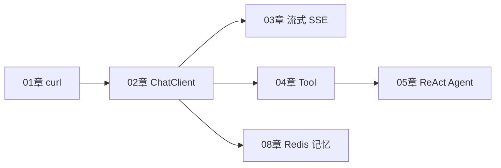
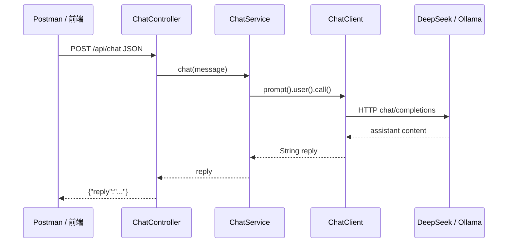
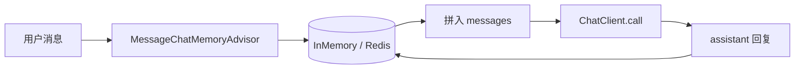

# Spring AI 核心开发

<!-- 修改说明: AI Agent 路线第 02 章，Spring Boot 3.2 + Spring AI 1.0.x -->

## 0. 读前导读（零基础也能跟上）

### 0.1 用一句话弄懂本章

**一句话**：把你在 01 章用 curl 调大模型的能力，搬进 Spring Boot 工程里，用 `ChatClient` 一行链式代码代替手写 HTTP 和 JSON。

**生活类比**：01 章像自己写信贴邮票寄给邮局（curl）；本章像办了 **VIP 快递月卡**（Spring AI），填表（`application.yml`）后把包裹交给前台（Controller），前台自动帮你打包、寄出、拆回信。

**为什么重要**：真实项目不会在生产环境用 curl；Spring AI 统一了 DeepSeek、Ollama 等厂商差异，后续流式、Tool、RAG 都建在这一层之上。

**本章用到的地方**：§4～§11 全部代码；§12 手把手验收。

---

### 0.2 你需要提前知道什么（真不会就先跳到哪一章）

| 你现在的水平 | 建议动作 |
|--------------|----------|
| 从没写过 Java | 先学 [Java 01～03](../Java/) 基础语法与 Maven |
| 会 Java 但没用过 Spring Boot | 先完成 [Java 04 Spring Boot 核心](../Java/04-SpringBoot核心开发.md) 的 demo |
| 没调过大模型 API | **必须**先完成 [01 大模型基础与 API 调用入门](./01-大模型基础与API调用入门.md)，至少 curl 成功一次 |
| 已会 curl + Spring Boot 分层 | 可直接从 §4 开始跟做 |

**最低门槛**：能复制粘贴运行 `mvn spring-boot:run`；知道「环境变量」是什么；能在 Postman 或 curl 里发 `POST` + JSON body。

---

### 0.3 本章知识地图（学完后应能勾选全部 ☐→☑）

- [ ] 说出 Spring AI 与「直接写 RestTemplate 调 API」的 3 个区别
- [ ] 在 `pom.xml` 里正确引入 `spring-ai-bom` 与 starter
- [ ] 用 profile 切换 DeepSeek（OpenAI 兼容 base-url）与 Ollama
- [ ] 用环境变量配置 `DEEPSEEK_API_KEY`，不写进 Git
- [ ] 注入 `ChatClient.Builder` 并链式 `prompt().user().call().content()`
- [ ] 把 AI 逻辑放在 Service 层，Controller 只做参数校验与返回
- [ ] 用 `PromptTemplate` 加载外部 `.st` 模板
- [ ] 用 `MessageChatMemoryAdvisor` + `conversationId` 实现多轮记忆
- [ ] 对 LLM 超时/401 做友好异常处理
- [ ] 用 curl 验收 `POST /api/chat` 并读懂 JSON 结构

---

### 0.4 JSON 与 HTTP 速查（本章接口长什么样）

**术语（HTTP POST）**：浏览器或 curl 把一段 JSON 文本发给服务器，服务器处理后也返回 JSON。

**本章请求体**（与 01 章 `messages` 的简化版对应）：

```json
{
  "message": "用一句话介绍 Spring AI"
}
```

**本章响应体**（带 `Result` 包装时）：

```json
{
  "code": 0,
  "message": "success",
  "data": {
    "reply": "Spring AI 是 Spring 官方提供的 AI 集成框架……"
  }
}
```

| 字段 | 含义 | 改错会怎样 |
|------|------|------------|
| `message` | 用户本轮输入 | 空字符串触发 `@NotBlank` 校验失败 |
| `code` | 0=成功，非 0=业务失败 | 前端可统一判断 |
| `data.reply` | 模型生成的助手回复 | 若 Key 无效可能整请求失败 |

**对应关系**：01 章 curl 里的 `Authorization: Bearer sk-...` → 本章 `spring.ai.openai.api-key`；01 章 body 里的 `model` → 本章 `chat.options.model`。

---

### 0.5 建议学习时长与节奏

| 阶段 | 建议时间 | 做什么 |
|------|----------|--------|
| 通读 §0～§3 | 30 分钟 | 建立「curl → Java 工程」心智模型 |
| 跟做 §4～§7 | 2～3 小时 | 建项目、pom、yml、Controller、Service |
| 进阶 §8～§9 | 1～2 小时 | PromptTemplate、多轮记忆 |
| 验收 §12 | 1 小时 | 手把手跑通 + curl 测试 |
| 自测 FAQ | 30 分钟 | 闭卷自测 + 费曼口述 |

**节奏建议**：每完成一个 § 就启动一次项目，不要堆到最后。Ollama 与 DeepSeek **各跑通一次**，理解 profile 切换。

---

### 0.6 学完本章你能做什么（可验证的具体动作）

1. **创建** `agent-demo` 项目，Maven 编译无报错。
2. **配置** DeepSeek 或 Ollama，启动后日志出现 `Started AgentDemoApplication`。
3. **调用** `curl -X POST http://localhost:8080/api/chat -H "Content-Type: application/json" -d "{\"message\":\"你好\"}"` 得到 `reply` 字段。
4. **切换** profile 从 `deepseek` 到 `ollama`，确认本地模型也能回复。
5. **实现** 带 `conversationId` 的多轮接口，第二轮能答出第一轮提到的名字。
6. **故意** 写错 API Key，确认返回友好错误而非堆栈泄露。

---

### 0.7 本章核心术语预览

| 术语（English） | 一句话 | 生活类比 |
|-----------------|--------|----------|
| **ChatClient** | Spring AI 1.0 面向应用的对话门面 | 餐厅服务员：帮你点菜、传菜、结账一条龙 |
| **Prompt** | 发给模型的完整输入（system + user + 历史） | 考试卷子上的「题目 + 答题要求」 |
| **Advisor** | 在调用前后插入逻辑的插件 | 秘书：自动帮你把上次聊天记录附在信里 |
| **Profile** | Spring 多套配置切换开关 | 手机「工作模式 / 省电模式」 |
| **BOM** | 统一管理依赖版本的清单 | 装修套餐价目表，避免零件版本打架 |

---

### 0.8 学习路径示意



本章是 **Agent 路线的地基**：后面每一章都在同一个 `agent-demo` 上叠加能力，不要跳过验收。

---

## 本章与上一章的关系

上一章（[01 大模型基础与 API 调用入门](./01-大模型基础与API调用入门.md)）你已经用 **curl** 直接调过 DeepSeek / Ollama，搞懂了 `messages`、Token、`temperature` 和 OpenAI 兼容 JSON。

这一章是 **从 curl 进入 Java 工程化**：在 [Java 04 Spring Boot](../Java/04-SpringBoot核心开发.md) 的分层习惯下，用 **Spring AI 1.0.x** 的 `ChatClient` 封装大模型调用，对外暴露 `POST /api/chat`。你不再手写 HTTP 和 JSON 拼 body，而是依赖自动配置 + 类型安全的 Fluent API。

学完这章，你应该能：

- 搭建 **agent-demo** 项目（Spring Boot 3.2 + Spring AI BOM）
- 用 **DeepSeek（OpenAI 兼容 base-url）** 或 **Ollama** 跑通对话
- 掌握 **ChatClient.Builder**、PromptTemplate、多轮记忆 Advisor
- API Key 走 **环境变量**，并处理 LLM 调用失败

> **前置**：已完成 Java 04（Controller/Service 分层）；01 章 curl 至少调通一次。

### Spring AI 在请求链路中的位置



与 [Java 04 MVC 流程](../Java/04-SpringBoot核心开发.md) 对比：只是把 Service 里的「内存 List」换成了 **ChatClient 调 LLM**。

---

## 1. Spring AI 是什么

**Spring AI** 是 Spring 官方出品的 AI 集成框架，定位类似 Spring Data——**换厂商不改业务代码太多**。

它帮你解决：

- 各 LLM 厂商 HTTP 细节（OpenAI、Ollama、通义等）
- `ChatClient` 流式 / 非流式统一 API
- Prompt、Message、ChatMemory、Advisor 抽象
- 后续章节的 Embedding、VectorStore、Tool（04 章）

本资料主线版本：**Spring Boot 3.2.x + Spring AI 1.0.x**（`ChatClient.Builder` 风格）。若官方小版本 API 有变，以 [Spring AI 文档](https://docs.spring.io/spring-ai/reference/) 为准。

---

## 2. 技术选型与依赖关系

| 组件 | 版本建议 | 说明 |
|------|----------|------|
| JDK | 17 或 21 | 与 Java 04 demo 一致 |
| Spring Boot | 3.2.5+ | 父 POM |
| Spring AI BOM | 1.0.0+ | 统一 AI 依赖版本 |
| 云端 LLM | DeepSeek | `spring-ai-openai` + 改 base-url |
| 本地 LLM | Ollama | `spring-ai-ollama` |

**二选一或 profile 切换**：开发用 Ollama 省钱，联调用 DeepSeek。

---

## 3. agent-demo 项目结构（本章目标形态）

在 Java 04 `demo` 项目旁新建 **agent-demo**（或复制 demo 改 artifact）：

```text
agent-demo/
├── pom.xml
└── src/
    ├── main/
    │   ├── java/com/example/agent/
    │   │   ├── AgentDemoApplication.java
    │   │   ├── controller/
    │   │   │   └── ChatController.java
    │   │   ├── service/
    │   │   │   └── ChatService.java
    │   │   ├── dto/
    │   │   │   └── ChatRequest.java
    │   │   ├── common/
    │   │   │   ├── Result.java
    │   │   │   └── GlobalExceptionHandler.java
    │   │   └── config/
    │   │       └── AiExceptionHandler.java（可选）
    │   └── resources/
    │       ├── application.yml
    │       ├── application-ollama.yml
    │       ├── application-deepseek.yml
    │       └── prompts/
    │           └── system.st
    └── test/
        └── java/com/example/agent/
            └── ChatControllerTest.java
```

与 [00 路线图 agent-demo 演进](./00-学习路线图与说明.md#32-demo-项目演进路线0210-共用-agent-demo) 一致：03 章加 SSE，04 章加 Tool。

---

## 4. pom.xml 完整配置

### 4.1 使用 spring-ai-bom（DeepSeek 路线）

```xml
<?xml version="1.0" encoding="UTF-8"?>
<project xmlns="http://maven.apache.org/POM/4.0.0"
         xmlns:xsi="http://www.w3.org/2001/XMLSchema-instance"
         xsi:schemaLocation="http://maven.apache.org/POM/4.0.0 https://maven.apache.org/xsd/maven-4.0.0.xsd">
    <modelVersion>4.0.0</modelVersion>

    <parent>
        <groupId>org.springframework.boot</groupId>
        <artifactId>spring-boot-starter-parent</artifactId>
        <version>3.2.5</version>
        <relativePath/>
    </parent>

    <groupId>com.example</groupId>
    <artifactId>agent-demo</artifactId>
    <version>0.0.1-SNAPSHOT</version>
    <name>agent-demo</name>

    <properties>
        <java.version>17</java.version>
        <spring-ai.version>1.0.0</spring-ai.version>
    </properties>

    <dependencyManagement>
        <dependencies>
            <dependency>
                <groupId>org.springframework.ai</groupId>
                <artifactId>spring-ai-bom</artifactId>
                <version>${spring-ai.version}</version>
                <type>pom</type>
                <scope>import</scope>
            </dependency>
        </dependencies>
    </dependencyManagement>

    <dependencies>
        <dependency>
            <groupId>org.springframework.boot</groupId>
            <artifactId>spring-boot-starter-web</artifactId>
        </dependency>
        <dependency>
            <groupId>org.springframework.boot</groupId>
            <artifactId>spring-boot-starter-validation</artifactId>
        </dependency>

        <!-- DeepSeek / OpenAI 兼容云端 -->
        <dependency>
            <groupId>org.springframework.ai</groupId>
            <artifactId>spring-ai-openai-spring-boot-starter</artifactId>
        </dependency>

        <!-- 本地 Ollama（可与上面并存，用 profile 切换） -->
        <dependency>
            <groupId>org.springframework.ai</groupId>
            <artifactId>spring-ai-ollama-spring-boot-starter</artifactId>
        </dependency>

        <dependency>
            <groupId>org.projectlombok</groupId>
            <artifactId>lombok</artifactId>
            <optional>true</optional>
        </dependency>
        <dependency>
            <groupId>org.springframework.boot</groupId>
            <artifactId>spring-boot-starter-test</artifactId>
            <scope>test</scope>
        </dependency>
    </dependencies>

    <build>
        <plugins>
            <plugin>
                <groupId>org.springframework.boot</groupId>
                <artifactId>spring-boot-maven-plugin</artifactId>
            </plugin>
        </plugins>
    </build>
</project>
```

> Spring AI 1.0 已上 Maven Central。若 IDE 报红，执行 `mvn -U clean compile` 刷新。

### 4.2 只保留 Ollama 时

可暂时去掉 `spring-ai-openai-spring-boot-starter`，只留 Ollama starter，免配置 API Key。

---

## 5. application.yml 配置

### 5.1 公共部分 `application.yml`

```yaml
server:
  port: 8080

spring:
  application:
    name: agent-demo
  profiles:
    active: deepseek   # 本地练手可改为 ollama

logging:
  level:
    org.springframework.ai: INFO
    com.example.agent: DEBUG
```

### 5.2 DeepSeek Profile：`application-deepseek.yml`

```yaml
spring:
  ai:
    openai:
      api-key: ${DEEPSEEK_API_KEY}
      base-url: https://api.deepseek.com
      chat:
        options:
          model: deepseek-chat
          temperature: 0.7
          max-tokens: 1024
```

对应 01 章 curl 的 `Authorization` + `base-url`，**Key 禁止写死在 yml 里提交 Git**。

### 5.3 Ollama Profile：`application-ollama.yml`

```yaml
spring:
  ai:
    ollama:
      base-url: http://localhost:11434
      chat:
        options:
          model: qwen2.5:3b
          temperature: 0.6
```

使用前：

```powershell
ollama pull qwen2.5:3b
```

### 5.4 环境变量设置

**PowerShell（当前窗口）**：

```powershell
$env:DEEPSEEK_API_KEY = "sk-你的密钥"
```

**IDEA Run Configuration** → Environment variables → `DEEPSEEK_API_KEY=sk-...`

**Linux 部署**（衔接 [Java 09](../Java/09-LinuxDockerNginx部署基础.md)）：

```bash
export DEEPSEEK_API_KEY=sk-xxx
java -jar agent-demo.jar --spring.profiles.active=deepseek
```

### 5.5 `.gitignore` 必加

```text
.env
*.env
application-local.yml
```

---

## 6. ChatClient.Builder 模式（Spring AI 1.0 核心）

Spring AI 1.0 推荐通过 **`ChatClient.Builder`** 构建 Fluent API，而不是直接注入旧版 `ChatModel` 到处 `call()`。

### 6.1 最小 Controller（本章验收标准）

```java
package com.example.agent.controller;

import com.example.agent.dto.ChatRequest;
import org.springframework.ai.chat.client.ChatClient;
import org.springframework.web.bind.annotation.PostMapping;
import org.springframework.web.bind.annotation.RequestBody;
import org.springframework.web.bind.annotation.RestController;

import java.util.Map;

@RestController
public class ChatController {

    private final ChatClient chatClient;

    public ChatController(ChatClient.Builder builder) {
        this.chatClient = builder
                .defaultSystem("你是 Java 后端学习助手，回答简洁准确。")
                .build();
    }

    @PostMapping("/api/chat")
    public Map<String, String> chat(@RequestBody ChatRequest req) {
        String reply = chatClient.prompt()
                .user(req.message())
                .call()
                .content();
        return Map.of("reply", reply);
    }
}
```

### 6.2 ChatRequest DTO

```java
package com.example.agent.dto;

import jakarta.validation.constraints.NotBlank;

public record ChatRequest(
        @NotBlank(message = "message 不能为空")
        String message
) {}
```

### 6.3 代码解释

| 代码 | 对应 01 章 curl |
|------|-----------------|
| `ChatClient.Builder` | Spring 容器里的可配置客户端工厂 |
| `defaultSystem(...)` | messages 里固定的 `role: system` |
| `.user(req.message())` | 当前轮的 `role: user` |
| `.call().content()` | 非流式 POST，取 `choices[0].message.content` |

流式 `.stream()` 在 [03 流式对话与 SSE 实战](./03-流式对话与SSE实战.md)。

### 6.4 逐行读代码：ChatController（最小验收版）

```292:322:F:\study\后端学习\AIAgent\02-SpringAI核心开发.md
// 见上文 §6.1 完整代码块
```

| 行号/代码 | 含义 | 改错会怎样 |
|-----------|------|------------|
| `@RestController` | 告诉 Spring：这个类的 public 方法都是 HTTP 接口 | 漏了则 curl 404 |
| `private final ChatClient chatClient` | 构造器注入后不可变，线程安全 | 若改成 `new ChatClient()` 无法编译 |
| `ChatController(ChatClient.Builder builder)` | Spring 自动注入 Builder（starter 提供） | 无 starter 则启动失败 `Could not autowire` |
| `builder.defaultSystem("...").build()` | 构建带默认 system 的客户端 | 每请求重复 build 浪费；应只 build 一次 |
| `@PostMapping("/api/chat")` | 映射 POST 路径 | 路径写错 curl 404 |
| `@RequestBody ChatRequest req` | JSON 自动反序列化为 record | 字段名不对则 `message` 为 null |
| `chatClient.prompt().user(...).call().content()` | 同步调用，阻塞直到模型返回全文 | 长回答用户等很久；03 章改 stream |
| `Map.of("reply", reply)` | 返回简单 JSON | 生产建议用 `Result` 统一包装（§7） |

---

## 7. 分层：Controller + Service（对齐 Java 04）

不要把所有逻辑堆在 Controller 里——与 [Java 04 分层](../Java/04-SpringBoot核心开发.md) 一致。

### 7.1 ChatService

```java
package com.example.agent.service;

import org.springframework.ai.chat.client.ChatClient;
import org.springframework.stereotype.Service;

@Service
public class ChatService {

    private final ChatClient chatClient;

    public ChatService(ChatClient.Builder builder) {
        this.chatClient = builder
                .defaultSystem("你是企业知识库助手。不知道的内容请明确说不知道。")
                .build();
    }

    public String chat(String userMessage) {
        return chatClient.prompt()
                .user(userMessage)
                .call()
                .content();
    }

    public String chatWithSystemOverride(String system, String userMessage) {
        return chatClient.prompt()
                .system(system)
                .user(userMessage)
                .call()
                .content();
    }
}
```

### 7.2 逐行读代码：ChatService 分层版

| 行号/代码 | 含义 | 改错会怎样 |
|-----------|------|------------|
| `@Service` | 注册为 Spring Bean，可被 Controller 注入 | 漏注解则 `ChatController` 注入失败 |
| `public String chat(String userMessage)` | 业务入口，便于单测 | 逻辑堆在 Controller 则难以 Mock LLM |
| `chatWithSystemOverride(...)` | 单次覆盖 system，不影响 defaultSystem | system 参数过长可能超 context 窗口 |
| `.system(system).user(userMessage)` | 本轮 Prompt 含自定义 system + user | 顺序颠倒语义可能变化 |

---

### 7.3 Controller 调用 Service

```java
@RestController
@RequestMapping("/api/chat")
public class ChatController {

    private final ChatService chatService;

    public ChatController(ChatService chatService) {
        this.chatService = chatService;
    }

    @PostMapping
    public Result<Map<String, String>> chat(@Valid @RequestBody ChatRequest req) {
        String reply = chatService.chat(req.message());
        return Result.ok(Map.of("reply", reply));
    }
}
```

### 7.4 统一返回 Result（复用 Java 04）

```java
package com.example.agent.common;

public class Result<T> {
    private int code;
    private String message;
    private T data;

    public static <T> Result<T> ok(T data) {
        Result<T> r = new Result<>();
        r.code = 0;
        r.message = "success";
        r.data = data;
        return r;
    }

    public static <T> Result<T> fail(String msg) {
        Result<T> r = new Result<>();
        r.code = 1;
        r.message = msg;
        return r;
    }

    // getter / setter 或使用 Lombok @Data
}
```

---

## 8. PromptTemplate 与外部 System Prompt

硬编码 system 字符串难维护。用 **PromptTemplate** + 资源文件。

### 8.1 `resources/prompts/system.st`

```text
你是 {role}，负责 {task}。
规则：
1. 使用简体中文
2. 代码示例使用 Java 17
3. 回答不超过 {maxWords} 字
```

### 8.2 配置类加载

```java
package com.example.agent.config;

import org.springframework.ai.chat.client.ChatClient;
import org.springframework.ai.chat.prompt.PromptTemplate;
import org.springframework.beans.factory.annotation.Value;
import org.springframework.context.annotation.Bean;
import org.springframework.context.annotation.Configuration;
import org.springframework.core.io.Resource;

@Configuration
public class AiConfig {

    @Bean
    ChatClient chatClient(ChatClient.Builder builder,
                          @Value("classpath:prompts/system.st") Resource systemResource) {
        PromptTemplate template = new PromptTemplate(systemResource);
        String systemText = template.render(java.util.Map.of(
                "role", "Java 后端助教",
                "task", "解答 Spring Boot 与 Spring AI 问题",
                "maxWords", "400"
        ));
        return builder.defaultSystem(systemText).build();
    }
}
```

> 若自定义 `@Bean ChatClient`，Controller 里改为注入 `ChatClient` 而非 `ChatClient.Builder`，避免重复 `build()`。

### 8.3 单次 Prompt 模板

```java
public String askAboutTopic(String topic) {
    PromptTemplate tpl = new PromptTemplate("""
            请用三句话解释：{topic}
            并给一个 Java 代码片段。
            """);
    return chatClient.prompt(tpl.create(Map.of("topic", topic)))
            .call()
            .content();
}
```

---

## 9. 多轮对话：MessageChatMemoryAdvisor

单轮 `user → assistant` 无法「记住上文」。多轮有两种做法：

1. **Advisor 自动记忆**（推荐入门）
2. **手动拼 messages**（完全可控，08 章 Redis 持久化）

### 9.1 使用 MessageChatMemoryAdvisor

```java
import org.springframework.ai.chat.client.ChatClient;
import org.springframework.ai.chat.client.advisor.MessageChatMemoryAdvisor;
import org.springframework.ai.chat.memory.InMemoryChatMemory;
import org.springframework.stereotype.Service;

@Service
public class ChatMemoryService {

    private final ChatClient chatClient;

    public ChatMemoryService(ChatClient.Builder builder) {
        this.chatClient = builder
                .defaultSystem("你是助手，记住用户在对话中说的信息。")
                .defaultAdvisors(new MessageChatMemoryAdvisor(new InMemoryChatMemory()))
                .build();
    }

    public String chat(String conversationId, String userMessage) {
        return chatClient.prompt()
                .user(userMessage)
                .advisors(a -> a.param("chat_memory_conversation_id", conversationId))
                .call()
                .content();
    }
}
```

**conversationId**：同一 ID 共享记忆；不同用户/会话用不同 ID（08 章放 Redis）。

### 9.1.1 逐行读代码：ChatMemoryService

| 行号/代码 | 含义 | 改错会怎样 |
|-----------|------|------------|
| `MessageChatMemoryAdvisor` | 自动把历史 messages 拼进 Prompt | 不用 Advisor 则每轮都是「失忆」 |
| `new InMemoryChatMemory()` | 记忆存 JVM 内存，重启丢失 | 生产需换 Redis（08 章） |
| `.defaultAdvisors(...)` | 每次 prompt 自动走 Advisor 链 | 漏注册则多轮不生效 |
| `.param("chat_memory_conversation_id", conversationId)` | 按会话 ID 隔离记忆 | ID 不传则所有人共享同一记忆 |
| 相同 `conversationId` | 同一用户多轮共享上下文 | 不同 ID 互不可见 |

### 9.2 手动多轮 messages

```java
import org.springframework.ai.chat.messages.AssistantMessage;
import org.springframework.ai.chat.messages.Message;
import org.springframework.ai.chat.messages.UserMessage;

import java.util.ArrayList;
import java.util.List;

public String chatManual(List<Message> history, String newUserText) {
    List<Message> messages = new ArrayList<>(history);
    messages.add(new UserMessage(newUserText));

    String reply = chatClient.prompt()
            .messages(messages)
            .call()
            .content();

    history.add(new UserMessage(newUserText));
    history.add(new AssistantMessage(reply));
    return reply;
}
```

对照 01 章 JSON：`UserMessage` = user，`AssistantMessage` = assistant。

### 9.3 ChatMemoryController 示例

```java
package com.example.agent.controller;

import com.example.agent.dto.ChatRequest;
import com.example.agent.service.ChatMemoryService;
import jakarta.validation.Valid;
import org.springframework.web.bind.annotation.*;

import java.util.Map;

@RestController
@RequestMapping("/api/chat/memory")
public class ChatMemoryController {

    private final ChatMemoryService chatMemoryService;

    public ChatMemoryController(ChatMemoryService chatMemoryService) {
        this.chatMemoryService = chatMemoryService;
    }

    @PostMapping
    public Map<String, String> chat(
            @RequestParam String conversationId,
            @Valid @RequestBody ChatRequest req) {
        String reply = chatMemoryService.chat(conversationId, req.message());
        return Map.of("reply", reply);
    }
}
```

---

### 9.4 记忆与 Redis（预告）

`InMemoryChatMemory` 重启丢失。生产用 [Java 07 Redis](../Java/07-Redis核心原理与缓存实战.md) 存最近 N 轮——[08 对话记忆](./08-对话记忆与会话管理.md) 详讲。



---

## 10. ChatOptions 运行时覆盖

全局 yml 的 temperature 可在单次调用覆盖：

```java
import org.springframework.ai.openai.OpenAiChatOptions;

String reply = chatClient.prompt()
        .user("生成一段 JSON 配置")
        .options(OpenAiChatOptions.builder()
                .temperature(0.0)
                .maxTokens(512)
                .build())
        .call()
        .content();
```

Ollama 用 `OllamaChatOptions.builder()` 同理。

---

## 11. 错误处理：LLM 调用失败

网络超时、401、429 不应直接 500 堆栈给前端。

### 11.1 Service 层包装

```java
import org.springframework.ai.retry.NonTransientAiException;
import org.springframework.web.client.ResourceAccessException;

public String chatSafe(String message) {
    try {
        return chatClient.prompt().user(message).call().content();
    } catch (NonTransientAiException e) {
        throw new BusinessException("AI 服务拒绝请求：" + e.getMessage());
    } catch (ResourceAccessException e) {
        throw new BusinessException("AI 服务连接超时，请稍后重试");
    }
}
```

### 11.2 全局异常处理

```java
package com.example.agent.common;

import org.springframework.web.bind.annotation.ExceptionHandler;
import org.springframework.web.bind.annotation.RestControllerAdvice;

@RestControllerAdvice
public class GlobalExceptionHandler {

    @ExceptionHandler(BusinessException.class)
    public Result<Void> handleBusiness(BusinessException e) {
        return Result.fail(e.getMessage());
    }

    @ExceptionHandler(Exception.class)
    public Result<Void> handleOther(Exception e) {
        return Result.fail("系统异常，请稍后重试");
    }
}
```

```java
public class BusinessException extends RuntimeException {
    public BusinessException(String message) {
        super(message);
    }
}
```

### 11.3 日志注意

```java
// ❌ 不要 log 完整 user 输入若含敏感信息
// ❌ 不要 log API Key
log.warn("AI call failed: {}", e.getClass().getSimpleName());
```

---

## 12.1 手把手：从零跑通 agent-demo

| 步骤 | 你的动作 | 预期看到什么 | 若不对 |
|------|----------|--------------|--------|
| 1 | IDEA 新建 Spring Boot 3.2.5 项目，JDK 17，依赖 Web + Validation | 项目树含 `pom.xml`、`Application.java` | 见 [Java 04](../Java/04-SpringBoot核心开发.md) 建项章节 |
| 2 | 按 §4 修改 `pom.xml`，加入 `spring-ai-bom` 与 openai/ollama starter | Maven Reload 后依赖无红线 | 执行 `mvn -U clean compile`；查 §16 报错表 |
| 3 | 复制 §5.1～5.3 的 yml；PowerShell 设 `$env:DEEPSEEK_API_KEY` | 配置文件无硬编码 `sk-` | 401 见 §16「Unauthorized」行 |
| 4 | 新建 §6.1 `ChatController` + §6.2 `ChatRequest` | 编译通过 | 包名与 `@SpringBootApplication` 扫描路径一致 |
| 5 | 运行 `mvn spring-boot:run` | 日志 `Started AgentDemoApplication in x.xxx seconds` | 8080 占用见 §16；Ollama 用 `-Dspring-boot.run.profiles=ollama` |
| 6 | curl 发 POST（见下方命令） | JSON 含 `reply` 且内容为模型生成 | 空 reply 查 max-tokens；连接拒绝查 Ollama |
| 7 | 实现 §9 `ChatMemoryService` + Controller | 同 conversationId 第二轮能答出第一轮信息 | 见 §16「多轮记忆不生效」 |
| 8 | 故意清空环境变量 Key 重启 | 友好错误信息，非完整堆栈 | 检查 `GlobalExceptionHandler` |

### 第一步：创建项目

1. IDEA → Spring Initializr → JDK 17 → Spring Boot 3.2.5
2. 依赖：Spring Web、Validation
3. 按第 4 节改 `pom.xml`，加入 Spring AI 依赖
4. Maven Reload

### 第二步：写入配置

- 复制 5.1～5.3 的 yml
- 设置 `DEEPSEEK_API_KEY` 或 `spring.profiles.active=ollama`

### 第三步：启动类

```java
package com.example.agent;

import org.springframework.boot.SpringApplication;
import org.springframework.boot.autoconfigure.SpringBootApplication;

@SpringBootApplication
public class AgentDemoApplication {
    public static void main(String[] args) {
        SpringApplication.run(AgentDemoApplication.class, args);
    }
}
```

### 第四步：启动项目

```bash
mvn spring-boot:run
```

**预期输出（关键行）**：

```text
  .   ____          _            __ _ _
 :: Spring Boot ::                (v3.2.5)
...
Started AgentDemoApplication in 3.xxx seconds
```

### 第五步：curl 测试 Chat 接口

**DeepSeek profile**：

```bash
curl -X POST http://localhost:8080/api/chat \
  -H "Content-Type: application/json" \
  -d "{\"message\":\"用一句话介绍 Spring AI\"}"
```

**预期输出（结构）**：

```json
{"code":0,"message":"success","data":{"reply":"Spring AI 是 Spring 官方提供的 AI 集成框架，用于在 Spring Boot 中统一接入大语言模型等 AI 能力。"}}
```

若用本章最小 `Map` 返回（无 Result 包装）：

```json
{"reply":"Spring AI 是..."}
```

**参数校验失败**：

```bash
curl -X POST http://localhost:8080/api/chat \
  -H "Content-Type: application/json" \
  -d "{\"message\":\"\"}"
```

**预期**：

```json
{"code":1,"message":"message 不能为空","data":null}
```

### 第六步：多轮记忆测试

增加 `POST /api/chat/memory` 接口调用 `ChatMemoryService`：

```bash
# 第一轮
curl -X POST "http://localhost:8080/api/chat/memory?conversationId=u1" \
  -H "Content-Type: application/json" \
  -d "{\"message\":\"我叫小李，正在学 Redis\"}"

# 第二轮
curl -X POST "http://localhost:8080/api/chat/memory?conversationId=u1" \
  -H "Content-Type: application/json" \
  -d "{\"message\":\"我叫什么？我在学什么？\"}"
```

**预期**：回复含「小李」和「Redis」。换 `conversationId=u2` 则不应知道小李。

### 第七步：Ollama profile 切换

```bash
mvn spring-boot:run -Dspring-boot.run.profiles=ollama
```

**预期**：不消耗 DeepSeek 余额，本地 qwen2.5 回复。

---

## 12.2 手把手：Postman 集合（可选）

| 请求 | Method | URL | Body |
|------|--------|-----|------|
| 单轮对话 | POST | `http://localhost:8080/api/chat` | `{"message":"hello"}` |
| 多轮记忆 | POST | `http://localhost:8080/api/chat/memory?conversationId=test1` | `{"message":"..."}` |

Header 统一：`Content-Type: application/json`（与 [计网 04](../../前端学习/计算机网络/04-HTTP协议深入.md) POST 规范一致）。

---

## 13. 深入解释：ChatClient 与 ChatModel 的关系

### 13.1 结论

**ChatModel** 是底层「模型驱动」接口，负责真正把 Prompt 发到厂商 API。  
**ChatClient** 是 1.0 面向应用的 **Fluent 门面**：拼 Prompt、挂 Advisor、选 Options、流式/同步，都在这一层。

### 13.2 为什么要 Builder + defaultSystem

```java
ChatClient client = builder.defaultSystem("...").defaultAdvisors(...).build();
```

- **defaultSystem** 等价于每请求自动 prepend system message，避免每个方法重复写
- **Advisor** 链式增强：记忆、日志、RAG 检索结果注入（06 章）——类似 Spring 的 `Filter Chain`

### 13.3 真实案例（模拟）

团队早期在每个 Service 方法里 `new` 拼字符串，换模型要改 20 处。统一到 `ChatClient.Builder` + yml 后，只改 `application-deepseek.yml` 的 `model` 字段即可切换 **deepseek-chat → deepseek-reasoner**。

---

## 14. 深入解释：自动配置如何连上 DeepSeek

### 14.1 结论

引入 `spring-ai-openai-spring-boot-starter` 后，Spring Boot **AutoConfiguration** 读取 `spring.ai.openai.*`，创建 `OpenAiChatModel` 和 `ChatClient.Builder` Bean。你改 `base-url` 即把 HTTP 客户端指到 DeepSeek，**协议仍是 OpenAI Chat Completions**（01 章）。

### 14.2 配置到 HTTP 的映射

| yml | HTTP |
|-----|------|
| `spring.ai.openai.api-key` | Header `Authorization: Bearer ...` |
| `spring.ai.openai.base-url` | `https://api.deepseek.com` |
| `chat.options.model` | JSON body `model` |
| `chat.options.temperature` | JSON body `temperature` |

### 14.3 Ollama 自动配置

`spring-ai-ollama-spring-boot-starter` 读 `spring.ai.ollama.base-url`，默认打 `http://localhost:11434` 的 Ollama REST。与 OpenAI starter **不要混用同一 ChatClient Bean 除非你用 @Qualifier**——简单做法是用 **profile 只激活一种**。

---

## 15. 测试：Mock 或 Ollama

### 15.1 单元测试（Ollama 集成）

```java
@SpringBootTest
@ActiveProfiles("ollama")
class ChatServiceTest {

    @Autowired
    ChatService chatService;

    @Test
    void chat_returnsContent() {
        String reply = chatService.chat("说 OK");
        assertThat(reply).isNotBlank();
    }
}
```

### 15.2 无 Ollama 时跳过

```java
@Test
@EnabledIfEnvironmentVariable(named = "DEEPSEEK_API_KEY", matches = ".+")
void chat_deepseek() { /* ... */ }
```

---

## 16. 常见报错与排查

| 现象 / 报错关键词 | 可能原因 | 解决方案 |
|-------------------|---------|---------|
| `Connection refused: localhost:11434` | Ollama 未启动 | 运行 `ollama serve` 或打开 Ollama 应用；profile 是否误用 ollama |
| `401 Unauthorized` from OpenAI client | `DEEPSEEK_API_KEY` 未设置或错误 | 检查环境变量；IDEA Run Config 是否配置 |
| `Could not autowire ChatClient.Builder` | 未引入 starter 或 BOM 版本冲突 | 确认 pom 有 openai/ollama starter + spring-ai-bom |
| `Unknown model` / 404 from API | model 名称与厂商不一致 | deepseek 用 `deepseek-chat`；Ollama 先 `ollama pull` |
| 启动报 `Failed to configure OpenAiChatModel` | api-key 占位符为空 | 开发可 `-Dspring.ai.openai.api-key=sk-xxx` 或换 ollama profile |
| `context_length_exceeded` | 记忆 Advisor 历史太长 | 限制 InMemory 条数；08 章做截断 |
| 回复空字符串 | max-tokens 过小或安全过滤 | 增大 max-tokens；换 prompt 试 |
| `Port 8080 was already in use` | 端口占用 | 改 `server.port`（同 [Java 04](../Java/04-SpringBoot核心开发.md)） |
| Maven 找不到 spring-ai | 仓库未刷新 | `mvn -U clean install`；检查 Spring AI 1.0 已 GA |
| 同一项目两个 ChatClient 冲突 | 重复 @Bean | 只保留一处 `ChatClient` Bean 定义 |
| 多轮记忆不生效 | conversationId 未传或每次新建 Advisor | 确认 `.param("chat_memory_conversation_id", id)` |
| 前端 CORS 报错 | 浏览器直连后端 | 加 CorsConfig（Java 04 §47） |

---

## 17. Profile 策略建议

```yaml
# application.yml
spring:
  profiles:
    active: ${AI_PROFILE:ollama}
```

| 环境 | Profile | 说明 |
|------|---------|------|
| 本地自学 | ollama | 零 API 费 |
| 联调 / 演示 | deepseek | 回复质量更高 |
| CI | ollama 或 Mock | 无 Key 依赖 |

---

## 18. 安全与密钥管理

1. **永远不要** 在 Git 提交 `sk-` 开头的 Key
2. 使用 `${DEEPSEEK_API_KEY}` 占位符
3. `application-local.yml` 本地私密配置，加入 `.gitignore`
4. 生产用 K8s Secret / 云厂商密钥管理（[Java 09](../Java/09-LinuxDockerNginx部署基础.md)）
5. 后端代理模式：前端只调 `/api/chat`，不持有 LLM Key

---

## 19. 与后续章节的接口约定

本章 `POST /api/chat` 在后续演进：

| 章节 | 扩展 |
|------|------|
| 03 | `GET /api/chat/stream` SSE |
| 04 | ChatClient `.tools()` 注册 Function |
| 06～07 | RAG Advisor 注入检索片段 |
| 08 | conversationId + Redis ChatMemory |
| 11 | 限流、审计、成本统计 |

保持 **Controller 路径稳定**，前端改动最小。

---

## 20. 交叉链接

| 主题 | 链接 |
|------|------|
| LLM / curl 基础 | [01 大模型基础](./01-大模型基础与API调用入门.md) |
| Spring Boot 分层 | [Java 04](../Java/04-SpringBoot核心开发.md) |
| Redis 会话 | [Java 07](../Java/07-Redis核心原理与缓存实战.md) |
| HTTP POST JSON | [计网 04](../../前端学习/计算机网络/04-HTTP协议深入.md) |
| 路线图 agent-demo | [00 路线图](./00-学习路线图与说明.md) |
| Prompt 注入 | [Web 安全 07](../../前端学习/Web安全/07-LLM应用安全与Prompt注入防护.md) |

---

## 21. 面试常问（02 章范围）

1. Spring AI 和直接调 HTTP 比有什么好处？
2. ChatClient.Builder 里 defaultSystem 做什么？
3. DeepSeek 怎么用 Spring AI 接？改哪几个配置？
4. 多轮对话在 Spring AI 里怎么实现？
5. API Key 怎么管理才不泄露？
6. Ollama 和云端 API 开发上有什么区别？

---

## 22. 分级练习

**基础**：跑通 agent-demo，`POST /api/chat` 返回模型回复  
**进阶**：PromptTemplate 读 `prompts/system.st`，支持 `{role}` 变量  
**挑战**：`ChatMemoryService` + `conversationId`，实现 3 轮以上连贯对话，并写 curl 测试脚本

### 参考答案

#### 基础：Spring AI Hello Chat

本章 **12.1 节** 即为标准答案。验收：

1. 启动无报错
2. curl `POST /api/chat` 得到 `reply` 字段
3. 日志无 API Key 明文

#### 进阶：PromptTemplate

1. 新建 `resources/prompts/system.st`（见 8.1 节）
2. 写 `AiConfig` Bean（见 8.2 节）
3. 问「你是谁」，回复应体现 template 里 `{role}` 的值

#### 挑战：多轮记忆脚本示例

```bash
#!/bin/bash
BASE=http://localhost:8080/api/chat/memory
CID=challenge-$(date +%s)

curl -s -X POST "$BASE?conversationId=$CID" -H "Content-Type: application/json" \
  -d '{"message":"我的订单号是 A10086"}' | jq .

curl -s -X POST "$BASE?conversationId=$CID" -H "Content-Type: application/json" \
  -d '{"message":"我的订单号是多少？"}' | jq .
```

**预期**：第二次回复包含 `A10086`。

---

## 23. 这一章的练习建议

1. 分别用 deepseek / ollama profile 各跑通一次
2. 把 Controller 改成 Service 分层 + `Result` 统一返回
3. 实现 `MessageChatMemoryAdvisor` 并测 conversationId
4. 故意写错 API Key，验证全局异常返回友好信息
5. 对照 01 章 curl，画 Spring AI 配置与 HTTP 字段映射表
6. 阅读 `GlobalExceptionHandler` 与 Java 04 demo 对齐

---

## 24. 学完标准（扩充版）

- [ ] 能创建 Spring Boot 3.2 + Spring AI 1.0 项目并引入 BOM
- [ ] 会配置 DeepSeek（openai base-url + 环境变量 Key）与 Ollama
- [ ] 会使用 `ChatClient.Builder` + `defaultSystem` 编写 ChatController
- [ ] 理解 Controller / Service 分层，不把所有 AI 逻辑堆在 Controller
- [ ] 会使用 `PromptTemplate` 与外部 `.st` 模板
- [ ] 会使用 `MessageChatMemoryAdvisor` 或手动 messages 实现多轮
- [ ] 会对 LLM 调用失败做基本异常处理
- [ ] API Key 不提交 Git，会用 profile 切换厂商
- [ ] 能用 curl 测试 `POST /api/chat` 并读懂 JSON
- [ ] 说清 agent-demo 在 03～08 章的演进方向

---

## 25. 常见困惑 FAQ

### Q1：Spring AI 和 LangChain4j 选哪个？

**A**：本路线主线是 **Spring AI**（与 Spring Boot 生态一致）。LangChain4j 在 09 章分轨对比；面试两个都听过即可，项目选一个深挖。

### Q2：为什么注入 `ChatClient.Builder` 而不是直接 `ChatClient`？

**A**：Builder 让你在不同 Bean 里 `defaultSystem`、`defaultAdvisors` 再 `build()`。若全局只要一个客户端，可在 `@Configuration` 里 `@Bean ChatClient` 一次 build，别处直接 `@Autowired ChatClient`（§8.2）。

### Q3：`ChatModel` 和 `ChatClient` 什么关系？

**A**：`ChatModel` 是底层「真正发 HTTP 到厂商」的驱动；`ChatClient` 是 1.0 推荐的 Fluent 门面（§13）。日常业务写 `ChatClient` 即可。

### Q4：DeepSeek 为什么要用 `spring-ai-openai` starter？

**A**：DeepSeek 提供 **OpenAI 兼容** HTTP 接口。改 `base-url` 为 `https://api.deepseek.com` 即可，协议仍是 Chat Completions（01 章）。

### Q5：同时引入 openai 和 ollama starter 会冲突吗？

**A**：可能自动配置多个 `ChatModel`。**简单做法**：用 `spring.profiles.active` 只激活一种（§17）。混用需 `@Qualifier`，初学不推荐。

### Q6：多轮记忆 Advisor 的 `conversationId` 从哪来？

**A**：由 **你的业务** 生成：登录用户 ID、前端 UUID、或 `sessionId`。08 章会存 Redis；本章用 query 参数 `?conversationId=u1` 练手。

### Q7：`PromptTemplate` 的 `.st` 文件是什么？

**A**：String Template 文本资源，占位符 `{role}` 在 `render(Map)` 时替换。好处：改 Prompt 不用重新编译 Java。

### Q8：模型回复很慢，是 Spring AI 慢吗？

**A**：瓶颈几乎总在 **远端 LLM** 或网络。Spring AI 封装开销可忽略。03 章用流式改善「等待感」，不是缩短总时间。

### Q9：`temperature` 设 0 还是 0.7？

**A**：要 **稳定、可复现**（如 JSON 配置生成）用 `0`～`0.2`；要 **创意、多样** 用 `0.7`～`1.0`。可在 yml 设默认，单次 `.options()` 覆盖（§10）。

### Q10：单元测试一定要调真 LLM 吗？

**A**：不必。集成测试可用 `@ActiveProfiles("ollama")`；无 GPU 时用 `@EnabledIfEnvironmentVariable` 跳过（§15）。Tool 与 Service 逻辑应可脱离 LLM 单测。

### Q11：API Key 在 IDEA 里配置了还是 401？

**A**：检查 **Run Configuration → Environment variables** 是否含 `DEEPSEEK_API_KEY`；终端启动与 IDEA 启动环境变量 **不共享**。

### Q12：`InMemoryChatMemory` 生产能用吗？

**A**：仅适合 demo。重启丢数据、多实例不共享。生产用 Redis + 08 章方案。

---

## 26. 闭卷自测

> 先遮住答案，逐题口述或默写。

### 概念题（6 道）

1. Spring AI 的定位类似 Spring 生态里的哪一类项目？它帮你省掉哪三类重复劳动？
2. 写出 DeepSeek 在 `application.yml` 里需要的三个关键配置项（含环境变量名）。
3. `ChatClient` 链式调用 `prompt().user().call().content()` 分别对应 01 章 JSON 里的什么？
4. `MessageChatMemoryAdvisor` 解决什么问题？`conversationId` 作用是什么？
5. 为什么 API Key 不能写进 Git？本地开发推荐哪两种存放方式？
6. Controller 和 Service 分层时，AI 调用代码应放哪一层？为什么？

### 动手题（2 道）

7. 写一条 curl 命令：POST `http://localhost:8080/api/chat`，body 为 `{"message":"hello"}`，Header 含 `Content-Type: application/json`。
8. 写出 `ChatMemoryService` 构造函数里注册 Advisor 的两行关键代码（类名 + 方法链）。

### 综合题（2 道）

9. 用户反馈「第二轮对话不记得第一轮说的名字」，列出至少 3 个排查点。
10. 对比「直接 RestTemplate 调 DeepSeek」与「Spring AI ChatClient」在换模型、加 system、多轮记忆上的工作量差异。

### 自测参考答案

1. 类似 Spring Data；省厂商 HTTP 细节、Prompt/Message 抽象、后续 Embedding/Tool 统一接口。
2. `spring.ai.openai.api-key: ${DEEPSEEK_API_KEY}`、`base-url: https://api.deepseek.com`、`chat.options.model: deepseek-chat`。
3. `user()`→user message；`defaultSystem`→system message；`call().content()`→非流式取 assistant content。
4. 自动拼多轮历史；同一 ID 共享记忆，不同 ID 隔离。
5. 泄露密钥、被刷额度；环境变量 + `application-local.yml`（gitignore）。
6. Service 层；便于测试、复用、统一异常与日志。
7. `curl -X POST http://localhost:8080/api/chat -H "Content-Type: application/json" -d "{\"message\":\"hello\"}"`
8. `.defaultAdvisors(new MessageChatMemoryAdvisor(new InMemoryChatMemory()))` 与 `.advisors(a -> a.param("chat_memory_conversation_id", conversationId))`。
9. 是否注册 Advisor；conversationId 是否每轮一致；是否误用无记忆的 `ChatService`；重启导致 InMemory 丢失等。
10. ChatClient 改 yml 即可换模型；defaultSystem 一处配置；Advisor 一行开启记忆；RestTemplate 需手写 messages 数组与解析。

---

## 27. 费曼检验

**任务**：请在不看资料的情况下，用 **3 分钟** 向没学过编程的朋友解释「本章如何用 Java 调大模型聊天」。

**对照提纲**（说完后自检是否覆盖）：

1. **问题**：curl 能聊天，但项目里不能靠手工拼 HTTP → 用 Spring 官方套件 Spring AI。
2. **配置**：像填表格一样在 yml 里写模型地址和 Key（Key 放环境变量，不提交 Git）。
3. **代码**：Controller 收用户问题 → Service 用 `ChatClient` 问大模型 → 把回复 JSON 返回；要多轮就加「记忆插件」和会话 ID。

若朋友能复述「配置 + 分层 + ChatClient 三件套」，本章核心已掌握。

---

## 28. pom.xml 与 yml 逐行读（零基础必看）

### 28.1 dependencyManagement 块

| 行/配置 | 含义 | 改错会怎样 |
|---------|------|------------|
| `spring-ai-bom` + `import` scope | 锁定 Spring AI 全家桶版本 | 无 BOM 则各 starter 版本不一致、编译报错 |
| `${spring-ai.version}` 1.0.0 | 与 verified-facts 一致 | 过旧可能无 `ChatClient.Builder` |
| `spring-ai-openai-spring-boot-starter` | OpenAI 协议客户端（DeepSeek 复用） | 漏了无法 autowire Builder |
| `spring-ai-ollama-spring-boot-starter` | 本地 Ollama | profile=ollama 时仍需此依赖 |

### 28.2 application-deepseek.yml

| 配置项 | 含义 | 改错会怎样 |
|--------|------|------------|
| `api-key: ${DEEPSEEK_API_KEY}` | 从环境变量读 Key | 写死 sk- 进 Git → 泄露 |
| `base-url: https://api.deepseek.com` | DeepSeek 网关 | 仍用 api.openai.com 则连错厂商 |
| `model: deepseek-chat` | 模型名 | 错名 404 / Unknown model |
| `temperature: 0.7` | 随机性 | 要稳定 JSON 时在代码里覆盖为 0 |
| `max-tokens: 1024` | 回复上限 | 过小回复被截断 |

### 28.3 零基础启动决策树

```text
启动失败？
├─ Could not autowire ChatClient.Builder → 检查 pom starter + BOM
├─ 401 Unauthorized → DEEPSEEK_API_KEY 未设或错误
├─ Connection refused :11434 → Ollama 未开或 profile 误用 ollama
├─ Port 8080 in use → 改 server.port
└─ Maven 找不到 spring-ai → mvn -U clean compile
```

---

## 29. ChatRequest 与 Result 逐行读

| 行/代码 | 含义 | 改错会怎样 |
|---------|------|------------|
| `record ChatRequest(String message)` | JDK 16+ 不可变 DTO | 用 class 也可，record 更简洁 |
| `@NotBlank(message = "...")` | 校验 message 非空 | 无 `@Valid` 则校验不生效 |
| `Result.ok(data)` / `Result.fail(msg)` | 与 Java 04 统一响应 | 前端可统一解析 code |

---

## 30. 与 01 章 curl 字段对照表（扩充）

| 01 章 curl JSON 字段 | 02 章 Spring AI 对应 | 02 章 yml 对应 |
|----------------------|----------------------|----------------|
| `Authorization: Bearer sk-...` | 自动配置注入 HTTP Header | `spring.ai.openai.api-key` |
| `model: deepseek-chat` | `ChatOptions` / yml options | `chat.options.model` |
| `temperature: 0.7` | yml 或 `.options()` 覆盖 | `chat.options.temperature` |
| `messages[0].role=system` | `defaultSystem(...)` | PromptTemplate 渲染 |
| `messages[1].role=user` | `.user(message)` | Controller 入参 |
| `choices[0].message.content` | `.call().content()` | Service 返回值 |
| 多轮 messages 数组 | `MessageChatMemoryAdvisor` | `conversationId` 参数 |

**动手**：用 01 章同一句 prompt，分别 curl 与 `POST /api/chat`，对比延迟与 JSON 结构差异，写入笔记区。

---

## 31. GlobalExceptionHandler 逐行读

| 行/代码 | 含义 | 改错会怎样 |
|---------|------|------------|
| `@RestControllerAdvice` | 全局捕获 Controller 异常 | 漏了则 500 堆栈暴露给前端 |
| `@ExceptionHandler(BusinessException.class)` | 业务可预期错误 | 应返回 code=1 友好文案 |
| `@ExceptionHandler(Exception.class)` | 兜底未知异常 | 勿把 e.getMessage() 原样返回（可能含内部信息） |
| `Result.fail(...)` | 统一失败结构 | 与成功 `Result.ok` 对称 |

---

## 下一章预告

这一章你的 agent-demo 已经能 **非流式** 一问一答——但用户盯着空白页等 5～10 秒才看到整段回复，体验很差。

下一章（**03 流式对话与 SSE 实战**）要改：

- `ChatClient.stream()` 替代 `call()`
- Spring MVC **SSE**（`text/event-stream`）逐 Token 推给前端
- curl `-N` 与浏览器 **EventSource** 联调（衔接 [计网 04 SSE 概念](../../前端学习/计算机网络/04-HTTP协议深入.md)）

Redis、Tool、RAG 都建立在「Chat 接口跑通」之上；先把流式体验做好，再做 Agent 能力。

---

*下一章：03 流式对话与 SSE 实战*
