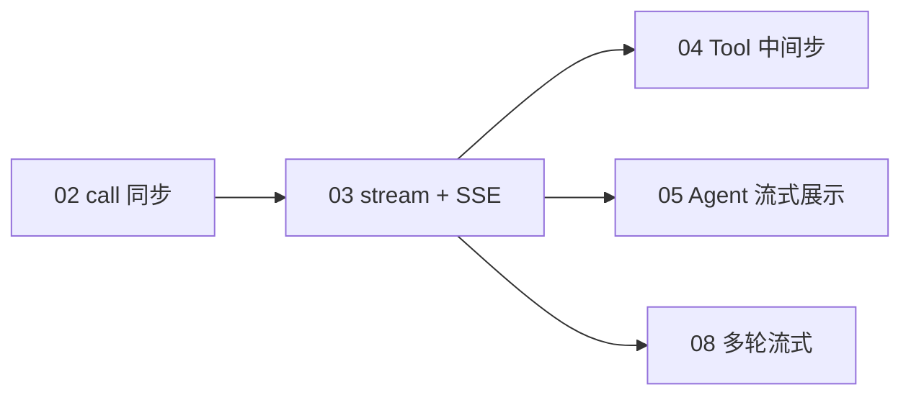
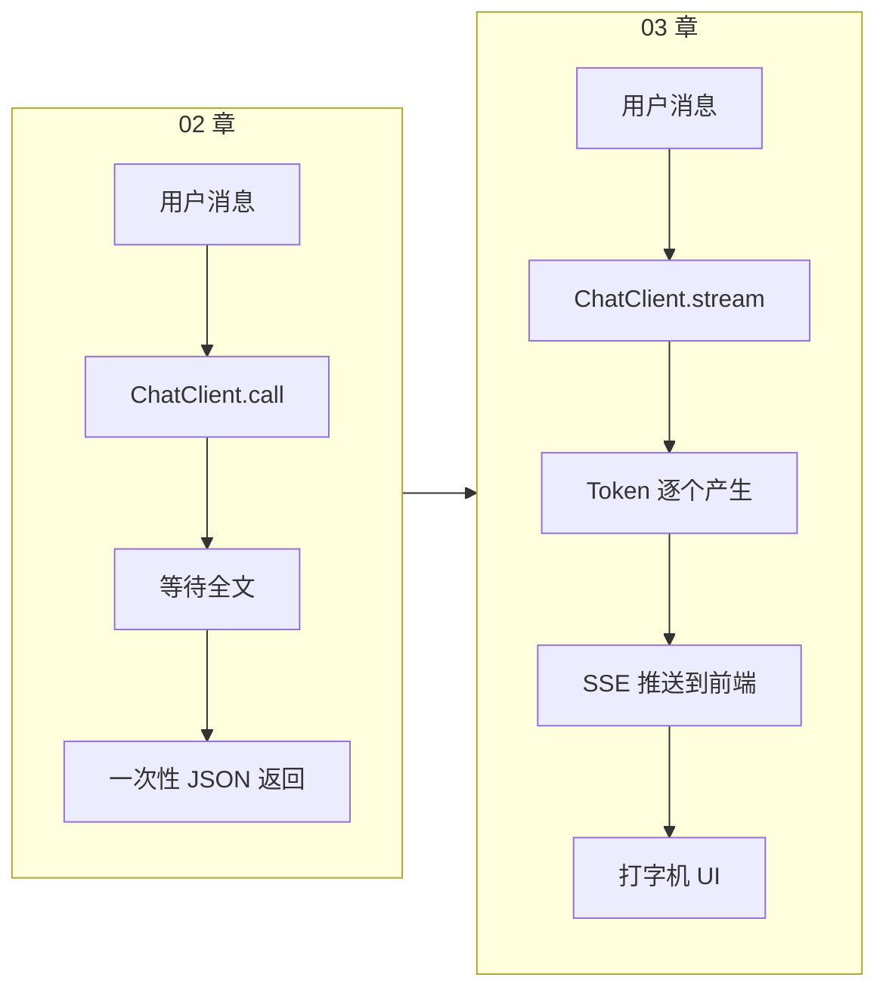
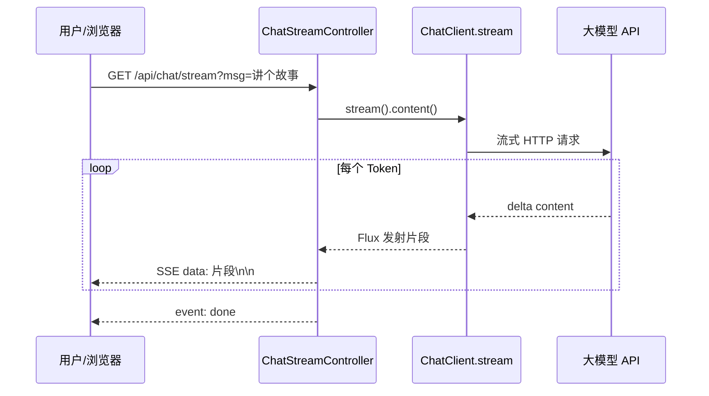
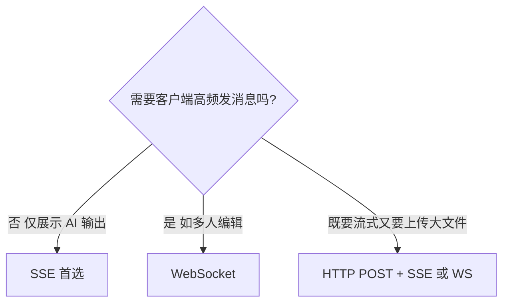
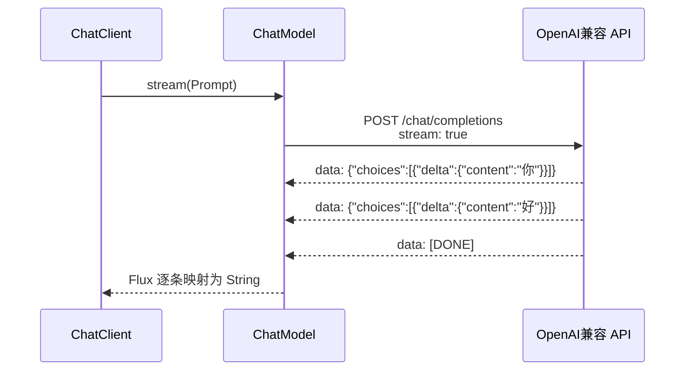
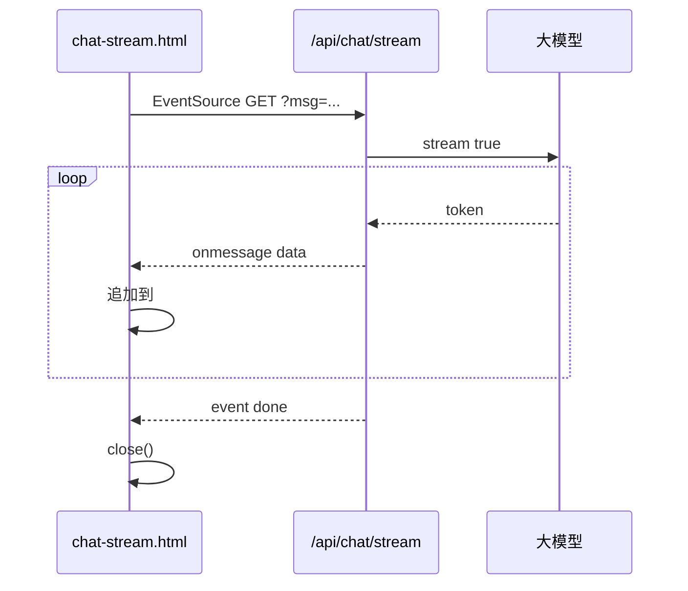
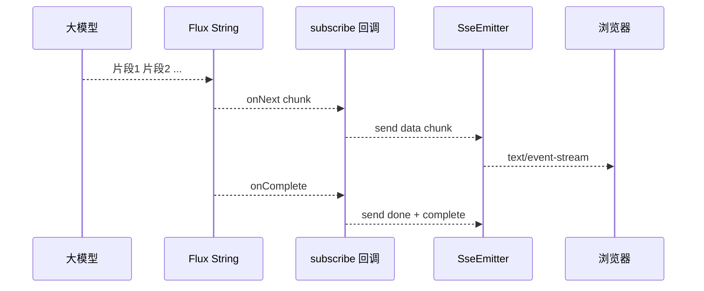

# 流式对话与 SSE 实战

> **文件编码**：UTF-8。本章在 [02 Spring AI 核心开发](./02-SpringAI核心开发.md) 的 `agent-demo` 基础上，新增 **SSE 流式 Chat 接口** 与前端打字机效果。
>
> **技术栈版本**：Spring Boot 3.2+、Spring AI 1.0.x、JDK 17+。

---

## 0. 读前导读（零基础也能跟上）

### 0.1 用一句话弄懂本章

**一句话**：把 02 章「等全文返回」改成 **边生成边推送**——后端用 `stream().content()` 拿到 `Flux`，再通过 **SSE** 一行行推给浏览器，实现 ChatGPT 式打字机效果。

**生活类比**：02 章像等外卖员 **整单送到** 才开门；本章像外卖 App **实时显示骑手位置**，你知道「正在做、快到了」。

**为什么重要**：长回答非流式 TTFT 可达 5～20 秒，用户以为卡死；流式是 modern Chat 产品标配，03 章也是 05 章 Agent 展示推理过程的基础。

---

### 0.2 你需要提前知道什么（真不会就先跳到哪一章）

| 条件 | 动作 |
|------|------|
| 02 章 `POST /api/chat` 未跑通 | **先完成** [02 Spring AI 核心开发](./02-SpringAI核心开发.md) §12 |
| 不懂 HTTP Content-Type | 浏览 [计网 04 HTTP](../../前端学习/计算机网络/04-HTTP协议深入.md) POST 与响应头 |
| 没写过 JavaScript | §9 HTML 示例可只测 curl；前端部分可后补 |
| 已会 ChatClient.call | 从 §4 直接跟做 SSE |

---

### 0.3 本章知识地图（学完后应能勾选全部 ☐→☑）

- [ ] 解释 TTFT 与非流式/流式的 UX 差异
- [ ] 说出 SSE 响应头 `Content-Type: text/event-stream` 的含义
- [ ] 写出 `chatClient.prompt().user().stream().content()` 返回类型
- [ ] 用 `SseEmitter` + 异步线程桥接 `Flux<String>`
- [ ] 用 `curl -N` 实时看到多行 `data:`
- [ ] 用 `EventSource` 或 static HTML 实现打字机
- [ ] 配置 CORS 完成前后端分离联调
- [ ] 处理超时、客户端断开、模型异常三种结束路径
- [ ] 说明 SSE 与 WebSocket 在 Chat 场景的选型理由
- [ ] 知道 Nginx `proxy_buffering off` 对流式的意义

---

### 0.4 SSE 协议速查（本章必认的 HTTP 格式）

**术语（SSE / Server-Sent Events）**：服务器通过 **保持打开的 HTTP 连接**，按文本格式一行行推送事件给浏览器。

**典型响应头**：

```http
HTTP/1.1 200 OK
Content-Type: text/event-stream
Cache-Control: no-cache
Connection: keep-alive
```

**典型响应体片段**：

```text
data: 你

data: 好

event: done
data: [DONE]

```

| 字段 | 含义 | 改错会怎样 |
|------|------|------------|
| `data:` | 一条事件的数据行 | 漏空行 `\n\n` 浏览器不触发 |
| `event:` | 自定义事件名（如 `done`） | 前端需 `addEventListener('done')` |
| `text/event-stream` | 告诉客户端按 SSE 解析 | 写成 `application/json` 则 EventSource 失败 |

Spring AI 侧：`stream: true` 的厂商 HTTP 流 → Spring AI 解析 → `Flux<String>` → 你的 `SseEmitter.send()`。

---

### 0.5 建议学习时长与节奏

| 阶段 | 时间 | 内容 |
|------|------|------|
| §1～§3 概念 | 45 分钟 | TTFT、SSE vs WebSocket |
| §4～§6 API | 1 小时 | stream、SseEmitter、异步 |
| §7 手把手 | 2～3 小时 | 完整接入 agent-demo |
| §8～§9 联调 | 1 小时 | curl -N + HTML |
| FAQ + 自测 | 30 分钟 | 闭卷 + 费曼 |

**节奏**：先 `curl -N` 看到流，再加 HTML；不要一上来写 Vue。

---

### 0.6 学完本章你能做什么（可验证的具体动作）

1. 访问 `GET /api/chat/stream?msg=你好`，`curl -N` **1 秒内**出现第一行 `data:`。
2. 打开 `chat-stream.html`，点击发送后文字 **逐字追加**，非一次性弹出。
3. 点击「停止」后 Network 里 EventSource 连接关闭，后端 `send()` 不再抛错。
4. 能向同事解释：流式 **不减少 Token 总量**，只改善 **首字延迟感知**。
5. 故意去掉 `produces = TEXT_EVENT_STREAM_VALUE`，观察错误并修复。

---

### 0.7 本章与 02 章代码差异一览

| 02 章 | 03 章 |
|-------|-------|
| `.call().content()` → `String` | `.stream().content()` → `Flux<String>` |
| `POST /api/chat` JSON 一次返回 | `GET /api/chat/stream` 长连接 |
| `application/json` | `text/event-stream` |
| Tomcat 线程阻塞数秒 | 异步线程 + subscribe，释放工作线程 |

---

### 0.8 学习路径示意



---

## 本章与上一章的关系

[02 章](./02-SpringAI核心开发.md) 你已经能用 `ChatClient` 调通 **非流式** 对话：

```java
String reply = chatClient.prompt().user("你好").call().content();
```

用户发一条消息，等模型 **全部生成完** 才返回一整段 JSON——对于短回复还行，一旦回答几百上千字，用户会盯着空白页面 **等 5～15 秒**，体验很差。

**本章要解决的问题**：

| 02 章产出 | 03 章新增 |
|-----------|-----------|
| `POST /api/chat` 一次性返回全文 | `GET /api/chat/stream` **边生成边推送** |
| `call().content()` | `stream().content()` 返回 `Flux<String>` |
| 普通 `application/json` 响应 | `text/event-stream`（SSE）长连接 |
| Postman 看完整 JSON | `curl -N` / 浏览器 `EventSource` 逐字显示 |



学完本章，你的 `agent-demo` 将具备 **现代 Chat 产品标配的流式体验**——这也是后续 RAG 问答（06～07 章）和 Agent 多步推理（05 章）的前端展示基础。

**前置知识**：

- [Java 04 Spring Boot 核心开发](../Java/04-SpringBoot核心开发.md)（Controller、CORS）
- [02 章](./02-SpringAI核心开发.md)（ChatClient、application.yml 配好 LLM）
- 建议浏览 [计网 04 HTTP 协议](../../前端学习/计算机网络/04-HTTP协议深入.md) 中关于 **长连接、Content-Type** 的章节

---

## 1. 为什么 LLM 对话必须做流式？

### 1.1 非流式的痛点

大模型生成文本是 **自回归** 的：每输出一个 Token，都要基于前面所有 Token 再算下一个。一篇 500 字的回答，模型可能要 **串行计算几百次**。

非流式 API 的行为：

```text
客户端 ──请求──► 服务端 ──请求──► LLM
                                    │
                    （等待全部 Token 生成完毕）
                                    │
客户端 ◄──整段 JSON── 服务端 ◄──────┘
```

用户感知：**长时间无反馈 → 突然整段文字出现**。

### 1.2 两个核心指标

#### TTFT（Time To First Token，首 Token 延迟）

从用户按下发送到 **屏幕上出现第一个字** 的时间。

| 模式 | 典型 TTFT | 用户感受 |
|------|-----------|----------|
| 非流式 | 等于全文生成时间（3～20s） | 「卡死了？」 |
| 流式 | 通常 0.3～2s | 「有反应了，在写」 |

**结论**：流式不会让总生成时间变短，但 **极大降低「空白等待」的心理成本**。

#### 感知延迟 vs 实际延迟

人脑对 **持续有变化** 的界面容忍度更高——看着字一个个出来，比盯着转圈 10 秒舒服得多。ChatGPT、DeepSeek、通义千问网页版全部是流式，这不是巧合。

### 1.3 流式对后端架构的影响



后端需要：

1. **保持 HTTP 连接不立刻关闭**（与普通 REST 不同）
2. 把 Spring AI 的 `Flux<String>` **桥接** 到 SSE 或 chunked 响应
3. 处理 **超时、客户端断开、模型报错** 等边界情况

---

## 2. SSE（Server-Sent Events）基础

### 2.1 什么是 SSE？

SSE 是 HTML5 标准的一种 **服务器 → 客户端单向推送** 机制，基于普通 HTTP，响应头：

```http
Content-Type: text/event-stream
Cache-Control: no-cache
Connection: keep-alive
```

消息格式（文本，UTF-8）：

```text
data: 你

data: 好

data: ！

event: done
data: [DONE]

```

规则要点：

- 每条消息以 **空行**（`\n\n`）结束
- 默认事件名是 `message`；可用 `event: xxx` 自定义
- 可用 `id:` 和 `retry:` 辅助断线重连
- 一行 `data:` 过长时可写多行 `data:`，浏览器会拼接

### 2.2 浏览器端：EventSource API

```javascript
const es = new EventSource('/api/chat/stream?msg=你好');
es.onmessage = (e) => {
  document.getElementById('out').textContent += e.data;
};
es.addEventListener('done', () => es.close());
es.onerror = () => { /* 连接异常 */ };
```

**注意**：原生 `EventSource` **只支持 GET**，不能自定义 Header（例如带 JWT）。生产环境若需 `Authorization`，常见方案：

- Query 参数带短期 token（注意安全）
- 改用 `fetch` + `ReadableStream` 读 SSE（Vue 08 章 Axios 思路延伸）
- 同域 Cookie Session

### 2.3 SSE 与 HTTP 长轮询、Chunked 的关系

| 方式 | 说明 |
|------|------|
| 长轮询 | 客户端反复发请求「有新消息吗」——浪费连接 |
| Chunked Transfer | HTTP 分块传 body，不限于 `text/event-stream` |
| SSE | Chunked + **约定好的事件格式** + 浏览器内置 `EventSource` |

Spring 的 `SseEmitter` 和 `produces = TEXT_EVENT_STREAM_VALUE` 本质上都是在 HTTP 上推 **符合 SSE 规范** 的文本流。

---

## 3. SSE vs WebSocket：Chat 场景怎么选？

本章做 **Agent 对话流式输出**，默认用 **SSE** 即可。系统对比见下表；更完整的原理与代码见 [Java 16 SSE 与 WebSocket](../Java/16-SSE与WebSocket实时通信.md)（若尚未编写，可先读 [计网 07 面试专题](../../前端学习/计算机网络/07-面试专题与知识点总表.md) §26）。

| 维度 | SSE | WebSocket |
|------|-----|-----------|
| 方向 | **单向**（服→客） | **双向** |
| 协议 | 普通 HTTP | 升级协议 `ws://` |
| 浏览器 API | `EventSource`（简单） | `WebSocket` |
| 穿透代理/防火墙 | 友好（就是 HTTP） | 部分老旧代理需配置 |
| 自动重连 | 内置 | 需自己实现 |
| 自定义 Header | 原生 EventSource 不行 | 握手时可带 |
| 适合场景 | AI 打字机、股票行情推送 | 在线协作、游戏、IM 双向 |



**Agent Chat 典型路径**：用户消息用普通 `POST /api/chat`（或 POST 后返回 stream URL），AI 回复用 **SSE 推流**——单向数据为主，SSE 最简单。

---

## 4. Spring AI 流式 API 详解

### 4.1 从 call 到 stream

```java
// 非流式（02 章）
String full = chatClient.prompt()
    .user("用三句话介绍 Redis")
    .call()
    .content();

// 流式（本章）
Flux<String> flux = chatClient.prompt()
    .user("用三句话介绍 Redis")
    .stream()
    .content();
```

`Flux<String>` 来自 **Project Reactor**（响应式流）。每收到模型的一个 **文本片段**（可能是一个字、一个词），`Flux` 就 `emit` 一次。

### 4.2 底层发生了什么？



Spring AI 帮你解析了 OpenAI 风格的 **SSE 流式响应**，统一成 `Flux<String>`，你不用自己拼 JSON。

### 4.3 同步 MVC 与 WebFlux 两条路

| 路线 | 依赖 | Controller 返回类型 | 适用 |
|------|------|---------------------|------|
| **Spring MVC + SseEmitter** | `spring-boot-starter-web` | `SseEmitter` | 与 02 章 demo 一致，**本章主推** |
| **WebFlux** | `spring-boot-starter-webflux` | `Flux<ServerSentEvent<String>>` | 全栈响应式、高并发网关 |

大多数 `agent-demo` 用 **MVC + SseEmitter** 就够了；WebFlux 在本章 §8 简要介绍，不必强行迁移。

---

## 5. 方案一：SseEmitter（Spring MVC 主推）

### 5.1 核心思路

1. Controller 方法返回 `SseEmitter`
2. 在 **异步线程** 里订阅 `chatClient.stream().content()`
3. 每收到一段 `String`，`emitter.send(SseEmitter.event().data(chunk))`
4. 流结束：`emitter.complete()`；异常：`emitter.completeWithError(e)`

### 5.2 为什么必须异步？

`stream().content()` 是 **长时间运行** 的。若在 Tomcat **工作线程** 里阻塞订阅，会占满线程池，并发用户稍多就卡死。

正确做法：

```java
Executors.newVirtualThreadPerTaskExecutor().execute(() -> {
    flux.subscribe(
        chunk -> emitter.send(SseEmitter.event().data(chunk)),
        emitter::completeWithError,
        emitter::complete
    );
});
```

JDK 21 可用 **虚拟线程**；JDK 17 用 `Executors.newCachedThreadPool()` 亦可。

### 5.3 超时设置

```java
SseEmitter emitter = new SseEmitter(120_000L); // 120 秒无活动则超时
emitter.onTimeout(emitter::complete);
emitter.onError(ex -> emitter.complete());
```

LLM 生成长文可能超过 30 秒，建议 **60～180 秒**，并与网关/Nginx 的 `proxy_read_timeout` 对齐（部署见 [Java 09](../Java/09-LinuxDockerNginx部署基础.md)）。

---

## 6. 方案二：WebFlux 返回 Flux（可选）

若项目已引入 `spring-boot-starter-webflux`，可写：

```java
@GetMapping(value = "/api/chat/stream-flux", produces = MediaType.TEXT_EVENT_STREAM_VALUE)
public Flux<ServerSentEvent<String>> streamFlux(@RequestParam String msg) {
    return chatClient.prompt()
        .user(msg)
        .stream()
        .content()
        .map(chunk -> ServerSentEvent.builder(chunk).build())
        .concatWith(Flux.just(ServerSentEvent.builder("[DONE]").event("done").build()));
}
```

**注意**：不要 **同时** 引入 `spring-boot-starter-web` 和 `webflux` 并期望自动混用无冲突——Boot 3 默认仍以 MVC 为主。`agent-demo` 建议只走 SseEmitter 路线。

---

## 7. 手把手：在 agent-demo 接入 SSE（§2.1）

| 步骤 | 你的动作 | 预期看到什么 | 若不对 |
|------|----------|--------------|--------|
| 1 | 确认 02 章 `POST /api/chat` 可用 | 非流式 JSON 正常 | 先完成 [02 §12](./02-SpringAI核心开发.md) |
| 2 | 新建 `ChatStreamService`、`ChatStreamController`（§7.4～7.5） | 编译通过 | 检查 `@Bean ChatClient` 是否存在 |
| 3 | `application.yml` 增加 `app.sse.timeout-ms: 120000` | 配置被 `@Value` 读取 | 默认 120000 亦可 |
| 4 | 添加 `CorsConfig` 或 `@CrossOrigin` | 浏览器跨域不报错 | 见 §15 CORS 行 |
| 5 | `mvn spring-boot:run` | 8080 启动成功 | Key/Ollama 问题见 02 章 §16 |
| 6 | `curl -N "http://localhost:8080/api/chat/stream?msg=你好"` | **连续**多行 `data:`，非一次性 | 忘 `-N` 见 §8.4 |
| 7 | 浏览器打开 `static/chat-stream.html` | 打字机逐字追加 | 404 检查 static 路径 |
| 8 | 点「停止」关闭 EventSource | Network 连接结束 | 见 §11.2 dispose |

### 7.1 确认 02 章基线

确保已有：

- `pom.xml` 含 `spring-ai-openai-spring-boot-starter`（或 Ollama starter）
- `ChatClient` Bean（`AiConfig`）
- `POST /api/chat` 能非流式对话

若还没有，请先完成 [02 章 §2.1](./02-SpringAI核心开发.md)。

### 7.2 目录结构（本章新增）

```text
agent-demo/
├── src/main/java/com/example/agent/
│   ├── config/
│   │   ├── AiConfig.java
│   │   └── CorsConfig.java          ← 本章新增/完善
│   ├── controller/
│   │   ├── ChatController.java      ← 02 章
│   │   └── ChatStreamController.java ← 本章核心
│   ├── dto/
│   │   └── ChatStreamRequest.java   ← 可选，POST 流式时用
│   └── service/
│       └── ChatStreamService.java   ← 推荐抽离流式逻辑
└── src/main/resources/
    ├── application.yml
    └── static/
        └── chat-stream.html         ← 测试页
```

### 7.3 application.yml 补充

```yaml
server:
  port: 8080
  # Tomcat 对 SSE 一般无需特殊配置；前面有 Nginx 时需调大超时

spring:
  ai:
    openai:
      api-key: ${DEEPSEEK_API_KEY}
      base-url: https://api.deepseek.com
      chat:
        options:
          model: deepseek-chat
          temperature: 0.7

# 自定义：SSE 超时毫秒
app:
  sse:
    timeout-ms: 120000
```

### 7.4 ChatStreamService（完整）

```java
package com.example.agent.service;

import org.springframework.ai.chat.client.ChatClient;
import org.springframework.beans.factory.annotation.Value;
import org.springframework.stereotype.Service;
import org.springframework.web.servlet.mvc.method.annotation.SseEmitter;
import reactor.core.publisher.Flux;

import java.io.IOException;
import java.util.concurrent.ExecutorService;
import java.util.concurrent.Executors;

@Service
public class ChatStreamService {

    private final ChatClient chatClient;
    private final long sseTimeoutMs;
    private final ExecutorService executor = Executors.newVirtualThreadPerTaskExecutor();

    public ChatStreamService(
            ChatClient chatClient,
            @Value("${app.sse.timeout-ms:120000}") long sseTimeoutMs) {
        this.chatClient = chatClient;
        this.sseTimeoutMs = sseTimeoutMs;
    }

    public SseEmitter streamChat(String userMessage) {
        SseEmitter emitter = new SseEmitter(sseTimeoutMs);

        emitter.onTimeout(() -> {
            try {
                emitter.send(SseEmitter.event().name("error").data("SSE timeout"));
            } catch (IOException ignored) {}
            emitter.complete();
        });

        emitter.onCompletion(() -> { /* 可打日志：客户端断开或正常结束 */ });

        executor.execute(() -> doStream(userMessage, emitter));

        return emitter;
    }

    private void doStream(String userMessage, SseEmitter emitter) {
        Flux<String> flux = chatClient.prompt()
                .user(userMessage)
                .stream()
                .content();

        flux.subscribe(
                chunk -> {
                    try {
                        emitter.send(SseEmitter.event().data(chunk));
                    } catch (IOException e) {
                        // 客户端已关闭连接（用户关页面、刷新）
                        emitter.complete();
                    }
                },
                err -> {
                    try {
                        emitter.send(SseEmitter.event()
                                .name("error")
                                .data("模型调用失败: " + err.getMessage()));
                    } catch (IOException ignored) {}
                    emitter.completeWithError(err);
                },
                () -> {
                    try {
                        emitter.send(SseEmitter.event().name("done").data("[DONE]"));
                    } catch (IOException ignored) {}
                    emitter.complete();
                }
        );
    }
}
```

### 7.4.1 逐行读代码：ChatStreamService

| 行号/代码 | 含义 | 改错会怎样 |
|-----------|------|------------|
| `SseEmitter emitter = new SseEmitter(sseTimeoutMs)` | 创建 SSE 发射器，超时毫秒 | 超时过短长文被掐断 |
| `emitter.onTimeout(...)` | 超时回调，发 error 事件 | 未注册则客户端一直 pending |
| `Executors.newVirtualThreadPerTaskExecutor()` | JDK 21 虚拟线程跑 subscribe | JDK 17 改用 `newCachedThreadPool()` |
| `executor.execute(() -> doStream(...))` | **异步**订阅 Flux，不阻塞 Tomcat 线程 | 同步 subscribe 占满线程池 |
| `.stream().content()` | Spring AI 流式，返回 `Flux<String>` | 写成 `.call()` 则 SSE 无分段 |
| `flux.subscribe(chunk -> emitter.send(...))` | 每片段推一条 SSE `data:` | send 不 catch IOException 则客户端断开打 ERROR |
| `() -> emitter.send(...event("done")...)` | 正常结束自定义事件 | 前端可 `addEventListener('done')` |
| `completeWithError(err)` | 模型异常路径 | 应对前端发友好 error 事件 |

### 7.5 ChatStreamController（完整）

```java
package com.example.agent.controller;

import com.example.agent.service.ChatStreamService;
import jakarta.validation.constraints.NotBlank;
import org.springframework.http.MediaType;
import org.springframework.validation.annotation.Validated;
import org.springframework.web.bind.annotation.GetMapping;
import org.springframework.web.bind.annotation.RequestMapping;
import org.springframework.web.bind.annotation.RequestParam;
import org.springframework.web.bind.annotation.RestController;
import org.springframework.web.servlet.mvc.method.annotation.SseEmitter;

@RestController
@RequestMapping("/api/chat")
@Validated
public class ChatStreamController {

    private final ChatStreamService chatStreamService;

    public ChatStreamController(ChatStreamService chatStreamService) {
        this.chatStreamService = chatStreamService;
    }

    /**
     * GET 便于浏览器 EventSource 直接联调。
     * 生产环境更长用户输入建议改 POST + fetch 读流（见 §10.3）。
     */
    @GetMapping(value = "/stream", produces = MediaType.TEXT_EVENT_STREAM_VALUE)
    public SseEmitter stream(@RequestParam @NotBlank String msg) {
        return chatStreamService.streamChat(msg);
    }
}
```

### 7.5.1 逐行读代码：ChatStreamController

| 行号/代码 | 含义 | 改错会怎样 |
|-----------|------|------------|
| `@RequestMapping("/api/chat")` | 与 02 章同前缀，路径 `/stream` | 改前缀需同步前端 URL |
| `produces = MediaType.TEXT_EVENT_STREAM_VALUE` | 响应 Content-Type 为 SSE | 漏了 Spring 当 JSON 序列化 SseEmitter |
| `@GetMapping(value = "/stream", ...)` | GET 便于 `EventSource` | POST 需 fetch 读流（§10.2） |
| `@RequestParam @NotBlank String msg` | query 参数 msg | 缺参 400；中文需 URL 编码 |
| `return chatStreamService.streamChat(msg)` | 立即返回 emitter，连接保持 | 在 Controller 里 subscribe 会阻塞 |

### 7.6 CorsConfig（SSE 联调必备）

前后端分离时，浏览器会对 SSE 做 **跨域检查**：

```java
package com.example.agent.config;

import org.springframework.context.annotation.Bean;
import org.springframework.context.annotation.Configuration;
import org.springframework.web.cors.CorsConfiguration;
import org.springframework.web.cors.UrlBasedCorsConfigurationSource;
import org.springframework.web.filter.CorsFilter;

import java.util.List;

@Configuration
public class CorsConfig {

    @Bean
    public CorsFilter corsFilter() {
        CorsConfiguration config = new CorsConfiguration();
        config.setAllowCredentials(true);
        config.setAllowedOriginPatterns(List.of("http://localhost:*", "http://127.0.0.1:*"));
        config.setAllowedHeaders(List.of("*"));
        config.setAllowedMethods(List.of("GET", "POST", "OPTIONS"));

        UrlBasedCorsConfigurationSource source = new UrlBasedCorsConfigurationSource();
        source.registerCorsConfiguration("/api/**", config);
        return new CorsFilter(source);
    }
}
```

> 全局 `@CrossOrigin` 加在 `ChatStreamController` 上也可以快速测试：`@CrossOrigin(origins = "http://localhost:5173")`（Vue 默认端口）。

### 7.7 启动验证

```powershell
cd agent-demo
$env:DEEPSEEK_API_KEY="sk-xxx"
mvn spring-boot:run
```

---

## 8. 用 curl 测试 SSE（必会）

### 8.1 为什么加 `-N`？

`curl` 默认会 **缓冲** 输出，等连接关闭才一次性打印。SSE 必须 **无缓冲** 实时看：

```bash
curl -N "http://localhost:8080/api/chat/stream?msg=用一句话介绍Spring%20Boot"
```

### 8.2 预期输出（示意）

```text
data:Spring

data: Boot

data: 是

data: 用于

data: 快速

data: 开发

data: Java

data: Web

data: 应用

data: 的

data: 框架

data: 。

event:done
data:[DONE]

```

**说明**：

- 实际 `data:` 切分粒度取决于模型与 Spring AI 映射，可能是单字、词或短语
- 看到 **多行** `data:` 且逐渐增多，即流式成功
- 末尾 `event:done` 来自我们 Service 里的自定义事件

### 8.3 带 System Prompt 的流式（扩展）

在 Service 中链式加：

```java
chatClient.prompt()
    .system("你是简洁的技术助手，回答不超过 100 字。")
    .user(userMessage)
    .stream()
    .content();
```

### 8.4 常见 curl 问题

| 现象 | 原因 |
|------|------|
| 等很久才一次性输出 | 忘了 `-N` |
| `Connection reset` | 后端异常或 API Key 无效 |
| 只有 `data:` 空 | 模型返回空 choices，查 Key 与 base-url |

---

## 9. 前端：HTML EventSource 示例

在 `src/main/resources/static/chat-stream.html`：

```html
<!DOCTYPE html>
<html lang="zh-CN">
<head>
  <meta charset="UTF-8" />
  <title>Agent SSE 打字机</title>
  <style>
    body { font-family: system-ui, sans-serif; max-width: 640px; margin: 2rem auto; }
    #output { white-space: pre-wrap; border: 1px solid #ddd; padding: 1rem; min-height: 120px; }
    input { width: 70%; padding: 0.5rem; }
    button { padding: 0.5rem 1rem; }
  </style>
</head>
<body>
  <h1>流式对话 Demo</h1>
  <input id="msg" placeholder="输入问题" value="讲一个关于程序员的冷笑话" />
  <button id="send">发送</button>
  <button id="stop">停止</button>
  <div id="output"></div>

  <script>
    let es = null;

    document.getElementById('send').onclick = () => {
      const msg = encodeURIComponent(document.getElementById('msg').value);
      document.getElementById('output').textContent = '';
      if (es) es.close();

      es = new EventSource(`http://localhost:8080/api/chat/stream?msg=${msg}`);

      es.onmessage = (e) => {
        document.getElementById('output').textContent += e.data;
      };

      es.addEventListener('done', () => {
        es.close();
        es = null;
      });

      es.addEventListener('error', (e) => {
        console.error('SSE error event', e);
      });

      es.onerror = () => {
        // 网络断开或服务器结束
        if (es) es.close();
      };
    };

    document.getElementById('stop').onclick = () => {
      if (es) { es.close(); es = null; }
    };
  </script>
</body>
</html>
```

浏览器访问：`http://localhost:8080/chat-stream.html`



---

## 10. Vue 3 中消费 SSE（简述）

完整 Axios / 联调基础见 [Vue 08 Axios 与前后端联调](../../前端学习/Vue/08-Axios网络请求与前后端联调.md)。SSE 与 Axios 的关系：

- **Axios 不适合** 标准 SSE（它等完整 response）
- 短方案：`EventSource`（仅 GET）
- 长方案：`fetch` + `ReadableStream` 解析 `text/event-stream`

### 10.1 组合式 API + EventSource

```vue
<script setup>
import { ref, onUnmounted } from 'vue'

const input = ref('你好')
const reply = ref('')
let es = null

function send() {
  reply.value = ''
  if (es) es.close()
  const url = `http://localhost:8080/api/chat/stream?msg=${encodeURIComponent(input.value)}`
  es = new EventSource(url)
  es.onmessage = (e) => { reply.value += e.data }
  es.addEventListener('done', () => { es?.close(); es = null })
}

onUnmounted(() => es?.close())
</script>

<template>
  <input v-model="input" />
  <button @click="send">流式提问</button>
  <pre>{{ reply }}</pre>
</template>
```

### 10.2 fetch 读流（可带 POST Body，进阶）

```javascript
async function streamPost(message) {
  const res = await fetch('/api/chat/stream', {
    method: 'POST',
    headers: { 'Content-Type': 'application/json' },
    body: JSON.stringify({ message })
  })
  const reader = res.body.getReader()
  const decoder = new TextDecoder()
  let buffer = ''
  while (true) {
    const { done, value } = await reader.read()
    if (done) break
    buffer += decoder.decode(value, { stream: true })
    // 按 \n\n 切分 SSE 事件并解析 data: 行
  }
}
```

Vue 项目用 Vite 代理时，在 `vite.config.js` 配置 `/api` → `8080`，避免 CORS。

---

## 11. 超时、错误处理与客户端断开

### 11.1 三类结束场景

| 场景 | 后端表现 | 建议处理 |
|------|----------|----------|
| 正常结束 | Flux complete | 发 `done` 事件，`emitter.complete()` |
| 模型/API 异常 | Flux error | `error` 事件 + 日志，勿泄露 Key |
| 客户端断开 | `send()` 抛 `IOException` | `complete()`，停止订阅浪费 Token |

### 11.2 取消订阅与成本

用户点「停止」或关页面后，应 **dispose** Reactor 订阅，否则后端仍可能继续收模型 Token **烧钱**：

```java
var subscription = flux.subscribe(...);
emitter.onCompletion(subscription::dispose);
emitter.onTimeout(() -> { subscription.dispose(); emitter.complete(); });
```

Spring AI 是否能把「取消」传给上游 API，取决于具体 `ChatModel` 实现；工程上 **务必** 在 `onCompletion` 里 dispose。

### 11.3 心跳（防代理断连）

经 Nginx 时，长时间无数据可能被掐断。可每 15s 发注释或心跳：

```java
// 伪代码：与 flux  merge 一个 interval 心跳
emitter.send(SseEmitter.event().comment("keepalive"));
```

Nginx 配置示例：

```nginx
proxy_http_version 1.1;
proxy_set_header Connection '';
proxy_buffering off;
proxy_cache off;
proxy_read_timeout 3600s;
```

### 11.4 错误信息对前端友好

```java
emitter.send(SseEmitter.event()
    .name("error")
    .data("服务繁忙，请稍后重试"));
emitter.complete();
```

不要把完整堆栈、API Key 发给浏览器。

---

## 12. CORS 与 SSE 特别注意

### 12.1 预检请求

`EventSource` 发的是 **简单 GET**，通常 **不会** 触发 OPTIONS 预检（无自定义 Header 时）。

若你用 `fetch` 流式 POST 且带 `Authorization`，会预检——`CorsConfig` 必须允许 `OPTIONS` 和对应 Header。

### 12.2 `Access-Control-Allow-Origin` 与 credentials

`EventSource` 默认 **不带** Cookie；若 `allowCredentials(true)`，`AllowedOrigin` 不能是 `*`，需明确域名。

### 12.3 与 Java 04 CORS 章节对齐

[Java 04 §50](../Java/04-SpringBoot核心开发.md) 讲过 `WebMvcConfigurer#addCorsMappings`；本章的 `CorsFilter` 与之等价，选一种即可，避免重复配置冲突。

---

## 13. 深入解释

### 13.1 为什么 SseEmitter 要 `produces = TEXT_EVENT_STREAM_VALUE`？

告诉 Spring MVC：**不要** 把返回值当普通 JSON 序列化，而是按 SSE 协议写 `HttpServletResponse` 的 `Content-Type` 和流式 body。

### 13.2 Tomcat 线程模型与虚拟线程

传统：每个 SSE 占一个 Tomcat 线程几十秒 → 线程池耗尽。  
JDK 21 `newVirtualThreadPerTaskExecutor()`：虚拟线程阻塞在 IO 上成本低，适合 IO 密集的 SSE 桥接。

### 13.3 流式与 Token 计费

流式 **不改变** Token 总数，只改变 **推送节奏**。账单仍按 prompt + completion tokens 算（见 [01 章 Token](./01-大模型基础与API调用入门.md)）。

### 13.4 缓冲：Nginx、CDN、浏览器

整条链路任何一层 **缓冲** 都会破坏打字机效果。排查时：

1. `curl -N` 正常 → 后端 OK
2. 浏览器不正常 → 查前端聚合逻辑或代理 `proxy_buffering`

### 13.5 SSE 与 HTTP/2

HTTP/2 多路复用下 SSE 仍可用；HTTP/3（QUIC）亦可。面试可答：SSE 是 **应用层格式**，底下 TCP/QUIC 均可。

---

## 14. 生产化清单（预览，11 章展开）

- [ ] 限流：按 IP / 用户限制并发流（Redis 计数，衔接 [Java 07](../Java/07-Redis核心原理与缓存实战.md)）
- [ ] 鉴权：JWT + fetch 流式，或短期 stream token
- [ ] 超时与最大输出 Token
- [ ] 日志：记录首 Token 延迟、总耗时
- [ ] 监控：SSE 连接数、异常率

---

## 15. 常见报错与排查

| 报错信息（关键词） | 可能原因 | 解决方案 |
|-------------------|---------|---------|
| `curl` 长时间无输出后一次性显示 | 未加 `-N` / 缓冲 | 使用 `curl -N`；检查 Nginx `proxy_buffering off` |
| `MediaType APPLICATION_JSON` 与 SSE 混用 | `produces` 未指定 | 加 `produces = MediaType.TEXT_EVENT_STREAM_VALUE` |
| `AsyncRequestTimeoutException` | SseEmitter 超时太短 | 增大 `new SseEmitter(120_000L)` 与 `app.sse.timeout-ms` |
| `IOException: Broken pipe` | 客户端断开 | 正常；`send` 捕获后 `complete()`，勿打 ERROR 吓自己 |
| 浏览器 `EventSource` CORS 错误 | 跨域未配 | 配 `CorsFilter` 或 Vite 代理；检查 `Allow-Origin` |
| 前端只收到一条空 `data` | API Key 无效或模型名为空 | 查 `spring.ai.openai.api-key`、日志里 RestClient 异常 |
| `Whitelabel Error Page` 404 | 路径错误 | 确认 `/api/chat/stream` 与 Controller `@RequestMapping` |
| `Required request parameter 'msg'` | 缺少 query | EventSource URL 带 `?msg=` 且 UTF-8 编码 |
| 流式卡住不动 | 公司代理缓冲 | 换网络、`curl` 直连排查；关闭代理缓冲 |
| `BeanNotOfRequiredTypeException` ChatClient | 02 章 Bean 未配 | 检查 `AiConfig` 是否 `@Bean ChatClient` |
| 中文乱码 | 编码不一致 | 确保 UTF-8；`server.servlet.encoding.charset=UTF-8` |
| 并发高时 Tomcat 线程耗尽 | 同步阻塞 stream | 异步线程/虚拟线程执行 `subscribe` |
| Vue 开发环境连不上 | 端口/代理 | `vite.config.js` proxy `/api`；或 Cors 允许 5173 |

---

## 16. 分级练习

### 基础

用 `curl -N` 调通 `GET /api/chat/stream`，能看到 **至少 5 次** 以上的 `data:` 行。

### 进阶

用 `static/chat-stream.html` 或 Vue 页面实现打字机；发送后 **停止** 按钮能 `close()` EventSource。

### 挑战

1. 增加 `POST /api/chat/stream`，Body 为 `{ "message": "...", "conversationId": "..." }`（conversationId 先占位，08 章接 Redis）
2. 实现简单 **断线重连**：记录已显示字数，重连时 query 带 `offset`（需后端支持续传或重新生成——可先做「提示用户重新问」）

---

## 17. 练习参考答案

### 基础参考答案

```bash
curl -N "http://localhost:8080/api/chat/stream?msg=数到10"
```

成功标志：终端 **连续** 刷出多行 `data:`，而非等待 10s 后一行。

### 进阶参考答案

在 `chat-stream.html` 的 `stop` 按钮：

```javascript
document.getElementById('stop').onclick = () => {
  if (es) { es.close(); es = null; }
};
```

浏览器 Network 面板：请求类型 `eventsource`，状态 `pending` 一段时间后结束。

### 挑战参考答案（POST + fetch 骨架）

**Controller**：

```java
@PostMapping(value = "/stream", produces = MediaType.TEXT_EVENT_STREAM_VALUE)
public SseEmitter streamPost(@Valid @RequestBody ChatStreamRequest req) {
    return chatStreamService.streamChat(req.getMessage());
}
```

**DTO**：

```java
public class ChatStreamRequest {
    @NotBlank
    private String message;
    private String conversationId;
    // getter/setter
}
```

前端用 §10.2 `fetch` + `ReadableStream` 解析；`conversationId` 在 08 章接入 [Redis 会话](./08-对话记忆与会话管理.md)。

---

## 18. 学完标准

- [ ] 能解释 **TTFT** 与流式对 UX 的价值
- [ ] 能说明 **SSE vs WebSocket** 在 Chat 场景的选型理由
- [ ] 能手写 `ChatClient.prompt().user().stream().content()` 并桥接到 `SseEmitter`
- [ ] 能用 `curl -N` 验证流式输出
- [ ] 能用 `EventSource` 或 Vue 实现打字机
- [ ] 能配置 **CORS** 完成前后端分离联调
- [ ] 能处理 **超时、客户端断开、模型异常** 三种结束路径
- [ ] 知道 Nginx `proxy_buffering off` 与 `proxy_read_timeout` 的作用

---

## 19. 面试速记卡

| 问题 | 要点 |
|------|------|
| 为什么 Chat 要流式？ | 降低首字延迟感知，提升 UX；总时间不变 |
| SSE 协议格式？ | `text/event-stream`，`data:` + 空行，可 `event:` |
| SSE 和 WebSocket？ | 单向用 SSE 简单；双向 IM 用 WS |
| Spring 怎么实现？ | SseEmitter + 异步订阅 Flux；或 WebFlux `TEXT_EVENT_STREAM` |
| 客户端断开怎么感知？ | `send()` IOException；`onCompletion` 回调 |
| 如何压测 SSE？ | 注意连接数、线程/虚拟线程、上游 LLM  QPS 限额 |

---

## 20. 交叉链接

| 相关模块 | 链接 |
|----------|------|
| 上一章 Spring AI | [02 Spring AI 核心开发](./02-SpringAI核心开发.md) |
| 下一章 Tool 调用 | [04 Function Calling 与 Tool 设计](./04-FunctionCalling与Tool设计.md) |
| Spring Boot / CORS | [Java 04](../Java/04-SpringBoot核心开发.md) |
| SSE/WebSocket 系统讲 | [Java 16](../Java/16-SSE与WebSocket实时通信.md) |
| HTTP / 长连接概念 | [计网 04](../../前端学习/计算机网络/04-HTTP协议深入.md)、[计网 07](../../前端学习/计算机网络/07-面试专题与知识点总表.md) |
| Vue 联调 | [Vue 08](../../前端学习/Vue/08-Axios网络请求与前后端联调.md) |
| Redis 限流（扩展） | [Java 07](../Java/07-Redis核心原理与缓存实战.md) |
| 路线图 | [AIAgent 00](./00-学习路线图与说明.md) |

---

## 下一章预告

[04 Function Calling 与 Tool 设计](./04-FunctionCalling与Tool设计.md) 将让模型 **不只说话，还能调你的 Java 代码**：查天气、查 MySQL 订单。流式对话解决「怎么显示」；Tool 解决「怎么行动」——二者在完整 Agent 里 **并存**（边调 Tool 边流式输出思考过程，05 章 ReAct 展开）。

---

## 我的笔记区

```text
本章完成日期：
使用的测试方式（curl / HTML / Vue）：
SSE 超时配置：
遇到的 CORS 问题：
Nginx 是否已测 proxy_buffering off：
```

---

## 21. 扩展阅读：多轮流式与 Tool 流式（预告）

### 21.1 多轮 history 流式

08 章会在 `ChatClient` 里加 `Message` 历史：

```java
chatClient.prompt()
    .messages(history)  // User / Assistant 交替
    .user(newUserMsg)
    .stream()
    .content();
```

SSE 层 **不用改**——仍是 `Flux` → `SseEmitter`；变的是 Prompt 构造。

### 21.2 04 章 Tool 调用时的流式

Function Calling 时模型可能先输出「思考」再调 Tool。部分模型支持 **流式 tool_calls**；Spring AI 1.0 对 Tool 循环多以 **非流式中间步 + 最终回答流式** 组合。05 章 ReAct 会画完整时序图。

### 21.3 Ollama 本地流式配置

```yaml
spring:
  ai:
    ollama:
      base-url: http://localhost:11434
      chat:
        options:
          model: qwen2.5:3b
```

代码同为 `.stream().content()`，只需换 starter，验证本地免 API 费用：

```bash
curl -N "http://localhost:8080/api/chat/stream?msg=你好"
```

### 21.4 与 Chunked JSON 的对比（个别厂商）

少数 API 返回 `application/x-ndjson`（每行一个 JSON）。Spring AI OpenAI 兼容层已统一为 `Flux`；若直连奇葩 API，需自定义 `ChatModel`——面试知道即可，工程优先 Spring AI。

---

## 22. 完整 pom.xml 依赖摘录（agent-demo）

```xml
<properties>
    <java.version>17</java.version>
    <spring-ai.version>1.0.0</spring-ai.version>
</properties>

<dependencyManagement>
    <dependencies>
        <dependency>
            <groupId>org.springframework.ai</groupId>
            <artifactId>spring-ai-bom</artifactId>
            <version>${spring-ai.version}</version>
            <type>pom</type>
            <scope>import</scope>
        </dependency>
    </dependencies>
</dependencyManagement>

<dependencies>
    <dependency>
        <groupId>org.springframework.boot</groupId>
        <artifactId>spring-boot-starter-web</artifactId>
    </dependency>
    <dependency>
        <groupId>org.springframework.boot</groupId>
        <artifactId>spring-boot-starter-validation</artifactId>
    </dependency>
    <dependency>
        <groupId>org.springframework.ai</groupId>
        <artifactId>spring-ai-openai-spring-boot-starter</artifactId>
    </dependency>
    <!-- Ollama 二选一 -->
    <!--
    <dependency>
        <groupId>org.springframework.ai</groupId>
        <artifactId>spring-ai-ollama-spring-boot-starter</artifactId>
    </dependency>
    -->
</dependencies>
```

---

## 23. 动手核对清单（发布前自检）

```text
[ ] application.yml 中 API Key 使用环境变量，未提交 Git
[ ] ChatStreamController produces TEXT_EVENT_STREAM
[ ] Service 在异步线程订阅 Flux，未阻塞 Tomcat 线程
[ ] onTimeout / onCompletion / onError 已注册
[ ] curl -N 首秒内能看到 data:
[ ] 前端 stop 会 close EventSource
[ ] CORS 或 Vite proxy 已配
[ ] 日志无完整 API Key 输出
```

---

## 24. 场景题（自检）

**Q1**：用户说流式比非流式「更快」，你怎么纠正？

**A**：总生成时间差不多；流式降低的是 **首 Token 时间** 和 **等待焦虑**，不是算力变少。

**Q2**：为什么 Agent 聊天不推荐默认 WebSocket？

**A**：回复是 **服务器单向推送**；SSE 基于 HTTP，实现与运维更简单，除非要双向高频交互。

**Q3**：`SseEmitter` 和直接写 `HttpServletResponse` 输出流区别？

**A**：`SseEmitter` 封装了 Spring MVC 异步请求、超时、事件格式，代码更清晰，与控制器生命周期集成更好。

---

**本章核心一句话**：用 `stream().content()` 拿到 `Flux`，用 `SseEmitter` 推给浏览器——**让用户先看到第一个字，而不是等最后一字。**

---

## 25. 常见困惑 FAQ

### Q1：流式是不是比非流式「算得更快」？

**A**：**不是**。总 Token 数差不多，总时间差不多；流式降低的是 **TTFT** 和 **空白等待焦虑**（§1.2）。

### Q2：`Flux` 是什么？我必须学 Reactor 吗？

**A**：`Flux` 是 Project Reactor 的响应式流类型，表示 **0～N 个异步元素**。本章只需 `subscribe` 桥接到 `SseEmitter`；深入 Reactor 可后学。

### Q3：为什么 SSE 用 GET 而不是 POST？

**A**：浏览器原生 `EventSource` **只支持 GET**。长用户输入可 POST + fetch 读流（§10.2）；demo 用 GET 降低门槛。

### Q4：`curl` 不加 `-N` 为什么等很久才输出？

**A**：curl 默认缓冲 body，等连接关闭才打印。`-N` 禁用缓冲，实时看 SSE（§8.1）。

### Q5：SseEmitter 和 WebFlux 的 `Flux<ServerSentEvent>` 选哪个？

**A**：已有 `spring-boot-starter-web` 的 demo 用 **SseEmitter**（§5）；全栈 WebFlux 项目才用 §6 写法，勿混 starter 冲突。

### Q6：用户关页面后后端还在调模型，怎么办？

**A**：`send()` 抛 `IOException` 时 `complete()`，并在 `onCompletion` 里 **dispose** 订阅（§11.2），减少浪费 Token。

### Q7：SSE 需要 WebSocket 吗？

**A**：**不需要**。SSE 就是普通 HTTP 长连接 + 特定文本格式（§2.1）。

### Q8：Nginx 反向代理后流式变「一次性输出」？

**A**：设 `proxy_buffering off`、`proxy_read_timeout` 足够大（§11.3）。

### Q9：Ollama 能流式吗？

**A**：能。代码同为 `.stream().content()`，换 ollama profile 即可（§21.3）。

### Q10：Tool 调用时能流式吗？

**A**：中间 Tool 步行为因模型而异；常见是 Tool 非流式 + 最终答案流式（§21.2）。

### Q11：中文 query 参数乱码？

**A**：URL 需 `encodeURIComponent`；服务端 UTF-8（§15 乱码行）。

### Q12：Concurrent 用户多 SSE 会卡？

**A**：用异步/虚拟线程 subscribe（§5.2）；并限流（14 章预览）。

---

## 28. chat-stream.html 逐行读（核心脚本）

| 行/代码 | 含义 | 改错会怎样 |
|---------|------|------------|
| `encodeURIComponent(...)` | URL 编码中文 msg | 不编码可能 400 或乱码 |
| `new EventSource(url)` | 建立 SSE GET 长连接 | 跨域需 CorsConfig |
| `es.onmessage = (e) => ... += e.data` | 默认 message 事件追加文本 | 用 innerHTML 有 XSS 风险，用 textContent |
| `addEventListener('done', ...)` | 监听自定义 done 事件 | 与 Service 里 `.name("done")` 对应 |
| `es.close()` | 停止接收 | 不 close 泄漏连接 |
| `es.onerror` | 网络断或服务器结束 | 应 close 避免自动重连风暴 |

---

## 29. Flux 与 SseEmitter 桥接原理（零基础版）



**记忆口诀**：`stream` 出水口是 `Flux`，`SseEmitter` 是水龙头，**subscribe** 是打开阀门；阀门必须在 **副线程** 开，否则会淹死 Tomcat 主线程池。

---

## 30. WebFlux 方案逐行读（可选对照）

| 行/代码 | 含义 | 改错会怎样 |
|---------|------|------------|
| `produces = TEXT_EVENT_STREAM_VALUE` | 同 SseEmitter 路线 | 必须声明 SSE 类型 |
| `.stream().content()` | 直接 Flux 链 | 与 02 章 call 对比 |
| `.map(chunk -> ServerSentEvent.builder(chunk).build())` | 包装为 SSE 事件 | 漏 map 仍可能工作但格式不标准 |
| `.concatWith(Flux.just(...event("done")...))` | 末尾发 done | 前端可监听 done |
| 勿与 MVC 混用 | Boot 默认 MVC | 双 starter 冲突（§6） |

---

## 31. 流式联调时间线（建议按此顺序练）

| 顺序 | 动作 | 通过标准 |
|------|------|----------|
| 1 | 02 章 POST /api/chat | 非流式 OK |
| 2 | 只写 Service.stream + 日志 | 控制台看到多段 chunk |
| 3 | curl -N GET /stream | 终端多行 data: |
| 4 | 加 SseEmitter Controller | 同 curl 结果 |
| 5 | static HTML EventSource | 浏览器打字机 |
| 6 | Cors 或 Vite proxy | 5173 前端 OK |
| 7 | 停止按钮 close | 无 Broken pipe ERROR 吓人日志 |

---

## 26. 闭卷自测

### 概念题（6 道）

1. 什么是 TTFT？流式如何改善它？
2. SSE 响应的 `Content-Type` 是什么？一条事件如何结束？
3. `call()` 与 `stream().content()` 返回类型分别是什么？
4. 为什么 `SseEmitter` 要在单独线程里 `subscribe`？
5. Chat 场景为何通常选 SSE 而非 WebSocket？
6. 客户端断开时后端如何感知？

### 动手题（2 道）

7. 写 `curl -N` 测试 `GET /api/chat/stream?msg=hello` 的完整命令。
8. 写出 Controller 上声明 SSE 的两个关键注解/属性（类级别路径 + produces）。

### 综合题（2 道）

9. `curl -N` 正常但浏览器 EventSource 无输出，列 3 个排查点。
10. 对比 Chunked Transfer、SSE、WebSocket 在「AI 打字机」场景的优劣。

### 自测参考答案

1. 首 Token 时间；边生成边推送，首字早出现。
2. `text/event-stream`；空行 `\n\n` 结束一条事件。
3. `String`；`Flux<String>`。
4. 避免长时间占用 Tomcat 工作线程导致线程池耗尽。
5. AI 回复主要是服务器→客户端单向；SSE 基于 HTTP 更简单。
6. `emitter.send()` IOException；`onCompletion` 回调。
7. `curl -N "http://localhost:8080/api/chat/stream?msg=hello"`
8. `@GetMapping(value="/stream", produces=MediaType.TEXT_EVENT_STREAM_VALUE)`（及 `@RequestMapping` 前缀）。
9. CORS；URL/msg 缺参；前端未监听 onmessage；Nginx 缓冲等。
10. SSE=HTTP+事件格式+EventSource；Chunked 无标准事件格式；WS 双向但运维复杂。

---

## 27. 费曼检验

**任务**：3 分钟内向朋友解释「为什么 Chat 要做流式、后端怎么推字到浏览器」。

**对照提纲**：

1. **痛点**：非流式等全文 10 秒像卡死；流式先出第一个字。
2. **后端**：`stream()` 得到 `Flux`，`SseEmitter` 每段发 `data: xxx`。
3. **前端**：`EventSource` 或 curl `-N`；记住流式不省 Token 只改善体验。

---
