# Agent 架构与 ReAct 模式

> **文件编码**：UTF-8。Java 源文件、Prompt 模板、日志输出建议 UTF-8。

---

## 0. 读前导读（零基础也能跟上）

### 0.1 用一句话弄懂本章

**一句话**：04 章模型 **选一次** Tool；本章用 **ReAct 循环** 让 Agent 多步「想 → 调工具 → 看结果 → 再想」，直到能回答复杂业务问题。

**生活类比**：04 章像问路人 **一次**「地铁站怎么走」；ReAct 像导航 **每走一段重新规划**——前面路口封了就换路。

**为什么重要**：「查订单再查物流」「列待付款再逐个取消」都需要多步；Router 还能把订单、闲聊、知识库分流，是完整 Agent 产品的架构核心。

---

### 0.2 你需要提前知道什么（真不会就先跳到哪一章）

| 条件 | 动作 |
|------|------|
| 04 章 Tool 未注册 | **必须先** [04 Function Calling](./04-FunctionCalling与Tool设计.md) |
| 不懂 ChatClient | 复习 [02 章](./02-SpringAI核心开发.md) |
| 想看逐步日志 | 本章 `AgentStepLogger` + 返回 `steps` 数组 |
| 06 章 RAG | 本章 Router 预留 KNOWLEDGE_QA 分支，06 章接入 |

---

### 0.3 本章知识地图（学完后应能勾选全部 ☐→☑）

- [ ] 区分 Agent 与简单 Chat Chain（多步、Tool、Loop）
- [ ] 解释 ReAct 的 Thought / Action / Observation
- [ ] 实现 `ReActAgentRunner` + `maxSteps` 上限
- [ ] 用 `AgentStepLogger` 记录每步 THOUGHT/ACTION/OBSERVATION
- [ ] 实现 `IntentRouterService` 分流订单 vs 闲聊
- [ ] 说出 3 种停止条件（Final Answer、MAX_STEPS、重复 Action）
- [ ] 分析无限循环、错 Tool、幻觉 Observation 的对策
- [ ] 了解 Plan-and-Execute 与 Supervisor 的适用场景
- [ ] 画 Router → ReAct / Chat / RAG 编排图
- [ ] 用 curl 测 `POST /api/agent/react` 并读 `steps`

---

### 0.4 Agent 请求/响应 JSON 速查

**请求**：

```json
{
  "question": "订单10001发货了吗？物流到哪？",
  "maxSteps": 8
}
```

**响应（示意）**：

```json
{
  "success": true,
  "finalAnswer": "您的订单 10001 已发货，目前在杭州转运中心……",
  "stopReason": "COMPLETED",
  "steps": [
    {"stepIndex": 1, "phase": "THOUGHT", "content": "需要先查订单…"},
    {"stepIndex": 1, "phase": "ACTION", "toolName": "getOrderById", "toolArguments": "{\"orderId\":10001}"},
    {"stepIndex": 1, "phase": "OBSERVATION", "content": "订单10001 状态=SHIPPED…"}
  ]
}
```

| 字段 | 含义 | 改错会怎样 |
|------|------|------------|
| `maxSteps` | 最多 LLM+Tool 循环次数 | 过小复杂任务中断；过大烧钱 |
| `steps[].phase` | THOUGHT/ACTION/OBSERVATION/FINAL | 便于前端调试时间线 |
| `stopReason` | COMPLETED / MAX_STEPS / ERROR | 产品层区分成功与超限 |

---

### 0.5 建议学习时长与节奏

| 阶段 | 时间 | 内容 |
|------|------|------|
| §1～§2 概念 | 1.5 小时 | Agent vs Chain、ReAct |
| §3 手把手 | 3 小时 | ReActAgentRunner、Controller |
| §4～§5 守卫 | 1 小时 | maxSteps、Router |
| §6～§7 架构 | 1 小时 | Plan-and-Execute、Supervisor |
| §8～§9 调试 | 1 小时 | 失败模式、Trace |
| 自测 | 30 分钟 | FAQ + 闭卷 |

---

### 0.6 学完本章你能做什么（可验证的具体动作）

1. `POST /api/agent/react` 问「北京天气」，3 步内 `success: true`，`steps` 含 `getWeather` ACTION。
2. 问「订单 10001 物流到哪」，链式调用 `queryOrder` + `queryLogistics`（或 04 章等价 Tool）。
3. Router 对「你好」走闲聊，对「订单 10001」走 ReAct，自测 10 条 ≥8 正确。
4. 故意设 `maxSteps=1` 问复杂问题，得到 `MAX_STEPS` 而非死循环。
5. 向他人画 ReAct 状态图且不看书。

---

### 0.7 Spring AI 1.0 与本章代码说明

本章示例使用：

- 注入 `ChatClient.Builder`（与 verified-facts 一致）
- `defaultTools(...)` 或 `ToolCallingChatOptions` + `toolCallbacks`（以你 pom 版本 Javadoc 为准）
- 依赖：`spring-ai-openai-spring-boot-starter` 或 `spring-ai-ollama-spring-boot-starter`

若本地 API 与文档略有差异，优先用 **`ChatClient` + `defaultTools` + `maxIterations`**（04 章写法）跑通，再扩展显式 `ReActAgentRunner` 记录 steps。

---

### 0.8 学习路径示意

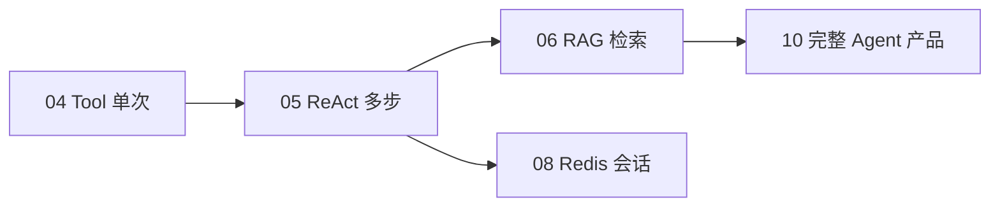

---

## 本章与上一章的关系

04 章你学会了 **Function Calling / Tool**：模型在**一次**对话里可以决定「要不要调工具、调哪个、参数是什么」，Spring AI 帮你执行 Java 方法并把结果塞回上下文，模型再生成最终回答。

但真实业务问题往往不是「一步查完」：

- 「我上周买的手机发货了吗？」→ 先要识别用户 → 查订单 → 再查物流
- 「北京明天适合户外跑步吗？」→ 查天气 → 结合气温和降水给建议
- 「把张三的待付款订单取消掉」→ 查订单 → 校验状态 → 调取消接口 → 确认结果

这类任务需要 **多步推理 + 多次行动**。单纯的一次 Tool 调用不够，你需要的是 **Agent（智能体）**：一个能**循环**「思考 → 行动 → 观察 → 再思考」直到得出答案的系统。

本章核心：**ReAct 模式**（Reasoning + Acting），以及 Router、Plan-and-Execute、多 Agent 等架构演进。学完后，你的 `agent-demo` 将从「单次 Tool」升级为「多步 Agent Service」。

**前置章节**：[04 Function Calling 与 Tool 设计](./04-FunctionCalling与Tool设计.md)（本章默认你已会注册 Tool、理解 `ChatClient` 基础用法）。

---

## 本章衔接

| 上一章（04） | 本章（05） | 下一章（06） |
|--------------|------------|--------------|
| 单次 Function Calling | 多步 ReAct 循环 | 带资料回答（RAG） |
| WeatherTool、OrderTool | AgentService 编排多 Tool | 文档分块 + 向量检索 |
| 模型选一次工具 | Thought → Action → Observation 循环 | 减少幻觉、引用来源 |
| `agent-demo` 能查天气 | `agent-demo` 能多步查订单+物流 | 上传 Markdown 入库 |

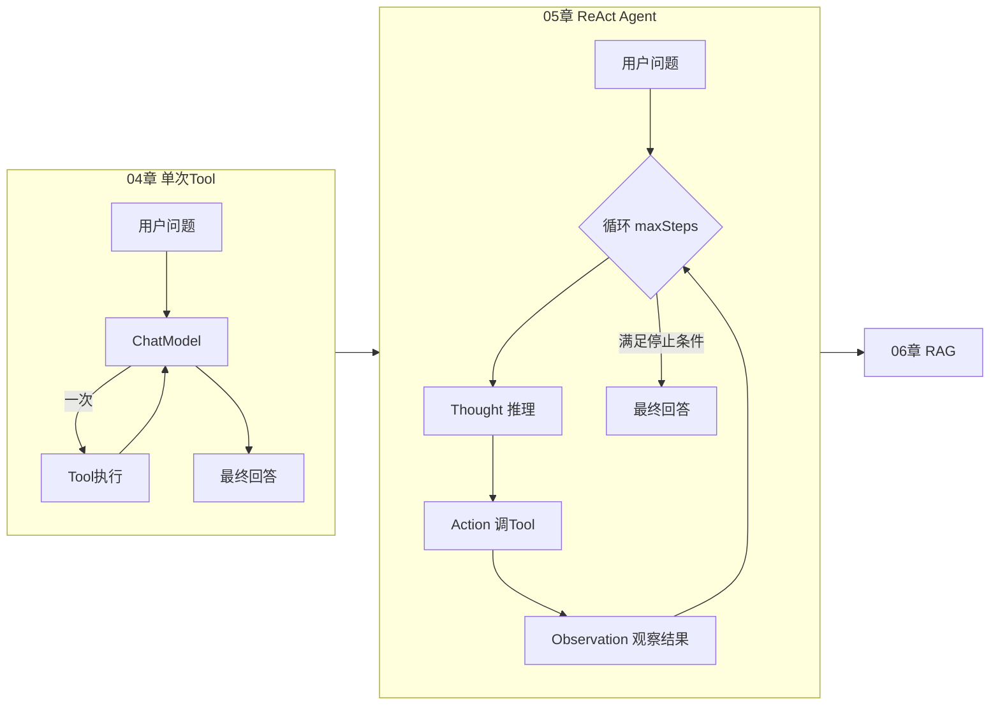

---

## 1. 什么是 Agent？和「简单对话链」有何不同

### 1.1 简单 Chat Chain（对话链）

最朴素的 LLM 应用：

```text
用户输入 → System Prompt + 历史消息 → ChatModel → 文本回复
```

特点：

- **无外部能力**：模型只靠训练权重里的知识回答
- **单轮决策**：一次生成结束，没有「再查一次」的机制
- **适合**：闲聊、翻译、摘要、固定知识问答

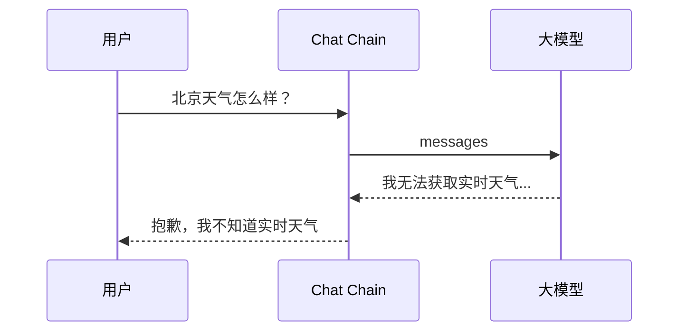

模型没有「眼睛」和「手」，只能瞎编或拒答。

### 1.2 Agent（智能体）

Agent 在对话链之上增加了：

| 能力 | 说明 |
|------|------|
| **Tools** | 调 API、查数据库、发邮件、读文件 |
| **Memory** | 记住多轮上下文（08 章深入） |
| **Planning** | 把复杂任务拆成多步 |
| **Loop** | 根据上一步结果决定下一步 |

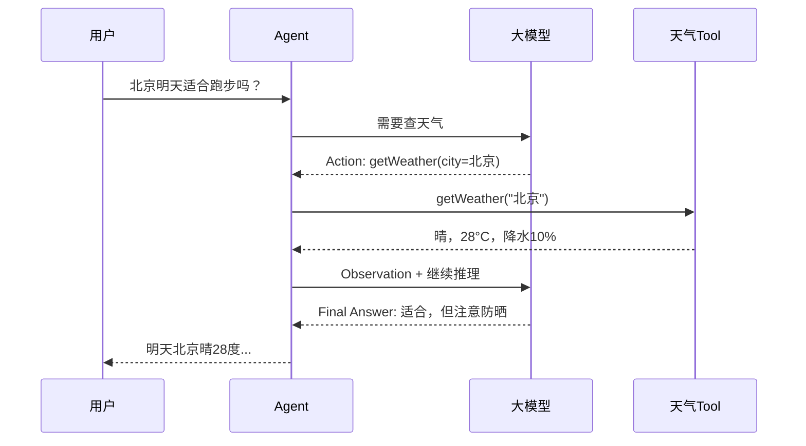

### 1.3 对比总表

| 维度 | 简单 Chat Chain | Agent |
|------|-----------------|-------|
| 外部数据 | ❌ | ✅ Tool / RAG |
| 决策次数 | 1 次生成 | 多步循环 |
| 可控性 | 主要靠 Prompt | Prompt + 工具约束 + maxSteps |
| 延迟 | 低（一次 LLM） | 高（多次 LLM + Tool） |
| 成本 | Token 少 | Token 多（每步都占上下文） |
| 典型场景 | 客服话术、写作助手 | 业务查询、自动化办公 |
| 失败模式 | 幻觉 | 幻觉 + 死循环 + 错 Tool |

### 1.4 真实案例（模拟）

某电商客服 Bot，用户问：「我订单 10086 到哪了？」

- **Chat Chain**：模型可能编造「您的包裹正在派送中」——**幻觉**。
- **Agent + OrderTool + LogisticsTool**：
  1. Thought：需要订单号和用户身份
  2. Action：`queryOrder(10086)`
  3. Observation：订单存在，物流单号 SF123
  4. Action：`queryLogistics(SF123)`
  5. Observation：已到杭州转运中心
  6. Final Answer：如实告知物流节点

---

## 2. ReAct 模式：Thought → Action → Observation

### 2.1 论文与核心思想

ReAct（**Re**asoning + **Act**ing）来自 Yao et al., 2022。核心洞见：

- 纯推理（Chain-of-Thought）：模型只在脑子里想，容易脱离事实
- 纯行动（Tool only）：缺少规划，容易乱调工具
- **ReAct**：交替输出 **推理轨迹** 和 **行动**，用环境反馈（Observation）纠正方向

### 2.2 三步循环

```text
Thought（想）：我现在该做什么？缺什么信息？
Action（做）：调用某个 Tool，带上参数
Observation（看）：Tool 返回了什么？够不够回答用户？
→ 若不够，回到 Thought；够了，输出 Final Answer
```

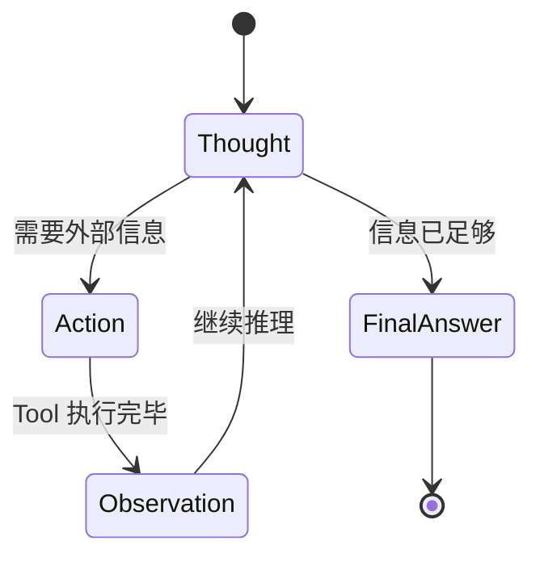

### 2.3 伪代码（语言无关）

```python
def react_agent(user_question, tools, llm, max_steps=10):
    messages = [
        {"role": "system", "content": REACT_SYSTEM_PROMPT},
        {"role": "user", "content": user_question}
    ]

    for step in range(1, max_steps + 1):
        response = llm.chat(messages, tools=tools)

        if response.has_tool_calls():
            for call in response.tool_calls:
                # Thought 通常体现在模型的 reasoning 文本里
                log_thought(response.text)
                log_action(call.name, call.arguments)

                observation = execute_tool(call.name, call.arguments)
                log_observation(observation)

                messages.append(assistant_message_with_tool_call(call))
                messages.append(tool_result_message(call.id, observation))
            continue

        # 无 tool call → 视为 Final Answer
        if is_final_answer(response.text):
            return response.text

        messages.append(assistant_message(response.text))

    return "达到最大步数，未能完成任务。请简化问题或联系人工客服。"
```

### 2.4 ReAct Prompt 模板要点

System Prompt 里应明确：

1. 你是 ReAct Agent，按 Thought / Action / Observation 工作
2. 可用工具列表及参数 schema（Spring AI 会自动注入）
3. **禁止编造** Observation——只能使用 Tool 返回
4. 信息足够时输出 `Final Answer:` 前缀
5. 不要超过 `max_steps` 步

示例片段：

```text
你是一个电商助手 Agent。你可以使用以下工具查询真实数据。

工作方式：
1. 先思考（Thought）需要什么信息
2. 调用工具（Action）获取数据
3. 阅读工具返回（Observation）
4. 重复 1-3 直到能回答用户
5. 输出 Final Answer

规则：
- 不要猜测订单状态，必须调用 queryOrder
- 一次只解决用户当前问题
- 若工具返回错误，向用户说明并建议下一步
```

---

## 3. Spring AI 中的 Agent 循环

### 3.1 ChatClient 与 Tool 回调

04 章你已用过 `ChatClient` 注册 `@Bean` 形式的 Tool。Agent 层是在此之上加 **循环**：

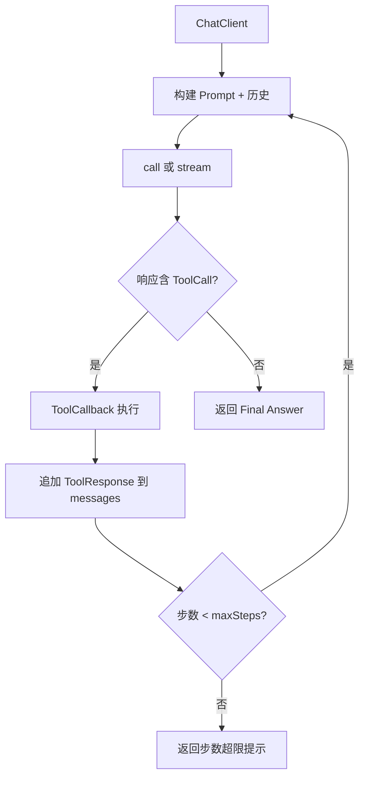

### 3.2 Maven 依赖（延续 02～04 章）

```xml
<dependencyManagement>
    <dependencies>
        <dependency>
            <groupId>org.springframework.ai</groupId>
            <artifactId>spring-ai-bom</artifactId>
            <version>1.0.0</version>
            <type>pom</type>
            <scope>import</scope>
        </dependency>
    </dependencies>
</dependencyManagement>

<dependencies>
    <dependency>
        <groupId>org.springframework.ai</groupId>
        <artifactId>spring-ai-starter-model-openai</artifactId>
    </dependency>
    <!-- 或 spring-ai-starter-model-ollama -->
</dependencies>
```

### 3.3 项目结构（agent-demo 05 章增量）

```text
agent-demo/
├── src/main/java/com/example/agent/
│   ├── controller/
│   │   └── AgentController.java
│   ├── service/
│   │   ├── AgentService.java          ← 本章核心
│   │   └── AgentStepLogger.java       ← 调试日志
│   ├── agent/
│   │   ├── ReActAgentRunner.java
│   │   └── AgentStopCondition.java
│   ├── tool/
│   │   ├── WeatherTool.java
│   │   ├── OrderQueryTool.java
│   │   └── LogisticsQueryTool.java
│   ├── router/
│   │   └── IntentRouterService.java   ← Router Agent
│   └── config/
│       └── AiAgentConfig.java
└── src/main/resources/
    ├── application.yml
    └── prompts/
        └── react-system.st
```

---

## 3.1 手把手：实现 ReAct AgentService

| 步骤 | 你的动作 | 预期看到什么 | 若不对 |
|------|----------|--------------|--------|
| 1 | 04 章 Tool 已注册且 `POST /api/chat/tool` 可用 | 单 Tool 对话正常 | 先完成 04 章 |
| 2 | 新建 `AgentStep`、`AgentRunResult` record（第一步） | 编译通过 | 包路径在 `@SpringBootApplication` 下 |
| 3 | 新建 `AgentStopCondition`（第二步） | `isFinalAnswer` 单元测试通过 | 前缀大小写见实现 |
| 4 | 新建 `prompts/react-system.st`（第七步） | 文件 UTF-8 无乱码 | Resource 路径 `classpath:` |
| 5 | 实现 `ReActAgentRunner`（3.4 推荐写法） | 注入 `ChatClient.Builder` + Tool | API 差异见 §0.7 |
| 6 | 新建 `AgentStepLogger` + `AgentController` | `POST /api/agent/react` 映射成功 | 404 查 `@RequestMapping` |
| 7 | curl 问「北京天气」 | `steps` 含 ACTION/THOUGHT | 不调 Tool 查 System/description |
| 8 | curl 问「订单10001物流」 | 链式多个 ACTION | maxSteps 过小见 §4 |

### 第一步：定义 Agent 运行结果与单步记录

```java
package com.example.agent.agent;

import java.util.ArrayList;
import java.util.List;

public record AgentStep(
        int stepIndex,
        String phase,       // THOUGHT / ACTION / OBSERVATION / FINAL
        String content,
        String toolName,
        String toolArguments
) {}

public record AgentRunResult(
        String finalAnswer,
        List<AgentStep> steps,
        boolean success,
        String stopReason    // COMPLETED / MAX_STEPS / ERROR
) {
    public static AgentRunResult failed(String reason, List<AgentStep> steps) {
        return new AgentRunResult(null, steps, false, reason);
    }
}
```

### 第二步：停止条件

```java
package com.example.agent.agent;

public final class AgentStopCondition {

    private AgentStopCondition() {}

    public static final int DEFAULT_MAX_STEPS = 8;

    public static boolean isFinalAnswer(String text) {
        if (text == null || text.isBlank()) {
            return false;
        }
        String normalized = text.strip();
        return normalized.startsWith("Final Answer:")
                || normalized.startsWith("最终答案：")
                || normalized.contains("FINAL_ANSWER");
    }

    public static String extractFinalAnswer(String text) {
        if (text.startsWith("Final Answer:")) {
            return text.substring("Final Answer:".length()).strip();
        }
        if (text.startsWith("最终答案：")) {
            return text.substring("最终答案：".length()).strip();
        }
        return text;
    }
}
```

### 第三步：核心 AgentService

```java
package com.example.agent.service;

import com.example.agent.agent.AgentRunResult;
import com.example.agent.agent.AgentStep;
import com.example.agent.agent.AgentStopCondition;
import org.slf4j.Logger;
import org.slf4j.LoggerFactory;
import org.springframework.ai.chat.client.ChatClient;
import org.springframework.ai.chat.messages.AssistantMessage;
import org.springframework.ai.chat.messages.Message;
import org.springframework.ai.chat.messages.SystemMessage;
import org.springframework.ai.chat.messages.ToolResponseMessage;
import org.springframework.ai.chat.messages.UserMessage;
import org.springframework.ai.chat.model.ChatResponse;
import org.springframework.ai.chat.prompt.Prompt;
import org.springframework.ai.model.tool.ToolCallingChatOptions;
import org.springframework.ai.tool.ToolCallback;
import org.springframework.beans.factory.annotation.Value;
import org.springframework.core.io.Resource;
import org.springframework.stereotype.Service;

import java.io.IOException;
import java.nio.charset.StandardCharsets;
import java.util.ArrayList;
import java.util.List;

@Service
public class AgentService {

    private static final Logger log = LoggerFactory.getLogger(AgentService.class);

    private final ChatClient chatClient;
    private final List<ToolCallback> toolCallbacks;
    private final AgentStepLogger stepLogger;
    private final String systemPrompt;

    public AgentService(
            ChatClient.Builder chatClientBuilder,
            List<ToolCallback> toolCallbacks,
            AgentStepLogger stepLogger,
            @Value("classpath:prompts/react-system.st") Resource systemPromptResource
    ) throws IOException {
        this.toolCallbacks = toolCallbacks;
        this.stepLogger = stepLogger;
        this.systemPrompt = systemPromptResource.getContentAsString(StandardCharsets.UTF_8);
        this.chatClient = chatClientBuilder
                .defaultSystem(systemPrompt)
                .build();
    }

    public AgentRunResult run(String userQuestion, int maxSteps) {
        List<AgentStep> steps = new ArrayList<>();
        List<Message> messages = new ArrayList<>();
        messages.add(new SystemMessage(systemPrompt));
        messages.add(new UserMessage(userQuestion));

        for (int step = 1; step <= maxSteps; step++) {
            log.info("[Agent] step={} 开始推理", step);

            ChatResponse response = chatClient.prompt(new Prompt(messages))
                    .options(ToolCallingChatOptions.builder()
                            .toolCallbacks(toolCallbacks)
                            .build())
                    .call()
                    .chatResponse();

            AssistantMessage assistantMessage = response.getResult().getOutput();
            String text = assistantMessage.getText();

            if (text != null && !text.isBlank()) {
                steps.add(new AgentStep(step, "THOUGHT", text, null, null));
                stepLogger.logStep(step, "THOUGHT", text);
            }

            if (assistantMessage.hasToolCalls()) {
                messages.add(assistantMessage);

                assistantMessage.getToolCalls().forEach(toolCall -> {
                    String args = toolCall.arguments();
                    steps.add(new AgentStep(step, "ACTION", toolCall.name(), toolCall.name(), args));
                    stepLogger.logStep(step, "ACTION", toolCall.name() + " " + args);
                });

                ToolResponseMessage toolResponseMessage =
                        (ToolResponseMessage) chatClient.getChatModel()
                                .call(new Prompt(messages))
                                .getResult()
                                .getOutput();

                // 注意：Spring AI 1.0 推荐用 ChatClient 内置 tool 执行链
                // 下方为概念示意，实际项目请用 .toolCallbacks() 自动执行版本（见 3.4 节完整写法）
                messages.add(toolResponseMessage);

                String observation = toolResponseMessage.getResponses().stream()
                        .map(r -> r.responseData())
                        .reduce("", (a, b) -> a + b);
                steps.add(new AgentStep(step, "OBSERVATION", observation, null, null));
                stepLogger.logStep(step, "OBSERVATION", observation);
                continue;
            }

            if (AgentStopCondition.isFinalAnswer(text)) {
                String answer = AgentStopCondition.extractFinalAnswer(text);
                steps.add(new AgentStep(step, "FINAL", answer, null, null));
                return new AgentRunResult(answer, steps, true, "COMPLETED");
            }

            // 无 tool call 且非明确 Final Answer，视为直接回答结束
            messages.add(assistantMessage);
            steps.add(new AgentStep(step, "FINAL", text, null, null));
            return new AgentRunResult(text, steps, true, "COMPLETED");
        }

        return AgentRunResult.failed("MAX_STEPS", steps);
    }
}
```

> **说明**：Spring AI 版本迭代较快。若你本地 `ChatClient` 已支持 `.toolCallbacks(toolCallbacks)` 在一次 `call()` 内自动执行工具并返回下一轮就绪的 messages，应优先用官方推荐写法（见 3.4），避免手动拼 `ToolResponseMessage`。

### 第四步：推荐写法 — ChatClient 内置 Tool 循环

```java
package com.example.agent.service;

import com.example.agent.agent.AgentRunResult;
import com.example.agent.agent.AgentStep;
import com.example.agent.agent.AgentStopCondition;
import org.springframework.ai.chat.client.ChatClient;
import org.springframework.ai.chat.client.advisor.SimpleLoggerAdvisor;
import org.springframework.ai.chat.messages.AssistantMessage;
import org.springframework.ai.chat.messages.Message;
import org.springframework.ai.chat.messages.UserMessage;
import org.springframework.ai.chat.model.ChatResponse;
import org.springframework.ai.chat.model.Generation;
import org.springframework.ai.model.tool.ToolCallingChatOptions;
import org.springframework.ai.tool.ToolCallback;
import org.springframework.stereotype.Service;

import java.util.ArrayList;
import java.util.List;

@Service
public class ReActAgentRunner {

    private final ChatClient chatClient;
    private final List<ToolCallback> toolCallbacks;
    private final AgentStepLogger stepLogger;

    public ReActAgentRunner(
            ChatClient.Builder builder,
            List<ToolCallback> toolCallbacks,
            AgentStepLogger stepLogger
    ) {
        this.toolCallbacks = toolCallbacks;
        this.stepLogger = stepLogger;
        this.chatClient = builder
                .defaultAdvisors(new SimpleLoggerAdvisor())
                .build();
    }

    public AgentRunResult run(String question, int maxSteps) {
        List<AgentStep> steps = new ArrayList<>();
        List<Message> history = new ArrayList<>();
        history.add(new UserMessage(question));

        for (int step = 1; step <= maxSteps; step++) {
            ChatResponse chatResponse = chatClient.prompt()
                    .messages(history)
                    .options(ToolCallingChatOptions.builder()
                            .toolCallbacks(toolCallbacks)
                            .internalToolExecutionEnabled(true)
                            .build())
                    .call()
                    .chatResponse();

            Generation generation = chatResponse.getResult();
            AssistantMessage output = generation.getOutput();
            String text = output.getText();

            if (text != null && !text.isBlank()) {
                steps.add(new AgentStep(step, "THOUGHT", text, null, null));
                stepLogger.logStep(step, "THOUGHT", text);
            }

            history.add(output);

            if (output.hasToolCalls()) {
                output.getToolCalls().forEach(tc -> {
                    steps.add(new AgentStep(step, "ACTION", tc.name(), tc.name(), tc.arguments()));
                    stepLogger.logStep(step, "ACTION", tc.name() + " args=" + tc.arguments());
                });
                // internalToolExecutionEnabled=true 时，工具已执行，下一轮 history 由框架维护
                // 从 advisor 日志或 ToolContext 读取 observation
                String observation = "[tool results appended to conversation]";
                steps.add(new AgentStep(step, "OBSERVATION", observation, null, null));
                stepLogger.logStep(step, "OBSERVATION", observation);
                continue;
            }

            if (AgentStopCondition.isFinalAnswer(text)) {
                String answer = AgentStopCondition.extractFinalAnswer(text);
                return new AgentRunResult(answer, steps, true, "COMPLETED");
            }

            return new AgentRunResult(text, steps, true, "COMPLETED");
        }

        return AgentRunResult.failed("MAX_STEPS", steps);
    }
}
```

### 3.4.1 逐行读代码：ReActAgentRunner（推荐写法）

| 行号/代码 | 含义 | 改错会怎样 |
|-----------|------|------------|
| `List<Message> history` | 多步累积对话上下文 | 每步不 add 则「失忆」 |
| `for (int step = 1; step <= maxSteps; step++)` | 硬性步数上限 | 无循环则无法多步 |
| `ToolCallingChatOptions.builder().toolCallbacks(...)` | 注册可执行 Tool | 空列表则纯文本 Agent |
| `.internalToolExecutionEnabled(true)` | 框架自动执行 Tool 并回灌 | false 需手写 Observation |
| `output.hasToolCalls()` | 本轮是否调 Tool | 误判则提前当 Final Answer |
| `AgentStopCondition.isFinalAnswer(text)` | 检测 `Final Answer:` 前缀 | 无检测则格式不统一 |
| `AgentRunResult.failed("MAX_STEPS", steps)` | 超限失败可观测 | 应返回 steps 供调试 |

### 第五步：AgentStepLogger — 调试每一步

```java
package com.example.agent.service;

import org.slf4j.Logger;
import org.slf4j.LoggerFactory;
import org.springframework.stereotype.Component;

import java.time.Instant;
import java.util.ArrayList;
import java.util.Collections;
import java.util.List;
import java.util.Map;
import java.util.concurrent.ConcurrentHashMap;

@Component
public class AgentStepLogger {

    private static final Logger log = LoggerFactory.getLogger(AgentStepLogger.class);

    public record StepLog(
            Instant timestamp,
            int step,
            String phase,
            String content
    ) {}

    private final Map<String, List<StepLog>> sessionLogs = new ConcurrentHashMap<>();

    public void logStep(int step, String phase, String content) {
        log.info("[ReAct step={}] [{}] {}", step, phase, truncate(content, 500));
    }

    public void logStep(String sessionId, int step, String phase, String content) {
        logStep(step, phase, content);
        sessionLogs.computeIfAbsent(sessionId, k -> new ArrayList<>())
                .add(new StepLog(Instant.now(), step, phase, content));
    }

    public List<StepLog> getLogs(String sessionId) {
        return sessionLogs.getOrDefault(sessionId, Collections.emptyList());
    }

    private String truncate(String s, int max) {
        if (s == null) return "";
        return s.length() <= max ? s : s.substring(0, max) + "...";
    }
}
```

**调试技巧**：

1. 开启 `SimpleLoggerAdvisor` 或 `logging.level.org.springframework.ai=DEBUG`
2. 接口返回 `steps` 数组给前端，开发环境展示 Thought / Action 时间线
3. 为每次 Agent 运行生成 `traceId`，日志串联

### 第六步：Controller

```java
package com.example.agent.controller;

import com.example.agent.agent.AgentRunResult;
import com.example.agent.service.ReActAgentRunner;
import org.springframework.web.bind.annotation.*;

record AgentRequest(String question, Integer maxSteps) {}

@RestController
@RequestMapping("/api/agent")
public class AgentController {

    private final ReActAgentRunner agentRunner;

    public AgentController(ReActAgentRunner agentRunner) {
        this.agentRunner = agentRunner;
    }

    @PostMapping("/react")
    public AgentRunResult react(@RequestBody AgentRequest request) {
        int maxSteps = request.maxSteps() == null ? 8 : request.maxSteps();
        return agentRunner.run(request.question(), maxSteps);
    }
}
```

### 第六步.1 逐行读代码：AgentController

| 行号/代码 | 含义 | 改错会怎样 |
|-----------|------|------------|
| `@RequestMapping("/api/agent")` | Agent 专用前缀 | 与 `/api/chat` 混淆 |
| `record AgentRequest(...)` | JDK 16+ 不可变 DTO | 字段 null 需默认值处理 |
| `maxSteps == null ? 8 : maxSteps` | 默认 8 步 | null 不传则安全默认 |
| `return agentRunner.run(...)` | 返回含 steps 的结构 | 生产可对 steps 脱敏 |

### 第七步：react-system.st 模板

```text
你是 agent-demo 的 ReAct 电商助手。

## 工具使用规则
- 查订单用 queryOrder，查物流用 queryLogistics，查天气用 getWeather
- 不要编造工具返回的数据
- 缺参数时先向用户追问，或从上下文合理推断

## 输出格式
思考时自然叙述；需要工具时直接发起工具调用。
最终回答请以「Final Answer:」开头。

## 示例
用户：订单 10001 物流到哪了？
Thought: 需要先查订单获得物流单号
Action: queryOrder(orderId=10001)
Observation: { "logisticsNo": "SF123" }
Thought: 再用物流单号查询
Action: queryLogistics(logisticsNo=SF123)
Observation: { "status": "运输中", "location": "杭州" }
Final Answer: 您的订单 10001 包裹目前在杭州转运中心，状态运输中。
```

### 第八步：验证

```powershell
# 启动 agent-demo 后
curl -X POST http://localhost:8080/api/agent/react `
  -H "Content-Type: application/json" `
  -d "{\"question\":\"订单10001发货了吗？物流到哪？\",\"maxSteps\":8}"
```

**预期**：`success: true`，`steps` 中含 THOUGHT / ACTION / OBSERVATION，`finalAnswer` 含真实物流信息（非编造）。

---

## 4. 最大步数与停止条件

### 4.1 为什么必须设 maxSteps

Agent 循环若不加限制，可能出现：

- 模型反复调同一 Tool（**无限循环**）
- 两个 Tool 来回踢皮球
- Token 费用暴涨、接口超时

**生产建议**：`maxSteps` 默认 5～10，复杂任务单独审批提高到 15。

### 4.2 常见停止条件

| 停止条件 | 触发时机 | 实现方式 |
|----------|----------|----------|
| **Final Answer** | 模型输出最终答案 | 检测前缀 / 无 tool call |
| **MAX_STEPS** | 达到步数上限 | for 循环边界 |
| **重复 Action** | 连续 2 次相同工具+参数 | 自定义检测器 |
| **Tool 致命错误** | 权限不足、订单不存在 | Observation 含 ERROR 码 |
| **用户取消** | 前端中止 SSE | CancellationToken |
| **超时** | 总耗时 > 30s | `CompletableFuture.orTimeout` |
| **成本上限** | 累计 Token > 阈值 | MeterRegistry 统计 |

```java
public boolean isRepeatedAction(List<AgentStep> steps, String toolName, String args) {
    if (steps.size() < 2) return false;
    AgentStep last = steps.get(steps.size() - 1);
    AgentStep prev = steps.get(steps.size() - 2);
    return "ACTION".equals(last.phase()) && "ACTION".equals(prev.phase())
            && toolName.equals(last.toolName()) && args.equals(last.toolArguments());
}
```

### 4.3 步数与任务复杂度

| 任务类型 | 建议 maxSteps | 示例 |
|----------|---------------|------|
| 单 Tool 查询 | 3 | 查天气 |
| 双 Tool 链式 | 5～6 | 订单 + 物流 |
| 带条件分支 | 8 | 查订单 → 若未付款则取消 |
| 多实体对比 | 10+ | 比较三个商品库存 |

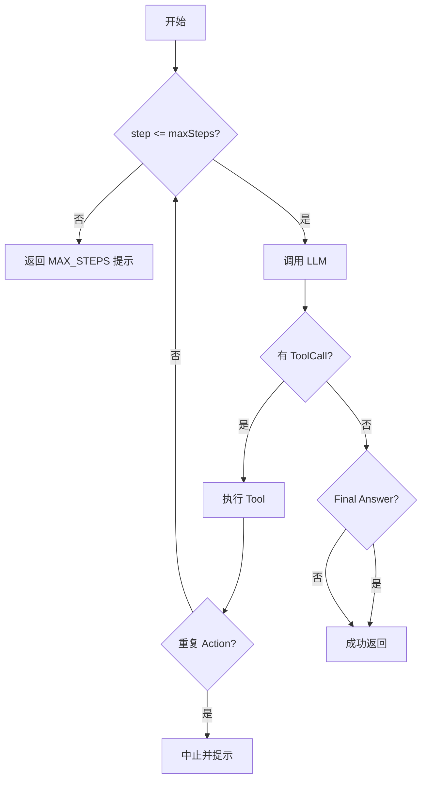

---

## 5. Router Agent：意图分类与分流

### 5.1 为什么需要 Router

当系统同时有 **RAG 知识库**、**业务 Tool**、**纯闲聊** 时，不应让所有请求都走完整 ReAct。

Router Agent 先做 **意图分类（Intent Classification）**，再路由到不同子系统：

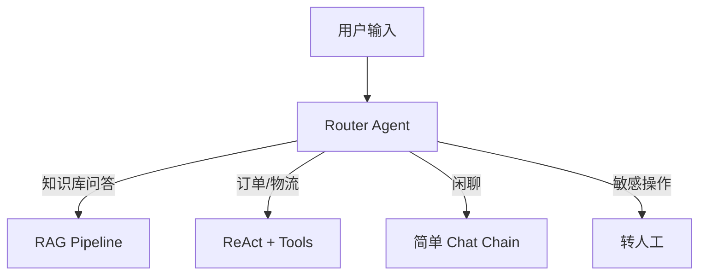

### 5.2 实现方式

**方式 A：LLM 分类（灵活）**

```java
@Service
public class IntentRouterService {

    public enum Intent {
        KNOWLEDGE_QA, ORDER_SERVICE, CHITCHAT, HUMAN_HANDOFF, UNKNOWN
    }

    private final ChatClient chatClient;

    public IntentRouterService(ChatClient.Builder builder) {
        this.chatClient = builder
                .defaultSystem("""
                    你是意图分类器。只输出以下之一，不要解释：
                    KNOWLEDGE_QA | ORDER_SERVICE | CHITCHAT | HUMAN_HANDOFF
                    """)
                .build();
    }

    public Intent classify(String userMessage) {
        String raw = chatClient.prompt()
                .user(userMessage)
                .call()
                .content();
        try {
            return Intent.valueOf(raw.strip());
        } catch (IllegalArgumentException e) {
            return Intent.UNKNOWN;
        }
    }
}
```

**方式 B：规则 + 关键词（低成本）**

```java
public Intent classifyByRules(String msg) {
    if (msg.matches(".*(订单|物流|发货|退款).*")) {
        return Intent.ORDER_SERVICE;
    }
    if (msg.matches(".*(你好|谢谢|再见).*")) {
        return Intent.CHITCHAT;
    }
    return Intent.KNOWLEDGE_QA;
}
```

**方式 C：混合 — 规则优先，搞不定再问 LLM**

### 5.3 编排入口

```java
@Service
public class OrchestratorService {

    private final IntentRouterService router;
    private final ReActAgentRunner reactAgent;
    private final ChatClient chatClient;
    // private final RagService ragService;  // 06 章接入

    public String handle(String question) {
        return switch (router.classify(question)) {
            case ORDER_SERVICE -> reactAgent.run(question, 8).finalAnswer();
            case KNOWLEDGE_QA -> "RAG 暂未接入"; // ragService.ask(question);
            case CHITCHAT -> chatClient.prompt().user(question).call().content();
            case HUMAN_HANDOFF -> "已为您转接人工客服，请稍候。";
            default -> "抱歉，我没理解您的问题，请换个说法。";
        };
    }
}
```

### 5.4 Router 设计要点

| 要点 | 说明 |
|------|------|
| 低延迟 | 分类用轻量模型或规则，避免重型 ReAct |
| 可观测 | 记录 `intent` 到日志，分析误判率 |
| 兜底 | `UNKNOWN` 走澄清追问 |
| 安全 | 「退款」「改价」等走鉴权 + 二次确认 |

---

## 6. Plan-and-Execute 概览

### 6.1 与 ReAct 的区别

| 模式 | 流程 | 优点 | 缺点 |
|------|------|------|------|
| **ReAct** | 边想边做，交错进行 | 灵活、可纠错 | 每步都调 LLM，成本高 |
| **Plan-and-Execute** | 先出完整计划，再逐步执行 | 全局视角、步骤可并行 | 计划错了后面全错 |

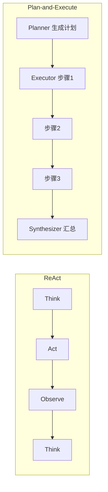

### 6.2 典型三角色

1. **Planner**：把「帮我准备出差」拆成查天气、订酒店、设提醒
2. **Executor**：每步可用不同 Tool 或子 Agent
3. **Replanner**（可选）：某步失败时局部重规划

### 6.3 何时选用

- **ReAct**：步骤不确定、需根据 Observation 动态调整（客服查单）
- **Plan-and-Execute**：步骤相对固定、可并行（生成周报：拉数据 → 画图 → 写总结）

Spring AI 生态可用多轮 `ChatClient` + 结构化输出（JSON Plan）实现；LangChain4j 有 `AgentExecutor` 等更高层抽象（09 章对照）。

---

## 7. 多 Agent 简介：Supervisor 模式

### 7.1 单 Agent 的瓶颈

- Prompt 过长（工具太多）
- 职责混杂（既查订单又写文案）
- 难以独立测试与迭代

### 7.2 Supervisor（主管）模式

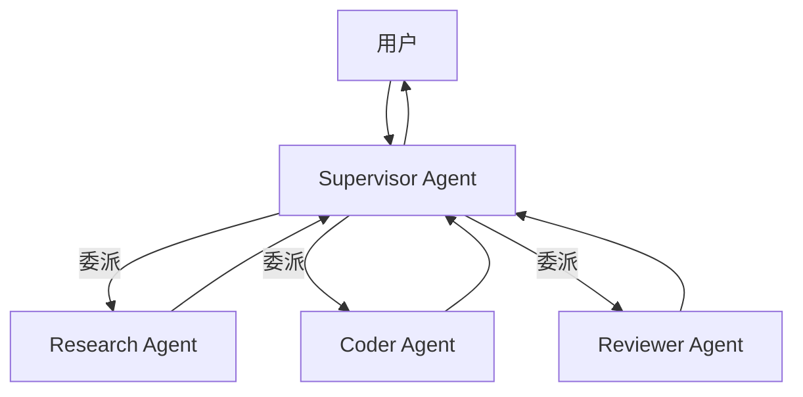

- **Supervisor**：理解总任务，拆分子任务，选择子 Agent，汇总结果
- **Worker Agent**：各自有专属 Tool 和 System Prompt

### 7.3 Java 工程落地思路

```java
public interface SubAgent {
    String name();
    String execute(String subTask);
}

@Service
public class SupervisorService {

    private final ChatClient supervisorClient;
    private final List<SubAgent> workers;

    public String run(String goal) {
        // 1. Supervisor 分解任务 JSON: [{agent: "order", task: "..."}]
        // 2. 循环调用对应 SubAgent
        // 3. Supervisor 汇总
        return "...";
    }
}
```

**注意**：多 Agent = 多次 LLM 调用，成本和延迟显著上升。MVP 阶段 **单 ReAct Agent + Router** 通常够用。

### 7.4 其他多 Agent 模式（了解）

| 模式 | 说明 |
|------|------|
| **Sequential** | Agent A 输出作为 B 的输入 |
| **Group Chat** | 多 Agent 讨论后投票 |
| **Hierarchical** | 多层 Supervisor |

---

## 8. 常见失败模式与对策

### 8.1 无限循环

**现象**：日志里反复 `queryOrder(10001)`，直到 MAX_STEPS。

**原因**：

- Observation 格式模型看不懂
- Prompt 没要求「同样工具不要连续调用」
- Tool 返回空，模型以为没查到

**对策**：

```text
- maxSteps 硬性上限
- 检测重复 Action 提前终止
- Tool 返回统一 JSON schema，含 success 字段
- Observation 为空时返回明确 "NOT_FOUND"
```

### 8.2 调错 Tool

**现象**：查物流却调了 `getWeather`。

**原因**：Tool 描述不清；相似工具名混淆；用户问题歧义。

**对策**：

- Tool `@Description` 写清边界：「仅用于已发货订单的物流轨迹」
- 减少同时暴露的工具数量（Router 分流）
- Few-shot 示例放进 System Prompt

### 8.3 幻觉 Observation

**现象**：模型没调 Tool 却写「Observation: 您的订单已签收」。

**对策**：

- 强制有 Observation 必须来自 ToolResponse
- 后处理校验：无 ACTION 步骤则不能出现物流状态

### 8.4 参数 JSON 错误

**现象**：`orderId` 传成字符串 `"一百"` 或漏字段。

**对策**：Tool 方法用强类型参数 + `@JsonProperty`；校验失败返回可读错误给模型重试。

### 8.5 上下文爆炸

**现象**：步数多后超限 `context length exceeded`。

**对策**：压缩历史 Observation；只保留最近 N 步；大结果摘要后再入上下文。

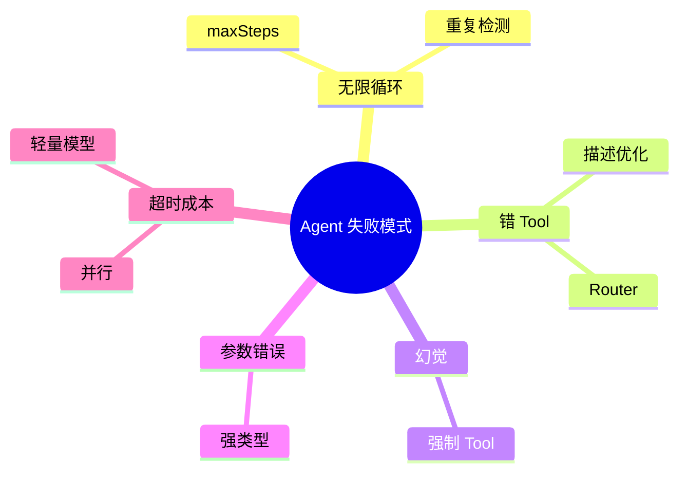

---

## 9. 调试 Agent 运行

### 9.1 日志分层

```yaml
# application.yml
logging:
  level:
    com.example.agent: DEBUG
    org.springframework.ai: INFO
```

### 9.2 结构化 Trace

```java
public record AgentTrace(
        String traceId,
        String question,
        Instant startTime,
        Instant endTime,
        List<AgentStep> steps,
        String stopReason,
        int totalTokens
) {}
```

存入 Redis 或 MySQL，方便复现用户投诉案例。

### 9.3 开发环境 API 返回 steps

```json
{
  "success": true,
  "finalAnswer": "您的包裹在杭州转运中心",
  "stopReason": "COMPLETED",
  "steps": [
    {"stepIndex": 1, "phase": "THOUGHT", "content": "需要查订单..."},
    {"stepIndex": 1, "phase": "ACTION", "toolName": "queryOrder", "toolArguments": "{\"orderId\":10001}"},
    {"stepIndex": 1, "phase": "OBSERVATION", "content": "{\"logisticsNo\":\"SF123\"}"},
    {"stepIndex": 2, "phase": "FINAL", "content": "您的包裹..."}
  ]
}
```

### 9.4 本地调试清单

- [ ] 单独单元测试每个 Tool（不经过 LLM）
- [ ] 用固定问题回归：「订单 10001 物流」
- [ ] 对比 `temperature=0` 与 `0.7` 的稳定性
- [ ] 记录每步耗时，定位慢在 LLM 还是 DB

---

## 10. 与 06 章 RAG 的衔接

05 章 Agent 能 **行动**（调 Tool），但企业知识在 PDF 里，Tool 查不到。

06 章 **RAG** 让 Agent「带着资料回答」：

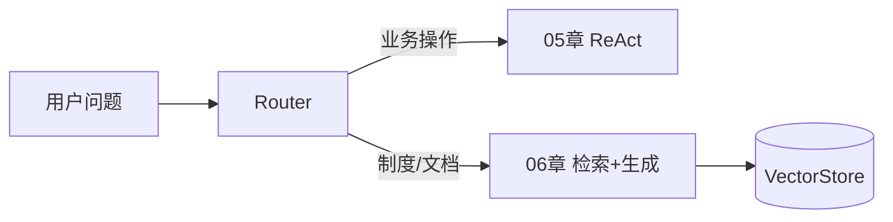

10 章项目会把 Router + ReAct + RAG 合并为完整助手。

---

## 11. 面试高频题

### 11.1 概念题

**Q1：Agent 和 Chain 的区别？**

> Chain 是一次 LLM 调用（或固定流水线）；Agent 有自主决策循环，可多步调 Tool，根据 Observation 动态调整。

**Q2：ReAct 三个字母代表什么？**

> Reasoning + Acting。交替推理与行动，Observation 来自环境反馈。

**Q3：为什么 Agent 必须设最大步数？**

> 防止死循环、控制成本与延迟；模型可能重复无效 Action。

**Q4：Router Agent 解决什么问题？**

> 意图分流，避免所有请求走重型链路；知识问答走 RAG，订单走 Tool，闲聊走轻量 Chat。

**Q5：Plan-and-Execute 和 ReAct 怎么选？**

> 步骤可预测、可并行用 Plan-and-Execute；需根据中间结果动态调整用 ReAct。

**Q6：多 Agent Supervisor 模式是什么？**

> 主管 Agent 拆任务并委派给专职子 Agent，汇总结果；适合复杂流程但成本高。

**Q7：如何防止 Agent 幻觉？**

> 强制关键事实来自 Tool/RAG；校验 Observation 来源；temperature 调低；引用来源。

**Q8：Agent 延迟高怎么优化？**

> Router 减负、并行 Tool、缓存热点查询、小模型做分类、流式返回 Thought。

### 11.2 场景题

**场景**：用户说「把我所有待付款订单都取消」。

**考察点**：

1. 鉴权：是否本人
2. 多步：列订单 → 过滤待付款 → 逐个取消
3. 幂等：取消失败重试
4. 确认：是否先让用户确认
5. maxSteps 与超时

**参考思路**：

```text
Router → ORDER_SERVICE
ReAct:
  1. queryOrders(userId, status=UNPAID)
  2. 若数量>0，Final Answer 前先返回待确认列表（或自动取消视产品规则）
  3. cancelOrder 逐个调用
  4. 汇总成功/失败笔数
```

---

## 12. 常见报错与排查

| 报错信息（关键词） | 可能原因 | 解决方案 |
|-------------------|---------|---------|
| `context length exceeded` | Agent 多步后上下文过长 | 压缩 Observation；减少 maxSteps；摘要历史 |
| `MAX_STEPS` 业务返回 | 任务太复杂或死循环 | 查 steps 日志；加重复 Action 检测；优化 Prompt |
| `ToolCallback not found` | 工具未注册到 Spring 容器 | 检查 `@Bean ToolCallback` 或 `@Tool` 扫描路径 |
| `Failed to parse tool arguments` | 模型输出 JSON 非法 | 降低 temperature；简化参数 schema；加示例 |
| `429 Too Many Requests` | LLM API 限流 | 退避重试；换模型；限流用户 |
| `Read timed out` | 单步 LLM 或 DB 太慢 | 增大 timeout；异步化；优化 SQL |
| `NullPointerException` on `getText()` | 响应只有 tool call 无文本 | 判空；以 hasToolCalls 分支处理 |
| `No tool call but fabricated data` | 幻觉，未走 Tool | 强化 System Prompt；后处理校验 |
| `BeanCreationException: ChatClient` | API Key 未配置 | 检查 `spring.ai.openai.api-key` 或环境变量 |
| `IllegalArgumentException: maxSteps` | 传入 0 或负数 | Controller 层校验，默认 8 |
| `ConcurrentModificationException` | 多线程改 steps 列表 | 用线程安全集合或每请求独立 List |
| `JSON parse error` in Observation | Tool 返回非 JSON 字符串 | 统一 Tool 返回格式；用 `Map` 序列化 |

---

## 13. 分级练习

### 基础

在 `agent-demo` 跑通 ReAct：用户问「北京天气」，日志可见 THOUGHT / ACTION / OBSERVATION，3 步内完成。

### 进阶

实现 `queryOrder` + `queryLogistics` 链式调用：「订单 10001 到哪了？」；开启 `AgentStepLogger`，接口返回 `steps`。

### 挑战

实现 `IntentRouterService` + `OrchestratorService`：订单类走 ReAct，闲聊走 Chat；误判率自测 10 条用例。

---

## 14. 参考答案

### 基础

```powershell
curl -X POST http://localhost:8080/api/agent/react `
  -H "Content-Type: application/json" `
  -d "{\"question\":\"北京今天天气怎么样？\"}"
```

**预期**：`steps` 含 `getWeather` 的 ACTION；`finalAnswer` 含气温；不应编造未调用工具的数据。

### 进阶

**Mock Tool 返回**：

```java
@Tool(description = "根据订单号查询订单，返回物流单号")
public String queryOrder(Long orderId) {
    if (orderId == 10001L) {
        return "{\"orderId\":10001,\"status\":\"SHIPPED\",\"logisticsNo\":\"SF123\"}";
    }
    return "{\"error\":\"NOT_FOUND\"}";
}
```

测试问题：「订单 10001 物流到哪了？」

**预期步骤**：

1. ACTION `queryOrder`
2. OBSERVATION 含 `SF123`
3. ACTION `queryLogistics`
4. FINAL 含地点

### 挑战：Router 测试用例

| 输入 | 期望 Intent |
|------|-------------|
| 订单 10001 发货了吗 | ORDER_SERVICE |
| 年假制度有多少天 | KNOWLEDGE_QA |
| 你好 | CHITCHAT |
| 我要投诉，转人工 | HUMAN_HANDOFF |
| asdfghjkl | UNKNOWN |

实现后跑单元测试 `IntentRouterServiceTest`，准确率目标 ≥ 8/10。

---

## 15. 高频知识点清单

- Agent vs Chat Chain
- ReAct：Thought / Action / Observation
- maxSteps 与停止条件
- Spring AI ChatClient + ToolCallbacks 循环
- Router 意图分类
- Plan-and-Execute 与 ReAct 对比
- Supervisor 多 Agent 模式
- 无限循环、错 Tool、幻觉对策
- AgentStep 调试日志
- 与 RAG 的编排关系

---

## 16. 学完标准

- [ ] 能口述 Agent 与简单对话链的区别，并画 ReAct 循环图
- [ ] 理解 Thought / Action / Observation 各代表什么
- [ ] 在 `agent-demo` 实现 `ReActAgentRunner`，支持 `maxSteps`
- [ ] 会用 `AgentStepLogger` 记录并排查多步执行过程
- [ ] 能说明至少 3 种停止条件及重复 Action 检测思路
- [ ] 实现简易 `IntentRouterService`，区分订单与闲聊
- [ ] 了解 Plan-and-Execute、Supervisor 的适用场景
- [ ] 能分析无限循环、错 Tool 的原因并给出工程对策
- [ ] 能回答本章面试题中的概念题与场景题

---

## 17. 我的笔记区

```text
agent-demo ReAct 接口路径：
maxSteps 默认值：
Router 误判案例：
最容易死循环的问题：
与 06 章 RAG 对接点：
```

---

## 18. 常见困惑 FAQ

### Q1：Agent 和 04 章 ChatClient + defaultTools 有什么区别？

**A**：04 章框架在 **一次** `call()` 内自动 Tool 循环；05 章 **显式** 记录 THOUGHT/ACTION/OBSERVATION、Router、maxSteps，便于调试与产品化。

### Q2：ReAct 的 Thought 必须打印给用户吗？

**A**：不必。开发环境可返回 `steps`；生产可只流式 Final Answer，Thought 仅日志。

### Q3：`maxSteps` 设多少合适？

**A**：单 Tool 3；双 Tool 链 5～8；复杂任务 10，再大需审批（§4.1）。

### Q4：Router 用 LLM 还是规则？

**A**：规则快、成本低；LLM 灵活。推荐 **规则优先 + LLM 兜底**（§5.2 方式 C）。

### Q5：Plan-and-Execute 会取代 ReAct 吗？

**A**：不会。步骤固定可并行用 PAE；需根据 Observation 改道用 ReAct（§6）。

### Q6：Supervisor 多 Agent 什么时候上？

**A**：单 Agent Prompt/Tool 过多、职责混杂时。MVP **单 ReAct + Router** 通常够（§7.3）。

### Q7：无限循环长什么样？怎么防？

**A**：日志重复同一 ACTION；用 maxSteps + 重复 Action 检测 + 清晰 Observation（§8.1）。

### Q8：模型没调 Tool 却写 Observation 怎么办？

**A**：幻觉 Observation；强化 Prompt「禁止编造」；后处理校验有 ACTION 才有物流状态（§8.3）。

### Q9：05 章代码和 Spring AI 文档不一致？

**A**：以 pom 版本 [官方文档](https://docs.spring.io/spring-ai/reference/) 为准；可先 04 章 `defaultTools` + `maxIterations` 跑通再扩展 Runner。

### Q10：ReAct 和 06 章 RAG 怎么一起用？

**A**：Router：知识类 → RAG；操作类 → ReAct（§10 图）。

### Q11：`AgentRunResult.steps` 能返回给前端吗？

**A**：开发/内网可以；生产注意脱敏与 Thought 泄露策略。

### Q12：Agent 延迟高怎么优化？

**A**：Router 减负、缓存 Tool、小模型分类、流式 Final Answer、并行 Tool（§11 面试 Q8）。

---

## 19. 闭卷自测

### 概念题（6 道）

1. Agent 与简单 Chat Chain 的 3 点区别。
2. ReAct 三个字母及 Thought/Action/Observation 含义。
3. 为什么必须设 maxSteps？
4. Router Agent 解决什么问题？
5. Plan-and-Execute 与 ReAct 各适合什么任务？
6. Supervisor 模式是什么？

### 动手题（2 道）

7. 写出 `AgentStopCondition.isFinalAnswer` 检测的一种前缀。
8. 写出 `AgentController` 对 `maxSteps` 的默认值处理逻辑（一行三元表达式）。

### 综合题（2 道）

9. 日志显示连续 5 次 `queryOrder(10001)`，分析原因并给 3 条对策。
10. 设计 Router：输入「年假制度几天」与「订单 10001 发货了吗」分别走哪条链路？为什么？

### 自测参考答案

1. 外部 Tool/RAG；多步循环；更高延迟与成本等。
2. Reasoning+Acting；想/做/看。
3. 防死循环、控成本与超时。
4. 意图分流，避免所有请求走重型 ReAct。
5. PAE=步骤可预测；ReAct=需动态调整。
6. 主管 Agent 委派子 Agent 并汇总。
7. `Final Answer:` 或 `最终答案：`。
8. `request.maxSteps() == null ? 8 : request.maxSteps()`。
9. Observation 看不懂/为空/重复检测缺失/maxSteps 过大/Prompt 问题等。
10. 前者 KNOWLEDGE_QA→RAG（06）；后者 ORDER_SERVICE→ReAct+OrderTool。

---

## 20. 费曼检验

**任务**：3 分钟向朋友解释「什么是 ReAct Agent，为什么查订单+物流需要多步」。

**对照提纲**：

1. **Chat Chain**：只会说，没有数据库。
2. **ReAct**：循环「想→调 Java 工具→看结果→再想」，直到能回答。
3. **例子**：查物流要先查订单拿单号，再查物流——一步不够，所以要 Agent + maxSteps 上限。

---

## 21. IntentRouterService 逐行读

| 行/代码 | 含义 | 改错会怎样 |
|---------|------|------------|
| `enum Intent` | 固定意图集合，便于 switch | 枚举过多可拆配置 |
| `defaultSystem("只输出以下之一...")` | 约束 LLM 分类输出 | 无约束则输出废话难解析 |
| `Intent.valueOf(raw.strip())` | 解析分类结果 | 非法字符串 → UNKNOWN 兜底 |
| `UNKNOWN` | 触发澄清追问 | 无兜底则乱路由 |

---

## 22. OrchestratorService 编排逐行读

| 行/代码 | 含义 | 改错会怎样 |
|---------|------|------------|
| `switch (router.classify(question))` | 意图 → 执行链 | 全走 ReAct 浪费 Token |
| `ORDER_SERVICE -> reactAgent.run` | 业务多步 | 应用 04 章 Tool |
| `CHITCHAT -> chatClient.call` | 轻量闲聊 | 避免调 Tool |
| `KNOWLEDGE_QA -> "RAG 暂未接入"` | 06 章占位 | 勿让 ReAct 硬答制度 |

---

## 23. ReAct 与 Spring AI 简化路径对照

| 目标 | 简化路径（04 章） | 本章显式路径 |
|------|-------------------|--------------|
| 多步 Tool | `defaultTools` + `maxIterations` | `ReActAgentRunner` + `steps` |
| 调试 | DEBUG 日志 | `AgentStepLogger` + API 返回 steps |
| 路由 | 无 | `IntentRouterService` |

**建议**：先 04 章跑通 Tool，再复制 Tool 到 05 章 Runner；API 细节以 [Spring AI 文档](https://docs.spring.io/spring-ai/reference/) 为准。

---

## 24. Agent 运行 traceId 与可观测性（生产预览）

| 字段 | 用途 |
|------|------|
| `traceId` | 串联一次 Agent 请求的所有日志 |
| `stepIndex` | 对应 ReAct 第几轮 |
| `toolName` | 审计调了哪个 Tool |
| `stopReason` | COMPLETED / MAX_STEPS / ERROR |
| `durationMs` | 每步 LLM 耗时，定位慢点 |

**练手**：在 `AgentStepLogger.logStep` 里加 `MDC.put("traceId", UUID)`，便于 ELK 检索。

---

## 25. ReAct 手写循环 vs ChatClient 内建循环

| 维度 | ChatClient + defaultTools + maxIterations | ReActAgentRunner |
|------|-------------------------------------------|------------------|
| 代码量 | 少 | 多 |
| steps 可见性 | 需 DEBUG | 可返回 API |
| Router 编排 | 需自写 | 自然衔接 |
| 学习价值 | 快速交付 | 理解 Agent 本质 |

面试：**两者都要会讲**；工程 MVP 可先用内建，调试困难再显式 Runner。

---

## 下一章预告

05 章 Agent 能查订单、查天气，但公司制度、产品手册在 PDF 里，Tool 查不到，模型容易 **幻觉**。下一章（[06 RAG 检索增强生成基础](./06-RAG检索增强生成基础.md)）解决 **「让模型带着资料回答」**：

- 文档加载 → 分块 → Embedding → 向量检索 → 生成
- Spring AI `DocumentReader`、`TextSplitter`、`EmbeddingModel`、`VectorStore`
- 内存版 VectorStore demo，为 07 章 PGVector 打底
- 引用来源与忠实度评估入门

---

*下一章：06 RAG 检索增强生成基础*
