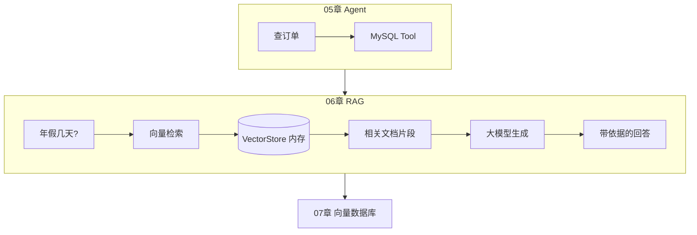
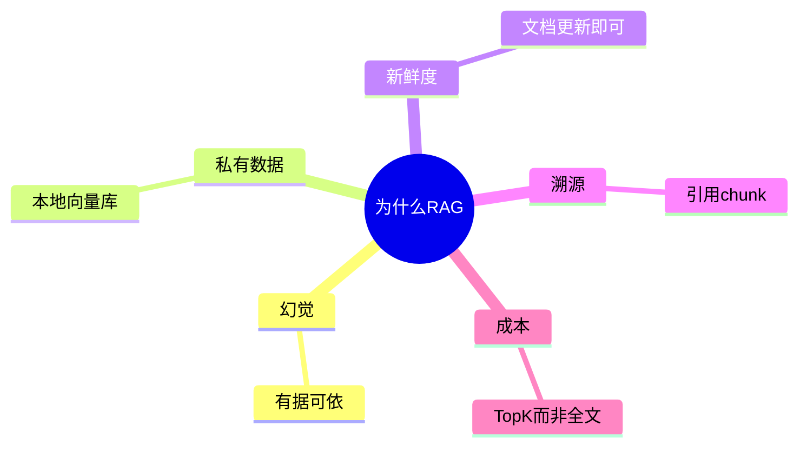
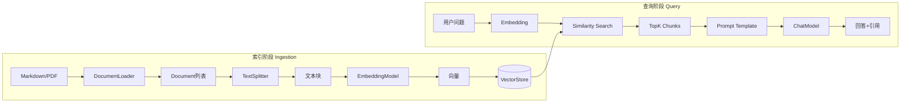
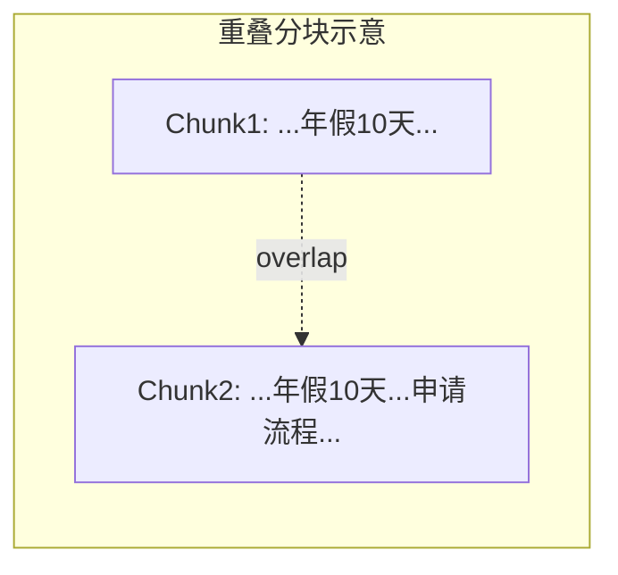
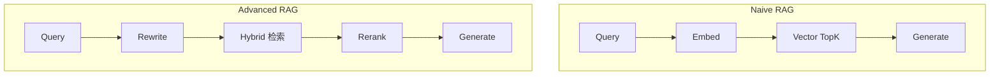
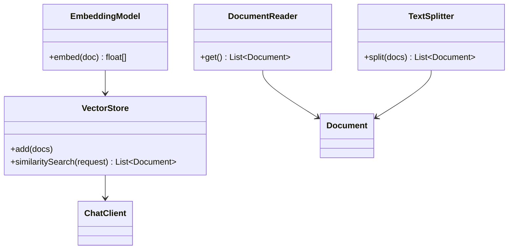
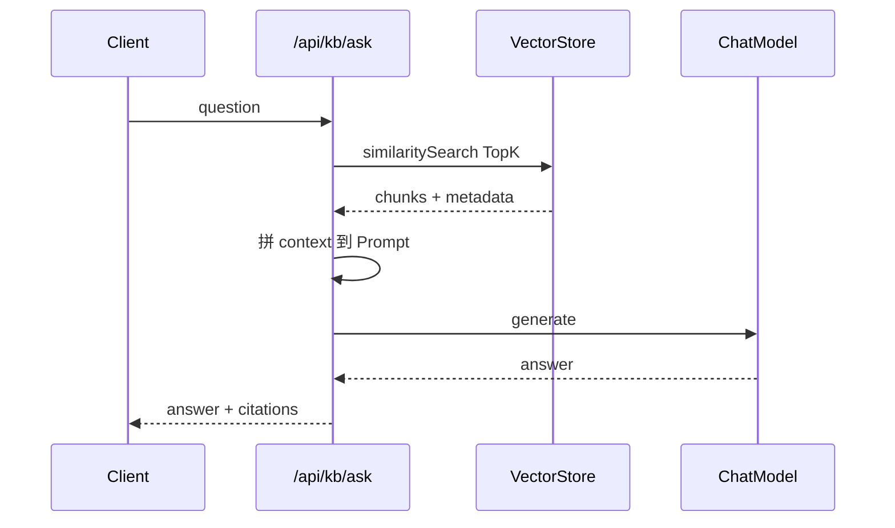
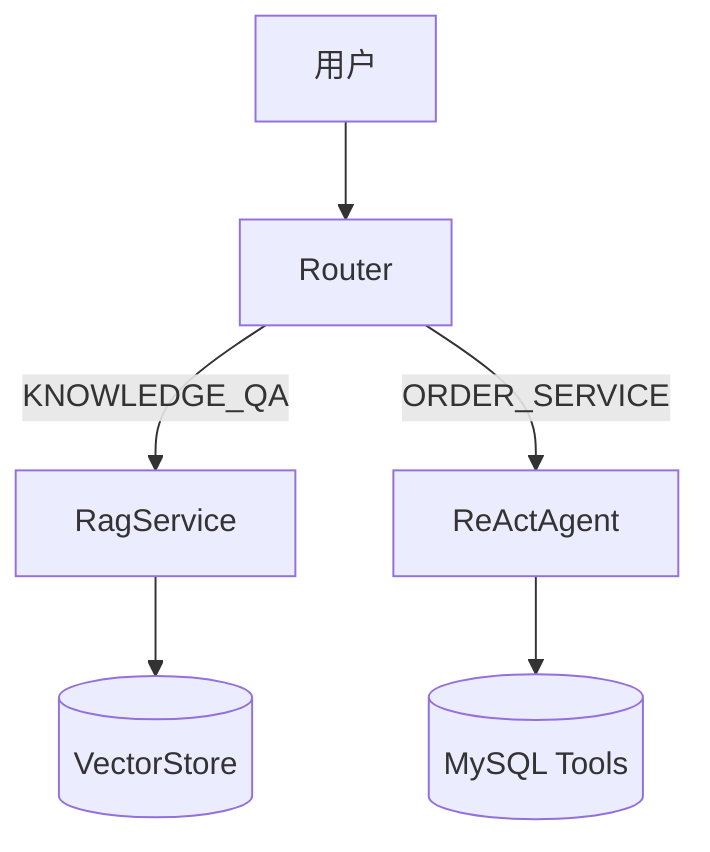

# RAG 检索增强生成基础

> **文件编码**：UTF-8。上传的 Markdown/PDF、分块文本、Prompt 模板均建议 UTF-8。

---

## 0. 读前导读（零基础也能跟上）

### 0.1 用一句话弄懂本章

**RAG = 先查资料，再让 AI 回答**：像开卷考试——用户提问时，系统从知识库里找出最相关的段落，塞进 Prompt，模型只能「看着资料说话」，减少胡编。

### 0.2 你需要提前知道什么（真不会就先跳到哪一章）

| 你现在的水平 | 建议 |
|--------------|------|
| 完全没写过 Java | 先学 [Java 01](../Java/01-Java基础语法与面向对象.md) 能跑 Spring Boot |
| 没用过 Spring AI ChatClient | 先读 [02 Spring AI 核心开发](./02-SpringAI核心开发.md) |
| 不懂 Agent / Tool | 先读 [05 Agent 架构与 ReAct](./05-Agent架构与ReAct模式.md)（本章 Router 会分流到 RAG） |
| 会复制粘贴、能跑 `curl` | ✅ 可以直接学本章 |
| 向量 / Embedding 完全陌生 | ✅ 本章 §4～§6 从零讲，不用预习 |

### 0.3 本章知识地图（学完后应能勾选全部 ☐→☑）

```text
☐ 能说出 RAG 解决的三座大山（幻觉、私有数据、新鲜度）
☐ 能画「索引阶段」与「查询阶段」两条流水线
☐ 理解 Document / Chunk / Embedding / VectorStore 四个对象
☐ 会用 MarkdownDocumentReader、TikaDocumentReader 加载文档
☐ 能解释为什么要分块、overlap 有什么用
☐ 能向朋友解释：文本怎么变成数字列表（Embedding）
☐ 能解释余弦相似度在找「意思相近」文档时的作用（不用公式）
☐ 在 agent-demo 跑通 ingest + ask，答案带 citations
☐ 能编写 rag-qa.st Prompt，约束「仅根据资料回答」
☐ 了解 Naive RAG 局限与 Advanced RAG 方向
☐ 能说明 faithfulness 含义并做简单人工评估
```

### 0.4 建议学习时长与节奏

| 阶段 | 内容 | 建议时间 |
|------|------|----------|
| 第 1 段 | §0～§2 概念 + 知识地图 | 45 分钟 |
| 第 2 段 | §3～§4 加载与分块 + 动手准备 kb-docs | 1 小时 |
| 第 3 段 | §5～§6 Embedding 与相似度（重点） | 1 小时 |
| 第 4 段 | §9 手把手 Demo + curl 验证 | 1.5 小时 |
| 第 5 段 | §10～§12 引用、评估、Router 组合 | 45 分钟 |
| 第 6 段 | FAQ + 闭卷自测 + 费曼检验 | 30 分钟 |
| **合计** | | **约 5～6 小时**（可分 2～3 天） |

### 0.5 学完本章你能做什么（可验证的具体动作）

1. 在 `agent-demo/kb-docs/` 放两份 Markdown，执行 `POST /api/kb/ingest`，看到 `chunkCount > 0`
2. 问「工作满一年年假几天？」，答案含 **10 天** 且 `citations` 指向 `年假制度.md`
3. 问知识库没有的内容，系统明确说「未找到相关资料」而不是胡编
4. 向同学解释：Embedding 是把句子变成一列数字，余弦相似度用来找「意思像不像」

### 0.6 如果卡住了怎么办

| 卡点 | 先检查 | 跳转到 |
|------|--------|--------|
| Ollama 连不上 | `ollama list` 是否有 chat + embedding 模型 | §14 报错表 |
| ingest 返回 0 chunk | `kb-docs` 路径、文件后缀 | §3.5、§9.8 |
| 检索为空 | threshold 太高、问法与文档差异大 | §13 参数表 |
| 答案胡编 | Prompt 约束弱、temperature 高 | §9.6 rag-qa.st |
| 看不懂 Embedding | 直接看 §5.0 生活类比 | §5.1 |

### 0.7 本章涉及的工具与环境

| 工具 | 用途 | 安装/启动 |
|------|------|-----------|
| Ollama | 本地 Chat + Embedding | `ollama pull qwen2.5:3b` + `nomic-embed-text` |
| agent-demo | Spring Boot 工程 | Maven 启动 8080 |
| curl / Postman | 调 API | 复制 §9.8 命令 |
| kb-docs/ | 测试 Markdown | §3.5 创建两个文件 |

### 0.8 核心术语预览（先混个脸熟）

| 术语 | 一句话 | 生活类比 |
|------|--------|----------|
| **Chunk（文本块）** | 长文档切成的短段落 | 把整本员工手册撕成一张张「便签」，每张便签单独检索 |
| **Embedding（嵌入向量）** | 把文字变成一列数字 | 给每句话发「语义身份证号」，意思近的号码也近 |
| **Vector（向量）** | 就是那一列数字本身 | 身份证号本身——一串有序数字，不是单个数 |
| **VectorStore（向量库）** | 存向量并能「找最像的」 | 图书馆索引柜：按「意思」而不是按书名首字母找书 |
| **Cosine Similarity（余弦相似度）** | 衡量两串数字「方向像不像」 | 两个人指向同一方向 → 相似度高；指向完全不同方向 → 低 |

---

## 本章与上一章的关系

05 章你学会了 **ReAct Agent**：模型可以多步调 Tool，根据 Observation 动态推理。但 Tool 只能访问你**预先写好接口**的数据——订单库、天气 API、库存系统。

企业还有大量**非结构化知识**：

- 员工手册 PDF、产品说明书 Markdown
- 内部 Wiki、会议纪要、合规制度
- 频繁更新的 FAQ、Release Notes

这些内容没法每个文件写一个 Tool。全塞进 System Prompt？**上下文装不下**，且无法增量更新。让模型裸答？**幻觉**严重，且**私有数据**不能泄露到训练里。

**RAG（Retrieval-Augmented Generation，检索增强生成）** 的思路：

```text
用户提问 → 从知识库检索相关片段 → 把片段塞进 Prompt → 模型基于资料生成回答
```

本章覆盖 RAG 全链路概念与 Spring AI 落地：**加载 → 分块 → 向量化 → 存储 → 检索 → 生成**，并在 `agent-demo` 实现**内存版 VectorStore**（07 章换 PGVector/Redis Vector）。

**前置章节**：[05 Agent 架构与 ReAct 模式](./05-Agent架构与ReAct模式.md)（Router 可把知识类问题分流到 RAG）。

---

## 本章衔接

| 上一章（05） | 本章（06） | 下一章（07） |
|--------------|------------|--------------|
| ReAct 多步 Tool | RAG 带资料回答 | 向量库生产落地 |
| Router 分订单/闲聊 | Router 增加 KNOWLEDGE_QA | PGVector 持久化 |
| Agent 查结构化数据 | 查 PDF/Markdown 非结构化 | 知识库 CRUD API |
| 怕模型编造订单状态 | 怕模型编造制度条款 | TopK、混合检索、重排 |



---

## 1. 为什么需要 RAG

### 1.1 纯 LLM 的三座大山

| 问题 | 表现 | RAG 如何缓解 |
|------|------|--------------|
| **幻觉（Hallucination）** | 编造不存在的政策、错误的数据 | 要求「仅根据以下资料回答」 |
| **私有数据** | 训练数据不含公司内部文档 | 检索本地知识库片段 |
| **知识新鲜度** | 模型 cutoff 后新功能不知道 | 更新文档重新 Embedding 即可 |
| **可溯源** | 用户无法验证答案 | 返回答案 + 引用 chunk 来源 |
| **成本** | 全文塞 Prompt 太贵 | 只检索 TopK 相关块 |

### 1.2 真实案例（模拟）

**场景**：HR 助手，员工问「2025 年年假有多少天？」

| 方案 | 结果 |
|------|------|
| 纯 Chat | 「一般为 5～15 天」——笼统且可能错 |
| 全文 Prompt | 把 80 页员工手册塞进上下文——超限、贵 |
| **RAG** | 检索到《考勤制度》第 3.2 节 → 「工龄满 1 年享 10 天」——准确可引用 |

### 1.3 RAG 不是什么

- **不是**微调：不改模型权重，只改检索内容
- **不是**万能：检索不到仍可能幻觉，需要「不知道就说不知道」
- **不是**替代 Agent：RAG 偏「读资料」，Agent 偏「做事情」，常组合使用



---

## 2. RAG 流水线总览

### 2.1 索引阶段（离线 / 写入）

```text
Load（加载文档）
  → Split（分块）
  → Embed（向量化）
  → Store（存入向量库）
```

### 2.2 查询阶段（在线 / 问答）

```text
Query（用户问题）
  → Embed（问题向量化）
  → Retrieve（相似度检索 TopK）
  → Augment（拼进 Prompt）
  → Generate（LLM 生成答案）
```

### 2.3 全流程图



### 2.4 关键对象

| 概念 | 说明 |
|------|------|
| **Document** | 一段文本 + metadata（来源、页码、标题） |
| **Chunk** | Split 后的 Document 子单元 |
| **Embedding** | 文本的稠密向量表示 |
| **VectorStore** | 存向量并支持相似度搜索 |

**Document（文档）**：Loader 读文件后的统一对象，含 `text` + `metadata`。
**生活类比**：从 PDF 撕下来的一页纸，页眉写着「来自哪本书第几页」（metadata）。
**Chunk（块）**：Document 再切小后的单元；检索和引用以 Chunk 为单位。
**VectorStore（向量库）**：存所有 Chunk 的向量与原文；06 章用内存版，07 章换 PGVector。

| 对象 | 何时产生 | 典型 metadata |
|------|----------|---------------|
| Document | Loader 读文件后 | source, title |
| Chunk | TextSplitter 之后 | source, chunk_index |
| Vector | EmbeddingModel 之后 | embedding_dim（可选） |
| Hit | similaritySearch 返回 | source, score |

---

## 3. 文档加载（Document Loaders）

### 3.1 为什么需要 Loader

原始资料格式各异：`.md`、`.pdf`、`.docx`、网页 HTML。Loader 负责 **解析成统一的 `Document` 对象**。

Spring AI 核心接口：

```java
public interface DocumentReader extends Supplier<List<Document>> {
    List<Document> get();
}
```

### 3.2 Markdown 加载

适合：内部 Wiki、Git 仓库文档、本学习资料。

```xml
<dependency>
    <groupId>org.springframework.ai</groupId>
    <artifactId>spring-ai-markdown-document-reader</artifactId>
</dependency>
```

```java
import org.springframework.ai.document.Document;
import org.springframework.ai.reader.markdown.MarkdownDocumentReader;
import org.springframework.ai.reader.markdown.config.MarkdownDocumentReaderConfig;
import org.springframework.core.io.FileSystemResource;

public List<Document> loadMarkdown(Path path) {
    MarkdownDocumentReaderConfig config = MarkdownDocumentReaderConfig.builder()
            .withHorizontalRuleCreateDocument(true)  // --- 分隔不同 Document
            .withIncludeCodeBlock(false)             // 代码块是否单独成文档
            .withIncludeBlockquote(false)
            .build();

    MarkdownDocumentReader reader = new MarkdownDocumentReader(
            new FileSystemResource(path.toFile()),
            config
    );
    return reader.get();
}
```

**metadata 示例**：

```json
{
  "source": "file:///kb/考勤制度.md",
  "title": "第三章 年假",
  "category": "header"
}
```

### 3.3 PDF 加载（Apache Tika）

```xml
<dependency>
    <groupId>org.springframework.ai</groupId>
    <artifactId>spring-ai-tika-document-reader</artifactId>
</dependency>
```

Tika 支持 PDF、Word、PPT、HTML 等多种格式。

```java
import org.springframework.ai.document.Document;
import org.springframework.ai.reader.tika.TikaDocumentReader;
import org.springframework.core.io.FileSystemResource;

public List<Document> loadPdf(Path pdfPath) {
    TikaDocumentReader reader = new TikaDocumentReader(
            new FileSystemResource(pdfPath.toFile())
    );
    return reader.get();
}
```

**注意**：

- 扫描版 PDF（图片）需 **OCR**，Tika 默认提取文字层；纯图片 PDF 要接 OCR 服务
- 大 PDF 先整篇读入再 Split，注意内存
- metadata 可含 `page_number`（取决于 reader 实现）

### 3.4 加载策略对比

| 格式 | Reader | 典型场景 | 注意点 |
|------|--------|----------|--------|
| Markdown | `MarkdownDocumentReader` | 技术文档、笔记 | 标题层级影响分块 |
| PDF | `TikaDocumentReader` | 合同、手册 | 扫描件要 OCR |
| 纯文本 | `TextReader` | 日志、CSV 说明 | 指定 charset |
| 网页 | `JsoupDocumentReader` | 爬虫入库 | 去噪、robots |

### 3.5 手把手：准备测试文档

| 步骤 | 你的动作 | 预期看到什么 | 若不对 |
|------|----------|--------------|--------|
| 1 | 在 `agent-demo/kb-docs/` 新建目录 | 文件夹存在 | 路径与 yml `docs-path` 一致 |
| 2 | 创建 `年假制度.md`、`报销说明.md` | 两个 UTF-8 文件 | 乱码则指定 UTF-8 保存 |
| 3 | 用 IDE 或 `type` 查看内容 | 含「10 天」「500 元」 | 内容被截断则重写 |
| 4 | （可选）放一份文字层 PDF | Tika 能 extract 文字 | 扫描件需 OCR |

在 `agent-demo/kb-docs/` 下创建：

**`年假制度.md`**：

```markdown
# 考勤与年假制度

## 3.2 年假天数

员工累计工作满 1 年不满 10 年的，年休假 10 天；
满 10 年不满 20 年的，年休假 15 天；
满 20 年的，年休假 20 天。

## 3.3 申请流程

年假需提前在 OA 提交申请，直属主管审批后方可休假。
```

**`报销说明.md`**：

```markdown
# 差旅报销说明

## 交通费

高铁二等座实报实销；飞机需经济舱。

## 住宿费

一线城市上限 500 元/晚，二线城市 350 元/晚。
```

---

## 4. 文本分块（Text Splitting）

**Chunk（文本块）**：把一篇长文档切成多段短文本，每段单独做 Embedding 和检索。
**生活类比**：一整本《员工手册》像一条长卷轴，检索时很难精准命中「年假 10 天」那一句。切成多张便签后，问「年假几天」就能直接抽到写着天数的那张。
**为什么重要**：Embedding 有长度上限；整本书一个向量语义太粗，检索不精准。
**本章用到的地方**：§4.3 TokenTextSplitter、§9.4 ingest 流水线。

### 4.1 为什么要分块

- Embedding 模型有 **token 上限**（通常 512～8192）
- 整本书一个向量 **语义太粗**，检索不精准
- 生成时只需 **相关段落**，省 Token

### 4.2 分块策略

| 策略 | 做法 | 优点 | 缺点 |
|------|------|------|------|
| **固定长度** | 每 500 字符切一刀 | 简单 | 可能切断句子 |
| **按段落** | 以 `\n\n` 或标题切 | 语义完整 | 块大小不均 |
| **递归字符** | 先段落再句子再字符 | 平衡 | 实现稍复杂 |
| **重叠（Overlap）** | 相邻块共享 50～100 token | 避免边界信息丢失 | 存储略增 |



### 4.3 Spring AI TextSplitter

```java
public interface TextSplitter {
    List<Document> split(List<Document> documents);
}
```

常用实现：`TokenTextSplitter`、`RecursiveCharacterTextSplitter`。

```java
import org.springframework.ai.transformer.splitter.TokenTextSplitter;

public List<Document> splitDocuments(List<Document> docs) {
    TokenTextSplitter splitter = new TokenTextSplitter(
            200,   // defaultChunkSize：目标 token 数
            100,   // minChunkSizeChars
            10,    // minChunkLengthToEmbed
            50,    // maxNumChunks
            true   // keepSeparator
    );
    return splitter.split(docs);
}
```

**递归字符分块（概念）**：

```java
// Spring AI 提供 RecursiveCharacterTextSplitter
// 分隔符优先级：\n\n → \n → 空格 → 字符
```

### 4.4 参数调优经验

| 参数 | 建议起点 | 说明 |
|------|----------|------|
| chunk size | 300～800 tokens | 太小上下文碎，太大噪声多 |
| overlap | chunk 的 10%～20% | 制度条款跨段时常用 |
| 按标题预切 | Markdown 先按 `##` | 每节独立向量，检索更准 |

### 4.5 分块反例

**反例 1**：chunk 太大（2000 token）

- 检索「年假几天」却整章命中，Prompt 噪声多

**反例 2**：overlap = 0 且刚好在「10 天」和「申请流程」边界切断

- 检索可能只拿到流程，拿不到天数

**反例 3**：代码块与说明混切

- 检索报销上限时混入无关代码

---

## 5. Embedding 模型与向量维度

### 5.0 从零理解：文本 → 数字列表（Embedding）

**Embedding（嵌入向量）**：用模型把一段文字变成 **固定长度的一列小数**，例如 768 个数：`[0.12, -0.34, 0.56, ...]`。
**生活类比**：想象给每句话在「语义地图」上分配一个 **GPS 坐标**。「年假有多少天」和「年休假几天」坐标很近；「报销上限多少」坐标离它们很远。RAG 检索就是：把用户问题也标一个坐标，找地图上离它最近的便签（Chunk）。
**Vector（向量）**：就是这一列数字本身——有序排列、每个位置都有含义（对人不可读，对模型可比较）。
**为什么重要**：计算机不能直接比较两段中文「意思像不像」，但可以比较两列数字的「距离/方向」。
**本章用到的地方**：§5.3 EmbeddingModel、§6 相似度、§9 检索。

```text
用户问题「工作满一年年假几天？」
    → Embedding 模型
    → [0.11, -0.33, 0.55, ...]   ← 768 个数字（维度=768）

知识库便签「员工满1年享10天年休假」
    → 同一模型
    → [0.12, -0.34, 0.56, ...]   ← 数字列很接近 → 检索命中

便签「一线城市住宿上限500元」
    → [−0.45, 0.22, 0.08, ...]   ← 数字列差得远 → 不会误命中
```

**关键规则**：

1. **索引和查询必须用同一个 Embedding 模型**（否则坐标系不一致，比了也白比）
2. **换模型 = 全部重新 Embedding**（维度可能从 768 变 1536）
3. 你不需要看懂每个数字的含义——只要知道「意思近 → 数字列近」

### 5.1 什么是 Embedding

把文本映射到 **高维稠密向量空间**，语义相近的文本向量距离更近。

```text
「年假有多少天」  →  [0.12, -0.34, 0.56, ...]
「年休假几天」    →  [0.11, -0.33, 0.55, ...]   ← 距离近
「报销上限」      →  [-0.45, 0.22, 0.08, ...]   ← 距离远
```

### 5.2 维度（Dimensions）

| 模型示例 | 维度 | 特点 |
|----------|------|------|
| OpenAI text-embedding-3-small | 1536（可降维） | 生态好、要 API |
| BGE-small-zh | 512 | 中文友好、可本地 |
| Ollama nomic-embed-text | 768 | 本地免费 |
| 通义 / DeepSeek Embedding | 视厂商而定 | 国内部署 |

**工程注意**：

- 索引与查询 **必须用同一模型**，维度必须一致
- 换模型要 **全量重新 Embedding**

### 5.3 Spring AI EmbeddingModel

```java
public interface EmbeddingModel extends Model<EmbeddingRequest, EmbeddingResponse> {
    EmbeddingResponse call(EmbeddingRequest request);
    default float[] embed(Document document) { ... }
    default List<float[]> embed(List<Document> documents) { ... }
}
```

配置 Ollama 本地 Embedding（练手推荐）：

```yaml
spring:
  ai:
    ollama:
      base-url: http://localhost:11434
      embedding:
        options:
          model: nomic-embed-text
```

配置 OpenAI 兼容（DeepSeek 等）：

```yaml
spring:
  ai:
    openai:
      api-key: ${DEEPSEEK_API_KEY}
      base-url: https://api.deepseek.com
      embedding:
        options:
          model: deepseek-embedding  # 以厂商文档为准
```

### 5.4 向量化代码

```java
@Service
public class EmbeddingService {

    private final EmbeddingModel embeddingModel;

    public EmbeddingService(EmbeddingModel embeddingModel) {
        this.embeddingModel = embeddingModel;
    }

    public List<Document> embedAndEnrich(List<Document> chunks) {
        List<float[]> vectors = embeddingModel.embed(chunks);
        for (int i = 0; i < chunks.size(); i++) {
            chunks.get(i).getMetadata().put("embedding_dim", vectors.get(i).length);
        }
        return chunks;
    }

    public float[] embedQuery(String query) {
        return embeddingModel.embed(query);
    }
}
```

### 5.5 手把手：验证 Embedding 是否工作

| 步骤 | 你的动作 | 预期看到什么 | 若不对 |
|------|----------|--------------|--------|
| 1 | 确认 Ollama 运行且已 pull embedding 模型 | `ollama list` 含 nomic-embed-text | §14 Connection refused |
| 2 | 启动 agent-demo，断点或日志看 ingest | 无 dimension mismatch | 换模型需清空库 |
| 3 | 用相近问法测 ask | 「年假几天」「年休假多少天」都能命中 | threshold 太高则放宽 |
| 4 | 用无关问法测 ask | 问「报销」不应主要引用年假 chunk | chunk 太大则调小 |

### 5.6 维度与模型对照（练手速查）

| 场景 | 模型 | 维度 | 备注 |
|------|------|------|------|
| Ollama 本地 | nomic-embed-text | 768 | 06 章 demo 默认 |
| OpenAI 兼容 | text-embedding-3-small | 1536 | 07 章 PGVector 常用 |
| 换模型 | — | **必须一致** | 索引+查询+表结构三者对齐 |

---

## 6. 相似度计算：余弦与点积

> 本节只用 **高中水平** 的直觉：不用矩阵、不用求导。公式仅作对照，会算「两个数相乘再相加」即可理解点积。

### 6.0 为什么需要「相似度」

检索时，系统手里有：**问题的数字列** + **知识库里成千上万条便签的数字列**。要问的是：**哪几条和问题最像？**

**Cosine Similarity（余弦相似度）**：衡量两列数字的 **方向** 是否接近，分数通常在 0～1 之间（越接近 1 越像）。
**生活类比**：两个人站在原点，各伸手指向一个方向。手指指向几乎相同 → 余弦相似度高；一个指东一个指西 → 低。RAG 不关心「手指有多长」（句子长短），更关心「指向是否一致」（意思是否一致）。
**为什么 RAG 常用余弦而不是比「谁数字更大」**：有些句子 embedding 后整体数值偏大、有些偏小；比方向更公平。
**本章用到的地方**：§9.5 `similaritySearch`、`similarityThreshold` 过滤。

**口算级例子（2 维简化，真实是 768 维）**：

```text
问题 A: [3, 4]   → 指向「右上方」
文档 B: [6, 8]   → 也是「右上方」（只是更长，方向相同）→ 余弦 ≈ 1.0，很相似
文档 C: [4, -3]  → 指向「右下方」→ 余弦低，不相似
```

**在代码里你通常不用手写**：Spring AI 的 `VectorStore.similaritySearch` 内部会算；你只需调 `topK` 和 `similarityThreshold`。

### 6.1 点积（Dot Product）

\[
\text{dot}(A, B) = \sum_{i=1}^{n} A_i \times B_i
\]

向量 **未归一化** 时，模长大的向量可能占优。

### 6.2 余弦相似度（Cosine Similarity）

\[
\text{cos}(A, B) = \frac{A \cdot B}{\|A\| \|B\|}
\]

值域 **[-1, 1]**，关注方向而非长度，**RAG 最常用**。

### 6.3 欧氏距离（L2）

距离越小越相似。部分向量库默认 L2。

### 6.4 对比

| 度量 | 特点 | 典型场景 |
|------|------|----------|
| Cosine | 尺度不变，适合文本 | OpenAI Embedding、大多数 RAG |
| Dot Product | 快，若已归一化等价 cosine | 部分 ANN 索引 |
| L2 | 几何距离 | FAISS 部分配置 |

```java
public static double cosineSimilarity(float[] a, float[] b) {
    if (a.length != b.length) {
        throw new IllegalArgumentException("dimension mismatch");
    }
    double dot = 0, normA = 0, normB = 0;
    for (int i = 0; i < a.length; i++) {
        dot += a[i] * b[i];
        normA += a[i] * a[i];
        normB += b[i] * b[i];
    }
    return dot / (Math.sqrt(normA) * Math.sqrt(normB));
}
```

**Spring AI VectorStore** 默认使用 EmbeddingModel 配套的相似度策略，业务层一般 **无需手写**。

---

## 7. Naive RAG vs Advanced RAG

### 7.1 Naive RAG（本章主线）

```text
分块 → Embedding → TopK 向量检索 → 拼 Prompt → 生成
```

**优点**：实现快、易调试  
**缺点**：检索不准时答案全错；无查询改写；无重排

### 7.2 Advanced RAG（了解，07～10 章逐步深入）

| 技术 | 作用 |
|------|------|
| **Query Rewriting** | 「年假」→「年休假天数 考勤制度」 |
| **Hybrid Search** | 向量 + BM25 关键词混合 |
| **Rerank** | 用 Cross-Encoder 对 Top50 重排取 Top5 |
| **Parent Document** | 检索小块、返回大段上下文 |
| **Graph RAG** | 知识图谱增强（进阶） |



### 7.3 何时升级

| 现象 | 可能方案 |
|------|----------|
| 专有名词搜不到 | 加 BM25 混合检索 |
| TopK 里噪声多 | Rerank 模型 |
| 用户问法口语化 | Query 改写 |
| 块太小缺上下文 | Parent Document Retriever |

本章先把 **Naive RAG + 内存 VectorStore** 跑通，07 章接持久化与混合检索。

---

## 8. Spring AI 核心接口对照

| 接口 | 职责 | 本章实现 |
|------|------|----------|
| `DocumentReader` | 加载原始文件 → `List<Document>` | Markdown / Tika PDF |
| `TextSplitter` | 大文档 → 小块 | `TokenTextSplitter` |
| `EmbeddingModel` | 文本 → `float[]` | Ollama / OpenAI 兼容 |
| `VectorStore` | 存向量 + 相似搜索 | `SimpleVectorStore`（内存） |
| `ChatClient` | 带 context 生成 | RAG Prompt 模板 |



---

## 9. 手把手：内存 VectorStore RAG Demo

> 目标：在 `agent-demo` 实现 `POST /api/kb/ingest` 入库、`POST /api/kb/ask` 问答。向量存内存，重启丢失——**刻意为之**，07 章换 PGVector。

### 9.1 Maven 依赖

```xml
<dependencies>
    <dependency>
        <groupId>org.springframework.ai</groupId>
        <artifactId>spring-ai-starter-model-ollama</artifactId>
    </dependency>
    <dependency>
        <groupId>org.springframework.ai</groupId>
        <artifactId>spring-ai-markdown-document-reader</artifactId>
    </dependency>
    <dependency>
        <groupId>org.springframework.ai</groupId>
        <artifactId>spring-ai-tika-document-reader</artifactId>
    </dependency>
    <dependency>
        <groupId>org.springframework.ai</groupId>
        <artifactId>spring-ai-advisors-vector-store</artifactId>
    </dependency>
</dependencies>
```

### 9.2 application.yml

```yaml
spring:
  ai:
    ollama:
      base-url: http://localhost:11434
      chat:
        options:
          model: qwen2.5:3b
      embedding:
        options:
          model: nomic-embed-text

agent:
  kb:
    docs-path: ./kb-docs
```

### 9.3 VectorStore 配置

```java
package com.example.agent.config;

import org.springframework.ai.embedding.EmbeddingModel;
import org.springframework.ai.vectorstore.SimpleVectorStore;
import org.springframework.ai.vectorstore.VectorStore;
import org.springframework.context.annotation.Bean;
import org.springframework.context.annotation.Configuration;

@Configuration
public class RagConfig {

    @Bean
    public VectorStore vectorStore(EmbeddingModel embeddingModel) {
        return SimpleVectorStore.builder(embeddingModel).build();
    }
}
```

### 9.4 KnowledgeIngestService — 索引流水线

```java
package com.example.agent.service;

import org.springframework.ai.document.Document;
import org.springframework.ai.reader.markdown.MarkdownDocumentReader;
import org.springframework.ai.reader.markdown.config.MarkdownDocumentReaderConfig;
import org.springframework.ai.reader.tika.TikaDocumentReader;
import org.springframework.ai.transformer.splitter.TokenTextSplitter;
import org.springframework.ai.vectorstore.VectorStore;
import org.springframework.beans.factory.annotation.Value;
import org.springframework.core.io.FileSystemResource;
import org.springframework.stereotype.Service;

import java.io.IOException;
import java.nio.file.Files;
import java.nio.file.Path;
import java.util.ArrayList;
import java.util.List;
import java.util.stream.Stream;

@Service
public class KnowledgeIngestService {

    private final VectorStore vectorStore;
    private final Path docsPath;

    public KnowledgeIngestService(
            VectorStore vectorStore,
            @Value("${agent.kb.docs-path}") String docsPath
    ) {
        this.vectorStore = vectorStore;
        this.docsPath = Path.of(docsPath);
    }

    public int ingestAll() throws IOException {
        List<Document> allDocs = new ArrayList<>();

        try (Stream<Path> paths = Files.walk(docsPath)) {
            paths.filter(Files::isRegularFile).forEach(path -> {
                String name = path.getFileName().toString().toLowerCase();
                if (name.endsWith(".md")) {
                    allDocs.addAll(loadMarkdown(path));
                } else if (name.endsWith(".pdf")) {
                    allDocs.addAll(loadPdf(path));
                }
            });
        }

        TokenTextSplitter splitter = new TokenTextSplitter(300, 150, 10, 100, true);
        List<Document> chunks = splitter.split(allDocs);

        chunks.forEach(doc -> doc.getMetadata().putIfAbsent("kb_version", "v1"));
        vectorStore.add(chunks);

        return chunks.size();
    }

    private List<Document> loadMarkdown(Path path) {
        MarkdownDocumentReaderConfig config = MarkdownDocumentReaderConfig.builder()
                .withHorizontalRuleCreateDocument(true)
                .build();
        MarkdownDocumentReader reader = new MarkdownDocumentReader(
                new FileSystemResource(path.toFile()),
                config
        );
        List<Document> docs = reader.get();
        docs.forEach(d -> d.getMetadata().put("source", path.toString()));
        return docs;
    }

    private List<Document> loadPdf(Path path) {
        TikaDocumentReader reader = new TikaDocumentReader(
                new FileSystemResource(path.toFile())
        );
        List<Document> docs = reader.get();
        docs.forEach(d -> d.getMetadata().put("source", path.toString()));
        return docs;
    }
}
```

### 9.5 RagService — 检索 + 生成

```java
package com.example.agent.service;

import org.springframework.ai.chat.client.ChatClient;
import org.springframework.ai.document.Document;
import org.springframework.ai.vectorstore.SearchRequest;
import org.springframework.ai.vectorstore.VectorStore;
import org.springframework.beans.factory.annotation.Value;
import org.springframework.core.io.Resource;
import org.springframework.stereotype.Service;

import java.io.IOException;
import java.nio.charset.StandardCharsets;
import java.util.List;
import java.util.stream.Collectors;

@Service
public class RagService {

    private final VectorStore vectorStore;
    private final ChatClient chatClient;
    private final String ragPromptTemplate;

    public RagService(
            VectorStore vectorStore,
            ChatClient.Builder chatClientBuilder,
            @Value("classpath:prompts/rag-qa.st") Resource promptResource
    ) throws IOException {
        this.vectorStore = vectorStore;
        this.chatClient = chatClientBuilder.build();
        this.ragPromptTemplate = promptResource.getContentAsString(StandardCharsets.UTF_8);
    }

    public RagAnswer ask(String question, int topK, double similarityThreshold) {
        List<Document> hits = vectorStore.similaritySearch(
                SearchRequest.builder()
                        .query(question)
                        .topK(topK)
                        .similarityThreshold(similarityThreshold)
                        .build()
        );

        if (hits.isEmpty()) {
            return RagAnswer.noContext(question);
        }

        String context = buildContext(hits);
        String prompt = ragPromptTemplate
                .replace("{context}", context)
                .replace("{question}", question);

        String answer = chatClient.prompt()
                .user(prompt)
                .call()
                .content();

        List<SourceCitation> citations = hits.stream()
                .map(this::toCitation)
                .toList();

        return new RagAnswer(question, answer, citations, hits.size());
    }

    private String buildContext(List<Document> hits) {
        StringBuilder sb = new StringBuilder();
        for (int i = 0; i < hits.size(); i++) {
            Document doc = hits.get(i);
            sb.append("[片段").append(i + 1).append("]\n");
            sb.append("来源: ").append(doc.getMetadata().getOrDefault("source", "unknown")).append("\n");
            sb.append(doc.getText()).append("\n\n");
        }
        return sb.toString();
    }

    private SourceCitation toCitation(Document doc) {
        return new SourceCitation(
                String.valueOf(doc.getMetadata().getOrDefault("source", "unknown")),
                doc.getText().substring(0, Math.min(120, doc.getText().length())) + "..."
        );
    }

    public record SourceCitation(String source, String excerpt) {}

    public record RagAnswer(
            String question,
            String answer,
            List<SourceCitation> citations,
            int retrievedCount
    ) {
        static RagAnswer noContext(String question) {
            return new RagAnswer(
                    question,
                    "知识库中未找到相关资料，无法回答。请尝试换个问法或联系 HR。",
                    List.of(),
                    0
            );
        }
    }
}
```

### 9.6 Prompt 模板 `rag-qa.st`

```text
你是一个企业知识库助手。请严格根据以下「参考资料」回答用户问题。

## 规则
1. 仅使用参考资料中的信息，不要编造
2. 若资料不足以回答，明确说「根据现有资料无法确定」
3. 回答末尾用「引用：」列出用到的片段编号，如 [片段1][片段2]

## 参考资料
{context}

## 用户问题
{question}

## 请回答
```

### 9.7 Controller

```java
package com.example.agent.controller;

import com.example.agent.service.KnowledgeIngestService;
import com.example.agent.service.RagService;
import org.springframework.web.bind.annotation.*;

@RestController
@RequestMapping("/api/kb")
public class KnowledgeBaseController {

    private final KnowledgeIngestService ingestService;
    private final RagService ragService;

    public KnowledgeBaseController(
            KnowledgeIngestService ingestService,
            RagService ragService
    ) {
        this.ingestService = ingestService;
        this.ragService = ragService;
    }

    @PostMapping("/ingest")
    public IngestResponse ingest() throws Exception {
        int chunks = ingestService.ingestAll();
        return new IngestResponse(chunks, "ok");
    }

    record IngestResponse(int chunkCount, String status) {}

    @PostMapping("/ask")
    public RagService.RagAnswer ask(@RequestBody AskRequest request) {
        int topK = request.topK() == null ? 4 : request.topK();
        double threshold = request.similarityThreshold() == null ? 0.5 : request.similarityThreshold();
        return ragService.ask(request.question(), topK, threshold);
    }

    record AskRequest(String question, Integer topK, Double similarityThreshold) {}
}
```

### 9.8 验证步骤

| 步骤 | 你的动作 | 预期看到什么 | 若不对 |
|------|----------|--------------|--------|
| 1 | `ollama pull qwen2.5:3b` 和 `nomic-embed-text` | 两个模型下载完成 | 见 §14「model not found」 |
| 2 | 确认 `kb-docs/` 有两个 `.md` 文件 | 目录非空 | §3.5 创建测试文档 |
| 3 | 启动 `agent-demo` | 8080 端口监听 | 查 Spring Boot 日志 |
| 4 | `POST /api/kb/ingest` | `{"chunkCount":N,"status":"ok"}`，N>0 | §14「chunkCount: 0」 |
| 5 | `POST /api/kb/ask` 问年假 | `answer` 含「10 天」；`citations` 含 `年假制度.md` | 降 threshold；检查 embedding |
| 6 | 问知识库没有的内容 | 明确拒答，不胡编 | 强化 rag-qa.st |
| 7 | 重启应用后再 ask（不 ingest） | 内存库为空或检索失败 | 预期行为；07 章换 PGVector |

```powershell
# 1. 确保 Ollama 已 pull chat + embedding 模型
ollama pull qwen2.5:3b
ollama pull nomic-embed-text

# 2. 启动 agent-demo

# 3. 入库
curl -X POST http://localhost:8080/api/kb/ingest

# 预期：{"chunkCount": N, "status":"ok"}，N > 0

# 4. 问答
curl -X POST http://localhost:8080/api/kb/ask `
  -H "Content-Type: application/json" `
  -d "{\"question\":\"工作满一年年假几天？\",\"topK\":4}"
```

**预期**：`answer` 含「10 天」；`citations` 指向 `年假制度.md`。

### 9.9 逐行读代码：KnowledgeIngestService.ingestAll

| 行号/代码 | 含义 | 改错会怎样 |
|-----------|------|------------|
| `Files.walk(docsPath)` | 递归遍历知识库目录下所有文件 | 路径错 → 0 个文件 |
| `name.endsWith(".md")` | 只处理 Markdown；PDF 走 else 分支 | 漏写后缀 → 文件被跳过 |
| `TokenTextSplitter(300, 150, ...)` | 目标约 300 token 一块，最小 150 字符 | 块太大 → 检索噪声多；太小 → 上下文碎 |
| `splitter.split(allDocs)` | 大 Document → 多个 Chunk | 不分块 → 整篇一个向量，检索差 |
| `metadata.put("kb_version", "v1")` | 标记入库版本，便于以后重建 | 无影响功能，利于运维 |
| `vectorStore.add(chunks)` | 内部：Embedding + 写入 VectorStore | 模型未启动 → Connection refused |
| `return chunks.size()` | 返回块数供 API 展示 | — |

### 9.10 逐行读代码：RagService.ask

| 行号/代码 | 含义 | 改错会怎样 |
|-----------|------|------------|
| `similaritySearch(SearchRequest.builder()...)` | 问题转向量 → 在库中找 TopK 最像的块 | 未 ingest → 空列表 |
| `.topK(topK)` | 最多取几条便签进 Prompt | 太大 → Token 贵、噪声多 |
| `.similarityThreshold(...)` | 低于此分数的块丢弃 | 太高 → 经常「无结果」 |
| `if (hits.isEmpty())` | 无资料时拒答，不强行生成 | 删掉 → 模型容易胡编 |
| `buildContext(hits)` | 把片段编号、来源、正文拼成 context | 格式乱 → 模型难引用 |
| `ragPromptTemplate.replace(...)` | 把 context、question 填入模板 | 占位符名错 → 原样输出 `{context}` |
| `chatClient.prompt().user(prompt).call()` | 调用 Chat 模型生成答案 | temperature 高 → 更易偏离资料 |
| `toCitation(doc)` | 构造 API 返回的引用列表 | 无 citations → 用户无法核验 |



---

## 10. 引用与来源标注（Citation）

### 10.1 为什么需要 Citation

- 用户 **核验** HR 政策是否准确
- 合规场景 **审计追溯**
- 检索错了时用户能发现 **资料本身就不对**

### 10.2 实现层次

| 层次 | 做法 |
|------|------|
| Prompt 要求 | 「末尾列出 [片段N]」 |
| 结构化返回 | API 返回 `citations[]` |
| 前端展示 | 脚注链接到原文档页码 |
| 内联引用 | 「年假为 10 天[^1]」 |

### 10.3 metadata 设计

```java
doc.getMetadata().put("source", "kb-docs/年假制度.md");
doc.getMetadata().put("section", "3.2 年假天数");
doc.getMetadata().put("chunk_id", UUID.randomUUID().toString());
doc.getMetadata().put("page", 12);  // PDF
```

### 10.4 防止「假引用」

后处理检查：答案中的 `[片段1]` 是否都在 `hits` 范围内；Prompt 强调「不得引用未提供的片段」。

---

## 11. RAG 评估基础（Faithfulness）

### 11.1 评估什么

| 指标 | 含义 |
|------|------|
| **Faithfulness（忠实度）** | 答案是否可由检索片段推出 |
| **Relevance（相关性）** | 检索片段是否与问题相关 |
| **Answer Correctness** | 与标准答案是否一致 |
| **Context Precision** | TopK 里有用片段占比 |

### 11.2 人工评估表（练手）

| 问题 | 检索是否相关 | 答案是否忠实 | 备注 |
|------|-------------|-------------|------|
| 年假几天 | ✅ | ✅ | |
| 飞机能报商务舱吗 | ✅ | | 应回答经济舱 |
| 公司上市代码 | ❌ 无资料 | | 应拒答 |

### 11.3 LLM-as-Judge（了解）

用另一个 Prompt 让模型打分：

```text
给定资料 CONTEXT、问题 QUESTION、答案 ANSWER。
判断 ANSWER 是否完全基于 CONTEXT，无编造。
输出 JSON: {"faithful": true/false, "reason": "..."}
```

### 11.4 回归测试集

维护 `kb-qa-golden.json`：

```json
[
  {
    "question": "工作满一年年假几天？",
    "expectedContains": ["10", "10天"],
    "mustCiteSource": "年假制度.md"
  }
]
```

CI 中调用 `/api/kb/ask` 断言。

---

## 12. 与 Router / Agent 组合

```java
public String handle(String question) {
    return switch (router.classify(question)) {
        case KNOWLEDGE_QA -> ragService.ask(question, 4, 0.5).answer();
        case ORDER_SERVICE -> reactAgent.run(question, 8).finalAnswer();
        default -> chatClient.prompt().user(question).call().content();
    };
}
```



**注意**：RAG 与 Tool **不要混在同一次 Prompt 里乱用**——先 Router 分流，各走各的链路。

---

## 13. 参数调优速查

| 参数 | 默认 | 调高效果 | 调低效果 |
|------|------|----------|----------|
| topK | 4 | 更多上下文，噪声增 | 可能漏关键片段 |
| similarityThreshold | 0.5～0.7 | 更严格，易「无结果」 | 更宽松，易掺无关块 |
| chunk size | 300 token | 上下文更完整 | 检索更精准 |
| temperature（生成） | 0～0.3 | 更随机 | RAG 建议偏低 |

---

## 14. 常见报错与排查

| 报错信息（关键词） | 可能原因 | 解决方案 |
|-------------------|---------|---------|
| `Connection refused :11434` | Ollama 未启动 | 启动 Ollama；检查 `base-url` |
| `model "nomic-embed-text" not found` | 未 pull embedding 模型 | `ollama pull nomic-embed-text` |
| `dimension mismatch` | 索引与查询用了不同 Embedding 模型 | 清空 VectorStore 重新 ingest |
| `chunkCount: 0` | `kb-docs` 路径错或空目录 | 检查 `agent.kb.docs-path`；放 md 文件 |
| 检索结果为空 | threshold 太高或问法差异大 | 降低 threshold；改写 query；减小 chunk |
| 答案胡编，与资料无关 | Prompt 约束弱；temperature 高 | 强化 rag-qa.st；temperature=0 |
| `TikaException` / PDF 解析失败 | PDF 损坏或加密 | 换文件；解密后再传 |
| `OutOfMemoryError` ingest | 单次载入超大 PDF | 流式处理；按页拆分 |
| `SimpleVectorStore` 重启后无数据 | 内存库未持久化 | 预期行为；07 章换 PGVector |
| `context length exceeded` | topK 过大或 chunk 太大 | 减小 topK；压缩 context |
| 中文检索效果差 | 用了英文 Embedding | 换 BGE-zh 等多语模型 |
| 重复 chunk 入库 | 多次 ingest 未清库 | ingest 前 clear；按 doc_id 去重 |
| `IllegalArgumentException` topK | topK=0 或负数 | 参数校验，默认 4 |

---

## 15. 分级练习

### 基础

完成 §9 手把手：ingest `kb-docs` 两个 Markdown，问「年假几天」「住宿费上限」，答案正确且带 `citations`。

### 进阶

新增一份 PDF（或扫描版以外的文字 PDF）入库；对比 **固定长度分块** 与 **TokenTextSplitter** 对同一问题检索条目的差异。

### 挑战

实现简易 **faithfulness 检查**：对 `RagAnswer` 用 LLM 判断答案是否可由 `citations` 推出；不忠实时返回答案 + 警告。

---

## 16. 参考答案

### 基础

```powershell
curl -X POST http://localhost:8080/api/kb/ingest
curl -X POST http://localhost:8080/api/kb/ask `
  -H "Content-Type: application/json" `
  -d "{\"question\":\"一线城市住宿报销上限多少？\"}"
```

**预期**：`answer` 含「500」；`citations` 含 `报销说明.md`。

### 进阶：分块对比

1. 用 `TokenTextSplitter(100, ...)` ingest 一次，记录 ask 的 `retrievedCount` 和答案
2. 重启应用，换 `TokenTextSplitter(500, ...)` 再 ingest
3. 对比：小块通常检索更精准；大块可能一条 chunk 含多个主题

记录表：

| chunk size | 问题 | Top1 来源 | 答案质量 |
|------------|------|-----------|----------|
| 100 | 年假几天 | 年假制度.md §3.2 | 准确 |
| 500 | 年假几天 | 可能整章 | 仍准确但 Prompt 更长 |

### 挑战：Faithfulness 伪代码

```java
public boolean checkFaithfulness(String context, String answer, ChatClient judge) {
    String prompt = """
        CONTEXT:
        %s

        ANSWER:
        %s

        仅输出 YES 或 NO：ANSWER 是否完全可由 CONTEXT 推出？
        """.formatted(context, answer);
    String verdict = judge.prompt().user(prompt).call().content().strip();
    return verdict.startsWith("YES");
}
```

在 `RagService.ask` 返回前调用；若 false，`answer` 追加「（系统检测：回答可能与资料不完全一致，请人工核实）」。

---

## 17. 面试高频题

**Q1：RAG 解决什么问题？**

> 幻觉、私有数据、知识新鲜度；通过检索相关文档再生成，让回答有据可依。

**Q2：RAG 流程五步？**

> Load → Split → Embed → Store；Query → Embed → Retrieve → Augment → Generate。

**Q3：为什么要分块？overlap 作用？**

> 适配 Embedding 长度、提高检索精度；overlap 避免关键句被切在边界两侧导致检索丢失。

**Q4：余弦相似度和点积区别？**

> 余弦看方向、归一化尺度；点积受向量模长影响。文本 RAG 常用余弦。

**Q5：Naive RAG 和 Advanced RAG？**

> Naive：向量 TopK 即生成；Advanced：混合检索、重排、Query 改写、Parent Document 等。

**Q6：Spring AI 里四个核心接口？**

> DocumentReader、TextSplitter、EmbeddingModel、VectorStore。

**Q7：换 Embedding 模型要注意什么？**

> 维度可能变化；必须全量重新索引；查询与索引用同一模型。

**Q8：如何评估 RAG 质量？**

> Faithfulness、相关性、人工 golden set、LLM-as-Judge；生产加回归测试。

**Q9：检索不到时怎么办？**

> 明确拒答；不要强行生成；可提示换关键词或转人工。

**Q10：RAG 和 Fine-tuning 怎么选？**

> RAG 适合频繁更新知识、要溯源；微调适合固定风格/格式、领域语言习惯，成本高。

---

## 18. 高频知识点清单

- RAG 动机：幻觉、私有、新鲜度
- 索引与查询两阶段
- Markdown / Tika PDF 加载
- 固定长度、段落、overlap 分块
- Embedding 与维度
- Cosine vs Dot Product
- Naive vs Advanced（hybrid、rerank）
- Spring AI 四大接口
- SimpleVectorStore 内存 demo
- Prompt 模板与 Citation
- Faithfulness 评估入门
- 与 Router / Agent 编排

---

## 19. 学完标准

- [ ] 能画 RAG 全流程图（load-split-embed-store-retrieve-generate）
- [ ] 能解释为什么需要分块、overlap 的作用
- [ ] 理解 Embedding 维度、余弦相似度含义
- [ ] 会用 `MarkdownDocumentReader`、`TikaDocumentReader` 加载文档
- [ ] 会用 `TokenTextSplitter` 分块并 `vectorStore.add`
- [ ] 在 `agent-demo` 跑通 ingest + ask，答案含 citations
- [ ] 能编写带 `{context}` 的 RAG Prompt，约束不编造
- [ ] 了解 Naive RAG 局限与 hybrid/rerank 方向
- [ ] 能说明 faithfulness 含义并做简单人工评估
- [ ] 知道内存 VectorStore 局限，明确 07 章要换持久化向量库

---

## 21. 常见问题 FAQ（≥10）

**Q1：RAG 和直接把所有文档塞进 Prompt 有什么区别？**  
RAG 只检索 **TopK 相关片段**，省 Token、可增量更新；全文塞入会超限且贵。

**Q2：Embedding 输出的数字人能读懂吗？**  
不能。它们是给程序算相似度用的「语义坐标」，只要同一模型下「意思近 → 数字近」即可。

**Q3：为什么索引和查询必须用同一个 Embedding 模型？**  
不同模型相当于不同「坐标系」，不可混比。

**Q4：chunk 切太小或太大各有什么问题？**  
太小上下文碎；太大检索不精准、Prompt 噪声多。

**Q5：overlap 重叠块解决什么问题？**  
关键句被切在边界时，重叠让相邻块都含该句，避免漏检。

**Q6：余弦相似度 0.7 算高还是低？**  
因模型而异；先 `threshold=0.5` 看分布再收紧。

**Q7：检索到了资料，模型还是胡编怎么办？**  
加强 Prompt；`temperature=0`；加 faithfulness 检查（§11）。

**Q8：SimpleVectorStore 能上线吗？**  
不能。重启丢数据；07 章换 PGVector/Redis。

**Q9：PDF 扫描件为什么检索不到？**  
需 OCR；Tika 默认只提文字层。

**Q10：RAG 能替代 Fine-tuning 吗？**  
各擅胜场：RAG 适合更新快的事实；微调适合风格/格式。

**Q11：问法和文档写法差很多怎么办？**  
调 chunk/overlap；Advanced 里 Query 改写、混合检索。

**Q12：citations 对了但答案错了？**  
生成阶段未忠实 context；查 Prompt 与 temperature。

---

## 22. 闭卷自测（≥10）

1. **概念**：RAG 全称？解决哪三个核心痛点？
2. **概念**：索引四步与查询五步？
3. **概念**：Chunk、Embedding、VectorStore 各指什么？
4. **概念**：为什么需要 overlap？举例。
5. **概念**：余弦相似度衡量什么？RAG 为何常用？
6. **概念**：Naive 与 Advanced RAG 主要差别？
7. **动手**：`chunkCount: 0` 时查哪三处？
8. **动手**：Prompt 占位符 `{context}`、`{question}` 作用？
9. **综合**：Router 为何不把 RAG 与 Tool 混在同 Prompt？
10. **综合**：换 Embedding 模型后必做哪步？

### 自测参考答案

1. Retrieval-Augmented Generation；幻觉、私有/新鲜知识、溯源与成本。
2. Load→Split→Embed→Store；Query→Embed→Retrieve→Augment→Generate。
3. Chunk=分块单元；Embedding=向量表示；VectorStore=存向量并相似搜索。
4. 防边界切断；如「10天」与「申请流程」分属两块，overlap 可保留「10天」。
5. 向量方向接近度；对句长不敏感，适合语义检索。
6. Naive=TopK 即生成；Advanced=改写、混合、重排等。
7. `kb-docs` 路径；文件后缀；Loader 日志。
8. 注入检索片段与用户问题。
9. 结构化 Tool 与非结构化 RAG 链路不同，混用易乱源。
10. 全量 re-ingest；维度/坐标系不可混。

---

## 23. 费曼检验

请 **不看资料**，用 3 分钟向没学过编程的朋友解释本章核心。

**对照提纲**：

1. **开卷考试**：每次答题前去书架抽最相关几页，看着答，不是背整本手册。
2. **撕便签 + GPS**：长文撕成便签（Chunk），每张贴语义 GPS（Embedding）；问题也标 GPS，找最近便签。
3. **方向一致**：数字列方向越像（余弦越高）意思越近；便签塞进 Prompt，要求 AI 不许瞎编。

---

## 20. 我的笔记区

```text
ingest 后 chunk 数量：
topK / threshold 最佳组合：
最容易检索失败的问题：
Embedding 模型与维度：
07 章待接入的向量库选型：
```

---

## 附录 A：RAG 参数调优实验记录模板

练手时建议固定一份 Markdown 记录，便于 07 章迁移 PGVector 后对比：

```markdown
## 实验日期：____

| 变量 | 取值 |
|------|------|
| Embedding 模型 | nomic-embed-text / deepseek-embedding |
| chunk size | 300 / 500 / 800 |
| overlap | 50 / 100 |
| topK | 4 / 8 |
| threshold | 0.5 / 0.7 |

| 测试问题 | 期望关键词 | 实际答案 | citations 来源 | 通过? |
|----------|------------|----------|----------------|-------|
| 年假几天 | 10 | | | |
| 住宿上限 | 500 | | | |
| 库外问题 | 拒答 | | | |
```

## 附录 B：Embedding 零基础问答（给非技术同事）

**问：Embedding 是不是加密？**  
不是。加密要还原原文；Embedding 是单向的语义摘要，不能从数字反推原句。

**问：为什么不用关键词搜索？**  
「年休假」和「年假」关键词不同但意思一样；Embedding 把意思近的放在一起。

**问：向量有多少个数？**  
看模型：768、1536 等；叫「维度」。维度越高不一定越好，要同一模型配套使用。

## 附录 C：零基础一天上手路径（只学 RAG）

| 时段 | 任务 | 完成标志 |
|------|------|----------|
| 上午 1 | 读 §0 + §2 流程图 | 能画出 load→split→embed→store |
| 上午 2 | §5.0 Embedding 类比 + §6.0 余弦直觉 | 能向朋友解释「GPS 找便签」 |
| 下午 1 | §3.5 建 kb-docs + §9 Maven/yml | 项目能启动 |
| 下午 2 | §9.8 步骤表 ingest/ask | 年假问题答对 |
| 晚上 | §22 闭卷自测 + §23 费曼 | 10 题对 8 题以上 |

**最小依赖路径**：Ollama + 内存 SimpleVectorStore，无需 Docker；07 章再补 PGVector。

---

## 下一章预告

本章 `SimpleVectorStore` **重启即空**，无法支撑生产知识库。下一章（[07 向量数据库与知识库实战](./07-向量数据库与知识库实战.md)）将：

- 接入 **PGVector** 或 **Redis Vector** 持久化
- 知识库文档 CRUD、按用户隔离
- **混合检索**（向量 + 关键词）与 **Rerank** 入门
- 与 MySQL 存文档元数据衔接（复用 Java 05～06 经验）

---

*下一章：07 向量数据库与知识库实战*
