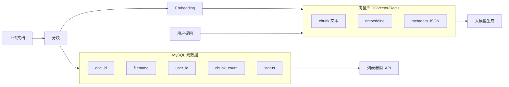
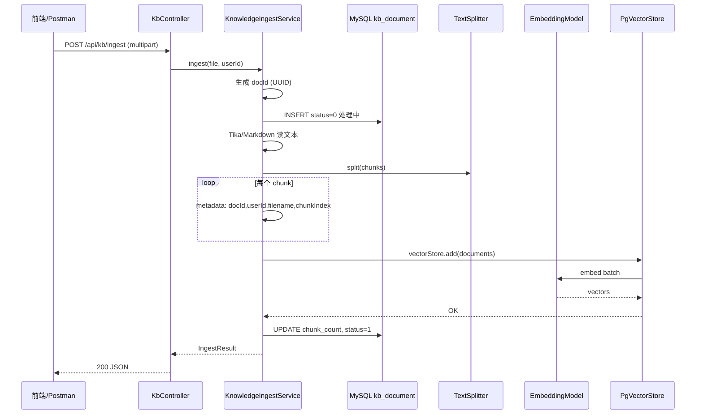
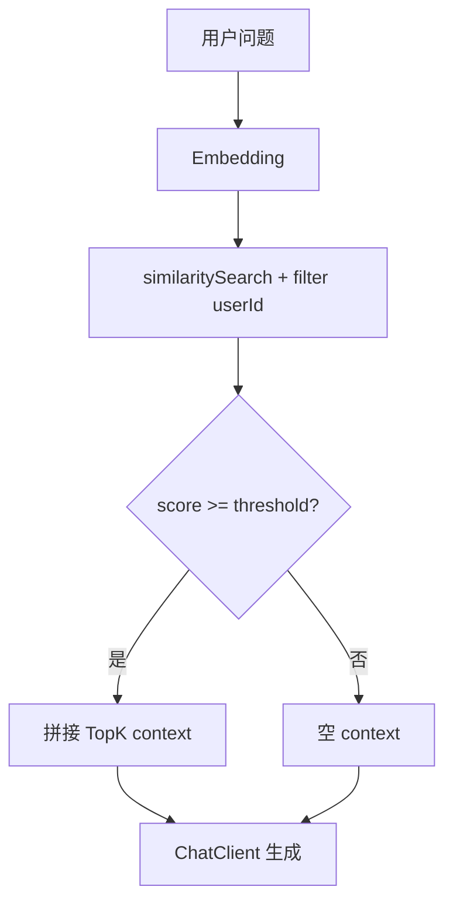

# 向量数据库与知识库实战

> **文件编码**：UTF-8。示例基于 **Spring Boot 3.2+ / Spring AI 1.0.x / JDK 17+**。  
> **前置章节**：[06 RAG 检索增强生成基础](./06-RAG检索增强生成基础.md)、[Java 06 MySQL](../Java/06-MySQL基础索引与事务.md)、[Java 07 Redis](../Java/07-Redis核心原理与缓存实战.md)。

---

## 0. 读前导读（零基础也能跟上）

### 0.1 用一句话弄懂本章

**06 章 RAG 跑通了，但向量存在内存里——07 章把它们搬进「真正的仓库」**：PostgreSQL+PGVector 或 Redis Stack 持久化向量，MySQL 管文档名单，API 支持上传、问答、列表、删除。

### 0.2 你需要提前知道什么

| 你现在的水平 | 建议 |
|--------------|------|
| 没学过 06 章 RAG | 先读 [06 RAG 基础](./06-RAG检索增强生成基础.md)（Embedding、Chunk、VectorStore） |
| 不会 Docker | 跟着 §2 手把手复制命令即可 |
| 没学过 MySQL | 复习 [Java 06 MySQL](../Java/06-MySQL基础索引与事务.md) 建表即可 |
| 没学过 Redis | 复习 [Java 07 Redis](../Java/07-Redis核心原理与缓存实战.md)（08 章会话也会用） |
| 06 章 Demo 已跑通 | ✅ 直接学本章 |

### 0.3 本章知识地图（学完后应能勾选全部 ☐→☑）

```text
☐ 能解释向量库 vs MySQL 各管什么（ANN 检索 vs 业务 CRUD）
☐ 能向朋友解释 Embedding 与 Vector 在持久化场景下的含义
☐ docker-compose 启动 PGVector + MySQL + Redis Stack
☐ 设计 kb_document 元数据表并理解 docId 与向量 metadata 关联
☐ 配置 Spring AI PgVectorStore（dimensions、HNSW、COSINE）
☐ 跑通 ingest / ask / list / delete 四个 API
☐ 检索时带 userId filter，验证用户隔离
☐ 能调 topK、similarityThreshold 并解释现象
☐ 能说出文档更新时「先删后写」re-embedding 流程
☐ 了解 Redis Stack Vector 作为 PGVector 的对照方案
```

### 0.4 建议学习时长与节奏

| 阶段 | 内容 | 建议时间 |
|------|------|----------|
| 第 1 段 | §0～§2 Docker 环境 | 1 小时 |
| 第 2 段 | §3～§4 MySQL 元数据 + Spring AI 配置 | 1.5 小时 |
| 第 3 段 | §6～§8 入库与问答代码 | 2 小时 |
| 第 4 段 | §10 curl 联调 | 1 小时 |
| 第 5 段 | FAQ + 自测 + 费曼 | 30 分钟 |
| **合计** | | **约 6 小时** |

### 0.5 学完本章你能做什么

1. `docker compose -f docker-compose-kb.yml up -d` 后三个容器 Healthy
2. 上传 `spring-redis.md`，`chunkCount > 0`，MySQL 有 `kb_document` 行
3. 问「怎么连 Redis」能答且 `sources` 有 score
4. `userId=9999` 问同一问题，检索为空（隔离生效）
5. DELETE 文档后 PG `vector_store` 对应行被清理

### 0.6 如果卡住了怎么办

| 卡点 | 先检查 | 跳转 |
|------|--------|------|
| 5432 连不上 | `docker ps` study-pgvector | §15.1 |
| dimension mismatch | embedding 维度与 yml 一致 | §9.4 |
| ask 无结果 | threshold、userId filter | §8.2 |
| ingest 401 | Embedding API Key | §4.2 |

### 0.7 本章工具与环境

| 组件 | 镜像（已验证） | 端口 |
|------|----------------|------|
| PGVector | `pgvector/pgvector:pg16` | 5432 |
| MySQL | `mysql:8.0` | 3306 |
| Redis Stack | `redis/redis-stack:latest` | 6379, 8001 |

### 0.8 核心术语预览

| 术语 | 一句话 | 生活类比 |
|------|--------|----------|
| **Embedding** | 文本→固定长度数字列 | 给每段便签发 GPS（同 06 章） |
| **Vector** | 存入库里的那列数字 | 便签在「语义地图」上的坐标 |
| **Vector DB / PGVector** | 专门存坐标并快速找邻居 | 带「按意思找书」功能的图书馆数据库 |
| **Chunk** | 入库的最小文本单元 | 一张便签对应库中一行（文本+向量+metadata） |
| **ANN** | 近似最近邻，百万向量毫秒级 | 不挨个量距离，用索引「猜最近几条」 |
| **HNSW** | 一种 ANN 索引结构 | 图书馆的分区导航——先找区再找架 |

---

## 本章与上一章的关系

06 章你已经跑通了 RAG 的「分块 → Embedding → 检索 → 生成」流程，但文档向量很可能还放在内存里的 `SimpleVectorStore`——重启就丢、无法按用户隔离、也扛不住万级文档。

**07 章解决「向量存哪儿、怎么管」**：用 **PGVector**（PostgreSQL 扩展）或 **Redis Stack Vector** 做持久化向量检索；用 **MySQL 元数据表** 管文档 CRUD；在 `agent-demo` 里落地 **`POST /api/kb/ingest`** 和 **`POST /api/kb/ask`** 完整知识库 API。

06 章是「RAG 流程」，07 章是「RAG 工程化落地」。

---

## 1. 向量数据库 vs 传统数据库

### 1.0 复习：Embedding 与 Vector（持久化视角）

**Embedding（嵌入）**：06 章已学——把句子变成例如 1536 个小数。
**Vector（向量）**：这列小数本身；**VectorStore / 向量库** 把它 **持久化** 到磁盘（PG）或内存+持久化（Redis），重启不丢。
**生活类比**：
- **MySQL** = 借书卡登记处：谁上传了哪份文件、文件名、块数、删没删——适合列表、权限、事务。
- **PGVector** = 按「意思」排列的书架 GPS 索引：问「Redis 怎么配」时，在百万坐标里找最近的几个 Chunk。
- **Chunk** = 便签：一行 PG 记录 = 一段文本 + 一个 vector + metadata（docId、userId）。

**为什么 RAG 要「向量库 + MySQL」双存储**：删文档时 MySQL 告诉你 docId，向量库按 `docId` filter 删掉所有 chunk；只有向量库没有 MySQL，你连「用户有哪些文件」都列不出来。

### 1.1 传统数据库擅长什么

MySQL / PostgreSQL 的关系型存储，核心是 **精确匹配**：

```sql
SELECT * FROM product WHERE id = 1001;
SELECT * FROM user WHERE phone = '13800000000';
```

索引（B+Tree）让「等值 / 范围」查询很快，但无法回答：

> 「和这句话**意思相近**的文档有哪些？」

因为「语义相似」不是字符串相等，而是高维空间里的**距离近**。

### 1.2 向量数据库擅长什么

Embedding 模型把文本变成浮点数组，例如 1536 维：

```text
"Spring Boot 怎么配置 Redis" → [0.012, -0.034, 0.089, ..., 0.021]
```

向量数据库（或带向量扩展的 DB）提供：

| 能力 | 说明 |
|------|------|
| **ANN 近似最近邻** | 在百万向量里找 TopK 最相似，毫秒级 |
| **距离度量** | Cosine / L2 / Inner Product |
| **元数据过滤** | `userId=42 AND docType=pdf` 后再做向量检索 |
| **持久化 + 索引** | HNSW / IVFFlat / HNSW（PGVector） |

### 1.3 为什么 RAG 要「向量库 + MySQL」双存储



**分工**：

- **MySQL**：业务 CRUD、权限、文件名、上传时间、分块数——适合事务和列表分页。
- **向量库**：只干「相似度检索」——适合高维向量索引。

不要把 PDF 原文只放向量库而不建元数据表——删除文档时你会找不到该删哪些 chunk。

### 1.4 常见选型对比

| 方案 | 适用场景 | 优点 | 缺点 |
|------|----------|------|------|
| **SimpleVectorStore** | 本地 demo、单元测试 | 零依赖、Spring AI 内置 | 重启丢失、无过滤、无 scale |
| **PGVector** | 中小生产、已有 PG | SQL 生态、元数据 JSON 过滤、事务 | 需 PostgreSQL + 扩展 |
| **Redis Stack Vector** | 低延迟、与 Redis 会话共用 | 快、和 [Java 07](../Java/07-Redis核心原理与缓存实战.md) 栈统一 | 内存成本、大库需集群 |
| **Milvus / Qdrant** | 超大规模、专用向量 | 专业 ANN | 多一套运维 |

本资料 **主线 PGVector**，并给出 Redis Stack、SimpleVectorStore 对照。

---

## 2. 环境总览：docker-compose 一键启动

在 `agent-demo/docker/` 下创建 `docker-compose-kb.yml`：

```yaml
version: "3.8"
services:
  postgres:
    image: pgvector/pgvector:pg16
    container_name: study-pgvector
    environment:
      POSTGRES_USER: postgres
      POSTGRES_PASSWORD: postgres
      POSTGRES_DB: agent_kb
    ports:
      - "5432:5432"
    volumes:
      - pgvector_data:/var/lib/postgresql/data
    healthcheck:
      test: ["CMD-SHELL", "pg_isready -U postgres"]
      interval: 5s
      timeout: 5s
      retries: 5

  mysql:
    image: mysql:8.0
    container_name: study-mysql-kb
    environment:
      MYSQL_ROOT_PASSWORD: root123
      MYSQL_DATABASE: agent_demo
    ports:
      - "3306:3306"
    command: --character-set-server=utf8mb4 --collation-server=utf8mb4_unicode_ci
    volumes:
      - mysql_kb_data:/var/lib/mysql

  redis-stack:
    image: redis/redis-stack:latest
    container_name: study-redis-stack
    ports:
      - "6379:6379"
      - "8001:8001"
    volumes:
      - redis_stack_data:/data

volumes:
  pgvector_data:
  mysql_kb_data:
  redis_stack_data:
```

### 2.1 启动与验证

| 步骤 | 你的动作 | 预期看到什么 | 若不对 |
|------|----------|--------------|--------|
| 1 | `cd agent-demo/docker` | 进入 compose 目录 | 路径不存在则创建 |
| 2 | `docker compose -f docker-compose-kb.yml up -d` | 三个容器 Started | 见 §15.1 端口占用 |
| 3 | `docker ps` | study-pgvector、study-mysql-kb、study-redis-stack Up | 镜像拉取失败检查网络 |
| 4 | PG 创建 extension vector | `CREATE EXTENSION` | 换 `pgvector/pgvector:pg16` |
| 5 | MySQL `SHOW DATABASES` | agent_demo 存在 | 等容器 ready |
| 6 | `redis-cli PING` | PONG | 6379 是否映射 |

```powershell
cd f:\study\agent-demo\docker
docker compose -f docker-compose-kb.yml up -d
```

```bash
# 预期输出（节选）：
# [+] Running 4/4
#  ✔ Container study-pgvector     Started
#  ✔ Container study-mysql-kb     Started
#  ✔ Container study-redis-stack  Started

docker ps --format "table {{.Names}}\t{{.Status}}\t{{.Ports}}"
# 预期：
# NAMES                 STATUS          PORTS
# study-pgvector        Up 30 seconds   0.0.0.0:5432->5432/tcp
# study-mysql-kb        Up 30 seconds   0.0.0.0:3306->3306/tcp
# study-redis-stack     Up 30 seconds   0.0.0.0:6379->6379/tcp, 0.0.0.0:8001->8001/tcp
```

### 2.2 验证 PGVector 扩展

```bash
docker exec -it study-pgvector psql -U postgres -d agent_kb -c "CREATE EXTENSION IF NOT EXISTS vector;"
# 预期：CREATE EXTENSION

docker exec -it study-pgvector psql -U postgres -d agent_kb -c "SELECT extname FROM pg_extension WHERE extname='vector';"
# 预期：
#  extname
# ---------
#  vector
# (1 row)
```

### 2.3 验证 MySQL

```bash
docker exec -it study-mysql-kb mysql -uroot -proot123 -e "SHOW DATABASES LIKE 'agent_demo';"
# 预期：
# +---------------------+
# | Database (agent_demo) |
# +---------------------+
# | agent_demo          |
# +---------------------+
```

### 2.4 验证 Redis Stack（含 Vector 能力）

```bash
docker exec -it study-redis-stack redis-cli PING
# 预期：PONG

# RedisInsight UI（可选）
# 浏览器打开 http://localhost:8001
```

---

## 3. MySQL 元数据表设计

### 3.1 建表 SQL

在 MySQL 执行（Flyway 或手动均可）：

```sql
CREATE TABLE IF NOT EXISTS kb_document (
    doc_id       VARCHAR(64)  NOT NULL PRIMARY KEY COMMENT '文档 UUID',
    user_id      BIGINT       NOT NULL COMMENT '所属用户',
    filename     VARCHAR(512) NOT NULL COMMENT '原始文件名',
    file_type    VARCHAR(32)  NOT NULL DEFAULT 'markdown' COMMENT 'pdf/md/txt',
    file_size    BIGINT       NOT NULL DEFAULT 0 COMMENT '字节数',
    chunk_count  INT          NOT NULL DEFAULT 0 COMMENT '分块数量',
    status       TINYINT      NOT NULL DEFAULT 1 COMMENT '1=正常 0=删除中 -1=失败',
    error_msg    VARCHAR(1024) NULL COMMENT '入库失败原因',
    created_at   DATETIME     NOT NULL DEFAULT CURRENT_TIMESTAMP,
    updated_at   DATETIME     NOT NULL DEFAULT CURRENT_TIMESTAMP ON UPDATE CURRENT_TIMESTAMP,
    INDEX idx_user_id (user_id),
    INDEX idx_user_created (user_id, created_at DESC)
) ENGINE=InnoDB DEFAULT CHARSET=utf8mb4 COMMENT='知识库文档元数据';
```

**字段说明**：

| 字段 | 用途 |
|------|------|
| `doc_id` | 全局唯一，写入向量 metadata 的 `docId`，删除时按此清理 |
| `user_id` | 多租户隔离，检索时必须过滤 |
| `chunk_count` | 列表展示、核对 ingest 是否完整 |
| `status` | 异步 ingest 时可标记处理中 |

### 3.2 Entity 与 Mapper

```java
package com.example.agent.entity;

import java.time.LocalDateTime;

public class KbDocument {
    private String docId;
    private Long userId;
    private String filename;
    private String fileType;
    private Long fileSize;
    private Integer chunkCount;
    private Integer status;
    private String errorMsg;
    private LocalDateTime createdAt;
    private LocalDateTime updatedAt;

    // getter / setter 省略，可用 Lombok @Data
}
```

```java
package com.example.agent.mapper;

import com.example.agent.entity.KbDocument;
import org.apache.ibatis.annotations.*;

import java.util.List;

@Mapper
public interface KbDocumentMapper {

    @Insert("""
        INSERT INTO kb_document(doc_id, user_id, filename, file_type, file_size, chunk_count, status)
        VALUES(#{docId}, #{userId}, #{filename}, #{fileType}, #{fileSize}, #{chunkCount}, #{status})
        """)
    int insert(KbDocument doc);

    @Select("SELECT * FROM kb_document WHERE user_id = #{userId} AND status >= 0 ORDER BY created_at DESC")
    List<KbDocument> listByUserId(Long userId);

    @Select("SELECT * FROM kb_document WHERE doc_id = #{docId} AND user_id = #{userId}")
    KbDocument findByDocIdAndUserId(@Param("docId") String docId, @Param("userId") Long userId);

    @Update("UPDATE kb_document SET chunk_count = #{chunkCount}, status = #{status}, error_msg = #{errorMsg} WHERE doc_id = #{docId}")
    int updateIngestResult(KbDocument doc);

    @Update("UPDATE kb_document SET status = -1 WHERE doc_id = #{docId} AND user_id = #{userId}")
    int softDelete(@Param("docId") String docId, @Param("userId") Long userId);
}
```

---

## 4. Spring AI 依赖与配置

### 4.1 pom.xml（BOM + 核心依赖）

```xml
<dependencyManagement>
    <dependencies>
        <dependency>
            <groupId>org.springframework.ai</groupId>
            <artifactId>spring-ai-bom</artifactId>
            <version>1.0.0</version>
            <type>pom</type>
            <scope>import</scope>
        </dependency>
    </dependencies>
</dependencyManagement>

<dependencies>
    <!-- PGVector -->
    <dependency>
        <groupId>org.springframework.ai</groupId>
        <artifactId>spring-ai-starter-vector-store-pgvector</artifactId>
    </dependency>
    <!-- Embedding： 以 OpenAI 兼容端点为例（DeepSeek/Ollama 见 02 章） -->
    <dependency>
        <groupId>org.springframework.ai</groupId>
        <artifactId>spring-ai-starter-model-openai</artifactId>
    </dependency>
    <!-- 文档读取 -->
    <dependency>
        <groupId>org.springframework.ai</groupId>
        <artifactId>spring-ai-pdf-document-reader</artifactId>
    </dependency>
    <dependency>
        <groupId>org.springframework.ai</groupId>
        <artifactId>spring-ai-markdown-document-reader</artifactId>
    </dependency>
</dependencies>
```

### 4.2 application.yml（PGVector 主线）

```yaml
spring:
  datasource:
    url: jdbc:postgresql://localhost:5432/agent_kb
    username: postgres
    password: postgres
    driver-class-name: org.postgresql.Driver

  ai:
    openai:
      api-key: ${DEEPSEEK_API_KEY:sk-xxx}
      base-url: https://api.deepseek.com
      embedding:
        options:
          model: deepseek-embedding   # 以实际可用模型为准
          dimensions: 1536
      chat:
        options:
          model: deepseek-chat
    vectorstore:
      pgvector:
        initialize-schema: true
        index-type: HNSW
        distance-type: COSINE_DISTANCE
        dimensions: 1536
        max-document-batch-size: 1000

# MySQL 元数据（第二数据源，简化示例用 spring.datasource 需多数据源配置）
agent:
  kb:
    top-k: 5
    similarity-threshold: 0.75
    chunk-size: 800
    chunk-overlap: 100
```

### 4.3 多数据源配置（MySQL + PostgreSQL）

```java
package com.example.agent.config;

import org.springframework.boot.context.properties.ConfigurationProperties;
import org.springframework.boot.jdbc.DataSourceBuilder;
import org.springframework.context.annotation.Bean;
import org.springframework.context.annotation.Configuration;
import org.springframework.context.annotation.Primary;
import org.springframework.jdbc.core.JdbcTemplate;

import javax.sql.DataSource;

@Configuration
public class DataSourceConfig {

    @Primary
    @Bean
    @ConfigurationProperties("spring.datasource")
    public DataSource pgDataSource() {
        return DataSourceBuilder.create().build();
    }

    @Bean
    @ConfigurationProperties("spring.datasource.mysql")
    public DataSource mysqlDataSource() {
        return DataSourceBuilder.create().build();
    }

    @Bean
    public JdbcTemplate pgJdbcTemplate(DataSource pgDataSource) {
        return new JdbcTemplate(pgDataSource);
    }
}
```

`application.yml` 追加 MySQL：

```yaml
spring:
  datasource:
    mysql:
      url: jdbc:mysql://localhost:3306/agent_demo?useUnicode=true&characterEncoding=utf8&serverTimezone=Asia/Shanghai
      username: root
      password: root123
      driver-class-name: com.mysql.cj.jdbc.Driver
```

### 4.4 手动配置 PgVectorStore（可选，便于自定义表名）

```java
package com.example.agent.config;

import org.springframework.ai.embedding.EmbeddingModel;
import org.springframework.ai.vectorstore.VectorStore;
import org.springframework.ai.vectorstore.pgvector.PgVectorStore;
import org.springframework.context.annotation.Bean;
import org.springframework.context.annotation.Configuration;
import org.springframework.jdbc.core.JdbcTemplate;

import static org.springframework.ai.vectorstore.pgvector.PgVectorStore.PgDistanceType.COSINE_DISTANCE;
import static org.springframework.ai.vectorstore.pgvector.PgVectorStore.PgIndexType.HNSW;

@Configuration
public class VectorStoreConfig {

    @Bean
    public VectorStore vectorStore(JdbcTemplate pgJdbcTemplate, EmbeddingModel embeddingModel) {
        return PgVectorStore.builder(pgJdbcTemplate, embeddingModel)
                .dimensions(1536)
                .distanceType(COSINE_DISTANCE)
                .indexType(HNSW)
                .initializeSchema(true)
                .vectorTableName("vector_store")
                .maxDocumentBatchSize(1000)
                .build();
    }
}
```

启动后 PG 中会自动创建 `vector_store` 表（含 `embedding vector(1536)` 列和 HNSW 索引）。

---

## 5. 开发替代方案

### 5.1 SimpleVectorStore（纯本地 dev）

无需 Docker，适合 06 章单元测试与 < 1000 行的小文档：

```java
@Bean
@Profile("dev-simple")
public VectorStore simpleVectorStore(EmbeddingModel embeddingModel) {
    return SimpleVectorStore.builder(embeddingModel).build();
}
```

```yaml
# application-dev-simple.yml
spring:
  profiles:
    active: dev-simple
```

**局限**：进程重启数据清空；无法 `userId` 级过滤（只能自己在 metadata 里 filter）；不适合并发写入。

### 5.2 Redis Stack Vector

与 [Java 07 Redis](../Java/07-Redis核心原理与缓存实战.md) 同一套 Redis，08 章会话记忆也可共用 `study-redis-stack` 容器。

**依赖**：

```xml
<dependency>
    <groupId>org.springframework.ai</groupId>
    <artifactId>spring-ai-starter-vector-store-redis</artifactId>
</dependency>
```

**配置**：

```yaml
spring:
  ai:
    vectorstore:
      redis:
        initialize-schema: true
        index-name: agent-kb-index
        prefix: "kb:doc:"
```

**Profile 切换 Bean**：

```java
@Bean
@Profile("redis-vector")
public VectorStore redisVectorStore(EmbeddingModel embeddingModel,
                                    RedisConnectionFactory factory) {
    return RedisVectorStore.builder(factory, embeddingModel)
            .indexName("agent-kb-index")
            .prefix("kb:doc:")
            .initializeSchema(true)
            .build();
}
```

| 对比项 | PGVector | Redis Stack Vector |
|--------|----------|-------------------|
| 持久化 | 磁盘为主 | 内存 + RDB/AOF |
| 元数据过滤 | JSON path SQL | RediSearch tag/text |
| 运维 | 需 PostgreSQL | 与 Redis 会话统一 |
| 成本 | 低（磁盘） | 向量占内存 |

---

## 6. 完整入库 Pipeline

### 6.1 流程图



### 6.2 KnowledgeIngestService（核心）

```java
package com.example.agent.service;

import com.example.agent.entity.KbDocument;
import com.example.agent.mapper.KbDocumentMapper;
import org.springframework.ai.document.Document;
import org.springframework.ai.reader.markdown.MarkdownDocumentReader;
import org.springframework.ai.transformer.splitter.TokenTextSplitter;
import org.springframework.ai.vectorstore.VectorStore;
import org.springframework.beans.factory.annotation.Value;
import org.springframework.core.io.ByteArrayResource;
import org.springframework.stereotype.Service;
import org.springframework.transaction.annotation.Transactional;
import org.springframework.web.multipart.MultipartFile;

import java.io.IOException;
import java.util.*;

@Service
public class KnowledgeIngestService {

    private final VectorStore vectorStore;
    private final KbDocumentMapper documentMapper;

    @Value("${agent.kb.chunk-size:800}")
    private int chunkSize;

    @Value("${agent.kb.chunk-overlap:100}")
    private int chunkOverlap;

    public KnowledgeIngestService(VectorStore vectorStore, KbDocumentMapper documentMapper) {
        this.vectorStore = vectorStore;
        this.documentMapper = documentMapper;
    }

    @Transactional(rollbackFor = Exception.class)
    public IngestResult ingest(MultipartFile file, Long userId) throws IOException {
        String docId = UUID.randomUUID().toString();
        String filename = Objects.requireNonNullElse(file.getOriginalFilename(), "unknown.md");
        String fileType = guessFileType(filename);

        KbDocument meta = new KbDocument();
        meta.setDocId(docId);
        meta.setUserId(userId);
        meta.setFilename(filename);
        meta.setFileType(fileType);
        meta.setFileSize(file.getSize());
        meta.setChunkCount(0);
        meta.setStatus(0);
        documentMapper.insert(meta);

        try {
            List<Document> rawDocs = loadDocuments(file, filename);
            TokenTextSplitter splitter = new TokenTextSplitter(chunkSize, chunkOverlap, 5, 10000, true);
            List<Document> chunks = splitter.apply(rawDocs);

            List<Document> enriched = new ArrayList<>();
            for (int i = 0; i < chunks.size(); i++) {
                Document chunk = chunks.get(i);
                Map<String, Object> md = new HashMap<>(chunk.getMetadata());
                md.put("docId", docId);
                md.put("userId", String.valueOf(userId));
                md.put("filename", filename);
                md.put("chunkIndex", i);
                enriched.add(new Document(chunk.getId(), chunk.getText(), md));
            }

            vectorStore.add(enriched);

            meta.setChunkCount(enriched.size());
            meta.setStatus(1);
            meta.setErrorMsg(null);
            documentMapper.updateIngestResult(meta);

            return new IngestResult(docId, filename, enriched.size(), "SUCCESS");
        } catch (Exception e) {
            meta.setStatus(-1);
            meta.setErrorMsg(e.getMessage());
            documentMapper.updateIngestResult(meta);
            throw e;
        }
    }

    private List<Document> loadDocuments(MultipartFile file, String filename) throws IOException {
        if (filename.endsWith(".md")) {
            MarkdownDocumentReader reader = new MarkdownDocumentReader(
                    new ByteArrayResource(file.getBytes()) {
                        @Override
                        public String getFilename() {
                            return filename;
                        }
                    });
            return reader.get();
        }
        // PDF 等扩展见 06 章 TikaDocumentReader
        return List.of(new Document(new String(file.getBytes())));
    }

    private String guessFileType(String filename) {
        int dot = filename.lastIndexOf('.');
        return dot > 0 ? filename.substring(dot + 1) : "txt";
    }

    public record IngestResult(String docId, String filename, int chunkCount, String status) {}
}
```

### 6.2.1 逐行读代码：KnowledgeIngestService.ingest

| 行号/代码 | 含义 | 改错会怎样 |
|-----------|------|------------|
| `UUID.randomUUID()` | 生成 docId，贯穿 MySQL 与向量 metadata | 重复 id → 删除/更新混乱 |
| `documentMapper.insert(meta)` | 先写 MySQL status=0 处理中 | 失败则用户看不到上传记录 |
| `TokenTextSplitter(chunkSize, chunkOverlap, ...)` | 按配置分块 | 与 06 章同理 |
| `md.put("docId", docId)` 等 | 向量 metadata 用于 filter 与 citation | 缺 userId → 隔离失效 |
| `vectorStore.add(enriched)` | PG 写入 embedding + HNSW 索引 | 维度错 → SQL 异常 |
| `updateIngestResult status=1` | 成功更新 chunk_count | 列表 API 显示不准 |
| `catch` 里 `status=-1` | 失败可追踪 error_msg | 无则运维难查 |

### 6.3 删除文档（向量 + 元数据）

```java
@Service
public class KnowledgeDeleteService {

    private final VectorStore vectorStore;
    private final KbDocumentMapper documentMapper;

    public KnowledgeDeleteService(VectorStore vectorStore, KbDocumentMapper documentMapper) {
        this.vectorStore = vectorStore;
        this.documentMapper = documentMapper;
    }

    public void deleteDocument(String docId, Long userId) {
        KbDocument doc = documentMapper.findByDocIdAndUserId(docId, userId);
        if (doc == null) {
            throw new IllegalArgumentException("文档不存在或无权删除");
        }
        // 按 metadata 过滤删除向量
        vectorStore.delete(
                "docId == '" + docId + "' && userId == '" + userId + "'");
        documentMapper.softDelete(docId, userId);
    }
}
```

> **注意**：PGVector 的 filter 表达式语法以 Spring AI 当前版本文档为准；生产环境建议封装 `FilterExpressionBuilder` 防注入。

---

## 7. 知识库 API：Controller 层

### 7.1 DTO

```java
package com.example.agent.dto;

import jakarta.validation.constraints.NotBlank;

public record KbAskRequest(
        @NotBlank String question,
        Long userId,
        String docId   // 可选：限定在某个文档内问答
) {}

public record KbAskResponse(
        String answer,
        java.util.List<SourceChunk> sources
) {}

public record SourceChunk(String docId, String filename, int chunkIndex, String snippet, double score) {}
```

### 7.2 KbController

```java
package com.example.agent.controller;

import com.example.agent.dto.*;
import com.example.agent.entity.KbDocument;
import com.example.agent.mapper.KbDocumentMapper;
import com.example.agent.service.*;
import jakarta.validation.Valid;
import org.springframework.http.MediaType;
import org.springframework.web.bind.annotation.*;
import org.springframework.web.multipart.MultipartFile;

import java.io.IOException;
import java.util.List;

@RestController
@RequestMapping("/api/kb")
public class KbController {

    private final KnowledgeIngestService ingestService;
    private final KnowledgeAskService askService;
    private final KnowledgeDeleteService deleteService;
    private final KbDocumentMapper documentMapper;

    public KbController(KnowledgeIngestService ingestService,
                          KnowledgeAskService askService,
                          KnowledgeDeleteService deleteService,
                          KbDocumentMapper documentMapper) {
        this.ingestService = ingestService;
        this.askService = askService;
        this.deleteService = deleteService;
        this.documentMapper = documentMapper;
    }

    /** 上传并入库 */
    @PostMapping(value = "/ingest", consumes = MediaType.MULTIPART_FORM_DATA_VALUE)
    public KnowledgeIngestService.IngestResult ingest(
            @RequestParam("file") MultipartFile file,
            @RequestParam("userId") Long userId) throws IOException {
        return ingestService.ingest(file, userId);
    }

    /** 知识库问答 */
    @PostMapping("/ask")
    public KbAskResponse ask(@Valid @RequestBody KbAskRequest request) {
        return askService.ask(request);
    }

    /** 文档列表 */
    @GetMapping("/docs")
    public List<KbDocument> listDocs(@RequestParam Long userId) {
        return documentMapper.listByUserId(userId);
    }

    /** 删除文档 */
    @DeleteMapping("/docs/{docId}")
    public void deleteDoc(@PathVariable String docId, @RequestParam Long userId) {
        deleteService.deleteDocument(docId, userId);
    }
}
```

---

## 8. 问答服务：TopK、阈值、元数据过滤

### 8.1 KnowledgeAskService

```java
package com.example.agent.service;

import com.example.agent.dto.*;
import org.springframework.ai.chat.client.ChatClient;
import org.springframework.ai.chat.prompt.PromptTemplate;
import org.springframework.ai.document.Document;
import org.springframework.ai.vectorstore.SearchRequest;
import org.springframework.ai.vectorstore.VectorStore;
import org.springframework.beans.factory.annotation.Value;
import org.springframework.stereotype.Service;

import java.util.*;
import java.util.stream.Collectors;

@Service
public class KnowledgeAskService {

    private final VectorStore vectorStore;
    private final ChatClient chatClient;

    @Value("${agent.kb.top-k:5}")
    private int topK;

    @Value("${agent.kb.similarity-threshold:0.75}")
    private double similarityThreshold;

    private static final PromptTemplate RAG_PROMPT = new PromptTemplate("""
            你是企业知识库助手。仅根据以下「参考资料」回答用户问题。
            若资料不足以回答，请明确说「根据现有知识库无法回答」，不要编造。

            【参考资料】
            {context}

            【用户问题】
            {question}
            """);

    public KnowledgeAskService(VectorStore vectorStore, ChatClient.Builder builder) {
        this.vectorStore = vectorStore;
        this.chatClient = builder.build();
    }

    public KbAskResponse ask(KbAskRequest request) {
        String filter = buildFilter(request.userId(), request.docId());

        SearchRequest searchRequest = SearchRequest.builder()
                .query(request.question())
                .topK(topK)
                .similarityThreshold(similarityThreshold)
                .filterExpression(filter)
                .build();

        List<Document> hits = vectorStore.similaritySearch(searchRequest);

        String context = hits.stream()
                .map(Document::getText)
                .collect(Collectors.joining("\n---\n"));

        String answer = chatClient.prompt()
                .user(RAG_PROMPT.render(Map.of(
                        "context", context.isBlank() ? "（无匹配资料）" : context,
                        "question", request.question()
                )))
                .call()
                .content();

        List<SourceChunk> sources = hits.stream()
                .map(doc -> new SourceChunk(
                        String.valueOf(doc.getMetadata().get("docId")),
                        String.valueOf(doc.getMetadata().get("filename")),
                        (Integer) doc.getMetadata().getOrDefault("chunkIndex", -1),
                        truncate(doc.getText(), 200),
                        doc.getScore() != null ? doc.getScore() : 0.0
                ))
                .toList();

        return new KbAskResponse(answer, sources);
    }

    private String buildFilter(Long userId, String docId) {
        String base = "userId == '" + userId + "'";
        if (docId != null && !docId.isBlank()) {
            return base + " && docId == '" + docId + "'";
        }
        return base;
    }

    private String truncate(String text, int max) {
        if (text == null) return "";
        return text.length() <= max ? text : text.substring(0, max) + "...";
    }
}
```

### 8.1.1 逐行读代码：KnowledgeAskService.ask

| 行号/代码 | 含义 | 改错会怎样 |
|-----------|------|------------|
| `buildFilter(userId, docId)` | 拼 `userId == '1001'` 等 filter | 漏 userId → 数据泄露 |
| `SearchRequest.builder().query(...)` | 问题 embedding + ANN 检索 | 空库 → hits 空 |
| `.similarityThreshold(...)` | 低分 chunk 丢弃 | 过高 → 经常无答案 |
| `.filterExpression(filter)` | PG/Redis 先过滤再向量搜 | 语法错 → 500 |
| `RAG_PROMPT.render(...)` | 拼 context + question | 无「无法回答」约束 → 胡编 |
| `doc.getScore()` | 相似度分数返前端 | 便于调 threshold |
| `SourceChunk` 构造 | docId、filename、chunkIndex | 用户溯源 |

### 8.2 TopK 与 similarityThreshold 调参指南

| 参数 | 典型值 | 现象 |
|------|--------|------|
| `topK` | 3～8 | 太小漏上下文，太大噪音多、Token 贵 |
| `similarityThreshold` | 0.7～0.85（Cosine） | 太高零结果，太低胡编风险增 |
| `chunkSize` | 500～1000 tokens | 技术文档偏大，FAQ 偏小 |

**调试技巧**：先 `topK=10, threshold=0.5` 看原始 score 分布，再逐步收紧。



---

## 9. 索引维护与文档更新（Re-embedding）

### 9.1 为什么更新要「先删后写」

用户重新上传同名政策 PDF 时，旧 chunk 仍留在向量库会导致：

- 检索到过期段落
- `chunk_count` 与真实不符

**标准策略**：

1. MySQL 查 `doc_id`（或新建版本号 `doc_id_v2`）
2. `vectorStore.delete(filter docId)` 删除旧向量
3. 重新 split + embed + add
4. 更新 MySQL `chunk_count`

### 9.2 KnowledgeUpdateService

```java
@Service
public class KnowledgeUpdateService {

    private final KnowledgeDeleteService deleteService;
    private final KnowledgeIngestService ingestService;
    private final KbDocumentMapper documentMapper;

    public KnowledgeUpdateService(KnowledgeDeleteService deleteService,
                                  KnowledgeIngestService ingestService,
                                  KbDocumentMapper documentMapper) {
        this.deleteService = deleteService;
        this.ingestService = ingestService;
        this.documentMapper = documentMapper;
    }

    public IngestResult update(String docId, Long userId, MultipartFile file) throws IOException {
        KbDocument existing = documentMapper.findByDocIdAndUserId(docId, userId);
        if (existing == null) {
            throw new IllegalArgumentException("文档不存在");
        }
        deleteService.deleteDocument(docId, userId);
        // 复用 docId：delete 是软删，ingest 可改为 upsert 逻辑
        return reIngestWithDocId(docId, userId, file);
    }

    private IngestResult reIngestWithDocId(String docId, Long userId, MultipartFile file) throws IOException {
        // 实现与 ingest 类似，但固定 docId 而非新建 UUID
        // 留给练习：抽取 ingest 的 private 方法共用
        throw new UnsupportedOperationException("见本章练习-进阶");
    }
}
```

### 9.3 PGVector 索引维护命令

```bash
# 查看 vector_store 行数
docker exec -it study-pgvector psql -U postgres -d agent_kb -c "SELECT COUNT(*) FROM vector_store;"
# 预期：(N row)  N = 所有 chunk 数

# 重建 HNSW 索引（数据量极大、召回下降时）
docker exec -it study-pgvector psql -U postgres -d agent_kb -c "REINDEX INDEX vector_store_embedding_idx;"
# 预期：REINDEX

# 分析表更新统计信息
docker exec -it study-pgvector psql -U postgres -d agent_kb -c "ANALYZE vector_store;"
# 预期：ANALYZE
```

### 9.4  Embedding 模型变更

若从 1536 维换到 1024 维模型：

1. **必须**新建向量表或 `TRUNCATE vector_store`
2. 修改 `dimensions` 配置
3. **全量 re-embedding** 所有文档

不可在同一列混存不同维度向量。

---

## 10. 手把手：curl 联调全流程

### 10.1 准备测试 Markdown

`agent-demo/kb-docs/spring-redis.md`：

```markdown
# Spring Boot 配置 Redis

在 application.yml 中添加：

spring:
  data:
    redis:
      host: localhost
      port: 6379

使用 StringRedisTemplate 注入即可操作 Redis。
```

### 10.2 入库

```bash
curl -X POST http://localhost:8080/api/kb/ingest \
  -F "file=@kb-docs/spring-redis.md" \
  -F "userId=1001"
```

```json
// 预期输出：
{
  "docId": "a1b2c3d4-e5f6-7890-abcd-ef1234567890",
  "filename": "spring-redis.md",
  "chunkCount": 2,
  "status": "SUCCESS"
}
```

### 10.3 列表

```bash
curl "http://localhost:8080/api/kb/docs?userId=1001"
```

```json
// 预期：数组含上述 docId、chunkCount=2
```

### 10.4 问答

```bash
curl -X POST http://localhost:8080/api/kb/ask \
  -H "Content-Type: application/json" \
  -d '{"question":"Spring Boot 怎么连接 Redis？","userId":1001}'
```

```json
// 预期：
{
  "answer": "在 application.yml 中配置 spring.data.redis.host 和 port...",
  "sources": [
    {
      "docId": "a1b2c3d4-...",
      "filename": "spring-redis.md",
      "chunkIndex": 0,
      "snippet": "# Spring Boot 配置 Redis...",
      "score": 0.89
    }
  ]
}
```

### 10.5 用户隔离验证

```bash
curl -X POST http://localhost:8080/api/kb/ask \
  -H "Content-Type: application/json" \
  -d '{"question":"Spring Boot 怎么连接 Redis？","userId":9999}'
```

```json
// 预期：answer 提示无法回答，sources 为空数组（userId 9999 无文档）
```

### 10.6 删除

| 步骤 | 你的动作 | 预期看到什么 | 若不对 |
|------|----------|--------------|--------|
| 1 | DELETE `/api/kb/docs/{docId}?userId=1001` | HTTP 200 | docId 错误或无权 → 4xx |
| 2 | GET `/api/kb/docs?userId=1001` | 列表空或 status=-1 | 只软删 MySQL 未删向量 → §6.3 |
| 3 | 再 ask 同一问题 | 无该文档 sources | delete filter 与 metadata 不一致 |

```bash
curl -X DELETE "http://localhost:8080/api/kb/docs/a1b2c3d4-e5f6-7890-abcd-ef1234567890?userId=1001"
# 预期：HTTP 200，无 body

curl "http://localhost:8080/api/kb/docs?userId=1001"
# 预期：列表为空或 status=-1
```

---

## 11. 生产化注意事项

### 11.1 异步 Ingest

大 PDF 入库可能 30s+，建议：

- `POST /ingest` 立即返回 `taskId`
- 后台 `@Async` 执行 split/embed
- WebSocket 或轮询通知完成

### 11.2 文件安全

- 限制扩展名白名单：`.md`, `.pdf`, `.txt`
- 单文件大小：如 20MB
- 病毒扫描（企业场景）

### 11.3 成本控制

- Embedding 按 Token 计费，重复 ingest 前先 delete
- 问答侧 `topK` 不宜过大
- 缓存高频问题的检索结果（Redis，见 Java 07）

### 11.4 监控指标

| 指标 | 说明 |
|------|------|
| `kb_ingest_duration_seconds` | 入库耗时 |
| `kb_ask_retrieval_count` | 每次命中 chunk 数 |
| `kb_ask_empty_retrieval_total` | 零检索次数（阈值过高？） |
| `vector_store_rows` | PG 表行数 |

---

## 12. 面试常问

### Q1：向量库和 Elasticsearch 全文检索区别？

**全文检索**靠倒排索引 + BM25，擅长关键词；**向量检索**靠语义相似，擅长「换种说法」。生产常 **混合检索（Hybrid）**：BM25 + Vector 各取 TopK 再 RRF 融合。

### Q2：Cosine 和 L2 怎么选？

OpenAI 类 Embedding 多已归一化，**Cosine** 与 **Inner Product** 等价且常用；L2 在未归一化向量上更直观。Spring AI PGVector 默认 `COSINE_DISTANCE`。

### Q3：chunk_size 怎么定？

看文档结构：Markdown 按标题分块优于固定长度；固定 Token 分块通用。overlap 10%～20% 避免句子被截断。

### Q4：如何保证用户 A 看不到用户 B 的文档？

检索 **必须** 带 `userId` metadata filter；Controller 层 `userId` 从 JWT 取，禁止客户端随意传（10 章完善）。

---

## 13. 常见误区

### 13.1 只建向量表不建元数据

删除、列表、权限全部困难。

### 13.2 不设 similarityThreshold

低相关 chunk 喂给 LLM，幻觉严重。

### 13.3 把 MySQL 当向量库

`SELECT` 无法高效做 1536 维 ANN；MySQL 9 有向量类型但生态不如 PGVector 成熟（截至 2025 练手仍推荐 PG）。

### 13.4 开发用 SimpleVectorStore 上线忘改

上线前 Checklist：`VectorStore` Bean 必须是 PGVector/Redis。

---

## 14. 学完标准

- [ ] docker-compose 启动 PGVector + MySQL + Redis Stack
- [ ] 能解释向量库 vs MySQL 分工
- [ ] 跑通 ingest / ask / list / delete 四个 API
- [ ] 能调 TopK 和 similarityThreshold 并解释现象
- [ ] 能说出文档更新时 re-embedding 流程
- [ ] 能画 RAG + 元数据双存储架构图

---

## 15. 分级练习

**基础**：PGVector Docker 启动 + 单文件 ingest + ask  
**进阶**：实现 `KnowledgeUpdateService.reIngestWithDocId` 完整逻辑  
**挑战**：Redis Stack Vector Profile 切换 + 同一套 API 双存储可配置

### 参考答案

#### 基础

10.1～10.4 节 curl 命令即标准答案。若 `chunkCount=0`，检查 Embedding API Key 与 `dimensions` 是否匹配。

#### 进阶：固定 docId 重新入库

```java
private IngestResult reIngestWithDocId(String docId, Long userId, MultipartFile file) throws IOException {
    // 物理删除旧向量后
    vectorStore.delete("docId == '" + docId + "' && userId == '" + userId + "'");

    List<Document> rawDocs = loadDocuments(file, file.getOriginalFilename());
    TokenTextSplitter splitter = new TokenTextSplitter(chunkSize, chunkOverlap, 5, 10000, true);
    List<Document> chunks = splitter.apply(rawDocs);
    List<Document> enriched = new ArrayList<>();
    for (int i = 0; i < chunks.size(); i++) {
        Map<String, Object> md = new HashMap<>(chunks.get(i).getMetadata());
        md.put("docId", docId);
        md.put("userId", String.valueOf(userId));
        md.put("filename", file.getOriginalFilename());
        md.put("chunkIndex", i);
        enriched.add(new Document(chunks.get(i).getId(), chunks.get(i).getText(), md));
    }
    vectorStore.add(enriched);

    KbDocument meta = documentMapper.findByDocIdAndUserId(docId, userId);
    meta.setChunkCount(enriched.size());
    meta.setStatus(1);
    documentMapper.updateIngestResult(meta);
    return new IngestResult(docId, file.getOriginalFilename(), enriched.size(), "UPDATED");
}
```

#### 挑战：可配置 VectorStore

```java
@Configuration
public class VectorStoreProfileConfig {
    @Bean
    @ConditionalOnProperty(name = "agent.kb.store", havingValue = "pgvector", matchIfMissing = true)
    public VectorStore pgVectorStore(JdbcTemplate jdbc, EmbeddingModel model) { /* ... */ }

    @Bean
    @ConditionalOnProperty(name = "agent.kb.store", havingValue = "redis")
    public VectorStore redisVectorStore(EmbeddingModel model, RedisConnectionFactory f) { /* ... */ }
}
```

---

## 15.1 常见报错与排查

| 报错信息（关键词） | 可能原因 | 解决方案 |
|-------------------|---------|---------|
| `Connection refused: localhost:5432` | PGVector 容器未启动 | `docker compose -f docker-compose-kb.yml up -d` |
| `extension "vector" is not available` | 未用 pgvector 镜像 | 换 `pgvector/pgvector:pg16` 镜像 |
| `expected 1536 dimensions, not 1024` | Embedding 维度与表不一致 | 统一 `spring.ai.vectorstore.pgvector.dimensions` 与模型输出；必要时删表重建 |
| `Could not open JDBC Connection for MySQL` | MySQL 未就绪 | 等待 healthcheck；检查 3306 端口占用 |
| `401 Unauthorized`（Embedding API） | API Key 无效 | 环境变量 `DEEPSEEK_API_KEY`；Ollama 改用本地 embedding |
| `initialize-schema` 失败权限 | PG 用户无 CREATE 权限 | 用 superuser `postgres` 或手动建扩展 |
| ingest 成功但 ask 无结果 | threshold 过高或 userId filter 错误 | 降低 `similarity-threshold`；核对 metadata 中 `userId` 类型为 String |
| `filterExpression` 解析错误 | 语法错误或引号未转义 | 用 `FilterExpressionBuilder`；docId 含特殊字符需转义 |
| Redis Vector `Unknown index name` | 未 initialize-schema | `spring.ai.vectorstore.redis.initialize-schema=true` |
| 删除后仍能检索到 | delete filter 不匹配 metadata | 检查 ingest 时写入的 key 与 delete 表达式一致 |
| OOM / ingest 超时 | PDF 过大或 batch 太大 | 调小 `max-document-batch-size`；异步 ingest |

---

## 附录 A：双存储架构设计要点（面试用）

```text
上传文件
  → MySQL INSERT kb_document (status=0)
  → Split → 每 chunk metadata: docId, userId, chunkIndex
  → PG vector_store ADD (embedding + content + metadata)
  → MySQL UPDATE chunk_count, status=1

问答
  → JWT 取 userId（10 章）
  → similaritySearch + filter userId
  → ChatClient + RAG Prompt
  → 返回答案 + SourceChunk(score)

删除
  → vectorStore.delete(docId && userId)
  → MySQL soft delete
```

**面试一句话**：MySQL 管「文件台账」，PGVector 管「语义检索」；通过 docId 和 userId 串联。

## 附录 C：混合检索入门（Advanced RAG 预告）

07 章主线是 **纯向量检索**。生产常见 **Hybrid = 向量 + BM25 关键词**：

| 检索方式 | 擅长 | 不擅长 |
|----------|------|--------|
| 向量 | 「换种说法」语义相近 | 精确 SKU、工号、条款编号 |
| BM25 关键词 | 专有名词、 rare token | 同义改写 |

**生活类比**：向量像「懂意思的图书管理员」；BM25 像「按书名关键字查卡片柜」。两者各取 TopK，再用 RRF 等算法融合排序——10～12 章或进阶资料展开。

Spring AI 侧可组合 `VectorStore` + `SearchRequest` 与 Elasticsearch/OpenSearch；LangChain4j 有 `DefaultQueryRouter` 等组件。本章先把 **PGVector + metadata filter** 跑稳。

## 附录 D：kb_document 字段与 API 响应对照

| MySQL 字段 | ingest 后 | list API | delete 后 |
|------------|-----------|----------|-----------|
| doc_id | UUID 新生 | 展示 | 不变（软删） |
| chunk_count | = PG 行数 | 展示 | 0 或保留历史 |
| status | 0→1 或 -1 | 过滤 status>=0 | -1 |
| error_msg | 失败时写入 | 可选展示 | — |

前端列表页：filename + chunk_count + created_at；点击问答带 docId 可选限定检索范围（§8.1 `buildFilter`）。

## 附录 E：07 章一天实战 Checklist

```text
□ docker compose -f docker-compose-kb.yml up -d
□ CREATE EXTENSION vector 成功
□ MySQL 执行 kb_document 建表
□ application.yml dimensions 与 Embedding 一致
□ curl ingest spring-redis.md userId=1001
□ curl ask 同一 userId 有 sources
□ curl ask userId=9999 sources 为空
□ DELETE 文档后再 ask 无该来源
□ 记录 topK/threshold 最终取值到笔记区
```

## 附录 B：PGVector 与 Redis Vector 切换 Checklist

| 检查项 | PGVector | Redis Stack |
|--------|----------|-------------|
| Docker 镜像 | pgvector/pgvector:pg16 | redis/redis-stack:latest |
| Spring 依赖 | spring-ai-starter-vector-store-pgvector | spring-ai-starter-vector-store-redis |
| 配置前缀 | spring.ai.vectorstore.pgvector | spring.ai.vectorstore.redis |
| 维度配置 | dimensions: 1536 | 随 EmbeddingModel |
| 过滤语法 | filterExpression SQL-like | RediSearch tag |
| 07 章 compose | 已含 | 已含 |

---

## 16. 与下一章的衔接

07 章知识库问答是 **无状态单轮**（每次 ask 不带聊天历史）。08 章将在 `ChatClient` 上叠加 **MessageChatMemoryAdvisor**，用 Redis 持久化多轮对话，并与 JWT `userId` 绑定 `conversationId`。

继续学习：[08-对话记忆与会话管理](./08-对话记忆与会话管理.md)

---

## 18. 常见问题 FAQ（≥10）

**Q1：为什么不用 MySQL 直接存向量？**  
MySQL 擅长等值查询；高维 ANN 用 PGVector 更合适。

**Q2：PGVector vs Redis Stack Vector？**  
PG 磁盘成本优；Redis 低延迟、与 08 章会话栈统一。

**Q3：docId 为何写 MySQL 又写 metadata？**  
列表/权限在 MySQL；按 docId 删 chunk 在向量库。

**Q4：userId filter 为何用字符串？**  
与 ingest metadata 类型一致，避免 filter 不匹配。

**Q5：HNSW 是什么？**  
ANN 索引结构，快搜最近邻；数据量大可 REINDEX。

**Q6：ingest 成功 ask 无结果？**  
降 threshold；查 userId filter。

**Q7：dimensions 不一致报错？**  
统一 yml 与模型输出；必要时删表重建。

**Q8：SimpleVectorStore 能生产用吗？**  
不能；重启丢数据。

**Q9：删文档仍能搜到？**  
delete filter 与 ingest metadata 不一致。

**Q10：大 PDF 超时？**  
异步 ingest；减小 batch。

**Q11：与 ES 全文检索区别？**  
BM25 关键词；向量语义；可 Hybrid。

**Q12：06 章 Demo 如何迁移？**  
换 PgVectorStore Bean + MySQL 元数据 + multipart ingest。

---

## 19. 闭卷自测（≥10）

1. 向量库 vs MySQL 分工？
2. ANN、HNSW 作用？
3. 为何检索必带 userId filter？
4. 换 Embedding 为何要清 vector_store？
5. metadata 中 docId、chunkIndex 用途？
6. extension vector 失败怎么查？
7. curl ingest 要哪两个字段？
8. 如何验证用户隔离？
9. 更新文档为何先删后写？
10. PGVector 与 Redis Stack 各一优缺点？

### 自测参考答案

1. 向量库相似检索；MySQL CRUD/列表/权限。
2. 百万向量毫秒 TopK；HNSW 为 ANN 索引。
3. 多租户防泄露。
4. 维度/坐标系不可混。
5. 批量删与溯源；片段顺序。
6. 用 `pgvector/pgvector:pg16`；`CREATE EXTENSION vector`。
7. `file`、`userId`。
8. 不同 userId ask，sources 空。
9. 防旧 chunk 残留。
10. PG 磁盘省/SQL 生态；Redis 快/内存贵。

---

## 20. 费曼检验

请 **不看资料**，用 3 分钟说明 07 章在 06 章上多了什么。

**对照提纲**：

1. **持久化仓库**：向量存 PG/Redis，重启不丢。
2. **双存储**：MySQL 管文件名列表；向量库管「按意思找便签」。
3. **企业 API**：上传、列表、删除、按 userId 隔离。

---

## 17. 我的笔记区

```text
向量库选型（PG / Redis / Simple）：
TopK 与 threshold 最终取值：
单文档 ingest 耗时：
遇到的报错：
```
