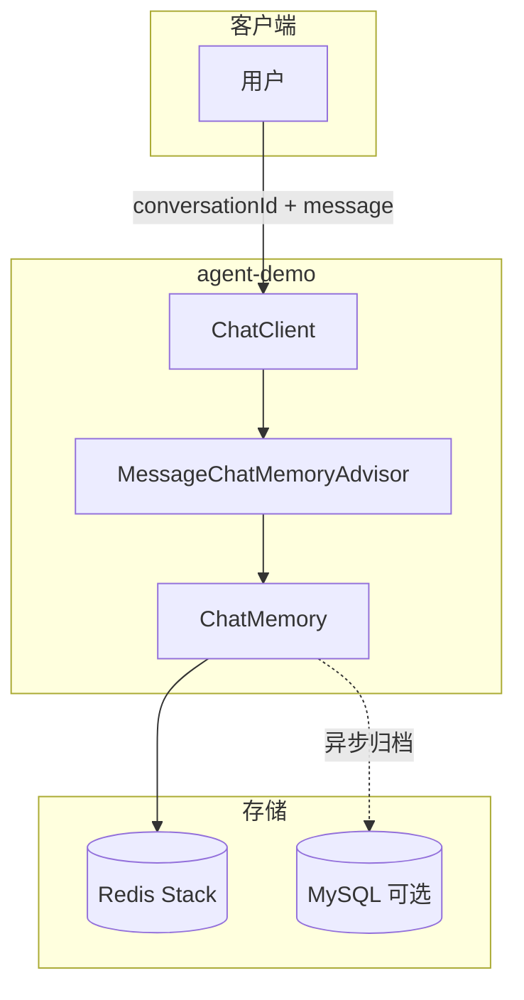
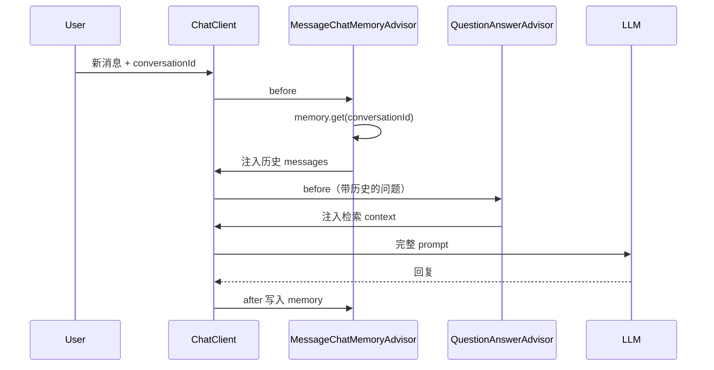
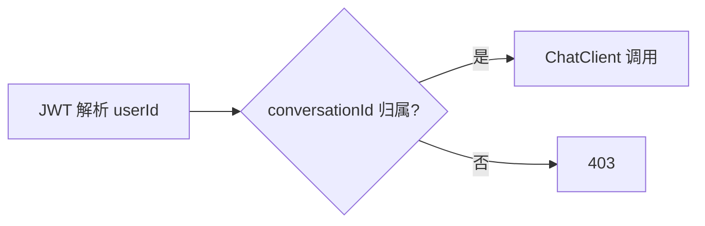
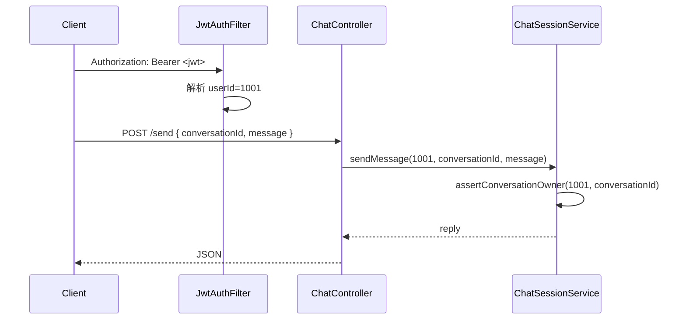
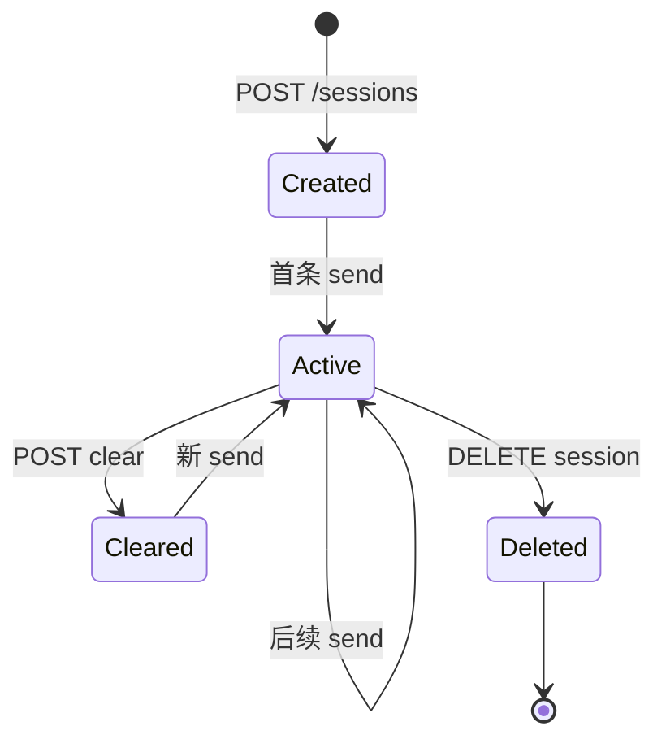

# 对话记忆与会话管理

> **文件编码**：UTF-8。示例基于 **Spring Boot 3.2+ / Spring AI 1.0.x / JDK 17+**。  
> **前置章节**：[07 向量数据库与知识库实战](./07-向量数据库与知识库实战.md)、[Java 07 Redis 核心原理与缓存实战](../Java/07-Redis核心原理与缓存实战.md)、[03 流式对话与 SSE 实战](./03-流式对话与SSE实战.md)。

---

## 0. 读前导读（零基础也能跟上）

### 0.1 用一句话弄懂本章

**07 章每次问答互不相识——08 章给助手装上「短期记忆」**：用 ChatMemory 记住最近 N 轮对话，Redis 持久化，JWT 绑定 userId，让你可以说「刚才那个端口是多少」。

### 0.2 你需要提前知道什么

| 水平 | 建议 |
|------|------|
| 没学过 07 章 | 先读 [07 向量库](./07-向量数据库与知识库实战.md)（Redis Stack 容器本章复用） |
| 没学过 Redis | 复习 [Java 07 Redis](../Java/07-Redis核心原理与缓存实战.md) |
| 没学过 SSE | 流式部分见 [03 流式对话](./03-流式对话与SSE实战.md) |
| 07 章 + 02 章 ChatClient 已会 | ✅ 直接学 |

### 0.3 本章知识地图（学完后应能勾选全部 ☐→☑）

```text
☐ 能解释无记忆 vs 有记忆的多轮差异（指代消解）
☐ 理解 ChatMemory、ChatMemoryRepository、MessageChatMemoryAdvisor
☐ 能向朋友解释 Memory（记忆）在 Agent 里是什么
☐ 配置 MessageWindowChatMemory + RedisChatMemoryRepository
☐ 区分 userId 与 conversationId，会做归属校验
☐ 实现 ChatSessionService 的 create / send / list / delete
☐ 说出 Truncate vs Summarize 溢出策略
☐ 配置 Redis TTL 与清理任务
☐ 跑通 curl 两轮指代问答（「默认端口」）
☐ 了解 ChatMemory 与 QuestionAnswerAdvisor 协作顺序
```

### 0.4 建议学习时长与节奏

| 阶段 | 内容 | 时间 |
|------|------|------|
| 概念 §1～§3 | ChatMemory 体系 | 1 小时 |
| Redis §4 | 持久化配置 | 1 小时 |
| 实战 §6～§8 | Service + Controller | 2 小时 |
| 溢出 §9 + 联调 §12 | 摘要策略 + curl | 1.5 小时 |
| FAQ + 自测 | | 30 分钟 |
| **合计** | | **约 6 小时** |

### 0.5 学完本章你能做什么

1. 同一 `conversationId` 连问两轮，第二轮能答「6379」而不重复提 Redis
2. `redis-cli KEYS agent:chat:*` 能看到会话 key 和 TTL
3. 用户 B 的 token 访问用户 A 的 conversationId 返回 403
4. 能说明 MessageWindow 与 Token 窗口区别

### 0.6 卡住了怎么办

| 卡点 | 检查 | 跳转 |
|------|------|------|
| Conversation id required | 是否 `.param(CONVERSATION_ID)` | §18.1 |
| 第二轮失忆 | 同一 conversationId？Advisor 注册？ | §12 |
| Redis 连不上 | study-redis-stack 容器 | §4.4.1 |

### 0.7 工具与环境

| 组件 | 用途 |
|------|------|
| Redis Stack（07 章 compose） | ChatMemory 持久化 |
| MySQL（可选） | chat_session / chat_message 归档 |
| JWT | userId 来源，不信任 Body |

### 0.8 核心术语预览

| 术语 | 一句话 | 生活类比 |
|------|--------|----------|
| **Memory（对话记忆）** | 保存最近若干轮 user/assistant 消息 | 微信聊天窗口里往上滑能看到的记录 |
| **ChatMemory** | Spring AI 记忆接口 | 餐厅服务员的小本子：记本桌最近点了啥 |
| **conversationId** | 一次连续对话的 ID | 一张餐桌号——同桌对话共享一本子 |
| **userId** | 用户账号 | 顾客会员号——可有多张桌子（多会话） |
| **MessageWindow** | 只保留最近 N 条消息 | 本子只记最后 20 句，更早的撕掉 |
| **TTL** | Redis key 过期时间 | 7 天没人在这桌吃饭，本子自动扔掉 |

---

## 本章与上一章的关系

07 章的 `POST /api/kb/ask` 每次独立处理一个问题——用户无法说「**刚才那个文档里提到的 Redis 端口是多少？**」，因为服务端不记得「刚才」问了什么。

**08 章解决「多轮上下文」**：用 Spring AI 的 **ChatMemory** 保存最近 N 轮消息；用 **Redis**（衔接 [Java 07](../Java/07-Redis核心原理与缓存实战.md)）持久化会话；用 **JWT userId + conversationId** 做用户隔离；并处理 **上下文窗口溢出**（截断 / 摘要）。

07 章是「带资料的单轮问答」，08 章是「能连续聊下去的智能助手」。

---

## 1. 为什么需要对话记忆

**Memory（对话记忆）**：把多轮 user/assistant 消息按 `conversationId` 存起来，下次请求时一并交给模型。
**生活类比**：无记忆像每次见面都换一个新服务员——你问「刚才说的端口呢」，对方只会问「什么端口？」。有记忆像固定服务员拿着本桌小本子，知道「刚才」指 Redis 配置。
**为什么重要**：指代消解（「它」「刚才」「第二点」）、连续追问、个性化上下文。
**本章用到的地方**：§3 ChatMemory、§4 Redis、§7 ChatSessionService。

### 1.1 无记忆 vs 有记忆

**无记忆**（每请求只发当前一句）：

```text
用户：帮我总结 spring-redis.md 的要点
助手：（基于 RAG 总结）

用户：第二点 "刚才" 说的端口默认是多少？
助手：请问您指的是哪个文档？  ← 模型不知道「刚才」指什么
```

**有记忆**（携带历史 messages）：

```text
messages = [
  { role: user, content: "帮我总结 spring-redis.md 的要点" },
  { role: assistant, content: "要点：1. 配置 host/port..." },
  { role: user, content: "刚才说的端口默认是多少？" }
]
```

模型从第 2 条 assistant 回复里能推断「端口 6379」。

### 1.2 记忆存哪儿

| 存储 | 场景 | 特点 |
|------|------|------|
| **内存 InMemory** | 单元测试 | 重启丢失 |
| **Redis** | 生产会话 | 快、TTL、与 Java 07 栈一致 |
| **MySQL** | 审计、合规、长期归档 | 可分页查历史 |
| **混合** | Redis 热数据 + MySQL 冷归档 | 08 章推荐 |



---

## 2. MessageWindowChatMemory vs TokenWindow

### 2.1 MessageWindowChatMemory（按条数）

保留最近 **N 条消息**（user + assistant 各算 1 条）：

```java
MessageWindowChatMemory memory = MessageWindowChatMemory.builder()
        .maxMessages(20)   // 最近 20 条
        .build();
```

**优点**：实现简单、行为可预测。  
**缺点**：一条消息可能 50 token 也可能 5000 token，**总 token 不可控**。

### 2.2 TokenWindowChatMemory（按 Token，Spring AI 演进中）

按 **token 预算** 裁剪，从最新消息向前累加直到达到上限：

```text
maxTokens = 4000
从最新 user 消息往前加，直到总和 >= 4000，丢弃更早的
```

**优点**：更接近模型 context limit，成本可控。  
**缺点**：需 Token 计数器（通常用 `TokenCountEstimator`）。

### 2.3 怎么选

| 场景 | 推荐 |
|------|------|
| 练手 / 消息较短 | `MessageWindowChatMemory`，N=10～20 |
| 生产 / 长回复 / 贵模型 | Token 窗口 + 摘要策略 |
| Agent 多 Tool 消息 | Token 窗口（Tool 结果往往很长） |

本资料 **主线 MessageWindow**，§9 讲溢出时的 **summarize / truncate** 策略。

---

## 3. Spring AI ChatMemory 核心概念

**ChatMemory**：Spring AI 提供的「按会话 ID 读写消息列表」抽象。
**生活类比**：前面说的服务员小本子——`add` 是记一笔，`get` 是翻本子，`clear` 是换桌清本子。
**为什么重要**：业务代码不手写 history 拼接，Advisor 自动注入 prompt。
**本章用到的地方**：§3.2 MessageChatMemoryAdvisor、§7 sendMessage。

### 3.1 接口职责

```text
ChatMemory
  ├── add(conversationId, messages)
  ├── get(conversationId)
  └── clear(conversationId)

ChatMemoryRepository  ← 持久化抽象
  ├── InMemoryChatMemoryRepository
  ├── RedisChatMemoryRepository
  └── JdbcChatMemoryRepository
```

### 3.2 MessageChatMemoryAdvisor

**推荐**的记忆 Advisor（替代已废弃的 `PromptChatMemoryAdvisor`）：

- **before**：从 memory 取出历史，作为 `Message` 列表注入 prompt
- **after**：把本轮 user + assistant 写回 memory

```java
ChatMemory chatMemory = MessageWindowChatMemory.builder()
        .chatMemoryRepository(redisRepository)
        .maxMessages(20)
        .build();

ChatClient chatClient = ChatClient.builder(chatModel)
        .defaultAdvisors(MessageChatMemoryAdvisor.builder(chatMemory).build())
        .build();

String reply = chatClient.prompt()
        .advisors(a -> a.param(ChatMemory.CONVERSATION_ID, conversationId))
        .user("你好")
        .call()
        .content();
```

> **硬性要求**：每次调用必须传 `ChatMemory.CONVERSATION_ID`，否则运行时 `IllegalArgumentException`。

### 3.3 与 RAG Advisor 协作顺序

```java
chatClient.prompt()
    .advisors(a -> a
        .advisors(
            MessageChatMemoryAdvisor.builder(chatMemory).build(),
            QuestionAnswerAdvisor.builder(vectorStore).build()
        )
        .param(ChatMemory.CONVERSATION_ID, conversationId))
    .user(userText)
    .call()
    .content();
```

**顺序**：先注入**对话历史**，再 RAG 检索——检索可结合「当前问题 + 上下文指代」。



---

## 4. Redis 持久化会话（衔接 Java 07）

### 4.1 为什么用 Redis

[Java 07](../Java/07-Redis核心原理与缓存实战.md) 已学：Redis 内存快、支持 TTL。对话记忆是典型 **热数据**：

- 读写频繁（每轮 chat 2 次）
- 可接受过期（30 天未聊可清）
- 多实例部署需 **共享存储**（InMemory 不行）

使用 **Redis Stack**（07 章 docker-compose 已启动 `study-redis-stack`）可启用 `RedisChatMemoryRepository`。

### 4.2 依赖

```xml
<dependency>
    <groupId>org.springframework.ai</groupId>
    <artifactId>spring-ai-starter-model-chat-memory-repository-redis</artifactId>
</dependency>
<dependency>
    <groupId>org.springframework.boot</groupId>
    <artifactId>spring-boot-starter-data-redis</artifactId>
</dependency>
```

### 4.3 application.yml

```yaml
spring:
  data:
    redis:
      host: localhost
      port: 6379

  ai:
    chat:
      memory:
        redis:
          time-to-live: 7d    # 会话 TTL
          key-prefix: "agent:chat:"
```

### 4.4 Redis ChatMemory 配置 Bean

```java
package com.example.agent.config;

import org.springframework.ai.chat.memory.ChatMemory;
import org.springframework.ai.chat.memory.MessageWindowChatMemory;
import org.springframework.ai.chat.memory.repository.redis.RedisChatMemoryRepository;
import org.springframework.beans.factory.annotation.Value;
import org.springframework.context.annotation.Bean;
import org.springframework.context.annotation.Configuration;
import org.springframework.data.redis.connection.RedisConnectionFactory;

import java.time.Duration;

@Configuration
public class ChatMemoryConfig {

    @Value("${agent.chat.max-messages:20}")
    private int maxMessages;

    @Bean
    public RedisChatMemoryRepository redisChatMemoryRepository(RedisConnectionFactory factory) {
        return RedisChatMemoryRepository.builder()
                .redisConnectionFactory(factory)
                .timeToLive(Duration.ofDays(7))
                .keyPrefix("agent:chat:")
                .build();
    }

    @Bean
    public ChatMemory chatMemory(RedisChatMemoryRepository repository) {
        return MessageWindowChatMemory.builder()
                .chatMemoryRepository(repository)
                .maxMessages(maxMessages)
                .build();
    }
}
```

### 4.4.1 验证 Redis 中的会话数据

| 步骤 | 你的动作 | 预期看到什么 | 若不对 |
|------|----------|--------------|--------|
| 1 | 完成至少一轮 `/api/chat/send` | 200 + content | Advisor/Redis 配置 |
| 2 | `KEYS agent:chat:*` | 至少 1 个 key | keyPrefix 不一致 |
| 3 | `TTL agent:chat:{conversationId}` | 正整数（如 604800） | TTL 未设或 key 不存在 |
| 4 | 重启 agent-demo 后再 send 同 conversationId | 仍有上下文 | 误用 InMemory |

```bash
docker exec -it study-redis-stack redis-cli KEYS "agent:chat:*"
# 预期（聊过天后）：
# 1) "agent:chat:550e8400-e29b-41d4-a716-446655440000"

docker exec -it study-redis-stack redis-cli TTL "agent:chat:你的conversationId"
# 预期：正整数（剩余秒数，如 604800 = 7天）
```

---

## 5. conversationId 生成与用户隔离

### 5.1 conversationId 是什么

**一次连续对话线程**的唯一标识，与 **userId** 不同：

| 标识 | 含义 | 示例 |
|------|------|------|
| `userId` | 用户账号 | `1001` |
| `conversationId` | 某次聊天会话 | `550e8400-e29b-41d4-a716-446655440000` |

同一用户可有多会话（「知识库问答」「订单咨询」分开）。

### 5.2 生成策略

```java
public String createConversation(Long userId) {
    String conversationId = UUID.randomUUID().toString();
    // 绑定关系写入 MySQL chat_session（见 §6）
    chatSessionService.createSession(userId, conversationId, "新对话");
    return conversationId;
}
```

**禁止**：只用 `userId` 当 `conversationId`——用户开不了多个并行话题。

### 5.3 隔离校验（安全关键）

每次 chat 前必须验证 **conversationId 属于当前 userId**：

```java
public void assertConversationOwner(Long userId, String conversationId) {
    ChatSession session = chatSessionMapper.findByConversationId(conversationId);
    if (session == null || !session.getUserId().equals(userId)) {
        throw new AccessDeniedException("无权访问该会话");
    }
}
```

否则攻击者猜到 UUID 可能读取他人历史（UUID 难猜但不能替代鉴权）。



---

## 6. MySQL 可选 Schema：chat_session / chat_message

Redis 存 **热记忆**（最近 N 条）；MySQL 存 **会话列表 + 全量归档**（可选但简历加分）。

### 6.1 建表 SQL

```sql
CREATE TABLE IF NOT EXISTS chat_session (
    id               BIGINT       NOT NULL AUTO_INCREMENT PRIMARY KEY,
    conversation_id  VARCHAR(64)  NOT NULL UNIQUE COMMENT '对外暴露的会话 ID',
    user_id          BIGINT       NOT NULL,
    title            VARCHAR(256) NOT NULL DEFAULT '新对话',
    message_count    INT          NOT NULL DEFAULT 0,
    last_message_at  DATETIME     NULL,
    status           TINYINT      NOT NULL DEFAULT 1 COMMENT '1=正常 0=已删除',
    created_at       DATETIME     NOT NULL DEFAULT CURRENT_TIMESTAMP,
    updated_at       DATETIME     NOT NULL DEFAULT CURRENT_TIMESTAMP ON UPDATE CURRENT_TIMESTAMP,
    INDEX idx_user_last (user_id, last_message_at DESC)
) ENGINE=InnoDB DEFAULT CHARSET=utf8mb4;

CREATE TABLE IF NOT EXISTS chat_message (
    id               BIGINT       NOT NULL AUTO_INCREMENT PRIMARY KEY,
    conversation_id  VARCHAR(64)  NOT NULL,
    role             VARCHAR(16)  NOT NULL COMMENT 'user/assistant/system/tool',
    content          MEDIUMTEXT   NOT NULL,
    token_estimate   INT          NULL COMMENT '估算 token 数',
    created_at       DATETIME     NOT NULL DEFAULT CURRENT_TIMESTAMP,
    INDEX idx_conv_time (conversation_id, created_at)
) ENGINE=InnoDB DEFAULT CHARSET=utf8mb4;
```

### 6.2 Entity

```java
package com.example.agent.entity;

import java.time.LocalDateTime;

public class ChatSession {
    private Long id;
    private String conversationId;
    private Long userId;
    private String title;
    private Integer messageCount;
    private LocalDateTime lastMessageAt;
    private Integer status;
    private LocalDateTime createdAt;
    // getters/setters
}

public class ChatMessage {
    private Long id;
    private String conversationId;
    private String role;
    private String content;
    private Integer tokenEstimate;
    private LocalDateTime createdAt;
    // getters/setters
}
```

### 6.3 Mapper 片段

```java
@Mapper
public interface ChatSessionMapper {

    @Insert("""
        INSERT INTO chat_session(conversation_id, user_id, title)
        VALUES(#{conversationId}, #{userId}, #{title})
        """)
    int insert(ChatSession session);

    @Select("SELECT * FROM chat_session WHERE conversation_id = #{conversationId}")
    ChatSession findByConversationId(String conversationId);

    @Select("SELECT * FROM chat_session WHERE user_id = #{userId} AND status = 1 ORDER BY last_message_at DESC")
    List<ChatSession> listByUserId(Long userId);

    @Update("""
        UPDATE chat_session
        SET message_count = message_count + #{delta},
            last_message_at = NOW(),
            title = CASE WHEN message_count = 0 THEN #{titleHint} ELSE title END
        WHERE conversation_id = #{conversationId}
        """)
    int touchSession(@Param("conversationId") String conversationId,
                     @Param("delta") int delta,
                     @Param("titleHint") String titleHint);
}

@Mapper
public interface ChatMessageMapper {

    @Insert("""
        INSERT INTO chat_message(conversation_id, role, content, token_estimate)
        VALUES(#{conversationId}, #{role}, #{content}, #{tokenEstimate})
        """)
    int insert(ChatMessage message);

    @Select("SELECT * FROM chat_message WHERE conversation_id = #{conversationId} ORDER BY created_at ASC")
    List<ChatMessage> listByConversationId(String conversationId);
}
```

---

## 7. 完整 ChatSessionService

```java
package com.example.agent.service;

import com.example.agent.entity.ChatMessage;
import com.example.agent.entity.ChatSession;
import com.example.agent.mapper.ChatMessageMapper;
import com.example.agent.mapper.ChatSessionMapper;
import org.springframework.ai.chat.client.ChatClient;
import org.springframework.ai.chat.client.advisor.MessageChatMemoryAdvisor;
import org.springframework.ai.chat.memory.ChatMemory;
import org.springframework.ai.chat.messages.MessageType;
import org.springframework.security.access.AccessDeniedException;
import org.springframework.stereotype.Service;
import org.springframework.transaction.annotation.Transactional;

import java.util.List;
import java.util.UUID;

@Service
public class ChatSessionService {

    private final ChatSessionMapper sessionMapper;
    private final ChatMessageMapper messageMapper;
    private final ChatClient chatClient;
    private final ChatMemory chatMemory;
    private final ContextOverflowHandler overflowHandler;

    public ChatSessionService(ChatSessionMapper sessionMapper,
                              ChatMessageMapper messageMapper,
                              ChatClient.Builder chatClientBuilder,
                              ChatMemory chatMemory,
                              ContextOverflowHandler overflowHandler) {
        this.sessionMapper = sessionMapper;
        this.messageMapper = messageMapper;
        this.chatMemory = chatMemory;
        this.overflowHandler = overflowHandler;
        this.chatClient = chatClientBuilder
                .defaultAdvisors(MessageChatMemoryAdvisor.builder(chatMemory).build())
                .build();
    }

    /** 创建新会话 */
    @Transactional
    public ChatSession createSession(Long userId, String title) {
        String conversationId = UUID.randomUUID().toString();
        ChatSession session = new ChatSession();
        session.setConversationId(conversationId);
        session.setUserId(userId);
        session.setTitle(title != null ? title : "新对话");
        session.setMessageCount(0);
        session.setStatus(1);
        sessionMapper.insert(session);
        return session;
    }

    /** 用户会话列表 */
    public List<ChatSession> listSessions(Long userId) {
        return sessionMapper.listByUserId(userId);
    }

    /** 发送消息并获取回复（非流式） */
    @Transactional
    public ChatReply sendMessage(Long userId, String conversationId, String userText) {
        assertConversationOwner(userId, conversationId);

        // 溢出预处理（可选：摘要旧消息）
        overflowHandler.compactIfNeeded(conversationId);

        // 归档 user 消息到 MySQL
        persistMessage(conversationId, "user", userText);

        String assistantText = chatClient.prompt()
                .advisors(a -> a.param(ChatMemory.CONVERSATION_ID, conversationId))
                .user(userText)
                .call()
                .content();

        persistMessage(conversationId, "assistant", assistantText);

        String titleHint = deriveTitle(userText);
        sessionMapper.touchSession(conversationId, 2, titleHint);

        return new ChatReply(conversationId, assistantText);
    }

    /** 清空会话记忆 */
    @Transactional
    public void clearSession(Long userId, String conversationId) {
        assertConversationOwner(userId, conversationId);
        chatMemory.clear(conversationId);
    }

    /** 删除会话（软删） */
    @Transactional
    public void deleteSession(Long userId, String conversationId) {
        assertConversationOwner(userId, conversationId);
        chatMemory.clear(conversationId);
        ChatSession s = sessionMapper.findByConversationId(conversationId);
        s.setStatus(0);
        // sessionMapper.updateStatus(s);
    }

    /** 历史消息（从 MySQL 读全量，Redis 只有窗口内） */
    public List<ChatMessage> getHistory(Long userId, String conversationId) {
        assertConversationOwner(userId, conversationId);
        return messageMapper.listByConversationId(conversationId);
    }

    private void persistMessage(String conversationId, String role, String content) {
        ChatMessage msg = new ChatMessage();
        msg.setConversationId(conversationId);
        msg.setRole(role);
        msg.setContent(content);
        msg.setTokenEstimate(estimateTokens(content));
        messageMapper.insert(msg);
    }

    private void assertConversationOwner(Long userId, String conversationId) {
        ChatSession session = sessionMapper.findByConversationId(conversationId);
        if (session == null || !session.getUserId().equals(userId)) {
            throw new AccessDeniedException("无权访问该会话: " + conversationId);
        }
    }

    private String deriveTitle(String firstUserMessage) {
        if (firstUserMessage == null) return "新对话";
        return firstUserMessage.length() > 30
                ? firstUserMessage.substring(0, 30) + "..."
                : firstUserMessage;
    }

    private int estimateTokens(String text) {
        if (text == null) return 0;
        // 粗算：中文约 1.5 char/token，英文约 4 char/token
        return Math.max(1, text.length() / 2);
    }

    public record ChatReply(String conversationId, String content) {}
}
```

### 7.1 逐行读代码：ChatSessionService.sendMessage

| 行号/代码 | 含义 | 改错会怎样 |
|-----------|------|------------|
| `assertConversationOwner` | JWT userId 与会话归属校验 | 跳过 → 越权读他人记忆 |
| `overflowHandler.compactIfNeeded` | 超长时摘要旧消息 | 无 → context 爆或 API 400 |
| `persistMessage(..., "user", ...)` | MySQL 归档 user 消息 | 仅 Redis 无 MySQL → 换设备无历史列表 |
| `.param(CONVERSATION_ID, conversationId)` | **必传**，Advisor 知读哪本「本子」 | 漏传 → 运行时异常 |
| `chatClient.prompt().user(userText).call()` | Advisor 自动注入 history + 调 LLM | 绕过 Client 手写 → memory 不同步 |
| `persistMessage(..., "assistant", ...)` | 归档助手回复 | 流式需等 complete 再写（§11） |
| `touchSession(..., 2, titleHint)` | 更新 message_count、标题 | 列表页显示不准 |

---

## 8. ChatController 与 JWT 绑定

### 8.1 请求 DTO

```java
public record ChatSendRequest(
        String conversationId,  // 可选；空则新建会话
        @NotBlank String message
) {}

public record ChatSendResponse(String conversationId, String title, String lastMessageAt) {}
```

### 8.2 Controller

```java
@RestController
@RequestMapping("/api/chat")
public class ChatController {

    private final ChatSessionService chatSessionService;

    public ChatController(ChatSessionService chatSessionService) {
        this.chatSessionService = chatSessionService;
    }

    /** 从 SecurityContext 取 userId（JWT 过滤器已解析） */
    private Long currentUserId() {
        // 示例：LoginUser 从 JWT 来
        return SecurityUtils.getUserId();
    }

    @PostMapping("/sessions")
    public ChatSession createSession(@RequestParam(required = false) String title) {
        return chatSessionService.createSession(currentUserId(), title);
    }

    @GetMapping("/sessions")
    public List<ChatSession> listSessions() {
        return chatSessionService.listSessions(currentUserId());
    }

    @PostMapping("/send")
    public ChatSessionService.ChatReply send(@Valid @RequestBody ChatSendRequest req) {
        Long userId = currentUserId();
        String convId = req.conversationId();
        if (convId == null || convId.isBlank()) {
            convId = chatSessionService.createSession(userId, null).getConversationId();
        }
        return chatSessionService.sendMessage(userId, convId, req.message());
    }

    @GetMapping("/sessions/{conversationId}/messages")
    public List<ChatMessage> history(@PathVariable String conversationId) {
        return chatSessionService.getHistory(currentUserId(), conversationId);
    }

    @DeleteMapping("/sessions/{conversationId}")
    public void deleteSession(@PathVariable String conversationId) {
        chatSessionService.deleteSession(currentUserId(), conversationId);
    }
}
```

### 8.3 JWT 与 conversationId 绑定要点



**规则**：

1. `userId` **永远**从 JWT 取，不信任 Request Body 里的 `userId`
2. `conversationId` 由客户端保存（localStorage），每次请求带上
3. 服务端校验归属后再读 Redis memory

---

## 9. 上下文窗口溢出策略

模型 context 有限（如 32K token）。记忆无限增长会：

- 超出 API 限制报错
- 费用暴涨
- 中间信息被「静默截断」

### 9.1 策略对比

| 策略 | 做法 | 优点 | 缺点 |
|------|------|------|------|
| **Truncate** | 只保留最近 N 条 / M token | 简单 | 丢失早期关键信息 |
| **Summarize** | 旧对话 LLM 摘要后替换 | 保留语义 | 多一次 LLM 调用、摘要可能丢细节 |
| **VectorStore 记忆** | 旧消息 embedding 存向量库，按需检索 | 可回忆远期 | 实现复杂 |

### 9.2 ContextOverflowHandler（Summarize 示例）

```java
package com.example.agent.service;

import org.springframework.ai.chat.client.ChatClient;
import org.springframework.ai.chat.memory.ChatMemory;
import org.springframework.ai.chat.messages.Message;
import org.springframework.beans.factory.annotation.Value;
import org.springframework.stereotype.Component;

import java.util.List;
import java.util.stream.Collectors;

@Component
public class ContextOverflowHandler {

    private final ChatMemory chatMemory;
    private final ChatClient summaryClient;

    @Value("${agent.chat.max-messages:20}")
    private int maxMessages;

    @Value("${agent.chat.summarize-threshold:16}")
    private int summarizeThreshold;

    public ContextOverflowHandler(ChatMemory chatMemory, ChatClient.Builder builder) {
        this.chatMemory = chatMemory;
        this.summaryClient = builder.build();
    }

    public void compactIfNeeded(String conversationId) {
        List<Message> messages = chatMemory.get(conversationId);
        if (messages.size() < summarizeThreshold) {
            return;
        }
        // 保留最近 6 条，前面全部摘要
        int keepRecent = 6;
        List<Message> oldPart = messages.subList(0, messages.size() - keepRecent);
        List<Message> recentPart = messages.subList(messages.size() - keepRecent, messages.size());

        String transcript = oldPart.stream()
                .map(m -> m.getMessageType() + ": " + m.getText())
                .collect(Collectors.joining("\n"));

        String summary = summaryClient.prompt()
                .system("请将以下对话压缩为简洁摘要，保留事实、数字、用户偏好。")
                .user(transcript)
                .call()
                .content();

        chatMemory.clear(conversationId);
        chatMemory.add(conversationId, List.of(
                new org.springframework.ai.chat.messages.SystemMessage("【历史摘要】" + summary)
        ));
        chatMemory.add(conversationId, recentPart);
    }
}
```

### 9.3 Truncate 策略（MessageWindow 内置）

`MessageWindowChatMemory.maxMessages(20)` 本身就是 **滑动窗口截断**——超出的自动丢弃最旧消息，无需额外代码。

**生产组合建议**：

```text
maxMessages = 20（硬上限）
+ summarizeThreshold = 16（软触发摘要，避免第 21 条直接丢失）
```

---

## 10. TTL 与会话清理

### 10.1 Redis TTL

`RedisChatMemoryRepository` 的 `timeToLive(Duration.ofDays(7))`：

- 每次 `add` 刷新 TTL（具体行为见 Spring AI 版本文档）
- 7 天无活动，Redis 自动删 key

```bash
# 手动查看 TTL
docker exec -it study-redis-stack redis-cli TTL "agent:chat:550e8400-e29b-41d4-a716-446655440000"
# 预期：(integer) 604800 或更小
```

### 10.2 MySQL 软删会话

用户点「删除对话」：

1. `chatMemory.clear(conversationId)` — Redis 清窗口
2. `chat_session.status = 0` — 列表不展示
3. `chat_message` 可保留（合规）或异步物理删除

### 10.3 定时清理任务

```java
@Component
public class ChatSessionCleanupJob {

    private final ChatSessionMapper sessionMapper;
    private final ChatMemory chatMemory;

    /** 每天 3 点：清理 90 天未更新的软删会话 Redis 残留 */
    @Scheduled(cron = "0 0 3 * * ?")
    public void cleanupStaleRedisKeys() {
        List<ChatSession> stale = sessionMapper.findStaleDeleted(90);
        for (ChatSession s : stale) {
            chatMemory.clear(s.getConversationId());
        }
    }
}
```

```sql
-- Mapper 补充
SELECT * FROM chat_session
WHERE status = 0 AND updated_at < DATE_SUB(NOW(), INTERVAL #{days} DAY);
```

---

## 11. 流式对话 + 记忆（衔接 03 章）

SSE 流式时，`MessageChatMemoryAdvisor` 在 **流结束后** 的 `after` 写入 assistant 完整回复：

```java
public Flux<String> streamMessage(Long userId, String conversationId, String userText) {
    assertConversationOwner(userId, conversationId);
    persistMessage(conversationId, "user", userText);

    StringBuilder buffer = new StringBuilder();

    return chatClient.prompt()
            .advisors(a -> a.param(ChatMemory.CONVERSATION_ID, conversationId))
            .user(userText)
            .stream()
            .content()
            .doOnNext(buffer::append)
            .doOnComplete(() -> {
                persistMessage(conversationId, "assistant", buffer.toString());
                sessionMapper.touchSession(conversationId, 2, deriveTitle(userText));
            });
}
```

**注意**：流式中途失败时，避免写入半条 assistant 到 memory——可在 `doOnError` 里 `chatMemory` 回滚最后一轮 user。

---

## 12. 手把手：curl 联调

| 步骤 | 你的动作 | 预期看到什么 | 若不对 |
|------|----------|--------------|--------|
| 1 | POST `/api/chat/sessions` | 返回 conversationId | JWT 401 → 检查 token |
| 2 | POST `/send` 第一轮问 Redis 配置 | content 含配置说明 | Advisor 未注册 → 单轮能答但无 memory |
| 3 | POST `/send` 第二轮「默认端口？」 | content 含 **6379** | conversationId 变了 → 失忆 |
| 4 | `redis-cli KEYS agent:chat:*` | 至少 1 个 key | Redis 未启 → §4 |
| 5 | 用户 B token 访问 A 的 conversationId | HTTP 403 | 校验逻辑缺失 |

### 12.1 假设 JWT 过滤器在测试环境放行，Header 模拟

```bash
# 创建会话
curl -X POST http://localhost:8080/api/chat/sessions \
  -H "Authorization: Bearer <token>"
```

```json
// 预期：
{
  "conversationId": "7c9e6679-7425-40de-944b-e07fc1f90ae7",
  "userId": 1001,
  "title": "新对话",
  "messageCount": 0
}
```

### 12.2 第一轮

```bash
curl -X POST http://localhost:8080/api/chat/send \
  -H "Authorization: Bearer <token>" \
  -H "Content-Type: application/json" \
  -d '{
    "conversationId": "7c9e6679-7425-40de-944b-e07fc1f90ae7",
    "message": "你好，我想了解 Spring Boot 配置 Redis"
  }'
```

```json
// 预期：
{
  "conversationId": "7c9e6679-7425-40de-944b-e07fc1f90ae7",
  "content": "Spring Boot 配置 Redis 需要在 application.yml..."
}
```

### 12.3 第二轮（指代消解）

```bash
curl -X POST http://localhost:8080/api/chat/send \
  -H "Authorization: Bearer <token>" \
  -H "Content-Type: application/json" \
  -d '{
    "conversationId": "7c9e6679-7425-40de-944b-e07fc1f90ae7",
    "message": "默认端口是多少？"
  }'
```

```json
// 预期：content 含 6379，且无需用户重复提 Redis
{
  "conversationId": "7c9e6679-7425-40de-944b-e07fc1f90ae7",
  "content": "Redis 默认端口是 6379..."
}
```

### 12.4 验证 Redis

```bash
docker exec -it study-redis-stack redis-cli KEYS "agent:chat:*"
# 预期：至少 1 个 key

docker exec -it study-redis-stack redis-cli TTL "agent:chat:7c9e6679-7425-40de-944b-e07fc1f90ae7"
# 预期：正整数
```

### 12.5 会话列表

```bash
curl http://localhost:8080/api/chat/sessions \
  -H "Authorization: Bearer <token>"
```

```json
// 预期：含 title 可能被第一条消息截断，last_message_at 更新
```

### 12.6 越权测试

```bash
# 用户 B 的 token 访问用户 A 的 conversationId
curl -X POST http://localhost:8080/api/chat/send \
  -H "Authorization: Bearer <userB-token>" \
  -H "Content-Type: application/json" \
  -d '{"conversationId":"7c9e6679-7425-40de-944b-e07fc1f90ae7","message":"test"}'
# 预期：HTTP 403
```

---

## 13. ChatClient 全局配置参考

```java
@Configuration
public class AiChatConfig {

    @Bean
    public ChatClient.Builder chatClientBuilder(ChatModel chatModel, ChatMemory chatMemory) {
        return ChatClient.builder(chatModel)
                .defaultAdvisors(
                        MessageChatMemoryAdvisor.builder(chatMemory).build()
                );
    }
}
```

```yaml
agent:
  chat:
    max-messages: 20
    summarize-threshold: 16
    session-ttl-days: 7
```

---

## 14. 与 07 章 RAG 合并：知识库 + 多轮

```java
@Service
public class KbChatService {

    private final ChatClient chatClient;
    private final VectorStore vectorStore;
    private final ChatSessionService sessionService;

    public KbChatService(ChatClient.Builder builder,
                         VectorStore vectorStore,
                         ChatSessionService sessionService) {
        this.vectorStore = vectorStore;
        this.sessionService = sessionService;
        this.chatClient = builder
                .defaultAdvisors(
                        MessageChatMemoryAdvisor.builder(/* injected ChatMemory */ null).build(),
                        QuestionAnswerAdvisor.builder(vectorStore)
                                .searchRequest(SearchRequest.builder().topK(5).build())
                                .build()
                )
                .build();
    }

    public ChatSessionService.ChatReply askInSession(Long userId, String conversationId, String question) {
        sessionService.assertConversationOwner(userId, conversationId);
        String answer = chatClient.prompt()
                .advisors(a -> a
                        .param(ChatMemory.CONVERSATION_ID, conversationId)
                        .param(QuestionAnswerAdvisor.FILTER_EXPRESSION,
                                "userId == '" + userId + "'"))
                .user(question)
                .call()
                .content();
        return new ChatSessionService.ChatReply(conversationId, answer);
    }
}
```

用户先上传文档（07 章），再在**同一会话**里连续追问文档内容。

---

## 15. 面试常问

### Q1：ChatMemory 和把 history 拼进 System Prompt 有什么区别？

`MessageChatMemoryAdvisor` 用 **typed Message 列表**注入，结构清晰；旧版 `PromptChatMemoryAdvisor` 把历史 HTML 转义塞进 system，易超长且已废弃。

### Q2：Redis 挂了对话怎么办？

短期：降级无记忆单轮；中期：MySQL 归档恢复最近 N 条到 Redis；长期：Redis 高可用 Sentinel/Cluster。

### Q3：为什么 conversationId 不直接用 userId？

一个用户多个话题并行；且 memory key 隔离更清晰。userId 只用于 **归属校验** 和 **RAG metadata filter**。

### Q4：Token 窗口和 Message 窗口能否同时用？

可以：外层 Token 硬限制，内层 Message 条数辅助；或只用 Token 窗口（更精确）。

---

## 16. 常见误区

### 16.1 忘记传 CONVERSATION_ID

运行时直接异常——每个 `ChatClient` 调用都要 `.param(ChatMemory.CONVERSATION_ID, id)`。

### 16.2 信任客户端传的 userId

越权漏洞。必须 JWT 解析。

### 16.3 流式未等完成就写 memory

assistant 内容不完整，下一轮上下文错乱。

### 16.4 无限 memory 不截断

Token 爆掉、费用失控、API 400。

### 16.5 只存 Redis 不存 MySQL

用户换设备看不到历史列表；运营无法审计。

---

## 17. 学完标准

- [ ] 能解释为什么 Agent 需要多轮记忆
- [ ] 配置 `MessageWindowChatMemory` + `RedisChatMemoryRepository`
- [ ] 实现 `ChatSessionService` 完整 CRUD + send
- [ ] JWT userId 与 conversationId 绑定校验
- [ ] 说出 Truncate vs Summarize 适用场景
- [ ] 配置 TTL 与清理策略
- [ ] 跑通 curl 多轮指代问答

---

## 18. 分级练习

**基础**：Redis 存 10 轮历史，curl 两轮指代问答  
**进阶**：实现 `ChatSessionCleanupJob` + MySQL 软删  
**挑战**：`ContextOverflowHandler` 摘要策略 + 流式 SSE 联调（03 章）

### 参考答案

#### 基础

12.1～12.3 节即为标准流程。若第二轮答非所问，检查：

1. `MessageChatMemoryAdvisor` 是否注册
2. 两轮是否同一 `conversationId`
3. Redis key 是否存在

#### 进阶：CleanupJob Mapper

```java
@Select("""
    SELECT * FROM chat_session
    WHERE status = 0 AND updated_at < DATE_SUB(NOW(), INTERVAL #{days} DAY)
    """)
List<ChatSession> findStaleDeleted(@Param("days") int days);
```

#### 挑战：SSE + 记忆

03 章 `SseEmitter` 或 `Flux` 返回 `streamMessage()`；前端 `EventSource` 收流，结束后刷新历史列表。

```java
@RestController
@GetMapping(value = "/stream", produces = MediaType.TEXT_EVENT_STREAM_VALUE)
public Flux<String> stream(
        @RequestParam String conversationId,
        @RequestParam String message) {
    return chatSessionService.streamMessage(currentUserId(), conversationId, message);
}
```

---

## 18.1 常见报错与排查

| 报错信息（关键词） | 可能原因 | 解决方案 |
|-------------------|---------|---------|
| `Conversation id is required` / `CONVERSATION_ID` | 未传 conversationId param | `.advisors(a -> a.param(ChatMemory.CONVERSATION_ID, id))` |
| `AccessDeniedException` 会话无权 | conversationId 不属于当前 userId | 校验 `chat_session.user_id`；禁止 Body 传 userId |
| `Connection refused: localhost:6379` | Redis 未启动 | `docker start study-redis-stack` |
| Redis 有 key 但 memory 为空 | keyPrefix 不一致 | 统一 `agent:chat:` 配置 |
| 第二轮忘记上下文 | 不同 conversationId | 客户端持久化 conversationId |
| `401 Unauthorized` | JWT 过期 | 刷新 token |
| 流式回复被截断 | maxTokens 太小 | 调 `spring.ai.openai.chat.options.max-tokens` |
| `context length exceeded` | 记忆未截断 | 降低 maxMessages 或启用 summarize |
| MySQL 有消息 Redis 无 | 只写了 persist 没走 Advisor | 必须通过 ChatClient + Advisor 调用 |
| 摘要后回答丢细节 | summarize 过度 | 提高 keepRecent；或改用 VectorStore 记忆 |
| TTL 过短会话丢失 | timeToLive 设太小 | 改为 7d～30d；活动刷新 TTL |
| 多实例部署记忆不一致 | 用了 InMemoryChatMemoryRepository | 换 RedisChatMemoryRepository |

---

## 21. 常见问题 FAQ（≥10）

**Q1：ChatMemory 和自己拼 history 的区别？**  
Advisor 用 Message 列表注入，结构清晰。

**Q2：conversationId vs userId？**  
前者会话线程；后者账号；一人多会话。

**Q3：为何不能 userId 当 conversationId？**  
无法并行多话题。

**Q4：Redis 挂了？**  
降级单轮；MySQL 恢复 N 条。

**Q5：MessageWindow vs Token 窗口？**  
练手前者；生产长文后者+摘要。

**Q6：漏 CONVERSATION_ID？**  
运行时异常。

**Q7：流式 memory 注意点？**  
等流结束再写 assistant。

**Q8：MySQL 与 Redis 关系？**  
Redis 热窗口；MySQL 归档列表。

**Q9：与 RAG Advisor 顺序？**  
先 Memory 再 QuestionAnswerAdvisor。

**Q10：InMemory 多 Pod？**  
记忆不一致，必须 Redis。

**Q11：摘要丢细节？**  
提高 keepRecent。

**Q12：TTL 太短？**  
改 7～30d。

---

## 22. 闭卷自测（≥10）

1. 指代消解例子？
2. ChatMemory 三方法？
3. Advisor before/after？
4. Redis TTL 作用？
5. assertConversationOwner 防什么？
6. Truncate vs Summarize？
7. 流式 + memory 要点？
8. userId 从哪取？
9. maxMessages=20 含义？
10. 07+08 如何组合？

### 自测参考答案

1. 「刚才端口」需上轮含 6379。
2. add/get/clear。
3. before 注入历史；after 写回。
4. 热数据过期省内存。
5. 防越权读会话。
6. 截断丢旧；摘要压缩。
7. 完整回复后再 persist。
8. 只信 JWT。
9. 最近 20 条消息。
10. 同会话挂 Memory+RAG。

---

## 23. 费曼检验

请 **不看资料**，3 分钟解释记忆、存储、安全。

**对照提纲**：

1. **服务员小本子**记本桌最近对话。
2. **桌号≠会员号**；一人可多桌（conversationId）。
3. **本子放 Redis**；上菜前核对归属（JWT+assertOwner）。

---

## 19. 与下一章的衔接

08 章会话 + 07 章知识库 = **可连续追问的企业助手**。09 章（可选）用 **LangChain4j** 对照同一能力；10 章把 Chat + RAG + Tool + JWT 串成简历项目。

继续学习：[09-LangChain4j 进阶（可选分轨）](./09-LangChain4j进阶.md) 或 [10-Agent 项目实战与面试准备](./10-Agent项目实战与面试准备.md)

---

## 20. 我的笔记区

```text
maxMessages / summarizeThreshold 取值：
Redis TTL 天数：
是否启用 MySQL 全量归档：
流式 + 记忆联调结果：
```

---

## 附录 I：Memory 与 RAG 组合时 Prompt 里有什么（理解用）

一轮 `KbChatService` 请求内部消息顺序（概念上）：

```text
1. [System] 你是企业助手…
2. [User/Assistant 历史] ← MessageChatMemoryAdvisor 注入（08 章）
3. [User 当前问题]
4. [检索到的 Chunk 文本] ← QuestionAnswerAdvisor 注入（06/07 章）
```

**生活类比**：服务员先翻 **本桌对话小本子**（Memory），再去 **图书馆抽便签**（RAG），最后一起交给厨师（LLM）做菜。

**顺序为何 Memory 在前**：当前问题可能是「刚才那份文档里的第二点」——需要 history 才能理解「那份文档」指什么；RAG 再用完整语义去检索。

## 附录 J：Token 窗口溢出心算表（练手）

| 消息类型 | 粗算 token（中文） |
|----------|-------------------|
| 短 user 一句 | ~20～50 |
| assistant 一段 | ~100～500 |
| Tool 结果 JSON | 可能 500～2000 |
| RAG context 5 chunk | ~500～2000 |

`maxMessages=20` 若平均每轮 300 token，约 6000 token 历史——在 8K/32K 模型内通常安全；Agent+Tool 场景建议改 Token 窗口或 summarize（§9）。

## 附录 K：conversationId 全生命周期（给前端同学）

| 阶段 | 谁生成 conversationId | 客户端存哪 | 服务端存哪 |
|------|------------------------|------------|------------|
| 新建会话 | POST /sessions → UUID | localStorage | chat_session + Redis（首轮 send 后） |
| 继续聊 | 客户端原样回传 | 同 key | Redis memory 累加 |
| 换设备 | 需调 GET /sessions 列表 | 用户选历史会话 | MySQL 列表 + Redis 热记忆 |
| 删除 | DELETE /sessions/{id} | 清除 localStorage | Redis clear + MySQL status=0 |
| 过期 | Redis TTL 到期 | 客户端 id 可能失效 | 需新建会话；MySQL 归档仍在 |

**禁止**：前端自造 conversationId 却不调 createSession——服务端无归属记录，assertOwner 失败。

## 附录 L：ContextOverflowHandler 触发时机图解

```text
messages 条数 < summarizeThreshold(16)  → 不处理
messages 条数 >= 16                     → 旧消息摘要 + 保留最近 6 条
MessageWindow maxMessages(20)           → 硬截断最旧（内置）
API context limit                       → 最后防线：再降 maxMessages 或 summarize
```

**练手建议**：故意连发 15 轮短消息，观察摘要前后 assistant 对早期事实的记忆变化。

## 附录 M：08 章一天实战 Checklist

```text
□ study-redis-stack 容器 Running
□ ChatMemoryConfig RedisChatMemoryRepository Bean
□ MessageChatMemoryAdvisor 挂到 ChatClient
□ chat_session 表已建（可选 MySQL 归档）
□ POST /sessions 拿到 conversationId
□ 两轮 send：第二轮「默认端口」答 6379
□ redis-cli KEYS agent:chat:*
□ 越权 conversationId 返回 403
□ 记录 maxMessages / TTL 到笔记区
```

## 附录 N：Memory 相关 core concept 速查卡

| 概念 | 存什么 | 键/ID | 过期 |
|------|--------|-------|------|
| ChatMemory | 最近 N 条 Message | conversationId | MessageWindow 滑动丢弃 |
| RedisChatMemoryRepository | 序列化 Message 列表 | agent:chat:{id} | TTL 7d |
| chat_session (MySQL) | 会话元数据 | conversation_id | 软删 |
| chat_message (MySQL) | 全量归档 | conversation_id FK | 合规保留 |

---

## 附录 A：InMemory 与 Redis 切换 Profile

```yaml
# application-dev.yml — 无 Redis 时
spring:
  profiles:
    active: dev

agent:
  chat:
    store: memory
```

```java
@Bean
@Profile("dev")
public ChatMemory inMemoryChatMemory() {
    return MessageWindowChatMemory.builder()
            .maxMessages(20)
            .build();  // 默认 InMemoryChatMemoryRepository
}

@Bean
@Profile("!dev")
public ChatMemory redisChatMemory(RedisChatMemoryRepository repo) {
    return MessageWindowChatMemory.builder()
            .chatMemoryRepository(repo)
            .maxMessages(20)
            .build();
}
```

---

## 附录 B：JdbcChatMemoryRepository（纯 MySQL 记忆）

若不想依赖 Redis Stack，可用 JDBC 实现（性能低于 Redis，适合小流量）：

```xml
<dependency>
    <groupId>org.springframework.ai</groupId>
    <artifactId>spring-ai-starter-model-chat-memory-repository-jdbc</artifactId>
</dependency>
```

```yaml
spring:
  ai:
    chat:
      memory:
        jdbc:
          initialize-schema: true
```

**与 chat_message 表关系**：Spring AI JDBC repository 自带表结构；本章 `chat_message` 可作为**业务归档**双写，二者可并存。

---

## 附录 C：安全清单（08 + 11 章预览）

| 项 | 做法 |
|----|------|
| 会话归属 | 每请求校验 userId |
| Prompt 注入 | 历史 user 内容当 untrusted；Tool 权限最小化 |
| 敏感信息 | 记忆勿存密码；日志脱敏 |
| 速率限制 | 每 userId 每分钟 N 次 chat（Redis 计数，Java 07） |

---

## 附录 D：完整 application.yml 片段（Chat 模块）

```yaml
spring:
  data:
    redis:
      host: localhost
      port: 6379
  datasource:
    mysql:
      url: jdbc:mysql://localhost:3306/agent_demo?useUnicode=true&characterEncoding=utf8&serverTimezone=Asia/Shanghai
      username: root
      password: root123

  ai:
    openai:
      api-key: ${DEEPSEEK_API_KEY}
      base-url: https://api.deepseek.com
      chat:
        options:
          model: deepseek-chat
          max-tokens: 4096
    chat:
      memory:
        redis:
          time-to-live: 7d

agent:
  chat:
    max-messages: 20
    summarize-threshold: 16
    session-ttl-days: 7
```

---

## 附录 E：SecurityUtils 示例

```java
public final class SecurityUtils {

    private SecurityUtils() {}

    public static Long getUserId() {
        Authentication auth = SecurityContextHolder.getContext().getAuthentication();
        if (auth == null || !(auth.getPrincipal() instanceof LoginUser loginUser)) {
            throw new AccessDeniedException("未登录");
        }
        return loginUser.getUserId();
    }
}

public record LoginUser(Long userId, String username) {}
```

JWT 过滤器在 `OncePerRequestFilter` 里解析 token，构造 `LoginUser` 放入 `SecurityContext`——与 Java 商城 demo 一致，10 章项目复用。

---

## 附录 F：多轮对话状态机（理解用）



---

## 附录 G：监控指标建议

| 指标 | 说明 |
|------|------|
| `chat_messages_total` | 按 userId 计数 |
| `chat_memory_size_messages` | 各 conversation 当前条数 |
| `chat_summarize_triggered_total` | 摘要触发次数 |
| `chat_redis_ttl_seconds` | 采样 TTL 分布 |
| `chat_forbidden_total` | 越权拦截次数 |

---

## 附录 H：与 Java 07 知识映射

| Java 07 概念 | 08 章用法 |
|--------------|-----------|
| String 缓存 | 会话 metadata 短缓存 |
| TTL / EXPIRE | RedisChatMemoryRepository timeToLive |
| Key 命名规范 | `agent:chat:{conversationId}` |
| 分布式 Session | 多 Pod 共享 Redis memory |

复习 Redis 基础：[Java 07-Redis核心原理与缓存实战](../Java/07-Redis核心原理与缓存实战.md)
