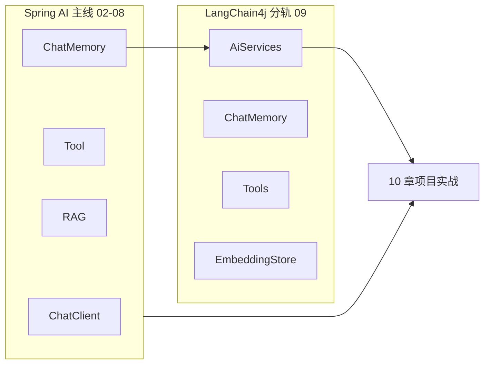
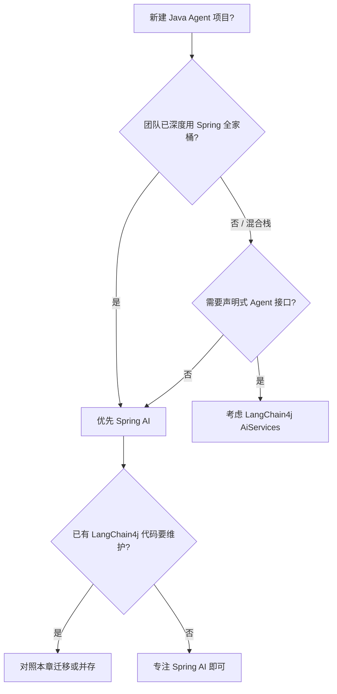
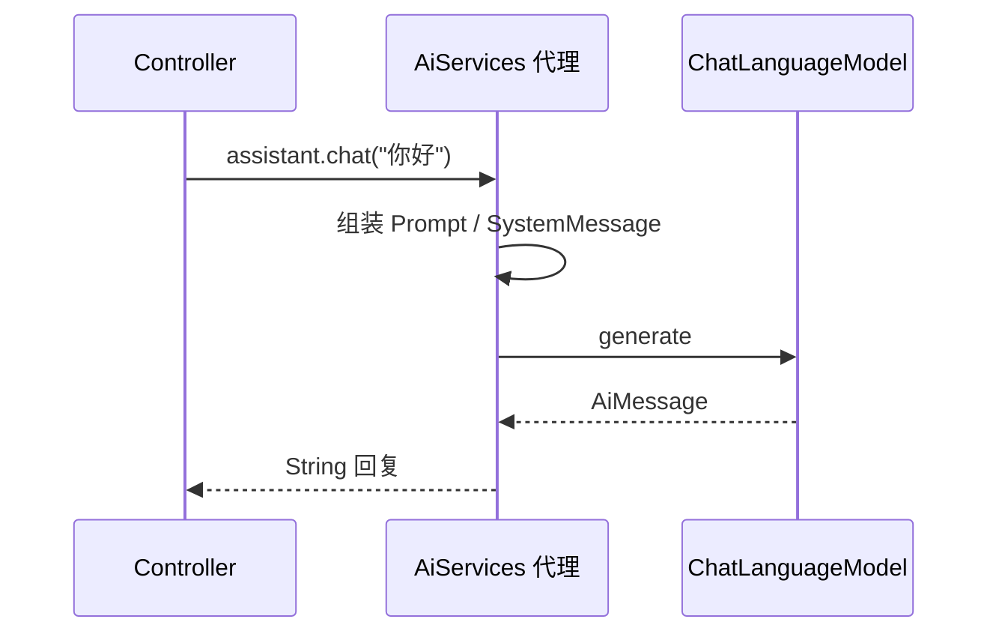
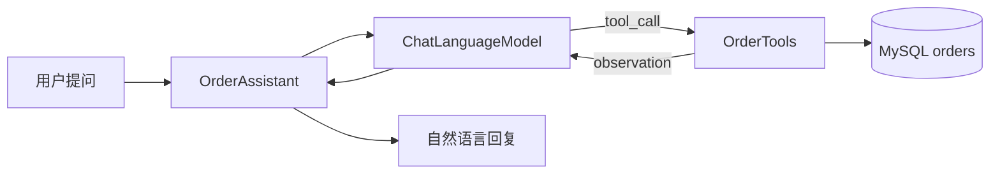
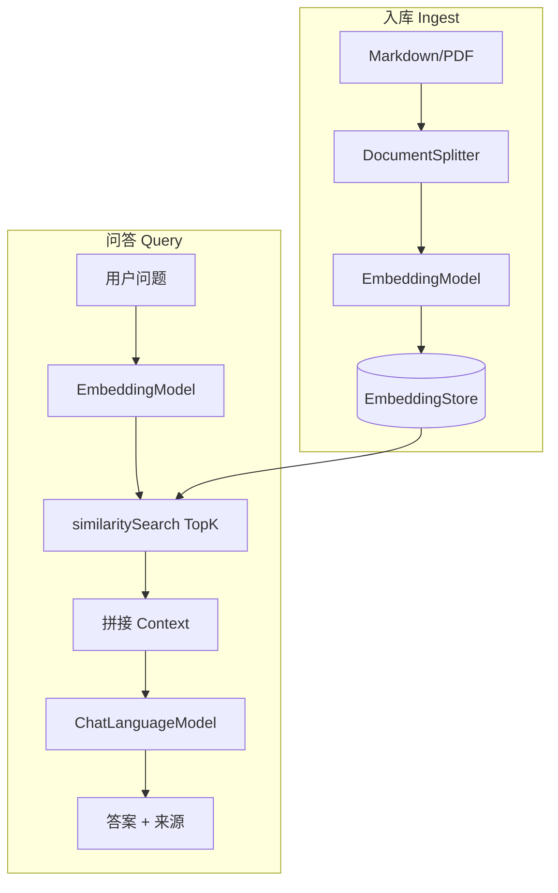

# LangChain4j 进阶（可选分轨）

<!-- 修改说明: AI Agent 路线第 09 章，LangChain4j 与 Spring AI 对照分轨 -->

---

## 0. 读前导读（零基础也能跟上）

### 0.1 用一句话弄懂本章

**Spring AI 是主线；LangChain4j 是「对照翻译器」**——用另一套 Java API 实现聊天、记忆、Tool、RAG，让你面试能对比、读社区项目不懵。

### 0.2 你需要提前知道什么

| 水平 | 建议 |
|------|------|
| 02～08 Spring AI 未学完 | **先完成主线**；本章可选 |
| 已完成 06 RAG + 08 Memory | ✅ 对照学习最高效 |
| 完全零基础 | 跳过本章，10 章后再回来看 |

### 0.3 本章知识地图（学完后应能勾选全部 ☐→☑）

```text
☐ 能画 Spring AI ↔ LangChain4j 概念映射表
☐ 理解 AiServices 声明式接口 vs ChatClient
☐ 用 @MemoryId 实现多轮记忆（对照 08 章 Memory）
☐ 绑定 @Tool 并完成一次工具调用（对照 04 章）
☐ 用 EmbeddingStoreIngestor + ContentRetriever 跑 RAG（对照 06～07）
☐ 说清校招项目为何以 Spring AI 为主
☐ 独立搭建 lc4j-demo 并 curl 通 /api/lc4j/chat
☐ 了解两框架并存时的依赖冲突风险
```

### 0.4 建议学习时长与节奏

| 阶段 | 内容 | 时间 |
|------|------|------|
| 对照表 §2 | 概念映射 | 45 分钟 |
| 搭建 §3 | lc4j-demo | 1 小时 |
| AiServices §4 | 记忆 | 1.5 小时 |
| Tool §5 + RAG §6 | | 2 小时 |
| 联调 §10 + 自测 | | 1 小时 |
| **合计** | | **约 1～2 天（选修）** |

### 0.5 学完本章你能做什么

1. 用 LangChain4j 写出与 06 章等价的 RAG 问答（内存 EmbeddingStore）
2. 用 `@MemoryId` 两轮对话，第二轮能答「我刚才问的是什么」
3. 面试回答：「我们项目 Spring AI，我了解 LangChain4j 的 AiServices 和 EmbeddingStore」

### 0.6 卡住了怎么办

| 卡点 | 检查 | 跳转 |
|------|------|------|
| No ChatLanguageModel Bean | profile 是否 active | §14 |
| 与 agent-demo 依赖冲突 | 是否分模块 | §8.2 |
| RAG 胡编 | minScore、ingest 是否成功 | §6.3 |

### 0.7 工具与环境

| 项 | 说明 |
|----|------|
| lc4j-demo | 独立工程，端口 8081 |
| Ollama / DeepSeek | 与 02 章相同 |
| langchain4j 0.36.x | pom 中 `${langchain4j.version}` |

### 0.8 核心术语预览（与 Spring AI 对照）

| LangChain4j | Spring AI | 生活类比 |
|-------------|-----------|----------|
| `EmbeddingModel` | `EmbeddingModel` | 文本→GPS 坐标（同 06 章） |
| `EmbeddingStore` | `VectorStore` | 存坐标的仓库 |
| `TextSegment` | `Document` Chunk | 一张便签 |
| `ChatMemory` | `ChatMemory` | 服务员小本子（同 08 章） |
| `@MemoryId` | `CONVERSATION_ID` param | 桌号 |
| `ContentRetriever` | `QuestionAnswerAdvisor` | 答题前先翻资料 |

---

## 本章与上一章的关系

上一章（[08 对话记忆与会话管理](./08-对话记忆与会话管理.md)）你已在 **Spring AI** 主线跑通了 `MessageWindowChatMemory`、Redis 持久化、`conversationId` 隔离与 JWT 归属校验。至此，**Spring AI 路线 02～08 的核心能力已全部齐备**。

本章是 **可选分轨**：用 **LangChain4j** 实现同一类能力（对话、记忆、Tool、RAG），并与 Spring AI 逐项对照。目的不是让你换框架，而是：

- 面试能说清「Java 生态里两套主流 AI 框架各擅长什么」
- 读开源 Agent 项目（不少用 LangChain4j）时不陌生
- 简历写「Spring AI 为主，了解 LangChain4j」有据可依

> **前置**：已完成 [02 Spring AI 核心开发](./02-SpringAI核心开发.md) 与 [08 会话记忆](./08-对话记忆与会话管理.md)；[Java 04 Spring Boot](../Java/04-SpringBoot核心开发.md) 分层习惯不变。

### 本章在整体路线中的位置



学完本章，继续：[10-Agent 项目实战与面试准备](./10-Agent项目实战与面试准备.md)（仍以 Spring AI 为主栈串项目）。

---

## 1. 为什么需要「对照轨」

国内 Java 后端岗面试，**Spring AI** 因与 Spring Boot 同源、自动配置完善，逐渐成为「官方答案」。但 LangChain4j 在以下场景仍常见：

| 场景 | 说明 |
|------|------|
| 社区 Agent 示例 | GitHub 上 Quarkus / 纯 Java Agent demo 多用 LangChain4j |
| AiServices 声明式 API | 用接口 + 注解快速定义 Agent，代码量少 |
| 多模型切换 | 同一套 API 接 OpenAI、Ollama、Azure、Gemini |
| 与 Spring AI 并存 | 部分团队 Spring AI 做 RAG，LangChain4j 做复杂 Agent 编排 |

**本资料策略**：02～08、10～12 **默认 Spring AI**；09 章 **1～3 天** 过 LangChain4j 核心，能对照写出等价 demo 即可。

---

## 2. Spring AI vs LangChain4j 总览

### 2.1 定位对比

| 维度 | Spring AI | LangChain4j |
|------|-----------|-------------|
| 维护方 | Spring 官方 | 社区（LangChain4j 团队） |
| 集成方式 | `spring-boot-starter-*` 自动配置 | 手动 `@Bean` 或 `langchain4j-spring-boot-starter` |
| 核心调用 API | `ChatClient` Fluent API | `ChatLanguageModel` + **AiServices** |
| 记忆 | `ChatMemory` + `MessageChatMemoryAdvisor` | `ChatMemory` + `MessageWindowChatMemory` |
| Tool | `@Tool` + `MethodToolCallback` | `@Tool` 注解在接口方法上 |
| RAG | `VectorStore` + `QuestionAnswerAdvisor` | `EmbeddingStore` + `EmbeddingStoreContentRetriever` |
| 流式 | `ChatClient.stream()` / `Flux` | `StreamingChatLanguageModel` + `TokenStream` |
| 文档 | [Spring AI Reference](https://docs.spring.io/spring-ai/reference/) | [LangChain4j Docs](https://docs.langchain4j.dev/) |
| 本资料主线 | ✅ 02～08、10～12 | ⭕ 09 对照 |

### 2.2 选型决策树



### 2.3 概念映射表（面试背这张就够）

| 能力 | Spring AI | LangChain4j |
|------|-----------|-------------|
| 聊天模型 | `ChatModel` / `ChatClient` | `ChatLanguageModel` |
| 嵌入模型 | `EmbeddingModel` | `EmbeddingModel` |
| 向量库 | `VectorStore` | `EmbeddingStore<TextSegment>` |
| 检索增强 | `QuestionAnswerAdvisor` | `RetrievalAugmentor` / `ContentRetriever` |
| 会话记忆 | `ChatMemory` + Advisor | `chatMemory()` on AiServices builder |
| 工具调用 | `@Tool` on `@Bean` methods | `@Tool` on AiServices interface |
| 会话 ID | `ChatMemory.CONVERSATION_ID` | `memoryId` 参数 |
| 流式输出 | `.stream().content()` | `StreamingChatLanguageModel` |

---

## 3. 项目搭建：lc4j-demo

### 3.1 与 agent-demo 的关系

建议在 `agent-demo` 旁新建 **`lc4j-demo`**，或在本项目加 `profile=langchain4j` 模块。**不要** 在同一 `pom.xml` 里混用两套 BOM 而不隔离版本，易冲突。

```text
lc4j-demo/
├── pom.xml
└── src/main/
    ├── java/com/example/lc4j/
    │   ├── Lc4jDemoApplication.java
    │   ├── assistant/
    │   │   ├── ChatAssistant.java          # AiServices 接口
    │   │   └── OrderAssistant.java         # 带 Tool 的接口
    │   ├── tools/
    │   │   └── OrderTools.java
    │   ├── config/
    │   │   └── LangChain4jConfig.java
    │   └── controller/
    │       └── Lc4jChatController.java
    └── resources/
        ├── application.yml
        └── kb-docs/                        # RAG 样例文档
```

### 3.2 pom.xml（LangChain4j 0.36+ 示例）

```xml
<?xml version="1.0" encoding="UTF-8"?>
<project xmlns="http://maven.apache.org/POM/4.0.0"
         xmlns:xsi="http://www.w3.org/2001/XMLSchema-instance"
         xsi:schemaLocation="http://maven.apache.org/POM/4.0.0 https://maven.apache.org/xsd/maven-4.0.0.xsd">
    <modelVersion>4.0.0</modelVersion>

    <parent>
        <groupId>org.springframework.boot</groupId>
        <artifactId>spring-boot-starter-parent</artifactId>
        <version>3.2.5</version>
    </parent>

    <groupId>com.example</groupId>
    <artifactId>lc4j-demo</artifactId>
    <version>0.0.1-SNAPSHOT</version>

    <properties>
        <java.version>17</java.version>
        <langchain4j.version>0.36.2</langchain4j.version>
    </properties>

    <dependencies>
        <dependency>
            <groupId>org.springframework.boot</groupId>
            <artifactId>spring-boot-starter-web</artifactId>
        </dependency>

        <!-- OpenAI 兼容（DeepSeek） -->
        <dependency>
            <groupId>dev.langchain4j</groupId>
            <artifactId>langchain4j-open-ai</artifactId>
            <version>${langchain4j.version}</version>
        </dependency>

        <!-- Ollama 本地 -->
        <dependency>
            <groupId>dev.langchain4j</groupId>
            <artifactId>langchain4j-ollama</artifactId>
            <version>${langchain4j.version}</version>
        </dependency>

        <!-- 内存向量库（练手） -->
        <dependency>
            <groupId>dev.langchain4j</groupId>
            <artifactId>langchain4j-embeddings-all-minilm-l6-v2</artifactId>
            <version>${langchain4j.version}</version>
        </dependency>

        <!-- Redis 向量 / 记忆（生产向，对照 07/08 章） -->
        <dependency>
            <groupId>dev.langchain4j</groupId>
            <artifactId>langchain4j-redis</artifactId>
            <version>${langchain4j.version}</version>
        </dependency>

        <dependency>
            <groupId>org.projectlombok</groupId>
            <artifactId>lombok</artifactId>
            <optional>true</optional>
        </dependency>
    </dependencies>
</project>
```

> 版本号以 [Maven Central](https://central.sonatype.com/search?q=langchain4j) 为准；升级后 API 可能微调，以官方文档为准。

### 3.3 application.yml

```yaml
server:
  port: 8081   # 避免与 agent-demo 8080 冲突

langchain4j:
  open-ai:
    chat-model:
      api-key: ${DEEPSEEK_API_KEY}
      base-url: https://api.deepseek.com/v1
      model-name: deepseek-chat
      temperature: 0.7
      timeout: 60s
    embedding-model:
      api-key: ${DEEPSEEK_API_KEY}
      base-url: https://api.deepseek.com/v1
      model-name: text-embedding-3-small

# 本地 Ollama 备用
ollama:
  base-url: http://localhost:11434
  chat-model: qwen2.5:3b
  embedding-model: nomic-embed-text
```

### 3.4 配置类：手动装配 ChatModel

```java
package com.example.lc4j.config;

import dev.langchain4j.model.chat.ChatLanguageModel;
import dev.langchain4j.model.embedding.EmbeddingModel;
import dev.langchain4j.model.ollama.OllamaChatModel;
import dev.langchain4j.model.ollama.OllamaEmbeddingModel;
import dev.langchain4j.model.openai.OpenAiChatModel;
import dev.langchain4j.model.openai.OpenAiEmbeddingModel;
import org.springframework.beans.factory.annotation.Value;
import org.springframework.context.annotation.Bean;
import org.springframework.context.annotation.Configuration;
import org.springframework.context.annotation.Profile;

import java.time.Duration;

@Configuration
public class LangChain4jConfig {

    @Bean
    @Profile("deepseek")
    ChatLanguageModel deepSeekChat(
            @Value("${langchain4j.open-ai.chat-model.api-key}") String apiKey) {
        return OpenAiChatModel.builder()
                .apiKey(apiKey)
                .baseUrl("https://api.deepseek.com/v1")
                .modelName("deepseek-chat")
                .temperature(0.7)
                .timeout(Duration.ofSeconds(60))
                .build();
    }

    @Bean
    @Profile("ollama")
    ChatLanguageModel ollamaChat(@Value("${ollama.base-url}") String baseUrl,
                                 @Value("${ollama.chat-model}") String model) {
        return OllamaChatModel.builder()
                .baseUrl(baseUrl)
                .modelName(model)
                .timeout(Duration.ofSeconds(120))
                .build();
    }

    @Bean
    @Profile("ollama")
    EmbeddingModel ollamaEmbedding(@Value("${ollama.base-url}") String baseUrl,
                                   @Value("${ollama.embedding-model}") String model) {
        return OllamaEmbeddingModel.builder()
                .baseUrl(baseUrl)
                .modelName(model)
                .build();
    }
}
```

与 [02 章 Spring AI 自动配置](./02-SpringAI核心开发.md) 对比：LangChain4j **更显式**，每个 `ChatLanguageModel` 通常自己 `@Bean`，控制力更强，样板代码略多。

---

## 4. AiServices：声明式 Agent 接口

### 4.1 最小 Hello Chat

**Spring AI 写法（复习）**：

```java
String reply = chatClient.prompt().user("你好").call().content();
```

**LangChain4j 写法**：

```java
public interface ChatAssistant {
    String chat(String userMessage);
}

ChatAssistant assistant = AiServices.create(ChatAssistant.class, chatLanguageModel);
String reply = assistant.chat("你好");
```



### 4.2 带 System Prompt 的接口

```java
import dev.langchain4j.service.SystemMessage;
import dev.langchain4j.service.UserMessage;

public interface HrAssistant {

    @SystemMessage("""
        你是企业 HR 助手，只回答与员工手册相关的问题。
        若问题超出范围，礼貌拒绝。
        """)
    String answer(@UserMessage String question);
}
```

```java
@Bean
HrAssistant hrAssistant(ChatLanguageModel model) {
    return AiServices.builder(HrAssistant.class)
            .chatLanguageModel(model)
            .build();
}
```

对照 Spring AI：等价于 `ChatClient` 的 `.system("...").user(question)`，或 `classpath:prompts/system.st` + `PromptTemplate`。

### 4.3 多轮记忆：memoryId

**Memory（对话记忆）**：LangChain4j 的 `ChatMemory` 与 Spring AI 同名概念。
**生活类比**：与 [08 章](./08-对话记忆与会话管理.md) 相同——服务员小本子；`@MemoryId` 就是 **桌号**，告诉框架读哪一本子。
**为什么重要**：接口方法第一个参数传 conversationId，比 Spring AI 的 `.param()` 更直观。
**本章用到的地方**：§4.4 Redis ChatMemoryStore、§10 Controller。

```java
import dev.langchain4j.service.MemoryId;

public interface MemoryChatAssistant {

    @SystemMessage("你是友好的技术助手。")
    String chat(@MemoryId String conversationId, @UserMessage String userMessage);
}
```

```java
@Bean
MemoryChatAssistant memoryChatAssistant(ChatLanguageModel model) {
    ChatMemory chatMemory = MessageWindowChatMemory.withMaxMessages(20);

    return AiServices.builder(MemoryChatAssistant.class)
            .chatLanguageModel(model)
            .chatMemory(chatMemory)
            .build();
}
```

| Spring AI | LangChain4j |
|-----------|-------------|
| `.param(ChatMemory.CONVERSATION_ID, id)` | 方法参数 `@MemoryId String conversationId` |
| `MessageChatMemoryAdvisor` | `AiServices.builder().chatMemory(...)` |
| `RedisChatMemoryRepository` | `ChatMemoryStore` 自定义或第三方 |

### 4.4 Redis 持久化记忆（对照 08 章）

```java
import dev.langchain4j.store.memory.chat.ChatMemoryStore;
import dev.langchain4j.data.message.ChatMessage;
import org.springframework.data.redis.core.StringRedisTemplate;

import java.util.List;

public class RedisChatMemoryStore implements ChatMemoryStore {

    private final StringRedisTemplate redis;
    private final String keyPrefix;
    private final Duration ttl;

    public RedisChatMemoryStore(StringRedisTemplate redis, String keyPrefix, Duration ttl) {
        this.redis = redis;
        this.keyPrefix = keyPrefix;
        this.ttl = ttl;
    }

    @Override
    public List<ChatMessage> getMessages(Object memoryId) {
        String json = redis.opsForValue().get(keyPrefix + memoryId);
        if (json == null) return List.of();
        return ChatMessageDeserializer.messagesFromJson(json);
    }

    @Override
    public void updateMessages(Object memoryId, List<ChatMessage> messages) {
        redis.opsForValue().set(
                keyPrefix + memoryId,
                ChatMessageSerializer.messagesToJson(messages),
                ttl
        );
    }

    @Override
    public void deleteMessages(Object memoryId) {
        redis.delete(keyPrefix + memoryId);
    }
}
```

```java
ChatMemory chatMemory = MessageWindowChatMemory.builder()
        .id("default")
        .maxMessages(20)
        .chatMemoryStore(redisChatMemoryStore)
        .build();
```

与 [08 章 RedisChatMemoryRepository](./08-对话记忆与会话管理.md) 思路一致：key 含 `conversationId`，设 TTL，JWT 校验归属仍在 **Controller/Service 层** 做，框架不负责鉴权。

---

## 5. Tools：@Tool 注解

### 5.1 定义 Tool（对照 04 章）

```java
import dev.langchain4j.agent.tool.Tool;
import org.springframework.stereotype.Component;

@Component
public class OrderTools {

    private final OrderMapper orderMapper;

    public OrderTools(OrderMapper orderMapper) {
        this.orderMapper = orderMapper;
    }

    @Tool("根据订单号查询订单状态，返回 JSON 字符串")
    public String queryOrderStatus(
            @P("订单号，例如 ORD20240315001") String orderNo) {
        Order order = orderMapper.findByOrderNo(orderNo);
        if (order == null) {
            return "{\"found\":false,\"message\":\"订单不存在\"}";
        }
        return """
            {"found":true,"orderNo":"%s","status":"%s","amount":%s}
            """.formatted(order.getOrderNo(), order.getStatus(), order.getAmount());
    }
}
```

### 5.2 绑定到 AiServices

| 步骤 | 你的动作 | 预期看到什么 | 若不对 |
|------|----------|--------------|--------|
| 1 | `@Component` 注册 OrderTools | Spring 容器有 Bean | 未扫描包路径 |
| 2 | `AiServices.builder().tools(orderTools)` | 启动无报错 | tools 为 null |
| 3 | 问「订单 ORD001 状态」 | 日志有 tool 调用 | 模型不支持 tool → 换模型 |
| 4 | 问闲聊 | 不应乱调 Tool | System 约束 + 04 章白名单 |

```java
public interface OrderAssistant {

    @SystemMessage("""
        你是商城客服助手。查订单用 queryOrderStatus 工具。
        不要编造订单信息。无权限时不要调用工具。
        """)
    String help(@MemoryId String sessionId, @UserMessage String question);
}

@Bean
OrderAssistant orderAssistant(ChatLanguageModel model, OrderTools orderTools) {
    return AiServices.builder(OrderAssistant.class)
            .chatLanguageModel(model)
            .tools(orderTools)
            .chatMemory(MessageWindowChatMemory.withMaxMessages(15))
            .build();
}
```



### 5.3 Spring AI vs LangChain4j Tool 差异

| 点 | Spring AI | LangChain4j |
|----|-----------|-------------|
| 注册方式 | `@Bean` + `MethodToolCallbackProvider` | `.tools(bean)` 传入含 `@Tool` 的类 |
| 描述来源 | `@Tool(description=...)` | `@Tool("描述")` |
| 参数说明 | `@ToolParam` | `@P("说明")` |
| 返回值 | 任意类型序列化 | 建议 String 或简单 POJO |
| 安全 | 04 章白名单 + 鉴权 | 同样需在 Tool 内校验 userId |

> **安全提醒**：Tool 内必须校验调用者身份，防 Prompt 注入诱导删库，见 [04 章](./04-FunctionCalling与Tool设计.md) 与 [Web安全 07](../../前端学习/Web安全/07-LLM应用安全与Prompt注入防护.md)。

### 5.4 多 Tool 与错误处理

```java
@Bean
BusinessAssistant businessAssistant(
        ChatLanguageModel model,
        OrderTools orderTools,
        WeatherTools weatherTools) {

    return AiServices.builder(BusinessAssistant.class)
            .chatLanguageModel(model)
            .tools(orderTools, weatherTools)
            .build();
}
```

Tool 抛异常时，LangChain4j 会把错误信息作为 **observation** 回给模型，模型可能重试或向用户解释——与 [05 章 ReAct](./05-Agent架构与ReAct模式.md) 观察步一致。应对 **敏感异常** 做脱敏，避免堆栈泄露给模型和用户。

---

## 6. RAG：EmbeddingStore 与 ContentRetriever

### 6.0 对照复习：Embedding / Vector / Chunk

**Embedding**：LangChain4j 与 Spring AI 同名——文本→数字列。
**Vector**：存入 `EmbeddingStore` 的坐标；练手用 `InMemoryEmbeddingStore`，生产用 `PgVectorEmbeddingStore` / `RedisEmbeddingStore`（对照 [07 章](./07-向量数据库与知识库实战.md)）。
**Chunk**：`DocumentSplitter` 切出的 `TextSegment`，相当于 06 章 Document 块。
**生活类比**：与 06 章完全相同——撕便签、贴 GPS、在仓库里找最近的 K 张。
**为什么本章还要讲**：API 名字不同（`findRelevant` vs `similaritySearch`），本质一样。

### 6.1 流程对照（06～07 章）



| 步骤 | Spring AI | LangChain4j |
|------|-----------|-------------|
| 分块 | `TokenTextSplitter` | `DocumentSplitters.recursive(...)` |
| 嵌入 | `EmbeddingModel.embed` | 同左 |
| 存储 | `VectorStore.add` | `EmbeddingStore.add` |
| 检索 | `VectorStore.similaritySearch` | `EmbeddingStore.findRelevant` |
| 增强 | `QuestionAnswerAdvisor` | `RetrievalAugmentor` / 手动拼 prompt |

### 6.2 入库代码

```java
import dev.langchain4j.data.document.Document;
import dev.langchain4j.data.document.loader.FileSystemDocumentLoader;
import dev.langchain4j.data.document.splitter.DocumentSplitters;
import dev.langchain4j.data.segment.TextSegment;
import dev.langchain4j.model.embedding.EmbeddingModel;
import dev.langchain4j.store.embedding.EmbeddingStore;
import dev.langchain4j.store.embedding.EmbeddingStoreIngestor;

@Service
public class Lc4jIngestService {

    private final EmbeddingModel embeddingModel;
    private final EmbeddingStore<TextSegment> embeddingStore;

    public int ingestDirectory(Path dir) {
        List<Document> documents = FileSystemDocumentLoader.loadDocuments(dir);
        EmbeddingStoreIngestor ingestor = EmbeddingStoreIngestor.builder()
                .documentSplitter(DocumentSplitters.recursive(500, 50))
                .embeddingModel(embeddingModel)
                .embeddingStore(embeddingStore)
                .build();
        ingestor.ingest(documents);
        return documents.size();
    }
}
```

### 6.3 检索 + AiServices 一体化

```java
import dev.langchain4j.rag.content.retriever.EmbeddingStoreContentRetriever;

@Bean
KbAssistant kbAssistant(ChatLanguageModel model, EmbeddingStore<TextSegment> store,
                        EmbeddingModel embeddingModel) {

    ContentRetriever retriever = EmbeddingStoreContentRetriever.builder()
            .embeddingStore(store)
            .embeddingModel(embeddingModel)
            .maxResults(5)
            .minScore(0.6)
            .build();

    return AiServices.builder(KbAssistant.class)
            .chatLanguageModel(model)
            .contentRetriever(retriever)
            .build();
}
```

```java
public interface KbAssistant {

    @SystemMessage("""
        仅根据检索到的资料回答。资料不足时说「根据现有资料无法确定」。
        回答末尾标注引用来源文件名。
        """)
    String ask(@UserMessage String question);
}
```

对照 Spring AI [06 章 RagService](./06-RAG检索增强生成基础.md)：Spring AI 常用 `QuestionAnswerAdvisor` 挂在 `ChatClient` 上；LangChain4j 把 `contentRetriever` 绑在 **AiServices builder**，对用户代码更「无感」。

### 6.3.1 逐行读代码：Lc4jIngestService + KbAssistant

| 行号/代码 | 含义 | 改错会怎样 |
|-----------|------|------------|
| `FileSystemDocumentLoader.loadDocuments` | 等同 Spring AI DocumentReader | 目录空 → 0 文档 |
| `DocumentSplitters.recursive(500, 50)` | 500 token 块、50 overlap | 与 06 章 chunk 策略同 |
| `EmbeddingStoreIngestor.builder()` | 一键 split+embed+store | 缺 embeddingModel → 启动失败 |
| `maxResults(5)` | 等同 topK=5 | 太大噪声多 |
| `minScore(0.6)` | 等同 similarityThreshold | 太低易胡编 |
| `.contentRetriever(retriever)` | RAG 自动拼 context | 未 ingest → 空 context |

### 6.4 向量库选型（与 07 章对齐）

| 存储 | Spring AI | LangChain4j | 本资料建议 |
|------|-----------|-------------|-----------|
| 内存 | `SimpleVectorStore` | `InMemoryEmbeddingStore` | 单元测试 |
| Redis | Redis Vector | `RedisEmbeddingStore` | 与 [Java 07 Redis](../Java/07-Redis核心原理与缓存实战.md) 统一运维 |
| PG | PGVector | `PgVectorEmbeddingStore` | 生产推荐 |
| 本地文件 | - | 部分社区扩展 | 练手 |

---

## 7. 流式输出

### 7.1 StreamingChatLanguageModel

```java
public interface StreamingAssistant {
    TokenStream chat(@MemoryId String id, @UserMessage String message);
}
```

```java
@Bean
StreamingAssistant streamingAssistant(StreamingChatLanguageModel streamingModel) {
    return AiServices.builder(StreamingAssistant.class)
            .streamingChatLanguageModel(streamingModel)
            .chatMemory(MessageWindowChatMemory.withMaxMessages(20))
            .build();
}
```

```java
@GetMapping(value = "/stream", produces = MediaType.TEXT_EVENT_STREAM_VALUE)
public SseEmitter stream(@RequestParam String conversationId,
                         @RequestParam String message) {
    SseEmitter emitter = new SseEmitter(120_000L);
    TokenStream stream = streamingAssistant.chat(conversationId, message);

    stream.onPartialResponse(partial -> {
                try {
                    emitter.send(SseEmitter.event().data(partial));
                } catch (IOException e) {
                    emitter.completeWithError(e);
                }
            })
            .onCompleteResponse(response -> emitter.complete())
            .onError(emitter::completeWithError)
            .start();

    return emitter;
}
```

对照 [03 章 SSE](./03-流式对话与SSE实战.md)：Spring AI 的 `Flux<String>` 与 LangChain4j 的 `TokenStream` 回调风格不同，前端 `EventSource` 消费方式一致。

---

## 8. 两框架并存策略（了解即可）

### 8.1 何时并存

- 老项目已用 LangChain4j，新模块用 Spring AI
- 团队评估迁移中，短期双栈

### 8.2 并存注意点

| 风险 | 对策 |
|------|------|
| 依赖冲突 | 分模块 Maven multi-module，统一 BOM 版本 |
| 重复 Bean | `@Primary` 明确默认 `ChatModel` |
| 记忆不互通 | 统一 `conversationId` 规范，或只选一套记忆存储 |
| 配置分散 | `application-ai.yml` 集中管理 |

**校招项目建议**：不要在一个 demo 里混用两套框架写核心业务——选一个写进简历，另一个写「了解」。

---

## 9. 何时选 Spring AI / LangChain4j

### 9.1 选 Spring AI（本资料默认）

- 团队标准技术栈是 **Spring Boot**
- 需要 **Advisor、VectorStore、Observation** 与 Spring 生态一致
- 计划用 **Spring AI Alibaba / Azure** 等官方集成
- 面试岗位 JD 写「Spring Boot」为主

### 9.2 选 LangChain4j

- 已有 LangChain4j 代码库要维护
- 偏好 **AiServices 接口式** 开发，减少样板代码
- 需要 **Quarkus** 原生编译（LangChain4j 在 Quarkus 社区示例多）
- 面试官明确问「LangChain4j 和 Spring AI 区别」——你两类都试过

### 9.3 都可以：能力边界

两者都能完成：**对话、流式、记忆、Tool、RAG、多模型**。差距在 **工程化细节**（自动配置、可观测性、与 Spring Cloud 整合），不在「能不能做 Agent」。

---

## 10. 完整 Controller 示例

| 步骤 | 你的动作 | 预期看到什么 | 若不对 |
|------|----------|--------------|--------|
| 1 | `mvn spring-boot:run -Dspring-boot.run.profiles=ollama` | 8081 启动 | §14 No ChatLanguageModel |
| 2 | ingest kb-docs（若做 RAG） | EmbeddingStore 有数据 | §6.2 |
| 3 | POST `/api/lc4j/chat` 第一轮 | 有回复 | Bean 未注册 |
| 4 | 同 conversationId 第二轮问「刚才问什么」 | 能回忆端口/问题 | memoryId 变了 |
| 5 | POST `/api/lc4j/kb/ask` | 基于资料回答 | minScore 过低 |

```java
@RestController
@RequestMapping("/api/lc4j")
public class Lc4jChatController {

    private final MemoryChatAssistant memoryChatAssistant;
    private final KbAssistant kbAssistant;

    public Lc4jChatController(MemoryChatAssistant memoryChatAssistant,
                              KbAssistant kbAssistant) {
        this.memoryChatAssistant = memoryChatAssistant;
        this.kbAssistant = kbAssistant;
    }

    @PostMapping("/chat")
    public ChatResponse chat(@RequestBody ChatRequest req) {
        String reply = memoryChatAssistant.chat(req.conversationId(), req.message());
        return new ChatResponse(req.conversationId(), reply);
    }

    @PostMapping("/kb/ask")
    public ChatResponse kbAsk(@RequestBody ChatRequest req) {
        String reply = kbAssistant.ask(req.message());
        return new ChatResponse(null, reply);
    }

    public record ChatRequest(String conversationId, String message) {}
    public record ChatResponse(String conversationId, String content) {}
}
```

### 10.1 逐行读代码：Lc4jChatController

| 行号/代码 | 含义 | 改错会怎样 |
|-----------|------|------------|
| `@PostMapping("/chat")` | 多轮对话入口 | — |
| `memoryChatAssistant.chat(convId, msg)` | AiServices 代理：注入 Memory + 调 LLM | 未 `.chatMemory()` → 无多轮 |
| `@MemoryId` 对应参数 | 等同 Spring AI `CONVERSATION_ID` | 每轮换 id → 失忆 |
| `kbAssistant.ask(msg)` | 绑了 ContentRetriever 的 RAG | 未 ingest → 易胡编 |
| `ChatRequest(conversationId, message)` | 客户端持久化 conversationId | 空 id 时 memory 混用 |

验证：

```powershell
curl -X POST http://localhost:8081/api/lc4j/chat `
  -H "Content-Type: application/json" `
  -d '{"conversationId":"test-001","message":"Redis 默认端口是多少？"}'

curl -X POST http://localhost:8081/api/lc4j/chat `
  -H "Content-Type: application/json" `
  -d '{"conversationId":"test-001","message":"我刚才问的是什么？"}'
# 预期：能回忆「端口」
```

---

## 11. 迁移对照清单（Spring AI → LangChain4j）

| Spring AI 代码 | LangChain4j 等价 |
|----------------|------------------|
| `ChatClient.builder(model).build()` | `AiServices.create(Assistant.class, model)` |
| `MessageChatMemoryAdvisor` | `.chatMemory(...)` |
| `@Tool` on `@Bean` | `@Tool` on `@Component` + `.tools(...)` |
| `QuestionAnswerAdvisor` | `.contentRetriever(...)` |
| `VectorStore` | `EmbeddingStore<TextSegment>` |
| `SearchRequest.topK(5)` | `maxResults(5)` + `minScore` |
| `ChatClient.stream()` | `StreamingChatLanguageModel` + `TokenStream` |

反向迁移时，把 **AiServices 接口** 拆成 **Service + ChatClient** 即可，业务 Prompt 与 Tool 逻辑可复用。

---

## 12. 面试常问

### Q1：Spring AI 和 LangChain4j 你怎么选？

> 我们项目以 Spring Boot 为主，选 **Spring AI** 自动配置和 Advisor 体系更省心。LangChain4j 我做过对照 demo，熟悉 **AiServices** 和 **EmbeddingStore**，维护老代码或读社区 Agent 示例时能快速上手。

### Q2：AiServices 底层是什么？

动态代理：根据接口方法注解组装 Prompt、注入 Memory、执行 Tool 循环，本质仍是 `ChatLanguageModel.generate`。

### Q3：记忆存在哪？

默认内存；生产用 **Redis ChatMemoryStore** 或 JDBC，与 08 章 Spring AI 的 Redis Repository 同思路。

### Q4：RAG 检索不准怎么办？

调 `minScore`、`maxResults`、分块大小；加 metadata filter；与 [06 章评估](./06-RAG检索增强生成基础.md) 一致，与框架无关。

### Q5：能否生产用 LangChain4j？

可以，但需自建监控、限流、熔断——见 [11 章生产化](./11-生产化与安全.md)。

---

## 13. 常见误区

### 13.1 以为必须学 LangChain4j 才能做 Agent

错。Spring AI 足够完成校招级 Agent 项目。

### 13.2 同一项目混用两套 ChatMemory

conversationId 格式不一致会导致「有记忆 / 无记忆」混乱。

### 13.3 Tool 不做鉴权

两套框架都不会自动替你校验 userId。

### 13.4 忽略 embedding 与 chat 模型 profile

Ollama 下 chat 用 qwen、embedding 用 nomic，需分别 `ollama pull`。

### 13.5 用 InMemoryEmbeddingStore 上生产

重启丢库；应换 Redis / PGVector（[07 章](./07-向量数据库与知识库实战.md)）。

---

## 14. 常见报错与排查

| 现象 / 报错关键词 | 可能原因 | 解决方案 |
|-------------------|---------|---------|
| `No bean of type ChatLanguageModel` | 未配置 @Bean 或 profile 未激活 | 检查 `@Profile("ollama")` 与 `spring.profiles.active` |
| `401 Unauthorized` OpenAI client | API Key 错误或 base-url 不对 | DeepSeek 用 `https://api.deepseek.com/v1`；环境变量是否注入 |
| `Connection refused :11434` | Ollama 未启动 | `ollama serve`；对照 [02 章报错表](./02-SpringAI核心开发.md) |
| `Tool execution failed` | Tool 内抛异常或参数 JSON 解析失败 | 检查 `@P` 描述是否清晰；Tool 返回明确错误字符串 |
| `NullPointerException` in AiServices | 接口未注册 memory 却传了 memoryId | `.chatMemory(...)` 或去掉 `@MemoryId` |
| embedding 维度不匹配 | 换过 embedding 模型未重建索引 | 清空 EmbeddingStore 重新 ingest |
| `TimeoutException` 60s | 模型慢或网络差 | 增大 `timeout`；换小模型；见 [11 章](./11-生产化与安全.md) |
| Redis 记忆读不到 | keyPrefix 与 Spring AI 项目冲突 | 使用 `lc4j:chat:` 独立前缀 |
| `ClassNotFoundException: ChatMessageDeserializer` | langchain4j 版本不一致 | 统一 `${langchain4j.version}` |
| SSE 客户端只收到一条 | 未注册 `onPartialResponse` | 对照 7.1 节 TokenStream 回调 |
| Maven 依赖冲突 slf4j / okhttp | 与 Spring AI 同项目混依赖 | 分模块或 `mvn dependency:tree` 排查 |
| RAG 回答胡编 | minScore 过低或未绑 ContentRetriever | 提高 `minScore`；确认 ingest 成功 |

---

## 15. 与 Java / 其他 Agent 章节的交叉引用

| 主题 | 文档 |
|------|------|
| Spring Boot 分层 | [Java 04](../Java/04-SpringBoot核心开发.md) |
| Redis 记忆 / 限流 | [Java 07](../Java/07-Redis核心原理与缓存实战.md) |
| Spring AI 主线 | [02](./02-SpringAI核心开发.md)～[08](./08-对话记忆与会话管理.md) |
| Tool 设计 | [04 Function Calling](./04-FunctionCalling与Tool设计.md) |
| ReAct | [05 Agent 架构](./05-Agent架构与ReAct模式.md) |
| RAG | [06](./06-RAG检索增强生成基础.md)、[07 向量库](./07-向量数据库与知识库实战.md) |
| 完整项目 | [10 项目实战](./10-Agent项目实战与面试准备.md) |
| 生产安全 | [11 生产化](./11-生产化与安全.md)、[Web安全 07](../../前端学习/Web安全/07-LLM应用安全与Prompt注入防护.md) |
| 面试总表 | [12 面试专题](./12-面试专题与知识点总表.md) |

---

## 16. 分级练习

### 基础

用 LangChain4j 实现 `ChatAssistant` 接口，curl 调通单轮对话。

### 进阶

为 `OrderAssistant` 绑定 `OrderTools`，问「订单 ORD001 状态」能调 MySQL（复用 [Java 05 MyBatis](../Java/05-MyBatis事务与接口工程化.md) demo 表）。

### 挑战

`EmbeddingStoreIngestor` 入库 `kb-docs/`，`KbAssistant` RAG 问答，并与 Spring AI 版 [06 章](./06-RAG检索增强生成基础.md) 对比答案质量。

### 参考答案（基础）

```java
@SpringBootTest
@ActiveProfiles("ollama")
class ChatAssistantTest {

    @Autowired ChatLanguageModel model;

    @Test
    void hello() {
        ChatAssistant assistant = AiServices.create(ChatAssistant.class, model);
        String reply = assistant.chat("用一句话介绍 Spring Boot");
        assertThat(reply).isNotBlank();
    }
}
```

---

## 17. 学完标准

- [ ] 能画 Spring AI 与 LangChain4j 概念映射表（ChatModel、Memory、Tool、RAG）
- [ ] 独立搭建 `lc4j-demo` 并跑通 AiServices 单轮对话
- [ ] 实现带 `@MemoryId` 的多轮记忆（内存或 Redis）
- [ ] 绑定至少 1 个 `@Tool` 并完成一次工具调用
- [ ] 用 `EmbeddingStoreIngestor` + `ContentRetriever` 跑通 RAG 问答
- [ ] 说清「校招项目为何选 Spring AI 为主」
- [ ] 能对照 [08 章](./08-对话记忆与会话管理.md) 解释记忆存储异同

---

## 20. 常见问题 FAQ（≥10）

**Q1：必须学 LangChain4j 才能做 Agent 吗？**  
否。Spring AI 足够校招项目。

**Q2：AiServices 底层是什么？**  
动态代理，组装 Prompt/Memory/Tool 后调 `ChatLanguageModel`。

**Q3：EmbeddingStore 和 VectorStore 一样吗？**  
概念相同，API 名不同。

**Q4：@MemoryId 和 CONVERSATION_ID 对应关系？**  
都是会话 key；LangChain4j 用方法参数，Spring AI 用 Advisor param。

**Q5：能否与 Spring AI 同 pom？**  
易冲突；建议 lc4j-demo 独立模块。

**Q6：InMemoryEmbeddingStore 生产能用吗？**  
不能；换 PG/Redis（07 章）。

**Q7：Tool 要鉴权吗？**  
要；两框架都不自动校验 userId。

**Q8：RAG 检索不准？**  
调 minScore、maxResults、分块；与框架无关。

**Q9：流式 TokenStream vs Flux？**  
回调风格不同，SSE 消费类似。

**Q10：Quarkus 用哪个多？**  
LangChain4j 示例多；Spring 岗仍以 Spring AI 为主。

**Q11：Redis 记忆 key 冲突？**  
用 `lc4j:chat:` 独立前缀。

**Q12：为何简历写 Spring AI 为主？**  
与 Boot 生态、Advisor、Observation 一致。

---

## 21. 闭卷自测（≥10）

1. Spring AI ChatClient 对应 LangChain4j 什么？
2. QuestionAnswerAdvisor 对应什么？
3. AiServices 相比手写 ChatClient 优缺点？
4. @Tool 在两框架注册方式差异？
5. EmbeddingStoreIngestor 做哪几步？
6. @MemoryId 作用？
7. 为何分 lc4j-demo 独立工程？
8. InMemoryEmbeddingStore 局限？
9. 生产选 Spring AI 还是 LangChain4j？校招怎么说？
10. ContentRetriever 的 minScore 相当于 Spring AI 什么？

### 自测参考答案

1. `AiServices.create(Interface, ChatLanguageModel)`。
2. `ContentRetriever` / `.contentRetriever(...)`。
3. 优：声明式、代码少；缺：显式控制少、调试需熟悉代理。
4. Spring AI：`@Bean`+CallbackProvider；LC4j：`.tools(bean)`。
5. Split → Embed → 写入 EmbeddingStore。
6. 指定会话 memory 的 key，等同 conversationId。
7. 避免 BOM/Bean 冲突。
8. 重启丢库、无 filter。
9. 项目 Spring AI；了解 LangChain4j 读社区代码。
10. `similarityThreshold`。

---

## 22. 费曼检验

请 **不看资料**，3 分钟向面试官解释「两框架区别、你选哪个」。

**对照提纲**：

1. **同一能力**：都能 Chat、Memory、Tool、RAG；差在 API 风格和 Boot 集成度。
2. **Spring AI**：ChatClient + Advisor，自动配置，本资料主线。
3. **LangChain4j**：AiServices 接口式，社区 Agent 示例多；你做过对照 demo，维护老代码能上手。

---

## 18. 与下一章的衔接

09 章是 **框架对照选修**；**简历级完整项目** 仍在 Spring AI 栈完成。10 章将 01～08 的 Chat、SSE、Tool、RAG、会话 **总装** 为「企业知识库智能助手」，并给出 API 清单、库表、部署与 15 分钟面试话术。

继续学习：[10-Agent 项目实战与面试准备](./10-Agent项目实战与面试准备.md)

---

## 19. 我的笔记区

```text
我选的默认框架：
LangChain4j 版本：
AiServices 与 ChatClient 个人偏好：
面试「两框架区别」话术草稿：
```

---

## 附录 A：langchain4j-spring-boot-starter（可选）

若希望更接近 Spring AI 自动配置，可引入：

```xml
<dependency>
    <groupId>dev.langchain4j</groupId>
    <artifactId>langchain4j-spring-boot-starter</artifactId>
    <version>${langchain4j.version}</version>
</dependency>
```

配置前缀与手动 `@Bean` 二选一，避免重复注册 `ChatLanguageModel`。

---

## 附录 B：Quarkus 简注（扩展阅读）

LangChain4j 在 **Quarkus** 文档较多；若你学 [Java 11 微服务](../Java/11-微服务与SpringCloud基础.md) 时可关注 `quarkus-langchain4j`。校招 Java 岗仍以 **Spring Boot + Spring AI** 为主，Quarkus 作了解。

---

## 附录 D：Spring AI ↔ LangChain4j 对照实战清单

按能力逐项练手，每项 30 分钟：

| # | 能力 | Spring AI（主线） | LangChain4j（lc4j-demo） | 验证标准 |
|---|------|-------------------|--------------------------|----------|
| 1 | 单轮 Chat | `ChatClient.prompt().user()` | `AiServices.create(ChatAssistant)` | 有回复 |
| 2 | 多轮 Memory | `MessageChatMemoryAdvisor` + CONVERSATION_ID | `@MemoryId` + `.chatMemory()` | 第二轮指代成功 |
| 3 | Tool | `@Tool` on `@Bean` | `@Tool` on `@Component` + `.tools()` | 查到订单 |
| 4 | RAG ingest | `KnowledgeIngestService` | `EmbeddingStoreIngestor` | chunk>0 |
| 5 | RAG ask | `RagService` + VectorStore | `KbAssistant` + ContentRetriever | 带依据 |
| 6 | 流式 | `ChatClient.stream()` | `TokenStream` + SSE | 前端逐字 |
| 7 | 向量持久化 | PgVectorStore（07 章） | PgVectorEmbeddingStore | 重启可 ask |
| 8 | 会话 Redis | RedisChatMemoryRepository | RedisChatMemoryStore | KEYS 可见 |

## 附录 E：面试 3 分钟话术模板

> 我们项目以 **Spring Boot + Spring AI** 为主，完成了 Chat、Tool、RAG、Redis 会话记忆。LangChain4j 我也做过对照 demo：它的 **AiServices** 用接口声明 Agent，**EmbeddingStore** 对应我们的 VectorStore，**@MemoryId** 对应 conversationId。选型上 Spring AI 与 Boot 自动配置、Advisor 可观测性更统一；LangChain4j 适合读社区 Agent 样例或维护已有 LC4j 代码。核心 RAG 链路两边都是：分块 → Embedding → 向量检索 → 拼 Prompt → 生成。

---

## 附录 F：lc4j-demo 最小可运行目录树（复制对照）

```text
lc4j-demo/
├── pom.xml                          # langchain4j 0.36.x BOM
├── src/main/java/com/example/lc4j/
│   ├── Lc4jDemoApplication.java
│   ├── config/LangChain4jConfig.java   # ChatLanguageModel @Bean
│   ├── assistant/
│   │   ├── ChatAssistant.java          # 单轮
│   │   ├── MemoryChatAssistant.java    # @MemoryId
│   │   └── KbAssistant.java            # contentRetriever
│   ├── tools/OrderTools.java           # @Tool
│   ├── service/Lc4jIngestService.java
│   └── controller/Lc4jChatController.java
└── src/main/resources/
    ├── application.yml                 # port 8081
    └── kb-docs/*.md
```

**启动命令**：

```powershell
cd lc4j-demo
$env:SPRING_PROFILES_ACTIVE="ollama"
mvn spring-boot:run
```

**与 agent-demo 并存**：8080（Spring AI）+ 8081（LangChain4j），Redis/PG 可共用 07 章 compose。

## 附录 G：从 Spring AI 迁移单文件对照（RagService → KbAssistant）

| Spring AI（06 章 RagService） | LangChain4j |
|------------------------------|-------------|
| `vectorStore.similaritySearch(request)` | `ContentRetriever.retrieve(query)` |
| 手写 `buildContext(hits)` | AiServices 自动拼（或自定义 Retriever） |
| `ragPromptTemplate.replace` | `@SystemMessage` on interface |
| `SourceCitation` record | 需在接口外自行解析 metadata |
| `ChatClient` | `ChatLanguageModel` via AiServices |

迁移时 **Prompt 文案、Tool 业务逻辑、kb-docs 内容** 可直接复用；改的是「谁调用谁」的胶水层。

## 附录 H：StreamingAssistant 逐行读（衔接 03 章 SSE）

| 行号/代码 | 含义 | 改错会怎样 |
|-----------|------|------------|
| `StreamingChatLanguageModel` | 支持流式 token 的模型接口 | 用非 streaming Bean → 编译错误 |
| `TokenStream chat(...)` | 返回流式句柄，非 String | 当普通 String 用 → 类型错 |
| `onPartialResponse` | 每出一段 token 回调 | 未注册 → 客户端只收到完整包 |
| `onCompleteResponse` | 流结束 | 未 complete emitter → 前端挂起 |
| `onError` | 异常关闭 SSE | 未处理 → 连接泄漏 |
| `.start()` | 开始请求 | 忘记 start → 无输出 |

**与 08 章记忆**：流式结束后必须把 **完整 assistant 文本** 写入 ChatMemory（§11 `doOnComplete`），否则下一轮失忆。

## 附录 I：两框架依赖冲突排查命令

```powershell
# 在混依赖的 pom 所在目录
mvn dependency:tree -Dincludes=dev.langchain4j,org.springframework.ai > deps.txt
```

常见冲突：okhttp 版本、slf4j 绑定、reactive 栈。**校招 demo 建议分模块**，不要在一个 fat jar 里堆两套 AI BOM。

## 附录 J：09 章选修一天路径

| 时段 | 内容 | 产出 |
|------|------|------|
| 上午 | §0 + §2 映射表背诵 | 能默写 ChatClient↔AiServices |
| 下午 1 | §3 lc4j-demo 启动 + §4 Hello | curl 单轮 chat |
| 下午 2 | §4.3 @MemoryId 两轮 | 能回忆「刚才问什么」 |
| 晚上 | §6 RAG ingest + ask | 与 06 章答案对比 |
| 收尾 | §21 自测 + §22 费曼 + 附录 E 话术 | 面试 3 分钟话术 |

**不必**：在同一项目生产混用两套框架；**要会**：对照表 + 最小 demo + 选型理由。

---

## 附录 C：版本升级检查表

1. 查 [LangChain4j Release Notes](https://github.com/langchain4j/langchain4j/releases)
2. `mvn -U clean test`
3. 重点回归：AiServices、Tool、EmbeddingStore API 是否 rename
4. 与 Spring Boot 3.2+ 兼容性说明
