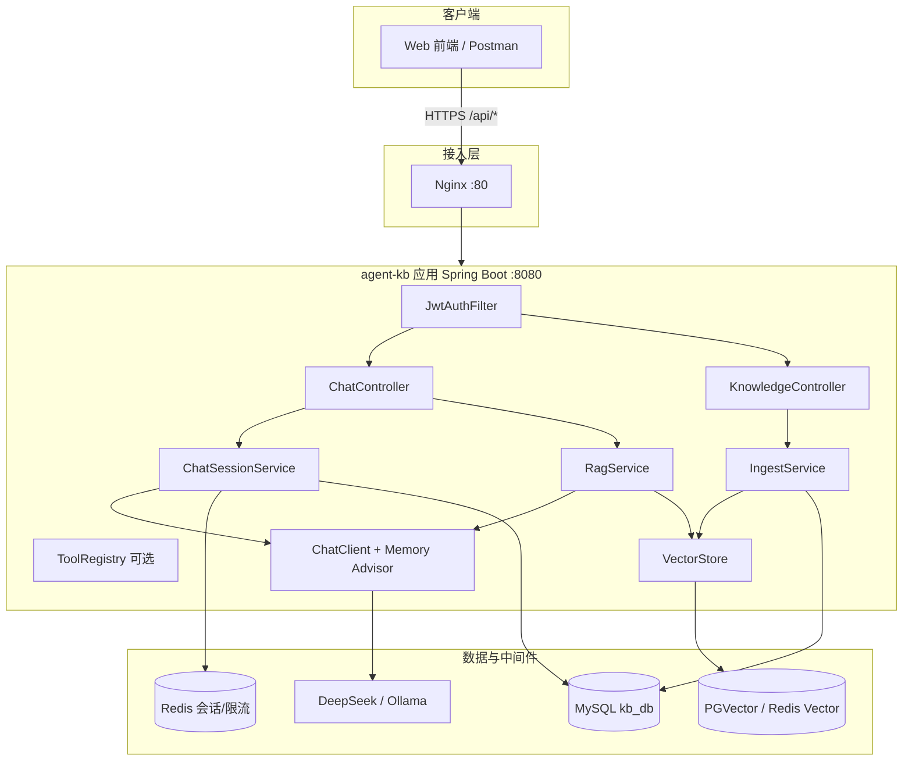
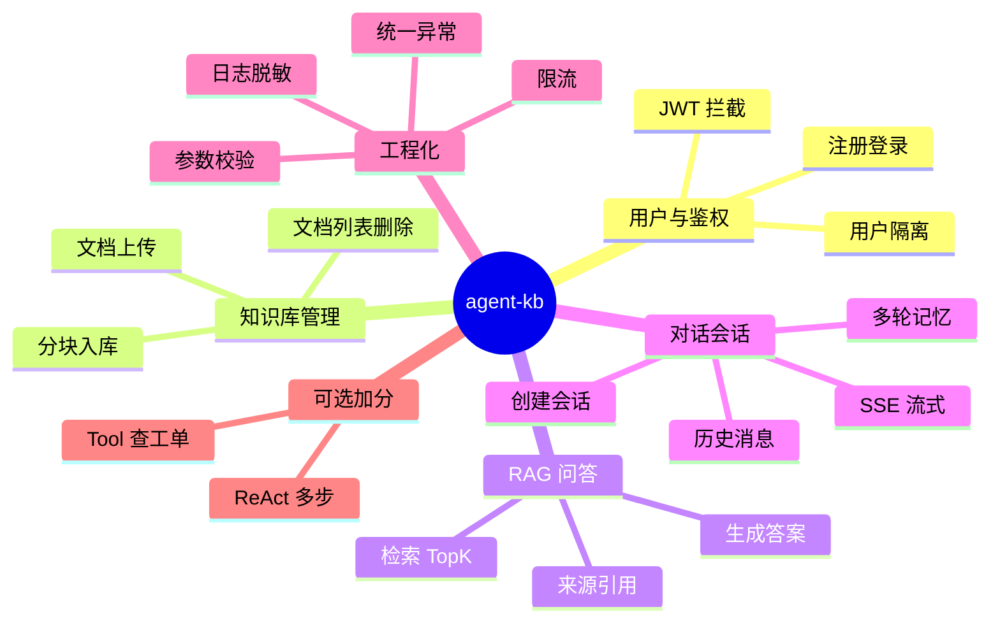
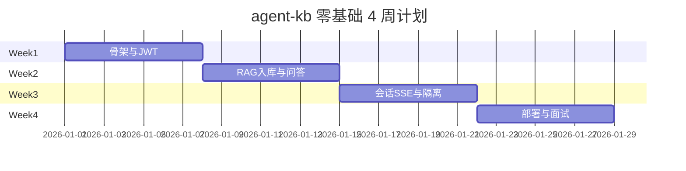
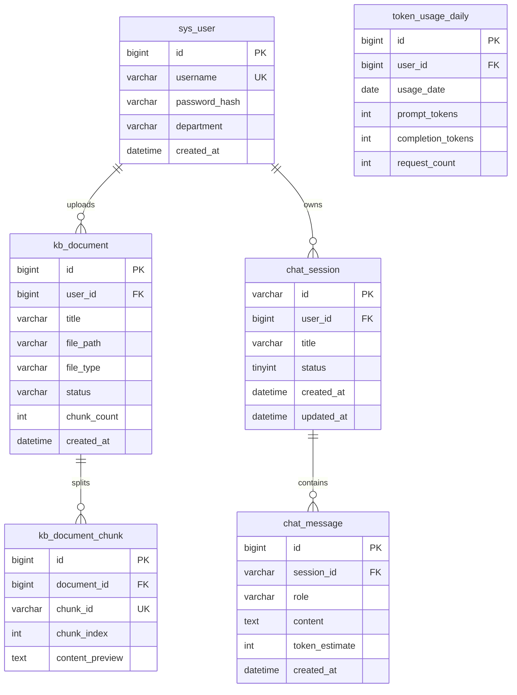
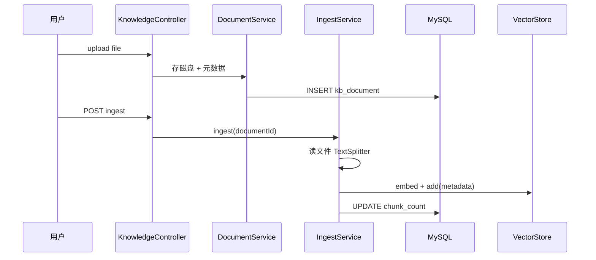
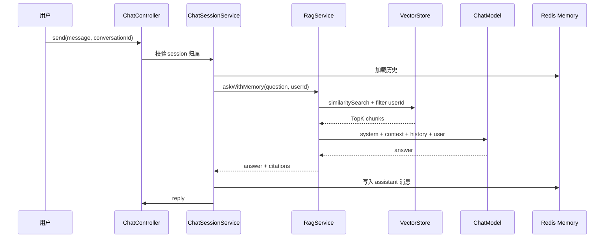

# Agent 项目实战与面试准备

<!-- 修改说明: AI Agent 路线第 10 章，企业知识库智能助手完整项目指南；按 EXPANSION-STANDARD 扩充 -->

## 0. 读前导读（零基础也能跟上）

### 0.1 用一句话弄懂本章

**一句话**：把 01～08 章在 `agent-demo` 里练过的对话、RAG、记忆、流式等能力，**总装**成一个能写进简历、能 demo、能面试 15 分钟讲清楚的完整项目 **agent-kb（企业知识库智能助手）**。

**生活类比**：前几章像分别学会了切菜、炒菜、摆盘；本章是 **开餐厅**——要有菜单（API）、账本（数据库）、门禁（JWT）、上菜流程（入库→问答→多轮），还要准备 **给投资人（面试官）讲 15 分钟**。

**为什么重要**：校招/实习简历上「会调 API」不够；**完整项目 + 能讲清架构** 才是 Agent 岗的差异化。

**本章用到的地方**：§3 逐周计划跟做；§10 面试逐字稿背诵；§19 闭卷自测验收。

---

### 0.2 你需要提前知道什么（真不会就先跳到哪一章）

| 你现在的水平 | 建议动作 |
|--------------|----------|
| 01～08 章没跟完 | **先补** [06 RAG](./06-RAG检索增强生成基础.md) + [08 记忆](./08-对话记忆与会话管理.md)，至少 demo 能 ask |
| 不会 Spring Boot 分层 | 先完成 [Java 04](../Java/04-SpringBoot核心开发.md) |
| 不会 JWT 登录 | 先读 [Java 14](../Java/14-高频场景设计与面试专题.md) 登录场景 |
| 不会 Docker | 部署阶段再学 [Java 09](../Java/09-LinuxDockerNginx部署基础.md)，本地可先 `mvn spring-boot:run` |
| 01～08 齐备、会 CRUD | 从 §3.4 逐周计划 **Week 1 Day 1** 开始 |

**最低门槛**：`agent-demo` 里 RAG ask 能返回答案；会用 Postman 发带 Header 的请求；知道 MySQL、Redis 是干什么的（不要求精通）。

---

### 0.3 本章知识地图（学完后应能勾选全部 ☐→☑）

- [ ] 用一句话说清 agent-kb 解决什么业务痛点
- [ ] 白板 3 分钟画出架构图（客户端、Spring Boot、MySQL、Redis、VectorStore、LLM）
- [ ] 说出 M1～M7 七个必须模块各自职责
- [ ] 独立完成 upload → ingest → ask → 多轮 send 全链路
- [ ] 解释 metadata `userId` 如何做知识库隔离
- [ ] 能演示 SSE 流式或说明为何生产用 fetch 替代 EventSource
- [ ] docker-compose 一键启动并 curl 验收
- [ ] 15 分钟面试话术演练 ≥ 2 遍（§10.2 逐字稿）
- [ ] 简历写 3～4 条动词亮点（§11）
- [ ] 能答 §10.3 + §10.4 FAQ 中至少 8 个问题

---

### 0.4 建议学习时长与节奏

| 阶段 | 建议时间 | 做什么 |
|------|----------|--------|
| 通读 §0～§2 | 1 小时 | 建立项目全景，对照 agent-demo 差异 |
| 跟做 §3.4 逐周计划 | **4 周 × 5～8h/周**（零基础）或 **10～14 天全职** | 按周验收，每周日打勾 |
| API + 数据库 §5～§6 | 穿插在 Week 1～2 | 边做边查，不必一次读完 |
| Docker §9 | Week 4 | compose 起全栈 |
| 面试准备 §10～§12 | Week 4 最后 2～3 天 | 逐字稿 + demo 录屏 |
| 闭卷自测 §19 | 1 小时 | 10 题 + 费曼 3 分钟 |

**节奏建议**：**每天 commit 一次**（哪怕只完成一个小接口），避免最后三天赶工。遇到卡壳先查 §14 报错表，再回对应章节。

---

### 0.5 学完本章你能做什么（可验证的具体动作）

1. **创建** `agent-kb` 仓库，目录结构符合 §4。
2. **执行** `schema.sql`，MySQL 里能看到 5 张表。
3. **登录** 拿 JWT，`Authorization: Bearer` 调 `/api/kb/ask` 返回带 `citations` 的答案。
4. **上传** `年假制度.md` → ingest → 问文档内问题 → 答案正确且 citation 指向该文件。
5. **同一会话** 追问「试用期有吗？」——第二轮理解上下文。
6. **用户 A** 无法删除/访问 **用户 B** 的私有文档（403 或检索不到）。
7. **docker compose up** 后，从宿主机走 Nginx `/api/` 完成同样流程。
8. **录音** 15 分钟项目讲解，回听无明显卡顿、能主动画一张图。

---

### 0.6 本章核心术语预览

| 术语（English） | 一句话 | 生活类比 |
|-----------------|--------|----------|
| **agent-kb** | 本章目标项目代号 | 你的「毕业设计作品」 |
| **Ingest（入库）** | 文档分块 + 向量化写入 VectorStore | 把书拆成卡片放进检索柜 |
| **Citation（引用）** | 答案附带的原文出处 | 论文脚注，方便核对 |
| **metadata filter** | 检索时按 userId 等字段过滤 | 图书馆只查「你的借阅区」 |
| **M1～M10** | 模块检查表编号 | 装修验收清单条目 |

---

## 本章与上一章的关系

01～08 章你在 **agent-demo** 里逐步叠加了：Spring AI 对话（02）、SSE 流式（03）、Tool（04）、ReAct（05）、RAG（06）、向量库（07）、Redis 会话（08）。09 章（可选）对照了 LangChain4j，但 **简历项目仍以 Spring AI 为主线**。

本章是 **总装车间**：把分散能力串成可写进简历的 **「企业知识库智能助手」**，并准备 **15 分钟面试讲解**、API 清单、数据库设计、部署与亮点话术。不要求大量新技术，要求 **做出来、讲清楚、能追问**。

> **前置**：[Java 04～07](../Java/04-SpringBoot核心开发.md)、[Java 09 部署](../Java/09-LinuxDockerNginx部署基础.md)；Agent 01～08 齐备；JWT 可参考 [Java 14 登录场景](../Java/14-高频场景设计与面试专题.md)。

### 项目整体架构图



与 [Java 10 商城项目](../Java/10-后端项目实战与面试准备.md) 对比：传统后端是 **Controller → Service → Mapper → MySQL/Redis**；Agent 项目在 Service 层多了一条 **ChatClient → LLM**，以及 **VectorStore 检索支路**。

---

## 1. 项目定位与命名

### 1.1 项目名称（简历用）

- **中文**：企业知识库智能助手
- **英文**：Enterprise Knowledge Base Assistant / `agent-kb`
- **一句话**：基于 RAG 的企业内部文档问答系统，支持多轮对话、流式输出、来源引用与用户级知识库隔离

### 1.2 解决什么问题

| 痛点 | 方案 |
|------|------|
| HR/IT 政策分散在 PDF、Wiki | 统一入库、向量检索 |
| 新员工反复问相同问题 | RAG 自动回答 + 引用出处 |
| 普通 ChatGPT 胡编政策 | 仅根据检索片段生成 |
| 多轮追问「那试用期呢？」 | Redis 会话记忆（08 章） |
| 费用与滥用 | 限流 + Token 统计（11 章） |

### 1.3 不做什么（控制范围）

- 不做微调训练、不做自研大模型
- 不做复杂多 Agent 编排（可作加分项）
- 不做完整前端（Postman + 简易页面即可）

---

## 2. 技术栈清单

| 层次 | 技术 | 对应章节 |
|------|------|----------|
| 语言 / 框架 | Java 17、Spring Boot 3.2 | [Java 04](../Java/04-SpringBoot核心开发.md) |
| AI | Spring AI 1.0.x | [02](./02-SpringAI核心开发.md)～[08](./08-对话记忆与会话管理.md) |
| ORM | MyBatis | [Java 05](../Java/05-MyBatis事务与接口工程化.md) |
| 关系库 | MySQL 8 | [Java 06](../Java/06-MySQL基础索引与事务.md) |
| 缓存 / 会话 | Redis 7 | [Java 07](../Java/07-Redis核心原理与缓存实战.md) |
| 向量库 | PGVector 或 Redis Stack | [07 向量库](./07-向量数据库与知识库实战.md) |
| 鉴权 | JWT | [Java 14](../Java/14-高频场景设计与面试专题.md) |
| 流式 | SSE | [03](./03-流式对话与SSE实战.md) |
| 部署 | Docker、Nginx | [Java 09](../Java/09-LinuxDockerNginx部署基础.md) |
| 安全 | Prompt 注入防护 | [11](./11-生产化与安全.md)、[Web安全 07](../../前端学习/Web安全/07-LLM应用安全与Prompt注入防护.md) |

---

## 3. 模块清单与完成标准

### 3.1 模块总览



### 3.2 模块检查表（必须 vs 加分）

| 模块 | 功能点 | 优先级 | 关联章 |
|------|--------|--------|--------|
| **M1 鉴权** | 注册、登录、JWT、`userId` 从 Token 解析 | 必须 | Java 14 |
| **M2 文档** | 上传 md/pdf、存 MySQL 元数据 | 必须 | 06、07 |
| **M3 入库** | TextSplitter、Embedding、写 VectorStore | 必须 | 06、07 |
| **M4 问答** | POST ask、返回答案 + citations | 必须 | 06 |
| **M5 会话** | conversationId、Redis 记忆、会话列表 | 必须 | 08 |
| **M6 流式** | SSE `/chat/stream` | 强烈推荐 | 03 |
| **M7 隔离** | 向量 metadata `userId` / 部门 filter | 强烈推荐 | 07 |
| **M8 限流** | 每用户每日 N 次 | 推荐 | 11、Java 07 |
| **M9 Tool** | 查工单、查考勤（对接假数据） | 加分 | 04、05 |
| **M10 部署** | docker-compose 一键起 | 强烈推荐 | Java 09 |

### 3.3 里程碑计划（建议 10～14 天）

| 天 | 里程碑 | 验收 |
|----|--------|------|
| D1～D2 | 项目骨架 + JWT + 用户表 | 登录拿 token |
| D3～D4 | 文档上传 + MySQL 元数据 | 列表能看到文件 |
| D5～D6 | Ingest + VectorStore | ingest 后 ask 能答 |
| D7～D8 | 会话 + 多轮 + SSE | 两轮指代问答 |
| D9～D10 | citations + 用户隔离 | 用户 A 看不到 B 的私有文档 |
| D11～D12 | 限流 + 异常 + 日志 | 超限 429 |
| D13～D14 | Docker 部署 + 面试稿 | 能 15 分钟讲完 |

### 3.4 零基础逐周实施计划（4 周，每周可独立验收）

> 若你 **每天只能学 1～2 小时**，按下面 **4 周** 推进；若全职刷题，可压缩为 §3.3 的 10～14 天。每周日对照 **周末验收清单** 打勾，未通过 **不要** 进入下一周。

#### Week 1：骨架、用户与「空壳能跑」

**本周目标**：项目能启动、能注册登录、JWT 保护接口生效；**还不做 RAG**。

| 天 | 任务 | 你的动作 | 预期看到什么 | 若不对 |
|----|------|----------|--------------|--------|
| D1 | 建项目 | IDEA 新建 Spring Boot 3.2 + JDK 17，复制 agent-demo 的 `pom` 里 Spring AI BOM | `mvn compile` 成功 | 见 [02 章 pom](./02-SpringAI核心开发.md) |
| D2 | 数据库 | 执行 §5.2 `schema.sql`，配置 `application-dev.yml` 连 MySQL | MySQL 客户端能看到 5 张表 | 检查 url/username/password |
| D3 | 用户注册登录 | 写 `AuthController` + `UserMapper`，密码 BCrypt | Postman register → login 拿 `token` | 401 查 Filter 是否注册 |
| D4 | JWT 拦截 | `JwtAuthFilter` + `SecurityConfig`，白名单 `/api/auth/**` | 无 token 访问 `/api/kb/documents` → **401** | 对比 [Java 14](../Java/14-高频场景设计与面试专题.md) |
| D5 | 统一返回 | `Result` + `GlobalExceptionHandler` | 参数错误返回 `code!=0` 友好文案 | 勿把堆栈返回前端 |
| D6～D7 | 文档元数据 CRUD | `DocumentService` 只存 MySQL 元数据 + 磁盘文件，**暂不 ingest** | upload 后 GET 列表能看到文件名 | multipart 用 `@RequestParam MultipartFile` |

**Week 1 周末验收清单**

- [ ] `curl login` 拿到 token
- [ ] 带 token upload 一个 `.md`，列表能查到
- [ ] 不带 token 任意 `/api/kb/**` → 401
- [ ] git commit：`feat(auth): jwt login and document metadata`

---

#### Week 2：RAG 入库与单轮问答

**本周目标**：文档能 ingest 进 VectorStore；`/api/kb/ask` 能根据文档回答并带 citation。

| 天 | 任务 | 你的动作 | 预期看到什么 | 若不对 |
|----|------|----------|--------------|--------|
| D1 | VectorStore | 配 PGVector 或 Redis Stack，启动容器 | 应用启动无 `Connection refused` | §9 docker-compose |
| D2 | IngestService | 读文件 → `TextSplitter` → `vectorStore.add` + metadata | ingest 返回 `chunkCount>0` | 见 [07 章](./07-向量数据库与知识库实战.md) |
| D3 | metadata | 写入 `userId`、`documentId`、`source` | VectorStore 控制台或日志可见 metadata | filter 类型统一字符串 |
| D4 | RagService | `similaritySearch` + Prompt「仅根据资料」 | ask 文档内问题有正确答案 | 见 [06 章](./06-RAG检索增强生成基础.md) |
| D5 | Citations | 结构化 `citations[]`（source、excerpt、chunkId） | JSON 里 `citations` 非空 | 检索结果映射到 DTO |
| D6 | 拒答 | 问文档外问题 | 「无法确定」或类似，**不编造** | 调 threshold / Prompt |
| D7 | 删文档 | delete MySQL + `vectorStore.delete(filter)` | 删后再问不再引用 | §8.2 代码 |

**Week 2 周末验收清单**

- [ ] 上传 `年假制度.md` → ingest → ask「年假几天」→ 正确 + citation
- [ ] 问「今天比特币价格」→ 拒答或明确不确定
- [ ] 删除文档后 ask 不再出现该 source
- [ ] git commit：`feat(rag): ingest pipeline and ask with citations`

---

#### Week 3：多轮会话、流式与用户隔离

**本周目标**：conversationId 多轮 + SSE；用户 A/B 文档互不可见。

| 天 | 任务 | 你的动作 | 预期看到什么 | 若不对 |
|----|------|----------|--------------|--------|
| D1 | Redis Memory | 复用 [08 章](./08-对话记忆与会话管理.md) `ChatSessionService` | 同 session 第二轮理解指代 | `CONVERSATION_ID` 必传 |
| D2 | 会话表 | `chat_session` / `chat_message` 落 MySQL | GET `/chat/sessions` 有列表 | userId 校验归属 |
| D3 | SessionRag | RAG + Memory 粘合（§8.1） | 多轮追问政策细节仍准确 | Advisor 顺序 |
| D4 | userId filter | 检索 `FILTER_EXPRESSION userId == 'x'` | B 用户 ask 搜不到 A 的私有文档 | metadata 与 JWT 一致 |
| D5 | SSE | `/chat/stream` + `ChatClient.stream()` | curl `-N` 看到逐段输出 | [03 章](./03-流式对话与SSE实战.md) |
| D6 | 流式写记忆 | stream **结束**后再写 assistant 消息 | 历史消息完整非半截 | 08 章强调点 |
| D7 | 联调自测 | 跑 §13 测试用例 T1～T6 | 全部通过 | §14 报错表 |

**Week 3 周末验收清单**

- [ ] 同 conversationId 两轮指代问答通过
- [ ] SSE 首 token 可见（本地 2～5s 内）
- [ ] 用户隔离：A、B 各 upload 不同文件，互问搜不到对方内容
- [ ] git commit：`feat(chat): session memory, sse, user isolation`

---

#### Week 4：工程化、部署与面试

**本周目标**：限流、Docker、15 分钟讲解 + demo 录屏。

| 天 | 任务 | 你的动作 | 预期看到什么 | 若不对 |
|----|------|----------|--------------|--------|
| D1 | 限流 | [11 章](./11-生产化与安全.md) Redis 日限额 | 第 101 次 ask → **429** | key 带日期 |
| D2 | Token 统计 | 写 `token_usage_daily`（可先估算） | `/admin/usage/me` 有数据 | Ollama 可无 usage |
| D3 | docker-compose | §9 全栈 compose up | `health` UP | 环境变量 Key |
| D4 | Nginx | `proxy_buffering off` 配 SSE | 经 :80 访问 stream 正常 | 附录 B |
| D5 | 面试稿 | 背诵 §10.2 逐字稿 2 遍 | 录音 <15min 少卡顿 | 改用自己的话 |
| D6 | Demo 脚本 | 按 §12 走 5 分钟现场 | 全程无 500 | 提前录屏备份 |
| D7 | 简历 | §11 写 3～4 条 bullet | 每条能展开 1 分钟 | 量化环境 |

**Week 4 周末验收清单**

- [ ] `docker compose up` 全流程 upload→ingest→ask→stream
- [ ] 15 分钟讲解演练 ≥2 遍
- [ ] 简历 + README 含架构图
- [ ] §19 闭卷自测 ≥8/10
- [ ] git tag：`v1.0.0-mvp`



---

## 4. 项目目录结构

```text
agent-kb/
├── pom.xml
├── docker-compose.yml
├── Dockerfile
├── nginx/
│   └── agent-kb.conf
├── sql/
│   └── schema.sql
├── kb-docs/                    # 内置示例文档
│   ├── 年假制度.md
│   └── 报销流程.md
└── src/main/
    ├── java/com/example/agentkb/
    │   ├── AgentKbApplication.java
    │   ├── config/
    │   │   ├── SecurityConfig.java
    │   │   ├── JwtProperties.java
    │   │   ├── AiConfig.java
    │   │   ├── VectorStoreConfig.java
    │   │   └── RateLimitConfig.java
    │   ├── controller/
    │   │   ├── AuthController.java
    │   │   ├── ChatController.java
    │   │   ├── KnowledgeController.java
    │   │   └── SessionController.java
    │   ├── service/
    │   │   ├── AuthService.java
    │   │   ├── ChatSessionService.java
    │   │   ├── RagService.java
    │   │   ├── KnowledgeIngestService.java
    │   │   ├── DocumentService.java
    │   │   └── TokenUsageService.java
    │   ├── mapper/
    │   │   ├── UserMapper.java
    │   │   ├── DocumentMapper.java
    │   │   ├── ChatSessionMapper.java
    │   │   └── ChatMessageMapper.java
    │   ├── entity/
    │   ├── dto/
    │   ├── security/
    │   │   ├── JwtTokenProvider.java
    │   │   └── JwtAuthFilter.java
    │   └── common/
    │       ├── Result.java
    │       └── GlobalExceptionHandler.java
    └── resources/
        ├── application.yml
        ├── application-prod.yml
        ├── mapper/*.xml
        └── prompts/
            ├── rag-qa.st
            └── chat-system.st
```

---

## 5. 数据库设计

### 5.1 ER 图



### 5.2 DDL（schema.sql 核心）

```sql
CREATE DATABASE IF NOT EXISTS kb_db DEFAULT CHARSET utf8mb4;
USE kb_db;

CREATE TABLE sys_user (
    id            BIGINT PRIMARY KEY AUTO_INCREMENT,
    username      VARCHAR(64) NOT NULL UNIQUE,
    password_hash VARCHAR(128) NOT NULL,
    department    VARCHAR(64) DEFAULT 'default',
    created_at    DATETIME NOT NULL DEFAULT CURRENT_TIMESTAMP
);

CREATE TABLE kb_document (
    id          BIGINT PRIMARY KEY AUTO_INCREMENT,
    user_id     BIGINT NOT NULL,
    title       VARCHAR(256) NOT NULL,
    file_path   VARCHAR(512) NOT NULL,
    file_type   VARCHAR(32) NOT NULL,
    status      VARCHAR(16) NOT NULL DEFAULT 'ACTIVE',
    chunk_count INT NOT NULL DEFAULT 0,
    created_at  DATETIME NOT NULL DEFAULT CURRENT_TIMESTAMP,
    INDEX idx_user_id (user_id),
    CONSTRAINT fk_doc_user FOREIGN KEY (user_id) REFERENCES sys_user(id)
);

CREATE TABLE kb_document_chunk (
    id              BIGINT PRIMARY KEY AUTO_INCREMENT,
    document_id     BIGINT NOT NULL,
    chunk_id        VARCHAR(64) NOT NULL UNIQUE,
    chunk_index     INT NOT NULL,
    content_preview VARCHAR(500),
    INDEX idx_document_id (document_id),
    CONSTRAINT fk_chunk_doc FOREIGN KEY (document_id) REFERENCES kb_document(id)
);

CREATE TABLE chat_session (
    id         VARCHAR(36) PRIMARY KEY,
    user_id    BIGINT NOT NULL,
    title      VARCHAR(256),
    status     TINYINT NOT NULL DEFAULT 1,
    created_at DATETIME NOT NULL DEFAULT CURRENT_TIMESTAMP,
    updated_at DATETIME NOT NULL DEFAULT CURRENT_TIMESTAMP ON UPDATE CURRENT_TIMESTAMP,
    INDEX idx_chat_user (user_id)
);

CREATE TABLE chat_message (
    id             BIGINT PRIMARY KEY AUTO_INCREMENT,
    session_id     VARCHAR(36) NOT NULL,
    role           VARCHAR(16) NOT NULL,
    content        TEXT NOT NULL,
    token_estimate INT DEFAULT 0,
    created_at     DATETIME NOT NULL DEFAULT CURRENT_TIMESTAMP,
    INDEX idx_session_id (session_id)
);

CREATE TABLE token_usage_daily (
    id                BIGINT PRIMARY KEY AUTO_INCREMENT,
    user_id           BIGINT NOT NULL,
    usage_date        DATE NOT NULL,
    prompt_tokens     INT NOT NULL DEFAULT 0,
    completion_tokens INT NOT NULL DEFAULT 0,
    request_count     INT NOT NULL DEFAULT 0,
    UNIQUE KEY uk_user_date (user_id, usage_date)
);
```

### 5.3 与向量库 metadata 的对应

| MySQL 字段 | VectorStore metadata | 用途 |
|------------|---------------------|------|
| `kb_document.id` | `documentId` | 删除文档时按 metadata 清理向量 |
| `sys_user.id` | `userId` | 检索 filter 隔离 |
| `kb_document_chunk.chunk_id` | `chunkId` | citation 展示 |
| `kb_document.title` | `source` | 引用来源文件名 |

---

## 6. API 清单

### 6.1 约定

- Base URL：`/api`
- 鉴权：除 `/api/auth/**` 外，Header `Authorization: Bearer <jwt>`
- 统一响应：`{ "code": 0, "message": "ok", "data": { ... } }`

### 6.2 认证模块

| 方法 | 路径 | 说明 | 请求体 | 响应 data |
|------|------|------|--------|-----------|
| POST | `/auth/register` | 注册 | `{username, password}` | `{userId}` |
| POST | `/auth/login` | 登录 | `{username, password}` | `{token, expiresIn}` |

### 6.3 知识库模块

| 方法 | 路径 | 说明 | 请求 | 响应 data |
|------|------|------|------|-----------|
| POST | `/kb/documents/upload` | 上传文档 | `multipart: file` | `{documentId, title}` |
| GET | `/kb/documents` | 我的文档列表 | `?page=1&size=10` | 分页列表 |
| DELETE | `/kb/documents/{id}` | 删除文档+向量 | - | `null` |
| POST | `/kb/documents/{id}/ingest` | 触发入库 | - | `{chunkCount}` |
| POST | `/kb/ask` | RAG 问答（无会话） | `{question, topK?, threshold?}` | `{answer, citations[]}` |

### 6.4 会话与对话模块

| 方法 | 路径 | 说明 | 请求 | 响应 |
|------|------|------|------|------|
| POST | `/chat/sessions` | 新建会话 | `{title?}` | `{conversationId, title}` |
| GET | `/chat/sessions` | 会话列表 | - | `[{id, title, updatedAt}]` |
| DELETE | `/chat/sessions/{id}` | 删除会话 | - | - |
| GET | `/chat/sessions/{id}/messages` | 历史消息 | - | `[{role, content, createdAt}]` |
| POST | `/chat/send` | 非流式多轮 | `{conversationId, message}` | `{conversationId, content}` |
| GET | `/chat/stream` | SSE 流式 | `?conversationId=&message=` | `text/event-stream` |

### 6.5 管理 / 运维（可选）

| 方法 | 路径 | 说明 |
|------|------|------|
| GET | `/actuator/health` | 健康检查 |
| GET | `/admin/usage/me` | 当日 Token 用量 |

### 6.6 请求响应示例

**登录**

```bash
curl -X POST http://localhost:8080/api/auth/login \
  -H "Content-Type: application/json" \
  -d '{"username":"alice","password":"123456"}'
```

```json
{
  "code": 0,
  "data": {
    "token": "eyJhbGciOiJIUzI1NiIs...",
    "expiresIn": 86400
  }
}
```

**上传并入库**

```bash
curl -X POST http://localhost:8080/api/kb/documents/upload \
  -H "Authorization: Bearer $TOKEN" \
  -F "file=@年假制度.md"

curl -X POST http://localhost:8080/api/kb/documents/1/ingest \
  -H "Authorization: Bearer $TOKEN"
```

**RAG 问答**

```bash
curl -X POST http://localhost:8080/api/kb/ask \
  -H "Authorization: Bearer $TOKEN" \
  -H "Content-Type: application/json" \
  -d '{"question":"工作满一年年假几天？","topK":4}'
```

```json
{
  "code": 0,
  "data": {
    "answer": "根据员工手册，工作满一年享有带薪年假 10 天……",
    "citations": [
      {
        "source": "年假制度.md",
        "excerpt": "工作满一年，带薪年假 10 天……",
        "chunkId": "a1b2c3"
      }
    ],
    "retrievedCount": 3
  }
}
```

**多轮 + 流式**

```bash
curl -N "http://localhost:8080/api/chat/stream?conversationId=uuid-xxx&message=刚才说的年假能拆分吗" \
  -H "Authorization: Bearer $TOKEN"
```

---

## 7. 核心业务流程

### 7.1 文档入库流程



### 7.2 RAG 问答流程（带会话）



### 7.3 与 08 章代码的衔接

`ChatSessionService` 直接复用 [08 章](./08-对话记忆与会话管理.md) 实现；`RagService` 复用 [06 章](./06-RAG检索增强生成基础.md)。本章重点是 **粘合** 与 **产品化接口**。

---

## 8. 关键代码粘合点

### 8.1 RagService + Memory + Filter

```java
@Service
public class SessionRagService {

    private final ChatClient chatClient;
    private final VectorStore vectorStore;

    public SessionRagService(ChatClient.Builder builder, VectorStore vectorStore) {
        this.vectorStore = vectorStore;
        this.chatClient = builder
                .defaultAdvisors(
                        MessageChatMemoryAdvisor.builder(/* injected ChatMemory */ null).build(),
                        QuestionAnswerAdvisor.builder(vectorStore)
                                .searchRequest(SearchRequest.builder().topK(5).build())
                                .build()
                )
                .build();
    }

    public RagAnswer askInSession(Long userId, String conversationId, String question) {
        String answer = chatClient.prompt()
                .advisors(a -> a
                        .param(ChatMemory.CONVERSATION_ID, conversationId)
                        .param(QuestionAnswerAdvisor.FILTER_EXPRESSION,
                                "userId == '" + userId + "'"))
                .user(question)
                .call()
                .content();
        return new RagAnswer(conversationId, question, answer, List.of());
    }
}
```

### 8.2 删除文档时同步删向量

```java
@Transactional
public void deleteDocument(Long userId, Long documentId) {
    Document doc = documentMapper.findById(documentId);
    if (doc == null || !doc.getUserId().equals(userId)) {
        throw new AccessDeniedException("无权删除该文档");
    }
    vectorStore.delete("documentId == '" + documentId + "'");
    documentMapper.deleteById(documentId);
}
```

---

## 9. Docker 部署

### 9.1 docker-compose.yml

```yaml
services:
  mysql:
    image: mysql:8.0
    environment:
      MYSQL_ROOT_PASSWORD: root
      MYSQL_DATABASE: kb_db
    ports:
      - "3306:3306"
    volumes:
      - ./sql/schema.sql:/docker-entrypoint-initdb.d/01-schema.sql

  redis:
    image: redis/redis-stack:latest
    ports:
      - "6379:6379"

  pgvector:
    image: pgvector/pgvector:pg16
    environment:
      POSTGRES_PASSWORD: postgres
      POSTGRES_DB: vectordb
    ports:
      - "5432:5432"

  agent-kb:
    build: .
    ports:
      - "8080:8080"
    environment:
      SPRING_PROFILES_ACTIVE: prod
      DEEPSEEK_API_KEY: ${DEEPSEEK_API_KEY}
      SPRING_DATASOURCE_URL: jdbc:mysql://mysql:3306/kb_db
      SPRING_DATA_REDIS_HOST: redis
      SPRING_AI_VECTORSTORE_PGVECTOR_HOST: pgvector
    depends_on:
      - mysql
      - redis
      - pgvector

  nginx:
    image: nginx:alpine
    ports:
      - "80:80"
    volumes:
      - ./nginx/agent-kb.conf:/etc/nginx/conf.d/default.conf
    depends_on:
      - agent-kb
```

### 9.2 Dockerfile

```dockerfile
FROM eclipse-temurin:17-jre-alpine
WORKDIR /app
COPY target/agent-kb-0.0.1-SNAPSHOT.jar app.jar
EXPOSE 8080
ENTRYPOINT ["java", "-jar", "app.jar"]
```

### 9.3 部署验证清单

```bash
docker compose up -d --build
curl http://localhost/actuator/health
# 预期：{"status":"UP"}

curl -X POST http://localhost/api/auth/login ...
# 完整走通 upload → ingest → ask → stream
```

详见 [Java 09 Docker](../Java/09-LinuxDockerNginx部署基础.md)。

---

## 10. 面试：15 分钟讲解结构

### 10.1 时间分配（总计 12～15 分钟）

| 分钟 | 内容 | 要点 |
|------|------|------|
| 0～2 | 项目背景 | 企业知识分散、RAG 降幻觉 |
| 2～4 | 技术栈 | Spring Boot + Spring AI + PGVector + Redis |
| 4～7 | 架构图 | 画 Mermaid 或白板：接入层、RAG 链、会话 |
| 7～10 | 核心流程 | **入库** + **问答** 两条 sequence |
| 10～12 | 难点亮点 | 用户隔离、记忆截断、 citation、限流 |
| 12～15 | 追问准备 | 见 10.3、10.4 |

### 10.2 讲解逐字稿（可按分钟分段背诵，再改成自己的话）

> 下面用 **【】** 标注动作（画图/切屏/演示）。总时长约 13 分钟，留 2 分钟给面试官插问。

---

**【0:00～0:30 开场】**

「面试官您好，我介绍一下 **企业知识库智能助手**，项目代号 **agent-kb**。」

「它解决的是 **公司内部 HR、IT 政策文档分散**，新员工反复问相同问题，而通用 ChatGPT **不了解公司内部制度、还容易编造** 的痛点。」

---

**【0:30～2:00 背景与目标】**

「我们的目标是：员工上传 **Markdown 或 PDF**，系统 **自动入库**，之后用 **自然语言提问**，答案 **必须带来源引用**，方便核对；同时支持 **多轮追问**，比如先问年假，再问『试用期有吗』。」

「范围上我 **没有做模型微调**，用的是 **RAG 检索增强**；也没有做复杂多 Agent，保证 **能 demo、能讲清、能维护**。」

---

**【2:00～4:00 技术栈】**

「后端是 **Java 17 + Spring Boot 3.2**，AI 层用 **Spring AI 1.0**，和 Boot 集成比较顺。」

「文档元数据、用户、会话列表在 **MySQL**；多轮对话记忆和限流在 **Redis**；向量检索用 **PGVector**——当然也可以换成 Redis Vector，我选型时考虑 **和关系库事务分开、向量索引成熟**。」

「大模型接的是 **DeepSeek API**，开发环境可以切 **Ollama** 本地；鉴权是 **JWT**，前端或 Postman 只带 token，**不持有 LLM 的 API Key**。」

---

**【4:00～7:00 架构图 — 边画边讲】**

「【画/architecture】整体分四层：**客户端** → **Nginx** → **Spring Boot 应用** → **数据与外部 LLM**。」

「应用里 **JwtAuthFilter** 先验 token，再进 **ChatController** 或 **KnowledgeController**。」

「知识库链路：**KnowledgeController** → **IngestService** 分块 embedding 写 **VectorStore**；问答时 **RagService** 先 **similaritySearch**，再 **ChatClient** 生成。」

「对话链路：**ChatSessionService** 从 **Redis** 拉历史，同样走 RAG，流式接口用 **SSE** 推 token。」

「和传统商城比，Service 层多了一条 **ChatClient → LLM** 的支路，以及 **VectorStore 检索支路**。」

---

**【7:00～9:00 入库流程】**

「【可指 sequence 图】上传时文件落盘，**MySQL 记 document 元数据和 userId 归属**。」

「用户点 ingest 后：**读文件 → TextSplitter 分块 → EmbeddingModel 转向量 → 写入 VectorStore**，metadata 里带 **documentId、userId、source 文件名**。」

「MySQL 的 **chunk 表** 存 preview 方便后台展示；**删文档** 时我会 **同时按 metadata 删向量**，避免脏数据。」

---

**【9:00～11:00 问答与多轮】**

「在线问答：用户问题先 **embed**，在 VectorStore **TopK 检索**，并且 **filter userId**，保证只能搜自己的私有库。」

「把检索片段拼进 Prompt 的 **参考资料区**，system 要求 **仅根据资料回答，不足则拒答**。」

「返回 JSON 里带 **citations 数组**，有 source、excerpt、chunkId。」

「多轮用 **conversationId**，**MessageChatMemoryAdvisor** 注入历史；流式用 **ChatClient.stream**，Nginx 要 **关 proxy_buffering**。」

---

**【11:00～12:30 难点与亮点】**

「我主要负责 **RAG 链路、会话模块和 Docker 部署**。」

「难点一是 **检索不准**：我把 chunk 从过大调到大约 **500 字、overlap 50**，topK 和 **similarityThreshold** 也迭代过。」

「难点二是 **上下文超长**：用 **MessageWindow** 截断历史，避免 context_length 报错。」

「工程亮点：**按用户 metadata 隔离**、**Redis 日限流**、**Token 日统计** 控成本，Prompt 侧有 **注入防护**（详见 11 章）。」

---

**【12:30～13:00 收尾】**

「部署用 **docker-compose** 一键起 MySQL、Redis、PGVector 和应用，**Nginx** 反代 `/api`。」

「以上是我的项目介绍，您看从 **架构、RAG 还是安全** 哪块深入都可以。」

---

### 10.3 高频追问与答法

| 追问 | 答法要点 |
|------|----------|
| RAG 和微调区别？ | RAG 不改模型权重，靠检索外挂知识；微调改参数，成本高 |
| 检索不准怎么办？ | 调 chunk、topK、threshold；混合检索；人工评估表（06 章） |
| 怎么防幻觉？ | 强制仅根据 context；无资料拒答；citation |
| 多轮怎么实现？ | Redis ChatMemory + conversationId（08 章） |
| 用户隔离？ | 向量 metadata userId + JWT 校验 + SQL 归属 |
| 费用怎么控？ | 限流、小模型、缓存相似问题（11 章） |
| Prompt 注入？ | system 不可覆盖、Tool 鉴权、[Web安全 07](../../前端学习/Web安全/07-LLM应用安全与Prompt注入防护.md) |
| 为什么 Spring AI？ | 与 Boot 集成、Advisor 体系、团队熟悉（09 章对照 LangChain4j） |

### 10.4 常见问题 FAQ（项目实施 & 面试）

**Q1：零基础 4 周做不完怎么办？**  
先保证 **M1～M5**（鉴权、文档、入库、问答、会话）能 Postman 跑通；SSE、Docker、限流可放 Week 4+。简历如实写「进行中模块」不如 **讲透已完成的 RAG 链路**。

**Q2：必须用 PGVector 吗？**  
不必须。[07 章](./07-向量数据库与知识库实战.md) Redis Stack 向量也行。面试说清 **选型理由**（运维、事务、性能）即可。

**Q3：没有 GPU 能做完吗？**  
能。Embedding 和 Chat 都走 **云端 API** 或 **Ollama CPU**；ingest 慢是预期，demo 用 2～3 个小文件即可。

**Q4：agent-demo 和 agent-kb 什么关系？**  
demo 是 **教程沙盒**，逐章加功能；kb 是 **产品化命名 + JWT + MySQL 元数据 + 完整 API**。代码可 **复制 06～08 的 Service** 再改包名。

**Q5：前端必须写吗？**  
不必须。Postman + curl + 附录 E 最小 HTML 够面试 demo；主动说明「生产用 fetch 流式 + Header 鉴权」是加分项。

**Q6：citation 面试官追问怎么实现？**  
检索返回的 `Document` 带 metadata（source、chunkId），生成答案后 **原样组装 citations[]**，不依赖模型编造出处。

**Q7：多轮和 RAG 检索用同一个问题吗？**  
默认 **当前 user 消息** 做 query；短追问「那试用期呢」检索可能不准——进阶可做 **query rewrite**（[12 章附录 M](./12-面试专题与知识点总表.md)）。

**Q8：简历没数据能写性能吗？**  
写 **环境 + 量级**，如「本地 Ollama 3B，SSE 首 token 约 1～2s，ingest 50 块约 60s」；避免「提升 300%」无依据。

**Q9：和 Java 10 商城项目怎么选讲？**  
各 **8～10 分钟**，商城证 CRUD/缓存，kb 证 AI 工程化；见 §15。

**Q10：面试时 demo 网络挂了？**  
提前 **录屏 + 架构图 PDF**；口述 sequence + 展示 Postman 导出记录，诚实说明环境限制。

---

## 11. 简历项目描述（可直接改）

### 11.1 一行版

企业知识库智能助手 | Spring Boot、Spring AI、RAG、PGVector、Redis、JWT

### 11.2 三到五行版

- 基于 **Spring AI + RAG** 的企业内部知识问答系统，支持 PDF/Markdown **文档分块入库** 与 **向量检索** 生成答案，降低大模型幻觉
- 实现 **JWT 鉴权**、按用户 **metadata 隔离** 知识库，**Redis** 持久化多轮会话，**SSE** 流式输出提升体验
- 返回答案 **来源引用（Citation）** 便于核对；集成 **Redis 限流** 与 **Token 日统计** 控制 API 成本
- 使用 **Docker Compose** 部署 MySQL、Redis、PGVector 与应用，**Nginx** 反向代理

### 11.3 亮点 bullet（选 3～4 条写）

- 设计 **文档 → 分块 → Embedding → PGVector** 入库流水线，支持增量删除与 metadata 过滤检索
- 基于 **QuestionAnswerAdvisor + ChatMemory** 实现「知识库 + 多轮追问」统一对话链路
- 通过 **similarityThreshold** 与拒答 Prompt，无相关片段时不编造政策内容
- 按用户 **滑动窗口限流**（Redis ZSet），防止 LLM 接口被刷爆
- 流式接口 **SSE** 首字延迟 &lt; 2s（本地 Ollama 环境实测）

---

## 12. 演示脚本（面试现场 5 分钟 Demo）

1. 登录拿 Token
2. 上传 `年假制度.md` → ingest
3. 问「工作满一年年假几天？」→ 展示 answer + citation
4. 同会话追问「试用期有吗？」→ 证明多轮
5. （可选）开 stream 展示打字机
6. 展示 docker compose ps 或架构图

提前录屏备份，防止现场网络失败。

---

## 13. 测试用例表

| 编号 | 场景 | 预期 |
|------|------|------|
| T1 | 未登录访问 /kb/ask | 401 |
| T2 | 上传空文件 | 400 |
| T3 | ingest 后问文档内事实 | 答案含正确事实 + citation |
| T4 | 问文档外内容 | 拒答或「无法确定」 |
| T5 | 用户 B 删用户 A 文档 | 403 |
| T6 | 同 conversationId 两轮指代 | 第二轮理解「它」 |
| T7 | 超每日限流 | 429 |
| T8 | SSE 断线 | 客户端可重连或降级非流式 |
| T9 | 删除文档后再问 | 不再引用已删内容 |
| T10 | 并发 10 路 ask | 无 OOM，响应可接受 |

---

## 14. 常见报错与排查

| 现象 / 报错关键词 | 可能原因 | 解决方案 |
|-------------------|---------|---------|
| `401 Unauthorized` | JWT 缺失或过期 | 重新 login；检查 Filter 顺序 |
| `403` 删文档/会话 | userId 不匹配 | 校验 mapper 查询带 user_id |
| ingest 后 ask 无结果 | 未 ingest 或 embedding 失败 | 看日志；确认 VectorStore 有数据 |
| `similarity` 全低于阈值 | threshold 过高 | 降到 0.5～0.6 试验 |
| citation 为空 | 未实现结构化返回 | 参照 [06 章 citation](./06-RAG检索增强生成基础.md) |
| `context_length_exceeded` | 历史+context 过长 | 减少 topK；记忆 maxMessages |
| `Connection refused pgvector` | 容器未起 | `docker compose up pgvector` |
| Redis 记忆丢失 | TTL 过短 | 调整 7d；见 [08 章](./08-对话记忆与会话管理.md) |
| 上传中文乱码 | 编码非 UTF-8 | 统一 UTF-8；见 [00 路线图](./00-学习路线图与说明.md) |
| `429 Too Many Requests` | 限流触发 | 预期行为；见 [11 章](./11-生产化与安全.md) |
| SSE 一次性返回全文 | 未用 stream API | 用 `ChatClient.stream()` |
| Docker 内连不上 LLM | 容器无 API Key | compose environment 注入 |
| 向量 userId filter 无效 | metadata 类型错误 | 统一字符串 `"userId == '123'"` |

---

## 15. 与 Java 项目的组合叙事

若你同时有 [Java 10 商城](../Java/10-后端项目实战与面试准备.md) 与 **agent-kb**：

- 商城 = **传统 CRUD + 缓存 + MQ** 基本功
- agent-kb = **AI 工程化** 差异化
- 可讲「商城订单 Tool 接入 Agent」（04 章）作为第三个亮点

面试时 **各讲 8 分钟**，不要两个项目各讲一半说不清。

---

## 16. 分级练习

### 基础

完成 M1～M5 模块，Postman 跑通 upload → ingest → ask → 多轮 send。

### 进阶

加 SSE、用户隔离、citation 结构化、docker-compose 部署。

### 挑战

接入 [05 章 ReAct](./05-Agent架构与ReAct模式.md) 工单 Tool；或相似问题 Redis 缓存（问句 embedding 作 key）。

### 参考答案（基础 API 骨架）

```java
@RestController
@RequestMapping("/api/kb")
@RequiredArgsConstructor
public class KnowledgeController {

    private final DocumentService documentService;
    private final KnowledgeIngestService ingestService;
    private final RagService ragService;

    @PostMapping("/documents/upload")
    public Result<UploadVO> upload(@RequestParam MultipartFile file) {
        Long userId = SecurityUtils.currentUserId();
        return Result.ok(documentService.save(userId, file));
    }

    @PostMapping("/documents/{id}/ingest")
    public Result<IngestVO> ingest(@PathVariable Long id) {
        Long userId = SecurityUtils.currentUserId();
        int chunks = ingestService.ingest(userId, id);
        return Result.ok(new IngestVO(chunks));
    }

    @PostMapping("/ask")
    public Result<RagService.RagAnswer> ask(@RequestBody @Valid AskRequest req) {
        Long userId = SecurityUtils.currentUserId();
        return Result.ok(ragService.ask(userId, req.question(), req.topK(), req.threshold()));
    }
}
```

---

## 17. 学完标准

- [ ] `agent-kb` 本地与 Docker 环境均能启动
- [ ] 完成 M1～M7 模块检查表中「必须+强烈推荐」项
- [ ] 能白板画出架构图 + 两条核心 sequence
- [ ] 15 分钟面试话术演练 ≥ 2 遍
- [ ] 简历有 3～4 条量化/动词亮点
- [ ] 能答 10.3 节至少 6 个追问
- [ ] 演示录屏或现场 demo 走通

---

## 18. 与下一章的衔接

项目能 demo 后，上线前必须补 **生产化**：限流、成本、密钥、注入防护、日志脱敏、超时重试、熔断与监控——见 [11-生产化与安全](./11-生产化与安全.md)。面试前用 [12-面试专题与知识点总表](./12-面试专题与知识点总表.md) 自测。

---

## 19. 闭卷自测（先做题再对答案）

### 19.1 题目

**概念题（6）**

1. agent-kb 和传统 Spring Boot CRUD 项目在架构上多了哪两条关键支路？
2. M1～M7 中，哪两个模块共同保证「用户 A 搜不到 B 的文档」？分别在哪一层校验？
3. ingest 流水线 4 步是什么？metadata 至少应存哪 3 个字段？
4. citation 的产品价值是什么？和「降低幻觉」什么关系？
5. 为什么多轮对话需要 conversationId？存在 Redis 还是 MySQL？
6. SSE 联调时 Nginx 为什么要 `proxy_buffering off`？

**动手题（2）**

7. 写出从 login 到 ask 的 **3 条 curl**（登录、ingest、ask），说明各需要什么 Header。
8. 文档删除后向量仍在，问答题仍引用旧内容——你会改哪两个地方的代码逻辑？

**综合题（2）**

9. 面试官问「检索不准怎么办」——按调参、评估、产品三层面答。
10. 用 5 句话向非技术朋友解释「你这个项目是干嘛的」（费曼预演）。

### 19.2 自测参考答案（要点）

1. **ChatClient→LLM** 生成支路；**VectorStore** 检索支路。
2. **JWT 鉴权**（接口层 userId）+ **metadata filter**（检索层 userId）；MySQL 文档归属校验在 Service/Mapper。
3. 读文件→分块→embedding→写 VectorStore；`userId`、`documentId`、`source`（或 chunkId）。
4. 让用户核对原文；强制 grounding 减少编造，无依据可拒答。
5. 区分会话；**Redis** 存 Message 历史（08 章），MySQL 存会话列表元数据。
6. 否则 Nginx 缓冲导致流式 **攒包一次返回**，失去打字机效果。
7. 登录 `POST /api/auth/login` 无特殊 Header；ingest/ask 需 `Authorization: Bearer $TOKEN`；ingest 为 `POST .../documents/{id}/ingest`。
8. `deleteDocument` 增加 `vectorStore.delete(documentId filter)`；确认 ask 检索 filter 不含已删 id。
9. 调 chunk/topK/threshold；人工 faithfulness 表；展示 citation、允许反馈错答。
10. 参考 §10.2 前 30 秒话术：公司文档分散→上传自动整理→提问得答案→附出处→能连续追问。

### 19.3 费曼检验

合上书，**3 分钟**向没学过编程的朋友解释 agent-kb。对照提纲（应包含）：

- 上传公司文档，系统「索引」成可搜索的知识
- 提问时先查文档片段再让 AI 组织语言，不是瞎编
- 答案带来源；不同员工只能看自己的私有文档
- 用 Docker 可以一键启动整套服务

---

## 20. 我的笔记区

```text
项目仓库地址：
部署访问 URL：
个人负责模块：
演示视频路径：
还没完成的检查项：
```

---

## 附录 A：application-prod.yml 片段

```yaml
spring:
  datasource:
    url: jdbc:mysql://mysql:3306/kb_db?useSSL=false&serverTimezone=Asia/Shanghai
    username: root
    password: ${MYSQL_PASSWORD:root}
  data:
    redis:
      host: redis
      port: 6379
  ai:
    openai:
      api-key: ${DEEPSEEK_API_KEY}
      base-url: https://api.deepseek.com
      chat:
        options:
          model: deepseek-chat
          max-tokens: 2048
    vectorstore:
      pgvector:
        host: pgvector
        port: 5432
        database: vectordb
        username: postgres
        password: postgres

agent:
  rate-limit:
    daily-requests-per-user: 100
  chat:
    max-messages: 20
    session-ttl-days: 7
```

---

## 附录 B：Nginx 配置片段

```nginx
server {
    listen 80;
    server_name _;

    location /api/ {
        proxy_pass http://agent-kb:8080/api/;
        proxy_set_header Host $host;
        proxy_set_header X-Real-IP $remote_addr;
        proxy_buffering off;   # SSE 必须关缓冲
    }
}
```

---

## 附录 C：项目答辩 PPT 大纲（10 页）

1. 背景与目标
2. 技术栈
3. 架构图
4. 数据库 ER
5. 入库流程
6. RAG 问答流程
7. 会话与 SSE
8. 安全与限流
9. 部署拓扑
10. 总结与 Q&A

---

## 附录 D：与 00 路线图 demo 演进对照

| 章节能力 | 在 agent-kb 中的体现 |
|----------|---------------------|
| 02 ChatClient | 所有 LLM 调用入口 |
| 03 SSE | `/chat/stream` |
| 04 Tool | 可选工单查询 |
| 05 ReAct | 可选多步 Agent |
| 06 RAG | `/kb/ask`、SessionRag |
| 07 VectorStore | PGVector / Redis Vector |
| 08 Memory | ChatSessionService |
| 11 安全 | 限流、脱敏、注入防护 |

---

## 附录 E：前端联调要点（最小可行）

若用简易 HTML 而非完整 Vue 项目，SSE 示例：

```html
<!DOCTYPE html>
<html lang="zh-CN">
<head>
  <meta charset="UTF-8"/>
  <title>agent-kb 流式调试</title>
</head>
<body>
  <input id="msg" placeholder="输入问题"/>
  <button onclick="send()">发送</button>
  <pre id="out"></pre>
  <script>
    const token = 'YOUR_JWT';
    const conversationId = 'uuid-from-create-session';
    function send() {
      const q = document.getElementById('msg').value;
      const es = new EventSource(
        `/api/chat/stream?conversationId=${conversationId}&message=${encodeURIComponent(q)}`,
        { headers: { Authorization: 'Bearer ' + token } }  // 注意：标准 EventSource 不支持自定义 Header
      );
      // 生产环境应改为 fetch + ReadableStream，或通过 Cookie 鉴权
      document.getElementById('out').textContent = '';
      es.onmessage = e => { document.getElementById('out').textContent += e.data; };
      es.onerror = () => es.close();
    }
  </script>
</body>
</html>
```

**说明**：浏览器原生 `EventSource` 不能带 `Authorization` Header，联调时可临时用 **query token**（仅 dev）或改 **fetch 流式**（见 [03 章](./03-流式对话与SSE实战.md)）。面试可主动说「生产不用 query 传 token」。

---

## 附录 F：性能基线参考（本地 Ollama）

| 操作 | 参考耗时 | 备注 |
|------|----------|------|
| 单轮 chat（3B 模型） | 1～5s | 视 GPU/CPU |
| ingest 100 chunks | 30～120s | embedding 瓶颈 |
| Vector TopK | 50～200ms | PGVector 本地 |
| SSE 首 token | 0.5～2s | 优于非流式首屏 |

简历写性能数据时注明环境，避免夸大。

---

## 附录 G：工单 Tool 加分实现草图

```java
@Component
public class TicketTools {

    @Tool("查询当前用户未关闭的工单列表")
    public String listMyOpenTickets() {
        Long userId = SecurityUtils.currentUserId();
        return ticketService.listOpenJson(userId);
    }
}
```

在 `ChatClient` 注册 `MethodToolCallbackProvider`，Router 识别「工单」「报修」意图时走 Tool 链，与 RAG 并列——参见 [05 章 Router](./05-Agent架构与ReAct模式.md)。

---

## 附录 H：README 推荐结构（开源/作品集）

```markdown
# agent-kb 企业知识库智能助手

## 功能
- 文档上传 / RAG 问答 / 多轮会话 / SSE

## 技术栈
Spring Boot 3.2 · Spring AI · PGVector · Redis · MySQL · JWT

## 快速开始
1. cp .env.example .env
2. docker compose up -d
3. curl 登录 → upload → ingest → ask

## 架构图
（贴 10 章 Mermaid）

## 面试讲解
见 docs/interview.md
```

---

## 附录 I：常见面试「踩雷」回答

| 雷区回答 | 更好的说法 |
|----------|------------|
| 「用了 ChatGPT API」 | 「Spring AI 接 DeepSeek，RAG 用 PGVector」 |
| 「AI 很智能不会错」 | 「用 citation + 拒答降低幻觉，有人工评估表」 |
| 「Key 写在配置文件」 | 「环境变量 + 不进 Git，服务端代理」 |
| 「没做限流」 | 「Redis 按用户日限额 + Token 统计」 |
| 「LangChain 和 LangChain4j 一样」 | 「Python 的是 LangChain；Java 用 Spring AI 或 LangChain4j」 |
