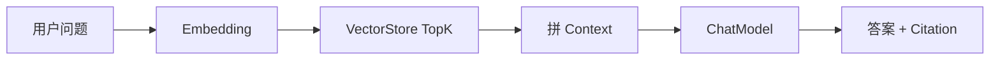
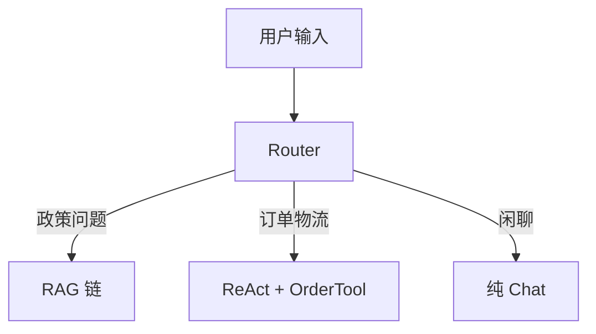
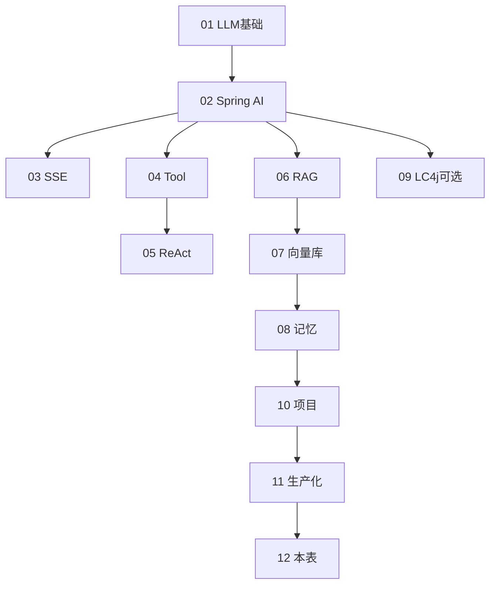

# 面试专题与知识点总表

<!-- 修改说明: AI Agent 路线第 12 章，复习索引与面试自测；按 EXPANSION-STANDARD 扩充 -->

> 复习索引：详细讲解见对应编号文档。建议学完一轮后逐项自评 ⬜知道 / 🔶会用 / ✅会讲。  
> 对照 [Java 15 补充知识点总表](../Java/15-补充知识点总表.md) 使用方式相同。

## 0. 读前导读（零基础也能跟上）

### 0.1 用一句话弄懂本章

**一句话**：01～11 章知识 **分散在各文档**，本章是 **总索引 + 面试题库 + 自评打勾表**——每个术语带 **零基础解释**，怕漏项、面试前 30 分钟、不知道回哪章重学，都打开这一份。

**生活类比**：各章是教科书章节；本章是 **考前复习提纲 + 模拟卷 + 评分 rubric**。

**为什么重要**：Agent 面试不只问「什么是 RAG」，还问 **场景设计、对比、项目串联**；本表把 **可讲标准** 和 **人话解释** 写在一起。

**本章用到的地方**：§2～§9 掌握度表；§11 RAG 口述；§16 模拟 30 题；§15 自评总表。

---

### 0.2 你需要提前知道什么

| 情况 | 建议 |
|------|------|
| 01～11 未学完一轮 | 先按 [00 路线图](./00-学习路线图与说明.md) 顺序学，再回本表自评 |
| 只复习面试 | 优先 §8～§9、§11、§16 |
| 完全零基础 | **零基础解释** 列先读一遍建立词典，再回对应章动手 |

---

### 0.3 本章知识地图（学完后应能勾选全部 ☐→☑）

- [ ] §15 自评表核心章（01～08、10～11）至少 🔶会用
- [ ] §11 RAG 口述 3 分钟内流利
- [ ] §16 模拟 30 题能答 ≥24
- [ ] §12 Tool 设计题 3/3
- [ ] §13 场景题 4/6
- [ ] 每个薄弱项能说出 **回哪一章**（文档列）

---

### 0.4 建议学习时长与节奏

| 场景 | 时间 | 动作 |
|------|------|------|
| 首次学完路线 | 2 小时 | 通读 §2～§9，标 ⬜ |
| 面试前 7 天 | 按 §22 计划 | 每天 1～2 表 |
| 面试前 30 分钟 | §11 + §16 抽 5 题 + 简历 | 见 §22 |

---

### 0.5 学完本章你能做什么

1. 30 秒内说清任一表项的 **零基础解释 + 掌握标准**。
2. 闭卷默画 RAG 流程图（§11.2）。
3. 完成 §16 任 5 题并口述参考答案。
4. 把 §15 中所有 ⬜ 项排进补课计划。

---

### 0.6 资料进度与加强状态

| 编号 | 加强状态 | 重点内容 |
|------|----------|----------|
| 00～08 | ✅ | Spring AI 主线、RAG、会话 |
| 09 | ✅ | LangChain4j 对照分轨 |
| 10 | ✅ | agent-kb 项目、面试 15min |
| 11 | ✅ | 限流、安全、熔断、监控 |
| 12 | ✅ | 本表、场景题、自测 |

---

## 1. 这份文件的作用

- **查漏补缺**：Agent 知识点分散在 01～11，怕漏时逐项勾选
- **面试前 30 分钟**：过薄弱项 + RAG 口述 + Tool 设计题
- **定位章节**：不会的点回到对应文档重学
- **与 Java 15 联用**：传统八股 + Agent 专题双线复习

---

## 2. 大模型基础（01）

| 知识点 | 零基础解释 | 文档 | 掌握标准 |
|--------|------------|------|----------|
| Token 概念 | 模型读写的最小「字块」，像拼乐高的小块；按块数收钱 | 01 | 能说输入/输出计费 |
| messages 角色 | 对话里三种身份：系统定规矩、用户提问、助手回答 | 01 | system/user/assistant 分工 |
| temperature | 创造力旋钮：0 最死板准确，1 更随机发散 | 01 | 0 vs 0.7 对创造性影响 |
| max_tokens | 限制回答最长多少块，防话太多也防账单爆 | 01 | 防截断与费用 |
| OpenAI 兼容 JSON | 很多国产 API 抄 OpenAI 的请求格式，换地址就能调 | 01 | 能手 curl chat/completions |
| 上下文窗口 | 一次能塞进模型的总字数上限，超了报 400 | 01 | 超长会 400 |
| 幻觉概念 | 模型自信地胡说八道，像背错答案还装懂 | 01 | 知 RAG 是缓解手段之一 |
| 流式 delta | 回答是一小块一小块返回的，不是等全文写完 | 01 | 与 03 SSE 衔接 |
| Prompt 注入初识 | 用户在输入里使坏，让模型无视原规则 | 01 | 指向 Web安全 07 |

---

## 3. Spring AI 开发（02～03）

| 知识点 | 零基础解释 | 文档 | 掌握标准 |
|--------|------------|------|----------|
| spring-ai-bom | Maven 清单，统一 Spring AI 各模块版本，避免 jar 打架 | 02 | pom 能配 |
| ChatClient.Builder | Spring 里调大模型的「前台服务员」，链式写 prompt | 02 | 非流式 call |
| PromptTemplate | 把提示词写在外部文件里，像邮件模板填空 | 02 | 外部 st 模板 |
| profile 切换 DeepSeek/Ollama | 一套代码换配置就能换云端或本地模型 | 02 | 环境变量 Key |
| MessageChatMemoryAdvisor | 自动把上次聊天记录塞进本次请求 | 02/08 | conversationId |
| 全局异常处理 LLM 失败 | Key 错了别把 Java 堆栈甩给用户 | 02 | 友好错误码 |
| SSE MediaType | HTTP 一种「服务器持续推送」格式，像直播字幕 | 03 | TEXT_EVENT_STREAM |
| ChatClient.stream / Flux | 流式接口，答案逐字冒出来 | 03 | 打字机效果 |
| SseEmitter 超时 | 流式连接太久要自动断开，防占着茅坑 | 03 | onTimeout |
| 前端 EventSource | 浏览器收 SSE 的专用 API（但不好带 JWT） | 03 | 概念级 |

---

## 4. Tool 与 Agent（04～05）

| 知识点 | 零基础解释 | 文档 | 掌握标准 |
|--------|------------|------|----------|
| Function Calling 流程 | 模型说「我要调某个函数」→ 你执行 → 把结果喂回去 | 04 | 模型→tool_call→执行→observation |
| @Tool / @ToolParam | Java 注解标记「模型可调用的方法」及参数说明 | 04 | 描述影响选型 |
| Tool 返回 String | 给模型看的必须是它能读懂的文字，不是乱码对象 | 04 | 给模型可读 |
| Tool 内 JWT 鉴权 | 谁登录谁的数据，从服务器身份取，不信模型瞎传的 id | 04 | 不信模型传的 userId |
| 危险 Tool 白名单 | 删库转账这类能力别挂到闲聊 Agent 上 | 04 | 不注册 deleteAll |
| ReAct 循环 | 想一步→做一步→看结果→再想，像人解题 | 05 | Thought→Action→Observation |
| 最大迭代次数 | 防止 Agent 无限循环把钱包刷光 | 05 | 防死循环 |
| Router 分意图 | 先判断用户要查政策还是查订单，走不同链路 | 05 | 问答 vs 查单 |
| Agent vs 工作流 | Agent 灵活像自由职业者；工作流像固定流水线 | 05 | 面试对比 |

---

## 5. RAG 与向量库（06～07）

| 知识点 | 零基础解释 | 文档 | 掌握标准 |
|--------|------------|------|----------|
| RAG 解决什么问题 | 先查资料再回答，像开卷考试，减少瞎编 | 06 | 减幻觉、外挂知识 |
| 分块 TextSplitter | 长文档剪成小段，方便检索命中具体段落 | 06 | chunk size/overlap |
| Embedding | 把文字变成数字向量，意思相近的数字也相近 | 06 | 文本→向量 |
| TopK 检索 | 找最像的前 K 段资料 | 06 | similaritySearch |
| QuestionAnswerAdvisor | Spring AI 插件：自动检索并塞进 Prompt | 06 | 挂 ChatClient |
| Prompt 仅根据 context | 规矩写死：没资料就别编 | 06 | 拒答模板 |
| Citation 来源 | 告诉用户答案哪段文档来的，像论文脚注 | 06 | 结构化 citations[] |
| Faithfulness 评估 | 人工看答案是否忠实于检索内容 | 06 | 人工表打分 |
| PGVector / Redis Vector | 存向量的两种数据库，像「按意思搜」的搜索引擎 | 07 | 选型理由 |
| metadata filter | 检索时加条件，如「只要我的文档」 | 07 | userId 隔离 |
| ingest 流水线 | 上传→剪段→转向量→入库 一整条工厂线 | 07 | 上传→分块→入库 |
| 删文档清向量 | 删书要把索引卡片一起扔掉，否则会搜到幽灵 | 07 | delete by filter |

---

## 6. 会话记忆（08）

| 知识点 | 零基础解释 | 文档 | 掌握标准 |
|--------|------------|------|----------|
| 为何要多轮 | 用户说「它呢？」模型得记得「它」指什么 | 08 | 指代消解 |
| MessageWindowChatMemory | 只保留最近 N 条，像微信只加载最近聊天 | 08 | maxMessages |
| RedisChatMemoryRepository | 把聊天记录放 Redis，多台服务器也能共用 | 08 | TTL、key 前缀 |
| CONVERSATION_ID | 会话编号，像微信群 id，同群共享历史 | 08 | 每次调用必传 |
| JWT 与 session 归属 | 只能打开自己的会话，防偷看别人聊天 | 08 | 防越权 403 |
| Truncate vs Summarize | 截断=直接扔旧消息；摘要=压缩成短笔记（更贵） | 08 | 适用场景 |
| 流式结束再写 memory | 等话说完再存，别存半句话 | 08 | 防半截 assistant |
| MySQL 会话列表 | 左侧会话列表放关系库，换设备也能看到 | 08 | 换设备可见 |

---

## 7. LangChain4j 分轨（09，可选）

| 知识点 | 零基础解释 | 文档 | 掌握标准 |
|--------|------------|------|----------|
| AiServices 接口 | LC4j 用 Java 接口声明 AI 能力，像写 RPC | 09 | 与 ChatClient 对照 |
| @MemoryId | LC4j 的会话 id 参数，等同 conversationId | 09 | 等同 conversationId |
| EmbeddingStore | LC4j 里存向量的地方，≈ VectorStore | 09 | 等同 VectorStore |
| ContentRetriever | LC4j 的检索器，≈ RAG Advisor | 09 | 等同 RAG Advisor |
| 何时选 Spring AI | 团队已用 Spring Boot 时官方集成更顺 | 09 | 面试一句话 |
| 概念映射表 | 两框架名字不同，干的事往往一样 | 09 | 能画 |

---

## 8. 项目实战（10）

| 知识点 | 零基础解释 | 文档 | 掌握标准 |
|--------|------------|------|----------|
| agent-kb 架构图 | 图画清浏览器、Java、MySQL、Redis、向量库、大模型怎么连 | 10 | 白板 3 分钟 |
| 模块 M1～M7 | 从登录到问答的七块拼图，缺一块项目就不完整 | 10 | 检查表打勾 |
| API 清单 | 对外暴露的 URL 菜单，Postman 按表测 | 10 | 核心 8 个接口 |
| schema.sql | 建表 SQL，用户/文档/会话/消息/用量 | 10 | 5 张表关系 |
| docker-compose | 一个命令拉起数据库、缓存、向量库和应用 | 10 | 一键起 |
| 15 分钟讲解结构 | 面试介绍项目的时间分配脚本 | 10 | 练 2 遍 |
| 简历 bullet | 简历上每条亮点用动词+技术+结果 | 10 | 3～4 条亮点 |
| Demo 脚本 | 现场 5 分钟：登录→上传→问→追问 | 10 | 5 分钟现场 |

---

## 9. 生产化与安全（11）

| 知识点 | 零基础解释 | 文档 | 掌握标准 |
|--------|------------|------|----------|
| Redis 固定/滑动限流 | 数次数或记时间戳，超过配额就拒绝，防刷爆 API 账单 | 11 | 能写 tryAcquire |
| Token 日统计 | 记每人每天用多少「字块」，方便对账和限额 | 11 | 表 + AOP |
| API Key 环境变量 | 密钥像银行卡密码，放环境变量别写进代码仓库 | 11 | 不进 Git |
| Prompt 注入分层防御 | 输入检查+规矩写死+资料隔离+Tool 权限，多层防盗门 | 11 | + Web安全 07 |
| 日志脱敏 sk- | 日志里自动把密钥打码成 *** | 11 | LogSanitizer |
| 超时 60～120s | 大模型慢，但不能无限等，否则会占满服务器线程 | 11 | Chat 读超时 |
| 429 可重试 | 被限流或对方忙，稍等再试；参数错了重试没用 | 11 | 400 不可 |
| Resilience4j 熔断 | 下游老失败就暂停调用一阵，像电闸跳闸保护全家 | 11 | fallback 文案 |
| Micrometer 指标 | 给系统装仪表盘，数请求次数、延迟、错误率 | 11 | prometheus 端点 |
| 上线 Checklist | 上线前 11 项安全自查，逐项打勾 | 11 | 11 项过一遍 |

---

## 10. 与 Java 路线的交叉考点

| Java 主题 | 零基础解释 | 在 Agent 中的体现 | Java 文档 |
|-----------|------------|-------------------|-----------|
| Spring Boot 分层 | Controller 接请求、Service 写逻辑、Mapper 访问数据库 | Chat/RAG 也遵守，AI 逻辑放 Service | [04](../Java/04-SpringBoot核心开发.md) |
| MyBatis | Java 对象和 SQL 之间的翻译官 | 用户、文档、会话表 CRUD | [05](../Java/05-MyBatis事务与接口工程化.md) |
| MySQL 索引 | 给常用查询列建「目录」加快查找 | `chat_session.user_id` 索引 | [06](../Java/06-MySQL基础索引与事务.md) |
| Redis | 内存数据库，读写极快，常做缓存 | 会话记忆、限流计数、ZSet 滑动窗口 | [07](../Java/07-Redis核心原理与缓存实战.md) |
| JWT 登录 | 登录后发「通行证 token」，后续请求带上 | 全 `/api/**` 鉴权，解析 userId | [14](../Java/14-高频场景设计与面试专题.md) |
| Docker/Nginx | 容器打包应用；Nginx 转发请求和 HTTPS | agent-kb 一键部署与 SSE 反代 | [09](../Java/09-LinuxDockerNginx部署基础.md) |
| 熔断限流 | 请求太多或下游挂了就暂停或拒绝 | LLM 贵且慢，更需熔断 | [12](../Java/12-高并发与分布式系统基础.md) |

---

## 11. RAG 流程口述专题（面试必练）

### 11.1 标准口述模板（2～3 分钟）

```text
RAG 是 Retrieval-Augmented Generation，检索增强生成。
离线阶段：把企业文档用 TextSplitter 分块，每块经 EmbeddingModel 转成向量，
写入 VectorStore，并在 metadata 里存 documentId、userId、source 文件名。
在线阶段：用户提问先 embed，在 VectorStore 里 similaritySearch 取 TopK，
把片段拼进 Prompt 的「参考资料」区，再调 ChatModel 生成答案。
为降低幻觉，Prompt 要求仅根据资料回答，不足则拒答，并返回 citations 给用户核对。
多轮场景下还会叠加 ChatMemory，但检索仍以当前问题为主，必要时做 query rewrite。
```

### 11.2 白板流程图（应能默画）



### 11.3 追问速答

| 追问 | 一句话答法 |
|------|------------|
| chunk 太大太小？ | 太大检索粗、太小丢上下文；常用 500 字左右 overlap 50 |
| 检索不准？ | 调 topK/threshold、混合检索、评估表、query 改写 |
| 和微调比？ | RAG 不改权重、知识可更新；微调贵且更新慢 |
| 延迟怎么降？ | 小模型、缓存相似问、异步 ingest、向量索引 HNSW |
| 多租户？ | metadata filter userId + SQL 归属双校验 |

---

## 12. Tool 设计面试题集

### 12.1 概念题

**Q：Function Calling 和 Agent 什么关系？**  
A：Function Calling 是模型输出结构化 tool_call 的能力；Agent 是多步调用 Tool + 推理的编排，常用 ReAct。

**Q：Tool 描述为什么重要？**  
A：模型靠 description 选工具；含糊会导致选错或不用。

**Q：为什么 Tool 里还要鉴权？**  
A：模型可被 Prompt 注入误导，不能信任参数里的 userId。

### 12.2 设计题

**题 1**：设计「查订单」Tool，防止用户 A 查用户 B 的订单。

```text
答：Tool 内从 SecurityContext 取当前 userId；
SQL WHERE user_id = ? AND order_no = ?；
不暴露 listAllOrders；
订单号格式校验防注入。
```

**题 2**：是否提供 `deleteUser` Tool 给客服 Agent？

```text
答：不提供或仅管理员角色 + 二次确认 + 审计日志；
通用对话 Agent 最小权限原则。
```

**题 3**：Tool 返回异常堆栈给模型好吗？

```text
答：不好；返回业务可读错误，堆栈只打日志。
```

### 12.3 手写伪代码考点

```java
@Tool("查询当前登录用户的订单状态")
public String queryOrder(@P("订单号") String orderNo) {
    Long userId = SecurityUtils.currentUserId();
    // 校验 orderNo 格式
    return orderService.findStatus(userId, orderNo);
}
```

---

## 13. 场景设计题集

### 13.1 场景：知识库问答要支持「仅 HR 可见」文档

| 维度 | 方案 |
|------|------|
| 存储 | metadata `visibility=hr` + `department` |
| 检索 | filter `visibility == 'all' OR department == user.dept` |
| 鉴权 | JWT 含 role/dept |
| 面试点 | metadata filter 与 RBAC 结合 |

### 13.2 场景：用户 1 分钟问了 200 次

| 维度 | 方案 |
|------|------|
| 检测 | Redis 滑动窗口限流 |
| 响应 | 429 + resetAt |
| 溯源 | 日志记 userId、IP |
| 进阶 | 封号、验证码 |

### 13.3 场景：LLM 连续超时

| 维度 | 方案 |
|------|------|
| 短期 | Resilience4j 熔断 |
| 降级 | 固定文案 / 仅返回检索摘要 |
| 恢复 | half-open 探测 |
| 根因 | 厂商故障 vs 网络 vs 上下文过长 |

### 13.4 场景：答案引用了不存在的政策条款

| 维度 | 方案 |
|------|------|
| 分类 | 幻觉 vs 检索错 |
| 对策 | 提高 faithfulness Prompt；citation 校验；人工评估 |
| 产品 | 展示原文链接让用户核对 |

### 13.5 场景：要把商城订单 Agent 和知识库合并



### 13.6 场景：敏感词出现在用户问题里

内容审核 API 或本地词库；拦截或替换；合规场景记录审计；与 [11 章](./11-生产化与安全.md) 注入检测区分。

---

## 14. 对比类高频题

| 题目 | 答法要点 |
|------|----------|
| Spring AI vs LangChain4j | 见 [09 章映射表](./09-LangChain4j进阶.md) |
| RAG vs 长上下文模型 | 长上下文贵且仍可能幻觉；RAG 知识可更新可控 |
| InMemory vs Redis 记忆 | 多实例必须用 Redis |
| SSE vs WebSocket | SSE 单向够用、实现简单；WS 双向 |
| PGVector vs Redis Vector | PG 事务一致；Redis 运维统一 |
| Agent vs 固定工作流 | Agent 灵活难控；工作流确定性强 |

---

## 15. 自评总表（01～11 章）

复制到你的笔记，逐项打勾：

| 章 | ⬜知道 | 🔶会用 | ✅会讲 |
|----|--------|--------|--------|
| 01 大模型基础 | | | |
| 02 Spring AI | | | |
| 03 SSE | | | |
| 04 Tool | | | |
| 05 Agent/ReAct | | | |
| 06 RAG | | | |
| 07 向量库 | | | |
| 08 会话 | | | |
| 09 LangChain4j | | | |
| 10 项目 | | | |
| 11 生产安全 | | | |

**目标**：核心章 01～08、10～11 至少 **🔶会用**；06、07、10 力争 **✅会讲**。

---

## 16. 模拟面试 30 题（自测）

| # | 题目 | 参考章节 |
|---|------|----------|
| 1 | 什么是 Token？ | 01 |
| 2 | ChatClient 和 ChatModel 区别？ | 02 |
| 3 | SSE 为什么设 proxy_buffering off？ | 03、10 附录 B |
| 4 | 画 Function Calling 时序图 | 04 |
| 5 | ReAct 三步循环？ | 05 |
| 6 | RAG 离线在线两阶段？ | 06、§11 |
| 7 | TopK 太大有什么问题？ | 06 |
| 8 | PGVector 索引类型听说过吗？ | 07 |
| 9 | conversationId 存在哪？ | 08 |
| 10 | 如何防会话越权？ | 08 |
| 11 | Spring AI 和 LangChain4j 选型？ | 09 |
| 12 | agent-kb 技术栈？ | 10 |
| 13 | 简历亮点怎么写？ | 10 §11 |
| 14 | Redis 限流算法？ | 11 |
| 15 | API Key 怎么管？ | 11 |
| 16 | 什么是 Prompt 注入？ | 11、Web安全 07 |
| 17 | 间接注入在 RAG 里怎么防？ | 11 |
| 18 | LLM 超时设多少？ | 11 |
| 19 | 熔断打开后怎么办？ | 11 |
| 20 | 如何统计 Token 成本？ | 11 |
| 21 | 检索不准排查步骤？ | 06、07 |
| 22 | Tool 为什么要鉴权？ | 04 |
| 23 | 流式和记忆怎么共存？ | 03、08 |
| 24 | metadata filter 写法？ | 07 |
| 25 | Docker compose 有哪些服务？ | 10 |
| 26 | JWT 在 Agent 项目放哪？ | 10、Java 14 |
| 27 | 什么是 Faithfulness？ | 06 |
| 28 | 全链路延迟怎么优化？ | 06、11 |
| 29 | 为什么需要 citation？ | 06、10 |
| 30 | 上线前安全检查清单？ | 11 §10 |

---

## 17. 15 分钟综合模拟（录音自检）

1. 项目介绍 2min（10 章话术）
2. RAG 流程 3min（§11 模板）
3. 画架构图 3min
4. 讲一个难点（限流/注入/检索）3min
5. 预留追问 4min

**合格标准**：无长时间卡顿；能主动画一张图；至少 1 个量化亮点。

---

## 18. 与前端/Web 安全联考

| 联考点 | 文档 |
|--------|------|
| EventSource 消费 SSE | 03 |
| Prompt 注入攻防 | [Web安全 07](../../前端学习/Web安全/07-LLM应用安全与Prompt注入防护.md) |
| JWT 存哪 | Java 14 |
| CORS | Java 04 |

---

## 19. 学习优先级（Agent 专项）

### 第一优先级（必须扎实）

01 → 02 → 06 → 07 → 08 → 10

### 第二优先级

03、04、05、11

### 第三优先级

09（LangChain4j）、12（本表复习）

---

## 20. 常见误区自检

| 误区 | 正确理解 |
|------|----------|
| 会调 API 等于会 Agent | 还要 RAG、记忆、Tool、工程化 |
| RAG 万能 | 检索质量决定上限 |
| 记忆越多越好 | Token 和费用爆炸 |
| LangChain4j 必须学 | 09 可选，Spring AI 够校招 |
| 有 JWT 就不用限流 | 登录用户仍可刷接口 |
| 面试只讲模型名 | 讲清链路和难点 |

---

## 21. 报错关键词速查（跨章）

| 关键词 | 优先查 |
|--------|--------|
| 401 | 02、10、11 |
| 429 | 11 |
| context_length | 02、06、08 |
| CONVERSATION_ID | 08 |
| Connection refused 11434 | 01、02 |
| similarity 无结果 | 06、07 |
| Tool execution failed | 04 |
| CircuitBreaker open | 11 |
| sk- in logs | 11 |

各章完整报错表见：02-§16、08-§18.1、09-§14、10-§14、11-§14。

---

## 22. 分级复习计划

### 面试前 7 天

| 天 | 内容 |
|----|------|
| D-7 | 01～03 过表 + curl/SSE demo |
| D-6 | 04～05 Tool/ReAct 画图 |
| D-5 | 06～07 RAG 口述 + ingest demo |
| D-4 | 08 会话 + 08 报错表 |
| D-3 | 10 项目 15min 演练 |
| D-2 | 11 安全 + Web安全 07 |
| D-1 | 本表 §16 30 题 + 简历 |

### 面试前 30 分钟

1. §11 RAG 口述一遍
2. §10 架构白板
3. §16 抽 5 题
4. 简历每条亮点准备 1 个追问

---

## 23. 练习

### 基础

完成 §15 自评表，标出所有 ⬜ 项并回对应章补课。

### 进阶

无笔记默画 RAG 流程图 + Function Calling 时序图。

### 挑战

录音完成 §17 的 15 分钟模拟，回听填 **[卡顿清单]**。

### 参考答案（RAG 口述评分 rubric）

| 得分 | 标准 |
|------|------|
| 6 分 | 只说「检索+生成」 |
| 8 分 | 含 ingest、TopK、Prompt、citation |
| 10 分 | 再加 memory、filter、评估、成本 |

---

## 24. 学完标准（全路线）

- [ ] §15 核心章达到 🔶会用 以上
- [ ] §11 RAG 口述 &lt; 3 分钟流利
- [ ] §12 Tool 设计题能答 3/3
- [ ] §13 场景题能答 4/6
- [ ] §16 模拟题能答 24/30
- [ ] 10 章项目能 15 分钟讲完
- [ ] 11 章 Checklist 11 项能复述
- [ ] 与 Java 15 交叉考点能对应举例

---

## 25. 闭卷自测（本章索引能力）

### 25.1 题目

**概念题（6）**

1. ⬜ / 🔶 / ✅ 三档自评分别代表什么？你目前 06 章自评哪档？
2. 表中「零基础解释」和「掌握标准」区别是什么？
3. 用零基础语言解释 Embedding（不看表）。
4. RAG 口述模板（§11）离线阶段 3 步是在线哪 3 步的「预习」？
5. Tool 设计题：为何 `deleteUser` 不应给通用 Agent？
6. 面试前 30 分钟建议做哪 4 件事（§22）？

**动手题（2）**

7. 从 §2～§9 各选 1 个 ⬜ 项，写出对应 **文档编号 + 章节锚点**。
8. 默画 §11.2 RAG 流程图，标出 6 个节点名称。

**综合题（2）**

9. §16 抽题：第 6、14、22 题各用一句话答。
10. 费曼：2 分钟向高中生解释「学完整条 Agent 路线能找什么工作、会什么技能」。

### 25.2 自测参考答案（要点）

1. 知道概念 / 能动手 / 能面试讲；诚实自评，06 低于 🔶 应回 06 章重做 ingest。
2. 解释=人话直觉；标准=面试/工程验收行为。
3. 把句子变成一串数字，意思近的句子数字也近，方便「按意思搜」。
4. 离线：分块、embedding、写 VectorStore；在线：embed 问题、TopK、拼 Prompt 生成。
5. 最小权限；注入可诱骗模型调用毁灭性操作。
6. §11 RAG 口述、§10 架构、§16 抽 5 题、简历亮点各准备 1 追问。
7. （示例）幻觉→01 §1；metadata filter→07 ingest 节。
8. 用户问题→Embedding→VectorStore TopK→拼 Context→ChatModel→答案+Citation。
9. Q6 离线 ingest+在线检索生成；Q14 固定/滑动窗口限流；Q22 Tool 内从 JWT 取 userId。
10. 应含：Java 后端、Spring AI、RAG 知识库、部署安全，能 demo 项目非只会聊天。

### 25.3 费曼检验

3 分钟解释 **「12 章这张表怎么用」**：对照提纲——查漏补缺、每词有人话解释、面试前过 RAG+30 题、⬜ 项回原文档。

---

## 26. 全路线文档索引

| 编号 | 文件 |
|------|------|
| 00 | [学习路线图与说明](./00-学习路线图与说明.md) |
| 01 | [大模型基础与 API 调用入门](./01-大模型基础与API调用入门.md) |
| 02 | [Spring AI 核心开发](./02-SpringAI核心开发.md) |
| 03 | [流式对话与 SSE 实战](./03-流式对话与SSE实战.md) |
| 04 | [Function Calling 与 Tool 设计](./04-FunctionCalling与Tool设计.md) |
| 05 | [Agent 架构与 ReAct 模式](./05-Agent架构与ReAct模式.md) |
| 06 | [RAG 检索增强生成基础](./06-RAG检索增强生成基础.md) |
| 07 | [向量数据库与知识库实战](./07-向量数据库与知识库实战.md) |
| 08 | [对话记忆与会话管理](./08-对话记忆与会话管理.md) |
| 09 | [LangChain4j 进阶](./09-LangChain4j进阶.md) |
| 10 | [Agent 项目实战与面试准备](./10-Agent项目实战与面试准备.md) |
| 11 | [生产化与安全](./11-生产化与安全.md) |
| 12 | 本表 |

**Java 路线**：[00～15](../Java/00-学习路线图与说明.md)

---

## 27. 我的笔记区

```text
最薄弱三章：
RAG 口述录音日期：
模拟面试得分：
下周复习计划：
```

---

## 附录 A：白板图练习纸（ASCII）

```text
+----------+     +-------------+     +-------+
|  Client  |---->| Spring Boot |---->|  LLM  |
+----------+     +------+------+     +-------+
                        |
            +-----------+-----------+
            |           |           |
        +---+---+   +---+---+   +---+---+
        | MySQL |   | Redis |   |Vector |
        +-------+   +-------+   +-------+
```

---

## 附录 B：简历技能关键词核对

- [ ] Spring AI / ChatClient
- [ ] RAG / Embedding / VectorStore
- [ ] SSE 流式
- [ ] Function Calling / Tool
- [ ] Redis 会话 / 限流
- [ ] JWT
- [ ] Docker Compose
- [ ] （可选）LangChain4j
- [ ] （可选）Prompt 注入防护

---

## 附录 C：面试官角色扮演清单

让同学随机抽：

1. 画 RAG 流程
2. 设计订单 Tool
3. 检索不准怎么办
4. 如何控成本
5. 讲 agent-kb 架构

每人 5 题，交换反馈。

---

## 附录 D：与 00 路线图练习总表对照

| 00 章练习项 | 本表位置 |
|-------------|----------|
| 01 curl | §2、§16-Q1 |
| 06 RAG | §5、§11 |
| 08 Redis 记忆 | §6、§16-Q9 |
| 10 完整 KB | §8、§17 |
| 11 安全 | §9、§16-Q14～19 |

---

## 附录 E：口述题计时器建议

手机计时 3 分钟，练习：

1. RAG 全流程
2. 10 章项目介绍
3. ReAct 循环

超时说明啰嗦，不足说明漏点。

---

## 附录 F：错题本模板

```markdown
### 日期：
**题**：
**我答的**：
**标答要点**：
**回看章节**：
```

---

## 附录 G：双项目面试分配建议

| 总时长 | Java 商城 | agent-kb |
|--------|-----------|----------|
| 20min | 8min | 10min + 2min 追问 |
| 30min | 12min | 15min |

避免两个都讲不透。

---

## 附录 H：Spring AI 版本升级提醒

面试前确认你项目用的 **Spring AI 1.0.x** API（ChatClient 而非旧 ChatModel 直接调用）。若升级，回归 02 章文档与官方 Release Notes。

---

## 附录 I：推荐最后 48 小时节奏

```text
Day -2 上午：06+07 RAG demo + 口述
Day -2 下午：10 项目演练 + docker
Day -1 上午：11 安全 + Web安全 07
Day -1 下午：本表 §16 全过 + 早睡
```

祝面试顺利。

---

## 附录 J：按岗位类型的复习侧重

| 岗位 JD 关键词 | 加重复习 |
|----------------|----------|
| Java 后端 / Spring Boot | 02、08、10 + Java 04～07 |
| AI 应用 / LLM 工程 | 06、07、11 + RAG 口述 |
| 全栈 / 创业公司 | 03 SSE + 10 部署 + 简易前端 |
| 大厂基础架构 | 11 限流熔断 + Java 12 |
| 安全岗 / 合规 | 11 + Web安全 07 全文 |

---

## 附录 K：Spring AI Advisor 链口述

```text
用户请求进入 ChatClient.prompt() 后，会经过 Advisor 链：
MessageChatMemoryAdvisor 按 conversationId 注入历史消息；
QuestionAnswerAdvisor 根据当前问题检索 VectorStore，把 context 写入 Prompt；
最后才调用 ChatModel。Advisor 顺序影响最终 Prompt 结构，记忆一般在 RAG 之前或之后
取决于你是否希望「带着历史去检索」——常见做法是先检索再拼历史。
```

面试加分：能提到 `FILTER_EXPRESSION` 做 metadata 过滤。

---

## 附录 L：Embedding 与 Chat 模型能否混用厂商

| 策略 | 说明 |
|------|------|
| 同厂商 | 最省心，维度一致 |
| Chat 云端 + Embedding 本地 | 省钱，需保证向量维度与索引一致 |
| 换 Embedding 模型 | **必须重建** 全部向量索引 |

口诀：**换 embedding 必 re-ingest**。

---

## 附录 M：多轮 + RAG 的 Query Rewrite（了解）

用户问「那试用期呢？」检索词太短，可能搜不到。进阶方案：

1. 用 ChatModel 把问题改写成独立问句（消耗额外 Token）
2. 把最近 2 轮 user 问题拼接后 embed
3. HyDE：先生成假答案再检索（算法岗）

校招能说第 2 种即可。

---

## 附录 N：Token 估算面试口算

一段约 **500 汉字** 的用户问题 + 检索 context + 10 轮历史，粗算 **3000～8000 tokens** 输入。若 `max_tokens=2048` 输出，单次最坏 **万级 tokens**。由此引出：

- 记忆截断必要性（08 章）
- topK 不宜过大（06 章）
- 日限额（11 章）

---

## 附录 O：Agent 项目 vs 传统项目面试话术对比

| 维度 | 传统商城 | agent-kb |
|------|----------|----------|
| 核心难点 | 事务、缓存、超卖 | 检索质量、幻觉、成本 |
| 数据层 | MySQL 为主 | MySQL + VectorStore |
| 外部依赖 | 无或支付 SDK | **LLM API 强依赖** |
| 亮点关键词 | 缓存、MQ、事务 | RAG、citation、限流 |

面试官问「为什么不做商城做 Agent」：可以说「商城练基本功已完成，Agent 体现 AI 工程化差异化」。

---

## 附录 P：手写代码题可能出现的范围

| 题目类型 | 示例 | 章节 |
|----------|------|------|
| 伪代码 | 写 RAG ask 主流程 | 06 |
| 填空 | ChatClient 注册 Advisor | 02、08 |
| 改错 | Tool 未鉴权 | 04 |
| SQL | chat_session 按 user 查列表 | 10 |
| Redis | 限流 incr + expire | 11 |

不要求背全 API，要求 **逻辑正确**。

---

## 附录 Q：开放性问题应答框架（STAR）

| 字母 | 含义 | Agent 示例 |
|------|------|------------|
| S | Situation | 知识库问答检索不准 |
| T | Task | 提升 Top 答案相关性 |
| A | Action | 调 chunk 500→300，topK 4→6，加 threshold |
| R | Result | 人工评估 faithfulness 从 70%→85% |

即使没有真实数据，也应用 **合理区间** 描述，避免「提升很多」空泛。

---

## 附录 R：与 Python LangChain 的面试澄清

| 说法 | 对错 |
|------|------|
| 「我用 LangChain 做过 RAG」 | 若实际是 Python，Java 岗需说明语言栈 |
| 「LangChain4j 就是 Java 版 LangChain」 | 概念相似，API 不同，别混为一谈 |
| 「Spring AI 抄 LangChain」 | 不宜贬低；说「Spring 官方集成、与 Boot 一致」 |

---

## 附录 S：每日 15 分钟维持手感（入职前）

| 周一 | RAG 口述 |
| 周二 | 画架构图 |
| 周三 | 1 道 Tool 设计题 |
| 周四 | 跑 ingest + ask |
| 周五 | 11 章安全 Checklist |

---

## 附录 T：知识点依赖图（复习顺序）



若时间紧，可跳过 09，但 **06→07→08** 不可跳。

---

## 附录 U：模拟追问「你项目最大失败是什么」

**参考答案结构**（诚实但不自杀）：

> 初期 chunk 太大导致检索常漏掉具体条款，用户问「年假几天」有时答不完整。后来把 chunk 调到 500 字、overlap 50，并加了 citation 让用户发现检索片段。学到 **RAG 效果要迭代评估，不能一次配置永久用**。

---

## 附录 V：英文术语中英对照

| 英文 | 中文 |
|------|------|
| Retrieval-Augmented Generation | 检索增强生成 |
| Embedding | 嵌入向量 |
| Hallucination | 幻觉 |
| Function Calling | 函数调用 / 工具调用 |
| Faithfulness | 忠实度 |
| TopK | 取前 K 个相似片段 |
| SSE | Server-Sent Events |
| Circuit Breaker | 熔断器 |
| Prompt Injection | 提示词注入 |

外企或英文面试可准备。

---

## 附录 W：自测打分表（满分 100）

| 模块 | 分值 | 自评 |
|------|------|------|
| 01～03 基础 | 15 | |
| 04～05 Agent | 15 | |
| 06～07 RAG | 25 | |
| 08 会话 | 10 | |
| 10 项目讲解 | 20 | |
| 11 安全 | 10 | |
| 09 LC4j（加分） | 5 | |

**≥75** 可投 Agent 相关岗；**≥85** 面试有竞争力。

---

## 附录 X：Git 提交信息规范（作品集加分）

```text
feat(kb): add document ingest pipeline
fix(rag): apply userId metadata filter on search
chore(ops): redis rate limit 100/day per user
```

体现工程习惯，与 [Java 10](../Java/10-后端项目实战与面试准备.md) 项目维护一致。

