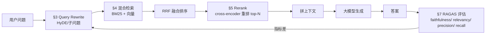
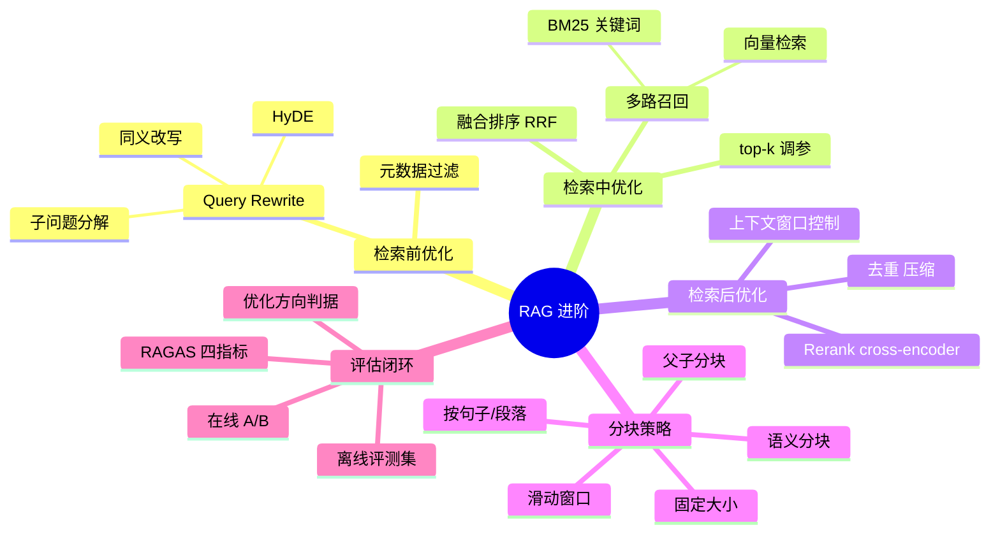
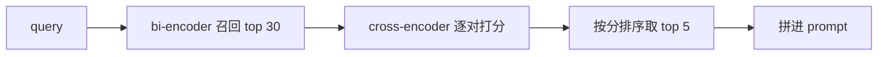
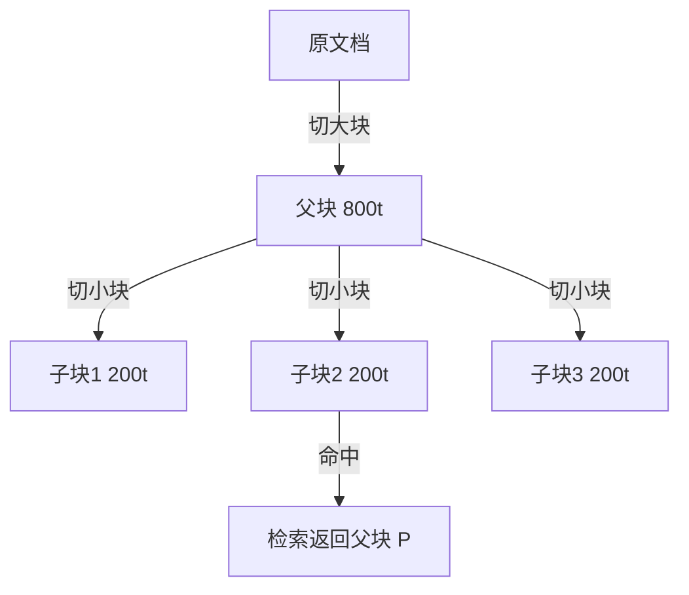
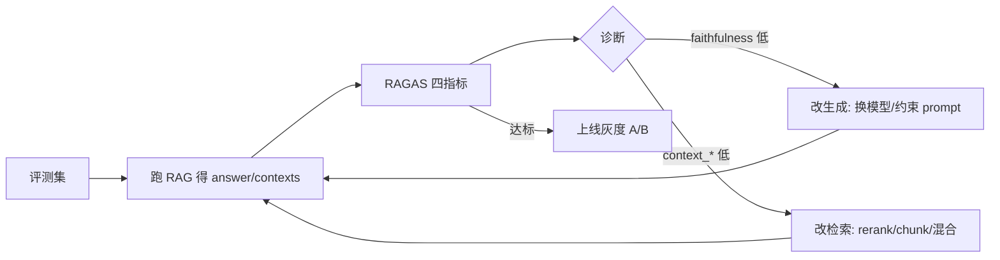

# RAG 进阶：检索优化与评估

> **文件编码**：UTF-8。代码基于 Spring AI 1.0.x + JDK 17+。rerank/ScoringModel 等 API 在 1.0.x 不同小版本有差异，**以你 pom 里实际版本为准**，本文给官方文档链接兜底。
>
> **前置**：先学 [06 RAG 基础](06-RAG检索增强生成基础.md)、[07 向量库](07-向量数据库与知识库实战.md)。本章在它们之上讲「为什么基础 RAG 不够，怎么把它做到能上线」。

---

## 0. 读前导读：为什么需要这一章

### 0.1 用一句话弄懂本章

**基础 RAG = 检索 top-k 拼进 prompt**；进阶 RAG = **改查询、多路召回、重排、按场景选分块、用指标量化效果**——做到「召回准、不啰嗦、可衡量」。

### 0.2 这一章解决什么真实痛点

| 痛点（你做 06/07 demo 时大概率遇到过） | 本章对应小节 |
|----------------------------------------|--------------|
| 问「订单状态」却召回了一堆介绍性段落 | §3 Query Rewrite |
| 只用向量检索，关键词「ERROR_CODE_401」召不回来 | §4 混合检索 |
| top-k=5 时第 1、5 条相关，2/3/4 是噪声，模型被带偏 | §5 Rerank |
| 文档按 500 字硬切，把一句话切断，语义丢失 | §6 Chunk 策略 |
| 改了 chunk 大小，但不知道是变好还是变坏了 | §7 RAGAS 评估 |
| 面试官问「你怎么衡量你的 RAG 好不好」答不上 | §7 + §8 |

### 0.3 本章学完你能做到

1. 说清 **bi-encoder vs cross-encoder** 的区别，以及为什么 rerank 能涨点
2. 写出 **BM25 + 向量 + RRF 融合** 的混合检索，解释 RRF 公式
3. 用 **HyDE / 子问题分解** 改写用户查询，提升召回
4. 按文档类型选 **chunk 策略**（固定/语义/父子），说出各自失败场景
5. 用 **RAGAS 四指标** 量化一次 RAG 改动的效果，并能在 Java 项目里跑起来
6. 画出 **「评测 → 改 → 再评测」的优化闭环**，这是大厂面试的加分项

### 0.4 一张图看全章



> 这张图就是本章的骨架。下面每个小节都在填它的某一块。

### 0.5 学习姿势

- **必须动手**：§3/§4/§5 各有一个最小可跑 demo，不敲等于没学
- **先看 §2 术语**，否则 §3 一上来「HyDE」会让你懵
- **§7 是面试高频**，哪怕你不写代码也要能背出四指标含义

### 0.6 本章不讲什么（避免期望错位）

- 不讲怎么训练 embedding 模型（那是算法岗）
- 不讲 fine-tune（见未来扩展章 / 算法方向）
- 不讲多模态 RAG（图/表检索，进阶中的进阶）
- Spring AI 某些 rerank API 还在演进，**版本差异会明确标注**，不糊弄

### 0.7 难度与时长

- 难度：★★★★☆（在 06/07 之上）
- 建议时长：**2 个学习单元**（每单元 2~3 小时）
  - 单元 1：§1~§5（检索侧优化），敲完 3 个 demo
  - 单元 2：§6~§8（分块 + 评估 + 闭环），跑通一次 RAGAS

### 0.8 常见困惑（开始前先消解）

| 困惑 | 简短回答 |
|------|----------|
| 「我都用向量检索了还不够吗？」 | 不够。向量擅长「语义相近」，关键词精确匹配它弱（如订单号、错误码） |
| 「rerank 不就是再排一次序吗，有啥用？」 | 召回阶段用快但糙的模型，rerank 用慢但准的模型，**用算力换精度** |
| 「RAGAS 不就是跑个分吗？」 | 它能告诉你**是检索坏了还是生成坏了**，这是优化的方向判据 |
| 「这些我都用 Spring AI 现成 API 就行？」 | 部分是，部分要自己拼。本章会标清哪些现成、哪些要自封装 |

---

## 1. 核心术语：先把这些词钉死

### 1.1 bi-encoder（双塔编码器）

- **定义**：把 query 和 doc **各自**编码成一个向量，用向量距离（如余弦）算相似度。
- **生活类比**：像考试「标准化答题卡」——题和答案各自涂成一张卡，机器比对卡有多像。快，但损失细节。
- **在 RAG 里的角色**：**召回阶段**用它。一次编码、万次比对，快。
- **代表**：`bge-large-zh`、`text-embedding-3-large`、Spring AI 的 `EmbeddingModel`。

### 1.2 cross-encoder（交叉编码器）

- **定义**：把 query 和 doc **拼在一起**送进模型，直接输出一个相关度分数。**不产出向量**。
- **生活类比**：像老师把题和某学生的答案**放一起逐字看**，给个分。准，但慢。
- **在 RAG 里的角色**：**重排阶段**用它。只对召回回来的几十条打分，量小，可以慢且准。
- **代表**：`bge-reranker-large`、Cohere Rerank、Jina Reranker。

> **关键对比**：bi-encoder 是「快但糙的初筛」，cross-encoder 是「慢但精的复赛」。**两者配合 = 召回多 + 重排少**，这是 rerank 的本质。

### 1.3 RRF（Reciprocal Rank Fusion，倒数排名融合）

- **定义**：把多路检索结果按「每路的排名」算一个融合分：`score(d) = Σ 1/(k + rank_i(d))`，`k` 常取 60。
- **生活类比**：两位评委各自给选手排名，不比绝对分（两人打分尺度不同），只比「谁排名靠前」。某选手在 A 评委第 1、B 评委第 5，融合分 = 1/61 + 1/65。
- **为什么用它**：BM25 分数和向量相似度**量纲不同**，不能直接加。RRF 只用排名，量纲无关。

### 1.4 HyDE（Hypothetical Document Embeddings）

- **定义**：先让 LLM **针对问题生成一个假设性答案**，用这个假设答案的 embedding 去检索，而不是用原问题。
- **生活类比**：你想找「怎么做红烧肉」的菜谱，与其用「红烧肉做法」这个短词检索，不如先脑补一段「红烧肉要焯水、炒糖色、炖 40 分钟」的描述，用这段描述去找相似菜谱——更接近目标文档的「文风」。
- **为什么有用**：用户问题往往短且口语化，和文档（书面、详尽）的 embedding 分布有 gap。假设答案更接近文档分布。

### 1.5 chunk（分块）

- **定义**：把长文档切成一段段，每段是一个检索单元。
- **为什么必须切**：embedding 模型有 token 上限；上下文太长模型也会「lost in the middle」。
- **关键参数**：`chunk_size`（每块多大）、`overlap`（块间重叠，避免切断语义）。

### 1.6 faithfulness（RAGAS 指标之一）

- **定义**：答案里的每个陈述，是否都能在检索到的上下文里找到支撑。**量化幻觉**。
- **生活类比**：学生答题，老师逐句查「这句话课本上有吗？」。一句找不到就扣分。
- **取值**：0~1，越高越「忠于材料」。

> 这 6 个词是本章的地基。**先记住它们，后面读代码才不晕。**

---

## 2. 知识地图：进阶 RAG 的全景



> 五大块对应 §3~§7。**检索前/中/后** 是按流程分；**分块** 是离线预处理；**评估** 是闭环。

---

## 3. 检索前优化：Query Rewrite

### 3.1 为什么要改写查询

用户真实提问往往「短、口语、带指代、多意图」：

| 用户原话 | 问题 | 改写目标 |
|----------|------|----------|
| 「那个报错咋办」 | 指代不明（哪个报错？） | 结合历史 → 「ERROR_CODE_401 怎么解决」 |
| 「对比一下 A 和 B 的性能」 | 多意图 | 拆成 2 个子问题分别检索 |
| 「咋部署」 | 太口语 | 改写为「应用部署流程」更接近文档文风 |

### 3.2 三种改写策略

#### 3.2.1 同义/规范化改写

让 LLM 把口语问题改写成「文档风格」的查询：

```java
@Service
public class QueryRewriteService {

    private final ChatClient chatClient;

    public QueryRewriteService(ChatClient.Builder builder) {
        this.chatClient = builder
            .defaultSystem("""
                你是查询改写助手。把用户的口语问题改写成 1 个适合检索文档的书面查询。
                只输出改写后的查询，不要解释。
                """)
            .build();
    }

    public String rewrite(String userQuery) {
        return chatClient.prompt()
            .user("用户问题：" + userQuery)
            .call()
            .content();
    }
}
```

> **逐行**：`defaultSystem` 设定角色；`prompt().user(...)` 传用户问题；`.call().content()` 拿文本结果。这是 Spring AI 标准调用，已在 [02](02-SpringAI核心开发.md) 讲过。

#### 3.2.2 子问题分解（Sub-query Decomposition）

复杂问题拆成多个子问题，分别检索后合并：

```java
public List<String> decompose(String userQuery) {
    String json = chatClient.prompt()
        .system("""
            把用户问题拆成 2~4 个可独立检索的子问题。
            只输出 JSON 数组，如 ["子问题1","子问题2"]，不要别的文字。
            """)
        .user(userQuery)
        .call()
        .content();
    // 实际项目用 ObjectMapper 解析；这里简化
    return parseStringArray(json);
}
```

**用法**：对每个子问题各做一次向量检索，结果合并去重，再进 rerank。

#### 3.2.3 HyDE（假设文档检索）

```java
public List<Document> hydeRetrieve(String userQuery, VectorStore vectorStore) {
    // 第 1 步：让 LLM 生成假设答案
    String hypothetical = chatClient.prompt()
        .system("针对问题写一段 200 字左右的假设性答案，哪怕不准确也行，要像文档的口吻。")
        .user(userQuery)
        .call()
        .content();

    // 第 2 步：用假设答案的 embedding 检索（而不是用原问题）
    SearchRequest request = SearchRequest.builder()
        .query(hypothetical)
        .topK(5)
        .build();
    return vectorStore.similaritySearch(request);
}
```

> **关键**：`vectorStore.similaritySearch` 的 query 传的是 `hypothetical`（假设答案），不是 `userQuery`。这就是 HyDE 的核心。

### 3.3 什么时候用哪种

| 策略 | 适用场景 | 代价 |
|------|----------|------|
| 同义改写 | 口语化问题、文档偏书面 | 1 次额外 LLM 调用 |
| 子问题分解 | 对比类、多条件查询 | N 次 LLM + N 次检索 |
| HyDE | 问题短、文档长且具体 | 1 次 LLM，但假设答案可能跑偏 |

> **面试加分**：被问「HyDE 的失败场景」时答——当 LLM 对领域不熟、假设答案方向错了，会**带偏整个检索**。所以领域强的用 HyDE，领域弱的用子问题分解更稳。

---

## 4. 检索中优化：混合检索 + RRF

### 4.1 为什么单一检索不够

| 检索方式 | 擅长 | 不擅长 |
|----------|------|--------|
| 向量检索 | 语义相近（「怎么做红烧肉」≈「红烧肉菜谱」） | 精确关键词（订单号 `ORD-2024-001`、错误码 `E_401`） |
| BM25 关键词 | 精确词、稀有词 | 同义、语义 |

**结论**：两者互补。生产 RAG 几乎都做混合。

### 4.2 BM25 怎么来

- **定义**：基于词频（TF）和反文档频率（IDF）的经典文本检索算法。一个词在某文档出现多、但全库很少出现，则该词对匹配贡献大。
- **实现选择**：
  - **Elasticsearch / OpenSearch**：成熟，自带 BM25，适合大规模
  - **PostgreSQL tsvector + ts_rank**：已在 PG 里就顺手，pgvector + 全文检索可同库
  - **Lucene 直用**：轻量，但要自己管索引

### 4.3 RRF 融合公式与代码

**公式**：

```
RRF_score(d) = Σ_i  1 / (k + rank_i(d))
```

- `i` 遍历每一路检索（向量路、BM25 路）
- `rank_i(d)` 是文档 d 在第 i 路结果里的排名（从 1 开始）
- `k` 是平滑常数，常取 **60**（论文经验值）

**Java 实现**：

```java
@Service
public class HybridSearchService {

    private final VectorStore vectorStore;       // 向量检索
    private final Bm25SearchService bm25;        // 自己封装的 BM25（可基于 ES 或 PG tsvector）
    private static final int RRF_K = 60;

    public List<Document> hybridSearch(String query, int topK) {
        // 1. 两路各召回 topK*3，给 RRF 留余量
        List<Document> vecHits = vectorStore.similaritySearch(
            SearchRequest.builder().query(query).topK(topK * 3).build());
        List<Document> bm25Hits = bm25.search(query, topK * 3);

        // 2. 用文档 id 建 rank 表
        Map<String, Double> scores = new HashMap<>();
        Map<String, Document> docById = new HashMap<>();

        accumulate(vecHits, scores, docById);
        accumulate(bm25Hits, scores, docById);

        // 3. 按 RRF 分数排序取 topK
        return scores.entrySet().stream()
            .sorted(Map.Entry.<String, Double>comparingByValue().reversed())
            .limit(topK)
            .map(e -> docById.get(e.getKey()))
            .toList();
    }

    private void accumulate(List<Document> hits, Map<String, Double> scores, Map<String, Document> docById) {
        for (int rank = 0; rank < hits.size(); rank++) {
            Document d = hits.get(rank);
            String id = d.getId();
            docById.putIfAbsent(id, d);
            double delta = 1.0 / (RRF_K + rank + 1);  // rank 从 1 开始
            scores.merge(id, delta, Double::sum);
        }
    }
}
```

> **逐行**：
> - `topK * 3`：初检多召回，给融合和后续 rerank 留候选池。
> - `accumulate`：把每路的排名转成 RRF 分数累加。`rank + 1` 因为数组下标从 0。
> - `merge(id, delta, Double::sum)`：同一文档在两路都出现就累加，这正是 RRF「两路都靠前就高分」的效果。
> - **为什么不用相似度原始分**：向量余弦和 BM25 分数量纲不同，直接加无意义。RRF 只用排名，量纲无关。

### 4.4 一个数值例子

假设 topK=2，两路结果：

| 文档 | 向量路排名 | BM25 路排名 | RRF 分数 (k=60) |
|------|-----------|-------------|-----------------|
| docA | 1 | 3 | 1/61 + 1/63 = 0.0323 |
| docB | 2 | 未命中 | 1/62 = 0.0161 |
| docC | 4 | 1 | 1/64 + 1/61 = 0.0318 |
| docD | 3 | 2 | 1/63 + 1/62 = 0.0319 |

最终排序：docA > docD > docC > docB。**docD 两路都在前 3，比只在一路第 1 的 docC 更靠前**——这就是 RRF 的「共识加权」。

---

## 5. 检索后优化：Rerank

### 5.1 rerank 在干什么

召回阶段用 bi-encoder 快速捞回 top 20~50，再用 cross-encoder 对这 20~50 条**逐对**（query, doc）打分，重新排序取 top 5 喂给 LLM。



### 5.2 Spring AI 的 rerank API（版本相关，重点说明）

Spring AI 1.0.x 提供了两层 API（**具体可用性以你 pom 版本为准**，[官方 RAG 文档](https://docs.spring.io/spring-ai/reference/api/retrieval-augmented-generation.html)）：

#### 5.2.1 `DocumentPostProcessor` / `DocumentRanker` 接口

```java
// 接口形态（包：org.springframework.ai.rag.postretrieval.ranking）
public interface DocumentRanker extends BiFunction<Query, List<Document>, List<Document>> {
    List<Document> rank(Query query, List<Document> documents);
}
```

- **作用**：对检索回来的文档重排序，**不删文档、不改内容**，只调顺序/打分。
- **解决「lost in the middle」**：把最相关的顶到最前。

#### 5.2.2 `ScoringModel` + `JinaScoringModel`（较新，可能在 1.0.x 后期或 1.1）

来自 Spring AI 官方 PR（[#5887](https://github.com/spring-projects/spring-ai/pull/5887)）和讨论（[#6067](https://github.com/spring-projects/spring-ai/discussions/6067)）：

```java
// 用 Jina Reranker API（POST /v1/rerank）
JinaScoringModel scoringModel = JinaScoringModel.builder()
    .jinaScoringApi(jinaScoringApi)
    .options(JinaScoringOptions.builder()
        .model("jina-reranker-v2-base-multilingual")
        .build())
    .build();

ScoringResponse response = scoringModel.call("What is Spring AI?", documents);
```

- 配置项：`spring.ai.jina.scoring.*`（model、topK、returnDocuments、truncation）
- 支持 `jina-reranker-v2-base-multilingual`、`jina-reranker-v3` 等

#### 5.2.3 接入 `RetrievalAugmentationAdvisor`（推荐写法）

```java
@Bean
public Advisor ragAdvisor(VectorStore vectorStore, ScoringDocumentPostProcessor reranker) {
    return RetrievalAugmentationAdvisor.builder()
        .documentRetriever(VectorStoreDocumentRetriever.builder()
            .vectorStore(vectorStore)
            .topK(20)              // 初检多召回
            .build())
        .documentPostProcessors(reranker)  // 重排到 topN
        .build();
}

@Bean
public ScoringDocumentPostProcessor reranker(ScoringModel scoringModel) {
    return ScoringDocumentPostProcessor.builder()
        .scoringModel(scoringModel)
        .topN(5)
        .build();
}
```

> **逐行**：
> - `topK(20)`：召回 20 条，**故意多于最终要的 5 条**，给 rerank 留候选。
> - `documentPostProcessors(reranker)`：把 reranker 挂在检索之后、生成之前。
> - `topN(5)`：重排后只留 5 条进 prompt。
> - **依赖**：需要 `spring-ai-rag`。

> ⚠️ **版本提醒**：`ScoringModel`/`JinaScoringModel`/`ScoringDocumentPostProcessor` 在不同 1.0.x 小版本里可用性不同。**如果 pom 里版本没有这些类，用下面 §5.3 的自封装方案，效果一样**。

### 5.3 自封装 rerank（版本无关，稳妥兜底）

调任何 rerank HTTP API（Jina / Cohere / BGE-reranker 服务），自己实现 `DocumentPostProcessor`：

```java
@Component
public class HttpRerankPostProcessor implements DocumentPostProcessor {

    private final RestClient restClient;   // 调 rerank 服务
    private final String model;            // 如 "bge-reranker-large"

    public HttpRerankPostProcessor(@Value("${rerank.url}") String url,
                                   @Value("${rerank.model}") String model) {
        this.restClient = RestClient.create(url);
        this.model = model;
    }

    @Override
    public List<Document> apply(Query query, List<Document> documents) {
        if (documents.isEmpty()) return documents;

        // 1. 组装 rerank 请求体
        Map<String, Object> body = Map.of(
            "model", model,
            "query", query.text(),
            "documents", documents.stream().map(Document::getText).toList(),
            "top_n", 5
        );

        // 2. 调用 rerank 服务（不同厂商响应格式略不同，这里用 Jina 风格）
        RerankResponse resp = restClient.post()
            .uri("/v1/rerank")
            .contentType(MediaType.APPLICATION_JSON)
            .body(body)
            .retrieve()
            .body(RerankResponse.class);

        // 3. 按返回的 index 取原文档，重排序
        return resp.results().stream()
            .sorted(Comparator.comparingDouble(RerankResult::relevanceScore).reversed())
            .map(r -> documents.get(r.index()))
            .toList();
    }

    // 响应 DTO（精简）
    public record RerankResponse(List<RerankResult> results) {}
    public record RerankResult(int index, double relevanceScore) {}
}
```

> **逐行**：
> - `Document::getText`：把每条文档的文本抽出来发给 rerank 模型。
> - `top_n`：让 rerank 服务直接返回前 N。
> - `r.index()`：rerank 服务返回的是「原列表中的下标」，用它回取 `Document` 对象，**不丢元数据**。
> - **为什么自己写**：不依赖 Spring AI 某版本是否有 ScoringModel，**任何 1.0.x 都能跑**。

### 5.4 rerank 的代价与取舍

| 项 | 召回（bi-encoder） | 重排（cross-encoder） |
|----|-------------------|----------------------|
| 延迟 | 毫秒级 | 几十~几百毫秒 |
| 准度 | 中 | 高 |
| 调用量 | 1 次（query 编码） | N 次（每对 query-doc 一次） |

**结论**：rerank 的 top-N 控制在 **5~10**，候选池控制在 **20~50**。再多延迟就崩。**这是面试常问的「rerank 为什么不能召回阶段就用」的标准答案**。

---

## 6. Chunk 策略：分块不只是切一刀

### 6.1 五种主流分块策略

| 策略 | 怎么切 | 适合 | 失败场景 |
|------|--------|------|----------|
| 固定大小 | 每 N token 一刀，overlap M | 快速起步、结构均匀的文档 | 把一个论点切断 |
| 按句子/段落 | 用句号/换行切 | 文章、博客 | 段落过长仍超 token |
| 语义分块 | 用 embedding 相似度判断边界 | 主题多变的文档 | 计算贵、阈值难调 |
| 父子分块 | 检索小块、返回其所属大块 | 既要精确召回又要完整上下文 | 索引复杂 |
| 滑动窗口 | 固定大小 + 大 overlap | 线性流程文档 | 冗余高、存储涨 |

### 6.2 父子分块（面试高频，重点讲）

**思路**：把文档切成**小块**（如 200 token）用于检索——小块语义聚焦，召回准；但命中后**返回它所属的大块**（如 800 token）给 LLM——上下文完整。



**Java 伪代码**（Spring AI 的 `TokenTextSplitter` 做基础切，父子关系自己存元数据）：

```java
@Service
public class ParentChildIndexer {

    private final VectorStore vectorStore;
    private final ChatModel chatModel;  // 仅为演示用 embedding

    public void index(Document parentDoc) {
        // 1. 父块（仅存元数据，不入向量库；或单独存一个表）
        String parentId = parentDoc.getId();

        // 2. 切子块
        List<Document> children = new TokenTextSplitter(200, 50, 5, 10000, true)
            .apply(List.of(parentDoc));

        // 3. 每个子块带上 parent_id 元数据后入向量库
        List<Document> toStore = children.stream()
            .map(c -> c.mutate()
                .metadata(Map.of("parent_id", parentId, "chunk_index", c.getId()))
                .build())
            .toList();
        vectorStore.add(toStore);
    }

    public List<Document> retrieveWithParent(String query, int topK) {
        // 1. 子块召回
        List<Document> childHits = vectorStore.similaritySearch(
            SearchRequest.builder().query(query).topK(topK).build());

        // 2. 取 parent_id 去重，回查父块（实际从父块表/对象存储取）
        Set<String> parentIds = childHits.stream()
            .map(d -> (String) d.getMetadata().get("parent_id"))
            .collect(Collectors.toSet());

        return loadParents(parentIds);   // 返回大块给 LLM
    }
}
```

> **逐行**：
> - `TokenTextSplitter(200, 50, 5, 10000, true)`：200 token 一块、50 overlap。参数顺序以 Spring AI 实际签名为准。
> - `mutate().metadata(...)`：Spring AI 的 `Document` 是不可变风格，用 builder 改元数据。
> - **关键**：向量库里存的是**子块**，但 `metadata` 带 `parent_id`；命中后回查父块。
> - **为什么涨点**：小块聚焦语义、召回准；大块给 LLM 完整上下文，避免「答得对但缺前提」。

### 6.3 怎么选

- **起步**：固定 500 token + overlap 50，先跑通。
- **文档结构清晰（有标题）**：按标题切，比固定大小好。
- **精度要求高**：父子分块。
- **更新频繁**：滑动窗口便于增量。

> **面试题**：「你怎么决定 chunk 大小？」——答：**先固定值跑通，建评测集，用 RAGAS context_recall 调 chunk_size**。这是「数据驱动调参」的回答，比「凭经验 500」高一个段位。

---

## 7. RAGAS 评估：量化你的 RAG 好不好

### 7.1 四个核心指标（必背）

| 指标 | 衡量什么 | 需要的输入 | 高/低意味着 |
|------|----------|-----------|-------------|
| `faithfulness` | 答案是否忠于检索上下文（量化幻觉） | question, answer, contexts | 低 = 答案在编造 |
| `answer_relevancy` | 答案是否切题 | question, answer | 低 = 答非所问 |
| `context_precision` | 检索 chunk 是否相关且排序合理 | question, contexts, ground_truth | 低 = 召回了一堆噪声 |
| `context_recall` | 是否检索到所有必要信息 | question, contexts, ground_truth | 低 = 漏召回 |

> **诊断逻辑**（面试核心）：
> - `faithfulness` 低 → **生成环节**问题（模型在编）。对策：换更强模型、加 system prompt 约束「只基于上下文回答」。
> - `answer_relevancy` 低 → **生成或改写**问题。对策：查 query rewrite 是否跑偏。
> - `context_precision` 低 → **检索/重排**问题。对策：加 rerank、调 top-k。
> - `context_recall` 低 → **分块或召回**问题。对策：调 chunk_size、增 top-k、加 BM25 混合。
>
> **这四指标能精确定位「是哪个环节坏了」，是面试最想听到的的话。**

### 7.2 RAGAS 是 Python 生态，Java 项目怎么用

RAGAS 本身是 Python 库（`pip install ragas`），用 LLM-as-judge 打分。Java 项目有三种接法：

| 方案 | 做法 | 适用 |
|------|------|------|
| ① 离线评测脚本 | Java 把 trace（question/answer/contexts）导出 JSON，Python 脚本跑 RAGAS | 最简单，**推荐起步** |
| ② 评测微服务 | 起一个 FastAPI 服务封装 RAGAS，Java 调 HTTP | 想集成进 CI |
| ③ Langfuse 自定义评估 | 把 contexts/answer 上报到 Langfuse，用其评估功能 | 已用 Langfuse 时 |

#### 7.2.1 方案①：Java 导出 + Python 评测

**Java 侧**：把一次 RAG 的关键数据落盘。

```java
@Service
public class RagEvalRecorder {

    private final Path evalDir = Path.of("eval-traces");

    public void record(String question, String answer, List<Document> contexts, String groundTruth) {
        Map<String, Object> trace = Map.of(
            "question", question,
            "answer", answer,
            "contexts", contexts.stream().map(Document::getText).toList(),
            "ground_truth", groundTruth
        );
        String json = new ObjectMapper().writeValueAsString(trace);
        Files.writeString(evalDir.resolve(UUID.randomUUID() + ".json"), json);
    }
}
```

**Python 侧**（`run_ragas.py`）：

```python
import json, glob
from datasets import Dataset
from ragas import evaluate
from ragas.metrics import faithfulness, answer_relevancy, context_precision, context_recall

rows = []
for f in glob.glob("eval-traces/*.json"):
    rows.append(json.load(open(f, encoding="utf-8")))

ds = Dataset.from_list(rows)
scores = evaluate(ds, metrics=[faithfulness, answer_relevancy,
                               context_precision, context_recall])
print(scores)
scores.to_pandas().to_csv("ragas-report.csv", index=False)
```

> **逐行**：
> - `Dataset.from_list(rows)`：把 JSON 列表转成 RAGAS 要的 Dataset，列名必须含 `question`/`answer`/`contexts`。
> - `context_recall` 还需要 `ground_truth` 列（标准答案），没有会被跳过——这就是为什么 Java 侧要落 `groundTruth`。
> - `faithfulness`/`context_recall` 是**高成本指标**（多次 LLM 调用），样本多时慢且贵，先跑 50 条。

#### 7.2.2 评测集从哪来

- **人工标注**：业务同学写 50~100 条「问题 + 标准答案」。**这是金标准**。
- **LLM 生成 + 人工审**：拿你的文档让 LLM 自动生成 QA 对，人工抽审。快但质量参差。
- **线上日志抽样**：从真实用户问题里抽，补标准答案。最贴近真实分布。

> **面试加分**：「评测集要覆盖难例（多意图、指代、关键词精确），不能全是简单题，否则指标全高、线上翻车。」

### 7.3 优化闭环（必须能画出来）



> **这个闭环是大厂面试的「杀手锏图」**。意思是：你不是凭感觉改 RAG，而是**指标驱动**地改，并能说清每改一处对应哪个指标。

---

## 8. 报错与踩坑表

| 现象/报错 | 原因 | 解决 |
|-----------|------|------|
| `ScoringModel` 类找不到 | pom 版本不含该 API | 用 §5.3 自封装 HTTP rerank |
| RAGAS `context_recall` 静默跳过 | 缺 `ground_truth` 列 | Java 侧必须落 groundTruth |
| RAGAS 跑得极慢 | faithfulness 多次 LLM 调用 | 先跑 50 条；或只跑 context_precision（轻量） |
| HyDE 后召回更差 | LLM 假设答案方向跑偏 | 领域强的才用 HyDE；或退回子问题分解 |
| 混合检索后结果反而不如单路 | RRF 的 k 不当 / 某路质量太差 | k 默认 60；先单独评估每路质量 |
| rerank 后延迟翻倍 | 候选池太大 | topK 召回 ≤30，topN 重排 ≤5 |
| 父子分块后上下文超 token | 多个子块命中同一父块重复返回 | 按 parent_id 去重 |
| 中文 chunk 切到字中间 | TokenTextSplitter 对中文 token 计数不准 | 用 `metadata` 记录字符偏移，或按句号切 |

---

## 9. 常见困惑 FAQ

**Q1：rerank 和向量检索都用模型，区别到底在哪？**
A：向量检索是 bi-encoder，query 和 doc **分别编码**再比距离，快但糙；rerank 是 cross-encoder，query 和 doc **拼一起**送模型，慢但准。召回用快的捞一大批，重排用慢的精挑几条。

**Q2：RRF 为什么用倒数排名，不直接用排名？**
A：排名 1 和 2 的差距（1 vs 1/2）比排名 100 和 101（1/100 vs 1/101）大得多，**倒数排名让「靠前的名次」权重更高**，符合「前列更可信」的直觉。k=60 是平滑常数，避免排名 1 的分数压倒一切。

**Q3：HyDE 不是会编造吗，为什么反而有用？**
A：HyDE 编造的不是答案，是**「假设性文档」**。我们要的不是它对不对，而是它的**文风/语义分布接近真实文档**，用它的 embedding 检索比用短问题更准。最终答案仍由 LLM 基于真实检索到的文档生成，HyDE 只影响「找什么」。

**Q4：chunk 越小召回越准，为什么不切到一句话一块？**
A：太小会**丢失上下文**——「它的性能是 200」单独召回没用，得带上「X 型号 CPU」才有意义。所以有**父子分块**：小块召回、大块返回。

**Q5：RAGAS 的 faithfulness 怎么算的？**
A：把答案拆成一个个陈述句，对每个陈述判断「能否在 contexts 里找到支撑」，能的占比即分数。用 LLM-as-judge 做这个判断。所以它本身也要消耗 LLM 调用，贵。

**Q6：context_precision 和 context_recall 有什么区别？**
A：precision 问「召回的里面有多少相关」（噪声多不多），recall 问「相关的有没有被召回全」（漏没漏）。前者低 = 捞太多垃圾，后者低 = 漏了该捞的。

**Q7：混合检索一定要 RRF 吗？**
A：不一定。也可用「加权融合」`α*vec + (1-α)*bm25`，但要**归一化**两路分数到同量纲，调 α 麻烦。RRF 只用排名、无量纲问题、无超参（k 一般固定 60），**工程上更省心**，所以流行。

**Q8：Spring AI 的 RetrievalAugmentationAdvisor 我这个版本没有？**
A：需要加 `spring-ai-rag` 依赖。若加了仍没有，说明版本较早，可手动按 §4+§5 的 service 拼装：`rewrite → hybridSearch → rerank`，效果等价。

**Q9：评测集要多少条才够？**
A：起步 50~100 条覆盖主要场景即可。生产级想统计显著，建议 200+，且**分层**（简单/多意图/指代/关键词精确各占一定比例）。

**Q10：线上怎么知道 RAG 变好了？**
A：① 离线 RAGAS 涨点；② 线上 A/B 看业务指标（如客服 RAG 看「人工接管率」「用户满意度」）。**离线指标涨≠线上一定好**，两者都要看，这是大厂标准动作。

**Q11：rerank 用本地模型还是 API？**
A：量小用 API（Jina/Cohere 按调用计费，简单）；量大或数据敏感用本地（`bge-reranker` 自部署，需 GPU 或较强 CPU）。面试可答：「成本和数据合规两条线决定」。

**Q12：为什么我加了 rerank 指标反而降了？**
A：常见三种：① 召回候选池太小（rerank 无米下锅）；② rerank 模型和检索的 embedding 领域不匹配；③ 评测集太小导致指标方差大。先排查这三项。

---

## 10. 闭卷自测（10 题，合上文档做）

1. bi-encoder 和 cross-encoder 的本质区别是什么？各适合哪个阶段？
2. 写出 RRF 的公式，解释 k=60 的作用。
3. HyDE 用「假设答案」去检索，但假设答案可能是错的，为什么仍然有用？
4. 子问题分解适合什么场景？代价是什么？
5. 父子分块的「父」和「子」分别入库吗？为什么？
6. RAGAS 四指标分别衡量什么？哪些需要 ground_truth？
7. faithfulness 低、context_precision 正常，你判断问题出在检索还是生成？怎么改？
8. context_recall 持续低，列出至少 3 个对策。
9. rerank 为什么不能直接用在召回阶段（对全库）？
10. 画出「评测 → 诊断 → 改 → 再评测 → 灰度」的闭环，标出每个环节对应的指标。

> 答案都在 §1、§3、§4、§5、§6、§7。做对 8 题以上过关；不到 6 题重读 §1 和 §7。

---

## 11. 费曼检验：讲给空气听

合上文档，假装向一个**只会写 Spring Boot 但没听过 RAG** 的同事讲 3 分钟，要覆盖：

1. 为什么只做向量检索不够（举一个关键词精确匹配的例子）
2. 混合检索 + RRF 是怎么把两路结果合起来的（用「两位评委排名」类比）
3. rerank 为什么能涨点（bi-encoder 糙 vs cross-encoder 准）
4. 你怎么知道改 RAG 是变好还是变坏（RAGAS 四指标 + 诊断逻辑）

> 讲卡壳的地方就是没真懂的，回去重读。

---

## 12. 进阶档练习

1. **实现混合检索**：在 06/07 demo 基础上加一路 BM25（用 PG `tsvector` 或 ES），RRF 融合，对比单路向量检索的 RAGAS `context_recall`。
2. **接 rerank**：用 §5.3 自封装方案调 Jina/Cohere rerank API，topK=20 → topN=5，观察 `context_precision` 变化。
3. **跑一次 RAGAS**：导出 50 条 trace，用 `run_ragas.py` 跑四指标，写一份「哪低、怎么改」的优化单。
4. **加 HyDE**：对一个口语化问题集对比 HyDE 前后 `context_recall`，验证它是否真涨点。
5. **父子分块**：把 07 的知识库改成父子索引，对比固定 chunk 的 `answer_relevancy`。

---

## 13. 交叉引用

- 基础：[06 RAG 基础](06-RAG检索增强生成基础.md)、[07 向量库](07-向量数据库与知识库实战.md)
- 检索后可观测：[15 LLM 可观测性与评估体系](15-LLM可观测性与评估体系.md)
- 向量库怎么选：[16 向量库选型与进阶](16-向量库选型与进阶.md)
- Spring AI 核心 API：[02 Spring AI 核心开发](02-SpringAI核心开发.md)
- LLM 安全（rerank/rewrite 也可能被注入）：[Web安全 07](../../前端学习/Web安全/07-LLM应用安全与Prompt注入防护.md)
- 官方 RAG 文档：https://docs.spring.io/spring-ai/reference/api/retrieval-augmented-generation.html
- RAGAS：https://github.com/explodinggradients/ragas
- RRF 论文：Cormack et al., SIGIR 2009
