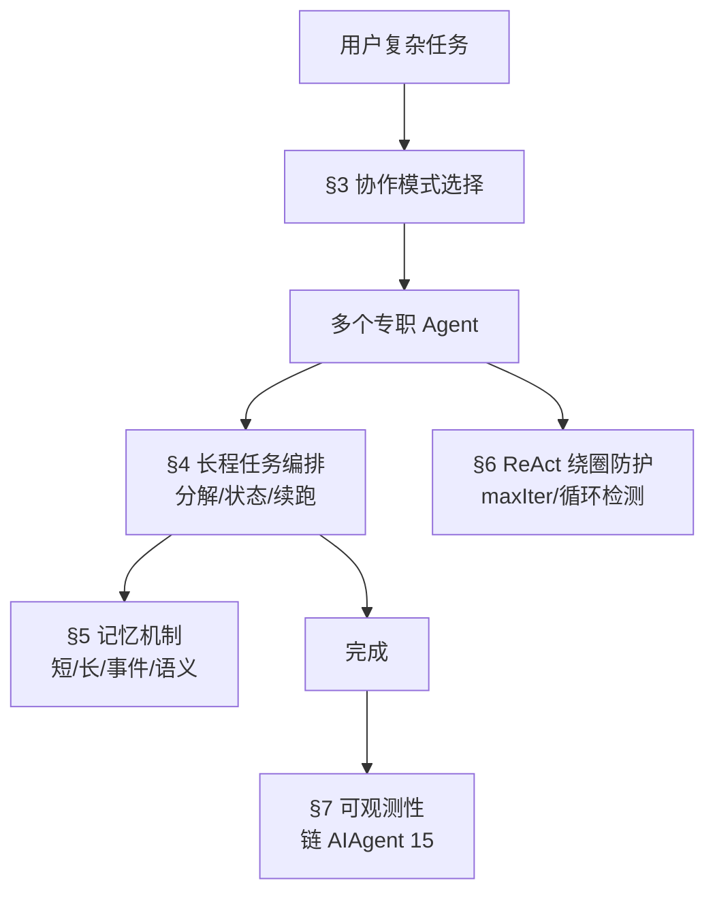
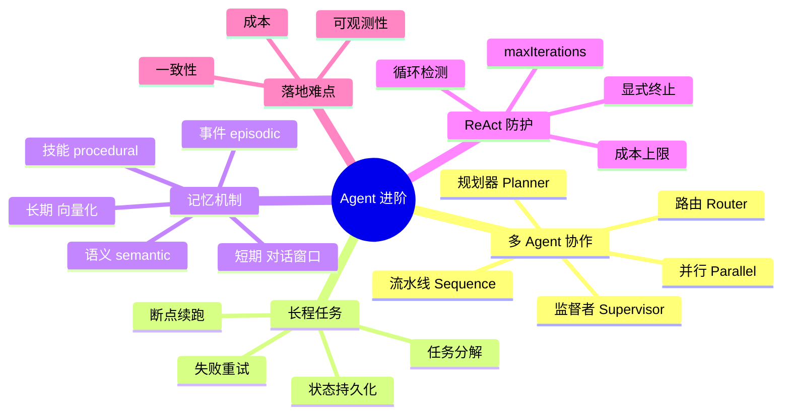
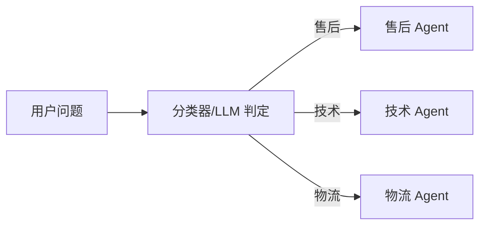
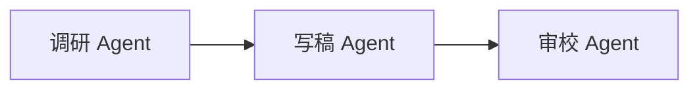
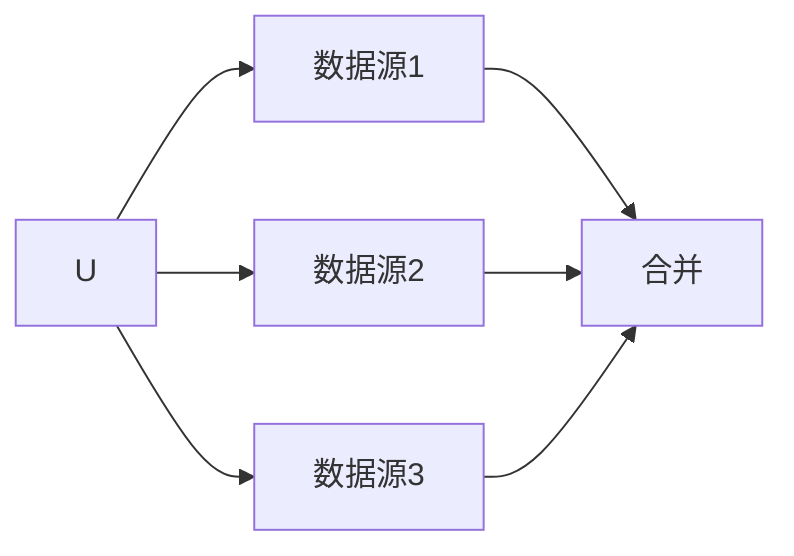
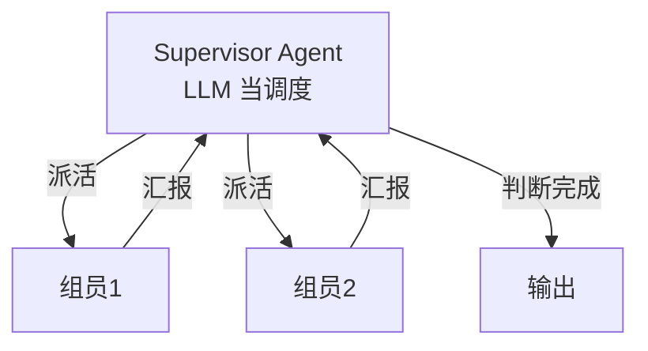
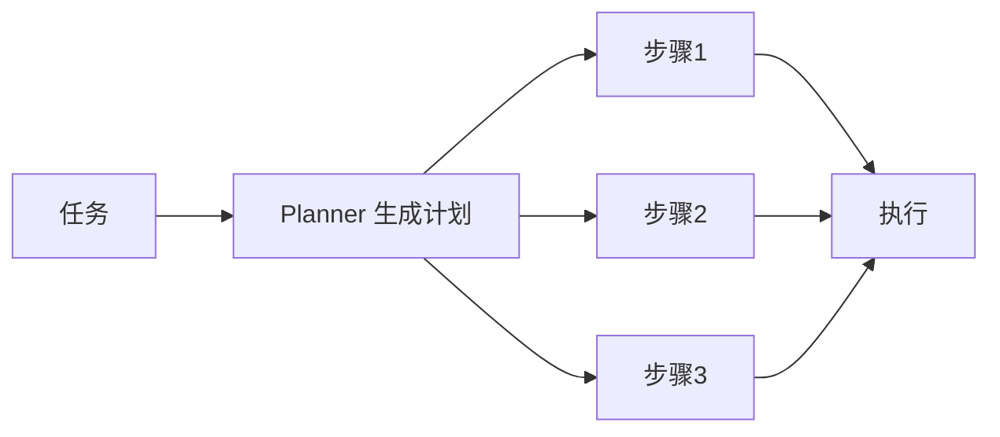

# Agent 进阶：多智能体、长程任务、记忆与 ReAct 绕圈

> **文件编码**：UTF-8。代码基于 Spring AI 1.0.x + LangChain4j `langchain4j-agentic`（**实验性模块，API 可能变**，以你 pom 版本为准）。
>
> **前置**：先学 [05 Agent 架构与 ReAct](05-Agent架构与ReAct模式.md)、[04 Tool 设计](04-FunctionCalling与Tool设计.md)、[08 对话记忆](08-对话记忆与会话管理.md)。本章在它们之上讲「单 Agent 走到多 Agent、短任务走到长程任务」的工程化。

---

## 0. 读前导读：为什么需要这一章

### 0.1 用一句话弄懂本章

**基础 Agent = 一个 LLM + 几个 Tool 循环推理**；进阶 Agent = **多个专职 Agent 协作、能跑长任务、有长期记忆、不会在循环里转圈**——做到「能扛复杂任务、能调试、能止血」。

### 0.2 这一章解决什么真实痛点

| 痛点（你做 05 demo 时大概率遇到过） | 本章小节 |
|----------------------------------------|----------|
| 一个 Agent 又查库又写报告又发邮件，prompt 越拼越长，模型开始「顾此失彼」 | §3 多 Agent 分工 |
| 任务有 10 步，第 7 步失败了，前面 6 步白做，没法续跑 | §4 长程任务 |
| 用户隔一周回来，Agent 把上周聊的全忘了 | §5 记忆机制 |
| ReAct Agent 调同一个 Tool 反复调，停不下来，烧 token | §6 ReAct 绕圈 |
| 面试官问「多 Agent 怎么保证一致性」答不上 | §3 + §7 |

### 0.3 本章学完你能做到

1. 说清 **5 种多 Agent 协作模式**（路由/流水线/并行/监督/规划器），各举一个业务例子
2. 用 **LangChain4j `langchain4j-agentic`** 写一个 sequence + supervisor 的最小多 Agent demo
3. 设计一个**可断点续跑的长程任务**（状态持久化 + 失败重试）
4. 区分 **5 种记忆类型**（short/long、episodic/semantic/procedural），知道每种存哪
5. 解释 **ReAct 为什么会绕圈**，给出至少 3 种止血手段
6. 说清多 Agent 落地的 **3 个难点**（一致性、成本、可观测性）

### 0.4 一张图看全章



### 0.5 学习姿势

- **§3 是骨架**，先吃透 5 种模式再谈代码
- **§6 是面试高频**，ReAct 绕圈几乎是 Agent 岗必问
- **代码用 LangChain4j-agentic**（Spring AI 1.0.x 暂无原生多 Agent 框架，见 §3.3 说明）

### 0.6 本章不讲什么

- 不讲 RL 训练 Agent（那是算法岗）
- 不讲 AutoGen/CrewAI 的 Python API 细节（你的主线是 Java；但会讲它们的设计思想，面试会问）
- 不讲 A2A 协议细节（进阶中的进阶）

### 0.7 难度与时长

- 难度：★★★★★（本章是 Agent 岗的「分水岭」）
- 建议时长：**2 个学习单元**
  - 单元 1：§1~§3（多 Agent 模式），跑通一个 sequence demo
  - 单元 2：§4~§7（长程任务 + 记忆 + 绕圈），手画一张长程任务状态机

### 0.8 常见困惑

| 困惑 | 简短回答 |
|------|----------|
| 「多 Agent 不就是把一个 Agent 拆几个？」 | 拆只是第一步，难在**怎么协作、怎么传状态、怎么收口** |
| 「长程任务不就是 for 循环跑很多步？」 | 不是。要**持久化状态**，进程崩了能续跑 |
| 「ReAct 绕圈是模型 bug 吗？」 | 不是 bug，是「无终止判据 + 无循环检测」的设计缺陷，要工程兜底 |
| 「记忆不就是存对话历史？」 | 对话历史只是 short-term；还有长期、事件、语义、技能记忆 |

---

## 1. 核心术语：先钉死这些词

### 1.1 多 Agent 系统（Multi-Agent System, MAS）

- **定义**：多个各司其职的 Agent 协作完成一个任务，每个 Agent 有自己的角色、Tool、prompt。
- **生活类比**：一个科室——问诊护士、开单医生、化验员、取药药师，各干各的，通过病历传信息。
- **为什么不用一个 Agent**：① prompt 太长模型顾此失彼；② 单一职责便于调试；③ 可并行。

### 1.2 协作模式（Orchestration Pattern）

5 种主流模式（本章 §3 详解）：

| 模式 | 谁决定下一步 | 例子 |
|------|-------------|------|
| 路由（Router） | 规则/分类器 | 客服分流到售后/技术/物流 Agent |
| 流水线（Sequence） | 固定顺序 | 调研→写稿→审校 |
| 并行（Parallel） | 同时跑 | 同时查 3 个数据源 |
| 监督者（Supervisor） | 一个 LLM Agent 当调度 | 项目经理派活给组员 |
| 规划器（Planner） | LLM 先生成计划再执行 | 复杂任务先拆步骤 |

### 1.3 长程任务（Long-running Task）

- **定义**：需要多步（几十甚至上百步）、跨较长时间（分钟~小时）才能完成的任务。
- **生活类比**：装修——量房、设计、采购、水电、瓦工、木工……跨几周，中间要记进度、可停工续做。
- **关键能力**：**状态持久化 + 断点续跑 + 失败重试**。不是「一次 chat 就完」。

### 1.4 记忆类型

| 类型 | 存什么 | 类比 | 典型存储 |
|------|--------|------|----------|
| short-term（短期） | 当前对话近 N 轮 | 工作记忆 | 内存 / Redis |
| long-term（长期） | 跨会话持久的事实 | 笔记本 | 向量库 / KV |
| episodic（事件） | 过去发生的事 | 日记 | 向量库 |
| semantic（语义） | 提炼出的知识 | 教科书 | 知识图谱 / 向量库 |
| procedural（技能） | 怎么做某类事 | 操作手册 | prompt 模板 / skill 库 |

### 1.5 ReAct 绕圈（Looping）

- **定义**：ReAct Agent 在「Thought→Action→Observation」循环里反复调用同一 Tool 或在几个状态间反复跳，无法终止。
- **生活类比**：你让实习生「查一下数据，不对就再查」，他查了发现不对、再查、还不对、再查……没告诉他「查 3 次不对就回来问人」。
- **根因**：① 没有明确的终止判据；② 没有循环检测；③ Tool 反复返回相似结果，模型以为「再试一次可能成功」。

---

## 2. 知识地图



---

## 3. 多 Agent 协作模式

### 3.1 为什么要拆：单 Agent 的瓶颈

| 问题 | 表现 | 拆成多 Agent 怎么解 |
|------|------|---------------------|
| prompt 爆炸 | 一个 Agent 装下所有 Tool 说明 + 业务规则，prompt 几千 token，模型抓不住重点 | 每个 Agent 只看自己那部分，prompt 短而聚焦 |
| 职责混乱 | 又查数据又写报告又校对，模型在角色间切换出错 | 一人一职，prompt 强化单一角色 |
| 不可并行 | 串行调 3 个数据源 | 并行模式同时调 |
| 难调试 | 出错不知是哪一步 | 每个 Agent 独立 trace |

### 3.2 五种模式详解

#### 3.2.1 路由（Router）



- **谁决定下一步**：一个轻量分类器（规则或小 LLM）。
- **适用**：意图清晰、各分支互不交叉。如客服分流。
- **Java 实现要点**：用一个 `@Tool` 或单独的 ChatClient 做分类，再分发到对应 Agent 的 service。

#### 3.2.2 流水线（Sequence）



- **谁决定下一步**：固定顺序，无 LLM 调度。
- **适用**：步骤固定、有依赖。如「调研→写作→审校」。
- **LangChain4j**：`AgenticServices.sequenceBuilder`。

#### 3.2.3 并行（Parallel）



- **适用**：多个独立子任务，结果合并。如同时查多个数据库。
- **LangChain4j**：`AgenticServices.parallelBuilder`。

#### 3.2.4 监督者（Supervisor）



- **谁决定下一步**：一个 LLM Agent 看各组员能力描述，动态决定派谁、何时收口。
- **适用**：步骤不固定、需要动态决策。如「项目经理」。
- **LangChain4j**：`AgenticServices.supervisorBuilder`，每个 sub-agent 用 `@Agent(description="...")` 描述能力。

#### 3.2.5 规划器（Planner）



- **谁决定下一步**：LLM 先生成一个**计划**（步骤列表），再逐步执行；执行中可重规划。
- **适用**：任务复杂、需要先拆解。如「帮我做一份竞品分析报告」。
- **LangChain4j**：`AgenticServices.plannerBuilder` + 自定义 `Planner`。

### 3.3 Java 生态现状（重要，避免期望错位）

| 框架 | 多 Agent 能力 | 备注 |
|------|--------------|------|
| **LangChain4j** `langchain4j-agentic` | 5 种模式都有 | **实验性**，API 可能变；Quarkus 版有 `@SequenceAgent` 等注解 |
| **Spring AI 1.0.x** | 暂无原生多 Agent 框架 | 用 `ChatClient` + `Advisor` + 自定义编排实现 |
| **LangGraph4j** | 有状态图、支持循环 | 单独库，可和 LangChain4j/Spring AI 集成 |
| Python 生态 | CrewAI、AutoGen、LangGraph | 思想可借鉴，面试会问 |

> **结论**：Java 主线学 LangChain4j-agentic（§3.4 demo）+ 自己用 Spring AI 手搓编排（§3.5）。面试被问 Python 框架时能讲思想即可。

### 3.4 LangChain4j-agentic 最小 demo（sequence + supervisor）

> ⚠️ `langchain4j-agentic` 是实验性模块，**API 可能随版本变**。以下基于官方教程形态，跑前核对 [官方 agents 文档](https://docs.langchain4j.dev/tutorials/agents/)。

**Maven 依赖**（版本以官方最新为准）：

```xml
<dependency>
  <groupId>dev.langchain4j</groupId>
  <artifactId>langchain4j-agentic</artifactId>
  <version>{langchain4j 版本}</version>
</dependency>
```

**定义两个专职 Agent**（用接口 + `@Agent`，LangChain4j 的 AiServices 风格）：

```java
public interface ResearchAgent {
    @Agent(description = "调研指定主题，返回要点")
    String research(@UserInput String topic);
}

public interface WriterAgent {
    @Agent(description = "把调研要点写成短文")
    String write(@UserInput String points);
}
```

**Sequence 编排**（固定顺序：调研→写作）：

```java
Object composed = AgenticServices.sequenceBuilder
    .subAgents(researchAgent, writerAgent)
    .outputKey("article")
    .build();

// AgenticScope 在 agent 间传数据：research 的输出 → writer 的输入
```

> **逐行**：
> - `sequenceBuilder`：流水线模式，按 subAgents 顺序执行。
> - `AgenticScope`：agent 间共享的 KV 存储，前一个 agent 的输出写进去，后一个读出来。**这是多 Agent 传状态的核心**。
> - `outputKey`：最终结果存在 scope 的哪个 key。

**Supervisor 编排**（LLM 动态派活）：

```java
Object supervisor = AgenticServices.supervisorBuilder
    .chatModel(chatModel)
    .subAgents(researchAgent, writerAgent)
    .build();
```

- Supervisor 会看每个 sub-agent 的 `description`，**自己决定**先调谁、再调谁、何时完成。
- 适合步骤不固定的任务。

### 3.5 用 Spring AI 手搓编排（版本无关兜底）

Spring AI 1.0.x 没有原生多 Agent 框架，但 `ChatClient` + 普通服务编排完全够用：

```java
@Service
public class PipelineOrchestrator {

    private final ChatClient researchClient;
    private final ChatClient writerClient;

    public PipelineOrchestrator(ChatClient.Builder builder) {
        this.researchClient = builder
            .defaultSystem("你是调研员，只输出要点列表，不要废话。")
            .build();
        this.writerClient = builder
            .defaultSystem("你是写手，把要点扩写成 300 字短文。")
            .build();
    }

    public String run(String topic) {
        // 第 1 步：调研
        String points = researchClient.prompt().user(topic).call().content();

        // 第 2 步：写作（把上一步输出当下一步输入）
        return writerClient.prompt()
            .user("主题：" + topic + "\n要点：\n" + points)
            .call()
            .content();
    }
}
```

> **逐行**：
> - 两个 `ChatClient` 用**不同 system prompt** 扮演不同角色——这就是「专职 Agent」的本质。
> - `points` 是 step1 输出，作为 step2 的输入，**等价于 AgenticScope 传状态**。
> - **这就是 sequence 模式的手搓版**。supervisor 模式手搓：加一个「调度 ChatClient」决定下一步调谁，循环执行直到它说「完成」。

> **面试加分**：被问「Spring AI 怎么做多 Agent」时答——1.0.x 没原生框架，用 `ChatClient` 分角色 + 手动编排 + `Advisor` 传上下文；要更结构化可引 `langchain4j-agentic` 或 `LangGraph4j`。**承认生态现状 + 给可行方案**，比硬说有现成 API 强。

---

## 4. 长程任务：能跑几十步、能续跑

### 4.1 长程任务和短任务的区别

| 维度 | 短任务（05 章 demo） | 长程任务 |
|------|---------------------|----------|
| 步数 | 3~5 步 | 几十~上百步 |
| 时长 | 秒级 | 分钟~小时 |
| 进程 | 一次 chat 完成 | 可能跨多次请求、进程重启 |
| 失败 | 重新跑一次 | 必须**断点续跑**，不能从头 |

### 4.2 长程任务三要素

#### 4.2.1 任务分解（Planning）

把大任务拆成有依赖关系的子任务。两种拆法：

- **静态拆**：Planner LLM 一次性生成完整计划（步骤列表）。
- **动态拆**：每完成一步，Supervisor 决定下一步（边走边规划）。

```java
public record TaskStep(
    String id,
    String description,
    List<String> dependsOn,   // 依赖哪些前置步骤
    StepStatus status          // PENDING / RUNNING / DONE / FAILED
) {}
```

#### 4.2.2 状态持久化（Checkpointing）

**这是长程任务的核心**。每完成一步，把整个任务状态落盘，进程崩了能从最近 checkpoint 续跑。

```java
@Entity
@Table(name = "agent_task")
public class AgentTask {

    @Id
    private String taskId;

    private String userId;
    private String goal;                    // 用户目标

    @Convert(converter = JsonListConverter.class)
    private List<TaskStep> steps;           // 步骤列表 + 状态

    private String currentStepId;           // 当前执行到哪
    private TaskStatus status;              // RUNNING / PAUSED / DONE / FAILED

    private int retryCount;                 // 当前步重试次数
    private LocalDateTime updatedAt;
}
```

> **逐行**：
> - `steps` 用 JSON 列存（`@Convert`），记录每步状态。**这是断点续跑的依据**。
> - `currentStepId` + `status`：续跑时从这恢复。
> - `retryCount`：配合 §4.2.3 重试。

#### 4.2.3 失败重试与断点续跑

```java
@Service
public class LongTaskRunner {

    private static final int MAX_RETRY = 3;

    public void resume(String taskId) {
        AgentTask task = taskRepo.findById(taskId).orElseThrow();

        for (TaskStep step : task.getSteps()) {
            if (step.status() == StepStatus.DONE) continue;     // 跳过已完成
            if (step.status() == StepStatus.PENDING && !depsDone(step, task)) continue;

            int retry = 0;
            while (retry < MAX_RETRY) {
                try {
                    String result = executeStep(step, task);
                    markDone(task, step, result);
                    break;
                } catch (Exception e) {
                    retry++;
                    if (retry >= MAX_RETRY) {
                        markFailed(task, step, e.getMessage());
                        return;   // 某步彻底失败，暂停任务等人工
                    }
                    sleep(backoff(retry));   // 指数退避
                }
            }
        }
        task.setStatus(TaskStatus.DONE);
        taskRepo.save(task);
    }
}
```

> **逐行**：
> - `continue` 跳过 `DONE`：**断点续跑的关键**——已完成的不再执行。
> - `depsDone` 检查依赖：未满足的前置步骤不跑。
> - `while (retry < MAX_RETRY)` + 指数退避：单步失败重试 3 次。
> - `markFailed` + `return`：某步彻底失败就暂停，等人工介入，**不盲目继续**。

### 4.3 长程任务的进度可见性

用户跑了 1 小时的任务，得知道进度。常见做法：

- **每步完成写一条进度**（`agent_task_progress` 表 + SSE 推前端）。
- **可暂停**：用户点暂停，`status=PAUSED`，当前步跑完后停。
- **可取消**：`status=CANCELLED`，后台检查标志位主动退出。

> **面试加分**：被问「长程任务怎么做」时，把**状态持久化 + 断点续跑 + 进度可见**三件套讲出来，再补一句「状态机 + checkpoint，和 workflow 引擎（如 Camunda）思路一致」——体现你懂通用工程。

---

## 5. 记忆机制：让 Agent 真正「记住」

### 5.1 5 种记忆类型详解

#### 5.1.1 short-term（短期 / 工作记忆）

- **存什么**：当前对话最近 N 轮。
- **存哪**：内存 / Redis（会话级，过期即清）。
- **Spring AI**：`MessageChatMemoryAdvisor` + `ChatMemory`（[08](08-对话记忆与会话管理.md) 已讲）。
- **瓶颈**：上下文窗口有限，超过就丢老的。

#### 5.1.2 long-term（长期）

- **存什么**：跨会话持久的事实，如「用户偏好用 Python」「用户公司是 X」。
- **存哪**：向量库（可语义检索）或 KV（按 userId 直查）。
- **怎么用**：每次对话开始，先按用户 id 查长期记忆，拼进 system prompt。

#### 5.1.3 episodic（事件记忆）

- **存什么**：过去发生过的具体事件，如「上周二你帮用户查了订单 ORD-123」。
- **存哪**：向量库，按「事件文本」向量化。
- **怎么用**：用户问「上次那个订单」时，向量检索历史事件。

#### 5.1.4 semantic（语义 / 知识记忆）

- **存什么**：从交互中提炼出的通用知识，如「该用户群普遍关心退款时效」。
- **存哪**：知识图谱 / 结构化表 / 向量库。
- **怎么用**：作为背景知识注入 prompt。

#### 5.1.5 procedural（技能 / 程序记忆）

- **存什么**：「怎么做某类事」的流程模板，如「处理退款的标准 5 步」。
- **存哪**：prompt 模板库 / skill 库。
- **怎么用**：遇到同类任务，加载对应 skill 模板。

### 5.2 长期记忆的存取实现

**写入**（对话中提取事实存向量库）：

```java
@Service
public class LongTermMemoryService {

    private final VectorStore memoryStore;     // 专用向量库 collection
    private final ChatClient extractor;

    public void remember(String userId, String conversation) {
        // 1. 让 LLM 从对话里抽取「值得长期记住的事实」
        String facts = extractor.prompt()
            .system("""
                从以下对话中抽取值得长期记住的用户事实（偏好、身份、重要决定）。
                每条一行，只输出事实，不要解释。若无则输出 NONE。
                """)
            .user(conversation)
            .call()
            .content();

        if ("NONE".equalsIgnoreCase(facts.trim())) return;

        // 2. 每条事实向量化入库，带 userId 元数据
        for (String fact : facts.split("\n")) {
            Document doc = new Document(fact, Map.of("userId", userId, "type", "long_term"));
            memoryStore.add(List.of(doc));
        }
    }
}
```

**读取**（下次对话前召回相关记忆）：

```java
public String recall(String userId, String query) {
    List<Document> hits = memoryStore.similaritySearch(
        SearchRequest.builder()
            .query(query)
            .topK(5)
            .filterExpression("userId == '" + userId + "' && type == 'long_term'")  // 元数据过滤
            .build());
    return hits.stream().map(Document::getText).collect(Collectors.joining("\n"));
}
```

> **逐行**：
> - `extractor`：用一个 LLM 调用从对话抽事实，**不是把整段对话硬存**（那样检索噪声大）。
> - `filterExpression`：按 userId 过滤，**用户间记忆隔离**（和 08 章的会话隔离同理）。
> - 拼进 prompt：`system("用户长期记忆：\n" + recalled)`。

### 5.3 记忆的失败模式

| 失败 | 表现 | 对策 |
|------|------|------|
| 记错 | LLM 抽取的事实带幻觉 | 抽取后让用户确认 / 多数票 |
| 过期 | 用户偏好变了，旧记忆还在 | 带 `updatedAt`，定期重抽 / 加「记忆失效」检测 |
| 噪声 | 存了一堆无关事实 | 抽取 prompt 加严格门槛 + 相似度去重 |
| 隐私 | 长期记忆存了敏感信息 | 抽取阶段过滤敏感字段 + 加密存储 |

> **面试加分**：「记忆不是越多越好，要有**遗忘机制**——过期的、低频命中的、被新记忆覆盖的，要主动清。人脑也是这样。」

---

## 6. ReAct 绕圈：Agent 最常见的「死循环」

### 6.1 为什么会绕圈

ReAct 循环：`Thought → Action(tool 调用) → Observation(结果) → Thought → ...`

绕圈的三个根因：

1. **无明确终止判据**：模型不知道「够了，该输出了」，一直想「再查一次更稳」。
2. **无循环检测**：连续 5 步调用同一个 Tool 同样的参数，系统没发现。
3. **Tool 返回相似结果**：模型每次拿到差不多的 observation，以为「再试可能不同」。

### 6.2 四种止血手段

#### 6.2.1 maxIterations（硬上限）

```java
@Service
public class BoundedReActAgent {

    private static final int MAX_ITERATIONS = 10;

    public String run(String query) {
        for (int i = 0; i < MAX_ITERATIONS; i++) {
            String action = decideAction(query, history);
            if (isFinalAnswer(action)) return action;   // 模型说「这是最终答案」
            String observation = executeTool(action);
            history.add(action, observation);
        }
        return "已达最大步数，未能完成任务。";   // 兜底
    }
}
```

> **逐行**：
> - `MAX_ITERATIONS = 10`：硬上限，无论模型想不想停，到 10 步强制停。
> - `isFinalAnswer`：模型显式输出「Final Answer: ...」时停。
> - LangChain4j 的 `@LoopAgent` 有 `maxIterations` 参数，原理相同。

#### 6.2.2 循环检测（连续重复调用）

```java
private boolean isLooping(List<Step> history) {
    if (history.size() < 3) return false;
    Step last = history.get(history.size() - 1);
    Step prev = history.get(history.size() - 2);
    // 连续 2 步调同一 tool 同样参数 = 在绕圈
    return last.tool().equals(prev.tool()) && last.args().equals(prev.args());
}
```

检测到就**强制注入「你刚才已经试过这个，换个方法或直接给当前最佳答案」**到 prompt。

#### 6.2.3 成本上限（token 预算）

```java
private static final int TOKEN_BUDGET = 8000;

public String run(String query) {
    int usedTokens = 0;
    while (usedTokens < TOKEN_BUDGET) {
        // ... 每步累加 tokens
        usedTokens += lastCallTokens;
    }
    return "已达 token 预算，输出当前最佳结果。";
}
```

- 适合**按成本管控**的场景，比步数更贴近「烧了多少钱」。

#### 6.2.4 显式终止信号

在 system prompt 里教模型输出特殊标记：

```
当你认为已有足够信息回答，输出 [FINAL] 答案内容
当你发现当前方法行不通，输出 [STUCK] 说明卡在哪
```

程序解析到 `[STUCK]` 就转人工或换策略。

### 6.3 一个完整的防绕圈 Agent 骨架

```java
@Service
public class SafeReActAgent {

    private static final int MAX_ITER = 10;
    private static final int TOKEN_BUDGET = 8000;

    public String run(String query) {
        List<Step> history = new ArrayList<>();
        int tokens = 0;

        for (int i = 0; i < MAX_ITER && tokens < TOKEN_BUDGET; i++) {
            String thought = think(query, history);
            if (thought.startsWith("[FINAL]")) return thought.substring(8);
            if (thought.startsWith("[STUCK]")) return fallback(thought);

            String[] action = parseAction(thought);
            if (isLooping(history, action)) {
                history.add(new Step(action[0], action[1], "已重复，请换方法"));
                continue;   // 不再执行重复 tool，逼模型换思路
            }
            String obs = executeTool(action);
            history.add(new Step(action[0], action[1], obs));
            tokens += estimateTokens(thought, obs);
        }
        return "未能完成（步数/预算耗尽），最近进展：" + lastObservation(history);
    }
}
```

> **逐行**：
> - `i < MAX_ITER && tokens < TOKEN_BUDGET`：**双重上限**，先到哪个都停。
> - `[FINAL]` / `[STUCK]`：显式终止信号。
> - `isLooping`：检测到重复**不执行**，反而在 history 注入「已重复」提示，**逼模型换思路**。
> - `fallback`：卡住时转人工 / 返回部分结果。

> **这是面试「ReAct 绕圈怎么防」的标准答法**：maxIterations + 循环检测 + 成本上限 + 显式终止，四件套。少答一个都算不完整。

---

## 7. 多 Agent 落地难点（面试深挖点）

### 7.1 一致性

**问题**：多个 Agent 各自看到的状态可能不一致（A 改了数据，B 还在读旧值）。

**对策**：
- **共享状态单点**：所有 Agent 读写同一个 `AgenticScope` / 数据库，不各自缓存。
- **顺序依赖显式化**：用 `dependsOn` 声明，编排器保证顺序。
- **事务边界**：关键多步操作包事务，失败回滚。

### 7.2 成本

**问题**：多 Agent = 多次 LLM 调用，成本是单 Agent 的 N 倍。

**对策**：
- **小模型做大 Agent**：分类、调度用便宜小模型；只有关键步骤用大模型。
- **缓存**：相同子任务结果缓存（如「调研 X」结果复用）。
- **早停**：Supervisor 判断「够了」就收口，不让组员空转。

### 7.3 可观测性

**问题**：多 Agent 链路深，出错难定位是哪个 Agent。

**对策**：
- **每步落 trace**（接 [15 LLM 可观测性](15-LLM可观测性与评估体系.md)）。
- **每步标 agentName + stepId**，trace 能按 agent 筛。
- **回放**：存每步输入输出，能离线重放复现 bug。

### 7.4 终止正确性

**问题**：Supervisor 误判「完成」，实际还没做完；或一直不判完成。

**对策**：
- **完成判据形式化**：让 Supervisor 用 checklist 逐项确认，不全打勾不算完成。
- **超时兜底**：超出预期时长强制进入「输出当前最佳」。

---

## 8. 报错与踩坑表

| 现象/报错 | 原因 | 解决 |
|-----------|------|------|
| `AgenticServices` 类找不到 | pom 没引 `langchain4j-agentic` / 版本不对 | 加依赖，核对 [官方文档](https://docs.langchain4j.dev/tutorials/agents/) 版本 |
| Supervisor 一直派同一个 Agent | 能力描述模糊，LLM 觉得只有它合适 | 给每个 sub-agent 写清晰、互斥的 `description` |
| 长程任务续跑丢步骤 | 状态没及时落盘 / JSON 序列化丢字段 | 每步完成立即 `save`；`@Convert` 用成熟 JSON 库 |
| Agent 记忆串用户 | 长期记忆没按 userId 过滤 | `filterExpression` 必带 userId |
| ReAct 在 8 步后还在重复 | 只设了 maxIter 没设循环检测 | 加 §6.2.2 循环检测 |
| token 账单暴涨 | 多 Agent 每步都用大模型 | 小模型调度 + 大模型关键步 + 缓存 |
| Planner 生成的计划不可执行 | 步骤描述太抽象 | 让 Planner 输出结构化步骤（含 tool 名 + 参数 schema） |

---

## 9. 常见困惑 FAQ

**Q1：多 Agent 一定比单 Agent 好吗？**
A：不是。任务简单（3 步以内、单一领域）用单 Agent 更快更便宜。**多 Agent 的拆分成本（协调、状态传递、调试）只有在任务足够复杂时才值**。面试要答出「按任务复杂度选」。

**Q2：Supervisor 和 Planner 有啥区别？**
A：Supervisor 是「边走边派」——每步看当前状态决定下一步；Planner 是「先规划后执行」——开始就生成完整计划。前者灵活、后者可控。复杂任务可组合：Planner 出计划，Supervisor 监督执行。

**Q3：长程任务一定要用数据库存状态吗？**
A：生产环境是。内存存状态进程崩了就丢，**必须持久化**。轻量可用 Redis，正式用关系库（带事务）。

**Q4：记忆存向量库和存关系库怎么选？**
A：要**语义检索**（「上次那个订单」）用向量库；要**精确查询**（「用户 123 的偏好」）用关系库。长期记忆常两者结合：关系库存结构化偏好，向量库存事件描述。

**Q5：ReAct 绕圈是模型不够强导致的吗？**
A：部分是。强模型确实更少绕圈，但**任何模型都可能绕**。工程上必须兜底（maxIter + 循环检测），不能依赖模型自觉。这是面试关键点：**不甩锅给模型，用工程兜底**。

**Q6：多 Agent 怎么并行又保证顺序？**
A：用 DAG 描述依赖：无依赖的步骤并行，有依赖的串行。`parallelBuilder` + `sequenceBuilder` 组合，或用 `LangGraph4j` 画图。

**Q7：记忆要存多少条？**
A：不设硬上限，但要有**遗忘策略**：低频命中的、过期的、被新记忆覆盖的主动清。否则向量库膨胀 + 检索噪声。

**Q8：Supervisor 派错 Agent 怎么办？**
A：① 能力描述写清楚且互斥；② 给 Supervisor 看历史派活结果，避免重复派同一个；③ 关键决策可加人工审核环节。

**Q9：长程任务和 workflow 引擎（如 Camunda）啥关系？**
A：思想一致——状态机 + 持久化 + 断点续跑。区别是 Agent 任务的「步骤执行」是 LLM 驱动的，步骤本身可能动态生成。可把 Agent 长程任务**架在 workflow 引擎上**，用引擎管状态、Agent 管 step 内容。

**Q10：Spring AI 没多 Agent 框架是不是落后？**
A：1.0.x 阶段确实没有原生框架，但 `ChatClient` + `Advisor` + 手搓编排能满足大部分需求；要结构化可引 `langchain4j-agentic` / `LangGraph4j`。**面试答「生态现状 + 可行方案」比抱怨强**。

**Q11：多 Agent 怎么测试？**
A：① 单 Agent 单测（mock 掉 LLM 返回固定值）；② 编排层用录制回放（录真实 LLM 响应，重放验证编排逻辑）；③ 端到端用评测集（[15](15-LLM可观测性与评估体系.md)）。

**Q12：成本上限会不会导致任务做不完？**
A：会。所以成本上限是**兜底**不是常态手段。常态应靠 Supervisor 早停 + 小模型调度控成本。预算耗尽时返回「当前最佳 + 未完成原因」，让用户决定续投或放弃。

---

## 10. 闭卷自测（10 题）

1. 单 Agent 的 4 个瓶颈是什么？多 Agent 怎么各自解决？
2. 5 种协作模式分别适合什么场景？各举一个业务例子。
3. Supervisor 和 Planner 的区别？什么任务该用哪个？
4. 长程任务的「三要素」是什么？为什么状态必须持久化？
5. 5 种记忆类型分别存什么？各存哪里？
6. 长期记忆写入时为什么要先用 LLM「抽取事实」而不是整段存？
7. ReAct 绕圈的三个根因是什么？
8. 防绕圈的「四件套」是哪四个？少一个会怎样？
9. 多 Agent 落地的 3 个难点是什么？各给一个对策。
10. Spring AI 1.0.x 没有多 Agent 框架，你怎么实现多 Agent？给两种方案。

> 做对 8 题以上过关；不到 6 题重读 §3 和 §6。

---

## 11. 费曼检验：讲给空气听

合上文档，假装向一个**会写 Spring Boot 但只听过 ChatGPT** 的同事讲 3 分钟，覆盖：

1. 为什么一个 Agent 干不了复杂任务（prompt 爆炸、职责混乱）
2. 多 Agent 的 5 种协作模式（用「科室/工厂/项目经理」类比）
3. 长程任务为什么必须存状态（进程会崩）
4. ReAct 为什么会绕圈、怎么防（四件套）

---

## 12. 进阶档练习

1. **手搓 sequence**：用 Spring AI 两个 `ChatClient`（调研 + 写作）实现 §3.5 的流水线，跑通一个主题。
2. **接 langchain4j-agentic**：用 `supervisorBuilder` 编排 3 个 sub-agent（分类、查库、总结），观察它怎么动态派活。
3. **长程任务**：实现一个 5 步任务，每步状态落 `AgentTask` 表，故意在第 3 步抛异常，验证续跑从第 3 步开始。
4. **长期记忆**：实现 §5.2 的抽取 + 向量存 + 按 userId 过滤召回，跨两次对话验证它「记住」了。
5. **防绕圈**：在 05 章的 ReAct demo 上加 maxIter=8 + 循环检测，故意给一个无解问题，验证它能优雅停止而不是死循环。

---

## 13. 交叉引用

- 基础：[05 Agent 架构与 ReAct](05-Agent架构与ReAct模式.md)、[04 Tool 设计](04-FunctionCalling与Tool设计.md)、[08 对话记忆](08-对话记忆与会话管理.md)
- LangChain4j 对照：[09 LangChain4j 进阶](09-LangChain4j进阶.md)
- 可观测性：[15 LLM 可观测性与评估体系](15-LLM可观测性与评估体系.md)
- 限流/成本：[11 生产化与安全](11-生产化与安全.md)
- 官方 agents 文档：https://docs.langchain4j.dev/tutorials/agents/
- LangGraph4j：https://github.com/bsorrentino/langgraph4j
- ReAct 论文：Yao et al., "ReAct: Synergizing Reasoning and Acting in LLMs", ICLR 2023
