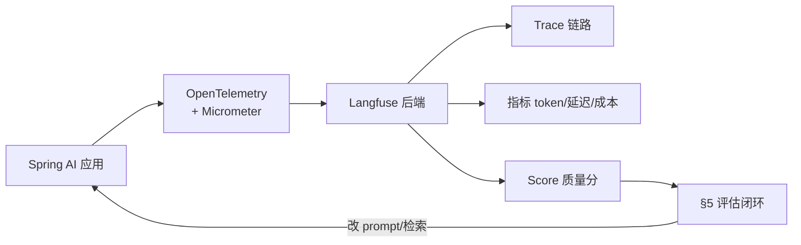
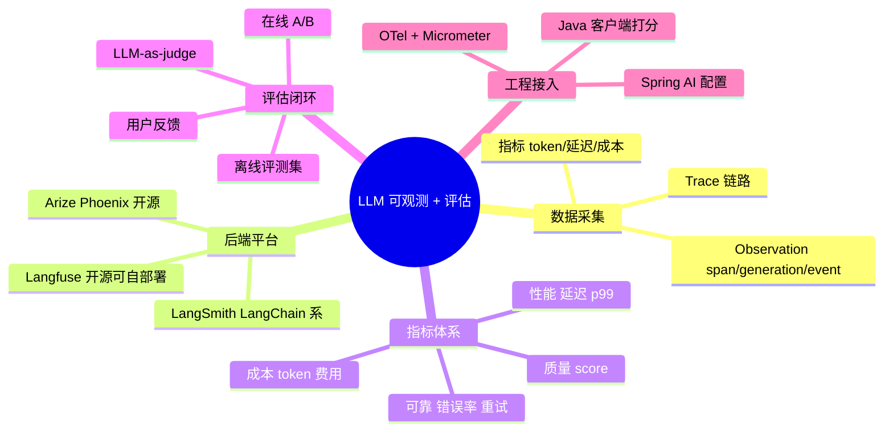
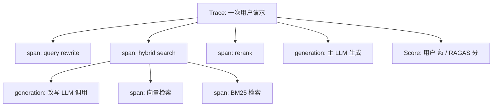
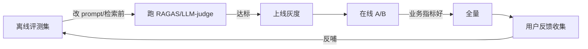

# LLM 可观测性与评估体系：让 Agent 可监控、可度量、可优化

> **文件编码**：UTF-8。代码基于 Spring AI 1.0.x + Spring Boot Actuator + Micrometer + OpenTelemetry。Langfuse Java 客户端为 0.0.x 早期版本，**API 可能变**，以 [官方集成文档](https://langfuse.com/integrations/frameworks/spring-ai) 为准。
>
> **前置**：先学 [02 Spring AI 核心](02-SpringAI核心开发.md)、[03 流式 SSE](03-流式对话与SSE实战.md)、[11 生产化与安全](11-生产化与安全.md)。本章讲「应用上线后怎么知道它跑得好不好」。

---

## 0. 读前导读：为什么需要这一章

### 0.1 用一句话弄懂本章

**传统监控看「请求慢不慢、错没错」**；LLM 可观测性还要看「**回答准不准、幻觉没幻觉、token 烧了多少、哪一步跑偏了**」——因为 LLM 应用的「错」是软错误，不是抛异常，传统监控看不见。

### 0.2 这一章解决什么真实痛点

| 痛点（你做 11 章生产化时大概率会遇到） | 本章小节 |
|----------------------------------------|----------|
| 上线后用户说「答得不对」，但你不知道是检索、改写还是生成的问题 | §3 Trace 链路 |
| 月底账单吓一跳，不知道 token 花哪了 | §4 指标体系 |
| 改了 prompt，感觉变好了，但没数据证明 | §5 评估闭环 |
| 一个 RAG 请求要经过 5 个步骤，出问题不知道卡在哪 | §3 + §6 |
| 面试官问「你的 Agent 上线后怎么监控」答不上 | 全章 |

### 0.3 本章学完你能做到

1. 说清 **LLM 可观测性与传统 APM 的 3 个区别**
2. 说清 **trace / observation / score** 三个 Langfuse 核心概念
3. 用 **OpenTelemetry + Micrometer** 把 Spring AI 应用接入 Langfuse，看到完整链路
4. 列出 **LLM 应用必看的 6 个指标**（延迟、token、成本、错误率、p99、质量分）
5. 设计 **「离线评测 + 在线 A/B + 用户反馈」三层评估体系**
6. 对比 **Langfuse / LangSmith / Arize Phoenix** 的选型差异

### 0.4 一张图看全章



### 0.5 学习姿势

- **§3 是核心**，先把 trace 跑通看到链路，后面指标才有载体
- **§5 是面试高频**，「怎么衡量 LLM 应用质量」几乎必问
- 本章代码偏配置，**必须亲手接一次 Langfuse**，光看不接等于没学

### 0.6 本章不讲什么

- 不讲 APM 通用知识（Prometheus/Grafana 基础见 [Java 12](../Java/12-高并发与分布式系统基础.md) 或运维方向）
- 不讲 Langfuse 自部署的运维细节（见官方 docker-compose）
- 不讲模型内部权重监控（那是算法岗）

### 0.7 难度与时长

- 难度：★★★★☆
- 建议时长：**1.5 个学习单元**
  - 单元 1：§1~§4，接通 Langfuse 看到自己的 trace
  - 单元 2：§5~§7，搭一个最小评估闭环

### 0.8 常见困惑

| 困惑 | 简短回答 |
|------|----------|
| 「我有 Prometheus 不就够了？」 | 不够。它看不见「这个回答有没有幻觉」，LLM 质量是软指标，要专门的 LLM 可观测平台 |
| 「Langfuse 不就是个 trace 看板？」 | 不止。它还能存 score、管 prompt 版本、做评测，是 LLM 专用工具 |
| 「接 OTel 会不会很重？」 | Spring Boot + Micrometer 已内置观察机制，加几个依赖和配置即可，侵入性低 |

---

## 1. 核心术语：先钉死

### 1.1 LLM 可观测性（LLM Observability）

- **定义**：对 LLM 应用的**调用链路、输入输出、token 消耗、质量评分**做全量采集、存储、分析的能力。
- **和传统 APM 区别**：传统 APM 关注「请求慢不慢、错没错」（硬指标）；LLM 可观测性还要关注「回答准不准、有没有幻觉」（软指标，需要 LLM-as-judge 或人工评分）。

### 1.2 Trace（追踪）

- **定义**：一次用户请求经过的**完整链路**，由多个 observation 组成。
- **生活类比**：快递的完整物流轨迹——下单→揽收→中转→派送→签收，每一站是一个 observation。
- **在 LLM 应用**：一次 RAG 请求的 trace = query 改写 + 检索 + rerank + prompt 拼装 + LLM 生成，每步一个 observation。

### 1.3 Observation（观测点）

- **定义**：trace 里的一个步骤，有三种类型：
  - **span**：一段有起止时间的操作（如「检索」）
  - **generation**：一次 LLM 调用（含 prompt、completion、token、模型名）
  - **event**：瞬时事件（如「触发了降级」）
- **在 Langfuse**：observation 挂在 trace 下，有父子关系，形成树。

### 1.4 Score（评分）

- **定义**：对一个 trace 或 observation 打的质量分，类型有 Numeric / Categorical / Boolean。
- **来源**：① 用户反馈（👍👎）；② LLM-as-judge 自动评；③ 人工标注；④ 业务指标（如「是否人工接管」）。
- **作用**：把「软质量」变成可统计的数字，支撑评估闭环。

### 1.5 LLM-as-judge

- **定义**：用一个 LLM 给另一个 LLM 的输出打分。RAGAS 的 faithfulness 等就是这思路。
- **注意**：judge 模型一般用更强的模型，避免「弱评强」失真。

---

## 2. 知识地图



---

## 3. Trace 链路：看清楚每一步

### 3.1 为什么需要 trace

一个生产 RAG 请求可能经过：`query rewrite → hybrid search → rerank → prompt build → LLM → post-process`。出问题时，光看「最终答案不对」无法定位是哪一步坏的。**trace 把每一步的输入、输出、耗时都记下来，能精确归因。**

### 3.2 Langfuse 的 trace 模型



- 一个 trace 下挂多个 observation，observation 可嵌套（树形）。
- `generation` 类 observation 记 token、模型名、prompt、completion——**这是成本和质量分析的根**。
- Score 挂在 trace 上，可事后补打。

### 3.3 Spring AI 接入 Langfuse（OTel 方式，推荐）

Spring AI 自带 Micrometer observation 钩子，通过 OpenTelemetry 导出 trace 到 Langfuse 的 OTLP 端点。**这是官方推荐方式**（[Langfuse Spring AI 集成文档](https://langfuse.com/integrations/frameworks/spring-ai)）。

#### 3.3.1 加依赖

```xml
<!-- Spring Boot Actuator：启用 Micrometer observation -->
<dependency>
  <groupId>org.springframework.boot</groupId>
  <artifactId>spring-boot-starter-actuator</artifactId>
</dependency>
<!-- Micrometer tracing + OpenTelemetry 导出 -->
<dependency>
  <groupId>io.micrometer</groupId>
  <artifactId>micrometer-tracing-bridge-otel</artifactId>
</dependency>
<dependency>
  <groupId>io.opentelemetry</groupId>
  <artifactId>opentelemetry-exporter-otlp</artifactId>
</dependency>
```

#### 3.3.2 配置 application.yml

```yaml
spring:
  ai:
    chat:
      observer:
        register: true              # 启用 Spring AI 的 observation
    model:
      chat:
        log-prompt: true            # 记录 prompt 到 observation 上下文
        log-completion: true        # 记录 completion
  threads:
    virtual:
      enabled: true

management:
  tracing:
    sampling:
      probability: 1.0              # 开发期 100% 采样；生产按需调低
  observations:
    annotations:
      enabled: true
    enable:
      http.server.requests: false   # 抑制重复 HTTP span
      http.client.requests: false

otel:
  exporter:
    otlp:
      endpoint: ${LANGFUSE_OTEL_ENDPOINT}   # 如 https://cloud.langfuse.com/api/public/otel
  resource:
    attributes:
      service.name: agent-demo
  # Langfuse 用 Basic Auth：public key 当用户名、secret key 当密码
  # 通过环境变量注入，不硬编码
```

> **逐行**：
> - `log-prompt`/`log-completion`：让 Spring AI 把 prompt 和 completion 放进 observation 上下文。**不加这俩，Langfuse 里 generation 的 input/output 是 null**。
> - `sampling.probability: 1.0`：开发期全采样；生产环境 LLM 调用频次低，常用 0.1~1.0。
> - `http.server/client.requests: false`：抑制 Micrometer 和 OTel 各自产生的重复 HTTP span，避免 trace 噪声。
> - **认证**：Langfuse OTLP 端点用 Basic Auth，public key 当用户名、secret key 当密码。通过环境变量 `LANGFUSE_PUBLIC_KEY` / `LANGFUSE_SECRET_KEY` 注入，**不要写进代码**。

#### 3.3.3 凭证怎么传

OTLP exporter 的 Basic Auth 通常通过环境变量或 `otel.exporter.otlp.headers` 注入：

```yaml
otel:
  exporter:
    otlp:
      endpoint: https://cloud.langfuse.com/api/public/otel
      protocol: http/protobuf
      headers:
        Authorization: "Basic ${base64(LANGFUSE_PUBLIC_KEY:LANGFUSE_SECRET_KEY)}"
```

> 不同 OTel exporter 版本写法略有差异，**以你 OTel 版本和 Langfuse 文档为准**。本地起 Langfuse 时 endpoint 换成 `http://localhost:3000/api/public/otel`。

### 3.4 用 Java 客户端打 score

trace 自动采集后，还要打质量分。Langfuse 有 Java 客户端（`com.langfuse:langfuse-java`，[发布说明](https://langfuse.com/changelog/2025-03-03-langfuse-java-client)）：

```xml
<dependency>
  <groupId>com.langfuse</groupId>
  <artifactId>langfuse-java</artifactId>
  <version>0.0.1-SNAPSHOT</version>
</dependency>
```

> **注意**：该客户端托管在 GitHub Package Registry，pom 里要加对应的 `<repositories>`（见发布说明）。版本是早期 0.0.x，**API 可能变**。

```java
@Service
public class FeedbackService {

    private final LangfuseClient langfuse;

    public FeedbackService(LangfuseClient langfuse) {
        this.langfuse = langfuse;
    }

    public void thumbsUp(String traceId) {
        // 打一个 Boolean score：1.0 = 满意
        langfuse.scores().create(ScoreCreateParams.builder()
            .traceId(traceId)
            .name("user_satisfaction")
            .value(1.0)
            .dataType(ScoreCreateParams.DataType.NUMERIC)
            .comment("用户点赞")
            .build());
    }
}
```

> **逐行**：
> - `traceId`：从 trace 上下文拿到当前请求的 trace id，把 score 关联到这次请求。
> - `dataType`：Numeric / Categorical / Boolean。Boolean 用 1.0/0.0 表示。
> - **score 可事后补打**：trace 先创建，score 后面异步补，不强求同一次请求里完成。

### 3.5 怎么拿到 traceId 关联 score

Spring AI 走 OTel 后，当前 trace id 在 MDC 里。可这样取：

```java
String traceId = MDC.get("traceId");   // Micrometer tracing 注入 MDC
```

> 不同配置下 key 可能是 `traceId` 或 `traceId`（OTel 风格）。以你 tracing 配置为准。取到后传给前端或存会话，用户点 👍 时带上。

---

## 4. 指标体系：LLM 应用必看的 6 个指标

### 4.1 性能类

| 指标 | 含义 | 为什么重要 | 告警阈值参考 |
|------|------|-----------|--------------|
| 首字延迟（TTFT） | 流式响应第一个字到达时间 | 用户体感「卡不卡」 | p99 < 2s |
| 总延迟 | 整个回答完成时间 | 影响吞吐 | p99 < 30s（视场景） |
| p99 延迟 | 99% 请求的延迟上限 | 长尾体验 | 看业务 SLA |

> **流式场景看 TTFT**（[03 SSE](03-流式对话与SSE实战.md) 已讲），非流式看总延迟。LLM 应用 p99 常被「重 prompt + 长 output」拉高，要单独监控。

### 4.2 成本类

| 指标 | 含义 | 为什么重要 |
|------|------|-----------|
| input tokens | 输入 token 数 | 决定大部分成本（prompt 越长越贵） |
| output tokens | 输出 token 数 | 生成 token 通常比输入贵 |
| 单次成本 | tokens × 单价 | 直接对应账单 |
| 日/月总成本 | 累计花费 | 防止失控 |

**Java 侧怎么取 token**：Spring AI 的 `ChatResponse.metadata().usage()` 含 `promptTokens` / `completionTokens` / `totalTokens`。落库或上报 Langfuse（generation observation 自动带）。

### 4.3 质量类

| 指标 | 来源 | 含义 |
|------|------|------|
| faithfulness | RAGAS / LLM-as-judge | 答案是否忠于上下文 |
| answer_relevancy | RAGAS | 是否切题 |
| user_satisfaction | 用户 👍👎 | 主观满意 |
| human_escalation_rate | 业务 | 客服场景「人工接管率」，越低越好 |

### 4.4 可靠性类

| 指标 | 含义 |
|------|------|
| 错误率 | 5xx / 超时 / Tool 执行失败占比 |
| 重试率 | 重试次数 / 总次数 |
| 降级触发率 | 走降级路径的占比 |

> **这 6 类指标要能挂在 trace 上**。Langfuse 里 generation observation 自带 token/延迟，score 挂质量，错误靠 observation 的 `level=ERROR` 事件。

### 4.5 一个监控看板的最小字段

```
trace_id | user_id | endpoint | status | latency_ms | ttft_ms |
input_tokens | output_tokens | cost | faithfulness | user_score | timestamp
```

> 这一行就是一次请求的全貌。Langfuse 看板把这些聚合可视化。

---

## 5. 评估闭环：离线 + 在线 + 反馈

### 5.1 三层评估



#### 5.1.1 离线评测（发布前）

- **评测集**：50~200 条「问题 + 标准答案 + 关键事实」（[13](13-RAG进阶-检索优化与评估.md) 已讲）。
- **跑分**：RAGAS 四指标 + 自定义业务指标（如「是否包含订单号」）。
- **门禁**：指标低于阈值不让上线，CI 里跑。

#### 5.1.2 在线 A/B（灰度期）

- 把流量分两组：A 组用旧 prompt/检索，B 组用新方案。
- 看业务指标：客服场景看「人工接管率」「满意度」「解决时长」；RAG 知识库看「用户 👍 率」「追问率」（追问多说明没答好）。
- **统计显著**：样本量足够再下结论（别 10 条就断言）。

#### 5.1.3 用户反馈（全量期）

- 每个回答带 👍👎 按钮，结果打 score 上报 Langfuse。
- 差评自动入库，定期 review 进评测集，**反哺离线评测**——闭环。

### 5.2 LLM-as-judge 在线打分

对线上 trace 抽样，用强模型自动评：

```java
@Service
public class OnlineJudgeService {

    private final ChatClient judgeClient;

    public OnlineJudgeService(ChatClient.Builder builder) {
        this.judgeClient = builder
            .defaultSystem("""
                你是质量评审员。根据 question、contexts、answer 评分。
                只输出 JSON：{"faithfulness": 0~1, "relevancy": 0~1, "reason": "..."}
                """)
            .build();
    }

    public void judgeAndScore(String traceId, String question,
                              String answer, List<String> contexts) {
        String result = judgeClient.prompt()
            .user("question: " + question + "\ncontexts: " + String.join("\n", contexts)
                  + "\nanswer: " + answer)
            .call()
            .content();
        // 解析 JSON，打分上报 Langfuse
        double faithfulness = parse(result, "faithfulness");
        langfuse.scores().create(ScoreCreateParams.builder()
            .traceId(traceId).name("faithfulness").value(faithfulness)
            .dataType(NUMERIC).build());
    }
}
```

> **逐行**：
> - judge 用独立 `ChatClient`（不同 system prompt），最好用更强模型。
> - 输出 JSON 便于解析。
> - **抽样打分**：别对每条线上请求都 judge（成本翻倍），按 1%~5% 抽样即可。

### 5.3 评估闭环的面试答法

被问「你怎么衡量 LLM 应用质量」时，**三层 + 一闭环**：

1. **离线**：评测集 + RAGAS，CI 门禁。
2. **在线**：A/B 看业务指标。
3. **反馈**：用户 👍👎 + 差评反哺评测集。
4. **闭环**：反馈→评测集→改方案→离线验证→再上线。

> 这套答法是大厂面试的标准答案，比「跑个准确率」高一个段位。

---

## 6. Langfuse / LangSmith / Arize Phoenix 对比

| 维度 | Langfuse | LangSmith | Arize Phoenix |
|------|----------|-----------|---------------|
| 开源 | ✅ MIT，可自部署 | ❌ 闭源（有免费层） | ✅ Apache 2.0，可自部署 |
| 语言生态 | 多语言（含 Java 客户端） | Python/JS 为主 | Python 为主，Java 弱 |
| Spring AI 集成 | 官方支持（OTel） | 弱（LangChain 系） | 弱 |
| Trace 模型 | trace/observation/score | run/chain | span/trace |
| 评估 | score + 评测集 | dataset + evaluator | eval 模块 |
| Prompt 管理 | 版本化 prompt 库 | prompt hub | 有 |
| 自部署 | docker-compose 一键 | 不支持 | docker 一键 |
| 适合 | **Java/Spring AI 主线首选** | LangChain Python 项目 | Python + 想要开源 |

**选型建议**：
- **Java/Spring AI 主线**：**Langfuse**（官方 Spring AI 集成 + Java 客户端 + 可自部署）。
- **纯 Python + LangChain**：LangSmith（生态原生）。
- **要开源 + Python**：Arize Phoenix。

> **面试加分**：能说出「按技术栈选，Java 选 Langfuse 因为有官方 Spring AI 集成」比无脑说「用 LangSmith」专业。

---

## 7. 实战：在 agent-demo 上接 Langfuse（最小可跑）

### 7.1 起一个本地 Langfuse

用官方 docker-compose（精简示意，**以官方仓库为准**）：

```yaml
# docker-compose.langfuse.yml（精简，完整版见 langfuse 官方仓库）
services:
  langfuse:
    image: langfuse/langfuse:latest
    ports: ["3000:3000"]
    environment:
      DATABASE_URL: postgresql://langfuse:langfuse@db:5432/langfuse
      NEXTAUTH_SECRET: change-me
      SALT: change-me
      NEXTAUTH_URL: http://localhost:3000
    depends_on: [db]
  db:
    image: postgres:16
    environment:
      POSTGRES_USER: langfuse
      POSTGRES_PASSWORD: langfuse
      POSTGRES_DB: langfuse
```

```bash
docker compose -f docker-compose.langfuse.yml up -d
# 访问 http://localhost:3000，注册账号，建 project，拿到 public/secret key
```

### 7.2 配 agent-demo

把 §3.3 的依赖和配置加进 agent-demo，环境变量填本地 Langfuse 的 key：

```bash
export LANGFUSE_OTEL_ENDPOINT=http://localhost:3000/api/public/otel
export LANGFUSE_PUBLIC_KEY=pk-lf-xxx
export LANGFUSE_SECRET_KEY=sk-lf-xxx
```

### 7.3 跑一次 RAG 请求

发一个 chat 请求，回 Langfuse 看板应能看到：
- 一个 trace
- 下挂若干 observation（检索 span、generation）
- generation 里有 prompt、completion、token 数、模型名、延迟

> **看到这条 trace 就算接通了**。后续所有指标和 score 都基于它。

### 7.4 加用户反馈

前端给每个回答加 👍👎，调 `FeedbackService`（§3.4）把 score 上报。看板里 trace 会出现 `user_satisfaction` 分。

---

## 8. 报错与踩坑表

| 现象/报错 | 原因 | 解决 |
|-----------|------|------|
| Langfuse 里 generation 的 input/output 是 null | 没开 `log-prompt`/`log-completion` 或没加 span attribute filter | 开启配置 + 按 [官方文档](https://langfuse.com/integrations/frameworks/spring-ai) 加 input/output filter |
| trace 没出现在 Langfuse | OTLP endpoint / 认证错 | 核对 endpoint 路径、Basic Auth 凭证、网络可达 |
| trace 噪声太多（一堆 HTTP span） | 没抑制重复 HTTP span | `management.observations.enable.http.*: false` |
| `langfuse-java` 拉不到 | 在 GitHub Package Registry | pom 加 `<repositories>` 指向 GitHub |
| token 数为 0 | 模型 API 没返回 usage | 换支持 usage 的模型；或自己估 token |
| score 关联不上 trace | traceId 不一致 | 确认从 MDC 取的 traceId 和 Langfuse 里的一致 |
| 成本看板对不上账单 | 多模型单价未配 | 在 Langfuse 配各模型单价 |

---

## 9. 常见困惑 FAQ

**Q1：为什么不用 ELK / Prometheus 监控 LLM 应用？**
A：它们能看延迟和错误（硬指标），但**看不见「回答有没有幻觉」这种软质量**。LLM 可观测平台把 trace、token、prompt 内容、质量分一起管，是 LLM 专用工具。生产里常**两者结合**：APM 管系统层，Langfuse 管 LLM 层。

**Q2：Langfuse 自部署稳吗？**
A：MIT 开源、docker-compose 部署、社区活跃。中小规模自部署没问题；大规模可买 Cloud。数据敏感的选自部署。

**Q3：采样率怎么定？**
A：开发期 100%（看全量）；生产期 LLM 调用频次低、成本敏感，常用 10%~100%。**质量评估要抽样**，不是全量 judge（贵）。

**Q4：LLM-as-judge 准吗？**
A：有偏差，但比没有强。技巧：① judge 用更强模型；② 多次 judge 取平均；③ 关键场景人工复核。**它是「大规模粗筛」工具，不是「精确评分」工具**。

**Q5：score 必须和 trace 同时打吗？**
A：不必。Langfuse 支持事后补打——trace 先创建，score 异步补，靠 traceId 关联。用户隔天反馈也能挂上。

**Q6：A/B 怎么分流量？**
A：按 userId hash 分组（同一用户始终一组，避免体验跳变），或按请求随机。**关键业务指标要统计显著**，别 20 条就下结论。

**Q7：评估集多久更新一次？**
A：定期（如每月）+ 触发式（线上差评涌入时）。**差评进评测集是闭环的关键**——否则离线指标永远「好看」，线上一直翻车。

**Q8：接 OTel 会不会影响性能？**
A：span 采集本身很轻；导出是异步批量，影响小。真正成本在「LLM-as-judge 抽样打分」那部分，靠采样率控制。

**Q9：Langfuse 和 RAGAS 什么关系？**
A：互补。RAGAS 是评估算法/库（算分），Langfuse 是平台（存 trace + 存 score + 看板）。**RAGAS 算的分可上报到 Langfuse 当 score**，统一看。

**Q10：Spring AI 的 observation 和 Micrometer 什么关系？**
A：Spring AI 用 Micrometer 的 observation API 暴露钩子；Micrometer tracing 桥接成 OTel span；OTel exporter 发给 Langfuse。链路是：Spring AI → Micrometer → OTel → Langfuse。

**Q11：没接 Langfuse 能不能做评估？**
A：能。自己落 trace 表 + 跑 RAGAS 脚本也能做，**但工程化程度低**。Langfuse 省去造轮子，且有看板和 prompt 管理。面试答「自己造也行但用现成平台更高效」。

**Q12：指标这么多，先看哪个？**
A：先看**成本（token）和错误率**（保命）；再看**延迟 p99**（体验）；最后看**质量 score**（优化）。一上来全看会乱。

---

## 10. 闭卷自测（10 题）

1. LLM 可观测性和传统 APM 的 3 个本质区别是什么？
2. Langfuse 的 trace / observation / score 各是什么？observation 的三种类型？
3. Spring AI 接 Langfuse 走什么协议？为什么不用 SDK 直连？
4. 为什么必须开 `log-prompt`/`log-completion`？不开会怎样？
5. LLM 应用必看的 6 类指标是什么？质量类为什么不能只靠系统指标？
6. 评估闭环的三层是什么？差评怎么反哺？
7. LLM-as-judge 的 2 个注意点是什么？
8. Langfuse / LangSmith / Phoenix 怎么选？Java 主线为什么选 Langfuse？
9. 在线 A/B 为什么不能 10 条就下结论？要考虑什么？
10. score 必须和 trace 同步打吗？为什么？

> 做对 8 题以上过关；不到 6 题重读 §3 和 §5。

---

## 11. 费曼检验：讲给空气听

合上文档，向一个**做过传统后端监控但没接触过 LLM** 的运维同事讲 3 分钟：

1. 为什么 Prometheus 不够（软质量指标）
2. trace/observation/score 三件套（用快递物流类比）
3. Spring AI 怎么接 Langfuse（OTel + Micrometer 那条链）
4. 评估闭环三层（离线/在线/反馈）

---

## 12. 进阶档练习

1. **接通 Langfuse**：按 §7 在 agent-demo 上接本地 Langfuse，跑一次 RAG 看到 trace。
2. **加反馈按钮**：前端加 👍👎，后端用 `FeedbackService` 打 score，看板看到 `user_satisfaction`。
3. **token 看板**：从 `ChatResponse.metadata().usage()` 取 token 落库，画一张日成本图。
4. **LLM-as-judge**：按 §5.2 对线上 trace 1% 抽样自动评 faithfulness，上报 score。
5. **闭环**：把 5 条差评写进评测集，跑 RAGAS 验证「确实低分」，改 prompt 后再跑看是否涨分。

---

## 13. 交叉引用

- RAG 评估指标：[13 RAG 进阶](13-RAG进阶-检索优化与评估.md) §7
- Agent trace：[14 Agent 进阶](14-Agent进阶-多智能体与长程任务.md) §7
- 限流/成本控制：[11 生产化与安全](11-生产化与安全.md)
- SSE 流式延迟监控：[03 流式对话与 SSE](03-流式对话与SSE实战.md)
- Spring AI 观察机制：[02 Spring AI 核心](02-SpringAI核心开发.md)
- Langfuse Spring AI 集成：https://langfuse.com/integrations/frameworks/spring-ai
- Langfuse Java 客户端：https://github.com/langfuse/langfuse-java
- OpenTelemetry Java：https://opentelemetry.io/docs/languages/java/
- RAGAS：https://github.com/explodinggradients/ragas
