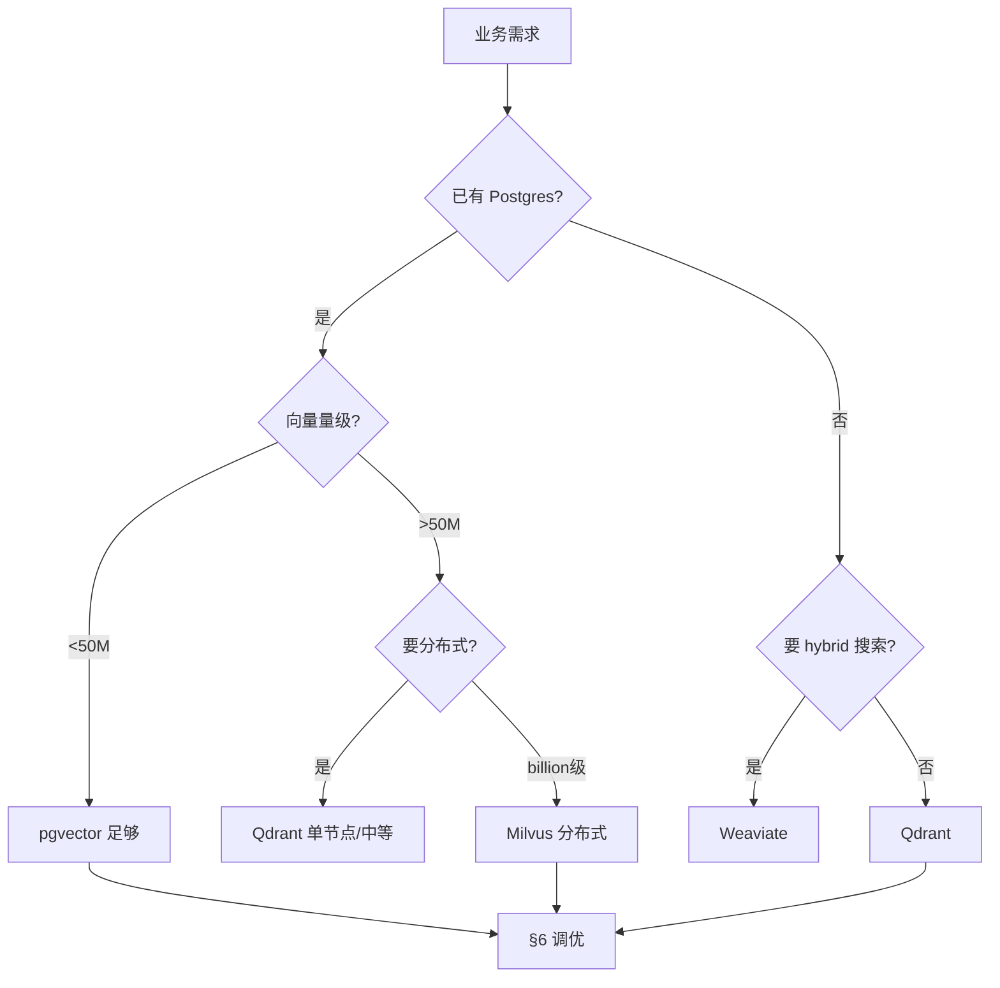
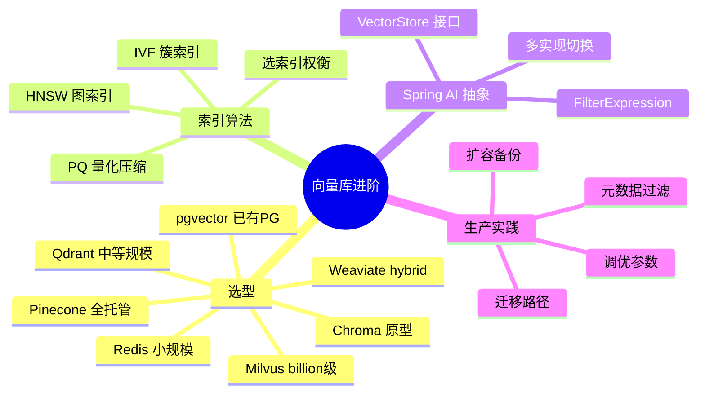
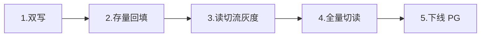

# 向量库选型与进阶：从 PGVector 到 Milvus/Qdrant

> **文件编码**：UTF-8。代码基于 Spring AI 1.0.x `VectorStore` 抽象。各库版本以 2025-2026 主流版本为准，性能数字来自社区基准，**选型前务必用你自己的数据复测**。
>
> **前置**：先学 [07 向量数据库与知识库实战](07-向量数据库与知识库实战.md)（PGVector 落地）、[13 RAG 进阶](13-RAG进阶-检索优化与评估.md)。本章讲「为什么 07 用了 PGVector、什么时候该换、换成什么」。

---

## 0. 读前导读：为什么需要这一章

### 0.1 用一句话弄懂本章

**07 章用 PGVector 起步是对的**（已有 Postgres 零成本）；但当数据量到千万级、过滤复杂、延迟要求严时，**专业向量库（Qdrant / Milvus / Weaviate）才扛得住**——本章讲怎么判断「该不该换」、换哪个、怎么换。

### 0.2 这一章解决什么真实痛点

| 痛点（你做 07 上线后可能遇到） | 本章小节 |
|----------------------------------------|----------|
| 知识库涨到 500 万条，PGVector p99 延迟从 50ms 涨到 500ms | §3 选型 + §6 调优 |
| 要按「部门 + 权限」过滤后再检索，PGVector 过滤慢 | §5 元数据过滤 |
| 面试官问「你为什么选 PGVector 不选 Milvus」答不出权衡 | §3 + §4 |
| 被问「HNSW 是什么、为什么快」卡壳 | §4 索引算法 |
| 想从 PGVector 迁到 Qdrant，不知从何下手 | §7 迁移 |

### 0.3 本章学完你能做到

1. 说清 **7 种向量库**（pgvector/Qdrant/Weaviate/Milvus/Pinecone/Chroma/Redis）的定位和适用规模
2. 用一张**决策树**为给定场景选型，并说出权衡理由
3. 解释 **HNSW / IVF / PQ** 三种索引的原理和取舍
4. 用 Spring AI `VectorStore` 抽象写**与库无关**的检索代码，换库只改配置
5. 说清**元数据过滤**为什么是向量库的硬指标，各库实现差异
6. 描述从 PGVector 迁到 Qdrant/Milvus 的步骤和坑

### 0.4 一张图看全章



### 0.5 学习姿势

- **§3 选型是面试核心**，先吃透权衡逻辑
- **§4 索引算法**是「深挖点」，能讲 HNSW 比只会调 API 高一档
- 本章代码偏配置，**至少跑一次「Spring AI 切换 VectorStore 实现」**体会抽象的价值

### 0.6 本章不讲什么

- 不讲自己实现向量索引（那是数据库内核开发）
- 不讲 GPU 加速索引细节（CAGRA 等，属进阶算法方向）
- 不讲全托管商业库的采购对比（Pinecone 价格随时间变）

### 0.7 难度与时长

- 难度：★★★★☆
- 建议时长：**1.5 个学习单元**
  - 单元 1：§1~§4（选型 + 索引原理）
  - 单元 2：§5~§7（过滤 + 调优 + 迁移）

### 0.8 常见困惑

| 困惑 | 简短回答 |
|------|----------|
| 「07 用了 PGVector，是不是我选错了？」 | 没错。起步用 PGVector 是最佳实践；**该不该换看规模** |
| 「Milvus 最强，直接上不就行了？」 | 不行。<100M 向量用 Milvus 是「杀鸡用牛刀」，运维成本不值 |
| 「HNSW 我不懂原理能用吗？」 | 能，库都封装好了。但面试会问原理，§4 给你最小够用解释 |
| 「Redis 也能存向量，和 PGVector 啥区别？」 | Redis 快但容量小、功能少；适合「小规模 + 已用 Redis」 |

---

## 1. 核心术语：先钉死

### 1.1 向量库（Vector Database）

- **定义**：专门存储、索引、检索高维向量的数据库，核心操作是「给一个 query 向量，找最相似的 top-k」。
- **和关系库区别**：关系库按精确值查；向量库按**相似度**查（近似最近邻 ANN）。

### 1.2 ANN（Approximate Nearest Neighbor，近似最近邻）

- **定义**：不追求找到「绝对最近的 k 个」（精确算全库太慢），而是**快速找到大概率最近的 k 个**，用少量精度换巨大速度。
- **为什么必须近似**：1 亿向量精确比对要 1 亿次距离计算，秒级不可接受。ANN 把它压到毫秒级。

### 1.3 HNSW（Hierarchical Navigable Small World）

- **定义**：一种 ANN 索引算法，把向量组织成**多层图**，上层稀疏下层稠密，检索时从上层快速定位再逐层细化。
- **生活类比**：查地图——先看全国图定位到省，再看省图定位到市，再看市图定位到街。**先粗后细**，比一上来就翻街道图快。
- **特点**：查询快、召回高，但**内存占用大**、构建慢。主流向量库默认索引。

### 1.4 IVF（Inverted File）

- **定义**：把向量空间用 k-means 聚成 N 个簇，检索时只查 query 最近的几个簇，不扫全库。
- **生活类比**：图书馆按主题分区，找「历史」只去历史区，不去所有书架。
- **特点**：内存省、构建快，但**召回略低于 HNSW**，需调 `nprobe`（查几个簇）。

### 1.5 PQ（Product Quantization，乘积量化）

- **定义**：把高维向量切成多段，每段单独量化压缩，用编码代替原向量存储和计算。
- **生活类比**：把 1024 维向量像「分块压缩」一样存成短码，牺牲精度换内存。
- **特点**：内存极省，但**精度损失**。常和 IVF 组合成 IVF_PQ。

### 1.6 元数据过滤（Metadata Filtering）

- **定义**：在向量检索前/后，按元数据（如 `dept=技术`、`level=公开`）过滤，只检索符合条件的子集。
- **为什么重要**：企业 RAG 几乎都要按权限/部门/时间过滤，**没这能力的库基本不能用**。

---

## 2. 知识地图



---

## 3. 七种向量库对比与选型

### 3.1 全景对比表

| 库 | 实现语言 | 适用规模 | 强项 | 弱点 | 自托管 | Spring AI 支持 |
|----|----------|----------|------|------|--------|----------------|
| **pgvector** | C(PG扩展) | <50M | 已有PG零成本、SQL join、事务 | >50M性能降、单机 | ✅ | ✅ |
| **Qdrant** | Rust | <100M(单节点) | 低延迟、filtered search强、单容器部署 | 大规模需分片集群 | ✅(单容器) | ✅ |
| **Weaviate** | Go | <200M | hybrid(BM25+向量)原生、内置vectorizer | 调参复杂、内存高 | ✅ | ✅ |
| **Milvus** | Go/C++ | billion级 | 分布式、K8s原生、多索引、GPU | 运维重、<100M不值 | ✅(K8s) | ✅ |
| **Pinecone** | 托管 | 任意 | 零运维、SLA、自动扩容 | 贵、非开源、数据出境 | ❌ | ✅ |
| **Chroma** | Python | <1M原型 | 极简、Python原生 | 生产弱、无分布式 | ✅ | ✅ |
| **Redis** | C | <10M | 极低延迟、已有Redis零成本 | 容量受内存限、功能少 | ✅ | ✅ |

> 性能数字（参考社区 2025-2026 基准，**选型前用你数据复测**）：
> - Qdrant 1.x：100M 向量 p99 ~18ms，filtered recall@10 ~0.97
> - Milvus 2.x：100M 向量 p99 ~25ms，500M 需 GPU 节点
> - pgvector 0.7+ HNSW：50M 向量 p99 ~58ms，>50M 不推荐

### 3.2 选型决策树

```
1. 已有 Postgres 吗？
   是 → 向量量级 < 50M？
        是 → ✅ pgvector（零成本起步，本仓库 07 章方案）
        否 → 走 2
   否 → 走 2

2. 向量量级？
   < 1M 原型 → ✅ Chroma（最快上手）
   < 10M 且已有 Redis → ✅ Redis（复用基建）
   < 100M 中等 → 走 3
   >= 100M ~ billion → 走 4

3. 要 hybrid（BM25+向量）搜索吗？
   是 → ✅ Weaviate（原生支持，省胶水代码）
   否 → ✅ Qdrant（低延迟、filtered search 强、单容器省心）

4. 有运维团队 + K8s 吗？
   是 → ✅ Milvus（分布式扛 billion）
   否 → ✅ Pinecone（全托管，花钱省事）或 Qdrant 集群
```

### 3.3 三句话口诀

- **已有 PG + 中小规模** → pgvector，别折腾。
- **新项目中等规模** → Qdrant（纯向量）或 Weaviate（要 hybrid）。
- **billion 级 + 有运维** → Milvus；**要零运维 + 愿付费** → Pinecone。

> **面试加分**：被问「你为什么选 X」时，**永远从「规模 / 已有基建 / 运维能力 / 成本」四条说**，不要只说「X 性能好」。性能数字会变，权衡逻辑不会。

---

## 4. 索引算法深挖（面试深挖点）

### 4.1 为什么不能暴力扫

1000 万 × 1024 维向量，精确算余弦要 1000 万次 1024 维运算，秒级。生产要毫秒级，**必须用 ANN 牺牲一点精度换速度**。

### 4.2 HNSW 详解（主流默认）

#### 4.2.1 核心思想

把向量建成**多层导航图**：
- 第 0 层：所有向量，图最稠密
- 第 1 层：约一半向量，更稀疏
- 第 L 层：少数「枢纽」向量，最稀疏

检索时从最高层最稀疏的图开始，**快速跳到目标附近**，逐层下降到第 0 层精细化。

#### 4.2.2 关键参数

| 参数 | 含义 | 调大影响 |
|------|------|----------|
| `M` | 每个节点的邻居数 | 召升高、内存涨、构建慢 |
| `ef_construction` | 构建时候选队列大小 | 索引质量好、构建慢 |
| `ef_search` | 检索时候选队列大小 | 召回高、查询慢 |

> **调参口诀**：召回不够加 `ef_search`；内存紧降 `M`；构建慢降 `ef_construction`。**生产常见 `M=16, ef_construction=128, ef_search=64`**。

#### 4.2.3 为什么快

上层图稀疏，几跳就能跨越大范围；下层逐步精化。类似「先坐高铁跨省，再坐地铁到站，最后步行到门」——**分层加速**。

#### 4.2.4 代价

- **内存大**：图结构要常驻内存，向量本身也不压缩。
- **构建慢**：插入要更新多层图。
- **不适合频繁删改**：图结构变更成本高。

### 4.3 IVF 详解

#### 4.3.1 核心思想

用 k-means 把向量聚成 N 个簇，每个簇一个中心点。检索时算 query 到各中心距离，只查最近的 `nprobe` 个簇。

#### 4.3.2 关键参数

| 参数 | 含义 |
|------|------|
| `nlist` | 簇数（构建时定） |
| `nprobe` | 检索时查几个簇 |

> `nprobe` 调大：召回高、查询慢。**生产常见 `nlist=4096, nprobe=16~64`**。

#### 4.3.3 vs HNSW

| 维度 | HNSW | IVF |
|------|------|-----|
| 召回 | 高 | 中 |
| 查询速度 | 快 | 中 |
| 内存 | 大 | 小 |
| 构建 | 慢 | 快 |
| 适合 | 查询为主、内存够 | 内存紧、批量建 |

### 4.4 PQ 详解

#### 4.4.1 核心思想

把 D 维向量切成 M 段，每段独立用 k-means 量化成 1 个编码（如 8bit）。原向量存成 M 个字节的编码，**内存压到 1/16 ~ 1/32**。

#### 4.4.2 代价

精度损失：量化有误差，距离计算是近似。**常和 IVF 组合 IVF_PQ**：先 IVF 粗筛，再 PQ 算距离，内存极省。

### 4.5 索引选型速查

```
内存够 + 要最高召回 → HNSW
内存紧 + 可接受中召回 → IVF
海量数据 + 内存极紧 → IVF_PQ
频繁增删改 → IVF（HNSW 改图贵）
```

> **面试必答**：被问「你的向量库用什么索引、为什么」时，答 HNSW + 给出 `M/ef_construction/ef_search` 的取舍，再补一句「内存紧时切 IVF_PQ」——这就比只会说「用默认」强。

---

## 5. Spring AI VectorStore 抽象：换库只改配置

### 5.1 抽象的价值

Spring AI 提供 `VectorStore` 接口，各库有实现（`PgVectorStore`、`QdrantVectorStore`、`MilvusVectorStore`、`RedisVectorStore` 等）。**业务代码面向接口，换库只换 Bean 配置**。

### 5.2 接口核心方法

```java
public interface VectorStore {
    void add(List<Document> documents);
    void delete(List<String> idList);
    List<Document> similaritySearch(SearchRequest request);
    // ...
}
```

> **业务代码只调 `add` / `similaritySearch`，不知道底层是 PG 还是 Qdrant**。这是 07 章你用 PGVector 能平滑迁移的根本原因。

### 5.3 切换示例：PGVector → Qdrant

**PGVector 配置**（07 章已在用）：

```yaml
spring:
  ai:
    vectorstore:
      pgvector:
        index-type: hnsw
        distance: cosine
        dimensions: 1024
```

**换 Qdrant**（改配置 + 换依赖）：

```xml
<dependency>
  <groupId>org.springframework.ai</groupId>
  <artifactId>spring-ai-qdrant-store-spring-boot-starter</artifactId>
</dependency>
<!-- 移除 pgvector starter -->
```

```yaml
spring:
  ai:
    vectorstore:
      qdrant:
        host: localhost
        port: 6334
        collection-name: kb_docs
        use-tls: false
        initialize-schema: true
```

> **逐行**：
> - 换依赖：把 `pgvector` starter 换成 `qdrant` starter（依赖名以 Spring AI 版本为准）。
> - `initialize-schema: true`：启动时自动建 collection。
> - **业务代码一行不改**——`VectorStore` 注入的还是同一个接口。

> ⚠️ **版本提醒**：各 starter 的 artifactId、配置 key 在 Spring AI 不同小版本有差异，**以你 pom 版本的官方文档为准**。

### 5.4 元数据过滤（FilterExpression）

企业 RAG 几乎都要按权限/部门过滤。Spring AI 用 `FilterExpression`：

```java
List<Document> hits = vectorStore.similaritySearch(
    SearchRequest.builder()
        .query(userQuery)
        .topK(10)
        .filterExpression("dept == '技术' && level == '公开'")
        .build());
```

**各库支持差异**：

| 库 | 过滤能力 | 备注 |
|----|----------|------|
| Qdrant | 强（原生 payload 过滤，filtered search 是卖点） | 过滤性能好 |
| Milvus | 强（标量字段过滤） | 支持 |
| Weaviate | 强（where 过滤） | 支持 |
| pgvector | 中（转 SQL where，能做但大表慢） | 复合过滤需加索引 |
| Redis | 中 | 支持但功能少 |
| Chroma | 基本 | where 简化版 |

> **面试加分**：「Qdrant 的 filtered search 是它相对 PGVector 的关键优势——PGVector 过滤是先 ANN 再 SQL where，召回的 top-k 里可能大半被过滤掉，实际返回不足；Qdrant 是过滤和检索融合，保证过滤后仍满 k 条。」这是「filtered search」深挖点。

---

## 6. 生产实践：调优、扩容、备份

### 6.1 调优清单

| 症状 | 调什么 |
|------|--------|
| 召回低（context_recall 低） | 加 `ef_search` / `nprobe` / `top_k`；检查 embedding 模型质量 |
| 查询慢 | 降 `ef_search`；加索引；检查是否全表扫 |
| 内存涨爆 | 换 IVF_PQ；分片；冷热分离 |
| 写入慢 | 降 `ef_construction`；批量写；关构建期同步 |
| 过滤后结果少 | 换支持 filtered search 的库；或预过滤建子集合 |

### 6.2 扩容路径

```
单机 PGVector → 单机扛不住
  ↓
单节点 Qdrant（垂直扩，加内存） → 单节点扛不住
  ↓
Qdrant 集群（分片） / 或迁 Milvus（分布式）
  ↓
billion 级 → Milvus + K8s + GPU
```

> **渐进扩容**，别一上来就 Milvus。每一步都要**先压测再迁**。

### 6.3 备份与高可用

| 库 | 备份方式 | 高可用 |
|----|----------|--------|
| pgvector | PG 标准备份（pg_dump / 流复制） | PG 主从 |
| Qdrant | 快照（snapshot API） | 集群分片 + 副本 |
| Milvus | etcd + S3 备份 | K8s 多副本 |
| Redis | RDB / AOF | 主从 + 哨兵 |

> **向量索引重建很贵**，备份要包含索引本身，不是只存原始向量。

### 6.4 监控指标

```
- 查询延迟 p50/p99
- 召回率（抽样用 ground truth 验）
- 内存占用
- 写入吞吐
- 过滤命中率（过滤后剩余比例）
- 索引构建进度
```

> 接 [15 LLM 可观测性](15-LLM可观测性与评估体系.md)：把检索延迟、召回质量作为 trace 的一部分。

---

## 7. 迁移实战：PGVector → Qdrant

### 7.1 迁移步骤



1. **双写**：写入时同时写 PGVector 和 Qdrant（用 Spring AI 的 `VectorStore` 抽象，写两个 bean）。
2. **存量回填**：写脚本把 PGVector 全量数据读出，写入 Qdrant。
3. **读切流灰度**：10% 流量读 Qdrant，对比结果一致性（用 [13](13-RAG进阶-检索优化与评估.md) 的评测集）。
4. **全量切读**：灰度无问题后，100% 读 Qdrant。
5. **下线 PG**：观察一段时间稳定后，停止双写，下线 PGVector。

### 7.2 迁移代码骨架

```java
@Service
public class DualWriteVectorService {

    private final VectorStore primary;   // PGVector
    private final VectorStore secondary; // Qdrant

    public void add(List<Document> docs) {
        primary.add(docs);
        try {
            secondary.add(docs);     // 双写，secondary 失败不阻断主流程
        } catch (Exception e) {
            log.warn("双写 Qdrant 失败，记补偿队列", e);
            compensationQueue.push(docs);
        }
    }

    public List<Document> search(SearchRequest req, boolean useSecondary) {
        // 灰度开关决定读哪个
        return useSecondary ? secondary.similaritySearch(req)
                            : primary.similaritySearch(req);
    }
}
```

> **逐行**：
> - 双写时**主库失败要阻断**，从库失败只告警 + 补偿，**保证主流程不被新库拖累**。
> - 灰度开关 `useSecondary`：从配置中心读，动态切流量。
> - 补偿队列：双写从库失败时存起来重试，**保证最终一致**。

### 7.3 一致性校验

迁移期要验证两库结果一致：

```java
public void verifyConsistency(String query, int topK) {
    List<Document> a = primary.similaritySearch(SearchRequest.builder().query(query).topK(topK).build());
    List<Document> b = secondary.similaritySearch(SearchRequest.builder().query(query).topK(topK).build());
    double overlap = jaccardSimilarity(
        a.stream().map(Document::getId).collect(toSet()),
        b.stream().map(Document::getId).collect(toSet()));
    if (overlap < 0.8) log.warn("两库结果差异大，overlap={}", overlap);
}
```

> **逐行**：用 Jaccard 相似度比两库 top-k 的 id 集合重合度。**完全一致不现实**（索引参数不同会有微差），>0.8 算可接受。低于阈值要查原因（embedding 一致吗？维度一致吗？过滤一致吗？）。

---

## 8. 报错与踩坑表

| 现象/报错 | 原因 | 解决 |
|-----------|------|------|
| PGVector p99 突增 | 数据量过 50M / HNSW 索引未建 | 加 `hnsw` 索引；或迁 Qdrant |
| Qdrant filtered 后结果不足 | 过滤条件太严 | 放宽过滤；或增大 topK 初检 |
| Milvus 部署复杂起不来 | K8s 依赖多 | 用 Milvus Lite（单机版）起步 |
| Spring AI 切库后维度不匹配 | 新库 collection 维度 ≠ embedding 维度 | 建库时指定正确 `dimensions` |
| HNSW 内存爆 | `M`/`ef_construction` 过大 | 降参数；或换 IVF_PQ |
| 双写时主库被从库拖慢 | 同步双写 | 从库异步写 + 补偿队列 |
| 迁移后召回变了 | 两库索引参数 / 距离度量不同 | 对齐 `distance`（cosine/dot/l2）和索引参数 |
| 写入吞吐低 | 逐条写 + 实时建索引 | 批量写；或用无索引表先灌再建索引 |

---

## 9. 常见困惑 FAQ

**Q1：07 章用 PGVector 是不是错了，要返工？**
A：没错。**起步用 PGVector 是行业共识**——已有 PG、零运维成本、SQL join 能力。<50M 向量它完全够。返工只发生在「规模超了」时，而且因为用了 Spring AI `VectorStore` 抽象，迁移成本可控。

**Q2：HNSW 内存那么大，为什么还是默认？**
A：因为**查询快、召回高**，这两个在生产里最关键。内存成本用「垂直扩内存」解决，比「召回低导致 RAG 答错」便宜。内存真紧才换 IVF_PQ。

**Q3：Qdrant 单节点能扛多少？**
A：社区基准约 100M 向量（768 维）单节点可用，p99 ~18ms。再大就分片集群。

**Q4：Milvus 那么强为什么不都用？**
A：**运维成本**。Milvus 是分布式 K8s 原生，要 etcd + MinIO + 多组件，<100M 向量用它是「大炮打蚊子」，运维得不偿失。

**Q5：Pinecone 既然零运维，公司为啥不直接买？**
A：① 成本（量大后贵）；② 数据出境合规（国内业务常要求自托管）；③ 闭源锁定。**有钱 + 不敏感 + 要快上线**才选它。

**Q6：元数据过滤为什么是硬指标？**
A：企业 RAG 几乎都按权限/部门/时间过滤。PGVector 的过滤是「ANN 出 top-k 再 SQL where」，可能过滤完剩 0 条；Qdrant 等支持「过滤融合检索」，保证过滤后仍满 k 条。**这是企业场景选 Qdrant 而非 PGVector 的核心理由**。

**Q7：embedding 维度变了怎么办？**
A：维度是 collection 级不可变。换 embedding 模型（维度变）必须**重建 collection**——全量重新 embedding 入库。所以选 embedding 模型要慎重，别频繁换。

**Q8：HNSW 的 ef_search 调多大合适？**
A：从 64 起，用评测集看召回。召回够就停；不够加到 128/256。**别盲目调大**，查询会变慢。

**Q9：迁移时要停服吗？**
A：用双写 + 灰度切流（§7），**不停服**。核心是双写保证两库都有数据，灰度验证一致性后切读。

**Q10：Redis 存向量合适吗？**
A：小规模（<10M）+ 已用 Redis 时合适（复用基建、极低延迟）。大规模不合适——内存贵、功能少（过滤/索引弱）。

**Q11：向量库要单独部署还是和应用混部？**
A：**单独部署**。向量检索是 CPU/内存密集，混部会互相影响。Qdrant 单容器还好，Milvus 必须独立集群。

**Q12：冷热数据怎么处理？**
A：热数据留内存索引（HNSW），冷数据迁 IVF_PQ 或对象存储。**冷热分离**省内存。Milvus/Qdrant 都支持分区或分 collection 实现。

---

## 10. 闭卷自测（10 题）

1. pgvector / Qdrant / Weaviate / Milvus 各自的适用规模和强项是什么？
2. 已有 Postgres、向量 30M，选什么？为什么？
3. 新项目、100M 向量、要 hybrid 搜索，选什么？
4. HNSW 的三层思想是什么？用「地图」类比讲一遍。
5. HNSW 的 `M` / `ef_construction` / `ef_search` 各影响什么？
6. IVF 和 PQ 各解决什么问题？为什么常组合成 IVF_PQ？
7. Spring AI 的 `VectorStore` 抽象让换库成本降低到什么程度？业务代码要改吗？
8. 元数据过滤为什么 Qdrant 比 PGVector 强？企业场景意味着什么？
9. PGVector 迁 Qdrant 的 5 步是什么？为什么不能直接停服切？
10. 迁移时怎么验证两库结果一致？Jaccard 低于阈值说明什么？

> 做对 8 题以上过关；不到 6 题重读 §3 和 §4。

---

## 11. 费曼检验：讲给空气听

合上文档，向一个**会写 SQL 但没听过向量库**的后端同事讲 3 分钟：

1. 为什么不能用 SQL like 做语义检索（要算向量相似度）
2. ANN 为什么必须近似（全扫太慢）
3. HNSW 为什么快（多层图、先粗后细、地图类比）
4. 什么情况下该从 PGVector 换成 Qdrant/Milvus（规模 + 过滤 + 运维）

---

## 12. 进阶档练习

1. **决策练习**：给 3 个虚构业务场景（如「客服 FAQ 10万条」「法律知识库 500万条」「全网商品搜索 10亿条」），分别选库并说理由。
2. **切库实验**：在 07 章 demo 基础上，加 Qdrant starter，双 `VectorStore` bean，验证业务代码不改仍能跑。
3. **调参**：对同一批数据，`ef_search=32/64/128` 各跑一次，用 [13](13-RAG进阶-检索优化与评估.md) 评测集看召回变化。
4. **过滤对比**：PGVector vs Qdrant 各跑一次带过滤的检索，对比「过滤后剩余条数」，体会 filtered search 差异。
5. **迁移设计**：画一张 PGVector → Qdrant 的双写灰度迁移架构图，标出补偿队列和一致性校验位置。

---

## 13. 交叉引用

- 基础落地：[07 向量库与知识库实战](07-向量数据库与知识库实战.md)（PGVector）
- 检索优化：[13 RAG 进阶](13-RAG进阶-检索优化与评估.md)（混合检索/rerank）
- 可观测：[15 LLM 可观测性与评估体系](15-LLM可观测性与评估体系.md)
- Spring AI 核心：[02 Spring AI 核心开发](02-SpringAI核心开发.md)
- Redis 基础：[Java 07 Redis](../Java/07-Redis核心原理与缓存实战.md)
- Spring AI VectorStore 文档：https://docs.spring.io/spring-ai/reference/api/vectordbs.html
- Qdrant 文档：https://qdrant.tech/documentation/
- Milvus 文档：https://milvus.io/docs
- pgvector：https://github.com/pgvector/pgvector
- HNSW 论文：Malkov & Yashunin, "Efficient and robust approximate nearest neighbor search using HNSW"
