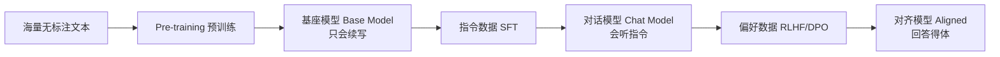

# LLM 原理与训练流程：大模型岗面试底层必修

> **文件编码**：UTF-8。本章面向「大模型岗 / AI 开发岗」面试，讲清 LLM 的底层原理与训练流程——Agent 工程岗用到的不多，但**大模型岗面试必问底层**。
>
> **前置**：先学 [01 大模型基础与 API](01-大模型基础与API调用入门.md)（Token/Prompt/API 应用层）。本章往下挖一层：模型内部结构和它怎么被训出来。
>
> **定位**：本章是「**面试能讲清原理**」的深度，不是「能复现论文」的深度。数学只到能说清直觉为止，不做完整推导。

---

## 0. 读前导读：为什么需要这一章

### 0.1 用一句话弄懂本章

**01 章教你「怎么调 API」**；本章教你「**API 背后那个模型是什么结构、怎么训出来的**」——大模型岗面试会从「你用过 Spring AI」一路问到「Transformer 的 Attention 怎么算、SFT 和 DPO 区别」，答不上底层就过不了。

### 0.2 这一章解决什么真实痛点

| 痛点（大模型岗面试常见） | 本章小节 |
|----------------------------------------|----------|
| 面试官问「讲讲 Transformer」只会背名词，讲不清 Attention | §3 |
| 问「GPT 和 BERT 区别」答成「一个生成一个理解」太浅 | §4 |
| 问「SFT、RLHF、DPO 啥关系」答乱 | §6 |
| 问「为什么上下文窗口不能无限长」卡壳 | §7 |
| 问「Tokenizer 是什么，中文为什么费 token」讲不清 | §5 |

### 0.3 本章学完你能做到

1. 用白话讲清 **Self-Attention 的 Q/K/V** 和「为什么需要它」
2. 区分 **Decoder-only / Encoder-only / Encoder-Decoder** 三种架构，说出代表模型和适用任务
3. 解释 **BPE Tokenizer** 为什么中文费 token、为什么不同模型 token 数不同
4. 画出 **Pre-training → SFT → RLHF/DPO** 训练流程，说清每步目标
5. 解释 **上下文窗口、注意力 O(n²) 复杂度、MoE、Scaling Law** 这些面试高频概念
6. 对每个概念说出「面试会怎么问、标准答法是什么」

### 0.4 一张图看全章

```mermaid
flowchart TB
    A[§2 为什么工程师要懂原理] --> B[§3 Transformer 结构]
    B --> B1[Self-Attention Q/K/V]
    B --> B2[Multi-Head]
    B --> B3[位置编码]
    B --> B4[FFN/LayerNorm]
    B --> C[§4 三种架构]
    C --> C1[Decoder-only GPT]
    C --> C2[Encoder-only BERT]
    C --> C3[Enc-Dec T5]
    A --> D[§5 Tokenizer BPE]
    A --> E[§6 训练流程]
    E --> E1[Pretrain 预测下一token]
    E --> E2[SFT 指令遵循]
    E --> E3[RLHF/DPO 对齐]
    B --> F[§7 关键概念<br/>上下文窗口/O(n²)/MoE/Scaling Law/涌现]
```

### 0.5 学习姿势

- **§3 Attention 是核心**，必须能白话讲清，不能背公式
- **§6 训练流程**是大模型岗高频，背下来流程图
- 本章**不用敲代码**（你不训练模型），但要能「讲」——费曼检验比自测更重要

### 0.6 本章不讲什么

- 不讲完整数学推导（那是算法研究员方向）
- 不讲从零实现 Transformer（工程岗不要求）
- 不讲分布式训练细节（数据并行/张量并行，进阶算法方向）
- 不讲 RLHF 的 PPO 数学（知道它是 RL 优化即可）

### 0.7 难度与时长

- 难度：★★★★☆（概念多，但不需数学基础）
- 建议时长：**1.5 个学习单元**
  - 单元 1：§2~§5（结构 + 架构 + Tokenizer），能白话讲 Attention
  - 单元 2：§6~§8（训练流程 + 关键概念），能背训练流程图

### 0.8 常见困惑

| 困惑 | 简短回答 |
|------|----------|
| 「我是 Java 工程师，学这些干嘛？」 | 大模型岗面试会问；且懂原理才能调好 prompt、选对模型、解释「为什么答错了」 |
| 「Transformer 数学很难吧？」 | 核心直觉很简单（§3 用图书馆类比），公式只是把直觉形式化 |
| 「训练流程我又不训练，记它干嘛？」 | 面试必问；且懂流程才知道「基座模型 vs 对话模型」区别，选模型不踩坑 |

---

## 1. 核心术语：先钉死

### 1.1 Transformer

- **定义**：2017 年 Google 提出的神经网络架构（《Attention is All You Need》），核心是用 **注意力机制** 替代之前的循环结构（RNN/LSTM），能并行、能看长距离依赖。**所有现代大模型都是 Transformer 或其变体**。
- **生活类比**：读一篇文章时，你不会逐字记前面（RNN 的做法），而是读到「它」时回头扫一遍找指代——Transformer 的注意力就是这种「按需回看」。

### 1.2 Self-Attention（自注意力）

- **定义**：序列里每个位置去看其他所有位置，算「该关注谁多一点」，加权聚合成自己的新表示。
- **关键三件套 Q/K/V**：Query（我在找什么）、Key（我能提供什么标签）、Value（我实际的内容）。

### 1.3 Token / Tokenizer

- **定义**：Tokenizer 把文本切成模型处理的最小单元 token；token 是模型的「词」。可能是整词、子词、甚至单字符。
- **为什么重要**：模型按 token 计费、按 token 算上下文长度。中文常 1 字 ≈ 1~2 token，英文 1 词 ≈ 1~1.5 token。

### 1.4 自回归（Autoregressive）

- **定义**：生成时**一个 token 一个 token 往后吐**，每次根据已生成的全部内容预测下一个。GPT 就是自回归。
- **代价**：不能并行生成（后面依赖前面），所以生成长文本慢。

### 1.5 对齐（Alignment）

- **定义**：让模型不光「会接话」，还要「回答得符合人类偏好」——有帮助、无害、诚实。SFT 之后的 RLHF/DPO 就在做这个。
- **生活类比**：实习生学会了公司业务（SFT），但还要教他「什么该说什么不该说、怎么说话得体」（对齐）。

---

## 2. 为什么 Agent 工程师也要懂原理

| 场景 | 懂原理能做什么 |
|------|---------------|
| 选模型 | 知道 Decoder-only 适合生成、Encoder-only 适合分类，不选错 |
| 调 prompt | 知道模型是「预测下一个 token」，明白为什么 prompt 末尾的指令权重更高 |
| 解释失败 | 知道是「训练数据没覆盖」还是「上下文太长丢了」还是「幻觉」 |
| 算成本 | 知道为什么长 prompt 贵、为什么生成慢 |
| 面试 | 大模型岗必问，Agent 岗也常考 |

> **面试加分**：被问「你怎么理解大模型」时，能从「结构（Transformer）→ 训练（Pretrain+SFT+RLHF）→ 能力边界（上下文/幻觉）」三层讲，比只会说「就是个 API」高一个段位。

---

## 3. Transformer 结构：从 Attention 讲起

### 3.1 为什么不用 RNN

RNN/LSTM 逐字处理，有两个致命问题：
1. **不能并行**：第 t 步依赖第 t-1 步，训练慢。
2. **长距离遗忘**：读到第 1000 字时，第 1 字的信息已稀释。

Transformer 用注意力一步到位看全序列，并行 + 长距离都能抓。

### 3.2 Self-Attention：Q/K/V 三件套（核心，必须白话讲清）

**直觉**：序列里每个词要生成自己的「新含义」，方法是去问其他所有词「你对我有多重要」，按重要度加权汇总。

**三件套**（每个词都生成自己的 Q/K/V）：
- **Query（Q）**：「我在找什么样的信息」
- **Key（K）**：「我能提供什么样的信息」（标签）
- **Value（V）**：「我实际的内容」

**计算**（对位置 i）：
1. 拿 i 的 Q 去和所有位置的 K 算相似度（点积）
2. 除以 √d（防数值过大），softmax 归一化成权重
3. 用这些权重对所有位置的 V 加权求和 → i 的新表示

**一句话公式**：`Attention(Q,K,V) = softmax(QKᵀ/√d) V`

**图书馆类比**（面试好用的讲法）：
- 你拿着一个问题（Query）走进图书馆
- 每本书的书脊标题是 Key，书的内容是 Value
- 你拿问题和每本书的标题比对（Q·K 点积），越相关得分越高
- softmax 把得分变成长得像概率的权重
- 按权重把相关书的内容混合（加权 V），得到你要的答案

> **面试标准问法**：「讲讲 Attention。」→ 用上面 Q/K/V + 图书馆类比答，再补一句「Multi-Head 是多组 Q/K/V 并行做，捕捉不同维度关系」。这就是合格答案。

### 3.3 Multi-Head Attention（多头）

- **定义**：把 Q/K/V 分成 h 组（头），每组独立做 attention，最后 concat 起来。
- **为什么**：一个头只能学一种关系（比如语法），多个头能同时学语法/语义/指代等不同关系。
- **生活类比**：同一篇文章，语文老师看语法、历史老师看史实、编辑看结构——多视角并行分析。

### 3.4 位置编码（Positional Encoding）

- **问题**：Attention 本身「无序」——打乱输入顺序结果一样（因为它只是加权求和）。但语言有序，「猫追狗」和「狗追猫」不一样。
- **解决**：给每个位置加一个「位置信号」，让模型知道词的顺序。
- **类型**：正弦编码（原始论文）、可学习编码、**RoPE（旋转位置编码）**——现代模型主流，能更好外推到更长上下文。

### 3.5 其他组件（知道存在即可）

- **FFN（前馈网络）**：Attention 后接一个两层全连接，做非线性变换。
- **LayerNorm / RMSNorm**：稳定训练，现代模型多用 RMSNorm（省算力）。
- **残差连接**：每层 `x + Sublayer(x)`，防止深层网络退化。
- **N 层堆叠**：一个 Transformer 块重复 N 次（GPT-3 是 96 层）。

> **面试只问结构时**，答「Transformer = 多层堆叠的 Transformer 块，每块 = Multi-Head Self-Attention + FFN，带残差和 LayerNorm，加位置编码注入顺序信息」。够了。

---

## 4. 三种架构：GPT / BERT / T5

### 4.1 Decoder-only（GPT 系，现代主流）

- **结构**：只用 Transformer 的 Decoder 部分，**自回归**（预测下一个 token），**单向注意力**（只能看到前面的词，看不到后面）。
- **代表**：GPT 系列、Llama、Qwen、DeepSeek、Claude、Gemini——**几乎所有对话/生成模型都是 Decoder-only**。
- **擅长**：生成（对话、写作、代码）。
- **为什么主流**：生成任务通用、Scaling 好（越大越强）、训练目标简单（预测下一 token）。

### 4.2 Encoder-only（BERT 系，理解任务）

- **结构**：只用 Encoder，**双向注意力**（每个词能看前后所有词）。
- **训练目标**：MLM（Masked Language Model）——随机遮住一些词，让模型猜遮的是什么。
- **代表**：BERT、RoBERTa。
- **擅长**：理解任务（分类、实体识别、相似度）——**不擅长生成**。
- **现状**：大模型时代被 Decoder-only 挤压，但在特定分类任务/Embedding 模型里仍用。

### 4.3 Encoder-Decoder（T5 系，seq2seq）

- **结构**：Encoder 编码输入 + Decoder 解码输出。
- **代表**：T5、BART、原始 Transformer（翻译）。
- **擅长**：翻译、摘要等「输入→输出」对齐任务。
- **现状**：大模型时代也没落，Decoder-only 也能做这些。

### 4.4 面试对比表

| 维度 | Decoder-only | Encoder-only | Encoder-Decoder |
|------|-------------|--------------|-----------------|
| 注意力 | 单向 | 双向 | Enc双向/Dec单向 |
| 训练目标 | 预测下一 token | MLM 猜遮罩 | seq2seq |
| 擅长 | 生成 | 理解/分类 | 翻译/摘要 |
| 代表 | GPT/Llama/Qwen | BERT | T5 |
| 2026 主流 | ✅ 主流 | 特定场景 | 少 |

> **面试加分**：被问「为什么现在都是 Decoder-only」答——① 生成任务通用，一个架构覆盖理解+生成；② Scaling Law 表现好，越大越强；③ 训练目标简单（next-token prediction）天然利用海量无标注文本。这是有大局观的答案。

---

## 5. Tokenizer：BPE 与「中文费 token」

### 5.1 Tokenizer 在做什么

把文本切成 token 并映射成数字 id，是模型和文本之间的翻译官。

### 5.2 BPE（Byte Pair Encoding，字节对编码）

- **定义**：从字符开始，反复找出最高频的「相邻 token 对」合并成新 token，直到词表达到设定大小。
- **过程**：`a p p l e` → 合并高频 `ap` → `ap p l e` → 再合并 `app` → `app l e` ... 直到 `apple` 成一个 token。
- **结果**：高频词是整词一个 token，低频/未见词被拆成子词。
- **代表**：GPT 系用 BPE 变体（tiktoken），Llama 用 SentencePiece（BPE 或 Unigram）。

### 5.3 为什么中文费 token

- BPE 在英文语料上训练得多，英文常见词在词表里是整词（1 token）。
- 中文一个字可能不在词表，被拆成多个字节 token（UTF-8 中文 3 字节）。
- 所以「你好」可能要 2~6 token，而 "hello" 可能只要 1 token。
- **影响**：中文应用成本更高、上下文更紧。

### 5.4 为什么不同模型 token 数不同

- 每个模型有自己的 tokenizer 和词表。
- 同一句话，GPT 的 token 数 ≠ Llama 的 ≠ Qwen 的。
- **所以 token 计数要按你用的模型算**，不能跨模型套用。这也是 Spring AI 里 token 统计要按实际响应的 `usage` 取的原因。

> **面试加分**：被问「为什么中文贵」答——BPE 词表偏向英文语料，中文常拆成字节级 token，同等信息量中文 token 数更多，成本和上下文压力更大。所以国产模型（Qwen/GLM）针对中文优化了词表，中文 token 效率更高。

---

## 6. 训练流程：Pre-training → SFT → RLHF/DPO（大模型岗必背）

### 6.1 全流程图



### 6.2 第一阶段：Pre-training（预训练）

- **目标**：从海量无标注文本学「语言的统计规律」，具体是**预测下一个 token**（next-token prediction）。
- **数据**：万亿级 token 的网页、书籍、代码。
- **产出**：**基座模型（Base Model）**——它只会「续写」，你输入「中国的首都」，它可能续成「是北京」也可能续成「和日本隔海相望」，**不保证听指令**。
- **代价**：最贵的一步，几千张 GPU 跑几个月，只有大厂/大实验室做。

> **关键区分**：`Llama-3-8B`（基座）vs `Llama-3-8B-Instruct`（对话版）。**Agent 用 Instruct 版**，基座版不会听指令。面试常问这个区别。

### 6.3 第二阶段：SFT（Supervised Fine-Tuning，监督微调）

- **目标**：教模型「听指令」——给「问题→标准答案」对，让它学会按指令格式回答。
- **数据**：几万~几十万条人工写的「指令-回答」对。
- **产出**：**对话模型（Chat/Instruct Model）**——能听指令对话了。
- **代价**：比预训练便宜得多，单卡/几卡能做。

### 6.4 第三阶段：对齐（RLHF 或 DPO）

SFT 后的模型会听指令，但回答可能「没帮助、有偏见、不安全」。对齐让它「回答得体」。

#### 6.4.1 RLHF（Reinforcement Learning from Human Feedback）

- **三步**：
  1. SFT（已有）
  2. **训练奖励模型**：人工标注「回答 A 好还是 B 好」，训一个打分模型
  3. **RL 优化（PPO）**：用奖励模型当裁判，用强化学习优化 LLM 让它拿高分
- **特点**：效果好（ChatGPT 背后技术），但复杂、不稳、4 个模型同时在内存（policy、reference、reward、value），贵。
- **2026 现状**：仍是「金标准」，但多数团队被 DPO 取代。

#### 6.4.2 DPO（Direct Preference Optimization，2026 主流）

- **核心**：数学上证明「最优 RLHF 策略可解析表达」，于是**跳过奖励模型，直接用偏好对训练**，用分类式 loss。
- **对比 RLHF**：

| 维度 | RLHF(PPO) | DPO |
|------|-----------|-----|
| 复杂度 | 高 | 低 |
| 内存模型数 | 4 | 2 |
| 稳定性 | 低 | 高 |
| 性能 | 略高 | 接近 |
| 在线学习 | 支持 | 难 |

- **关键超参**：`beta`（控 KL 散度，典型 0.1）、低学习率（1e-6~1e-5，防灾难性遗忘）。
- **变体**：IPO、KTO、ORPO。

#### 6.4.3 GRPO（DeepSeek 提出，推理模型相关）

- 去掉奖励模型和 critic，用**组相对策略优化**，能诱导 CoT 和自纠。
- DeepSeek-R1 类「推理模型」背后思路。配合 **RWR（Verifiable Rewards，可验证奖励）**——数学/代码有标准答案，用对错当奖励信号。

### 6.5 面试标准答法

被问「讲讲大模型训练流程」：

> 「三阶段。**预训练**在海量无标注文本上做 next-token prediction，产出只会续写的基座模型；**SFT**用指令-回答对监督微调，让它会听指令；最后**对齐**用人类偏好数据让它回答得体，早期用 RLHF（训奖励模型+PPO），现在主流是 DPO（跳过奖励模型直接训），推理模型还会用 GRPO+可验证奖励。」

> 这套答法覆盖全流程 + 体现知道趋势（DPO 取代 RLHF、GRPO 是推理模型方向），是大模型岗合格线之上。

---

## 7. 关键概念（面试高频，逐个钉死）

### 7.1 上下文窗口（Context Window）

- **定义**：模型一次能「看到」的最大 token 数（输入+输出）。
- **为什么有限**：注意力是 O(n²) 复杂度（见 7.2），太长算不动、显存放不下。
- **演进**：早期 2K/4K → 现在 128K ~ 1M（GPT-4、Gemini、Qwen 长上下文版）。
- **工程影响**：超窗口的内容被截断或丢失，所以 RAG 要控制拼进 prompt 的 chunk 总量。

### 7.2 注意力 O(n²) 复杂度（长上下文难点）

- **原因**：n 个 token 两两算注意力 = n² 次计算，显存 n² 增长。
- **后果**：上下文翻倍，算力/显存 4 倍。
- **缓解**：稀疏注意力、滑动窗口、FlashAttention（硬件级优化，不减复杂度但减常数）、RingAttention（分布式长上下文）。
- **面试问法**：「为什么上下文不能无限长」→ 答 O(n²) + 缓解方向。

### 7.3 Scaling Law

- **定义**：模型能力随「参数量 × 数据量 × 算力」可预测地提升（幂律关系）。
- **意义**：告诉大厂「堆钱堆卡就能更强」，催生了军备竞赛。
- **面试问法**：「为什么大模型越做越大」→ 答 Scaling Law。

### 7.4 涌现能力（Emergent Abilities）

- **定义**：模型小的时候没有某能力（如做数学、推理），大到某个阈值「突然」有了。
- **争议**：是否真「突然」还是测量 artifact，学界有争论。
- **面试问法**：「涌现是什么」→ 答定义 + 补一句「是否真涌现有争议，但大模型确有质变能力」。

### 7.5 MoE（Mixture of Experts，混合专家）

- **定义**：模型有多个「专家」子网络，每个 token 只激活少数几个专家，总参数大但单次计算量小。
- **代表**：Mixtral、DeepSeek（MoE 架构）、GPT-4（传闻）。
- **好处**：参数容量大（知识多），推理算力省（只激活部分）。
- **代价**：显存占用大（所有专家都要加载）、训练复杂。
- **面试问法**：「DeepSeek 为什么又强又便宜」→ 答 MoE 激活稀疏，单 token 算力省。

### 7.6 幻觉（Hallucination）

- **定义**：模型一本正经说错事实。
- **根因**：模型本质是「预测最可能的下一个 token」，不是「检索事实」；训练数据没覆盖或记混时，它仍会生成「看起来像」的内容。
- **缓解**：RAG（带事实上下文）、降低 temperature、约束「不知道就说不知道」、faithfulness 评估（[13](13-RAG进阶-检索优化与评估.md)）。
- **面试问法**：「为什么大模型会幻觉、怎么减」→ 答根因（预测概率非检索）+ RAG/约束/评估。

### 7.7 Temperature / Top-p / Top-k（采样参数）

- **temperature**：越高越随机（>1 更发散），越低越确定（0 贪心）。代码/事实问答用 0~0.3，创意用 0.7+。
- **top-p**（核采样）：只从累积概率前 p 的候选里选，p=0.9 常用。
- **top-k**：只从概率前 k 个候选里选。
- **面试问法**：「怎么调温度」→ 按任务：事实型低温，创意型高温。

---

## 8. 报错与踩坑表

| 现象 | 原因 | 解决 |
|------|------|------|
| 用了 Base 模型答非所问 | 拿基座版当对话版 | 换 `-Instruct`/`-Chat` 版 |
| 同样中文不同模型 token 数差很多 | 各家 tokenizer 不同 | 按实际模型算 token |
| 长文档拼进 prompt 被截断 | 超上下文窗口 | 用 RAG 分块检索（[06](06-RAG检索增强生成基础.md)） |
| temperature 调高后答案乱 | 随机性过大 | 事实型任务降到 0~0.3 |
| 模型「不知道却瞎编」 | 幻觉 + 没约束 | 加 system prompt「不知道就说不知道」+ RAG |

---

## 9. 常见困惑 FAQ

**Q1：Transformer 和大模型什么关系？**
A：Transformer 是架构，大模型是用这个架构训练出来的模型。**所有现代大模型都是 Transformer 或其变体**。

**Q2：Attention 的 Q/K/V 是训练出来的还是设计的？**
A：Q/K/V 是用三个权重矩阵把输入投影出来的，**这三个矩阵是训练学的**。设计的是「用 Q 找 K、加权 V」这个机制。

**Q3：为什么 Decoder-only 不能看后面？**
A：训练目标是「预测下一个 token」，如果能看到后面就作弊了（答案就在后面）。所以用**因果掩码**（causal mask）遮住未来，保证只能看前面。这是自回归生成的需要。

**Q4：SFT 和预训练都是「预测下一 token」，区别在哪？**
A：预训练在海量无标注文本上学语言通用规律；SFT 在「指令-回答」对上学「按指令回答」这个特定行为。目标函数相似，但**数据和应用目的不同**。

**Q5：RLHF 都被 DPO 取代了吗？**
A：没有完全取代。DPO 是多数团队的主流（简单稳），但 RLHF 在需要「在线学习、精细控制」时仍用，是「金标准」。答「DPO 主流、RLHF 升级路径」更准。

**Q6：基座模型能直接用吗？**
A：能，但要会「few-shot 续写」技巧，且不会听指令。**Agent 应用一律用 Instruct/Chat 版**。基座版适合做基座继续训练或研究。

**Q7：上下文窗口 128K 是不是就不用 RAG 了？**
A：不是。① 长上下文贵（O(n²)）、慢；② 全塞进去模型仍会「lost in the middle」漏中间内容；③ 知识更新要重新塞。RAG 精准召回少量相关片段更省更准。**长上下文和 RAG 互补，不替代**。

**Q8：MoE 为什么省算力？**
A：总参数大（知识多），但每个 token 只激活少数专家（如 8 选 2），**单次前向计算量≈激活的那几个专家**，所以又强又省。代价是显存要装下所有专家。

**Q9：Scaling Law 会一直成立吗？**
A：在现有架构和数据范式下成立，但有「数据墙」（高质量文本快用完）和「算力墙」争议。是否到极限是 2025-2026 学界热点。

**Q10：幻觉能完全消除吗？**
A：不能。模型本质是概率生成，不是事实检索。只能**用 RAG/约束/评估大幅降低**，做不到零幻觉。这是面试要诚实回答的点。

**Q11：Tokenizer 选 BPE 还是 SentencePiece？**
A：看模型。GPT 用 BPE 变体（tiktoken）；Llama/Qwen 用 SentencePiece。**用模型时不用选**，模型自带 tokenizer；只有自己训练才选。

**Q12：推理模型（o1/DeepSeek-R1）和普通模型啥区别？**
A：推理模型用 RL（GRPO+可验证奖励）强化了「先想再答」的 CoT 能力，数学/代码/复杂推理强，但慢且贵。普通模型直接答。**推理模型适合复杂推理，普通模型适合日常对话**。

---

## 10. 闭卷自测（10 题）

1. Self-Attention 的 Q/K/V 各是什么？用图书馆类比讲一遍。
2. 为什么 Transformer 比 RNN 适合做长序列？
3. Decoder-only / Encoder-only / Encoder-Decoder 各擅长什么？代表模型？
4. 为什么现代大模型基本都是 Decoder-only？
5. BPE 是怎么构建词表的？为什么中文费 token？
6. 画出 Pre-training → SFT → RLHF/DPO 流程，说清每步目标和产出。
7. Base 模型和 Instruct 模型区别？Agent 该用哪个？
8. RLHF 和 DPO 的 4 个区别？为什么 DPO 成主流？
9. 注意力为什么 O(n²)？长上下文怎么缓解？
10. 幻觉的根因是什么？至少 3 种缓解手段。

> 做对 8 题以上过关；不到 6 题重读 §3 和 §6。

---

## 11. 费曼检验：讲给空气听

合上文档，向一个**会编程但没听过 AI** 的同事讲 3 分钟：

1. Transformer 用注意力替代逐字记忆，能并行能看远（图书馆类比）
2. Decoder-only 预测下一个 token，是现在主流
3. 训练三步：预训练学语言 → SFT 学听指令 → 对齐学回答得体（DPO 取代 RLHF）
4. 模型会幻觉因为它是「概率生成」不是「事实检索」，所以要 RAG

---

## 12. 进阶档练习

1. **白话讲 Attention**：对着空气讲 2 分钟 Q/K/V，直到不用看文档。
2. **画训练流程图**：默写 Pretrain→SFT→对齐，标出每步数据类型和产出。
3. **模型识别**：给你公司一份模型清单（Llama-3-8B / Llama-3-8B-Instruct / Qwen2-72B / BERT），判断每个是基座/对话/理解模型，该用于什么场景。
4. **token 对比**：用 Spring AI 对同一句中文调不同模型，对比返回的 `usage.promptTokens`，体感 tokenizer 差异。
5. **概念串讲**：用「上下文窗口、O(n²)、RAG、幻觉」四个词讲一个连贯故事（为什么长文档要 RAG）。

---

## 13. 交叉引用

- 应用层基础：[01 大模型基础与 API](01-大模型基础与API调用入门.md)
- 微调详解：[20 模型适配方法论与微调入门](20-模型适配方法论与微调入门.md)
- 推理优化：[19 成本与延迟优化](19-成本与延迟优化.md)、[21 本地推理部署](21-MCP-A2A协议与本地推理部署.md)
- 模型选型：[22 大模型生态选型](22-大模型生态选型与前沿推理范式.md)
- RAG 减幻觉：[06 RAG 基础](06-RAG检索增强生成基础.md)、[13 RAG 进阶](13-RAG进阶-检索优化与评估.md)
- Transformer 论文：Vaswani et al., "Attention is All You Need", NeurIPS 2017
- DPO 论文：Rafailov et al., arXiv:2305.18290, 2023
- LoRA 论文：Hu et al., arXiv:2106.09685, 2021
