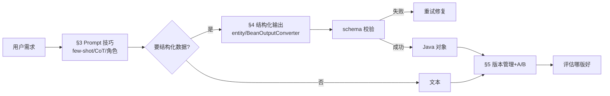
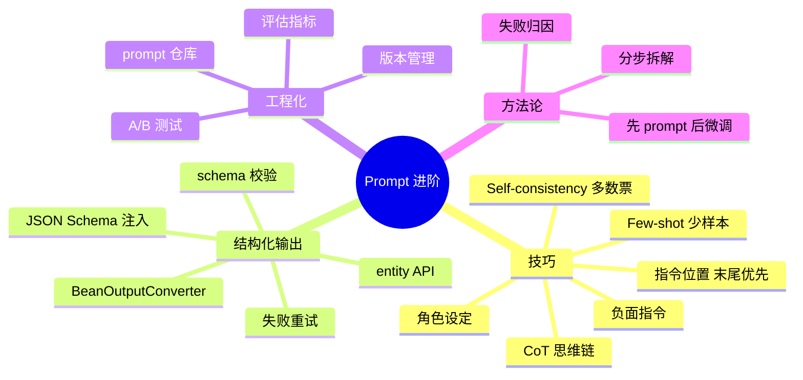
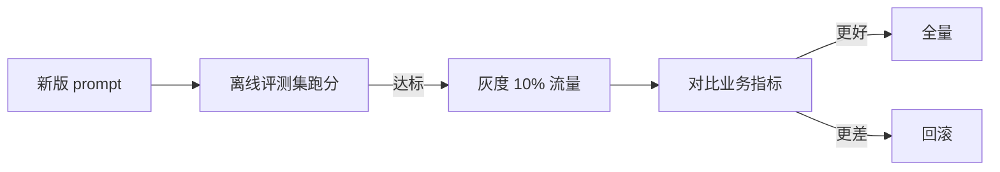

# Prompt Engineering 进阶与结构化输出

> **文件编码**：UTF-8。代码基于 Spring AI 1.0.x `BeanOutputConverter` / `entity()` API。结构化输出 API 在 1.0.x 稳定，但小版本细节以 [官方文档](https://docs.spring.io/spring-ai/reference/1.0/api/structured-output-converter.html) 为准。
>
> **前置**：先学 [01 大模型基础与 API](01-大模型基础与API调用入门.md)、[02 Spring AI 核心](02-SpringAI核心开发.md)、[17 LLM 原理](17-LLM原理与训练流程.md)（理解「预测下一 token」才能调好 prompt）。

---

## 0. 读前导读

### 0.1 用一句话弄懂本章

**01 章教你「写 prompt 调通」**；本章教你「**写好 prompt + 让模型稳定吐结构化数据**」——前者是入门，后者是工程岗每天面对的真实痛点，也是大模型岗面试高频。

### 0.2 解决什么痛点

| 痛点 | 本章小节 |
|------|----------|
| 模型回答时好时坏，同样问题结果不一样 | §3 few-shot + §4 结构化约束 |
| 要模型输出 JSON 给程序用，它总带「好的，结果是：」废话 | §4 结构化输出 |
| prompt 改一版好一版坏，不知道哪个好 | §5 版本管理 + A/B |
| 面试问「怎么写好 prompt」只会说「写清楚点」 | §3 + §6 方法论 |

### 0.3 学完能做到

1. 用 **few-shot / CoT / self-consistency** 三种技巧提升效果，说清各自适用场景
2. 用 Spring AI **`entity()` / `BeanOutputConverter`** 让模型稳定输出 Java 对象
3. 写 **schema 校验 + 失败重试** 的健壮结构化输出
4. 做 **prompt 版本管理 + A/B**，用数据判断哪版好
5. 说清 **「先 prompt 后微调」** 的调优原则和决策边界

### 0.4 一张图



### 0.5 学习姿势

- **§3、§4 必须动手**，敲一次 `entity()` 体会结构化输出的爽
- **§6 方法论**是面试加分，背下来
- 本章代码全部可跑，建议在 agent-demo 上加一个 `/api/extract` 接口练手

### 0.6 不讲什么

- 不讲 prompt 越狱/攻击（见 [Web安全 07](../../前端学习/Web安全/07-LLM应用安全与Prompt注入防护.md)）
- 不讲特定模型的「魔法咒语」（易过时，方法论更稳）
- 不讲 fine-tune（见 [20](20-模型适配方法论与微调入门.md)）

### 0.7 难度与时长

- 难度：★★★☆☆
- 建议时长：**1 个学习单元**（2~3 小时），§3+§4 敲完 demo

### 0.8 常见困惑

| 困惑 | 简短回答 |
|------|----------|
| 「prompt 不就是写自然语言吗，有啥技术？」 | 写通容易，**写稳定、可控、可评估** 是工程活 |
| 「结构化输出不就让它吐 JSON 吗？」 | 吐 JSON 容易，**稳定吐符合 schema 的 JSON** 才难，要校验+重试 |
| 「few-shot 给几个例子就行？」 | 例子的**质量比数量重要**，坏例子会带偏 |

---

## 1. 核心术语

### 1.1 Few-shot Prompting（少样本提示）

- **定义**：在 prompt 里给几个「输入→输出」示例，让模型照着模式做。
- **对比**：zero-shot（不给例子）/ one-shot（给一个）/ few-shot（给几个）。
- **生活类比**：教新人做事，光说「分类这些邮件」不如给 3 个分好类的例子让他照着分。

### 1.2 CoT（Chain-of-Thought，思维链）

- **定义**：让模型「先一步步推理，再给答案」，而不是直接给答案。
- **触发**：加「Let's think step by step」或在 few-shot 例子里展示推理过程。
- **适用**：数学、逻辑、多步推理。**不适用**简单事实问答（反而啰嗦易错）。

### 1.3 Self-consistency（自洽性）

- **定义**：对同一问题用 CoT 生成多次答案，**取多数票**。
- **原理**：单次推理可能走偏，多次推理取共识更稳。
- **代价**：成本 ×N。

### 1.4 结构化输出（Structured Output）

- **定义**：让模型输出符合预定 schema（如 JSON）的数据，程序可直接解析。
- **手段**：JSON Schema 约束、Function Calling、专门的 `response_format: json_object`。

### 1.5 Temperature（温度）

- 见 [17 §7.7](17-LLM原理与训练流程.md)。结构化输出建议 **低温（0~0.3）**，减少格式漂移。

---

## 2. 知识地图



---

## 3. Prompt 进阶技巧

### 3.1 Few-shot：用例子说话

**何时用**：任务有明确模式、zero-shot 不稳时。

```java
String prompt = """
    任务：把用户评论分类为「正面/负面/中性」。

    示例：
    评论：这手机续航太差了 → 负面
    评论：屏幕很清晰，但价格略高 → 中性
    评论：用了一周，流畅又好看 → 正面

    现在分类：
    评论：%s →
    """.formatted(userComment);
```

> **要点**：
> - **3~5 个例子足够**，多了费 token 且可能过拟合示例风格。
> - **例子要覆盖各类别**，别只给正面例子（模型会以为都该判正面）。
> - **例子格式一致**，模型靠模仿格式输出。

### 3.2 CoT：让它先想再答

**何时用**：数学、逻辑、多步推理。

```java
String prompt = """
    问题：一个商店进了 50 件商品，每件成本 80 元，售价 120 元，
    卖出 40 件后剩下 5 折处理卖完，问总利润。
    请一步步推理，最后给出答案。
    """;
```

**两种触发方式**：
1. **Zero-shot CoT**：直接加「请一步步推理」「Let's think step by step」。
2. **Few-shot CoT**：例子里展示推理过程，模型照着推理。

> **注意**：简单事实问答别用 CoT，反而易在推理中引入错误。**CoT 是推理任务的工具，不是万能**。

### 3.3 Self-consistency：多次取多数票

```java
@Service
public class SelfConsistencyService {

    private final ChatClient chatClient;

    public String solveWithMajority(String problem, int n) {
        List<String> answers = IntStream.range(0, n).parallel()
            .mapToObj(i -> chatClient.prompt()
                .user(problem + "\n请一步步推理后给出答案。")
                .call()
                .content())   // temperature 调高，每次不同
            .toList();
        // 提取最终答案，取多数票
        return majorityVote(extractFinalAnswers(answers));
    }
}
```

> **逐行**：并发跑 N 次（`temperature` 要够高才有差异），每次都 CoT 推理，最后对「最终答案」取多数票。**成本 ×N，适合高价值推理题**。

### 3.4 角色设定 + 指令位置

- **角色**：`defaultSystem("你是资深 Java 架构师，回答要专业、给代码示例")`——给模型一个「人设」，输出风格更稳定。
- **指令放末尾**：模型是「预测下一 token」，**末尾的指令对后续生成影响最大**。把关键要求放 prompt 最后，比放开头更有效。

```
[背景资料/上下文]
[示例]
[关键指令]  ← 放这里，模型最听话
```

### 3.5 负面指令（要做什么 > 不要做什么）

模型对「不要做 X」理解弱，**说「做 Y」更有效**：

```
❌ 不要给出太长的回答
✅ 回答控制在 100 字以内
```

---

## 4. 结构化输出：让模型吐可用数据

### 4.1 痛点

让模型输出 JSON，它常这么干：

```
好的，这是你要的结果：
{"name": "张三", "age": 25}
希望对你有帮助！
```

程序一解析就崩。**结构化输出要解决这个**。

### 4.2 Spring AI 最简方案：`entity()` API

定义目标类型（推荐用 record）：

```java
public record PersonInfo(String name, int age, String occupation) {}
```

一行拿到对象：

```java
@Service
public class ExtractService {

    private final ChatClient chatClient;

    public ExtractService(ChatClient.Builder builder) {
        this.chatClient = builder.build();
    }

    public PersonInfo extract(String text) {
        return chatClient.prompt()
            .user("从以下文本提取人物信息：\n" + text)
            .call()
            .entity(PersonInfo.class);   // 自动用 BeanOutputConverter
    }
}
```

> **逐行**：
> - `.entity(PersonInfo.class)`：内部自动创建 `BeanOutputConverter`，做两件事——① 把 PersonInfo 的 JSON Schema 注入 prompt 指导模型；② 把返回的 JSON 反序列化成 PersonInfo。
> - **你不用手写「请输出 JSON」**，框架替你做了。
> - 这是 Spring AI 1.0 推荐用法（[官方文档](https://docs.spring.io/spring-ai/reference/1.0/api/structured-output-converter.html)）。

### 4.3 泛型 / 集合类型

```java
List<PersonInfo> people = chatClient.prompt()
    .user("提取以下文本里的所有人物：\n" + text)
    .call()
    .entity(new ParameterizedTypeReference<List<PersonInfo>>() {});
```

> 用 `ParameterizedTypeReference` 处理 `List<T>`、`Map<String,T>` 等泛型类型。

### 4.4 底层控制：手动用 BeanOutputConverter

需要自定义 prompt 模板时，手动用 converter：

```java
public PersonInfo extractManual(String text) {
    BeanOutputConverter<PersonInfo> converter = new BeanOutputConverter<>(PersonInfo.class);
    String format = converter.getFormat();   // 拿到 schema 指令文本

    String prompt = """
        从以下文本提取人物信息。
        {format}
        文本：{text}
        """.replace("{format}", format).replace("{text}", text);

    String content = chatClient.prompt().user(prompt).call().content();
    return converter.convert(content);       // 反序列化
}
```

> **逐行**：
> - `getFormat()`：返回「请输出符合此 JSON Schema 的数据：{schema}」这样的指令，你拼进自己的 prompt。
> - `convert(content)`：把模型返回的文本解析成对象。
> - **适合**：prompt 复杂、要混入 few-shot 或多段上下文时。

### 4.5 schema 定制

- `@JsonPropertyOrder`：控制字段顺序（影响模型输出顺序）。
- `@JsonProperty(required = false)`：标记可选字段（不进 required 数组）。
- 重写 `generateSchema()`：自定义 schema（旧的 `postProcessSchema` 已移除）。

```java
@JsonPropertyOrder({"name", "age", "occupation"})
public record PersonInfo(
    String name,
    int age,
    @JsonProperty(required = false) String occupation  // 可选
) {}
```

### 4.6 健壮性：schema 校验 + 失败重试

模型偶尔仍会输出坏 JSON。生产要加校验和重试：

```java
@Service
public class RobustExtractService {

    private static final int MAX_RETRY = 3;
    private final ChatClient chatClient;

    public PersonInfo extractRobust(String text) {
    Exception lastError = null;
    for (int i = 0; i < MAX_RETRY; i++) {
        try {
            return chatClient.prompt()
                .user(buildPrompt(text, i, lastError))   // 失败时带错误反馈重试
                .call()
                .entity(PersonInfo.class);
        } catch (Exception e) {
            lastError = e;   // 记下错误，下次告诉模型它错在哪
        }
    }
    throw new RuntimeException("结构化提取失败", lastError);
}

    private String buildPrompt(String text, int retry, Exception prevError) {
        if (retry == 0) return "从以下文本提取人物信息：\n" + text;
        // 重试时把上次错误反馈给模型
        return "上次提取失败：" + prevError.getMessage()
            + "\n请严格按 schema 重新提取：\n" + text;
    }
}
```

> **逐行**：
> - `MAX_RETRY=3`：最多重试 3 次。
> - `buildPrompt`：重试时**把上次的错误信息喂回模型**，让它知道哪里错了——这比盲目重试有效得多。
> - **低温**：结构化任务建议 temperature 0~0.3，减少格式漂移。

### 4.7 三种结构化手段对比

| 手段 | 怎么做 | 适合 |
|------|--------|------|
| `response_format: json_object` | 模型层开关，强制输出 JSON | 简单 JSON |
| Function Calling | 定义函数 schema，模型按 schema 填参（[04](04-FunctionCalling与Tool设计.md)） | 要调用工具/严格 schema |
| `BeanOutputConverter` | Spring AI 把 Java 类转 schema 注入 prompt | Java 对象，最顺手 |

> **面试加分**：被问「怎么保证模型输出可解析」答——① Spring AI `entity()` 用 JSON Schema 约束；② 低温减少漂移；③ **schema 校验 + 失败带错误反馈重试**；④ 关键场景配 Function Calling。这套「约束 + 校验 + 重试」是工程标准动作。

---

## 5. Prompt 版本管理与 A/B

### 5.1 为什么要版本管理

prompt 改了一版，不知道比上版好还是坏；线上出问题想回滚找不到旧版。**prompt 要当代码管，不当口头传说**。

### 5.2 最小实践

- **prompt 入 git**：把 prompt 模板存成文件或常量类，提交版本控制。
- **带版本号**：每个 prompt 标 `v1`、`v2`，调用时记录用了哪版（写进 trace，见 [15](15-LLM可观测性与评估体系.md)）。
- **Langfuse prompt 库**：Langfuse 有 prompt 管理功能，版本化 + 拉取，比文件更专业。

### 5.3 A/B 流程



- **离线先跑评测集**（[13](13-RAG进阶-检索优化与评估.md) 的 RAGAS 或自定义指标）。
- **线上灰度**：10% 流量用新 prompt，对比关键指标（准确率、用户 👍率、人工接管率）。
- **统计显著再定**：别 20 条就下结论。

> **和 [15](15-LLM可观测性与评估体系.md) 的评估闭环一脉相承**——prompt 也是「改→评测→灰度→全量/回滚」。

---

## 6. Prompt 调优方法论（面试加分）

### 6.1 核心原则：先 prompt，后微调

```
改 prompt / 加 RAG / 加 few-shot   ←  先试，便宜
        ↓ 不够
换更强模型                          ←  再试
        ↓ 不够
Fine-tune（SFT/DPO）               ←  最后，贵
```

- **prompt 改动成本：分钟级**；微调成本：天/周级 + 数据 + 算力。
- **90% 的需求靠 prompt + RAG 解决**，微调是少数。
- **面试标准答法**：「能 prompt 解决就不微调，微调是 prompt 优化到极限还不够时才上」。

### 6.2 调优步骤

1. **明确失败模式**：是答错？格式错？幻觉？啰嗦？不同失败对应不同对策。
2. **归因**：是 prompt 不清？上下文不够？模型能力不足？见 [15](15-LLM可观测性与评估体系.md) 的 trace 归因。
3. **小步改 + 评测**：每次只改一处，跑评测集看指标，**不凭感觉**。
4. **失败案例入库**：把难例沉淀进评测集，防止回归。

### 6.3 常见失败与对策

| 失败 | 对策 |
|------|------|
| 答非所问 | 指令放末尾；few-shot 给正例 |
| 格式错 | 结构化输出（§4）；低温 |
| 幻觉 | RAG 带事实；加「不知道就说不知道」 |
| 啰嗦 | 限字数；负面指令改正面（「100 字以内」） |
| 推理错 | CoT；self-consistency |
| 不稳定 | 降 temperature；few-shot 固定模式 |

---

## 7. 报错与踩坑表

| 现象 | 原因 | 解决 |
|------|------|------|
| `entity()` 抛解析异常 | 模型返回带非 JSON 文字 | §4.6 重试 + 错误反馈 |
| few-shot 后模型只会模仿示例 | 例子风格太强/太少样 | 增加例子多样性 |
| CoT 反而更错 | 简单任务用 CoT 引入推理错误 | 简单任务别用 CoT |
| 新 prompt 线上变差 | 没离线评测就上线 | 先跑评测集再灰度 |
| `BeanOutputConverter` schema 不对 | 字段类型/注解问题 | 检查 record 字段 + `@JsonPropertyOrder` |
| self-consistency 成本爆 | N 太大 | N=3~5 即可，高价值任务才用 |

---

## 8. 常见困惑 FAQ

**Q1：few-shot 给几个例子最好？**
A：通常 3~5 个。**质量 > 数量**——覆盖各类别、格式一致比堆数量有效。超过 8 个边际收益递减且费 token。

**Q2：CoT 和 self-consistency 啥关系？**
A：CoT 是「让它一步步想」；self-consistency 是「用 CoT 跑多次取多数票」。后者是前者的增强版，成本更高，适合高价值推理。

**Q3：结构化输出用 `entity()` 还要重试吗？**
A：要。`entity()` 大幅降低格式错误，但**不能保证 100%**，生产仍要校验+重试（§4.6）。

**Q4：prompt 越长越好吗？**
A：不是。过长会「lost in the middle」、费 token、模型抓不住重点。**关键指令放末尾、上下文精炼**比堆长度有效。

**Q5：temperature 设多少？**
A：结构化/事实任务 0~0.3；创意/多样任务 0.7~1.0；self-consistency 要高（0.7+）才有差异。**没标准答案，按任务调**。

**Q6：prompt 要不要写在代码里？**
A：简单项目可写常量；正式项目**存文件或用 Langfuse prompt 库**，便于版本管理和热更新（不改代码就能改 prompt）。

**Q7：负面指令（「不要…」）为什么效果差？**
A：模型是「预测下一 token」，说「不要长」反而把「长」这个概念激活了。**说「100 字以内」直接给正向约束更有效**。

**Q8：few-shot 的例子能随便编吗？**
A：不能。例子是模型模仿的模板，**编错的例子会系统性地带偏**。用真实业务案例最好。

**Q9：A/B 多少样本才够？**
A：看指标方差。粗略：每組 ≥100~300 样本再看比例差异是否显著。**10 条就下结论是常见坑**。

**Q10：prompt 调到什么程度该考虑微调？**
A：① prompt 已优化到极限（试过 few-shot/CoT/RAG/换模型）；② 有明确评测显示仍不达标；③ 任务风格强且固定（如特定语气/格式）；④ 有足够标注数据。**四条都满足才上微调**。

**Q11：`entity()` 和 Function Calling 都能让模型按 schema 输出，区别？**
A：`entity()` 是「输出」结构化（拿数据）；Function Calling 是「调用」结构化（让模型触发动作）。**要数据用 entity，要触发工具用 Function Calling**。有时结合：让模型先吐结构化数据再触发对应 tool。

**Q12：结构化输出为什么要低温？**
A：高温增加随机性，模型可能加废话、改字段名、乱加内容。**低温让模型更「老实」按 schema 输出**。

---

## 9. 闭卷自测（10 题）

1. few-shot 给例子的 3 个要点是什么？
2. CoT 适合什么任务？不适合什么任务？
3. self-consistency 怎么做？为什么有效？代价？
4. 为什么关键指令要放 prompt 末尾？（用「预测下一 token」解释）
5. 负面指令为什么效果差？怎么改？
6. Spring AI `entity()` 内部做了哪两件事？
7. 结构化输出的「约束+校验+重试」三件套分别是什么？
8. 结构化输出为什么建议低温？
9. prompt 版本管理 + A/B 的流程是什么？
10. 「先 prompt 后微调」的调优阶梯是什么？为什么这个顺序？

> 做对 8 题以上过关；不到 6 题重读 §3 和 §4。

---

## 10. 费曼检验

合上文档，向一个**会写 Java 但没用过 LLM** 的同事讲 3 分钟：

1. few-shot/CoT/self-consistency 各是什么、什么时候用
2. 为什么让模型吐可解析 JSON 不容易，Spring AI 怎么解决
3. 「约束 + 校验 + 重试」为什么是结构化输出的标准动作
4. prompt 调优为什么不凭感觉、要评测

---

## 11. 进阶档练习

1. **few-shot**：写一个评论分类 service，zero-shot vs 3-shot 对比准确率。
2. **CoT**：写一个数学题 service，加「一步步推理」前后对比。
3. **`entity()`**：写一个 `/api/extract` 接口，从自然语言提取 PersonInfo 对象。
4. **健壮性**：给 §4 的 extract 加重试 + 错误反馈，故意给模糊输入测重试。
5. **A/B**：准备两版 prompt，用 [13](13-RAG进阶-检索优化与评估.md) 评测集对比指标。

---

## 12. 交叉引用

- 应用基础：[01 大模型基础](01-大模型基础与API调用入门.md)、[02 Spring AI 核心](02-SpringAI核心开发.md)
- 模型原理（理解 prompt 为何有效）：[17 LLM 原理](17-LLM原理与训练流程.md)
- Function Calling：[04 Tool 设计](04-FunctionCalling与Tool设计.md)
- 评估闭环：[13 RAG 进阶](13-RAG进阶-检索优化与评估.md)、[15 可观测性](15-LLM可观测性与评估体系.md)
- 何时微调：[20 模型适配方法论](20-模型适配方法论与微调入门.md)
- Prompt 注入防护：[Web安全 07](../../前端学习/Web安全/07-LLM应用安全与Prompt注入防护.md)
- Spring AI 结构化输出文档：https://docs.spring.io/spring-ai/reference/1.0/api/structured-output-converter.html
