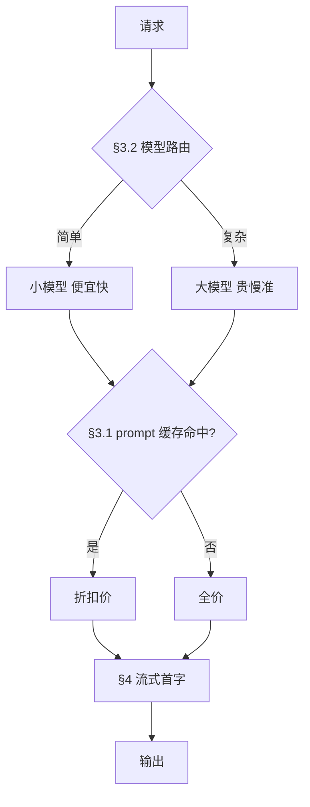
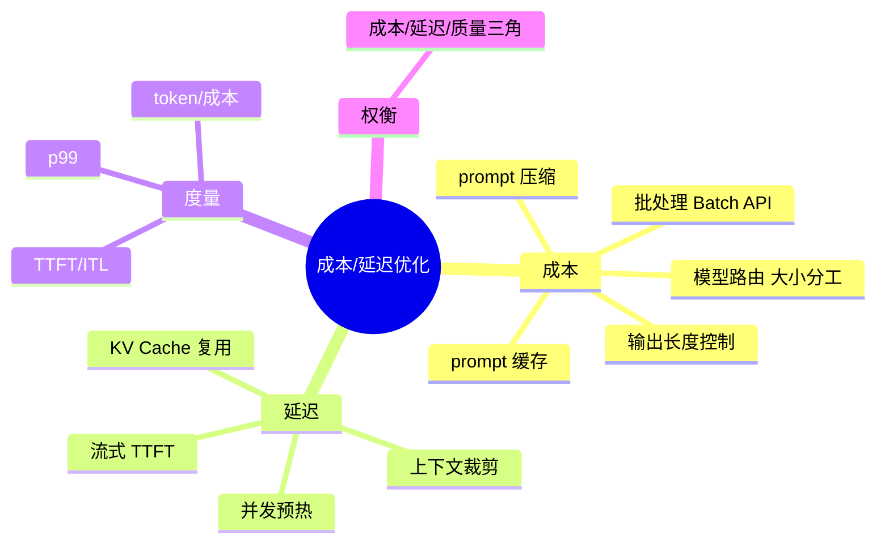
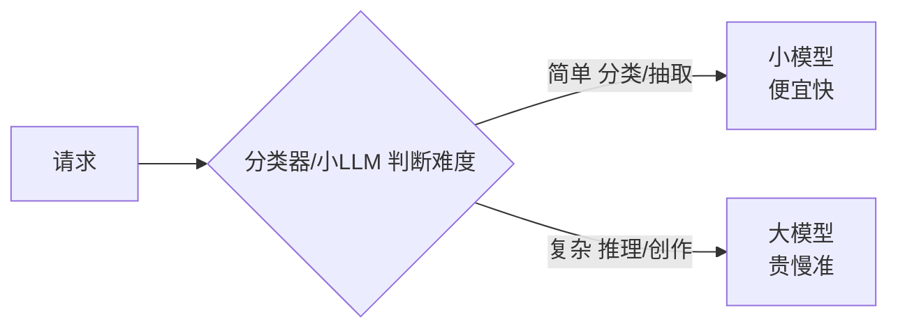

# 成本与延迟优化：让 Agent 又快又省

> **文件编码**：UTF-8。基于 Spring AI 1.0.x + 主流云端 API（OpenAI/DeepSeek/Anthropic）。各厂商 prompt caching / batch API 的可用性与价格以官方为准。
>
> **前置**：[02 Spring AI 核心](02-SpringAI核心开发.md)、[03 SSE 流式](03-流式对话与SSE实战.md)、[11 生产化与安全](11-生产化与安全.md)、[17 LLM 原理](17-LLM原理与训练流程.md)（理解 KV Cache）。

---

## 0. 读前导读

### 0.1 一句话弄懂本章

**11 章讲了「要限流控成本」**；本章讲「**怎么在同样效果下花更少钱、等更短时间**」——prompt 缓存、大小模型分工、批处理、流式首字、KV Cache 复用，是生产 Agent 的命门，也是面试深挖点。

### 0.2 解决什么痛点

| 痛点 | 本章小节 |
|------|----------|
| 月底 token 账单吓人 | §3 成本优化 |
| 用户等首字等 3 秒流失 | §4 延迟优化 |
| 每次都把长 system prompt 全量算 | §3.1 prompt 缓存 |
| 简单分类也用最贵模型 | §3.2 模型路由 |
| 面试问「你怎么优化 LLM 应用成本/延迟」答不出 | 全章 |

### 0.3 学完能做到

1. 说清 **prompt caching** 原理、命中条件、能省多少
2. 设计 **大小模型路由**（分类/简单任务用小模型，复杂用大模型）
3. 用 **批处理 API** 降批量任务成本
4. 说清 **TTFT / ITL** 两个延迟指标，列出至少 3 种降延迟手段
5. 解释 **KV Cache** 为什么是延迟和成本的关键
6. 说清「**成本、延迟、质量**」三角权衡

### 0.4 一张图



### 0.5 学习姿势

- **§3.1 prompt 缓存**是性价比最高的优化，先吃透
- **§4 延迟**和 [03 SSE](03-流式对话与SSE实战.md) 联动
- 本章偏策略，**要能讲清权衡**（不是无脑上所有优化）

### 0.6 不讲什么

- 不讲 vLLM 自部署的延迟优化细节（见 [21](21-MCP-A2A协议与本地推理部署.md)）
- 不讲模型量化（见 [21](21-MCP-A2A协议与本地推理部署.md)）

### 0.7 难度与时长

- 难度：★★★☆☆
- 建议时长：**1 个学习单元**

### 0.8 常见困惑

| 困惑 | 简短回答 |
|------|----------|
| 「prompt 缓存是免费的吗？」 | 命中时输入 token 大幅折扣（非免费），但比全算省得多 |
| 「大小模型路由会不会答得差？」 | 简单任务小模型够用；关键是**路由判断要准** |
| 「延迟不就是越快越好？」 | 不只总时间，**首字时间（TTFT）决定体感** |

---

## 1. 核心术语

### 1.1 Prompt Caching（提示缓存）

- **定义**：厂商缓存你 prompt 的**重复前缀**的 KV Cache，下次相同前缀命中时跳过重新计算，输入 token 折扣计费、首字更快。
- **生活类比**：你每天念同一份开场白，第一次要背（全算），之后直接念（缓存命中）。
- **条件**：前缀必须**完全相同**（一字不差），长度达到厂商阈值（如 1024 token）。

### 1.2 KV Cache

- **定义**：模型生成时，把已处理 token 的 Key/Value 向量缓存，避免每生成一个 token 就重算前面所有 token 的注意力。
- **意义**：没有 KV Cache，生成长文本会 O(n²) 爆炸；有它，生成是 O(n)。
- **与 prompt caching 关系**：prompt caching 本质是**跨请求复用 KV Cache**。

### 1.3 TTFT（Time To First Token，首字延迟）

- **定义**：从请求发出到**第一个 token 到达**的时间。
- **为什么重要**：流式场景用户体感「卡不卡」全看它。TTFT 2s 用户已觉得慢。

### 1.4 ITL（Inter-Token Latency，字间延迟）

- **定义**：流式输出中相邻两个 token 之间的间隔。
- **为什么重要**：决定「打字机」流不流畅。ITL 高会卡顿。

### 1.5 模型路由（Model Routing）

- **定义**：按任务复杂度把请求分发到不同大小的模型，简单用小（便宜快），复杂用大（贵慢准）。

---

## 2. 知识地图



---

## 3. 成本优化

### 3.1 Prompt Caching（性价比最高）

**原理**：你的 system prompt + few-shot 例子 + 长上下文，每次请求都一样，厂商缓存这部分 KV Cache，命中时**输入 token 折扣（常见 50%~80% off）+ 首字更快**。

**怎么命中**：
- 前缀**完全相同**（包括大小写、空格、标点）。
- 前缀长度过阈值（各厂不同，约 1024 token）。
- 缓存有 TTL（几分钟~几小时），过期要重建。

**工程做法**：把**固定部分放最前，变量放最后**。

```java
// ✅ 正确：固定 system prompt 在前，用户输入在后
String prompt = FIXED_SYSTEM_PROMPT + FEW_SHOT_EXAMPLES + userQuery;

// ❌ 错误：把变量混在前缀里，每次都 miss
String prompt = "用户" + userId + "问：" + userQuery + FIXED_RULES;
```

> **逐行**：`FIXED_SYSTEM_PROMPT`、`FEW_SHOT_EXAMPLES` 是每次都一样的部分，放最前才能命中缓存；`userQuery` 每次不同，放最后。**顺序错了缓存全 miss**。

**能省多少**：system prompt 占大头时（如 2000 token system + 50 token query），命中可省 50%+ 输入成本 + 显著降 TTFT。

> **面试加分**：被问「怎么优化成本」第一个答 prompt caching，并说清「固定前缀在前、变量在后、前缀完全相同才命中」——这是最常见且性价比最高的优化。

### 3.2 模型路由（大小模型分工）

**思路**：不是所有请求都需要最贵模型。用一个轻量分类判断任务难度，分发到不同模型。



**实现**：

```java
@Service
public class RoutingChatService {

    private final ChatClient smallModel;   // 如 deepseek-chat / gpt-4o-mini
    private final ChatClient bigModel;     // 如 deepseek-reasoner / gpt-4o

    public String chat(String userQuery) {
        if (isSimple(userQuery)) {
            return smallModel.prompt().user(userQuery).call().content();
        }
        return bigModel.prompt().user(userQuery).call().content();
    }

    private boolean isSimple(String q) {
        // 简单规则：短、关键词匹配、分类/抽取类
        return q.length() < 50 || q.contains("分类") || q.contains("提取");
        // 进阶：用小模型当分类器判断
    }
}
```

> **逐行**：
> - `isSimple`：起步用规则（短/关键词），成熟后用小模型当分类器。
> - **关键**：路由判断本身要便宜，否则省的还抵不上判断成本。
> - **风险**：路由错了——简单任务误判复杂用贵模型（浪费），复杂任务误判简单用小模型（质量差）。**路由准确率是这套的命门**，要持续监控。

### 3.3 批处理（Batch API）

**适用**：非实时、可攒批的后台任务（如批量打标签、批量摘要）。

- OpenAI / Anthropic 都有 **Batch API**：提交一批请求，几小时~24 小时返回，**价格 50% off**。
- **代价**：非实时，不能用于在线对话。

```java
// 思路：把白天积攒的标注任务攒批，夜间提交 Batch API
List<String> texts = collectPendingTags();   // 攒批
batchClient.submit(texts, model);            // 提交，几小时后取
```

> **适合**：日志分类、文档摘要、历史数据回填等**不在乎延迟**的批量任务。

### 3.4 Prompt 压缩与输出控制

- **压缩上下文**：RAG 只拼最相关 chunk（[13](13-RAG进阶-检索优化与评估.md)），别全塞。
- **限输出长度**：`max_tokens` 限制 + prompt 里说「100 字以内」，输出 token 比 input 更贵。
- **去冗余 few-shot**：例子够用就行，每个例子都是常驻成本。

### 3.5 成本度量

```
单次成本 = input_tokens × 输入单价 + output_tokens × 输出单价
日成本 = Σ 单次成本
缓存节省 = (命中前缀 token × 折扣) × 请求量
```

接 [15](15-LLM可观测性与评估体系.md)：每次请求的 `usage()` 落 trace，看板看日成本趋势 + 缓存命中率。

---

## 4. 延迟优化

### 4.1 两个延迟指标

| 指标 | 含义 | 优化重点 |
|------|------|----------|
| TTFT | 首字延迟 | prompt 长度、缓存、prefill 速度 |
| ITL | 字间延迟 | 生成速度（模型大小、量化、并发） |

> **流式场景看 TTFT 决定体感**（[03 SSE](03-流式对话与SSE实战.md)）；非流式看总延迟。

### 4.2 降 TTFT

- **prompt caching**：命中缓存直接跳过 prefill，TTFT 大降。
- **裁剪上下文**：prompt 越短 prefill 越快。RAG 只拼 top-k。
- **流式输出**：别等全部生成完再返回，首字一出来就推（[03](03-流式对话与SSE实战.md)）。
- **选 prefill 快的模型**：小模型 prefill 快。

### 4.3 降 ITL / 总延迟

- **小模型**：生成速度更快。
- **量化模型**（自部署时）：FP16→INT8/INT4，快且省显存（[21](21-MCP-A2A协议与本地推理部署.md)）。
- **并发**：多个独立请求并行（注意 rate limit）。
- **Speculative Decoding**（自部署）：小模型猜、大模型验，降生成延迟（[21](21-MCP-A2A协议与本地推理部署.md)）。

### 4.4 KV Cache 是延迟和成本的共同关键

- **生成时**：KV Cache 让每生成一个 token 只算新 token 对历史的注意力，不用重算全历史。**没有它生成不可行**。
- **跨请求**：prompt caching 复用 KV Cache，降 TTFT 和成本。
- **长上下文代价**：KV Cache 随 token 数线性增长，长上下文显存占用大——这是上下文窗口受限的根因（[17 §7.2](17-LLM原理与训练流程.md)）。

> **面试加分**：被问「为什么长 prompt 慢且贵」答——① prefill 要算 prompt 每个位置的注意力，长 prompt prefill 慢；② KV Cache 随长度线性占显存；③ prompt caching 能复用固定前缀的 KV 缓解。这是把原理和工程串起来的高分答法。

---

## 5. 成本-延迟-质量三角

```mermaid
triangle
    sides Cost 成本 Latency 延迟 Quality 质量
```

- **降成本**常用更小模型 → 可能降质量。
- **降延迟**用更短 prompt → 可能丢信息降质量。
- **提质量**用更大模型 + 更多上下文 → 升成本和延迟。

**没有免费午餐**，优化是「在质量达标的前提下压成本/延迟」。**先定质量红线**（评测指标阈值），再在红线内优化成本/延迟。

> **面试标准答法**：「优化不是无脑压，是先定质量红线（评测指标），再在达标前提下做 prompt 缓存/模型路由/批处理，每步都用评测集验证没掉质量。」这是有大局观的答案。

---

## 6. 报错与踩坑表

| 现象 | 原因 | 解决 |
|------|------|------|
| prompt caching 命中率 0 | 前缀里有变量 / 顺序错 | 固定部分严格放最前 |
| 模型路由后质量掉 | 路由误判复杂任务为简单 | 升级分类器；设「不确定走大模型」兜底 |
| Batch API 用不了 | 实时在线场景 | 只用于非实时批量任务 |
| TTFT 仍高 | prompt 太长 + 无缓存 | 裁剪上下文 + 开缓存 |
| 成本看板对不上账单 | 多模型单价没配 | 在可观测平台配各模型单价 |
| 优化后指标反而差 | 没评测就改 | 先跑评测集再上线 |

---

## 7. 常见困惑 FAQ

**Q1：prompt caching 所有厂商都支持吗？**
A：主流都支持（OpenAI/Anthropic/DeepSeek 等），但**阈值、折扣、TTL 各异**。用前查当前厂商文档。

**Q2：缓存前缀改一个字还能命中吗？**
A：不能。前缀必须**完全相同**。改了就 miss，从改动点之后全部重算。

**Q3：模型路由的分类器要多准？**
A：越高越好，但更重要的是**别把复杂任务误判为简单**（质量事故）。可设「不确定默认走大模型」兜底。

**Q4：批处理能用于用户对话吗？**
A：不能。Batch API 延迟几小时~24h，**只适合后台非实时任务**。

**Q5：降 TTFT 最有效的是什么？**
A：① prompt caching（命中跳过 prefill）；② 流式输出（首字即返）；③ 裁剪 prompt。三者叠加效果最好。

**Q6：output token 为什么比 input 贵？**
A：input 只算 prefill（一次），output 要逐 token 生成（每步都要 attention），算力更重。所以**控输出长度对成本影响大**。

**Q7：KV Cache 和 prompt caching 什么关系？**
A：KV Cache 是单次请求内复用（生成时不重算历史）；prompt caching 是**跨请求复用 KV Cache**（相同前缀不重算）。后者是前者在工程上的延伸。

**Q8：量化会降质量吗？**
A：会降一点（INT4 比 FP16 略差），但很多场景可接受。**质量敏感场景用 INT8，极致省资源用 INT4**，看评测。

**Q9：成本优化会不会影响安全？**
A：模型路由可能把敏感任务分给弱模型导致防护不足。**安全相关判断别走小模型**，或加专门的安全过滤层。

**Q10：延迟 p99 飙高怎么排查？**
A：看 [15](15-LLM可观测性与评估体系.md) trace 的 p99 分布——是 prefill 慢（prompt 长）、生成慢（output 长）、还是排队（限流/并发）。对症下药。

**Q11：self-consistency 成本 N 倍，值吗？**
A：高价值推理任务（如数学/代码）值；普通对话不值。**按任务价值决定是否上**。

**Q12：优化到什么程度算够？**
A：看预算和质量红线。常见目标：成本在预算内、TTFT < 2s、p99 总延迟 < 30s（视场景）、质量评测达标。**没有绝对标准，按业务 SLA**。

---

## 8. 闭卷自测（10 题）

1. prompt caching 命中要满足哪两个条件？省的是什么？
2. 为什么固定 prompt 要放最前、变量放最后？
3. 模型路由的核心风险是什么？怎么兜底？
4. Batch API 适合什么场景？为什么不能用于对话？
5. TTFT 和 ITL 分别决定什么？降 TTFT 的 3 个手段？
6. KV Cache 在单次请求和跨请求分别起什么作用？
7. 为什么长 prompt 慢且贵？（用 prefill + KV Cache 解释）
8. output token 为什么比 input 贵？控输出长度为什么有效？
9. 成本-延迟-质量三角是什么意思？优化的正确顺序？
10. 优化 LLM 成本/延迟，你会按什么顺序上手段？

> 做对 8 题以上过关；不到 6 题重读 §3 和 §4。

---

## 9. 费曼检验

向一个**做传统后端的同事**讲 3 分钟：

1. prompt caching 怎么省钱省时间（前缀相同才命中）
2. 大小模型路由的思路和风险
3. TTFT 为什么决定体感、怎么降
4. 为什么优化要先定质量红线

---

## 10. 进阶档练习

1. **缓存顺序**：把 agent-demo 的 system prompt 放最前、user input 放最后，对比改前改后的 `usage`（看 cache hit token）。
2. **模型路由**：加一个简单路由，短问题走小模型、长问题走大模型，对比成本。
3. **TTFT 度量**：在 [03](03-流式对话与SSE实战.md) 的流式接口测 TTFT，裁剪 prompt 后再测对比。
4. **批处理**：写一个夜间批量摘要任务用 Batch API（如厂商支持），对比价格。
5. **成本看板**：每次请求落 `usage`，画日成本 + 缓存命中率图。

---

## 11. 交叉引用

- 流式与 TTFT：[03 流式 SSE](03-流式对话与SSE实战.md)
- 限流/成本基础：[11 生产化与安全](11-生产化与安全.md)
- 可观测指标：[15 LLM 可观测性](15-LLM可观测性与评估体系.md)
- KV Cache 原理：[17 LLM 原理](17-LLM原理与训练流程.md) §7
- 自部署优化（vLLM/量化）：[21 本地推理部署](21-MCP-A2A协议与本地推理部署.md)
- 评测定质量红线：[13 RAG 评估](13-RAG进阶-检索优化与评估.md)
- OpenAI Batch API：https://platform.openai.com/docs/guides/batch
- Anthropic Prompt Caching：https://docs.anthropic.com/en/docs/build-with-claude/prompt-caching
