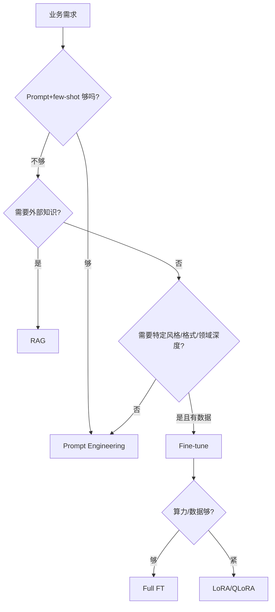
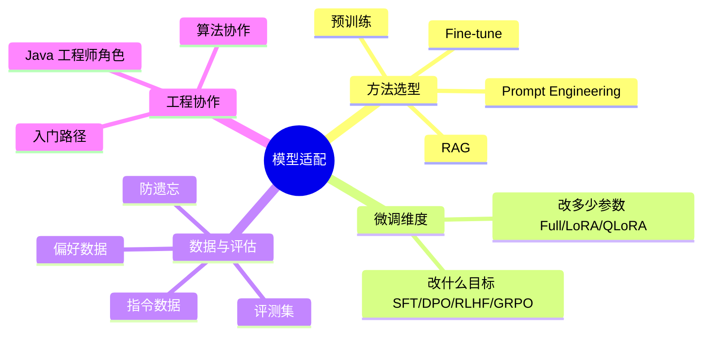

# 模型适配方法论与微调入门

> **文件编码**：UTF-8。微调实操在 Python 生态（TRL/Unsloth/PEFT），本章对 Java 主线定位为「**能讲清选型 + 能和算法协作**」，给最小概念和入门路径，不要求你亲手训练。
>
> **前置**：[17 LLM 原理与训练流程](17-LLM原理与训练流程.md)（必须先懂 Pretrain/SFT/RLHF 流程）、[13 RAG 进阶](13-RAG进阶-检索优化与评估.md)、[18 Prompt 进阶](18-PromptEngineering进阶与结构化输出.md)。

---

## 0. 读前导读

### 0.1 一句话弄懂本章

**17 章讲「模型怎么训出来」**；本章讲「**拿到一个模型后，让它适配你的业务，该用 Prompt、RAG 还是 Fine-tune？**」——这是大模型岗面试的「方法论题」，答错显得没全局观。

### 0.2 解决什么痛点

| 痛点 | 本章小节 |
|------|----------|
| 面试问「什么时候该微调」答「数据多就微调」太浅 | §3 决策树 |
| 问「LoRA、QLoRA 区别」答不出 | §4 |
| 问「SFT 和 DPO 啥关系」答乱 | §5 |
| 团队算法同学说「我们要微调」，你判断不了该不该 | §3 + §6 |

### 0.3 学完能做到

1. 画出 **Prompt → RAG → Fine-tune → 预训练** 四种适配方法的适用边界
2. 用**决策树**为给定业务场景选适配方法
3. 说清 **Full FT / LoRA / QLoRA** 区别和取舍
4. 说清 **SFT / DPO / RLHF / GRPO** 各解决什么、2026 主流栈
5. 说清微调的**数据准备和评估**要点
6. 作为 Java 工程师，**判断该不该建议团队微调**，并知道怎么和算法协作

### 0.4 一张图



### 0.5 学习姿势

- **§3 决策树是核心**，必须能背能画
- **§4/§5 概念**要能讲清区别，不要求数学
- 本章**不用敲代码**（你主线 Java），但 §7 给想深入的入门路径

### 0.6 不讲什么

- 不讲完整微调代码实操（Python 算法方向，给入门指引）
- 不讲预训练（只有大厂做，超出工程岗范围）
- 不讲分布式训练工程（数据/张量并行）

### 0.7 难度与时长

- 难度：★★★★☆（概念多）
- 建议时长：**1 个学习单元**

### 0.8 常见困惑

| 困惑 | 简短回答 |
|------|----------|
| 「我是 Java 工程师要学微调吗？」 | 不用亲手训，但**要会选型、能和算法协作**，面试必问 |
| 「微调一定比 RAG 好吗？」 | 不一定。需要外部知识的场景 RAG 更合适，微调改的是模型能力不是知识库 |
| 「LoRA 是微调方法还是训练阶段？」 | 是「**怎么改参数**」的方法（PEFT）；SFT/DPO 是「**改什么目标**」的阶段。两个正交维度 |

---

## 1. 核心术语（两个正交维度，先分清）

### 1.1 维度一：改多少参数（怎么改）

- **Full Fine-tuning**：更新模型所有参数。效果最好，但贵（要存所有参数梯度）、易灾难性遗忘。
- **PEFT（Parameter-Efficient Fine-Tuning）**：只更新一小部分参数，冻结基座。
  - **LoRA**：给权重矩阵加低秩分解 `W + BA`，只训 `A`、`B`（r 很小），参数减少 99%+。
  - **QLoRA**：在 4-bit 量化基座上训 LoRA，单 48GB GPU 能微调 65B 模型。

### 1.2 维度二：改什么目标（改什么）

- **SFT**：监督微调，用「指令-回答」对教模型听指令、学风格/格式。
- **DPO**：用偏好对（A 好于 B）直接优化，让模型回答更得体，跳过奖励模型。
- **RLHF**：训奖励模型 + PPO 强化学习，效果强但复杂，2026 多被 DPO 取代。
- **GRPO**：DeepSeek 提出，去奖励模型和 critic，诱导 CoT，推理模型用。

> **关键**：「用 LoRA 做 SFT」「用 QLoRA 做 DPO」——**两个维度正交组合**。面试常考这个区分。

### 1.3 灾难性遗忘（Catastrophic Forgetting）

- **定义**：微调新任务时，模型把预训练学的通用能力「忘」了。
- **对策**：低学习率、PEFT（冻结基座）、混合通用数据。

---

## 2. 知识地图



---

## 3. 四种适配方法选型（核心，必背）

### 3.1 方法对比

| 方法 | 改什么 | 成本 | 适合 | 不适合 |
|------|--------|------|------|--------|
| **Prompt Engineering** | 不改模型，改输入 | 极低 | 风格/格式调整、简单任务 | 模型本身能力不足 |
| **RAG** | 不改模型，加知识库 | 低~中 | 需要外部/私有知识、知识常更新 | 改风格/格式、教推理能力 |
| **Fine-tune** | 改模型参数 | 中~高 | 特定领域深度、固定风格/格式、降成本(小模型微调代替大模型) | 知识频繁更新(微调不能动态加知识) |
| **预训练/继续预训练** | 从头/继续训 | 极高 | 专门领域语言(如代码/医学)、基座能力 | 99% 的业务用不到 |

### 3.2 决策树（面试标准答法）

```
1. 先试 Prompt + few-shot → 够就停（最便宜）
2. 不够，且问题出在「缺知识」 → RAG（动态知识库）
3. 不够，且问题出在「风格/格式/领域推理深度」 → Fine-tune
4. Fine-tune 时：算力紧 → LoRA/QLoRA；要偏好对齐 → SFT 后接 DPO
5. 专门领域语言基座都不会 → 继续预训练（极少）
```

### 3.3 关键区分：RAG vs Fine-tune（面试高频）

| 维度 | RAG | Fine-tune |
|------|-----|-----------|
| 改的是 | 外部知识 | 模型能力/风格 |
| 知识更新 | 动态加文档即可 | 要重训 |
| 解决幻觉 | 直接给事实，强 | 间接（让模型更懂领域） |
| 教风格/格式 | 弱 | 强 |
| 成本 | 低 | 中~高 |
| 可解释性 | 能引用来源 | 黑盒 |

> **面试杀手锏答法**：「**知识用 RAG，能力用 Fine-tune**。需要查最新资料、引用来源用 RAG；需要固定语气/格式、深度领域推理用 Fine-tune；两者常结合——Fine-tune 让模型懂领域，RAG 给实时事实。」

### 3.4 什么时候 Fine-tune 反而省钱

- 小模型 + Fine-tune 达到大模型效果 → 调用更便宜。
- 例：7B 模型微调后做特定分类，代替 GPT-4，**单次调用成本降一个数量级**。
- 前提：任务量大、固定，微调一次性成本能被后续调用省回来。

---

## 4. 微调方法详解（改多少参数）

### 4.1 Full Fine-tuning

- **做法**：更新所有参数。
- **优点**：效果上限最高。
- **缺点**：① 要存全部梯度，显存巨大；② 易灾难性遗忘；③ 微调产物是完整模型（存储/部署贵）。
- **2026 现状**：少用，除非算力充足且追求极致。

### 4.2 LoRA（Low-Rank Adaptation，主流）

- **核心观察**：微调时权重变化 `ΔW` 具有**低秩性**——不需要更新完整 `d×k` 矩阵，用 `B(d×r)·A(r×k)` 近似（`r` 远小于 `d,k`，如 r=8）。
- **做法**：冻结基座 `W`，只训小矩阵 `A`、`B`。有效权重 = `W + BA`。
- **优点**：① 参数减少 99%+，显存省；② 产物是小的 adapter（几 MB~几十 MB），可热插拔；③ 多个 LoRA 可叠加/切换。
- **缺点**：效果略低于 Full FT（多数场景可接受）。

**直觉**：基座模型已经学会大部分能力，微调只是「微调方向」，不需要动全部参数，动一个低维的「方向补丁」就够。

### 4.3 QLoRA（Quantized LoRA，单卡微调大模型）

- **做法**：基座用 **4-bit NF4 量化** + paged optimizers + double quantization，在上面训 LoRA。
- **意义**：单 48GB GPU 能微调 65B 模型——** democratize 了微调**。
- **代价**：量化有轻微精度损失，但实测多数任务可接受。

### 4.4 三者对比

| 方法 | 改参数量 | 显存 | 效果 | 产物大小 |
|------|---------|------|------|----------|
| Full FT | 100% | 巨 | 最高 | 完整模型(GB) |
| LoRA | <1% | 中 | 略低 | adapter(MB) |
| QLoRA | <1% | 小 | 略低 | adapter(MB)+量化基座 |

> **面试问「怎么选」**：算力足追求极致 → Full；常规 → LoRA；显存紧/大模型 → QLoRA。

---

## 5. 训练阶段详解（改什么目标）

> 流程在 [17 §6](17-LLM原理与训练流程.md) 已讲，这里讲「做微调时选哪个阶段」。

### 5.1 SFT（Supervised Fine-Tuning）

- **数据**：「指令-回答」对，如 `{"instruction": "总结这段", "input": "...", "output": "..."}`。
- **目的**：教模型按指令格式回答、学特定风格/领域。
- **学习率**：~2e-4（比预训练高，因为数据少）。
- **何时用**：要让模型学会新任务/风格/格式。**微调的第一步几乎都是 SFT**。

### 5.2 DPO（Direct Preference Optimization，2026 主流对齐）

- **数据**：偏好对 `(prompt, chosen_response, rejected_response)`。
- **目的**：让模型回答更「得体」（有帮助、无害、符合偏好）。
- **优势**：跳过奖励模型，分类式 loss，稳、简单、2 模型在内存。
- **关键超参**：`beta`（控 KL，典型 0.1）、低学习率（1e-6~1e-5）。
- **何时用**：SFT 后想让回答质量/偏好更优。

### 5.3 RLHF（Reinforcement Learning from Human Feedback）

- **三步**：SFT → 训奖励模型 → PPO 优化。
- **特点**：效果强（ChatGPT 背后），但复杂、不稳、贵（4 模型在内存）。
- **2026 现状**：DPO 取代多数场景，RLHF 是「升级路径」——需要在线学习/精细控制时用。

### 5.4 GRPO + 可验证奖励（推理模型方向）

- DeepSeek 提出，去奖励模型和 critic，组相对策略优化。
- 配合 **RWR（Verifiable Rewards）**：数学/代码有标准答案，用对错当奖励。
- **能诱导 CoT 和自纠**——DeepSeek-R1 类推理模型背后思路。

### 5.5 典型组合

```
base → SFT(LoRA) → DPO(LoRA)      // 主流：教任务 + 对齐偏好
base → SFT → RLHF                 // 追求极致，算力足
base → SFT → GRPO + 可验证奖励     // 推理模型方向
```

> **面试问「讲讲微调流程」**：「先 SFT 教任务（常用 LoRA 省显存），再 DPO 对齐偏好（2026 主流，比 RLHF 简单稳），推理模型还会用 GRPO+可验证奖励。」

---

## 6. 数据准备与评估

### 6.1 SFT 数据

- **量**：几百~几万条（少样本 SFT 几百条就能调风格）。
- **质 > 量**：少量高质量 > 大量噪声。**每条都要人工审过**。
- **覆盖**：覆盖任务多样性，别全是同一模式。
- **格式**：严格按模型的指令模板（如 ChatML），格式错模型学不对。

### 6.2 DPO 数据

- 偏好对：`(prompt, chosen, rejected)`。
- chosen/rejected 差异要「有意义」——一个明显好一个明显差，别差不多。
- 来源：人工标注、更强模型生成 chosen + 弱模型生成 rejected。

### 6.3 评估（防止「训完不知道好不好」）

- **保留集**：留 10%~20% 数据不训，训完测。
- **业务评测集**：用真实业务问题跑（接 [13](13-RAG进阶-检索优化与评估.md) / [15](15-LLM可观测性与评估体系.md) 的指标）。
- **防遗忘**：跑通用 benchmark，确认没把通用能力训没了。
- **LLM-as-judge**：用更强模型评微调前后质量差。

> **面试加分**：「微调最大坑是没评测就上——训完感觉好了，实际通用能力掉了。必须保留集 + 业务评测 + 通用 benchmark 三重验证。」

---

## 7. Java 工程师的微调入门路径

你不亲手训，但想深入或和算法协作，入门路径：

1. **概念**：先读本章 + [17](17-LLM原理与训练流程.md)，懂 SFT/LoRA/DPO 是什么。
2. **跑一个 demo**：用 Hugging Face `TRL` 库，拿一个小模型（如 Qwen-1.8B）+ 几百条数据，LoRA SFT 跑通（单卡甚至 Colab 免费 GPU）。
3. **工具栈**：
   - **TRL**（Transformer Reinforcement Learning）：SFT/DPO/GRPO 一站式。
   - **PEFT**：LoRA/QLoRA 实现。
   - **Unsloth**：加速微调，省显存，新手友好。
4. **评估**：用 `lm-eval-harness` 或自建评测集。
5. **部署**：训完的 LoRA adapter 可用 vLLM 加载服务（[21](21-MCP-A2A协议与本地推理部署.md)）。

> 仓库有 Hugging Face 相关技能（`trl-training`、`huggingface-llm-trainer`），想动手可深入。**Java 主线至少要把本章概念吃透**。

---

## 8. 报错与踩坑表

| 现象 | 原因 | 解决 |
|------|------|------|
| 微调后通用能力掉 | 灾难性遗忘 | 降学习率 + 混合通用数据 + 用 LoRA |
| SFT 后格式仍乱 | 数据格式/模板不对 | 严格按模型指令模板 |
| DPO 训练发散 | 学习率高/beta 不当 | 降到 1e-6、beta 0.1 |
| LoRA 效果差 | r 太小 / 数据少 | 增大 r（如 16/32）+ 加数据 |
| 评测没做就上线 | 感觉好≠真好 | 保留集 + 业务评测 + benchmark |
| 微调不能加新知识 | 微调改能力不改知识库 | 加知识用 RAG |

---

## 9. 常见困惑 FAQ

**Q1：微调能让模型知道新事实吗？**
A：能记住一些，但**不可靠**（会幻觉、会忘）。**可靠加知识用 RAG**。微调改的是能力/风格，不是知识库。

**Q2：LoRA 的 r 怎么选？**
A：r=8 起步，效果不够加到 16/32/64。r 越大表达力越强但越接近 Full FT（省得少）。

**Q3：QLoRA 量化会丢很多效果吗？**
A：4-bit NF4 实测多数任务效果损失很小（<2%）。**省显存换微小损失，性价比高**。

**Q4：DPO 真的取代 RLHF 了吗？**
A：多数场景是。DPO 简单稳，效果接近 RLHF。RLHF 在需要在线学习/精细控制时仍用，是「升级路径」。

**Q5：几百条数据能微调吗？**
A：能调风格/格式（少样本 SFT 几百条够），但教深度能力要更多。**质 > 量**，几百条高质量比几千条噪声好。

**Q6：微调和换更强模型哪个划算？**
A：先换更强模型（零成本试），不够再微调。**微调是 prompt + 换模型都不够时的下一档**。

**Q7：微调后怎么部署？**
A：LoRA adapter + 基座用 vLLM 加载服务（[21](21-MCP-A2A协议与本地推理部署.md)），或合并 adapter 进基座导出完整模型。

**Q8：Java 工程师面试会被问微调代码吗？**
A：一般问**概念和选型**（LoRA/DPO 区别、何时微调），不要求写训练代码。能讲清 §3 决策树 + §4/§5 区别即可。

**Q9：RAG 和微调能一起用吗？**
A：能且常见——微调让模型懂领域语言/格式，RAG 给实时事实。**微调改能力，RAG 补知识，互补**。

**Q10：灾难性遗忘怎么发现？**
A：跑通用 benchmark 对比微调前后。如果通用任务分数掉了，就是遗忘了。**评测要含通用任务，不只看业务指标**。

**Q11：GRPO 和 DPO 什么关系？**
A：都是对齐方法。DPO 用静态偏好对；GRPO 是在线 RL（去 critic），能诱导 CoT，推理模型用。**DPO 通用对齐，GRPO 推理强化**。

**Q12：预训练和继续预训练啥区别？**
A：预训练从零开始（极贵）；继续预训练在已有基座上灌领域数据（如医学语料），让基座懂领域语言。**后者偶尔业务用，前者基本不碰**。

---

## 10. 闭卷自测（10 题）

1. 四种适配方法（Prompt/RAG/FT/预训练）各改什么、适合什么？
2. 「知识用 RAG，能力用 Fine-tune」——解释这句话。
3. 决策树：Prompt 不够 → ？ → ？ → ？
4. LoRA 的低秩分解是什么？为什么省参数？
5. LoRA 和 QLoRA 区别？QLoRA 意义？
6. 「改多少参数」和「改什么目标」是两个正交维度，举例组合。
7. SFT 和 DPO 各用什么数据、解决什么？
8. DPO 为什么取代 RLHF 成主流？RLHF 还在什么场景用？
9. 灾难性遗忘是什么？3 种对策？
10. 微调评估为什么要「保留集 + 业务评测 + 通用 benchmark」三重？

> 做对 8 题以上过关；不到 6 题重读 §3 和 §5。

---

## 11. 费曼检验

向一个**会写代码但没接触过 AI** 的同事讲 3 分钟：

1. 让模型适配业务有四种方法，从便宜到贵是什么
2. RAG 和微调的本质区别（知识 vs 能力）
3. LoRA 为什么能省参数（低秩补丁类比）
4. 微调流程：SFT 教任务 + DPO 对齐偏好

---

## 12. 进阶档练习

1. **选型练习**：给 5 个业务场景（客服 FAQ、法律问答、固定语气文案、医学影像描述、实时新闻问答），各选适配方法并说理由。
2. **概念串讲**：用「LoRA + SFT + DPO」讲一个完整微调故事（用什么数据、解决什么）。
3. **（可选）跑 demo**：用 TRL + Unsloth 对 Qwen-1.8B 做 LoRA SFT，几百条数据，单卡跑通。仓库 `trl-training` / `huggingface-llm-trainer` 技能可参考。
4. **评估设计**：为一个「微调后的客服模型」设计评估方案（保留集 + 业务指标 + 通用 benchmark + 防遗忘）。
5. **协作练习**：写一份「给算法同学的微调需求文档」，含数据格式、评测标准、成功阈值。

---

## 13. 交叉引用

- 训练流程基础：[17 LLM 原理与训练流程](17-LLM原理与训练流程.md) §6
- Prompt 优化（微调前先试）：[18 Prompt 进阶](18-PromptEngineering进阶与结构化输出.md)
- RAG（知识适配）：[06 RAG 基础](06-RAG检索增强生成基础.md)、[13 RAG 进阶](13-RAG进阶-检索优化与评估.md)
- 评估指标：[13 RAGAS](13-RAG进阶-检索优化与评估.md) §7、[15 可观测性](15-LLM可观测性与评估体系.md)
- 部署微调模型：[21 本地推理部署](21-MCP-A2A协议与本地推理部署.md)
- LoRA 论文：Hu et al., arXiv:2106.09685, 2021
- QLoRA 论文：Dettmers et al., arXiv:2305.14314, 2023
- DPO 论文：Rafailov et al., arXiv:2305.18290, 2023
- TRL 文档：https://huggingface.co/docs/trl
- Unsloth：https://github.com/unslothai/unsloth
