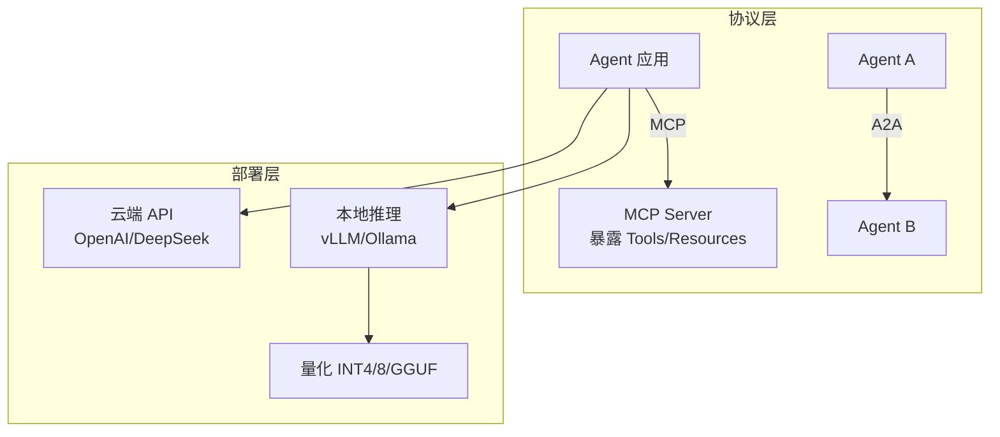
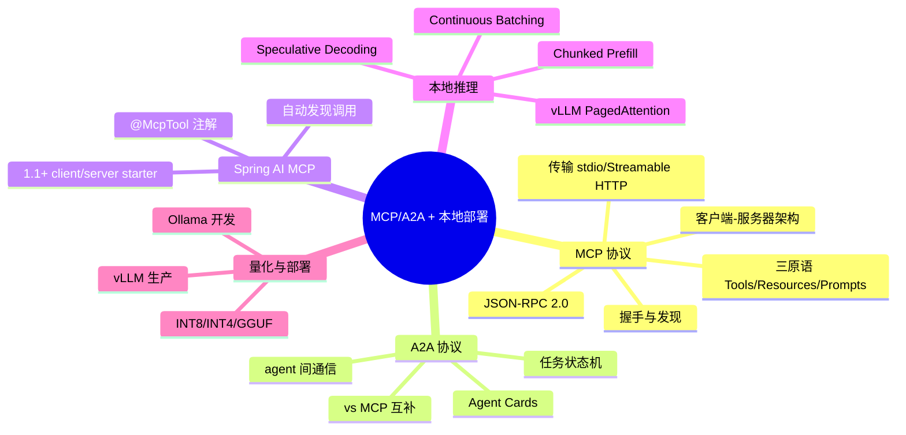
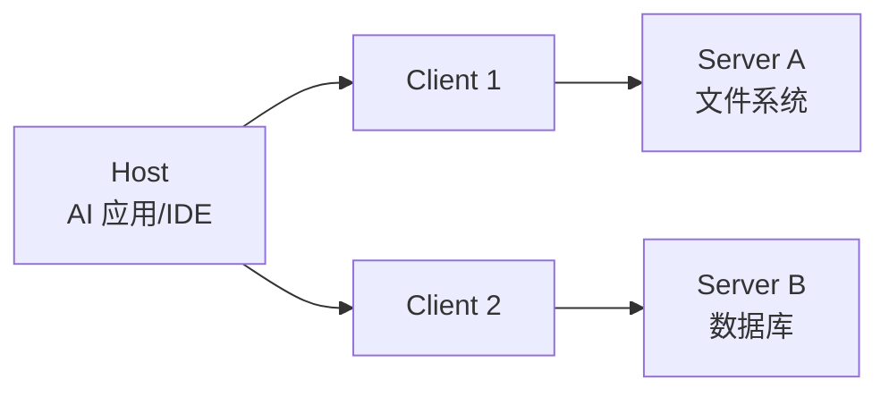

# MCP/A2A 协议与本地推理部署

> **文件编码**：UTF-8。MCP 部分基于 Spring AI **1.1.0-M1+**（2025-09 起完整支持 MCP），**1.0.x 的 MCP 支持不完整**——务必核对 [官方 MCP 文档](https://docs.spring.io/spring-ai/reference/1.0/api/mcp/mcp-overview.html) 与你 pom 版本。vLLM/量化部分基于 2025-2026 主流版本。
>
> **前置**：[04 Tool 设计](04-FunctionCalling与Tool设计.md)、[14 Agent 进阶](14-Agent进阶-多智能体与长程任务.md)、[17 LLM 原理](17-LLM原理与训练流程.md)（理解 KV Cache）、[19 成本延迟](19-成本与延迟优化.md)。

---

## 0. 读前导读

### 0.1 一句话弄懂本章

**04 章的 Function Calling 是「自家 Tool」**；本章讲 **MCP 让 Tool 标准化、可复用**（像 USB-C），以及 **A2A 让 Agent 间能协作**；再讲**本地部署大模型**（vLLM/量化）怎么做——私有化、降成本、数据不出境的刚需，2025 面试热词。

### 0.2 解决什么痛点

| 痛点 | 本章小节 |
|------|----------|
| 每个项目都重写查天气/查库的 Tool，不能复用 | §3 MCP |
| 多个 Agent 框架的 Tool 互不通用 | §3 MCP 标准化 |
| 面试问「MCP 是什么」答不出 | §3 |
| 数据敏感不能调云端 API / 想降调用成本 | §5 本地推理 |
| 问「vLLM 为什么快」答不出 | §5.2 |
| 问「模型量化是什么」答不出 | §6 |

### 0.3 学完能做到

1. 说清 **MCP** 是什么、解决什么、客户端-服务器架构、三原语（Tools/Resources/Prompts）
2. 说清 **A2A** 是什么、和 MCP 区别、为什么互补
3. 用 Spring AI（1.1+）写一个最小 **MCP Server 暴露 Tool + MCP Client 调用**
4. 说清 **vLLM 三大核心技术**（PagedAttention / Continuous Batching / Chunked Prefill）
5. 解释 **量化**（INT8/INT4/GGUF）为什么省显存、代价是什么
6. 说清**什么场景该本地部署、用什么方案**

### 0.4 一张图



### 0.5 学习姿势

- **§3 MCP**是 2025 面试必问热词，先吃透概念再谈代码
- **§5 vLLM 三大技术**是「为什么快」的深挖点
- 本章代码依赖 Spring AI **1.1+**，1.0.x 跑不了 MCP 部分，注意版本

### 0.6 不讲什么

- 不讲 MCP SDK 底层实现细节
- 不讲从零搭 vLLM（讲怎么用 + 核心原理）
- 不讲 GPU 选型采购

### 0.7 难度与时长

- 难度：★★★★☆
- 建议时长：**1.5 个学习单元**（MCP 概念 + vLLM 原理 + 跑一次 Ollama/vLLM）

### 0.8 常见困惑

| 困惑 | 简短回答 |
|------|----------|
| 「MCP 和 Function Calling 什么关系？」 | MCP 是**标准化 Function Calling 的协议**，让 Tool 跨应用复用 |
| 「本地部署一定要 GPU 吗？」 | 量化后小模型 CPU 也能跑（慢）；生产要快仍要 GPU |
| 「vLLM 和 Ollama 什么区别？」 | Ollama 易用适合开发/小规模；vLLM 高吞吐适合生产 |

---

## 1. 核心术语

### 1.1 MCP（Model Context Protocol，模型上下文协议）

- **定义**：Anthropic 2024 开源的**开放标准**，标准化 AI 应用如何连接外部数据源和工具。被比作「**AI 的 USB-C**」——一个通用接口接所有。
- **要解决的问题**：之前每个 AI 应用接每个数据源都要写定制集成，N 个应用 × M 个数据源 = N×M 个集成；MCP 把它变成 N+M（应用接 MCP、数据源实现 MCP）。
- **灵感**：来自 LSP（语言服务器协议）——VS Code 一个协议接所有语言。

### 1.2 A2A（Agent-to-Agent）

- **定义**：Google Cloud 提出的 agent 间通信协议，让不同框架/组织的自主 agent 能发现、委托任务、接收结果。
- **vs MCP**：MCP 连 **agent↔tool**（单 agent 扩能力）；A2A 连 **agent↔agent**（团队协作）。**互补**。

### 1.3 PagedAttention

- **定义**：vLLM 核心技术，把 KV Cache 分块存储（仿 OS 虚拟内存分页），非连续，内存浪费 <4%（vs 传统连续分配 60-80% 碎片）。

### 1.4 Continuous Batching（连续批处理）

- **定义**：迭代级调度，每个 decode step 后动态加入新请求/移除已完成请求，不让长请求阻塞短请求。吞吐 2-4x。

### 1.5 量化（Quantization）

- **定义**：把模型权重从高精度（FP16）压到低精度（INT8/INT4），省显存、提速，代价是轻微精度损失。

---

## 2. 知识地图



---

## 3. MCP 协议详解

### 3.1 架构：客户端-服务器 + JSON-RPC



- **Host**：AI 应用（如 IDE、聊天界面），发起连接。
- **Client**：Host 内的连接器，每个连一个 Server。
- **Server**：提供能力的服务（文件、数据库、API 等）。
- **消息**：**JSON-RPC 2.0**。

### 3.2 三原语（Server 暴露什么）

| 原语 | 是什么 | 类比 |
|------|--------|------|
| **Tools** | 可执行函数（API 调用、查库） | 04 章的 Function Calling |
| **Resources** | 数据/上下文（文件内容、日志） | 给模型读的资料 |
| **Prompts** | 可复用模板（few-shot、系统指令） | prompt 库 |

Client 也可提供：**Sampling**（让 Server 触发 LLM）、**Roots**（URI 边界）、**Elicitation**（向用户要信息）。

### 3.3 传输方式

- **stdio**：本地进程通信（Host 和 Server 同机）。
- **Streamable HTTP**（原 HTTP+SSE）：远程网络服务，2025 新规范替代旧 SSE 传输。

### 3.4 握手与发现

```
1. initialize / initialized    → 协商版本和能力
2. tools/list                  → 发现 Server 有哪些工具
3. resources/list、prompts/list → 发现资源和模板
4. tools/call                  → 调用某个工具
5. notifications/tools/list_changed → Server 工具变更通知
```

**动态发现**是关键——不预配置，运行时问 Server 有什么能力。

### 3.5 MCP vs 传统 Function Calling

| 维度 | 传统 Function Calling | MCP |
|------|----------------------|-----|
| Tool 定义 | 写死在应用代码 | Server 暴露，动态发现 |
| 复用 | 每个项目重写 | 一个 Server 多应用复用 |
| 跨框架 | 不通 | 标准协议，跨框架 |
| 生态 | 各自为政 | MCP Server 生态（官方仓库） |

> **面试标准答法**：「MCP 是 Anthropic 提的开放标准，把 AI 应用连接工具的方式标准化——像 LSP 之于编辑器、USB-C 之于接口。Server 暴露 Tools/Resources/Prompts 三原语，Client 通过 JSON-RPC 动态发现和调用。好处是一个 Server 多应用复用，从 N×M 集成变 N+M。」

---

## 4. A2A 协议

### 4.1 解决什么

MCP 解决「一个 agent 怎么连工具」；A2A 解决「**多个 agent 怎么协作**」——跨框架、跨组织。

### 4.2 核心概念

- **Agent Cards**：每个 agent 发布自描述（能力、支持的协议、接受的请求），用于发现协作方。
- **Task 状态机**：长任务有显式状态：
  ```
  SUBMITTED → WORKING → COMPLETED
                      → FAILED / CANCELED / REJECTED
                      → INPUT_REQUIRED / AUTH_REQUIRED
  ```
- **异步 + 流式**：可挂 SSE 流或 push 通知，可轮询 `GetTask` 续看。

### 4.3 MCP vs A2A（面试必背对比）

| 维度 | MCP | A2A |
|------|-----|-----|
| 连接 | agent ↔ tool | agent ↔ agent |
| 目的 | 扩展单 agent 能力 | 多 agent 团队协作 |
| 状态 | 单 session | Task 状态机 |
| 传输 | stdio / Streamable HTTP | JSON-RPC / gRPC / HTTP+JSON |
| 提出方 | Anthropic | Google Cloud |

**互补组合**：A2A 编排多 agent 团队，每个 agent 内部用 MCP 连自己的工具。

```
[Supervisor Agent] --A2A--> [Research Agent] --MCP--> [搜索 Server]
                          --A2A--> [Writer Agent]   --MCP--> [文档 Server]
```

> **面试加分**：被问「MCP 和 A2A 什么关系」答——**不是竞争是互补**：MCP 管 agent 连工具，A2A 管 agent 间协作，常组合：A2A 编排团队，每个 agent 用 MCP 连工具。这是体现前沿视野的答法。

---

## 5. Spring AI 的 MCP 支持（1.1+，注意版本）

> ⚠️ **版本关键**：Spring AI 完整 MCP 支持在 **1.1.0-M1（2025-09）及之后**，基于 MCP Java SDK v0.12.1。**1.0.x 的 MCP 支持不完整**，跑前务必确认你的版本。以下基于 1.1+，[官方 MCP 文档](https://docs.spring.io/spring-ai/reference/1.0/api/mcp/mcp-overview.html)。

### 5.1 Starter 一览

| 用途 | Starter |
|------|---------|
| Client（JDK HttpClient） | `spring-ai-starter-mcp-client` |
| Client（WebFlux） | `spring-ai-starter-mcp-client-webflux` |
| Server（STDIO） | `spring-ai-starter-mcp-server` |
| Server（WebMVC SSE） | `spring-ai-starter-mcp-server-webmvc` |
| Server（WebFlux SSE） | `spring-ai-starter-mcp-server-webflux` |

### 5.2 写一个 MCP Server 暴露 Tool（注解式，1.1+）

```java
@Service
public class WeatherMcpService {

    @McpTool(description = "查询某城市的天气")
    public String getWeather(@McpToolParam(description = "城市名") String city) {
        // 实际查天气逻辑
        return queryWeather(city);
    }
}
```

> **逐行**：
> - `@McpTool`：1.1 引入的注解，声明这是一个 MCP 工具，自动注册到 Server。
> - `@McpToolParam`：参数描述，帮助模型理解参数含义。
> - **类似 04 章的 `@Tool`，但暴露成 MCP 协议，可被任何 MCP Client 调用**。

配置 Server 协议：

```yaml
spring:
  ai:
    mcp:
      server:
        protocol: STREAMABLE   # 或 SSE / STDIO / STATELESS
        type: SYNC             # 或 ASYNC
```

### 5.3 写一个 MCP Client 调用远程 Server

```xml
<dependency>
  <groupId>org.springframework.ai</groupId>
  <artifactId>spring-ai-starter-mcp-client</artifactId>
</dependency>
```

```yaml
spring:
  ai:
    mcp:
      client:
        streamable-http:
          connections:
            my-weather-server:
              url: http://localhost:8080
```

```java
@Service
public class MyAgentService {

    private final ChatClient chatClient;
    // mcpToolProvider 由 starter 自动配置，含所有连接的 MCP Server 的 tools

    public MyAgentService(ChatClient.Builder builder, McpToolProvider mcpToolProvider) {
        this.chatClient = builder
            .defaultTools(mcpToolProvider)   // 把 MCP 工具挂给 ChatClient
            .build();
    }

    public String ask(String q) {
        // 模型对话时自动发现并调用已连接 MCP Server 的工具
        return chatClient.prompt().user(q).call().content();
    }
}
```

> **逐行**：
> - `McpToolProvider`：starter 自动配置，聚合所有已连接 MCP Server 的工具。
> - `.defaultTools(mcpToolProvider)`：把 MCP 工具挂给 ChatClient——**模型对话时自动发现并调用**，就像 04 章的本地 Tool，但这些 Tool 来自远程 MCP Server。
> - **这就是 MCP 的价值**：你的 Agent 不用写查天气代码，连一个天气 MCP Server 就能用。

> **版本提醒**：以上 API 形态基于 1.1.0-M1+。`@McpTool`/`McpToolProvider` 在 1.0.x 可能不存在或不同。**跑前核对你 pom 版本的官方文档**。

---

## 6. 本地推理部署：vLLM 与 Ollama

### 6.1 为什么要本地部署

| 场景 | 为什么本地 |
|------|-----------|
| 数据敏感 | 不能出境（医疗/金融/政务） |
| 降成本 | 大量调用，本地比云端 API 便宜 |
| 低延迟 | 内网调用无外网往返 |
| 定制 | 微调后的模型（[20](20-模型适配方法论与微调入门.md)）要自己服务 |

### 6.2 vLLM 为什么快：三大核心技术

#### 6.2.1 PagedAttention（管 KV Cache 内存）

- **问题**：传统把每个请求的 KV Cache 连续分配，长度变化导致**碎片化浪费 60-80% 显存**。
- **解决**：把 KV Cache 分成固定大小**块**（像 OS 虚拟内存分页），非连续存储，按需分配。
- **效果**：内存浪费 <4%，同样显存能并发更多请求，吞吐高（比 HF Transformers 高 24x）。

#### 6.2.2 Continuous Batching（动态批处理）

- **问题**：静态批处理要等批里最慢的请求完成才能换批，长请求拖累短请求，GPU 空转。
- **解决**：**每个 decode step 后**检查三个队列（WAITING/RUNNING/SWAPPED），完成的移出、新请求加入。
- **效果**：GPU 始终满载，吞吐 2-4x，长请求不再阻塞短请求。

#### 6.2.3 Chunked Prefill（分块预填充）

- **问题**：长 prompt 的 prefill 是一次性大计算，会冻结所有 decode token。
- **解决**：把长 prompt 切成 ~512 token 的片，与 decode 交错执行。
- **效果**：长 prompt 不再卡住正在生成的请求，混合流量延迟优。

#### 6.2.4 Speculative Decoding（投机解码，进阶）

- **思路**：用小 **draft 模型**猜 k 个 token，大模型并行验证，命中就一次出多个 token。
- **方法**：EAGLE、MTP、n-gram，`--speculative-config` 配置。
- **效果**：接受率高时生成延迟大降；取决于 draft 模型和目标模型的匹配。

> **面试标准答法**：「vLLM 快靠三点：**PagedAttention** 把 KV Cache 分块管理，显存浪费从 60-80% 降到 <4%；**Continuous Batching** 迭代级调度，每步动态进出请求，GPU 满载；**Chunked Prefill** 长 prompt 切片与 decode 交错，不卡生成。再叠加 Speculative Decoding 用小模型猜大模型验。」这是深挖点的满分答法。

### 6.3 vLLM 用法（极简）

```bash
# 起一个 OpenAI 兼容的服务
vllm serve Qwen/Qwen2.5-7B-Instruct \
  --port 8000 \
  --max-model-len 32768

# 之后像调 OpenAI 一样调本地
curl http://localhost:8000/v1/chat/completions \
  -H "Content-Type: application/json" \
  -d '{"model":"Qwen/Qwen2.5-7B-Instruct","messages":[{"role":"user","content":"你好"}]}'
```

> **关键**：vLLM 暴露 **OpenAI 兼容 API**，所以 Spring AI 用 OpenAI starter 改 `base-url` 指向本地 vLLM 即可——**业务代码不用改**（和 [02](02-SpringAI核心开发.md) 调 DeepSeek 同理）。

### 6.4 Ollama（开发/小规模）

- **定位**：易用，一行命令跑模型，适合开发、原型、小规模。
- **用法**：`ollama run qwen2.5:7b`。
- **vs vLLM**：Ollama 易用但吞吐低；**生产高并发用 vLLM**，开发用 Ollama。
- Spring AI 有 `spring-ai-ollama` starter（[01](01-大模型基础与API调用入门.md) 已用）。

---

## 7. 量化：让大模型塞进小显存

### 7.1 为什么量化

- 7B 模型 FP16 要 ~14GB 显存；70B 要 ~140GB。
- 量化到 INT4：7B ~4GB（消费级显卡能跑），70B ~40GB（单 A100/H100 可跑）。

### 7.2 量化级别

| 精度 | 显存（7B） | 精度损失 | 适合 |
|------|-----------|----------|------|
| FP16 | ~14GB | 无 | 有大显存，追求质量 |
| INT8 | ~7GB | 极小 | 通用，质量敏感 |
| INT4 | ~4GB | 小 | 显存紧，消费级 GPU |
| GGUF | 灵活 | 看量化级 | llama.cpp/Ollama 用 |

### 7.3 GGUF

- **定义**：llama.cpp 生态的模型文件格式，支持多种量化级别（Q4_K_M、Q5、Q8 等）。
- **用法**：Ollama 拉的模型底层就是 GGUF；也可直接用 llama.cpp 跑。
- **适合**：CPU 推理、Mac、消费级显卡。

### 7.4 量化代价

- 精度损失：INT4 比 FP16 略差，多数任务可接受（<2% 评测下降）。
- 量化模型有时「脆弱」：边缘 case 更易出错。
- **质量敏感用 INT8，极致省资源用 INT4**，看评测（[20 §6](20-模型适配方法论与微调入门.md)）。

---

## 8. 选型：什么场景用什么部署

| 场景 | 方案 |
|------|------|
| 开发练手 | Ollama 本地 |
| 生产高并发 | vLLM（GPU） |
| 显存紧 | vLLM + 量化（INT4/8） |
| 数据敏感 + 无 GPU | 云端私有部署 / 私有化 API |
| 微调模型服务 | vLLM 加载 LoRA adapter 或合并后模型 |
| 极致降延迟 | vLLM + Speculative Decoding |

---

## 9. 报错与踩坑表

| 现象 | 原因 | 解决 |
|------|------|------|
| Spring AI 找不到 `@McpTool` | 版本是 1.0.x | 升到 1.1.0-M1+ 或用 MCP Java SDK 原生 API |
| MCP Client 连不上 Server | URL/协议不对 | 核对 `spring.ai.mcp.client.*.connections` 和 Server protocol |
| vLLM OOM | 显存不够 / max-model-len 过大 | 降 `max-model-len` 或量化 |
| 量化后效果差 | INT4 对该任务损失大 | 升 INT8 或换模型 |
| vLLM 比 Ollama 慢 | 配置不当 / 批量未开 | 确认 continuous batching、调 `--max-num-seqs` |
| Ollama CPU 跑大模型极慢 | CPU 推理慢 | 上 GPU 或换小模型 |

---

## 10. 常见困惑 FAQ

**Q1：MCP 会取代 Function Calling 吗？**
A：不会取代，是**标准化升级**。Function Calling 是模型能力（能按 schema 调函数），MCP 是工具暴露的协议标准。MCP Server 暴露的 tools 最终也通过 Function Calling 被模型调用。

**Q2：Spring AI 1.0.x 能用 MCP 吗？**
A：1.0.x 的 MCP 支持不完整。**完整支持在 1.1.0-M1+**。1.0.x 可用 MCP Java SDK 原生 API 但要自己接，不如 1.1 starter 方便。

**Q3：A2A 现在成熟吗？**
A：比 MCP 更新，生态在起步。**面试知道概念和与 MCP 区别即可**，生产落地案例还少。

**Q4：vLLM 一定要 GPU 吗？**
A：是，vLLM 面向 GPU 高吞吐。CPU 推理用 llama.cpp/Ollama。

**Q5：量化模型能微调吗？**
A：QLoRA 就是「量化基座 + LoRA」（[20 §4.3](20-模型适配方法论与微调入门.md)）。量化基座上训 LoRA adapter，单卡微调大模型。

**Q6：本地部署比云端 API 便宜吗？**
A：看调用量。**量大时本地便宜**（一次性硬件成本摊薄）；量小时云端 API 更省（免运维、免硬件）。还要算运维人力。

**Q7：vLLM 和 Ollama 能同时用吗？**
A：能。开发用 Ollama 快速试，生产用 vLLM。两者都暴露 OpenAI 兼容 API，Spring AI 切换只改 `base-url`。

**Q8：MCP Server 谁来建？**
A：① 用官方仓库的现成 Server（文件、GitHub、Slack 等）；② 自己用 Spring AI MCP Server starter 暴露业务能力。**你的 Spring Boot 服务可以同时是 MCP Server**。

**Q9：PagedAttention 为什么能省那么多？**
A：传统连续分配按「最长可能长度」预留 + 长度变化产生碎片，浪费 60-80%。分块按需分配，只在最后一块浪费一点，<4%。**省下的显存能并发更多请求**。

**Q10：Speculative Decoding 一定快吗？**
A：不一定。取决于 draft 模型猜得准不准（**接受率**）。接受率高大加速，低反而白费 draft 计算。要看任务和模型匹配。

**Q11：MCP 安全吗？**
A：MCP 给了 AI 访问数据和执行代码的能力，**有安全考虑**（[Web安全 07](../../前端学习/Web安全/07-LLM应用安全与Prompt注入防护.md)）。Spring AI 1.1 的 WebMVC Server 支持 Spring Security `@PreAuthorize`、OAuth2/JWT。生产要加鉴权、最小权限、审计。

**Q12：本地部署模型怎么选？**
A：按显存和任务：7B 适合 16GB 显卡、70B 要多卡或量化；中文优先 Qwen/DeepSeek/GLM；推理任务用推理模型（[22](22-大模型生态选型与前沿推理范式.md)）。

---

## 11. 闭卷自测（10 题）

1. MCP 解决什么问题？用「USB-C」「N×M→N+M」解释。
2. MCP 的三原语是什么？各自类比 Function Calling 的什么？
3. MCP 的传输方式有哪些？握手与发现流程？
4. A2A 和 MCP 的 4 个区别？为什么说互补？
5. vLLM 三大核心技术各解决什么问题？
6. PagedAttention 为什么能把显存浪费从 60-80% 降到 <4%？
7. Continuous Batching 和静态批处理的区别？为什么吞吐 2-4x？
8. INT4/INT8/FP16 各多少显存（7B）？怎么选？
9. 什么场景该本地部署？vLLM 和 Ollama 各适合什么？
10. Spring AI 1.1 用什么注解声明 MCP 工具？版本要注意什么？

> 做对 8 题以上过关；不到 6 题重读 §3 和 §6。

---

## 12. 费曼检验

向一个**做传统后端的同事**讲 3 分钟：

1. MCP 是什么、为什么像 USB-C（N×M→N+M）
2. MCP vs A2A（agent↔tool vs agent↔agent，互补）
3. vLLM 为什么快（三大技术各一句）
4. 量化为什么省显存、代价是什么

---

## 13. 进阶档练习

1. **MCP 概念**：画一张「Host/Client/Server + 三原语 + JSON-RPC」架构图。
2. **（需 1.1+）跑 MCP**：用 `spring-ai-starter-mcp-server` 暴露一个查询 Tool，再用 client starter 连上调用。
3. **vLLM 实操**：本地或租 GPU 起 vLLM 服务，Spring AI 改 `base-url` 调通。
4. **量化对比**：同一模型 FP16 vs Q4 在 Ollama 跑，对比显存和速度。
5. **选型练习**：给 3 个场景（医疗私有化、低成本高并发、开发练手）选部署方案。

---

## 14. 交叉引用

- Function Calling 基础：[04 Tool 设计](04-FunctionCalling与Tool设计.md)
- 多 Agent 协作：[14 Agent 进阶](14-Agent进阶-多智能体与长程任务.md)
- KV Cache 原理：[17 LLM 原理](17-LLM原理与训练流程.md) §7
- 成本延迟：[19 成本与延迟优化](19-成本与延迟优化.md)
- 微调模型部署：[20 模型适配](20-模型适配方法论与微调入门.md) §7
- LLM 安全：[Web安全 07](../../前端学习/Web安全/07-LLM应用安全与Prompt注入防护.md)
- MCP 规范：https://modelcontextprotocol.io/
- Spring AI MCP：https://docs.spring.io/spring-ai/reference/1.0/api/mcp/mcp-overview.html
- vLLM：https://vllm.ai/
- PagedAttention 论文：Kwon et al., SOSP 2023
