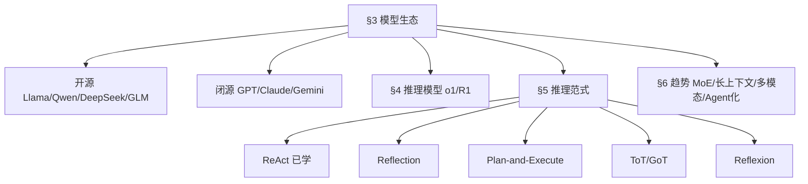
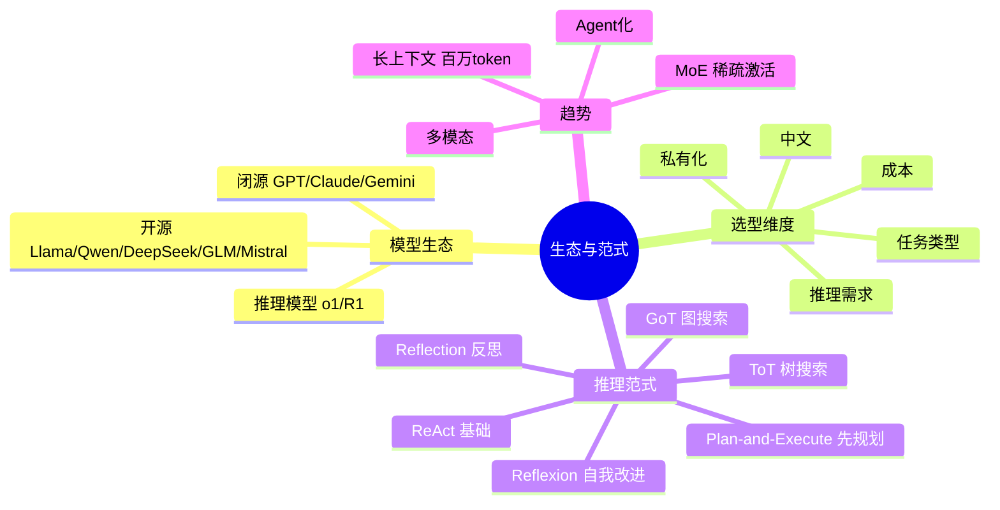

# 大模型生态选型与前沿推理范式

> **文件编码**：UTF-8。模型版本迭代极快，本章模型列举以 2025-2026 主流为参考，**选型时务必查最新版本和 benchmark**。前沿范式部分偏研究/视野，面试作为加分项体现你跟前沿。
>
> **前置**：[01 大模型基础](01-大模型基础与API调用入门.md)、[17 LLM 原理](17-LLM原理与训练流程.md)、[05 Agent 架构](05-Agent架构与ReAct模式.md)、[14 Agent 进阶](14-Agent进阶-多智能体与长程任务.md)。

---

## 0. 读前导读

### 0.1 一句话弄懂本章

**前面 17～21 讲「原理 + 工程」**；本章讲「**模型选哪款 + Agent 推理范式的演进**」——大模型岗面试会问「你了解哪些模型、怎么选」「ReAct 之外还有什么范式」，答得出体现前沿视野。

### 0.2 解决什么痛点

| 痛点 | 本章小节 |
|------|----------|
| 面试问「你用过哪些模型、怎么选」只会说「GPT」 | §3 |
| 问「DeepSeek 为什么火」答不出 | §3 + §4 |
| 问「推理模型是什么」答不出 | §4 |
| 问「ReAct 之外还有什么 Agent 范式」答不出 | §5 |

### 0.3 学完能做到

1. 说清**开源 vs 闭源**格局，列出主流模型和各自特点
2. 按**任务/成本/中文/私有化/推理**五维度做模型选型
3. 说清**推理模型**（o1/R1 类）和普通模型区别、适用场景
4. 讲清 **Reflection / Plan-and-Execute / ToT / GoT / Reflexion** 五种前沿范式
5. 说清 LLM 发展趋势（MoE、长上下文、多模态、Agent 化）

### 0.4 一张图



### 0.5 学习姿势

- **§3 选型**是实用核心，能直接用
- **§5 范式**是视野加分，重在「知道、能讲」不要求实现
- 本章**不用敲代码**，是概念和判断力

### 0.6 不讲什么

- 不讲模型内部架构细节（[17](17-LLM原理与训练流程.md) 已讲 Transformer）
- 不讲 benchmark 具体分数（变化快，给查询思路）
- 不讲纯学术前沿（重点工程相关）

### 0.7 难度与时长

- 难度：★★★☆☆
- 建议时长：**1 个学习单元**

### 0.8 常见困惑

| 困惑 | 简短回答 |
|------|----------|
| 「模型这么多我全学吗？」 | 不用。懂**选型维度** + 重点用 2~3 款即可 |
| 「推理范式我能用上吗？」 | 框架（如 LangGraph）有现成实现；知道何时用比手写重要 |

---

## 1. 核心术语

### 1.1 推理模型（Reasoning Model）

- **定义**：用 RL 强化「先长链推理再答」的模型，如 OpenAI o1/o3、DeepSeek-R1。生成时输出可见或隐藏的「思考过程」。
- **vs 普通模型**：普通模型直接答；推理模型先想再答，数学/代码/复杂推理强，但慢且贵。

### 1.2 MoE（Mixture of Experts）

- 见 [17 §7.5](17-LLM原理与训练流程.md)。多专家子网络，每 token 激活少数，总参数大单次计算省。

### 1.3 长上下文（Long Context）

- **定义**：上下文窗口达 128K~1M token 的能力。
- **意义**：能一次塞整本书/整个代码库；但不替代 RAG（[17 §7.1](17-LLM原理与训练流程.md)）。

### 1.4 多模态（Multimodal）

- **定义**：能处理文本 + 图像（+音频/视频）的模型，如 GPT-4o、Gemini、Qwen-VL。

---

## 2. 知识地图



---

## 3. 大模型生态与选型

### 3.1 闭源主流

| 模型 | 厂商 | 强项 |
|------|------|------|
| GPT 系列 | OpenAI | 生态最全、综合能力强、Function Calling 稳 |
| Claude 系列 | Anthropic | 长文本、代码、安全对齐好、MCP 发起方 |
| Gemini 系列 | Google | 多模态强、长上下文、集成 Google 生态 |

### 3.2 开源主流

| 模型 | 来源 | 特点 |
|------|------|------|
| Llama | Meta | 开源标杆，生态广，英文强 |
| Qwen | 阿里 | 中文强、多尺寸、多模态、开源友好 |
| DeepSeek | 深度求索 | MoE 架构、性价比高、推理模型 R1 出圈 |
| GLM | 智谱 | 中文、Agent 能力、开源 |
| Mistral | Mistral | 欧洲代表、MoE（Mixtral）、高效 |

> ⚠️ 模型版本迭代快，**选型查最新版本和 benchmark**（如 LMSYS Arena、Open LLM Leaderboard、SuperCLUE 中文）。

### 3.3 选型五维度

| 维度 | 考虑 |
|------|------|
| **任务** | 生成/对话→Decoder-only；分类→可 Embedding 模型；推理→推理模型 |
| **成本** | 大量调用看单价；可本地部署开源降成本（[21](21-MCP-A2A协议与本地推理部署.md)） |
| **中文** | 国产（Qwen/GLM/DeepSeek）中文 token 效率高、语义强 |
| **私有化** | 数据敏感选开源本地部署；不敏感用闭源 API |
| **推理** | 数学/代码/复杂逻辑选推理模型；日常对话选普通模型 |

### 3.4 选型决策树

```
1. 数据能出境吗？
   不能 → 开源本地部署（Qwen/DeepSeek/GLM）→ §3.3
   能 → 走 2
2. 要极致推理（数学/代码/复杂逻辑）？
   是 → 推理模型（o1/R1 类），但慢贵
   否 → 走 3
3. 中文为主？
   是 → Qwen/DeepSeek/GLM 或国产 API
   否 → GPT/Claude/Llama
4. 大量调用要省钱？
   是 → 小模型 + 必要时微调（[20](20-模型适配方法论与微调入门.md)）
```

### 3.5 面试标准答法

被问「你了解哪些模型、怎么选」：

> 「闭源 GPT/Claude/Gemini 综合强但要求数据能出境；开源 Llama/Qwen/DeepSeek/GLM 可私有化，中文场景我优先 Qwen/DeepSeek。选型看五条：任务类型、成本、中文、能否私有化、是否需要推理能力。推理任务用 o1/R1 类推理模型，日常用普通模型。本地部署用 vLLM 跑开源量化版降成本。」

> 这套答法覆盖格局 + 选型逻辑 + 成本意识，是大模型岗合格线之上。

---

## 4. 推理模型（o1/R1 类）

### 4.1 什么是推理模型

- 用 **RL（GRPO + 可验证奖励）** 强化「先长链 CoT 推理再答」的能力（[17 §6.4.3](17-LLM原理与训练流程.md)）。
- 生成时会先输出（可见或隐藏的）思考过程，再给最终答案。
- 代表：OpenAI o1/o3、DeepSeek-R1。

### 4.2 vs 普通模型

| 维度 | 普通模型 | 推理模型 |
|------|----------|----------|
| 答题方式 | 直接答 | 先想再答 |
| 数学/代码 | 中 | 强 |
| 复杂推理 | 弱 | 强 |
| 速度 | 快 | 慢（思考耗 token） |
| 成本 | 低 | 高 |
| 适用 | 日常对话/通用 | 数学/代码/逻辑难题 |

### 4.3 何时用推理模型

- ✅ 数学证明、复杂算法题、多步逻辑推理、代码难题。
- ❌ 简单问答、闲聊、格式化输出（反而慢贵易啰嗦）。

> **面试加分**：「推理模型不是万能，它用更多 token 思考换推理质量。日常任务用普通模型，复杂推理才上推理模型——成本和延迟考量。」这是有取舍判断的答法。

---

## 5. Agent 推理范式演进（前沿加分）

> 05 章讲了 ReAct（基础）。这里讲 ReAct 之后的演进，体现前沿视野。

### 5.1 ReAct（已学，基础）

`Thought → Action → Observation` 循环。见 [05](05-Agent架构与ReAct模式.md)。

### 5.2 Reflection（反思）

- **思路**：Agent 行动后**自我评估**结果对不对，不对就反思改进再试。
- **价值**：从「只做不看」到「做了复盘」，提高成功率。
- **实现**：加一个「反思 LLM 调用」评估上一步结果，把反思写回上下文。

### 5.3 Plan-and-Execute（先规划后执行）

- **思路**：先让 Planner LLM 生成完整计划（步骤列表），再逐步执行；执行中可重规划。
- **vs ReAct**：ReAct 边走边想（每步决策）；Plan-Execute 先规划全局再执行，适合长任务。
- **对应**：[14](14-Agent进阶-多智能体与长程任务.md) 的 Planner 模式。

### 5.4 Tree of Thoughts（ToT，思维树）

- **思路**：把推理组织成**树**，每步生成多个候选思路，评估剪枝，搜索最优路径（可 BFS/DFS）。
- **vs CoT**：CoT 一条链走到底；ToT 分叉搜索，能回溯。
- **适合**：需要探索/回溯的难题（如 24 点游戏、创意规划）。
- **代价**：计算量指数增长。

### 5.5 Graph of Thoughts（GoT，思维图）

- **思路**：ToT 的泛化——思路间可**任意合并**（不只树结构），形成图。
- **价值**：能合并不同分支的洞见，更灵活。
- **代价**：更复杂。

### 5.6 Reflexion（反思增强）

- **思路**：ReAct + Reflection——失败后生成「语言反馈」（反思），存进记忆，下次尝试带着反思做。
- **价值**：从失败学习，多轮尝试提升。
- **对应**：[14](14-Agent进阶-多智能体与长程任务.md) 的记忆机制 + 自我改进。

### 5.7 范式对比

| 范式 | 核心 | 适合 |
|------|------|------|
| ReAct | 边想边做 | 通用 Tool 任务 |
| Reflection | 做完反思 | 提高单步质量 |
| Plan-Execute | 先规划全局 | 长任务 |
| ToT | 树搜索回溯 | 探索类难题 |
| GoT | 图合并思路 | 复杂创意 |
| Reflexion | 反思+记忆 | 多轮自我改进 |

> **面试杀手锏**：被问「ReAct 之外还有什么」答——「**Reflection** 加自我评估；**Plan-and-Execute** 先规划后执行适合长任务；**ToT/GoT** 树/图搜索适合探索回溯；**Reflexion** 把反思存记忆多轮改进。实际工程里 ReAct + Reflection + Plan-Execute 最实用，ToT/GoT 计算贵多用于研究。」这是体现前沿视野的高分答法。

---

## 6. 发展趋势（视野题）

### 6.1 MoE 成主流

DeepSeek/Mixtral 等用 MoE——总参数大（知识多）+ 激活稀疏（单次省算力），「又强又便宜」的秘诀。

### 6.2 长上下文军备竞赛

128K → 1M token。但**长上下文不替代 RAG**（成本、lost in the middle、更新问题，[17 §7.1](17-LLM原理与训练流程.md)）。

### 6.3 多模态普及

GPT-4o、Gemini、Qwen-VL 等图文一体。Agent 处理图表/截图/文档扫描的需求推动多模态。

### 6.4 推理模型崛起

o1/R1 证明「用 RL 强化推理」有效，推理模型成新赛道。

### 6.5 Agent 化

从「聊天」到「能行动的 Agent」——Tool use、MCP/A2A、长程任务（[14](14-Agent进阶-多智能体与长程任务.md)）、AI Coding Agent（Cursor/Devin 类）。

### 6.6 小模型 + Agent 模式

趋势：用小模型 + 强 Agent 框架（Tool/RAG/规划）达到过去大模型的效果，降成本。

> **面试问「你怎么看大模型趋势」**答——「MoE 让大模型省算力、长上下文扩能力但不替 RAG、推理模型崛起、Agent 化从聊天到行动、小模型+Agent 框架降本。」四条趋势体现你跟前沿。

---

## 7. 常见困惑 FAQ

**Q1：开源模型追上闭源了吗？**
A：部分场景追上甚至超越（如 DeepSeek-R1 推理）。整体闭源仍领先但差距缩小。**选型看任务和约束**，不是越贵越好。

**Q2：推理模型能替代普通模型吗？**
A：不能。推理模型慢贵，日常任务用普通模型更合适。**按任务选**。

**Q3：ToT/GoT 工程上能用吗？**
A：计算贵、实现复杂，生产少用。**ReAct + Reflection + Plan-Execute 更实用**。ToT/GoT 多用于研究/难题。LangGraph 等框架有 ToT 参考实现。

**Q4：国产模型和 GPT 差距大吗？**
A：中文场景国产（Qwen/DeepSeek/GLM）常优于或持平 GPT，且私有化友好。英文/综合 GPT/Claude 仍强。**中文业务优先试国产**。

**Q5：模型更新这么快，学了会过时吗？**
A：模型会变，但**选型方法论、推理范式、工程实践**（RAG/Tool/评估/可观测）不会过时。本章学的是判断力，不是背版本号。

**Q6：Embedding 模型怎么选？**
A：中文用 BGE/bge-large-zh、Qwen embedding；英文用 OpenAI text-embedding-3、bge-large-en。看 MTEB benchmark。**Embedding 和生成模型可不同**（[06](06-RAG检索增强生成基础.md)）。

**Q7：MCP 会统一 Tool 生态吗？**
A：有这个趋势（Anthropic + Spring + 各家跟进），但生态成熟要时间。**知道概念、关注发展**即可，生产可逐步试。

**Q8：AI Coding Agent（Cursor/Devin）算什么范式？**
A：综合 Agent——ReAct + Plan-Execute + Reflection + Tool（文件/终端/搜索）+ 长程任务。是 Agent 化的典型产品。

**Q9：小模型 + Agent 真的能替大模型吗？**
A：在**特定任务**能（如固定领域 + 微调 + 强 Tool）。通用闲聊/复杂推理仍需大模型。**按任务试**。

**Q10：模型选错会怎样？**
A：成本超预算、质量不达标、延迟过高、合规风险。**选型是工程第一道关**，用评测集验证（[13](13-RAG进阶-检索优化与评估.md)）。

---

## 8. 闭卷自测（10 题）

1. 闭源三强和开源五强分别是谁？各一个特点？
2. 模型选型五个维度是什么？
3. 中文为主 + 数据不能出境，选什么？为什么？
4. 推理模型和普通模型的 4 个区别？何时用推理模型？
5. Reflection 和 Reflexion 区别？
6. Plan-and-Execute 和 ReAct 区别？各适合什么？
7. ToT 和 CoT 区别？ToT 代价是什么？
8. MoE 为什么「又强又便宜」？
9. 长上下文为什么不能替代 RAG？
10. 大模型发展的 4 个趋势？

> 做对 8 题以上过关；不到 6 题重读 §3 和 §5。

---

## 9. 费曼检验

向一个**非技术朋友**讲 3 分钟：

1. 现在有哪些大模型，开源闭源各举几个
2. 怎么选模型（任务/成本/中文/隐私/推理五条）
3. 推理模型为什么慢但强
4. Agent 除了 ReAct 还有哪些思路（反思/规划/树搜索）

---

## 10. 进阶档练习

1. **选型报告**：给一个虚构公司（中文客服、日均 10 万调用、数据敏感），写模型选型报告含推荐 + 理由 + 备选。
2. **范式画图**：画出 ReAct / Reflection / Plan-Execute / ToT 的流程对比图。
3. **推理模型对比**：同一道数学题，普通模型 vs 推理模型（若有 API）对比结果和耗时。
4. **趋势跟踪**：选一个 benchmark（MTEB/LMSYS/SuperCLUE），学会查最新排名。
5. **范式组合**：设计一个「Plan-Execute + Reflection + 长期记忆」的 Agent 架构，说清每部分解决什么。

---

## 11. 交叉引用

- Agent 基础范式：[05 ReAct](05-Agent架构与ReAct模式.md)
- 多 Agent/长程：[14 Agent 进阶](14-Agent进阶-多智能体与长程任务.md)
- LLM 原理（MoE/上下文）：[17 LLM 原理](17-LLM原理与训练流程.md) §7
- 微调选模型：[20 模型适配](20-模型适配方法论与微调入门.md)
- 本地部署：[21 本地推理](21-MCP-A2A协议与本地推理部署.md)
- 成本/延迟选型：[19 成本与延迟优化](19-成本与延迟优化.md)
- ReAct 论文：Yao et al., ICLR 2023
- Reflexion 论文：Shinn et al., NeurIPS 2023
- ToT 论文：Yao et al., NeurIPS 2023
- LMSYS Arena：https://lmarena.ai/
- Open LLM Leaderboard：https://huggingface.co/spaces/open-llm-leaderboard
