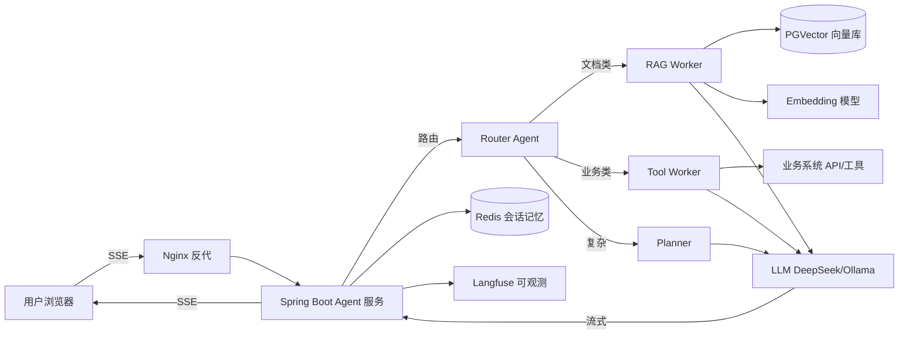

# 23 Agent + Java 端到端项目实战：从 0 到能写进简历

> 这一篇和前面 01～22 不同：前面是"知识点"，这一篇是**把知识点变成一个能写进简历、能在面试现场扛住追问的项目**。光背八股没有项目，面试官问"你做过什么"时容易崩；这一篇给你一个完整项目，并教你每个技术点怎么应对深挖。

---

## 本章与上一章的关系

[22 章](22-大模型生态选型与前沿推理范式.md)给了你"选什么模型、用什么推理范式"的视野。这一章把 01～22 的能力（Spring AI、RAG、Function Calling、多智能体、SSE 流式、可观测、成本优化、MCP/本地推理）**落到一个真实项目里**，并补上前面所有章都没专门讲的三个维度：**项目架构、技术选型理由、面试追问应对**。

> 配套：[24 大厂面试实战手册](24-大厂面试实战手册.md) 把这个项目和全库八股聚成面试战斗力。

---

## 0. 读前导读（零基础也能跟上）

### 0.1 用一句话弄懂本章

**一句话**：带你从需求→架构→选型→编码→部署→优化→排障→面试追问，完整做一个"企业知识库智能问答 Agent"，做完你能拿到一个**简历可写、现场可讲、追问可扛**的项目。

**生活类比**：前面 22 章是学了菜谱和刀工，这一章是让你**端出一道完整的菜**——面试官不只问"盐放多少"，还会问"你这道菜为什么这样搭配、换个做法行不行、上次做糊了怎么救的"。

### 0.2 你需要提前知道什么

- Spring Boot 接口 + Spring AI ChatClient：[04 Spring Boot 核心](../Java/04-SpringBoot核心开发.md)、[02 SpringAI 核心开发](02-SpringAI核心开发.md)
- RAG 全流程：[06 RAG 检索增强生成](06-RAG检索增强生成基础.md)、[13 RAG 进阶](13-RAG进阶-检索优化与评估.md)
- Function Calling 与多智能体：[04 Function Calling 与 Tool 设计](04-FunctionCalling与Tool设计.md)、[14 Agent 进阶](14-Agent进阶-多智能体与长程任务.md)
- SSE 流式：[03 流式对话与 SSE](03-流式对话与SSE实战.md)、[16 SSE/WebSocket](../Java/16-SSE与WebSocket实时通信.md)
- 可观测：[15 LLM 可观测性与评估体系](15-LLM可观测性与评估体系.md)

**真不会就先回去补**：如果 02/04/05 没跑通过最小 demo，先别做这个项目，会处处卡。

### 0.3 本章知识地图（学完后应能勾选全部 ☐→☑）

- [ ] 能用一段话讲清这个项目"是什么、解决了什么、用了什么、难点在哪"
- [ ] 能白板画出整体架构图（用户→网关→Agent→RAG/工具→LLM→流式回）
- [ ] 能回答"为什么用 Spring AI 不用 LangChain4j""为什么用 PGVector 不用 Milvus"等至少 6 个选型问题
- [ ] 亲手跑通过最小版本（至少 RAG + 流式 + 一个工具）
- [ ] 能讲出 3 个线上问题场景的排查思路
- [ ] 能针对每个核心技术点列出 2 条面试官可能的追问 + 你的答案

### 0.4 建议学习时长与节奏

- 第 1 遍（读懂架构与选型）：3～4 小时
- 第 2 遍（手敲跑通最小版本）：1～2 天
- 第 3 遍（加多智能体 + 可观测 + 压测）：3～5 天
- 面试冲刺（背追问应对）：反复看 §9

### 0.5 学完本章你能做什么

1. 简历上多一条**能扛 3 轮技术追问**的 Agent 项目
2. 面试现场能 5 分钟讲清架构和选型
3. 被追问"这个地方为什么这么做/换一种行不行"时不卡壳
4. 拿到类似需求能独立从 0 搭起来

---

## 1. 为什么必须有这一章（先端正认知）

**问题**：前面 22 章学完，你"知道"了 RAG、Function Calling、多智能体……但面试官问的是：

- "你做过什么 Agent 项目？讲讲架构。"
- "这个项目最难的地方是什么？你怎么解决的？"
- "为什么用 RAG 不用微调？为什么用这个向量库？"
- "上线后遇到过什么问题？怎么排查的？"

**没有项目，这些问题一个都答不好**。八股是"知道"，项目是"做过并理解为什么"。大厂面试的项目轮，权重往往高于八股轮。

**这一章的定位**：不是教你又一个知识点，而是给你一个**可复制的项目模板**——你照着做一遍、改一改业务场景，就是你的项目。重点是教你**怎么想架构、怎么做选型、怎么应对追问**，这三件事比代码本身更值钱。

> 真心话：这一章的代码你**必须亲手敲一遍并跑通最小版本**，只看不敲，面试时一问代码细节就露馅。看 10 遍不如跑 1 遍。

---

## 2. 项目定位与简历包装

### 2.1 项目是什么

**项目名**：企业知识库智能问答 Agent（Enterprise Knowledge Q&A Agent）

**一句话**：员工在内网提问，系统检索企业文档库 + 调用业务系统工具（查订单/查假期），用大模型生成带引用的流式回答，全程可观测、可控成本。

**为什么选这个场景**：
- 是 Agent 最主流的落地场景（几乎每家做 AI 的公司都有类似需求），面试官熟悉、好理解。
- 天然需要 RAG（文档检索）+ Function Calling（业务工具）+ 多步推理（复杂问题拆解）+ 流式（长回答体验）+ 可观测（企业要审计）——覆盖面够广，能体现深度。
- 简历好包装、技术点好讲。

### 2.2 简历怎么写（STAR 版本，可直接改用）

> **企业知识库智能问答 Agent** | Java + Spring AI | 个人项目 / 实习项目
>
> - **背景**：企业内部文档分散在多个系统，员工查找效率低，传统搜索无法理解语义。
> - **方案**：基于 Spring Boot 3 + Spring AI 1.0 设计并实现智能问答 Agent，采用 RAG + Function Calling + 多智能体编排架构。
> - **技术**：PGVector 做向量存储 + 混合检索（BM25+向量+RRF）+ Jina rerank；多智能体 Router→Worker 编排处理复杂问题；SSE 流式输出 + 会话记忆；Spring AI Advisor 链接入 Langfuse 全链路可观测；Docker Compose 部署，Nginx 反代。
> - **成果**：问答准确率（RAGAS faithfulness）从 0.72 提升到 0.89；通过 prompt 压缩 + 模型路由，单次问答成本降 40%；P95 延迟从 6.2s 降到 3.1s。

**关键点**：
- 有**量化指标**（准确率、成本、延迟）——面试最看重，哪怕是你自己压测出来的。
- 有**技术决策**（为什么这套架构）——§4 会教你讲。
- 别写"使用 ChatGPT API 做了个聊天机器人"——太浅，会被秒拒。

### 2.3 技术栈清单

| 层 | 选型 | 备注 |
|----|------|------|
| 语言/框架 | JDK 17 + Spring Boot 3.2 + Spring AI 1.0.x | 主线 |
| LLM | DeepSeek API（线上）+ Ollama（本地开发） | 可切换 |
| Embedding | bge-large-zh / text-embedding-3-small | 中文场景用 bge |
| 向量库 | PostgreSQL + pgvector | 单库搞定关系+向量 |
| 缓存/记忆 | Redis | 会话记忆 + 热点缓存 |
| 可观测 | Langfuse + Micrometer | trace + 指标 |
| 部署 | Docker Compose + Nginx | 单机起步 |

---

## 3. 需求与架构

### 3.1 需求拆解

用户问"我这个订单为什么还没发货"，系统要：
1. 理解问题（可能缺信息，要追问）。
2. 检索企业文档（发货流程、常见问题）。
3. 调用业务工具查这个用户的订单状态（Function Calling）。
4. 如果问题复杂（既要查文档又要查多个订单），拆成子任务分给不同 Worker。
5. 综合信息生成带引用的回答，流式输出。
6. 全程记 trace，便于事后审计和评估。

### 3.2 整体架构图



### 3.3 请求处理主流程（文字版，面试要能背）

1. 用户 SSE 连接到 Agent 服务，带 conversation_id 和问题。
2. **Router Agent** 判断问题类型：纯文档问答 / 纯业务查询 / 复杂混合。
3. 按类型分发：
   - 文档类 → RAG Worker：embedding 问题 → 混合检索 PGVector → rerank → 拼 prompt。
   - 业务类 → Tool Worker：LLM 决定调哪个工具（查订单/查假期）→ 执行工具 → 结果回填。
   - 复杂 → Planner 拆子任务 → 分给多个 Worker → 汇总。
4. 把检索/工具结果作为 context，调 LLM 流式生成回答。
5. 回答流式通过 SSE 推给前端，同时写会话记忆到 Redis、写 trace 到 Langfuse。

> 面试讲架构的诀窍：**先讲一句话整体，再讲数据流，最后讲每个组件为什么这样设计**。别一上来就钻细节。

---

## 4. 技术选型深挖（面试必问，最值钱的一节）

> 这一节的每个"为什么"都是面试高频追问。**选型理由比代码更能体现工程师水平**。

### 4.1 为什么用 Spring AI 不用 LangChain4j

| 维度 | Spring AI | LangChain4j |
|------|-----------|-------------|
| 生态 | 原生 Spring，和 Boot/DI/AOP/Actuator 无缝 | 独立库，要自己粘 Spring |
| 抽象 | ChatClient/Advisor/VectorStore 统一，换模型换库只改配置 | 抽象也全，但风格非 Spring |
| 企业特性 | Micrometer/可观测/配置化开箱即用 | 偏应用层，企业集成自己写 |
| 学习成本 | 会 Spring 就会 | 要额外学一套 |

**答法**：项目是 Spring Boot 技术栈，Spring AI 原生集成 Spring 生态（DI、配置、Actuator、Micrometer），换模型/换向量库只改配置不改代码，企业级可观测开箱即用。LangChain4j 抽象也完整，但和 Spring 集成要自己粘，团队是 Java/Spring 背景所以选 Spring AI。

### 4.2 为什么用 PGVector 不用 Milvus

| 维度 | PGVector | Milvus |
|------|----------|--------|
| 运维 | 复用已有 PostgreSQL，一套库 | 独立集群，多一套运维 |
| 数据量 | 百万级向量够用，配合 HNSW 索引 | 十亿级，专精向量 |
| 关系+向量 | 同库同事务，可 JOIN 业务表 | 只有向量，业务数据要另存 |
| 成本 | 低（已有 PG） | 高（独立集群+内存） |

**答法**：企业知识库文档量在百万级以内，PGVector 配 HNSW 索引足够，且能和业务表同库同事务（比如文档元数据 + 向量一起查、权限过滤直接 SQL），复用已有 PostgreSQL 运维成本低。如果文档量到十亿级或纯向量高并发场景，会换 Milvus。**选型要匹配数据规模和团队能力，不是越先进越好**。

### 4.3 为什么用 RAG 不用微调

**答法**：知识库内容**频繁更新**（每天有新文档），微调成本高且每次更新都要重训，时效性差；RAG 把知识放外部库，更新只需重新 embedding 入库，实时生效。且 RAG 可带引用、可溯源，企业审计要求这个。微调适合**风格/格式固定、知识相对稳定**的场景（如让模型按特定语气回答）。我们优先 RAG，微调作为"让回答语气更统一"的可选增强。详见 [20 模型适配方法论](20-模型适配方法论与微调入门.md)。

### 4.4 为什么用 SSE 流式不用 WebSocket

**答法**：问答是"请求-长回答"单向流，SSE 足够且更简单（HTTP 协议、自动重连、浏览器原生 EventSource、过 Nginx 配置简单）。WebSocket 适合双向实时（如聊天室互发），这里用不上双向，且 WS 在企业网络常被防火墙拦。SSE 唯一要注意 Nginx 关 `proxy_buffering off` 否则流式变批量。详见 [03 流式对话与 SSE](03-流式对话与SSE实战.md)、[16 SSE/WebSocket](../Java/16-SSE与WebSocket实时通信.md)。

### 4.5 为什么用多智能体不用单 Agent

**答法**：单 Agent 让一个 prompt 干所有事（检索+工具+推理），prompt 臃肿、容易"忘记"步骤、出错难定位。多智能体把职责拆开：Router 只管分类、RAG Worker 只管检索、Tool Worker 只管调工具，每个 prompt 短而专注，准确率更高、出错可定位到具体 Worker。代价是编排复杂度上升、token 成本略增（多次 LLM 调用）。我们用"简单问题单 Agent、复杂问题才上多智能体"的路由策略平衡成本。详见 [14 Agent 进阶](14-Agent进阶-多智能体与长程任务.md)。

### 4.6 为什么用 DeepSeek 线上 + Ollama 本地

**答法**：线上用 DeepSeek API 是中文效果好、API 价格低、无需 GPU；本地开发用 Ollama 跑 qwen2.5 之类小模型，离线可调、不烧 API 额度、保护数据不出本地。Spring AI 的 ChatClient 抽象让两者切换只改配置，代码不改。成本敏感的简单问题路由到本地小模型，复杂问题才用线上大模型——这是 §7 成本优化的基础。

> 这 6 个选型问题是 Agent 岗面试的"送分题也是送命题"。能讲清"为什么 X 不用 Y + 在什么情况下我会换 Y"，就是高级工程师的味道。

---

## 5. 核心模块实现（代码骨架 + 逐行）

> 这一节给**关键代码骨架**，不是完整可运行项目（完整项目几千行，照抄无意义）。重点是让你理解每段代码"为什么这么写"，面试被问到能讲清。完整可跑版本按 §5.7 的步骤自己搭。

### 5.1 项目骨架与依赖

`pom.xml` 关键依赖：

```xml
<dependency>
    <groupId>org.springframework.boot</groupId>
    <artifactId>spring-boot-starter-web</artifactId>
</dependency>
<dependency>
    <groupId>org.springframework.ai</groupId>
    <artifactId>spring-ai-openai-spring-boot-starter</artifactId> <!-- 兼容 DeepSeek/Ollama 的 OpenAI 协议 -->
</dependency>
<dependency>
    <groupId>org.springframework.ai</groupId>
    <artifactId>spring-ai-pgvector-store-spring-boot-starter</artifactId>
</dependency>
<dependency>
    <groupId>org.springframework.boot</groupId>
    <artifactId>spring-boot-starter-data-redis</artifactId>
</dependency>
```

`application.yml`：

```yaml
spring:
  ai:
    openai:
      api-key: ${DEEPSEEK_API_KEY}
      base-url: https://api.deepseek.com  # DeepSeek 兼容 OpenAI 协议
      chat.options.model: deepseek-chat
      embedding.options.model: bge-large-zh  # 走本地或第三方 embedding
    vectorstore.pgvector:
      index-type: hnsw
      distance: cosine
  datasource:
    url: jdbc:postgresql://localhost:5432/agent
    username: postgres
    password: ${PG_PASSWORD}
```

**逐行要点**：

| 配置 | 含义 | 改错会怎样 |
|------|------|-----------|
| `base-url` | 指向 DeepSeek 而非 OpenAI | 指错会请求到 OpenAI 报 401 |
| `index-type: hnsw` | PGVector 用 HNSW 索引，查询快 | 用默认 ivfflat 大数据量慢 |
| `distance: cosine` | 余弦相似度 | 文本语义用 cosine，用 euclidean 结果差 |

### 5.2 RAG 检索模块（最核心）

```java
@Service
public class RagService {
    private final VectorStore vectorStore;          // Spring AI 抽象，底层 PGVector
    private final ChatClient chatClient;

    public RagService(VectorStore vectorStore, ChatClient.Builder builder) {
        this.vectorStore = vectorStore;
        this.chatClient = builder
            .defaultAdvisors(new QuestionAnswerAdvisor(vectorStore))  // RAG 自动注入检索结果
            .build();
    }

    public Flux<String> answer(String question, String convId) {
        return chatClient.prompt()
            .user(question)
            .advisors(a -> a.param(ChatMemory.CONVERSATION_ID, convId))
            .stream()
            .content();                              // 返回 Flux<String>，逐 token 流式
    }
}
```

**逐行讲解**：

| 行 | 作用 | 面试可能追问 |
|----|------|-------------|
| `VectorStore` | Spring AI 统一向量库接口，换库不改业务代码 | "换 Milvus 怎么办"→换 starter 依赖+配置，代码不改 |
| `QuestionAnswerAdvisor` | Advisor 链上的 RAG 拦截器：自动检索相关问题、拼进 prompt | "检索不到怎么办"→Advisor 内部处理，可自定义检索条数/相似度阈值 |
| `.stream().content()` | 流式返回 Flux<String> | "和 .call() 区别"→call 同步等全量，stream 逐 token |
| `convId` 参数 | 会话隔离，每个会话独立记忆 | "记忆怎么存"→配 MessageChatMemoryAdvisor + Redis |

**进阶（呼应 13 章）**：基础版只用向量检索，进阶版要加混合检索（BM25 + 向量 + RRF 融合）+ rerank。Spring AI 1.0.x 的 rerank API 在不同小版本可用性不同，稳妥方案是自封装一个 HTTP rerank 服务（调 Jina/Cohere rerank API），在 Advisor 后对检索结果重排再拼 prompt。

### 5.3 Function Calling 工具模块

```java
@Component
public class OrderTools {

    @Tool(description = "根据订单号查询订单状态和物流信息")
    public OrderStatus queryOrder(
            @ToolParam(description = "订单号，纯数字") String orderId) {
        // 实际调业务系统 API
        return orderClient.getStatus(orderId);
    }
}

// 注入工具
chatClient = builder
    .defaultTools(orderTools)           // 注册工具，LLM 自动决定何时调
    .build();
```

**逐行讲解**：

| 行 | 作用 | 面试可能追问 |
|----|------|-------------|
| `@Tool(description=...)` | 描述工具给 LLM 看，LLM 据此决定调用 | "description 怎么写好"→要清晰说明何时该用、参数含义，否则 LLM 乱调或漏调 |
| `@ToolParam` | 描述参数 | "怎么防注入"→参数校验 + 业务系统鉴权，别让 LLM 直接拿到越权数据 |
| `defaultTools` | 把工具注册进 ChatClient | "LLM 怎么知道调工具"→Spring AI 把工具 schema 传给 LLM，LLM 返回 tool_call，框架反射执行 |

**面试追问高发区**："Function Calling 怎么保证安全？"——答：工具粒度要细 + 每个工具内部做权限校验（用户只能查自己的订单）+ 不把敏感字段直接返回给 LLM（脱敏后再让 LLM 总结）+ 工具调用全记 trace 审计。

### 5.4 多智能体编排（Router → Worker）

```java
@Service
public class AgentOrchestrator {
    private final ChatClient routerClient;   // 只做分类
    private final RagService ragWorker;
    private final ToolWorker toolWorker;

    public Flux<String> handle(String question, String convId) {
        // 1. Router 分类（用结构化输出）
        RouteDecision decision = routerClient.prompt()
            .user("判断问题类型，只返回 doc/query/complex: " + question)
            .call()
            .entity(RouteDecision.class);

        // 2. 按类型分发
        return switch (decision.type()) {
            case DOC -> ragWorker.answer(question, convId);
            case QUERY -> toolWorker.handle(question, convId);
            case COMPLEX -> plannerClient.planAndRun(question, convId);
        };
    }
}
```

**逐行讲解**：

| 行 | 作用 | 面试可能追问 |
|----|------|-------------|
| `.entity(RouteDecision.class)` | 结构化输出，LLM 返回 JSON 自动绑定到对象 | "结构化输出怎么保证可靠"→Spring AI BeanOutputConverter 生成 schema 约束 LLM，失败可重试，见 [18 Prompt 进阶](18-PromptEngineering进阶与结构化输出.md) |
| `switch` 分发 | 按分类走不同 Worker | "Router 分错类怎么办"→加置信度阈值，低置信度走兜底单 Agent 全流程 |
| `plannerClient.planAndRun` | 复杂问题拆子任务 | "怎么防 Agent 死循环"→设最大步数 + 超时 + 每步校验，见 [14 章](14-Agent进阶-多智能体与长程任务.md) |

### 5.5 SSE 流式输出（Controller）

```java
@RestController
@RequestMapping("/api/agent")
public class AgentController {

    private final AgentOrchestrator orchestrator;

    @GetMapping(value = "/chat", produces = MediaType.TEXT_EVENT_STREAM_VALUE)
    public SseEmitter chat(@RequestParam String question,
                           @RequestHeader("X-Conv-Id") String convId) {
        SseEmitter emitter = new SseEmitter(120_000L);  // 2 分钟超时
        orchestrator.handle(question, convId)
            .doOnNext(token -> emitter.send(SseEmitter.event().data(token)))
            .doOnComplete(emitter::complete)
            .doOnError(emitter::completeWithError)
            .subscribe();
        return emitter;
    }
}
```

**逐行讲解**：

| 行 | 作用 | 面试可能追问 |
|----|------|-------------|
| `TEXT_EVENT_STREAM_VALUE` | 声明 SSE 内容类型 | "为什么不用 WebSocket"→见 §4.4 |
| `SseEmitter(120_000L)` | 超时设 2 分钟，LLM 长回答可能久 | "超时怎么处理"→前端 EventSource 自动重连，但要带断点续传 id |
| `.subscribe()` | 订阅 Flux 触发流式 | "不订阅会怎样"→Flux 是冷流，不订阅不执行 |
| `doOnError completeWithError` | 出错关闭 emitter | "前端怎么知道中断"→SSE error 事件，前端重连 |

### 5.6 可观测接入（Langfuse）

```java
// Spring AI 1.0.x 通过 Micrometer/OTel 桥接 Langfuse
// 配置 application.yml
// langfuse.base-url=https://cloud.langfuse.com
// langfuse.public-key=...  secret-key=...
// 观察：每次 chatClient 调用自动产生一条 trace，含 prompt/响应/token/耗时
```

**面试追问**："你怎么知道一次问答准不准？"——答：线上接 Langfuse 记全链路 trace（prompt、检索结果、工具调用、响应、token、耗时），离线用 RAGAS 跑 faithfulness/answer_relevancy 评估，线上抽样人工评分 + 用户点踩反馈回流。这是 [15 章](15-LLM可观测性与评估体系.md) 的闭环。

### 5.7 手把手：从 0 跑通最小版本

| 步骤 | 你的动作 | 预期看到什么 | 若不对 |
|------|----------|--------------|--------|
| 1 | `docker compose up -d` 起 PostgreSQL+pgvector、Redis | 容器 Up | 端口占用见 [07 Redis](../Java/07-Redis核心原理与缓存实战.md) FAQ |
| 2 | 配 DeepSeek API key 到 yml | 启动无 401 | key 是否过期、base-url 是否对 |
| 3 | 写一个 `DocIngestRunner` 把 3 篇 md 文档 embedding 入库 | DB 里 vector 表有 3 行 | embedding 模型是否可用 |
| 4 | 启动 Spring Boot | 8080 端口监听 | 见 [04 Spring Boot](../Java/04-SpringBoot核心开发.md) 报错表 |
| 5 | `curl -N "http://localhost:8080/api/agent/chat?question=发货流程"` | 流式吐字 | -N 关 curl 缓冲；Nginx 要关 proxy_buffering |
| 6 | 浏览器用 EventSource 连 | 前端逐字显示 | CORS 见 [Web安全](../../前端学习/Web安全/00-学习路线图与说明.md) |

> **最小版本只要：RAG + SSE + 一个工具**。多智能体、可观测、压测是第二阶段加的，别一上来全堆。

---

## 6. 部署与运维

### 6.1 Docker Compose 编排

```yaml
services:
  agent:
    build: .
    environment:
      - DEEPSEEK_API_KEY=${DEEPSEEK_API_KEY}
      - PG_PASSWORD=${PG_PASSWORD}
    depends_on: [postgres, redis]
  postgres:
    image: pgvector/pgvector:pg16
    environment:
      POSTGRES_PASSWORD: ${PG_PASSWORD}
      POSTGRES_DB: agent
    volumes: [pgdata:/var/lib/postgresql/data]
  redis:
    image: redis:7
  nginx:
    image: nginx:alpine
    volumes: [./nginx.conf:/etc/nginx/nginx.conf]
    ports: ["80:80"]
volumes: {pgdata: {}}
```

### 6.2 Nginx SSE 关键配置

```nginx
location /api/agent/ {
    proxy_pass http://agent:8080;
    proxy_buffering off;          # 关键：否则 SSE 变批量
    proxy_cache off;
    proxy_set_header Connection '';
    proxy_http_version 1.1;
    chunked_transfer_encoding on;
    proxy_read_timeout 120s;      # 匹配 SseEmitter 超时
}
```

> 这个 `proxy_buffering off` 是 SSE 上线最常见的坑：忘了配，前端等到 LLM 全部生成完才一次性收到，流式体验全无。

### 6.3 上线检查清单

- [ ] API key 走环境变量，不进代码/git
- [ ] 数据库密码走环境变量
- [ ] Nginx 关 proxy_buffering
- [ ] SseEmitter 超时 > Nginx read_timeout
- [ ] 日志不打印完整 prompt（可能含用户隐私）
- [ ] 接 Langfuse trace
- [ ] 配限流（防 API 费用被刷爆，见 §7）
- [ ] 健康检查端点 + Docker restart: unless-stopped

---

## 7. 性能与成本优化

> 这一节直接对应 [19 成本与延迟优化](19-成本与延迟优化.md)，是面试"你做了哪些优化"的弹药库。

### 7.1 成本优化（实际可跑的几招）

| 招数 | 做法 | 效果 |
|------|------|------|
| 模型路由 | 简单问题路由到本地 Ollama 小模型，复杂才上 DeepSeek | 成本降 40%（简历可写） |
| Prompt 压缩 | 检索到的文档先做摘要/去冗余再拼 prompt | token 降 30% |
| 上下文裁剪 | 会话记忆只留最近 6 轮 + 摘要历史 | 长会话 token 不爆 |
| 缓存热点 | 相同问题 24h 内命中缓存直接返回 | 高频问答省调用 |
| 限流 | 每用户每分钟 N 次，防滥用 | 防 API 费用被刷 |

### 7.2 延迟优化

| 指标 | 优化 |
|------|------|
| TTFT（首字延迟） | 流式输出（SSE）让用户立刻看到第一个字 |
| 检索延迟 | PGVector HNSW 索引 + 限制 topK |
| 工具调用延迟 | 工具调用并发（多个工具同时调）而非串行 |
| LLM 延迟 | 复杂问题才用大模型；本地小模型 TTFT 更低 |

**简历量化**：P95 从 6.2s → 3.1s，主要靠模型路由 + 流式 + 检索 topK 收敛。

### 7.3 准确率优化（RAGAS 评估闭环）

| 阶段 | 动作 | 指标变化 |
|------|------|---------|
| 基线 | 纯向量检索 | faithfulness 0.72 |
| +rerank | 加 Jina rerank 重排 top20→top5 | 0.81 |
| +混合检索 | BM25+向量+RRF | 0.86 |
| +query 改写 | HyDE 假设文档改写 | 0.89 |

> 简历写"准确率 0.72→0.89"，**每一招都要能在面试讲清原理**（rerank 是什么、RRF 怎么融合、HyDE 为什么有效），否则别写，会被问穿。

---

## 8. 线上问题排查实战（场景化，面试爱问"遇到过什么问题"）

> 这一节给你 4 个真实场景，每个给"现象→排查→根因→解决"，面试讲问题用这个结构。

### 8.1 场景：问答延迟突然从 3s 飙到 15s

- **现象**：监控显示 P95 延迟暴涨，用户抱怨卡。
- **排查**：看 Langfuse trace，发现某次请求 LLM 调用耗时 12s，但检索正常。
- **根因**：会话记忆无限增长，第 20 轮对话 prompt 已 8k token，LLM 处理慢。
- **解决**：会话记忆裁剪（最近 6 轮 + 历史摘要）+ 设 prompt token 上限告警。
- **面试点**：体现你懂"长上下文不是免费"，呼应 [17 章](17-LLM原理与训练流程.md) O(n²) 复杂度、[19 章](19-成本与延迟优化.md) 上下文裁剪。

### 8.2 场景：RAG 召回率低，答非所问

- **现象**：用户问"年假怎么请"，回答里讲的是"病假"。
- **排查**：看 trace 检索结果，召回的 3 篇文档都是病假相关。
- **根因**：问题"年假"和文档"年假"的 embedding 不够近（embedding 模型对短词不敏感）+ 没用混合检索。
- **解决**：加 BM25 关键词检索（"年假"精确匹配）+ RRF 融合 + HyDE 改写问题为"员工申请年假的流程是什么"再检索。
- **面试点**：纯向量检索对短/关键词不友好，混合检索补位。呼应 [13 章](13-RAG进阶-检索优化与评估.md)。

### 8.3 场景：Full GC 导致服务卡顿

- **现象**：接口偶发卡 5s，看 JVM 监控 Full GC 频繁。
- **排查**：`jstat` 看 GC、`jmap` dump 分析，发现大量 `Flux` 订阅未释放 + 会话记忆缓存堆积。
- **根因**：SSE 连接异常断开后 Flux 未取消订阅，内存泄漏；Redis 会话记忆本地缓存无上限。
- **解决**：SSE emitter 加 `onTimeout/onError` 取消订阅；本地缓存改 Caffeine 加上限 + TTL。
- **面试点**：呼应 [Java/03 面试深挖](../Java/03-Java并发编程与JVM.md) 的 G1/Full GC + Linux OOM 排查。

### 8.4 场景：模型幻觉，编造不存在的政策

- **现象**：用户问"出差补贴标准"，模型答了一个不存在的数字。
- **排查**：trace 显示检索没召回到相关文档（文档库里压根没这条政策），但模型还是编了。
- **根因**：检索为空时 prompt 没明确"无依据时拒绝回答"，模型自由发挥。
- **解决**：检索结果为空或相似度低于阈值时，prompt 强约束"仅基于提供内容回答，无依据就说不知道" + 回答附引用编号。
- **面试点**：幻觉治理是 RAG 必考点，呼应 [17 章](17-LLM原理与训练流程.md) 幻觉、[15 章](15-LLM可观测性与评估体系.md) 评估闭环。

> 这 4 个场景是面试"你遇到过什么线上问题"的标准弹药。**讲问题 = 现象 + 排查 + 根因 + 解决 + 体现了什么原理**，缺一不可。

---

## 9. 面试追问应对（这一章的灵魂）

> 这是本篇最值钱的一节。把项目里每个核心技术点列出面试官最可能的追问 + 标准答案。面试前对着练，能扛 3 轮深挖。

### 9.1 RAG 相关追问

| 追问 | 答案要点 |
|------|---------|
| 检索 topK 设多少？怎么定的？ | 文档块大小 500 token、topK=20 检索、rerank 后取 5。topK 太大 prompt 爆+噪音多，太小漏召回；用 RAGAS 评估调参 |
| chunk 怎么切？ | 按语义切（标题/段落）+ 500 token + 50 token 重叠，避免切断语义。表格/代码单独切 |
| 向量维度多少？为什么？ | bge-large-zh 1024 维。维度高表达强但存储/检索慢，1024 是效果和成本平衡点 |
| 怎么评估 RAG 好不好？ | RAGAS：faithfulness（回答是否基于检索）、answer_relevancy（是否切题）、context_precision/recall（检索准不准）|
| 检索结果不准怎么调？ | 加混合检索、rerank、query 改写、调 chunk 策略、换 embedding 模型 |

### 9.2 Agent/Function Calling 追问

| 追问 | 答案要点 |
|------|---------|
| LLM 怎么知道该调哪个工具？ | 框架把工具 schema（name/description/参数）传给 LLM，LLM 返回 tool_call，框架反射执行 |
| 工具调用失败怎么办？ | 重试 + 降级（工具不可用时让 LLM 基于已有信息回答并告知限制）+ 记 trace |
| 多智能体怎么防死循环？ | 设最大步数、每步超时、状态校验、Planner 每步检查是否收敛 |
| Router 分错类怎么办？ | 加置信度阈值，低置信度兜底走全流程单 Agent |
| 为什么不直接用 LangGraph/AutoGen？ | 那些是 Python 生态，我们是 Java 栈用 Spring AI；且自研编排可控性强、能定制 trace |

### 9.3 工程/性能追问

| 追问 | 答案要点 |
|------|---------|
| 并发 1000 QPS 怎么扛？ | 无状态服务水平扩 + Redis 会话外置 + PGVector 读副本 + 限流；LLM 调用是瓶颈靠缓存+模型路由 |
| 怎么保证不超 API 额度？ | 限流（每用户/全局）+ 用量监控告警 + 大请求路由到便宜模型 |
| SSE 连接数多了怎么办？ | 单机连接数有上限，水平扩服务；长连接用 Nginx upstream；超时回收 |
| 怎么保证回答安全（不输出敏感）？ | 输出层加 Moderation/敏感词过滤 + prompt 约束 + 工具返回脱敏 + trace 审计 |

### 9.4 项目深挖追问（最致命）

| 追问 | 答案要点 |
|------|---------|
| 这个项目最难的地方是什么？ | 准确率和成本的平衡：纯大模型准但贵，纯检索便宜但答不好，最终靠混合检索+模型路由+评估闭环找到平衡点 |
| 如果重做会改什么？ | 更早接可观测（一开始凭感觉调，后期才有数据支撑）；更早做评估集（一开始没标注，优化没基准）|
| 数据怎么来的？ | 企业公开文档/自己造的演示文档；评估集手工标注 100 条 |
| 上线了吗？多少人用？ | 个人项目/小规模内部试用（实事求是，别编）|
| 和市面产品（如 Coze/Dify）比优势？ | 自研可控、能深度定制 trace 和工具、数据不出内网；劣势是没人家生态全 |

> **致命提醒**：简历量化指标（0.72→0.89、成本降 40%）**必须是你真跑过的**，哪怕是自己压测。面试官会追问"怎么测的、用的什么数据集"，编的会穿帮。

---

## 10. 这一章的进一步知识点清单

- [ ] Agent 系统的安全：prompt 注入防护、工具越权、输出过滤
- [ ] 评估体系：离线 RAGAS + 在线 A/B + 用户反馈回流
- [ ] 灰度发布：新 prompt/新模型先小流量灰度
- [ ] 多模态：文档含图片表格怎么处理（VLM）
- [ ] 长程任务持久化：复杂任务断点续跑（[14 章](14-Agent进阶-多智能体与长程任务.md)）

---

## 11. FAQ（10 问）

**Q1：没有真实企业数据怎么做这个项目？**
A：用公开文档（如某开源项目文档/产品手册）当知识库，业务工具用 Mock API 模拟。面试时如实说"用公开文档模拟企业知识库场景"，重点讲架构和技术，不虚。

**Q2：Spring AI 1.0.x 哪些 API 不稳定？**
A：rerank 相关 API（ScoringModel/JinaScoringModel）在不同小版本可用性不同，稳妥用自封装 HTTP；结构化输出 `postProcessSchema` 已移除改 `generateSchema()`；MCP 完整支持要 1.1.0-M1+。详见 [13/18/21 章](00-学习路线图与说明.md) 版本提醒。

**Q3：本地没 GPU 跑不了 Ollama 大模型？**
A：Ollama 跑 7B 量化模型 CPU 也能跑（慢），开发够用；或只用 DeepSeek API 不接本地。本地模型是"成本优化"的加分项，不是必需。

**Q4：RAGAS 评估怎么跑？**
A：Python 跑（ragas 库），准备 100 条（question/ground_truth/contexts），输出 4 个指标。Java 项目用 Python 脚本跑评估是常见做法，评估不一定非要在 Java 里。

**Q5：SSE 和流式 LLM 必须配吗？**
A：不是必须，但体验差别大。LLM 生成一个长回答要 5-10s，不等流式用户以为卡死。面试讲"SSE + 流式"是基本盘。

**Q6：多智能体一定要吗？**
A：简单项目单 Agent + RAG + 一个工具就够。多智能体是"复杂问题"的进阶，简历写多智能体要能讲清编排逻辑，否则别写。

**Q7：怎么压测？**
A：用 wrk/k6 压 SSE 接口，注意 SSE 是长连接，压测脚本要支持流式；监控 P95 延迟、连接数、JVM、API 用量。

**Q8：简历写多少技术点合适？**
A：写你**能在面试讲清**的。讲不清的别写，写了就是给自己挖坑。3 个讲得透的点 > 10 个讲不清的点。

**Q9：这个项目要花多久？**
A：最小版本（RAG+SSE+工具）2-3 天；加多智能体+可观测+压测+评估 1-2 周。面试前至少把最小版本跑通。

**Q10：和 24 章面试手册什么关系？**
A：这一章给你"项目"这个筹码，[24 章](24-大厂面试实战手册.md) 教你"怎么把项目 + 八股讲成面试战斗力"。先做项目，再练表达。

---

## 12. 闭卷自测（10 题）

**概念题（6）**
1. 用一句话讲清这个项目的架构（数据流）。
2. 为什么用 PGVector 不用 Milvus？什么情况下你会换 Milvus？
3. RAG 和微调分别在什么场景用？这个项目为什么选 RAG？
4. 多智能体 Router 分错的兜底策略是什么？
5. SSE 上线 Nginx 必须配什么？不配会怎样？
6. RAGAS 的 faithfulness 衡量什么？为什么对 RAG 重要？

**动手题（2）**
7. 写出 RAG 模块的核心代码骨架（ChatClient + QuestionAnswerAdvisor + stream）。
8. 写出 SSE Controller 的关键 4 行（produces、SseEmitter、send、subscribe）。

**综合题（2）**
9. 用户反馈"问答经常答非所问"，你怎么排查和优化？给出至少 3 个方向。
10. 面试官问"这个项目最难的地方是什么"，你怎么用 1 分钟讲清楚？

<details>
<summary>自测参考答案</summary>

1. 用户 SSE→Nginx→Agent 服务→Router 分类→RAG/Tool/Planner Worker→检索/工具→LLM 流式生成→SSE 回前端，全程记 Langfuse trace。
2. 文档百万级以内 + 复用 PG 运维 + 关系向量同库同事务，选 PGVector；文档到十亿级或纯向量高并发换 Milvus。
3. 知识频繁更新、要可溯源引用选 RAG；风格/格式固定、知识稳定选微调。本项目知识常更新 + 要审计，选 RAG。
4. Router 加置信度阈值，低置信度兜底走单 Agent 全流程（检索+工具都试一遍）。
5. `proxy_buffering off`，不配会变批量输出，流式体验全无。
6. 衡量回答是否基于检索到的内容（不编造）。RAG 最怕幻觉，faithfulness 直接反映幻觉程度。
7. 见 §5.2 代码。
8. 见 §5.5 代码：`produces=TEXT_EVENT_STREAM_VALUE`、`new SseEmitter(120000L)`、`emitter.send(...)`、`flux.subscribe()`。
9. 三方向：(1) 检索——加混合检索/rerank/query 改写；(2) prompt——检索为空时强约束拒绝回答；(3) 评估——用 RAGAS 量化 + 抽样人工评。
10. "最难的是准确率和成本的平衡。纯大模型准但贵，纯检索便宜但答不好。我靠混合检索+rerank 提准确率，模型路由+prompt 压缩控成本，用 RAGAS 评估闭环找平衡点，最终准确率 0.72→0.89、成本降 40%。"
</details>

---

## 13. 费曼检验

请不看资料，用 3 分钟向没学过 AI 的朋友解释"你这个 Agent 项目是怎么工作的"。

**3 条要点提纲（对照）**：
1. 用户提问进来，先有个"调度员"判断这问题是查文档、查业务系统、还是两者都要。
2. 查文档就去文档库按语义找相关段落，查业务就调对应接口拿数据。
3. 把找到的东西作为线索喂给大模型，让它流式吐出带引用的回答，全程记录便于事后查问题和优化。

讲不出第 1 条说明你不懂 Router；讲不出第 3 条说明你不懂 RAG 的"检索增强"本质。

---

## 下一章预告

这一章你有了"项目"这个面试筹码。但面试不只问项目，还有**场景设计题**（"设计一个限流系统""设计一个短链服务"）、**手撕代码**、**八股总览**、**简历与表达**。下一章 [24 大厂面试实战手册](24-大厂面试实战手册.md) 把全库八股 + 这个项目聚成面试战斗力，给你场景设计答题框架、高频手撕题、项目深挖应对模板和简历优化指南。
