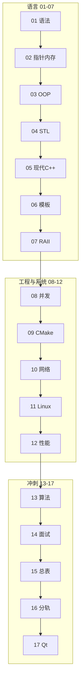

# C++ 学习路线图与说明

> **文件编码**：本文件夹内所有 `.md` 均为 **UTF-8**。C++ 源文件（`.cpp`/`.h`）建议 UTF-8；MSVC 项目可在「高级保存选项」中确认编码。
>
> **2026 默认主线**：**以 C++ 为核心**——本文件夹 **01～90**：01～08 + 37～50 语言（**Primer 厚度 1200～1700 行/章**）；**09～36 工程章已全部扩至 1100～1800 行**；51～68 大厂面试；69～90 原理深水区。

---

## ★ C++ 核心主线速查（默认路线）

```text
【Phase 0 Primer 语言 · 6～8 个月】
  01～08 基础教程（已扩至 1200+ 行/章）
  ∥ 穿插 37～50 语言深度（表达式/函数/string/继承/STL/链接/IO）
  → 50 章 Primer 综合复习 + 模拟卷
【Phase 1 工程 · 2 个月】  09 CMake + 数据结构刷题
【Phase 2 系统 · 3 个月】  10～14 + Linux + 计网
【Phase 3 高性能 · 3 个月】18～23
【Phase 4 进阶 · 3 个月】  24～32
【Phase 5 面试 · 2 个月】  33～36 + 14/50 二刷
【Phase 5b 大厂补全 · 3 个月】51～68（DB→排查→分布式→K8s→io_uring→面经总复习）
【Phase 5c 原理深水区 · 持续】69～90（编译/体系/OS/汇编/算法/设计模式/UB/ABI/元编程/开源/调试）
【Phase 6 项目】           35 KV + mini-http + 58/61 压测与排障 STAR
【Phase 7 扩展（选）】     LLMInfra
```

| 核心必学 | 说明 |
|----------|------|
| **01～08 + 37～50** | **Primer Plus 级语言**（1200～1700 行/章） |
| **09～36 工程** | **已全部扩至 1100～1800 行**（CMake/网络/Linux/调试/对齐/gRPC/epoll/无锁/Asio/gtest/协程） |
| **51～68** | **大厂面试全集**（含分布式/抓包/排查/K8s/幂等/io_uring） |
| **69～90** | **原理深水区**（编译/体系/OS/汇编/算法/设计模式/UB/ABI/元编程/开源/调试/总索引） |
| 数据结构 + Linux | 配套 |

---

## 0. 读前导读（零基础也能跟上）

### 0.1 用一句话弄懂本文件夹

**C++ 路线** = **C++ Primer Plus 级系统教程** + 工程/面试：每章含术语三件套、逐行读代码、分级练习与答案。01～08 已扩至 **1200～1600 行**；37～50 补全书级深度（表达式、函数、string、继承、STL 原理、链接、IO、200 条易错点）。

| 目标岗 | 本系列重点 |
|--------|------------|
| **C++ 后端 / 基建** | 01～50 语言 + 10～23 + 35 |
| **游戏 / 引擎** | 01～50 + 17 + 29 |
| **算法（C++ 手撕）** | 01～50 + 13、34 + 数据结构 11 |
| **大模型 Infra（扩展）** | 01～50 + 18～23 + LLMInfra |

### 0.1.1 Primer Plus 穿插阅读表（与 01～08 同步）

| 顺序 | 主章 | 穿插深度章 |
|------|------|------------|
| 1 | [01 基础语法](01-C++基础语法与数据类型.md) | [37 表达式](37-表达式求值与类型转换大全.md) |
| 2 | [02 指针](02-指针引用与内存管理.md) | [38 函数](38-函数机制完全指南.md) |
| 3 | [03 OOP](03-面向对象与类设计.md) | [40](40-复合类型结构体与enum.md) [41](41-构造析构与三五法则大全.md) [42](42-友元与运算符重载完全指南.md) [43](43-继承与多态模型完全指南.md) |
| 4 | [04 STL](04-STL标准库容器与算法.md) | [39 string](39-std-string与字符处理完全指南.md) [44～46](44-vector-deque-string容器原理与实务.md) |
| 5 | [05 现代 C++](05-现代C++新特性.md) | [47 lambda](47-可调用对象lambda与std-function.md) |
| 6 | [06 模板](06-模板与泛型编程.md) | 二刷 42/43 |
| 7 | [07 RAII](07-异常处理与RAII.md) | [48 编译链接](48-编译预处理与链接原理.md) |
| 8 | [08 并发](08-多线程与并发编程.md) | [49 IO 流](49-IO流与文件操作完全指南.md) |
| 9 | 语言总复习 | **[50 综合复习](50-Primer级综合复习与语言核心总表.md)** |

### 0.2 你需要提前知道什么

| 背景 | 建议 |
|------|------|
| 完全零基础 | 先会复制粘贴、装编译器；01 章从 Hello World 开始 |
| 学过 Java / Python | 对照 [Java 00](../Java/00-学习路线图与说明.md) / [Python 00](../Python/00-学习路线图与说明.md)，03 章 OOP、08 章并发与 [Java 03](../Java/03-Java并发编程与JVM.md) 互参 |
| 刷算法 / ACM | 01～04 后接 [数据结构](../数据结构/README.md) + 13 章 |
| **LLM Infra / 大模型底层** | **01～23 全走** → [LLMInfra 00](../LLMInfra/00-学习路线图与说明.md) |
| 只做 Web 业务 | 备选 [Java](../Java/00-学习路线图与说明.md)，非本主线 |

### 0.3 本章知识地图（路线图本身 ☑）

- [ ] 说清 C++ 路线与 Java/Python 路线的分工
- [ ] 按 01→08 顺序列出各章一句话目标
- [ ] 在本机跑通 `env_check.cpp`（§9.3）
- [ ] 记住三条贯穿类比：**指针=门牌号**、**RAII=自动关门**、**STL=标准工具箱**
- [ ] 完成 §13 闭卷自测 ≥8/10

### 0.4 建议学习时长与节奏

- **00 章（本文件）**：半天通读 + 装环境验证
- **01～08 + 37～50 语言轨**：约 **6～8 个月**（每天 2～3 小时，**必须敲每一节例题**）
- **01～03 语言入门**：约 4～5 周（含 37、38、40～43 穿插）
- **04～08 + 39、44～49**：约 8～10 周
- **50 章模拟卷**：1 周

### 0.5 学完 01～08 你能做什么（可验证）

- 独立编译多文件 C++17 程序（01、09 预习）
- 用调试器解释栈/堆与**门牌号（指针）**（02）
- 写含继承多态的类层次（03）
- 日常用 **标准工具箱（STL）** `vector`/`map`/`algorithm`（04）
- 默认 `unique_ptr`、理解 `move`（05）
- 写简单模板与 RAII 包装类（06～07，**自动关门**）
- 写带 mutex 的多线程 demo，并对照 Java 03 说清 happens-before（08）

### 0.6 三条贯穿类比（全路线统一用语）

| 类比 | 对应概念 | 首次深入章节 |
|------|----------|--------------|
| **门牌号** | 指针存地址、引用是别名 | [02 章](02-指针引用与内存管理.md) |
| **自动关门** | RAII：构造获取、析构释放 | [07 章](07-异常处理与RAII.md) |
| **标准工具箱** | STL 容器与算法，少造轮子 | [04 章](04-STL标准库容器与算法.md) |

### 0.7 与数据结构 / Java 03 的衔接

```text
C++ 01 类型与循环     ↔  数据结构 01 复杂度（可并行）
C++ 02 指针与堆       ↔  数据结构 03 链表（节点=门牌号链）
C++ 04 vector/map     ↔  数据结构 02 数组、05 哈希
C++ 08 thread/mutex   ↔  Java 03 synchronized / JMM（概念对照）
C++ 13 算法模板       ↔  数据结构 11 LeetCode 路线
```

详见 [数据结构 00 路线图](../数据结构/README.md) 与 [Java 03 并发](../Java/03-Java并发编程与JVM.md)。

---

## 1. 这套资料适合谁

- 想系统学习 **C++** 的大学生、竞赛选手或转行开发者
- 目标方向：**系统软件、高性能服务、游戏引擎、嵌入式、基础架构、算法面试、Qt 桌面/工业软件**
- 已学 [Java](../Java/00-学习路线图与说明.md) / [Python](../Python/00-学习路线图与说明.md) 之一，想补「内存、性能、底层」的同学
- **ACM / 竞赛背景**：01 语法可加速，但 **02 指针、05 现代 C++、08 并发** 仍须按工程标准重学（见 [数据结构 00 §0.9 ACM 说明](../数据结构/README.md)）

**不适合**：

- 只想快速做 Web CRUD 业务后端（请优先 Java / Python 路线）
- 已精通 Modern C++ 并多年大型 C++ 项目经验（可直接看 13～17 查漏）

> **2026 路线优化**：01～15 为 **全员内功**；[16 必学技术栈与分轨](16-必学技术栈分轨与扩展专题.md) 列出 Qt/Boost/gtest 等 **必学与分轨选学**；[17 Qt 入门](17-Qt入门与信号槽.md) 服务 **桌面/工业分轨**。

### 与 Java / Python 路线的关系

| 维度 | Java / Python 路线 | **C++ 路线（本文件夹）** |
|------|-------------------|-------------------------|
| 主战场 | Web 接口、业务系统 | 语言功底、系统性能、底层 |
| 内存 | GC / 解释器管理 | **手动 + RAII + 智能指针** |
| 并发 | 线程池 / asyncio | **std::thread、mutex、原子** |
| 工程 | Maven / pip / Spring / FastAPI | **CMake、头文件、编译链接** |
| 数据库 | 主线含 MySQL/Redis | 网络/系统章提及，**非主线** |
| 就业 | 互联网业务后端为主 | 游戏、音视频、量化、OS、嵌入式、基建 |

三条路线**互补**：业务 Web 选 Java 或 Python；要懂「程序在机器上怎么跑」、刷算法手撕、面游戏/系统岗，**加 C++ 或以其为主**。

---

## 2. 技术栈主线（本资料默认路线）

```text
C++ 基础语法与类型
  → 指针、引用、内存模型
  → 面向对象（类、继承、多态）
  → STL 容器与算法
  → 现代 C++（智能指针、移动语义、lambda）
  → 模板与泛型
  → 异常、RAII、资源管理
  → 多线程与并发
  → CMake 与工程化
  → 网络编程与简易 HTTP 服务
  → Linux 与系统编程入门
  → 性能分析与调试
  → 项目实战 + 算法 + 面试
```

与 [计算机网络 01～04](../../前端学习/计算机网络/01-网络分层与通信基础.md) 的关系：10 章 socket/HTTP 会用到 TCP/IP 概念；计网系列偏原理与面试，C++ 10 章偏**代码实现**。

---

## 3. 学习顺序（按编号）

```text
00 学习路线图（你现在在这里）
 ↓
01 C++ 基础语法与数据类型
 ↓
02 指针、引用与内存管理
 ↓
03 面向对象与类设计
 ↓
04 STL 标准库容器与算法
 ↓
05 现代 C++ 新特性
 ↓
06 模板与泛型编程
 ↓
07 异常处理与 RAII
 ↓
08 多线程与并发编程
 ↓
09 CMake 与项目工程化
 ↓
10 网络编程与简易 HTTP 服务
 ↓
11 Linux 与系统编程入门
 ↓
12 性能分析与调试
 ↓
13 算法与数据结构（C++ 实现）
 ↓
14 高频面试专题与场景题
 ↓
15 补充知识点总表（复习索引）
 ↓
16 必学技术栈、分轨路线与扩展专题（Qt/Boost/gtest 全景）
 ↓
17 Qt 入门与信号槽（桌面分轨；**LLM Infra 跳过**）
 ↓
18 高性能 C++ 与内存对齐（**Infra 必学**）
 ↓
19 gRPC 与 Protobuf 工程化（**Infra 必学**）
 ↓
20 pybind11 与 Python 绑定入门（**Infra 必学**）
 ↓
21 设计模式与 Infra 工程实践
 ↓
22 计算机体系结构导读（**Infra 必学**）
 ↓
23 IO 多路复用与高性能 Server
 ↓
24 内存分配器与对象池
 ↓
25 无锁编程与内存序
 ↓
26 Boost.Asio 异步网络编程
 ↓
27 Google Test 与单元测试工程
 ↓
28 手写 STL 容器面试专题
 ↓
29 对象模型与虚函数表深入
 ↓
30 C++20/23 新特性深潜
 ↓
31 协程 C++20 coroutine
 ↓
32 fmt/spdlog 与可观测性工程
 ↓
33 C++ Infra 面试八股总表
 ↓
34 手撕代码 TOP50 与白板专题
 ↓
35 项目实战：高性能 KV-Store
 ↓
36 面试 STAR 表达与简历手册
 ↓
37 表达式求值与类型转换大全          ┐
38 函数机制完全指南                    │
39 std::string 与字符处理完全指南      │ Primer Plus 级
40 复合类型：结构体与 enum             │ 语言深度（01～08 穿插）
41 构造、析构与三五法则大全            │
42 友元与运算符重载完全指南            │
43 继承与多态模型完全指南              │
44 vector/deque/string 容器原理        │
45 关联容器与哈希容器完全指南          │
46 迭代器分类与算法库完全指南          │
47 可调用对象、lambda 与 std::function │
48 编译、预处理与链接原理              │
49 IO 流与文件操作完全指南             │
50 Primer 级综合复习与语言核心总表  ───┘
 ↓
51 MySQL 原理与索引事务面试专章
 ↓
52 Redis 数据结构与缓存面试专章
 ↓
53 操作系统面试八股与口述模板
 ↓
54 计算机网络 TCP 与 HTTP 面试深度专章
 ↓
55 大厂 C++ 笔试选择题与代码输出陷阱题集
 ↓
56 系统设计案例库 RPC/KV 与限流秒杀
 ↓
57 消息队列 Kafka 与中间件面试专题
 ↓
58 模拟面试完整流程与压测数据模板
 ↓
59 分布式理论 CAP/Raft 与共识算法面试
 ↓
60 抓包与网络排障 Wireshark 实战
 ↓
61 线上故障排查与性能诊断实战
 ↓
62 Docker 与 Kubernetes 入门面试
 ↓
63 JWT 认证与接口幂等性实战
 ↓
64 定时器与时间轮延时队列设计
 ↓
65 io_uring 与高性能 IO 选型面试
 ↓
66 大厂面经按公司分类精讲
 ↓
67 日志采集与高吞吐写入系统设计
 ↓
68 大厂面试总索引与冲刺复习计划
 ↓
69 编译原理入门与 C++ 编译流程
 ↓
70 计算机体系结构深入学习
 ↓
71 操作系统原理深入学习
 ↓
72 链接器加载器与可执行文件格式
 ↓
73 汇编语言入门与 C++ 对应
 ↓
74 性能工程方法论与基准测试
 ↓
75 算法设计思想 DP/贪心/回溯/分治
 ↓
76 高级数据结构 C++ 实现
 ↓
77 设计模式 C++ 完整 23 种实现
 ↓
78 并发算法与并发数据结构
 ↓
79 C++ 元编程与编译期计算深入
 ↓
80 数值计算与科学计算 C++ 入门
 ↓
81 未定义行为 UB 与语言陷阱大全
 ↓
82 ABI 与二进制兼容性
 ↓
83 C++ 错误处理哲学与方案抉择
 ↓
84 C++ 内存模型与原子操作深入
 ↓
85 现代 C++ 惯用法 idiom 集
 ↓
86 C++20-26 标准库组件全景
 ↓
87 开源项目阅读与贡献指南
 ↓
88 代码质量重构与代码审查
 ↓
89 调试技术大全与 CoreDump 分析
 ↓
90 学习路线总索引与知识地图
 ↓
（扩展）[LLMInfra 01～20](../LLMInfra/00-学习路线图与说明.md)
```

### 阶段目标

| 阶段 | 文档 | 目标 |
|------|------|------|
| 语言 | 01~03 | 能写 C++，懂类型、指针、OOP |
| 标准库 | 04~05 | 会用 vector/map，懂智能指针与移动 |
| 进阶语言 | 06~07 | 模板、异常、RAII |
| 并发与工程 | 08~09 | 线程安全、CMake 多文件项目 |
| 系统 | 10~12 | socket、Linux 基础、perf/调试 |
| 冲刺 | 13~15 | 刷题、面试、知识地图 |
| **分轨** | **16~17** | **Qt 桌面等；Infra 跳过 17** |
| **Infra 扩展** | **18~23** | **对齐/gRPC/pybind/体系结构/epoll** |
| **进阶工程** | **24~32** | **分配器/无锁/Asio/gtest/协程/日志** |
| **面试冲刺** | **33~36** | **八股总表/TOP50/KV项目/STAR** |
| **LLM 扩展（选）** | **LLMInfra** | **CUDA/推理/量化/调度** |

---

## 3.1 各章衔接索引

| 编号 | 上一章产出 | 本章解决什么 |
|------|------------|--------------|
| 01 | 00 路线图 | 第一个 C++ 程序，基本类型与流程控制 |
| 02 | 01 能写基础代码 | 指针/引用、栈堆、内存泄漏入门 |
| 03 | 02 懂内存 | 类、构造/析构、继承、多态 |
| 04 | 03 OOP | vector、map、算法库，日常开发主力 |
| 05 | 04 STL | unique_ptr、move、auto、lambda |
| 06 | 05 现代语法 | 函数模板、类模板、SFINAE 入门 |
| 07 | 06 模板 | try/catch、RAII、资源安全 |
| 08 | 07 RAII | thread、mutex、atomic、死锁 |
| 09 | 08 并发 demo | CMake 组织多文件、链接第三方库 |
| 10 | 09 工程能编译 | TCP socket、简易 HTTP 响应 |
| 11 | 10 网络 | 文件 IO、进程、信号入门 |
| 12 | 11 系统 | gprof、Valgrind、编译优化入门 |
| 13 | 12 能调性能 | LeetCode 风格题 + STL 手撕 |
| 14 | 13 算法 | 内存/虚函数/STL/并发面试题 |
| 15 | 01～14 过完 | 复习索引 |
| 16 | 15 复习完 | 必学扩展栈、Qt/Boost、五条职业分轨 |
| 17 | 16 选定桌面分轨 C | Qt6 窗口、信号槽、CMake 集成 |

---

## 3.2 demo 项目演进（09～12 共用）

```text
09 章  hello-cmake（多文件 + 静态库）
  ↓
10 章  mini-http（单线程 TCP echo → 返回 HTTP 200）
  ↓
11 章  + 日志写文件、简单配置读取
  ↓
12 章  压测、修复内存泄漏、优化热点
  ↓
13～14  算法/面试与项目结合讲解
```

各章「手把手」入口：01-3.1、09-2.1、10-3.1、12-2.1。

---

## 3.3 资料加强进度

| 编号 | 文件名 | 加强状态 | 重点增补 |
|------|--------|----------|----------|
| 00 | 学习路线图与说明 | ✅ §0+闭卷+费曼 | 三条类比、数据结构/Java03 衔接 |
| 01 | 基础语法与数据类型 | ✅ §0+闭卷+费曼 | 多文件编译、enum class、游戏/交易案例 |
| 02 | 指针引用与内存管理 | ✅ §0+闭卷+费曼 | 门牌号类比、const 规则表、GDB/VS 调试 |
| 03 | 面向对象与类设计 | ✅ §0+闭卷+费曼 | 切片、Rule of Three 预告、完整 OOP 练习 |
| 04 | STL 容器与算法 | ✅ §0+闭卷+费曼 | 标准工具箱类比、迭代器五分类、复杂度表 |
| 05 | 现代 C++ 新特性 | ✅ §0+闭卷+费曼 | Rule of Zero/Five/Six、智能指针 |
| 06 | 模板与泛型编程 | ✅ §0+闭卷+费曼 | SFINAE、Concepts 预览 |
| 07 | 异常与 RAII | ✅ §0+闭卷+费曼 | 自动关门类比、异常安全四级 |
| 08 | 多线程与并发 | ✅ §0+闭卷+费曼 | 线程池、Java 03 深度对照 |
| 09 | CMake 与工程化 | ✅ 已加强 | FetchContent、mini-http CMake |
| 10 | 网络编程与 HTTP | ✅ 已加强 | mini-http 全源码、HTTP 解析 |
| 11 | Linux 与系统编程 | ✅ 已加强 | WSL2、信号优雅退出 |
| 12 | 性能分析与调试 | ✅ 已加强 | wrk、ASan/TSan、火焰图 |
| 13 | 算法与数据结构 | ✅ 已加强 | LRU/堆/并查集模板 |
| 14 | 面试专题 | ✅ 已加强 | Q1～Q47、STAR 场景 |
| 15 | 补充知识点总表 | ✅ 已加强 | 加强进度列、一周复习 |
| 16 | 必学技术栈与分轨 | ✅ 已建立 | Qt/Boost/P1 工程栈、五条分轨、16 周表 |
| 17 | Qt 入门与信号槽 | ✅ 已建立 | 桌面 UI |
| 18 | 高性能 C++ 与内存对齐 | ✅ 已建立 | false sharing、零拷贝 |
| 19 | gRPC 与 Protobuf | ✅ 已建立 | Serving RPC |
| 20 | pybind11 绑定 | ✅ 已建立 | Python 调 C++ |
| 21 | 设计模式 Infra | ✅ 已建立 | 对象池、无锁入门 |
| 22 | 计算机体系结构 | ✅ 已建立 | Cache/NUMA/GPU |
| 23 | IO 多路复用 | ✅ 已建立 | epoll/io_uring |

**可编译示例**：[examples/](examples/README.md)（hello-cmake、mini-http、algorithm-templates）

---

## 4. 必备环境与工具

### 4.1 编译器与标准

- 推荐 **C++17**（本资料默认）；部分示例用到 C++20
- Windows 三选一（任选其一即可）：

| 方案 | 说明 |
|------|------|
| **Visual Studio 2022** | 装「使用 C++ 的桌面开发」，MSVC，新手友好 |
| **MSYS2 + g++** | `pacman -S mingw-w64-ucrt-x86_64-gcc cmake` |
| **WSL2 + g++** | 与 Linux 环境一致，11 章更顺 |

验证（g++）：

```powershell
g++ --version
# 预期：g++ (Rev...) 13.x 或更高

g++ -std=c++17 -o hello hello.cpp
./hello
# 或 Windows: .\hello.exe
```

验证（MSVC，Developer Command Prompt）：

```powershell
cl /EHsc /std:c++17 hello.cpp
hello.exe
```

### 4.2 IDE / 编辑器

- **Visual Studio** / **VS Code + C/C++ 扩展** / **CLion**（Community 可试用）
- 必会：编译运行、断点调试、看调用栈、看变量内存地址

### 4.3 构建工具

- **CMake** 3.16+（09 章主线）
- 09 章前可用单文件 `g++ main.cpp -o app` 编译

### 4.4 调试与分析（12 章）

| 工具 | 平台 | 用途 |
|------|------|------|
| GDB / VS 调试器 | 全平台 | 断点、单步 |
| Valgrind | Linux/WSL | 内存泄漏 |
| perf / VTune | Linux / VS | 热点分析 |

### 4.5 Git

与 [Git 系列](../../前端学习/Git/00-学习路线图与说明.md) 相同：项目从 09 章起 `git init`，CMake 项目纳入版本管理。

---

## 5. 推荐学习四步法

1. **通读**：本章解决什么问题？和上一章什么关系？
2. **敲代码**：每个示例完整编译运行，不要只读
3. **做练习**：至少完成基础档，挑战档选做
4. **复述**：合上书，讲指针/虚函数/STL 区别

---

## 5.1 分级练习总表

| 章节 | 基础 | 进阶 | 挑战 | 答案位置 |
|------|------|------|------|----------|
| 01 | 计算器 | 成绩判断 | 简单菜单 | 01 篇 §参考答案 |
| 02 | 数组指针遍历 | 动态数组 | 字符串拷贝 | 02 篇 §参考答案 |
| 03 | Rectangle 类 | 继承 Shape | 多态计算器 | 03 篇 §参考答案 |
| 04 | vector 统计 | map 词频 | 排序去重 | 04 篇 §参考答案 |
| 08 | 线程打印 | 线程安全队列 | 生产者消费者 | 08 篇 §参考答案 |
| 09 | 多文件 CMake | 链接静态库 | FetchContent | 09 篇 §参考答案 |
| 10 | TCP echo | HTTP 200 | 多客户端 select | 10 篇 §参考答案 |
| 13 | 数组 Easy | 链表 Medium | 二叉树 | 13 篇题单 |

---

## 6. 学习时间参考（每天 2～3 小时）

| 文档 | 建议天数 | 说明 |
|------|----------|------|
| 01 | 5~7 天 | 语法比 Python 啰嗦，多敲 |
| 02 | 7~10 天 | **难点**，慢下来 |
| 03 | 5~7 天 | 对照 Java OOP |
| 04 | 5~7 天 | STL 每日写 |
| 05~07 | 各 4~6 天 | 现代 C++ + 模板 |
| 08 | 5~7 天 | 死锁、竞态多实验 |
| 09~10 | 各 5~7 天 | 工程 + 网络 |
| 11~12 | 各 4~6 天 | 建议 WSL/Linux |
| 13~14 | 持续 | 面试前反复 |

**全程约 4~6 个月**（含 mini-http 项目）。02、08 是两大坎。

---

## 7. 练手项目建议

### 方案 A：mini-http（推荐，10～12 章）

- TCP 监听、解析 GET、返回 JSON/HTML
- 多线程或 thread pool 版（08 章延伸）
- CMake 构建 + README

### 方案 B：命令行 TODO 管理器

- vector 存任务、文件持久化
- 练 STL + 文件 IO + 类设计

### 方案 C：LeetCode 题集 + 模板库

- 13 章：手写链表、树、堆、并查集模板
- 面试直接复用

---

## 8. 学完后你应该能做哪些事

- [ ] 独立用 CMake 构建多文件 C++17 项目
- [ ] 解释栈/堆、指针与引用、虚函数表（概念级）
- [ ] 熟练使用 vector、map、string 与常用算法
- [ ] 用 unique_ptr/shared_ptr 管理资源，避免明显泄漏
- [ ] 写线程安全队列或简单线程池
- [ ] 实现简易 TCP/HTTP 服务端
- [ ] 用 STL 手撕中等难度算法题
- [ ] 回答 C++ 内存、虚函数、移动语义、mutex 面试题

---

## 9. 常见问题 FAQ

### Q1：C++ 和 Java/Python 必须都学吗？

不必须。**Web 业务后端**选 Java 或 Python；**系统/游戏/算法/性能**加 C++。时间有限可「Python/Java + C++ 基础（01～05）」。

### Q2：学 C++11 还是 C++17/20？

本路线以 **C++17** 为主，05 章介绍 11/14/17/20 关键特性。面试以 11 之后语义为准。

### Q3：Windows 还是 Linux？

01～09 Windows 足够。10～12 **建议 WSL2 或 Linux 虚拟机**，与生产环境一致。

### Q4：指针章太痛苦怎么办？

正常。02 章可拆成两周：先指针算术 + 堆分配，再引用 + const。配合调试器看地址。

### Q5：和「后端学习」其他路线怎么配合？

- 计网 01～04：理解 socket/HTTP
- Java 03 / Python 03：并发概念互参
- 不做 Spring/FastAPI 式联调；mini-http 可与浏览器/ curl 测

### Q6：01～03 章大概要多久？能跳过吗？

**不建议跳过**。01 约 5～7 天、02 约 7～10 天、03 约 5～7 天。02 是整条路线最大瓶颈；若赶时间，01 可压缩到 3 天（只练编译 + 类型 + 循环），但 02 至少留 **10 小时有效编码**。

### Q7：学完 01～03 能找 C++ 工作吗？

能写语法和 OOP，但离工程岗还差 STL（04）、现代 C++（05）、并发（08）、CMake（09）。01～03 对应「语言入门 + 内存模型 + 类设计」——面试必问，不等于能独立交付项目。

### Q8：MSYS2 和 Visual Studio 选哪个？

| 场景 | 推荐 |
|------|------|
| 纯 Windows、喜欢图形界面调试 | **Visual Studio 2022** |
| 想与 Linux 命令一致、11 章 WSL 过渡 | **MSYS2 g++** 或 **WSL2** |
| 学校 OJ / LeetCode 本地 g++ | MSYS2 或 WSL |

两条工具链**都练**：01 章 hello 用 g++ 跑通一遍，再用 VS 建空项目跑一遍，避免只会一种环境。

---

## 9.1 深入：01～03 章在真实项目里对应什么

### 游戏引擎（Unreal / 自研）

| 章节 | 落地场景 |
|------|----------|
| 01 类型与循环 | 帧循环、组件 tick、配置表解析 |
| 02 指针/内存 | `AActor*`、资源句柄、GPU 上传缓冲区的堆分配 |
| 03 OOP/多态 | `UObject` 继承树、虚函数调度渲染/物理子系统 |

引擎岗面试常问：栈上局部变量生命周期、为什么基类析构要 `virtual`、浅拷贝导致双重释放——全部来自 02～03。

### 交易系统 / 量化

| 章节 | 落地场景 |
|------|----------|
| 01 `long long`、溢出 | 订单 ID、纳秒时间戳、成交量累加 |
| 02 连续内存 | Order Book 价格档位数组、环形缓冲区 |
| 03 封装 | `Order` / `Trade` 领域类，策略接口多态 |

低延迟路径会避免多余堆分配（02 章栈 vs 堆直觉），05 章 `move` 后会更清晰。

### 与 Java / Python 路线并行时怎么排课

```text
Week 1-2   C++ 01 + 对照 Java 01 变量/流程控制
Week 3-4   C++ 02（慢）+ Java 02 集合（穿插换脑）
Week 5     C++ 03 + 重读 Java 01 OOP 继承多态小节
Week 6+    C++ 04 STL，Java 03 并发概念互参
```

---

## 9.2 深入：Java vs C++ 学习心智对照

| 你在 Java 里习惯的 | 到 C++ 要改的习惯 |
|-------------------|------------------|
| `new` 后不用管释放 | 配对 `delete` 或 05 章 `unique_ptr` |
| 对象参数「自动引用」 | 大对象用 `const T&`，要改调用方用 `T&` |
| `ArrayList` 随处可用 | 04 章前先用数组 + 02 章动态分配练手 |
| 异常成本低 | 07 章前少依赖异常做流程控制 |
| `interface` 关键字 | 纯虚类 `class IService { virtual void f() = 0; };` |
| 单文件 `main` 在类里 | 全局 `int main()`，类不必包裹入口 |

详见 [Java 01](../Java/01-Java基础语法与面向对象.md) 与 [Python 01](../Python/01-Python基础语法与面向对象.md) 的 OOP 章节，03 章会逐条对照。

---

## 9.3 手把手：验证 01～03 学习环境（完整输出）

在空目录创建 `env_check.cpp`：

```cpp
#include <iostream>

int main() {
    std::cout << "C++17 OK\n";
    std::cout << "sizeof(void*)=" << sizeof(void*) << '\n';
    return 0;
}
```

**g++（MSYS2 / WSL）**：

```powershell
g++ --version
# 预期首行含 g++ (GCC) 13.x 或 12.x

g++ -std=c++17 -Wall -Wextra -o env_check env_check.cpp
./env_check
# 预期输出：
# C++17 OK
# sizeof(void*)=8
```

**MSVC（Developer Command Prompt）**：

```powershell
cl /EHsc /std:c++17 /W4 /utf-8 env_check.cpp
env_check.exe
# 预期输出：
# C++17 OK
# sizeof(void*)=8
```

若 `sizeof(void*)=4`，说明用了 32 位工具链——建议换 64 位 MinGW 或 x64 Native Tools Command Prompt。

---

## 9.4 01～03 章通关检查清单

完成下列项再进入 04 章：

- [ ] 01：独立编译多文件 `g++ main.cpp util.cpp -o app`
- [ ] 01：解释 `int` 溢出与 `2.0` 避免整数除法
- [ ] 02：不看资料写出 `new[]` / `delete[]` 配对示例
- [ ] 02：调试器里读出栈变量与 `new` 返回地址
- [ ] 02：口述悬空指针、泄漏、双重释放各一种成因
- [ ] 03：实现 `Shape` + 两种派生类 + `vector<unique_ptr<Shape>>`
- [ ] 03：解释 object slicing 与 virtual 析构

---

## 10. 文档索引速查

| 编号 | 文件名 | 一句话 |
|------|--------|--------|
| 00 | 学习路线图与说明 | 顺序、环境、定位 |
| 01 | 基础语法与数据类型 | 入门 |
| 02 | 指针引用与内存管理 | 核心难点 |
| 03 | 面向对象与类设计 | OOP |
| 04 | STL 容器与算法 | 日常开发 |
| 05 | 现代 C++ 新特性 | 智能指针/move |
| 06 | 模板与泛型编程 | 泛型 |
| 07 | 异常与 RAII | 资源安全 |
| 08 | 多线程与并发 | 并行 |
| 09 | CMake 与工程化 | 构建 |
| 10 | 网络编程与 HTTP | socket |
| 11 | Linux 与系统编程 | 系统调用 |
| 12 | 性能分析与调试 | 优化 |
| 13 | 算法与数据结构 | 刷题 |
| 14 | 面试专题 | 巩固 |
| 15 | 补充知识点总表 | 索引 |
| 16 | 必学技术栈与分轨 | Qt/Boost/gtest、五条分轨 |
| 17 | Qt 入门与信号槽 | 桌面 UI |
| 18 | 高性能 C++ 与内存对齐 | Infra 必学 |
| 19 | gRPC 与 Protobuf | Infra 必学 |
| 20 | pybind11 绑定 | Infra 必学 |
| 21 | 设计模式 Infra | 工程 |
| 22 | 计算机体系结构 | Infra 必学 |
| 23 | IO 多路复用 | Server |
| — | [LLMInfra 00](../LLMInfra/00-学习路线图与说明.md) | CUDA/推理/量化 |

---

## 11. 学习路径总览



---

## 12. 我的笔记区

```text
学习开始日期：
当前进度（编号）：
薄弱点（如指针/模板/虚函数）：
练手项目选题：
下周计划：
```

---

## 13. 闭卷自测（路线图）

1. C++ 路线与 Java Web 路线的主战场差异是什么？
2. 01～08 章中哪两章是公认「大坎」？
3. **门牌号**类比对应什么？在哪一章系统学？
4. **自动关门**类比对应什么？与智能指针什么关系？
5. **标准工具箱**指什么？日常最常用哪三个容器？
6. 学 08 章并发时应对照哪份 Java 文档？
7. 刷 LeetCode 用 C++ 时，04 章与哪条数据结构路线衔接？
8. Windows 学 01～09 够吗？10～12 建议什么环境？
9. mini-http 项目从哪一章 CMake 开始、哪一章写 socket？
10. 01～03 通关检查清单（§9.4）里，为什么要求 `vector<unique_ptr<Shape>>`？

<details>
<summary>自测参考答案</summary>

1. C++ 偏语言功底、内存、性能、系统；Java Web 偏业务接口与框架生态。
2. **02 指针内存**、**08 多线程**（模板 06 对部分人也是坎）。
3. **指针/引用**；[02 章](02-指针引用与内存管理.md)。
4. **RAII**；05 章智能指针是 RAII 的现代化实现，07 章系统讲异常路径下的自动释放。
5. **STL**；`vector`、`string`、`unordered_map`（或 `map`）。
6. [Java 03 并发与 JVM](../Java/03-Java并发编程与JVM.md)。
7. [数据结构 02～06](../数据结构/README.md) + [C++ 13](13-算法与数据结构C++实现.md)。
8. 01～09 Windows 足够；10～12 建议 **WSL2 或 Linux**。
9. **09** CMake 组织工程；**10** socket/HTTP。
10. 多态需要基类指针/引用；`unique_ptr` 表达独占所有权且避免切片（03 章）。

</details>

---

## 14. 费曼检验

请用 **3 分钟**向没学过编程的朋友解释：「为什么后端学习里要单独开一条 C++ 路线？」

**提纲对照**：

1. **定位**：不是替代 Java 做业务 CRUD，而是补「程序在机器上怎么占内存、怎么跑快、怎么写系统组件」。
2. **三条类比**：找数据用**门牌号（指针）**；离开房间**自动关门（RAII）**；日常开发打开**标准工具箱（STL）**少造轮子。
3. **怎么学**：按编号 01→08 不跳章；并发看 C++ 08 时翻一眼 Java 03；刷题用 C++ 04 + 数据结构系列。

---

## 15. 跨系列学习排期示例（8 周入门 01～08）

| 周 | C++ | 并行可选 |
|----|-----|----------|
| 1 | 00 路线图 + 01 语法 | [数据结构 01 复杂度](../数据结构/01-复杂度与基础/README.md) |
| 2 | 01 收尾 + 02 指针入门 | Java 01 变量对照 |
| 3 | 02 指针深入（慢） | [数据结构 03 链表](../数据结构/02-线性结构/02-链表.md)（节点=门牌号） |
| 4 | 03 OOP | Java 01 OOP 小节重读 |
| 5 | 04 STL | [数据结构 02 数组](../数据结构/02-线性结构/01-数组.md) |
| 6 | 05 现代 C++ | [数据结构 05 哈希](../数据结构/03-哈希表/README.md) |
| 7 | 06 模板 + 07 RAII | — |
| 8 | 08 并发 | **[Java 03](../Java/03-Java并发编程与JVM.md) 精读对照** |

每周完成对应章 **闭卷自测 ≥7/10** 再进入下一章。

---

## 16. FAQ 补充（路线与系列衔接）

**Q：先学 C++ 还是先学 Java？**  
目标 Web 业务 → Java 主线 + C++ 01～05 选修；目标游戏/系统/算法 → C++ 主线，Java 03 并发作对照。

**Q：数据结构和 C++ 04 重复吗？**  
不重复：数据结构讲**算法与抽象**；C++ 04 讲 **STL API 与迭代器失效**。04 章学完写 LeetCode 更顺。

**Q：08 章必须等 Java 03 吗？**  
不必，但 **强烈建议对照**：mutex≈synchronized、条件变量≈wait/notify、atomic≈volatile/CAS 讨论。

**Q：三条类比会出现在面试吗？**  
口述内存模型时用「门牌号」；讲资源管理用「自动关门」；讲为何用 STL 用「标准工具箱」——帮助面试官快速理解你的思维模型。

---

## 17. 术语三件套速查（00～08 首次出现）

| 术语 | 定义 | 生活类比 | 章节 |
|------|------|----------|------|
| **Pointer 指针** | 存地址的变量 | **门牌号** | 02 |
| **Reference 引用** | 已有变量的别名 | 同一个人两个称呼 | 02 |
| **RAII** | 构造获取、析构释放 | **自动关门** | 07 |
| **STL** | 标准容器+算法库 | **标准工具箱** | 04 |
| **move 移动** | 转移资源所有权 | 搬家过户，非复印 | 05 |
| **template 模板** | 编译期泛型代码生成 | 按尺寸印不同图纸 | 06 |
| **mutex 互斥量** | 同时只允许一线程 | 厕所门锁 | 08 |
| **data race** | 无同步并发写 | 两人同时改同一账本 | 08 |

---

## 18. 手把手：第一次 clone 本仓库 C++ 示例

| 步骤 | 你的动作 | 预期看到什么 | 若不对 |
|------|----------|--------------|--------|
| 1 | `cd 后端学习/C++/examples/hello-cmake` | 见到 `CMakeLists.txt` | 路径用 Tab 补全 |
| 2 | `cmake -B build -DCMAKE_BUILD_TYPE=Debug` | `Build files have been written` | 未装 CMake → 09 章前可跳过 |
| 3 | `cmake --build build` | 生成 `build/hello` 或 `.exe` | MSVC 需指定生成器 |
| 4 | 运行可执行文件 | 打印计算结果 | 看 README 参数说明 |
| 5 | 对照 [examples/README](examples/README.md) | 理解 mini-http 位置 | 10 章再编译 HTTP |

---

## 19. 与 Java 03 / 数据结构：何时打开哪一份

| 你学到 | 同步打开 | 目的 |
|--------|----------|------|
| C++ 02 指针 | [数据结构 03 链表](../数据结构/02-线性结构/02-链表.md) | 节点=门牌号链 |
| C++ 04 vector/map | [数据结构 02、05](../数据结构/02-线性结构/01-数组.md) | 算法+API 双轨 |
| C++ 08 线程 | **[Java 03](../Java/03-Java并发编程与JVM.md)** | synchronized/JMM 对照 |
| C++ 13 刷题 | [数据结构 11 LeetCode 路线](../数据结构/09-综合复习/README.md) | 题型+ C++ 模板 |

**不必等 Java 03 才开始 C++ 08**，但 08 章 §14、§22 对照表建议在第二遍精读 Java 03 时填写笔记。

---

---

## 20. 必学清单速查（2026 · C++ 核心主线）

> 面试八股：**33 + 14**；手撕：**34 + 13 + 数据结构 11**；简历项目：**35 + examples/mini-http**。CUDA 扩展见 [LLMInfra 00](../LLMInfra/00-学习路线图与说明.md)。

### 20.1 C++ 语言与标准库 P0（01～09）

| 类别 | 章节 |
|------|------|
| 语法/OOP/指针 | 01～03 |
| STL + 现代 C++ | 04～05 |
| 模板/RAII | 06～07 |
| 并发 + CMake | 08～09 |

### 20.2 系统与网络 P0（10～14）

| 类别 | 章节 |
|------|------|
| socket/HTTP | 10 |
| Linux 系统调用 | 11 |
| perf/GDB | 12 |
| 算法手撕 | 13 + 数据结构 |
| **面试第一遍** | **14** |

### 20.3 高性能与工程 P0（18～23，跳过 17 Qt）

| 类别 | 章节 |
|------|------|
| 对齐/体系结构 | 18、22 |
| gRPC/Protobuf | 19 |
| pybind | 20 |
| 设计模式 | 21 |
| epoll Server | 23 |

### 20.4 进阶与面试 P0（24～58）

| 类别 | 章节 |
|------|------|
| 分配器/无锁 | 24～25 |
| Asio/测试 | 26～27 |
| 手写容器/对象模型 | 28～29 |
| C++20/协程/日志 | 30～32 |
| **C++ 八股/TOP50** | **33～34** |
| **KV 项目 + STAR** | **35～36** |
| **Primer 语言** | **37～50** |
| **大厂 MySQL/Redis** | **51～52** |
| **OS/计网口述** | **53～54** |
| **笔试陷阱题** | **55** |
| **系统设计/MQ** | **56～57** |
| **模拟面试+压测** | **58** |
| **分布式/Raft** | **59** |
| **抓包/线上排查** | **60～61** |
| **K8s/幂等** | **62～63** |
| **时间轮/io_uring** | **64～65** |
| **公司面经/日志/总复习** | **66～68** |
| **编译/体系/OS/汇编** | **69～73** |
| **性能/算法/数据结构** | **74～76** |
| **设计模式/并发/元编程** | **77～79** |
| **数值/UB/ABI/错误** | **80～83** |
| **内存模型/惯用法/标准库** | **84～86** |
| **开源/重构/调试/总索引** | **87～90** |

### 20.5 扩展轨（选学，Infra / 算法岗）

| 栈 | 章节 | 何时学 |
|----|------|--------|
| [LLMInfra](../LLMInfra/00-学习路线图与说明.md) | 01～20 | C++ 18～23 完成后 |
| [LLMPython](../LLMPython/00-学习路线图与说明.md) | 01～08、11 | 需懂 PyTorch 时 |
| Qt 桌面 | 17 | 桌面/工业岗 |

**不学（备选）**：Java 全栈 · Vue/React · FastAPI · AIAgent 主线

### 20.6 AIAgent **选读**：17 Transformer（与 29 虚函数对照阅读）

---

## 21. 六条职业分轨

| 分轨 | 说明 |
|------|------|
| **G C++ 核心（默认）** | **01～90** + 数据结构 + Linux |
| **F LLM Infra 扩展** | G 轨 + **LLMInfra 01～20**（可选 LLMPython 01～08） |
| A～E | 见 [16 章](16-必学技术栈分轨与扩展专题.md) |

---

## 22. 关联系列

| 系列 | 用法 |
|------|------|
| [数据结构](../数据结构/README.md) | **刷题 + 13/34 手撕** |
| [Linux](../Linux/README.md) | **11 章系统编程配套** |
| [LLMInfra](../LLMInfra/00-学习路线图与说明.md) | **扩展：CUDA/推理** |
| [LLMPython](../LLMPython/00-学习路线图与说明.md) | **扩展：PyTorch 速读** |
| [后端总览](../00-后端路线总览.md) | 全局图 |
| [AIAgent](../AIAgent/00-学习路线图与说明.md) | 备选应用层 |
| [Java](../Java/00-学习路线图与说明.md) | 备选 Web |
| [todo.md](../../todo.md) | 24 个月计划 |

---

## 23. 24 个月时间表（摘要）

| 月 | 内容 |
|----|------|
| 1～4 | C++ 01～09 + 数据结构 01～06 |
| 5～7 | C++ 10～14 + Linux 01～08 |
| 8～10 | C++ 18～23 |
| 11～13 | C++ 24～32 |
| 14～15 | **C++ 33～36 面试** + 数据结构 11 精刷 |
| 16～18 | **C++ 35 KV-Store 项目** + mini-http 加固 |
| 19～24 | 实习 / 二刷 33～34 / （选）LLMInfra |

完整周表见 [todo.md](../../todo.md)。

---

## 24. 简历项目（C++ 核心）

1. **mini-http**（10～12、23 章 + examples）— 性能优化 STAR  
2. **高性能 KV-Store**（**35 章**）— epoll + 线程池 + LRU + WAL + gtest  
3. **手写 LRU / 线程池 / 内存池**（28、34 章）— 白板能力证明  
4. **gRPC 微服务**（19 章）— Protobuf + 压测数据  
5. **（扩展）MiniInfer**（LLMInfra 19）— CUDA/推理岗加分  

---

## 25. FAQ

| 问 | 答 |
|----|-----|
| 必须 Java 吗？ | **否** |
| AIAgent 全刷吗？ | **否**；C++ 岗用 **33～36** |
| 没 GPU？ | C++ 核心 **不需要**；LLMInfra 用云 GPU |
| Qt？ | 桌面岗学 **17**；基建/Infra **跳过** |
| Python 要学吗？ | **非核心**；Infra 岗可速读 LLMPython 01～08 |

---

祝你学习顺利。**C++ 01～90** = Primer 语言 + 工程 + 大厂面试 + **原理深水区**（编译/体系/OS/汇编/算法/UB/ABI/元编程）。90 章为全系列知识地图总索引。
